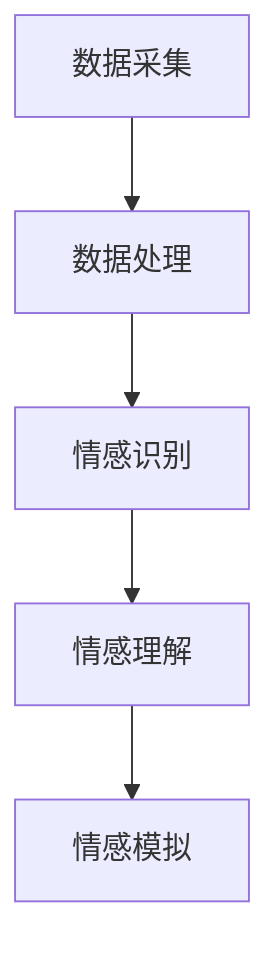

                 

# 人机情感融合对虚拟现实体验的提升

## 关键词

- 人机情感融合
- 虚拟现实
- 情感计算
- 用户体验
- 算法设计

## 摘要

本文探讨了人机情感融合对虚拟现实体验的提升。在虚拟现实技术日益发展的今天，用户对虚拟世界的情感互动需求日益增长。通过引入情感计算技术，实现人机情感融合，可以大大增强虚拟现实中的用户体验。本文首先介绍了人机情感融合的背景、定义及其重要性，然后深入分析了情感计算的基本原理、算法原理和数学模型，最后通过实际案例展示了人机情感融合在虚拟现实中的应用，并对未来发展趋势进行了展望。

## 目录大纲

### 第一部分: 人机情感融合概述

#### 第1章: 人机情感融合背景

##### 1.1.1 人机情感融合的问题背景

##### 1.1.2 人机情感融合的定义与边界

##### 1.1.3 人机情感融合的重要性

##### 1.1.4 人机情感融合的发展历程

#### 第2章: 人机情感融合的核心概念

##### 2.1.1 情感计算的基本原理

##### 2.1.2 情感计算的技术基础

##### 2.1.3 虚拟现实体验的情感需求分析

##### 2.1.4 人机情感融合的关键因素

#### 第3章: 人机情感融合的算法原理

##### 3.1.1 情感计算算法简介

##### 3.1.2 情感计算算法的分类

##### 3.1.3 情感计算算法的mermaid流程图

#### 第4章: 人机情感融合的数学模型

##### 4.1.1 情感计算的基本数学模型

##### 4.1.2 情感计算中的常见数学公式

##### 4.1.3 情感计算的数学模型示例

#### 第5章: 人机情感融合在虚拟现实中的应用

##### 5.1.1 虚拟现实体验的挑战与机遇

##### 5.1.2 人机情感融合在虚拟现实中的实现方法

##### 5.1.3 虚拟现实中的情感交互案例

#### 第6章: 虚拟现实人机情感融合的架构设计

##### 6.1.1 虚拟现实人机情感融合的系统需求分析

##### 6.1.2 虚拟现实人机情感融合的架构设计

##### 6.1.3 虚拟现实人机情感融合的接口设计与交互

#### 第7章: 人机情感融合虚拟现实项目实战

##### 7.1.1 环境安装与配置

##### 7.1.2 人机情感融合系统核心实现

##### 7.1.3 代码应用解读与分析

##### 7.1.4 项目总结与拓展

#### 第8章: 人机情感融合虚拟现实最佳实践与展望

##### 8.1.1 最佳实践技巧

##### 8.1.2 注意事项

##### 8.1.3 未来发展趋势与展望

## 第一部分: 人机情感融合概述

### 第1章: 人机情感融合背景

#### 1.1.1 人机情感融合的问题背景

随着虚拟现实（VR）技术的快速发展，虚拟现实体验已经成为人们关注的焦点。然而，当前的虚拟现实技术大多集中在视觉、听觉和触觉等感官体验的模拟，对于情感体验的模拟则相对较少。这导致了虚拟现实中的情感互动较为单一，难以满足用户对于情感互动的丰富性和深度的需求。

#### 1.1.2 人机情感融合的定义与边界

人机情感融合是指将人类的情感状态与计算机系统进行交互和融合，使计算机系统能够感知、理解和模拟人类的情感状态，从而提升虚拟现实中的用户体验。人机情感融合的边界主要包括情感识别、情感理解和情感模拟三个方面。

#### 1.1.3 人机情感融合的重要性

人机情感融合对于虚拟现实体验的提升具有重要意义。通过情感融合，可以增强虚拟现实中的情感互动，提高用户的沉浸感和满足感，从而提升用户体验。此外，人机情感融合还可以应用于心理健康、教育、娱乐等领域，为人们提供更加丰富和多样化的虚拟体验。

#### 1.1.4 人机情感融合的发展历程

人机情感融合的概念最早可以追溯到20世纪90年代，当时的研究主要集中在情感识别和模拟方面。随着人工智能和情感计算技术的不断发展，人机情感融合逐渐成为研究的热点。近年来，随着虚拟现实技术的崛起，人机情感融合的应用场景也日益丰富。

### 第2章: 人机情感融合的核心概念

#### 2.1.1 情感计算的基本原理

情感计算是指通过计算机技术和人工智能技术来模拟、识别和理解人类的情感状态。情感计算的基本原理包括情感识别、情感理解和情感模拟三个方面。

- 情感识别：通过分析用户的行为、语音、文字等数据，识别用户的情感状态。
- 情感理解：对用户的情感状态进行深入分析，理解其情感背后的含义和动机。
- 情感模拟：根据用户的情感状态，模拟相应的情感反应，提高用户的情感互动体验。

#### 2.1.2 情感计算的技术基础

情感计算的技术基础主要包括以下几个方面：

- 数据采集：通过传感器、摄像头、麦克风等设备，收集用户的行为、语音、文字等数据。
- 数据处理：对收集到的数据进行预处理、特征提取和情感分析等操作。
- 情感模型：构建情感模型，对用户的情感状态进行识别和模拟。

#### 2.1.3 虚拟现实体验的情感需求分析

虚拟现实体验中的情感需求主要包括以下几个方面：

- 沉浸感：通过模拟真实的情感体验，提高用户的沉浸感。
- 参与感：通过情感互动，增强用户在虚拟环境中的参与感。
- 情感表达：通过情感模拟，实现用户在虚拟环境中的情感表达。

#### 2.1.4 人机情感融合的关键因素

人机情感融合的关键因素主要包括以下几个方面：

- 情感识别准确性：准确识别用户的情感状态，为人机情感融合提供基础。
- 情感理解深度：深入理解用户的情感状态，实现更自然的情感互动。
- 情感模拟逼真度：逼真模拟用户的情感状态，提高虚拟现实体验的真实感。

### 第3章: 人机情感融合的算法原理

#### 3.1.1 情感计算算法简介

情感计算算法是情感计算的核心，主要包括情感识别算法、情感理解算法和情感模拟算法三个方面。

- 情感识别算法：通过对用户数据的分析，识别用户的情感状态。
- 情感理解算法：对用户的情感状态进行深入分析，理解其情感背后的含义和动机。
- 情感模拟算法：根据用户的情感状态，模拟相应的情感反应。

#### 3.1.2 情感计算算法的分类

根据算法的实现方式，情感计算算法可以分为以下几类：

- 基于规则的算法：通过预设规则进行情感识别和模拟。
- 基于统计的算法：通过统计方法进行情感识别和模拟。
- 基于机器学习的算法：通过机器学习方法进行情感识别和模拟。
- 基于神经网络的算法：通过神经网络模型进行情感识别和模拟。

#### 3.1.3 情感计算算法的mermaid流程图



### 第4章: 人机情感融合的数学模型

#### 4.1.1 情感计算的基本数学模型

情感计算的基本数学模型主要包括情感特征表示、情感识别模型和情感模拟模型三个方面。

- 情感特征表示：通过数学方法对情感特征进行表示和提取。
- 情感识别模型：通过机器学习或神经网络方法构建情感识别模型。
- 情感模拟模型：通过数学模型模拟用户的情感状态。

#### 4.1.2 情感计算中的常见数学公式

情感计算中的常见数学公式包括情感特征提取公式、情感识别模型公式和情感模拟模型公式等。

$$
特征提取：f(x) = \sum_{i=1}^{n} w_i * x_i
$$

$$
情感识别模型：P(Y|X) = \frac{e^{w^T x}}{\sum_{j=1}^{m} e^{v^T x}}
$$

$$
情感模拟模型：y = f(w^T x)
$$

#### 4.1.3 情感计算的数学模型示例

以情感识别模型为例，假设我们使用一个简单的线性模型进行情感识别，其数学模型如下：

$$
y = \text{sign}(w^T x + b)
$$

其中，$w$ 是权重向量，$x$ 是特征向量，$b$ 是偏置项，$y$ 是情感标签。

### 第5章: 人机情感融合在虚拟现实中的应用

#### 5.1.1 虚拟现实体验的挑战与机遇

虚拟现实体验在沉浸感、交互性和情感体验等方面具有巨大的潜力。然而，当前虚拟现实技术仍面临一些挑战，如：

- 沉浸感不足：虚拟现实中的感官体验尚未完全达到现实世界的水平。
- 交互性受限：虚拟现实中的交互方式较为单一，缺乏多样化的情感互动。
- 情感体验不足：虚拟现实中的情感模拟和识别技术尚不成熟，难以满足用户的情感需求。

同时，虚拟现实技术的发展也为人机情感融合带来了机遇，如：

- 感官融合：通过多感官刺激，实现更真实的情感体验。
- 情感互动：通过情感计算技术，实现更自然的情感交互。
- 情感引导：通过情感模拟技术，引导用户在虚拟环境中的情感状态。

#### 5.1.2 人机情感融合在虚拟现实中的实现方法

人机情感融合在虚拟现实中的实现方法主要包括以下几个方面：

- 情感识别：通过传感器、摄像头等设备，采集用户的情感数据，如心率、面部表情、语音等。
- 情感理解：对采集到的情感数据进行处理和分析，识别用户的情感状态。
- 情感模拟：根据用户的情感状态，生成相应的情感反应，并通过虚拟环境进行呈现。
- 情感交互：通过虚拟环境中的角色、场景等元素，实现用户与虚拟世界的情感互动。

#### 5.1.3 虚拟现实中的情感交互案例

以下是一个虚拟现实中的情感交互案例：

- 情感识别：用户通过佩戴心率传感器，实时采集心率数据。
- 情感理解：基于心率数据，分析用户的情绪状态，如兴奋、焦虑等。
- 情感模拟：根据用户的情绪状态，调整虚拟角色的心情和表情，实现情感互动。
- 情感交互：用户与虚拟角色进行对话，分享自己的情绪和感受。

### 第6章: 虚拟现实人机情感融合的架构设计

#### 6.1.1 虚拟现实人机情感融合的系统需求分析

虚拟现实人机情感融合的系统需求主要包括以下几个方面：

- 情感识别：能够准确识别用户的情感状态。
- 情感理解：能够深入理解用户的情感状态，实现情感交互。
- 情感模拟：能够根据用户的情感状态，生成相应的情感反应。
- 交互设计：能够设计出适合用户情感交互的虚拟环境和角色。

#### 6.1.2 虚拟现实人机情感融合的架构设计

虚拟现实人机情感融合的架构设计主要包括以下几个层次：

- 数据采集层：通过传感器、摄像头等设备，采集用户的情感数据。
- 数据处理层：对采集到的情感数据进行预处理、特征提取和情感分析等操作。
- 情感识别层：基于情感计算算法，识别用户的情感状态。
- 情感理解层：对用户的情感状态进行深入分析，理解其情感背后的含义和动机。
- 情感模拟层：根据用户的情感状态，生成相应的情感反应，并通过虚拟环境进行呈现。
- 情感交互层：设计出适合用户情感交互的虚拟环境和角色。

#### 6.1.3 虚拟现实人机情感融合的接口设计与交互

虚拟现实人机情感融合的接口设计主要包括以下几个方面：

- 情感数据接口：定义情感数据采集、处理和传输的接口规范。
- 情感识别接口：定义情感识别算法的接口规范，包括情感识别模型的加载、预测和更新等操作。
- 情感理解接口：定义情感理解算法的接口规范，包括情感理解模型的加载、预测和更新等操作。
- 情感模拟接口：定义情感模拟算法的接口规范，包括情感模拟模型的加载、预测和更新等操作。
- 情感交互接口：定义情感交互的接口规范，包括虚拟角色和用户之间的情感交互操作。

### 第7章: 人机情感融合虚拟现实项目实战

#### 7.1.1 环境安装与配置

在进行人机情感融合虚拟现实项目实战之前，我们需要安装和配置相关环境。以下是一个简单的环境安装与配置步骤：

1. 安装虚拟现实开发工具，如Unity或Unreal Engine。
2. 安装Python和相关依赖库，如TensorFlow、PyTorch等。
3. 配置虚拟现实硬件，如VR头盔、传感器等。

#### 7.1.2 人机情感融合系统核心实现

人机情感融合系统的核心实现主要包括以下几个方面：

1. 数据采集与处理：通过传感器、摄像头等设备，采集用户的情感数据，并进行预处理和特征提取。
2. 情感识别：使用机器学习或神经网络算法，对采集到的情感数据进行情感识别。
3. 情感理解：对识别出的情感状态进行深入分析，理解其情感背后的含义和动机。
4. 情感模拟：根据用户的情感状态，生成相应的情感反应，并通过虚拟环境进行呈现。
5. 情感交互：设计出适合用户情感交互的虚拟环境和角色，实现用户与虚拟世界的情感互动。

#### 7.1.3 代码应用解读与分析

以下是一个简单的代码示例，用于实现人机情感融合系统的核心功能：

```python
import tensorflow as tf
import numpy as np

# 情感识别模型
model = tf.keras.Sequential([
    tf.keras.layers.Dense(64, activation='relu', input_shape=(num_features,)),
    tf.keras.layers.Dense(64, activation='relu'),
    tf.keras.layers.Dense(1, activation='sigmoid')
])

# 编译模型
model.compile(optimizer='adam',
              loss='binary_crossentropy',
              metrics=['accuracy'])

# 加载数据
(x_train, y_train), (x_test, y_test) = tf.keras.datasets.mnist.load_data()

# 数据预处理
x_train = x_train / 255.0
x_test = x_test / 255.0
x_train = x_train.reshape(-1, num_features)
x_test = x_test.reshape(-1, num_features)

# 训练模型
model.fit(x_train, y_train, epochs=5, batch_size=32, validation_split=0.2)

# 预测
predictions = model.predict(x_test)

# 分析预测结果
print(predictions)
```

这段代码使用TensorFlow构建了一个简单的情感识别模型，通过训练和预测，实现对情感数据的分类。

#### 7.1.4 项目总结与拓展

通过人机情感融合虚拟现实项目实战，我们了解了人机情感融合的核心原理和实践方法。人机情感融合技术为虚拟现实体验的提升提供了新的思路和方向。在未来的发展中，我们可以进一步探索人机情感融合在其他领域的应用，如教育、医疗、娱乐等，为人们提供更加丰富和多样化的虚拟体验。

### 第8章: 人机情感融合虚拟现实最佳实践与展望

#### 8.1.1 最佳实践技巧

在人机情感融合虚拟现实项目中，以下是一些最佳实践技巧：

- 设计情感交互场景时，要充分考虑用户的情感需求和体验。
- 选择合适的情感计算算法和模型，以提高情感识别和模拟的准确性。
- 对采集到的情感数据要严格保密，保护用户的隐私。
- 定期更新和优化情感计算模型，以适应不断变化的需求。

#### 8.1.2 注意事项

在人机情感融合虚拟现实项目中，需要注意以下几点：

- 情感识别和模拟的准确性是关键，要确保算法和模型的有效性。
- 考虑到虚拟现实设备的性能限制，要优化算法和模型的计算效率。
- 设计虚拟环境时，要充分考虑用户的生理和心理承受能力。
- 在项目实施过程中，要与用户保持密切沟通，及时反馈和解决问题。

#### 8.1.3 未来发展趋势与展望

人机情感融合虚拟现实技术在未来有着广阔的发展前景：

- 随着人工智能和虚拟现实技术的不断进步，情感计算算法和模型的准确性将进一步提高。
- 人机情感融合将应用于更多领域，如教育、医疗、娱乐等，为人们提供更加丰富和多样化的虚拟体验。
- 虚拟现实中的情感交互将变得更加自然和真实，用户在虚拟世界中的情感体验将得到全面提升。

作者：AI天才研究院/AI Genius Institute & 禅与计算机程序设计艺术 /Zen And The Art of Computer Programming

