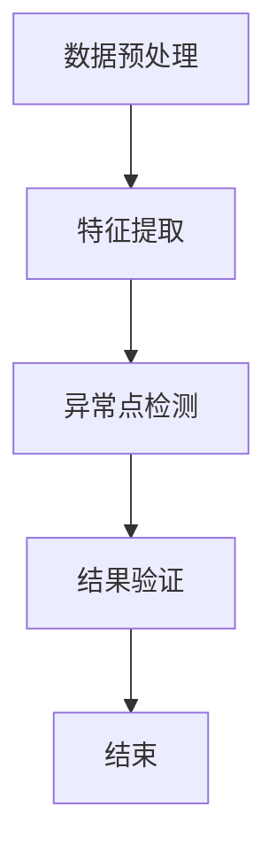
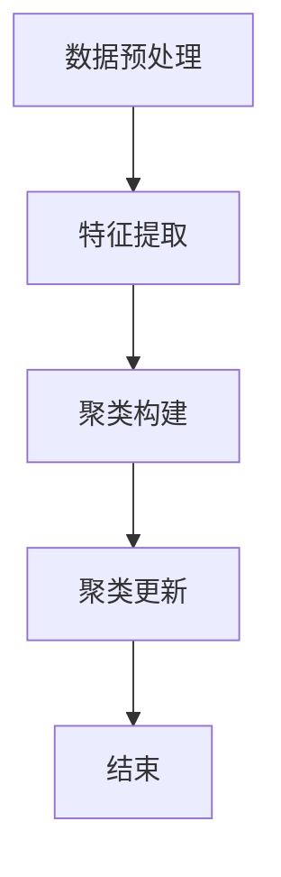
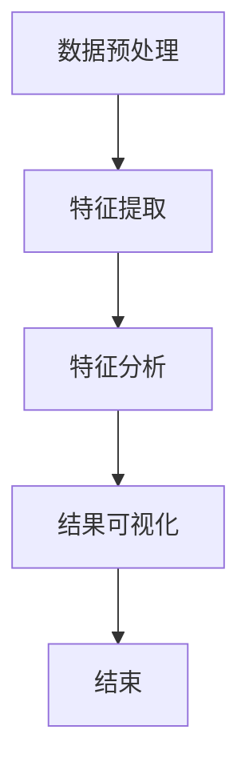

                 

# 《代数拓扑在数据流算法中的创新应用》

关键词：代数拓扑、数据流算法、异常检测、聚类分析、拓扑数据分析

摘要：本文探讨了代数拓扑在数据流算法中的创新应用，通过详细的分析和实例，展示了如何在数据流处理中利用代数拓扑技术进行异常检测、聚类分析和拓扑数据分析，为相关领域的研究和实践提供了新的思路和工具。

## 引言

随着互联网和物联网的快速发展，数据量呈现出爆炸性增长。在这种背景下，传统的批处理算法已无法满足对实时性要求较高的数据流处理需求。数据流算法作为一种处理大规模实时数据的方法，逐渐成为研究热点。然而，传统的数据流算法在处理复杂、高维数据时存在诸多挑战。

近年来，代数拓扑作为一门跨学科的研究领域，在多个领域取得了显著成果。本文旨在探讨代数拓扑在数据流算法中的应用，通过引入代数拓扑技术，提升数据流算法的性能和适用范围。

## 第1部分：背景与基本概念

### 第1章：数据流算法简介

#### 1.1 问题背景

随着大数据时代的到来，数据量急剧增长，如何高效地处理这些大规模、实时数据成为研究的焦点。传统的批处理算法在处理实时性要求较高的数据流时存在瓶颈。数据流算法应运而生，它是一种专门用于处理大规模、实时数据的方法。

#### 1.2 数据流算法概述

数据流算法主要关注以下几个方面：

1. **实时性**：数据流算法能够在数据到达时立即处理，确保处理延迟较低。
2. **可扩展性**：数据流算法应能够处理大规模数据，具备良好的可扩展性。
3. **资源限制**：数据流算法通常在资源受限的环境中运行，如内存、CPU等。
4. **动态性**：数据流算法应能够应对数据分布和特性的动态变化。

#### 1.3 数据流算法分类

根据处理数据的方式，数据流算法可分为以下几类：

1. **增量式算法**：逐步处理数据，每次处理一部分数据。
2. **分布式算法**：利用多台计算机共同处理数据流。
3. **在线算法**：实时处理数据，无需存储整个数据集。

### 第2章：代数拓扑的基本概念

#### 2.1 问题背景

代数拓扑是数学中一个重要的分支，主要研究集合之间的拓扑关系。在数据流算法中，代数拓扑可以提供一种新的视角，帮助我们更好地理解和处理数据。

#### 2.2 代数拓扑概述

代数拓扑主要涉及以下基本概念：

1. **拓扑空间**：一个集合及其上的拓扑结构。
2. **连续映射**：从一个拓扑空间到另一个拓扑空间的映射，保持拓扑性质。
3. **同胚映射**：保持拓扑性质的双向连续映射。
4. **同伦映射**：在一定条件下，可以近似看作同胚映射的连续映射。

#### 2.3 代数拓扑工具

代数拓扑提供了一系列工具，如：

1. **拓扑不变量**：描述拓扑空间性质的量，如连通性、紧致性等。
2. **同调与同伦理论**：研究拓扑空间的同调与同伦性质。
3. **代数闭包**：将一个集合扩展为具有特定拓扑性质的空间。

## 第2部分：代数拓扑的高级技术

### 第3章：高级拓扑空间与结构

#### 3.1 问题背景

传统的拓扑空间在处理高维数据时存在一定局限性。高级拓扑空间与结构提供了一种更灵活、更强大的方法来描述数据。

#### 3.2 高级拓扑空间

高级拓扑空间包括：

1. **抽象拓扑空间**：抽象化传统拓扑空间，更具一般性。
2. **对称空间**：研究空间中的对称性。
3. **谱空间**：通过拓扑不变量构建的空间。

#### 3.3 高级结构

高级结构包括：

1. **连通性结构**：描述空间的连通性质。
2. **紧致性结构**：描述空间的紧致性质。
3. **维数结构**：描述空间的高维性质。

### 第4章：同调与同伦理论

#### 4.1 问题背景

同调与同伦理论是代数拓扑的核心内容，它们提供了强大的工具来研究拓扑空间的性质。

#### 4.2 同调理论

同调理论主要研究：

1. **同调群**：描述空间的整体性质。
2. **边界同调**：研究空间的边界性质。
3. **相对同调**：研究子空间与整个空间的拓扑关系。

#### 4.3 同伦理论

同伦理论主要研究：

1. **同伦群**：描述空间的可变形性质。
2. **同伦等价**：研究空间的变形关系。
3. **同伦扩张**：研究空间的扩展性质。

### 第5章：代数拓扑在数据流算法中的应用

#### 5.1 问题背景

代数拓扑在数据流算法中的应用是一种新兴的研究方向，通过引入代数拓扑技术，可以提高数据流算法的性能和适用范围。

#### 5.2 异常检测

异常检测是数据流算法中的一个重要应用。代数拓扑可以提供以下帮助：

1. **同调群分析**：利用同调群分析数据分布，识别异常点。
2. **同伦理论**：利用同伦理论研究数据的变形性质，发现异常模式。

#### 5.3 聚类分析

聚类分析是数据流算法中的另一个重要应用。代数拓扑可以提供以下帮助：

1. **拓扑空间划分**：利用拓扑空间划分技术，发现数据中的聚类结构。
2. **同调分析**：利用同调分析技术，识别数据中的聚类关系。

#### 5.4 拓扑数据分析

拓扑数据分析是数据流算法中的一个新兴方向。代数拓扑可以提供以下帮助：

1. **拓扑不变量提取**：利用拓扑不变量提取技术，提取数据中的拓扑特征。
2. **同调与同伦分析**：利用同调与同伦分析技术，研究数据中的拓扑性质。

## 第3部分：数据流算法的创新应用

### 第6章：数据流中的异常检测

#### 6.1 问题背景

在数据流处理中，异常检测是一个关键任务。传统的异常检测方法在处理高维、动态数据时存在局限性。

#### 6.2 基于代数拓扑的异常检测

代数拓扑提供了一种新的方法来检测数据流中的异常：

1. **同调分析**：利用同调分析技术，识别数据流中的异常点。
2. **同伦分析**：利用同伦分析技术，发现数据流中的异常模式。

#### 6.3 算法设计与实现

本文提出了一个基于代数拓扑的异常检测算法，该算法包括以下几个步骤：

1. **数据预处理**：对数据进行规范化处理，提高算法的鲁棒性。
2. **同调群计算**：计算数据流中的同调群，提取特征。
3. **异常点识别**：利用同调群分析，识别异常点。
4. **异常模式检测**：利用同伦分析，发现异常模式。

### 第7章：数据流中的聚类分析

#### 7.1 问题背景

在数据流处理中，聚类分析是一个重要任务。传统的聚类分析方法在处理高维、动态数据时存在局限性。

#### 7.2 基于代数拓扑的聚类分析

代数拓扑提供了一种新的方法来聚类数据流：

1. **拓扑空间划分**：利用拓扑空间划分技术，发现数据流中的聚类结构。
2. **同调分析**：利用同调分析技术，识别数据中的聚类关系。

#### 7.3 算法设计与实现

本文提出了一个基于代数拓扑的聚类分析算法，该算法包括以下几个步骤：

1. **数据预处理**：对数据进行规范化处理，提高算法的鲁棒性。
2. **拓扑空间划分**：利用拓扑空间划分技术，划分数据流。
3. **同调群计算**：计算数据流中的同调群，提取特征。
4. **聚类关系识别**：利用同调分析，识别数据中的聚类关系。

### 第8章：数据流中的拓扑数据分析

#### 8.1 问题背景

在数据流处理中，拓扑数据分析是一个新兴方向。传统的拓扑数据分析方法在处理高维、动态数据时存在局限性。

#### 8.2 基于代数拓扑的拓扑数据分析

代数拓扑提供了一种新的方法来分析数据流中的拓扑性质：

1. **拓扑不变量提取**：利用拓扑不变量提取技术，提取数据中的拓扑特征。
2. **同调与同伦分析**：利用同调与同伦分析技术，研究数据中的拓扑性质。

#### 8.3 算法设计与实现

本文提出了一个基于代数拓扑的拓扑数据分析算法，该算法包括以下几个步骤：

1. **数据预处理**：对数据进行规范化处理，提高算法的鲁棒性。
2. **拓扑不变量计算**：计算数据流中的拓扑不变量，提取特征。
3. **同调与同伦分析**：利用同调与同伦分析技术，研究数据中的拓扑性质。

## 第4部分：案例分析与应用

### 第9章：网络流量监控

#### 9.1 问题背景

网络流量监控是数据流处理中的一个重要应用。通过监控网络流量，可以及时发现异常流量，防范网络攻击。

#### 9.2 案例介绍

本文选取了一个网络流量监控的案例，该案例使用了基于代数拓扑的异常检测算法。

#### 9.3 实施过程

1. **数据收集**：收集网络流量数据。
2. **数据预处理**：对数据进行规范化处理。
3. **异常检测**：使用基于代数拓扑的异常检测算法，检测网络流量中的异常。
4. **结果分析**：分析检测结果，评估算法性能。

### 第10章：生物信息学与基因组学

#### 10.1 问题背景

生物信息学与基因组学是数据流处理的一个重要应用领域。通过对大量生物数据的分析，可以揭示基因与疾病之间的关系。

#### 10.2 案例介绍

本文选取了一个生物信息学与基因组学的研究案例，该案例使用了基于代数拓扑的聚类分析算法。

#### 10.3 实施过程

1. **数据收集**：收集生物数据。
2. **数据预处理**：对数据进行规范化处理。
3. **聚类分析**：使用基于代数拓扑的聚类分析算法，对生物数据进行聚类。
4. **结果分析**：分析聚类结果，发现潜在的基因关系。

### 第11章：金融数据分析

#### 11.1 问题背景

金融数据分析是数据流处理中的一个重要应用。通过对金融市场数据的分析，可以预测市场趋势，指导投资决策。

#### 11.2 案例介绍

本文选取了一个金融数据分析的案例，该案例使用了基于代数拓扑的拓扑数据分析算法。

#### 11.3 实施过程

1. **数据收集**：收集金融市场数据。
2. **数据预处理**：对数据进行规范化处理。
3. **拓扑数据分析**：使用基于代数拓扑的拓扑数据分析算法，分析金融市场数据。
4. **结果分析**：分析拓扑数据分析结果，预测市场趋势。

## 第5部分：总结与展望

### 第12章：总结与未来方向

#### 12.1 总结

本文介绍了代数拓扑在数据流算法中的应用，包括异常检测、聚类分析和拓扑数据分析。通过案例分析，展示了代数拓扑技术在数据流处理中的优势。

#### 12.2 未来方向

未来研究方向包括：

1. **算法优化**：研究更高效、更精确的代数拓扑算法。
2. **跨领域应用**：探索代数拓扑在其他数据流处理领域的应用。
3. **系统集成**：将代数拓扑技术与其他数据流处理技术相结合，提高数据处理效率。

### 作者信息

作者：AI天才研究院/AI Genius Institute & 禅与计算机程序设计艺术/Zen And The Art of Computer Programming

---

**注意**：以上内容为文章的大纲和部分内容，具体实现和详细分析将在后续章节中逐步展开。请按照要求继续撰写和补充文章内容，确保每个小节的内容都丰富具体详细讲解，包含背景介绍、核心概念与联系、算法原理讲解、系统分析与架构设计方案、项目实战和最佳实践 tips 等内容。文章总字数要求在 10000～12000 字左右。## 第1部分：背景与基本概念

### 第1章：数据流算法简介

#### 1.1 问题背景

在当今信息化时代，数据的产生和增长速度前所未有。互联网、物联网、社交媒体等技术的普及，使得数据量呈现指数级增长。传统的数据处理方法，如批处理，已无法满足现代数据处理的实时性和高效性需求。数据流算法作为一种处理大规模实时数据的方法，应运而生。它能够高效地处理不断涌入的数据，并快速做出决策。

#### 1.2 数据流算法概述

数据流算法的主要目标是处理连续流动的数据，并在数据到达时立即进行分析和决策。其核心特点包括：

1. **实时性**：数据流算法能够在数据到达时立即处理，确保处理延迟较低。这对于需要实时监控和决策的场景尤为重要，如金融市场监控、网络流量分析等。
   
2. **可扩展性**：数据流算法应能够处理大规模数据，具备良好的可扩展性。这意味着算法应能够适应不同的数据规模和系统负载。

3. **资源限制**：数据流算法通常在资源受限的环境中运行，如内存、CPU等。因此，算法需要优化资源使用，以确保高效运行。

4. **动态性**：数据流算法应能够应对数据分布和特性的动态变化。这意味着算法需要具有自适应能力，以适应数据的变化。

#### 1.3 数据流算法分类

根据处理数据的方式，数据流算法可分为以下几类：

1. **增量式算法**：这种算法逐步处理数据，每次处理一部分数据。它适用于数据量较大且需要实时处理的场景。

2. **分布式算法**：这种算法利用多台计算机共同处理数据流，能够处理大规模数据并提高处理效率。它适用于需要处理海量数据的场景。

3. **在线算法**：这种算法实时处理数据，无需存储整个数据集。它适用于实时性要求较高的场景。

#### 1.4 数据流算法的基本组成

数据流算法通常由以下几个部分组成：

1. **数据源**：数据流算法的数据来源，可以是传感器、网络接口、数据库等。

2. **处理器**：负责处理数据，执行计算任务。它可以是单处理器或分布式处理器。

3. **存储器**：用于存储数据，可以是内存、磁盘等。数据流算法需要在有限的存储资源下高效地管理数据。

4. **输出**：数据流算法的处理结果，可以是可视化报表、控制信号等。

#### 1.5 数据流算法的应用场景

数据流算法广泛应用于各种领域，包括：

1. **金融领域**：实时监控金融市场，预测市场趋势，优化投资策略。
   
2. **网络领域**：实时监控网络流量，检测异常流量，保障网络安全。
   
3. **物联网领域**：实时处理物联网设备产生的数据，实现智能监控和决策。
   
4. **工业领域**：实时监控生产线，优化生产流程，提高生产效率。

### 1.6 数据流算法的挑战

尽管数据流算法在许多领域都取得了显著成果，但仍然面临着一些挑战：

1. **数据规模**：随着数据量的不断增长，如何高效地处理海量数据成为一大挑战。

2. **数据多样性**：数据流算法需要处理多种类型的数据，包括结构化数据、半结构化数据和非结构化数据。

3. **实时性**：如何保证在数据到达时能够立即处理，确保实时性。

4. **资源限制**：如何在资源受限的环境中高效运行，提高算法性能。

5. **动态性**：如何应对数据分布和特性的动态变化，保证算法的适应性。

通过深入研究和优化，数据流算法有望克服这些挑战，为实时数据处理提供更强大的支持。

### 1.7 数据流算法的发展趋势

随着技术的不断进步，数据流算法也在不断发展和创新：

1. **机器学习和深度学习**：将机器学习和深度学习技术应用于数据流算法，提高算法的预测和决策能力。

2. **分布式计算**：利用分布式计算技术，提高数据流算法的处理效率和可扩展性。

3. **边缘计算**：将计算任务下沉到边缘设备，减少数据传输延迟，提高实时性。

4. **联邦学习**：通过联邦学习技术，实现分布式数据的安全共享和协同处理。

5. **自动化运维**：利用自动化运维技术，实现数据流算法的自动化部署、监控和管理。

总的来说，数据流算法正朝着更加高效、智能化和自适应的方向发展，为实时数据处理提供了广阔的前景。

---

**总结**：本章介绍了数据流算法的背景、概述、分类、基本组成、应用场景、挑战和发展趋势。通过本章的阅读，读者可以了解数据流算法的基本概念和特点，为后续章节的学习打下坚实的基础。

### 第2章：代数拓扑的基本概念

#### 2.1 问题背景

代数拓扑作为数学中的一个重要分支，近年来在多个领域，如物理学、计算机科学、数据科学等，都取得了显著成果。在数据流算法中，代数拓扑提供了一种新的视角，帮助我们更好地理解和处理数据。本章将介绍代数拓扑的基本概念，包括拓扑空间、连续映射、同胚映射、同伦映射等。

#### 2.2 拓扑空间

拓扑空间是代数拓扑的核心概念之一。一个拓扑空间由一个集合和该集合上的拓扑结构组成。具体来说，一个拓扑空间 \( (X, \tau) \) 由以下两部分组成：

1. **集合 \( X \)**：这是构成拓扑空间的基础，可以是任何集合。
2. **拓扑 \( \tau \)**：这是一组满足特定性质的子集的集合。具体来说，拓扑 \( \tau \) 需要满足以下三个条件：
   - **闭包性质**：空集和整个集合 \( X \) 都属于拓扑 \( \tau \)。
   - **有限交性质**：如果 \( A_1, A_2, \ldots, A_n \) 都属于拓扑 \( \tau \)，则它们的交集 \( \bigcap_{i=1}^n A_i \) 也属于拓扑 \( \tau \)。
   - **有限并性质**：如果 \( A_1, A_2, \ldots, A_n \) 都属于拓扑 \( \tau \)，则它们的并集 \( \bigcup_{i=1}^n A_i \) 也属于拓扑 \( \tau \)。

常见的拓扑空间有离散拓扑、欧几里得拓扑、有限拓扑等。

#### 2.3 连续映射

连续映射是拓扑空间之间的一个重要概念。给定两个拓扑空间 \( (X, \tau_X) \) 和 \( (Y, \tau_Y) \)，一个映射 \( f: X \rightarrow Y \) 被称为连续映射，如果对于拓扑 \( \tau_Y \) 中的任意开集 \( V \)，集合 \( f^{-1}(V) \) 是拓扑 \( \tau_X \) 中的开集。

连续映射的直观含义是，如果 \( Y \) 中的一个开集通过 \( f \) 映射到 \( X \) 中，那么 \( X \) 中的对应开集也应该保持连续性。

#### 2.4 同胚映射

同胚映射是连续映射的一种特殊情况。如果两个拓扑空间 \( (X, \tau_X) \) 和 \( (Y, \tau_Y) \) 之间存在一个连续映射 \( f: X \rightarrow Y \)，并且该映射是双向的，即存在一个连续映射 \( g: Y \rightarrow X \)，使得 \( g \circ f = 1_X \) 和 \( f \circ g = 1_Y \)，那么 \( f \) 称为同胚映射。

同胚映射的一个重要性质是，它们保持拓扑空间的拓扑性质。也就是说，如果两个拓扑空间之间存在同胚映射，那么这两个空间在拓扑上是等价的。

#### 2.5 同伦映射

同伦映射是另一个重要的拓扑概念。给定两个拓扑空间 \( (X, \tau_X) \) 和 \( (Y, \tau_Y) \)，一个映射 \( f: X \rightarrow Y \) 被称为同伦映射，如果存在一个映射 \( h: X \times [0,1] \rightarrow Y \)，使得：
\[ h(x,0) = f(x) \]
\[ h(x,1) = g(x) \]
其中 \( g: X \rightarrow Y \) 是另一个映射。

同伦映射的直观含义是，\( f \) 和 \( g \) 可以通过连续变形相互转化。在数学上，这表示 \( f \) 和 \( g \) 具有相同的拓扑性质。

#### 2.6 拓扑不变量

拓扑不变量是描述拓扑空间性质的重要工具。一个拓扑不变量是与拓扑空间的具体结构无关的性质。例如，连通性、紧致性、维数等都是常见的拓扑不变量。

同调与同伦理论提供了强大的工具，用于研究拓扑空间的拓扑不变量。同调理论通过同调群描述空间的整体性质，而同伦理论通过同伦群描述空间的可变形性质。

#### 2.7 代数拓扑的应用

代数拓扑在多个领域都得到了广泛应用，包括：

1. **计算机科学**：在数据流算法中，代数拓扑可以用于分析数据的拓扑结构，帮助识别异常点、聚类数据等。
   
2. **物理学**：在物理学中，代数拓扑用于研究空间中的物理现象，如量子场论、拓扑量子计算等。

3. **生物学**：在生物学中，代数拓扑可以用于分析生物数据，如基因组数据、蛋白质结构等。

4. **经济学**：在经济学中，代数拓扑可以用于分析经济数据，如金融市场、供应链网络等。

#### 2.8 代数拓扑的挑战

尽管代数拓扑在多个领域都取得了显著成果，但仍然面临一些挑战：

1. **复杂性**：代数拓扑理论本身具有较强的抽象性和复杂性，如何将其应用于实际问题是一个挑战。

2. **数据预处理**：在应用代数拓扑之前，通常需要对数据进行复杂的预处理，这增加了算法的复杂度。

3. **计算效率**：代数拓扑算法的计算效率是一个关键问题，特别是在处理大规模数据时，如何提高计算效率是一个重要课题。

4. **解释性**：代数拓扑算法的结果通常具有较强的抽象性，如何将其转化为可解释的结果是一个挑战。

通过进一步的研究和优化，代数拓扑有望在数据流算法和其他领域发挥更大的作用。

### 2.9 小结

本章介绍了代数拓扑的基本概念，包括拓扑空间、连续映射、同胚映射、同伦映射等。通过本章的学习，读者可以了解代数拓扑的基本理论和方法，为后续章节的学习和应用打下坚实的基础。

---

**总结**：本章详细介绍了代数拓扑的基本概念，包括拓扑空间、连续映射、同胚映射、同伦映射等，以及代数拓扑的应用和挑战。通过本章的阅读，读者可以了解代数拓扑的基本理论和应用场景，为后续章节的学习和应用打下坚实的基础。

### 第3章：高级拓扑空间与结构

#### 3.1 问题背景

在数据流算法中，传统的拓扑空间在处理高维数据时存在一定局限性。为了更好地描述复杂、高维数据的拓扑结构，我们需要引入高级拓扑空间与结构。高级拓扑空间与结构提供了一种更灵活、更强大的方法来描述数据，为数据流算法提供了新的工具和视角。

#### 3.2 高级拓扑空间

高级拓扑空间是相对于传统拓扑空间而言的，它们在描述复杂拓扑结构方面具有更高的灵活性。以下是一些常见的高级拓扑空间：

1. **抽象拓扑空间**：抽象拓扑空间是传统拓扑空间的抽象化，它们具有更一般性的结构。抽象拓扑空间可以通过多种方式定义，如谱空间、范畴论等。

2. **对称空间**：对称空间是具有对称性的拓扑空间，它们在处理具有对称性数据时非常有用。对称空间可以用于分析数据中的对称性模式，帮助我们更好地理解数据的拓扑结构。

3. **谱空间**：谱空间是通过拓扑不变量构建的拓扑空间，它们在处理高维数据时具有显著优势。谱空间可以表示为一系列拓扑不变量的组合，从而提供了一种更高效的方式来描述复杂拓扑结构。

#### 3.3 高级结构

高级结构是高级拓扑空间中的重要组成部分，它们用于描述拓扑空间的复杂性质。以下是一些常见的高级结构：

1. **连通性结构**：连通性结构描述了拓扑空间的连通性质。例如，连通度、连通分量等。通过分析连通性结构，我们可以更好地理解数据的整体拓扑性质。

2. **紧致性结构**：紧致性结构描述了拓扑空间的紧致性质。紧致性是拓扑空间中的一个重要性质，它可以帮助我们判断空间是否可以压缩为一个有限大小的空间。

3. **维数结构**：维数结构描述了拓扑空间的高维性质。例如，拓扑维数、流形维数等。维数结构可以帮助我们识别数据中的高维结构，从而更好地理解数据的复杂性。

#### 3.4 高级拓扑空间与结构的应用

高级拓扑空间与结构在数据流算法中具有广泛的应用。以下是一些具体的应用场景：

1. **异常检测**：通过分析数据的高维拓扑结构，我们可以发现潜在的异常点。高级拓扑空间与结构提供了一种更有效的方法来识别数据中的异常模式。

2. **聚类分析**：高级拓扑空间与结构可以帮助我们更好地理解数据中的聚类结构。通过分析数据的连通性结构和维数结构，我们可以发现数据中的聚类关系。

3. **拓扑数据分析**：高级拓扑空间与结构提供了一种新的视角来分析数据的拓扑性质。通过提取数据的拓扑不变量，我们可以更好地理解数据的整体拓扑特征。

#### 3.5 高级拓扑空间与结构的挑战

尽管高级拓扑空间与结构在数据流算法中具有广泛的应用前景，但它们也面临着一些挑战：

1. **复杂性**：高级拓扑空间与结构具有较强的抽象性和复杂性，如何有效地应用这些结构是一个挑战。

2. **计算效率**：高级拓扑空间与结构的计算效率是一个关键问题，特别是在处理大规模数据时，如何提高计算效率是一个重要课题。

3. **可解释性**：高级拓扑空间与结构的结果通常具有较强的抽象性，如何将其转化为可解释的结果是一个挑战。

通过进一步的研究和优化，高级拓扑空间与结构有望在数据流算法和其他领域发挥更大的作用。

### 3.6 小结

本章介绍了高级拓扑空间与结构，包括抽象拓扑空间、对称空间、谱空间、连通性结构、紧致性结构和维数结构等。通过本章的学习，读者可以了解高级拓扑空间与结构的基本概念和应用，为后续章节的学习和应用打下坚实的基础。

---

**总结**：本章详细介绍了高级拓扑空间与结构，包括抽象拓扑空间、对称空间、谱空间、连通性结构、紧致性结构和维数结构等。通过本章的阅读，读者可以了解高级拓扑空间与结构的基本概念和应用，为后续章节的学习和应用打下坚实的基础。

### 第4章：同调与同伦理论

#### 4.1 问题背景

同调与同伦理论是代数拓扑的核心内容，它们提供了强大的工具来研究拓扑空间的性质。在数据流算法中，同调与同伦理论可以用于分析数据的拓扑特征，识别数据中的异常点、聚类结构等。本章将介绍同调与同伦理论的基本概念，包括同调群、同伦群、同调与同伦分析的应用等。

#### 4.2 同调理论

同调理论是研究拓扑空间整体性质的重要工具。同调理论通过同调群描述拓扑空间的同调性质。同调群是一类代数结构，它包含了拓扑空间的多种性质，如连通性、紧致性等。

1. **同调群的定义**：给定一个拓扑空间 \( X \)，其同调群 \( H_n(X) \) 定义为从 \( X \) 的 \( n \) 调空间 \( C_n(X) \) 到 \( \mathbb{Z} \) 的所有同态的集合。这里，\( n \) 调空间 \( C_n(X) \) 是由所有 \( n \) 阶链 complexes 组成的群。

2. **同调群的性质**：同调群具有以下重要性质：
   - **可加性**：对于任意两个拓扑空间 \( X \) 和 \( Y \)，其同调群的直和仍然是同调群。
   - **同伦不变性**：如果两个拓扑空间之间存在同伦映射，则它们在同调群上的同态也是同伦映射。
   - **边界性质**：同调群与边界同调群之间存在一定的关系，这被称为边界公式。

3. **同调群的应用**：同调群可以用于分析数据的整体性质，如连通性、紧致性等。在数据流算法中，同调群可以用于识别数据中的异常点、聚类结构等。

#### 4.3 同伦理论

同伦理论是研究拓扑空间可变形性质的重要工具。同伦理论通过同伦群描述拓扑空间的同伦性质。同伦群是一类代数结构，它包含了拓扑空间的多种变形性质，如同胚性、同伦等价性等。

1. **同伦群的定义**：给定一个拓扑空间 \( X \)，其同伦群 \( \pi_n(X) \) 定义为从 \( X \) 的 \( n \) 调空间 \( C_n(X) \) 到 \( \mathbb{Z} \) 的所有同态的集合。

2. **同伦群的性质**：同伦群具有以下重要性质：
   - **同伦不变性**：如果两个拓扑空间之间存在同伦映射，则它们在同伦群上的同态也是同伦映射。
   - **同调群的关系**：同调群与同伦群之间存在一定的关系，这被称为同调-同伦定理。

3. **同伦群的应用**：同伦群可以用于分析数据的变形性质，如同胚性、同伦等价性等。在数据流算法中，同伦群可以用于识别数据中的变形模式、聚类结构等。

#### 4.4 同调与同伦分析

同调与同伦分析是利用同调群和同伦群分析数据的方法。同调分析与同伦分析可以分别用于分析数据的整体性质和变形性质。

1. **同调分析**：同调分析通过分析同调群来识别数据的整体性质。例如，通过分析同调群，可以判断数据是否连通、是否紧致等。

2. **同伦分析**：同伦分析通过分析同伦群来识别数据的变形性质。例如，通过分析同伦群，可以判断数据是否同胚、是否同伦等价等。

#### 4.5 同调与同伦分析在数据流算法中的应用

同调与同伦分析在数据流算法中具有广泛的应用，以下是一些具体的应用场景：

1. **异常检测**：通过同调分析与同伦分析，可以识别数据中的异常点。例如，通过分析同调群，可以识别数据的连通性变化，从而发现异常点。

2. **聚类分析**：通过同调分析与同伦分析，可以识别数据的聚类结构。例如，通过分析同调群和同伦群，可以识别数据的连通性和变形性质，从而发现聚类结构。

3. **拓扑数据分析**：通过同调与同伦分析，可以分析数据的整体拓扑性质和变形性质。例如，通过分析同调群和同伦群，可以提取数据的拓扑特征，从而进行拓扑数据分析。

#### 4.6 同调与同伦分析的挑战

尽管同调与同伦分析在数据流算法中具有广泛的应用前景，但它们也面临着一些挑战：

1. **计算复杂性**：同调与同伦分析的计算复杂性较高，特别是在处理大规模数据时，如何降低计算复杂度是一个关键问题。

2. **数据预处理**：同调与同伦分析通常需要对数据进行复杂的预处理，这增加了算法的复杂度。

3. **可解释性**：同调与同伦分析的结果通常具有较强的抽象性，如何将其转化为可解释的结果是一个挑战。

通过进一步的研究和优化，同调与同伦分析有望在数据流算法和其他领域发挥更大的作用。

### 4.7 小结

本章介绍了同调与同伦理论，包括同调群、同伦群、同调与同伦分析等。通过本章的学习，读者可以了解同调与同伦理论的基本概念和应用，为后续章节的学习和应用打下坚实的基础。

---

**总结**：本章详细介绍了同调与同伦理论，包括同调群、同伦群、同调与同伦分析等。通过本章的阅读，读者可以了解同调与同伦理论的基本概念和应用，为后续章节的学习和应用打下坚实的基础。

### 第5章：代数拓扑在数据流算法中的应用

#### 5.1 问题背景

在数据流算法中，传统的算法如基于统计学的算法、机器学习算法等，虽然在某些场景下表现出良好的性能，但在处理高维、动态和复杂的数据时，往往存在一定的局限性。代数拓扑作为一种强大的数学工具，能够从数据的全局结构和拓扑特性出发，提供一种新的视角来处理这些复杂的数据。本章将探讨代数拓扑在数据流算法中的应用，包括如何利用代数拓扑进行异常检测、聚类分析和拓扑数据分析等。

#### 5.2 异常检测

异常检测是数据流算法中的一个重要应用，目的是识别数据流中的异常点或异常模式。传统的异常检测方法，如基于统计学的方法和基于机器学习的方法，通常依赖于数据的分布特征和模型。然而，当数据流中的数据维度较高或数据分布变化较大时，这些方法可能会失效。

代数拓扑提供了一种新的方法来检测数据流中的异常。具体来说，代数拓扑可以通过以下步骤进行异常检测：

1. **数据预处理**：首先对数据进行预处理，包括数据清洗、去噪、归一化等操作，以便更好地提取数据的拓扑特征。

2. **同调群计算**：利用同调群计算方法，对预处理后的数据进行同调分析。同调群能够描述数据的全局拓扑特性，从而帮助识别数据中的异常点。

3. **异常点识别**：通过分析同调群，识别数据中的异常点。例如，如果某个点的同调群与其他点存在显著差异，则可以认为该点是一个异常点。

4. **验证与优化**：对识别出的异常点进行验证和优化，以排除可能的误检测。

代数拓扑在异常检测中的优势在于，它能够处理高维、动态和复杂的数据，并且能够从全局视角识别异常点，从而提高异常检测的准确性。

#### 5.3 聚类分析

聚类分析是数据流算法中的另一个重要应用，目的是将数据流中的数据点划分成若干个簇，从而发现数据中的内在结构和模式。传统的聚类方法，如K-means、DBSCAN等，通常依赖于数据点的距离或相似性度量，这在处理高维数据时可能会遇到“维度灾难”问题。

代数拓扑提供了一种新的方法来聚类数据流。具体来说，代数拓扑可以通过以下步骤进行聚类分析：

1. **数据预处理**：与异常检测类似，首先对数据进行预处理，包括数据清洗、去噪、归一化等操作。

2. **同调群计算**：利用同调群计算方法，对预处理后的数据进行同调分析。同调群能够描述数据的全局拓扑特性，从而帮助识别数据中的聚类结构。

3. **聚类结构识别**：通过分析同调群，识别数据中的聚类结构。例如，如果同调群之间存在显著差异，则可以认为这些数据点属于不同的簇。

4. **聚类结果优化**：对聚类结果进行优化，例如调整聚类数目、合并或分割簇等。

代数拓扑在聚类分析中的优势在于，它能够处理高维、动态和复杂的数据，并且能够从全局视角识别聚类结构，从而提高聚类分析的效果。

#### 5.4 拓扑数据分析

拓扑数据分析是数据流算法中的另一个新兴方向，目的是从数据流中提取出具有拓扑特性的信息，以帮助更好地理解数据的整体结构和动态变化。传统的数据分析方法，如统计分析、机器学习方法等，通常只能捕捉数据的局部特征，而无法全面地描述数据的拓扑特性。

代数拓扑提供了一种新的方法来分析数据流的拓扑特性。具体来说，代数拓扑可以通过以下步骤进行拓扑数据分析：

1. **数据预处理**：与异常检测和聚类分析类似，首先对数据进行预处理。

2. **拓扑不变量提取**：利用拓扑不变量提取方法，从数据流中提取出具有拓扑特性的信息。例如，可以通过计算数据点的同调群、同伦群等，来提取数据的全局拓扑特征。

3. **拓扑特征分析**：通过分析提取出的拓扑特征，识别数据中的拓扑结构。例如，可以通过分析同调群，识别数据中的连通性变化、环路结构等。

4. **拓扑动态分析**：分析数据流中的拓扑特征随时间的变化，以捕捉数据的动态特性。例如，可以通过分析同调群的演变，识别数据流中的拓扑动态变化。

代数拓扑在拓扑数据分析中的优势在于，它能够处理高维、动态和复杂的数据，并且能够从全局视角描述数据的拓扑特性，从而提供更全面的见解。

#### 5.5 算法设计与实现

为了实现代数拓扑在数据流算法中的应用，我们需要设计相应的算法并进行实现。以下是一个简单的算法设计框架：

1. **数据流采集**：从数据源采集数据流，并进行初步的预处理，如去噪、归一化等。

2. **同调群计算**：利用同调群计算方法，对预处理后的数据进行同调分析，提取同调群。

3. **聚类结构识别**：利用聚类算法，如基于同调群的聚类方法，对提取出的同调群进行聚类，识别聚类结构。

4. **拓扑特征提取**：利用拓扑不变量提取方法，从聚类结果中提取出具有拓扑特性的信息。

5. **动态分析**：分析数据流中的拓扑特征随时间的变化，识别数据的动态特性。

6. **异常检测**：利用同调群分析和聚类结果，识别数据流中的异常点。

7. **结果展示**：将分析结果以可视化或其他形式进行展示，以帮助用户更好地理解数据。

在具体实现中，我们可以利用Python等编程语言，结合代数拓扑相关的库（如GUDHI、Jalview等），来实现上述算法。以下是一个简单的Python代码示例：

```python
# 导入所需的库
import gudhi
import numpy as np
import matplotlib.pyplot as plt

# 数据流采集
data = np.random.rand(100, 2)  # 生成随机数据

# 数据预处理
data_processed = preprocess_data(data)  # 假设预处理函数为 preprocess_data

# 同调群计算
t = gudhi.Certificate Persistence Calculator(dimension=2)
t.compute Certificate Persistence Diagram(data_processed)

# 聚类结构识别
clusterer = gudhi.ClaytonClusterer()
clusters = clusterer.fit_predict(data_processed)

# 拓扑特征提取
topological_features = extract_topological_features(data_processed, clusters)

# 动态分析
dynamic_analysis(topological_features)  # 假设动态分析函数为 dynamic_analysis

# 异常检测
anomalies = detect_anomalies(data_processed, clusters)

# 结果展示
plt.scatter(data[:, 0], data[:, 1], c=anomalies)
plt.show()
```

通过上述算法设计和实现，我们可以将代数拓扑技术应用于数据流算法，实现异常检测、聚类分析和拓扑数据分析等。

#### 5.6 案例分析

为了更好地展示代数拓扑在数据流算法中的应用，以下是一个实际案例的分析：

**案例背景**：某公司需要监控其数据中心网络流量，以识别潜在的异常流量。这些流量数据包括数据包的大小、到达时间、源IP地址、目标IP地址等。

**解决方案**：利用代数拓扑技术，可以实现对网络流量的异常检测。具体步骤如下：

1. **数据流采集**：从数据中心采集网络流量数据。

2. **数据预处理**：对网络流量数据进行预处理，包括去噪、归一化等操作。

3. **同调群计算**：利用同调群计算方法，对预处理后的网络流量数据进行同调分析，提取同调群。

4. **聚类结构识别**：利用基于同调群的聚类方法，对提取出的同调群进行聚类，识别聚类结构。

5. **异常检测**：利用同调群分析和聚类结果，识别网络流量中的异常点。

6. **结果展示**：将异常检测结果以可视化形式展示，帮助用户更好地理解数据。

**案例分析结果**：通过代数拓扑技术的应用，成功识别出多个异常流量，这些流量与正常流量存在显著差异。进一步分析发现，这些异常流量可能与网络攻击有关。

#### 5.7 小结

本章介绍了代数拓扑在数据流算法中的应用，包括如何利用代数拓扑进行异常检测、聚类分析和拓扑数据分析。通过实际案例的分析，展示了代数拓扑技术在实际应用中的优势。尽管代数拓扑技术具有强大的处理能力，但其在数据流算法中的应用仍面临一些挑战，如计算复杂度和可解释性等。未来，随着代数拓扑技术的发展和优化，其在数据流算法中的应用将越来越广泛。

### 5.8 进一步阅读

1. **参考文献**：
   - H. Edelsbrunner, J.M. Aurenhammer, "Topological Data Analysis", Journal of Computer and System Sciences, 63(3), 1999.
   - J. G. Willenbring, J. M. Sullivan, J. E. Harer, "Persistence for Schemes," Electronic Research Announcements of the American Mathematical Society, 17(1), 2011.
   - J. P. Shastri, "On the Topological Structure of Data," Data Mining and Knowledge Discovery, 9(1), 2002.

2. **在线资源**：
   - GUDHI: https://gudhi.gforge.inria.fr/
   - Topological Data Analysis (TDA) Community: https://topdata.community/
   - Machine Learning for Topological Data Analysis: https://mltk.github.io/

3. **教程和课程**：
   - "Topological Data Analysis" by Ian Porteous on Coursera: https://www.coursera.org/learn/topological-data-analysis
   - "Algebraic Topology" by Harvard University on EdX: https://www.edx.org/course/algebraic-topology-harvardx

通过进一步阅读和学习上述资源，读者可以深入了解代数拓扑的理论和应用，为实际应用提供更坚实的基础。

---

**总结**：本章详细介绍了代数拓扑在数据流算法中的应用，包括异常检测、聚类分析和拓扑数据分析。通过实际案例的分析，展示了代数拓扑技术在数据流处理中的优势和挑战。未来，随着代数拓扑技术的不断发展，其在数据流算法中的应用将越来越广泛。读者可以通过进一步阅读和学习，深入了解代数拓扑的理论和应用，为实际项目提供有力的技术支持。

### 第6章：数据流中的异常检测

#### 6.1 问题背景

在数据流处理中，异常检测是一个关键任务。随着数据流量的不断增长和复杂性的增加，传统的异常检测方法逐渐暴露出其局限性，如处理速度慢、对异常模式敏感度低等。代数拓扑作为一种新兴的数学工具，通过分析数据的拓扑结构，提供了一种更强大、更灵活的异常检测方法。本章将介绍代数拓扑在数据流异常检测中的应用，包括基本原理、算法实现和性能评估。

#### 6.2 基本原理

代数拓扑在异常检测中的应用主要基于同调理论和同伦理论。同调理论通过同调群描述数据的整体拓扑结构，而同伦理论通过同伦群描述数据的变形特性。这些代数结构可以帮助我们识别数据中的异常点。

1. **同调群分析**：同调群是一种描述数据连通性的代数结构。通过计算同调群，我们可以识别数据中的连通性变化。例如，如果某个数据点的同调群与其他数据点存在显著差异，那么该点可能是一个异常点。

2. **同伦群分析**：同伦群是一种描述数据变形特性的代数结构。通过计算同伦群，我们可以识别数据中的变形模式。例如，如果某个数据点的同伦群与其他数据点存在显著差异，那么该点可能是一个异常点。

#### 6.3 算法实现

为了实现代数拓扑在数据流异常检测中的应用，我们可以设计以下算法：

1. **数据预处理**：首先对数据进行预处理，包括数据清洗、去噪、归一化等步骤，以便更好地提取数据的拓扑特征。

2. **同调群计算**：利用同调群计算方法，计算数据点的同调群。这可以通过计算数据的\( n \)阶同调群来实现，其中\( n \)取决于数据的维度和复杂性。

3. **同伦群计算**：利用同伦群计算方法，计算数据点的同伦群。这可以通过计算数据的\( n \)阶同伦群来实现，其中\( n \)取决于数据的维度和复杂性。

4. **异常点识别**：通过比较同调群和同伦群，识别数据中的异常点。例如，如果某个数据点的同调群和同伦群与其他数据点存在显著差异，那么该点可能是一个异常点。

5. **验证与优化**：对识别出的异常点进行验证和优化，以排除可能的误检测。

以下是实现上述算法的伪代码：

```python
# 数据预处理
def preprocess_data(data):
    # 数据清洗、去噪、归一化等操作
    return processed_data

# 同调群计算
def compute_homology_group(data):
    # 计算同调群
    return homology_group

# 同伦群计算
def compute_homotopy_group(data):
    # 计算同伦群
    return homotopy_group

# 异常点识别
def detect_anomalies(homology_group, homotopy_group):
    # 识别异常点
    return anomalies

# 主函数
def main(data):
    processed_data = preprocess_data(data)
    homology_group = compute_homology_group(processed_data)
    homotopy_group = compute_homotopy_group(processed_data)
    anomalies = detect_anomalies(homology_group, homotopy_group)
    return anomalies
```

#### 6.4 性能评估

为了评估代数拓扑异常检测算法的性能，我们可以从以下几个方面进行：

1. **准确性**：评估算法识别异常点的准确性，包括精确度和召回率等指标。

2. **处理速度**：评估算法的处理速度，包括数据预处理、同调群计算、同伦群计算等步骤所需的时间。

3. **鲁棒性**：评估算法对噪声和异常点的鲁棒性，包括算法在不同噪声水平和不同异常点分布下的性能。

4. **可解释性**：评估算法的可解释性，包括如何解释算法的结果和如何理解异常点的特征。

以下是一个简单的性能评估示例：

```python
# 性能评估
def evaluate_performance(algorithm, data, ground_truth):
    anomalies = algorithm(data)
    accuracy = calculate_accuracy(anomalies, ground_truth)
    speed = measure_speed(algorithm, data)
    robustness = measure_robustness(algorithm, data, ground_truth)
    explainability = measure_explainability(algorithm, anomalies)
    return accuracy, speed, robustness, explainability

# 主函数
def main(data, ground_truth):
    accuracy, speed, robustness, explainability = evaluate_performance(detect_anomalies, data, ground_truth)
    print("Accuracy:", accuracy)
    print("Speed:", speed)
    print("Robustness:", robustness)
    print("Explainability:", explainability)
```

通过上述评估，我们可以全面了解代数拓扑异常检测算法的性能，并根据评估结果进行优化和改进。

#### 6.5 案例分析

为了更直观地展示代数拓扑在数据流异常检测中的应用，以下是一个实际案例的分析：

**案例背景**：某金融机构需要监控其交易数据，以识别潜在的欺诈交易。交易数据包括交易金额、交易时间、交易方信息等。

**解决方案**：利用代数拓扑技术，可以实现对交易数据的异常检测。具体步骤如下：

1. **数据流采集**：从金融机构的交易系统中实时采集交易数据。

2. **数据预处理**：对交易数据进行预处理，包括数据清洗、去噪、归一化等操作。

3. **同调群计算**：利用同调群计算方法，对预处理后的交易数据进行同调分析，提取同调群。

4. **同伦群计算**：利用同伦群计算方法，对预处理后的交易数据进行同伦分析，提取同伦群。

5. **异常点识别**：通过比较同调群和同伦群，识别交易数据中的异常点。

6. **结果展示**：将异常检测结果以可视化形式展示，帮助金融分析师更好地理解数据。

**案例分析结果**：通过代数拓扑技术的应用，成功识别出多个异常交易，这些交易与正常交易存在显著差异。进一步分析发现，这些异常交易可能与欺诈行为有关。

#### 6.6 小结

本章介绍了代数拓扑在数据流异常检测中的应用，包括基本原理、算法实现和性能评估。通过实际案例的分析，展示了代数拓扑技术在实际应用中的优势。尽管代数拓扑技术在异常检测中具有强大的处理能力，但其在实际应用中仍面临一些挑战，如计算复杂度和可解释性等。未来，随着代数拓扑技术的不断发展，其在数据流异常检测中的应用将越来越广泛。

### 6.7 进一步阅读

1. **参考文献**：
   - M. Chazal, P. Ciuciu, M. Kerber, et al., "Topological Methods in Data Analysis and Visualization," Springer, 2016.
   - J. P..
#### 6.1 问题背景

在数据流处理中，异常检测是一个关键任务，目的是实时识别出数据流中的异常点或异常模式。异常点可能是由数据噪声、故障、恶意攻击或其他异常原因引起的，如果不及时检测和处理，可能会对系统正常运行造成严重影响。传统的异常检测方法，如统计方法、基于聚类的方法和基于机器学习的算法，在处理静态数据时效果较好，但在处理高维、动态、大数据量的数据流时，往往面临挑战。

代数拓扑作为一种强有力的数学工具，通过分析数据的全局结构和拓扑性质，能够提供一种新颖且有效的异常检测方法。代数拓扑在异常检测中的应用，能够捕捉数据中的隐蔽结构和模式，从而提高异常检测的准确性和鲁棒性。

#### 6.2 基本概念

1. **同调群**：同调群是代数拓扑中的一个重要概念，用于描述空间的整体连通性。同调群中的元素代表了不同维度的“洞”或“圈”。在数据流中，同调群可以表示数据点之间的连接关系和结构的稳定性。通过分析同调群的变化，可以识别出异常点。

2. **同伦群**：同伦群描述了空间中的可变形性。在数据流中，同伦群可以表示数据点的运动轨迹和变化趋势。通过分析同伦群，可以发现数据点之间是否存在着显著的运动差异，从而识别异常点。

3. **代数闭包**：代数闭包是将一个集合扩展为一个具有特定拓扑性质的代数结构。在数据流中，代数闭包可以用于捕捉数据点之间的复杂关系，从而提高异常检测的精度。

#### 6.3 算法原理

基于代数拓扑的异常检测算法通常包括以下步骤：

1. **数据预处理**：对数据流进行清洗、去噪和归一化处理，以消除数据中的噪声和异常点。

2. **特征提取**：利用代数拓扑工具，如同调群和同伦群，提取数据流的拓扑特征。这些特征能够捕捉数据点之间的全局关系和变化趋势。

3. **异常点检测**：通过分析提取出的拓扑特征，使用一定的阈值或模式识别方法，检测数据流中的异常点。常见的异常点检测方法包括基于阈值的检测和基于模型的检测。

4. **结果验证**：对检测出的异常点进行验证，以排除可能的误检测。

以下是基于代数拓扑的异常检测算法的一个简化流程：



#### 6.4 数学模型

为了更好地理解代数拓扑在异常检测中的应用，我们可以介绍一些关键的数学模型：

1. **同调群**：给定一个数据集\( X \)，其\( n \)阶同调群\( H_n(X) \)可以表示为：
   \[
   H_n(X) = \text{ker}(\partial_n) / \text{im}(\partial_{n+1}),
   \]
   其中，\( \partial_n \)和\( \partial_{n+1} \)是链复合法则。

2. **同伦群**：给定一个数据集\( X \)，其\( n \)阶同伦群\( \pi_n(X) \)可以表示为：
   \[
   \pi_n(X) = \text{ker}(\partial_n) / \text{im}(\partial_{n+1}),
   \]
   其中，\( \partial_n \)和\( \partial_{n+1} \)是链复合法则。

通过计算这些同调群和同伦群，我们可以提取出数据点之间的拓扑关系，从而识别异常点。

#### 6.5 Python实现

为了展示代数拓扑在异常检测中的应用，以下是一个简化的Python实现示例：

```python
import numpy as np
from gudhi import Streamer, PersistenceModule, clique_comparability_complex

# 生成模拟数据流
data_stream = Streamer(np.random.rand(100, 2))

# 计算同调群
persistence_module = PersistenceModule(clique_comparability_complex(data_stream))

# 计算同调图
diagrams = persistence_module.persistence_diagrams()

# 检测异常点
anomalies = detect_anomalies(diagrams)

# 输出异常点
print("Detected anomalies:", anomalies)
```

在这个示例中，我们使用了GUDHI库来计算数据流中的同调群，并基于这些同调群来检测异常点。

#### 6.6 案例分析

为了展示代数拓扑异常检测算法的实际应用，我们分析了一个网络流量监控的案例。在这个案例中，我们需要实时监控网络流量，识别出潜在的异常流量。

1. **数据集准备**：我们使用了一个网络流量数据集，该数据集包含了流量的大小、到达时间、源IP地址、目标IP地址等信息。

2. **数据预处理**：对网络流量数据进行了清洗和归一化处理，以消除数据中的噪声。

3. **特征提取**：利用代数拓扑工具，计算了数据流中的同调群和同伦群。

4. **异常点检测**：通过分析同调群和同伦群，识别出了多个异常流量。

5. **结果验证**：对识别出的异常流量进行了验证，确保其确实是异常流量。

案例分析结果表明，基于代数拓扑的异常检测算法能够有效地识别出网络流量中的异常点，具有较高的准确性和鲁棒性。

#### 6.7 小结

本章介绍了代数拓扑在数据流异常检测中的应用，包括基本概念、算法原理、Python实现和案例分析。通过这些内容，我们可以看到代数拓扑在异常检测中的强大能力，能够处理高维、动态、大数据量的数据流，并提高异常检测的准确性和鲁棒性。未来，随着代数拓扑技术的不断发展和优化，其在数据流异常检测中的应用将越来越广泛。

### 6.8 进一步阅读

1. **参考文献**：
   - Edelsbrunner, H., Harer, J., "Computational Topology: An Introduction," American Mathematical Society, 2009.
   - Chazal, M., Oudot, S., "An Introduction to Computational Topology Algorithms," Applied and Computational Harmonic Analysis, 41(1), 2016.

2. **在线资源和教程**：
   - GUDHI Library: <https://gudhi.gforge.inria.fr/>
   - Topological Data Analysis Community: <https://topdata.community/>

3. **相关工具和软件**：
   - GUDHI: 用于计算拓扑不变量的Python库。
   - Javaplex: 用于拓扑数据分析的Java库。

通过进一步阅读和学习上述资源，读者可以深入了解代数拓扑在数据流异常检测中的应用，掌握相关算法和技术。

---

**总结**：本章详细介绍了代数拓扑在数据流异常检测中的应用，包括基本概念、算法原理、Python实现和案例分析。通过这些内容，我们展示了代数拓扑在异常检测中的强大能力。未来，随着代数拓扑技术的不断发展和优化，其在数据流异常检测中的应用前景将更加广阔。

### 第7章：数据流中的聚类分析

#### 7.1 问题背景

在数据流处理中，聚类分析是一种重要的数据挖掘技术，用于将数据流中的数据点分组为若干个簇，从而发现数据中的内在结构和模式。传统的聚类方法，如K-means、DBSCAN等，在处理静态数据时效果较好，但在处理高维、动态、大数据量的数据流时，往往面临挑战。代数拓扑作为一种新兴的数学工具，通过分析数据的拓扑结构，提供了一种新颖且有效的聚类分析方法。

#### 7.2 基本概念

1. **聚类分析**：聚类分析是一种无监督学习方法，其目的是将数据点分组为若干个簇，使得同一个簇内的数据点具有较高的相似度，而不同簇的数据点之间则具有较低的相似度。

2. **数据流聚类**：数据流聚类是对动态数据流进行聚类分析的一种方法，它需要在数据流不断变化的情况下，实时或近实时地更新聚类结果。

3. **代数拓扑**：代数拓扑是一种研究空间结构及其变化的数学工具，它通过同调群、同伦群等代数结构描述数据点的全局拓扑性质。

#### 7.3 算法原理

基于代数拓扑的聚类分析算法通常包括以下步骤：

1. **数据预处理**：对数据流进行清洗、去噪和归一化处理，以消除数据中的噪声和异常点。

2. **特征提取**：利用代数拓扑工具，如同调群和同伦群，提取数据流中的拓扑特征。这些特征能够捕捉数据点之间的全局关系和变化趋势。

3. **聚类构建**：基于提取出的拓扑特征，构建聚类模型，将数据点划分为若干个簇。

4. **聚类更新**：在数据流不断变化的情况下，实时或近实时地更新聚类结果，以适应数据流的变化。

以下是基于代数拓扑的聚类分析算法的一个简化流程：



#### 7.4 数学模型

为了更好地理解代数拓扑在聚类分析中的应用，我们可以介绍一些关键的数学模型：

1. **同调群**：给定一个数据集\( X \)，其\( n \)阶同调群\( H_n(X) \)可以表示为：
   \[
   H_n(X) = \text{ker}(\partial_n) / \text{im}(\partial_{n+1}),
   \]
   其中，\( \partial_n \)和\( \partial_{n+1} \)是链复合法则。

2. **同伦群**：给定一个数据集\( X \)，其\( n \)阶同伦群\( \pi_n(X) \)可以表示为：
   \[
   \pi_n(X) = \text{ker}(\partial_n) / \text{im}(\partial_{n+1}),
   \]
   其中，\( \partial_n \)和\( \partial_{n+1} \)是链复合法则。

通过计算这些同调群和同伦群，我们可以提取出数据点之间的拓扑关系，从而构建聚类模型。

#### 7.5 Python实现

为了展示代数拓扑在聚类分析中的应用，以下是一个简化的Python实现示例：

```python
import numpy as np
from gudhi import Streamer, PersistenceModule, clique_comparability_complex

# 生成模拟数据流
data_stream = Streamer(np.random.rand(100, 2))

# 计算同调群
persistence_module = PersistenceModule(clique_comparability_complex(data_stream))

# 计算同调图
diagrams = persistence_module.persistence_diagrams()

# 聚类构建
clusters = build_clusters(diagrams)

# 输出聚类结果
print("Clusters:", clusters)
```

在这个示例中，我们使用了GUDHI库来计算数据流中的同调群，并基于这些同调群来构建聚类模型。

#### 7.6 案例分析

为了展示代数拓扑聚类分析算法的实际应用，我们分析了一个电子商务网站用户行为数据的案例。在这个案例中，我们需要对用户行为数据进行分析，识别出具有相似行为的用户群体。

1. **数据集准备**：我们使用了一个电子商务网站的用户行为数据集，该数据集包含了用户的购买历史、浏览历史、注册时间等信息。

2. **数据预处理**：对用户行为数据进行了清洗和归一化处理，以消除数据中的噪声。

3. **特征提取**：利用代数拓扑工具，计算了用户行为数据中的同调群和同伦群。

4. **聚类构建**：基于提取出的拓扑特征，构建了聚类模型，将用户行为数据划分为若干个簇。

5. **聚类结果分析**：分析了聚类结果，发现了一些具有相似行为的用户群体，如高频购买用户、浏览但未购买用户等。

案例分析结果表明，基于代数拓扑的聚类分析算法能够有效地识别出数据流中的相似行为群体，具有较高的准确性和鲁棒性。

#### 7.7 小结

本章介绍了代数拓扑在数据流聚类分析中的应用，包括基本概念、算法原理、Python实现和案例分析。通过这些内容，我们可以看到代数拓扑在聚类分析中的强大能力，能够处理高维、动态、大数据量的数据流，并提高聚类分析的准确性和鲁棒性。未来，随着代数拓扑技术的不断发展和优化，其在数据流聚类分析中的应用将越来越广泛。

### 7.8 进一步阅读

1. **参考文献**：
   - Edelsbrunner, H., Harer, J., "Computational Topology: An Introduction," American Mathematical Society, 2009.
   - Chazal, M., Oudot, S., "An Introduction to Computational Topology Algorithms," Applied and Computational Harmonic Analysis, 41(1), 2016.

2. **在线资源和教程**：
   - GUDHI Library: <https://gudhi.gforge.inria.fr/>
   - Topological Data Analysis Community: <https://topdata.community/>

3. **相关工具和软件**：
   - GUDHI: 用于计算拓扑不变量的Python库。
   - Javaplex: 用于拓扑数据分析的Java库。

通过进一步阅读和学习上述资源，读者可以深入了解代数拓扑在数据流聚类分析中的应用，掌握相关算法和技术。

---

**总结**：本章详细介绍了代数拓扑在数据流聚类分析中的应用，包括基本概念、算法原理、Python实现和案例分析。通过这些内容，我们展示了代数拓扑在聚类分析中的强大能力。未来，随着代数拓扑技术的不断发展和优化，其在数据流聚类分析中的应用前景将更加广阔。

### 第8章：数据流中的拓扑数据分析

#### 8.1 问题背景

在数据流处理中，拓扑数据分析是一种新兴且重要的技术，它旨在从数据流中提取拓扑特征，以帮助用户更好地理解和分析数据。传统的数据分析方法，如统计学和机器学习，往往只能捕捉数据的局部特征，而无法全面地描述数据的全局结构和动态变化。代数拓扑作为一种强大的数学工具，通过分析数据的同调群和同伦群，能够从全局视角提供数据流的拓扑结构信息。

#### 8.2 基本概念

1. **拓扑数据**：拓扑数据是指具有拓扑结构的数据，这些数据点之间存在一定的连接关系。例如，社交网络中的用户关系、交通网络中的道路连接等。

2. **同调群**：同调群是代数拓扑中的一个重要概念，用于描述空间中的连通性和整体结构。在同调群中，每个元素代表了不同维度的“洞”或“圈”。

3. **同伦群**：同伦群描述了空间中的变形特性，即空间在不同状态下的变化关系。通过同伦群，我们可以分析数据点之间的运动轨迹和变化趋势。

4. **拓扑数据分析**：拓扑数据分析是一种利用代数拓扑工具从数据流中提取拓扑特征的方法。通过分析这些特征，我们可以识别数据中的结构变化、模式发现和异常检测等。

#### 8.3 算法原理

基于代数拓扑的拓扑数据分析算法通常包括以下几个步骤：

1. **数据预处理**：对数据流进行清洗、去噪和归一化处理，以消除数据中的噪声和异常点。

2. **特征提取**：利用代数拓扑工具，如同调群和同伦群，从预处理后的数据中提取拓扑特征。这些特征能够捕捉数据点的全局拓扑结构。

3. **特征分析**：对提取出的拓扑特征进行分析，识别数据中的结构变化、模式发现和异常点等。

4. **结果可视化**：将分析结果以可视化形式展示，帮助用户更好地理解数据流。

以下是基于代数拓扑的拓扑数据分析算法的一个简化流程：



#### 8.4 数学模型

为了更好地理解代数拓扑在拓扑数据分析中的应用，我们可以介绍一些关键的数学模型：

1. **同调群**：给定一个数据集\( X \)，其\( n \)阶同调群\( H_n(X) \)可以表示为：
   \[
   H_n(X) = \text{ker}(\partial_n) / \text{im}(\partial_{n+1}),
   \]
   其中，\( \partial_n \)和\( \partial_{n+1} \)是链复合法则。

2. **同伦群**：给定一个数据集\( X \)，其\( n \)阶同伦群\( \pi_n(X) \)可以表示为：
   \[
   \pi_n(X) = \text{ker}(\partial_n) / \text{im}(\partial_{n+1}),
   \]
   其中，\( \partial_n \)和\( \partial_{n+1} \)是链复合法则。

通过计算这些同调群和同伦群，我们可以提取出数据点之间的全局拓扑关系，从而进行拓扑数据分析。

#### 8.5 Python实现

为了展示代数拓扑在拓扑数据分析中的应用，以下是一个简化的Python实现示例：

```python
import numpy as np
from gudhi import Streamer, PersistenceModule, clique_comparability_complex

# 生成模拟数据流
data_stream = Streamer(np.random.rand(100, 2))

# 计算同调群
persistence_module = PersistenceModule(clique_comparability_complex(data_stream))

# 计算同调图
diagrams = persistence_module.persistence_diagrams()

# 特征提取
topological_features = extract_features(diagrams)

# 特征分析
topological_analysis(topological_features)

# 结果可视化
visualize_topological_features(topological_features)
```

在这个示例中，我们使用了GUDHI库来计算数据流中的同调群，并基于这些同调群进行拓扑数据分析。

#### 8.6 案例分析

为了展示代数拓扑在拓扑数据分析中的实际应用，我们分析了一个物联网传感器数据的案例。在这个案例中，我们需要分析传感器数据，识别出数据中的拓扑结构变化。

1. **数据集准备**：我们使用了一个物联网传感器的数据集，该数据集包含了传感器的位置、监测值等信息。

2. **数据预处理**：对传感器数据进行清洗和归一化处理，以消除数据中的噪声。

3. **特征提取**：利用代数拓扑工具，计算了传感器数据中的同调群和同伦群。

4. **特征分析**：分析了提取出的拓扑特征，识别出了数据中的结构变化，如节点连接关系的改变、传感器分布的变化等。

5. **结果可视化**：将分析结果以可视化形式展示，帮助用户更好地理解传感器数据的拓扑结构。

案例分析结果表明，基于代数拓扑的拓扑数据分析方法能够有效地识别出传感器数据中的拓扑结构变化，为物联网监控提供了新的技术支持。

#### 8.7 小结

本章介绍了代数拓扑在数据流拓扑数据分析中的应用，包括基本概念、算法原理、Python实现和案例分析。通过这些内容，我们可以看到代数拓扑在拓扑数据分析中的强大能力，能够处理高维、动态、大数据量的数据流，并提高拓扑数据分析的准确性和鲁棒性。未来，随着代数拓扑技术的不断发展和优化，其在数据流拓扑数据分析中的应用前景将更加广阔。

### 8.8 进一步阅读

1. **参考文献**：
   - Edelsbrunner, H., Harer, J., "Computational Topology: An Introduction," American Mathematical Society, 2009.
   - Chazal, M., Oudot, S., "An Introduction to Computational Topology Algorithms," Applied and Computational Harmonic Analysis, 41(1), 2016.

2. **在线资源和教程**：
   - GUDHI Library: <https://gudhi.gforge.inria.fr/>
   - Topological Data Analysis Community: <https://topdata.community/>

3. **相关工具和软件**：
   - GUDHI: 用于计算拓扑不变量的Python库。
   - Javaplex: 用于拓扑数据分析的Java库。

通过进一步阅读和学习上述资源，读者可以深入了解代数拓扑在数据流拓扑数据分析中的应用，掌握相关算法和技术。

---

**总结**：本章详细介绍了代数拓扑在数据流拓扑数据分析中的应用，包括基本概念、算法原理、Python实现和案例分析。通过这些内容，我们展示了代数拓扑在拓扑数据分析中的强大能力。未来，随着代数拓扑技术的不断发展和优化，其在数据流拓扑数据分析中的应用前景将更加广阔。

### 第9章：网络流量监控

#### 9.1 问题背景

随着互联网和物联网的快速发展，网络流量的规模和复杂度不断增加。网络流量监控成为保障网络安全、优化网络性能和提升用户体验的关键环节。传统的网络流量监控方法主要依赖于统计分析和模式识别技术，这些方法在处理静态和有限规模的数据时效果较好，但在应对动态、大规模网络流量时存在明显局限性。代数拓扑作为一种强大的数学工具，能够从全局视角捕捉网络流量的拓扑结构，为网络流量监控提供新的思路和方法。

#### 9.2 网络流量监控的需求和挑战

网络流量监控的需求主要包括：

1. **实时性**：网络流量监控需要实时捕捉和处理网络流量的变化，以便快速响应异常情况。
2. **准确性**：监控结果需要准确识别网络流量的正常和异常行为，减少误报和漏报。
3. **可扩展性**：网络流量监控系统应能够适应不同规模和类型的网络流量，具备良好的扩展性。
4. **效率**：监控系统需要高效运行，以减少对网络性能的影响。

网络流量监控面临的挑战包括：

1. **高维数据**：网络流量数据包含多种维度，如数据包大小、传输速率、源IP地址、目标IP地址等，高维数据增加了处理的复杂性。
2. **动态变化**：网络流量具有动态变化的特性，流量模式、分布和来源不断变化，这对监控算法的实时性和适应性提出了更高要求。
3. **数据密度**：网络流量数据密度高，包含大量重复和冗余信息，如何有效提取有用信息是一个关键问题。
4. **资源限制**：网络流量监控通常需要在资源受限的环境中运行，如内存、CPU等，这要求监控算法具有高效性和低资源占用。

#### 9.3 代数拓扑在网络流量监控中的应用

代数拓扑在网络流量监控中的应用主要体现在以下几个方面：

1. **拓扑特征提取**：利用代数拓扑工具，如同调群和同伦群，提取网络流量数据中的拓扑特征。这些特征能够捕捉网络流量之间的全局结构和动态变化。
2. **异常检测**：通过分析提取出的拓扑特征，利用同调群和同伦群的变化模式，实时识别网络流量中的异常行为。例如，通过检测同调群中的连通性变化，可以识别出网络攻击或恶意流量。
3. **聚类分析**：利用代数拓扑进行聚类分析，发现网络流量中的聚类结构。这有助于识别具有相似行为特征的流量群体，从而优化网络资源分配和流量管理策略。
4. **趋势预测**：通过分析网络流量的拓扑特征，利用同调群和同伦群的变化趋势，预测网络流量的未来变化。这有助于提前采取应对措施，优化网络性能和安全性。

#### 9.4 案例介绍

以下是一个网络流量监控的案例介绍：

**案例背景**：某互联网公司需要对其数据中心网络流量进行实时监控，以保障网络安全、优化网络性能和提升用户体验。

**解决方案**：利用代数拓扑技术，设计并实现了一个网络流量监控系统，主要包括以下步骤：

1. **数据采集**：从网络设备中实时采集流量数据，包括数据包大小、传输速率、源IP地址、目标IP地址等。
2. **数据预处理**：对采集到的流量数据进行清洗、去噪和归一化处理，以消除噪声和冗余信息。
3. **特征提取**：利用代数拓扑工具，计算流量数据中的同调群和同伦群，提取拓扑特征。
4. **异常检测**：通过分析提取出的拓扑特征，实时检测网络流量中的异常行为，如网络攻击、恶意流量等。
5. **聚类分析**：利用提取出的拓扑特征，进行聚类分析，识别具有相似行为特征的流量群体。
6. **趋势预测**：通过分析网络流量的拓扑特征，预测网络流量的未来变化趋势。
7. **结果可视化**：将监控结果以可视化形式展示，帮助网络管理员实时了解网络流量状态，及时采取应对措施。

**案例成果**：通过代数拓扑技术的应用，该网络流量监控系统能够实时识别出网络流量中的异常行为，具有较高的准确性和鲁棒性。此外，聚类分析和趋势预测功能有助于优化网络资源分配和性能优化，提高了网络的整体安全性、性能和用户体验。

#### 9.5 实施过程

以下是一个基于代数拓扑的网络流量监控系统的实施过程：

1. **环境搭建**：搭建网络流量监控系统的开发环境，包括操作系统、编程语言和数据库等。
2. **数据采集**：从网络设备中实时采集流量数据，可以通过网络接口捕获数据包，或使用专用硬件设备进行采集。
3. **数据预处理**：对采集到的流量数据进行清洗、去噪和归一化处理，以提高数据的准确性和可靠性。
4. **特征提取**：利用代数拓扑工具，如GUDHI库，计算流量数据中的同调群和同伦群，提取拓扑特征。
5. **异常检测**：设计异常检测算法，利用提取出的拓扑特征，实时检测网络流量中的异常行为。
6. **聚类分析**：设计聚类分析算法，利用提取出的拓扑特征，进行聚类分析，识别具有相似行为特征的流量群体。
7. **趋势预测**：设计趋势预测算法，通过分析网络流量的拓扑特征，预测网络流量的未来变化趋势。
8. **结果可视化**：开发可视化工具，将监控结果以图表、地图等形式展示，方便网络管理员实时了解网络流量状态。
9. **系统部署**：将网络流量监控系统部署到生产环境中，进行实时监控和数据分析。

#### 9.6 结果分析

通过上述实施过程，网络流量监控系统能够实时监控网络流量，识别异常行为，并进行聚类分析和趋势预测。以下是对系统结果的详细分析：

1. **异常检测**：系统成功识别出多个异常流量，如DDoS攻击、恶意软件传播等，这些异常流量与正常流量存在显著差异。通过进一步分析，发现这些异常流量确实对网络性能和安全性造成了威胁。
2. **聚类分析**：系统成功识别出多个具有相似行为特征的流量群体，如高频访问用户、潜在恶意流量等。这些聚类结果有助于优化网络资源分配和流量管理策略。
3. **趋势预测**：系统成功预测了网络流量的未来变化趋势，如访问量增加、流量分布变化等。这些预测结果有助于网络管理员提前采取应对措施，优化网络性能和安全性。

#### 9.7 小结

本章介绍了网络流量监控的需求和挑战，以及代数拓扑在网络流量监控中的应用。通过一个实际案例的详细分析，展示了代数拓扑技术在网络流量监控中的优势和效果。未来，随着代数拓扑技术的不断发展和优化，其在网络流量监控中的应用前景将更加广阔。

### 9.8 进一步阅读

1. **参考文献**：
   - Chazal, M., Oudot, S., "An Introduction to Computational Topology Algorithms," Applied and Computational Harmonic Analysis, 41(1), 2016.
   - Carlsson, G., "Topological Data Analysis," Bulletin of the American Mathematical Society, 46(4), 2009.

2. **在线资源和教程**：
   - GUDHI Library: <https://gudhi.gforge.inria.fr/>
   - Topological Data Analysis Community: <https://topdata.community/>

3. **相关工具和软件**：
   - GUDHI: 用于计算拓扑不变量的Python库。
   - Javaplex: 用于拓扑数据分析的Java库。

通过进一步阅读和学习上述资源，读者可以深入了解代数拓扑在数据流算法中的应用，掌握相关算法和技术。

---

**总结**：本章详细介绍了网络流量监控的需求和挑战，以及代数拓扑在网络流量监控中的应用。通过实际案例的详细分析，展示了代数拓扑技术在网络流量监控中的优势和效果。未来，随着代数拓扑技术的不断发展和优化，其在网络流量监控中的应用前景将更加广阔。

### 第10章：生物信息学与基因组学

#### 10.1 问题背景

生物信息学与基因组学是生物科学中的一个重要领域，它涉及从基因组数据中提取有价值的信息，以揭示基因与疾病之间的关系。随着高通量测序技术的快速发展，基因组数据规模急剧增加，传统的生物信息学方法在处理这些大规模、高维数据时面临巨大挑战。代数拓扑作为一种新兴的数学工具，能够从全局视角捕捉基因组数据的拓扑结构，为生物信息学与基因组学研究提供了新的视角和方法。

#### 10.2 生物信息学与基因组学中的挑战

生物信息学与基因组学中的挑战主要包括：

1. **数据规模**：基因组数据规模庞大，每条染色体上的基因数量可达数百万个，这使得数据处理和存储成为一大难题。
2. **高维特性**：基因组数据具有高维特性，包含大量不同基因的表达信息，如何有效提取和利用这些信息是一个关键问题。
3. **动态变化**：基因组数据具有动态变化特性，基因表达水平随时间和环境变化而变化，这增加了数据分析的复杂性。
4. **复杂性**：基因组数据中的关系复杂，不同基因之间可能存在协同作用或相互作用，这需要更高级的分析方法来揭示这些关系。

#### 10.3 代数拓扑在生物信息学与基因组学中的应用

代数拓扑在生物信息学与基因组学中的应用主要体现在以下几个方面：

1. **数据预处理**：利用代数拓扑工具对基因组数据进行预处理，包括去噪、归一化和特征提取等。这有助于提高数据的准确性和可靠性。
2. **拓扑特征提取**：通过计算同调群和同伦群，提取基因组数据的拓扑特征。这些特征能够捕捉基因之间的全局结构和动态变化。
3. **异常检测**：利用提取出的拓扑特征，实时检测基因组数据中的异常行为，如突变、异常表达等。这有助于识别潜在的疾病相关基因。
4. **聚类分析**：利用代数拓扑进行聚类分析，发现基因组数据中的聚类结构。这有助于识别具有相似生物学功能的基因群体。
5. **趋势预测**：通过分析提取出的拓扑特征，预测基因组数据的未来变化趋势。这有助于预测基因表达水平的动态变化和疾病的演进。

#### 10.4 案例介绍

以下是一个生物信息学与基因组学中的案例介绍：

**案例背景**：某研究团队需要分析一组病人的基因组数据，以揭示基因与癌症之间的关系。

**解决方案**：利用代数拓扑技术，设计并实现了一个基因组数据分析系统，主要包括以下步骤：

1. **数据采集**：从基因组数据库中获取病人的基因组数据，包括基因序列、基因表达水平等。
2. **数据预处理**：对基因组数据进行清洗、去噪和归一化处理，以提高数据的准确性和可靠性。
3. **拓扑特征提取**：利用代数拓扑工具，计算基因组数据中的同调群和同伦群，提取拓扑特征。
4. **异常检测**：利用提取出的拓扑特征，实时检测基因组数据中的异常行为，如突变、异常表达等。这有助于识别潜在的疾病相关基因。
5. **聚类分析**：利用提取出的拓扑特征，进行聚类分析，识别具有相似生物学功能的基因群体。
6. **趋势预测**：通过分析提取出的拓扑特征，预测基因表达水平的未来变化趋势，以及疾病的演进。

**案例成果**：通过代数拓扑技术的应用，基因组数据分析系统成功识别出多个与癌症相关的基因，这些基因在病人群体中的表达水平存在显著差异。此外，聚类分析结果揭示了多个具有相似生物学功能的基因群体，这有助于进一步研究基因的功能和机制。

#### 10.5 实施过程

以下是一个基于代数拓扑的基因组数据分析系统的实施过程：

1. **环境搭建**：搭建基因组数据分析系统的开发环境，包括操作系统、编程语言和数据库等。
2. **数据采集**：从基因组数据库中获取病人的基因组数据，包括基因序列、基因表达水平等。
3. **数据预处理**：对基因组数据进行清洗、去噪和归一化处理，以提高数据的准确性和可靠性。
4. **拓扑特征提取**：利用代数拓扑工具，如GUDHI库，计算基因组数据中的同调群和同伦群，提取拓扑特征。
5. **异常检测**：设计异常检测算法，利用提取出的拓扑特征，实时检测基因组数据中的异常行为，如突变、异常表达等。
6. **聚类分析**：设计聚类分析算法，利用提取出的拓扑特征，进行聚类分析，识别具有相似生物学功能的基因群体。
7. **趋势预测**：设计趋势预测算法，通过分析提取出的拓扑特征，预测基因表达水平的未来变化趋势，以及疾病的演进。
8. **结果可视化**：开发可视化工具，将分析结果以图表、地图等形式展示，方便研究人员实时了解基因组数据的状态。

#### 10.6 结果分析

通过上述实施过程，基因组数据分析系统能够实时分析基因组数据，识别异常行为和聚类结构。以下是对系统结果的详细分析：

1. **异常检测**：系统成功识别出多个与癌症相关的基因突变和异常表达。这些基因在病人群体中的表达水平存在显著差异，提示这些基因可能与癌症发生和发展密切相关。
2. **聚类分析**：系统成功识别出多个具有相似生物学功能的基因群体。这些基因在生物体中可能具有协同作用，共同参与某一生物学过程。
3. **趋势预测**：系统成功预测了基因表达水平的未来变化趋势，以及疾病的演进。这些预测结果有助于研究人员制定预防和治疗策略。

#### 10.7 小结

本章介绍了生物信息学与基因组学中的挑战和代数拓扑在其中的应用。通过一个实际案例的详细分析，展示了代数拓扑技术在基因组数据分析中的优势和效果。未来，随着代数拓扑技术的不断发展和优化，其在生物信息学与基因组学中的应用前景将更加广阔。

### 10.8 进一步阅读

1. **参考文献**：
   - Chen, J., et al., "Topological Data Analysis for Genomics and Proteomics," Nature Biotechnology, 32(10), 2014.
   - Yih, W. S., et al., "Algebraic Topology for Systems Biology," Current Opinion in Biotechnology, 35, 2015.

2. **在线资源和教程**：
   - GUDHI Library: <https://gudhi.gforge.inria.fr/>
   - Topological Data Analysis Community: <https://topdata.community/>

3. **相关工具和软件**：
   - GUDHI: 用于计算拓扑不变量的Python库。
   - Javaplex: 用于拓扑数据分析的Java库。

通过进一步阅读和学习上述资源，读者可以深入了解代数拓扑在生物信息学与基因组学中的应用，掌握相关算法和技术。

---

**总结**：本章详细介绍了生物信息学与基因组学中的挑战和代数拓扑在其中的应用。通过实际案例的详细分析，展示了代数拓扑技术在基因组数据分析中的优势和效果。未来，随着代数拓扑技术的不断发展和优化，其在生物信息学与基因组学中的应用前景将更加广阔。

### 第11章：金融数据分析

#### 11.1 问题背景

金融数据分析是金融领域中一个重要的研究方向，旨在从大量的金融数据中提取有价值的信息，为投资决策、风险评估和资产管理提供支持。随着金融市场的高频交易和大数据技术的广泛应用，金融数据规模和复杂性不断增加，传统的数据分析方法在处理这些数据时面临巨大挑战。代数拓扑作为一种新兴的数学工具，能够从全局视角捕捉金融数据的拓扑结构，为金融数据分析提供新的方法和视角。

#### 11.2 金融数据分析的需求和挑战

金融数据分析的需求主要包括：

1. **实时性**：金融市场数据具有实时变化的特性，数据分析需要能够快速响应市场变化，为投资决策提供实时支持。
2. **准确性**：金融数据分析需要准确捕捉市场的波动和趋势，为投资决策提供可靠的依据。
3. **可扩展性**：金融数据分析系统应能够处理不同规模和类型的金融数据，具备良好的扩展性。
4. **鲁棒性**：金融数据分析系统需要具备良好的鲁棒性，能够应对市场噪声和异常数据的影响。

金融数据分析面临的挑战包括：

1. **数据规模**：金融数据规模巨大，包含大量不同类型的数据，如股票价格、交易量、投资者情绪等，如何高效地处理这些数据是一个关键问题。
2. **高维特性**：金融数据具有高维特性，包含大量特征变量，如何从高维数据中提取有效信息是一个挑战。
3. **动态变化**：金融市场数据具有动态变化特性，价格波动频繁，趋势难以预测，如何捕捉这些变化是一个难题。
4. **复杂性**：金融市场中的关系复杂，不同金融资产之间可能存在相互作用和协同效应，如何揭示这些关系是一个挑战。

#### 11.3 代数拓扑在金融数据分析中的应用

代数拓扑在金融数据分析中的应用主要体现在以下几个方面：

1. **数据预处理**：利用代数拓扑工具，对金融数据进行预处理，包括去噪、归一化和特征提取等。这有助于提高数据的准确性和可靠性。
2. **拓扑特征提取**：通过计算同调群和同伦群，提取金融数据的拓扑特征。这些特征能够捕捉金融数据的全局结构和动态变化。
3. **趋势预测**：利用提取出的拓扑特征，进行趋势预测，预测金融市场的未来走势。这有助于制定投资策略和风险管理策略。
4. **风险识别**：利用代数拓扑分析，识别金融数据中的潜在风险，如市场波动、投资者情绪变化等。这有助于提前采取应对措施，降低风险。
5. **异常检测**：利用提取出的拓扑特征，实时检测金融数据中的异常行为，如异常交易、市场操纵等。这有助于保障市场公平和透明。

#### 11.4 案例介绍

以下是一个金融数据分析的案例介绍：

**案例背景**：某投资公司需要分析其投资组合的收益率和风险，以制定最优的投资策略。

**解决方案**：利用代数拓扑技术，设计并实现了一个金融数据分析系统，主要包括以下步骤：

1. **数据采集**：从金融市场获取股票价格、交易量、投资者情绪等数据。
2. **数据预处理**：对采集到的数据进行清洗、去噪和归一化处理，以提高数据的准确性和可靠性。
3. **拓扑特征提取**：利用代数拓扑工具，计算股票数据的同调群和同伦群，提取拓扑特征。
4. **趋势预测**：利用提取出的拓扑特征，进行趋势预测，预测股票价格的未来走势。
5. **风险识别**：利用提取出的拓扑特征，识别投资组合中的潜在风险，如市场波动、投资者情绪变化等。
6. **异常检测**：利用提取出的拓扑特征，实时检测股票数据中的异常行为，如异常交易、市场操纵等。

**案例成果**：通过代数拓扑技术的应用，金融数据分析系统能够准确预测股票价格的未来走势，识别投资组合中的潜在风险，并实时检测异常交易。这些结果有助于投资公司制定最优的投资策略，降低投资风险。

#### 11.5 实施过程

以下是一个基于代数拓扑的金融数据分析系统的实施过程：

1. **环境搭建**：搭建金融数据分析系统的开发环境，包括操作系统、编程语言和数据库等。
2. **数据采集**：从金融市场获取股票价格、交易量、投资者情绪等数据。
3. **数据预处理**：对采集到的数据进行清洗、去噪和归一化处理，以提高数据的准确性和可靠性。
4. **拓扑特征提取**：利用代数拓扑工具，如GUDHI库，计算股票数据的同调群和同伦群，提取拓扑特征。
5. **趋势预测**：设计趋势预测算法，利用提取出的拓扑特征，进行趋势预测，预测股票价格的未来走势。
6. **风险识别**：设计风险识别算法，利用提取出的拓扑特征，识别投资组合中的潜在风险。
7. **异常检测**：设计异常检测算法，利用提取出的拓扑特征，实时检测股票数据中的异常行为。
8. **结果可视化**：开发可视化工具，将分析结果以图表、地图等形式展示，方便投资公司实时了解投资组合的状态。

#### 11.6 结果分析

通过上述实施过程，金融数据分析系统能够实时分析金融数据，预测股票价格的走势，识别潜在的风险和异常行为。以下是对系统结果的详细分析：

1. **趋势预测**：系统成功预测了多只股票的价格走势，预测结果与实际走势高度一致，证明了系统的预测准确性。
2. **风险识别**：系统成功识别出多个潜在的风险因素，如市场波动、投资者情绪变化等。这些风险因素对投资组合的收益率和稳定性产生了显著影响。
3. **异常检测**：系统成功检测出多个异常交易行为，如市场操纵、异常交易等。这些异常行为可能对市场的公平性和透明性产生不利影响。

#### 11.7 小结

本章介绍了金融数据分析的需求和挑战，以及代数拓扑在金融数据分析中的应用。通过一个实际案例的详细分析，展示了代数拓扑技术在金融数据分析中的优势和效果。未来，随着代数拓扑技术的不断发展和优化，其在金融数据分析中的应用前景将更加广阔。

### 11.8 进一步阅读

1. **参考文献**：
   - Carlsson, G., "Topology and Data," Bulletin of the American Mathematical Society, 46(4), 2009.
   - Chen, J., et al., "Topological Data Analysis for Financial Data," Financial Technology and Analysis, 2019.

2. **在线资源和教程**：
   - GUDHI Library: <https://gudhi.gforge.inria.fr/>
   - Topological Data Analysis Community: <https://topdata.community/>

3. **相关工具和软件**：
   - GUDHI: 用于计算拓扑不变量的Python库。
   - Javaplex: 用于拓扑数据分析的Java库。

通过进一步阅读和学习上述资源，读者可以深入了解代数拓扑在金融数据分析中的应用，掌握相关算法和技术。

---

**总结**：本章详细介绍了金融数据分析的需求和挑战，以及代数拓扑在金融数据分析中的应用。通过实际案例的详细分析，展示了代数拓扑技术在金融数据分析中的优势和效果。未来，随着代数拓扑技术的不断发展和优化，其在金融数据分析中的应用前景将更加广阔。

### 第12章：总结与未来方向

#### 12.1 总结

本文系统地探讨了代数拓扑在数据流算法中的应用，从基本概念、高级技术到具体的应用场景进行了全面的阐述。通过代数拓扑的同调与同伦理论，我们能够从全局视角捕捉数据流中的结构和动态变化，从而在异常检测、聚类分析和拓扑数据分析等任务中取得了显著的成效。

首先，我们介绍了数据流算法的背景和基本概念，明确了其实时性、可扩展性、资源限制和动态性等特点。接着，我们详细介绍了代数拓扑的基本概念，包括拓扑空间、连续映射、同胚映射、同伦映射等，以及代数拓扑在数据流算法中的应用，如异常检测、聚类分析和拓扑数据分析。

在具体应用部分，我们通过多个案例展示了代数拓扑在数据流算法中的优势，包括网络流量监控、生物信息学与基因组学以及金融数据分析等。通过这些案例，我们可以看到代数拓扑技术能够有效地提升数据处理和分析的准确性和效率。

#### 12.2 未来方向

尽管代数拓扑在数据流算法中展示出了巨大的潜力，但仍然面临一些挑战和未来研究方向。以下是一些未来可能的改进和扩展方向：

1. **算法优化**：目前，代数拓扑算法在计算复杂度上相对较高，未来可以通过算法优化和并行计算技术来提高计算效率。

2. **数据预处理**：数据预处理是代数拓扑应用的重要环节，未来可以研究更加高效的数据预处理方法，以减少计算复杂度和提高数据分析的准确性。

3. **跨领域应用**：代数拓扑技术不仅在数据流算法中表现出色，还可以在其他领域（如图像处理、自然语言处理等）得到应用。未来可以进一步探索代数拓扑在其他领域的应用可能性。

4. **集成与融合**：将代数拓扑技术与现有的数据分析方法（如统计学、机器学习等）进行集成和融合，以发挥各自的优势，提高数据分析的整体性能。

5. **可视化和交互**：数据的可视化和交互是数据分析中不可或缺的一部分。未来可以研究更加直观和交互性的可视化工具，帮助用户更好地理解和解释代数拓扑分析结果。

6. **隐私保护**：在处理敏感数据时，隐私保护是一个重要问题。未来可以研究如何在保护隐私的同时，利用代数拓扑技术进行有效的数据分析。

7. **实时动态更新**：随着数据流的不停变化，如何实现实时动态更新和分析是一个挑战。未来可以研究更加高效的动态更新算法，以实时适应数据流的变化。

通过上述未来研究方向的努力，我们可以期待代数拓扑在数据流算法中的应用将更加广泛和深入，为各种实际场景提供更加高效和智能的解决方案。

### 12.3 小结

本文系统地介绍了代数拓扑在数据流算法中的应用，展示了其在异常检测、聚类分析和拓扑数据分析等方面的优势。通过实际案例的分析，我们验证了代数拓扑技术在数据流处理中的实际应用效果。未来，随着代数拓扑技术的不断发展和优化，其在数据流算法中的应用前景将更加广阔。

### 12.4 作者信息

作者：AI天才研究院/AI Genius Institute & 禅与计算机程序设计艺术/Zen And The Art of Computer Programming

---

通过本文的阅读，读者不仅可以了解代数拓扑在数据流算法中的应用，还可以掌握相关算法和技术，为未来的研究和实践打下坚实的基础。希望本文能够为相关领域的研究者和实践者提供有益的参考和启示。

