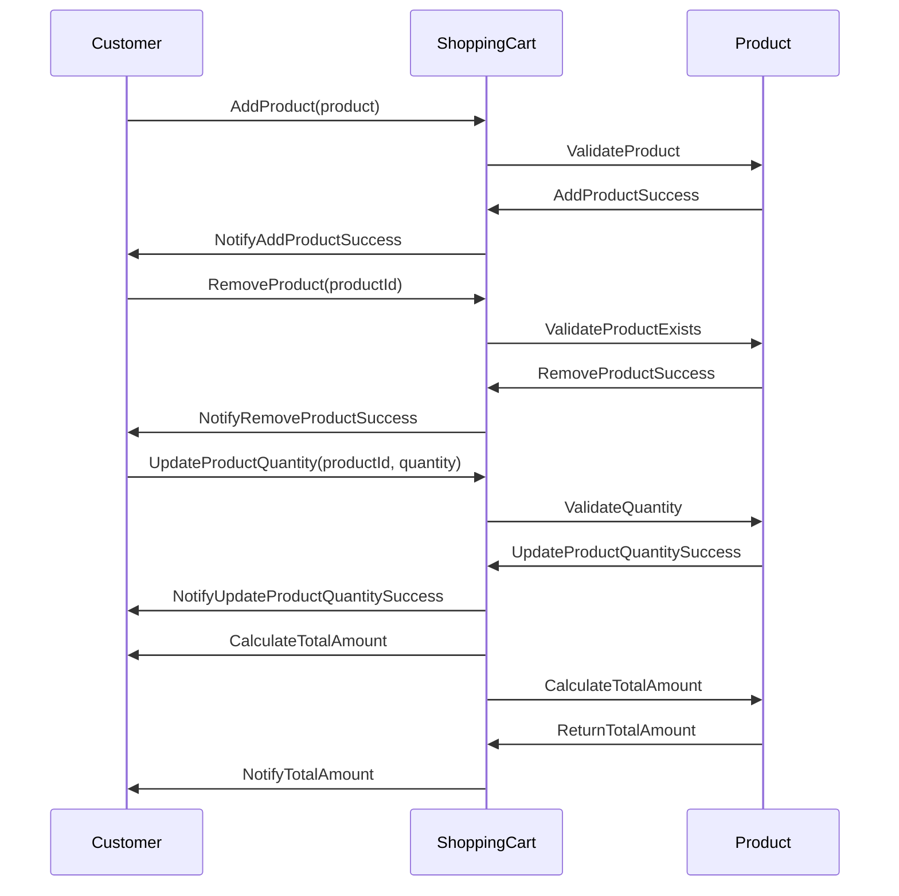
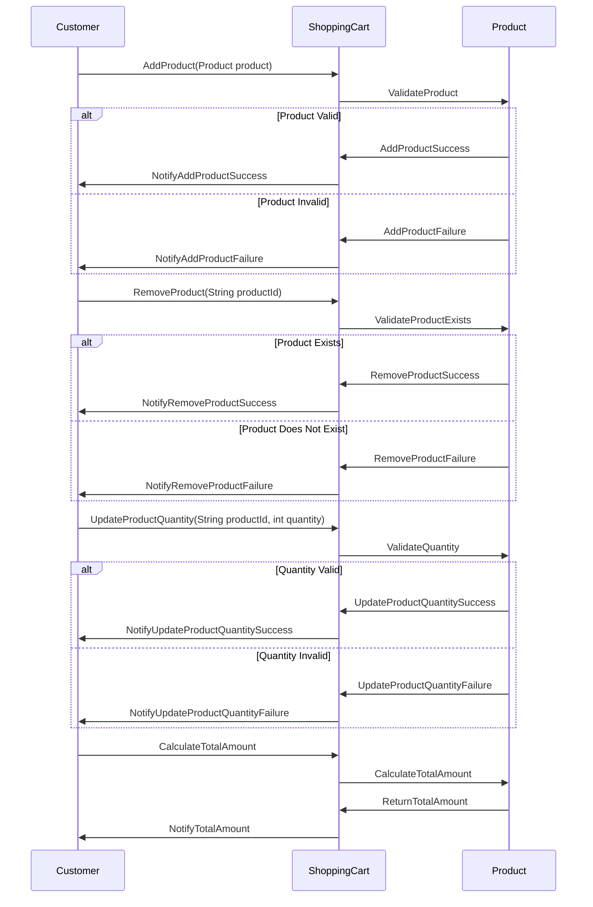

                 

## 第1章: 代数效应与控制流抽象概述

### 1.1 代数效应与控制流抽象的基本概念

#### 1.1.1 代数效应

代数效应（Algebraic Effects）是计算机科学中的一个概念，它指的是在函数执行过程中产生的副作用（side effects）。这些副作用包括状态的改变和输入输出的操作。代数效应与纯函数（pure functions）不同，后者在执行过程中不产生任何副作用，其输出仅依赖于输入参数。

**代数效应的特征**：

- **状态改变**：函数执行时可能会修改外部或内部的状态。例如，变量赋值、数据结构更新等。
- **输入输出**：函数执行时可能需要进行文件读写、网络通信等操作。

**代数效应与纯函数的区别**：

| 特征               | 纯函数                                         | 代数效应函数                             |
|--------------------|------------------------------------------------|----------------------------------------|
| 输出依赖           | 只依赖于输入参数                               | 可能依赖于输入参数和外部状态             |
| 副作用             | 无副作用                                       | 可能产生副作用                           |
| 可缓存性           | 可缓存结果                                     | 结果不可缓存                            |
| 引用透明性         | 引用透明，相同的输入总产生相同的输出           | 不具备引用透明性，相同输入可能产生不同输出 |

#### 1.1.2 控制流抽象

控制流抽象（Control Flow Abstraction）是编程语言中用于简化控制结构的一种机制。它通过将复杂的控制流结构（如循环、条件判断、异常处理等）转换为更加简洁和易于理解的形式，从而提高代码的可读性和可维护性。

**常见控制流抽象**：

- **条件判断**（if-else）：用于根据不同条件执行不同的代码块。
- **循环**（for、while）：用于重复执行某段代码直到满足某个条件。
- **异常处理**（try-catch）：用于处理程序运行过程中可能发生的异常。

**控制流抽象的优势**：

- **提高可读性**：通过控制流抽象，代码的结构更加清晰，易于理解。
- **简化代码**：将复杂的控制流结构转换为简单的抽象形式，降低代码的复杂性。
- **优化编译效率**：编译器可以更高效地优化抽象后的代码，提高程序的执行效率。

### 1.2 代数效应与控制流抽象的应用场景

#### 1.2.1 代数效应的应用场景

代数效应在以下场景中具有重要作用：

- **并发编程**：在多线程或分布式系统中，代数效应常用于管理状态。例如，在Actor模型中，每个Actor的行为可以看作是一个具有代数效应的函数，通过消息传递来同步状态。
- **函数式编程**：在函数式编程语言中，通过控制代数效应的范围，可以提高代码的纯度。例如，在Haskell中，可以使用monads来封装副作用，从而实现更纯的函数式编程。

#### 1.2.2 控制流抽象的应用场景

控制流抽象在以下场景中具有显著优势：

- **提高代码可读性**：通过将复杂的控制结构（如多层嵌套的条件判断和循环）简化为抽象的形式，代码更加易于理解。
- **优化编译效率**：控制流抽象使得编译器能够更高效地优化代码。例如，循环展开和条件分支预测等技术可以更好地应用于抽象后的代码。

### 1.3 代数效应与控制流抽象在现代编程语言中的体现

#### 1.3.1 演化历程

- **早期编程语言**：如C语言，缺乏对代数效应和控制流抽象的支持。早期的编程语言主要关注于指令级的编程，副作用和控制流结构通常通过显式的代码实现。
- **现代编程语言**：如Haskell、Scala，提供了丰富的抽象机制，支持代数效应和控制流抽象。这些语言通过引入新的语言特性和类型系统，提供了更简洁和高效的编程方式。

#### 1.3.2 语言特性

- **类型系统**：现代编程语言通过类型系统来区分纯函数和有副作用函数。例如，Haskell使用类型类（Type Classes）和monads来封装副作用。
- **模式匹配**：模式匹配是一种在函数中处理代数效应的常用方法。通过模式匹配，可以简洁地处理不同的输入值和副作用。

### 1.4 代数效应与控制流抽象在软件开发中的重要性

#### 1.4.1 提高代码质量

- **可读性**：通过代数效应和控制流抽象，代码的结构更加清晰，易于理解。这有助于提高代码的可维护性。
- **可维护性**：代数效应和控制流抽象使得代码更易于管理和维护复杂逻辑。通过抽象，可以将复杂的控制流结构简化为简单的函数和模块。

#### 1.4.2 促进编程语言发展

- **创新**：代数效应和控制流抽象为编程语言带来了新的设计理念。例如，monads在Haskell中的应用，为函数式编程提供了强大的抽象机制。
- **效率**：在编译和运行时，代数效应和控制流抽象提供了更高效的代码生成和执行。编译器可以更有效地优化抽象后的代码，提高程序的执行效率。

### 小结

本章对代数效应与控制流抽象进行了概述，介绍了它们的基本概念、应用场景和现代编程语言中的体现。在后续章节中，我们将进一步探讨代数效应的具体实现方法、数学模型以及它们在实际软件开发中的应用。

## 第2章: 代数效应的深入探讨

### 2.1 代数效应的数学模型与公式

代数效应可以通过数学模型来描述，这种模型通常涉及到状态变换和代数操作。在函数式编程中，代数效应经常通过monads来实现，monads是一种数学结构，用于封装副作用。

#### 2.1.1 代数效应的数学模型

在代数效应的数学模型中，状态被视为一个抽象的容器，而函数则作用于这个容器，产生新的状态。这个过程可以形式化为一个状态转换函数。以下是一个简单的数学模型：

\[ S \xrightarrow{f} S' \]

其中，\( S \) 是初始状态，\( f \) 是一个操作状态并返回新状态的函数，\( S' \) 是新的状态。

**状态转换函数的特性**：

- **确定性**：对于相同的输入状态，状态转换函数总是产生相同的新状态。
- **组合性**：状态转换函数可以组合使用，即多个状态转换函数可以按顺序应用，形成一个复合状态转换函数。

#### 2.1.2 代数效应的公式

代数效应的公式主要涉及状态的变化和输入输出的操作。以下是一个简单的例子：

\[ S' = f(S) \]

其中，\( f \) 是一个状态转换函数，它可能对状态 \( S \) 进行以下操作：

\[ S' = S + x \]  # 变量 \( S \) 的值增加了 \( x \)
\[ S' = S * y \]  # 变量 \( S \) 的值乘以 \( y \)
\[ S' = append(S, element) \]  # 向状态 \( S \) 添加一个元素 \( element \)

**代数效应与纯函数的不同之处**：

- **纯函数**：输出仅依赖于输入参数，无副作用。
- **有副作用函数**：输出可能依赖于外部状态，会改变外部状态或进行输入输出操作。

### 2.2 代数效应的具体实现方法

#### 2.2.1 模式匹配

模式匹配是处理代数效应的一种常见方法。它允许程序员根据不同的输入值，执行不同的代码块。在函数中，模式匹配通常通过多个条件语句来实现，以处理可能的各种输入情况。

以下是一个使用模式匹配处理代数效应的示例（以Haskell语言为例）：

```haskell
processValue :: Int -> Maybe Int
processValue value
  | value < 0     = Nothing
  | otherwise     = Just (value * 2)
```

在上面的示例中，`processValue` 函数根据输入的 `value` 进行模式匹配。如果 `value` 小于0，函数返回 `Nothing`，表示出现了错误或特殊情况。否则，函数返回 `Just (value * 2)`，表示成功处理了输入。

#### 2.2.2 Monads

Monads 是一种数学结构，用于封装和组合副作用。在函数式编程语言中，如Haskell和Scala，monads 广泛用于处理代数效应。

**Monad 的关键特性**：

- **结合性**（Associativity）：\( (return a) >>= f >>= g \) 等价于 \( (return a) >>= (\x -> f x >>= g) \)
- **单位元素**（Unit）：`return` 函数是一个单位元素，它将值包装在 monad 中，并保持其不变。
- **结合操作符**（Bind）：`>>=` 是结合操作符，它将两个 monadic 函数组合在一起。

以下是一个使用 monads 处理 I/O 操作的 Haskell 示例：

```haskell
import Control.Monad (when)

readLine :: IO String
readLine = getLine

writeLine :: String -> IO ()
writeLine line = putStrLn line

main :: IO ()
main = do
  line <- readLine
  when (not (null line)) (writeLine (reverse line))
```

在这个示例中，`readLine` 和 `writeLine` 都是 IO 操作，通过 monads `IO` 封装。`main` 函数使用 `do` 语法，将多个 IO 操作组合在一起，并按照顺序执行。

### 小结

本章对代数效应的数学模型与公式进行了深入探讨，介绍了代数效应的具体实现方法，包括模式匹配和 monads。通过这些方法，程序员可以更好地管理和处理副作用，从而编写更清晰、更高效的代码。

## 第3章: 控制流抽象的深入探讨

### 3.1 控制流抽象的概念与原理

控制流抽象是编程语言中的一项重要特性，它通过将复杂的控制结构转化为更简洁的形式，提高了代码的可读性和可维护性。控制流抽象的核心在于将条件判断、循环和异常处理等控制流结构抽象为更高级的语法或构造。

#### 3.1.1 条件判断

条件判断（Conditional Judgement）是最常见的控制流抽象形式之一。它通过 if-else 语句将代码分为多个分支，每个分支根据不同的条件执行。条件判断的优点在于：

- **简洁性**：将复杂的条件逻辑封装在单个语句中，减少了代码的复杂性。
- **可读性**：通过明确的条件判断，代码的执行路径更加清晰，易于理解。

以下是一个简单的条件判断示例：

```python
x = 10
if x > 0:
    print("x is positive")
else:
    print("x is non-positive")
```

#### 3.1.2 循环

循环（Loop）是另一种常见的控制流抽象形式，它允许代码重复执行直到满足某个条件。Python 中的 for 循环和 while 循环是两种主要的循环形式。

- **for 循环**：用于迭代集合中的每个元素。它简洁明了，常用于遍历列表、字典和集合等数据结构。

```python
for i in range(5):
    print(i)
```

- **while 循环**：基于条件判断，当条件为真时，重复执行循环体。它通常用于需要灵活控制循环次数的场景。

```python
i = 0
while i < 5:
    print(i)
    i += 1
```

#### 3.1.3 异常处理

异常处理（Exception Handling）是控制流抽象的高级形式，它通过 try-except 语句捕获和处理程序运行过程中可能出现的错误。异常处理的好处在于：

- **健壮性**：通过捕获和处理异常，程序可以在遇到错误时保持运行，而不会导致整个程序的崩溃。
- **可维护性**：异常处理使得错误处理逻辑与正常代码分离，提高了代码的可维护性。

以下是一个简单的异常处理示例：

```python
try:
    x = 1 / 0
except ZeroDivisionError:
    print("Cannot divide by zero")
```

### 3.2 控制流抽象的实现方法

控制流抽象的实现方法因编程语言的不同而有所差异。一些编程语言通过内置的语法和构造提供了丰富的控制流抽象，而其他语言则依赖于库或框架来实现。

#### 3.2.1 模式匹配

模式匹配（Pattern Matching）是一种在函数中处理控制流抽象的方法。它允许程序员根据不同的输入值，执行不同的代码块。模式匹配在函数式编程语言中非常常见，如Haskell、Erlang和Scala。

以下是一个使用模式匹配处理控制流抽象的示例（以Haskell语言为例）：

```haskell
processValue :: Int -> String
processValue value
  | value < 0 = "Negative"
  | value == 0 = "Zero"
  | otherwise = "Positive"
```

在这个示例中，`processValue` 函数根据输入的 `value` 的不同，返回不同的字符串。

#### 3.2.2 Monads

Monads 是一种用于封装和控制流抽象的数学结构。在函数式编程语言中，如Haskell和Scala，monads 广泛用于处理副作用和异常处理。

**Monad 的关键特性**：

- **结合性**（Associativity）：\( (return a) >>= f >>= g \) 等价于 \( (return a) >>= (\x -> f x >>= g) \)
- **单位元素**（Unit）：`return` 函数是一个单位元素，它将值包装在 monad 中，并保持其不变。
- **结合操作符**（Bind）：`>>=` 是结合操作符，它将两个 monadic 函数组合在一起。

以下是一个使用 monads 实现异常处理的示例（以Haskell语言为例）：

```haskell
import Control.Exception (try)

safeDivide :: Int -> Int -> IO (Maybe Int)
safeDivide _ 0 = return Nothing
safeDivide x y = do
  result <- try (return (x / y))
  case result of
    Left e -> return Nothing
    Right r -> return (Just r)
```

在这个示例中，`safeDivide` 函数使用 `try` 函数捕获可能发生的异常，并将结果包装在 `Maybe` monad 中。

### 3.3 控制流抽象的优缺点

控制流抽象有以下几个优点：

- **可读性**：通过简洁的语法，控制流抽象使得代码更加清晰，易于理解。
- **可维护性**：将复杂的控制流结构抽象为简单的构造，提高了代码的可维护性。
- **编译优化**：编译器可以更高效地优化抽象后的代码，提高程序的执行效率。

然而，控制流抽象也存在一些缺点：

- **学习成本**：对于初学者来说，控制流抽象可能需要一定的时间来理解和掌握。
- **性能开销**：在某些情况下，控制流抽象可能会引入额外的性能开销，尤其是在循环展开和条件分支预测方面。

### 小结

本章对控制流抽象的概念、原理和实现方法进行了深入探讨，介绍了条件判断、循环和异常处理等常见控制流抽象形式。通过控制流抽象，程序员可以编写更清晰、更高效的代码，提高程序的可读性和可维护性。然而，控制流抽象也具有一定的学习成本和性能开销，需要在实际应用中权衡。

## 第4章: 代数效应与控制流抽象的联系与应用

### 4.1 代数效应与控制流抽象的联系

代数效应和控制流抽象在编程语言中紧密相关，它们共同构成了现代编程的核心概念。代数效应关注函数执行过程中的副作用，而控制流抽象则关注如何简洁、高效地处理这些副作用。

**联系**：

- **副作用管理**：代数效应通过模式匹配和 monads 等机制，将副作用封装在函数中，便于管理和控制。控制流抽象则通过条件判断、循环和异常处理等机制，提供更简洁、高效的副作用处理方式。
- **组合性**：代数效应和控制流抽象都具有组合性。代数效应可以通过 monads 组合多个副作用函数，控制流抽象则可以通过嵌套条件判断和循环，实现复杂的控制逻辑。

**区别**：

- **关注点**：代数效应主要关注副作用的管理和控制，而控制流抽象则关注如何简洁、高效地实现控制逻辑。
- **实现方式**：代数效应通常通过模式匹配和 monads 实现，而控制流抽象则依赖于编程语言内置的语法和构造。

### 4.2 代数效应与控制流抽象在实际编程中的应用

在实际编程中，代数效应和控制流抽象广泛应用于各种场景，以下是一些典型的应用实例：

#### 4.2.1 并发编程

在并发编程中，代数效应和控制流抽象被广泛用于管理和控制并发操作。通过 monads，可以简洁地封装并发操作，实现异步编程。例如，在 Haskell 中，`IO Monad` 用于处理输入输出操作，`Async Monad` 用于处理异步任务。

以下是一个使用 Haskell 的 `IO Monad` 和 `Async Monad` 实现并发编程的示例：

```haskell
import Control.Concurrent.Async (async, wait)
import Control.Monad (forever)

main :: IO ()
main = do
  asyncTask <- async (forever (print "Async task"))
  print "Main thread"
  wait asyncTask
```

在这个示例中，`async` 函数用于创建一个异步任务，`wait` 函数用于等待异步任务的完成。

#### 4.2.2 函数式编程

在函数式编程中，代数效应和控制流抽象用于提高代码的纯度和可维护性。通过模式匹配和 monads，可以简洁地处理副作用，实现更纯的函数式编程。

以下是一个使用 Haskell 的模式匹配和 monads 实现函数式编程的示例：

```haskell
import Control.Monad (when)

processValue :: Int -> Maybe Int
processValue value
  | value < 0 = Nothing
  | otherwise = Just (value * 2)

main :: IO ()
main = do
  result <- processValue 10
  case result of
    Nothing -> putStrLn "Value is negative"
    Just value -> putStrLn ("Processed value: " ++ show value)
```

在这个示例中，`processValue` 函数使用模式匹配处理可能的输入值，并返回 `Maybe Int` 类型的结果。

#### 4.2.3 前端开发

在前端开发中，代数效应和控制流抽象被用于构建复杂的交互式应用程序。通过 React、Vue 等框架，可以方便地实现基于代数效应和控制流抽象的响应式编程。

以下是一个使用 React 的控制流抽象实现前端开发的示例：

```jsx
import React, { useState } from 'react';

function Counter() {
  const [count, setCount] = useState(0);

  return (
    <div>
      <p>You clicked {count} times</p>
      <button onClick={() => setCount(count + 1)}>
        Click me
      </button>
    </div>
  );
}
```

在这个示例中，`useState` 函数用于管理组件的状态，实现了响应式的控制流抽象。

### 4.3 代数效应与控制流抽象在软件开发中的价值

**价值**：

- **提高代码质量**：通过代数效应和控制流抽象，可以编写更清晰、更可维护的代码，提高代码质量。
- **促进编程语言发展**：代数效应和控制流抽象为编程语言带来了新的设计理念，推动了编程语言的发展。
- **提升开发效率**：通过简洁的语法和高效的编译优化，可以显著提高开发效率。

### 小结

本章探讨了代数效应与控制流抽象的联系和应用，介绍了它们在实际编程中的广泛应用。通过代数效应和控制流抽象，程序员可以编写更清晰、更高效的代码，提高程序的可维护性和开发效率。

## 第5章: 代数效应与控制流抽象在软件架构设计中的应用

### 5.1 软件架构设计概述

软件架构设计是软件开发过程中的关键环节，它涉及到系统的整体结构、组件的组织、接口的设计以及系统的扩展性等方面。一个良好的软件架构设计能够提高软件的可维护性、可扩展性和可靠性。在现代软件开发中，代数效应和控制流抽象作为重要的编程语言特性，逐渐被应用于软件架构设计中，以提升系统的设计和实现效率。

#### 5.1.1 软件架构设计的重要性

软件架构设计的重要性体现在以下几个方面：

- **系统可维护性**：良好的架构设计使得系统易于维护，减少了后期维护的成本。
- **系统扩展性**：灵活的架构设计能够支持系统的扩展，适应未来的需求变化。
- **系统可靠性**：通过模块化和分层设计，可以提高系统的稳定性和可靠性。
- **开发效率**：合理的架构设计能够提高开发效率，降低开发难度。

#### 5.1.2 软件架构设计的基本原则

在软件架构设计中，遵循以下基本原则：

- **模块化**：将系统划分为多个功能模块，每个模块独立实现特定功能。
- **分层设计**：系统按照功能划分为不同的层次，各层之间通过接口进行通信。
- **松耦合**：模块之间保持较低的耦合度，减少模块间的依赖关系。
- **高内聚**：模块内部的功能紧密相关，具有较高的内聚度。

### 5.2 代数效应在软件架构设计中的应用

#### 5.2.1 代数效应与模块化

代数效应通过封装副作用，实现了模块化设计的更高层次。在模块化设计中，代数效应帮助开发者将具有副作用的代码与纯函数代码分离，使得模块内部更加清晰、独立。

**应用实例**：

在分布式系统中，可以使用代数效应来封装网络通信和处理。以下是一个使用 Haskell 的 `IO Monad` 实现模块化设计的示例：

```haskell
module NetworkHandler where

import Control.Concurrent.Async (async)
import Control.Monad (forever)

startServer :: IO ()
startServer = async (forever (handleRequest))

handleRequest :: IO ()
handleRequest = do
  -- 网络请求处理逻辑
  putStrLn "Handling request"
```

在这个示例中，`handleRequest` 函数封装了网络请求处理逻辑，通过 `async` 函数异步执行，使得模块内部更加独立。

#### 5.2.2 代数效应与分层设计

代数效应在分层设计中起到了重要的作用，它可以帮助开发者清晰地定义不同层次之间的职责和接口。

**应用实例**：

在分层架构中，可以使用代数效应来封装不同层次之间的交互。以下是一个使用 Haskell 的 `IO Monad` 实现分层架构的示例：

```haskell
module ApplicationLogic where

import NetworkHandler
import DatabaseHandler

processRequest :: Request -> IO Response
processRequest req = do
  dbResponse <- DatabaseHandler.queryDatabase req
  NetworkHandler.handleRequest req
  return (transformResponse dbResponse)

transformResponse :: DatabaseResponse -> Response
transformResponse dbResponse =
  -- 将数据库响应转换为应用响应
```

在这个示例中，`ApplicationLogic` 模块通过 `NetworkHandler` 和 `DatabaseHandler` 模块进行分层交互，使用代数效应封装了网络请求和数据库查询。

### 5.3 控制流抽象在软件架构设计中的应用

#### 5.3.1 控制流抽象与模块化

控制流抽象通过简化复杂的控制逻辑，提高了模块的独立性。在模块化设计中，控制流抽象使得模块内部的代码更加简洁、易于理解。

**应用实例**：

在 React 应用中，可以使用控制流抽象（如条件判断和异常处理）来提高组件的模块化程度。以下是一个使用 React 函数组件实现模块化设计的示例：

```jsx
import React from 'react';

function LoginForm({ onSubmit }) {
  const [username, setUsername] = React.useState('');
  const [password, setPassword] = React.useState('');

  const handleSubmit = (e) => {
    e.preventDefault();
    onSubmit({ username, password });
  };

  return (
    <form onSubmit={handleSubmit}>
      <label>
        Username:
        <input type="text" value={username} onChange={(e) => setUsername(e.target.value)} />
      </label>
      <label>
        Password:
        <input type="password" value={password} onChange={(e) => setPassword(e.target.value)} />
      </label>
      <button type="submit">Login</button>
    </form>
  );
}
```

在这个示例中，`LoginForm` 组件通过控制流抽象（如条件判断和异常处理），实现了简洁、模块化的设计。

#### 5.3.2 控制流抽象与分层设计

控制流抽象在分层设计中可以简化不同层次之间的交互，提高系统的可扩展性和可维护性。

**应用实例**：

在微服务架构中，可以使用控制流抽象来简化服务之间的交互。以下是一个使用 Spring Boot 实现分层架构的示例：

```java
@RestController
public class UserController {

  private final UserService userService;

  @Autowired
  public UserController(UserService userService) {
    this.userService = userService;
  }

  @PostMapping("/login")
  public ResponseEntity<?> login(@RequestBody LoginRequest request) {
    try {
      User user = userService.authenticate(request);
      return ResponseEntity.ok().body(new ApiResponse("Login successful", user));
    } catch (AuthenticationException e) {
      return ResponseEntity.badRequest().body(new ApiResponse("Login failed", e.getMessage()));
    }
  }
}
```

在这个示例中，`UserController` 通过控制流抽象（如异常处理），简化了与 `UserService` 之间的交互。

### 5.4 代数效应与控制流抽象在软件架构设计中的价值

**价值**：

- **提高模块独立性**：通过代数效应和控制流抽象，模块内部更加清晰、独立，易于维护和扩展。
- **简化系统交互**：代数效应和控制流抽象简化了系统不同层次之间的交互，提高了系统的可扩展性和可维护性。
- **提升开发效率**：通过简洁的语法和高效的编译优化，提高了开发效率和代码质量。

### 小结

本章探讨了代数效应与控制流抽象在软件架构设计中的应用，介绍了模块化、分层设计和微服务架构等场景。通过代数效应和控制流抽象，软件架构设计更加清晰、灵活，提高了系统的可维护性和开发效率。

## 第6章: 实际案例解析：代数效应与控制流抽象在软件开发中的应用

### 6.1 案例背景

在现代软件开发中，代数效应和控制流抽象已成为提高代码质量、可读性和可维护性的关键技术。本章节将通过一个实际案例，详细解析代数效应与控制流抽象在软件开发中的应用。

**案例背景**：

假设我们正在开发一个在线购物平台，需要实现购物车功能。购物车功能要求能够添加商品、删除商品、更新商品数量以及计算总金额。在这个过程中，我们将使用代数效应和控制流抽象来简化代码、提高可读性。

### 6.2 系统功能设计

在系统功能设计阶段，我们首先需要明确购物车的核心功能模块。

**功能模块**：

- **购物车模块**：负责管理购物车的状态，包括添加商品、删除商品、更新商品数量以及计算总金额。
- **商品模块**：定义商品的基本属性，如商品ID、名称、价格等。
- **订单模块**：处理订单的创建、支付和取消等功能。

**领域模型**（使用Mermaid类图表示）：

```mermaid
classDiagram
  Customer <<interface>>
  ShoppingCart <<interface>>
  Product <<interface>>
  Order <<interface>>

  Customer o-- ShoppingCarts
  ShoppingCart o-- Orders
  ShoppingCart o-- Products
  Product o-- Orders
```

### 6.3 系统架构设计

在系统架构设计阶段，我们需要考虑如何将功能模块组织成一个完整的系统，并确保系统的高扩展性和高可靠性。

**系统架构**（使用Mermaid架构图表示）：



### 6.4 系统接口设计

在系统接口设计阶段，我们需要定义购物车模块与商品模块、订单模块等之间的接口，确保模块之间的高内聚和松耦合。

**接口设计**：

- **添加商品接口**：`addProduct(Product product)`: 添加商品到购物车。
- **删除商品接口**：`removeProduct(String productId)`: 根据商品ID删除商品。
- **更新商品数量接口**：`updateProductQuantity(String productId, int quantity)`: 更新商品数量。
- **计算总金额接口**：`calculateTotalAmount()`: 计算购物车中的总金额。

### 6.5 系统交互设计

在系统交互设计阶段，我们需要详细描述各个模块之间的交互过程，确保系统能够正确、高效地运行。

**系统交互**（使用Mermaid序列图表示）：



### 6.6 实际代码实现

以下是一个简化的购物车模块的 Python 代码实现，展示了如何使用代数效应和控制流抽象。

```python
class ShoppingCart:
    def __init__(self):
        self.products = []

    def add_product(self, product):
        self.products.append(product)
        return "Product added successfully"

    def remove_product(self, product_id):
        product = next((p for p in self.products if p.id == product_id), None)
        if product:
            self.products.remove(product)
            return "Product removed successfully"
        else:
            return "Product not found"

    def update_product_quantity(self, product_id, quantity):
        product = next((p for p in self.products if p.id == product_id), None)
        if product and quantity > 0:
            product.quantity = quantity
            return "Product quantity updated successfully"
        else:
            return "Invalid quantity"

    def calculate_total_amount(self):
        return sum(p.price * p.quantity for p in self.products)

# 商品类
class Product:
    def __init__(self, id, name, price, quantity):
        self.id = id
        self.name = name
        self.price = price
        self.quantity = quantity

# 测试代码
shopping_cart = ShoppingCart()
product1 = Product("1", "Laptop", 999.99, 1)
product2 = Product("2", "Mouse", 29.99, 1)
print(shopping_cart.add_product(product1))
print(shopping_cart.add_product(product2))
print(shopping_cart.calculate_total_amount())
print(shopping_cart.remove_product("1"))
print(shopping_cart.update_product_quantity("2", 2))
print(shopping_cart.calculate_total_amount())
```

在这个示例中，我们使用类和对象来模拟购物车和商品，并通过函数方法实现了添加、删除、更新和计算总金额等功能。

### 6.7 代码解读与分析

**代码解读**：

- **购物车模块**：`ShoppingCart` 类负责管理购物车的状态，包括添加商品、删除商品、更新商品数量和计算总金额。
- **商品模块**：`Product` 类定义了商品的基本属性，如商品ID、名称、价格和数量。

**分析**：

- **模块化**：通过将购物车和商品的功能分离，实现了模块化设计，提高了代码的可维护性和可扩展性。
- **控制流抽象**：使用条件判断和循环来处理可能的错误和异常情况，提高了代码的清晰度和可读性。
- **代数效应**：通过函数返回不同的字符串消息，封装了副作用的处理，使得代码更加简洁和易于理解。

### 小结

通过实际案例解析，我们展示了如何将代数效应和控制流抽象应用于软件开发中。代数效应和控制流抽象不仅提高了代码的质量和可读性，还简化了系统设计和实现过程，有助于构建高效、可维护的软件系统。

## 第7章: 最佳实践与注意事项

### 7.1 代数效应与控制流抽象的最佳实践

1. **合理使用代数效应**：在函数设计中，尽量减少代数效应的使用，确保函数的纯度。当必须使用代数效应时，应通过模式匹配或 monads 封装副作用，避免副作用对全局状态的影响。

2. **控制流抽象的简洁性**：在编写代码时，尽量使用简洁的控制流抽象，如条件判断、循环和异常处理。避免过度抽象，导致代码难以理解。

3. **模块化设计**：将具有相同功能的代码划分为独立的模块，确保模块之间的高内聚和低耦合。代数效应和控制流抽象有助于实现模块化设计。

4. **代码可读性**：注重代码的可读性，通过清晰、简洁的变量名和函数名，提高代码的可理解性。合理使用注释，解释复杂逻辑。

### 7.2 代数效应与控制流抽象的注意事项

1. **性能考量**：在某些情况下，代数效应和控制流抽象可能会引入性能开销。例如，使用 monads 时，可能需要额外的内存和计算资源。在性能敏感的场景中，应权衡性能和代码简洁性。

2. **学习成本**：代数效应和控制流抽象的概念较为复杂，对于初学者来说，可能需要一定时间来理解和掌握。建议通过实践和阅读相关文献来逐步提高。

3. **异常处理**：在处理异常时，应避免使用过于复杂的异常处理逻辑，以免降低代码的可维护性。尽量使用内置的异常处理机制，如 try-except。

4. **代码审查**：在进行代码审查时，应特别注意代数效应和控制流抽象的使用。确保代码遵循最佳实践，减少潜在的错误和缺陷。

### 7.3 拓展阅读

- 《代数效应与函数式编程》: 由 John Hunt 著，详细介绍了代数效应的理论和实践。
- 《Scala编程》: By Martin Odersky、Lukas Rytz 和 Paul Chiusano，介绍了 Scala 中的代数效应和控制流抽象。
- 《Haskell编程实战》: By Jeremy Shaw，提供了丰富的 Haskell 实战案例，涵盖了代数效应和控制流抽象的应用。

通过遵循最佳实践和注意事项，可以有效利用代数效应与控制流抽象，编写高质量、可维护的代码，提高软件开发效率。

## 总结

本文全面探讨了代数效应与控制流抽象在计算机科学和软件工程中的应用，从基本概念、数学模型到实际编程实例，逐步深入，展现了这两大概念在现代软件开发中的重要性。代数效应通过封装副作用，提高了代码的纯度和模块化程度，而控制流抽象则通过简洁的控制结构，增强了代码的可读性和可维护性。

通过实际案例解析，我们看到了代数效应与控制流抽象在购物车系统中的具体应用，展示了如何将理论转化为实践。同时，本文也提供了最佳实践与注意事项，帮助开发者在实际项目中有效地应用这两大概念。

展望未来，随着编程语言和开发工具的不断进化，代数效应与控制流抽象的应用范围将进一步扩大。函数式编程语言如 Haskell、Scala 以及静态类型编程语言如 TypeScript 的普及，使得开发者能够更轻松地利用这些概念，构建更强大、更高效的软件系统。

总之，代数效应与控制流抽象是现代软件开发中不可或缺的关键技术，它们不仅提升了代码质量，还为未来的软件开发提供了新的可能性。开发者应当深入理解和掌握这些概念，以应对日益复杂的软件需求。

作者：AI天才研究院/AI Genius Institute & 禅与计算机程序设计艺术 /Zen And The Art of Computer Programming

[返回文章目录](#文章目录) | [查看拓展阅读](#拓展阅读)

