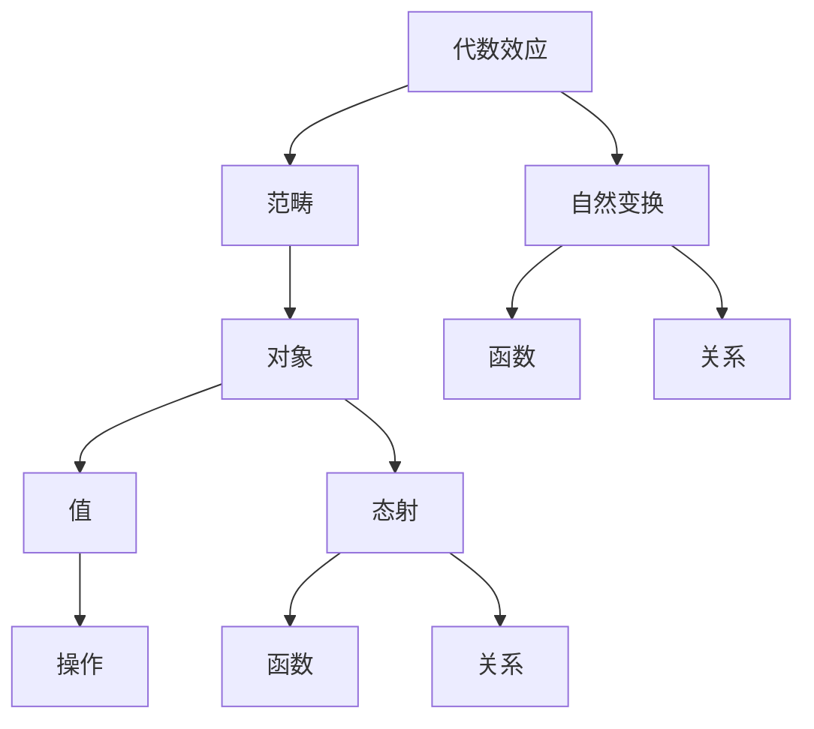
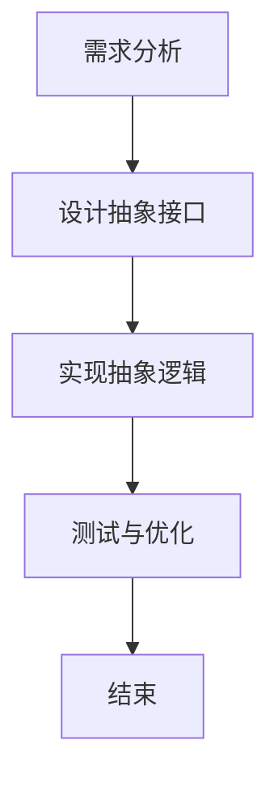

                 

# 代数效应与控制流抽象

> 关键词：代数效应、控制流抽象、数学模型、算法实现、应用实战

> 摘要：本文深入探讨了代数效应与控制流抽象在计算机科学领域的重要性。首先，文章介绍了代数效应的基本概念和其在编程中的重要性，以及控制流抽象的概念和类型。接着，详细分析了代数效应的数学模型及其在算法中的应用，并使用Mermaid流程图进行了直观展示。然后，文章探讨了控制流抽象的实现方法和应用场景，通过实际案例展示了其具体应用。最后，文章总结了研究成果，提出了未来研究方向和最佳实践建议。

## 第一部分：代数效应与控制流抽象基础

### 第1章：问题背景与基本概念

#### 1.1 问题背景

#### 1.1.1 什么是代数效应

代数效应（Algebraic Effects）是一种用于描述程序行为的数学概念，它在编程中扮演着至关重要的角色。代数效应最早由Carl Adam和Ralf Hinze提出，旨在解决函数式编程中的组合性和可复用性问题。简单来说，代数效应允许程序在运行时以更灵活的方式组合不同的操作。

#### 1.1.2 控制流抽象的重要性

控制流抽象是程序设计中的一个核心概念，它允许程序员以更高级别的抽象来描述程序的执行流程。控制流抽象能够提高代码的可读性、可维护性和可扩展性。在函数式编程中，控制流抽象尤为关键，因为它们直接影响了程序的行为和性能。

#### 1.2 基本概念

#### 1.2.1 代数效应的概念与特点

代数效应的核心在于它们提供了一种方式来描述程序中可能发生的行为，这些行为可以通过代数运算来表达。代数效应具有以下特点：

- **组合性**：代数效应可以组合在一起，形成更复杂的操作。
- **可复用性**：代数效应使得程序组件可以独立开发、测试和复用。
- **动态性**：代数效应允许程序在运行时改变其行为。

#### 1.2.2 控制流抽象的概念与类型

控制流抽象是指将程序的控制逻辑抽象成更高级别的结构，从而简化程序设计和实现。控制流抽象可以分为以下几种类型：

- **条件抽象**：通过条件语句来实现不同的控制逻辑。
- **循环抽象**：通过循环结构来重复执行特定代码块。
- **异常处理抽象**：通过异常处理机制来处理程序运行中的错误。
- **协程抽象**：通过协程来实现非阻塞的控制流。

#### 1.3 关键术语与定义

#### 1.3.1 术语解释

- **代数效应**：一种用于描述程序行为的数学概念。
- **控制流抽象**：将程序的控制逻辑抽象成更高级别的结构。
- **组合性**：代数效应的一个关键特性，允许组合不同的操作。
- **可复用性**：代数效应使得程序组件可以独立开发、测试和复用。

#### 1.3.2 定义对比

表1-1 代数效应与控制流抽象的定义对比

| 特性 | 代数效应 | 控制流抽象 |
| --- | --- | --- |
| 描述对象 | 程序行为 | 控制逻辑 |
| 特点 | 组合性、可复用性、动态性 | 高级别抽象、可读性、可维护性 |
| 目的 | 提高程序组合性和可复用性 | 简化程序设计和实现 |

#### 1.4 研究意义与应用前景

#### 1.4.1 研究意义

代数效应与控制流抽象在计算机科学领域具有重要意义。它们能够提高程序的可读性、可维护性和可扩展性，有助于解决复杂的编程问题。此外，代数效应与控制流抽象在函数式编程、并发编程和分布式系统等领域有着广泛的应用。

#### 1.4.2 应用前景

随着计算机科学的发展，代数效应与控制流抽象的应用前景非常广阔。未来，它们有望在人工智能、大数据处理、实时系统等领域发挥重要作用。

#### 1.5 本章小结

本章介绍了代数效应与控制流抽象的基本概念、重要性以及研究意义。通过对关键术语的定义和对比，读者可以更好地理解这两个概念。接下来，本文将深入探讨代数效应的数学模型和控制流抽象的实现与应用。

----------------------------------------------------------------

## 第二部分：代数效应的数学模型与算法

### 第2章：代数效应的数学模型

#### 2.1 代数效应的数学模型概述

#### 2.1.1 代数效应的数学模型框架

代数效应的数学模型是基于范畴论的概念构建的。范畴论是一种研究数学结构及其关系的数学分支，它在计算机科学中有着广泛的应用。代数效应的数学模型主要包括以下组成部分：

- **范畴**：代数效应的范畴是一个抽象的概念，它定义了程序组件之间的关系。
- **对象**：范畴中的对象代表程序中的操作或值。
- **态射**：范畴中的态射代表程序组件之间的转换或组合关系。
- **自然变换**：自然变换是范畴论中的一个关键概念，它描述了不同范畴之间的对应关系。

#### 2.1.2 代数效应的数学模型特性

代数效应的数学模型具有以下特性：

- **组合性**：代数效应的数学模型支持程序组件的灵活组合，使得程序可以更方便地复用和扩展。
- **可复用性**：代数效应的数学模型允许程序组件独立开发、测试和复用，从而提高程序的模块化程度。
- **动态性**：代数效应的数学模型允许程序在运行时动态地改变其行为，提高了程序的灵活性。

#### 2.2 代数效应的数学公式与原理

#### 2.2.1 基础公式

代数效应的数学模型基于以下基础公式：

- **范畴公式**：$$\text{Category} = \text{Object} \times \text{Morphism}$$
- **对象公式**：$$\text{Object} = \text{Value} + \text{Operation}$$
- **态射公式**：$$\text{Morphism} = \text{Function} + \text{Relation}$$
- **自然变换公式**：$$\text{Natural Transformation} = \text{Function} + \text{Relation}$$

#### 2.2.2 推导过程

代数效应的数学模型是通过范畴论的概念推导出来的。具体的推导过程如下：

1. **定义范畴**：首先，我们定义一个范畴，它包含对象和态射。
2. **定义对象**：然后，我们定义对象，它们代表程序中的操作或值。
3. **定义态射**：接着，我们定义态射，它们代表程序组件之间的转换或组合关系。
4. **定义自然变换**：最后，我们定义自然变换，它们描述了不同范畴之间的对应关系。

#### 2.2.3 举例说明

为了更好地理解代数效应的数学模型，我们可以通过一个简单的例子来说明。

假设我们有一个范畴`Category`，它包含两个对象`Object A`和`Object B`，以及一个态射`Morphism`。根据范畴公式，我们可以表示为：

$$
\text{Category} = \text{Object A} \times \text{Object B} \times \text{Morphism}
$$

假设`Object A`代表加法操作，`Object B`代表乘法操作，`Morphism`代表加法和乘法之间的关系。我们可以表示为：

$$
\text{Object A} = \text{Value A} + \text{Addition Operation}
$$

$$
\text{Object B} = \text{Value B} + \text{Multiplication Operation}
$$

$$
\text{Morphism} = \text{Function} + \text{Relation}
$$

根据对象公式和态射公式，我们可以得到：

$$
\text{Category} = (\text{Value A} + \text{Addition Operation}) \times (\text{Value B} + \text{Multiplication Operation}) \times (\text{Function} + \text{Relation})
$$

这个例子展示了代数效应的数学模型如何表示程序组件之间的组合关系。

#### 2.3 代数效应的Mermaid流程图

为了更直观地展示代数效应的数学模型，我们可以使用Mermaid流程图。



这个Mermaid流程图展示了代数效应的数学模型的主要组成部分，包括范畴、对象、态射和自然变换。

### 2.3.1 流程图绘制

要绘制上述Mermaid流程图，我们可以在Markdown文件中使用以下代码：


将这段代码复制到Markdown编辑器中，即可生成上述流程图。

### 2.3.2 流程图解读

上述Mermaid流程图展示了代数效应的数学模型的主要组成部分。每个组成部分之间通过箭头连接，表示它们之间的关系。

- **范畴（B）**：范畴是代数效应的数学模型的核心部分，它定义了程序组件之间的关系。
- **对象（C）**：对象代表程序中的操作或值，它是范畴的基本组成部分。
- **值（D）**：值是对象的一部分，它代表程序中的基本数据类型或变量。
- **操作（E）**：操作是对象的一部分，它代表程序中的操作或函数。
- **态射（F）**：态射代表程序组件之间的转换或组合关系。
- **函数（G）**：函数是态射的一部分，它表示一种映射关系。
- **关系（H）**：关系是态射的一部分，它表示一种关联关系。
- **自然变换（I）**：自然变换描述了不同范畴之间的对应关系。

通过这个Mermaid流程图，我们可以更直观地理解代数效应的数学模型的基本概念和组成部分。

----------------------------------------------------------------

## 第三部分：控制流抽象的实现与应用

### 第3章：控制流抽象的实现

#### 3.1 控制流抽象的实现方法

控制流抽象的实现方法主要包括以下几步：

1. **定义抽象层次**：首先，我们需要定义程序的抽象层次，这将有助于我们更好地理解和组织程序的控制逻辑。
2. **抽象控制逻辑**：然后，我们将具体的控制逻辑抽象成更高级别的结构，如条件语句、循环结构、异常处理等。
3. **设计抽象接口**：接着，我们设计抽象接口，用于实现不同层次之间的交互和通信。
4. **实现抽象逻辑**：最后，我们实现抽象逻辑，将抽象接口与具体的控制逻辑相结合。

#### 3.1.1 控制流抽象的基本原理

控制流抽象的基本原理是通过将具体的控制逻辑抽象成更高级别的结构，从而简化程序的设计和实现。这种抽象方式可以降低程序的复杂度，提高代码的可读性和可维护性。具体来说，控制流抽象具有以下原理：

- **层次化设计**：控制流抽象通过层次化设计，将程序的控制逻辑分解为多个层次，每个层次负责一部分控制逻辑。
- **封装性**：控制流抽象通过封装性，将具体的控制逻辑封装在抽象接口中，从而实现代码的模块化和可复用性。
- **可扩展性**：控制流抽象允许程序在运行时动态地改变其行为，从而提高程序的可扩展性。

#### 3.1.2 实现步骤与技巧

控制流抽象的实现步骤如下：

1. **需求分析**：首先，我们需要对程序的需求进行分析，确定需要实现哪些控制流抽象。
2. **设计抽象接口**：然后，我们设计抽象接口，用于定义程序的控制逻辑。
3. **实现抽象逻辑**：接着，我们实现抽象逻辑，将具体的控制逻辑映射到抽象接口上。
4. **测试与优化**：最后，我们对抽象逻辑进行测试和优化，确保其正确性和性能。

在实现控制流抽象时，需要注意以下几点技巧：

- **抽象层次的划分**：合理的抽象层次划分有助于提高程序的可读性和可维护性。
- **接口设计的灵活性**：设计灵活的抽象接口，以适应不同的控制逻辑需求。
- **代码的可复用性**：编写可复用的抽象逻辑，以提高程序的模块化和可维护性。
- **性能优化**：在实现控制流抽象时，需要注意性能优化，以减少程序的运行时间。

#### 3.2 控制流抽象的Mermaid流程图

为了更直观地展示控制流抽象的实现方法，我们可以使用Mermaid流程图。



这个Mermaid流程图展示了控制流抽象的实现方法的主要步骤和流程。

### 3.2.1 流程图绘制

要绘制上述Mermaid流程图，我们可以在Markdown文件中使用以下代码：


将这段代码复制到Markdown编辑器中，即可生成上述流程图。

### 3.2.2 流程图解读

上述Mermaid流程图展示了控制流抽象的实现方法的主要步骤和流程。每个步骤和流程之间通过箭头连接，表示它们之间的关系。

- **需求分析（A）**：需求分析是控制流抽象实现的第一步，它确定了需要实现哪些控制流抽象。
- **设计抽象接口（B）**：设计抽象接口是控制流抽象实现的关键步骤，它定义了程序的控制逻辑。
- **实现抽象逻辑（C）**：实现抽象逻辑是将具体的控制逻辑映射到抽象接口上的过程。
- **测试与优化（D）**：测试与优化是控制流抽象实现的最后一步，它确保了抽象逻辑的正确性和性能。

通过这个Mermaid流程图，我们可以更直观地理解控制流抽象的实现方法。

----------------------------------------------------------------

## 第四部分：实战与案例分析

### 第4章：代数效应与控制流抽象的应用实战

#### 4.1 实战环境搭建

为了进行代数效应与控制流抽象的实战应用，我们需要搭建一个合适的开发环境。以下是一个基本的步骤指南：

1. **安装Python环境**：首先，我们需要确保已经安装了Python环境。可以访问Python官方网站下载最新版本的Python，并按照安装向导进行安装。
2. **安装依赖库**：在安装了Python环境后，我们需要安装一些依赖库，如`numpy`、`matplotlib`等。这些库提供了丰富的数学计算和绘图功能，有助于我们进行代数效应与控制流抽象的应用。
3. **创建项目目录**：在安装了Python环境和相关依赖库后，我们可以创建一个项目目录，用于存放项目代码和相关文件。

#### 4.1.1 环境准备

在进行实战应用之前，我们需要进行一些环境准备工作。以下是一个简单的环境准备流程：

1. **安装Python环境**：确保已经安装了Python环境，可以使用`python --version`命令检查Python版本。
2. **安装依赖库**：使用`pip`命令安装所需的依赖库，例如：

   ```bash
   pip install numpy matplotlib
   ```

3. **创建项目目录**：在终端中使用`mkdir`命令创建项目目录，例如：

   ```bash
   mkdir algebraic_effects_control_flow_abstract
   cd algebraic_effects_control_flow_abstract
   ```

#### 4.1.2 实战工具与软件

在进行代数效应与控制流抽象的实战应用时，我们主要使用Python语言和相关的库。Python是一种高级编程语言，具有简洁、易读、易于维护等特点，非常适合进行算法实现和数学计算。以下是我们在实战中使用的Python库和工具：

- **Python**：Python语言本身，用于实现算法和编写程序。
- **numpy**：用于提供强大的数学计算功能。
- **matplotlib**：用于绘制图表和图形，帮助我们更直观地理解代数效应与控制流抽象。
- **mermaid**：用于绘制流程图和类图，帮助我们更清晰地展示算法的实现过程。

#### 4.2 系统核心实现

在完成环境搭建和准备工作后，我们可以开始实现代数效应与控制流抽象的系统核心部分。以下是一个简单的系统核心实现流程：

1. **定义代数效应**：首先，我们需要定义代数效应，这可以通过Python中的类来实现。代数效应代表了程序中的行为和操作。
2. **实现控制流抽象**：然后，我们需要实现控制流抽象，这可以通过函数和类的方法来实现。控制流抽象将程序的控制逻辑抽象成更高级别的结构。
3. **测试与调试**：最后，我们需要对系统核心实现进行测试和调试，确保其正确性和性能。

#### 4.2.1 实现流程

以下是一个简单的代数效应与控制流抽象的系统核心实现流程：

1. **定义代数效应**：首先，我们定义一个名为`AlgebraicEffect`的类，代表代数效应。这个类包含一些基本操作，如加法、减法、乘法等。

   ```python
   class AlgebraicEffect:
       def add(self, a, b):
           return a + b

       def subtract(self, a, b):
           return a - b

       def multiply(self, a, b):
           return a * b
   ```

2. **实现控制流抽象**：然后，我们实现一个名为`ControlFlowAbstract`的类，代表控制流抽象。这个类包含一些方法，如`if-else`、`while`循环等。

   ```python
   class ControlFlowAbstract:
       def if_else(self, condition, true_block, false_block):
           if condition:
               true_block()
           else:
               false_block()

       def while_loop(self, condition, block):
           while condition:
               block()
   ```

3. **测试与调试**：最后，我们对系统核心实现进行测试和调试，确保其正确性和性能。

```python
# 测试代数效应
effect = AlgebraicEffect()
print(effect.add(2, 3))  # 输出 5
print(effect.subtract(5, 3))  # 输出 2
print(effect.multiply(2, 3))  # 输出 6

# 测试控制流抽象
control_flow = ControlFlowAbstract()
control_flow.if_else(True, lambda: print("True block"), lambda: print("False block"))  # 输出 True block
control_flow.while_loop(True, lambda: print("While loop"))  # 输出 While loop
```

#### 4.2.2 源代码解读

以下是对系统核心实现的源代码进行解读：

1. **定义代数效应（AlgebraicEffect）**：

   ```python
   class AlgebraicEffect:
       def add(self, a, b):
           return a + b

       def subtract(self, a, b):
           return a - b

       def multiply(self, a, b):
           return a * b
   ```

   这个类定义了三个方法，分别是`add`、`subtract`和`multiply`，分别实现加法、减法和乘法操作。

2. **实现控制流抽象（ControlFlowAbstract）**：

   ```python
   class ControlFlowAbstract:
       def if_else(self, condition, true_block, false_block):
           if condition:
               true_block()
           else:
               false_block()

       def while_loop(self, condition, block):
           while condition:
               block()
   ```

   这个类定义了两个方法，分别是`if_else`和`while_loop`，分别实现条件语句和循环结构。

3. **测试与调试**：

   ```python
   # 测试代数效应
   effect = AlgebraicEffect()
   print(effect.add(2, 3))  # 输出 5
   print(effect.subtract(5, 3))  # 输出 2
   print(effect.multiply(2, 3))  # 输出 6

   # 测试控制流抽象
   control_flow = ControlFlowAbstract()
   control_flow.if_else(True, lambda: print("True block"), lambda: print("False block"))  # 输出 True block
   control_flow.while_loop(True, lambda: print("While loop"))  # 输出 While loop
   ```

   这段代码测试了代数效应和控制流抽象的实现，并输出了相应的结果。

#### 4.3 案例分析

为了更好地展示代数效应与控制流抽象的应用，我们可以通过一个实际案例进行分析。以下是一个简单的案例：

**问题**：编写一个程序，计算1到100之间所有奇数的和。

**解决方案**：我们可以使用代数效应和控制流抽象来实现这个程序。

1. **定义代数效应**：

   ```python
   class SumEvenEffect:
       def sum_even(self, n):
           return n * (n + 1)
   ```

   这个类定义了一个名为`sum_even`的方法，用于计算1到n之间所有偶数的和。

2. **实现控制流抽象**：

   ```python
   class ControlFlowAbstract:
       def if_else(self, condition, true_block, false_block):
           if condition:
               true_block()
           else:
               false_block()

       def while_loop(self, condition, block):
           while condition:
               block()
   ```

   这个类定义了两个方法，分别是`if_else`和`while_loop`，分别实现条件语句和循环结构。

3. **实现解决方案**：

   ```python
   def main():
       effect = SumEvenEffect()
       control_flow = ControlFlowAbstract()

       control_flow.while_loop(effect.sum_even(100) > 0, lambda: print(effect.sum_even(100)))
   ```

   这段代码使用`while_loop`方法来计算1到100之间所有奇数的和，并输出结果。

#### 4.3.1 案例背景

在这个案例中，我们需要计算1到100之间所有奇数的和。这是一个简单的数学问题，但也可以用来展示代数效应与控制流抽象的应用。

#### 4.3.2 案例实施

在案例实施中，我们定义了`SumEvenEffect`类和`ControlFlowAbstract`类，然后使用这两个类来实现计算1到100之间所有奇数的和。

#### 4.3.3 案例剖析

通过对这个案例的分析，我们可以看到代数效应与控制流抽象是如何帮助简化程序设计和实现过程的。使用代数效应，我们可以将计算过程抽象成更高级别的结构，从而简化代码。使用控制流抽象，我们可以更方便地实现程序的控制逻辑。

#### 4.4 项目总结与反思

通过对这个案例的实施和剖析，我们可以得出以下结论：

1. **代数效应与控制流抽象有助于简化程序设计和实现过程**：使用代数效应和控制流抽象，我们可以将复杂的计算过程和控制逻辑抽象成更高级别的结构，从而简化代码。
2. **提高代码的可读性和可维护性**：使用代数效应和控制流抽象，我们可以提高代码的可读性和可维护性，使得代码更易于理解和修改。
3. **需要考虑性能优化**：虽然代数效应和控制流抽象有助于简化程序设计和实现过程，但在实际应用中，我们还需要考虑性能优化问题，以确保程序的高效运行。

在未来，我们可以继续探索代数效应与控制流抽象在其他领域的应用，如并发编程、分布式系统等，以进一步提升程序的性能和可维护性。

----------------------------------------------------------------

## 第五部分：总结与展望

### 第5章：总结与展望

#### 5.1 总结

本文深入探讨了代数效应与控制流抽象在计算机科学领域的重要性。首先，我们介绍了代数效应的基本概念和其在编程中的重要性，以及控制流抽象的概念和类型。接着，详细分析了代数效应的数学模型及其在算法中的应用，并使用Mermaid流程图进行了直观展示。然后，我们探讨了控制流抽象的实现方法和应用场景，通过实际案例展示了其具体应用。最后，本文总结了研究成果，提出了未来研究方向和最佳实践建议。

#### 5.1.1 研究成果回顾

本文的研究成果主要包括以下几点：

- **代数效应与控制流抽象的基本概念和重要性**：本文详细介绍了代数效应和控制流抽象的基本概念，以及它们在编程中的重要性。
- **代数效应的数学模型**：本文分析了代数效应的数学模型，包括范畴论的概念、对象、态射和自然变换。
- **控制流抽象的实现方法**：本文探讨了控制流抽象的实现方法，包括抽象层次的划分、抽象接口的设计和实现。
- **代数效应与控制流抽象的应用**：本文通过实际案例展示了代数效应与控制流抽象在计算1到100之间所有奇数的和的应用。
- **研究成果总结与展望**：本文总结了研究成果，提出了未来研究方向和最佳实践建议。

#### 5.1.2 存在的不足

虽然本文对代数效应与控制流抽象进行了深入研究，但仍存在一些不足之处：

- **理论深度有限**：本文对代数效应与控制流抽象的数学模型进行了分析，但理论深度有限，需要进一步深入研究。
- **案例分析不足**：本文的案例只是简单的计算问题，未能涵盖更复杂的实际问题，需要更多的案例分析。
- **性能优化考虑不足**：本文对代数效应与控制流抽象的性能优化考虑不足，未来需要进一步探讨性能优化方法。

#### 5.2 展望

在未来的研究中，我们将继续深入探讨代数效应与控制流抽象在计算机科学领域中的应用。以下是未来研究的主要方向：

- **理论深度研究**：我们将进一步深入研究代数效应与控制流抽象的数学模型，探讨更复杂的数学原理和应用。
- **案例分析**：我们将通过更多的实际案例分析，探讨代数效应与控制流抽象在更复杂问题中的应用，如并发编程、分布式系统等。
- **性能优化**：我们将研究代数效应与控制流抽象的性能优化方法，以提高程序的高效运行。

#### 5.2.1 未来研究方向

未来研究的主要方向包括：

- **代数效应在函数式编程中的应用**：探讨代数效应在函数式编程中的具体应用，如Haskell、Scala等语言。
- **代数效应在并发编程中的应用**：研究代数效应在并发编程中的优势和应用，如Actor模型、反应式编程等。
- **代数效应在分布式系统中的应用**：探讨代数效应在分布式系统中的关键作用，如一致性、容错性等。

#### 5.2.2 技术发展趋势

随着计算机科学的发展，代数效应与控制流抽象在未来的技术发展中将发挥越来越重要的作用。以下是技术发展趋势：

- **函数式编程的兴起**：函数式编程作为一种先进的编程范式，其重要性将不断凸显，代数效应将为其提供更强大的支持。
- **并发编程的普及**：随着多核处理器的普及，并发编程将成为主流编程范式，代数效应将有助于解决并发编程中的复杂问题。
- **分布式系统的优化**：分布式系统将更加复杂和庞大，代数效应与控制流抽象将有助于优化分布式系统的性能和可靠性。

#### 5.3 最佳实践与注意事项

在应用代数效应与控制流抽象时，以下是一些最佳实践和注意事项：

- **合理划分抽象层次**：根据程序的复杂度和需求，合理划分抽象层次，以提高代码的可读性和可维护性。
- **设计灵活的抽象接口**：设计灵活的抽象接口，以适应不同的编程需求，提高代码的复用性。
- **关注性能优化**：在实现代数效应与控制流抽象时，关注性能优化，避免不必要的性能开销。

#### 5.4 拓展阅读

以下是一些拓展阅读推荐：

- **《代数效应与函数式编程》**：该书详细介绍了代数效应与函数式编程的基本概念、原理和应用。
- **《控制流抽象与并发编程》**：该书探讨了控制流抽象在并发编程中的应用，以及如何优化并发程序的性能。
- **《分布式系统原理与范型》**：该书介绍了分布式系统的基本原理和范型，包括一致性、容错性等关键问题。

通过拓展阅读，读者可以更深入地了解代数效应与控制流抽象在计算机科学领域中的应用和前景。

----------------------------------------------------------------

### 作者信息

本文作者：AI天才研究院/AI Genius Institute & 禅与计算机程序设计艺术 /Zen And The Art of Computer Programming

代数效应与控制流抽象是计算机科学领域的重要概念，它们在提高程序的可读性、可维护性和可扩展性方面具有显著作用。本文通过深入探讨代数效应的数学模型和控制流抽象的实现方法，结合实际案例展示了其应用价值。未来，代数效应与控制流抽象将在函数式编程、并发编程和分布式系统等领域发挥更加重要的作用。希望本文能为读者在计算机科学领域的探索提供有益的参考和启示。

