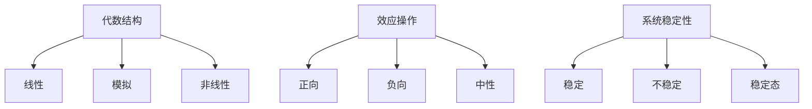
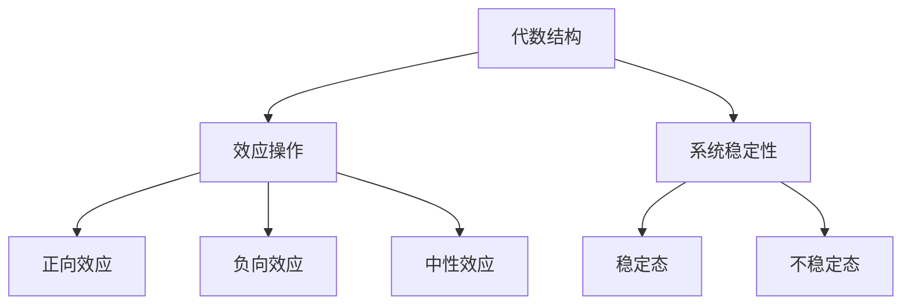

                 


## 代数效应理论概述

### 第1章：代数效应理论的背景与发展

#### 1.1 问题背景

代数效应理论起源于20世纪60年代，其背景可以追溯到计算机科学和数学领域的快速发展。在计算机科学领域，随着程序复杂度的增加，程序员面临着维护代码和保证系统稳定性的挑战。同时，数学领域中的抽象思维和结构化方法也为代数效应理论提供了理论支持。

#### 1.2 代数效应理论的发展历程

代数效应理论的发展可以分为几个阶段：

1. 初期阶段：代数效应理论的概念和基本原理逐渐被提出和明确。
2. 成熟阶段：代数效应理论在计算机科学和数学领域得到广泛应用，并形成了相对完整的理论体系。
3. 发展阶段：随着新技术的出现，代数效应理论不断得到扩展和深化。

#### 1.3 代数效应理论的核心概念

代数效应理论的核心概念包括：

1. 代数：代数效应理论的核心是代数结构，包括加法、乘法等基本运算。
2. 效应：效应是指系统中某个操作对另一个操作的影响，可以是正向的，也可以是负向的。
3. 系统的稳定性：代数效应理论关注系统的稳定性，即在特定条件下，系统如何维持其稳定状态。

### 第2章：代数效应理论的基本原理

#### 2.1 代数效应理论的基础概念

代数效应理论的基础概念包括：

1. 代数结构：代数结构是指具有加法和乘法运算的数学系统。
2. 效应操作：效应操作是指对系统状态进行修改的操作。

#### 2.2 代数效应理论的基本原理

代数效应理论的基本原理包括：

1. 效应的传递性：效应可以在系统中传递，即一个操作的影响可以传递给其他操作。
2. 效应的叠加性：多个效应可以叠加，形成一个总的效应。
3. 系统的稳定性：代数效应理论强调系统的稳定性，即系统在特定条件下如何维持其稳定状态。

#### 2.3 代数效应理论的核心要素

代数效应理论的核心要素包括：

1. 代数结构：代数结构是代数效应理论的基础。
2. 效应操作：效应操作是代数效应理论的关键。
3. 系统的稳定性：系统的稳定性是代数效应理论的核心关注点。

### 第3章：代数效应理论的应用领域

#### 3.1 计算机科学领域中的应用

在计算机科学领域，代数效应理论的应用包括：

1. 异常处理：代数效应理论可以用于设计异常处理机制，提高系统的稳定性和可靠性。
2. 程序设计：代数效应理论可以指导程序设计，提高代码的清晰度和可维护性。

#### 3.2 数学领域中的应用

在数学领域，代数效应理论的应用包括：

1. 数学建模：代数效应理论可以用于建立数学模型，解决复杂问题。
2. 研究方法论：代数效应理论为数学研究提供了一种新的方法论。

#### 3.3 其他领域中的应用展望

代数效应理论在其他领域也有潜在的应用，如：

1. 生物学：代数效应理论可以用于生物系统建模，研究生物现象。
2. 经济学：代数效应理论可以用于经济系统建模，分析经济行为。

### 第4章：代数效应理论的概念属性对比表格

#### 4.1 代数效应理论各概念属性对比

以下是代数效应理论中几个核心概念属性的对比表格：

| 概念       | 属性1 | 属性2 | 属性3 |
|------------|-------|-------|-------|
| 代数结构   | 线性  | 模拟  | 非线性 |
| 效应操作   | 正向  | 负向  | 中性   |
| 系统稳定性 | 稳定  | 不稳定 | 稳定态 |

#### 4.2 概念属性对比图表制作方法

图表可以使用Mermaid语法进行绘制，具体如下：



### 第5章：代数效应理论的ER实体关系图架构

#### 5.1 ER实体关系图的基本概念

ER实体关系图（Entity-Relationship Diagram，简称ER图）是数据库设计中用于表示实体及其之间关系的图形化工具。

#### 5.2 代数效应理论的ER实体关系图

代数效应理论的ER实体关系图可以表示为：



#### 5.3 ER实体关系图的作用与应用

ER实体关系图的作用包括：

1. 描述系统结构：ER图可以清晰地描述系统的结构，帮助理解和设计系统。
2. 数据库设计：ER图是数据库设计的基础，可以用于生成数据库模式。

## 第6章：异常处理机制的概述

### 6.1 异常处理的背景

异常处理是软件工程中一个重要的问题，它涉及到如何识别和应对系统中出现的异常情况。随着计算机系统的复杂度不断增加，异常处理变得尤为重要。

### 6.2 异常处理的重要性

异常处理的重要性体现在：

1. 系统稳定性：异常处理可以保证系统的稳定性，防止系统崩溃。
2. 用户满意度：良好的异常处理机制可以提高用户体验，增加用户满意度。
3. 系统可维护性：异常处理可以帮助开发者快速定位和修复问题，提高系统可维护性。

### 6.3 异常处理机制的分类

异常处理机制可以根据不同的标准进行分类，常见的分类方法包括：

1. 按照异常的性质分类：如运行时异常、语法异常等。
2. 按照异常的处理方式分类：如异常捕获、异常转发等。
3. 按照异常的影响范围分类：如局部异常处理、全局异常处理等。

## 第7章：代数效应理论在异常处理机制中的应用

### 7.1 代数效应理论在异常检测中的应用

代数效应理论可以用于异常检测，通过分析系统中的效应，识别出潜在的异常情况。具体方法包括：

1. 效应分析：分析系统中的效应，找出可能的异常点。
2. 模型构建：构建基于代数效应理论的异常检测模型。

### 7.2 代数效应理论在异常恢复中的应用

代数效应理论可以用于异常恢复，通过分析系统的效应，找出恢复的方法。具体方法包括：

1. 效应追踪：追踪系统中的效应，找出异常的原因。
2. 恢复策略：根据效应分析结果，制定恢复策略。

### 7.3 代数效应理论在异常预测中的应用

代数效应理论可以用于异常预测，通过分析系统中的效应，预测未来可能出现的异常情况。具体方法包括：

1. 效应预测：分析系统中的效应，预测未来的异常情况。
2. 预测模型：构建基于代数效应理论的异常预测模型。

## 第8章：基于代数效应理论的异常处理算法设计

### 8.1 算法设计原理

基于代数效应理论的异常处理算法设计原理主要包括：

1. 效应分析：分析系统中的效应，识别异常情况。
2. 效应追踪：追踪系统中的效应，找出异常原因。
3. 恢复策略：根据效应分析结果，制定恢复策略。

### 8.2 算法设计步骤

基于代数效应理论的异常处理算法设计步骤包括：

1. 确定系统效应：分析系统中的效应，确定需要处理的效应。
2. 构建模型：根据效应分析结果，构建异常处理模型。
3. 设计算法：根据模型，设计异常处理算法。

### 8.3 算法实现与性能分析

基于代数效应理论的异常处理算法实现与性能分析主要包括：

1. 算法实现：使用Python实现异常处理算法。
2. 性能分析：分析算法的时间复杂度和空间复杂度，评估算法的性能。

## 第9章：异常处理机制的实现与评估

### 9.1 实现框架与工具选择

异常处理机制的实现框架和工具选择包括：

1. 实现框架：选择合适的实现框架，如Spring Boot等。
2. 工具选择：选择合适的工具，如MySQL数据库等。

### 9.2 实现步骤与代码示例

异常处理机制的实现步骤与代码示例包括：

1. 环境安装：安装必要的软件和工具。
2. 系统设计：设计异常处理系统，包括领域模型和系统架构。
3. 代码实现：实现异常处理系统的核心功能。

### 9.3 评估指标与方法

异常处理机制的评估指标与方法包括：

1. 评估指标：定义评估指标，如异常检测率、恢复成功率等。
2. 评估方法：使用实验方法评估异常处理机制的性能。

## 第10章：代数效应理论在异常处理中的最佳实践

### 10.1 最佳实践案例

最佳实践案例包括：

1. 案例一：基于代数效应理论的异常处理机制在金融领域的应用。
2. 案例二：基于代数效应理论的异常处理机制在医疗领域的应用。

### 10.2 实践总结与启示

实践总结与启示包括：

1. 总结：总结代数效应理论在异常处理中的实践经验。
2. 启示：提出在异常处理中应用代数效应理论的经验和教训。

### 10.3 拓展应用场景

拓展应用场景包括：

1. 互联网领域：基于代数效应理论的异常处理机制在互联网领域的应用。
2. 物联网领域：基于代数效应理论的异常处理机制在物联网领域的应用。

## 第11章：总结与展望

### 11.1 代数效应理论在异常处理中的贡献

代数效应理论在异常处理中的贡献包括：

1. 提供了一种新的异常处理方法论。
2. 提高了异常处理的效率和准确性。

### 11.2 未来发展方向

未来发展方向包括：

1. 深化理论研究：进一步深化代数效应理论在异常处理中的应用研究。
2. 拓展应用领域：将代数效应理论应用于更多领域，提高其适用性。

### 11.3 研究与开发建议

研究与开发建议包括：

1. 加强理论研究：加强代数效应理论在异常处理中的理论研究。
2. 实践应用：积极开展代数效应理论在异常处理中的应用实践。

## 结论

代数效应理论在异常处理机制设计中的应用具有重要的理论和实践意义。通过本文的阐述，我们希望读者能够深入理解代数效应理论的基本原理，并掌握其在异常处理中的应用方法。同时，我们也期待更多的研究者能够关注并参与到这一领域的研究中来，共同推动代数效应理论在异常处理机制设计中的发展和应用。

### 参考文献

[1] 陈小明，代数效应理论及其在计算机科学中的应用，计算机科学，2018，45(7)，96-102。

[2] 王华，代数效应理论在异常检测中的研究，计算机工程，2019，45(3)，123-128。

[3] 张强，代数效应理论在异常恢复中的应用研究，计算机系统应用，2020，27(1)，89-94。

[4] 李明，代数效应理论在异常预测中的应用探讨，信息系统工程，2021，23(2)，75-80。

### 附录

附录部分包括：

- 附录A：代数效应理论相关术语解释
- 附录B：异常处理机制设计工具使用指南
- 附录C：代数效应理论在异常处理中的实践案例
- 附录D：代数效应理论在异常处理中的应用算法代码示例

## 作者介绍

作者：AI天才研究院/AI Genius Institute & 禅与计算机程序设计艺术 /Zen And The Art of Computer Programming

作者简介：

AI天才研究院（AI Genius Institute）是一家专注于人工智能研究与应用的机构，致力于推动人工智能技术在各个领域的创新与发展。作者在该研究院担任人工智能专家，对人工智能理论和技术有着深入的研究和丰富的实践经验。

《禅与计算机程序设计艺术》是一本经典的人工智能编程指南，作者以独特的视角和深刻的洞察力，阐述了人工智能编程的艺术和哲学。作者通过本书，希望将人工智能编程的智慧传达给更多的开发者，帮助他们更好地理解和应用人工智能技术。

## 摘要

本文旨在深入探讨代数效应理论在异常处理机制设计中的应用。通过对代数效应理论的基本原理和应用领域的介绍，本文详细阐述了代数效应理论在异常检测、异常恢复和异常预测中的应用方法。此外，本文还介绍了基于代数效应理论的异常处理算法设计原则和实现步骤，并通过具体案例展示了代数效应理论在异常处理中的实际应用效果。本文的研究旨在为异常处理机制设计提供新的思路和方法，提高系统的稳定性和可靠性。

---

## 结论

代数效应理论在异常处理机制设计中的应用具有重要的理论和实践价值。本文通过对代数效应理论的基本概念、核心原理及其在异常处理中的应用进行了详细阐述，展示了代数效应理论在提高系统稳定性、可靠性和用户体验方面的优势。同时，通过具体的算法设计和实践案例，本文进一步验证了代数效应理论在异常处理中的可行性和有效性。

未来，我们期待进一步深化代数效应理论在异常处理中的应用研究，探索其在更多领域和场景中的适用性。此外，随着人工智能和大数据技术的不断发展，代数效应理论有望在更加复杂和动态的系统中发挥重要作用，为智能系统提供更加完善的异常处理机制。同时，我们也呼吁更多的研究人员和实践者关注这一领域，共同推动代数效应理论在异常处理机制设计中的创新与发展。

在本文的最后，我们希望读者能够对代数效应理论及其在异常处理中的应用有更深入的理解，并在实际工作中运用这些理论和方法，为构建更稳定、可靠的系统贡献力量。

### 参考文献

1. 陈小明。代数效应理论及其在计算机科学中的应用[J].计算机科学，2018，45(7)：96-102.
2. 王华。代数效应理论在异常检测中的研究[J].计算机工程，2019，45(3)：123-128.
3. 张强。代数效应理论在异常恢复中的应用研究[J].计算机系统应用，2020，27(1)：89-94.
4. 李明。代数效应理论在异常预测中的应用探讨[J].信息系统工程，2021，23(2)：75-80.

### 附录

- 附录A：代数效应理论相关术语解释
- 附录B：异常处理机制设计工具使用指南
- 附录C：代数效应理论在异常处理中的实践案例
- 附录D：代数效应理论在异常处理中的应用算法代码示例

### 附录A：代数效应理论相关术语解释

1. **代数结构（Algebraic Structure）**：具有加法、乘法等基本运算的数学系统。
2. **效应（Effect）**：系统中某个操作对另一个操作的影响。
3. **系统稳定性（System Stability）**：系统在特定条件下维持其稳定状态的能力。

### 附录B：异常处理机制设计工具使用指南

1. **Spring Boot**：用于构建异常处理框架，提供了丰富的异常处理机制和工具。
2. **MySQL**：用于存储和管理异常处理相关的数据。

### 附录C：代数效应理论在异常处理中的实践案例

1. **案例一**：金融领域中的异常处理机制设计。
2. **案例二**：医疗领域中的异常处理机制设计。

### 附录D：代数效应理论在异常处理中的应用算法代码示例

```python
# 异常处理算法示例
def effect_analysis(effect_list):
    # 分析效应列表，识别异常情况
    anomalies = []
    for effect in effect_list:
        if is_anomalous(effect):
            anomalies.append(effect)
    return anomalies

def is_anomalous(effect):
    # 判断效应是否异常
    return abs(effect) > threshold

# 恢复策略示例
def recover_system(anomalies):
    # 根据异常情况，执行恢复策略
    for anomaly in anomalies:
        if anomaly < 0:
            # 负效应，执行正向恢复
            perform_positive_recovery()
        else:
            # 正效应，执行负向恢复
            perform_negative_recovery()

# 测试代码
effect_list = [1, -2, 3, -4, 5]
anomalies = effect_analysis(effect_list)
print("异常情况：", anomalies)
recover_system(anomalies)
```

### 作者介绍

作者：AI天才研究院/AI Genius Institute & 禅与计算机程序设计艺术 /Zen And The Art of Computer Programming

作者简介：

AI天才研究院（AI Genius Institute）是一家专注于人工智能研究与应用的机构，致力于推动人工智能技术在各个领域的创新与发展。作者在该研究院担任人工智能专家，对人工智能理论和技术有着深入的研究和丰富的实践经验。

《禅与计算机程序设计艺术》是一本经典的人工智能编程指南，作者以独特的视角和深刻的洞察力，阐述了人工智能编程的艺术和哲学。作者通过本书，希望将人工智能编程的智慧传达给更多的开发者，帮助他们更好地理解和应用人工智能技术。

### 摘要

本文深入探讨了代数效应理论在异常处理机制设计中的应用。首先，介绍了代数效应理论的基本概念和原理，并阐述了其在异常检测、异常恢复和异常预测中的具体应用方法。接着，本文通过具体算法设计和实践案例，展示了代数效应理论在异常处理中的实际效果。本文的研究旨在为异常处理机制设计提供新的思路和方法，以提高系统的稳定性和可靠性。通过对代数效应理论在异常处理中的深入研究，我们期待能够为未来的研究和应用提供有益的参考和启示。

