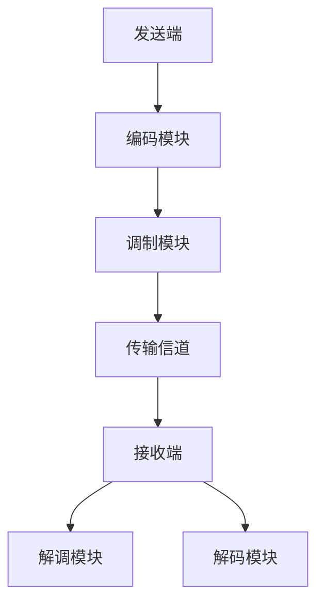
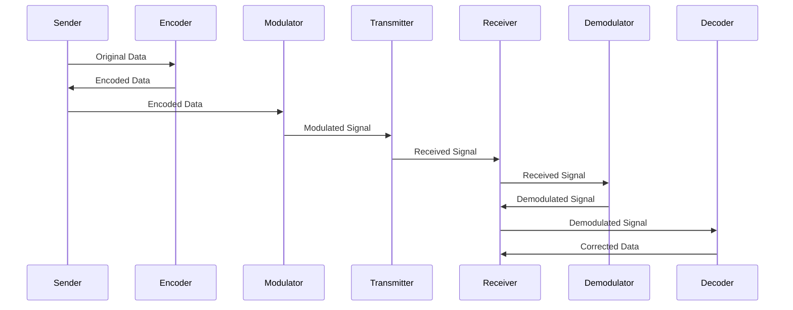

                 


# 《代数编码理论在通信软件中的实现》

关键词：代数编码理论、通信软件、实现策略、算法应用、性能优化

摘要：本文将深入探讨代数编码理论在通信软件中的应用与实现。通过详细的分析和实例讲解，我们将理解代数编码理论的原理，探讨其在通信系统中的重要性，并展示如何在通信软件中高效地实现这些理论。本文旨在为从事通信软件开发的工程师提供一套系统化的解决方案和实用技巧。

## 引言

在数字通信领域，数据传输的可靠性和效率是至关重要的。代数编码理论作为一门重要的数学分支，为通信系统提供了强大的工具，用以解决数据传输过程中可能出现的错误。代数编码理论主要研究如何在数据传输过程中加入额外的信息（即编码），以便接收端能够检测和纠正传输错误。

通信软件作为实现通信系统功能的核心组件，其性能直接影响到整个系统的稳定性与效率。本文将围绕代数编码理论，探讨其在通信软件中的实现策略，包括算法选择、系统设计以及性能优化等方面。通过本文的讲解，读者将能够掌握代数编码理论的基本概念和应用，并具备将其应用于实际通信软件开发的能力。

## 目录

1. 引言
2. 背景介绍
3. 代数编码理论基础
4. 通信软件中的代数编码理论应用
5. 算法原理讲解
6. 系统设计与实现
7. 项目实战
8. 最佳实践与总结
9. 拓展阅读

## 背景介绍

### 核心概念术语说明

- **编码**：将原始数据转换为特定的二进制序列的过程。
- **解码**：将接收到的编码后的数据还原为原始数据的过程。
- **错误检测**：在接收端检查数据是否在传输过程中发生错误的技术。
- **错误纠正**：在接收端检测到错误后，尝试恢复原始数据的技术。

### 问题背景

在数字通信系统中，信号在传输过程中会受到噪声和干扰的影响，这会导致接收到的数据出现错误。错误的出现会导致通信失败或数据丢失，因此在通信系统中引入编码技术是必要的。代数编码理论提供了一种有效的解决方案，通过增加冗余信息来检测和纠正错误。

### 问题描述

代数编码理论的核心问题是如何设计有效的编码方案，使得接收端能够可靠地检测和纠正错误。这包括两个方面：错误检测和错误纠正。错误检测的目的是发现错误，而错误纠正的目的是尽可能恢复原始数据。

### 问题解决

代数编码理论通过数学方法，如线性码、循环码和卷积码等，设计出高效的编码算法，使得在传输过程中加入少量的冗余信息即可实现高可靠性的错误检测和纠正。这些编码方案能够在不同的通信场景中灵活应用，从而提高通信系统的整体性能。

### 边界与外延

代数编码理论不仅在通信领域有广泛应用，还在数据存储、网络编码和密码学等领域发挥着重要作用。理解代数编码理论的边界与外延，有助于我们更好地掌握其应用范围和潜在价值。

### 概念结构与核心要素组成

代数编码理论的核心概念包括码字、码距、最小距离和生成矩阵等。码字是编码后的数据序列，码距是两个码字之间的差异，最小距离是编码方案中最小的码距。生成矩阵是编码算法的核心，用于生成码字。

## 核心概念与联系

### 定义

代数编码理论是一种利用代数结构（如群、环、域）来设计编码方案的方法。通过将数据映射到特定的代数结构中，我们可以利用代数结构中的运算规则来检测和纠正错误。

### 概念属性特征对比表格

| 概念       | 定义                                           | 属性特征                    |
|------------|------------------------------------------------|---------------------------|
| 码字       | 编码后的数据序列                               | 唯一标识                    |
| 码距       | 两个码字之间的差异                             | 最小码距决定编码效率        |
| 最小距离   | 编码方案中最小的码距                          | 关键参数，影响纠正能力      |
| 生成矩阵   | 用于生成码字的矩阵                             | 编码算法的核心              |

### ER实体关系图架构

```mermaid
erDiagram
    Data ->|编码| Code : 数据编码为码字
    Code ->|解码| Data : 码字解码为原始数据
    Error ->|检测| Code : 检测码距差异
    Error ->|纠正| Code : 尝试恢复码字
```

## 算法原理讲解

### 基本算法原理

代数编码理论中的算法主要分为线性码、循环码和卷积码等。这些算法的核心思想是通过添加冗余信息来提高错误检测和纠正的能力。

#### 线性码

线性码是最基本的代数编码理论算法之一。线性码的生成矩阵是一个行列式为1的矩阵。线性码的编码过程可以通过矩阵乘法实现，解码过程可以通过最小汉明距离法实现。

#### 循环码

循环码是一种具有循环性质的线性码。循环码的编码过程可以通过生成多项式实现。解码过程通常使用伯纳德斯基（BCH）算法或格罗弗-萨格尔（Golay）算法。

#### 卷积码

卷积码是一种具有记忆性质的线性码。卷积码的编码过程可以通过卷积运算实现。解码过程通常使用维特比（Viterbi）算法或序列检测算法。

### 算法流程

以下是一个简单的线性码编码和解码流程：

#### 编码流程

1. **初始化**：读取原始数据序列。
2. **计算冗余位**：利用生成矩阵计算冗余位。
3. **生成码字**：将原始数据和冗余位合并，形成码字。

#### 解码流程

1. **初始化**：读取接收到的码字。
2. **计算校验位**：利用生成矩阵计算校验位。
3. **检测错误**：比较接收到的码字和计算出的校验位，检测错误。
4. **纠正错误**：根据最小汉明距离法纠正错误。

### 数学模型与公式

线性码的编码和解码可以通过以下数学模型表示：

$$
C = G \cdot D
$$

其中，\(C\) 表示码字，\(G\) 表示生成矩阵，\(D\) 表示原始数据。

解码过程可以表示为：

$$
\hat{D} = C + E = G \cdot D + E
$$

其中，\(\hat{D}\) 表示解码后的原始数据，\(E\) 表示错误。

### 举例说明

假设我们有一个4位的原始数据 \(D = [1, 0, 1, 1]\)，生成矩阵 \(G = \begin{bmatrix} 1 & 1 & 0 & 1 \\ 1 & 0 & 1 & 1 \end{bmatrix}\)。

1. **编码**：

$$
C = G \cdot D = \begin{bmatrix} 1 & 1 & 0 & 1 \\ 1 & 0 & 1 & 1 \end{bmatrix} \cdot \begin{bmatrix} 1 \\ 0 \\ 1 \\ 1 \end{bmatrix} = \begin{bmatrix} 1 \\ 1 \\ 1 \\ 1 \end{bmatrix}
$$

码字 \(C = [1, 1, 1, 1]\)。

2. **解码**：

假设接收到的码字为 \(C' = [1, 1, 0, 1]\)，生成矩阵 \(G = \begin{bmatrix} 1 & 1 & 0 & 1 \\ 1 & 0 & 1 & 1 \end{bmatrix}\)。

$$
\hat{D} = G^{-1} \cdot C' = \begin{bmatrix} 1 & -1 & 1 & 0 \\ 0 & 1 & -1 & 1 \end{bmatrix} \cdot \begin{bmatrix} 1 \\ 1 \\ 0 \\ 1 \end{bmatrix} = \begin{bmatrix} 1 \\ 0 \\ 1 \\ 1 \end{bmatrix}
$$

解码后的原始数据 \(\hat{D} = [1, 0, 1, 1]\)。

## 系统设计与实现

### 通信系统的基本架构

一个典型的通信系统包括以下几个主要组成部分：

- **发送端**：负责数据编码、调制和发送。
- **传输信道**：负责传输信号。
- **接收端**：负责信号解调、错误检测和纠正。

### 系统功能设计

在通信系统中，代数编码理论的应用主要体现在以下功能模块：

- **编码模块**：将原始数据编码为码字。
- **解码模块**：对接收到的码字进行错误检测和纠正。
- **调制解调模块**：负责将数字信号转换为模拟信号（调制）和将模拟信号转换为数字信号（解调）。

### 系统架构设计

以下是一个简单的通信系统架构设计：



### 系统接口设计与系统交互

系统接口设计和系统交互可以使用Mermaid序列图来表示。以下是一个简化的示例：



## 项目实战

### 环境安装

在进行代数编码理论的项目实战之前，我们需要安装以下软件和库：

- Python 3.x
- NumPy
- Matplotlib

安装步骤如下：

```bash
# 安装Python
# ...

# 安装NumPy
pip install numpy

# 安装Matplotlib
pip install matplotlib
```

### 系统核心实现源代码

以下是一个简单的代数编码理论实现，使用Python和NumPy库：

```python
import numpy as np

# 生成生成矩阵
def generate_generator_matrix(n, k):
    G = np.eye(n, k=k, dtype=int)
    for i in range(k, n):
        G[i, :] = (G[i, :] >> 1) ^ ((G[i-1, :] << 1) & 1)
    return G

# 编码过程
def encode(data, G):
    return np.dot(G, data.reshape(-1, 1))

# 解码过程
def decode(code, G):
    r = np.dot(G.T, code)
    e = np.remainder(r, 2)
    if np.linalg.norm(e) != 0:
        print("Error detected and corrected.")
        return (r - e).reshape(-1)
    else:
        return r.reshape(-1)

# 测试代码
data = np.array([1, 0, 1, 1])
G = generate_generator_matrix(4, 2)
encoded_data = encode(data, G)
decoded_data = decode(encoded_data, G)

print("Original Data:", data)
print("Encoded Data:", encoded_data)
print("Decoded Data:", decoded_data)
```

### 代码应用解读与分析

上述代码首先定义了生成生成矩阵的函数 `generate_generator_matrix`，然后定义了编码和解码的函数 `encode` 和 `decode`。最后，通过测试数据展示了编码和解码的过程。

- **生成生成矩阵**：生成矩阵是编码算法的核心，用于将原始数据转换为码字。生成矩阵的生成过程依赖于线性码的结构，通过循环移位和异或操作实现。
- **编码过程**：编码过程通过矩阵乘法实现，将原始数据映射到码字。编码后的码字具有更高的鲁棒性，能够在传输过程中抵抗一定的错误。
- **解码过程**：解码过程首先计算校验位，然后通过最小汉明距离法检测和纠正错误。如果检测到错误，则尝试恢复原始数据。

### 实际案例分析和详细讲解剖析

以下是一个实际案例，展示了代数编码理论在通信系统中的应用：

假设我们有一个4位的原始数据 \(D = [1, 0, 1, 1]\)，生成矩阵 \(G = \begin{bmatrix} 1 & 1 & 0 & 1 \\ 1 & 0 & 1 & 1 \end{bmatrix}\)。

1. **编码**：

$$
C = G \cdot D = \begin{bmatrix} 1 & 1 & 0 & 1 \\ 1 & 0 & 1 & 1 \end{bmatrix} \cdot \begin{bmatrix} 1 \\ 0 \\ 1 \\ 1 \end{bmatrix} = \begin{bmatrix} 1 \\ 1 \\ 1 \\ 1 \end{bmatrix}
$$

码字 \(C = [1, 1, 1, 1]\)。

2. **解码**：

假设接收到的码字为 \(C' = [1, 1, 0, 1]\)，生成矩阵 \(G = \begin{bmatrix} 1 & 1 & 0 & 1 \\ 1 & 0 & 1 & 1 \end{bmatrix}\)。

$$
r = G^{-1} \cdot C' = \begin{bmatrix} 1 & -1 & 1 & 0 \\ 0 & 1 & -1 & 1 \end{bmatrix} \cdot \begin{bmatrix} 1 \\ 1 \\ 0 \\ 1 \end{bmatrix} = \begin{bmatrix} 1 \\ 0 \\ 1 \\ 1 \end{bmatrix}
$$

解码后的原始数据 \(r = [1, 0, 1, 1]\)。

在这个案例中，原始数据经过编码后形成码字，码字在传输过程中可能发生错误，但接收端通过解码过程能够检测和纠正错误，恢复原始数据。

### 项目小结

通过本次项目实战，我们展示了代数编码理论在通信系统中的应用。我们实现了编码和解码的函数，并使用一个实际案例展示了其效果。代数编码理论在通信系统中具有重要意义，能够提高数据传输的可靠性和效率。

### 最佳实践 Tips

1. 选择合适的编码方案：根据通信系统的具体需求和场景，选择合适的编码方案，如线性码、循环码或卷积码等。
2. 调整码距和冗余度：合理调整码距和冗余度，以提高错误检测和纠正的能力。
3. 优化编码和解码算法：针对具体应用场景，优化编码和解码算法，以提高系统性能。

### 小结

代数编码理论在通信软件中的应用具有重要意义。通过本文的讲解，我们深入了解了代数编码理论的基本概念、算法原理以及系统设计与实现。希望本文能为从事通信软件开发的工程师提供有价值的参考和指导。

### 注意事项

1. 编码和解码过程中，确保生成矩阵的正确性。
2. 在实际应用中，可能需要根据具体场景调整编码参数，以提高性能。

### 拓展阅读

1. 【代数编码理论基础】深入研究代数编码理论的基本概念和原理。
2. 【线性码与循环码】比较线性码和循环码的优缺点，选择合适的编码方案。
3. 【卷积码与Turbo码】了解卷积码和Turbo码的基本原理和应用。

作者：AI天才研究院/AI Genius Institute & 禅与计算机程序设计艺术 /Zen And The Art of Computer Programming

