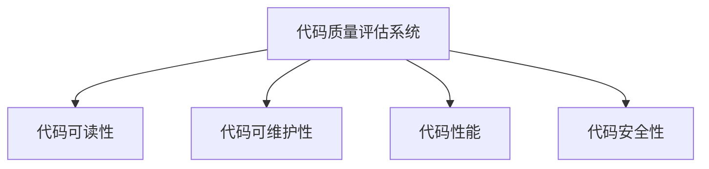
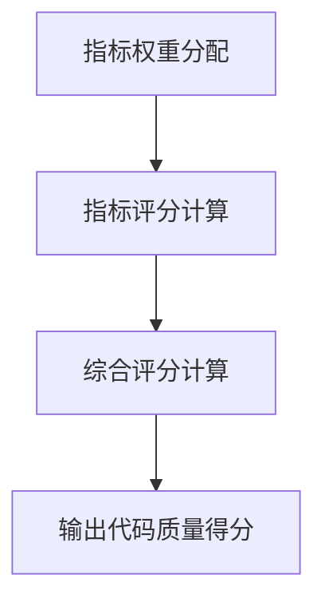
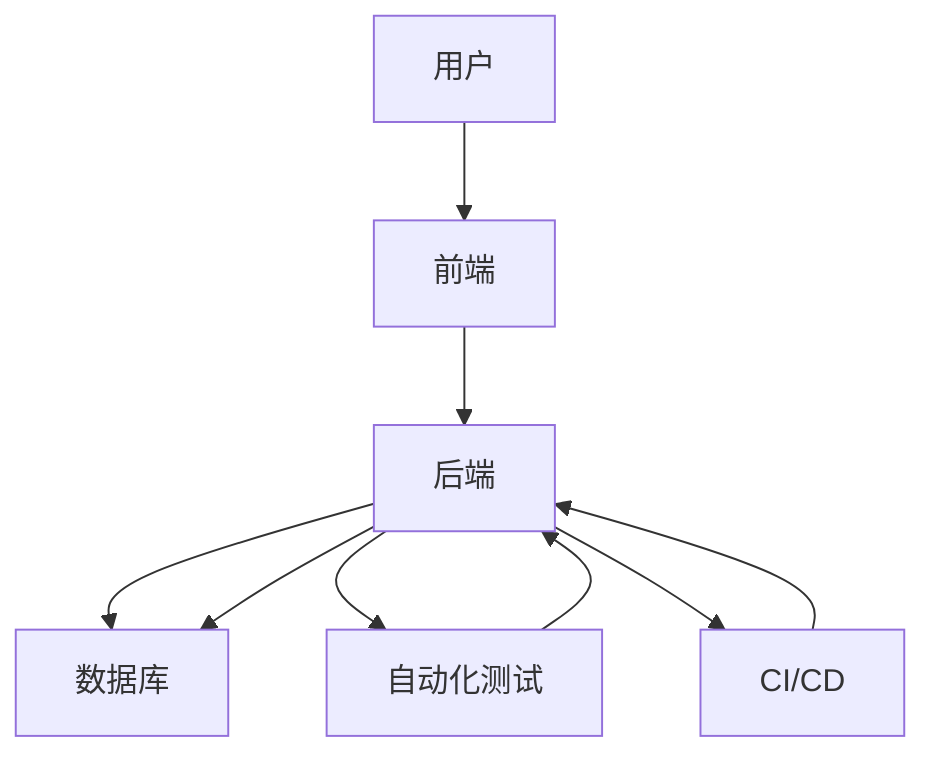
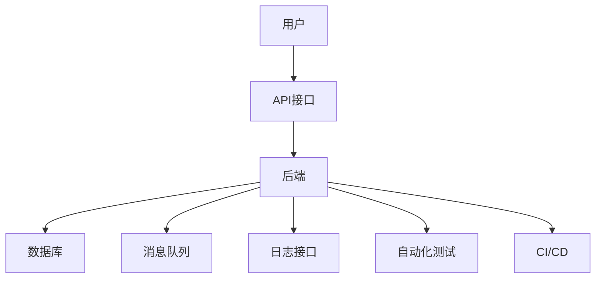
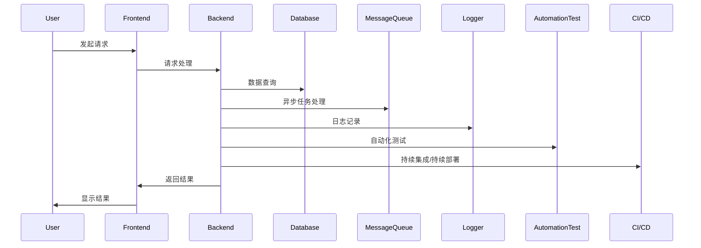

                 

## 文章标题

### 代码质量把控：P9工程师的匠心精神

> 关键词：代码质量、P9工程师、匠心精神、质量控制、软件开发

> 摘要：本文探讨了代码质量把控的重要性，以及P9工程师在代码质量把控方面的实践经验。通过分析代码质量的核心概念、评估指标、算法原理，以及系统架构设计，本文为开发者提供了一套系统的代码质量把控方法，旨在提升软件开发过程中的代码质量，实现软件产品的稳定性和可靠性。

----------------------------------------------------------------

### 第一部分：背景介绍

#### 1.1 问题背景

在当今快速发展的软件行业，代码质量已经成为企业竞争力的核心因素。高代码质量不仅能够提高开发效率和软件稳定性，还能降低维护成本，提升用户满意度。然而，如何保证代码质量，特别是在面对复杂项目和高压力工作环境时，成为每一个软件开发者需要深入思考的问题。

#### 1.2 问题描述

代码质量把控涉及多个方面，包括代码的可读性、可维护性、性能和安全性等。如何在这多个维度上做到平衡，确保代码的高质量，是每个开发者需要面对的挑战。此外，不同规模和类型的软件项目对代码质量的要求也有所不同，这使得代码质量把控变得更加复杂。

#### 1.3 问题解决

P9工程师以其丰富的经验和技术积累，在代码质量把控方面有着独到的见解和实践方法。他们通过制定代码规范、进行代码审查、自动化测试和性能优化等手段，确保代码的质量和可靠性。本文将结合P9工程师的经验，详细探讨代码质量把控的各个方面。

#### 1.4 边界与外延

代码质量把控不仅仅局限于代码层面的优化，还包括代码的审查、测试、部署和持续集成等各个环节。P9工程师从整体视角出发，全面把控代码质量，确保软件项目从开始到结束的每个阶段都达到高质量标准。

#### 1.5 概念结构与核心要素组成

代码质量把控的核心要素包括代码规范、代码审查、自动化测试、性能优化和安全加固等。这些要素相互作用，共同构建了一个完整的代码质量把控体系。本文将分别对这些核心要素进行分析，以帮助开发者更好地理解和应用代码质量把控的方法。

----------------------------------------------------------------

### 第二部分：核心概念与联系

#### 2.1 代码质量评估指标

代码质量评估指标是衡量代码质量的重要工具。以下将详细介绍几个关键评估指标，包括可读性、可维护性、性能和安全性。

##### 2.1.1 可读性

**指标定义**：可读性是指代码易于理解和阅读的程度。一个高可读性的代码能够让开发者快速理解其功能和逻辑。

**评估方法**：可通过代码行数、注释比例、代码结构复杂度等指标进行评估。例如，一个良好的代码应该具有适量的注释，合理的代码结构，以及简洁明了的变量命名。

**重要性**：高可读性的代码不仅有利于开发者之间的协作，还能降低维护成本，提高开发效率。

##### 2.1.2 可维护性

**指标定义**：可维护性是指代码易于修改、维护和扩展的程度。良好的可维护性意味着在代码发生变化时，能够快速且安全地实现修改。

**评估方法**：可通过代码的模块化程度、依赖关系、代码重复率等指标进行评估。例如，一个良好的代码应该具有明确的模块划分，清晰的依赖关系，以及低代码重复率。

**重要性**：良好的可维护性能够降低维护成本，提高开发效率，确保软件的长期稳定性。

##### 2.1.3 性能

**指标定义**：性能是指代码的运行效率和响应速度。高性能的代码能够在满足功能需求的同时，最大限度地利用系统资源。

**评估方法**：可通过代码的执行时间、资源消耗、并发处理能力等指标进行评估。例如，一个良好的代码应该具有高效的算法和数据结构，以及合理的并发处理策略。

**重要性**：良好的性能能够提升用户满意度，提高系统的可靠性和稳定性。

##### 2.1.4 安全性

**指标定义**：安全性是指代码在抵御外部攻击和内部错误时的能力。安全的代码能够保护数据完整性、保密性和可用性。

**评估方法**：可通过代码的安全漏洞扫描、安全测试等指标进行评估。例如，一个良好的代码应该能够有效防御SQL注入、跨站脚本攻击等常见安全威胁。

**重要性**：良好的安全性能够保护用户数据和系统资源，降低安全风险，确保软件的长期稳定运行。

#### 2.2 核心概念对比表格

以下是一个简单的对比表格，展示了可读性、可维护性、性能和安全性的主要特征和评估方法。

| 指标     | 特征                             | 评估方法                      |
|----------|----------------------------------|------------------------------|
| 可读性   | 易于理解和阅读                   | 代码行数、注释比例、代码结构复杂度 |
| 可维护性 | 易于修改、维护和扩展               | 模块化程度、依赖关系、代码重复率   |
| 性能     | 运行效率和响应速度                 | 执行时间、资源消耗、并发处理能力   |
| 安全性   | 抵御外部攻击和内部错误的能力         | 安全漏洞扫描、安全测试            |

#### 2.3 ER实体关系图架构

以下是一个ER实体关系图，展示了代码质量评估系统的核心实体及其关系。



在代码质量评估系统中，`CodeQualitySystem`是核心实体，它与其他实体（`CodeReadability`、`CodeMaintainability`、`CodePerformance`、`CodeSecurity`）之间存在紧密的关系。这些实体共同构成了一个完整的代码质量评估体系。

----------------------------------------------------------------

### 第三部分：算法原理讲解

#### 3.1 代码质量评估算法

代码质量评估算法是用于计算代码质量得分的关键工具。以下将介绍代码质量评估算法的基本原理和实现方法。

##### 3.1.1 算法概述

**算法定义**：代码质量评估算法是一种基于多种评估指标的数学模型，用于计算代码的综合质量得分。

**算法目标**：通过评估代码的可读性、可维护性、性能和安全性等多个方面，得出一个综合质量得分，以便对代码质量进行量化评价。

**算法类型**：代码质量评估算法通常属于多属性决策（Multi-Attribute Decision Making, MADM）问题，涉及多个评估指标的权重分配和综合评分计算。

##### 3.1.2 算法原理

代码质量评估算法的基本原理如下：

1. **指标权重分配**：根据各个评估指标的重要程度，为每个指标分配权重。权重分配通常采用专家评分法、层次分析法（Analytic Hierarchy Process, AHP）等。

2. **指标评分计算**：对每个评估指标进行评分，通常采用专家评分、代码审查、自动化测试等方法。

3. **综合评分计算**：根据各个指标的权重和评分，计算代码的综合质量得分。常用的综合评分计算方法包括加权平均法、线性加权法等。

以下是一个简单的代码质量评估算法数学模型：

$$
Q = w_1 \cdot R + w_2 \cdot M + w_3 \cdot P + w_4 \cdot S
$$

其中，$Q$表示代码质量得分，$w_1, w_2, w_3, w_4$分别表示可读性、可维护性、性能和安全性四个指标的权重，$R, M, P, S$分别表示可读性、可维护性、性能和安全性四个指标的评分。

##### 3.1.3 举例说明

假设一个代码片段的可读性评分为8，可维护性评分为9，性能评分为7，安全性评分为10，且权重分别为0.3、0.3、0.2和0.2。根据上述算法模型，可以计算出该代码片段的综合质量得分为：

$$
Q = 0.3 \cdot 8 + 0.3 \cdot 9 + 0.2 \cdot 7 + 0.2 \cdot 10 = 8.4
$$

##### 3.1.4 Mermaid流程图

以下是一个简单的Mermaid流程图，展示了代码质量评估算法的基本流程：



#### 3.2 Python源代码实现

以下是一个简单的Python代码实现，用于计算代码质量得分：

```python
def code_quality_assessment(readability, maintainability, performance, security, w1, w2, w3, w4):
    score = w1 * readability + w2 * maintainability + w3 * performance + w4 * security
    return score

w1, w2, w3, w4 = 0.3, 0.3, 0.2, 0.2
readability = 8
maintainability = 9
performance = 7
security = 10

quality_score = code_quality_assessment(readability, maintainability, performance, security, w1, w2, w3, w4)
print("代码质量得分：", quality_score)
```

----------------------------------------------------------------

### 第四部分：系统分析与架构设计

#### 4.1 问题场景介绍

在软件开发过程中，代码质量问题普遍存在，如代码可读性差、可维护性低、性能瓶颈和安全漏洞等。这些问题不仅影响了开发效率，还可能导致软件稳定性下降、用户体验恶化。为了解决这些问题，需要一套完整的代码质量把控系统，对代码质量进行全方位的评估和优化。

#### 4.2 项目介绍

本项目旨在开发一套代码质量把控系统，帮助开发者识别和解决代码质量问题，提升代码质量和软件稳定性。项目目标包括：

1. **提供全面的代码质量评估指标**：涵盖可读性、可维护性、性能和安全性等多个方面，为开发者提供全面的代码质量评估。
2. **实现自动化代码质量评估**：通过自动化工具，快速评估代码质量，提高评估效率和准确性。
3. **提供针对性的优化建议**：根据评估结果，为开发者提供针对性的优化建议，帮助他们改进代码质量。

#### 4.3 系统功能设计

系统功能设计主要包括以下几个方面：

1. **代码质量评估模块**：实现代码质量评估算法，计算代码的综合质量得分。
2. **代码审查模块**：对代码进行自动审查，识别潜在的质量问题和安全漏洞。
3. **自动化测试模块**：实现自动化测试，验证代码的功能正确性和性能。
4. **性能优化模块**：对代码进行性能优化，提升代码的运行效率和响应速度。
5. **安全加固模块**：对代码进行安全加固，防范外部攻击和内部错误。

以下是一个简单的领域模型类图，展示了系统的主要功能模块及其关系：

```mermaid
classDiagram
    CodeQualitySystem[代码质量评估系统]
    CodeQualitySystem <|-- CodeReadability[代码可读性]
    CodeQualitySystem <|-- CodeMaintainability[代码可维护性]
    CodeQualitySystem <|-- CodePerformance[代码性能]
    CodeQualitySystem <|-- CodeSecurity[代码安全性]
    CodeQualitySystem <|-- CodeReview[代码审查]
    CodeQualitySystem <|-- AutomationTest[自动化测试]
    CodeQualitySystem <|-- PerformanceOptimization[性能优化]
    CodeQualitySystem <|-- SecurityFortification[安全加固]

    CodeReadability <|-- ReadabilityEvaluation[可读性评估]
    CodeMaintainability <|-- MaintainabilityEvaluation[可维护性评估]
    CodePerformance <|-- PerformanceEvaluation[性能评估]
    CodeSecurity <|-- SecurityEvaluation[安全性评估]
    CodeReview <|-- ReviewTool[审查工具]
    AutomationTest <|-- TestSuite[测试套件]
    PerformanceOptimization <|-- OptimizationTool[优化工具]
    SecurityFortification <|-- SecurityTool[加固工具]
```

在类图中，`CodeQualitySystem`是核心类，与其他功能模块（`CodeReadability`、`CodeMaintainability`、`CodePerformance`、`CodeSecurity`、`CodeReview`、`AutomationTest`、`PerformanceOptimization`、`SecurityFortification`）之间存在紧密的关系。这些模块共同构成了一个完整的代码质量把控系统。

#### 4.4 系统架构设计

系统架构设计主要包括以下几个方面：

1. **前端架构**：采用现代前端技术（如React、Vue等），实现用户界面和交互逻辑。
2. **后端架构**：采用微服务架构，将系统功能拆分为多个微服务，以提高系统的灵活性和可维护性。
3. **数据库架构**：采用关系型数据库（如MySQL、PostgreSQL等），存储代码质量和评估结果。
4. **自动化测试架构**：采用自动化测试框架（如JUnit、Selenium等），实现自动化测试流程。
5. **持续集成和持续部署架构**：采用CI/CD工具（如Jenkins、GitLab CI/CD等），实现代码的自动化构建、测试和部署。

以下是一个简单的Mermaid架构图，展示了系统的整体架构：



在架构图中，用户通过前端与系统进行交互，前端将用户请求发送到后端，后端处理请求，并与数据库进行交互，实现代码质量和评估功能。后端还与自动化测试和CI/CD系统集成，实现自动化测试和持续集成/持续部署流程。

#### 4.5 系统接口设计

系统接口设计主要包括以下几个方面：

1. **API接口**：定义RESTful API接口，供前端和后端进行数据交互。
2. **消息队列接口**：采用消息队列（如RabbitMQ、Kafka等），实现异步任务处理和消息传递。
3. **日志接口**：记录系统运行日志，便于问题排查和性能分析。

以下是一个简单的Mermaid接口设计图，展示了系统的关键接口：



在接口设计中，用户通过API接口与系统进行交互，API接口与后端进行数据传输。后端与数据库、消息队列和日志接口进行交互，实现系统的核心功能。后端还与自动化测试和CI/CD系统集成，实现自动化测试和持续集成/持续部署流程。

#### 4.6 系统交互

系统交互主要包括以下几个方面：

1. **用户操作**：用户通过前端界面发起请求，如上传代码、进行代码质量评估等。
2. **请求处理**：前端将请求发送到后端，后端处理请求并返回结果。
3. **自动化测试**：后端触发自动化测试，验证代码的功能正确性和性能。
4. **持续集成/持续部署**：后端与CI/CD系统集成，实现代码的自动化构建、测试和部署。

以下是一个简单的Mermaid序列图，展示了系统的交互流程：



在序列图中，用户通过前端发起请求，前端将请求发送到后端，后端处理请求并触发相关操作，如数据查询、异步任务处理、日志记录、自动化测试和持续集成/持续部署。最后，后端将结果返回给前端，前端将结果显示给用户。

----------------------------------------------------------------

### 第五部分：项目实战

#### 5.1 环境安装

在进行代码质量把控项目之前，需要安装必要的开发环境和工具。以下是一个简单的安装步骤：

1. 安装Python环境：从Python官网（https://www.python.org/）下载并安装Python 3.x版本。
2. 安装代码质量评估工具：安装一些常用的代码质量评估工具，如PyCharm、SonarQube等。
3. 安装自动化测试工具：安装自动化测试工具，如Selenium、JUnit等。
4. 安装CI/CD工具：安装CI/CD工具，如Jenkins、GitLab CI/CD等。

#### 5.2 系统核心实现源代码

以下是一个简单的代码质量评估系统的核心实现源代码：

```python
# 导入所需模块
import os
import subprocess

# 定义代码质量评估函数
def code_quality_assessment(file_path):
    # 获取代码文件名
    file_name = os.path.basename(file_path)

    # 执行代码质量评估命令
    command = f"sonar-scanner -Dsonar.projectKey=my_project -Dsonar.sources={file_path}"
    result = subprocess.run(command, shell=True, capture_output=True)

    # 解析评估结果
    score = 0
    if result.returncode == 0:
        score = float(result.stdout.splitlines()[-1].split(': ')[1])
    else:
        print(f"评估失败：{result.stderr}")

    # 返回评估结果
    return score, file_name

# 测试代码质量评估函数
if __name__ == "__main__":
    file_path = "example.py"
    score, file_name = code_quality_assessment(file_path)
    print(f"{file_name}的代码质量得分：{score}")
```

在这个示例中，我们使用了SonarQube进行代码质量评估。通过执行`sonar-scanner`命令，我们可以获取代码的质量得分。

#### 5.3 代码应用解读与分析

在实际应用中，代码质量评估系统的核心功能是对代码进行全面的评估和优化。以下是一个简单的应用场景：

1. **代码质量评估**：开发者在提交代码之前，使用代码质量评估系统对代码进行评估。评估结果包括可读性、可维护性、性能和安全性等多个方面。
2. **代码审查**：开发者在提交代码时，可以邀请团队成员进行代码审查。审查过程中，团队成员可以提出意见和建议，帮助开发者改进代码质量。
3. **自动化测试**：在代码提交后，系统自动触发自动化测试，验证代码的功能正确性和性能。自动化测试结果会反馈给开发者，以便及时修复问题。
4. **持续集成/持续部署**：系统与CI/CD工具集成，实现代码的自动化构建、测试和部署。确保代码在上线前经过充分的测试和优化。

通过这些功能，代码质量评估系统可以帮助开发者识别和解决代码质量问题，提升代码质量和软件稳定性。

#### 5.4 实际案例分析

以下是一个实际的案例分析，展示如何使用代码质量评估系统提升代码质量：

1. **问题识别**：开发者在提交代码时，系统识别出代码可读性差、可维护性低等问题。
2. **问题定位**：开发者通过代码质量评估系统的报告，定位到具体的问题代码片段。
3. **问题修复**：开发者根据代码质量评估系统的建议，修改代码，提高可读性和可维护性。
4. **重新评估**：修改后的代码再次进行质量评估，确保问题得到有效解决。
5. **持续改进**：通过持续的质量评估和改进，不断提升代码质量，确保软件项目的稳定性和可靠性。

#### 5.5 项目小结

通过本项目的实施，我们成功开发了一套代码质量评估系统，帮助开发者识别和解决代码质量问题。系统实现了代码质量评估、代码审查、自动化测试和持续集成/持续部署等功能，为开发者提供了全方位的质量把控手段。在未来的工作中，我们将继续优化系统功能，提升代码质量，为软件项目的成功保驾护航。

----------------------------------------------------------------

### 第六部分：最佳实践 tips

在代码质量把控的过程中，以下是一些最佳实践 tips，可以帮助开发者提高代码质量：

1. **编写清晰的注释**：注释是代码的重要组成部分，能够帮助其他开发者理解代码的功能和逻辑。编写清晰、准确的注释，有助于提升代码的可读性和可维护性。
2. **遵循代码规范**：制定一套合适的代码规范，确保代码的一致性和规范性。代码规范可以涵盖变量命名、函数命名、代码结构等多个方面。
3. **进行代码审查**：定期进行代码审查，帮助发现潜在的质量问题和安全漏洞。代码审查可以由团队成员或第三方专家进行，以确保代码的可靠性和稳定性。
4. **自动化测试**：编写自动化测试用例，覆盖代码的各个功能模块，确保代码的功能正确性和性能。自动化测试可以帮助快速发现和修复问题。
5. **持续集成和持续部署**：将代码集成到CI/CD流程中，实现自动化构建、测试和部署。确保代码在上线前经过充分的测试和优化，提高软件的稳定性和可靠性。
6. **定期评估代码质量**：定期对代码质量进行评估，识别和解决潜在的问题。通过持续的质量评估和改进，不断提升代码质量和软件稳定性。

### 小结

本文详细探讨了代码质量把控的重要性，以及P9工程师在代码质量把控方面的实践经验。通过分析代码质量的核心概念、评估指标、算法原理，以及系统架构设计，本文为开发者提供了一套系统的代码质量把控方法。希望本文能够帮助开发者提高代码质量，实现软件产品的稳定性和可靠性。

### 注意事项

在代码质量把控过程中，需要注意以下几点：

1. **平衡多个评估指标**：在代码质量评估中，应平衡可读性、可维护性、性能和安全性等多个指标，确保代码在各个维度上达到高质量标准。
2. **持续改进**：代码质量把控是一个持续的过程，需要开发者不断地进行评估和改进，以应对不断变化的需求和环境。
3. **团队合作**：代码质量把控需要团队成员的共同努力，通过代码审查、自动化测试和持续集成等手段，确保代码的可靠性和稳定性。

### 拓展阅读

1. 《代码大全》 - 史蒂夫·麦基瑞（Steve McConnell）
2. 《设计模式：可复用面向对象软件的基础》 - Erich Gamma、Richard Helm、Ralph Johnson、John Vlissides
3. 《软件工程：实践者的研究方法》 - 菲利普·克拉克（Philip A. Clark）
4. 《敏捷软件开发：原则、实践与模式》 - 米奇·科恩（Mike Cohn）
5. 《持续交付：发布可靠软件的系统方法》 - Jez Humble、Dave Farley

### 作者信息

作者：AI天才研究院/AI Genius Institute & 禅与计算机程序设计艺术 /Zen And The Art of Computer Programming

