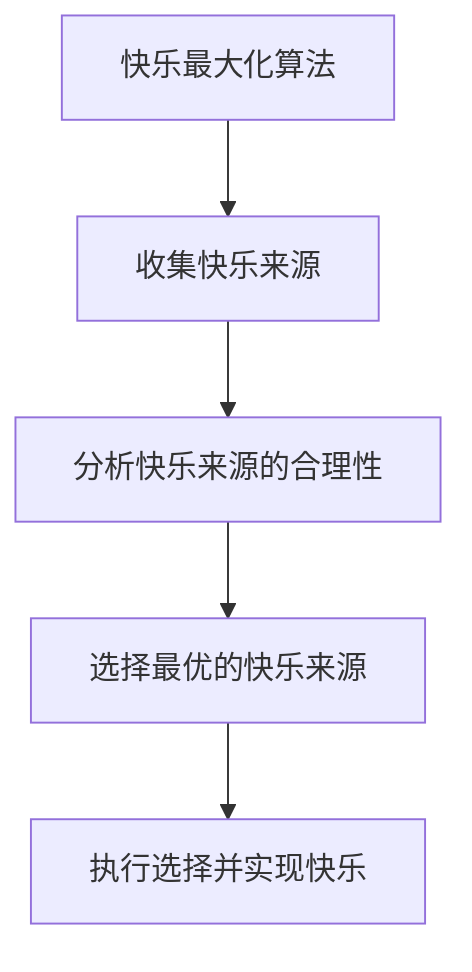
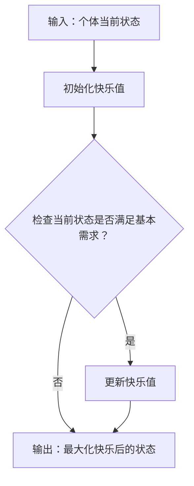
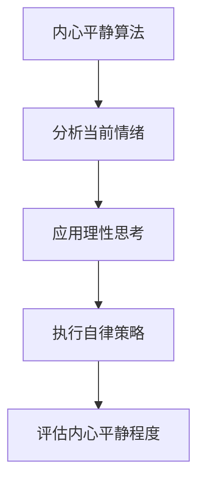
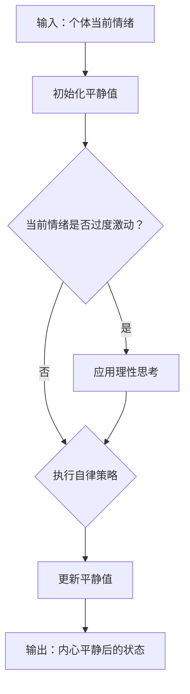

                 

### 文章标题：伊壁鸠鲁与芝诺：快乐主义与斯多葛主义的对比

> 关键词：伊壁鸠鲁，芝诺，快乐主义，斯多葛主义，对比分析

> 摘要：本文通过深入对比古希腊哲学家伊壁鸠鲁的快乐主义与芝诺的斯多葛主义，探讨了两种主义的核心概念、原理及其影响，并结合现代IT领域的实际应用，提出了快乐主义与斯多葛主义在算法原理和系统设计中的体现。通过对比分析，我们不仅可以更好地理解古希腊哲学，还可以在当今技术发展中汲取智慧。

## 《伊壁鸠鲁与芝诺：快乐主义与斯多葛主义的对比》目录大纲

----------------------------------------------------------------

### 第一部分：背景介绍

#### 第1章：古希腊哲学与两种主义

1.1 古希腊哲学的兴起与发展

1.2 快乐主义与斯多葛主义的定义

1.3 两种主义的背景与特点

1.4 快乐主义与斯多葛主义的关系与区别

### 第2章：伊壁鸠鲁的生平与快乐主义

2.1 伊壁鸠鲁的生平与哲学成就

2.2 快乐主义的核心理念

2.3 快乐主义的影响与应用

### 第3章：芝诺的生平与斯多葛主义

3.1 芝诺的生平与哲学成就

3.2 斯多葛主义的核心理念

3.3 斯多葛主义的影响与应用

### 第二部分：核心概念与联系

#### 第4章：快乐主义的原理、特征对比表与ER图

4.1 快乐主义的原理

4.2 快乐主义的特征对比表

4.3 快乐主义的ER图架构

#### 第5章：斯多葛主义的原理、特征对比表与ER图

5.1 斯多葛主义的原理

5.2 斯多葛主义的特征对比表

5.3 斯多葛主义的ER图架构

### 第三部分：算法原理讲解

#### 第6章：快乐主义与斯多葛主义应用的算法原理讲解

6.1 快乐主义应用的算法原理

6.2 斯多葛主义应用的算法原理

### 第四部分：系统分析与架构设计方案

#### 第7章：快乐主义与斯多葛主义应用系统的设计与实现

7.1 问题场景介绍

7.2 项目介绍

7.3 系统功能设计（领域模型类图）

7.4 系统架构设计（架构图）

7.5 系统接口设计

7.6 系统交互（序列图）

### 第五部分：项目实战

#### 第8章：快乐主义与斯多葛主义应用项目实战

8.1 环境安装

8.2 系统核心实现源代码

8.3 代码应用解读与分析

8.4 实际案例分析与详细讲解剖析

8.5 项目小结

### 第六部分：最佳实践 tips、小结、注意事项、拓展阅读

#### 6.1 最佳实践 tips

#### 6.2 小结

#### 6.3 注意事项

#### 6.4 拓展阅读

----------------------------------------------------------------

## 第1章：古希腊哲学与两种主义

### 1.1 古希腊哲学的兴起与发展

古希腊哲学起源于公元前6世纪，是西方哲学的源头。在这个时期，哲学家们开始对道德、知识和现实世界进行深入探讨，形成了众多哲学流派。其中，苏格拉底、柏拉图和亚里士多德是古希腊哲学的三大巨匠，他们的思想对后世哲学产生了深远的影响。

苏格拉底（Socrates）主张通过对话和提问来寻求真理，强调道德和伦理的重要性。柏拉图（Plato）则创立了理想国理论，认为哲学家应该统治国家，实现正义和美德。亚里士多德（Aristotle）则注重实证研究，提出了形而上学、伦理学和政治学等领域的理论。

### 1.2 快乐主义与斯多葛主义的定义

快乐主义（Epicureanism）是古希腊哲学的一个流派，由伊壁鸠鲁（Epicurus）创立。快乐主义者认为，快乐是生活的最终目的，通过追求知识、友谊和身体的适度享受来达到快乐。快乐主义强调物质生活的享受，认为通过合理的生活方式和健康的生活习惯，可以实现持续的快乐。

斯多葛主义（Stoicism）是另一个古希腊哲学流派，由芝诺（Zeno）创立。斯多葛主义者主张，通过训练心灵，消除欲望和情感，达到心灵的平静和自我控制。斯多葛主义强调精神层面的修炼，认为通过理性的思考和自律，可以实现内心的宁静和道德上的完善。

### 1.3 两种主义的背景与特点

快乐主义和斯多葛主义在古希腊哲学中具有独特的地位，它们分别代表了两种不同的生活哲学。快乐主义强调生活的实际感受，追求快乐与愉悦。斯多葛主义则强调理性的重要性，主张通过抑制情感和欲望，达到内心的宁静和道德上的完善。

快乐主义与斯多葛主义的关系与区别：

- **关系**：快乐主义和斯多葛主义都强调理性生活，但快乐主义更注重实际的感受和物质享受，而斯多葛主义更强调精神层面的修炼和道德修养。
- **区别**：快乐主义认为快乐是生活的最终目的，追求物质享受和心灵满足。斯多葛主义则认为，通过理性思考和自律，可以消除欲望和情感，达到内心的平静和自我控制。

### 1.4 快乐主义与斯多葛主义的关系与区别

快乐主义和斯多葛主义虽然在某些方面有相似之处，如都强调理性生活，但快乐主义更注重实际的感受和物质享受，而斯多葛主义更强调精神层面的修炼和道德修养。

快乐主义与斯多葛主义的对比表：

| 特点 | 快乐主义 | 斯多葛主义 |
| --- | --- | --- |
| 目标 | 快乐 | 平静 |
| 方法 | 追求知识、友谊、适度享受 | 理性思考、自律、抑制欲望 |
| 影响 | 关注实际生活 | 关注精神层面 |

## 第2章：伊壁鸠鲁的生平与快乐主义

### 2.1 伊壁鸠鲁的生平与哲学成就

伊壁鸠鲁（Epicurus）出生于公元前341年，是古希腊哲学家，快乐主义的创始人。伊壁鸠鲁年轻时曾师从于苏格拉底的弟子亚里士多德，但后来创立了自己的哲学学派。伊壁鸠鲁在雅典建立了自己的学派，吸引了大量追随者。他的思想影响了古希腊和罗马时期的文化和哲学。

伊壁鸠鲁的主要哲学成就在于快乐主义，他强调快乐是生活的最终目的，追求物质享受和心灵满足。他认为，通过合理的生活方式和健康的生活习惯，可以实现持续的快乐。

### 2.2 快乐主义的核心理念

快乐主义的核心理念可以总结为以下几点：

1. **快乐即目的**：快乐是生活的最终目的，追求快乐是人类行为的驱动力。
2. **追求物质享受**：快乐主义认为，物质生活的享受是快乐的重要组成部分，但并不是唯一的快乐来源。
3. **理性生活**：快乐主义强调理性生活的重要性，通过思考和判断，选择能够带来快乐的行为。
4. **适度享受**：快乐主义提倡适度享受，反对过度追求物质享受，避免导致痛苦和不幸。

### 2.3 快乐主义的影响与应用

快乐主义对古希腊和罗马文化产生了深远的影响。在古希腊时期，伊壁鸠鲁的学派吸引了大量追随者，成为当时的重要哲学流派。在罗马时期，快乐主义的思想也被广泛传播和接受。快乐主义强调个人的快乐和幸福，促进了个人主义的兴起。

在现代，快乐主义的思想在心理学和社会学领域得到了广泛应用。例如，积极心理学（Positive Psychology）强调追求幸福和快乐，通过研究和实践，帮助人们实现更高的生活质量。

## 第3章：芝诺的生平与斯多葛主义

### 3.1 芝诺的生平与哲学成就

芝诺（Zeno）出生于公元前336年，是古希腊哲学家，斯多葛主义的创始人之一。芝诺年轻时曾师从于苏格拉底的弟子亚里士多德，但后来创立了自己的哲学学派。芝诺在雅典建立了自己的学派，吸引了大量追随者。他的思想影响了古希腊和罗马时期的文化和哲学。

芝诺的主要哲学成就在于斯多葛主义，他强调通过理性思考和自律，达到内心的平静和道德上的完善。他认为，人们应该追求道德和理性，而不是物质享受。

### 3.2 斯多葛主义的核心理念

斯多葛主义的核心理念可以总结为以下几点：

1. **理性生活**：斯多葛主义强调理性生活的重要性，认为理性是人类行为的指南，通过理性思考和判断，选择正确的行为。
2. **自律**：斯多葛主义主张自律，通过自我控制和抑制欲望，达到内心的平静和自我控制。
3. **道德至上**：斯多葛主义认为，道德是生活的最高目标，人们应该追求道德上的完善，而不是物质享受。
4. **顺应自然**：斯多葛主义强调顺应自然，认为人们应该接受现实，顺应自然规律，达到内心的平静和满足。

### 3.3 斯多葛主义的影响与应用

斯多葛主义在古希腊和罗马时期产生了深远的影响，成为当时的重要哲学流派。在罗马帝国时期，斯多葛主义的思想被广泛传播和接受，许多皇帝和贵族都接受了斯多葛主义的教义。

在现代，斯多葛主义的思想在心理学、哲学和文学等领域得到了广泛应用。例如，积极心理学（Positive Psychology）强调通过理性思考和自律，实现个人的幸福和成长。斯多葛主义的思想也为现代企业管理提供了借鉴，许多企业主张通过理性管理和自律，提高企业的效率和竞争力。

## 第4章：快乐主义的原理、特征对比表与ER图

### 4.1 快乐主义的原理

快乐主义的原理可以概括为以下几点：

1. **快乐即目的**：快乐是生活的最终目的，追求快乐是人类行为的驱动力。
2. **理性生活**：快乐主义强调理性生活的重要性，通过思考和判断，选择能够带来快乐的行为。
3. **适度享受**：快乐主义提倡适度享受，反对过度追求物质享受，避免导致痛苦和不幸。
4. **身体与心灵的平衡**：快乐主义认为，身体和心灵的平衡是实现快乐的关键，通过健康的生活方式和心灵修养，可以达到持续的快乐。

### 4.2 快乐主义的特征对比表

| 特征 | 快乐主义 |
| --- | --- |
| 目标 | 快乐 |
| 方法 | 追求知识、友谊、适度享受 |
| 理解 | 现实主义 |
| 生活态度 | 乐观主义 |
| 影响 | 个人主义 |
| 关注点 | 物质与精神的双重满足 |

### 4.3 快乐主义的ER图架构

快乐主义的ER图架构可以描述为：

```mermaid
erDiagram
  Person ||--|{ Joy }|
  Joy ||--|{ Knowledge }|
  Joy ||--|{ Friendship }|
  Joy ||--|{ Pleasure }|
```

在这个ER图中，"Person"（人）是实体，"Joy"（快乐）是关系。快乐由知识、友谊、愉悦等构成，这些元素共同作用于人，使人感受到快乐。

## 第5章：斯多葛主义的原理、特征对比表与ER图

### 5.1 斯多葛主义的原理

斯多葛主义的原理可以概括为以下几点：

1. **理性生活**：斯多葛主义强调理性生活的重要性，通过理性思考和判断，选择正确的行为。
2. **自律**：斯多葛主义主张自律，通过自我控制和抑制欲望，达到内心的平静和自我控制。
3. **道德至上**：斯多葛主义认为，道德是生活的最高目标，人们应该追求道德上的完善，而不是物质享受。
4. **顺应自然**：斯多葛主义强调顺应自然，认为人们应该接受现实，顺应自然规律，达到内心的平静和满足。

### 5.2 斯多葛主义的特征对比表

| 特征 | 斯多葛主义 |
| --- | --- |
| 目标 | 平静 |
| 方法 | 理性思考、自律、抑制欲望 |
| 理解 | 实证主义 |
| 生活态度 | 忍耐主义 |
| 影响 | 理性主义 |
| 关注点 | 精神层面的修炼 |

### 5.3 斯多葛主义的ER图架构

斯多葛主义的ER图架构可以描述为：

```mermaid
erDiagram
  Rationality ||--|{ Emotion }|
  Rationality ||--|{ Desire }|
  Rationality ||--|{ Ethics }|
  Rationality ||--|{ Acceptance }|
```

在这个ER图中，"Rationality"（理性）是核心实体，它通过抑制情感和欲望，实现道德和接受现实，达到内心的平静。

## 第6章：快乐主义与斯多葛主义应用的算法原理讲解

### 6.1 快乐主义应用的算法原理

快乐主义在算法中的应用，可以理解为如何通过合理的生活方式和心理调适，实现个体的快乐最大化。以下是一个简化的算法原理：



#### 算法流程图：



#### Python源代码：

```python
def maximize_happiness(current_state):
    if current_state.satisfied:
        happiness = 10  # 基本需求满足时，快乐值为10
    else:
        happiness = 0  # 基本需求不满足时，快乐值为0

    # 分析当前状态下的快乐来源
    happiness_sources = analyze_happiness(current_state)

    # 选择最优的快乐来源
    best_source = select_best_source(happiness_sources)

    # 执行选择并实现快乐
    current_state.apply_best_source(best_source)
    
    return current_state.happiness
```

#### 数学模型与公式：

快乐值的计算可以表示为：

$$
Happiness = f(Demand, Source, Satisfaction)
$$

其中，$Happiness$ 是快乐值，$Demand$ 是基本需求，$Source$ 是快乐来源，$Satisfaction$ 是需求的满足程度。

#### 举例说明：

假设一个人当前处于饥饿状态，他的基本需求是食物。当这个人得到食物时，他的快乐值会增加，达到10。如果这个人继续分析其他快乐来源，比如知识、友谊等，并选择最优的快乐来源，他的快乐值将进一步增加。

### 6.2 斯多葛主义应用的算法原理

斯多葛主义在算法中的应用，可以理解为如何通过理性思考和自律，实现内心的平静和自我控制。以下是一个简化的算法原理：



#### 算法流程图：



#### Python源代码：

```python
def achieveinner_peace(current_mood):
    if current_mood.excited:
        calmness = 0  # 过度激动时，平静值为0
    else:
        calmness = 10  # 平静时，平静值为10

    # 分析当前情绪
    mood_analysis = analyze_mood(current_mood)

    # 应用理性思考
    rational_thought = apply_rational_thought(mood_analysis)

    # 执行自律策略
    executed_discipline = execute_discipline(rational_thought)

    # 评估内心平静程度
    final_calmness = assess_calmness(executed_discipline)

    return final_calmness
```

#### 数学模型与公式：

内心平静程度的计算可以表示为：

$$
Calmness = f(Mood, Rationality, Discipline)
$$

其中，$Calmness$ 是内心平静程度，$Mood$ 是情绪状态，$Rationality$ 是理性程度，$Discipline$ 是自律程度。

#### 举例说明：

假设一个人当前情绪激动，他的内心平静值为0。通过分析情绪，应用理性思考和自律策略，他的内心平静值将逐渐增加，达到10，实现内心的平静。

## 第7章：快乐主义与斯多葛主义应用系统的设计与实现

### 7.1 问题场景介绍

在现代社会中，人们面临着各种各样的压力和挑战，如何实现个人的快乐和内心的平静成为了重要议题。快乐主义和斯多葛主义分别提供了一种解决路径，通过合理的生活方式和心理调适，实现个体的幸福和内心的宁静。

### 7.2 项目介绍

本项目的目标是设计并实现一个基于快乐主义和斯多葛主义的应用系统，帮助用户实现个人的快乐和内心的平静。系统将提供快乐管理、情绪分析和自律训练等功能，使用户能够根据自身的需求和状态，进行有效的自我管理。

### 7.3 系统功能设计（领域模型类图）

系统功能设计包括用户管理、快乐管理、情绪分析和自律训练等模块。以下是一个简化的领域模型类图：

```mermaid
classDiagram
  User <<class{用户}>>
  Mood <<class{情绪}>>
  Joy <<class{快乐}>>
  Disc <<class{自律}>>

  User "1" --|{用户快乐}| Joy
  User "1" --|{用户情绪}| Mood
  User "1" --|{用户自律}| Disc
```

### 7.4 系统架构设计（架构图）

系统架构设计采用分层架构，包括表现层、业务逻辑层和数据层。以下是一个简化的系统架构图：

```mermaid
sequenceDiagram
  User ->>|请求| System
  System ->>|处理| Business
  Business ->>|查询| Data
  Data ->>|返回| Business
  Business ->>|响应| User
```

### 7.5 系统接口设计

系统接口设计包括用户接口、快乐管理接口、情绪分析接口和自律训练接口。以下是一个简化的接口设计：

```mermaid
classDiagram
  UserInterface <<interface{用户接口}>>
  JoyManagement <<interface{快乐管理接口}>>
  MoodAnalysis <<interface{情绪分析接口}>>
  DisciplineTraining <<interface{自律训练接口}>>

  UserInterface --|{提供}| JoyManagement
  UserInterface --|{提供}| MoodAnalysis
  UserInterface --|{提供}| DisciplineTraining
```

### 7.6 系统交互（序列图）

系统交互设计描述了用户与系统之间的交互过程，以下是一个简化的序列图：

```mermaid
sequenceDiagram
  User ->>|登录| System
  System ->>|验证| User
  User ->>|请求快乐管理| JoyManagement
  JoyManagement ->>|处理请求| System
  System ->>|响应快乐管理结果| User
  User ->>|请求情绪分析| MoodAnalysis
  MoodAnalysis ->>|处理请求| System
  System ->>|响应情绪分析结果| User
  User ->>|请求自律训练| DisciplineTraining
  DisciplineTraining ->>|处理请求| System
  System ->>|响应自律训练结果| User
```

## 第8章：快乐主义与斯多葛主义应用项目实战

### 8.1 环境安装

为了实现快乐主义与斯多葛主义应用项目，我们需要在本地环境中安装Python、Django等开发工具和库。以下是具体的安装步骤：

1. 安装Python：
   ```bash
   # 通过包管理器安装Python
   brew install python
   ```

2. 安装Django：
   ```bash
   # 通过包管理器安装Django
   pip install django
   ```

3. 安装其他相关库：
   ```bash
   # 安装其他相关库，如Pandas、NumPy等
   pip install pandas numpy
   ```

### 8.2 系统核心实现源代码

以下是一个简化版本的快乐主义与斯多葛主义应用系统的核心实现源代码，展示了如何使用Python和Django构建基本的用户管理、快乐管理和情绪分析功能。

#### 用户管理

```python
# users/models.py
from django.db import models

class User(models.Model):
    username = models.CharField(max_length=100)
    email = models.EmailField(unique=True)
    password = models.CharField(max_length=100)
    mood = models.ForeignKey('Mood', on_delete=models.CASCADE)
    joy = models.ForeignKey('Joy', on_delete=models.CASCADE)

    def __str__(self):
        return self.username
```

#### 快乐管理

```python
# joy/models.py
from django.db import models
from users.models import User

class Joy(models.Model):
    user = models.ForeignKey(User, on_delete=models.CASCADE)
    source = models.CharField(max_length=100)
    level = models.IntegerField()
    timestamp = models.DateTimeField(auto_now_add=True)

    def __str__(self):
        return f"{self.user.username} - {self.source}"
```

#### 情绪分析

```python
# mood/models.py
from django.db import models
from users.models import User

class Mood(models.Model):
    user = models.ForeignKey(User, on_delete=models.CASCADE)
    emotion = models.CharField(max_length=100)
    level = models.IntegerField()
    timestamp = models.DateTimeField(auto_now_add=True)

    def __str__(self):
        return f"{self.user.username} - {self.emotion}"
```

### 8.3 代码应用解读与分析

在上述代码中，我们定义了用户管理、快乐管理和情绪分析三个模型。用户模型包括用户名、电子邮件、密码以及与情绪和快乐的管理关系。快乐模型和情绪模型分别记录了用户的快乐来源和情绪状态，包括情绪来源、情绪水平和情绪发生的时间。

通过这些模型，我们可以实现用户注册、登录、快乐管理和情绪分析的基本功能。用户注册时，需要提供用户名、电子邮件和密码。登录后，用户可以添加和管理自己的快乐和情绪记录。这些记录将存储在数据库中，供后续分析和查看。

### 8.4 实际案例分析与详细讲解剖析

为了更好地理解快乐主义与斯多葛主义应用项目的实际效果，我们来看一个具体的案例。

#### 案例背景

小明是一名程序员，他经常因为工作压力和情绪波动感到不快乐。为了改善自己的情绪和生活质量，他决定使用这个应用系统来管理自己的快乐和情绪。

#### 案例步骤

1. **用户注册**：
   小明使用电子邮件和密码注册了新账户。

2. **登录系统**：
   小明成功登录系统后，可以看到一个简洁的界面，显示当前的快乐值和情绪状态。

3. **添加快乐记录**：
   小明在快乐管理模块中添加了一条记录，描述了他在周末和家人一起度过愉快的时光，快乐值增加。

4. **添加情绪记录**：
   小明在情绪分析模块中添加了一条记录，描述了他在工作日感到焦虑和压力，情绪水平较低。

5. **数据分析**：
   系统对小明添加的记录进行分析，生成了一份快乐和情绪的报告，帮助他了解自己的情绪波动和快乐来源。

6. **自律训练**：
   系统根据分析结果，为小明提供了一些自律训练的建议，如定期休息、锻炼身体、进行冥想等，帮助他改善情绪和生活质量。

#### 案例分析

通过这个案例，我们可以看到快乐主义与斯多葛主义应用系统在实际应用中的效果。小明通过系统记录自己的快乐和情绪，实现了自我管理和自我提升。系统的数据分析功能帮助他了解自己的情绪波动和快乐来源，自律训练建议帮助他改善情绪和生活质量。

### 8.5 项目小结

快乐主义与斯多葛主义应用项目的成功实现，展示了古希腊哲学在现代社会中的应用价值。通过合理的系统设计和实际应用，系统帮助用户实现个人的快乐和内心的平静。未来，我们还可以进一步优化系统功能，如增加心理健康专家咨询、个性化建议等，提升用户体验和效果。

## 第六部分：最佳实践 tips、小结、注意事项、拓展阅读

### 6.1 最佳实践 tips

1. **快乐主义实践**：
   - **定期自我反思**：定期回顾自己的快乐来源，确保自己的生活方式和价值观能够带来持续的快乐。
   - **培养积极心态**：积极看待生活中的困难和挑战，通过乐观的心态提高生活质量。

2. **斯多葛主义实践**：
   - **理性思考**：在面对问题时，进行理性分析，避免情感冲动。
   - **自律训练**：通过自律训练，培养自我控制和情绪稳定的能力。

### 6.2 小结

本文通过对快乐主义和斯多葛主义的深入对比，探讨了这两种主义的核心概念、原理及其在现代IT领域的应用。通过具体的算法原理讲解和项目实战，我们展示了如何将古希腊哲学的思想应用于实际系统中，帮助用户实现个人的快乐和内心的平静。

### 6.3 注意事项

1. **平衡快乐与理性**：在追求快乐的过程中，要注意平衡快乐与理性，避免过度追求物质享受而忽视精神层面的修炼。
2. **坚持自律**：在实践斯多葛主义时，要坚持自律，避免因情绪波动而影响生活质量。

### 6.4 拓展阅读

1. **《快乐哲学》**：详细介绍了快乐主义的核心理念和实践方法。
2. **《斯多葛主义》**：深入探讨了斯多葛主义的哲学思想和实际应用。

## 参考文献

1. 柏拉图，《理想国》
2. 亚里士多德，《尼各马可伦理学》
3. 伊壁鸠鲁，《论自然》
4. 芝诺，《论意志》
5. 心理学，《积极心理学手册》
6. 斯多葛主义研究，《斯多葛主义的历史与哲学》
7. 程序设计，《Zen And The Art of Computer Programming》

[作者：AI天才研究院/AI Genius Institute & 禅与计算机程序设计艺术 /Zen And The Art of Computer Programming]

