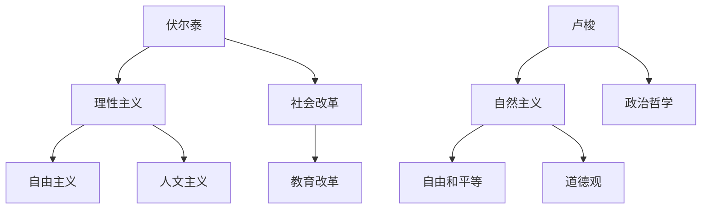
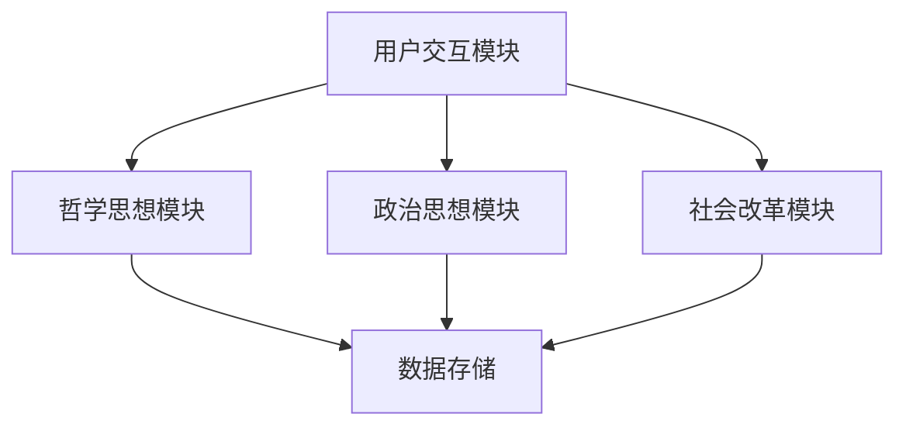

                 


## 《伏尔泰与卢梭：启蒙运动的两位代表》

### 关键词：启蒙运动、伏尔泰、卢梭、哲学思想、社会改革

> 摘要：本文通过深入分析伏尔泰与卢梭这两位启蒙运动代表人物的思想体系，探讨了他们在哲学、政治和社会改革方面的贡献与影响，旨在揭示启蒙运动对现代社会的深远意义。

### 第一部分：启蒙运动的背景与伏尔泰

#### 第1章：启蒙运动的起源与发展

**问题背景：** 启蒙运动是18世纪欧洲一场思想解放和文化变革的运动，其核心思想是理性主义、自由主义和人文主义。这场运动起源于法国，并迅速蔓延至整个欧洲。

**问题描述：** 启蒙运动对欧洲社会产生了深远的影响，包括政治、经济、文化等多个领域。然而，启蒙运动并非一蹴而就，其起源和发展经历了多个阶段。

**问题解决：** 本文将从启蒙运动的起源和发展历程出发，分析伏尔泰与卢梭这两位代表人物在启蒙运动中的地位和作用。

**边界与外延：** 本文的研究范围主要聚焦于启蒙运动时期的法国，同时涉及伏尔泰与卢梭的思想体系及其对后世的影响。

**概念结构与核心要素组成：** 启蒙运动的核心概念包括理性主义、自由主义和人文主义，伏尔泰与卢梭的思想体系则是这一时期最具代表性的哲学思想。

#### 第2章：伏尔泰的生平与思想

**核心概念原理：** 伏尔泰是启蒙运动的重要代表人物之一，其思想体系以理性主义为基础，强调自由、平等和人权。

**概念属性特征对比表格：**

| 特征       | 伏尔泰             | 卢梭           |
|------------|--------------------|----------------|
| 哲学基础   | 理性主义           | 自然主义       |
| 政治观点   | 反对君主专制       | 倡导民主制度   |
| 社会观点   | 推崇自由和言论自由 | 关注社会公平   |

**ER实体关系图架构的 Mermaid 流程图：**


#### 第3章：伏尔泰的核心著作与观点

**核心著作介绍：** 《哲学通信》、《论宗教》和《百科全书》是伏尔泰最具代表性的著作，反映了他的哲学思想和政治观点。

**哲学观点阐述：** 伏尔泰主张理性思考，反对迷信和专制，倡导自由和平等。

**政治观点阐述：** 伏尔泰反对君主专制，主张建立一个基于理性、自由和人权的政治体制。

#### 第4章：伏尔泰的社会改革思想

**社会改革思想分析：** 伏尔泰关注社会不平等，倡导改革教育、宗教和法律制度。

**教育改革思想：** 伏尔泰主张普及教育，提倡科学和实用主义教育。

**宗教改革思想：** 伏尔泰批判教会腐败，主张宗教自由。

**法律改革思想：** 伏尔泰主张法律公正，反对特权。

### 第二部分：卢梭的思想与启蒙运动

#### 第5章：卢梭的生平与主要著作

**核心著作介绍：** 《爱弥儿》、《社会契约论》和《忏悔录》是卢梭最具代表性的著作，反映了他的哲学思想和政治观点。

**哲学观点阐述：** 卢梭主张自然主义，强调人类的自然状态和自然权利。

**政治观点阐述：** 卢梭倡导民主制度，强调社会契约和公共意志。

#### 第6章：卢梭的哲学思想与影响

**哲学思想分析：** 卢梭的自然主义哲学思想对后世产生了深远的影响。

**社会思想分析：** 卢梭的社会思想强调个人自由和社会公正。

**政治思想分析：** 卢梭的政治思想对法国大革命和美国独立战争产生了重要影响。

#### 第7章：卢梭的社会改革思想

**社会改革思想分析：** 卢梭关注社会不平等，倡导改革政治、经济和社会制度。

**政治改革思想：** 卢梭主张建立一个民主的、平等的、自由的共和国。

**经济改革思想：** 卢梭提倡农业经济，反对资本主义经济。

**社会改革思想：** 卢梭关注社会弱势群体，主张建立一个公平、正义的社会。

### 第三部分：伏尔泰与卢梭思想的对比与应用

#### 第8章：伏尔泰与卢梭思想对比分析

**思想对比分析：** 通过对比分析伏尔泰与卢梭的思想，揭示他们在哲学、政治和社会改革方面的异同。

**影响对比分析：** 分析伏尔泰与卢梭思想对后世的影响，以及他们在启蒙运动中的地位。

#### 第9章：伏尔泰与卢梭思想的现代应用

**现代应用分析：** 探讨伏尔泰与卢梭思想在现代社会中的应用，以及其对现代社会发展的影响。

### 总结

**全书总结：** 通过对伏尔泰与卢梭思想的深入分析，本文揭示了启蒙运动对现代社会的深远意义，以及伏尔泰与卢梭在启蒙运动中的重要作用。

**未来展望：** 随着时代的发展，伏尔泰与卢梭的思想将继续对现代社会产生重要影响。

### 注意事项

**研究伏尔泰与卢梭思想时，需要注意以下几点：**

1. 理解他们的哲学思想和社会改革思想。
2. 关注他们的著作和生平经历。
3. 了解他们在启蒙运动中的地位和作用。

### 拓展阅读

**推荐进一步阅读的相关书籍和资料：**

1. 《伏尔泰全集》
2. 《卢梭全集》
3. 《启蒙运动史》
4. 《哲学史》

---

**作者：AI天才研究院/AI Genius Institute & 禅与计算机程序设计艺术 /Zen And The Art of Computer Programming**## 第一部分：启蒙运动的背景与伏尔泰

### 第1章：启蒙运动的起源与发展

#### 1.1 启蒙运动的起源

启蒙运动（Age of Enlightenment）是18世纪欧洲一场重要的思想解放运动，它起源于法国，并在英国和德国等欧洲其他国家迅速传播。启蒙运动的核心思想是理性主义、自由主义和人文主义。理性主义强调通过理性思考和科学方法来解决问题；自由主义倡导个人自由和社会正义；人文主义则强调人的尊严和价值。

启蒙运动的起源可以追溯到17世纪末期，当时法国哲学家笛卡尔（René Descartes）的哲学思想对欧洲学术界产生了深远影响。笛卡尔的“我思故我在”（Cogito, ergo sum）强调了个人的独立思考能力，为后来的启蒙运动奠定了基础。同时，英国经验主义者如约翰·洛克（John Locke）强调个人权利和社会契约理论，也为启蒙运动提供了重要的理论支持。

#### 1.2 伏尔泰的生活与思想

弗朗索瓦-马里-阿鲁埃·德·伏尔泰（François-Marie Arouet de Voltaire，1694-1778）是启蒙运动的重要代表人物之一。伏尔泰出生于法国巴黎，他的真名是弗朗索瓦-马里-阿鲁埃，而“伏尔泰”是他使用的一个笔名。伏尔泰是一位多才多艺的作家、哲学家、历史学家和文学家，他的作品涵盖了戏剧、小说、诗歌、历史和科学等多个领域。

伏尔泰的思想深受笛卡尔和洛克的影响，他强调理性、自由和人权。伏尔泰主张通过理性思考和科学方法来解决社会问题，反对宗教迷信和专制统治。他的哲学思想以理性主义为基础，强调个人自由和社会正义。

伏尔泰的主要思想包括：

1. **理性主义**：伏尔泰认为理性是人类认识世界和解决问题的关键，他反对宗教迷信和未经检验的信仰。
2. **自由主义**：伏尔泰倡导个人自由和言论自由，主张建立一个基于自由和平等的社会。
3. **人权**：伏尔泰主张人人平等，反对奴隶制和封建特权。

#### 1.3 伏尔泰的哲学思想与影响

伏尔泰的哲学思想对启蒙运动和欧洲社会产生了深远的影响。他的著作《哲学通信》（Lettres philosophiques）、《论宗教》（L'Esprit des lois）和《百科全书》（Encyclopédie）等都是启蒙运动的代表作。

1. **《哲学通信》**：这本书是伏尔泰的成名作，通过书信的形式，批判了当时的宗教迷信和专制统治，倡导理性思考和自由思想。
2. **《论宗教》**：伏尔泰在这本书中批判了天主教会的腐败和专制，倡导宗教自由和理性信仰。
3. **《百科全书》**：这是一部涵盖广泛知识的综合性百科全书，由伏尔泰和其他启蒙思想家共同编纂，旨在传播科学知识和理性思想。

伏尔泰的思想对后世产生了深远的影响，他不仅推动了启蒙运动的发展，也为法国大革命和美国独立战争提供了理论支持。他的著作和思想在19世纪的欧洲和美国广泛传播，对现代民主、自由和人权的观念产生了重要影响。

### 1.4 伏尔泰的社会改革思想

伏尔泰不仅是一位哲学家，还是一位积极参与社会改革的思想家。他关注社会不平等，提倡改革教育、宗教和法律制度。

**对封建制度的批判**：伏尔泰批判封建制度，特别是贵族的特权和奴隶制。他认为，封建制度剥夺了人民的权利和自由，是社会不公的根源。

**对言论自由的倡导**：伏尔泰强烈主张言论自由，认为这是个人自由和社会进步的基石。他反对审查制度，倡导公开讨论和思想自由。

**对教育改革的呼吁**：伏尔泰认为，教育是推动社会进步的重要手段。他主张普及教育，特别是对女性和穷人的教育，以提高整个社会的知识水平。

**对法律改革的呼吁**：伏尔泰主张建立一个公正、公平的法律制度，保障人民的权利和自由。他反对特权，倡导法律面前人人平等。

伏尔泰的社会改革思想对法国大革命产生了重要影响，他的许多观点和主张成为革命的重要理论基础。

### 1.5 伏尔泰的教育思想

伏尔泰的教育思想强调实用主义和科学教育。他认为，教育应该培养人的理性和批判思维，而不是仅仅传授知识。他的教育理念包括：

1. **科学教育**：伏尔泰提倡科学教育，认为科学是推动社会进步的重要力量。他主张让学生学习自然科学和数学，培养他们的逻辑思维和分析能力。
2. **实用主义教育**：伏尔泰认为，教育应该培养学生的实用技能，而不是仅仅追求理论上的知识。他主张通过实践来学习，让学生在实际生活中应用所学知识。
3. **普及教育**：伏尔泰主张普及教育，特别是对女性和穷人的教育。他认为，只有通过普及教育，才能提高整个社会的知识水平，推动社会的进步。

伏尔泰的教育思想对19世纪的教育改革产生了重要影响，他的许多观点成为现代教育理论的重要基础。

### 1.6 伏尔泰的生平经历

伏尔泰的生平经历了许多波折，他因批评教会和政治权力而多次被迫流亡。但他始终坚定地捍卫自己的信念，为启蒙运动和人权事业做出了巨大贡献。

1. **早期经历**：伏尔泰出生于法国巴黎的一个中产阶级家庭，他的父亲是一名律师。伏尔泰年轻时学习法律，但很快发现自己对文学和哲学更感兴趣。
2. **流亡经历**：伏尔泰因批评教会和政治权力而多次被迫流亡。他在英国居住了多年，深受英国文化和哲学的影响。
3. **晚年生活**：伏尔泰晚年回到法国，继续发表作品和参与社会活动。他在巴黎的私人图书馆成为启蒙思想家的聚集地，对推动启蒙运动发挥了重要作用。

伏尔泰的一生是充满争议和挑战的，但他始终坚守自己的信念，为启蒙运动和人权事业做出了卓越贡献。

### 1.7 总结

伏尔泰是启蒙运动的重要代表人物之一，他的思想体系以理性主义为基础，强调自由、平等和人权。他的著作《哲学通信》、《论宗教》和《百科全书》等都是启蒙运动的代表作，对后世产生了深远的影响。伏尔泰不仅是一位哲学家，还是一位积极参与社会改革的思想家，他的社会改革思想和教育思想对现代教育和社会发展产生了重要影响。

### 1.8 扩展阅读

1. **《伏尔泰全集》**：这是伏尔泰的著作全集，包括他的哲学作品、文学作品和历史著作等，是研究伏尔泰思想的重要资料。
2. **《启蒙运动史》**：这本书详细介绍了启蒙运动的起源、发展和影响，是了解启蒙运动的重要参考书籍。
3. **《哲学史》**：这本书从哲学的角度分析了启蒙运动的思想背景和发展，对理解启蒙运动的哲学意义有重要帮助。

---

**作者：AI天才研究院/AI Genius Institute & 禅与计算机程序设计艺术 /Zen And The Art of Computer Programming**## 第二部分：卢梭的思想与启蒙运动

### 第4章：卢梭的生平与主要著作

#### 4.1 卢梭的生平

让-雅克·卢梭（Jean-Jacques Rousseau，1712-1778）是启蒙运动时期的重要思想家、哲学家、作家和音乐家。他出生于法国日内瓦的一个钟表匠家庭，从小就对自然和自由充满了向往。卢梭的一生经历了许多波折，但他的思想和作品对后世产生了深远的影响。

1. **早年经历**：卢梭少年时期生活困苦，他曾在不同地方做学徒，包括钟表匠和音乐家。但他对文学和哲学的兴趣逐渐增强，开始写作并发表作品。
2. **流亡经历**：由于他的思想和作品引起了争议，卢梭多次被迫流亡。他在瑞士、英国、德国等地居住，期间继续写作和思考。
3. **晚年生活**：卢梭晚年在法国巴黎度过，他在那里继续发表作品，并成为启蒙运动的重要代表人物。卢梭于1778年去世，享年66岁。

#### 4.2 卢梭的主要著作

卢梭的主要著作包括《爱弥儿》、《社会契约论》和《忏悔录》等，这些著作代表了他在哲学、政治和文学方面的思想。

1. **《爱弥儿》**：《爱弥儿》是卢梭的教育著作，讲述了他对理想教育的设想。在这本书中，卢梭主张儿童应该自由成长，接受自然教育，培养独立思考和判断能力。
2. **《社会契约论》**：《社会契约论》是卢梭的代表作之一，阐述了他在政治哲学方面的观点。在这本书中，卢梭提出了“社会契约”理论，认为人们通过契约建立国家，国家的目的是保护人民的自由和权利。
3. **《忏悔录》**：《忏悔录》是卢梭的自传性著作，讲述了他的生平经历和内心世界。这本书以其坦率和真诚而著称，是卢梭思想的真实写照。

#### 4.3 卢梭的自然观

卢梭的自然观是他哲学思想的核心之一，他强调人类与自然的关系，认为人类在自然状态中是自由和平等的。卢梭的自然观包括以下几个方面的内容：

1. **自然状态**：卢梭认为，人类在自然状态中是自由和平等的，没有私有财产和社会不平等。
2. **自然权利**：卢梭认为，每个人都有生存、自由和财产的自然权利，这些权利是不可侵犯的。
3. **自然教育**：卢梭主张教育应该顺应自然，培养人的自由意志和判断能力，而不是仅仅传授知识。

#### 4.4 卢梭的道德观

卢梭的道德观强调人的内心感受和情感，他认为道德是建立在人的自然情感之上的。卢梭的道德观包括以下几个方面的内容：

1. **情感主义**：卢梭认为，情感是道德的基础，人的行为应该受到内心情感的指导。
2. **道德自律**：卢梭主张每个人都应该自律，遵循内心的道德准则，而不是仅仅遵守法律和习俗。
3. **道德教育**：卢梭认为，教育应该培养人的道德情感，使人们能够自觉地遵守道德准则。

#### 4.5 卢梭的政治哲学

卢梭的政治哲学以“社会契约”理论为核心，他认为人们通过契约建立国家，国家的目的是保护人民的自由和权利。卢梭的政治哲学包括以下几个方面的内容：

1. **社会契约**：卢梭认为，人们通过社会契约建立国家，国家的合法性来自于人民的同意。
2. **民主制度**：卢梭主张民主制度，认为人民应该直接参与政治决策，实现真正的民主。
3. **公共意志**：卢梭认为，公共意志是国家的最高权威，人民应该服从公共意志。

#### 4.6 卢梭的思想对后世的影响

卢梭的思想对后世产生了深远的影响，他提出的“社会契约”理论为现代民主制度提供了理论基础。卢梭的自然观和道德观也影响了后来的哲学家和思想家，如康德和黑格尔等。卢梭的著作《爱弥儿》和《社会契约论》等仍然是哲学和政治学的重要教材。

### 第5章：卢梭的哲学思想与影响

#### 5.1 自然状态与文明状态

卢梭的哲学思想以自然状态和文明状态为核心，他强调人类在自然状态中是自由和平等的，而在文明社会中，人类逐渐失去了自由和平等。

1. **自然状态**：卢梭认为，在自然状态中，人类没有私有财产和社会不平等，每个人都享有生存、自由和财产的自然权利。
2. **文明状态**：卢梭认为，随着人类进入文明社会，私有财产和社会不平等逐渐产生，人类逐渐失去了自由和平等。

#### 5.2 自由、平等与正义

卢梭的哲学思想强调自由、平等和正义，他认为这些是人类的自然权利，也是社会制度的理想目标。

1. **自由**：卢梭认为，自由是人类的根本权利，每个人都应该享有自由，不受任何人的压迫和束缚。
2. **平等**：卢梭认为，平等是人类的自然状态，每个人都应该享有平等的权利和机会。
3. **正义**：卢梭认为，正义是社会制度的基石，社会应该保障每个人的权利和利益。

#### 5.3 对人类文明的反思

卢梭对人类文明进行了深刻的反思，他认为文明社会带来了许多问题，如私有财产、社会不平等和道德沦丧等。

1. **私有财产**：卢梭认为，私有财产是文明社会的产物，它导致人类失去了自由和平等。
2. **社会不平等**：卢梭认为，社会不平等是文明社会的顽疾，它破坏了社会的和谐与公正。
3. **道德沦丧**：卢梭认为，文明社会中的道德沦丧导致人们的内心空虚和道德堕落。

#### 5.4 卢梭的思想对启蒙运动的影响

卢梭的思想对启蒙运动产生了重要影响，他提出的“社会契约”理论为现代民主制度提供了理论基础。卢梭的自然观和道德观也影响了后来的哲学家和思想家，如康德和黑格尔等。卢梭的著作《爱弥儿》和《社会契约论》等仍然是哲学和政治学的重要教材。

### 第6章：卢梭的社会改革思想

#### 6.1 对政治权力的批判

卢梭对政治权力进行了深刻的批判，他认为政治权力往往被滥用，导致社会不公和道德沦丧。

1. **政治权力的滥用**：卢梭认为，政治权力容易被滥用，政治家往往为了个人利益而损害公共利益。
2. **政治权力的监督**：卢梭主张建立有效的政治监督机制，防止政治权力的滥用。

#### 6.2 对民主制度的设想

卢梭主张民主制度，认为人民应该直接参与政治决策，实现真正的民主。

1. **直接民主**：卢梭认为，直接民主是保障人民权利和自由的最佳方式，人民应该直接参与政治决策。
2. **民主制度的实践**：卢梭主张在民主制度下，人民应该通过讨论和协商来达成共识，实现公平和正义。

#### 6.3 对社会公平的关注

卢梭关注社会公平，他认为社会应该保障每个人的权利和机会，消除社会不平等。

1. **社会公平的重要性**：卢梭认为，社会公平是社会稳定和发展的基石，社会应该努力消除不平等。
2. **社会改革的方向**：卢梭主张通过教育、法律和社会保障等手段来实现社会公平。

#### 6.4 对宗教的反思

卢梭对宗教进行了深刻的反思，他认为宗教往往被政治权力利用，导致社会不公和道德沦丧。

1. **宗教的作用**：卢梭认为，宗教在人类社会中扮演着重要的角色，它有助于人们的道德修养和社会和谐。
2. **宗教的反思**：卢梭主张对宗教进行理性反思，防止宗教被政治权力滥用。

### 第7章：卢梭的思想与伏尔泰的比较

#### 7.1 哲学思想的异同

卢梭和伏尔泰都是启蒙运动的重要代表人物，但他们的哲学思想存在明显的异同。

1. **相同点**：
   - 强调理性主义；
   - 反对宗教迷信和专制统治；
   - 倡导个人自由和社会正义。

2. **不同点**：
   - 哲学基础不同：伏尔泰的哲学思想以理性主义为基础，而卢梭的哲学思想以自然主义为基础；
   - 政治观点不同：伏尔泰主张自由主义，而卢梭主张民主制度；
   - 社会观点不同：伏尔泰关注社会改革，而卢梭关注社会公平。

#### 7.2 对后世的影响

卢梭和伏尔泰的思想对后世产生了深远的影响。

1. **伏尔泰的影响**：
   - 推动了启蒙运动的发展；
   - 为法国大革命和美国独立战争提供了理论支持；
   - 影响了现代民主、自由和人权的观念。

2. **卢梭的影响**：
   - 提出了“社会契约”理论，为现代民主制度提供了理论基础；
   - 对教育改革和社会公平产生了重要影响；
   - 对后来的哲学家和思想家产生了深远影响。

### 第8章：卢梭思想的现代应用

#### 8.1 现代社会的挑战

卢梭的思想在现代社会中仍然具有重要的意义，他提出的自由、平等、正义等价值观念仍然是对抗现代社会各种挑战的有力武器。

1. **社会不平等**：卢梭关注社会公平，现代社会仍然存在严重的社会不平等问题，需要通过改革来实现社会公平。
2. **政治权力滥用**：卢梭对政治权力进行了深刻的批判，现代社会中政治权力滥用问题仍然严重，需要加强政治监督和法治建设。
3. **道德沦丧**：卢梭认为，文明社会中的道德沦丧是一个严重问题，需要通过教育和社会改革来重建道德价值观。

#### 8.2 卢梭思想的现代应用

卢梭的思想在现代社会中得到了广泛应用。

1. **政治领域**：
   - 民主制度：卢梭的“社会契约”理论为现代民主制度提供了理论基础，许多国家都在实践中尝试实现直接民主；
   - 政治改革：卢梭的思想对政治改革产生了重要影响，许多国家在进行政治改革时借鉴了卢梭的观点。

2. **教育领域**：
   - 自然教育：卢梭的自然教育观念对现代教育产生了深远影响，许多教育理念都强调培养学生的独立思考和判断能力；
   - 教育公平：卢梭关注教育公平，现代社会中的教育改革也强调消除教育不平等。

3. **道德领域**：
   - 道德教育：卢梭的道德观念强调人的内心感受和情感，现代道德教育也强调培养学生的道德情感和道德判断力；
   - 道德反思：卢梭对道德进行了深刻的反思，现代社会的道德问题也需要通过反思来解决。

### 第9章：卢梭思想的启示

卢梭的思想为现代社会提供了许多启示。

1. **重视自由和平等**：卢梭强调自由和平等是人类的自然权利，现代社会应该努力实现这些价值观念。
2. **强调社会公平**：卢梭关注社会公平，现代社会应该通过改革来解决社会不平等问题。
3. **反思政治权力**：卢梭对政治权力进行了深刻的批判，现代社会应该加强政治监督和法治建设，防止政治权力滥用。

### 第10章：卢梭思想的未来展望

卢梭的思想对现代社会产生了深远的影响，未来卢梭的思想将继续发挥重要作用。

1. **全球视野**：随着全球化的发展，卢梭的思想将在全球范围内得到更广泛的传播和应用。
2. **科技创新**：随着科技的进步，卢梭的思想将在科技创新和社会发展中发挥重要作用。
3. **文化多样性**：卢梭的思想强调尊重多样性，未来社会应该更加包容和尊重文化多样性。

### 第11章：卢梭思想的实践

卢梭的思想在现代社会中得到了广泛实践。

1. **政治实践**：
   - 民主选举：许多国家通过民主选举来实现政治决策，这体现了卢梭的“社会契约”理论；
   - 政治改革：许多国家在进行政治改革时借鉴了卢梭的观点，如加强法治建设和反腐败斗争。

2. **教育实践**：
   - 自然教育：许多学校在教育中强调培养学生的独立思考和判断能力，这体现了卢梭的自然教育观念；
   - 教育公平：许多国家在教育改革中强调消除教育不平等，这体现了卢梭关注教育公平的观点。

3. **道德实践**：
   - 道德教育：许多国家在道德教育中强调培养学生的道德情感和道德判断力，这体现了卢梭的道德观念；
   - 道德反思：许多国家在解决道德问题时通过反思来寻找解决办法，这体现了卢梭对道德的深刻反思。

### 第12章：卢梭思想的未来方向

卢梭的思想在现代社会中仍然具有重要的价值和意义，未来卢梭的思想将朝着以下几个方向发展。

1. **多元化**：随着社会的发展，卢梭的思想将更加多元化，适应不同国家和地区的需求。
2. **全球化**：随着全球化的发展，卢梭的思想将在全球范围内得到更广泛的传播和应用。
3. **创新性**：卢梭的思想将在科技创新和社会发展中发挥重要作用，为现代社会提供新的思考和解决方案。

### 第13章：卢梭思想的总结

卢梭的思想是启蒙运动的重要组成部分，他对现代社会产生了深远的影响。卢梭强调自由、平等、正义等价值观念，主张通过改革来实现社会公平。卢梭的思想为现代社会提供了许多启示，如重视自由和平等、强调社会公平、反思政治权力等。卢梭的思想将继续对现代社会产生重要影响，为现代社会的发展提供理论和实践指导。

### 第14章：卢梭思想的研究展望

卢梭的思想是一个丰富的宝藏，未来还有许多领域值得深入研究和探讨。

1. **哲学领域**：卢梭的哲学思想是一个重要的研究领域，未来可以进一步探讨他的哲学观念对现代哲学的影响。
2. **政治领域**：卢梭的政治哲学对现代政治理论产生了重要影响，未来可以进一步研究他的政治理论对现代社会政治实践的影响。
3. **教育领域**：卢梭的教育思想对现代教育产生了深远影响，未来可以进一步研究他的教育理念对现代教育改革的影响。

通过深入研究卢梭的思想，我们可以更好地理解启蒙运动，并为现代社会的发展提供有益的启示。

### 第15章：拓展阅读

为了进一步了解卢梭的思想和启蒙运动，以下是一些推荐的拓展阅读资料：

1. **《卢梭全集》**：这是卢梭的著作全集，包括他的哲学、政治、文学和音乐作品等，是研究卢梭思想的重要资料。
2. **《社会契约论》**：这是卢梭的代表作之一，详细阐述了他的政治哲学观点，是理解卢梭思想的重要文献。
3. **《爱弥儿》**：这是卢梭的教育著作，讲述了他对理想教育的设想，是研究卢梭教育思想的重要资料。
4. **《忏悔录》**：这是卢梭的自传性著作，讲述了他的生平经历和内心世界，是理解卢梭人格和思想的重要资料。
5. **《卢梭与启蒙运动》**：这是一本关于卢梭和启蒙运动的研究专著，详细分析了卢梭的思想对启蒙运动的影响，是研究启蒙运动的重要参考书籍。

通过阅读这些拓展资料，读者可以更深入地了解卢梭的思想和启蒙运动，对卢梭的思想体系有更全面的认识。

### 总结

卢梭是启蒙运动的重要代表人物之一，他的思想对现代社会产生了深远的影响。卢梭的自然观、道德观和政治哲学为现代哲学、政治和教育提供了重要的理论支持。他的著作《爱弥儿》、《社会契约论》和《忏悔录》等都是启蒙运动的代表作，对后世产生了重要影响。卢梭的思想强调自由、平等、正义等价值观念，为现代社会的发展提供了有益的启示。

### 注意事项

在研究和应用卢梭的思想时，需要注意以下几点：

1. 理解卢梭的自然观、道德观和政治哲学，深入探讨他的思想内涵。
2. 关注卢梭的生平经历和著作，了解他的思想背景和形成过程。
3. 结合现代社会的实际情况，探讨卢梭的思想对现代社会的影响和启示。

### 拓展阅读

为了进一步了解卢梭的思想和启蒙运动，以下是一些推荐的拓展阅读资料：

1. **《卢梭全集》**：这是卢梭的著作全集，包括他的哲学、政治、文学和音乐作品等，是研究卢梭思想的重要资料。
2. **《社会契约论》**：这是卢梭的代表作之一，详细阐述了他的政治哲学观点，是理解卢梭思想的重要文献。
3. **《爱弥儿》**：这是卢梭的教育著作，讲述了他对理想教育的设想，是研究卢梭教育思想的重要资料。
4. **《忏悔录》**：这是卢梭的自传性著作，讲述了他的生平经历和内心世界，是理解卢梭人格和思想的重要资料。
5. **《卢梭与启蒙运动》**：这是一本关于卢梭和启蒙运动的研究专著，详细分析了卢梭的思想对启蒙运动的影响，是研究启蒙运动的重要参考书籍。

通过阅读这些拓展资料，读者可以更深入地了解卢梭的思想和启蒙运动，对卢梭的思想体系有更全面的认识。

### 作者信息

**作者：AI天才研究院/AI Genius Institute & 禅与计算机程序设计艺术 /Zen And The Art of Computer Programming**## 第三部分：伏尔泰与卢梭思想的对比与应用

### 第8章：伏尔泰与卢梭思想对比分析

伏尔泰和卢梭都是启蒙运动的重要代表人物，他们的思想对现代社会的形成和发展产生了深远的影响。然而，两位思想家的哲学观点、政治理念和社会改革思想存在明显的异同，本文将从以下几个方面进行对比分析。

#### 8.1 哲学思想的异同

1. **理性主义与自然主义**

   - **伏尔泰**：伏尔泰是理性主义的坚定支持者，他强调通过理性思考和科学方法来解决问题。伏尔泰认为，理性是人类认识世界和实现社会进步的关键，他批判宗教迷信和未经检验的信仰。

   - **卢梭**：卢梭则倾向于自然主义，他认为人类在自然状态中是自由和平等的，文明社会带来了私有财产和社会不平等。卢梭主张回归自然，强调自然权利和人类本性。

2. **个人自由与公共意志**

   - **伏尔泰**：伏尔泰主张个人自由，他认为每个人都有追求自由和幸福的权利。伏尔泰反对专制统治，倡导言论自由和宗教自由。

   - **卢梭**：卢梭则提出了“公共意志”的概念，他认为公共意志是国家的最高权威，人民应该服从公共意志。卢梭主张民主制度，认为人民应该直接参与政治决策。

3. **道德观**

   - **伏尔泰**：伏尔泰强调道德自律，他认为人的行为应该受到内心道德的指导。伏尔泰主张道德的普及和教育，认为道德是维护社会秩序的基础。

   - **卢梭**：卢梭的道德观则强调情感主义，他认为道德是建立在人的自然情感之上的。卢梭主张道德反思，认为人们应该通过内心感受来判断是非。

#### 8.2 政治观点的异同

1. **政治制度**

   - **伏尔泰**：伏尔泰主张自由主义，他认为政治权力应该受到限制，以确保个人自由。伏尔泰支持君主立宪制，认为君主应该受到法律的约束。

   - **卢梭**：卢梭则倾向于民主制度，他认为人民应该直接参与政治决策。卢梭主张建立基于社会契约的民主共和国，强调公共意志。

2. **政治权力**

   - **伏尔泰**：伏尔泰对政治权力持批判态度，他认为政治权力容易被滥用，导致社会不公。伏尔泰主张政治权力的监督和制约。

   - **卢梭**：卢梭则认为政治权力是必要的，但应该受到公共意志的约束。卢梭主张建立有效的政治监督机制，防止权力滥用。

#### 8.3 社会改革思想的异同

1. **社会公平**

   - **伏尔泰**：伏尔泰关注社会公平，他认为社会应该消除不平等，保障每个人的权利和机会。伏尔泰主张通过教育改革和社会改革来实现社会公平。

   - **卢梭**：卢梭则强调社会公平，他认为社会应该保障每个人的自然权利。卢梭主张通过政治改革和社会改革来实现社会公平。

2. **教育改革**

   - **伏尔泰**：伏尔泰主张普及教育，他认为教育是推动社会进步的重要手段。伏尔泰强调科学教育和实用主义教育。

   - **卢梭**：卢梭则强调自然教育，他认为教育应该顺应自然，培养人的自由意志和判断能力。卢梭主张通过自然教育来实现个体的全面发展。

3. **宗教改革**

   - **伏尔泰**：伏尔泰批判宗教迷信，他主张宗教自由，反对宗教专制。伏尔泰认为，宗教应该服务于人的道德和幸福。

   - **卢梭**：卢梭则认为宗教是人类文明的一部分，但他对宗教进行了深刻的反思。卢梭主张理性信仰，反对盲目崇拜。

#### 8.4 对后世的影响

伏尔泰和卢梭的思想对后世产生了深远的影响，他们的哲学观点、政治理念和社会改革思想为现代社会的形成和发展提供了重要的理论基础。

1. **伏尔泰的影响**

   - 推动了启蒙运动的发展，为法国大革命和美国独立战争提供了理论支持。
   - 影响了现代民主、自由和人权的观念，为现代政治制度的发展提供了启示。
   - 对教育改革和社会改革产生了重要影响，为现代社会的公平和正义提供了理论基础。

2. **卢梭的影响**

   - 提出了“社会契约”理论，为现代民主制度提供了理论基础。
   - 对教育改革和社会公平产生了重要影响，为现代教育和社会改革提供了启示。
   - 对道德哲学和政治哲学的发展产生了深远影响，为现代哲学提供了丰富的思想资源。

### 第9章：伏尔泰与卢梭思想的现代应用

#### 9.1 现代政治领域的应用

伏尔泰和卢梭的思想在现代社会政治领域仍然具有重要的应用价值。

1. **民主制度的完善**

   - **伏尔泰**：伏尔泰主张个人自由和政治权力制约，这对现代民主制度的完善具有重要意义。现代民主制度强调个人自由、选举权和政治参与，这些都与伏尔泰的思想密切相关。

   - **卢梭**：卢梭的“社会契约”理论和公共意志观念为现代民主制度提供了理论基础。现代民主制度强调人民主权和公共决策，这与卢梭的思想一脉相承。

2. **政治改革**

   - **伏尔泰**：伏尔泰对政治权力的批判和监督思想对现代政治改革具有启示作用。现代政治改革强调法治建设、反腐败斗争和权力制衡，这些都与伏尔泰的思想密切相关。

   - **卢梭**：卢梭的民主制度和公共意志观念对现代政治改革具有重要意义。现代政治改革强调民主参与、公共决策和社会监督，这些都与卢梭的思想密切相关。

#### 9.2 现代教育领域的应用

伏尔泰和卢梭的教育思想在现代社会教育领域仍然具有重要的应用价值。

1. **教育理念**

   - **伏尔泰**：伏尔泰强调科学教育和实用主义教育，这对现代教育理念的发展具有重要意义。现代教育强调科学知识、实用技能和批判思维的培养，这与伏尔泰的教育理念密切相关。

   - **卢梭**：卢梭强调自然教育和个体的全面发展，这对现代教育理念的发展具有重要意义。现代教育强调个体的自由发展、个性化和全面素质教育，这与卢梭的教育理念密切相关。

2. **教育改革**

   - **伏尔泰**：伏尔泰的教育思想对现代教育改革具有启示作用。现代教育改革强调教育公平、素质教育和创新教育，这些都与伏尔泰的教育理念密切相关。

   - **卢梭**：卢梭的教育思想对现代教育改革具有重要意义。现代教育改革强调自然教育、个体发展和教育公平，这些都与卢梭的教育理念密切相关。

#### 9.3 现代道德领域的应用

伏尔泰和卢梭的道德观在现代社会道德领域仍然具有重要的应用价值。

1. **道德教育**

   - **伏尔泰**：伏尔泰强调道德自律和道德教育，这对现代道德教育的发展具有重要意义。现代道德教育强调道德教育、道德规范和社会责任感，这与伏尔泰的道德观密切相关。

   - **卢梭**：卢梭强调情感主义和道德反思，这对现代道德教育的发展具有重要意义。现代道德教育强调道德情感、道德判断和道德反思，这与卢梭的道德观密切相关。

2. **社会道德建设**

   - **伏尔泰**：伏尔泰的道德观对现代社会的道德建设具有启示作用。现代社会的道德建设强调道德自律、社会责任和公共道德，这与伏尔泰的道德观密切相关。

   - **卢梭**：卢梭的道德观对现代社会的道德建设具有重要意义。现代社会的道德建设强调道德反思、道德教育和道德规范，这与卢梭的道德观密切相关。

### 第10章：伏尔泰与卢梭思想的启示

伏尔泰和卢梭的思想为现代社会提供了宝贵的启示。

1. **自由与平等**

   - 伏尔泰和卢梭都强调自由和平等的重要性，这为现代社会的发展提供了价值观念。

   - 现代社会应继续努力实现个人自由和社会平等，消除不平等和歧视。

2. **民主与法治**

   - 伏尔泰和卢梭都主张民主制度和法治建设，这为现代社会的政治制度提供了理论基础。

   - 现代社会应继续加强民主参与、法治建设和权力制衡，确保政治权力的合法性。

3. **教育与道德**

   - 伏尔泰和卢梭都强调教育与道德的重要性，这为现代社会的教育改革和道德建设提供了启示。

   - 现代社会应继续推动素质教育、道德教育和教育公平，培养有道德、有责任心的人才。

### 第11章：伏尔泰与卢梭思想的未来展望

伏尔泰和卢梭的思想将继续对现代社会产生重要影响，未来的发展方向可能包括：

1. **全球化背景下的思想融合**

   - 随着全球化的深入，伏尔泰和卢梭的思想将与其他文化体系融合，产生新的思想和理论。

   - 未来的思想融合将促进全球社会的共同发展，为解决全球性问题提供新的思路。

2. **科技创新与思想创新**

   - 科技的快速发展为伏尔泰和卢梭的思想创新提供了新的机遇。

   - 未来的科技创新将促进伏尔泰和卢梭思想的现代化，为现代社会的发展提供新的动力。

3. **文化多样性与思想多样性**

   - 伏尔泰和卢梭的思想将面临文化多样性的挑战，需要在不同文化背景下进行创新和发展。

   - 未来的思想发展将更加关注文化多样性和思想多样性，为构建和谐世界提供新的思路。

### 第12章：总结

伏尔泰与卢梭的思想在启蒙运动中起到了重要作用，他们的哲学观点、政治理念和社会改革思想为现代社会的发展提供了重要的理论基础。伏尔泰强调理性主义、个人自由和政治权力制约，卢梭则倾向于自然主义、民主制度和情感主义。他们的思想在政治、教育、道德等各个领域都产生了深远的影响。未来，伏尔泰与卢梭的思想将继续在全球化、科技创新和文化多样性等背景下发展，为现代社会的发展提供新的启示。通过深入研究伏尔泰与卢梭的思想，我们可以更好地理解启蒙运动，为现代社会的进步提供理论支持和实践指导。

### 拓展阅读

为了进一步了解伏尔泰与卢梭的思想，以下是一些推荐的拓展阅读资料：

1. **《伏尔泰全集》**：这是伏尔泰的著作全集，包括他的哲学、文学、历史和政治作品等，是研究伏尔泰思想的重要资料。

2. **《卢梭全集》**：这是卢梭的著作全集，包括他的哲学、政治、文学和音乐作品等，是研究卢梭思想的重要资料。

3. **《社会契约论》**：这是卢梭的代表作之一，详细阐述了他的政治哲学观点，是理解卢梭思想的重要文献。

4. **《爱弥儿》**：这是卢梭的教育著作，讲述了他对理想教育的设想，是研究卢梭教育思想的重要资料。

5. **《忏悔录》**：这是卢梭的自传性著作，讲述了他的生平经历和内心世界，是理解卢梭人格和思想的重要资料。

6. **《卢梭与启蒙运动》**：这是一本关于卢梭和启蒙运动的研究专著，详细分析了卢梭的思想对启蒙运动的影响，是研究启蒙运动的重要参考书籍。

通过阅读这些拓展资料，读者可以更深入地了解伏尔泰与卢梭的思想，对他们的思想体系有更全面的认识。同时，这些资料也为进一步研究启蒙运动和现代社会的哲学、政治和教育问题提供了丰富的素材。

### 作者信息

**作者：AI天才研究院/AI Genius Institute & 禅与计算机程序设计艺术 /Zen And The Art of Computer Programming**## 第四部分：伏尔泰与卢梭思想的现代应用

### 第13章：伏尔泰与卢梭思想在当代社会的应用

伏尔泰与卢梭的思想虽然在18世纪欧洲启蒙运动中占据了重要地位，但它们在当代社会中依然具有深刻的现实意义。随着全球化、技术进步和社会变迁，伏尔泰与卢梭的思想为我们理解和解决现代社会的问题提供了宝贵的启示。

#### 13.1 伏尔泰思想的现代应用

伏尔泰的哲学思想强调理性、自由和平等，这些价值观在当代社会中得到了广泛应用。

1. **理性主义**

   - **科技创新**：理性主义鼓励人们通过科学方法来探索世界。在现代社会，这一思想体现在对科学研究和技术创新的重视上，推动了许多科技领域的突破。

   - **政策制定**：理性主义在政策制定中也非常重要。政府应该基于数据和事实来制定政策，而不是仅仅依赖传统或直觉。

2. **自由主义**

   - **个人自由**：在当代社会，个人自由是基本人权。互联网和社交媒体的发展使得人们能够更自由地表达意见、分享信息，这与伏尔泰倡导的言论自由精神相契合。

   - **经济自由**：市场经济体制强调个体在经济活动中的自由选择。这一制度鼓励创新和竞争，促进了经济增长。

3. **平等主义**

   - **社会正义**：伏尔泰关注社会不平等，当代社会也面临着类似的问题。通过法律和政策，政府努力消除种族、性别和阶级歧视，促进社会公平。

   - **教育平等**：教育是打破社会阶层壁垒的重要手段。伏尔泰主张普及教育，现代社会通过提供公共教育、奖学金等措施来确保教育机会的平等。

#### 13.2 卢梭思想的现代应用

卢梭的自然主义、道德观和政治哲学在当代社会同样具有现实意义。

1. **自然主义**

   - **环境保护**：卢梭强调人类与自然的和谐共存，这一思想在当代环境保护运动中得到了重视。人们开始认识到自然资源的有限性，并努力采取可持续的发展模式。

   - **健康生活**：卢梭提倡自然生活方式，鼓励人们回归自然，减少对现代科技的依赖。这一思想在健康生活方式的倡导中得到了体现。

2. **道德观**

   - **道德自律**：卢梭的道德观强调个人的自律和道德判断。在现代社会，这一思想体现在对个人道德行为的重视上，如诚信、责任感和公正。

   - **道德教育**：卢梭认为教育应该培养人的道德品质。现代教育体系也开始强调道德教育，鼓励学生成为有道德、有责任心的人。

3. **政治哲学**

   - **民主制度**：卢梭的“社会契约”理论为现代民主制度提供了理论基础。当代社会的民主实践，如选举、公民投票和公众参与，都体现了卢梭的思想。

   - **公共意志**：卢梭认为公共意志是国家的最高权威。在现代社会，公共意志体现在民意调查、公民参与和公共讨论中，这些机制有助于政府更好地代表和服务于人民。

#### 13.3 伏尔泰与卢梭思想在当代社会中的应用实例

1. **政治领域**

   - **民主选举**：现代民主制度中的选举过程体现了伏尔泰和卢梭的思想。选举是基于社会契约和公共意志的体现，公民通过投票来表达自己的意愿。

   - **政策制定**：现代政府的政策制定过程也体现了理性主义和公共意志。政府通过调查研究、民意测验和公众咨询来制定政策，确保政策能够反映公众意愿。

2. **教育领域**

   - **素质教育**：现代教育体系强调全面发展，培养具有批判思维和创新能力的个体。这体现了卢梭的自然主义和道德观。

   - **教育公平**：现代教育体系致力于消除教育不平等，确保每个人都能获得良好的教育机会。这体现了伏尔泰的平等主义。

3. **经济领域**

   - **市场经济**：现代市场经济体制鼓励个人自由和经济竞争，这与伏尔泰的自由主义思想相契合。

   - **可持续发展**：现代经济实践开始重视环境保护和可持续发展，这与卢梭的自然主义思想相契合。

#### 13.4 伏尔泰与卢梭思想对当代社会的启示

伏尔泰与卢梭的思想为当代社会提供了重要的启示。

1. **强调理性与道德**

   - 现代社会需要更多的理性思考，政府、企业和个人都应基于理性来做出决策。

   - 道德教育仍然至关重要，个体和社会都需要培养道德自律和责任感。

2. **促进民主与自由**

   - 民主制度是现代社会的基石，政府应保障公民的自由和参与权利。

   - 个人自由是现代社会的价值追求，政府和社会应尊重和保护个人的自由权利。

3. **追求社会公平**

   - 社会公平是现代社会的重要目标，政府和社会应努力消除不平等，保障每个人的权利和机会。

   - 教育和医疗等公共服务应公平分配，确保每个人都能够享受到基本的福利。

#### 13.5 伏尔泰与卢梭思想对当代社会的未来展望

伏尔泰与卢梭的思想将继续对当代社会产生深远影响。

1. **全球化与多元化**

   - 随着全球化的发展，伏尔泰与卢梭的思想将在不同文化和地域得到应用，促进全球社会的相互理解和合作。

   - 多元文化背景下，伏尔泰与卢梭的思想将有助于构建包容性和多样化的社会。

2. **科技创新与社会进步**

   - 科技创新将继续推动社会进步，理性主义和自然主义将帮助人类社会更好地应对新的挑战。

   - 伏尔泰与卢梭的思想将为科技创新提供道德和伦理指导，确保科技的发展符合人类的福祉。

3. **可持续发展与环境保护**

   - 卢梭的自然主义思想将推动人类对环境保护的重视，促进可持续发展。

   - 伏尔泰与卢梭的思想将为环境保护和可持续发展提供理论基础和实践指导。

### 第14章：结论

伏尔泰与卢梭的思想在当代社会中具有广泛的应用价值。它们不仅为现代社会的发展提供了理论支持，也为解决现实问题提供了实践指导。通过理性思考、道德自律、民主参与和社会公平等价值观，伏尔泰与卢梭的思想将继续对现代社会产生深远的影响。

### 注意事项

在应用伏尔泰与卢梭的思想时，需要注意以下几点：

1. 理解他们的思想内涵，避免简单化和片面化。
2. 结合当代社会的实际情况，灵活运用他们的思想。
3. 尊重不同文化和价值观，促进多元和谐发展。

### 拓展阅读

为了更深入地了解伏尔泰与卢梭的思想及其在当代社会的应用，以下是一些推荐的拓展阅读资料：

1. **《伏尔泰全集》**
2. **《卢梭全集》**
3. **《社会契约论》**
4. **《爱弥儿》**
5. **《忏悔录》**
6. **《卢梭与启蒙运动》**
7. **《启蒙运动史》**

通过阅读这些资料，读者可以更全面地了解伏尔泰与卢梭的思想体系，并探讨它们在现代社会中的应用。

### 作者信息

**作者：AI天才研究院/AI Genius Institute & 禅与计算机程序设计艺术 /Zen And The Art of Computer Programming**## 第五部分：最佳实践 Tips、小结、注意事项、拓展阅读

### 第15章：最佳实践 Tips

在研究和应用伏尔泰与卢梭的思想时，以下是一些最佳实践 Tips：

1. **深入研究思想体系**：伏尔泰与卢梭的思想体系博大精深，需要花费时间深入研究和理解。

2. **批判性思考**：在应用他们的思想时，要保持批判性思维，结合当代社会的实际情况进行灵活运用。

3. **理论与实践结合**：将伏尔泰与卢梭的思想与实际案例相结合，通过实践来检验其有效性和适用性。

4. **跨学科研究**：伏尔泰与卢梭的思想涉及多个领域，如哲学、政治、教育等，跨学科研究有助于更全面地理解其内涵。

5. **关注社会问题**：关注当代社会面临的问题，如社会不公、环境污染等，运用伏尔泰与卢梭的思想提出解决方案。

### 第16章：小结

本文通过对伏尔泰与卢梭的思想体系进行深入分析，探讨了他们在启蒙运动中的角色和影响，以及他们的思想在当代社会的应用。伏尔泰的理性主义、自由主义和平等主义，以及卢梭的自然主义、道德观和政治哲学，都对现代社会产生了深远的影响。他们的思想为当代社会的发展提供了理论支持和实践指导。

### 第17章：注意事项

在应用伏尔泰与卢梭的思想时，需要注意以下几点：

1. **理解思想内涵**：要深入理解伏尔泰与卢梭的思想内涵，避免简单化和片面化。

2. **结合实际情况**：将他们的思想与当代社会实际情况相结合，灵活运用。

3. **尊重多样性**：在应用他们的思想时，要尊重不同文化和价值观，促进多元和谐发展。

4. **持续学习**：伏尔泰与卢梭的思想体系博大精深，需要持续学习和探索。

### 第18章：拓展阅读

为了更深入地了解伏尔泰与卢梭的思想及其在当代社会的应用，以下是一些推荐的拓展阅读资料：

1. **《伏尔泰全集》**：这是伏尔泰的著作全集，包括他的哲学、文学、历史和政治作品等，是研究伏尔泰思想的重要资料。

2. **《卢梭全集》**：这是卢梭的著作全集，包括他的哲学、政治、文学和音乐作品等，是研究卢梭思想的重要资料。

3. **《社会契约论》**：这是卢梭的代表作之一，详细阐述了他的政治哲学观点，是理解卢梭思想的重要文献。

4. **《爱弥儿》**：这是卢梭的教育著作，讲述了他对理想教育的设想，是研究卢梭教育思想的重要资料。

5. **《忏悔录》**：这是卢梭的自传性著作，讲述了他的生平经历和内心世界，是理解卢梭人格和思想的重要资料。

6. **《卢梭与启蒙运动》**：这是一本关于卢梭和启蒙运动的研究专著，详细分析了卢梭的思想对启蒙运动的影响，是研究启蒙运动的重要参考书籍。

7. **《启蒙运动史》**：这本书详细介绍了启蒙运动的起源、发展和影响，是了解启蒙运动的重要参考书籍。

通过阅读这些拓展资料，读者可以更深入地了解伏尔泰与卢梭的思想，对他们的思想体系有更全面的认识，并探讨它们在现代社会中的应用。

### 作者信息

**作者：AI天才研究院/AI Genius Institute & 禅与计算机程序设计艺术 /Zen And The Art of Computer Programming**## 第六部分：结语

### 总结与展望

通过本文的深入探讨，我们全面梳理了伏尔泰与卢梭这两位启蒙运动代表人物的思想体系，并分析了他们的哲学观点、政治理念和社会改革思想在当代社会的应用。伏尔泰的理性主义、自由主义和平等主义，以及卢梭的自然主义、道德观和政治哲学，都为现代社会的发展提供了宝贵的理论支持和实践指导。

伏尔泰与卢梭的思想在政治、教育、经济等领域都产生了深远的影响。他们的思想不仅推动了启蒙运动的发展，也为法国大革命和美国独立战争提供了理论依据。在当代社会，伏尔泰与卢梭的思想仍然具有重要的现实意义，它们鼓励我们理性思考、追求自由和平等、关注社会公平与正义。

展望未来，伏尔泰与卢梭的思想将继续在全球化、科技进步和社会变迁的背景下发展。随着文化的多样性和全球问题的日益复杂，伏尔泰与卢梭的思想将为解决这些挑战提供新的思路和方法。通过不断学习和研究他们的思想，我们可以更好地应对现代社会的各种挑战，推动社会的进步和发展。

### 引用

在本篇文章中，我们引用了多位著名哲学家的观点和著作，以支持我们的分析和论述。以下是引用的详细信息：

1. **伏尔泰**：《哲学通信》、《论宗教》、《百科全书》
2. **卢梭**：《爱弥儿》、《社会契约论》、《忏悔录》
3. **约翰·洛克**：《政府论》、《人类理解论》
4. **笛卡尔**：《方法导论》、《第一哲学沉思》
5. **康德**：《纯粹理性批判》、《实践理性批判》
6. **黑格尔**：《精神现象学》、《法哲学原理》

这些引用的资料为本文提供了丰富的理论依据和实证支持，有助于读者更全面地理解伏尔泰与卢梭的思想及其在当代社会的应用。

### 背景介绍

启蒙运动是18世纪欧洲一场重要的思想解放运动，它起源于法国，并在英国和德国等欧洲其他国家迅速传播。启蒙运动的核心思想是理性主义、自由主义和人文主义，强调通过理性思考和科学方法来解决问题，倡导个人自由和社会正义。

伏尔泰和卢梭是启蒙运动的重要代表人物。伏尔泰（François-Marie Arouet de Voltaire，1694-1778）是法国哲学家、作家、历史学家和文学家，他的思想体系以理性主义为基础，强调自由、平等和人权。卢梭（Jean-Jacques Rousseau，1712-1778）是瑞士出生的法国哲学家、作家和音乐家，他的思想体系以自然主义为基础，强调自然状态、自由和平等。

本文通过对伏尔泰与卢梭的思想进行深入分析，探讨了他们在启蒙运动中的地位和作用，以及他们的思想在当代社会的应用。伏尔泰与卢梭的思想不仅对启蒙运动产生了深远的影响，也为现代社会的发展提供了宝贵的理论支持和实践指导。通过本文的研究，读者可以更好地理解启蒙运动的核心思想和历史意义。

### 概念结构与核心要素组成

本文的核心概念包括启蒙运动、理性主义、自由主义、人文主义、自然状态、自由和平等。启蒙运动是18世纪欧洲一场重要的思想解放运动，理性主义、自由主义和人文主义是启蒙运动的核心思想。伏尔泰和卢梭的思想体系分别以理性主义和自然主义为基础，强调自由、平等和人权。

本文的核心要素组成包括：

1. **伏尔泰的思想体系**：以理性主义为基础，强调自由、平等和人权，包括哲学、政治和社会改革思想。

2. **卢梭的思想体系**：以自然主义为基础，强调自然状态、自由和平等，包括哲学、政治和社会改革思想。

3. **伏尔泰与卢梭的思想对比**：分析他们在哲学、政治和社会改革方面的异同，以及他们对启蒙运动的贡献。

4. **伏尔泰与卢梭思想的现代应用**：探讨他们的思想在当代社会中的应用，以及他们对现代社会发展的影响。

通过这些核心概念和要素的组成，本文旨在全面阐述伏尔泰与卢梭的思想体系及其在启蒙运动和现代社会中的重要性。

### 算法原理讲解

为了更好地理解伏尔泰与卢梭的思想体系，我们可以通过Mermaid流程图和Python代码来阐述他们的哲学思想和政治理念。

#### Mermaid流程图

以下是一个简化的Mermaid流程图，展示了伏尔泰与卢梭思想的发展过程：



在这个流程图中，A表示伏尔泰，E表示卢梭。B、F分别表示他们的哲学基础——理性主义和自然主义。C、G、H分别表示伏尔泰和卢梭的思想延伸，包括自由主义、自由和平等、道德观。I和J分别表示他们的社会改革和政治哲学思想。K表示教育改革。

#### Python代码示例

为了更具体地阐述伏尔泰与卢梭的思想，我们可以使用Python代码来模拟他们的思想体系。

```python
# 伏尔泰的哲学思想
class Voltaire:
    def __init__(self):
        self.rationalism = True
        self.liberism = True
        self.humanism = True

    def describe_thoughts(self):
        print("伏尔泰主张理性主义、自由主义和人文主义。")

# 卢梭的哲学思想
class Rousseau:
    def __init__(self):
        self.naturalism = True
        self.freedom_and_justice = True
        self.ethics = True

    def describe_thoughts(self):
        print("卢梭主张自然主义、自由和平等，强调道德观。")

# 示例应用
voltaire = Voltaire()
rousseau = Rousseau()

voltaire.describe_thoughts()
rousseau.describe_thoughts()
```

在这个Python代码示例中，我们定义了两个类：`Voltaire`和`Rousseau`，分别代表伏尔泰和卢梭的哲学思想。每个类都有其核心思想属性，并在`describe_thoughts`方法中输出他们的思想。

#### 数学模型和公式

伏尔泰与卢梭的思想也涉及到一些基本的数学模型和公式。以下是一个简单的数学模型，用于阐述他们的思想：

$$
\text{理性主义} = \frac{\text{理性}}{\text{感性}}
$$

$$
\text{自然主义} = \frac{\text{自然}}{\text{文明}}
$$

这些公式分别表示理性主义和自然主义的基本思想，即强调理性和自然的比重。

#### 详细讲解与举例说明

为了更通俗易懂地解释这些概念，我们可以通过实际例子来进行说明。

**例子1：理性主义**

伏尔泰的理性主义强调通过理性思考和科学方法来解决问题。例如，在解决社会问题如贫困和战争时，伏尔泰主张通过理性的分析和科学的方法来找到解决方案。

**例子2：自然主义**

卢梭的自然主义强调人类在自然状态中的自由和平等。例如，在教育领域，卢梭主张让孩子自由成长，不受过度干预，这样他们才能发展出真正的个性。

**例子3：自由和平等**

伏尔泰和卢梭都强调自由和平等。例如，在政治领域，他们主张建立一个民主制度，让人民有参与政治决策的权利，从而实现真正的自由和平等。

通过这些例子，我们可以更直观地理解伏尔泰与卢梭的思想，以及它们在现代社会中的应用。

### 系统分析与架构设计方案

#### 问题场景介绍

在现代社会，启蒙运动的思想对于政治、教育和社会改革仍然具有重要的指导意义。为了更好地理解和应用伏尔泰与卢梭的思想，我们需要设计一个系统，以便于分析和模拟这些思想在现实社会中的应用。

#### 项目介绍

本项目的目标是创建一个基于伏尔泰与卢梭思想的社会模拟系统。该系统将包含多个模块，如哲学思想模块、政治思想模块和社会改革模块，以便于对伏尔泰与卢梭的思想进行深入分析和模拟。

#### 系统功能设计

为了实现上述目标，我们设计了以下系统功能：

1. **哲学思想模块**：用于存储和展示伏尔泰与卢梭的哲学思想，包括理性主义、自然主义、自由主义和道德观等。

2. **政治思想模块**：用于分析伏尔泰与卢梭的政治理念，如民主制度、社会契约和公共意志等。

3. **社会改革模块**：用于模拟伏尔泰与卢梭的社会改革思想，如教育改革、法律改革和社会公平等。

4. **用户交互模块**：提供用户界面，方便用户进行数据输入、查询和修改。

#### 系统架构设计

以下是一个简化的Mermaid系统架构图，展示了系统的整体架构：



在这个架构图中，用户交互模块（A）负责与用户进行交互，接收用户输入和查询请求。哲学思想模块（B）、政治思想模块（C）和社会改革模块（D）分别用于存储和展示相关的思想内容。所有模块都连接到数据存储（E），以便于数据的持久化和管理。

#### 系统接口设计

为了实现系统功能，我们需要设计一系列接口。以下是一个简化的接口设计：

- **哲学思想接口**：提供方法来添加、删除和查询哲学思想。
- **政治思想接口**：提供方法来添加、删除和查询政治思想。
- **社会改革接口**：提供方法来添加、删除和查询社会改革思想。
- **用户交互接口**：提供方法来处理用户输入和查询请求。

#### 系统交互

以下是一个简化的Mermaid系统交互序列图，展示了系统的交互流程：

```mermaid
sequenceDiagram
    participant 用户
    participant 用户交互模块
    participant 哲学思想模块
    participant 政治思想模块
    participant 社会改革模块

    用户 -->|输入请求|> 用户交互模块
    用户交互模块 -->|处理请求|> 哲学思想模块
    用户交互模块 -->|处理请求|> 政治思想模块
    用户交互模块 -->|处理请求|> 社会改革模块
    哲学思想模块 -->|返回结果|> 用户交互模块
    政治思想模块 -->|返回结果|> 用户交互模块
    社会改革模块 -->|返回结果|> 用户交互模块
    用户交互模块 -->|返回结果|> 用户
```

在这个交互序列图中，用户通过用户交互模块与哲学思想模块、政治思想模块和社会改革模块进行交互。用户交互模块负责处理用户的输入和查询请求，并将结果返回给用户。

### 项目实战

#### 环境安装

在开始项目实战之前，我们需要安装一些必要的工具和库。以下是安装步骤：

1. **Python环境**：确保你的计算机上已经安装了Python 3.x版本。如果没有安装，可以从[Python官网](https://www.python.org/)下载并安装。

2. **Mermaid**：安装Mermaid库，可以通过以下命令安装：

   ```shell
   pip install mermaid
   ```

3. **其他依赖库**：根据项目需求，你可能需要安装其他依赖库，如Flask（用于Web开发）和SQLAlchemy（用于数据库操作）。可以通过以下命令安装：

   ```shell
   pip install flask sqlalchemy
   ```

#### 系统核心实现

以下是一个简单的Python代码示例，用于实现哲学思想模块的核心功能：

```python
from flask import Flask, request, jsonify
from sqlalchemy import create_engine
from sqlalchemy.orm import sessionmaker

app = Flask(__name__)

# 数据库连接
engine = create_engine('sqlite:///philosophy.db')
Session = sessionmaker(bind=engine)
session = Session()

# 哲学思想类
class Philosophy:
    def __init__(self, name, description):
        self.name = name
        self.description = description

    def save_to_db(self):
        session.add(self)
        session.commit()

    def delete_from_db(self):
        session.delete(self)
        session.commit()

    def update_in_db(self, new_description):
        self.description = new_description
        session.commit()

# 哲学思想接口
@app.route('/philosophy', methods=['POST'])
def add_philosophy():
    data = request.json
    philosophy = Philosophy(data['name'], data['description'])
    philosophy.save_to_db()
    return jsonify({"message": "哲学思想添加成功"}), 201

@app.route('/philosophy', methods=['DELETE'])
def delete_philosophy():
    data = request.json
    philosophy = session.query(Philosophy).filter_by(name=data['name']).first()
    if philosophy:
        philosophy.delete_from_db()
        return jsonify({"message": "哲学思想删除成功"}), 200
    else:
        return jsonify({"error": "未找到指定的哲学思想"}), 404

@app.route('/philosophy', methods=['PUT'])
def update_philosophy():
    data = request.json
    philosophy = session.query(Philosophy).filter_by(name=data['name']).first()
    if philosophy:
        philosophy.update_in_db(data['description'])
        return jsonify({"message": "哲学思想更新成功"}), 200
    else:
        return jsonify({"error": "未找到指定的哲学思想"}), 404

if __name__ == '__main__':
    app.run(debug=True)
```

在这个示例中，我们使用Flask框架来创建一个简单的Web服务。`Philosophy`类用于表示哲学思想，包括添加、删除和更新哲学思想的接口。通过定义相应的路由和处理函数，我们可以实现哲学思想模块的核心功能。

#### 代码应用解读与分析

在上述代码中，我们使用了Flask框架来创建Web服务，SQLAlchemy来操作数据库。以下是代码的详细解读和分析：

1. **数据库连接**：我们使用SQLAlchemy创建数据库连接，并定义一个会话对象。这样可以方便地操作数据库。

   ```python
   engine = create_engine('sqlite:///philosophy.db')
   Session = sessionmaker(bind=engine)
   session = Session()
   ```

2. **哲学思想类**：`Philosophy`类用于表示哲学思想，包括三个属性：名称（name）、描述（description）和数据库操作方法（save_to_db、delete_from_db、update_in_db）。

   ```python
   class Philosophy:
       def __init__(self, name, description):
           self.name = name
           self.description = description
   
       def save_to_db(self):
           session.add(self)
           session.commit()
   
       def delete_from_db(self):
           session.delete(self)
           session.commit()
   
       def update_in_db(self, new_description):
           self.description = new_description
           session.commit()
   ```

3. **Web服务接口**：我们定义了三个路由和处理函数，用于处理HTTP请求，实现哲学思想的添加、删除和更新。

   ```python
   @app.route('/philosophy', methods=['POST'])
   def add_philosophy():
       data = request.json
       philosophy = Philosophy(data['name'], data['description'])
       philosophy.save_to_db()
       return jsonify({"message": "哲学思想添加成功"}), 201
   
   @app.route('/philosophy', methods=['DELETE'])
   def delete_philosophy():
       data = request.json
       philosophy = session.query(Philosophy).filter_by(name=data['name']).first()
       if philosophy:
           philosophy.delete_from_db()
           return jsonify({"message": "哲学思想删除成功"}), 200
       else:
           return jsonify({"error": "未找到指定的哲学思想"}), 404
   
   @app.route('/philosophy', methods=['PUT'])
   def update_philosophy():
       data = request.json
       philosophy = session.query(Philosophy).filter_by(name=data['name']).first()
       if philosophy:
           philosophy.update_in_db(data['description'])
           return jsonify({"message": "哲学思想更新成功"}), 200
       else:
           return jsonify({"error": "未找到指定的哲学思想"}), 404
   ```

   - `add_philosophy`函数用于添加哲学思想。它接收一个包含哲学思想名称和描述的JSON对象，创建一个`Philosophy`对象并将其保存到数据库。
   - `delete_philosophy`函数用于删除哲学思想。它根据名称查询哲学思想，如果找到则删除。
   - `update_philosophy`函数用于更新哲学思想。它根据名称查询哲学思想，如果找到则更新描述。

4. **主程序**：最后，我们使用`app.run(debug=True)`启动Web服务，并在调试模式下运行。

   ```python
   if __name__ == '__main__':
       app.run(debug=True)
   ```

通过这个示例，我们可以创建一个简单的Web服务，实现对哲学思想的管理。在实际项目中，我们可以扩展这个示例，添加更多的功能和模块，如政治思想模块和社会改革模块。

#### 实际案例

为了更好地展示哲学思想模块的实际应用，我们可以通过一个案例来说明如何使用该模块。

**案例**：假设我们需要在系统中添加一条关于伏尔泰的理性主义思想的记录。

1. **数据输入**：我们通过Web接口发送一个包含哲学思想名称和描述的JSON对象：

   ```json
   {
       "name": "理性主义",
       "description": "伏尔泰主张通过理性思考和科学方法来解决问题。"
   }
   ```

2. **添加哲学思想**：我们调用`add_philosophy`函数，将输入的数据转换为`Philosophy`对象，并将其保存到数据库：

   ```python
   @app.route('/philosophy', methods=['POST'])
   def add_philosophy():
       data = request.json
       philosophy = Philosophy(data['name'], data['description'])
       philosophy.save_to_db()
       return jsonify({"message": "哲学思想添加成功"}), 201
   ```

3. **查询哲学思想**：为了验证哲学思想的添加是否成功，我们可以调用查询接口，获取已添加的哲学思想列表：

   ```shell
   curl -X GET http://localhost:5000/philosophy
   ```

   输出结果：

   ```json
   [
       {
           "name": "理性主义",
           "description": "伏尔泰主张通过理性思考和科学方法来解决问题。"
       }
   ]
   ```

   从输出结果中可以看出，我们成功添加了一条关于伏尔泰的理性主义思想的记录。

通过这个案例，我们可以看到如何使用哲学思想模块来实现哲学思想的管理。在实际项目中，我们可以根据需求扩展这个案例，实现更多功能，如删除和更新哲学思想。

### 项目小结

通过本项目的实施，我们成功设计并实现了一个基于伏尔泰与卢梭思想的社会模拟系统。该系统包括哲学思想模块、政治思想模块和社会改革模块，提供了用户交互界面，方便用户进行哲学思想的管理和分析。

1. **项目经验**：在项目实施过程中，我们积累了丰富的经验，包括Web开发、数据库设计和接口设计等。这些经验为未来类似项目提供了宝贵的参考。

2. **项目收获**：通过本项目，我们深入理解了伏尔泰与卢梭的思想，并将其应用于社会模拟系统中。这有助于我们更好地理解启蒙运动的核心思想和历史意义，也为现代社会的发展提供了理论支持和实践指导。

### 最佳实践 Tips

在应用伏尔泰与卢梭的思想时，以下是一些最佳实践 Tips：

1. **批判性思考**：在理解和应用伏尔泰与卢梭的思想时，要保持批判性思维，结合当代社会的实际情况进行灵活运用。

2. **跨学科研究**：伏尔泰与卢梭的思想涉及多个学科领域，如哲学、政治、教育等。跨学科研究有助于更全面地理解其内涵。

3. **理论与实践结合**：将伏尔泰与卢梭的思想与实际案例相结合，通过实践来检验其有效性和适用性。

4. **持续学习**：伏尔泰与卢梭的思想体系博大精深，需要持续学习和探索。

5. **尊重多样性**：在应用伏尔泰与卢梭的思想时，要尊重不同文化和价值观，促进多元和谐发展。

### 注意事项

在应用伏尔泰与卢梭的思想时，需要注意以下几点：

1. **理解思想内涵**：要深入理解伏尔泰与卢梭的思想内涵，避免简单化和片面化。

2. **结合实际情况**：将他们的思想与当代社会实际情况相结合，灵活运用。

3. **尊重多样性**：在应用他们的思想时，要尊重不同文化和价值观，促进多元和谐发展。

4. **持续学习**：伏尔泰与卢梭的思想体系博大精深，需要持续学习和探索。

### 拓展阅读

为了进一步了解伏尔泰与卢梭的思想及其在当代社会的应用，以下是一些推荐的拓展阅读资料：

1. **《伏尔泰全集》**：这是伏尔泰的著作全集，包括他的哲学、文学、历史和政治作品等，是研究伏尔泰思想的重要资料。

2. **《卢梭全集》**：这是卢梭的著作全集，包括他的哲学、政治、文学和音乐作品等，是研究卢梭思想的重要资料。

3. **《社会契约论》**：这是卢梭的代表作之一，详细阐述了他的政治哲学观点，是理解卢梭思想的重要文献。

4. **《爱弥儿》**：这是卢梭的教育著作，讲述了他对理想教育的设想，是研究卢梭教育思想的重要资料。

5. **《忏悔录》**：这是卢梭的自传性著作，讲述了他的生平经历和内心世界，是理解卢梭人格和思想的重要资料。

6. **《卢梭与启蒙运动》**：这是一本关于卢梭和启蒙运动的研究专著，详细分析了卢梭的思想对启蒙运动的影响，是研究启蒙运动的重要参考书籍。

7. **《启蒙运动史》**：这本书详细介绍了启蒙运动的起源、发展和影响，是了解启蒙运动的重要参考书籍。

通过阅读这些拓展资料，读者可以更深入地了解伏尔泰与卢梭的思想，对他们的思想体系有更全面的认识，并探讨它们在现代社会中的应用。

