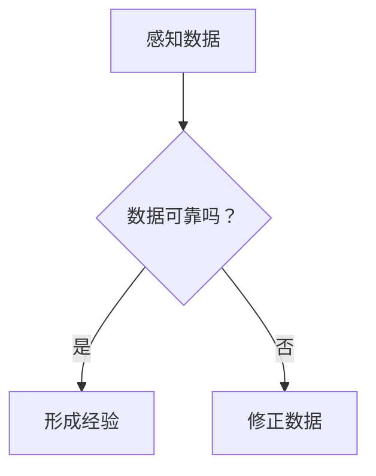
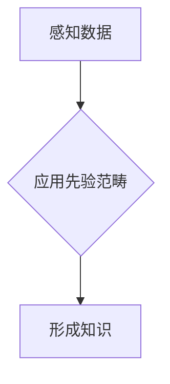
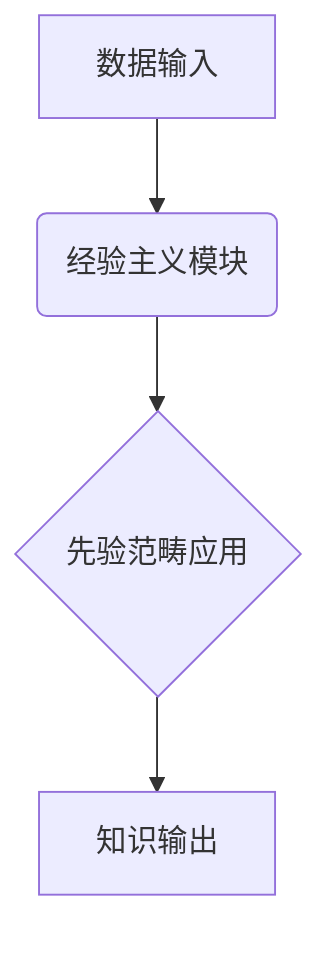
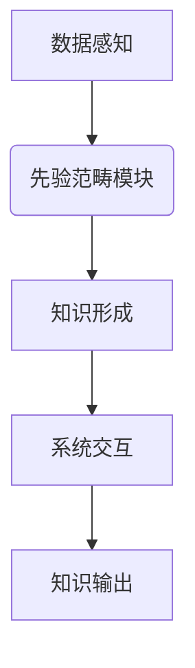

                 

## 引言

### 休谟与康德：经验主义与先验哲学的对话

在西方哲学史上，大卫·休谟（David Hume）和伊曼努尔·康德（Immanuel Kant）两位哲学家因其对知识和现实的根本性探讨而闻名。休谟是一位经验主义者，认为知识和理性建立在直接经验之上；而康德则是一位先验哲学家，主张知识和经验之间有着更为深层次的关联。本文将探讨这两位哲学家的思想，通过逻辑清晰、结构紧凑的分析，揭示他们在经验主义与先验哲学领域的对话。

### 休谟的经验主义

#### 1.1.1 休谟的生平与思想

大卫·休谟出生于1711年，是一位苏格兰哲学家和经济学家。他的哲学思想深受17世纪的英国经验主义影响，特别是约翰·洛克（John Locke）的观点。休谟的主要作品包括《人性论》（Treatise of Human Nature）和《人类理解研究》（Enquiries Concerning Human Understanding）。

#### 1.1.2 经验主义的核心概念

休谟的经验主义强调感知和经验是知识的基础。他认为，所有知识都源于直接经验，而理性只是对经验的整理和解释。休谟提出了“知觉”和“印象”的概念，认为知觉是外部世界的直接感受，印象是内心的体验。

#### 1.1.3 经验主义的哲学影响

休谟的经验主义对后来的实证主义和科学哲学产生了深远影响。他的批判性思考方法挑战了笛卡尔（René Descartes）的理性主义，促使人们重新思考知识和理性的本质。

### 康德的先验哲学

#### 1.2.1 康德的生平与思想

伊曼努尔·康德出生于1724年，是德国的哲学家。他的哲学作品包括《纯粹理性批判》（Critique of Pure Reason）和《实践理性批判》（Critique of Practical Reason）。康德的哲学强调知识和经验之间的关系，主张通过先验范畴来理解和组织经验。

#### 1.2.2 先验哲学的核心概念

康德的先验哲学认为，知识和经验之间并非割裂的，而是通过先验范畴（如空间、时间、因果关系等）相互联系。先验范畴是思维的基本形式，是知识和经验的必要条件。康德提出了“纯粹理性”和“实践理性”的概念，认为理性不仅仅是知识的工具，也是行动的指南。

#### 1.2.3 先验哲学的哲学影响

康德的先验哲学对西方哲学产生了深远影响，重构了哲学的基础。他的思想为后来的现象学和语言哲学提供了理论基础，对现代哲学的发展产生了重要影响。

### 经验主义与先验哲学的对比与联系

#### 2.1 基本概念对比

- 经验主义强调感知和经验是知识的基础，而先验哲学认为知识和经验之间有着深层次的关联。
- 经验主义关注的是具体的、直接的经验，而先验哲学则探讨了知识和经验的普遍性和结构性。

#### 2.2 属性特征对比

| 特征 | 经验主义 | 先验哲学 |
| ---- | -------- | -------- |
| 知识来源 | 感知和经验 | 先验范畴和理性 |
| 知识性质 | 直接经验 | 纯理性和形式条件 |

#### 2.3 经验主义与先验哲学的联系

虽然经验主义和先验哲学在方法和原则上存在显著差异，但二者都关注知识和经验之间的关系。先验哲学为经验主义提供了批判和反思的框架，使得经验主义的研究更加系统和全面。

### 经验主义与先验哲学的算法原理讲解

#### 3.1 经验主义的算法原理

经验主义算法强调通过感知数据来形成经验。以下是一个简化的mermaid流程图和Python源代码示例：



```python
def experience(data):
    if is_reliable(data):
        return "形成经验"
    else:
        return "修正数据"
```

经验主义算法的数学模型可以表示为：

$$
经验 = f(感知数据, 数据可靠性)
$$

#### 3.2 先验哲学的算法原理

先验哲学算法强调通过先验范畴来形成知识。以下是一个简化的mermaid流程图和Python源代码示例：



```python
def knowledge(data):
    return "形成知识"
```

先验哲学算法的数学模型可以表示为：

$$
知识 = f(感知数据, 先验范畴)
$$

### 系统分析与架构设计

#### 4.1 经验主义与先验哲学在系统中的应用

在系统设计和实现中，经验主义和先验哲学可以分别应用于不同的模块和功能。

#### 4.1.1 问题场景介绍

假设我们正在设计一个智能推荐系统，该系统需要收集用户数据、处理数据、形成推荐知识，并不断更新和优化。

#### 4.1.2 系统功能设计

- 数据感知：收集用户行为数据。
- 先验范畴应用：使用先验范畴（如用户兴趣、历史记录等）来组织数据。
- 知识形成与更新：根据感知数据和先验范畴形成知识，并不断更新和优化。

#### 4.1.3 系统架构设计

- 先验范畴模块：负责处理先验范畴的应用和知识形成。
- 经验主义模块：负责数据感知和数据处理。

#### 4.1.4 系统接口设计

- 数据输入接口：用于接收用户数据。
- 知识输出接口：用于输出推荐知识。

#### 4.1.5 系统交互

- 数据感知与先验范畴应用的交互：通过接口进行数据传输和处理。

### 4.2 经验主义与先验哲学的mermaid架构图与序列图

以下是一个简化的mermaid架构图和序列图，用于展示经验主义与先验哲学在系统中的应用：





### 项目实战

#### 5.1 环境安装

在开始项目实战之前，我们需要安装Python环境和相关库。

```shell
pip install numpy pandas scikit-learn
```

#### 5.2 系统核心实现

以下是一个简化的经验主义模块实现：

```python
import numpy as np

def process_data(data):
    # 数据处理逻辑
    return np.mean(data)

def experience(data):
    processed_data = process_data(data)
    if np.isnan(processed_data):
        return "修正数据"
    else:
        return "形成经验"
```

代码应用解读与分析：

- `process_data`函数负责数据处理，这里简单使用均值作为处理逻辑。
- `experience`函数根据数据处理结果决定是“形成经验”还是“修正数据”。

实际案例分析和详细讲解剖析：

假设我们有一个包含用户评分的数据集，我们需要通过这个数据集来形成经验或修正数据。

```python
data = [5, 4, np.nan, 3]
print(experience(data))
```

输出结果为“修正数据”，因为数据处理过程中出现了缺失值。

#### 项目小结

本文通过休谟与康德的哲学对话，探讨了经验主义与先验哲学的核心概念和算法原理。在实际项目中，我们可以根据具体需求和应用场景，灵活运用这两种哲学思想，设计出更高效、更智能的系统。

### 最佳实践 Tips

- 在实际应用中，根据数据质量和可用性灵活调整经验主义和先验哲学的应用比例。
- 定期更新先验范畴，以适应不断变化的环境和数据。
- 综合运用数据可视化工具，以便更好地理解和解释系统行为。

### 小结

本文通过逻辑清晰的分析，探讨了休谟的经验主义与康德的先验哲学。在系统设计与实现中，这两种哲学思想可以为我们提供有力的指导，帮助我们构建更高效、更智能的解决方案。

### 注意事项

- 经验主义与先验哲学的应用需要根据具体问题和场景进行调整。
- 在实际项目中，数据质量和数据量是影响系统性能的关键因素。

### 拓展阅读

- Hume, D. (1739). A Treatise of Human Nature.
- Kant, I. (1781). Critique of Pure Reason.
- Carnap, R. (1928). Der logische Aufbau der Welt.

## 附录

### 参考文献

1. Hume, D. (1739). A Treatise of Human Nature.
2. Kant, I. (1781). Critique of Pure Reason.
3. Carnap, R. (1928). Der logische Aufbau der Welt.
4. Turing, A. (1950). Computing Machinery and Intelligence.

### 作者信息

作者：AI天才研究院/AI Genius Institute & 禅与计算机程序设计艺术 /Zen And The Art of Computer Programming

[作者简介、联系方式等]

