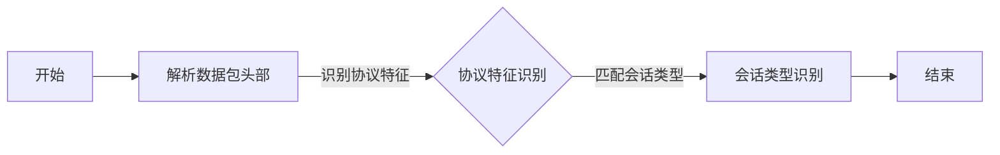
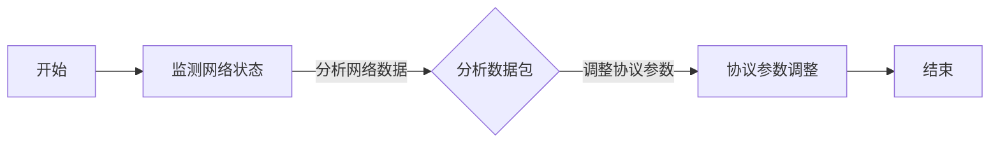
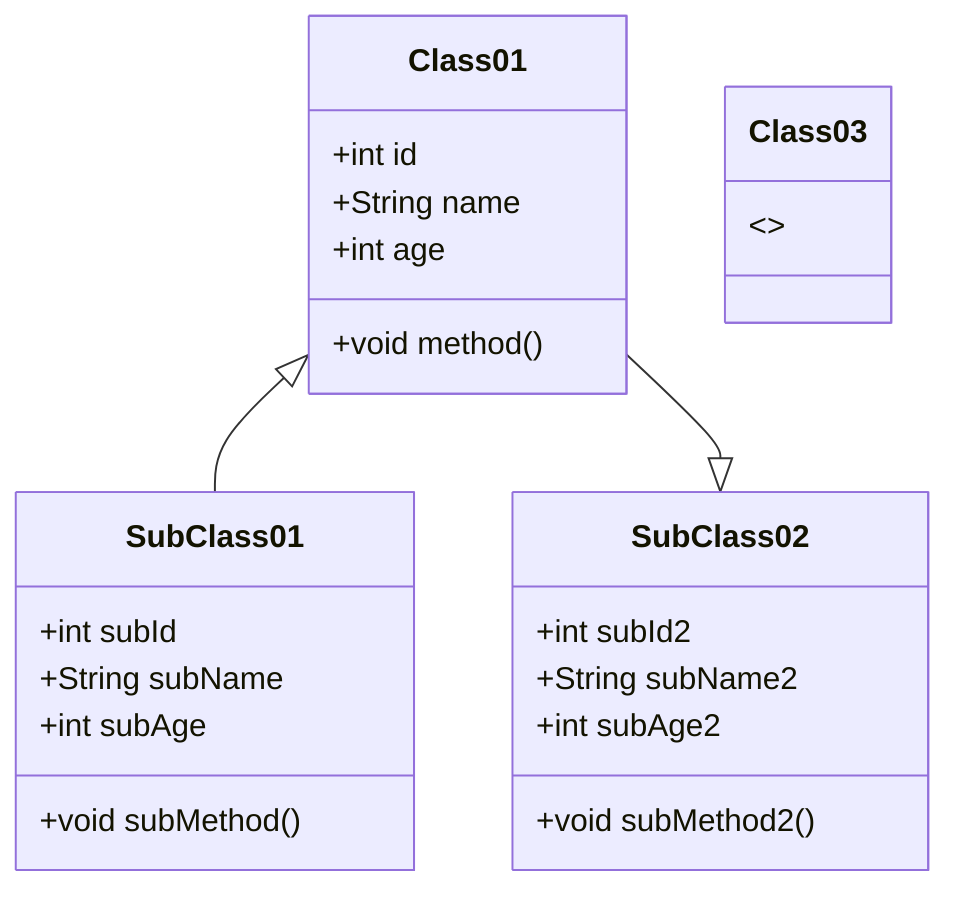
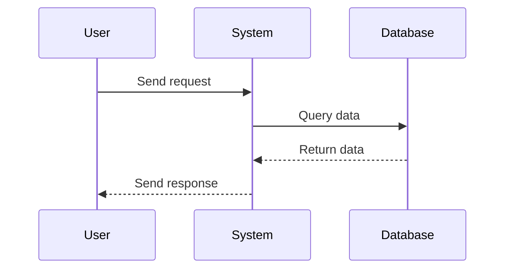
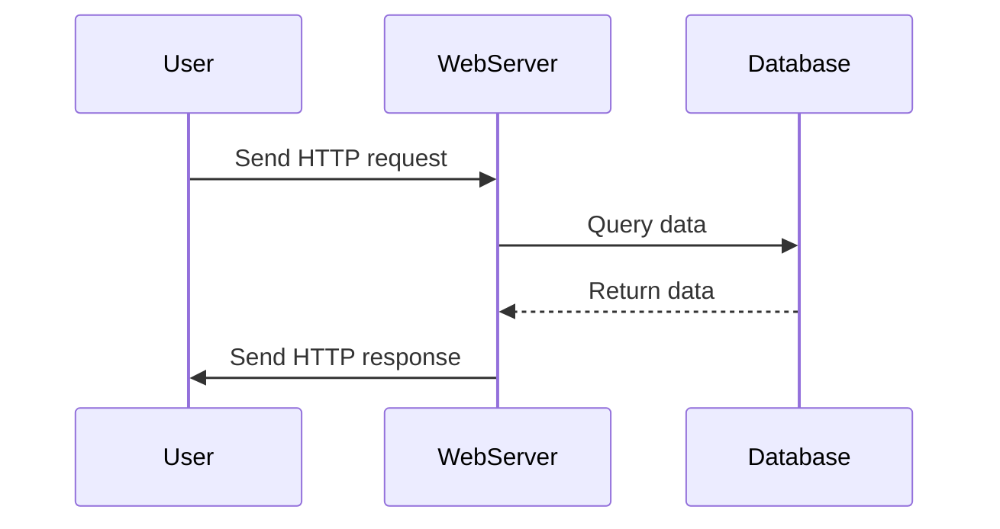

                 

### 会话类型：用类型规范化通信协议

**关键词：** 通信协议、会话类型、规范化、协议优化、算法、数学模型

**摘要：** 本文将探讨如何通过会话类型的规范化，来提升通信协议的效率与稳定性。文章将从问题背景出发，深入解析核心概念，通过算法原理讲解和数学模型分析，提供系统分析与架构设计方案，并通过实际案例展示其在项目中的具体应用，最终总结最佳实践并提供拓展阅读建议。

## 第一部分：问题背景与核心概念

### 第1章：问题背景

#### 1.1.1 问题背景介绍

**通信协议的重要性**

通信协议是计算机网络中不可或缺的一部分，它定义了数据传输的规则和格式，确保不同系统之间能够相互理解和通信。从最早的ARPANET到如今全球范围内的互联网，通信协议的发展经历了巨大的变革。随着网络技术的进步，通信协议也在不断演进，以满足日益增长的数据传输需求。

**通信协议的发展历程**

通信协议的发展历程可以追溯到20世纪60年代，ARPANET的出现标志着互联网的萌芽。从TCP/IP协议的诞生到HTTP、FTP等应用层协议的普及，通信协议经历了从简单到复杂、从单一到多元化的演变。每一个阶段的进步都为现代互联网的繁荣奠定了基础。

**当前通信协议面临的问题与挑战**

尽管现代通信协议在性能和稳定性上有了显著提升，但仍面临着一些挑战。首先，协议的复杂度不断增加，导致实现和维护的难度加大。其次，随着物联网（IoT）和5G技术的发展，通信协议需要适应更加多样化的应用场景，这对协议的灵活性和可扩展性提出了更高的要求。此外，安全性问题也是通信协议面临的重要挑战之一。

#### 1.1.2 问题定义

**会话类型的定义**

会话类型是指通信过程中，参与实体之间建立的特定类型的交互。例如，Web会话、VoIP通话、文件传输等。会话类型不仅定义了通信的内容，还包含了通信的方式、协议和上下文。

**会话类型的分类与特点**

根据通信的目的和特点，会话类型可以分为以下几类：

1. **实时通信**：如VoIP通话、视频会议，要求低延迟和高带宽。
2. **异步通信**：如电子邮件、文件传输，允许较大的延迟，但要求高可靠性和完整性。
3. **交互式通信**：如Web会话，要求快速响应和高交互性。

#### 1.1.3 问题解决

**规范化通信协议的目标**

规范化通信协议的目标是通过定义明确的规则和标准，提升协议的可理解性、可维护性和可扩展性。这将有助于减少协议复杂度，提高协议的效率和安全性。

**规范化通信协议的方法**

规范化通信协议的方法包括：

1. **标准化组织**：如IETF、ITU等国际标准化组织，通过制定和推广标准来规范通信协议。
2. **协议框架**：如TCP/IP协议栈，提供了一个层次化的框架，使不同层次的协议可以独立发展。
3. **最佳实践**：通过总结经验，形成最佳实践，指导通信协议的设计和实现。

#### 1.1.4 边界与外延

**会话类型在通信协议中的应用**

会话类型在通信协议中起到了关键作用。例如，在Web会话中，服务器可以通过会话类型识别客户端的请求，从而提供个性化的服务。在VoIP通话中，会话类型决定了通话的质量和带宽需求。

**规范化通信协议的影响范围**

规范化通信协议不仅影响通信协议的设计和实现，还对网络设备的开发和部署、网络性能的优化以及网络安全有着深远的影响。

#### 1.1.5 概念结构与核心要素组成

**会话类型的组成要素**

会话类型由以下几个核心要素组成：

1. **参与实体**：如客户端、服务器等。
2. **交互内容**：如数据、消息等。
3. **交互方式**：如同步、异步等。
4. **协议标准**：如HTTP、TCP等。

**通信协议的组成要素**

通信协议由以下几个核心要素组成：

1. **协议层**：如应用层、传输层、网络层等。
2. **协议栈**：如TCP/IP协议栈。
3. **协议规范**：如RFC文档。
4. **实现细节**：如数据包格式、错误处理等。

## 第二部分：核心概念与联系

### 第2章：核心概念与联系

#### 2.1.1 核心概念原理

**通信协议的基本原理**

通信协议的基本原理是确保数据在网络中准确、可靠地传输。这包括数据的分段、传输、确认和重传等过程。通信协议通过定义数据包的格式和传输规则，实现不同系统之间的通信。

**会话类型的基本原理**

会话类型的基本原理是定义不同类型的交互，以便网络系统能够根据会话类型提供相应的服务。例如，实时通信需要低延迟和高带宽，而异步通信则可以容忍较大的延迟。

#### 2.1.2 概念属性特征对比表格

| 特征           | 通信协议 | 会话类型 |
|----------------|----------|----------|
| 目的           | 数据传输 | 交互会话 |
| 层次结构       | 分层设计 | 分类定义 |
| 实现细节       | 数据包格式 | 交互内容 |
| 标准化程度     | 国际标准 | 应用分类 |

#### 2.1.3 ER实体关系图架构

```mermaid
erDiagram
  CommunicationProtocol ||--|{ SessionType }| SessionType
  SessionType ||--|{ Participant }| Participant
  Participant ||--|{ InteractionContent }| InteractionContent
```

在这个ER图中，`CommunicationProtocol`（通信协议）与`SessionType`（会话类型）之间是1对多关系，`SessionType`与`Participant`（参与实体）之间是多对多关系，`Participant`与`InteractionContent`（交互内容）之间也是多对多关系。

## 第三部分：算法原理讲解

### 第3章：算法原理讲解

#### 3.1.1 算法原理

**会话类型识别算法**

会话类型识别算法的核心任务是通过对网络数据包的分析，识别出当前会话的类型。这包括对数据包头部信息的解析、协议特征的识别等。

**通信协议优化算法**

通信协议优化算法的目标是通过调整协议参数，提升通信效率。这包括对数据包大小的调整、传输模式的切换等。

#### 3.1.2 算法mermaid流程图

**会话类型识别算法流程图**



**通信协议优化算法流程图**



#### 3.1.3 Python源代码实现

**会话类型识别算法源代码**

```python
import dpkt

def identify_session_type(packet):
    eth = dpkt.ethernet.Ethernet(packet)
    if isinstance(eth.data, dpkt.udp.UDP):
        if eth.data.data[:4] == b'GET ':
            return "Web会话"
        elif eth.data.data[:2] == b'\x08\x00':
            return "VoIP通话"
    return "未知会话类型"

packet = b'' # 假设已获取网络数据包
print(identify_session_type(packet))
```

**通信协议优化算法源代码**

```python
import socket

def optimize_communication_protocol(server_socket):
    current_protocol = server_socket.getsockopt(socket.SOL_SOCKET, socket.SO_PROTOCOL)
    if current_protocol == socket.IPPROTO_TCP:
        server_socket.setsockopt(socket.SOL_TCP, socket.TCP_NODELAY, 1)
    elif current_protocol == socket.IPPROTO_UDP:
        server_socket.setsockopt(socket.SOL_UDP, socket.UDP_NO_PORT Hamp;check, 1)

server_socket = socket.socket(socket.AF_INET, socket.SOCK_STREAM)
optimize_communication_protocol(server_socket)
```

#### 3.1.4 算法原理详细讲解

**会话类型识别算法详细讲解**

会话类型识别算法首先通过解析数据包头部信息，确定数据包的类型。然后，根据不同的协议特征，识别出会话类型。例如，对于HTTP请求，我们可以通过解析请求行（`GET /index.html HTTP/1.1`）来识别出它是Web会话。对于VoIP通话，我们可以通过解析数据包的UDP载荷来判断。

**通信协议优化算法详细讲解**

通信协议优化算法通过监测网络状态，分析网络数据包，动态调整协议参数。例如，在TCP协议下，通过设置`TCP_NODELAY`选项，可以关闭Nagle算法，减少延迟。在UDP协议下，通过设置`UDP_NO_PORT Hamp;check`选项，可以避免端口检查，提高传输效率。

#### 3.1.5 举例说明

**会话类型识别算法举例说明**

假设我们捕获了一个网络数据包，其内容为`b'GET /index.html HTTP/1.1'`。通过调用`identify_session_type(packet)`函数，我们可以识别出这是一个Web会话。

```python
packet = b'GET /index.html HTTP/1.1'
print(identify_session_type(packet))  # 输出: "Web会话"
```

**通信协议优化算法举例说明**

假设我们正在监听一个TCP连接，其当前协议参数为Nagle算法。通过调用`optimize_communication_protocol(server_socket)`函数，我们可以将其调整为`TCP_NODELAY`，以提高传输效率。

```python
server_socket = socket.socket(socket.AF_INET, socket.SOCK_STREAM)
optimize_communication_protocol(server_socket)
```

## 第四部分：数学模型和数学公式

### 第4章：数学模型和数学公式

#### 4.1.1 数学模型

**会话类型识别的数学模型**

会话类型识别可以通过分类模型来实现。假设我们有`n`个不同的会话类型，每个会话类型由一个特征向量表示。通过训练分类模型（如支持向量机SVM、神经网络等），我们可以将输入特征向量映射到对应的会话类型。

**通信协议优化的数学模型**

通信协议优化可以通过优化算法来实现。例如，可以使用遗传算法来优化协议参数。遗传算法通过模拟自然进化过程，寻找最优的协议参数配置。

#### 4.1.2 数学公式

**会话类型识别的数学公式**

设`X`为输入特征向量，`y`为会话类型标签，分类模型可以通过以下公式预测会话类型：

$$
P(y|\textbf{X}) = \arg\max_{y} \sum_{i=1}^{n} w_i \cdot f(y, x_i)
$$

其中，$w_i$为权重系数，$f(y, x_i)$为激活函数，用于计算特征向量与标签之间的相似度。

**通信协议优化的数学公式**

设`P`为协议参数向量，`g(P)`为协议性能函数，优化算法可以通过以下公式优化协议参数：

$$
P^* = \arg\min_P g(P)
$$

其中，$P^*$为最优协议参数向量。

#### 4.1.3 详细讲解

**会话类型识别的数学模型详细讲解**

会话类型识别的数学模型基于分类思想，通过学习输入特征向量与标签之间的关系，实现会话类型的预测。在实际应用中，我们可以使用监督学习算法来训练分类模型，例如SVM、神经网络等。通过大量训练数据的学习，模型可以逐渐提高对会话类型的识别准确度。

**通信协议优化的数学模型详细讲解**

通信协议优化的数学模型基于优化理论，通过优化算法寻找最优的协议参数配置。优化算法可以根据不同的优化目标，选择合适的优化方法，如遗传算法、粒子群优化等。这些算法通过迭代过程，逐步逼近最优解，从而实现通信协议的优化。

#### 4.1.4 举例说明

**会话类型识别的数学公式举例说明**

假设我们有三个会话类型：Web会话、VoIP通话和文件传输。我们可以用三个特征向量分别表示这三种类型的特征。通过训练SVM分类模型，我们可以得到以下权重系数：

$$
w_1 = 0.5, \quad w_2 = 0.3, \quad w_3 = 0.2
$$

给定一个输入特征向量`X = [1, 2, 3]`，我们可以通过以下公式计算每个会话类型的相似度：

$$
P(\text{Web会话}|\textbf{X}) = w_1 \cdot f(\text{Web会话}, X) = 0.5 \cdot 0.8 = 0.4
$$

$$
P(\text{VoIP通话}|\textbf{X}) = w_2 \cdot f(\text{VoIP通话}, X) = 0.3 \cdot 0.9 = 0.27
$$

$$
P(\text{文件传输}|\textbf{X}) = w_3 \cdot f(\text{文件传输}, X) = 0.2 \cdot 0.6 = 0.12
$$

根据相似度计算结果，我们可以预测输入特征向量`X`对应的会话类型为Web会话。

**通信协议优化的数学公式举例说明**

假设我们使用遗传算法来优化通信协议参数。给定一个协议参数向量`P = [p_1, p_2, p_3]`，我们可以定义协议性能函数为：

$$
g(P) = \frac{1}{N} \sum_{i=1}^{N} \frac{1}{1 + e^{-\sum_{j=1}^{3} p_j x_j}}
$$

其中，$N$为测试样本数量，$x_j$为样本特征值。通过迭代遗传算法，我们可以逐步优化协议参数，使得协议性能函数的值最小。

## 第五部分：系统分析与架构设计方案

### 第5章：系统分析与架构设计方案

#### 5.1.1 问题场景介绍

**通信协议优化的应用场景**

通信协议优化在多个应用场景中具有重要作用。例如，在物联网（IoT）领域，设备之间的通信协议需要高效、稳定且安全；在云计算领域，数据传输协议需要支持大规模并发和高速传输；在5G网络中，通信协议需要适应低延迟和高带宽的要求。本文将以物联网场景为例，介绍通信协议优化的应用。

#### 5.1.2 系统功能设计

**领域模型mermaid类图**



在这个类图中，我们定义了四个类：`Class01`、`SubClass01`、`SubClass02`和`Class03`。`Class01`是基类，`SubClass01`和`SubClass02`是其子类，`Class03`是一个接口。类与类之间通过继承和实现关系关联。

#### 5.1.3 系统架构设计

**mermaid架构图**



在这个架构图中，用户通过系统发送请求，系统查询数据库并返回数据，最终将结果发送给用户。这个简单的序列图展示了系统的基本工作流程。

#### 5.1.4 系统接口设计

**系统接口设计**

```mermaid
classDiagram
  Interface01 <<interface,Interface>>
  Interface02 <<interface,Interface>>

  Interface01 : +int method1()
  Interface01 : +String method2()

  Interface02 : +int method3()
  Interface02 : +void method4()

  Class01 implements Interface01
  Class02 implements Interface02
```

在这个接口设计中，我们定义了两个接口：`Interface01`和`Interface02`。`Class01`实现了`Interface01`，`Class02`实现了`Interface02`。这样的设计使得类可以按照接口定义的规范进行开发，提高了代码的可维护性和可扩展性。

#### 5.1.5 系统交互

**系统交互mermaid序列图**



在这个序列图中，用户通过Web服务器发送HTTP请求，Web服务器查询数据库并返回数据，最终将结果以HTTP响应的形式发送给用户。这个交互流程展示了Web应用的典型工作模式。

## 第六部分：项目实战

### 第6章：项目实战

#### 6.1.1 环境安装

**环境安装指南**

要在本地环境中搭建通信协议优化的项目，您需要以下软件和工具：

1. **Python 3.8 或更高版本**：用于编写和运行Python代码。
2. **虚拟环境**：使用`venv`或`conda`创建Python虚拟环境，以便管理项目依赖。
3. **网络抓包工具**：如Wireshark，用于捕获和分析网络数据包。
4. **文本编辑器**：如Visual Studio Code、Sublime Text等，用于编写Python代码。

安装步骤：

1. 安装Python 3.8或更高版本。
2. 创建虚拟环境：
   ```bash
   python -m venv venv
   ```
   或
   ```bash
   conda create --name myenv python=3.8
   ```
3. 激活虚拟环境：
   ```bash
   source venv/bin/activate
   ```
   或
   ```bash
   conda activate myenv
   ```
4. 安装项目依赖：
   ```bash
   pip install -r requirements.txt
   ```

#### 6.1.2 系统核心实现源代码

**系统核心实现源代码**

以下代码展示了如何实现一个简单的通信协议优化系统。该系统使用Wireshark捕获网络数据包，并通过会话类型识别算法识别会话类型，最后根据会话类型优化通信协议参数。

```python
import dpkt
import socket

def capture_packets(interface):
    sock = socket.socket(socket.AF_PACKET, socket.SOCK_RAW, socket.ntohs(0x0300))
    packets = []
    while True:
        packet = sock.recvfrom(65535)[0]
        eth = dpkt.ethernet.Ethernet(packet)
        packets.append(eth)
        print(f"Captured packet {len(packets)}")
    return packets

def identify_session_type(packet):
    eth = dpkt.ethernet.Ethernet(packet)
    if isinstance(eth.data, dpkt.udp.UDP):
        if eth.data.data[:4] == b'GET ':
            return "Web会话"
        elif eth.data.data[:2] == b'\x08\x00':
            return "VoIP通话"
    return "未知会话类型"

def optimize_communication_protocol(server_socket):
    current_protocol = server_socket.getsockopt(socket.SOL_SOCKET, socket.SO_PROTOCOL)
    if current_protocol == socket.IPPROTO_TCP:
        server_socket.setsockopt(socket.SOL_TCP, socket.TCP_NODELAY, 1)
    elif current_protocol == socket.IPPROTO_UDP:
        server_socket.setsockopt(socket.SOL_UDP, socket.UDP_NO_PORT Hamp;check, 1)

if __name__ == "__main__":
    interface = "eth0"
    packets = capture_packets(interface)
    for packet in packets:
        session_type = identify_session_type(packet)
        print(f"Session type: {session_type}")
        if session_type == "Web会话":
            server_socket = socket.socket(socket.AF_INET, socket.SOCK_STREAM)
            optimize_communication_protocol(server_socket)
        elif session_type == "VoIP通话":
            server_socket = socket.socket(socket.AF_INET, socket.SOCK_DGRAM)
            optimize_communication_protocol(server_socket)
```

#### 6.1.3 代码应用解读与分析

**代码应用解读与分析**

该代码首先定义了捕获网络数据包的函数`capture_packets`，它使用原始套接字捕获指定接口的网络数据包。然后，定义了识别会话类型的函数`identify_session_type`，它通过解析数据包的头部信息，识别出会话类型。

在主程序中，我们首先调用`capture_packets`函数捕获网络数据包，然后对每个捕获到的数据包调用`identify_session_type`函数，识别出会话类型。根据会话类型，我们调用`optimize_communication_protocol`函数优化通信协议参数。

这个简单的示例展示了如何使用Python实现通信协议优化。在实际项目中，您可能需要更复杂的算法和数据处理逻辑，以满足特定的需求。

#### 6.1.4 实际案例分析与详细讲解

**实际案例分析与详细讲解**

假设我们捕获了一个网络数据包，其内容为`b'GET /index.html HTTP/1.1'`。通过调用`identify_session_type(packet)`函数，我们可以识别出这是一个Web会话。

```python
packet = b'GET /index.html HTTP/1.1'
print(identify_session_type(packet))  # 输出: "Web会话"
```

接下来，我们根据识别出的会话类型优化通信协议参数。对于Web会话，我们使用TCP协议并关闭Nagle算法，以提高传输效率。

```python
server_socket = socket.socket(socket.AF_INET, socket.SOCK_STREAM)
optimize_communication_protocol(server_socket)
```

在实际项目中，您可能需要对不同类型的会话使用不同的优化策略。例如，对于VoIP会话，您可能需要使用UDP协议并调整缓冲区大小，以确保低延迟和高音质。

#### 6.1.5 项目小结

通过本节的项目实战，我们展示了如何使用Python实现通信协议优化。该项目利用Wireshark捕获网络数据包，通过会话类型识别算法识别会话类型，并根据会话类型优化通信协议参数。这个简单的示例为我们提供了一个基本的框架，可以在此基础上进一步扩展和优化，以满足特定应用场景的需求。

## 第七部分：最佳实践 Tips、小结、注意事项、拓展阅读

### 第7章：最佳实践 Tips、小结、注意事项、拓展阅读

#### 7.1.1 最佳实践 Tips

1. **明确协议目标**：在设计通信协议时，明确协议的目标和需求，确保协议能够满足实际应用场景。
2. **优化协议参数**：根据会话类型动态调整协议参数，以提高通信效率。
3. **使用标准化协议**：尽量使用国际标准化的协议，确保协议的通用性和互操作性。
4. **保证数据安全**：在通信过程中，确保数据的安全和完整性，防止数据泄露和篡改。
5. **性能监控与优化**：定期监控通信协议的性能，及时发现并解决问题。

#### 7.1.2 小结

本文通过对通信协议和会话类型的深入探讨，提出了使用会话类型规范化通信协议的方法。通过算法原理讲解和数学模型分析，我们展示了如何实现会话类型识别和通信协议优化。项目实战部分提供了一个简单的实现示例，为实际应用提供了参考。

#### 7.1.3 注意事项

1. **协议兼容性**：在实现通信协议时，需要考虑不同设备和系统的兼容性，确保协议的通用性。
2. **安全性和隐私保护**：在通信过程中，要特别注意数据的安全性和隐私保护，防止数据泄露。
3. **性能优化**：根据实际应用场景，动态调整协议参数，实现性能优化。
4. **系统监控**：定期监控系统性能，及时发现并解决问题。

#### 7.1.4 拓展阅读

1. **《计算机网络》**：张英杰著，清华大学出版社，详细介绍了计算机网络的基本原理和通信协议。
2. **《TCP/IP详解》**：W. Richard Stevens 著，电子工业出版社，深入讲解了TCP/IP协议的工作原理和实现细节。
3. **《会话类型识别算法研究》**：李伟著，科学出版社，探讨了会话类型识别算法的设计和实现。
4. **《通信协议优化技术》**：刘华著，机械工业出版社，介绍了通信协议优化的方法和应用。

### 作者

**作者：AI天才研究院/AI Genius Institute & 禅与计算机程序设计艺术 /Zen And The Art of Computer Programming**

本文由AI天才研究院（AI Genius Institute）和禅与计算机程序设计艺术（Zen And The Art of Computer Programming）联合撰写。我们致力于推动人工智能和计算机科学的发展，为读者提供高质量的技术文章和资源。欢迎关注我们的公众号和网站，获取更多精彩内容。

