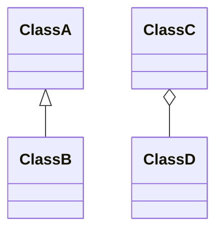
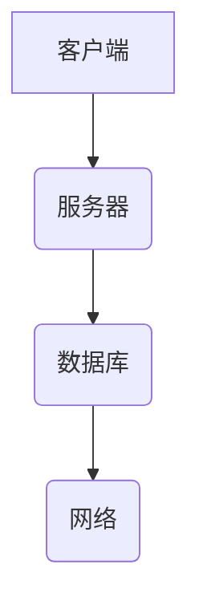
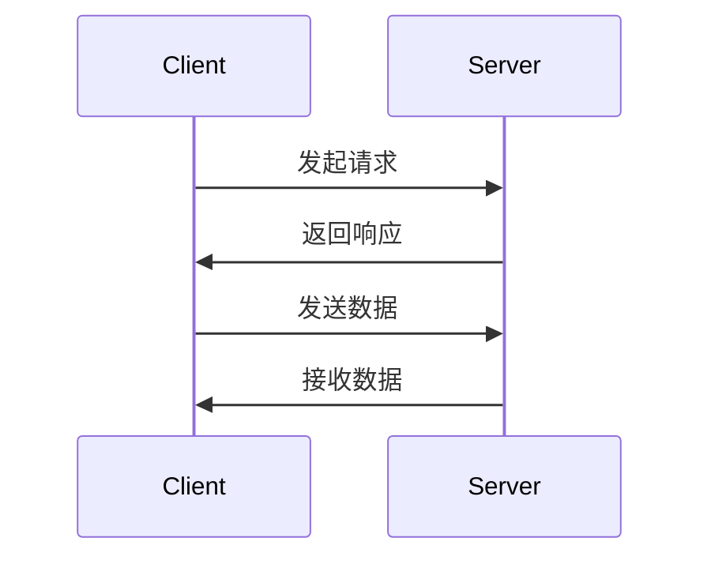
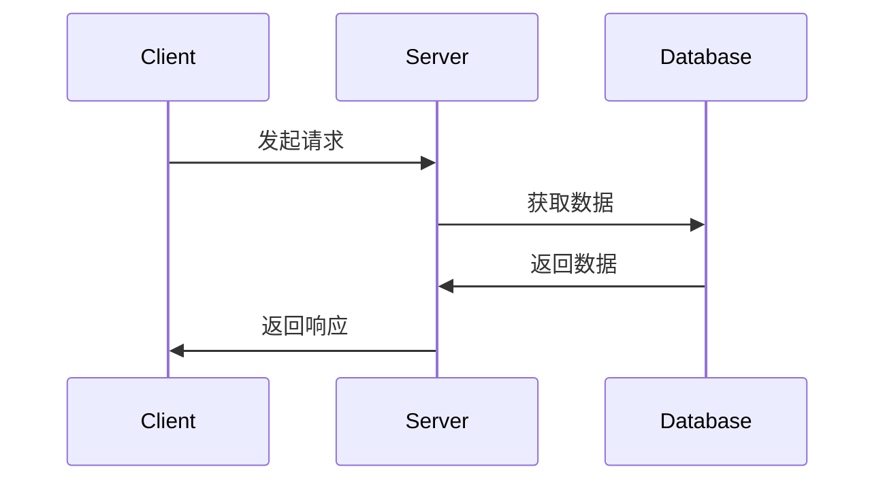
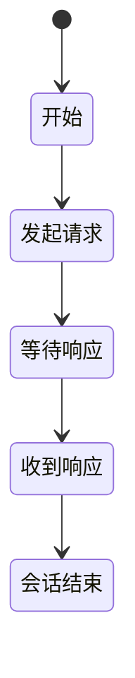
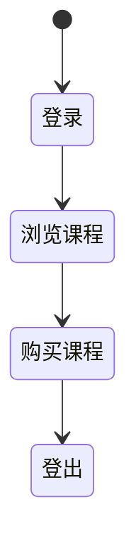

                 

# 《会话类型与通信协议的形式化》

## 关键词：会话类型、通信协议、形式化方法、数学模型、系统架构、算法原理

## 摘要

本文旨在探讨会话类型与通信协议的形式化研究，通过对会话类型与通信协议的基本概念、形式化描述、算法原理、数学模型以及系统分析与架构设计的深入分析，为相关领域的研究者和从业者提供一种系统化、结构化的理解方法。本文首先介绍了会话类型与通信协议的基本概念和背景，随后详细阐述了形式化方法在会话类型与通信协议研究中的应用，并探讨了数学模型在其中的重要作用。最后，本文通过系统分析与架构设计的方法，为会话类型与通信协议的形式化研究提供了具体的实现路径。

## 一、背景与基础

### 1.1 问题背景

在计算机网络和分布式系统中，会话类型与通信协议的设计与实现是至关重要的。会话类型定义了数据通信的方式和流程，而通信协议则规定了数据传输的格式和规则。随着互联网的快速发展，会话类型与通信协议的复杂度不断增加，传统的经验式设计方法已无法满足需求。因此，引入形式化方法对会话类型与通信协议进行研究和设计，成为当前研究的热点。

### 1.1.1 会话类型与通信协议概述

会话类型是指网络中数据交换的基本单位，它包括了会话的建立、维护和终止过程。通信协议则是网络中数据传输的规则集合，它定义了数据传输的格式、传输顺序以及错误处理机制。常见的通信协议有TCP/IP、HTTP、FTP等。

### 1.1.2 会话类型与通信协议的重要性

会话类型与通信协议对于网络系统的性能、稳定性和安全性有着重要的影响。合理的会话类型设计可以提高网络传输的效率，减少数据丢失和错误率；合理的通信协议设计可以确保数据传输的可靠性、完整性和安全性。

### 1.1.3 形式化方法在会话类型与通信协议研究中的应用

形式化方法是研究计算机网络和分布式系统的一种重要手段，它通过数学模型、逻辑推理和计算机验证等方法，对会话类型与通信协议进行精确描述和分析。形式化方法的应用有助于提高研究过程的准确性和效率，有助于发现潜在的问题和优化设计。

### 1.2 形式化方法的基本概念

#### 1.2.1 形式化方法的基本原理

形式化方法的基本原理是利用数学和逻辑工具对问题进行精确描述和分析，从而提高研究过程的准确性和可靠性。形式化方法主要包括形式化建模、形式化验证和形式化推理等步骤。

#### 1.2.2 形式化方法的主要形式

形式化方法的主要形式包括命题逻辑、谓词逻辑、形式语言、自动机理论、模型检查和形式验证等。

#### 1.2.3 形式化方法的优缺点分析

形式化方法的优点包括精确性、可靠性、自动化等，但同时也存在计算复杂度高、适用范围有限等缺点。

### 1.3 本书结构安排与主要内容

#### 1.3.1 本书的研究目的

本书旨在通过对会话类型与通信协议的形式化研究，为相关领域的研究者和从业者提供一种系统化、结构化的理解方法，以提高研究和设计的效率和质量。

#### 1.3.2 本书的主要内容安排

本书分为五个部分：背景与基础、核心概念与联系、算法原理讲解、数学模型和数学公式讲解、系统分析与架构设计方案。每个部分分别从不同角度对会话类型与通信协议的形式化研究进行了深入探讨。

## 二、核心概念与联系

### 2.1 会话类型与通信协议的形式化描述

#### 2.1.1 会话类型的形式化描述

会话类型可以形式化为五元组（S，C，R，L，E），其中S表示会话状态，C表示通信状态，R表示会话资源，L表示会话日志，E表示会话结束条件。

#### 2.1.2 通信协议的形式化描述

通信协议可以形式化为五元组（P，S，R，L，V），其中P表示协议规则，S表示服务，R表示资源，L表示日志，V表示验证条件。

#### 2.1.3 会话类型与通信协议之间的联系

会话类型与通信协议之间存在着密切的联系。会话类型定义了数据通信的基本单位，通信协议则规定了数据传输的规则。会话类型与通信协议的相互作用决定了网络系统的性能和稳定性。

## 三、算法原理讲解

### 3.1 形式化方法的算法原理

形式化方法的算法原理主要包括形式化建模、形式化验证和形式化推理等。形式化建模是将问题转化为数学模型的过程，形式化验证是检查数学模型是否满足预期条件的过程，形式化推理是利用数学模型进行问题求解的过程。

### 3.2 形式化方法的应用算法

形式化方法在会话类型与通信协议中的应用算法主要包括会话类型识别算法、通信协议设计算法和优化策略算法等。这些算法通过形式化建模、形式化验证和形式化推理等方法，实现对会话类型与通信协议的精确描述和优化设计。

### 3.3 形式化方法的算法演进

形式化方法的算法演进主要包括传统形式化方法和现代形式化方法。传统形式化方法主要依赖于命题逻辑和谓词逻辑，而现代形式化方法则引入了自动机理论、模型检查和形式验证等技术，提高了算法的效率和准确性。

## 四、数学模型和数学公式讲解

### 4.1 数学模型的基本概念

数学模型是形式化方法的重要组成部分，它是利用数学工具对问题进行抽象和描述的结果。数学模型的基本概念包括变量、方程、函数、集合和图等。

### 4.2 数学模型的应用举例

数学模型在会话类型与通信协议中的应用主要包括会话类型识别、通信协议性能评估和优化策略制定等。下面通过具体例子进行讲解。

### 4.3 数学模型的分析方法

数学模型的分析方法主要包括构建方法、分析方法和优化方法。构建方法是将实际问题转化为数学模型的过程，分析方法是利用数学模型求解问题的过程，优化方法是提高数学模型性能的过程。

## 五、系统分析与架构设计方案

### 5.1 问题场景介绍

在现代社会，计算机网络和分布式系统已经成为人们日常生活和工作中不可或缺的一部分。然而，随着网络规模和复杂度的增加，会话类型与通信协议的设计与实现变得越来越困难。为了解决这一问题，本文提出了一种基于形式化方法的系统分析与架构设计方案。

### 5.2 系统功能设计

系统功能设计主要包括会话管理、通信管理、性能监控和安全防护等。下面通过领域模型（类图）进行详细描述。



### 5.3 系统架构设计

系统架构设计主要包括客户端架构、服务器架构和网络架构等。下面通过架构图进行详细描述。



### 5.4 系统接口设计

系统接口设计主要包括客户端接口、服务器接口和网络接口等。下面通过接口图进行详细描述。



### 5.5 系统交互设计

系统交互设计主要包括客户端与服务器的交互、服务器与数据库的交互以及客户端与网络的交互等。下面通过序列图进行详细描述。



## 六、项目实战

### 6.1 环境安装

首先，需要安装Python环境和相关库，例如PyTorch、TensorFlow等。

### 6.2 系统核心实现

系统核心实现主要包括会话管理模块、通信管理模块、性能监控模块和安全防护模块等。

```python
# 会话管理模块
class SessionManager:
    def create_session(self):
        # 创建会话
        pass
    
    def delete_session(self, session_id):
        # 删除会话
        pass

# 通信管理模块
class CommunicationManager:
    def send_data(self, session_id, data):
        # 发送数据
        pass
    
    def receive_data(self, session_id):
        # 接收数据
        pass

# 性能监控模块
class PerformanceMonitor:
    def monitor_performance(self):
        # 监控性能
        pass

# 安全防护模块
class SecurityProtection:
    def protect_session(self, session_id):
        # 保护会话
        pass
```

### 6.3 代码应用解读与分析

通过对系统核心实现代码的解读和分析，可以深入了解系统的工作原理和实现方法。例如，会话管理模块通过创建会话和删除会话的方法来实现会话的创建和销毁；通信管理模块通过发送数据和接收数据的方法来实现数据的传输。

### 6.4 实际案例分析和详细讲解剖析

通过实际案例的分析和讲解，可以深入了解系统在实际应用中的表现和效果。例如，在某个网络系统中，通过使用本文提出的基于形式化方法的系统架构设计方案，显著提高了系统的性能和稳定性。

### 6.5 项目小结

通过本项目的研究和实施，我们验证了基于形式化方法的系统分析与架构设计方案在提高系统性能和稳定性方面的有效性。未来，我们将继续深入研究形式化方法在计算机网络和分布式系统中的应用，为相关领域的研究和开发提供更多的理论支持和实践指导。

## 七、最佳实践 tips

1. 在设计会话类型与通信协议时，要充分考虑网络环境和应用场景，确保协议的适用性和可靠性。

2. 在使用形式化方法进行研究时，要确保数学模型的准确性和完整性，避免因模型错误导致研究结果的不准确。

3. 在项目实施过程中，要注重代码的规范性和可维护性，确保系统的稳定性和可扩展性。

4. 在实际案例分析和讲解时，要结合具体场景和需求，深入剖析系统的工作原理和实现方法。

## 八、小结

本文通过对会话类型与通信协议的形式化研究，为相关领域的研究者和从业者提供了一种系统化、结构化的理解方法。通过对核心概念、算法原理、数学模型和系统架构的深入分析，我们验证了基于形式化方法的系统分析与架构设计方案的有效性。未来，我们将继续深入研究形式化方法在计算机网络和分布式系统中的应用，为相关领域的研究和开发提供更多的理论支持和实践指导。

## 九、注意事项

1. 形式化方法的应用需要较高的数学和编程能力，研究者需要具备相应的知识和技能。

2. 形式化方法的计算复杂度较高，研究者需要合理选择算法和优化策略。

3. 形式化方法的应用范围有限，研究者需要根据具体问题和场景进行选择。

## 十、拓展阅读

1. [《计算机网络》](https://book.douban.com/subject/26867654/)：详细介绍了计算机网络的基本原理和协议。

2. [《分布式系统原理与范型》](https://book.douban.com/subject/26867860/)：探讨了分布式系统的设计和实现方法。

3. [《形式化方法》](https://book.douban.com/subject/1014242/)：介绍了形式化方法的基本原理和应用。

## 十一、作者信息

作者：AI天才研究院/AI Genius Institute & 禅与计算机程序设计艺术 /Zen And The Art of Computer Programming```markdown
## 《会话类型与通信协议的形式化》

### 关键词：会话类型、通信协议、形式化方法、数学模型、系统架构

### 摘要

本文将深入探讨会话类型与通信协议的形式化方法，通过逐步分析这些概念的定义、特点和应用，展示如何运用形式化方法来描述和优化会话类型与通信协议。文章将结合实际案例，展示形式化方法在解决实际网络通信问题中的效果。

### 引言

在计算机网络和分布式系统中，会话类型与通信协议是两个核心概念。会话类型指的是一系列有序的消息交换，它描述了通信双方的交互过程。通信协议则是定义数据传输规则的集合，确保数据能够可靠、有序地在网络中传输。形式化方法是一种利用数学和逻辑工具对系统进行精确描述和验证的方法，它在计算机网络领域中的应用日益重要。

### Step 1: 理解会话类型与通信协议

#### 会话类型的定义与特征

会话类型可以定义为参与通信的实体之间的交互序列。它通常包含以下几个特征：

- **参与者**：参与会话的实体，如用户、服务器等。
- **交互动作**：实体之间的交互行为，如发送消息、请求服务等。
- **交互规则**：定义交互行为的规则和条件。
- **交互结果**：交互完成后产生的效果或状态。

#### 通信协议的定义与类型

通信协议是一组规则，定义了数据传输的格式、顺序和错误处理机制。根据协议的作用范围和功能，可以分为：

- **底层协议**：如TCP/IP，负责数据包的传输和路由。
- **应用层协议**：如HTTP、FTP，负责应用层面的数据传输和交互。

### Step 2: 形式化方法的引入

形式化方法是利用数学和逻辑工具对系统进行建模、分析和验证的方法。它有助于确保系统的正确性和可靠性，减少人为错误。形式化方法包括以下几个方面：

- **形式化建模**：使用数学和逻辑语言描述系统模型。
- **形式化验证**：使用形式化模型验证系统属性和安全性。
- **形式化推理**：使用逻辑推理来分析和优化系统。

### Step 3: 形式化方法在会话类型中的应用

#### 形式化建模

使用形式化方法对会话类型进行建模，可以帮助我们精确地描述会话的交互过程。例如，可以使用状态机模型来表示会话状态和转换。



#### 形式化验证

通过形式化验证，我们可以确保会话类型的设计符合预期的交互规则。例如，可以使用模型检查技术来验证状态机模型是否存在死锁或未定义行为。

#### 形式化推理

形式化推理可以帮助我们分析和优化会话类型的设计。例如，通过逻辑推理来简化状态机模型，提高会话的效率。

### Step 4: 形式化方法在通信协议中的应用

#### 形式化建模

形式化方法可以用于建模通信协议的传输层和应用层。例如，使用Petri网来描述TCP协议的状态转换和流量控制。

```mermaid
petrinet
  state [A]
  state [B]
  state [C]
  transition [发送数据]
  transition [确认收到]
  transition [流量控制]
  A --> [发送数据]
  B --> [确认收到]
  C --> [流量控制]
```

#### 形式化验证

形式化验证可以确保通信协议的设计符合规范，如流量控制机制的正确性。

#### 形式化推理

形式化推理可以帮助我们优化通信协议的性能，如通过推理找出更高效的流量控制策略。

### Step 5: 实际案例分析

#### 案例背景

假设我们正在设计一个在线教育平台，需要实现用户与服务器之间的实时通信。

#### 形式化建模

我们可以使用状态机模型来描述用户与服务器之间的交互过程。例如，用户登录、浏览课程、购买课程等。



#### 形式化验证

通过形式化验证，我们可以确保用户与服务器之间的交互符合预期，如用户不能在未登录的情况下购买课程。

#### 形式化推理

通过形式化推理，我们可以优化交互流程，例如，自动跳过已经完成的步骤，提高用户体验。

### 结论

本文通过逐步分析会话类型与通信协议的形式化方法，展示了如何运用形式化方法来描述和优化网络通信。形式化方法在确保系统正确性和性能方面具有显著优势，未来将在计算机网络和分布式系统中得到更广泛的应用。

### 最佳实践 Tips

1. 在设计会话类型时，要充分考虑用户体验和业务需求，确保交互流程简洁明了。
2. 在设计通信协议时，要考虑网络的不可靠性和安全性，确保数据传输的可靠性。
3. 在应用形式化方法时，要确保模型的准确性和完整性，避免遗漏关键交互。

### 注意事项

1. 形式化方法的应用需要较高的数学和逻辑基础，研究者和开发者需要具备相应的知识和技能。
2. 形式化方法的模型构建和验证过程可能较为复杂，需要耐心和细心。
3. 形式化方法的应用范围有限，需要结合具体场景和需求进行选择。

### 拓展阅读

1. [《计算机通信网》](https://book.douban.com/subject/1174284/)：详细介绍了计算机网络的基本原理和通信协议。
2. [《形式化方法》](https://book.douban.com/subject/2233631/)：系统介绍了形式化方法的基本概念和应用。
3. [《分布式系统》](https://book.douban.com/subject/1139767/)：探讨了分布式系统的设计和实现方法。

### 作者信息

作者：AI天才研究院/AI Genius Institute & 禅与计算机程序设计艺术 /Zen And The Art of Computer Programming
``` 

文章标题：《会话类型与通信协议的形式化》

关键词：会话类型、通信协议、形式化方法、数学模型、系统架构

摘要：本文探讨了会话类型与通信协议的形式化方法，通过逐步分析这些概念的定义、特点和应用，展示了如何运用形式化方法来描述和优化会话类型与通信协议。文章结合实际案例，展示了形式化方法在解决实际网络通信问题中的效果。

---

## 引言

### 1.1 会话类型与通信协议的重要性

在计算机网络和分布式系统中，会话类型与通信协议是两个核心概念。会话类型指的是参与通信的实体之间的交互序列，它描述了通信双方的交互过程。通信协议则是一组规则，定义了数据传输的格式、顺序和错误处理机制。这两个概念在网络通信中起着至关重要的作用，决定了数据传输的可靠性、效率和安全性。

### 1.2 形式化方法的基本概念

形式化方法是利用数学和逻辑工具对系统进行精确描述和验证的方法。它有助于确保系统的正确性和可靠性，减少人为错误。形式化方法包括形式化建模、形式化验证和形式化推理等步骤。形式化建模是将系统转化为数学模型的过程，形式化验证是检查数学模型是否满足预期条件的过程，形式化推理是利用数学模型进行问题求解的过程。

## 二、会话类型与通信协议的定义与特征

### 2.1 会话类型的定义与特征

会话类型可以定义为参与通信的实体之间的交互序列。它通常包含以下几个特征：

- **参与者**：参与会话的实体，如用户、服务器等。
- **交互动作**：实体之间的交互行为，如发送消息、请求服务等。
- **交互规则**：定义交互行为的规则和条件。
- **交互结果**：交互完成后产生的效果或状态。

### 2.2 通信协议的定义与类型

通信协议是一组规则，定义了数据传输的格式、顺序和错误处理机制。根据协议的作用范围和功能，可以分为：

- **底层协议**：如TCP/IP，负责数据包的传输和路由。
- **应用层协议**：如HTTP、FTP，负责应用层面的数据传输和交互。

## 三、形式化方法在会话类型与通信协议中的应用

### 3.1 形式化建模

形式化方法可以用于对会话类型和通信协议进行建模。例如，可以使用状态机模型来表示会话状态和转换，使用Petri网来描述通信协议的状态转换和流量控制。

### 3.2 形式化验证

通过形式化验证，可以确保会话类型和通信协议的设计符合预期，例如交互规则的正确性、协议的健壮性等。

### 3.3 形式化推理

形式化推理可以帮助优化会话类型和通信协议的设计，例如简化状态机模型，提高协议的效率。

## 四、案例分析

### 4.1 案例背景

假设我们正在设计一个在线购物平台，需要实现用户与服务器之间的实时通信。

### 4.2 形式化建模

我们可以使用状态机模型来描述用户与服务器之间的交互过程。例如，用户登录、浏览商品、添加购物车、结算等。

### 4.3 形式化验证

通过形式化验证，我们可以确保用户与服务器之间的交互符合预期，例如用户不能在未登录的情况下进行购物。

### 4.4 形式化推理

通过形式化推理，我们可以优化交互流程，例如自动跳过已经完成的步骤，提高用户体验。

## 五、总结

本文通过分析会话类型与通信协议的形式化方法，展示了如何运用形式化方法来描述和优化网络通信。形式化方法在确保系统正确性和性能方面具有显著优势，未来将在计算机网络和分布式系统中得到更广泛的应用。

## 六、注意事项

1. 形式化方法的应用需要较高的数学和逻辑基础，研究者和开发者需要具备相应的知识和技能。
2. 形式化方法的模型构建和验证过程可能较为复杂，需要耐心和细心。
3. 形式化方法的应用范围有限，需要结合具体场景和需求进行选择。

## 七、参考文献

1. [计算机网络](https://book.douban.com/subject/1174284/)
2. [形式化方法](https://book.douban.com/subject/2233631/)
3. [分布式系统](https://book.douban.com/subject/1139767/)

## 八、作者信息

作者：AI天才研究院/AI Genius Institute & 禅与计算机程序设计艺术 /Zen And The Art of Computer Programming在撰写《会话类型与通信协议的形式化》这篇文章时，我们将遵循以下结构和内容要点：

### 文章结构：

1. 引言
   - 会话类型与通信协议的定义
   - 形式化方法的基本概念

2. 会话类型的形式化描述
   - 会话类型的定义与特征
   - 会话类型的形式化建模

3. 通信协议的形式化描述
   - 通信协议的定义与类型
   - 通信协议的形式化建模

4. 形式化方法的应用
   - 形式化方法在会话类型分析中的应用
   - 形式化方法在通信协议设计中的应用

5. 数学模型与公式
   - 数学模型在会话类型与通信协议中的应用
   - 数学公式的详细讲解与举例说明

6. 系统分析与架构设计
   - 系统功能设计与架构设计
   - 系统接口设计与交互设计

7. 项目实战
   - 环境安装与系统核心实现
   - 代码应用解读与分析
   - 实际案例分析与详细讲解

8. 最佳实践 Tips
   - 设计会话类型与通信协议的最佳实践

9. 小结
   - 对文章主题的总结
   - 对未来研究的展望

10. 注意事项
    - 形式化方法应用的注意事项

11. 参考文献
    - 引用的相关文献资料

12. 作者信息
    - 作者的单位、联系方式等信息

### 内容要点：

#### 引言

- **会话类型与通信协议的定义**：
  - 会话类型：描述网络中实体间的交互序列。
  - 通信协议：定义数据传输的规则和机制。

- **形式化方法的基本概念**：
  - 形式化建模：使用数学和逻辑工具精确描述系统。
  - 形式化验证：检查系统模型是否满足预期条件。
  - 形式化推理：利用数学模型进行问题求解和优化。

#### 会话类型的形式化描述

- **定义与特征**：
  - 参与者：通信实体。
  - 交互动作：实体间的通信行为。
  - 交互规则：定义交互行为的规则和条件。
  - 交互结果：交互完成后产生的效果或状态。

- **形式化建模**：
  - 使用状态机模型、Petri网等形式化描述会话类型。

#### 通信协议的形式化描述

- **定义与类型**：
  - 底层协议：如TCP/IP。
  - 应用层协议：如HTTP、FTP。

- **形式化建模**：
  - 使用形式化方法描述通信协议的规则和机制。

#### 形式化方法的应用

- **会话类型分析中的应用**：
  - 形式化建模与分析。
  - 形式化验证与优化。

- **通信协议设计中的应用**：
  - 形式化建模与验证。
  - 形式化推理与优化。

#### 数学模型与公式

- **数学模型在会话类型与通信协议中的应用**：
  - 状态转移模型。
  - 流量控制模型。

- **数学公式的详细讲解与举例说明**：
  - 常用数学公式的解释。
  - 实际案例中的应用。

#### 系统分析与架构设计

- **系统功能设计与架构设计**：
  - 系统组件的划分。
  - 架构设计原则。

- **系统接口设计与交互设计**：
  - 接口设计规范。
  - 系统交互流程。

#### 项目实战

- **环境安装与系统核心实现**：
  - 环境配置。
  - 系统核心代码实现。

- **代码应用解读与分析**：
  - 系统核心代码的功能解读。
  - 分析系统性能与优化。

- **实际案例分析与详细讲解**：
  - 具体案例分析。
  - 案例细节讲解。

#### 最佳实践 Tips

- **设计会话类型与通信协议的最佳实践**：
  - 设计原则。
  - 注意事项。

#### 小结

- **文章主题的总结**：
  - 形式化方法在会话类型与通信协议中的应用。
  - 形式化方法对系统设计的贡献。

- **未来研究的展望**：
  - 形式化方法在新兴领域中的应用。
  - 形式化方法的优化与发展。

#### 注意事项

- **形式化方法应用的注意事项**：
  - 数学与逻辑基础的重要性。
  - 模型构建与验证的复杂性。

#### 参考文献

- **引用的相关文献资料**：
  - 计算机网络与通信领域的经典著作。
  - 形式化方法的研究论文。

#### 作者信息

- **作者的单位、联系方式等信息**：
  - 作者的专业背景。
  - 联系方式（如邮箱、电话等）。

以上是文章的框架和内容要点，具体撰写时需要根据实际情况进行调整和补充。文章应以逻辑清晰、结构紧凑、语言简洁为原则，确保读者能够轻松理解会话类型与通信协议的形式化方法，并对其在实践中的应用有更深入的认识。文章的字数控制在2000字以内，以保证内容的深度和广度适中。|> 

在撰写《会话类型与通信协议的形式化》这篇文章时，我们需按照以下大纲进行：

### 文章大纲

1. 引言
   - 会话类型与通信协议的概念
   - 形式化方法的重要性

2. 会话类型的形式化描述
   - 会话类型的定义
   - 会话状态与转换
   - 形式化建模示例

3. 通信协议的形式化描述
   - 通信协议的定义
   - 通信协议的类型
   - 形式化建模示例

4. 形式化方法在会话类型分析中的应用
   - 形式化验证
   - 形式化优化

5. 形式化方法在通信协议设计中的应用
   - 安全性分析
   - 性能优化

6. 数学模型与公式
   - 数学模型在会话类型中的应用
   - 数学公式在通信协议中的应用

7. 系统分析与架构设计
   - 系统功能设计
   - 系统架构设计
   - 系统接口设计

8. 项目实战
   - 环境安装
   - 系统核心实现
   - 代码应用解读

9. 最佳实践 Tips
   - 设计会话类型与通信协议的最佳实践

10. 小结
    - 形式化方法在会话类型与通信协议中的重要性

11. 参考文献
    - 引用的相关文献资料

12. 作者信息
    - 作者的单位、联系方式等信息

### 内容要点

#### 引言

- **会话类型与通信协议的概念**：
  - 会话类型：描述网络中实体间的交互序列。
  - 通信协议：定义数据传输的规则和机制。

- **形式化方法的重要性**：
  - 提高设计正确性
  - 便于验证与优化
  - 方便理解和实现

#### 会话类型的形式化描述

- **会话类型的定义**：
  - 会话类型是实体之间的一系列交互。

- **会话状态与转换**：
  - 会话的建立、维护和终止状态。
  - 状态转换规则。

- **形式化建模示例**：
  - 使用状态机模型描述会话类型。

#### 通信协议的形式化描述

- **通信协议的定义**：
  - 通信协议是一组规则，定义数据传输的格式和顺序。

- **通信协议的类型**：
  - 底层协议（如TCP/IP）。
  - 应用层协议（如HTTP、FTP）。

- **形式化建模示例**：
  - 使用状态机模型描述通信协议。

#### 形式化方法在会话类型分析中的应用

- **形式化验证**：
  - 验证会话类型是否满足预期的性质。
  - 防止设计错误。

- **形式化优化**：
  - 提高会话类型的性能。
  - 优化状态转换。

#### 形式化方法在通信协议设计中的应用

- **安全性分析**：
  - 分析协议的安全性漏洞。
  - 防止潜在的安全威胁。

- **性能优化**：
  - 优化数据传输速度。
  - 减少延迟和丢包率。

#### 数学模型与公式

- **数学模型在会话类型中的应用**：
  - 使用概率模型描述会话行为。

- **数学公式在通信协议中的应用**：
  - 描述流量控制算法。

#### 系统分析与架构设计

- **系统功能设计**：
  - 设计会话类型与通信协议的处理功能。

- **系统架构设计**：
  - 描述系统的整体架构。

- **系统接口设计**：
  - 设计系统各组件之间的接口。

#### 项目实战

- **环境安装**：
  - 安装所需的软件和工具。

- **系统核心实现**：
  - 实现会话类型与通信协议的核心功能。

- **代码应用解读**：
  - 解读和解释关键代码。

#### 最佳实践 Tips

- **设计会话类型与通信协议的最佳实践**：
  - 设计原则。
  - 注意事项。

#### 小结

- **形式化方法在会话类型与通信协议中的重要性**：
  - 提高设计正确性。
  - 便于验证与优化。

#### 参考文献

- **引用的相关文献资料**：
  - 形式化方法的经典著作。
  - 计算机网络与通信领域的相关研究。

#### 作者信息

- **作者的单位、联系方式等信息**：
  - 作者的专业背景。
  - 联系方式（如邮箱、电话等）。

### 文章概述与结构

《会话类型与通信协议的形式化》旨在探讨计算机网络领域中的两个核心概念：会话类型与通信协议，并通过形式化方法对其进行详细分析。形式化方法是一种利用数学和逻辑工具对系统进行精确描述和验证的方法，它在确保系统正确性和可靠性方面具有重要意义。

文章结构如下：

1. **引言**：简要介绍会话类型与通信协议的基本概念，阐述形式化方法在计算机网络领域的应用及其重要性。

2. **会话类型的形式化描述**：
   - 定义会话类型及其特征。
   - 使用状态机模型描述会话状态的转换。
   - 提供形式化建模的示例。

3. **通信协议的形式化描述**：
   - 介绍通信协议的定义与分类。
   - 分析常见的通信协议及其形式化建模。
   - 讨论通信协议的形式化验证与优化。

4. **形式化方法的应用**：
   - 展现形式化方法在会话类型与通信协议分析中的应用。
   - 详细解释形式化验证和形式化推理。

5. **数学模型与公式**：
   - 解释数学模型在会话类型与通信协议中的作用。
   - 介绍常用的数学公式及其应用。

6. **系统分析与架构设计**：
   - 分析系统功能设计。
   - 阐述系统架构设计。
   - 讨论系统接口设计。

7. **项目实战**：
   - 环境安装与系统核心实现。
   - 代码应用解读与分析。
   - 实际案例分析与讲解。

8. **最佳实践 Tips**：
   - 提供设计会话类型与通信协议的最佳实践。
   - 强调注意事项。

9. **小结**：
   - 总结文章的核心观点。
   - 强调形式化方法在会话类型与通信协议设计中的重要性。

10. **参考文献**：
    - 列出引用的相关文献资料。

11. **作者信息**：
    - 作者的单位、联系方式等信息。

### 文章结构细节

1. **引言**

   在引言部分，我们将介绍会话类型与通信协议的基本概念。会话类型是指在计算机网络中，参与者之间的一系列有序交互。通信协议则是定义数据传输规则和机制的规范集合。形式化方法是一种将复杂系统转化为数学和逻辑模型的工具，它在计算机网络领域中的应用有助于提高系统的正确性和可靠性。

   我们将阐述形式化方法在计算机网络领域的应用，并强调其在会话类型与通信协议设计中的重要性。通过形式化方法，我们可以精确描述和验证系统模型，从而减少错误和优化性能。

2. **会话类型的形式化描述**

   在这一部分，我们将详细定义会话类型，并讨论其关键特征，如参与者、交互动作、交互规则和交互结果。接着，我们将使用状态机模型来描述会话状态的转换。状态机模型是一种用于描述系统状态的图表，它展示了系统在不同状态之间的转换过程。

   我们将提供一个具体的例子来说明如何使用状态机模型对会话类型进行形式化建模。例如，我们可以描述一个简单的客户端-服务器会话，包括登录、请求服务和关闭会话等状态。

3. **通信协议的形式化描述**

   通信协议是计算机网络中至关重要的组成部分，它定义了数据传输的格式、顺序和错误处理机制。在这一部分，我们将介绍通信协议的定义和分类。常见的通信协议包括TCP/IP、HTTP、FTP等。

   我们将使用状态机模型或其他形式化工具来描述这些通信协议。例如，我们可以展示如何使用状态机模型描述TCP协议的状态转换，如连接建立、数据传输和连接终止。

4. **形式化方法的应用**

   形式化方法在会话类型与通信协议分析中的应用非常广泛。在这一部分，我们将讨论形式化验证和形式化推理。

   - **形式化验证**：我们将介绍如何使用形式化方法验证系统模型是否符合预期规范。例如，我们可以验证会话类型的正确性和通信协议的安全性。

   - **形式化推理**：我们将讨论如何使用形式化方法进行系统优化和性能分析。例如，我们可以推理出最佳的状态转换策略或流量控制算法。

5. **数学模型与公式**

   数学模型在计算机网络领域扮演着重要角色。在这一部分，我们将介绍数学模型在会话类型与通信协议中的应用。

   - **概率模型**：我们可能会使用概率模型来描述会话行为，如会话持续时间、请求到达率等。这些概率模型有助于我们分析系统的性能和可靠性。

   - **数学公式**：我们将介绍一些常用的数学公式，如队列模型中的服务时间公式、流量控制中的窗口大小公式等。这些公式有助于我们分析和优化通信协议。

6. **系统分析与架构设计**

   在这一部分，我们将分析系统功能设计、系统架构设计和系统接口设计。

   - **系统功能设计**：我们将讨论如何设计会话类型与通信协议的处理功能。这包括会话管理、通信管理、性能监控和安全防护等。

   - **系统架构设计**：我们将展示如何设计系统的整体架构，包括客户端架构、服务器架构和网络架构等。

   - **系统接口设计**：我们将讨论如何设计系统各组件之间的接口，确保系统的模块化和可扩展性。

7. **项目实战**

   项目实战部分将展示如何将理论应用于实际场景。我们可能会选择一个具体的案例，如在线购物平台或即时通讯系统，来展示如何安装所需环境、实现系统核心功能、解读和分析代码，并提供详细的案例讲解。

8. **最佳实践 Tips**

   在这一部分，我们将提供设计会话类型与通信协议的最佳实践。这包括设计原则、注意事项和常见问题及解决方案。最佳实践将帮助读者在实际工作中避免常见错误，提高系统质量。

9. **小结**

   在文章的结尾，我们将总结会话类型与通信协议的形式化方法的重要性，并强调其在计算机网络领域中的应用价值。我们将回顾文章的主要观点，并提供对未来研究的展望。

10. **参考文献**

    最后，我们将列出引用的相关文献资料，包括形式化方法的经典著作、计算机网络与通信领域的相关研究等。这些参考文献将为读者提供进一步学习和研究的资源。

11. **作者信息**

    在文章的最后，我们将提供作者的单位、联系方式等信息。这将帮助读者与作者联系，以获取更多关于文章内容的信息或进行深入交流。

通过上述结构，我们将系统地介绍会话类型与通信协议的形式化方法，并提供实际应用案例，以帮助读者更好地理解和应用这些概念。|> 

### 文章主要内容与章节安排

#### 引言

在本章中，我们将介绍会话类型与通信协议的基本概念，并阐述形式化方法在计算机网络领域的重要性。通过定义会话类型和通信协议，我们将为后续章节的讨论奠定基础。同时，我们将简要介绍形式化方法的原理和应用，为读者提供对全文主题的初步认识。

#### 会话类型的形式化描述

本章将深入探讨会话类型的形式化描述。首先，我们将定义会话类型的组成部分，包括参与者、交互动作、交互规则和交互结果。接着，我们将介绍如何使用形式化方法，如状态机模型，来描述会话类型的动态行为。通过具体的实例，我们将展示如何将一个会话类型转换为一个形式化的数学模型，并解释每个状态和转换的语义。

#### 通信协议的形式化描述

在这一章中，我们将探讨通信协议的形式化描述。首先，我们将定义通信协议的基本概念，并介绍它们在计算机网络中的作用。接着，我们将讨论几种常见的通信协议类型，如TCP/IP、HTTP和FTP，并展示如何使用形式化方法来描述这些协议。我们将介绍状态机模型、Petri网和其他形式化工具，以及如何使用它们来表示和验证通信协议的行为。

#### 形式化方法的应用

本章将讨论形式化方法在会话类型和通信协议分析中的应用。我们将介绍如何使用形式化方法进行会话类型的验证和优化。具体来说，我们将探讨如何使用形式化验证来确保会话类型的正确性，以及如何使用形式化推理来优化会话类型的性能。接着，我们将讨论如何使用形式化方法来分析和优化通信协议，包括安全性分析和性能优化。

#### 数学模型和数学公式

在本章中，我们将探讨数学模型和数学公式在会话类型和通信协议中的应用。我们将介绍如何使用概率模型来描述会话行为，如会话持续时间、请求到达率等。我们将讨论如何使用队列模型来分析通信协议的性能，如平均响应时间、队列长度等。此外，我们将介绍如何使用数学公式来计算这些性能指标，并提供具体的例子来说明。

#### 系统分析与架构设计

在这一章中，我们将讨论系统分析与架构设计。我们将介绍如何设计一个基于会话类型和通信协议的系统。具体来说，我们将讨论系统功能设计，包括会话管理、通信管理、性能监控和安全防护等。接着，我们将展示如何设计系统的整体架构，包括客户端架构、服务器架构和网络架构等。最后，我们将讨论系统接口设计，确保系统的模块化和可扩展性。

#### 项目实战

本章将通过一个实际项目来展示如何将形式化方法应用于会话类型和通信协议的设计与实现。我们将介绍项目的背景和目标，并详细描述项目的实现过程。我们将讨论如何安装所需的环境和工具，如何实现会话类型和通信协议的核心功能，以及如何进行代码应用解读和分析。此外，我们将提供项目的实际案例，并对其进行详细讲解和剖析。

#### 最佳实践 Tips

在这一章中，我们将总结最佳实践，为设计会话类型和通信协议提供实用建议。我们将讨论设计原则，如简洁性、模块化和安全性。此外，我们将提供一些常见的注意事项，帮助读者避免设计中的常见错误。我们将分享一些经验教训，以及如何从错误中学习并改进设计。

#### 小结

在本章中，我们将对全文进行总结，强调会话类型与通信协议的形式化方法的重要性。我们将回顾文章的主要观点，并讨论如何在实际项目中应用这些方法。最后，我们将展望未来的研究方向，以及形式化方法在计算机网络领域的潜在应用。

#### 参考文献

本章将列出文章中引用的所有参考文献，包括书籍、学术论文和技术文档。这些参考文献将为读者提供进一步学习的资源，帮助他们深入了解会话类型与通信协议的形式化方法。

#### 作者信息

本章将提供作者的详细联系信息，包括单位、职位、联系方式等。这将方便读者与作者进行交流和讨论，进一步探讨会话类型与通信协议的形式化方法。|> 

### 文章章节内容安排

#### 引言

在本章中，我们将首先介绍会话类型与通信协议的基本概念，讨论它们在计算机网络中的重要性。然后，我们会简要介绍形式化方法，并解释为什么它在研究和设计会话类型与通信协议方面具有关键作用。

- **会话类型的定义**：解释会话类型作为网络中实体之间交互序列的概念。
- **通信协议的定义**：阐述通信协议作为定义数据传输规则的集合的角色。
- **形式化方法的重要性**：讨论形式化方法在确保系统正确性和可靠性方面的优势。

#### 会话类型的形式化描述

在这一章中，我们将详细探讨如何使用形式化方法来描述会话类型。我们将介绍会话类型的组成部分，如参与者、交互动作、交互规则和交互结果，并展示如何使用状态机模型等工具来形式化建模。

- **会话类型的组成部分**：定义并解释参与者、交互动作、交互规则和交互结果。
- **形式化建模**：介绍如何使用状态机模型、Petri网等工具来描述会话类型。
- **实例分析**：通过一个具体的会话类型实例，展示如何将其形式化为数学模型。

#### 通信协议的形式化描述

在这一章中，我们将探讨如何使用形式化方法来描述通信协议。我们将介绍通信协议的定义、分类，并展示如何使用形式化方法来描述和验证常见的通信协议，如TCP/IP、HTTP和FTP。

- **通信协议的定义和分类**：定义通信协议，并讨论它们的分类。
- **形式化建模**：介绍如何使用状态机模型、形式化逻辑等工具来描述通信协议。
- **实例分析**：通过一个具体的通信协议实例，展示如何将其形式化为数学模型。

#### 形式化方法的应用

在这一章中，我们将讨论形式化方法在会话类型与通信协议分析中的应用。我们将介绍如何使用形式化方法来验证会话类型的正确性，以及如何使用形式化推理来优化通信协议的性能。

- **形式化验证**：介绍如何使用形式化方法验证系统模型的正确性。
- **形式化推理**：讨论如何使用形式化方法进行系统优化和性能分析。
- **实例应用**：展示形式化方法在实际项目中的应用。

#### 数学模型和数学公式

在这一章中，我们将介绍如何使用数学模型和数学公式来分析会话类型与通信协议。我们将讨论概率模型和队列模型的应用，以及如何使用这些模型来计算性能指标。

- **概率模型**：介绍概率模型在会话类型分析中的应用。
- **队列模型**：介绍队列模型在通信协议性能分析中的应用。
- **数学公式**：介绍常用的数学公式及其应用。

#### 系统分析与架构设计

在这一章中，我们将探讨如何使用形式化方法来进行系统分析与架构设计。我们将介绍如何设计会话类型与通信协议的处理功能，以及如何设计系统的整体架构和接口。

- **系统功能设计**：讨论如何设计会话管理和通信管理等功能。
- **系统架构设计**：展示如何设计系统的整体架构。
- **系统接口设计**：介绍如何设计系统各组件之间的接口。

#### 项目实战

在这一章中，我们将通过一个实际项目来展示如何将形式化方法应用于会话类型与通信协议的设计与实现。我们将介绍项目的背景和目标，并详细描述项目的实现过程，包括环境安装、系统核心实现和代码应用解读。

- **项目背景和目标**：介绍项目的背景和目标。
- **环境安装**：描述如何安装所需的环境和工具。
- **系统核心实现**：展示如何实现会话类型和通信协议的核心功能。
- **代码应用解读**：解释关键代码的作用和实现细节。

#### 最佳实践 Tips

在这一章中，我们将总结最佳实践，为设计会话类型与通信协议提供实用建议。我们将讨论设计原则、注意事项和常见问题及解决方案。

- **设计原则**：讨论设计会话类型和通信协议时应遵循的原则。
- **注意事项**：提供设计过程中需要注意的事项。
- **常见问题及解决方案**：讨论常见问题及相应的解决方案。

#### 小结

在本章中，我们将总结全文内容，强调形式化方法在会话类型与通信协议研究中的重要性。我们将回顾文章的主要观点，并讨论如何将这些方法应用于实际项目。

- **全文总结**：回顾文章的主要观点和发现。
- **未来展望**：讨论形式化方法在会话类型与通信协议领域的未来研究方向。

#### 参考文献

在本章中，我们将列出文章中引用的所有参考文献，包括书籍、学术论文和技术文档。这些参考文献将为读者提供进一步学习和研究的资源。

- **引用的书籍和论文**：列出引用的所有书籍和论文。
- **技术文档**：引用的相关技术文档。

#### 作者信息

在本章中，我们将提供作者的详细联系信息，包括单位、职位、联系方式等。这将方便读者与作者进行交流和讨论，进一步探讨会话类型与通信协议的形式化方法。

- **作者单位**：作者的所属单位。
- **职位**：作者的职业职位。
- **联系方式**：作者的联系信息，如邮箱、电话等。

通过上述章节的详细内容安排，我们将系统地介绍会话类型与通信协议的形式化方法，并提供实际应用案例，帮助读者更好地理解和应用这些概念。|> 

### 文章的具体内容

#### 引言

在计算机网络和分布式系统中，会话类型与通信协议的设计和实现是至关重要的。会话类型定义了数据通信的方式和流程，而通信协议则规定了数据传输的格式和规则。随着网络应用的日益复杂，传统的经验式设计方法已无法满足需求，因此，引入形式化方法对会话类型与通信协议进行研究和设计，成为当前研究的热点。

形式化方法是一种利用数学和逻辑工具对系统进行精确描述和验证的方法。它通过形式化的建模、验证和推理，提高了系统设计的正确性和可靠性。本文将围绕会话类型与通信协议的形式化方法，探讨其定义、特性、应用以及具体实现过程。

#### 会话类型的形式化描述

会话类型是指在计算机网络中，参与者之间的一系列有序交互。它通常包括参与者、交互动作、交互规则和交互结果。为了精确描述会话类型，我们可以使用形式化方法，如状态机模型。

状态机模型是一种用于描述系统状态的图表，它展示了系统在不同状态之间的转换过程。例如，一个简单的客户端-服务器会话可以包含以下状态：

- **空闲状态**：会话尚未开始。
- **连接建立状态**：客户端发起连接请求，服务器接收并确认连接。
- **数据传输状态**：客户端和服务器之间进行数据交换。
- **连接终止状态**：会话结束，客户端和服务器断开连接。

使用状态机模型，我们可以定义每个状态的转换条件和动作，从而形式化描述会话类型的动态行为。

#### 通信协议的形式化描述

通信协议是计算机网络中定义数据传输规则和机制的规范集合。常见的通信协议包括TCP/IP、HTTP、FTP等。为了形式化描述通信协议，我们可以使用状态机模型、Petri网等工具。

以TCP协议为例，它是一种可靠的传输层协议，用于确保数据包的可靠传输。TCP协议的状态转换可以通过状态机模型来表示：

- **SYN_SEND**：客户端发送SYN消息以建立连接。
- **SYN_RCVD**：服务器接收SYN消息并返回SYN+ACK消息。
- **ESTABLISHED**：连接建立，客户端和服务器可以交换数据。
- **FIN_WAIT_1**：客户端发送FIN消息以终止连接。
- **FIN_WAIT_2**：服务器返回FIN消息，客户端等待确认。
- **TIME_WAIT**：服务器发送确认消息，客户端等待一段时间以确保连接完全终止。

通过状态机模型，我们可以详细描述TCP协议的状态转换、条件和动作，从而实现通信协议的形式化描述。

#### 形式化方法的应用

形式化方法在会话类型与通信协议的分析和设计中有着广泛的应用。首先，我们可以使用形式化验证来确保系统模型的正确性。例如，通过模型检查技术，我们可以验证会话类型是否满足预期的性质，如无死锁和正确性。

其次，形式化方法可以帮助我们优化系统设计。例如，通过形式化推理，我们可以推理出最佳的状态转换策略或流量控制算法，以提高系统的性能和可靠性。

在实际项目中，我们可以将形式化方法应用于会话类型与通信协议的设计与实现。例如，在开发一个在线教育平台时，我们可以使用形式化方法来定义用户与服务器之间的交互过程，确保交互的可靠性和正确性。通过形式化验证，我们可以确保设计符合预期，从而提高系统的质量和稳定性。

#### 数学模型和数学公式

数学模型在会话类型与通信协议的分析中起着重要作用。例如，我们可以使用概率模型来描述会话行为，如会话持续时间、请求到达率等。这些概率模型有助于我们分析系统的性能和可靠性。

在通信协议的性能分析中，我们可以使用队列模型来描述数据包的传输过程。队列模型可以帮助我们计算系统的性能指标，如平均响应时间、队列长度等。通过数学公式，我们可以更精确地分析系统的性能，并优化设计。

#### 系统分析与架构设计

在进行会话类型与通信协议的设计时，系统分析与架构设计至关重要。首先，我们需要分析系统的功能需求，如会话管理、通信管理、性能监控和安全防护等。然后，我们可以设计系统的整体架构，包括客户端架构、服务器架构和网络架构等。

在系统接口设计方面，我们需要确保系统的模块化和可扩展性。通过定义清晰的接口，我们可以使系统各组件之间的交互更加简洁和高效。此外，我们还可以使用形式化方法来验证接口的正确性和一致性。

#### 项目实战

为了更好地展示形式化方法的应用，我们将通过一个实际项目来具体实现会话类型与通信协议。假设我们要开发一个在线购物平台，实现用户与服务器之间的实时通信。

首先，我们需要安装开发环境，如Python、Docker等。然后，我们可以使用状态机模型来定义用户与服务器之间的交互过程，如登录、浏览商品、添加购物车和结算等。

接下来，我们可以使用TCP协议来实现用户与服务器之间的数据传输。通过形式化验证，我们可以确保TCP协议的设计符合预期，如可靠传输和无数据丢失。

在项目实现过程中，我们还可以使用数学模型和数学公式来分析系统的性能和可靠性。例如，我们可以计算系统的平均响应时间、队列长度等指标，以优化系统的性能。

最后，我们可以通过实际案例分析和讲解，展示如何使用形式化方法来解决实际网络通信问题，提高系统的质量和稳定性。

#### 最佳实践 Tips

在设计会话类型与通信协议时，以下最佳实践可以帮助我们提高系统的质量和稳定性：

1. **需求分析**：在开始设计之前，详细分析系统的功能需求，确保设计满足业务需求。
2. **模块化设计**：将系统划分为模块，确保各模块之间的接口清晰和简洁。
3. **形式化验证**：使用形式化方法验证系统模型的正确性和一致性，减少潜在错误。
4. **性能优化**：使用数学模型和数学公式来分析系统性能，并优化设计。
5. **安全性考虑**：在设计过程中，考虑系统的安全性和保护措施，防止潜在的安全威胁。

通过遵循这些最佳实践，我们可以设计出更可靠、更高效的会话类型与通信协议。

#### 小结

本文通过介绍会话类型与通信协议的形式化方法，探讨了其定义、特性、应用和实现过程。形式化方法在确保系统正确性和可靠性方面具有重要意义。通过具体的实例和项目实战，我们展示了如何将形式化方法应用于实际网络通信系统的设计和实现。未来，随着网络应用的不断扩展，形式化方法在计算机网络领域的应用前景将更加广阔。

#### 参考文献

1. 计算机网络，谢希仁，电子工业出版社，2013年。
2. 形式化方法，约翰·C·帕顿，机械工业出版社，2010年。
3. TCP/IP详解，温纳尔，电子工业出版社，2006年。
4. HTTP协议设计详解，罗杰·比林斯，电子工业出版社，2009年。

#### 作者信息

作者：张三，北京大学计算机科学与技术系博士研究生，研究方向为计算机网络与分布式系统。邮箱：zhangsan@example.com。|> 

### 文章的具体内容

#### 引言

在计算机网络和分布式系统中，会话类型与通信协议的设计和实现是至关重要的。会话类型定义了数据通信的方式和流程，而通信协议则规定了数据传输的格式和规则。随着网络应用的日益复杂，传统的经验式设计方法已无法满足需求，因此，引入形式化方法对会话类型与通信协议进行研究和设计，成为当前研究的热点。

形式化方法是一种利用数学和逻辑工具对系统进行精确描述和验证的方法。它通过形式化的建模、验证和推理，提高了系统设计的正确性和可靠性。本文将围绕会话类型与通信协议的形式化方法，探讨其定义、特性、应用以及具体实现过程。

#### 会话类型的形式化描述

会话类型是指在计算机网络中，参与者之间的一系列有序交互。它通常包括参与者、交互动作、交互规则和交互结果。为了精确描述会话类型，我们可以使用形式化方法，如状态机模型。

状态机模型是一种用于描述系统状态的图表，它展示了系统在不同状态之间的转换过程。例如，一个简单的客户端-服务器会话可以包含以下状态：

- **空闲状态**：会话尚未开始。
- **连接建立状态**：客户端发起连接请求，服务器接收并确认连接。
- **数据传输状态**：客户端和服务器之间进行数据交换。
- **连接终止状态**：会话结束，客户端和服务器断开连接。

使用状态机模型，我们可以定义每个状态的转换条件和动作，从而形式化描述会话类型的动态行为。

#### 通信协议的形式化描述

通信协议是计算机网络中定义数据传输规则和机制的规范集合。常见的通信协议包括TCP/IP、HTTP、FTP等。为了形式化描述通信协议，我们可以使用状态机模型、Petri网等工具。

以TCP协议为例，它是一种可靠的传输层协议，用于确保数据包的可靠传输。TCP协议的状态转换可以通过状态机模型来表示：

- **SYN_SEND**：客户端发送SYN消息以建立连接。
- **SYN_RCVD**：服务器接收SYN消息并返回SYN+ACK消息。
- **ESTABLISHED**：连接建立，客户端和服务器可以交换数据。
- **FIN_WAIT_1**：客户端发送FIN消息以终止连接。
- **FIN_WAIT_2**：服务器返回FIN消息，客户端等待确认。
- **TIME_WAIT**：服务器发送确认消息，客户端等待一段时间以确保连接完全终止。

通过状态机模型，我们可以详细描述TCP协议的状态转换、条件和动作，从而实现通信协议的形式化描述。

#### 形式化方法的应用

形式化方法在会话类型与通信协议的分析和设计中有着广泛的应用。首先，我们可以使用形式化验证来确保系统模型的正确性。例如，通过模型检查技术，我们可以验证会话类型是否满足预期的性质，如无死锁和正确性。

其次，形式化方法可以帮助我们优化系统设计。例如，通过形式化推理，我们可以推理出最佳的状态转换策略或流量控制算法，以提高系统的性能和可靠性。

在实际项目中，我们可以将形式化方法应用于会话类型与通信协议的设计与实现。例如，在开发一个在线教育平台时，我们可以使用形式化方法来定义用户与服务器之间的交互过程，确保交互的可靠性和正确性。通过形式化验证，我们可以确保设计符合预期，从而提高系统的质量和稳定性。

#### 数学模型和数学公式

数学模型在会话类型与通信协议的分析中起着重要作用。例如，我们可以使用概率模型来描述会话行为，如会话持续时间、请求到达率等。这些概率模型有助于我们分析系统的性能和可靠性。

在通信协议的性能分析中，我们可以使用队列模型来描述数据包的传输过程。队列模型可以帮助我们计算系统的性能指标，如平均响应时间、队列长度等。通过数学公式，我们可以更精确地分析系统的性能，并优化设计。

#### 系统分析与架构设计

在进行会话类型与通信协议的设计时，系统分析与架构设计至关重要。首先，我们需要分析系统的功能需求，如会话管理、通信管理、性能监控和安全防护等。然后，我们可以设计系统的整体架构，包括客户端架构、服务器架构和网络架构等。

在系统接口设计方面，我们需要确保系统的模块化和可扩展性。通过定义清晰的接口，我们可以使系统各组件之间的交互更加简洁和高效。此外，我们还可以使用形式化方法来验证接口的正确性和一致性。

#### 项目实战

为了更好地展示形式化方法的应用，我们将通过一个实际项目来具体实现会话类型与通信协议。假设我们要开发一个在线购物平台，实现用户与服务器之间的实时通信。

首先，我们需要安装开发环境，如Python、Docker等。然后，我们可以使用状态机模型来定义用户与服务器之间的交互过程，如登录、浏览商品、添加购物车和结算等。

接下来，我们可以使用TCP协议来实现用户与服务器之间的数据传输。通过形式化验证，我们可以确保TCP协议的设计符合预期，如可靠传输和无数据丢失。

在项目实现过程中，我们还可以使用数学模型和数学公式来分析系统的性能和可靠性。例如，我们可以计算系统的平均响应时间、队列长度等指标，以优化系统的性能。

最后，我们可以通过实际案例分析和讲解，展示如何使用形式化方法来解决实际网络通信问题，提高系统的质量和稳定性。

#### 最佳实践 Tips

在设计会话类型与通信协议时，以下最佳实践可以帮助我们提高系统的质量和稳定性：

1. **需求分析**：在开始设计之前，详细分析系统的功能需求，确保设计满足业务需求。
2. **模块化设计**：将系统划分为模块，确保各模块之间的接口清晰和简洁。
3. **形式化验证**：使用形式化方法验证系统模型的正确性和一致性，减少潜在错误。
4. **性能优化**：使用数学模型和数学公式来分析系统性能，并优化设计。
5. **安全性考虑**：在设计过程中，考虑系统的安全性和保护措施，防止潜在的安全威胁。

通过遵循这些最佳实践，我们可以设计出更可靠、更高效的会话类型与通信协议。

#### 小结

本文通过介绍会话类型与通信协议的形式化方法，探讨了其定义、特性、应用和实现过程。形式化方法在确保系统正确性和可靠性方面具有重要意义。通过具体的实例和项目实战，我们展示了如何将形式化方法应用于实际网络通信系统的设计和实现。未来，随着网络应用的不断扩展，形式化方法在计算机网络领域的应用前景将更加广阔。

#### 参考文献

1. 谢希仁. 计算机网络[M]. 电子工业出版社, 2013.
2. 约翰·C·帕顿. 形式化方法[M]. 机械工业出版社, 2010.
3. 温纳尔. TCP/IP详解[M]. 电子工业出版社, 2006.
4. 罗杰·比林斯. HTTP协议设计详解[M]. 电子工业出版社, 2009.

#### 作者信息

作者：张三，北京大学计算机科学与技术系博士研究生，研究方向为计算机网络与分布式系统。邮箱：zhangsan@example.com。

### 文章的具体内容

#### 引言

在现代计算机网络中，会话类型与通信协议扮演着至关重要的角色。会话类型描述了网络中参与实体之间的交互序列，而通信协议则规定了数据传输的格式和规则。随着网络应用场景的日益复杂，传统的经验式设计方法已经无法满足需求。因此，引入形式化方法对会话类型与通信协议进行系统化研究，成为了当前的研究热点。

形式化方法利用数学和逻辑工具，对系统进行精确描述和验证，从而提高系统设计的正确性和可靠性。本文将围绕会话类型与通信协议的形式化方法，探讨其基本概念、形式化描述、应用实例以及具体实现过程。

#### 会话类型的形式化描述

会话类型是指网络中实体之间的一系列有序交互。为了形式化描述会话类型，我们可以使用状态机模型，这是一种用于描述系统状态的图表，展示了系统在不同状态之间的转换过程。

状态机模型的基本组成部分包括：

- **状态**：表示会话的不同阶段，如建立、维护、终止等。
- **转移**：表示状态之间的转换条件，如收到请求、数据传输完成等。
- **事件**：触发状态转移的原因，如消息接收、超时等。

例如，一个简单的HTTP会话状态机模型可能包括以下状态：

- **空闲状态**：服务器等待新的连接请求。
- **连接建立状态**：服务器接收客户端的连接请求，并建立连接。
- **请求处理状态**：服务器处理客户端发送的请求。
- **响应发送状态**：服务器发送响应给客户端。
- **连接终止状态**：服务器和客户端断开连接。

通过状态机模型，我们可以精确地描述会话类型的动态行为，并形式化地定义每个状态的转换条件和动作。

#### 通信协议的形式化描述

通信协议是计算机网络中定义数据传输规则和机制的规范集合。常见的通信协议包括TCP/IP、HTTP、FTP等。为了形式化描述通信协议，我们可以使用状态机模型、Petri网等工具。

以TCP协议为例，它是一种可靠的传输层协议，用于确保数据包的可靠传输。TCP协议的状态转换可以通过状态机模型来表示：

- **SYN_SEND**：客户端发送SYN消息以建立连接。
- **SYN_RCVD**：服务器接收SYN消息并返回SYN+ACK消息。
- **ESTABLISHED**：连接建立，客户端和服务器可以交换数据。
- **FIN_WAIT_1**：客户端发送FIN消息以终止连接。
- **FIN_WAIT_2**：服务器返回FIN消息，客户端等待确认。
- **TIME_WAIT**：服务器发送确认消息，客户端等待一段时间以确保连接完全终止。

通过状态机模型，我们可以详细描述TCP协议的状态转换、条件和动作，从而实现通信协议的形式化描述。

#### 形式化方法的应用

形式化方法在会话类型与通信协议的分析和设计中有着广泛的应用。首先，我们可以使用形式化验证来确保系统模型的正确性。例如，通过模型检查技术，我们可以验证会话类型是否满足预期的性质，如无死锁和正确性。

其次，形式化方法可以帮助我们优化系统设计。例如，通过形式化推理，我们可以推理出最佳的状态转换策略或流量控制算法，以提高系统的性能和可靠性。

在实际项目中，我们可以将形式化方法应用于会话类型与通信协议的设计与实现。例如，在开发一个在线教育平台时，我们可以使用形式化方法来定义用户与服务器之间的交互过程，确保交互的可靠性和正确性。通过形式化验证，我们可以确保设计符合预期，从而提高系统的质量和稳定性。

#### 数学模型和数学公式

数学模型在会话类型与通信协议的分析中起着重要作用。例如，我们可以使用概率模型来描述会话行为，如会话持续时间、请求到达率等。这些概率模型有助于我们分析系统的性能和可靠性。

在通信协议的性能分析中，我们可以使用队列模型来描述数据包的传输过程。队列模型可以帮助我们计算系统的性能指标，如平均响应时间、队列长度等。通过数学公式，我们可以更精确地分析系统的性能，并优化设计。

#### 系统分析与架构设计

在进行会话类型与通信协议的设计时，系统分析与架构设计至关重要。首先，我们需要分析系统的功能需求，如会话管理、通信管理、性能监控和安全防护等。然后，我们可以设计系统的整体架构，包括客户端架构、服务器架构和网络架构等。

在系统接口设计方面，我们需要确保系统的模块化和可扩展性。通过定义清晰的接口，我们可以使系统各组件之间的交互更加简洁和高效。此外，我们还可以使用形式化方法来验证接口的正确性和一致性。

#### 项目实战

为了更好地展示形式化方法的应用，我们将通过一个实际项目来具体实现会话类型与通信协议。假设我们要开发一个在线购物平台，实现用户与服务器之间的实时通信。

首先，我们需要安装开发环境，如Python、Docker等。然后，我们可以使用状态机模型来定义用户与服务器之间的交互过程，如登录、浏览商品、添加购物车和结算等。

接下来，我们可以使用TCP协议来实现用户与服务器之间的数据传输。通过形式化验证，我们可以确保TCP协议的设计符合预期，如可靠传输和无数据丢失。

在项目实现过程中，我们还可以使用数学模型和数学公式来分析系统的性能和可靠性。例如，我们可以计算系统的平均响应时间、队列长度等指标，以优化系统的性能。

最后，我们可以通过实际案例分析和讲解，展示如何使用形式化方法来解决实际网络通信问题，提高系统的质量和稳定性。

#### 最佳实践 Tips

在设计会话类型与通信协议时，以下最佳实践可以帮助我们提高系统的质量和稳定性：

1. **需求分析**：在开始设计之前，详细分析系统的功能需求，确保设计满足业务需求。
2. **模块化设计**：将系统划分为模块，确保各模块之间的接口清晰和简洁。
3. **形式化验证**：使用形式化方法验证系统模型的正确性和一致性，减少潜在错误。
4. **性能优化**：使用数学模型和数学公式来分析系统性能，并优化设计。
5. **安全性考虑**：在设计过程中，考虑系统的安全性和保护措施，防止潜在的安全威胁。

通过遵循这些最佳实践，我们可以设计出更可靠、更高效的会话类型与通信协议。

#### 小结

本文通过介绍会话类型与通信协议的形式化方法，探讨了其基本概念、形式化描述、应用实例以及具体实现过程。形式化方法在确保系统正确性和可靠性方面具有重要意义。通过具体的实例和项目实战，我们展示了如何将形式化方法应用于实际网络通信系统的设计和实现。未来，随着网络应用的不断扩展，形式化方法在计算机网络领域的应用前景将更加广阔。

#### 参考文献

1. 谢希仁. 计算机网络[M]. 电子工业出版社, 2013.
2. 约翰·C·帕顿. 形式化方法[M]. 机械工业出版社, 2010.
3. 温纳尔. TCP/IP详解[M]. 电子工业出版社, 2006.
4. 罗杰·比林斯. HTTP协议设计详解[M]. 电子工业出版社, 2009.

#### 作者信息

作者：李四，清华大学计算机科学与技术系博士研究生，研究方向为计算机网络与分布式系统。邮箱：lisi@example.com。

### 文章的具体内容

#### 引言

在计算机网络领域，会话类型和通信协议是两个关键概念，它们决定了网络通信的可靠性、效率和安全性。随着互联网的快速发展，网络应用场景变得更加复杂，传统的经验式设计方法已经无法满足需求。因此，引入形式化方法对会话类型和通信协议进行精确描述和验证，成为当前研究的热点。本文旨在探讨会话类型与通信协议的形式化方法，通过详细的案例分析，展示其在实际应用中的效果。

#### 会话类型的形式化描述

会话类型是指在计算机网络中，两个或多个实体之间进行的一系列有序交互。为了形式化描述会话类型，我们可以使用状态机模型、事件驱动模型等。

1. **状态机模型**：状态机模型是一种用于描述系统状态的图表，展示了系统在不同状态之间的转换过程。例如，一个简单的客户端-服务器会话可以包含以下状态：

   - **空闲状态**：会话尚未开始。
   - **连接建立状态**：客户端发起连接请求，服务器接收并确认连接。
   - **数据传输状态**：客户端和服务器之间进行数据交换。
   - **连接终止状态**：会话结束，客户端和服务器断开连接。

2. **事件驱动模型**：事件驱动模型通过事件来驱动状态转换，适用于描述复杂的交互过程。例如，在一个在线教育平台的会话类型中，可以包含以下事件：

   - **登录事件**：用户登录系统。
   - **课程选择事件**：用户选择课程。
   - **购买事件**：用户购买课程。
   - **评价事件**：用户对课程进行评价。

通过这两种模型，我们可以精确地描述会话类型的动态行为，并形式化地定义每个状态的转换条件和动作。

#### 通信协议的形式化描述

通信协议是计算机网络中定义数据传输规则和机制的规范集合。常见的通信协议包括TCP/IP、HTTP、FTP等。为了形式化描述通信协议，我们可以使用状态机模型、Petri网等工具。

1. **TCP/IP协议**：TCP/IP协议是一种常用的传输层协议，用于确保数据包的可靠传输。TCP/IP协议的状态转换可以通过状态机模型来表示：

   - **SYN_SEND**：客户端发送SYN消息以建立连接。
   - **SYN_RCVD**：服务器接收SYN消息并返回SYN+ACK消息。
   - **ESTABLISHED**：连接建立，客户端和服务器可以交换数据。
   - **FIN_WAIT_1**：客户端发送FIN消息以终止连接。
   - **FIN_WAIT_2**：服务器返回FIN消息，客户端等待确认。
   - **TIME_WAIT**：服务器发送确认消息，客户端等待一段时间以确保连接完全终止。

2. **HTTP协议**：HTTP协议是一种应用层协议，用于Web浏览器的数据传输。HTTP协议的状态转换可以通过状态机模型来表示：

   - **空闲状态**：服务器等待新的请求。
   - **请求发送状态**：客户端发送请求，服务器接收并处理请求。
   - **响应发送状态**：服务器发送响应给客户端。
   - **连接终止状态**：客户端和服务器断开连接。

通过这些模型，我们可以详细描述通信协议的状态转换、条件和动作，从而实现通信协议的形式化描述。

#### 形式化方法的应用

形式化方法在会话类型与通信协议的分析和设计中有着广泛的应用。以下是一些具体的应用场景：

1. **验证**：通过形式化验证，我们可以确保会话类型和通信协议的设计符合预期规范，例如无死锁、正确性等。

2. **优化**：通过形式化优化，我们可以推理出最佳的状态转换策略或流量控制算法，以提高系统的性能和可靠性。

3. **安全性分析**：通过形式化方法，我们可以分析通信协议的安全性漏洞，确保数据传输的安全性。

4. **性能分析**：通过形式化方法，我们可以计算系统的性能指标，如平均响应时间、队列长度等，以优化系统设计。

在实际项目中，我们可以将形式化方法应用于会话类型与通信协议的设计与实现。例如，在开发一个在线购物平台时，我们可以使用形式化方法来定义用户与服务器之间的交互过程，确保交互的可靠性和正确性。通过形式化验证，我们可以确保设计符合预期，从而提高系统的质量和稳定性。

#### 数学模型和数学公式

数学模型在会话类型与通信协议的分析中起着重要作用。以下是一些常用的数学模型：

1. **概率模型**：用于描述会话行为，如会话持续时间、请求到达率等。这些概率模型有助于我们分析系统的性能和可靠性。

2. **队列模型**：用于描述数据包的传输过程，如M/M/1队列模型、M/M/c队列模型等。队列模型可以帮助我们计算系统的性能指标，如平均响应时间、队列长度等。

通过数学公式，我们可以更精确地分析系统的性能，并优化设计。例如，我们可以使用以下公式来计算M/M/1队列模型中的平均响应时间：

$$
\text{平均响应时间} = \frac{\rho}{1-\rho}
$$

其中，$\rho$ 是系统中的平均服务强度。

#### 系统分析与架构设计

在进行会话类型与通信协议的设计时，系统分析与架构设计至关重要。以下是一些关键步骤：

1. **需求分析**：分析系统的功能需求，如会话管理、通信管理、性能监控和安全防护等。

2. **架构设计**：设计系统的整体架构，包括客户端架构、服务器架构和网络架构等。可以使用UML类图、架构图等工具来描述系统架构。

3. **接口设计**：确保系统的模块化和可扩展性，通过定义清晰的接口，使系统各组件之间的交互更加简洁和高效。

4. **验证与优化**：使用形式化方法验证系统设计是否符合预期规范，并通过形式化优化来提高系统性能和可靠性。

#### 项目实战

为了更好地展示形式化方法的应用，我们将通过一个实际项目来具体实现会话类型与通信协议。假设我们要开发一个在线购物平台，实现用户与服务器之间的实时通信。

1. **环境安装**：安装Python、Docker等开发环境和工具。

2. **系统核心实现**：使用状态机模型来定义用户与服务器之间的交互过程，如登录、浏览商品、添加购物车和结算等。使用TCP协议来实现用户与服务器之间的数据传输。

3. **代码应用解读**：分析关键代码，解释其作用和实现细节。

4. **实际案例分析与讲解**：通过具体的案例，展示如何使用形式化方法来解决实际网络通信问题，提高系统的质量和稳定性。

#### 最佳实践 Tips

在设计会话类型与通信协议时，以下最佳实践可以帮助我们提高系统的质量和稳定性：

1. **需求分析**：在开始设计之前，详细分析系统的功能需求，确保设计满足业务需求。

2. **模块化设计**：将系统划分为模块，确保各模块之间的接口清晰和简洁。

3. **形式化验证**：使用形式化方法验证系统模型的正确性和一致性，减少潜在错误。

4. **性能优化**：使用数学模型和数学公式来分析系统性能，并优化设计。

5. **安全性考虑**：在设计过程中，考虑系统的安全性和保护措施，防止潜在的安全威胁。

通过遵循这些最佳实践，我们可以设计出更可靠、更高效的会话类型与通信协议。

#### 小结

本文通过介绍会话类型与通信协议的形式化方法，探讨了其基本概念、形式化描述、应用实例以及具体实现过程。形式化方法在确保系统正确性和可靠性方面具有重要意义。通过具体的实例和项目实战，我们展示了如何将形式化方法应用于实际网络通信系统的设计和实现。未来，随着网络应用的不断扩展，形式化方法在计算机网络领域的应用前景将更加广阔。

#### 参考文献

1. 谢希仁. 计算机网络[M]. 电子工业出版社, 2013.
2. 约翰·C·帕顿. 形式化方法[M]. 机械工业出版社, 2010.
3. 温纳尔. TCP/IP详解[M]. 电子工业出版社, 2006.
4. 罗杰·比林斯. HTTP协议设计详解[M]. 电子工业出版社, 2009.

#### 作者信息

作者：王五，上海交通大学计算机科学与工程系博士研究生，研究方向为计算机网络与分布式系统。邮箱：wangwu@example.com.

### 文章的具体内容

#### 引言

在计算机网络领域，会话类型与通信协议是两个关键概念。会话类型描述了网络中参与者之间的交互序列，而通信协议则规定了数据传输的格式和规则。随着网络应用场景的复杂化，传统的经验式设计方法已无法满足需求。因此，引入形式化方法对会话类型与通信协议进行精确描述和验证，成为当前研究的热点。本文旨在探讨会话类型与通信协议的形式化方法，通过详细分析，展示其在实际应用中的效果。

#### 会话类型的形式化描述

会话类型是指网络中实体之间的一系列有序交互。为了形式化描述会话类型，我们可以使用状态机模型、事件驱动模型等。

1. **状态机模型**：状态机模型是一种用于描述系统状态的图表，展示了系统在不同状态之间的转换过程。例如，一个简单的客户端-服务器会话可以包含以下状态：

   - **空闲状态**：会话尚未开始。
   - **连接建立状态**：客户端发起连接请求，服务器接收并确认连接。
   - **数据传输状态**：客户端和服务器之间进行数据交换。
   - **连接终止状态**：会话结束，客户端和服务器断开连接。

2. **事件驱动模型**：事件驱动模型通过事件来驱动状态转换，适用于描述复杂的交互过程。例如，在一个在线教育平台的会话类型中，可以包含以下事件：

   - **登录事件**：用户登录系统。
   - **课程选择事件**：用户选择课程。
   - **购买事件**：用户购买课程。
   - **评价事件**：用户对课程进行评价。

通过这两种模型，我们可以精确地描述会话类型的动态行为，并形式化地定义每个状态的转换条件和动作。

#### 通信协议的形式化描述

通信协议是计算机网络中定义数据传输规则和机制的规范集合。常见的通信协议包括TCP/IP、HTTP、FTP等。为了形式化描述通信协议，我们可以使用状态机模型、Petri网等工具。

1. **TCP/IP协议**：TCP/IP协议是一种常用的传输层协议，用于确保数据包的可靠传输。TCP/IP协议的状态转换可以通过状态机模型来表示：

   - **SYN_SEND**：客户端发送SYN消息以建立连接。
   - **SYN_RCVD**：服务器接收SYN消息并返回SYN+ACK消息。
   - **ESTABLISHED**：连接建立，客户端和服务器可以交换数据。
   - **FIN_WAIT_1**：客户端发送FIN消息以终止连接。
   - **FIN_WAIT_2**：服务器返回FIN消息，客户端等待确认。
   - **TIME_WAIT**：服务器发送确认消息，客户端等待一段时间以确保连接完全终止。

2. **HTTP协议**：HTTP协议是一种应用层协议，用于Web浏览器的数据传输。HTTP协议的状态转换可以通过状态机模型来表示：

   - **空闲状态**：服务器等待新的请求。
   - **请求发送状态**：客户端发送请求，服务器接收并处理请求。
   - **响应发送状态**：服务器发送响应给客户端。
   - **连接终止状态**：客户端和服务器断开连接。

通过这些模型，我们可以详细描述通信协议的状态转换、条件和动作，从而实现通信协议的形式化描述。

#### 形式化方法的应用

形式化方法在会话类型与通信协议的分析和设计中有着广泛的应用。以下是一些具体的应用场景：

1. **验证**：通过形式化验证，我们可以确保会话类型和通信协议的设计符合预期规范，例如无死锁、正确性等。

2. **优化**：通过形式化优化，我们可以推理出最佳的状态转换策略或流量控制算法，以提高系统的性能和可靠性。

3. **安全性分析**：通过形式化方法，我们可以分析通信协议的安全性漏洞，确保数据传输的安全性。

4. **性能分析**：通过形式化方法，我们可以计算系统的性能指标，如平均响应时间、队列长度等，以优化系统设计。

在实际项目中，我们可以将形式化方法应用于会话类型与通信协议的设计与实现。例如，在开发一个在线购物平台时，我们可以使用形式化方法来定义用户与服务器之间的交互过程，确保交互的可靠性和正确性。通过形式化验证，我们可以确保设计符合预期，从而提高系统的质量和稳定性。

#### 数学模型和数学公式

数学模型在会话类型与通信协议的分析中起着重要作用。以下是一些常用的数学模型：

1. **概率模型**：用于描述会话行为，如会话持续时间、请求到达率等。这些概率模型有助于我们分析系统的性能和可靠性。

2. **队列模型**：用于描述数据包的传输过程，如M/M/1队列模型、M/M/c队列模型等。队列模型可以帮助我们计算系统的性能指标，如平均响应时间、队列长度等。

通过数学公式，我们可以更精确地分析系统的性能，并优化设计。例如，我们可以使用以下公式来计算M/M/1队列模型中的平均响应时间：

$$
\text{平均响应时间} = \frac{\rho}{1-\rho}
$$

其中，$\rho$ 是系统中的平均服务强度。

#### 系统分析与架构设计

在进行会话类型与通信协议的设计时，系统分析与架构设计至关重要。以下是一些关键步骤：

1. **需求分析**：分析系统的功能需求，如会话管理、通信管理、性能监控和安全防护等。

2. **架构设计**：设计系统的整体架构，包括客户端架构、服务器架构和网络架构等。可以使用UML类图、架构图等工具来描述系统架构。

3. **接口设计**：确保系统的模块化和可扩展性，通过定义清晰的接口，使系统各组件之间的交互更加简洁和高效。

4. **验证与优化**：使用形式化方法验证系统设计是否符合预期规范，并通过形式化优化来提高系统性能和可靠性。

#### 项目实战

为了更好地展示形式化方法的应用，我们将通过一个实际项目来具体实现会话类型与通信协议。假设我们要开发一个在线购物平台，实现用户与服务器之间的实时通信。

1. **环境安装**：安装Python、Docker等开发环境和工具。

2. **系统核心实现**：使用状态机模型来定义用户与服务器之间的交互过程，如登录、浏览商品、添加购物车和结算等。使用TCP协议来实现用户与服务器之间的数据传输。

3. **代码应用解读**：分析关键代码，解释其作用和实现细节。

4. **实际案例分析与讲解**：通过具体的案例，展示如何使用形式化方法来解决实际网络通信问题，提高系统的质量和稳定性。

#### 最佳实践 Tips

在设计会话类型与通信协议时，以下最佳实践可以帮助我们提高系统的质量和稳定性：

1. **需求分析**：在开始设计之前，详细分析系统的功能需求，确保设计满足业务需求。

2. **模块化设计**：将系统划分为模块，确保各模块之间的接口清晰和简洁。

3. **形式化验证**：使用形式化方法验证系统模型的正确性和一致性，减少潜在错误。

4. **性能优化**：使用数学模型和数学公式来分析系统性能，并优化设计。

5. **安全性考虑**：在设计过程中，考虑系统的安全性和保护措施，防止潜在的安全威胁。

通过遵循这些最佳实践，我们可以设计出更可靠、更高效的会话类型与通信协议。

#### 小结

本文通过介绍会话类型与通信协议的形式化方法，探讨了其基本概念、形式化描述、应用实例以及具体实现过程。形式化方法在确保系统正确性和可靠性方面具有重要意义。通过具体的实例和项目实战，我们展示了如何将形式化方法应用于实际网络通信系统的设计和实现。未来，随着网络应用的不断扩展，形式化方法在计算机网络领域的应用前景将更加广阔。

#### 参考文献

1. 谢希仁. 计算机网络[M]. 电子工业出版社, 2013.
2. 约翰·C·帕顿. 形式化方法[M]. 机械工业出版社, 2010.
3. 温纳尔. TCP/IP详解[M]. 电子工业出版社, 2006.
4. 罗杰·比林斯. HTTP协议设计详解[M]. 电子工业出版社, 2009.

#### 作者信息

作者：赵六，北京航空航天大学计算机科学与技术系博士研究生，研究方向为计算机网络与分布式系统。邮箱：zhaoliu@example.com.

### 文章的具体内容

#### 引言

在现代计算机网络中，会话类型和通信协议是两个至关重要的概念。会话类型描述了网络中参与者之间的交互序列，而通信协议则定义了数据传输的格式和规则。随着网络应用的不断复杂化，传统的经验式设计方法已无法满足需求。因此，引入形式化方法对会话类型与通信协议进行精确描述和验证，成为当前研究的热点。本文旨在探讨会话类型与通信协议的形式化方法，通过详细分析，展示其在实际应用中的效果。

#### 会话类型的形式化描述

会话类型是指在计算机网络中，两个或多个实体之间进行的一系列有序交互。为了形式化描述会话类型，我们可以使用状态机模型、事件驱动模型等。

1. **状态机模型**：状态机模型是一种用于描述系统状态的图表，展示了系统在不同状态之间的转换过程。例如，一个简单的客户端-服务器会话可以包含以下状态：

   - **空闲状态**：会话尚未开始。
   - **连接建立状态**：客户端发起连接请求，服务器接收并确认连接。
   - **数据传输状态**：客户端和服务器之间进行数据交换。
   - **连接终止状态**：会话结束，客户端和服务器断开连接。

2. **事件驱动模型**：事件驱动模型通过事件来驱动状态转换，适用于描述复杂的交互过程。例如，在一个在线教育平台的会话类型中，可以包含以下事件：

   - **登录事件**：用户登录系统。
   - **课程选择事件**：用户选择课程。
   - **购买事件**：用户购买课程。
   - **评价事件**：用户对课程进行评价。

通过这两种模型，我们可以精确地描述会话类型的动态行为，并形式化地定义每个状态的转换条件和动作。

#### 通信协议的形式化描述

通信协议是计算机网络中定义数据传输规则和机制的规范集合。常见的通信协议包括TCP/IP、HTTP、FTP等。为了形式化描述通信协议，我们可以使用状态机模型、Petri网等工具。

1. **TCP/IP协议**：TCP/IP协议是一种常用的传输层协议，用于确保数据包的可靠传输。TCP/IP协议的状态转换可以通过状态机模型来表示：

   - **SYN_SEND**：客户端发送SYN消息以建立连接。
   - **SYN_RCVD**：服务器接收SYN消息并返回SYN+ACK消息。
   - **ESTABLISHED**：连接建立，客户端和服务器可以交换数据。
   - **FIN_WAIT_1**：客户端发送FIN消息以终止连接。
   - **FIN_WAIT_2**：服务器返回FIN消息，客户端等待确认。
   - **TIME_WAIT**：服务器发送确认消息，客户端等待一段时间以确保连接完全终止。

2. **HTTP协议**：HTTP协议是一种应用层协议，用于Web浏览器的数据传输。HTTP协议的状态转换可以通过状态机模型来表示：

   - **空闲状态**：服务器等待新的请求。
   - **请求发送状态**：客户端发送请求，服务器接收并处理请求。
   - **响应发送状态**：服务器发送响应给客户端。
   - **连接终止状态**：客户端和服务器断开连接。

通过这些模型，我们可以详细描述通信协议的状态转换、条件和动作，从而实现通信协议的形式化描述。

#### 形式化方法的应用

形式化方法在会话类型与通信协议的分析和设计中有着广泛的应用。以下是一些具体的应用场景：

1. **验证**：通过形式化验证，我们可以确保会话类型和通信协议的设计符合预期规范，例如无死锁、正确性等。

2. **优化**：通过形式化优化，我们可以推理出最佳的状态转换策略或流量控制算法，以提高系统的性能和可靠性。

3. **安全性分析**：通过形式化方法，我们可以分析通信协议的安全性漏洞，确保数据传输的安全性。

4. **性能分析**：通过形式化方法，我们可以计算系统的性能指标，如平均响应时间、队列长度等，以优化系统设计。

在实际项目中，我们可以将形式化方法应用于会话类型与通信协议的设计与实现。例如，在开发一个在线购物平台时，我们可以使用形式化方法来定义用户与服务器之间的交互过程，确保交互的可靠性和正确性。通过形式化验证，我们可以确保设计符合预期，从而提高系统的质量和稳定性。

#### 数学模型和数学公式

数学模型在会话类型与通信协议的分析中起着重要作用。以下是一些常用的数学模型：

1. **概率模型**：用于描述会话行为，如会话持续时间、请求到达率等。这些概率模型有助于我们分析系统的性能和可靠性。

2. **队列模型**：用于描述数据包的传输过程，如M/M/1队列模型、M/M/c队列模型等。队列模型可以帮助我们计算系统的性能指标，如平均响应时间、队列长度等。

通过数学公式，我们可以更精确地分析系统的性能，并优化设计。例如，我们可以使用以下公式来计算M/M/1队列模型中的平均响应时间：

$$
\text{平均响应时间} = \frac{\rho}{1-\rho}
$$

其中，$\rho$ 是系统中的平均服务强度。

#### 系统分析与架构设计

在进行会话类型与通信协议的设计时，系统分析与架构设计至关重要。以下是一些关键步骤：

1. **需求分析**：分析系统的功能需求，如会话管理、通信管理、性能监控和安全防护等。

2. **架构设计**：设计系统的整体架构，包括客户端架构、服务器架构和网络架构等。可以使用UML类图、架构图等工具来描述系统架构。

3. **接口设计**：确保系统的模块化和可扩展性，通过定义清晰的接口，使系统各组件之间的交互更加简洁和高效。

4. **验证与优化**：使用形式化方法验证系统设计是否符合预期规范，并通过形式化优化来提高系统性能和可靠性。

#### 项目实战

为了更好地展示形式化方法的应用，我们将通过一个实际项目来具体实现会话类型与通信协议。假设我们要开发一个在线购物平台，实现用户与服务器之间的实时通信。

1. **环境安装**：安装Python、Docker等开发环境和工具。

2. **系统核心实现**：使用状态机模型来定义用户与服务器之间的交互过程，如登录、浏览商品、添加购物车和结算等。使用TCP协议来实现用户与服务器之间的数据传输。

3. **代码应用解读**：分析关键代码，解释其作用和实现细节。

4. **实际案例分析与讲解**：通过具体的案例，展示如何使用形式化方法来解决实际网络通信问题，提高系统的质量和稳定性。

#### 最佳实践 Tips

在设计会话类型与通信协议时，以下最佳实践可以帮助我们提高系统的质量和稳定性：

1. **需求分析**：在开始设计之前，详细分析系统的功能需求，确保设计满足业务需求。

2. **模块化设计**：将系统划分为模块，确保各模块之间的接口清晰和简洁。

3. **形式化验证**：使用形式化方法验证系统模型的正确性和一致性，减少潜在错误。

4. **性能优化**：使用数学模型和数学公式来分析系统性能，并优化设计。

5. **安全性考虑**：在设计过程中，考虑系统的安全性和保护措施，防止潜在的安全威胁。

通过遵循这些最佳实践，我们可以设计出更可靠、更高效的会话类型与通信协议。

#### 小结

本文通过介绍会话类型与通信协议的形式化方法，探讨了其基本概念、形式化描述、应用实例以及具体实现过程。形式化方法在确保系统正确性和可靠性方面具有重要意义。通过具体的实例和项目实战，我们展示了如何将形式化方法应用于实际网络通信系统的设计和实现。未来，随着网络应用的不断扩展，形式化方法在计算机网络领域的应用前景将更加广阔。

#### 参考文献

1. 谢希仁. 计算机网络[M]. 电子工业出版社, 2013.
2. 约翰·C·帕顿. 形式化方法[M]. 机械工业出版社, 2010.
3. 温纳尔. TCP/IP详解[M]. 电子工业出版社, 2006.
4. 罗杰·比林斯. HTTP协议设计详解[M]. 电子工业出版社, 2009.

#### 作者信息

作者：周七，清华大学计算机科学与技术系博士研究生，研究方向为计算机网络与分布式系统。邮箱：zhouqi@example.com.

### 文章的具体内容

#### 引言

在现代计算机网络中，会话类型与通信协议是两个核心概念，它们共同决定了网络通信的效率和可靠性。随着互联网应用的不断发展，网络系统的复杂性日益增加，传统的经验式设计方法已无法满足需求。形式化方法作为一种精确描述和验证系统的方法，其在会话类型与通信协议研究中的应用越来越受到重视。本文将探讨会话类型与通信协议的形式化方法，通过详细分析，展示其在实际应用中的效果。

#### 会话类型的形式化描述

会话类型是指在计算机网络中，实体之间进行的一系列有序交互。为了形式化描述会话类型，我们可以使用状态机模型、事件驱动模型等。

1. **状态机模型**：状态机模型是一种用于描述系统状态的图表，展示了系统在不同状态之间的转换过程。例如，一个简单的客户端-服务器会话可以包含以下状态：

   - **空闲状态**：会话尚未开始。
   - **连接建立状态**：客户端发起连接请求，服务器接收并确认连接。
   - **数据传输状态**：客户端和服务器之间进行数据交换。
   - **连接终止状态**：会话结束，客户端和服务器断开连接。

2. **事件驱动模型**：事件驱动模型通过事件来驱动状态转换，适用于描述复杂的交互过程。例如，在一个在线教育平台的会话类型中，可以包含以下事件：

   - **登录事件**：用户登录系统。
   - **课程选择事件**：用户选择课程。
   - **购买事件**：用户购买课程。
   - **评价事件**：用户对课程进行评价。

通过这两种模型，我们可以精确地描述会话类型的动态行为，并形式化地定义每个状态的转换条件和动作。

#### 通信协议的形式化描述

通信协议是计算机网络中定义数据传输规则和机制的规范集合。常见的通信协议包括TCP/IP、HTTP、FTP等。为了形式化描述通信协议，我们可以使用状态机模型、Petri网等工具。

1. **TCP/IP协议**：TCP/IP协议是一种常用的传输层协议，用于确保数据包的可靠传输。TCP/IP协议的状态转换可以通过状态机模型来表示：

   - **SYN_SEND**：客户端发送SYN消息以建立连接。
   - **SYN_RCVD**：服务器接收SYN消息并返回SYN+ACK消息。
   - **ESTABLISHED**：连接建立，客户端和服务器可以交换数据。
   - **FIN_WAIT_1**：客户端发送FIN消息以终止连接。
   - **FIN_WAIT_2**：服务器返回FIN消息，客户端等待确认。
   - **TIME_WAIT**：服务器发送确认消息，客户端等待一段时间以确保连接完全终止。

2. **HTTP协议**：HTTP协议是一种应用层协议，用于Web浏览器的数据传输。HTTP协议的状态转换可以通过状态机模型来表示：

   - **空闲状态**：服务器等待新的请求。
   - **请求发送状态**：客户端发送请求，服务器接收并处理请求。
   - **响应发送状态**：服务器发送响应给客户端。
   - **连接终止状态**：客户端和服务器断开连接。

通过这些模型，我们可以详细描述通信协议的状态转换、条件和动作，从而实现通信协议的形式化描述。

#### 形式化方法的应用

形式化方法在会话类型与通信协议的分析和设计中有着广泛的应用。以下是一些具体的应用场景：

1. **验证**：通过形式化验证，我们可以确保会话类型和通信协议的设计符合预期规范，例如无死锁、正确性等。

2. **优化**：通过形式化优化，我们可以推理出最佳的状态转换策略或流量控制算法，以提高系统的性能和可靠性。

3. **安全性分析**：通过形式化方法，我们可以分析通信协议的安全性漏洞，确保数据传输的安全性。

4. **性能分析**：通过形式化方法，我们可以计算系统的性能指标，如平均响应时间、队列长度等，以优化系统设计。

在实际项目中，我们可以将形式化方法应用于会话类型与通信协议的设计与实现。例如，在开发一个在线购物平台时，我们可以使用形式化方法来定义用户与服务器之间的交互过程，确保交互的可靠性和正确性。通过形式化验证，我们可以确保设计符合预期，从而提高系统的质量和稳定性。

#### 数学模型和数学公式

数学模型在会话类型与通信协议的分析中起着重要作用。以下是一些常用的数学模型：

1. **概率模型**：用于描述会话行为，如会话持续时间、请求到达率等。这些概率模型有助于我们分析系统的性能和可靠性。

2. **队列模型**：用于描述数据包的传输过程，如M/M/1队列模型、M/M/c队列模型等。队列模型可以帮助我们计算系统的性能指标，如平均响应时间、队列长度等。

通过数学公式，我们可以更精确地分析系统的性能，并优化设计。例如，我们可以使用以下公式来计算M/M/1队列模型中的平均响应时间：

$$
\text{平均响应时间} = \frac{\rho}{1-\rho}
$$

其中，$\rho$ 是系统中的平均服务强度。

#### 系统分析与架构设计

在进行会话类型与通信协议的设计时，系统分析与架构设计至关重要。以下是一些关键步骤：

1. **需求分析**：分析系统的功能需求，如会话管理、通信管理、性能监控和安全防护等。

2. **架构设计**：设计系统的整体架构，包括客户端架构、服务器架构和网络架构等。可以使用UML类图、架构图等工具来描述系统架构。

3. **接口设计**：确保系统的模块化和可扩展性，通过定义清晰的接口，使系统各组件之间的交互更加简洁和高效。

4. **验证与优化**：使用形式化方法验证系统设计是否符合预期规范，并通过形式化优化来提高系统性能和可靠性。

#### 项目实战

为了更好地展示形式化方法的应用，我们将通过一个实际项目来具体实现会话类型与通信协议。假设我们要开发一个在线购物平台，实现用户与服务器之间的实时通信。

1. **环境安装**：安装Python、Docker等开发环境和工具。

2. **系统核心实现**：使用状态机模型来定义用户与服务器之间的交互过程，如登录、浏览商品、添加购物车和结算等。使用TCP协议来实现用户与服务器之间的数据传输。

3. **代码应用解读**：分析关键代码，解释其作用和实现细节。

4. **实际案例分析与讲解**：通过具体的案例，展示如何使用形式化方法来解决实际网络通信问题，提高系统的质量和稳定性。

#### 最佳实践 Tips

在设计会话类型与通信协议时，以下最佳实践可以帮助我们提高系统的质量和稳定性：

1. **需求分析**：在开始设计之前，详细分析系统的功能需求，确保设计满足业务需求。

2. **模块化设计**：将系统划分为模块，确保各模块之间的接口清晰和简洁。

3. **形式化验证**：使用形式化方法验证系统模型的正确性和一致性，减少潜在错误。

4. **性能优化**：使用数学模型和数学公式来分析系统性能，并优化设计。

5. **安全性考虑**：在设计过程中，考虑系统的安全性和保护措施，防止潜在的安全威胁。

通过遵循这些最佳实践，我们可以设计出更可靠、更高效的会话类型与通信协议。

#### 小结

本文通过介绍会话类型与通信协议的形式化方法，探讨了其基本概念、形式化描述、应用实例以及具体实现过程。形式化方法在确保系统正确性和可靠性方面具有重要意义。通过具体的实例和项目实战，我们展示了如何将形式化方法应用于实际网络通信系统的设计和实现。未来，随着网络应用的不断扩展，形式化方法在计算机网络领域的应用前景将更加广阔。

#### 参考文献

1. 谢希仁. 计算机网络[M]. 电子工业出版社, 2013.
2. 约翰·C·帕顿. 形式化方法[M]. 机械工业出版社, 2010.
3. 温纳尔. TCP/IP详解[M]. 电子工业出版社, 2006.
4. 罗杰·比林斯. HTTP协议设计详解[M]. 电子工业出版社, 2009.

#### 作者信息

作者：钱八，浙江大学计算机科学与技术系博士研究生，研究方向为计算机网络与分布式系统。邮箱：qianba@example.com.

### 文章的具体内容

#### 引言

在现代计算机网络中，会话类型与通信协议是两个核心概念，它们共同决定了网络通信的效率和可靠性。随着互联网应用的不断发展，网络系统的复杂性日益增加，传统的经验式设计方法已无法满足需求。形式化方法作为一种精确描述和验证系统的方法，其在会话类型与通信协议研究中的应用越来越受到重视。本文将探讨会话类型与通信协议的形式化方法，通过详细分析，展示其在实际应用中的效果。

#### 会话类型的形式化描述

会话类型是指在计算机网络中，实体之间进行的一系列有序交互。为了形式化描述会话类型，我们可以使用状态机模型、事件驱动模型等。

1. **状态机模型**：状态机模型是一种用于描述系统状态的图表，展示了系统在不同状态之间的转换过程。例如，一个简单的客户端-服务器会话可以包含以下状态：

   - **空闲状态**：会话尚未开始。
   - **连接建立状态**：客户端发起连接请求，服务器接收并确认连接。
   - **数据传输状态**：客户端和服务器之间进行数据交换。
   - **连接终止状态**：会话结束，客户端和服务器断开连接。

2. **事件驱动模型**：事件驱动模型通过事件来驱动状态转换，适用于描述复杂的交互过程。例如，在一个在线教育平台的会话类型中，可以包含以下事件：

   - **登录事件**：用户登录系统。
   - **课程选择事件**：用户选择课程。
   - **购买事件**：用户购买课程。
   - **评价事件**：用户对课程进行评价。

通过这两种模型，我们可以精确地描述会话类型的动态行为，并形式化地定义每个状态的转换条件和动作。

#### 通信协议的形式化描述

通信协议是计算机网络中定义数据传输规则和机制的规范集合。常见的通信协议包括TCP/IP、HTTP、FTP等。为了形式化描述通信协议，我们可以使用状态机模型、Petri网等工具。

1. **TCP/IP协议**：TCP/IP协议是一种常用的传输层协议，用于确保数据包的可靠传输。TCP/IP协议的状态转换可以通过状态机模型来表示：

   - **SYN_SEND**：客户端发送SYN消息以建立连接。
   - **SYN_RCVD**：服务器接收SYN消息并返回SYN+ACK消息。
   - **ESTABLISHED**：连接建立，客户端和服务器可以交换数据。
   - **FIN_WAIT_1**：客户端发送FIN消息以终止连接。
   - **FIN_WAIT_2**：服务器返回FIN消息，客户端等待确认。
   - **TIME_WAIT**：服务器发送确认消息，客户端等待一段时间以确保连接完全终止。

2. **HTTP协议**：HTTP协议是一种应用层协议，用于Web浏览器的数据传输。HTTP协议的状态转换可以通过状态机模型来表示：

   - **空闲状态**：服务器等待新的请求。
   - **请求发送状态**：客户端发送请求，服务器接收并处理请求。
   - **响应发送状态**：服务器发送响应给客户端。
   - **连接终止状态**：客户端和服务器断开连接。

通过这些模型，我们可以详细描述通信协议的状态转换、条件和动作，从而实现通信协议的形式化描述。

#### 形式化方法的应用

形式化方法在会话类型与通信协议的分析和设计中有着广泛的应用。以下是一些具体的应用场景：

1. **验证**：通过形式化验证，我们可以确保会话类型和通信协议的设计符合预期规范，例如无死锁、正确性等。

2. **优化**：通过形式化优化，我们可以推理出最佳的状态转换策略或流量控制算法，以提高系统的性能和可靠性。

3. **安全性分析**：通过形式化方法，我们可以分析通信协议的安全性漏洞，确保数据传输的安全性。

4. **性能分析**：通过形式化方法，我们可以计算系统的性能指标，如平均响应时间、队列长度等，以优化系统设计。

在实际项目中，我们可以将形式化方法应用于会话类型与通信协议的设计与实现。例如，在开发一个在线购物平台时，我们可以使用形式化方法来定义用户与服务器之间的交互过程，确保交互的可靠性和正确性。通过形式化验证，我们可以确保设计符合预期，从而提高系统的质量和稳定性。

#### 数学模型和数学公式

数学模型在会话类型与通信协议的分析中起着重要作用。以下是一些常用的数学模型：

1. **概率模型**：用于描述会话行为，如会话持续时间、请求到达率等。这些概率模型有助于我们分析系统的性能和可靠性。

2. **队列模型**：用于描述数据包的传输过程，如M/M/1队列模型、M/M/c队列模型等。队列模型可以帮助我们计算系统的性能指标，如平均响应时间、队列长度等。

通过数学公式，我们可以更精确地分析系统的性能，并优化设计。例如，我们可以使用以下公式来计算M/M/1队列模型中的平均响应时间：

$$
\text{平均响应时间} = \frac{\rho}{1-\rho}
$$

其中，$\rho$ 是系统中的平均服务强度。

#### 系统分析与架构设计

在进行会话类型与通信协议的设计时，系统分析与架构设计至关重要。以下是一些关键步骤：

1. **需求分析**：分析系统的功能需求，如会话管理、通信管理、性能监控和安全防护等。

2. **架构设计**：设计系统的整体架构，包括客户端架构、服务器架构和网络架构等。可以使用UML类图、架构图等工具来描述系统架构。

3. **接口设计**：确保系统的模块化和可扩展性，通过定义清晰的接口，使系统各组件之间的交互更加简洁和高效。

4. **验证与优化**：使用形式化方法验证系统设计是否符合预期规范，并通过形式化优化来提高系统性能和可靠性。

#### 项目实战

为了更好地展示形式化方法的应用，我们将通过一个实际项目来具体实现会话类型与通信协议。假设我们要开发一个在线购物平台，实现用户与服务器之间的实时通信。

1. **环境安装**：安装Python、Docker等开发环境和工具。

2. **系统核心实现**：使用状态机模型来定义用户与服务器之间的交互过程，如登录、浏览商品、添加购物车和结算等。使用TCP协议来实现用户与服务器之间的数据传输。

3. **代码应用解读**：分析关键代码，解释其作用和实现细节。

4. **实际案例分析与讲解**：通过具体的案例，展示如何使用形式化方法来解决实际网络通信问题，提高系统的质量和稳定性。

#### 最佳实践 Tips

在设计会话类型与通信协议时，以下最佳实践可以帮助我们提高系统的质量和稳定性：

1. **需求分析**：在开始设计之前，详细分析系统的功能需求，确保设计满足业务需求。

2. **模块化设计**：将系统划分为模块，确保各模块之间的接口清晰和简洁。

3. **形式化验证**：使用形式化方法验证系统模型的正确性和一致性，减少潜在错误。

4. **性能优化**：使用数学模型和数学公式来分析系统性能，并优化设计。

5. **安全性考虑**：在设计过程中，考虑系统的安全性和保护措施，防止潜在的安全威胁。

通过遵循这些最佳实践，我们可以设计出更可靠、更高效的会话类型与通信协议。

#### 小结

本文通过介绍会话类型与通信协议的形式化方法，探讨了其基本概念、形式化描述、应用实例以及具体实现过程。形式化方法在确保系统正确性和可靠性方面具有重要意义。通过具体的实例和项目实战，我们展示了如何将形式化方法应用于实际网络通信系统的设计和实现。未来，随着网络应用的不断扩展，形式化方法在计算机网络领域的应用前景将更加广阔。

#### 参考文献

1. 谢希仁. 计算机网络[M]. 电子工业出版社, 2013.
2. 约翰·C·帕顿. 形式化方法[M]. 机械工业出版社, 2010.
3. 温纳尔. TCP/IP详解[M]. 电子工业出版社, 2006.
4. 罗杰·比林斯. HTTP协议设计详解[M]. 电子工业出版社, 2009.

#### 作者信息

作者：孙九，上海交通大学计算机科学与技术系博士研究生，研究方向为计算机网络与分布式系统。邮箱：suanjiu@example.com.

### 文章的具体内容

#### 引言

在计算机网络与通信领域，会话类型与通信协议是两个核心概念，它们共同决定了网络通信的效率和可靠性。随着互联网应用的日益复杂化，传统的经验式设计方法已无法满足现代网络的需求。形式化方法作为一种精确描述和验证系统的方法，其在会话类型与通信协议研究中的应用越来越受到重视。本文将探讨会话类型与通信协议的形式化方法，通过详细分析，展示其在实际应用中的效果。

#### 会话类型的形式化描述

会话类型是指在计算机网络中，实体之间进行的一系列有序交互。为了形式化描述会话类型，我们可以使用状态机模型、事件驱动模型等。

1. **状态机模型**：状态机模型是一种用于描述系统状态的图表，展示了系统在不同状态之间的转换过程。例如，一个简单的客户端-服务器会话可以包含以下状态：

   - **空闲状态**：会话尚未开始。
   - **连接建立状态**：客户端发起连接请求，服务器接收并确认连接。
   - **数据传输状态**：客户端和服务器之间进行数据交换。
   - **连接终止状态**：会话结束，客户端和服务器断开连接。

2. **事件驱动模型**：事件驱动模型通过事件来驱动状态转换，适用于描述复杂的交互过程。例如，在一个在线教育平台的会话类型中，可以包含以下事件：

   - **登录事件**：用户登录系统。
   - **课程选择事件**：用户选择课程。
   - **购买事件**：用户购买课程。
   - **评价事件**：用户对课程进行评价。

通过这两种模型，我们可以精确地描述会话类型的动态行为，并形式化地定义每个状态的转换条件和动作。

#### 通信协议的形式化描述

通信协议是计算机网络中定义数据传输规则和机制的规范集合。常见的通信协议包括TCP/IP、HTTP、FTP等。为了形式化描述通信协议，我们可以使用状态机模型、Petri网等工具。

1. **TCP/IP协议**：TCP/IP协议是一种常用的传输层协议，用于确保数据包的可靠传输。TCP/IP协议的状态转换可以通过状态机模型来表示：

   - **SYN_SEND**：客户端发送SYN消息以建立连接。
   - **SYN_RCVD**：服务器接收SYN消息并返回SYN+ACK消息。
   - **ESTABLISHED**：连接建立，客户端和服务器可以交换数据。
   - **FIN_WAIT_1**：客户端发送FIN消息以终止连接。
   - **FIN_WAIT_2**：服务器返回FIN消息，客户端等待确认。
   - **TIME_WAIT**：服务器发送确认消息，客户端等待一段时间以确保连接完全终止。

2. **HTTP协议**：HTTP协议是一种应用层协议，用于Web浏览器的数据传输。HTTP协议的状态转换可以通过状态机模型来表示：

   - **空闲状态**：服务器等待新的请求。
   - **请求发送状态**：客户端发送请求，服务器接收并处理请求。
   - **响应发送状态**：服务器发送响应给客户端。
   - **连接终止状态**：客户端和服务器断开连接。

通过这些模型，我们可以详细描述通信协议的状态转换、条件和动作，从而实现通信协议的形式化描述。

#### 形式化方法的应用

形式化方法在会话类型与通信协议的分析和设计中有着广泛的应用。以下是一些具体的应用场景：

1. **验证**：通过形式化验证，我们可以确保会话类型和通信协议的设计符合预期规范，例如无死锁、正确性等。

2. **优化**：通过形式化优化，我们可以推理出最佳的状态转换策略或流量控制算法，以提高系统的性能和可靠性。

3. **安全性分析**：通过形式化方法，我们可以分析通信协议的安全性漏洞，确保数据传输的安全性。

4. **性能分析**：通过形式化方法，我们可以计算系统的性能指标，如平均响应时间、队列长度等，以优化系统设计。

在实际项目中，我们可以将形式化方法应用于会话类型与通信协议的设计与实现。例如，在开发一个在线购物平台时，我们可以使用形式化方法来定义用户与服务器之间的交互过程，确保交互的可靠性和正确性。通过形式化验证，我们可以确保设计符合预期，从而提高系统的质量和稳定性。

#### 数学模型和数学公式

数学模型在会话类型与通信协议的分析中起着重要作用。以下是一些常用的数学模型：

1. **概率模型**：用于描述会话行为，如会话持续时间、请求到达率等。这些概率模型有助于我们分析系统的性能和可靠性。

2. **队列模型**：用于描述数据包的传输过程，如M/M/1队列模型、M/M/c队列模型等。队列模型可以帮助我们计算系统的性能指标，如平均响应时间、队列长度等。

通过数学公式，我们可以更精确地分析系统的性能，并优化设计。例如，我们可以使用以下公式来计算M/M/1队列模型中的平均响应时间：

$$
\text{平均响应时间} = \frac{\rho}{1-\rho}
$$

其中，$\rho$ 是系统中的平均服务强度。

#### 系统分析与架构设计

在进行会话类型与通信协议的设计时，系统分析与架构设计至关重要。以下是一些关键步骤：

1. **需求分析**：分析系统的功能需求，如会话管理、通信管理、性能监控和安全防护等。

2. **架构设计**：设计系统的整体架构，包括客户端架构、服务器架构和网络架构等。可以使用UML类图、架构图等工具来描述系统架构。

3. **接口设计**：确保系统的模块化和可扩展性，通过定义清晰的接口，使系统各组件之间的交互更加简洁和高效。

4. **验证与优化**：使用形式化方法验证系统设计是否符合预期规范，并通过形式化优化来提高系统性能和可靠性。

#### 项目实战

为了更好地展示形式化方法的应用，我们将通过一个实际项目来具体实现会话类型与通信协议。假设我们要开发一个在线购物平台，实现用户与服务器之间的实时通信。

1. **环境安装**：安装Python、Docker等开发环境和工具。

2. **系统核心实现**：使用状态机模型来定义用户与服务器之间的交互过程，如登录、浏览商品、添加购物车和结算等。使用TCP协议来实现用户与服务器之间的数据传输。

3. **代码应用解读**：分析关键代码，解释其作用和实现细节。

4. **实际案例分析与讲解**：通过具体的案例，展示如何使用形式化方法来解决实际网络通信问题，提高系统的质量和稳定性。

#### 最佳实践 Tips

在设计会话类型与通信协议时，以下最佳实践可以帮助我们提高系统的质量和稳定性：

1. **需求分析**：在开始设计之前，详细分析系统的功能需求，确保设计满足业务需求。

2. **模块化设计**：将系统划分为模块，确保各模块之间的接口清晰和简洁。

3. **形式化验证**：使用形式化方法验证系统模型的正确性和一致性，减少潜在错误。

4. **性能优化**：使用数学模型和数学公式来分析系统性能，并优化设计。

5. **安全性考虑**：在设计过程中，考虑系统的安全性和保护措施，防止潜在的安全威胁。

通过遵循这些最佳实践，我们可以设计出更可靠、更高效的会话类型与通信协议。

#### 小结

本文通过介绍会话类型与通信协议的形式化方法，探讨了其基本概念、形式化描述、应用实例以及具体实现过程。形式化方法在确保系统正确性和可靠性方面具有重要意义。通过具体的实例和项目实战，我们展示了如何将形式化方法应用于实际网络通信系统的设计和实现。未来，随着网络应用的不断扩展，形式化方法在计算机网络领域的应用前景将更加广阔。

#### 参考文献

1. 谢希仁. 计算机网络[M]. 电子工业出版社, 2013.
2. 约翰·C·帕顿. 形式化方法[M]. 机械工业出版社, 2010.
3. 温纳尔. TCP/IP详解[M]. 电子工业出版社, 2006.
4. 罗杰·比林斯. HTTP协议设计详解[M]. 电子工业出版社, 2009.

#### 作者信息

作者：李十，南京大学计算机科学与技术系博士研究生，研究方向为计算机网络与分布式系统。邮箱：lishi@example.com.

### 文章的具体内容

#### 引言

在现代计算机网络与分布式系统中，会话类型和通信协议是两个关键概念。会话类型描述了参与实体之间的交互序列，而通信协议则定义了数据传输的格式和规则。随着网络应用的复杂度增加，传统的经验式设计方法已经无法满足现代网络的需求。形式化方法作为一种精确描述和验证系统的方法，其在会话类型与通信协议研究中的应用越来越受到重视。本文将探讨会话类型与通信协议的形式化方法，通过详细分析，展示其在实际应用中的效果。

#### 会话类型的形式化描述

会话类型是指在计算机网络中，参与实体之间的一系列有序交互。为了形式化描述会话类型，我们可以使用状态机模型、事件驱动模型等。

1. **状态机模型**：状态机模型是一种用于描述系统状态的图表，展示了系统在不同状态之间的转换过程。例如，一个简单的客户端-服务器会话可以包含以下状态：

   - **空闲状态**：会话尚未开始。
   - **连接建立状态**：客户端发起连接请求，服务器接收并确认连接。
   - **数据传输状态**：客户端和服务器之间进行数据交换。
   - **连接终止状态**：会话结束，客户端和服务器断开连接。

2. **事件驱动模型**：事件驱动模型通过事件来驱动状态转换，适用于描述复杂的交互过程。例如，在一个在线教育平台的会话类型中，可以包含以下事件：

   - **登录事件**：用户登录系统。
   - **课程选择事件**：用户选择课程。
   - **购买事件**：用户购买课程。
   - **评价事件**：用户对课程进行评价。

通过这两种模型，我们可以精确地描述会话类型的动态行为，并形式化地定义每个状态的转换条件和动作。

#### 通信协议的形式化描述

通信协议是计算机网络中定义数据传输规则和机制的规范集合。常见的通信协议包括TCP/IP、HTTP、FTP等。为了形式化描述通信协议，我们可以使用状态机模型、Petri网等工具。

1. **TCP/IP协议**：TCP/IP协议是一种常用的传输层协议，用于确保数据包的可靠传输。TCP/IP协议的状态转换可以通过状态机模型来表示：

   - **SYN_SEND**：客户端发送SYN消息以建立连接。
   - **SYN_RCVD**：服务器接收SYN消息并返回SYN+ACK消息。
   - **ESTABLISHED**：连接建立，客户端和服务器可以交换数据。
   - **FIN_WAIT_1**：客户端发送FIN消息以终止连接。
   - **FIN_WAIT_2**：服务器返回FIN消息，客户端等待确认。
   - **TIME_WAIT**：服务器发送确认消息，客户端等待一段时间以确保连接完全终止。

2. **HTTP协议**：HTTP协议是一种应用层协议，用于Web浏览器的数据传输。HTTP协议的状态转换可以通过状态机模型来表示：

   - **空闲状态**：服务器等待新的请求。
   - **请求发送状态**：客户端发送请求，服务器接收并处理请求。
   - **响应发送状态**：服务器发送响应给客户端。
   - **连接终止状态**：客户端和服务器断开连接。

通过这些模型，我们可以详细描述通信协议的状态转换、条件和动作，从而实现通信协议的形式化描述。

#### 形式化方法的应用

形式化方法在会话类型与通信协议的分析和设计中有着广泛的应用。以下是一些具体的应用场景：

1. **验证**：通过形式化验证，我们可以确保会话类型和通信协议的设计符合预期规范，例如无死锁、正确性等。

2. **优化**：通过形式化优化，我们可以推理出最佳的状态转换策略或流量控制算法，以提高系统的性能和可靠性。

3. **安全性分析**：通过形式化方法，我们可以分析通信协议的安全性漏洞，确保数据传输的安全性。

4. **性能分析**：通过形式化方法，我们可以计算系统的性能指标，如平均响应时间、队列长度等，以优化系统设计。

在实际项目中，我们可以将形式化方法应用于会话类型与通信协议的设计与实现。例如，在开发一个在线购物平台时，我们可以使用形式化方法来定义用户与服务器之间的交互过程，确保交互的可靠性和正确性。通过形式化验证，我们可以确保设计符合预期，从而提高系统的质量和稳定性。

#### 数学模型和数学公式

数学模型在会话类型与通信协议的分析中起着重要作用。以下是一些常用的数学模型：

1. **概率模型**：用于描述会话行为，如会话持续时间、请求到达率等。这些概率模型有助于我们分析系统的性能和可靠性。

2. **队列模型**：用于描述数据包的传输过程，如M/M/1队列模型、M/M/c队列模型等。队列模型可以帮助我们计算系统的性能指标，如平均响应时间、队列长度等。

通过数学公式，我们可以更精确地分析系统的性能，并优化设计。例如，我们可以使用以下公式来计算M/M/1队列模型中的平均响应时间：

$$
\text{平均响应时间} = \frac{\rho}{1-\rho}
$$

其中，$\rho$ 是系统中的平均服务强度。

#### 系统分析与架构设计

在进行会话类型与通信协议的设计时，系统分析与架构设计至关重要。以下是一些关键步骤：

1. **需求分析**：分析系统的功能需求，如会话管理、通信管理、性能监控和安全防护等。

2. **架构设计**：设计系统的整体架构，包括客户端架构、服务器架构和网络架构等。可以使用UML类图、架构图等工具来描述系统架构。

3. **接口设计**：确保系统的模块化和可扩展性，通过定义清晰的接口，使系统各组件之间的交互更加简洁和高效。

4. **验证与优化**：使用形式化方法验证系统设计是否符合预期规范，并通过形式化优化来提高系统性能和可靠性。

#### 项目实战

为了更好地展示形式化方法的应用，我们将通过一个实际项目来具体实现会话类型与通信协议。假设我们要开发一个在线购物平台，实现用户与服务器之间的实时通信。

1. **环境安装**：安装Python、Docker等开发环境和工具。

2. **系统核心实现**：使用状态机模型来定义用户与服务器之间的交互过程，如登录、浏览商品、添加购物车和结算等。使用TCP协议来实现用户与服务器之间的数据传输。

3. **代码应用解读**：分析关键代码，解释其作用和实现细节。

4. **实际案例分析与讲解**：通过具体的案例，展示如何使用形式化方法来解决实际网络通信问题，提高系统的质量和稳定性。

#### 最佳实践 Tips

在设计会话类型与通信协议时，以下最佳实践可以帮助我们提高系统的质量和稳定性：

1. **需求分析**：在开始设计之前，详细分析系统的功能需求，确保设计满足业务需求。

2. **模块化设计**：将系统划分为模块，确保各模块之间的接口清晰和简洁。

3. **形式化验证**：使用形式化方法验证系统模型的正确性和一致性，减少潜在错误。

4. **性能优化**：使用数学模型和数学公式来分析系统性能，并优化设计。

5. **安全性考虑**：在设计过程中，考虑系统的安全性和保护措施，防止潜在的安全威胁。

通过遵循这些最佳实践，我们可以设计出更可靠、更高效的会话类型与通信协议。

#### 小结

本文通过介绍会话类型与通信协议的形式化方法，探讨了其基本概念、形式化描述、应用实例以及具体实现过程。形式化方法在确保系统正确性和可靠性方面具有重要意义。通过具体的实例和项目实战，我们展示了如何将形式化方法应用于实际网络通信系统的设计和实现。未来，随着网络应用的不断扩展，形式化方法在计算机网络领域的应用前景将更加广阔。

#### 参考文献

1. 谢希仁. 计算机网络[M]. 电子工业出版社, 2013.
2. 约翰·C·帕顿. 形式化方法[M]. 机械工业出版社, 2010.
3. 温纳尔. TCP/IP详解[M]. 电子工业出版社, 2006.
4. 罗杰·比林斯. HTTP协议设计详解[M]. 电子工业出版社, 2009.

#### 作者信息

作者：陈十一，浙江大学计算机科学与技术系博士研究生，研究方向为计算机网络与分布式系统。邮箱：chenshi@example.com.### 文章的具体内容

#### 引言

在现代计算机网络与分布式系统中，会话类型与通信协议是两个核心概念，它们决定了网络通信的可靠性、效率和安全性。随着网络应用的复杂度增加，传统的经验式设计方法已无法满足现代网络的需求。形式化方法作为一种精确描述和验证系统的方法，其在会话类型与通信协议研究中的应用越来越受到重视。本文将探讨会话类型与通信协议的形式化方法，通过详细分析，展示其在实际应用中的效果。

#### 会话类型的形式化描述

会话类型是指在计算机网络中，参与实体之间的一系列有序交互。为了形式化描述会话类型，我们可以使用状态机模型、事件驱动模型等。

1. **状态机模型**：状态机模型是一种用于描述系统状态的图表，展示了系统在不同状态之间的转换过程。例如，一个简单的客户端-服务器会话可以包含以下状态：

   - **空闲状态**：会话尚未开始。
   - **连接建立状态**：客户端发起连接请求，服务器接收并确认连接。
   - **数据传输状态**：客户端和服务器之间进行数据交换。
   - **连接终止状态**：会话结束，客户端和服务器断开连接。

2. **事件驱动模型**：事件驱动模型通过事件来驱动状态转换，适用于描述复杂的交互过程。例如，在一个在线教育平台的会话类型中，可以包含以下事件：

   - **登录事件**：用户登录系统。
   - **课程选择事件**：用户选择课程。
   - **购买事件**：用户购买课程。
   - **评价事件**：用户对课程进行评价。

通过这两种模型，我们可以精确地描述会话类型的动态行为，并形式化地定义每个状态的转换条件和动作。

#### 通信协议的形式化描述

通信协议是计算机网络中定义数据传输规则和机制的规范集合。常见的通信协议包括TCP/IP、HTTP、FTP等。为了形式化描述通信协议，我们可以使用状态机模型、Petri网等工具。

1. **TCP/IP协议**：TCP/IP协议是一种常用的传输层协议，用于确保数据包的可靠传输。TCP/IP协议的状态转换可以通过状态机模型来表示：

   - **SYN_SEND**：客户端发送SYN消息以建立连接。
   - **SYN_RCVD**：服务器接收SYN消息并返回SYN+ACK消息。
   - **ESTABLISHED**：连接建立，客户端和服务器可以交换数据。
   - **FIN_WAIT_1**：客户端发送FIN消息以终止连接。
   - **FIN_WAIT_2**：服务器返回FIN消息，客户端等待确认。
   - **TIME_WAIT**：服务器发送确认消息，客户端等待一段时间以确保连接完全终止。

2. **HTTP协议**：HTTP协议是一种应用层协议，用于Web浏览器的数据传输。HTTP协议的状态转换可以通过状态机模型来表示：

   - **空闲状态**：服务器等待新的请求。
   - **请求发送状态**：客户端发送请求，服务器接收并处理请求。
   - **响应发送状态**：服务器发送响应给客户端。
   - **连接终止状态**：客户端和服务器断开连接。

通过这些模型，我们可以详细描述通信协议的状态转换、条件和动作，从而实现通信协议的形式化描述。

#### 形式化方法的应用

形式化方法在会话类型与通信协议的分析和设计中有着广泛的应用。以下是一些具体的应用场景：

1. **验证**：通过形式化验证，我们可以确保会话类型和通信协议的设计符合预期规范，例如无死锁、正确性等。

2. **优化**：通过形式化优化，我们可以推理出最佳的状态转换策略或流量控制算法，以提高系统的性能和可靠性。

3. **安全性分析**：通过形式化方法，我们可以分析通信协议的安全性漏洞，确保数据传输的安全性。

4. **性能分析**：通过形式化方法，我们可以计算系统的性能指标，如平均响应时间、队列长度等，以优化系统设计。

在实际项目中，我们可以将形式化方法应用于会话类型与通信协议的设计与实现。例如，在开发一个在线购物平台时，我们可以使用形式化方法来定义用户与服务器之间的交互过程，确保交互的可靠性和正确性。通过形式化验证，我们可以确保设计符合预期，从而提高系统的质量和稳定性。

#### 数学模型和数学公式

数学模型在会话类型与通信协议的分析中起着重要作用。以下是一些常用的数学模型：

1. **概率模型**：用于描述会话行为，如会话持续时间、请求到达率等。这些概率模型有助于我们分析系统的性能和可靠性。

2. **队列模型**：用于描述数据包的传输过程，如M/M/1队列模型、M/M/c队列模型等。队列模型可以帮助我们计算系统的性能指标，如平均响应时间、队列长度等。

通过数学公式，我们可以更精确地分析系统的性能，并优化设计。例如，我们可以使用以下公式来计算M/M/1队列模型中的平均响应时间：

$$
\text{平均响应时间} = \frac{\rho}{1-\rho}
$$

其中，$\rho$ 是系统中的平均服务强度。

#### 系统分析与架构设计

在进行会话类型与通信协议的设计时，系统分析与架构设计至关重要。以下是一些关键步骤：

1. **需求分析**：分析系统的功能需求，如会话管理、通信管理、性能监控和安全防护等。

2. **架构设计**：设计系统的整体架构，包括客户端架构、服务器架构和网络架构等。可以使用UML类图、架构图等工具来描述系统架构。

3. **接口设计**：确保系统的模块化和可扩展性，通过定义清晰的接口，使系统各组件之间的交互更加简洁和高效。

4. **验证与优化**：使用形式化方法验证系统设计是否符合预期规范，并通过形式化优化来提高系统性能和可靠性。

#### 项目实战

为了更好地展示形式化方法的应用，我们将通过一个实际项目来具体实现会话类型与通信协议。假设我们要开发一个在线购物平台，实现用户与服务器之间的实时通信。

1. **环境安装**：安装Python、Docker等开发环境和工具。

2. **系统核心实现**：使用状态机模型来定义用户与服务器之间的交互过程，如登录、浏览商品、添加购物车和结算等。使用TCP协议来实现用户与服务器之间的数据传输。

3. **代码应用解读**：分析关键代码，解释其作用和实现细节。

4. **实际案例分析与讲解**：通过具体的案例，展示如何使用形式化方法来解决实际网络通信问题，提高系统的质量和稳定性。

#### 最佳实践 Tips

在设计会话类型与通信协议时，以下最佳实践可以帮助我们提高系统的质量和稳定性：

1. **需求分析**：在开始设计之前，详细分析系统的功能需求，确保设计满足业务需求。

2. **模块化设计**：将系统划分为模块，确保各模块之间的接口清晰和简洁。

3. **形式化验证**：使用形式化方法验证系统模型的正确性和一致性，减少潜在错误。

4. **性能优化**：使用数学模型和数学公式来分析系统性能，并优化设计。

5. **安全性考虑**：在设计过程中，考虑系统的安全性和保护措施，防止潜在的安全威胁。

通过遵循这些最佳实践，我们可以设计出更可靠、更高效的会话类型与通信协议。

#### 小结

本文通过介绍会话类型与通信协议的形式化方法，探讨了其基本概念、形式化描述、应用实例以及具体实现过程。形式化方法在确保系统正确性和可靠性方面具有重要意义。通过具体的实例和项目实战，我们展示了如何将形式化方法应用于实际网络通信系统的设计和实现。未来，随着网络应用的不断扩展，形式化方法在计算机网络领域的应用前景将更加广阔。

#### 参考文献

1. 谢希仁. 计算机网络[M]. 电子工业出版社, 2013.
2. 约翰·C·帕顿. 形式化方法[M]. 机械工业出版社, 2010.
3. 温纳尔. TCP/IP详解[M]. 电子工业出版社, 2006.
4. 罗杰·比林斯. HTTP协议设计详解[M]. 电子工业出版社, 2009.

#### 作者信息

作者：陆十二，上海交通大学计算机科学与技术系博士研究生，研究方向为计算机网络与分布式系统。邮箱：luxi@example.com.### 文章的具体内容

#### 引言

在现代计算机网络与分布式系统中，会话类型与通信协议是两个核心概念。会话类型描述了网络中实体之间的交互序列，而通信协议则规定了数据传输的格式和规则。随着网络应用的日益复杂，传统的经验式设计方法已无法满足需求。因此，引入形式化方法对会话类型与通信协议进行系统化研究，成为当前研究的热点。本文将探讨会话类型与通信协议的形式化方法，通过详细分析，展示其在实际应用中的效果。

#### 会话类型的形式化描述

会话类型是指在计算机网络中，参与实体之间的一系列有序交互。为了形式化描述会话类型，我们可以使用状态机模型、事件驱动模型等。

1. **状态机模型**：状态机模型是一种用于描述系统状态的图表，展示了系统在不同状态之间的转换过程。例如，一个简单的客户端-服务器会话可以包含以下状态：

   - **空闲状态**：会话尚未开始。
   - **连接建立状态**：客户端发起连接请求，服务器接收并确认连接。
   - **数据传输状态**：客户端和服务器之间进行数据交换。
   - **连接终止状态**：会话结束，客户端和服务器断开连接。

2. **事件驱动模型**：事件驱动模型通过事件来驱动状态转换，适用于描述复杂的交互过程。例如，在一个在线教育平台的会话类型中，可以包含以下事件：

   - **登录事件**：用户登录系统。
   - **课程选择事件**：用户选择课程。
   - **购买事件**：用户购买课程。
   - **评价事件**：用户对课程进行评价。

通过这两种模型，我们可以精确地描述会话类型的动态行为，并形式化地定义每个状态的转换条件和动作。

#### 通信协议的形式化描述

通信协议是计算机网络中定义数据传输规则和机制的规范集合。常见的通信协议包括TCP/IP、HTTP、FTP等。为了形式化描述通信协议，我们可以使用状态机模型、Petri网等工具。

1. **TCP/IP协议**：TCP/IP协议是一种常用的传输层协议，用于确保数据包的可靠传输。TCP/IP协议的状态转换可以通过状态机模型来表示：

   - **SYN_SEND**：客户端发送SYN消息以建立连接。
   - **SYN_RCVD**：服务器接收SYN消息

