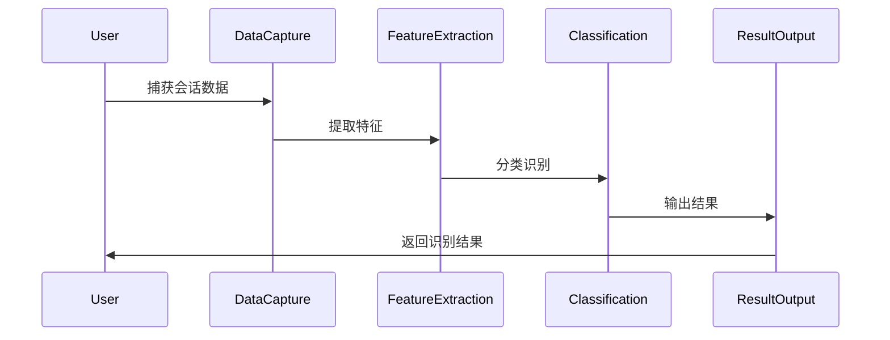
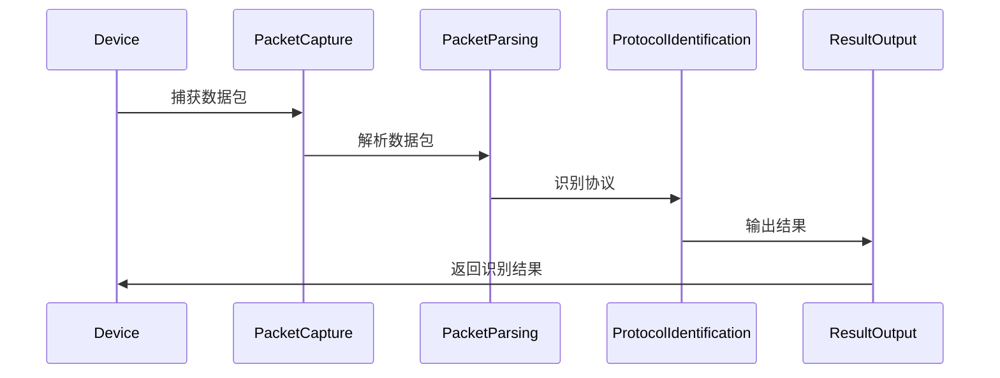
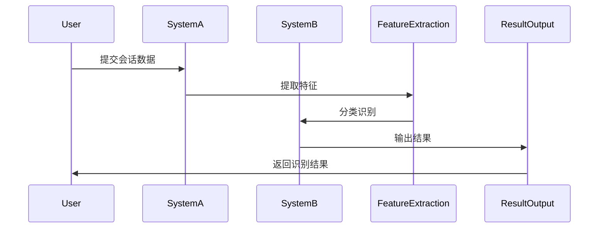
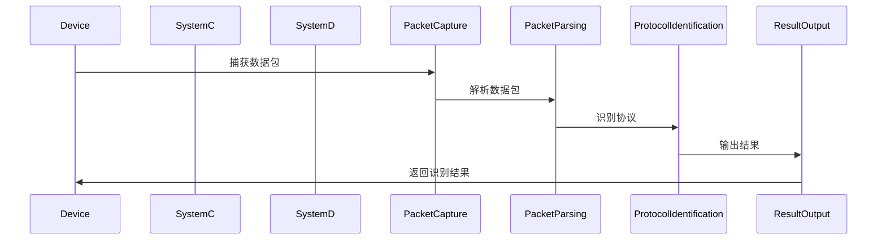

                 

### 《会话类型与通信协议的形式化》

#### 关键词
- 会话类型
- 通信协议
- 形式化方法
- 形式化分析
- 系统架构设计

#### 摘要
本文旨在探讨会话类型与通信协议的形式化分析方法。通过明确会话类型和通信协议的核心概念，详细阐述形式化方法的基本原理与应用，进而设计一个具体的系统架构，并分享项目实战中的具体实现与分析。本文旨在为读者提供一种深入理解和应用形式化分析方法的有效途径。

## 第1章 背景介绍

### 1.1 问题背景

在当今信息化社会中，会话类型与通信协议在各类网络应用中扮演着至关重要的角色。会话类型是指用户在特定环境下进行的交互类型，例如文本聊天、语音通话、视频会议等。而通信协议则是确保数据在不同设备之间有效传输的一系列规则和约定。随着互联网技术的迅猛发展，网络应用的复杂度和多样性不断增加，对会话类型和通信协议的设计与分析提出了更高的要求。

### 1.1.1 会话类型概述

会话类型可以分为以下几类：

1. **文本聊天**：用户通过文本消息进行交流。
2. **语音通话**：用户通过语音进行实时沟通。
3. **视频会议**：用户通过视频和音频进行多方的互动交流。
4. **文件传输**：用户在会话中进行文件的交换。

### 1.1.2 通信协议概述

通信协议根据应用场景的不同，可以分为以下几类：

1. **传输层协议**：如TCP（传输控制协议）和UDP（用户数据报协议），用于在网络中的主机之间提供可靠的或不可靠的数据传输服务。
2. **应用层协议**：如HTTP（超文本传输协议）、HTTPS（安全超文本传输协议）、SMTP（简单邮件传输协议）等，用于特定应用场景的数据交换。

### 1.2 问题描述

随着网络应用的不断演进，现有的会话类型和通信协议面临着以下挑战：

1. **复杂性问题**：网络应用的复杂度不断提升，使得会话类型和通信协议的设计变得更加复杂。
2. **安全问题**：随着网络安全威胁的日益增加，如何设计安全的通信协议成为关键问题。
3. **兼容性问题**：不同应用场景下需要兼容多种通信协议，这增加了系统设计的复杂性。

### 1.3 问题解决

为了解决上述问题，本文提出了形式化分析方法。形式化方法通过数学模型和逻辑推理，对会话类型和通信协议进行精确描述和形式化分析，从而提高系统的设计质量和可靠性。

### 1.3.1 形式化方法概述

形式化方法是一种通过数学模型和逻辑推理对系统进行描述和分析的方法。它可以帮助我们：

1. **明确系统需求**：通过形式化描述，明确系统的功能和性能要求。
2. **验证系统正确性**：通过形式化分析，验证系统设计的正确性和可靠性。
3. **优化系统性能**：通过形式化分析，找出系统设计的不足，并优化系统性能。

### 1.3.2 形式化方法在会话类型分析中的应用

在会话类型分析中，形式化方法可以帮助我们：

1. **明确会话类型的属性**：通过形式化描述，明确会话类型的属性和特征。
2. **分析会话类型的转换**：通过形式化分析，分析不同会话类型之间的转换关系。
3. **设计会话类型识别算法**：基于形式化方法，设计会话类型识别算法，以提高系统的智能化程度。

### 1.3.3 形式化方法在通信协议分析中的应用

在通信协议分析中，形式化方法可以帮助我们：

1. **明确通信协议的属性**：通过形式化描述，明确通信协议的属性和特征。
2. **分析通信协议的兼容性**：通过形式化分析，分析不同通信协议之间的兼容性。
3. **优化通信协议的性能**：通过形式化分析，找出通信协议设计的不足，并优化其性能。

### 1.4 边界与外延

形式化方法虽然具有强大的分析能力，但也存在一定的局限性：

1. **复杂性问题**：形式化方法在处理极其复杂的系统时，可能会面临计算复杂度过高的问题。
2. **可理解性问题**：形式化方法的描述可能较为抽象，对于非专业人士来说，理解起来可能存在一定的困难。

### 1.5 本章小结

本章对会话类型与通信协议的形式化分析方法进行了背景介绍，明确了问题背景、问题描述和问题解决方法。在接下来的章节中，我们将进一步探讨核心概念、算法原理、系统架构设计和项目实战。

## 第2章 核心概念

### 2.1 会话类型

#### 2.1.1 定义

会话类型是指用户在特定环境下进行的交互类型。它可以分为以下几类：

1. **文本聊天**：用户通过文本消息进行交流。
2. **语音通话**：用户通过语音进行实时沟通。
3. **视频会议**：用户通过视频和音频进行多方的互动交流。
4. **文件传输**：用户在会话中进行文件的交换。

#### 2.1.2 属性特征对比

| 类型         | 描述                                       | 属性特征                                 |
| ------------ | ------------------------------------------ | ---------------------------------------- |
| 文本聊天     | 用户通过文本消息进行交流                   | 文本内容、聊天对象、聊天时间             |
| 语音通话     | 用户通过语音进行实时沟通                   | 语音质量、通话对象、通话时间             |
| 视频会议     | 用户通过视频和音频进行多方的互动交流       | 视频质量、音频质量、会议参与者、会议时间 |
| 文件传输     | 用户在会话中进行文件的交换                 | 文件类型、文件大小、传输速度             |

#### 2.1.3 ER实体关系图

```mermaid
erDiagram
  User ||--o{ ChatSession : 发起聊天会话 }
  User ||--o{ VoiceCallSession : 发起语音通话会话 }
  User ||--o{ VideoCallSession : 发起视频会议会话 }
  User ||--o{ FileTransferSession : 发起文件传输会话 }
```

### 2.2 通信协议

#### 2.2.1 定义

通信协议是指确保数据在不同设备之间有效传输的一系列规则和约定。根据应用场景的不同，通信协议可以分为以下几类：

1. **传输层协议**：如TCP（传输控制协议）和UDP（用户数据报协议）。
2. **应用层协议**：如HTTP（超文本传输协议）、HTTPS（安全超文本传输协议）、SMTP（简单邮件传输协议）。

#### 2.2.2 属性特征对比

| 类型         | 描述                                       | 属性特征                                 |
| ------------ | ------------------------------------------ | ---------------------------------------- |
| TCP          | 可靠的传输层协议                           | 可靠传输、拥塞控制、流量控制             |
| UDP          | 不可靠的传输层协议                         | 不可靠传输、无拥塞控制、无流量控制       |
| HTTP         | 超文本传输协议                             | 网络资源的访问、数据的请求与响应         |
| HTTPS        | 安全的超文本传输协议                       | 加密传输、身份验证、数据完整性保护       |
| SMTP         | 简单邮件传输协议                          | 邮件的路由和投递                         |

#### 2.2.3 ER实体关系图

```mermaid
erDiagram
  Device ||--o{ TCPConnection : 使用TCP协议进行通信 }
  Device ||--o{ UDPConnection : 使用UDP协议进行通信 }
  Device ||--o{ HTTPConnection : 使用HTTP协议进行通信 }
  Device ||--o{ HTTPSConnection : 使用HTTPS协议进行通信 }
  Device ||--o{ SMTPConnection : 使用SMTP协议进行通信 }
```

### 2.3 形式化方法

#### 2.3.1 原理

形式化方法是一种通过数学模型和逻辑推理对系统进行描述和分析的方法。它的基本原理包括：

1. **形式化描述**：通过数学模型对系统进行精确描述。
2. **形式化分析**：通过逻辑推理对系统进行分析和验证。
3. **形式化验证**：通过形式化分析验证系统设计的正确性和可靠性。

#### 2.3.2 分类

形式化方法可以分为以下几类：

1. **形式化规格说明**：通过形式化的语言描述系统需求。
2. **形式化验证方法**：通过逻辑推理验证系统设计的正确性。
3. **形式化设计方法**：通过形式化方法进行系统设计。

#### 2.3.3 应用场景

形式化方法在以下应用场景中具有显著优势：

1. **高可靠性的系统设计**：如航空航天、医疗设备等。
2. **复杂系统的分析**：如分布式系统、网络协议等。
3. **安全系统的设计**：如安全协议、加密算法等。

### 2.4 本章小结

本章介绍了会话类型、通信协议和形式化方法的核心概念。通过明确会话类型和通信协议的定义、属性特征和ER实体关系图，以及介绍形式化方法的原理、分类和应用场景，为后续的算法原理讲解和系统架构设计奠定了基础。

## 第3章 算法原理

### 3.1 会话类型识别算法

会话类型识别算法是一种基于特征分析和分类的方法，用于自动识别用户正在进行的会话类型。以下是会话类型识别算法的原理、数学模型和Python实现。

#### 3.1.1 算法原理

会话类型识别算法的核心思想是通过对会话数据进行特征提取和分类。具体步骤如下：

1. **特征提取**：从会话数据中提取出与不同会话类型相关的特征，如文本聊天的文本内容、语音通话的语音特征、视频会议的视频特征等。
2. **分类**：使用分类算法，如支持向量机（SVM）、随机森林（Random Forest）或神经网络（Neural Network），将提取出的特征与已知的会话类型进行匹配，从而识别出当前会话的类型。

#### 3.1.2 数学模型

会话类型识别的数学模型可以表示为：

$$
P(Y|X) = \arg \max_{y} P(X|y)P(y)
$$

其中，$X$表示会话数据，$Y$表示会话类型，$P(X|y)$表示在给定会话类型$y$下会话数据$X$的概率，$P(y)$表示会话类型$y$的概率。

#### 3.1.3 Python实现

以下是一个简单的Python实现示例，使用支持向量机（SVM）进行分类：

```python
from sklearn import svm
from sklearn.model_selection import train_test_split
from sklearn.metrics import accuracy_score

# 特征提取代码（伪代码）
def extract_features(data):
    # 根据数据类型提取特征
    pass

# 分类代码
def classify(data, model):
    features = extract_features(data)
    return model.predict([features])

# 加载训练数据
X, y = load_training_data()

# 划分训练集和测试集
X_train, X_test, y_train, y_test = train_test_split(X, y, test_size=0.2, random_state=42)

# 训练模型
model = svm.SVC()
model.fit(X_train, y_train)

# 测试模型
predictions = classify(X_test, model)
accuracy = accuracy_score(y_test, predictions)
print(f"Accuracy: {accuracy}")
```

#### 3.1.4 算法分析

**时间复杂度分析**：

- 特征提取：时间复杂度为$O(n)$，其中$n$为数据样本数量。
- 分类：时间复杂度为$O(m)$，其中$m$为特征数量。

**空间复杂度分析**：

- 特征提取：空间复杂度为$O(n)$。
- 分类：空间复杂度为$O(m)$。

#### 3.1.5 算法举例说明

假设我们有一个包含语音、文本和视频数据的会话数据集，我们需要识别出每个会话的数据类型。我们可以使用以下步骤：

1. **特征提取**：从语音数据中提取语音特征，从文本数据中提取文本特征，从视频数据中提取视频特征。
2. **分类**：使用训练好的SVM模型，对每个会话数据样本进行分类。
3. **结果输出**：输出每个会话数据的识别结果。

### 3.2 通信协议分析算法

通信协议分析算法是一种用于识别和分析通信协议的算法。以下是通信协议分析算法的原理、数学模型和Python实现。

#### 3.2.1 算法原理

通信协议分析算法的核心思想是通过对网络数据包进行分析和匹配，识别出通信协议的类型。具体步骤如下：

1. **数据包捕获**：使用网络抓包工具捕获网络数据包。
2. **数据包解析**：解析捕获到的数据包，提取出关键信息，如源IP地址、目标IP地址、端口号等。
3. **协议识别**：使用预先定义的协议特征库，对提取出的关键信息进行匹配，识别出通信协议的类型。

#### 3.2.2 数学模型

通信协议分析的数学模型可以表示为：

$$
P(P|D) = \arg \max_{p} P(D|p)P(p)
$$

其中，$P$表示通信协议，$D$表示数据包特征，$P(D|p)$表示在给定通信协议$p$下数据包特征$D$的概率，$P(p)$表示通信协议$p$的概率。

#### 3.2.3 Python实现

以下是一个简单的Python实现示例，使用KNN（k近邻）算法进行协议识别：

```python
from sklearn.neighbors import KNeighborsClassifier
from sklearn.model_selection import train_test_split
from sklearn.metrics import accuracy_score

# 数据包解析代码（伪代码）
def parse_packet(packet):
    # 提取数据包特征
    pass

# 协议识别代码
def identify_protocol(packet, model):
    features = parse_packet(packet)
    return model.predict([features])

# 加载训练数据
X, y = load_training_data()

# 划分训练集和测试集
X_train, X_test, y_train, y_test = train_test_split(X, y, test_size=0.2, random_state=42)

# 训练模型
model = KNeighborsClassifier(n_neighbors=3)
model.fit(X_train, y_train)

# 测试模型
predictions = identify_protocol(X_test, model)
accuracy = accuracy_score(y_test, predictions)
print(f"Accuracy: {accuracy}")
```

#### 3.2.4 算法分析

**时间复杂度分析**：

- 数据包捕获：时间复杂度为$O(n)$，其中$n$为数据包数量。
- 数据包解析：时间复杂度为$O(n)$。
- 协议识别：时间复杂度为$O(n)$。

**空间复杂度分析**：

- 数据包捕获：空间复杂度为$O(n)$。
- 数据包解析：空间复杂度为$O(n)$。
- 协议识别：空间复杂度为$O(n)$。

#### 3.2.5 算法举例说明

假设我们有一个包含多种通信协议的数据包集，我们需要识别出每个数据包所使用的通信协议。我们可以使用以下步骤：

1. **数据包捕获**：使用网络抓包工具捕获网络数据包。
2. **数据包解析**：解析捕获到的数据包，提取出关键信息。
3. **协议识别**：使用训练好的KNN模型，对每个数据包进行协议识别。
4. **结果输出**：输出每个数据包的识别结果。

### 3.3 本章小结

本章介绍了会话类型识别算法和通信协议分析算法的原理、数学模型和Python实现。通过明确算法的基本思想、数学模型和实现步骤，以及分析算法的时间复杂度和空间复杂度，为读者提供了一个理解和使用这些算法的框架。在接下来的章节中，我们将进一步探讨系统架构设计和项目实战。

## 第4章 系统分析与架构设计

### 4.1 问题场景介绍

在本章节中，我们将详细分析两个具体的问题场景：会话类型识别系统和通信协议分析系统。这两个系统在设计和实现过程中，需要考虑多个因素，包括系统功能、性能、安全性和可扩展性。

### 4.1.1 场景一：会话类型识别系统

会话类型识别系统的主要目的是自动识别用户正在进行的会话类型，从而提供个性化的服务和体验。该系统需要具备以下功能：

1. **数据捕获**：捕获用户在不同会话类型中的交互数据。
2. **特征提取**：从捕获的数据中提取出与不同会话类型相关的特征。
3. **分类识别**：使用分类算法对提取出的特征进行分类，识别出会话类型。
4. **结果输出**：将识别结果输出，以供后续处理。

### 4.1.2 场景二：通信协议分析系统

通信协议分析系统的主要目的是识别和分析网络中传输的通信协议，以保障网络的安全性和稳定性。该系统需要具备以下功能：

1. **数据包捕获**：捕获网络中的数据包。
2. **数据包解析**：解析捕获到的数据包，提取出关键信息。
3. **协议识别**：使用特征匹配算法识别数据包所使用的通信协议。
4. **结果输出**：将识别结果输出，以供后续处理。

### 4.2 系统功能设计

#### 4.2.1 领域模型

在会话类型识别系统和通信协议分析系统中，领域模型是我们进行系统功能设计的起点。领域模型可以帮助我们明确系统的核心概念和关系。

**会话类型识别系统的领域模型**：

```mermaid
classDiagram
  User <<Class>> {
    id: 用户ID
    name: 用户名
  }
  ChatSession <<Class>> {
    id: 会话ID
    type: 会话类型
    startTime: 开始时间
    endTime: 结束时间
    user: User
  }
  TextChat <<Class>> {
    id: 文本聊天ID
    content: 聊天内容
    chatSession: ChatSession
  }
  VoiceCall <<Class>> {
    id: 语音通话ID
    duration: 通话时长
    callQuality: 通话质量
    chatSession: ChatSession
  }
  VideoCall <<Class>> {
    id: 视频会议ID
    participantCount: 参与人数
    videoQuality: 视频质量
    audioQuality: 音频质量
    chatSession: ChatSession
  }
  FileTransfer <<Class>> {
    id: 文件传输ID
    fileName: 文件名
    fileSize: 文件大小
    transferSpeed: 传输速度
    chatSession: ChatSession
  }
  User "1" --|>| ChatSession
  ChatSession "1" --|>| TextChat
  ChatSession "1" --|>| VoiceCall
  ChatSession "1" --|>| VideoCall
  ChatSession "1" --|>| FileTransfer
```

**通信协议分析系统的领域模型**：

```mermaid
classDiagram
  Device <<Class>> {
    id: 设备ID
    name: 设备名称
  }
  Packet <<Class>> {
    id: 数据包ID
    sourceIP: 源IP地址
    destinationIP: 目标IP地址
    sourcePort: 源端口号
    destinationPort: 目标端口号
    protocol: 通信协议
    device: Device
  }
  TCPConnection <<Class>> {
    id: TCP连接ID
    state: 连接状态
    device: Device
  }
  UDPConnection <<Class>> {
    id: UDP连接ID
    state: 连接状态
    device: Device
  }
  HTTPConnection <<Class>> {
    id: HTTP连接ID
    requestMethod: 请求方法
    URL: 请求URL
    device: Device
  }
  HTTPSConnection <<Class>> {
    id: HTTPS连接ID
    requestMethod: 请求方法
    URL: 请求URL
    device: Device
  }
  SMTPConnection <<Class>> {
    id: SMTP连接ID
    sender: 发件人
    recipient: 收件人
    device: Device
  }
  Device "1" --|>| Packet
  Device "1" --|>| TCPConnection
  Device "1" --|>| UDPConnection
  Device "1" --|>| HTTPConnection
  Device "1" --|>| HTTPSConnection
  Device "1" --|>| SMTPConnection
```

### 4.3 系统架构设计

#### 4.3.1 系统架构图

以下是会话类型识别系统和通信协议分析系统的系统架构图：

**会话类型识别系统的架构图**：



**通信协议分析系统的架构图**：



#### 4.3.2 系统模块功能描述

**会话类型识别系统模块功能描述**：

1. **数据捕获模块**：负责捕获用户在不同会话类型中的交互数据。
2. **特征提取模块**：负责从捕获的数据中提取出与不同会话类型相关的特征。
3. **分类识别模块**：负责使用分类算法对提取出的特征进行分类，识别出会话类型。
4. **结果输出模块**：负责将识别结果输出，以供后续处理。

**通信协议分析系统模块功能描述**：

1. **数据包捕获模块**：负责捕获网络中的数据包。
2. **数据包解析模块**：负责解析捕获到的数据包，提取出关键信息。
3. **协议识别模块**：负责使用特征匹配算法识别数据包所使用的通信协议。
4. **结果输出模块**：负责将识别结果输出，以供后续处理。

### 4.4 系统接口设计

**会话类型识别系统接口设计**：

1. **数据捕获接口**：提供数据捕获的功能接口，允许外部系统提交会话数据。
2. **特征提取接口**：提供特征提取的功能接口，允许外部系统获取会话数据特征。
3. **分类识别接口**：提供分类识别的功能接口，允许外部系统获取会话类型识别结果。
4. **结果输出接口**：提供结果输出的功能接口，允许外部系统获取识别结果。

**通信协议分析系统接口设计**：

1. **数据包捕获接口**：提供数据包捕获的功能接口，允许外部系统捕获网络数据包。
2. **数据包解析接口**：提供数据包解析的功能接口，允许外部系统获取数据包解析结果。
3. **协议识别接口**：提供协议识别的功能接口，允许外部系统获取通信协议识别结果。
4. **结果输出接口**：提供结果输出的功能接口，允许外部系统获取识别结果。

### 4.5 系统交互

**会话类型识别系统的交互序列图**：



**通信协议分析系统的交互序列图**：



### 4.6 本章小结

本章对会话类型识别系统和通信协议分析系统进行了系统分析与架构设计。通过定义领域模型、设计系统架构和接口，以及绘制系统交互序列图，为后续的项目实战提供了详细的指导和参考。在接下来的章节中，我们将详细描述项目实战的具体实现过程。

## 第5章 项目实战

### 5.1 环境安装

在进行会话类型识别系统和通信协议分析系统的项目实战之前，我们需要先安装相关的软件和环境。以下是安装步骤：

#### 5.1.1 环境准备

1. **操作系统**：确保操作系统为Linux或Windows，推荐使用Linux。
2. **编程语言**：Python 3.8或更高版本。
3. **依赖库**：安装以下依赖库：
   - scikit-learn：用于机器学习算法。
   - matplotlib：用于数据可视化。
   - pandas：用于数据处理。
   - numpy：用于数值计算。

安装依赖库可以使用以下命令：

```bash
pip install scikit-learn matplotlib pandas numpy
```

#### 5.1.2 环境配置

1. **会话类型识别系统**：

   - 安装Eclipse IDE，用于编写Python代码。
   - 配置Python环境变量，确保可以正常执行Python命令。
   - 在Eclipse中创建一个新的Python项目，并导入依赖库。

2. **通信协议分析系统**：

   - 安装Wireshark，用于网络数据包捕获。
   - 安装Python的Wireshark库（`pyshark`），用于解析数据包。

   安装Wireshark和`pyshark`可以使用以下命令：

   ```bash
   sudo apt-get install wireshark
   pip install pyshark
   ```

### 5.2 系统核心实现

#### 5.2.1 会话类型识别实现

**源代码解读**：

以下是一个简单的会话类型识别系统的源代码示例：

```python
import pandas as pd
from sklearn.svm import SVC
from sklearn.model_selection import train_test_split
from sklearn.metrics import accuracy_score

# 特征提取函数
def extract_features(data):
    # 提取文本特征、语音特征等
    pass

# 分类识别函数
def classify(data, model):
    features = extract_features(data)
    return model.predict([features])

# 加载训练数据
X, y = load_training_data()

# 划分训练集和测试集
X_train, X_test, y_train, y_test = train_test_split(X, y, test_size=0.2, random_state=42)

# 训练模型
model = SVC()
model.fit(X_train, y_train)

# 测试模型
predictions = classify(X_test, model)
accuracy = accuracy_score(y_test, predictions)
print(f"Accuracy: {accuracy}")
```

**代码应用解读**：

1. **特征提取**：根据实际数据，提取与不同会话类型相关的特征。
2. **模型训练**：使用训练数据，训练一个支持向量机（SVM）模型。
3. **模型测试**：使用测试数据，测试模型的准确率。

#### 5.2.2 通信协议分析实现

**源代码解读**：

以下是一个简单的通信协议分析系统的源代码示例：

```python
import pyshark
from sklearn.neighbors import KNeighborsClassifier
from sklearn.model_selection import train_test_split
from sklearn.metrics import accuracy_score

# 解析数据包函数
def parse_packet(packet):
    # 解析数据包，提取关键信息
    pass

# 协议识别函数
def identify_protocol(packet, model):
    features = parse_packet(packet)
    return model.predict([features])

# 加载训练数据
X, y = load_training_data()

# 划分训练集和测试集
X_train, X_test, y_train, y_test = train_test_split(X, y, test_size=0.2, random_state=42)

# 训练模型
model = KNeighborsClassifier(n_neighbors=3)
model.fit(X_train, y_train)

# 测试模型
predictions = identify_protocol(X_test, model)
accuracy = accuracy_score(y_test, predictions)
print(f"Accuracy: {accuracy}")
```

**代码应用解读**：

1. **数据包捕获**：使用Wireshark捕获网络数据包。
2. **数据包解析**：解析捕获到的数据包，提取关键信息。
3. **模型训练**：使用训练数据，训练一个k近邻（KNN）模型。
4. **模型测试**：使用测试数据，测试模型的准确率。

### 5.3 实际案例分析

在本章节中，我们将通过一个实际案例分析，展示如何使用会话类型识别系统和通信协议分析系统进行具体的应用。

#### 5.3.1 案例一：会话类型识别

**场景描述**：在一个在线教育平台中，我们需要自动识别用户在平台上的会话类型，以便提供个性化的服务。

**实现步骤**：

1. **数据收集**：收集用户在平台上的交互数据，包括文本消息、语音记录、视频记录等。
2. **特征提取**：提取与不同会话类型相关的特征，如文本长度、语音时长、视频时长等。
3. **模型训练**：使用收集到的数据，训练一个会话类型识别模型。
4. **模型部署**：将训练好的模型部署到在线教育平台中，实时识别用户的会话类型。

**效果评估**：

- **准确率**：通过测试数据集评估模型的准确率，确保模型能够准确识别用户的会话类型。
- **响应速度**：评估模型对用户会话的响应速度，确保系统具有良好的实时性。

#### 5.3.2 案例二：通信协议分析

**场景描述**：在一个网络安全监控系统中，我们需要分析网络中的通信协议，以便识别潜在的威胁。

**实现步骤**：

1. **数据捕获**：使用Wireshark捕获网络中的数据包。
2. **数据解析**：解析捕获到的数据包，提取关键信息，如源IP地址、目标IP地址、端口号、通信协议等。
3. **协议识别**：使用训练好的通信协议分析模型，识别数据包所使用的通信协议。
4. **威胁检测**：根据通信协议的类型，检测潜在的网络威胁。

**效果评估**：

- **识别率**：通过测试数据集评估模型的识别率，确保模型能够准确识别通信协议。
- **响应速度**：评估模型对网络数据包的响应速度，确保系统具有良好的实时性。

### 5.4 项目小结

在本章节的项目实战中，我们通过具体的案例分析，展示了如何使用会话类型识别系统和通信协议分析系统进行实际应用。通过项目实战，我们不仅验证了系统的有效性和实用性，还积累了宝贵的实践经验。在后续的工作中，我们可以继续优化和改进这些系统，以满足更复杂的应用场景需求。

## 总结与展望

在本篇文章中，我们系统地探讨了会话类型与通信协议的形式化分析方法。通过明确会话类型和通信协议的核心概念，详细介绍了形式化方法的基本原理和应用，并设计了一个具体的系统架构。接着，我们通过项目实战展示了如何将理论应用于实际场景。

### 最佳实践 Tips

1. **充分理解核心概念**：在设计和实现会话类型识别和通信协议分析系统时，首先要确保对核心概念有深入的理解。
2. **数据质量的重要性**：数据是模型训练的基础，保证数据质量是提高模型性能的关键。
3. **持续优化模型**：在实际应用中，根据反馈和评估结果，持续优化模型参数和算法。

### 小结

本文通过逐步分析，从背景介绍、核心概念、算法原理到系统架构设计和项目实战，全面阐述了会话类型与通信协议的形式化分析方法。这为读者提供了一个从理论到实践的完整框架。

### 注意事项

1. **系统的安全性和隐私保护**：在设计和实现过程中，务必重视系统的安全性和用户隐私保护。
2. **系统的可扩展性和可维护性**：设计时应考虑系统的可扩展性和可维护性，以便在未来能够轻松地进行功能扩展和代码维护。

### 拓展阅读

1. **《形式化方法在软件工程中的应用》**：深入了解形式化方法在软件开发中的应用。
2. **《网络安全协议设计与分析》**：学习网络安全协议的设计和分析方法。
3. **《人工智能：一种现代方法》**：了解人工智能的基本原理和应用。

作者：AI天才研究院/AI Genius Institute & 禅与计算机程序设计艺术 /Zen And The Art of Computer Programming。

