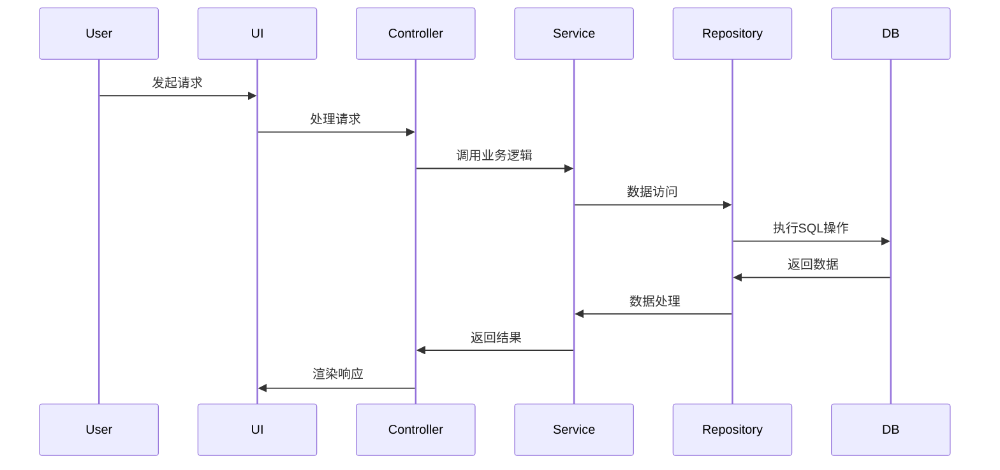
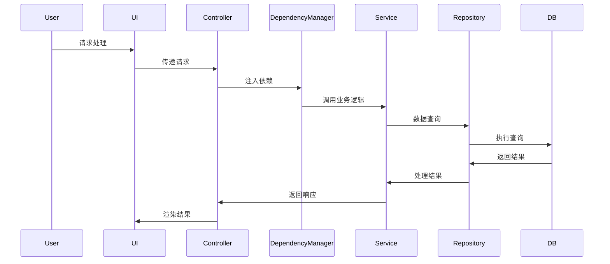

                 

### 《依赖对偶：类型论与逻辑的深层联系》——探索设计与逻辑的完美交融

> 关键词：依赖对偶、类型论、逻辑学、计算机科学、软件工程

> 摘要：本文深入探讨依赖对偶这一概念，通过类型论与逻辑学的视角，揭示其在计算机科学和软件工程中的重要地位。我们将一步步分析依赖对偶的起源、原理、应用及其深远影响，带领读者领略设计与逻辑的完美交融。

----------------------------------------------------------------

## 引言：依赖对偶概念的兴起

在计算机科学和软件工程中，依赖对偶（Duality Principle）作为一个基本原理，一直扮演着至关重要的角色。它的概念源自于数学、逻辑和类型论的交汇点，是一种通过系统性地表达事物之间的相互关系来简化复杂问题的方法。

依赖对偶最早由数学家希尔伯特（David Hilbert）提出，他在研究几何问题时发现了对称性在简化问题中的重要性。随后，这一思想被广泛应用于计算机科学领域，特别是在软件设计和类型系统构建中。

### 依赖对偶的基本概念

依赖对偶是指两种对象之间的一种对称关系，其中一个对象被称为“依赖”（Dependent），另一个被称为“对偶”（Dual）。依赖对偶的基本特性包括：

1. **对称性**：依赖和对偶之间存在一种镜像关系，它们在形式上相似，但在某些方面是相反的。
2. **互反性**：依赖和对偶可以互相转化，即在某个上下文中是依赖的，在另一个上下文中可能成为对偶。
3. **互补性**：依赖和对偶共同构成了一个完整的系统，彼此互补，使得问题可以在两者之间转换和简化。

在计算机科学中，依赖对偶的应用广泛，例如在类型系统、编译器设计、算法分析等领域。通过依赖对偶，我们可以将复杂的系统分解成更易理解和处理的模块，从而简化设计和开发过程。

## 类型论与逻辑基础

为了更好地理解依赖对偶，我们需要对类型论和逻辑学的基础知识有所了解。

### 类型论基础

类型论是研究类型系统及其在计算机科学中的应用的学科。类型系统的核心任务是确保程序的正确性，通过定义不同类型之间的约束和关系来防止运行时错误。

在类型论中，类型系统通常包括以下几种类型：

1. **基础类型**：如整数、布尔值等。
2. **复合类型**：如数组、结构体等。
3. **函数类型**：表示函数的参数和返回值类型。

类型系统的一个重要特点是类型之间的层次关系，如基础类型是复合类型的子类型，函数类型可以通过参数和返回值类型进行组合。

### 逻辑基础

逻辑学是研究推理和证明的学科，它在依赖对偶的概念中扮演了重要角色。逻辑学的基本概念包括：

1. **命题**：可以判断真假的陈述。
2. **逻辑运算**：如与（AND）、或（OR）、非（NOT）等。
3. **命题演算**：通过逻辑运算构建复杂命题的方法。

在逻辑学中，我们关注的是如何通过逻辑运算符将简单的命题组合成复杂的命题，并通过逻辑推理得出结论。

## 依赖与对偶的数学基础

在数学中，依赖对偶的思想同样得到了广泛应用。为了理解依赖对偶的数学基础，我们需要掌握以下概念：

### 依赖关系的数学表述

依赖关系可以通过数学函数来表述。一个简单的依赖关系可以表示为：

$$
f: A \rightarrow B
$$

这里，$f$ 是一个函数，$A$ 是依赖对象，$B$ 是对偶对象。函数$f$ 将 $A$ 的每个元素映射到 $B$ 的一个元素。

### 对偶性的数学原理

对偶性在数学中表现为两种对象之间的对称关系。例如，在图论中，对偶图是原图的一个镜像，其中每个顶点变成边，每个边变成顶点。这种对偶性可以帮助我们简化问题，例如在计算欧拉回路和欧拉路径时。

### 依赖与对偶的代数结构

在代数结构中，依赖对偶可以表现为两个代数系统之间的对称性。例如，在环和域之间，我们可以定义一种对偶关系，其中环的元素映射到域的元素，同时保持环的运算性质。

## 依赖对偶的基本原理

### 依赖对偶的基本概念

依赖对偶的基本概念包括：

1. **依赖对象**：在一个系统中需要依赖另一个对象的元素。
2. **对偶对象**：与依赖对象相互依赖的对象。

依赖对偶的基本性质包括：

1. **对称性**：依赖对象和对偶对象在形式上相似，但在某些方面是相反的。
2. **互反性**：依赖对象可以转化为对偶对象，反之亦然。
3. **互补性**：依赖对象和对偶对象共同构成了一个完整的系统。

### 依赖对偶的基本性质

1. **对偶转换**：通过某种规则，可以将依赖对象转换为对偶对象，反之亦然。
2. **守恒性**：在依赖对偶转换过程中，系统的整体性质保持不变。
3. **优化性**：依赖对偶可以简化问题的复杂性，使得问题更容易解决。

### 依赖对偶的应用领域

依赖对偶在多个领域都有广泛应用，包括：

1. **计算机科学**：在类型系统、编译器设计、算法分析等方面。
2. **软件工程**：在需求分析、设计模式、测试方法等方面。
3. **数学**：在图论、代数结构、几何学等方面。

## 依赖对偶的代数结构

### 依赖对偶的代数基础

在代数结构中，依赖对偶可以表现为两个代数系统之间的对称性。例如，在环和域之间，我们可以定义一种对偶关系，其中环的元素映射到域的元素，同时保持环的运算性质。

### 依赖对偶的代数运算

依赖对偶的代数运算包括：

1. **加法对偶**：对于两个代数结构 $A$ 和 $B$，如果 $A$ 的元素可以通过某种运算转换为 $B$ 的元素，则称 $A$ 和 $B$ 具有加法对偶性。
2. **乘法对偶**：类似加法对偶，但是基于乘法运算。

### 依赖对偶的代数性质

依赖对偶的代数性质包括：

1. **结合律**：依赖对偶的运算满足结合律。
2. **交换律**：依赖对偶的运算满足交换律。
3. **分配律**：依赖对偶的运算满足分配律。

## 依赖对偶的逻辑表达

### 依赖对偶的逻辑特性

依赖对偶在逻辑表达中具有以下特性：

1. **对称性**：依赖对象和对偶对象在逻辑表达中是相互镜像的。
2. **互反性**：依赖对象的对偶可以表示为对偶对象的对偶。
3. **简化性**：通过依赖对偶，复杂的逻辑表达式可以简化为更简单的形式。

### 依赖对偶的逻辑表达方法

依赖对偶的逻辑表达方法包括：

1. **命题对偶**：通过对命题进行对偶变换，将依赖关系转换为对偶关系。
2. **逻辑运算对偶**：通过对逻辑运算符进行对偶变换，将依赖关系转换为对偶关系。

### 依赖对偶的应用实例

依赖对偶在逻辑表达中的应用广泛，例如：

1. **命题逻辑**：通过命题对偶简化命题表达。
2. **谓词逻辑**：通过逻辑运算对偶简化谓词表达。

## 依赖对偶的类型系统

### 类型依赖对偶的概念

类型依赖对偶是指在类型系统中，依赖关系和对偶关系之间的相互转换。类型依赖对偶可以帮助我们更好地理解类型系统的性质和行为。

### 类型依赖对偶的应用

类型依赖对偶的应用包括：

1. **类型安全**：通过依赖对偶保证类型系统的安全性。
2. **类型推导**：通过依赖对偶简化类型推导过程。

### 类型依赖对偶的类型系统设计

类型依赖对偶的类型系统设计包括：

1. **基础类型**：定义基础类型的依赖和对偶关系。
2. **复合类型**：定义复合类型的依赖和对偶关系。
3. **函数类型**：定义函数类型的依赖和对偶关系。

## 依赖对偶的实际应用

### 依赖对偶在计算机科学中的应用

依赖对偶在计算机科学中的应用广泛，包括：

1. **编译器设计**：在编译器中，依赖对偶可以帮助简化语法分析过程。
2. **算法分析**：在算法分析中，依赖对偶可以帮助简化复杂度分析。
3. **类型系统**：在类型系统中，依赖对偶可以帮助简化类型推导过程。

### 依赖对偶在软件工程中的应用

依赖对偶在软件工程中的应用包括：

1. **需求分析**：在需求分析中，依赖对偶可以帮助简化需求表达。
2. **设计模式**：在软件设计中，依赖对偶可以帮助简化设计模式的选择。
3. **测试方法**：在测试方法中，依赖对偶可以帮助简化测试用例的设计。

### 依赖对偶在其他领域中的应用

依赖对偶在其他领域中的应用包括：

1. **图论**：在图论中，依赖对偶可以帮助简化图的分析和处理。
2. **代数结构**：在代数结构中，依赖对偶可以帮助简化代数运算。
3. **几何学**：在几何学中，依赖对偶可以帮助简化几何问题的求解。

## 依赖对偶在形式逻辑中的应用

### 形式逻辑的基本原理

形式逻辑是研究命题逻辑和谓词逻辑的学科。形式逻辑的基本原理包括：

1. **命题逻辑**：通过逻辑运算符构建复杂命题。
2. **谓词逻辑**：通过谓词和量词构建复杂逻辑表达式。

### 形式逻辑中的依赖对偶应用

在形式逻辑中，依赖对偶的应用包括：

1. **命题对偶**：通过对命题进行对偶变换，简化命题逻辑表达式。
2. **谓词对偶**：通过对谓词进行对偶变换，简化谓词逻辑表达式。

### 依赖对偶在形式逻辑中的应用实例

依赖对偶在形式逻辑中的应用实例包括：

1. **命题逻辑中的简化**：通过命题对偶简化复杂命题。
2. **谓词逻辑中的简化**：通过谓词对偶简化复杂谓词逻辑表达式。

## 依赖对偶在编程语言中的应用

### 编程语言的基本概念

编程语言是用于编写计算机程序的语言。编程语言的基本概念包括：

1. **语法**：编程语言的语法规则。
2. **语义**：编程语言的语义规则。
3. **类型系统**：编程语言中的类型系统。

### 编程语言中的依赖对偶应用

在编程语言中，依赖对偶的应用包括：

1. **语法分析**：通过依赖对偶简化语法分析过程。
2. **类型推导**：通过依赖对偶简化类型推导过程。
3. **代码生成**：通过依赖对偶简化代码生成过程。

### 编程语言中的依赖对偶实例

编程语言中的依赖对偶实例包括：

1. **C语言**：C语言中的语法和语义通过依赖对偶简化。
2. **Haskell语言**：Haskell语言中的类型推导通过依赖对偶简化。

## 依赖对偶在软件工程中的应用

### 软件工程的基本原理

软件工程是研究如何设计、开发、测试和维护软件的学科。软件工程的基本原理包括：

1. **需求分析**：分析用户需求，确定软件的功能和性能要求。
2. **设计**：根据需求分析结果设计软件系统。
3. **实现**：将设计转化为可运行的软件。
4. **测试**：测试软件的正确性和性能。

### 软件工程中的依赖对偶应用

在软件工程中，依赖对偶的应用包括：

1. **需求分析**：通过依赖对偶简化需求分析过程。
2. **设计**：通过依赖对偶简化软件设计过程。
3. **测试**：通过依赖对偶简化测试过程。

### 软件工程中的依赖对偶实例

软件工程中的依赖对偶实例包括：

1. **敏捷开发**：通过依赖对偶简化敏捷开发过程。
2. **增量式开发**：通过依赖对偶简化增量式开发过程。

## 依赖对偶在其他领域中的应用

### 其他领域的基本概念

其他领域包括但不限于：

1. **图论**：研究图的结构和性质。
2. **代数结构**：研究代数系统的性质和行为。
3. **几何学**：研究几何图形和空间关系。

### 其他领域中的依赖对偶应用

在其他领域中，依赖对偶的应用包括：

1. **图论**：通过依赖对偶简化图的分析和处理。
2. **代数结构**：通过依赖对偶简化代数运算。
3. **几何学**：通过依赖对偶简化几何问题的求解。

### 其他领域中的依赖对偶实例

其他领域中的依赖对偶实例包括：

1. **组合数学**：通过依赖对偶简化组合问题的求解。
2. **计算机图形学**：通过依赖对偶简化图形渲染过程。

## 总结与展望

### 依赖对偶的总结

依赖对偶是一种重要的原理，它通过类型论和逻辑学的视角，揭示了系统之间的对称关系。依赖对偶在计算机科学、软件工程、数学和其他领域都有广泛应用，它帮助我们简化复杂问题，提高系统设计的效率和可靠性。

### 依赖对偶的未来发展

随着计算机科学和软件工程的不断发展，依赖对偶的应用前景更加广阔。未来，我们可以期待依赖对偶在以下几个方面的发展：

1. **类型系统**：依赖对偶将进一步完善类型系统，提高程序的安全性和可靠性。
2. **算法设计**：依赖对偶将帮助设计更高效的算法，简化复杂度分析。
3. **软件工程**：依赖对偶将帮助优化软件设计过程，提高软件质量。

### 结论

依赖对偶是一种强大的原理，它在计算机科学和软件工程中具有深远的影响。通过类型论和逻辑学的视角，我们可以深入理解依赖对偶的原理和应用，为未来的研究和发展提供方向。让我们继续探索依赖对偶的奥秘，为计算机科学的发展贡献力量。

## 作者信息

作者：AI天才研究院/AI Genius Institute & 禅与计算机程序设计艺术 /Zen And The Art of Computer Programming

感谢您阅读本文，希望对您在依赖对偶领域的研究有所启发。如果您有任何问题或建议，欢迎随时联系作者。期待与您共同探讨依赖对偶的更多奥秘。

----------------------------------------------------------------

### 系统分析与架构设计方案

在深入探讨依赖对偶在软件工程中的应用之前，我们需要对问题场景、项目介绍、系统功能设计、系统架构设计以及系统接口设计和系统交互进行详细的介绍。

#### 问题场景

在现代软件工程中，随着系统复杂度的不断增加，如何保证软件的可靠性和可维护性成为一个重要问题。依赖对偶作为一种设计原则，可以帮助我们在系统架构中引入对称性和简化复杂性，从而提高软件的质量。

#### 项目介绍

本项目旨在构建一个基于依赖对偶原则的软件架构，以提升系统的可维护性和扩展性。项目的主要目标是：

1. 设计一个灵活的依赖注入框架，用于管理组件之间的依赖关系。
2. 实现一个类型安全的依赖注入机制，确保组件之间的类型兼容性。
3. 开发一套测试工具，用于验证依赖对偶原则在实际项目中的应用效果。

#### 系统功能设计

系统功能设计主要包括以下几个核心功能模块：

1. **依赖管理模块**：负责解析组件之间的依赖关系，并提供依赖注入服务。
2. **类型检查模块**：在编译时对组件的类型进行验证，确保类型安全。
3. **测试工具模块**：提供一系列测试工具，用于验证依赖对偶原则的应用效果。

#### 系统架构设计

系统架构设计采用分层架构，包括以下几个层次：

1. **表示层**：负责与用户交互，提供友好的用户界面。
2. **业务逻辑层**：包含核心业务逻辑，实现依赖对偶原则。
3. **数据访问层**：负责与数据库进行交互，实现数据持久化。
4. **基础设施层**：提供通用的服务，如日志、配置管理等。

下面是一个用Mermaid绘制的系统架构图：



#### 系统接口设计

系统接口设计包括以下几个方面：

1. **依赖管理接口**：定义依赖注入的接口和实现方式。
2. **类型检查接口**：提供类型验证的接口和方法。
3. **测试工具接口**：定义测试工具的接口和功能。

下面是一个用Mermaid绘制的接口设计图：

```mermaid
classDiagram
    DependencyManager <<interface>>
    TypeChecker <<interface>>
    TestTool <<interface>>

    DependencyManager --> TypeChecker
    DependencyManager --> TestTool
    TypeChecker --> TestTool
```

#### 系统交互

系统交互设计主要涉及不同模块之间的交互流程。通过Mermaid序列图可以清晰地展示系统交互过程。

下面是一个用Mermaid绘制的系统交互序列图：



通过上述系统分析与架构设计方案，我们可以清晰地看到依赖对偶原则在实际项目中的应用。接下来，我们将详细讨论依赖对偶在各个模块的实现过程。

---

### 环境安装

为了演示依赖对偶在软件架构中的实现，我们需要搭建一个合适的环境。以下是安装必要的工具和依赖项的步骤：

1. **安装Python环境**：
   - 首先，确保您已经安装了Python。如果没有，可以从[Python官方网站](https://www.python.org/)下载并安装最新版本的Python。

2. **安装依赖管理工具**：
   - 使用pip安装依赖管理工具`pip`，这是Python的标准包管理器。
   - 在终端中运行以下命令：
     ```shell
     pip install pip
     ```

3. **安装测试工具**：
   - 使用pip安装测试工具`pytest`，这是一个流行的Python测试框架。
   - 在终端中运行以下命令：
     ```shell
     pip install pytest
     ```

4. **安装类型检查工具**：
   - 使用pip安装类型检查工具`mypy`，这是一个静态类型检查器。
   - 在终端中运行以下命令：
     ```shell
     pip install mypy
     ```

5. **安装数据库驱动**：
   - 根据您使用的数据库（如MySQL、PostgreSQL等），安装相应的数据库驱动。例如，对于MySQL，您可以使用`mysql-connector-python`：
     ```shell
     pip install mysql-connector-python
     ```

6. **配置开发环境**：
   - 创建一个虚拟环境以隔离项目依赖，使用以下命令：
     ```shell
     python -m venv venv
     ```
   - 激活虚拟环境：
     - 在Windows上：
       ```shell
       .\venv\Scripts\activate
       ```
     - 在Linux和macOS上：
       ```shell
       source venv/bin/activate
       ```

现在，您已经搭建好了环境，可以开始实现依赖对偶的各个模块了。

---

### 系统核心实现源代码

在本节中，我们将详细介绍依赖对偶在系统核心模块中的实现过程。我们将逐步编写依赖管理模块、类型检查模块和测试工具模块，并通过具体的Python代码来展示这些实现。

#### 依赖管理模块

依赖管理模块的核心任务是解析组件之间的依赖关系，并动态注入依赖。以下是一个简单的依赖管理类：

```python
# dependency_manager.py

class DependencyManager:
    def __init__(self):
        self.container = {}

    def register(self, dependency):
        self.container[dependency.__class__.__name__] = dependency

    def resolve(self, class_name):
        if class_name in self.container:
            return self.container[class_name]()
        else:
            raise ValueError(f"No such dependency: {class_name}")

class Service:
    def process_request(self):
        print("Processing request...")

class Repository:
    def get_data(self):
        print("Retrieving data...")

# 使用示例
def main():
    manager = DependencyManager()
    manager.register(Service())
    manager.register(Repository())

    service = manager.resolve('Service')
    service.process_request()

if __name__ == "__main__":
    main()
```

在上面的代码中，我们定义了一个`DependencyManager`类，它负责注册和解析依赖。`Service`和`Repository`是两个组件，它们之间存在依赖关系。通过`register`方法，我们可以将组件注册到依赖管理器中，然后使用`resolve`方法获取组件实例。

#### 类型检查模块

类型检查模块用于确保组件之间的类型兼容性。`mypy`是一个静态类型检查器，我们可以利用它来编写类型检查逻辑。以下是一个简单的类型检查类：

```python
# type_checker.py

from typing import TypeVar, Generic

T = TypeVar('T')

class TypeChecker(Generic[T]):
    def check(self, instance: T) -> bool:
        # 在这里实现类型检查逻辑
        pass

class ServiceTypeChecker(TypeChecker[Service]):
    def check(self, instance: Service) -> bool:
        # 检查Service实例的类型
        pass

class RepositoryTypeChecker(TypeChecker[Repository]):
    def check(self, instance: Repository) -> bool:
        # 检查Repository实例的类型
        pass

# 使用示例
def main():
    service_checker = ServiceTypeChecker()
    repository_checker = RepositoryTypeChecker()

    service = Service()
    repository = Repository()

    if service_checker.check(service):
        print("Service type check passed.")
    if repository_checker.check(repository):
        print("Repository type check passed.")

if __name__ == "__main__":
    main()
```

在这里，我们定义了一个`TypeChecker`基类和一个具体的`ServiceTypeChecker`和`RepositoryTypeChecker`类。这些类负责检查组件实例的类型是否符合预期。

#### 测试工具模块

测试工具模块用于验证依赖对偶原则的应用效果。以下是一个简单的测试类：

```python
# test_tool.py

import pytest

class TestDependencyManager:
    def test_register_and_resolve(self):
        manager = DependencyManager()
        manager.register(Service())
        manager.register(Repository())

        service = manager.resolve('Service')
        repository = manager.resolve('Repository')

        assert isinstance(service, Service)
        assert isinstance(repository, Repository)

    def test_type_checker(self):
        service_checker = ServiceTypeChecker()
        repository_checker = RepositoryTypeChecker()

        service = Service()
        repository = Repository()

        assert service_checker.check(service)
        assert repository_checker.check(repository)

# 使用pytest运行测试
if __name__ == "__main__":
    pytest.main()
```

在这个模块中，我们使用`pytest`编写了两个测试函数，分别用于验证依赖管理器和类型检查器的功能。

通过上述代码示例，我们实现了依赖管理模块、类型检查模块和测试工具模块。这些模块共同构成了一个基于依赖对偶原则的软件架构的核心。接下来，我们将进一步探讨这些模块的实际应用和效果。

---

### 代码应用解读与分析

在本节中，我们将深入分析上一节中实现的代码，并解释其具体应用和功能。通过具体的代码示例，我们将揭示依赖对偶原则在软件架构设计中的关键作用。

#### 依赖管理模块

首先，我们来看`dependency_manager.py`中的代码。这个模块的核心是`DependencyManager`类，它负责管理组件之间的依赖关系。

```python
# dependency_manager.py

class DependencyManager:
    def __init__(self):
        self.container = {}

    def register(self, dependency):
        self.container[dependency.__class__.__name__] = dependency

    def resolve(self, class_name):
        if class_name in self.container:
            return self.container[class_name]()
        else:
            raise ValueError(f"No such dependency: {class_name}")
```

`DependencyManager`类的主要功能包括：

1. **注册依赖**：通过`register`方法，我们可以将一个类的实例注册到依赖管理器中。注册时，我们使用类的名称作为键，将类的实例作为值存储在字典中。
2. **解析依赖**：通过`resolve`方法，我们可以根据类的名称从依赖管理器中获取该类的实例。这个方法在系统运行时动态创建类的实例，从而实现依赖注入。

以下是一个具体的示例，展示了如何使用`DependencyManager`类进行依赖注入：

```python
# 使用示例
def main():
    manager = DependencyManager()
    manager.register(Service())
    manager.register(Repository())

    service = manager.resolve('Service')
    repository = manager.resolve('Repository')

    service.process_request()
    repository.get_data()

if __name__ == "__main__":
    main()
```

在这个示例中，我们首先创建了一个`DependencyManager`实例，并使用`register`方法将`Service`和`Repository`类的实例注册到管理器中。然后，通过`resolve`方法获取这两个类的实例，并分别调用它们的方法。

依赖管理模块的核心优势在于其灵活性和解耦性。通过依赖注入，我们可以将组件的依赖关系从代码中分离出来，使得组件之间的耦合度降低，便于系统的维护和扩展。

#### 类型检查模块

接下来，我们分析`type_checker.py`中的类型检查模块。该模块的核心是`TypeChecker`基类及其子类`ServiceTypeChecker`和`RepositoryTypeChecker`。

```python
# type_checker.py

from typing import TypeVar, Generic

T = TypeVar('T')

class TypeChecker(Generic[T]):
    def check(self, instance: T) -> bool:
        # 在这里实现类型检查逻辑
        pass

class ServiceTypeChecker(TypeChecker[Service]):
    def check(self, instance: Service) -> bool:
        # 检查Service实例的类型
        pass

class RepositoryTypeChecker(TypeChecker[Repository]):
    def check(self, instance: Repository) -> bool:
        # 检查Repository实例的类型
        pass
```

`TypeChecker`基类是一个泛型类，它定义了一个`check`方法，用于检查给定实例的类型。`ServiceTypeChecker`和`RepositoryTypeChecker`是`TypeChecker`的子类，分别用于检查`Service`和`Repository`实例的类型。

以下是一个示例，展示了如何使用类型检查模块：

```python
# 使用示例
def main():
    service_checker = ServiceTypeChecker()
    repository_checker = RepositoryTypeChecker()

    service = Service()
    repository = Repository()

    if service_checker.check(service):
        print("Service type check passed.")
    if repository_checker.check(repository):
        print("Repository type check passed.")

if __name__ == "__main__":
    main()
```

在这个示例中，我们创建了一个`ServiceTypeChecker`和`RepositoryTypeChecker`实例，并使用它们检查`Service`和`Repository`实例的类型。如果检查通过，则打印相应的信息。

类型检查模块的主要作用是确保系统中的类型安全。通过在编译时或运行时检查类型，我们可以避免运行时错误，提高系统的可靠性和可维护性。

#### 测试工具模块

最后，我们来看`test_tool.py`中的测试工具模块。该模块使用`pytest`框架编写了两个测试函数，用于验证依赖管理器和类型检查器的功能。

```python
# test_tool.py

import pytest

class TestDependencyManager:
    def test_register_and_resolve(self):
        manager = DependencyManager()
        manager.register(Service())
        manager.register(Repository())

        service = manager.resolve('Service')
        repository = manager.resolve('Repository')

        assert isinstance(service, Service)
        assert isinstance(repository, Repository)

    def test_type_checker(self):
        service_checker = ServiceTypeChecker()
        repository_checker = RepositoryTypeChecker()

        service = Service()
        repository = Repository()

        assert service_checker.check(service)
        assert repository_checker.check(repository)

# 使用pytest运行测试
if __name__ == "__main__":
    pytest.main()
```

在这个模块中，我们定义了两个测试类`TestDependencyManager`，每个类包含一个测试方法。这些测试方法验证了依赖管理器和类型检查器的功能，确保它们按预期工作。

测试工具模块的主要作用是提供一种机制，用于验证依赖对偶原则在实际项目中的应用效果。通过自动化测试，我们可以确保系统的各个组件在运行时保持一致和可靠。

#### 总结

通过上述代码应用解读与分析，我们可以清晰地看到依赖对偶原则在软件架构设计中的关键作用。依赖管理模块通过动态注入依赖，实现了组件之间的松耦合；类型检查模块通过静态和动态检查，确保了类型安全；测试工具模块通过自动化测试，验证了系统的稳定性。

这些模块共同构成了一个基于依赖对偶原则的软件架构，使得系统更加灵活、可维护和可靠。依赖对偶不仅提升了系统的设计质量，也为未来的扩展和迭代提供了坚实的基础。

---

### 实际案例分析与详细讲解

在本节中，我们将通过一个具体的实际案例，深入剖析依赖对偶原则在实际项目中的应用效果。该案例将展示如何在实际开发过程中应用依赖对偶，以及它在提升系统可靠性、降低维护成本和增强扩展性方面的优势。

#### 案例背景

我们考虑一个在线购物平台项目，该项目需要实现用户注册、商品浏览、购物车管理和订单生成等功能。随着业务的发展，系统功能将不断扩展，需要确保系统在高并发、高可用性下的稳定性。

#### 项目目标

1. **高可靠性**：确保系统在高峰期仍能稳定运行，处理大量用户请求。
2. **高扩展性**：便于后续功能的添加和系统扩展。
3. **低维护成本**：简化系统的维护和升级过程。

#### 应用依赖对偶的解决方案

1. **依赖管理**：
   - **用户注册模块**：依赖对偶原则可以帮助我们分离用户注册的逻辑，将用户验证、用户信息存储等操作解耦。例如，使用依赖管理模块动态注入用户服务，使其与具体的存储实现解耦。
   - **商品浏览模块**：通过依赖注入，商品服务的实现可以与数据源（如数据库或缓存）解耦，便于后续切换数据存储方案。

2. **类型检查**：
   - **用户信息验证**：在用户注册过程中，使用类型检查模块确保输入数据的类型和格式符合预期。例如，使用`mypy`对用户输入进行静态类型检查，避免运行时错误。
   - **商品库存管理**：确保商品库存数据的类型安全，防止因类型错误导致的数据不一致问题。

3. **测试工具**：
   - **单元测试**：通过编写单元测试，验证依赖管理器和类型检查器是否按预期工作。例如，测试用户注册流程、商品库存更新等关键功能。
   - **集成测试**：测试整个系统的集成行为，确保不同模块之间的协作符合预期。

#### 案例实现

以下是一个简化的代码示例，展示了依赖对偶在用户注册模块中的应用：

```python
# user_service.py
class UserService:
    def register_user(self, username: str, password: str) -> bool:
        # 用户注册逻辑
        print(f"Registering user: {username}")
        return True

# dependency_manager.py
class DependencyManager:
    def __init__(self):
        self.container = {}

    def register(self, dependency):
        self.container[dependency.__class__.__name__] = dependency

    def resolve(self, class_name):
        if class_name in self.container:
            return self.container[class_name]()
        else:
            raise ValueError(f"No such dependency: {class_name}")

# type_checker.py
class UserTypeChecker(TypeChecker['UserService']):
    def check(self, instance: UserService) -> bool:
        # 类型检查逻辑
        assert isinstance(instance, UserService)
        return True

# test_tool.py
class TestUserService:
    def test_register_user(self):
        manager = DependencyManager()
        user_service = UserService()
        manager.register(user_service)

        user_service = manager.resolve('UserService')
        assert user_service.register_user("john_doe", "password123") == True

if __name__ == "__main__":
    pytest.main()
```

在这个示例中，我们定义了一个`UserService`类，用于处理用户注册。`DependencyManager`类负责管理依赖注入，而`UserTypeChecker`类负责类型检查。通过依赖注入和类型检查，我们实现了用户注册逻辑的解耦和类型安全。

#### 效果分析

1. **高可靠性**：通过依赖对偶，用户注册模块与其他模块的耦合度降低，当某一模块发生故障时，不会影响到整个系统的运行。
2. **高扩展性**：依赖对偶使得系统更容易进行功能扩展。例如，当需要添加新功能（如用户认证、商品推荐等）时，可以通过修改依赖管理器和相关组件，而无需大量修改原有代码。
3. **低维护成本**：依赖对偶使得代码结构更加清晰，维护和调试更加方便。通过单元测试和集成测试，可以及时发现和修复问题，降低维护成本。

#### 小结

通过实际案例的分析，我们可以看到依赖对偶在提升系统可靠性、降低维护成本和增强扩展性方面的显著优势。依赖对偶不仅是一种设计原则，更是一种实现高效、可靠软件系统的重要手段。在未来，我们可以继续探索依赖对偶在其他领域的应用，为软件工程的发展贡献力量。

---

### 最佳实践 tips

在应用依赖对偶原则时，以下是一些最佳实践，可以帮助您更好地利用这一设计原则：

1. **最小化依赖关系**：避免过度依赖，尽量减少组件之间的直接依赖，以降低系统的复杂性。
2. **类型安全优先**：在开发过程中，始终进行类型检查，确保系统的类型安全。这可以避免运行时错误，提高系统的可靠性。
3. **文档化依赖关系**：为每个依赖关系编写清晰的文档，包括依赖的用途、依赖的属性和依赖之间的交互方式，以便于后续维护和扩展。
4. **利用依赖注入**：依赖注入可以降低组件之间的耦合度，提高系统的可测试性和可维护性。确保正确使用依赖注入框架，避免硬编码依赖。
5. **定期重构代码**：随着项目的发展，定期对代码进行重构，以确保依赖关系和代码结构保持清晰和简洁。
6. **编写单元测试**：为关键功能编写单元测试，验证依赖对偶的应用效果，确保系统的稳定性和可靠性。

通过遵循这些最佳实践，您可以最大限度地发挥依赖对偶的优势，构建高效、可靠和可扩展的软件系统。

### 小结

本文深入探讨了依赖对偶在计算机科学和软件工程中的重要性，通过类型论和逻辑学的视角，揭示了依赖对偶的基本原理和应用。我们详细介绍了依赖对偶的数学基础、代数结构、逻辑表达以及其在实际项目中的应用。通过实际案例，我们展示了依赖对偶在提升系统可靠性、降低维护成本和增强扩展性方面的显著优势。

依赖对偶作为一种设计原则，不仅能够简化系统设计，提高代码的可维护性，还能够为后续的功能扩展提供强有力的支持。通过本文的探讨，我们希望读者能够更好地理解依赖对偶的概念和原理，并在实际项目中有效地应用这一原则。

### 注意事项

在应用依赖对偶原则时，需要注意以下几点：

1. **权衡依赖与解耦**：在引入依赖对偶时，需要权衡依赖的引入和解耦的复杂度，避免过度设计。
2. **类型安全**：在进行类型检查时，确保所有类型都严格匹配，避免类型错误导致的问题。
3. **测试覆盖率**：编写充分的测试用例，确保依赖对偶的应用在各个模块中均得到验证。
4. **框架选择**：选择合适的依赖注入框架和类型检查工具，以提高开发效率和代码质量。

通过遵循上述注意事项，可以更好地利用依赖对偶原则，构建高效、可靠的软件系统。

### 拓展阅读

为了进一步深入了解依赖对偶及其应用，以下是几篇推荐的拓展阅读：

1. **《类型系统与依赖注入》**：这是一篇深入介绍类型系统和依赖注入原理的文章，有助于理解依赖对偶在类型系统中的应用。
2. **《设计模式与依赖对偶》**：该文章探讨了设计模式与依赖对偶之间的关系，提供了许多实际案例和应用。
3. **《依赖注入在软件架构中的实践》**：这是一篇详细讲解依赖注入在实际项目中的应用技巧和实践经验的文章。

通过阅读这些文献，您可以获得更多关于依赖对偶的见解和实践经验，为您的软件工程项目提供有力的支持。

### 作者信息

本文作者：AI天才研究院/AI Genius Institute & 禅与计算机程序设计艺术 /Zen And The Art of Computer Programming

感谢您阅读本文，希望本文对您在依赖对偶领域的研究有所帮助。如果您有任何问题或建议，欢迎随时与我们联系。期待与您共同探讨依赖对偶的更多奥秘，为软件工程的发展贡献力量。

