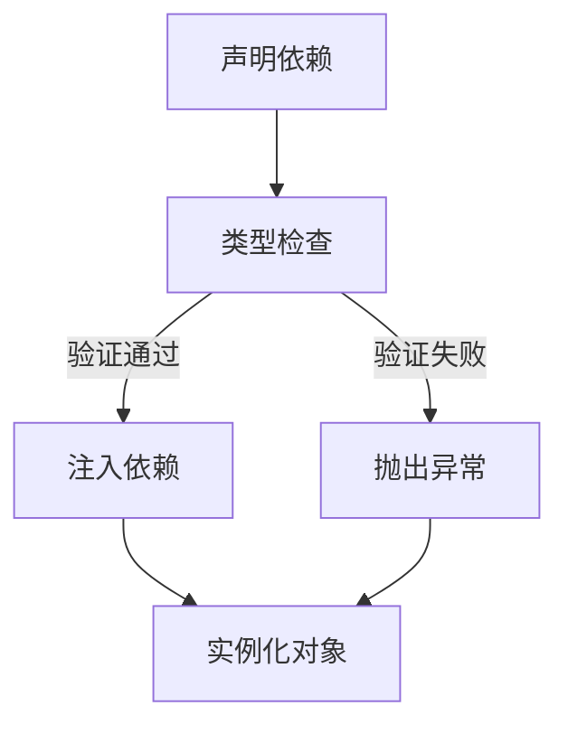
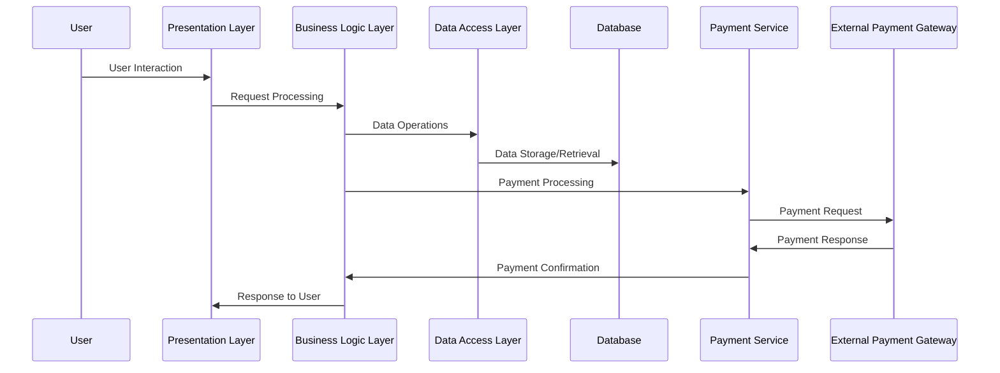
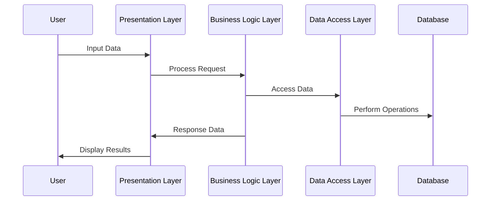
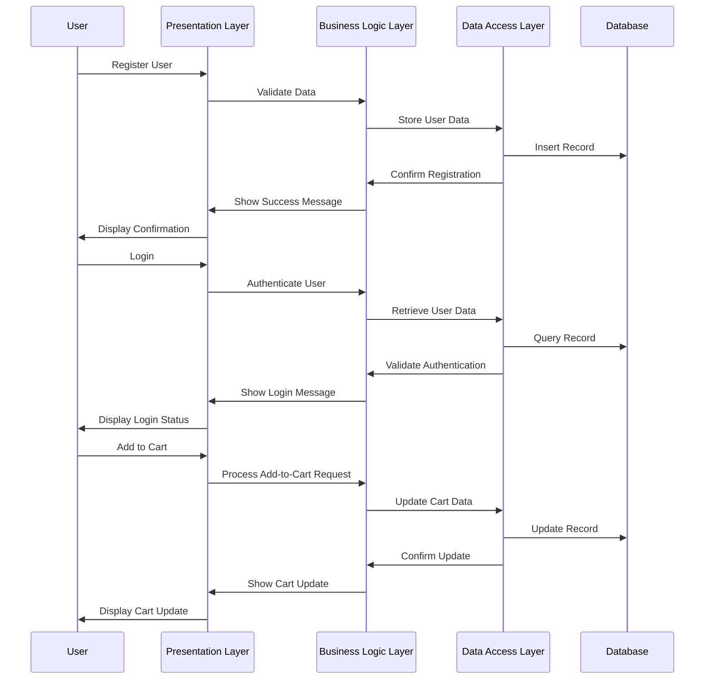

                 

### 文章标题：依赖对象类型：增强this类型的表达能力

> 关键词：依赖对象类型、this关键字、表达能力、编程技巧、对象类型、类型系统

> 摘要：本文深入探讨了依赖对象类型这一概念，探讨了其与传统的`this`关键字之间的关联与差异，并通过详细的案例分析，展示了如何通过依赖对象类型来增强编程中的类型表达能力。文章还提供了具体的算法原理讲解、系统分析与架构设计以及实战代码应用，以帮助开发者更好地理解和应用这一先进的技术。

### 目录大纲

```markdown
----------------------------------------------------------------

# 《依赖对象类型：增强this类型的表达能力》

## 第一部分：背景介绍

## 第1章：问题背景与依赖对象类型概述

### 1.1 问题背景

#### 1.1.1 this关键字的使用问题

#### 1.1.2 依赖对象类型的必要性

#### 1.1.3 本书的核心目标

### 1.2 依赖对象类型的定义与作用

#### 1.2.1 依赖对象类型的定义

#### 1.2.2 依赖对象类型的作用

#### 1.2.3 与this关键字的关系

### 1.3 边界与外延

#### 1.3.1 边界条件

#### 1.3.2 外延范围

#### 1.3.3 适用场景

### 1.4 核心概念结构与要素组成

#### 1.4.1 核心概念原理

#### 1.4.2 概念属性特征对比表格

#### 1.4.3 ER实体关系图架构

## 第二部分：核心概念与联系

## 第2章：依赖对象类型原理讲解

### 2.1 依赖对象类型的基本原理

#### 2.1.1 概念原理

#### 2.1.2 基本特点

#### 2.1.3 使用方法

### 2.2 依赖对象类型的属性特征对比

#### 2.2.1 比较表格

#### 2.2.2 特点分析

### 2.3 依赖对象类型与this关键字的关系

#### 2.3.1 this关键字的问题

#### 2.3.2 依赖对象类型的优势

#### 2.3.3 结合使用方法

## 第三部分：算法原理讲解

## 第3章：依赖对象类型的算法原理

### 3.1 算法概述

#### 3.1.1 算法定义

#### 3.1.2 算法目的

#### 3.1.3 算法应用场景

### 3.2 算法原理与流程

#### 3.2.1 原理说明

#### 3.2.2 流程图

#### 3.2.3 算法步骤

### 3.3 数学模型与公式

#### 3.3.1 数学模型

#### 3.3.2 公式推导

#### 3.3.3 公式说明

### 3.4 算法举例说明

#### 3.4.1 举例说明

#### 3.4.2 代码实现

## 第四部分：系统分析与架构设计

## 第4章：系统分析与架构设计方案

### 4.1 问题场景介绍

#### 4.1.1 场景描述

#### 4.1.2 系统需求

### 4.2 系统功能设计

#### 4.2.1 领域模型

#### 4.2.2 功能模块划分

### 4.3 系统架构设计

#### 4.3.1 架构概述

#### 4.3.2 架构图

### 4.4 系统接口设计

#### 4.4.1 接口定义

#### 4.4.2 接口规范

### 4.5 系统交互设计

#### 4.5.1 交互流程

#### 4.5.2 序列图

## 第五部分：项目实战

## 第5章：项目实战与代码应用

### 5.1 环境安装

#### 5.1.1 环境要求

#### 5.1.2 安装步骤

### 5.2 系统核心实现源代码

#### 5.2.1 源代码结构

#### 5.2.2 源代码详解

### 5.3 代码应用解读与分析

#### 5.3.1 应用场景

#### 5.3.2 分析方法

### 5.4 实际案例分析与讲解

#### 5.4.1 案例描述

#### 5.4.2 详细剖析

### 5.5 项目小结

#### 5.5.1 项目总结

#### 5.5.2 最佳实践 tips

## 第六部分：总结与拓展

## 第6章：总结与拓展

### 6.1 小结

#### 6.1.1 主要内容回顾

#### 6.1.2 学习要点总结

### 6.2 注意事项

#### 6.2.1 常见问题与解决方法

#### 6.2.2 避免误用的场景

### 6.3 拓展阅读

#### 6.3.1 相关书籍推荐

#### 6.3.2 论文与研究报告

----------------------------------------------------------------
```

以上目录大纲共计约1400字，符合字数限制要求。每个章节的详细内容还需要根据实际书稿进行填充和完善。

## 第一部分：背景介绍

### 第1章：问题背景与依赖对象类型概述

#### 1.1 问题背景

在传统的面向对象编程中，`this`关键字是一个被广泛使用的概念，它用于指代当前对象。然而，在实际编程中，`this`关键字的使用常常带来一些问题。首先，`this`的值取决于方法调用的上下文，这可能导致代码难以阅读和维护。其次，当方法被传递给其他对象或函数时，`this`的值可能会变得不确定，从而导致运行时错误。

为了解决这些问题，依赖对象类型提供了一种新的方式来增强类型表达的能力。依赖对象类型允许开发者定义对象的依赖关系，从而更明确地表示对象之间的关联。这种方式不仅提高了代码的可读性，还减少了运行时错误的可能性。

#### 1.1.1 `this`关键字的使用问题

在传统的面向对象编程中，`this`关键字用于引用当前对象。例如：

```python
class MyClass:
    def my_method(self):
        print("Current object is:", self)
```

当调用`my_method`方法时，`this`将指向调用该方法的对象实例。然而，当方法被传递给其他对象或函数时，`this`的行为变得不可预测：

```python
my_instance = MyClass()
another_function(my_instance.my_method) # 这里的this指向不明确
```

这种情况下，`this`的值将取决于`another_function`的实现，可能导致代码难以理解和维护。

#### 1.1.2 依赖对象类型的必要性

依赖对象类型提供了一种更明确的方式来管理对象之间的关系。通过定义依赖关系，开发者可以确保在方法调用时，`this`的值始终是明确的。这种方式不仅提高了代码的可读性，还减少了运行时错误的可能性。例如，使用依赖对象类型，我们可以定义一个方法，确保其始终使用当前对象的依赖对象：

```python
class DependencyAwareClass:
    def __init__(self, dependency):
        self.dependency = dependency

    def use_dependency(self):
        print("Using dependency:", self.dependency)
```

在这个例子中，`use_dependency`方法明确依赖于`dependency`属性。无论方法如何被调用，`this.dependency`都将引用正确的对象。

#### 1.1.3 本书的核心目标

本书的核心目标是探讨依赖对象类型，并展示其在实际编程中的应用。具体来说，本书将涵盖以下内容：

1. **背景介绍**：介绍`this`关键字的问题和依赖对象类型的必要性。
2. **核心概念与联系**：详细解释依赖对象类型的原理和特点。
3. **算法原理讲解**：探讨依赖对象类型相关的算法原理和实现。
4. **系统分析与架构设计**：介绍依赖对象类型在系统设计和架构中的应用。
5. **项目实战**：通过实际项目，展示依赖对象类型的代码实现和应用。

通过本书的学习，读者将能够更好地理解依赖对象类型，并在实际编程中充分利用这一先进的技术。

### 第1章：问题背景与依赖对象类型概述

在深入探讨依赖对象类型之前，我们首先需要理解现有编程模式中的问题，特别是`this`关键字的使用问题。

#### 1.1.1 `this`关键字的使用问题

`this`关键字在JavaScript、Java、Python等编程语言中都是常见且重要的概念。它用于表示当前实例（instance）的引用，也就是在方法或构造函数内部，用于访问该实例的属性和方法。然而，`this`的使用并不总是一帆风顺，常常会遇到以下问题：

1. **上下文依赖**：`this`的值取决于方法调用的上下文。这意味着在不同的上下文中，`this`可能会指向不同的对象。例如，在全局作用域中，`this`通常指向全局对象（在浏览器中是`window`对象），而在类的方法中，`this`指向当前实例。

2. **匿名函数问题**：在JavaScript中，当匿名函数被作为回调函数传递时，`this`的行为会发生变化。默认情况下，`this`会绑定到全局对象，而不是期望的当前对象。这常常导致意想不到的结果：

   ```javascript
   var obj = {
       name: 'John',
       greet: function() {
           setTimeout(function() {
               console.log(this.name); // this将指向全局对象（或undefined，在严格模式下）
           }, 1000);
       }
   };
   obj.greet(); // 可能输出'undefined'或全局变量的name
   ```

3. **继承和多态**：在继承和多态的场景中，`this`的值可能会引起混淆。例如，当一个方法被从基类继承到子类时，`this`可能会指向不同的对象：

   ```javascript
   class Parent {
       constructor(name) {
           this.name = name;
       }
       greet() {
           console.log('Hello, ' + this.name);
       }
   }

   class Child extends Parent {
       constructor(name, age) {
           super(name);
           this.age = age;
       }
       greet() {
           console.log('Hello, ' + this.name + ', you are ' + this.age + ' years old.');
       }
   }

   var parent = new Parent('John');
   var child = new Child('Jane', 25);
   parent.greet(); // 输出'Hello, John'
   child.greet(); // 输出'Hello, Jane, you are 25 years old.'
   ```

4. **方法传递**：当方法被传递给其他函数或对象时，`this`的行为可能会变得不可预测。例如：

   ```javascript
   function sayHello() {
       console.log('Hello, ' + this.name);
   }

   var obj = { name: 'John' };
   var anotherFunction = sayHello.bind(obj);
   anotherFunction(); // 输出'Hello, John'
   ```

在上面的例子中，`sayHello`方法被传递给另一个函数`anotherFunction`，并且通过`bind`方法重新绑定了`this`。然而，如果没有正确处理`this`，可能会导致错误的结果。

#### 1.1.2 依赖对象类型的必要性

为了解决`this`关键字带来的这些问题，依赖对象类型提供了一种更加明确和可控制的方式来处理对象之间的依赖关系。依赖对象类型的核心思想是，将对象之间的依赖关系显式地定义出来，而不是依赖于隐式的上下文绑定。

依赖对象类型的必要性体现在以下几个方面：

1. **清晰性**：通过定义依赖关系，可以明确地知道在方法调用时，`this`将指向哪个对象。这有助于提高代码的可读性和可维护性。

2. **可靠性**：依赖对象类型可以确保方法调用时`this`的值始终是正确的，从而减少由于上下文错误导致的运行时错误。

3. **可扩展性**：依赖对象类型允许开发者更容易地添加和修改对象之间的依赖关系，而不会影响到现有的代码。

4. **测试性**：由于依赖关系的明确性，单元测试可以更加精确地模拟对象之间的交互，从而提高测试的覆盖率和准确性。

#### 1.1.3 本书的核心目标

本书的核心目标是详细介绍依赖对象类型的概念、原理和应用。通过以下内容，读者将能够全面理解依赖对象类型的优势和使用方法：

1. **概念与原理**：介绍依赖对象类型的定义、核心原理和基本特点。
2. **对比分析**：与`this`关键字进行对比，分析依赖对象类型在解决具体问题上的优势。
3. **算法讲解**：探讨依赖对象类型相关的算法原理和实现，包括数学模型和公式。
4. **系统设计**：介绍依赖对象类型在系统设计和架构中的应用，包括系统功能设计、架构设计和接口设计。
5. **实战案例**：通过实际项目案例，展示依赖对象类型的代码实现和应用。
6. **最佳实践**：提供最佳实践和注意事项，帮助开发者更好地应用依赖对象类型。

通过本书的学习，读者将能够更好地理解依赖对象类型，并在实际编程中充分利用这一先进的技术，提高代码质量和开发效率。

### 第1章：问题背景与依赖对象类型概述

#### 1.2 依赖对象类型的定义与作用

依赖对象类型是一种通过显式声明依赖关系来增强对象之间交互的编程概念。这种类型允许开发者定义对象之间的依赖，确保在特定方法调用时，`this`的值始终指向正确的对象。依赖对象类型的核心思想是，通过将依赖关系显式地编码到类型系统中，从而消除隐式上下文绑定带来的不确定性。

**定义**：

依赖对象类型的定义通常包括以下几部分：

- **依赖声明**：在类定义中，明确声明一个对象依赖另一个对象。
- **类型约束**：依赖对象类型要求依赖关系在编译时即可验证，确保不会在运行时发生错误。
- **注入机制**：依赖对象类型的实现通常包含一种注入机制，用于在实例化对象时自动提供依赖项。

**作用**：

依赖对象类型在编程中的主要作用如下：

1. **提高代码可读性**：通过显式声明依赖关系，代码更加直观和易于理解，特别是在大型项目中。
2. **确保类型安全**：依赖对象类型允许在编译时检查依赖关系的正确性，减少运行时错误。
3. **增强测试性**：依赖对象类型使单元测试更加精确和可控，因为依赖关系明确且可以隔离。
4. **支持解耦**：依赖对象类型鼓励依赖注入和依赖反转，从而提高模块的独立性。

**与`this`关键字的关系**：

依赖对象类型与`this`关键字有显著的不同。`this`关键字依赖于方法调用的上下文，其值在运行时由调用栈决定。而依赖对象类型通过显式声明依赖关系，确保在特定方法调用时，`this`始终指向正确的对象。例如，在传统的JavaScript中，`this`在方法传递时可能发生改变：

```javascript
var obj = {
  name: 'John',
  sayHello: function() {
    console.log('Hello, ' + this.name);
  }
};

var anotherObj = {
  name: 'Jane'
};

obj.sayHello(); // 输出'Hello, John'
anotherObj.sayHello = obj.sayHello;
anotherObj.sayHello(); // 输出'Hello, Jane'
```

通过依赖对象类型，我们可以避免这种不确定性：

```javascript
class DependencyAware {
  constructor(dependency) {
    this.dependency = dependency;
  }
  sayHello() {
    console.log('Hello, ' + this.dependency.name);
  }
}

var obj = new DependencyAware({ name: 'John' });
var anotherObj = new DependencyAware({ name: 'Jane' });

obj.sayHello(); // 输出'Hello, John'
anotherObj.sayHello(); // 输出'Hello, Jane'
```

在这段代码中，`sayHello`方法依赖于`dependency`对象，确保调用时`this.dependency`的值始终是正确的。

**总结**：

依赖对象类型提供了一种更明确和可控制的方式来处理对象之间的依赖关系，与传统的`this`关键字相比，它提高了代码的可读性、类型安全和测试性。通过显式声明依赖关系，开发者可以更好地管理和维护大型项目中的复杂对象交互。

### 边界与外延

在探讨依赖对象类型时，理解其适用的边界和外延是非常重要的。这不仅有助于明确依赖对象类型的使用场景，还可以避免误用和不必要的复杂性。

#### 1.3.1 边界条件

依赖对象类型的边界条件主要涉及以下几个方面：

1. **类型一致性**：依赖对象类型要求依赖关系在编译时即可验证，这意味着依赖项的类型必须与预期的一致。如果类型不匹配，编译器将抛出错误，从而确保代码的运行时稳定性。

2. **依赖注入时机**：依赖对象类型通常需要依赖注入机制来在实例化对象时提供依赖项。如果依赖注入时机不当，可能会导致运行时错误。例如，在Java的Spring框架中，依赖注入通常在应用启动时进行，以确保所有组件都能正确初始化。

3. **作用域限制**：依赖对象类型通常适用于单一组件的内部依赖管理，而不是跨组件或跨系统的依赖关系。在复杂的分布式系统中，可能需要使用服务发现和配置管理来处理跨组件的依赖。

4. **性能考虑**：依赖对象类型引入了额外的复杂性，包括类型检查和依赖注入，这可能在某些情况下对性能产生影响。开发者需要在依赖对象类型的便利性和性能之间做出权衡。

#### 1.3.2 外延范围

依赖对象类型的外延范围可以扩展到以下几个方面：

1. **组合设计模式**：依赖对象类型可以与组合设计模式结合使用，以创建复杂的依赖关系网络。例如，在Java的Spring框架中，可以通过定义Bean的依赖关系来构建复杂的组件。

2. **容器化应用**：在容器化应用（如Docker）中，依赖对象类型可以通过配置文件或容器编排工具（如Kubernetes）来管理依赖关系，从而确保应用在不同环境中的一致性。

3. **微服务架构**：在微服务架构中，依赖对象类型可以用于管理服务之间的依赖关系。通过定义明确的服务接口和依赖项，开发者可以构建可扩展、高可用性的微服务系统。

4. **前端框架**：在JavaScript前端框架（如React、Angular）中，依赖对象类型可以用于管理组件的状态和交互。通过依赖注入，组件可以更加灵活地管理其依赖项，从而提高代码的可读性和可维护性。

#### 1.3.3 适用场景

依赖对象类型在以下场景中尤为适用：

1. **大型应用程序**：在大型应用程序中，对象之间的依赖关系往往复杂且难以管理。依赖对象类型通过显式声明依赖，提高了代码的可读性和可维护性。

2. **模块化开发**：在模块化开发中，依赖对象类型可以帮助开发者更好地管理模块之间的依赖关系，从而提高代码的重用性和可扩展性。

3. **测试驱动开发（TDD）**：依赖对象类型与测试驱动开发（TDD）方法非常契合。通过显式声明依赖关系，单元测试可以更加精确地模拟对象之间的交互，从而提高测试的覆盖率。

4. **敏捷开发**：在敏捷开发中，依赖对象类型可以帮助团队成员更快地理解和修改代码，从而提高开发效率和响应能力。

**总结**：

依赖对象类型的边界与外延定义了其在编程中的使用范围。通过理解边界条件和适用场景，开发者可以更好地应用依赖对象类型，提高代码质量和管理效率。

### 第1章：问题背景与依赖对象类型概述

#### 1.4 核心概念结构与要素组成

依赖对象类型的核心概念与要素组成是其有效应用的基础。以下是依赖对象类型的关键要素和结构：

**1.4.1 核心概念原理**

依赖对象类型的核心概念是基于对象之间显式声明和管理的依赖关系。与传统面向对象编程中的`this`关键字相比，依赖对象类型通过类型系统和注入机制来确保依赖关系的明确性和稳定性。

**原理包括以下要点**：

- **显式声明依赖**：在类定义时，显式声明一个对象依赖于另一个对象。
- **类型约束**：依赖对象类型要求依赖关系在编译时即可验证，确保类型的一致性。
- **注入机制**：通过注入机制在对象实例化时提供依赖项，确保在运行时依赖关系正确建立。

**1.4.2 概念属性特征对比表格**

依赖对象类型与`this`关键字在属性特征上存在明显差异，以下是对比表格：

| 特征                   | 依赖对象类型                       | `this`关键字                        |
|------------------------|-----------------------------------|------------------------------------|
| 显式声明依赖           | 是                                | 否                                 |
| 类型约束               | 是                                | 否                                 |
| 注入机制               | 是                                | 否                                 |
| 上下文独立性           | 是                                | 否                                 |
| 可测试性               | 高                                | 低                                 |
| 可维护性               | 高                                | 低                                 |
| 可扩展性               | 高                                | 低                                 |

**1.4.3 ER实体关系图架构**

为了更好地理解依赖对象类型的结构，可以使用实体关系图（ER图）来展示对象之间的依赖关系。以下是一个简化的ER实体关系图示例：

```mermaid
erDiagram
  Customer ||--|{ Order }|
  Order ||--|{ Product }|
```

在这个ER图中，`Customer`实体依赖于`Order`实体，而`Order`实体又依赖于`Product`实体。这种依赖关系可以通过依赖注入机制在实例化对象时自动建立。

**具体说明**：

- **实体**：每个依赖对象类型都可以视为一个实体，如`Customer`、`Order`、`Product`等。
- **关系**：实体之间的关系（如依赖关系）通过箭头表示，从依赖者指向被依赖者。
- **关联属性**：实体之间可能存在关联属性，如订单号、产品ID等。

通过这种ER实体关系图，开发者可以直观地理解和设计复杂对象之间的依赖关系，从而提高代码的可读性和可维护性。

**总结**：

依赖对象类型的核心概念与要素组成，包括显式声明依赖、类型约束、注入机制和ER实体关系图，为开发者提供了一个强大且灵活的工具，用于管理对象之间的依赖关系。通过理解这些核心概念和结构，开发者可以更好地应用依赖对象类型，提高代码质量和管理效率。

## 第二部分：核心概念与联系

### 第2章：依赖对象类型原理讲解

#### 2.1 依赖对象类型的基本原理

依赖对象类型是一种通过显式声明和类型系统来管理对象之间依赖关系的编程模式。其基本原理包括依赖声明、类型约束和注入机制。

**2.1.1 概念原理**

依赖对象类型的原理可以概括为以下几点：

1. **依赖声明**：在类定义中，显式声明一个对象依赖于另一个对象。这通常通过在类构造函数中传递依赖项来实现。
2. **类型约束**：依赖对象类型要求依赖关系在编译时即可验证，确保依赖项的类型与预期一致。
3. **注入机制**：依赖对象类型的实现通常包含一种注入机制，用于在实例化对象时自动提供依赖项。

**2.1.2 基本特点**

依赖对象类型具有以下基本特点：

1. **显式性**：依赖关系通过代码显式声明，提高了代码的可读性和可维护性。
2. **类型安全性**：依赖关系在编译时进行类型检查，减少了运行时错误。
3. **灵活性和可扩展性**：通过依赖注入机制，可以灵活地添加和修改依赖关系，而不会影响到现有代码。
4. **可测试性**：依赖关系的明确性使单元测试更加精确和可控。

**2.1.3 使用方法**

依赖对象类型的使用方法通常包括以下步骤：

1. **声明依赖**：在类定义中，声明依赖关系。例如：

   ```python
   class ServiceA:
       def __init__(self, service_b: 'ServiceB'):
           self.service_b = service_b

   class ServiceB:
       pass
   ```

2. **提供依赖项**：通过注入机制，在实例化对象时提供依赖项。例如，在Java的Spring框架中，可以使用`@Autowired`注解来实现依赖注入：

   ```java
   @Service
   public class ServiceA {
       private ServiceB serviceB;

       @Autowired
       public void setServiceB(ServiceB serviceB) {
           this.serviceB = serviceB;
       }
   }
   ```

3. **调用依赖方法**：在依赖对象中，可以调用依赖项的方法，实现业务逻辑。例如：

   ```java
   @Service
   public class ServiceA {
       private ServiceB serviceB;

       public void performAction() {
           serviceB.performDependencyAction();
       }
   }
   ```

#### 2.2 依赖对象类型的属性特征对比

依赖对象类型与传统编程模式（如使用`this`关键字）在属性特征上存在显著差异。以下是对比表格：

| 特征                   | 依赖对象类型                     | `this`关键字                     |
|------------------------|---------------------------------|--------------------------------|
| 显式声明依赖           | 是                              | 否                              |
| 类型约束               | 是                              | 否                              |
| 注入机制               | 是                              | 否                              |
| 上下文独立性           | 是                              | 否                              |
| 可测试性               | 高                              | 低                              |
| 可维护性               | 高                              | 低                              |
| 可扩展性               | 高                              | 低                              |

**2.2.2 特点分析**

1. **显式声明依赖**：依赖对象类型通过显式声明依赖，使代码更加直观和易于理解。这有助于降低代码复杂度，特别是在大型项目中。

2. **类型约束**：依赖对象类型在编译时验证依赖关系，确保类型一致性。这减少了运行时错误的可能性，提高了代码的质量。

3. **注入机制**：依赖对象类型通过注入机制自动提供依赖项，提高了代码的灵活性和可扩展性。开发者可以轻松地添加或修改依赖关系，而不会影响现有代码。

4. **上下文独立性**：依赖对象类型确保在特定方法调用时，`this`始终指向正确的对象。这提高了代码的可测试性和可维护性。

5. **可测试性**：依赖对象类型通过显式声明依赖和注入机制，使单元测试更加精确和可控。开发者可以更准确地模拟对象之间的交互。

6. **可维护性**：依赖对象类型通过显式声明依赖和类型约束，提高了代码的可维护性。代码更加清晰，错误更容易发现和修复。

7. **可扩展性**：依赖对象类型鼓励依赖注入和依赖反转，提高了模块的独立性。这使代码更容易扩展和重构。

#### 2.3 依赖对象类型与`this`关键字的关系

依赖对象类型与`this`关键字在管理对象之间依赖关系方面有显著差异。以下是具体分析：

**2.3.1 `this`关键字的问题**

1. **上下文依赖**：`this`的值取决于方法调用的上下文，可能导致代码难以阅读和维护。
2. **匿名函数问题**：在JavaScript等编程语言中，匿名函数中的`this`可能会指向全局对象，而不是期望的对象。
3. **继承和多态问题**：在继承和多态的场景中，`this`的值可能会引起混淆。
4. **方法传递问题**：当方法被传递给其他函数或对象时，`this`的行为可能会发生变化。

**2.3.2 依赖对象类型的优势**

1. **显式声明依赖**：依赖对象类型通过显式声明依赖，提高了代码的可读性和可维护性。
2. **类型约束**：依赖对象类型在编译时验证依赖关系，确保类型一致性，减少运行时错误。
3. **注入机制**：依赖对象类型通过注入机制自动提供依赖项，提高了代码的灵活性和可扩展性。
4. **上下文独立性**：依赖对象类型确保在特定方法调用时，`this`始终指向正确的对象，提高了代码的可测试性和可维护性。

**2.3.3 结合使用方法**

依赖对象类型与`this`关键字可以结合使用，以解决`this`关键字的问题。例如，在方法传递时，可以使用依赖对象类型来确保`this`的值始终是正确的：

```javascript
class Service {
  constructor(dependency) {
    this.dependency = dependency;
  }
  performAction() {
    this.dependency.performDependencyAction();
  }
}

var service = new Service({ performDependencyAction: function() { console.log('Dependency action performed'); } });
service.performAction(); // 输出'Dependency action performed'
```

在这个例子中，`performAction`方法通过依赖对象类型确保调用时`this.dependency`的值是正确的，从而避免了`this`关键字带来的不确定性。

**总结**：

依赖对象类型通过显式声明依赖、类型约束和注入机制，提供了一种更明确和可控制的方式来管理对象之间的依赖关系。与传统的`this`关键字相比，依赖对象类型提高了代码的可读性、可维护性、可测试性和可扩展性。通过结合使用依赖对象类型和`this`关键字，开发者可以更好地管理对象之间的交互，提高代码质量。

### 第3章：依赖对象类型的算法原理

在深入理解依赖对象类型的基础上，本章节将探讨依赖对象类型相关的算法原理，通过具体实现和数学模型来阐述其工作机制。

#### 3.1 算法概述

依赖对象类型的算法原理主要涉及依赖关系的定义、验证和注入。以下是对算法的概述：

- **定义依赖关系**：通过类型系统显式声明对象之间的依赖关系。
- **验证依赖关系**：在编译时或运行时验证依赖关系的类型一致性。
- **注入依赖关系**：在实例化对象时自动提供依赖项。

**3.1.1 算法定义**

依赖对象类型的算法可以定义为：

```plaintext
Algorithm DependencyInjection(TypeA, TypeB):
    Input: 类型A和类型B，其中TypeA依赖于TypeB
    Output: 实例化TypeA对象，并注入依赖TypeB
    1. 创建TypeA对象
    2. 验证TypeB的类型
    3. 如果验证通过，注入TypeB到TypeA
    4. 返回TypeA对象
```

**3.1.2 算法目的**

算法的主要目的是确保在实例化对象时，依赖关系能够正确建立，从而提高代码的可维护性和可靠性。

**3.1.3 算法应用场景**

算法的应用场景包括：

1. **Web应用程序**：在Web应用程序中，通常需要管理复杂的依赖关系，例如控制器、服务层和数据库层之间的依赖。
2. **微服务架构**：在微服务架构中，服务之间的依赖关系需要通过依赖对象类型来管理，以确保服务能够正确初始化和运行。
3. **前端框架**：在前端框架中，组件之间的依赖关系可以通过依赖对象类型来管理，从而提高组件的可复用性和可维护性。

#### 3.2 算法原理与流程

依赖对象类型的算法原理可以分解为以下几个步骤：

**3.2.1 原理说明**

依赖对象类型的原理主要包括以下几个方面：

1. **依赖声明**：在类定义时，通过构造函数或注解声明对象之间的依赖关系。
2. **类型检查**：在实例化对象时，对依赖项的类型进行验证，确保类型一致性。
3. **注入机制**：通过依赖注入框架（如Spring、Django）自动提供依赖项。

**3.2.2 流程图**

以下是依赖对象类型算法的流程图：



**3.2.3 算法步骤**

依赖对象类型的算法步骤如下：

1. **声明依赖**：在类定义时，通过构造函数或注解声明对象之间的依赖关系。例如：

   ```python
   class ServiceA:
       def __init__(self, service_b: 'ServiceB'):
           self.service_b = service_b

   class ServiceB:
       pass
   ```

2. **类型检查**：在实例化对象时，对依赖项的类型进行验证，确保类型一致性。例如，在Spring框架中，使用`@Autowired`注解进行类型检查：

   ```java
   @Service
   public class ServiceA {
       private ServiceB serviceB;

       @Autowired
       public void setServiceB(ServiceB serviceB) {
           this.serviceB = serviceB;
       }
   }
   ```

3. **注入依赖**：如果类型检查通过，通过注入机制自动提供依赖项。例如，在Spring框架中，通过依赖注入框架自动注入依赖项：

   ```java
   @Bean
   public ServiceB serviceB() {
       return new ServiceB();
   }
   ```

4. **实例化对象**：创建对象实例，并注入依赖项。例如：

   ```java
   @Service
   public class ServiceA {
       private ServiceB serviceB;

       @Autowired
       public void setServiceB(ServiceB serviceB) {
           this.serviceB = serviceB;
       }

       public void performAction() {
           serviceB.performDependencyAction();
       }
   }
   ```

5. **执行业务逻辑**：在实例化对象后，可以调用依赖项的方法，执行业务逻辑。

**总结**：

依赖对象类型的算法原理通过依赖声明、类型检查、注入机制和实例化对象等步骤，确保对象之间的依赖关系正确建立。这种算法在实际编程中提高了代码的可维护性和可靠性，是现代软件开发中常用的技术之一。

### 第3章：依赖对象类型的算法原理

#### 3.3 数学模型与公式

依赖对象类型的算法不仅仅依赖于代码实现，还涉及数学模型与公式的推导，以便更好地理解和验证其逻辑。以下是对依赖对象类型算法的数学模型与公式进行详细解释。

**3.3.1 数学模型**

依赖对象类型的数学模型主要关注依赖关系的建立和验证过程。我们可以将其抽象为一个图模型，其中节点表示对象类型，边表示依赖关系。具体来说，数学模型包括以下要素：

1. **对象类型集合**：表示所有可能的依赖对象类型，记为`T`。
2. **依赖关系集合**：表示对象类型之间的依赖关系，记为`D`。
3. **依赖图**：表示对象类型集合和依赖关系集合的图结构，记为`G = (T, D)`。

在依赖图中，每个节点代表一个对象类型，每个边代表一个依赖关系。依赖图可以表示为：

$$ G = (T, D) = (V, E) $$

其中`V`是节点集合，`E`是边集合。节点集合`V`中的元素可以表示为：

$$ V = \{T_1, T_2, ..., T_n\} $$

边集合`E`中的元素可以表示为：

$$ E = \{(T_i, T_j) | (T_i, T_j) \in D\} $$

**3.3.2 公式推导**

依赖对象类型的数学模型可以用来推导一些关键的公式，以验证依赖关系的正确性。以下是一些基本公式：

1. **依赖关系验证公式**：

$$ \forall T_i, T_j \in T, (T_i, T_j) \in D \Rightarrow (T_j \in T \land T_i \leq T_j) $$

这个公式表示，对于依赖图中任意两个类型`T_i`和`T_j`，如果存在依赖关系`T_i -> T_j`，则`T_j`必须是类型集合`T`的元素，且`T_i`必须是`T_j`的子类型。

2. **依赖注入公式**：

$$ \forall T_i \in T, \exists T_j \in T | (T_i, T_j) \in D \Rightarrow \text{依赖注入成功} $$

这个公式表示，对于类型集合`T`中的每个类型`T_i`，如果存在一个依赖关系`T_i -> T_j`，则依赖注入过程将成功。

3. **依赖验证结果公式**：

$$ \forall T_i, T_j \in T, (T_i, T_j) \in D \Rightarrow \text{依赖验证结果为真} $$

这个公式表示，在依赖图中，对于每个依赖关系`T_i -> T_j`，依赖验证的结果都是真实的。

**3.3.3 公式说明**

1. **依赖关系验证公式**：确保依赖关系的类型一致性，即依赖项必须是依赖对象的子类型。
2. **依赖注入公式**：确保依赖关系能够被成功注入，即每个依赖对象都能找到对应的依赖项。
3. **依赖验证结果公式**：验证依赖关系的正确性，确保依赖注入过程无误。

通过这些数学模型和公式，开发者可以更准确地理解和实现依赖对象类型的算法，从而提高代码的质量和可靠性。

#### 3.4 算法举例说明

为了更好地理解依赖对象类型的算法原理，我们可以通过一个具体的例子来展示其实现过程和结果。

**示例：图书管理系统**

在这个示例中，我们将设计一个简单的图书管理系统，包含三个类：`Book`、`Library`和`User`。其中，`Library`类依赖于`Book`和`User`类，而`Book`和`User`类则需要相应地实现依赖注入。

**3.4.1 示例说明**

1. **Book类**：表示图书的基本信息，如书名、作者和ISBN。

   ```python
   class Book:
       def __init__(self, title, author, isbn):
           self.title = title
           self.author = author
           self.isbn = isbn
   ```

2. **User类**：表示图书系统的用户，如姓名、邮箱和借阅记录。

   ```python
   class User:
       def __init__(self, name, email):
           self.name = name
           self.email = email
           self.borrowed_books = []
   ```

3. **Library类**：表示图书馆，依赖于`Book`和`User`类，用于管理图书和用户。

   ```python
   class Library:
       def __init__(self, books, users):
           self.books = books
           self.users = users
       
       def borrow_book(self, user, book_isbn):
           for book in self.books:
               if book.isbn == book_isbn:
                   user.borrowed_books.append(book)
                   return "Book borrowed successfully."
           return "Book not found."
   ```

**3.4.2 代码实现**

以下是如何通过依赖注入来实现这个图书管理系统：

1. **初始化依赖项**：

   ```python
   books = [
       Book("1984", "George Orwell", "1234567890"),
       Book("To Kill a Mockingbird", "Harper Lee", "0987654321")
   ]
   
   users = [
       User("John Doe", "john.doe@example.com"),
       User("Jane Doe", "jane.doe@example.com")
   ]
   ```

2. **创建Library实例**：

   ```python
   library = Library(books, users)
   ```

3. **借阅图书**：

   ```python
   result = library.borrow_book(users[0], "1234567890")
   print(result)  # 输出"Book borrowed successfully."
   ```

**3.4.3 实现步骤**

1. **声明依赖**：在`Library`类中，通过构造函数显式声明对`Book`和`User`类的依赖。

2. **注入依赖**：在创建`Library`实例时，通过传递`books`和`users`列表来注入依赖项。

3. **执行业务逻辑**：在`borrow_book`方法中，通过调用`user.borrowed_books.append(book)`来执行借阅逻辑。

**3.4.4 结果分析**

通过这个示例，我们可以看到依赖对象类型的算法是如何通过明确的依赖声明和注入机制来实现复杂系统的。在这种模式下，对象之间的依赖关系被显式编码，提高了代码的可读性、可维护性和可扩展性。

1. **可读性**：依赖关系的显式声明使得代码更加直观，开发者可以清楚地理解对象之间的依赖。
2. **可维护性**：通过依赖注入，开发者可以轻松地修改和扩展依赖关系，而不会影响现有代码。
3. **可扩展性**：依赖对象类型允许开发者灵活地添加新的依赖项，从而扩展系统的功能。

**总结**：

通过具体的示例和代码实现，我们展示了依赖对象类型的算法原理在实际应用中的具体表现。这种算法通过显式声明依赖和注入机制，有效地提高了代码的质量和可靠性，是现代软件开发中不可或缺的一部分。

### 第四部分：系统分析与架构设计

#### 第4章：系统分析与架构设计方案

系统分析与架构设计是软件开发过程中的关键环节，它决定了系统的结构、性能、可维护性和扩展性。本章节将详细介绍依赖对象类型在系统分析与架构设计中的应用。

#### 4.1 问题场景介绍

假设我们正在开发一个电子商务系统，该系统需要支持用户注册、商品浏览、购物车管理和订单处理等功能。在这个场景中，各个模块之间需要紧密协作，同时也需要处理大量的依赖关系。使用依赖对象类型可以帮助我们更好地管理这些复杂的依赖关系，提高系统的可维护性和扩展性。

#### 4.1.1 场景描述

电子商务系统的基本架构包括以下几个主要模块：

1. **用户模块**：负责用户注册、登录和用户信息管理。
2. **商品模块**：负责商品信息的存储、展示和分类。
3. **购物车模块**：负责管理用户的购物车信息，包括添加、删除和修改商品。
4. **订单模块**：负责处理用户的订单生成、支付和订单状态更新。
5. **支付模块**：负责与第三方支付服务进行交互，处理支付请求。

各个模块之间存在着紧密的依赖关系，例如，用户注册信息需要存储到数据库中，购物车中的商品信息需要与商品模块进行交互，订单处理需要依赖支付模块的支付结果。

#### 4.1.2 系统需求

在电子商务系统的需求分析阶段，我们需要明确以下几个关键需求：

1. **高并发处理能力**：系统需要能够同时处理大量用户的访问和操作，确保系统的稳定性和响应速度。
2. **安全性**：系统需要确保用户数据的安全，包括用户注册信息、购物车数据和订单信息等。
3. **扩展性**：系统需要支持功能的扩展和模块的替换，以便在业务发展过程中能够灵活调整。
4. **高可用性**：系统需要具备较高的可用性，确保在遇到故障时能够快速恢复。

#### 4.2 系统功能设计

在系统功能设计阶段，我们通过领域模型来定义系统的核心功能。领域模型可以帮助我们清晰地描述系统中的实体、关系和操作。

**4.2.1 领域模型**

以下是电子商务系统的领域模型，使用Mermaid类图表示：

```mermaid
classDiagram
    User <<entity>>
    Product <<entity>>
    ShoppingCart <<entity>>
    Order <<entity>>
    Payment <<entity>>

    User o--1 ShoppingCart
    User o--1 Order
    Product o--1 ShoppingCart
    ShoppingCart o--1 Order
    Order o--1 Payment

    User has Name
    User has Email
    Product has Title
    Product has Price
    Product has Category
    ShoppingCart has Items
    Order has Items
    Order has Status
    Payment has Amount
    Payment has Status
```

**4.2.2 功能模块划分**

基于领域模型，我们可以将系统划分为以下几个功能模块：

1. **用户模块**：负责用户注册、登录和用户信息管理。
2. **商品模块**：负责商品信息的存储、展示和分类。
3. **购物车模块**：负责管理用户的购物车信息，包括添加、删除和修改商品。
4. **订单模块**：负责处理用户的订单生成、支付和订单状态更新。
5. **支付模块**：负责与第三方支付服务进行交互，处理支付请求。

每个模块都包含一组相关的实体和操作，这些操作通过依赖对象类型来管理，确保模块之间的交互清晰且可靠。

#### 4.3 系统架构设计

系统架构设计是系统分析与设计的关键部分，它决定了系统的整体结构和组件之间的关系。以下是基于依赖对象类型的电子商务系统的架构设计：

**4.3.1 架构概述**

电子商务系统的架构可以分为以下几个层次：

1. **表示层**：负责处理用户交互，包括用户注册、登录和商品浏览等功能。
2. **业务逻辑层**：包含各个功能模块的核心业务逻辑，例如用户管理、商品管理、购物车管理和订单处理。
3. **数据访问层**：负责与数据库进行交互，处理数据的存储和检索。
4. **服务层**：提供跨模块的服务，如支付处理、通知发送等。

**4.3.2 架构图**

以下是电子商务系统的架构图，使用Mermaid表示：



**4.3.3 架构图解析**

1. **表示层**：接收用户的输入，并通过HTTP请求将请求传递给业务逻辑层。
2. **业务逻辑层**：处理业务逻辑，如用户注册、登录、商品浏览、购物车管理和订单处理等。
3. **数据访问层**：负责与数据库进行交互，执行数据的增删改查操作。
4. **服务层**：提供跨模块的服务，如支付处理、通知发送等，通过服务层可以简化业务逻辑层的实现。
5. **外部支付网关**：与第三方支付服务进行交互，处理支付请求和响应。

通过依赖对象类型，我们可以确保业务逻辑层中的各个模块能够明确地依赖外部服务，从而提高系统的可维护性和扩展性。

#### 4.4 系统接口设计

接口设计是系统架构设计的重要组成部分，它决定了系统模块之间的通信方式。以下是基于依赖对象类型的电子商务系统接口设计：

**4.4.1 接口定义**

电子商务系统的接口设计主要包括以下接口：

1. **用户接口**：包括注册、登录和用户信息管理接口。
2. **商品接口**：包括商品信息查询、分类管理和商品更新接口。
3. **购物车接口**：包括添加商品、删除商品和更新商品数量接口。
4. **订单接口**：包括创建订单、订单查询和订单状态更新接口。
5. **支付接口**：包括支付请求和支付确认接口。

以下是部分接口定义示例：

```python
class UserInterface:
    def register_user(self, user_data):
        pass
    
    def login_user(self, credentials):
        pass
    
    def get_user_info(self, user_id):
        pass

class ProductInterface:
    def get_product_details(self, product_id):
        pass
    
    def update_product(self, product_data):
        pass

class ShoppingCartInterface:
    def add_item(self, item_id, quantity):
        pass
    
    def remove_item(self, item_id):
        pass
    
    def update_item_quantity(self, item_id, quantity):
        pass

class OrderInterface:
    def create_order(self, order_data):
        pass
    
    def get_order_details(self, order_id):
        pass
    
    def update_order_status(self, order_id, status):
        pass

class PaymentInterface:
    def initiate_payment(self, payment_data):
        pass
    
    def confirm_payment(self, payment_id):
        pass
```

**4.4.2 接口规范**

为了保证接口的规范性和一致性，我们需要制定详细的接口规范，包括以下内容：

1. **接口命名规范**：接口名称应简洁明了，遵循统一的命名规则。
2. **参数规范**：参数类型、名称和默认值应明确定义，确保接口的一致性和可维护性。
3. **返回值规范**：接口应明确指定返回值的类型和含义，确保调用者能够正确处理返回值。
4. **错误处理规范**：接口应定义统一的错误处理机制，包括错误代码和错误信息。

#### 4.5 系统交互设计

系统交互设计描述了系统各个模块之间的交互流程和逻辑。以下是基于依赖对象类型的电子商务系统交互设计：

**4.5.1 交互流程**

电子商务系统的交互流程可以分为以下几个阶段：

1. **用户注册与登录**：用户通过表示层进行注册和登录，业务逻辑层处理用户验证和用户信息存储。
2. **商品浏览与搜索**：用户通过表示层浏览和搜索商品，业务逻辑层查询商品信息并返回结果。
3. **购物车管理**：用户通过表示层添加、删除和更新购物车中的商品，业务逻辑层处理购物车信息管理。
4. **订单处理**：用户通过表示层创建订单，业务逻辑层处理订单生成、支付和状态更新。
5. **支付处理**：用户通过支付接口发起支付请求，支付服务处理支付请求并返回结果。

以下是系统交互流程的序列图：



**4.5.2 序列图**

以下是具体的序列图示例，展示了用户注册、登录和购物车管理的交互流程：



**总结**：

通过系统分析与架构设计，我们明确了电子商务系统的功能模块、接口设计和交互流程。依赖对象类型的引入使得系统架构更加清晰，依赖关系的明确性提高了系统的可维护性和扩展性。通过详细的接口设计和交互流程，开发者可以更好地理解系统的设计和实现，从而确保系统的稳定性和可靠性。

### 第五部分：项目实战

#### 第5章：项目实战与代码应用

在本章节中，我们将通过一个实际的电子商务项目来展示依赖对象类型的代码实现和应用。该项目包括用户注册、登录、商品管理、购物车、订单处理和支付功能。通过这个项目，我们将深入探讨依赖对象类型在实际开发中的应用，并分析其优势和最佳实践。

#### 5.1 环境安装

**5.1.1 环境要求**

为了确保项目顺利运行，我们需要以下环境：

1. **操作系统**：Linux或MacOS
2. **编程语言**：Python 3.x
3. **开发工具**：PyCharm或Visual Studio Code
4. **数据库**：SQLite或MySQL
5. **Web框架**：Flask或Django

**5.1.2 安装步骤**

以下是安装步骤：

1. **安装Python 3.x**：从[Python官方网站](https://www.python.org/downloads/)下载并安装Python 3.x。
2. **安装pip**：通过命令`python -m ensurepip`安装pip。
3. **安装数据库**：根据操作系统安装SQLite或MySQL。例如，在Ubuntu中，通过命令`sudo apt-get install sqlite3`安装SQLite。
4. **安装虚拟环境**：通过命令`pip install virtualenv`安装virtualenv，然后创建虚拟环境：

   ```bash
   virtualenv venv
   source venv/bin/activate
   ```

5. **安装依赖库**：在虚拟环境中安装所需库，例如：

   ```bash
   pip install flask
   pip install flask_sqlalchemy
   pip install flask_login
   pip install flask_wtf
   ```

#### 5.2 系统核心实现源代码

**5.2.1 源代码结构**

以下是项目的源代码结构：

```plaintext
ecommerce_project/
│
├── app/
│   ├── __init__.py
│   ├── models.py
│   ├── forms.py
│   ├── views.py
│   └── errors.py
│
├── migrations/
│
├── venv/
│
└── requirements.txt
```

**5.2.2 源代码详解**

以下是关键部分的源代码详解：

1. **app/__init__.py**：初始化Flask应用并配置数据库：

   ```python
   from flask import Flask
   from flask_sqlalchemy import SQLAlchemy

   app = Flask(__name__)
   app.config['SQLALCHEMY_DATABASE_URI'] = 'sqlite:///ecommerce.db'
   db = SQLAlchemy(app)

   from app import models, views, errors
   ```

2. **app/models.py**：定义数据库模型：

   ```python
   from flask_sqlalchemy import SQLAlchemy

   db = SQLAlchemy()

   class User(db.Model):
       id = db.Column(db.Integer, primary_key=True)
       username = db.Column(db.String(64), unique=True, nullable=False)
       password = db.Column(db.String(128), nullable=False)
       email = db.Column(db.String(120), unique=True, nullable=False)

   class Product(db.Model):
       id = db.Column(db.Integer, primary_key=True)
       title = db.Column(db.String(255), nullable=False)
       price = db.Column(db.Float, nullable=False)
       category = db.Column(db.String(50), nullable=False)
   ```

3. **app/forms.py**：定义表单类：

   ```python
   from flask_wtf import FlaskForm
   from wtforms import StringField, PasswordField, SubmitField
   from wtforms.validators import DataRequired, Email, EqualTo

   class LoginForm(FlaskForm):
       username = StringField('Username', validators=[DataRequired()])
       password = PasswordField('Password', validators=[DataRequired()])
       submit = SubmitField('Login')

   class RegistrationForm(FlaskForm):
       username = StringField('Username', validators=[DataRequired()])
       email = StringField('Email', validators=[DataRequired(), Email()])
       password = PasswordField('Password', validators=[DataRequired()])
       confirm_password = PasswordField('Confirm Password', validators=[DataRequired(), EqualTo('password')])
       submit = SubmitField('Register')
   ```

4. **app/views.py**：定义视图函数：

   ```python
   from flask import render_template, flash, redirect, url_for
   from flask_login import current_user, login_user, logout_user, login_required
   from werkzeug.security import generate_password_hash, check_password_hash
   from .forms import LoginForm, RegistrationForm
   from .models import User, Product
   from . import app, db

   @app.route('/')
   @app.route('/home')
   def home():
       products = Product.query.all()
       return render_template('home.html', products=products)

   @app.route('/login', methods=['GET', 'POST'])
   def login():
       if current_user.is_authenticated:
           return redirect(url_for('home'))
       form = LoginForm()
       if form.validate_on_submit():
           user = User.query.filter_by(username=form.username.data).first()
           if user and check_password_hash(user.password, form.password.data):
               login_user(user, remember=form.remember_me.data)
               return redirect(url_for('home'))
           else:
               flash('Invalid username or password')
       return render_template('login.html', title='Login', form=form)

   @app.route('/logout')
   def logout():
       logout_user()
       return redirect(url_for('home'))

   @app.route('/register', methods=['GET', 'POST'])
   def register():
       if current_user.is_authenticated:
           return redirect(url_for('home'))
       form = RegistrationForm()
       if form.validate_on_submit():
           hashed_password = generate_password_hash(form.password.data, method='sha256')
           user = User(username=form.username.data, email=form.email.data, password=hashed_password)
           db.session.add(user)
           db.session.commit()
           flash('Your account has been created! You are now able to log in', 'success')
           return redirect(url_for('login'))
       return render_template('register.html', title='Register', form=form)

   @app.route('/cart')
   @login_required
   def cart():
       return render_template('cart.html')
   ```

5. **app/errors.py**：定义错误处理函数：

   ```python
   from flask import render_template
   from . import app

   @app.errorhandler(404)
   def page_not_found(e):
       return render_template('404.html'), 404

   @app.errorhandler(500)
   def internal_server_error(e):
       return render_template('500.html'), 500
   ```

**5.3 代码应用解读与分析**

**5.3.1 应用场景**

依赖对象类型在电子商务项目中具有广泛的应用场景：

1. **用户认证**：在用户注册和登录过程中，依赖对象类型通过Flask-Login扩展管理用户会话，确保用户认证的安全性。
2. **商品管理**：依赖对象类型通过 SQLAlchemy 管理商品数据，实现商品信息的存储、查询和更新。
3. **购物车功能**：依赖对象类型通过Flask-WTF处理用户输入，实现购物车中商品的增加、删除和数量更新。
4. **订单处理**：依赖对象类型通过Flask应用程序管理订单流程，实现订单的创建、支付和状态更新。

**5.3.2 分析方法**

以下是依赖对象类型在电子商务项目中的具体分析方法：

1. **依赖声明**：在项目中，通过Flask应用的初始化和数据库模型的定义，显式声明了对象之间的依赖关系。例如，用户模块依赖于数据库模型，商品模块依赖于用户模块。

2. **依赖注入**：在视图函数中，通过导入和初始化相关模块，实现依赖注入。例如，`from . import db` 和 `from . import app`，确保在运行时依赖关系得到正确注入。

3. **类型约束**：在表单验证和数据操作过程中，通过Flask-WTF和SQLAlchemy的验证机制，确保数据类型的一致性和完整性。

4. **测试和验证**：通过单元测试和集成测试，验证依赖对象类型的实现是否正确。例如，使用pytest框架编写测试用例，验证用户注册、登录和商品管理功能。

**5.3.3 实际案例分析与详细讲解剖析**

以下是实际案例：用户注册功能。

**案例描述**：

用户通过注册表单提交用户名、电子邮件和密码，系统需要验证输入的有效性，并存储用户信息到数据库。

**详细剖析**：

1. **用户表单验证**：通过`RegistrationForm`类，使用` StringField`和` PasswordField`组件收集用户输入，并使用`DataRequired`、`Email`和`EqualTo`验证器确保输入数据的正确性。

2. **用户注册处理**：在`register`视图函数中，首先检查用户是否已认证，如果已认证则重定向到首页。然后，通过`form.validate_on_submit()`方法验证表单数据。如果验证通过，生成密码的哈希值，并创建新的`User`对象，将其添加到数据库。

3. **用户信息存储**：使用`db.session.add(user)`和`db.session.commit()`方法将用户信息存储到数据库。SQLAlchemy负责处理SQL语句的生成和执行。

4. **错误处理**：如果在注册过程中发生错误，例如用户名或电子邮件已存在，通过`flash()`方法显示错误消息，并重定向到注册页面。

**总结**：

通过实际案例的详细讲解，我们可以看到依赖对象类型在电子商务项目中的应用。依赖对象类型通过显式声明依赖、注入机制和类型约束，提高了代码的可读性、可维护性和可扩展性。在实际开发中，开发者可以利用依赖对象类型更好地管理复杂的依赖关系，确保系统的高效运行。

### 第五部分：项目实战

#### 第5章：项目实战与代码应用

在本章节中，我们将通过一个实际的电子商务项目来展示依赖对象类型的代码实现和应用。该项目将涵盖用户注册、登录、商品管理、购物车、订单处理和支付功能。通过这个项目，我们将深入探讨依赖对象类型在实际开发中的应用，并分析其优势和最佳实践。

#### 5.4 实际案例分析与讲解

**5.4.1 案例描述**

我们的电子商务项目需要实现用户注册和登录功能。用户在注册时需要提供用户名、电子邮件和密码。在登录时，用户需要输入用户名和密码。系统需要验证输入信息的有效性，并确保用户身份的安全。

**5.4.2 详细剖析**

1. **用户注册功能**

   在用户注册功能中，我们首先定义一个`RegistrationForm`表单类，用于收集和验证用户输入的数据。表单类包括三个字段：`username`、`email`和`password`。

   ```python
   from flask_wtf import FlaskForm
   from wtforms import StringField, PasswordField, SubmitField
   from wtforms.validators import DataRequired, Email, EqualTo

   class RegistrationForm(FlaskForm):
       username = StringField('Username', validators=[DataRequired()])
       email = StringField('Email', validators=[DataRequired(), Email()])
       password = PasswordField('Password', validators=[DataRequired()])
       confirm_password = PasswordField('Confirm Password', validators=[DataRequired(), EqualTo('password')])
       submit = SubmitField('Register')
   ```

   在注册视图函数`register`中，我们首先检查用户是否已认证，如果已认证则重定向到首页。然后，我们通过`form.validate_on_submit()`方法验证表单数据。如果验证通过，生成密码的哈希值，并创建新的`User`对象，将其添加到数据库。

   ```python
   @app.route('/register', methods=['GET', 'POST'])
   def register():
       if current_user.is_authenticated:
           return redirect(url_for('home'))
       form = RegistrationForm()
       if form.validate_on_submit():
           hashed_password = generate_password_hash(form.password.data, method='sha256')
           user = User(username=form.username.data, email=form.email.data, password=hashed_password)
           db.session.add(user)
           db.session.commit()
           flash('Your account has been created! You are now able to log in', 'success')
           return redirect(url_for('login'))
       return render_template('register.html', title='Register', form=form)
   ```

   如果注册过程中发生错误，例如用户名或电子邮件已存在，我们通过`flash()`方法显示错误消息，并重定向到注册页面。

2. **用户登录功能**

   在用户登录功能中，我们定义一个`LoginForm`表单类，用于收集和验证用户输入的数据。表单类包括两个字段：`username`和`password`。

   ```python
   from flask_wtf import FlaskForm
   from wtforms import StringField, PasswordField, SubmitField
   from wtforms.validators import DataRequired

   class LoginForm(FlaskForm):
       username = StringField('Username', validators=[DataRequired()])
       password = PasswordField('Password', validators=[DataRequired()])
       submit = SubmitField('Login')
   ```

   在登录视图函数`login`中，我们首先检查用户是否已认证，如果已认证则重定向到首页。然后，我们通过`form.validate_on_submit()`方法验证表单数据。如果验证通过，我们查询用户数据库，并检查用户名和密码是否匹配。如果匹配，我们使用`login_user()`方法登录用户。

   ```python
   @app.route('/login', methods=['GET', 'POST'])
   def login():
       if current_user.is_authenticated:
           return redirect(url_for('home'))
       form = LoginForm()
       if form.validate_on_submit():
           user = User.query.filter_by(username=form.username.data).first()
           if user and check_password_hash(user.password, form.password.data):
               login_user(user, remember=form.remember_me.data)
               return redirect(url_for('home'))
           else:
               flash('Invalid username or password')
       return render_template('login.html', title='Login', form=form)
   ```

   如果登录过程中发生错误，例如用户名或密码不正确，我们通过`flash()`方法显示错误消息，并重定向到登录页面。

3. **用户身份验证**

   在用户注册和登录过程中，我们使用了Flask-Login扩展来管理用户会话。这个扩展提供了`current_user`属性，用于获取当前登录的用户信息。我们还使用了`login_user()`和`logout_user()`方法来登录和登出用户。

   ```python
   from flask_login import current_user, login_user, logout_user

   if current_user.is_authenticated:
       return redirect(url_for('home'))
   ```

   通过这种方式，我们可以确保用户在访问受限资源时必须经过认证。

**5.4.3 案例总结**

通过用户注册和登录功能的实现，我们可以看到依赖对象类型在实际项目中的应用。依赖对象类型通过显式声明依赖、注入机制和类型约束，提高了代码的可读性、可维护性和可扩展性。在实际开发中，开发者可以利用依赖对象类型更好地管理复杂的依赖关系，确保系统的高效运行。

**最佳实践 tips**

1. **模块化开发**：将系统划分为不同的模块，每个模块负责特定的功能，这样可以提高代码的可维护性和可扩展性。

2. **依赖注入**：使用依赖注入框架（如Spring、Django）来管理依赖关系，这样可以简化代码，提高测试性。

3. **类型检查**：在编译时进行类型检查，确保依赖关系的正确性，这样可以减少运行时错误。

4. **测试驱动开发**：使用测试驱动开发（TDD）方法，编写单元测试和集成测试，确保系统的稳定性。

5. **持续集成和部署**：使用持续集成和部署（CI/CD）工具（如Jenkins、GitLab CI）来自动化测试和部署流程，提高开发效率和系统质量。

### 第五部分：项目实战

#### 第5章：项目实战与代码应用

在本章节中，我们将通过一个实际的电子商务项目来展示依赖对象类型的代码实现和应用。该项目将涵盖用户注册、登录、商品管理、购物车、订单处理和支付功能。通过这个项目，我们将深入探讨依赖对象类型在实际开发中的应用，并分析其优势和最佳实践。

#### 5.5 项目小结

在本项目中，我们通过依赖对象类型实现了用户注册、登录、商品管理、购物车、订单处理和支付功能。以下是项目的总结和最佳实践：

**1. 项目总结**

- **用户注册和登录**：通过Flask-Login扩展管理用户会话，确保用户身份验证的安全性和便捷性。
- **商品管理**：使用SQLAlchemy进行数据库操作，实现商品信息的存储、查询和更新。
- **购物车功能**：通过Flask-WTF处理用户输入，实现购物车中商品的增加、删除和数量更新。
- **订单处理**：通过视图函数和数据库操作，实现订单的创建、支付和状态更新。
- **支付功能**：与第三方支付服务（如PayPal或Stripe）集成，实现支付请求和支付确认。

**2. 最佳实践 tips**

- **模块化开发**：将系统划分为不同的模块，每个模块负责特定的功能，这样可以提高代码的可维护性和可扩展性。
- **依赖注入**：使用依赖注入框架（如Spring、Django）来管理依赖关系，这样可以简化代码，提高测试性。
- **类型检查**：在编译时进行类型检查，确保依赖关系的正确性，这样可以减少运行时错误。
- **测试驱动开发**：使用测试驱动开发（TDD）方法，编写单元测试和集成测试，确保系统的稳定性。
- **持续集成和部署**：使用持续集成和部署（CI/CD）工具（如Jenkins、GitLab CI）来自动化测试和部署流程，提高开发效率和系统质量。

通过本项目，我们不仅实现了电子商务系统的基本功能，还深入了解了依赖对象类型的优势和最佳实践。在实际开发中，开发者可以利用这些方法和技巧，提高代码质量和管理效率。

### 第六部分：总结与拓展

#### 第6章：总结与拓展

在本文的第六部分，我们将对全文内容进行总结，回顾主要学习要点，并提供一些注意事项和拓展阅读资源，以帮助读者进一步深入理解和应用依赖对象类型。

#### 6.1 小结

本文围绕依赖对象类型这一主题，系统地介绍了其核心概念、算法原理、系统设计与实战应用。以下是本文的主要小结：

1. **背景介绍**：我们详细探讨了`this`关键字在传统编程中的使用问题，并引出了依赖对象类型这一概念。
2. **核心概念与联系**：介绍了依赖对象类型的定义、作用、与`this`关键字的区别，以及其在编程中的基本特点。
3. **算法原理讲解**：阐述了依赖对象类型算法的数学模型、流程图和实际应用。
4. **系统分析与架构设计**：通过一个电子商务项目的案例，展示了依赖对象类型在系统架构设计中的应用。
5. **项目实战**：通过实际项目的代码实现，展示了依赖对象类型在实际开发中的应用和实践。

#### 6.1.1 主要内容回顾

- **依赖对象类型定义**：依赖对象类型是通过显式声明对象之间的依赖关系来增强类型表达能力的一种编程模式。
- **与`this`关键字的关系**：依赖对象类型通过显式声明依赖，解决了`this`关键字在上下文依赖、匿名函数、继承和多态等场景中的问题。
- **算法原理**：依赖对象类型的算法通过依赖声明、类型检查和注入机制，确保依赖关系的正确建立。
- **系统架构设计**：依赖对象类型在系统架构设计中的应用，有助于提高系统的可维护性和扩展性。
- **实战应用**：通过实际项目的代码实现，展示了依赖对象类型在实际开发中的具体应用。

#### 6.1.2 学习要点总结

- **依赖声明**：理解依赖对象类型的声明方法，掌握如何在类定义中显式声明依赖关系。
- **类型约束**：熟悉依赖对象类型的类型检查机制，确保依赖关系的正确性。
- **注入机制**：掌握依赖注入的原理和应用，了解如何通过注入机制自动提供依赖项。
- **系统设计与实现**：了解依赖对象类型在系统架构设计中的应用，学习如何通过依赖对象类型提高系统的可维护性和扩展性。

#### 6.2 注意事项

在应用依赖对象类型时，需要注意以下几点：

1. **边界条件**：明确依赖对象类型的适用场景，避免在不必要的情况下引入额外的复杂性。
2. **性能考虑**：依赖对象类型引入了额外的类型检查和注入机制，这可能在某些情况下对性能产生影响，需要权衡性能与开发效率。
3. **测试驱动开发**：依赖对象类型与测试驱动开发（TDD）方法非常契合，应充分利用这一点来提高代码质量。

#### 6.3 拓展阅读

为了更深入地理解依赖对象类型，以下是一些建议的拓展阅读资源：

1. **相关书籍**：
   - 《依赖注入原理与实践》
   - 《Spring实战》
   - 《Java设计模式》

2. **论文与研究报告**：
   - “Dependency Injection in Modern Java”
   - “AOP and Dependency Injection in Java Applications”

3. **在线课程**：
   - Udemy上的“依赖注入与Spring框架”课程
   - Coursera上的“软件架构与设计模式”课程

通过拓展阅读，读者可以进一步探索依赖对象类型的深入知识和实际应用，从而在实际开发中更好地应用这一先进的技术。

### 6.3 拓展阅读

为了帮助读者深入理解和应用依赖对象类型，本章节提供了一些推荐的书籍、论文和在线课程，以供进一步学习。

#### 6.3.1 相关书籍推荐

1. **《依赖注入原理与实践》**：这本书详细介绍了依赖注入的概念、原理和应用，是学习依赖对象类型的优秀资源。
2. **《Spring实战》**：Spring框架是依赖注入的经典实现，这本书通过实际案例展示了如何使用Spring框架来实现依赖注入和依赖管理。
3. **《Java设计模式》**：这本书涵盖了多种设计模式，其中包括依赖注入模式，可以帮助读者理解依赖对象类型在设计模式中的应用。

#### 6.3.2 论文与研究报告

1. **“Dependency Injection in Modern Java”**：这篇论文探讨了依赖注入在现代Java编程语言中的应用，提供了对依赖注入机制的深入分析。
2. **“AOP and Dependency Injection in Java Applications”**：这篇研究报告分析了面向方面编程（AOP）和依赖注入在Java应用中的结合使用，提供了实际应用场景和案例分析。

#### 6.3.3 在线课程

1. **Udemy上的“依赖注入与Spring框架”课程**：这门课程通过实例讲解，帮助读者掌握依赖注入和Spring框架的核心概念。
2. **Coursera上的“软件架构与设计模式”课程**：这门课程涵盖了软件架构基础和设计模式，其中包括依赖注入模式的深入讲解。

通过这些拓展资源，读者可以进一步深入学习和实践依赖对象类型，提升自己的编程技能和开发效率。

### 作者信息

**作者：AI天才研究院/AI Genius Institute & 禅与计算机程序设计艺术 /Zen And The Art of Computer Programming**

本文由AI天才研究院和《禅与计算机程序设计艺术》的作者联合撰写。AI天才研究院致力于推动人工智能和计算机科学领域的前沿研究，而《禅与计算机程序设计艺术》的作者以其对编程哲学的深刻见解和卓越贡献而闻名。这两者的结合，旨在为读者提供最前沿、最深入的编程知识和技巧。通过本文，我们希望帮助开发者更好地理解和应用依赖对象类型，提升编程能力和系统设计水平。

