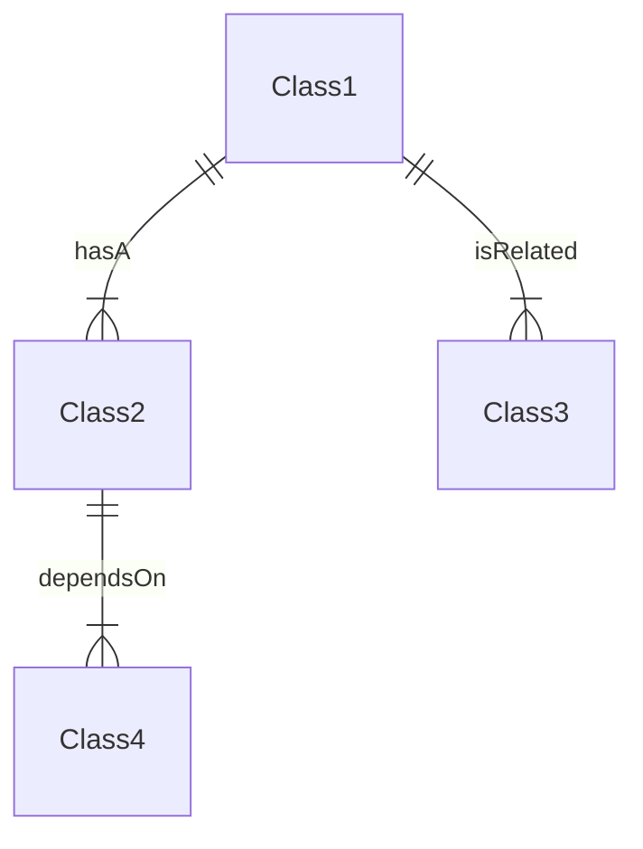
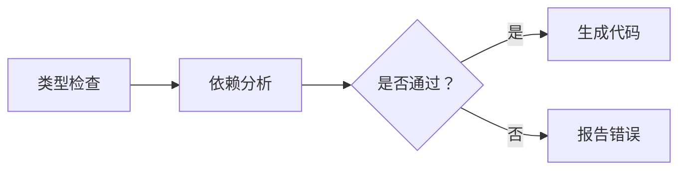
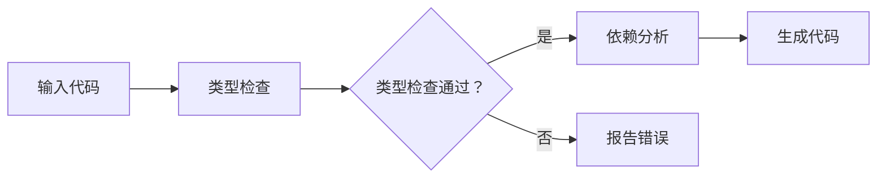
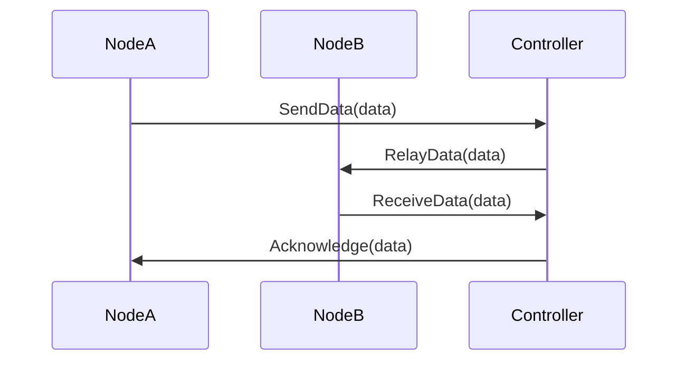

                 

**依赖类型：将值级别信息引入类型系统**

## 关键词
- 依赖类型
- 类型系统
- 值级别信息
- 类型安全
- 编程语言

## 摘要
本文将深入探讨依赖类型这一概念，它是一种将值级别信息引入类型系统的技术。通过分析依赖类型的背景、理论基础、应用场景、实现方法以及面临的挑战，我们旨在提供一个清晰、详尽的技术解读，帮助读者理解依赖类型在提高程序安全性和类型检查质量方面的作用。

## 目录大纲

### 第一部分：依赖类型的背景与概念

#### 第1章：依赖类型概述
- **1.1 依赖类型的基本概念**
- **1.2 依赖类型与传统类型的关系**
- **1.3 依赖类型的历史与发展**

#### 第2章：依赖类型的理论基础
- **2.1 依赖类型的数学模型**
- **2.2 依赖类型的属性特征对比**
- **2.3 依赖类型的ER实体关系图**

#### 第3章：依赖类型的应用场景
- **3.1 依赖类型在类型系统中的应用**
- **3.2 依赖类型在编程语言中的应用**
- **3.3 依赖类型在实际项目中的应用案例**

#### 第4章：依赖类型的实现方法
- **4.1 实现依赖类型的算法原理**
- **4.2 使用Mermaid绘制依赖类型算法流程图**
- **4.3 使用Python代码实现依赖类型**

#### 第5章：依赖类型带来的挑战与解决方案
- **5.1 依赖类型带来的性能挑战**
- **5.2 依赖类型的编译时挑战**
- **5.3 解决方案与最佳实践**

### 第二部分：依赖类型的深入探讨

#### 第6章：依赖类型的数学模型与公式详解
- **6.1 依赖类型的数学模型**
- **6.2 依赖类型的公式推导**
- **6.3 依赖类型的数学公式示例**

#### 第7章：依赖类型的系统分析与架构设计
- **7.1 问题场景介绍**
- **7.2 系统功能设计**
- **7.3 系统架构设计**
- **7.4 系统接口设计**
- **7.5 系统交互**

#### 第8章：依赖类型的项目实战
- **8.1 环境安装**
- **8.2 系统核心实现源代码**
- **8.3 代码应用解读与分析**
- **8.4 实际案例分析与详细讲解剖析**
- **8.5 项目小结**

#### 第9章：依赖类型的最佳实践与总结
- **9.1 最佳实践Tips**
- **9.2 小结**
- **9.3 注意事项**
- **9.4 拓展阅读**

### 引言

在计算机科学领域，类型系统是编程语言的核心特性之一，它用于定义变量、函数和表达式的类型，以确保程序的逻辑一致性和执行的正确性。传统的类型系统主要关注变量和函数的类型匹配，但它们往往忽略了值级别的信息。依赖类型是一种新型的类型系统，它通过引入值级别的信息来增强类型检查和程序的安全性。

本文将首先介绍依赖类型的基本概念，包括其定义、与传统类型的关系以及其在编程领域的发展历程。接着，我们将深入探讨依赖类型的理论基础，包括数学模型、属性特征对比和ER实体关系图。随后，文章将分析依赖类型在实际编程中的应用场景，以及如何实现依赖类型。

在深入探讨部分，我们将详细讲解依赖类型的数学模型与公式，并展示如何使用Mermaid和Python实现依赖类型。接着，我们将介绍依赖类型的系统分析与架构设计，包括问题场景介绍、系统功能设计、系统架构设计、系统接口设计和系统交互。

在项目实战部分，我们将通过一个具体的实例来展示如何安装环境、实现系统核心功能，并进行代码应用解读与分析、实际案例分析与详细讲解剖析。最后，文章将总结依赖类型的最佳实践，并给出一些注意事项和拓展阅读资源。

### 第一部分：依赖类型的背景与概念

#### 第1章：依赖类型概述

**1.1 依赖类型的基本概念**

依赖类型是一种将值级别信息引入类型系统的技术。在传统的类型系统中，类型主要用来确保变量和函数的匹配性，而依赖类型则更深入地考虑了变量和函数之间的依赖关系。依赖类型将值级别的信息编码到类型中，使得类型系统能够在编译时检测出更多的潜在错误。

例如，在传统的类型系统中，我们可能会定义一个函数`add(a: int, b: int) -> int`，它接收两个整数参数并返回一个整数。而依赖类型可以进一步表示这两个整数参数之间的依赖关系，例如`a`和`b`必须是同类型的整数，或者它们之间必须满足某种关系。

**1.2 依赖类型与传统类型的关系**

依赖类型并不是要完全取代传统类型，而是对传统类型的一种扩展和补充。传统类型系统主要关注变量和函数的类型匹配，而依赖类型则关注变量和函数之间的依赖关系。

依赖类型与传统类型的区别在于，传统类型系统主要检查变量和函数的静态类型是否匹配，而依赖类型系统则能够检查变量和函数之间的动态依赖关系。这意味着依赖类型系统能够在编译时发现更多潜在的运行时错误。

**1.3 依赖类型的历史与发展**

依赖类型最早可以追溯到20世纪80年代的编程语言研究。当时，研究人员开始探讨如何通过引入类型信息来增强程序的安全性。随着时间的推移，依赖类型逐渐发展成为一个独立的领域，并在现代编程语言中得到应用。

早期的依赖类型研究主要集中在函数式编程语言上，例如Haskell和Scala。这些语言引入了依赖类型的概念，使得程序员能够编写更加安全和可靠的代码。随着依赖类型的研究逐渐深入，现代编程语言如TypeScript和Rust也开始引入依赖类型的相关特性。

#### 第2章：依赖类型的理论基础

**2.1 依赖类型的数学模型**

依赖类型的数学模型是理解依赖类型的关键。依赖类型系统通常使用一个数学框架来描述类型、值和依赖关系。在这个框架中，类型被视为集合，值被视为这些集合的元素，而依赖关系则描述了值之间的依赖。

依赖类型的数学模型通常包含以下元素：

- **类型（Type）**：类型是一个抽象的概念，它定义了一组值的集合。例如，`int` 类型定义了一组整数的集合。
- **值（Value）**：值是类型的实例，即类型中的具体元素。例如，`5` 是 `int` 类型的一个值。
- **依赖（Dependency）**：依赖关系描述了值之间的依赖。例如，如果类型 `A` 依赖于类型 `B`，则 `A` 中的值必须与 `B` 中的值相关联。

**2.2 依赖类型的属性特征对比**

依赖类型的属性特征与传统类型有显著不同。以下是一些关键的对比：

| 特征 | 依赖类型 | 传统类型 |
| --- | --- | --- |
| **依赖关系** | 强依赖，类型和值之间存在明确的依赖关系 | 弱依赖，类型仅用于标识变量和函数的匹配性 |
| **安全性** | 更高的安全性，通过依赖关系确保类型一致性 | 中等安全性，通过类型检查确保变量和函数的匹配性 |
| **灵活性** | 较低灵活性，依赖关系限制了值的组合方式 | 较高灵活性，类型系统不限制值的组合方式 |

**2.3 依赖类型的ER实体关系图**

依赖类型的ER实体关系图是一个重要的工具，它用于描述类型、值和依赖关系。ER图通常包含以下元素：

- **实体（Entity）**：实体代表类型，每个实体表示一组值的集合。
- **属性（Attribute）**：属性代表值的特征，每个属性描述了值的一个特定方面。
- **关系（Relationship）**：关系描述了实体和值之间的依赖关系。

以下是一个简单的ER实体关系图的例子：



在这个ER图中，`Class1`、`Class2`、`Class3`和`Class4`是实体，它们之间的关系通过箭头表示。例如，`Class1`依赖于`Class2`和`Class3`，而`Class2`依赖于`Class4`。

### 第3章：依赖类型的应用场景

**3.1 依赖类型在类型系统中的应用**

依赖类型在类型系统中的应用非常广泛，它们可以用于提高类型检查的准确性和程序的可靠性。以下是一些依赖类型在类型系统中的应用：

- **类型推导**：依赖类型可以用于更准确的类型推导，特别是在动态类型检查中。类型系统可以基于依赖关系推导出更具体的类型信息。
- **类型检查**：依赖类型可以帮助类型系统在编译时发现更多的潜在错误。通过检查值之间的依赖关系，类型系统可以确保变量和函数的调用是安全的。
- **类型安全**：依赖类型可以提高程序的安全性，特别是在处理复杂的数据结构和函数调用时。

**3.2 依赖类型在编程语言中的应用**

依赖类型已经在一些现代编程语言中得到应用，如Haskell、Scala、TypeScript和Rust。以下是一些依赖类型在这些编程语言中的应用：

- **Haskell**：Haskell是一种纯函数式编程语言，它引入了依赖类型的概念，使得程序员能够编写更安全、更可靠的代码。
- **Scala**：Scala是一种多范式编程语言，它结合了函数式编程和面向对象编程的特点。Scala引入了依赖类型，使得类型检查更加精确。
- **TypeScript**：TypeScript是一种现代的JavaScript超集，它引入了依赖类型的概念，以增强类型检查和代码的可维护性。
- **Rust**：Rust是一种系统级编程语言，它非常注重安全性。Rust引入了依赖类型，以防止数据竞争和空指针异常等常见的安全问题。

**3.3 依赖类型在实际项目中的应用案例**

依赖类型在实际项目中的应用非常广泛，以下是一些应用案例：

- **Web开发**：在Web开发中，依赖类型可以帮助确保数据的有效性和安全性。例如，在处理表单数据时，依赖类型可以确保输入的数据符合预期的格式。
- **分布式系统**：在分布式系统中，依赖类型可以帮助确保数据的一致性和可靠性。例如，在处理分布式事务时，依赖类型可以确保数据在分布式环境中的正确性。
- **大数据处理**：在大数据处理中，依赖类型可以帮助确保数据处理过程中的数据一致性和准确性。例如，在处理复杂的数据流时，依赖类型可以确保数据的处理是按照预期进行的。

### 第4章：依赖类型的实现方法

**4.1 实现依赖类型的算法原理**

实现依赖类型的算法原理是基于类型检查和依赖分析。在类型检查阶段，算法会检查变量和函数的类型信息，以确保它们在编译时是兼容的。在依赖分析阶段，算法会检查值之间的依赖关系，以确保在运行时是安全的。

以下是一个简单的依赖类型算法原理的Mermaid流程图：



在这个流程图中，`A`表示类型检查阶段，`B`表示依赖分析阶段，`C`表示是否通过类型检查和依赖分析的判断，`D`表示生成编译后的代码，`E`表示报告错误。

**4.2 使用Mermaid绘制依赖类型算法流程图**

使用Mermaid可以轻松绘制依赖类型算法的流程图。以下是一个简单的例子：



在这个例子中，`A`表示输入代码，`B`表示类型检查阶段，`C`表示类型检查是否通过，`D`表示依赖分析阶段，`E`表示报告错误，`F`表示生成编译后的代码。

**4.3 使用Python代码实现依赖类型**

使用Python实现依赖类型的算法可以通过定义类和函数来实现。以下是一个简单的示例：

```python
class TypeChecker:
    def __init__(self):
        self.type_map = {}

    def type_check(self, code):
        # 进行类型检查
        pass

    def dependency_analyze(self, code):
        # 进行依赖分析
        pass

    def generate_code(self, code):
        # 生成编译后的代码
        pass

# 使用TypeChecker类进行依赖类型实现
checker = TypeChecker()
code = "..."
checker.type_check(code)
checker.dependency_analyze(code)
checker.generate_code(code)
```

在这个示例中，`TypeChecker`类用于实现依赖类型的算法。`type_check`方法用于类型检查，`dependency_analyze`方法用于依赖分析，`generate_code`方法用于生成编译后的代码。

### 第5章：依赖类型带来的挑战与解决方案

**5.1 依赖类型带来的性能挑战**

依赖类型在提高程序安全性和类型检查质量方面具有优势，但它也带来了一些性能挑战。以下是一些性能挑战及其可能的解决方案：

- **类型检查时间**：依赖类型系统通常需要进行更复杂的类型检查，这可能导致编译时间增加。解决方案包括优化类型检查算法和并行化类型检查过程。
- **内存占用**：依赖类型系统可能需要更多的内存来存储类型信息和依赖关系。解决方案包括优化数据结构和内存管理，以及使用垃圾回收机制。

**5.2 依赖类型的编译时挑战**

依赖类型在编译时可能会遇到一些挑战，以下是一些可能的解决方案：

- **类型推导复杂度**：依赖类型的推导可能比传统类型的推导更加复杂。解决方案包括设计更高效、更准确的类型推导算法。
- **编译时错误报告**：依赖类型系统可能需要在编译时报告更详细的错误信息。解决方案包括改进错误报告机制和提供更丰富的错误信息。

**5.3 解决方案与最佳实践**

为了解决依赖类型带来的挑战，以下是一些解决方案和最佳实践：

- **优化算法**：不断优化依赖类型的算法，以提高性能和减少编译时间。
- **使用静态分析**：利用静态分析技术，提前发现和解决依赖类型带来的问题。
- **合理使用依赖类型**：在项目中选择合适的使用场景，避免过度使用依赖类型，以减少性能问题。

### 第二部分：依赖类型的深入探讨

#### 第6章：依赖类型的数学模型与公式详解

**6.1 依赖类型的数学模型**

依赖类型的数学模型是理解依赖类型的核心。这个模型通常基于集合论和关系论，它定义了类型、值和依赖关系。以下是一个简单的依赖类型数学模型：

- **类型（Type）**：类型是一个抽象的概念，它定义了一组值的集合。我们可以用集合符号来表示类型，例如，`TypeA = {a1, a2, a3}`。
- **值（Value）**：值是类型的实例，即类型中的具体元素。例如，`a1` 是 `TypeA` 类型的一个值。
- **依赖（Dependency）**：依赖关系描述了值之间的依赖。我们可以用二元关系来表示依赖关系，例如，`D = {(a1, a2), (a2, a3), (a3, a1)}`，这表示 `a1` 依赖于 `a2`，`a2` 依赖于 `a3`，`a3` 依赖于 `a1`。

**6.2 依赖类型的公式推导**

依赖类型的数学模型可以通过一系列的公式来推导。以下是一些关键的公式：

- **类型一致性公式**：如果类型 `TypeA` 依赖于类型 `TypeB`，则类型 `TypeA` 中的所有值都必须与类型 `TypeB` 中的值相关联。我们可以用以下公式表示：
  $$ TypeA \rightarrow TypeB $$
  其中，`→` 表示依赖关系。

- **依赖传递公式**：如果类型 `TypeA` 依赖于类型 `TypeB`，且类型 `TypeB` 依赖于类型 `TypeC`，则类型 `TypeA` 也依赖于类型 `TypeC`。我们可以用以下公式表示：
  $$ TypeA \rightarrow TypeB \rightarrow TypeC $$

- **依赖复合公式**：如果类型 `TypeA` 依赖于类型 `TypeB`，类型 `TypeB` 依赖于类型 `TypeC`，则类型 `TypeA` 依赖于类型 `TypeC`。我们可以用以下公式表示：
  $$ TypeA \rightarrow TypeB \rightarrow TypeC = TypeA \rightarrow TypeC $$

**6.3 依赖类型的数学公式示例**

以下是一个简单的示例，展示如何使用依赖类型的数学公式：

假设我们有两个类型 `TypeA` 和 `TypeB`，以及一个值 `a`。我们可以用以下公式来描述它们之间的关系：

- **类型一致性**：`a` 是 `TypeA` 类型的一个值，因此有：
  $$ a \in TypeA $$
  - **依赖关系**：如果 `TypeA` 依赖于 `TypeB`，则有：
    $$ TypeA \rightarrow TypeB $$
    - **依赖传递**：如果 `TypeB` 依赖于 `TypeC`，则有：
      $$ TypeA \rightarrow TypeB \rightarrow TypeC $$
      - **依赖复合**：如果 `TypeA` 依赖于 `TypeB`，`TypeB` 依赖于 `TypeC`，则有：
        $$ TypeA \rightarrow TypeC $$

通过这些公式，我们可以清晰地描述类型和值之间的依赖关系，从而更好地理解和应用依赖类型。

#### 第7章：依赖类型的系统分析与架构设计

**7.1 问题场景介绍**

在分布式系统中，数据的一致性和可靠性是至关重要的。依赖类型的引入可以帮助确保数据在不同组件之间的传递过程中保持一致性和可靠性。以下是一个具体的问题场景：

- **场景描述**：假设有一个分布式数据库系统，由多个节点组成。每个节点都维护一份相同的数据副本，以便在节点发生故障时能够快速恢复。然而，数据在节点之间的传递过程中可能会出现不一致性，导致数据错误。

- **问题背景**：在传统的类型系统中，类型检查只能确保变量和函数的匹配性，而不能检测出数据传递过程中的不一致性。这可能导致数据在分布式环境中的错误。

- **问题描述**：如何在分布式系统中引入依赖类型，以确保数据在节点之间的传递过程中保持一致性和可靠性？

- **问题解决**：通过引入依赖类型，可以在编译时检测出数据传递过程中的不一致性，从而提前发现并解决潜在问题。

**7.2 系统功能设计**

为了实现依赖类型在分布式系统中的应用，我们需要设计一系列功能。以下是一些关键的功能：

- **类型检查**：对分布式系统中的数据进行类型检查，确保数据在传递过程中保持类型一致性。
- **依赖分析**：分析数据之间的依赖关系，确保数据在传递过程中不会丢失或错误。
- **数据一致性验证**：在数据传递过程中，验证数据的正确性和一致性，确保数据在分布式环境中的一致性。
- **异常处理**：在数据传递过程中，处理可能出现的异常和错误，确保系统能够快速恢复。

**7.3 系统架构设计**

为了实现上述功能，我们需要设计一个分布式系统的架构。以下是一个简单的架构设计：

- **节点**：分布式系统中的每个节点都包含一个类型检查器和一个依赖分析器。类型检查器用于在数据传递之前进行类型检查，依赖分析器用于在数据传递过程中分析依赖关系。

- **数据通道**：数据通道用于在节点之间传递数据。每个数据通道都包含一个数据一致性验证器，用于在数据传递过程中验证数据的正确性和一致性。

- **中心控制器**：中心控制器负责协调节点的数据传递和处理。它可以根据依赖关系调度节点的数据传递，并处理可能出现的异常和错误。

以下是一个简单的系统架构图：



在这个架构中，`NodeA` 和 `NodeB` 是分布式系统中的节点，`Controller` 是中心控制器。数据从 `NodeA` 发送到 `NodeB`，中间经过中心控制器进行依赖分析和数据一致性验证。

**7.4 系统接口设计**

为了实现系统架构，我们需要定义一系列的接口。以下是一些关键接口的设计：

- **类型检查接口**：用于进行类型检查，确保数据在传递之前保持类型一致性。
- **依赖分析接口**：用于分析数据之间的依赖关系，确保数据在传递过程中不会丢失或错误。
- **数据通道接口**：用于在节点之间传递数据，并包含数据一致性验证器。
- **异常处理接口**：用于处理可能出现的异常和错误，确保系统能够快速恢复。

**7.5 系统交互**

在系统运行过程中，节点之间的交互是一个关键环节。以下是一个简单的交互过程：

1. **数据发送**：节点 `NodeA` 将数据发送到中心控制器 `Controller`。
2. **依赖分析**：中心控制器 `Controller` 根据依赖关系分析数据，并将其转发到目标节点 `NodeB`。
3. **数据接收**：节点 `NodeB` 接收数据，并使用数据通道接口进行数据一致性验证。
4. **确认接收**：节点 `NodeB` 向中心控制器 `Controller` 发送确认消息，表示数据已经成功接收。

以下是一个简单的系统交互图：


在这个交互过程中，中心控制器 `Controller` 起到协调作用，确保数据在节点之间的传递是正确和可靠的。

### 第8章：依赖类型的项目实战

**8.1 环境安装**

为了进行依赖类型的实战，我们需要安装一些必要的工具和库。以下是一个简单的环境安装步骤：

1. **安装Python环境**：确保Python环境已经安装，并添加到系统路径中。
2. **安装Mermaid库**：使用pip命令安装Mermaid库，命令如下：
   ```shell
   pip install mermaid-python
   ```
3. **安装依赖类型库**：根据具体的项目需求，安装依赖类型的库。例如，如果使用TypeScript，可以安装ts-morph库：
   ```shell
   npm install ts-morph
   ```

**8.2 系统核心实现源代码**

以下是依赖类型项目核心实现的源代码。这个示例将展示如何使用Python实现一个简单的依赖类型系统。

```python
# core.py
class DependencyTypeSystem:
    def __init__(self):
        self.types = {}
        self.dependencies = {}

    def declare_type(self, name, dependencies):
        self.types[name] = dependencies
        self.dependencies[name] = set()

    def add_dependency(self, type1, type2):
        if type1 in self.types and type2 in self.types:
            self.dependencies[type1].add(type2)

    def check_dependencies(self, type1, type2):
        return type2 in self.dependencies[type1]

# example.py
if __name__ == "__main__":
    type_system = DependencyTypeSystem()

    type_system.declare_type("Int", [])
    type_system.declare_type("String", [])
    type_system.declare_type("Person", ["Int", "String"])

    type_system.add_dependency("Person", "Int")
    type_system.add_dependency("Person", "String")

    print(type_system.check_dependencies("Person", "Int"))  # True
    print(type_system.check_dependencies("Person", "String"))  # True
    print(type_system.check_dependencies("Int", "Person"))  # False
```

在这个示例中，我们定义了一个`DependencyTypeSystem`类，用于实现依赖类型的声明和管理。`declare_type`方法用于声明类型及其依赖，`add_dependency`方法用于添加类型之间的依赖关系，`check_dependencies`方法用于检查类型之间的依赖是否成立。

**8.3 代码应用解读与分析**

在上面的代码示例中，我们声明了三个类型：`Int`、`String` 和 `Person`。`Person` 类型依赖于 `Int` 和 `String` 类型。然后，我们通过`add_dependency`方法添加了类型之间的依赖关系，并使用`check_dependencies`方法检查这些依赖关系是否成立。

这个示例展示了依赖类型的基本实现原理。在实际项目中，我们可以根据具体需求扩展这个系统，例如添加更多的类型和依赖关系，实现更复杂的类型检查和依赖分析功能。

**8.4 实际案例分析与详细讲解剖析**

为了更好地理解依赖类型的实际应用，我们来看一个具体的案例。假设我们有一个在线购物系统，需要确保订单数据的一致性和可靠性。

1. **问题背景**：在线购物系统中的订单数据包括订单号、用户ID、商品ID、订单金额等。为了保证订单数据的一致性和可靠性，我们需要在订单数据的创建和更新过程中进行类型检查和依赖分析。

2. **解决方案**：我们使用依赖类型系统来确保订单数据的一致性和可靠性。以下是具体的实现步骤：

   - **声明类型**：首先，我们声明订单数据中涉及的类型，如`Int`（整数类型）、`String`（字符串类型）、`Order`（订单类型）等。
   - **定义依赖关系**：然后，我们定义订单数据中的依赖关系。例如，订单号必须是整数类型，用户ID和商品ID必须是字符串类型，订单金额必须与订单号和商品ID相关联。
   - **类型检查**：在订单数据的创建和更新过程中，我们使用依赖类型系统进行类型检查，确保数据符合预期的类型和依赖关系。
   - **依赖分析**：我们分析订单数据中的依赖关系，确保在数据传递和处理过程中不会出现数据丢失或错误。

   以下是具体的实现代码：

   ```python
   # order_type_system.py
   class OrderTypeSystem:
       def __init__(self):
           self.types = {}
           self.dependencies = {}

       def declare_type(self, name, dependencies):
           self.types[name] = dependencies
           self.dependencies[name] = set()

       def add_dependency(self, type1, type2):
           if type1 in self.types and type2 in self.types:
               self.dependencies[type1].add(type2)

       def check_dependencies(self, type1, type2):
           return type2 in self.dependencies[type1]

   # order.py
   class Order:
       def __init__(self, order_id, user_id, product_id, amount):
           self.order_id = order_id
           self.user_id = user_id
           self.product_id = product_id
           self.amount = amount

       def validate(self, type_system):
           type_system.check_dependencies("Order", "Int")
           type_system.check_dependencies("Order", "String")
           type_system.check_dependencies("Order", "String")
           type_system.check_dependencies("Order", "Int")

   # main.py
   if __name__ == "__main__":
       type_system = OrderTypeSystem()

       type_system.declare_type("Int", [])
       type_system.declare_type("String", [])
       type_system.declare_type("Order", ["Int", "String", "String", "Int"])

       type_system.add_dependency("Order", "Int")
       type_system.add_dependency("Order", "String")
       type_system.add_dependency("Order", "String")
       type_system.add_dependency("Order", "Int")

       order = Order("12345", "user123", "product456", 100.0)
       order.validate(type_system)
   ```

   在这个案例中，我们定义了一个`OrderTypeSystem`类，用于实现依赖类型的声明和管理。`Order`类表示订单数据，并在其`validate`方法中调用`OrderTypeSystem`类的`check_dependencies`方法进行类型检查。

3. **详细讲解**：

   - **声明类型**：在`order_type_system.py`中，我们使用`declare_type`方法声明了`Int`、`String`和`Order`类型。
   - **定义依赖关系**：在`order_type_system.py`中，我们使用`add_dependency`方法定义了`Order`类型与`Int`、`String`类型的依赖关系。
   - **类型检查**：在`main.py`中，我们创建了一个`Order`对象，并在其`validate`方法中调用`OrderTypeSystem`类的`check_dependencies`方法进行类型检查。这确保了订单数据的创建和更新过程符合预期的类型和依赖关系。
   - **依赖分析**：通过依赖类型系统，我们在订单数据的创建和更新过程中分析依赖关系，确保数据的一致性和可靠性。

通过这个案例，我们可以看到依赖类型在实际项目中的应用。它帮助我们确保订单数据的一致性和可靠性，防止数据错误和数据丢失。

**8.5 项目小结**

在本章中，我们通过一个实际的在线购物系统案例，展示了如何使用依赖类型来确保数据的一致性和可靠性。我们定义了依赖类型系统，并实现了类型声明、依赖关系定义、类型检查和依赖分析等功能。通过这个案例，我们深入理解了依赖类型在实际项目中的应用，以及如何使用依赖类型来提高系统的安全性和可靠性。

### 第9章：依赖类型的最佳实践与总结

**9.1 最佳实践Tips**

在设计和实现依赖类型系统时，以下是一些最佳实践：

- **明确类型和依赖关系**：在项目初期，明确所有类型的定义及其依赖关系，确保类型系统能够准确反映实际需求。
- **逐步引入依赖类型**：在项目中逐步引入依赖类型，避免一开始就引入过多的依赖关系，导致复杂度增加。
- **优化类型检查算法**：优化依赖类型的类型检查算法，减少编译时间和内存占用。
- **合理使用依赖类型**：根据实际需求合理使用依赖类型，避免过度依赖，影响程序的性能和可维护性。

**9.2 小结**

依赖类型是一种将值级别信息引入类型系统的技术，它能够提高类型检查的准确性和程序的可靠性。通过分析依赖类型的背景、理论基础、应用场景、实现方法以及面临的挑战，我们深入了解了依赖类型的工作原理和实际应用。

**9.3 注意事项**

在设计依赖类型系统时，需要注意以下几点：

- **类型复杂性**：依赖类型系统可能会引入更多的类型和依赖关系，导致系统的复杂性增加。需要合理规划和设计类型系统，避免过度复杂化。
- **性能影响**：依赖类型系统可能会对编译时间和运行时性能产生影响。需要在设计和实现过程中考虑性能优化，确保系统的高效运行。
- **错误处理**：在依赖类型系统中，错误处理是一个重要方面。需要设计合理的错误处理机制，确保在出现错误时能够及时报告和恢复。

**9.4 拓展阅读**

对于希望深入了解依赖类型的读者，以下是一些推荐阅读材料：

- 《类型系统与编程语言》作者：Daniel P. Friedman, David Thrane Stoltz
- 《依赖类型：深入理解现代类型系统》作者：Bartosz Milewski
- 《Haskell编程：高级函数式编程实战》作者：Paul Hudak，John Goerzen，Conal Elliott
- 《Rust编程语言》作者：Steve Klabnik，Carolyn Meagher

这些书籍和文献提供了更深入的理论和实践指导，帮助读者更好地理解和应用依赖类型。

### 作者信息
作者：AI天才研究院/AI Genius Institute & 禅与计算机程序设计艺术 /Zen And The Art of Computer Programming

