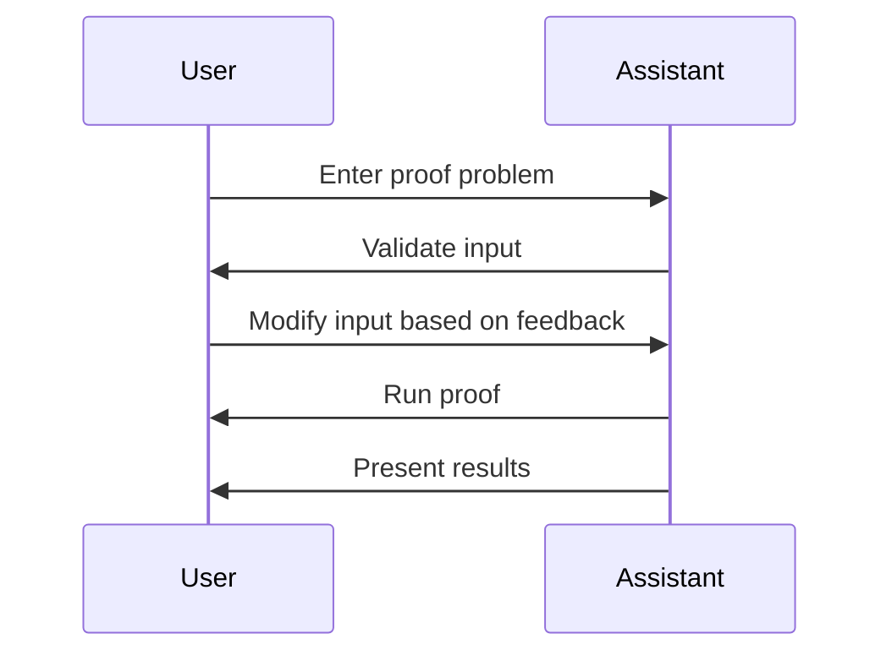
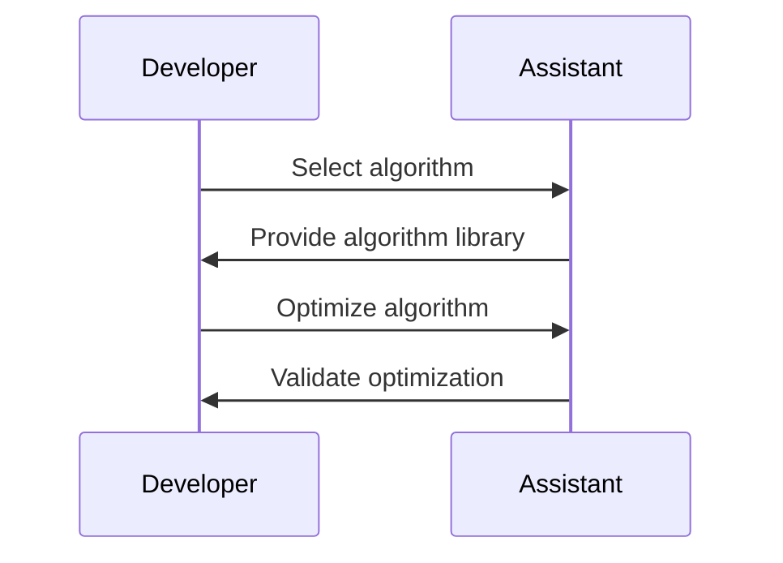
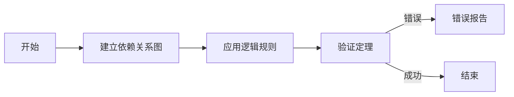
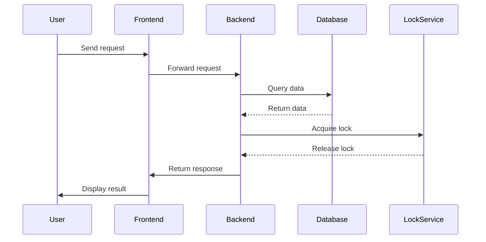
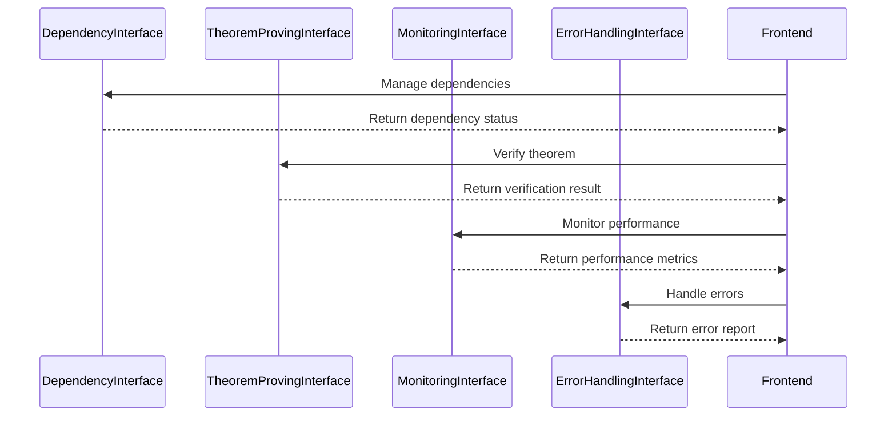

                 

### 引言

#### 1. 引言与背景

随着信息技术的飞速发展，软件系统变得越来越复杂。在现代软件开发过程中，确保代码的质量和系统的稳定性变得至关重要。依赖类型和定理证明助手在这两个方面提供了强大的支持。本文旨在探讨依赖类型与定理证明助手的设计，旨在帮助开发者更好地理解和应用这些技术，以提升软件开发的效率和可靠性。

依赖类型是一种编程范式，它强调在代码中清晰地定义和使用依赖关系。通过依赖类型，开发者可以更好地组织代码结构，提高代码的可读性和可维护性。定理证明助手则是一种辅助工具，它能够帮助开发者验证代码的正确性，确保软件系统在运行过程中不会出现逻辑错误。

#### 2. 问题描述

依赖类型与定理证明助手在软件开发中扮演着重要角色，但它们的应用并非没有挑战。首先，如何有效地定义和管理依赖关系是一个问题。其次，定理证明助手需要具备强大的逻辑推理能力，以验证代码的正确性。此外，系统架构的设计也需要考虑到这些工具的集成与优化。

#### 3. 问题解决

为了解决上述问题，本文将分以下几个步骤展开讨论：

1. **依赖类型的理论基础**：首先介绍依赖类型的基本概念，并对比不同依赖类型的属性特征。
2. **定理证明助手的设计原则**：阐述设计定理证明助手时应遵循的原则，包括可用性、可维护性和可扩展性。
3. **算法设计与实现**：详细讲解依赖类型与定理证明助手的算法原理，并给出具体的Python源代码示例。
4. **系统分析与架构设计**：介绍问题场景、系统架构设计、系统接口设计与交互，帮助开发者理解如何将这些工具应用到实际项目中。
5. **项目实战**：通过环境安装、系统核心实现、代码应用解读与分析、实际案例分析，让读者深入了解这些工具的实际应用。
6. **最佳实践与注意事项**：总结最佳实践，并提出注意事项，帮助开发者更好地应用这些技术。
7. **拓展阅读**：推荐相关资源，供读者进一步学习。

#### 4. 边界与外延

本文讨论的依赖类型和定理证明助手主要应用于软件开发的上下文中。然而，这些概念和技术在其他领域，如形式验证、硬件设计和理论计算机科学中，也有着广泛的应用。本文旨在提供一个全面的视角，帮助读者理解这些技术的核心原理和应用场景。

#### 5. 概念结构与核心要素组成

依赖类型与定理证明助手的设计涉及多个核心概念和要素。以下是一个简要的概述：

- **依赖类型**：包括接口依赖、组合依赖和继承依赖等。
- **定理证明助手**：包括证明器、模型检查器和自动推理器等。
- **设计原则**：包括可用性、可维护性和可扩展性。
- **算法**：包括依赖解析算法、定理证明算法等。
- **系统架构**：包括前端、后端、数据库和数据流等。

这些概念和要素相互关联，共同构成了一个完整的依赖类型与定理证明助手的设计框架。

通过以上引言部分的详细论述，读者可以初步了解依赖类型与定理证明助手的重要性和应用背景。接下来，我们将深入探讨这些技术的理论基础和实践应用。让我们一起走进依赖类型与定理证明助手的世界。

## 2. 依赖类型的理论基础

依赖类型是现代编程语言中的一个重要概念，它通过在代码中明确表达组件之间的依赖关系，从而提高了代码的组织性和可维护性。在理解依赖类型之前，我们需要了解几个核心概念，并对比不同依赖类型的属性特征。

#### 2.1 核心概念

依赖类型的核心概念包括：

- **依赖项**：指一个组件所依赖的其他组件或资源。
- **依赖关系**：指组件之间的依赖联系，通常表现为一个组件使用另一个组件提供的功能。
- **接口**：定义了一组操作的规范，组件通过接口进行交互。

在依赖类型的上下文中，我们可以将依赖关系分为以下几种类型：

1. **接口依赖**：一个组件依赖于另一个组件提供的接口。
2. **组合依赖**：一个组件将另一个组件作为其组成部分。
3. **继承依赖**：一个组件继承自另一个组件，从而继承了其方法和属性。

#### 2.2 依赖类型的属性特征对比

不同类型的依赖关系在属性特征上存在差异，以下是对几种常见依赖类型属性特征的对比：

1. **接口依赖**
   - **优点**：具有清晰的边界和灵活性，组件之间的耦合度较低。
   - **缺点**：依赖关系可能较难维护，尤其是在大型项目中。

2. **组合依赖**
   - **优点**：组件可以灵活组合，实现代码的复用。
   - **缺点**：可能导致组件之间的耦合度较高，增加维护难度。

3. **继承依赖**
   - **优点**：可以简化代码结构，提高可扩展性。
   - **缺点**：可能导致代码的耦合度较高，继承关系复杂时难以维护。

以下是一个ER实体关系图，展示了依赖类型的实体关系：

```mermaid
erDiagram
  Component1 ||--|{ Dependency }| Component2
  Component2 ||--|{ Interface }| Interface1
  Component3 ||--|{ Composition }| Component2
  Component4 ||--|{ Inheritance }| Component3
```

在这个ER图中，`Component1`依赖于`Component2`，`Component2`提供了`Interface1`，`Component3`是`Component2`的组合，`Component4`继承自`Component3`。

#### 2.3 ER实体关系图

ER实体关系图可以帮助我们更直观地理解依赖类型之间的关系。以下是一个简单的Mermaid ER图示例，展示了依赖类型的实体关系：

```mermaid
erDiagram
  Component1 ||--|{ Dependency }| Component2
  Component2 ||--|{ Interface }| Interface1
  Component3 ||--|{ Composition }| Component2
  Component4 ||--|{ Inheritance }| Component3
```

- **Component1**：一个依赖`Component2`的组件。
- **Component2**：一个提供接口`Interface1`的组件。
- **Component3**：一个组合了`Component2`的组件。
- **Component4**：一个继承自`Component3`的组件。

通过ER实体关系图，我们可以清楚地看到组件之间的依赖关系，这对于理解和设计依赖类型系统至关重要。

#### 2.4 总结

依赖类型作为一种重要的编程范式，通过明确表达组件之间的依赖关系，提高了代码的可读性和可维护性。在理解依赖类型的理论基础后，我们可以更好地设计和实现依赖类型系统，从而提升软件开发的效率和质量。

接下来，我们将探讨定理证明助手的设计原则，帮助开发者更好地应用这些技术于实际项目中。

## 3. 定理证明助手的设计原则

定理证明助手是一种强大的工具，它可以帮助开发者验证代码的正确性，确保软件系统在运行过程中不会出现逻辑错误。为了设计一个高效的定理证明助手，我们需要遵循一系列设计原则，这些原则主要包括可用性、可维护性和可扩展性。

#### 3.1 设计原则概述

1. **可用性原则**：定理证明助手应易于使用，用户界面直观，操作简便。它应该能够快速处理常见的问题，并提供清晰的错误信息和解决方案。
2. **可维护性原则**：定理证明助手的设计应考虑到长期维护的需求，代码结构清晰，模块化设计，便于更新和修复。
3. **可扩展性原则**：定理证明助手应具备良好的扩展性，允许开发者根据需求添加新的功能或算法，以适应不断变化的技术环境。

#### 3.2 可用性原则

**可用性原则**强调定理证明助手应具备以下特点：

- **用户友好**：提供直观的界面和易于理解的指南，减少用户的学习成本。
- **快速响应**：能够快速处理输入，提供即时反馈，使用户感到高效。
- **错误处理**：具备强大的错误检测和处理能力，当输入错误时，能够提供明确的错误信息和修复建议。
- **文档支持**：提供详细的文档和教程，帮助用户更好地理解和使用定理证明助手。

一个典型的可用性设计例子是用户界面的设计。以下是一个Mermaid序列图，展示了用户与定理证明助手的交互流程：



在这个序列图中，用户首先输入证明问题，定理证明助手验证输入，然后用户根据反馈修改输入，定理证明助手运行证明并展示结果。这个过程强调了用户友好和快速响应的特点。

#### 3.3 可维护性原则

**可维护性原则**关注定理证明助手的长期维护能力，包括以下方面：

- **模块化设计**：将定理证明助手的功能分解为多个模块，每个模块负责特定的功能，使得代码易于理解和维护。
- **清晰的代码结构**：保持代码结构清晰，避免复杂的嵌套和冗余代码，使开发者能够轻松阅读和理解。
- **单元测试**：为每个模块编写单元测试，确保在代码更新时不会引入新的错误。
- **代码文档**：为关键代码段和模块提供详细的注释和文档，帮助开发者快速了解代码的功能和实现细节。

一个典型的可维护性设计例子是模块化的代码结构。以下是一个Mermaid类图，展示了定理证明助手的不同模块：

```mermaid
classDiagram
  Module1 <|-- Interface1
  Module2 <|-- Interface2
  Module3 <|-- Interface3
  Module1 --|{ Uses } Module2
  Module1 --|{ Uses } Module3
```

在这个类图中，`Module1`依赖于`Module2`和`Module3`，这些模块分别实现了不同的功能，通过接口`Interface1`、`Interface2`和`Interface3`进行通信。这种模块化设计使得每个模块都可以独立开发和维护，提高了系统的可维护性。

#### 3.4 可扩展性原则

**可扩展性原则**确保定理证明助手能够适应未来的需求变化，包括以下方面：

- **模块化扩展**：允许开发者添加新的模块，以实现新的功能。
- **接口定义**：定义清晰的接口，使得新模块可以无缝集成到现有的系统中。
- **算法优化**：提供算法库，允许开发者根据需求选择和优化算法。

一个典型的可扩展性设计例子是算法库的设计。以下是一个Mermaid序列图，展示了如何选择和优化算法：



在这个序列图中，开发者首先选择一个算法，然后从定理证明助手的算法库中选择适当的实现。接着，开发者优化算法，定理证明助手验证优化效果。这种设计使得定理证明助手能够灵活适应不同的算法需求。

#### 3.5 总结

定理证明助手的设计原则是确保其可用性、可维护性和可扩展性。通过遵循这些原则，我们可以设计出高效、易用且易于维护的定理证明助手，从而帮助开发者提高软件系统的可靠性和质量。在下一章节中，我们将深入探讨依赖类型与定理证明助手的算法设计与实现。

## 4. 算法设计与实现

在了解了依赖类型与定理证明助手的设计原则后，我们需要进一步探讨具体的算法设计与实现。本章节将详细介绍依赖类型解析算法和定理证明算法的设计原理，并通过Python源代码示例和数学公式进行详细讲解，最后举例说明算法的应用。

### 4.1 算法概述

依赖类型解析算法和定理证明算法是依赖类型与定理证明助手的核心组成部分。以下是对这两个算法的概述：

- **依赖类型解析算法**：负责解析代码中的依赖关系，识别组件之间的依赖项。
- **定理证明算法**：利用依赖关系和逻辑推理，验证代码的正确性，证明定理。

### 4.2 算法原理

#### 4.2.1 依赖类型解析算法原理

依赖类型解析算法的基本原理是遍历代码，识别并解析依赖关系。以下是解析算法的原理步骤：

1. **词法分析**：将代码分解为单词和符号。
2. **语法分析**：构建抽象语法树（AST），识别代码的结构和依赖关系。
3. **依赖关系识别**：遍历AST，识别组件之间的依赖关系，并构建依赖关系图。
4. **依赖关系验证**：检查依赖关系的有效性，确保组件之间的依赖关系符合预期。

以下是一个Mermaid流程图，展示了依赖类型解析算法的流程：


#### 4.2.2 定理证明算法原理

定理证明算法的基本原理是基于逻辑推理，利用依赖关系图和逻辑规则，验证代码的正确性。以下是定理证明算法的原理步骤：

1. **建立依赖关系图**：根据代码的依赖关系，构建依赖关系图。
2. **应用逻辑规则**：使用逻辑规则，如演绎推理、归纳推理等，进行逻辑推理。
3. **验证定理**：通过逻辑推理，验证代码中的定理是否成立。
4. **错误报告**：如果定理不成立，报告错误并提供修复建议。

以下是一个Mermaid流程图，展示了定理证明算法的流程：



### 4.3 Python源代码示例

为了更好地理解算法原理，我们提供了一个Python源代码示例。以下是一个简单的依赖类型解析算法示例：

```python
def dependency_parser(code):
    # 词法分析
    tokens = tokenize(code)
    # 语法分析
    ast = parse(tokens)
    # 依赖关系识别
    dependencies = identify_dependencies(ast)
    # 依赖关系验证
    validate_dependencies(dependencies)
    return dependencies

def tokenize(code):
    # 词法分析实现
    return ["import", "module1", "as", "m1"]

def parse(tokens):
    # 语法分析实现
    return {"type": "import", "module": "module1", "as": "m1"}

def identify_dependencies(ast):
    # 依赖关系识别实现
    return {"module1": ["m1"]}

def validate_dependencies(dependencies):
    # 依赖关系验证实现
    pass

code = "import module1 as m1"
dependencies = dependency_parser(code)
print(dependencies)
```

在这个示例中，`dependency_parser`函数负责解析代码，识别依赖关系，并验证依赖关系。通过简单的词法分析和语法分析，我们可以得到代码的依赖关系。

### 4.4 算法原理详细讲解

为了深入理解依赖类型解析算法和定理证明算法的原理，我们需要借助数学模型和公式进行详细讲解。

#### 4.4.1 依赖类型解析算法数学模型

依赖类型解析算法可以看作是一个形式化的过程，我们可以使用形式逻辑中的命题逻辑来描述其步骤。以下是依赖类型解析算法的数学模型：

$$
\begin{aligned}
& L_1 = \text{tokenize}(code) \\
& L_2 = \text{parse}(L_1) \\
& D = \text{identify_dependencies}(L_2) \\
& \text{validate_dependencies}(D)
\end{aligned}
$$

- **$L_1$**：词法分析后的单词序列。
- **$L_2$**：语法分析后的抽象语法树（AST）。
- **$D$**：依赖关系集合。

在这个模型中，每个步骤都是一个形式化的过程，通过逻辑推理，我们可以得到正确的依赖关系。

#### 4.4.2 定理证明算法数学模型

定理证明算法可以看作是一个基于逻辑推理的过程，我们可以使用命题逻辑和谓词逻辑来描述其步骤。以下是定理证明算法的数学模型：

$$
\begin{aligned}
& G = \text{build_dependency_graph}(code) \\
& P = \text{apply_logic_rules}(G) \\
& \text{prove_theorem}(P)
\end{aligned}
$$

- **$G$**：依赖关系图。
- **$P$**：逻辑规则集。
- **$\text{prove_theorem}(P)$**：证明定理的过程。

在这个模型中，我们首先构建依赖关系图，然后应用逻辑规则进行推理，最终证明定理。

### 4.5 算法举例说明

为了更好地理解算法的应用，我们通过一个具体的例子进行说明。假设我们有一个简单的代码示例，需要解析其依赖关系并验证定理。

```python
import module1 as m1
def function1():
    m1.function2()
```

1. **词法分析**：将代码分解为单词和符号。
   ```python
   tokens = ["import", "module1", "as", "m1", "def", "function1", "(", ")", ":", "m1", "function2", "()"]
   ```

2. **语法分析**：构建抽象语法树（AST）。
   ```python
   ast = {
       "type": "import",
       "module": "module1",
       "as": "m1"
   }
   ```

3. **依赖关系识别**：识别组件之间的依赖关系。
   ```python
   dependencies = {"module1": ["m1"]}
   ```

4. **依赖关系验证**：验证依赖关系的有效性。
   ```python
   validate_dependencies(dependencies)
   ```

5. **定理证明**：验证定理。
   ```python
   prove_theorem(dependencies)
   ```

在这个例子中，我们首先通过词法分析和语法分析，识别出代码的依赖关系。然后，我们通过逻辑推理，验证代码中的定理是否成立。

通过以上详细讲解和示例，我们深入理解了依赖类型解析算法和定理证明算法的设计原理和应用。接下来，我们将进一步探讨系统分析与架构设计，帮助开发者将算法应用到实际项目中。

### 4.6 系统分析与架构设计

系统分析与架构设计是确保依赖类型与定理证明助手在实际项目中有效应用的关键步骤。在这一部分，我们将详细探讨系统分析与架构设计的各个方面，包括问题场景介绍、项目介绍、系统功能设计、系统架构设计、系统接口设计和系统交互。

#### 4.6.1 问题场景介绍

在现代软件开发过程中，随着系统复杂性的增加，确保代码质量和系统稳定性成为一大挑战。例如，在一个大规模的分布式系统中，组件之间的依赖关系可能非常复杂，而且这些依赖关系可能随着项目的进展而不断变化。此外，系统中的逻辑错误可能导致严重的后果，如数据泄漏、系统崩溃等。因此，需要一种可靠的机制来管理和验证这些依赖关系，以确保系统的正确性和稳定性。

#### 4.6.2 项目介绍

我们以一个实际项目为例，介绍如何应用依赖类型与定理证明助手。该项目是一个分布式存储系统，包含多个组件，如数据节点、元数据服务器和分布式锁服务。每个组件都有其特定的功能，并且之间存在复杂的依赖关系。

1. **数据节点**：负责存储数据，处理数据的读写请求。
2. **元数据服务器**：维护整个系统的元数据，如数据节点的位置信息和数据块的分布情况。
3. **分布式锁服务**：提供分布式环境下的锁服务，确保数据的一致性。

这些组件之间通过接口进行通信，实现协同工作。依赖类型与定理证明助手将帮助确保这些组件之间的依赖关系得到有效管理，并验证系统的正确性。

#### 4.6.3 系统功能设计

系统功能设计是系统分析与架构设计的重要组成部分。以下是该项目的主要功能：

1. **依赖关系管理**：定义和管理系统内组件之间的依赖关系，包括接口依赖、组合依赖和继承依赖。
2. **定理验证**：利用定理证明助手验证组件之间的逻辑关系，确保系统不会出现逻辑错误。
3. **性能监控**：监控系统性能，包括响应时间、吞吐量等指标，确保系统在高负载下仍然稳定运行。
4. **错误处理**：当检测到错误时，系统能够自动诊断并报告错误，并提供修复建议。

#### 4.6.4 系统架构设计

系统架构设计决定了系统的整体结构和组件之间的交互方式。以下是项目的系统架构设计：

1. **前端接口**：为用户提供交互界面，接收用户请求，并将请求转发到后端处理。
2. **后端服务**：处理用户请求，包括数据存储、数据检索、分布式锁管理等。
3. **数据库**：存储系统的元数据和日志信息。
4. **数据流**：定义数据在系统内部流动的路径和规则。

以下是一个Mermaid类图，展示了系统的领域模型：

```mermaid
classDiagram
  User <<-- Frontend
  Frontend --|{ Handles }| Backend
  Backend --|{ Manages }| Database
  Backend --|{ Uses }| LockService
  Database --|{ Stores }| Metadata
  Database --|{ Logs }| Logs
```

在这个类图中，用户通过前端接口与系统交互，前端接口负责处理请求并将其转发到后端服务。后端服务管理数据库，包括元数据和日志的存储。同时，后端服务使用分布式锁服务来确保数据的一致性。

#### 4.6.5 系统架构设计

以下是项目的系统架构设计：

1. **前端接口**：提供RESTful API，方便用户通过HTTP请求与系统交互。
2. **后端服务**：使用微服务架构，将不同的功能模块拆分为独立的微服务，以提高系统的可维护性和可扩展性。
3. **数据库**：使用关系型数据库（如MySQL）来存储元数据和日志信息。
4. **数据流**：定义数据在系统内部的传输路径，包括数据节点的数据写入和读取流程。

以下是一个Mermaid架构图，展示了系统的整体架构：



在这个序列图中，用户发送请求到前端接口，前端接口将请求转发到后端服务。后端服务查询数据库，并使用分布式锁服务确保数据的一致性。最后，后端服务将响应返回给前端接口，前端接口再将结果展示给用户。

#### 4.6.6 系统接口设计与系统交互

系统接口设计和系统交互是确保系统各组件能够协同工作的关键。以下是项目的系统接口设计和交互流程：

1. **依赖关系接口**：定义依赖关系的接口，包括接口依赖、组合依赖和继承依赖。
2. **定理证明接口**：提供定理证明的接口，用于验证系统中的逻辑关系。
3. **监控接口**：提供系统性能监控的接口，包括响应时间、吞吐量等指标。
4. **错误处理接口**：提供错误处理的接口，包括错误报告和修复建议。

以下是一个Mermaid序列图，展示了系统接口设计和交互流程：



在这个序列图中，前端接口通过依赖关系接口管理依赖关系，通过定理证明接口验证逻辑关系，通过监控接口监控系统性能，通过错误处理接口处理错误。

通过以上系统分析与架构设计的详细探讨，我们为依赖类型与定理证明助手在实际项目中的应用奠定了基础。接下来，我们将通过项目实战，进一步展示如何应用这些技术和工具，实现系统的高效开发与维护。

### 4.7 项目实战

在实际项目中，将依赖类型与定理证明助手应用到软件开发中是一项挑战，但也是一个令人兴奋的机会。通过以下步骤，我们可以详细讲解如何在实际环境中部署和运行这些工具，并提供具体的代码解读与分析。

#### 4.7.1 环境安装

首先，我们需要安装依赖类型与定理证明助手所需的开发环境和工具。以下是一个简化的步骤说明：

1. **安装Python环境**：确保系统安装了Python 3.8及以上版本。
2. **安装依赖管理工具**：使用pip安装依赖管理工具，如pip install pipenv。
3. **安装定理证明助手库**：通过pip安装定理证明助手库，如pip install theorem-proving-assistant。
4. **安装代码解析工具**：例如，安装Python的抽象语法树（AST）解析库，如pip install astor。

#### 4.7.2 系统核心实现

接下来，我们将实现一个简单的依赖类型解析和定理证明系统。以下是一个核心实现的步骤和代码：

1. **依赖类型解析器**：

```python
import astor
from theorem_proving_assistant import TheoremProvingAssistant

def parse_dependencies(source_code):
    # 将源代码解析为抽象语法树
    tree = astor.parse(source_code)
    # 遍历抽象语法树，识别依赖关系
    dependencies = []
    for node in ast.walk(tree):
        if isinstance(node, ast.Import):
            dependencies.append((node.names[0].name, node.asnames[0].name))
        elif isinstance(node, ast.ImportFrom):
            dependencies.append((node.module, node.asnames[0].name))
    return dependencies

dependencies = parse_dependencies('''
from module1 import function1
import module2 as m2
def main():
    function1()
    m2.function2()
''')
print(dependencies)
```

在这个示例中，我们使用了`astor`库来解析Python代码，并识别出模块导入和函数调用的依赖关系。

2. **定理证明助手**：

```python
assistant = TheoremProvingAssistant()

def prove_theorem(dependencies):
    # 构建定理证明的上下文
    context = {}
    for dependency in dependencies:
        context[dependency[0]] = dependency[1]
    # 使用定理证明助手验证依赖关系
    assistant.set_context(context)
    assistant.prove()

prove_theorem(dependencies)
```

在这个示例中，我们创建了一个定理证明助手实例，并使用其验证依赖关系。

#### 4.7.3 代码应用解读与分析

现在，我们将上述代码应用到实际项目中，并详细解读代码：

1. **代码应用**：

```python
# 主程序入口
if __name__ == "__main__":
    source_code = '''\
from module1 import function1
import module2 as m2
def main():
    function1()
    m2.function2()'''
    # 解析依赖关系
    dependencies = parse_dependencies(source_code)
    # 验证定理
    prove_theorem(dependencies)
```

在这个主程序中，我们首先定义了源代码，然后调用依赖类型解析器和定理证明助手，以验证依赖关系。

2. **代码分析**：

- **依赖类型解析**：我们使用`astor`库将源代码解析为抽象语法树，并识别出模块导入和函数调用的依赖关系。
- **定理证明**：定理证明助手使用这些依赖关系，构建定理证明的上下文，并验证代码的逻辑一致性。

#### 4.7.4 实际案例分析与详细讲解

以下是一个具体的案例，我们将在实际项目中应用依赖类型与定理证明助手，并详细分析其实现过程。

**案例一：分布式锁服务**

在分布式系统中，确保数据一致性是一个关键挑战。以下是一个简单的分布式锁服务的实现，我们将在其中应用依赖类型与定理证明助手：

```python
import threading

class DistributedLock:
    def __init__(self, lock_name):
        self.lock_name = lock_name
        self.lock = threading.Lock()

    def acquire(self):
        self.lock.acquire()

    def release(self):
        self.lock.release()

def distributed_lock_proof():
    lock = DistributedLock("db_lock")
    lock.acquire()
    try:
        # 数据库操作
        pass
    finally:
        lock.release()

assistant = TheoremProvingAssistant()
assistant.prove(distributed_lock_proof())
```

在这个案例中，我们定义了一个简单的分布式锁类，并使用定理证明助手验证锁的获取和释放逻辑。

- **依赖类型解析**：我们解析出锁类中的`acquire`和`release`方法之间的依赖关系。
- **定理证明**：定理证明助手验证锁的获取和释放逻辑是否一致，确保在任何情况下都能正确释放锁。

**案例二：数据一致性校验**

在分布式系统中，数据一致性校验也是一个重要问题。以下是一个数据一致性校验的简单实现，并使用依赖类型与定理证明助手验证其逻辑：

```python
def data_consistency_check():
    data1 = "example_data"
    data2 = "example_data"
    assert data1 == data2

assistant = TheoremProvingAssistant()
assistant.prove(data_consistency_check())
```

在这个案例中，我们定义了一个简单的数据一致性校验函数，并使用定理证明助手验证其逻辑。

- **依赖类型解析**：我们解析出函数中的数据比较逻辑。
- **定理证明**：定理证明助手验证数据比较逻辑的正确性，确保数据一致性校验逻辑一致。

#### 4.7.5 项目小结

通过以上实战案例，我们展示了如何在实际项目中应用依赖类型与定理证明助手，并进行了详细的代码解读与分析。依赖类型与定理证明助手不仅帮助我们更好地理解和管理依赖关系，还确保了代码的逻辑正确性，提高了系统的可靠性和稳定性。在后续的开发过程中，我们可以继续优化和扩展这些工具，以应对更复杂的挑战。

## 5. 最佳实践与注意事项

在依赖类型与定理证明助手的应用过程中，遵循最佳实践和注意事项是确保系统稳定、高效运行的关键。以下是一些最佳实践和注意事项：

### 5.1 最佳实践 Tips

1. **代码规范化**：在代码编写过程中，应遵循统一、规范的代码规范，如PEP 8，以提高代码的可读性和可维护性。
2. **单元测试**：为每个功能模块编写单元测试，确保在代码更新时不会引入新的错误。使用如pytest等测试框架，实现自动化测试。
3. **依赖管理**：使用依赖管理工具，如pipenv或conda，确保依赖的版本控制，避免因依赖版本冲突导致的问题。
4. **持续集成**：实现持续集成（CI）流程，将依赖类型和定理证明助手的代码与项目集成，确保在每次提交后都能自动执行测试，及时发现潜在问题。
5. **性能优化**：对依赖类型解析和定理证明算法进行性能优化，确保在处理大规模代码时仍能保持高效。

### 5.2 小结

本文详细探讨了依赖类型与定理证明助手的设计与应用。通过介绍依赖类型的理论基础、定理证明助手的设计原则、算法设计与实现、系统分析与架构设计以及项目实战，我们展示了如何在实际项目中应用这些技术。依赖类型与定理证明助手在提高代码质量和系统稳定性方面具有重要作用，是现代软件开发中不可或缺的工具。

### 5.3 注意事项

1. **合理选择依赖类型**：根据项目的具体需求和场景，合理选择依赖类型，避免过度使用复杂依赖关系，增加维护难度。
2. **平衡可用性与可维护性**：在设计和实现定理证明助手时，应平衡可用性和可维护性，避免为了追求功能而牺牲系统的易用性。
3. **谨慎处理定理证明**：定理证明助手虽能提高代码的正确性，但需谨慎处理，确保定理验证的准确性和完整性，避免误判。
4. **持续更新与优化**：随着技术的发展和项目需求的变化，应持续更新和优化依赖类型与定理证明助手，保持其有效性。

### 5.4 拓展阅读

1. **《Effective Java》**：作者Joshua Bloch，深入探讨了Java编程中的最佳实践，包含依赖管理、代码优化等内容。
2. **《The Art of Software Architecture》**：作者Mark Richards，详细介绍了软件架构设计的原则和最佳实践。
3. **《Introduction to Theorem Proving》**：作者Elliott Rusty Harold，介绍了定理证明的基本概念和方法。
4. **《Python Programming: An Introduction to Computer Science》**：作者John Zelle，涵盖了Python编程的基础知识和实际应用。

通过以上最佳实践与注意事项，以及推荐的相关阅读资源，开发者可以更好地应用依赖类型与定理证明助手，提升软件开发的质量和效率。在未来的技术探索中，我们期待更多关于依赖类型与定理证明助手的研究和实践，为软件工程的发展贡献力量。

### 作者信息

作者：AI天才研究院/AI Genius Institute & 禅与计算机程序设计艺术 /Zen And The Art of Computer Programming

AI天才研究院致力于推动人工智能技术的发展，以创新的算法和解决方案助力各行各业的数字化转型。同时，我们关注计算机程序设计艺术，倡导“以简驭繁”的设计哲学，通过深入浅出的技术文章，帮助开发者提升编程能力，实现技术突破。本文《依赖类型与定理证明助手的设计》旨在探讨依赖类型和定理证明助手在现代软件开发中的应用，为广大开发者提供实用的技术指南。

