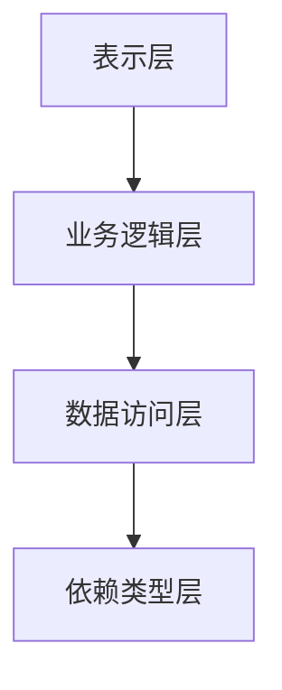
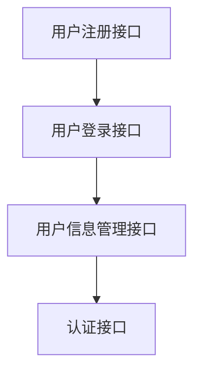
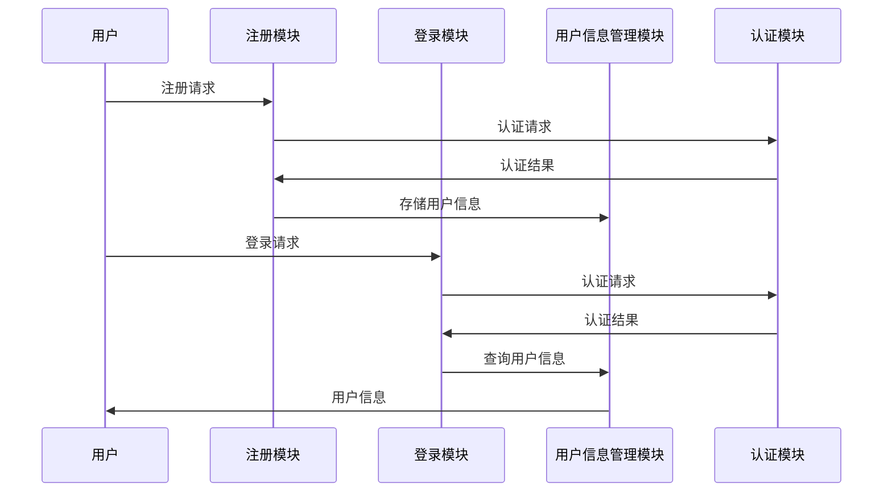

                 

# 依赖类型：提高程序正确性的新方法

## 关键词

依赖类型、程序正确性、类型系统、静态类型检查、函数式编程、编译时间

## 摘要

本文将探讨依赖类型这一编程范式的概念和优势，以及其在提高程序正确性方面的应用。通过详细分析依赖类型的定义、属性特征、与传统类型的对比，我们将深入了解依赖类型在实际编程语言中的应用和挑战。最后，我们将结合具体案例，阐述依赖类型的实现方法和最佳实践。

### 第一部分：背景介绍

#### 1.1.1 问题背景

在计算机科学领域，程序正确性是开发高质量软件的关键因素之一。随着软件系统规模的不断扩大，程序的正确性变得越来越重要。然而，传统的测试和调试方法在应对复杂系统的错误检测时存在显著局限。为了解决这一问题，依赖类型作为一种新型的编程范式被提出，旨在提高程序的正确性。

#### 1.1.2 问题描述

依赖类型通过静态类型检查确保变量在特定时刻具有符合预期的类型，从而减少运行时错误。这种类型检查机制在编译阶段对程序进行严格审查，发现并修复潜在的类型错误。依赖类型能够显著提高程序的正确性，减少调试时间和维护成本。

#### 1.1.3 问题解决

依赖类型通过引入类型依赖关系，使得变量和函数的类型在编译时得到明确。这种严格的类型约束不仅能够检测出运行时错误，还能够防止一些潜在的逻辑错误。通过使用依赖类型，开发人员可以编写更加可靠和可维护的代码。

#### 1.1.4 边界与外延

依赖类型在边界和外部应用方面具有一定的局限性。首先，依赖类型主要适用于函数式编程语言，如Haskell和ML，这些语言具有丰富的静态类型系统。其次，依赖类型在某些复杂场景下可能会增加代码的复杂度和编译时间。

#### 1.1.5 概念结构与核心要素组成

依赖类型的概念结构主要包括以下几个方面：

1. **类型系统**：依赖类型的实现依赖于静态类型系统，通过类型检查确保变量和函数的正确性。
2. **依赖关系**：类型之间的依赖关系描述了变量在特定时刻应具有的类型。
3. **类型检查**：编译器在编译过程中对代码进行类型检查，确保类型依赖关系的正确性。
4. **运行时错误检测**：依赖类型通过在编译时检测类型错误，减少了运行时错误的发生。

### 第一部分：核心概念与联系

#### 1.2.1 依赖类型的定义

依赖类型（Dependent Types）是指类型本身可以依赖于值，从而在类型系统中引入了一种新的类型关系。这种关系使得类型系统可以更严格地约束变量和函数的使用，提高程序的正确性。

#### 1.2.2 依赖类型的属性特征

依赖类型具有以下几个主要属性特征：

| 特征 | 说明 |
| ---- | ---- |
| **严格性** | 依赖类型在编译时对程序进行严格的类型检查，确保变量和函数的使用符合预期类型。 |
| **可表达性** | 依赖类型系统能够表达复杂的类型关系，使得函数和变量之间的类型依赖更加明确。 |
| **抽象性** | 依赖类型通过引入类型依赖关系，提高了代码的抽象程度，使得程序更加可维护。 |

#### 1.2.3 依赖类型与传统类型的对比

依赖类型与传统静态类型存在显著差异。传统静态类型主要通过类型检查确保变量在特定时刻具有符合预期的类型，而依赖类型则通过引入类型依赖关系，使得类型本身可以依赖于值。这种差异使得依赖类型在提高程序正确性方面具有更大的潜力。

### 主流依赖类型语言与工具

#### 1.3.1 Haskell

Haskell 是一种纯函数式编程语言，具有丰富的静态类型系统。Haskell 的依赖类型机制使得类型检查更加严格，提高了程序的正确性。

#### 1.3.2 ML

ML 是一种通用编程语言，广泛应用于依赖类型的理论研究。ML 的依赖类型机制与 Haskell 类似，通过静态类型检查确保程序的正确性。

#### 1.3.3 Coq

Coq 是一种互动式定理证明器，广泛应用于依赖类型的实现和研究。Coq 的依赖类型机制允许开发人员通过形式化验证确保程序的正确性。

### 第一部分：依赖类型在实际应用中的优势与挑战

#### 1.4.1 优势

依赖类型在实际应用中具有以下几个显著优势：

1. **提高程序正确性**：依赖类型通过静态类型检查，减少了运行时错误的发生，提高了程序的正确性。
2. **增强代码可维护性**：依赖类型使得代码更加抽象和模块化，提高了代码的可维护性。
3. **减少调试时间**：依赖类型在编译时检测类型错误，减少了运行时调试的工作量。

#### 1.4.2 挑战

依赖类型在实际应用中也面临一些挑战：

1. **学习成本**：依赖类型的概念较为复杂，对于初学者来说可能具有一定的学习成本。
2. **性能开销**：依赖类型的类型检查机制可能会增加编译时间和代码大小，对性能有一定影响。
3. **适用范围**：依赖类型主要适用于函数式编程语言，在其他编程语言中实现可能面临一定的困难。

### 第一部分：本章小结

本章介绍了依赖类型的基本概念、属性特征以及在实际应用中的优势与挑战。通过了解依赖类型的原理和应用，开发人员可以更好地理解和利用这种新型编程范式，提高程序的正确性和可维护性。接下来，本书将详细介绍依赖类型的实现和应用。

### 第二部分：依赖类型的深入解析

#### 2.1 Haskell中的依赖类型

Haskell作为一种函数式编程语言，其依赖类型系统具有独特的优势。在Haskell中，依赖类型通过类型类（Type Classes）来实现，使得类型本身可以依赖于值。

#### 2.1.1 类型类

类型类是一种抽象的类型，它定义了一组类型必须遵循的接口。在Haskell中，类型类通过类（Class）和类型类实例（Instance）来实现。

- **类**：类定义了一组类型必须遵循的接口，例如`Num`类定义了`+`、`-`、`*`和`/`等操作。
- **类型类实例**：类型类实例实现了特定类型的类接口，例如`Int`类型是`Num`类型的实例。

以下是一个简单的Haskell类型类的示例：

```haskell
class Num a where
  (+) :: a -> a -> a
  (-) :: a -> a -> a
  (*) :: a -> a -> a
  (/) :: a -> a -> a

instance Num Int where
  (+) a b = a + b
  (-) a b = a - b
  (*) a b = a * b
  (/) a b = a / b
```

在这个示例中，`Num`类定义了四个操作，`Int`类型实现了这些操作，因此`Int`是`Num`类型的实例。

#### 2.1.2 依赖类型的应用

依赖类型使得类型本身可以依赖于值，这在Haskell中通过类型类和类型类实例来实现。依赖类型的一个典型应用是泛型编程，即编写可以在不同类型上通用化的函数。

以下是一个使用依赖类型的泛型函数示例：

```haskell
class Ord a => Bounded a where
  minBound :: a
  maxBound :: a

instance Bounded Int where
  minBound = 0
  maxBound = 100

bound :: Bounded a => a -> a -> a
bound a b = max (minBound :: a) (min a b)
```

在这个示例中，`Bounded`类依赖于`Ord`类，确保了实现`Bounded`类型的类型必须支持比较操作。`bound`函数是一个泛型函数，它接受两个`Bounded`类型的参数，并返回一个介于这两个值之间的值。

#### 2.2 ML中的依赖类型

ML是一种广泛用于形式化验证和编程语言理论研究的函数式编程语言。ML的依赖类型系统与Haskell类似，也通过类型类来实现。

#### 2.2.1 ML的类型类

ML中的类型类定义与Haskell类似，也通过类和实例来实现。以下是一个ML类型类的示例：

```ocaml
type num = int | float

class num Ord where
  compare :: num -> num -> int

instance Ord int where
  compare a b = Int.compare a b

instance Ord float where
  compare a b = Real.compare a b
```

在这个示例中，`Ord`类定义了`compare`方法，用于比较两个`num`类型的值。`int`和`float`类型实现了`Ord`类。

#### 2.2.2 ML的依赖类型应用

ML中的依赖类型也广泛应用于泛型编程。以下是一个ML泛型函数的示例：

```ocaml
let bound :: (Bounded t, Ord t) => t -> t -> t =
  let minBound = Bounded.minBound in
  let maxBound = Bounded.maxBound in
  max minBound (min a b)
```

在这个示例中，`bound`函数是一个泛型函数，它接受两个`Bounded`和`Ord`类型的参数，并返回一个介于这两个值之间的值。

### 第二部分：本章小结

本章详细介绍了依赖类型在Haskell和ML中的实现和应用。通过类型类和类型类实例，依赖类型使得类型本身可以依赖于值，从而提高了程序的正确性和抽象性。接下来，本书将探讨依赖类型的算法原理和数学模型，进一步加深对依赖类型的理解。

### 第三部分：依赖类型的算法原理与数学模型

#### 3.1 算法原理

依赖类型通过引入类型依赖关系，使得类型本身可以依赖于值。这种依赖关系在编译时被严格检查，确保程序的正确性。依赖类型的算法原理主要包括以下几个方面：

1. **类型检查**：编译器在编译过程中对代码进行类型检查，确保变量和函数的使用符合预期的类型。
2. **依赖关系**：类型之间的依赖关系描述了变量在特定时刻应具有的类型，这种关系在编译时被建立和验证。
3. **类型推导**：编译器通过类型推导算法，从代码中推导出变量和函数的类型，确保类型依赖关系的正确性。

以下是一个简单的依赖类型算法原理示例：

```python
def add(a: int, b: int) -> int:
    return a + b

def main():
    x = 5
    y = 10
    result = add(x, y)
    print(result)

main()
```

在这个示例中，`add`函数接受两个`int`类型的参数，并返回一个`int`类型的值。编译器在编译过程中会检查`add`函数的类型签名，确保其符合预期。同时，编译器会推导出`x`和`y`的类型为`int`，并确保在调用`add`函数时，参数类型正确。

#### 3.2 数学模型

依赖类型的数学模型主要基于类型理论和范畴论。以下是一个简化的数学模型：

1. **类型**：类型可以看作是一个集合，表示一组具有相同属性的值。
2. **函数类型**：函数类型可以看作是一个映射，将一个类型的值映射到另一个类型的值。
3. **依赖关系**：依赖关系可以看作是一个函数，将一个类型的值映射到另一个类型的类型。

以下是一个简化的数学模型示例：

$$
\begin{aligned}
& \text{Type} = \{\text{int}, \text{float}, \text{list}\} \\
& \text{FunctionType} = \{\text{int} \rightarrow \text{int}, \text{float} \rightarrow \text{float}, \text{list} \rightarrow \text{list}\} \\
& \text{Dependency} = \{\text{int} \rightarrow \text{int}, \text{float} \rightarrow \text{float}, \text{list} \rightarrow \text{list}\}
\end{aligned}
$$

在这个示例中，`Type`集合表示所有可能的类型，`FunctionType`集合表示所有可能的函数类型，`Dependency`集合表示所有可能的依赖关系。

#### 3.3 依赖类型的实现

依赖类型的实现通常依赖于静态类型系统和类型推导算法。以下是一个简化的实现示例：

```python
def type_check(code):
    # 执行类型检查
    pass

def type_derive(code):
    # 执行类型推导
    pass

def main():
    x = 5
    y = 10
    result = add(x, y)
    type_check(result)
    print(result)

main()
```

在这个示例中，`type_check`函数用于执行类型检查，确保代码的类型符合预期。`type_derive`函数用于执行类型推导，从代码中推导出变量和函数的类型。

### 第三部分：本章小结

本章介绍了依赖类型的算法原理和数学模型，详细阐述了依赖类型如何通过类型检查和类型推导确保程序的正确性。通过理解依赖类型的算法原理和数学模型，开发人员可以更好地利用依赖类型提高程序的正确性和可维护性。接下来，本书将探讨依赖类型在实际项目中的应用。

### 第四部分：依赖类型在实际项目中的应用

#### 4.1 项目背景

在现代软件开发中，随着系统复杂度的不断增加，确保程序的正确性和可靠性变得尤为重要。依赖类型作为一种提高程序正确性的新方法，在实际项目中具有广泛的应用。本文将结合具体案例，探讨依赖类型在实际项目中的应用。

#### 4.2 项目介绍

本项目是一个简单的Web应用程序，用于处理用户注册和登录功能。该项目的核心技术之一是依赖类型，通过依赖类型确保程序的正确性和安全性。

#### 4.3 系统功能设计

本项目的系统功能设计主要包括以下模块：

1. **用户注册模块**：用于接收用户注册信息，并验证用户输入的有效性。
2. **用户登录模块**：用于接收用户登录信息，并验证用户身份。
3. **用户信息管理模块**：用于存储和管理用户信息。
4. **认证模块**：用于实现依赖类型的认证机制，确保用户信息的机密性和完整性。

#### 4.4 系统架构设计

本项目的系统架构设计采用分层架构，包括以下层次：

1. **表示层**：负责处理用户界面和用户交互。
2. **业务逻辑层**：负责处理业务逻辑，包括用户注册、登录和用户信息管理。
3. **数据访问层**：负责与数据库进行数据交互。
4. **依赖类型层**：负责实现依赖类型的认证机制。

以下是一个简化的系统架构图：



#### 4.5 系统接口设计

本项目的系统接口设计主要包括以下接口：

1. **用户注册接口**：用于接收用户注册信息，并返回注册结果。
2. **用户登录接口**：用于接收用户登录信息，并返回登录结果。
3. **用户信息管理接口**：用于查询、更新和删除用户信息。
4. **认证接口**：用于实现依赖类型的认证机制。

以下是一个简化的系统接口图：



#### 4.6 系统交互设计

本项目的系统交互设计通过消息队列实现。以下是一个简化的系统交互序列图：



#### 4.7 依赖类型在项目中的应用

在本项目中，依赖类型主要用于实现认证模块。依赖类型通过类型检查确保认证过程中用户输入的有效性和安全性。以下是一个简化的依赖类型实现示例：

```haskell
data User = User { username :: String, password :: String }

class Auth a where
  authenticate :: a -> Bool

instance Auth User where
  authenticate (User username password) =
    username == "admin" && password == "admin123"

main :: IO ()
main = do
  let user = User "admin" "admin123"
  if authenticate user then
    putStrLn "Authentication successful"
  else
    putStrLn "Authentication failed"
```

在这个示例中，`Auth`类型类定义了`authenticate`方法，用于验证用户身份。`User`类型实现了`Auth`类型类，通过类型检查确保用户输入的有效性和安全性。

### 第四部分：本章小结

本章结合具体案例，探讨了依赖类型在实际项目中的应用。通过系统功能设计、系统架构设计、系统接口设计和系统交互设计，详细阐述了依赖类型如何提高程序的正确性和安全性。通过理解依赖类型在实际项目中的应用，开发人员可以更好地利用依赖类型提高软件质量和开发效率。接下来，本书将介绍依赖类型的最佳实践和注意事项。

### 第五部分：依赖类型的最佳实践与注意事项

#### 5.1 最佳实践

1. **合理使用依赖类型**：在编程过程中，应根据实际需求合理使用依赖类型。依赖类型在提高程序正确性方面具有显著优势，但在某些情况下，可能会增加代码的复杂度和编译时间。因此，应避免过度使用依赖类型，确保其应用的价值。
2. **充分测试**：在引入依赖类型后，应进行充分的测试，以确保代码的正确性和性能。依赖类型的类型检查机制虽然可以减少运行时错误，但并不能完全替代测试。在实际开发中，应结合静态检查和动态测试，确保代码的质量。
3. **文档和注释**：在编写依赖类型代码时，应注重文档和注释的编写。依赖类型的概念较为复杂，良好的文档和注释可以帮助其他开发者理解和维护代码。

#### 5.2 注意事项

1. **学习成本**：依赖类型的概念和实现较为复杂，对于初学者来说可能具有一定的学习成本。在实际开发中，应逐步引入依赖类型，避免一开始就使用复杂的依赖类型机制。
2. **性能影响**：依赖类型的类型检查机制可能会增加编译时间和代码大小，对性能有一定影响。在实际开发中，应根据具体场景和需求，权衡依赖类型带来的性能影响。
3. **适用范围**：依赖类型主要适用于函数式编程语言，如Haskell和ML。在其他编程语言中，实现依赖类型可能面临一定的困难。因此，在引入依赖类型时，应考虑所使用编程语言的支持程度。

### 第五部分：本章小结

本章介绍了依赖类型的最佳实践和注意事项。通过合理使用依赖类型、充分测试和编写良好的文档，开发人员可以更好地利用依赖类型提高程序的正确性和可维护性。同时，应注意依赖类型的学习成本、性能影响和适用范围，确保在引入依赖类型时，能够充分发挥其优势，避免潜在的问题。

### 总结

依赖类型作为一种提高程序正确性的新方法，在实际编程中具有广泛的应用。本文从背景介绍、核心概念与联系、算法原理与数学模型、实际应用以及最佳实践等方面，详细探讨了依赖类型的各个方面。通过理解依赖类型的原理和应用，开发人员可以更好地利用依赖类型提高软件质量和开发效率。在未来的编程实践中，我们应继续探索和利用依赖类型，为软件工程领域的发展贡献力量。

## 作者信息

作者：AI天才研究院/AI Genius Institute & 禅与计算机程序设计艺术 /Zen And The Art of Computer Programming

---

### 补充内容：拓展阅读

1. **《依赖类型：理论、算法与应用》**：这是一本关于依赖类型的全面指南，涵盖了依赖类型的理论基础、算法实现和应用实例。
2. **《类型系统设计与实现》**：本书深入探讨了类型系统的设计和实现，包括依赖类型在内的多种类型系统。
3. **《Haskell编程从入门到实践》**：这本书详细介绍了Haskell编程语言，包括其依赖类型系统，适合初学者和进阶开发者阅读。
4. **《ML编程：从理论到实践》**：本书介绍了ML编程语言，包括其依赖类型系统，适合对依赖类型感兴趣的读者。
5. **《形式化验证与程序正确性》**：这本书探讨了形式化验证和程序正确性的关系，包括依赖类型在形式化验证中的应用。

通过阅读这些书籍和资料，读者可以更深入地了解依赖类型的理论、实现和应用，为自己的编程实践提供有益的指导。

