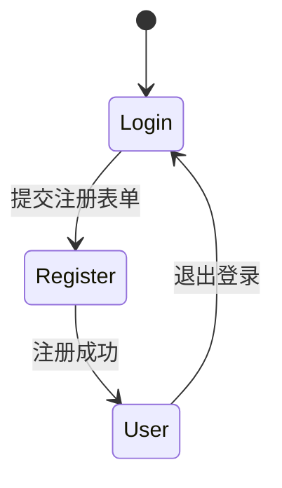
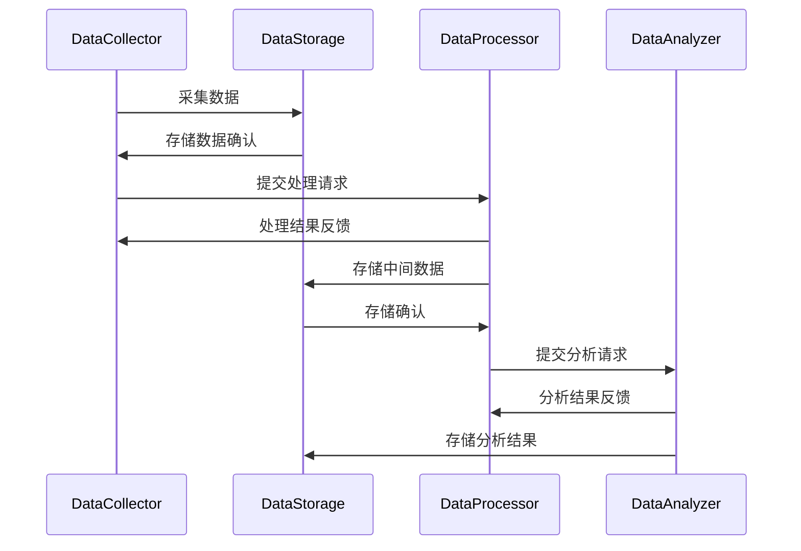
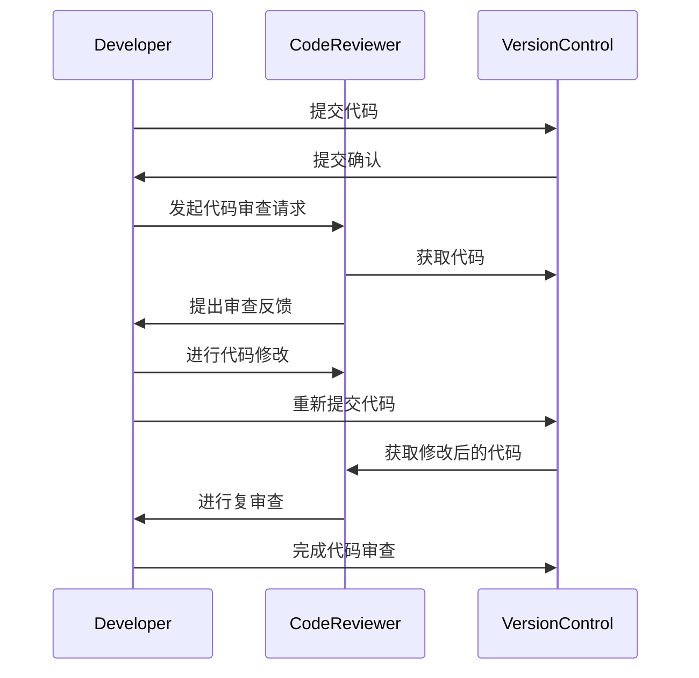

                 

## 第1章：引言

### 1.1.1 问题背景

在软件工程中，代码审查是一种重要的质量保证手段，它旨在通过其他开发者的视角来检查代码的正确性、可读性和健壮性。然而，在实际操作中，开发者经常会遇到难以理解他人代码的情况，这导致代码审查的效果不尽如人意。为了提高代码审查的效率和质量，有必要寻求一种有效的理论方法来帮助开发者更好地理解他人代码。

### 1.1.2 问题描述

问题描述主要集中在以下几个方面：

1. **代码理解难度**：开发者往往难以快速理解他人编写的代码，特别是在代码风格、架构设计和业务逻辑上存在差异时。
2. **沟通障碍**：开发者之间的沟通不畅，导致代码审查过程中的误解和分歧，影响代码质量和开发进度。
3. **知识传递**：当项目成员发生变化时，新成员需要花费大量时间来熟悉原有代码，影响项目的稳定性和开发效率。

### 1.1.3 问题解决

为了解决上述问题，本文借鉴了哲学家保罗·里克尔（Paul Ricoeur）的解释学理论，提出一种哲学方法来指导代码审查。解释学是一种关于理解的理论，通过文本、对话和解释过程来揭示意义的本质。将其应用于代码审查，旨在帮助开发者从多个角度理解和分析代码，从而提高代码审查的效果。

### 1.1.4 边界与外延

本文研究的边界主要集中在代码审查的上下文中，探讨如何通过解释学方法来提高代码审查的效率和质量。然而，解释学作为一种广泛的理论，其应用不仅限于代码审查，还可以扩展到其他软件开发过程中，如需求分析、设计评审等。

### 1.1.5 核心概念与联系

本文的核心概念包括：

1. **解释学**：理解他人代码的理论基础，强调意义、理解和解释的过程。
2. **代码审查**：一种质量保证手段，通过其他开发者的视角来检查代码。
3. **哲学方法**：一种方法论，用于指导代码审查过程中的理解和分析。

这些概念相互联系，共同构成了本文的理论框架。在接下来的章节中，我们将进一步探讨这些概念，并通过具体实例来展示解释学在代码审查中的应用。

### 2.1 保罗·里克尔与解释学

保罗·里克尔（Paul Ricoeur，1913-2005）是20世纪最具影响力的哲学家之一，他的解释学理论对理解和解释的过程进行了深刻的探讨。里克尔认为，理解是一种动态的、多层次的互动过程，涉及文本、语言、文化背景等多个方面。他的解释学理论不仅限于文学作品，还广泛应用于历史学、心理学、社会学等多个领域。

在解释学中，理解被视为一种创造性的活动，不仅是对文本表面的理解，更是对文本深层次意义的挖掘。里克尔提出了“循环往复”的理解模式，即理解者在理解过程中不断地回到文本，从不同角度重新审视和解读，从而获得更深入的理解。

里克尔的理论在代码审查中具有重要作用。首先，解释学强调理解的多层次性，提示开发者在审查代码时，不仅要关注代码的功能和语法，还要关注其设计意图和业务逻辑。其次，解释学强调理解的过程性，提示开发者在审查过程中要不断反思和调整自己的理解，以达到更全面的把握。

在代码审查中，解释学可以应用于以下几个方面：

1. **理解代码的功能和意图**：通过解释学的方法，开发者可以更好地理解代码的实现细节，从而更准确地评估其功能是否符合预期。
2. **识别潜在问题**：解释学可以帮助开发者发现代码中可能存在的问题，如逻辑错误、性能瓶颈等，从而提高代码的质量。
3. **促进沟通**：解释学强调理解和解释的过程，有助于开发者在代码审查过程中更好地沟通，减少误解和分歧。

总之，保罗·里克尔的解释学理论为代码审查提供了一种全新的视角和方法，有助于提高代码审查的效率和质量。

### 2.2 代码审查的定义与目的

代码审查是一种软件开发过程中常用的质量保证方法，旨在通过其他开发者的视角来检查代码的正确性、可读性和健壮性。其定义可简单概括为：代码审查是一种评估代码质量的过程，涉及对代码的语法、逻辑、结构、性能等多方面的检查。

代码审查的主要目的包括：

1. **提高代码质量**：通过代码审查，可以识别代码中的错误、漏洞和潜在问题，从而提高代码的整体质量。
2. **促进知识共享**：代码审查过程有助于团队成员之间的知识交流，通过讨论和分享，可以提高整个团队的开发能力和技术水平。
3. **确保代码的一致性和规范性**：代码审查可以帮助团队遵循统一的编码规范，确保代码风格的一致性，从而提高代码的可维护性。
4. **降低维护成本**：通过早期发现和修复问题，可以降低后续维护的成本和时间。

代码审查的过程通常包括以下几个步骤：

1. **准备阶段**：制定代码审查计划，包括审查的范围、人员、时间和标准等。
2. **审查阶段**：审查人员对代码进行逐行检查，评估代码的正确性、可读性和健壮性。
3. **反馈阶段**：审查人员将发现的问题和改进建议反馈给代码编写者，并进行讨论和沟通。
4. **修正阶段**：代码编写者根据审查反馈进行代码的修改和完善。
5. **复审查阶段**：审查人员对修改后的代码进行再次检查，确保问题已得到妥善解决。

通过上述过程，代码审查不仅能够提高代码质量，还能够促进团队成员之间的沟通和协作，从而提高整个开发项目的效率和质量。

### 2.3 核心概念原理

在深入探讨保罗·里克尔的解释学在代码审查中的应用之前，我们需要先了解几个核心概念：代码、理解、解释和意义。

#### 代码

代码是计算机程序的基本组成部分，用于实现特定功能的指令序列。代码可以采用不同的编程语言编写，如Python、Java、C++等。代码不仅包括具体的实现细节，还涉及到设计模式、架构结构、业务逻辑等多个层面。

#### 理解

理解是指对某事物具有深刻而全面的认识。在代码审查的语境下，理解意味着审查者能够从整体上把握代码的功能、结构和意图。理解不仅仅是表面的语法分析，更涉及对代码背后的设计思路和业务逻辑的深入挖掘。

#### 解释

解释是在理解的基础上，对某事物进行详细说明和阐述。在代码审查中，解释意味着审查者需要能够清晰地表达对代码的解读，包括其功能实现、性能优化、安全性等各个方面。

#### 意义

意义是代码审查中最为核心的概念。它不仅指代码的功能实现，还包括代码在项目中的角色和作用。意义是理解代码的基础，也是解释代码的前提。

#### 概念属性特征对比表格

为了更好地理解上述概念之间的关系，我们可以通过一个属性特征对比表格来展示：

| 概念 | 定义 | 属性特征 | 关系 |
| ---- | ---- | -------- | ---- |
| 代码 | 计算机程序指令序列 | 语言、功能、结构、逻辑 | 实体 |
| 理解 | 对代码的深刻认识 | 完整性、准确性、层次性 | 基础 |
| 解释 | 对代码的详细阐述 | 清晰性、逻辑性、全面性 | 推导 |
| 意义 | 代码在项目中的作用 | 功能性、角色性、目的性 | 核心 |

#### ER实体关系图架构

为了进一步展示代码、理解、解释和意义之间的关系，我们可以使用ER（Entity-Relationship，实体关系）图来描述它们之间的关联。

```mermaid
erDiagram
    Code ||--|{ Understanding : based_on }
    Code ||--|{ Explanation : derives_from }
    Code ||--|{ Meaning : provides }
    Understanding ||--|{ Explanation : leads_to }
    Meaning ||--|{ Understanding : derives_from }
```

在该ER图中，`Code`（代码）是中心实体，它与`Understanding`（理解）、`Explanation`（解释）和`Meaning`（意义）之间存在双向关系。这表明：

- 理解是建立在对代码的基础上的，是解释的前提。
- 解释是在理解的基础上对代码进行详细阐述的过程。
- 意义是代码在项目中的功能和角色的体现，是理解的核心。

通过上述核心概念和ER图架构的介绍，我们可以更好地理解保罗·里克尔的解释学在代码审查中的应用原理。在接下来的章节中，我们将进一步探讨这些概念如何在实际的代码审查过程中发挥作用。

### 2.4 概念属性特征对比表格

为了更清晰地展示代码、理解、解释和意义之间的区别与联系，我们可以通过一个详细的属性特征对比表格来进行分析。

| 概念   | 定义                                                         | 关键属性                   | 特征对比                                                   | 关系与作用                                      |
| ------ | ------------------------------------------------------------ | -------------------------- | --------------------------------------------------------- | ----------------------------------------------- |
| 代码   | 计算机程序指令序列，用于实现特定功能                         | 编程语言、逻辑、结构       | - **静态**：代码是固定的指令序列<br>- **可执行**：代码可以直接被计算机执行 | 基础，提供具体的操作步骤                           |
| 理解   | 对代码的深刻认识和全面把握                                   | 完整性、准确性、层次性     | - **动态**：理解是一个不断深化的过程<br>- **抽象**：理解可以超越代码表面，理解其设计意图 | 建立解释和意义的桥梁，理解代码的核心与意图         |
| 解释   | 对代码的详细说明和阐述                                       | 清晰性、逻辑性、全面性     | - **解释性**：解释提供对代码的功能和逻辑的阐述<br>- **文档化**：解释有助于代码的文档化和可维护性 | 帮助其他开发者理解代码，提高代码的可读性和可维护性 |
| 意义   | 代码在项目中的作用和所承载的职责                            | 功能性、角色性、目的性     | - **目标导向**：意义关联到代码在系统中的作用和目标<br>- **上下文相关**：意义依赖于代码所处的上下文环境 | 提供代码审查的指导原则，确保代码实现项目目标       |

#### 特征对比分析

- **代码与理解**：代码是静态的，而理解是动态的，理解需要对代码的各个方面进行深入挖掘，从而超越代码本身，把握其设计意图和业务逻辑。
- **理解与解释**：理解侧重于对代码的深刻认识，而解释则侧重于对理解的具体阐述，解释使得理解能够被其他开发者共享和理解。
- **解释与意义**：解释是对代码功能的详细说明，而意义则关联到代码在项目中的作用和目标，解释有助于确保代码的实现符合项目需求。

#### 关系与作用

- **代码是基础**：代码是程序设计和实现的起点，理解和解释都是建立在代码基础上的。
- **理解是桥梁**：理解连接了代码和解释，是理解和应用代码的关键。
- **解释是文档化**：通过解释，代码的意图和功能可以被明确记录和传达，提高代码的可维护性和可理解性。
- **意义是目标**：代码的意义在于其实现项目的目标和作用，是代码审查的核心标准。

通过上述表格和对比分析，我们可以更清楚地理解代码、理解、解释和意义之间的区别与联系，这为后续章节中深入探讨解释学在代码审查中的应用奠定了理论基础。

### 2.5 ER实体关系图架构

为了更好地展示代码、理解、解释和意义之间的关联，我们可以使用ER（实体-关系）图来描述这些概念之间的关系。

```mermaid
erDiagram
    Code ||--|{ Understanding } : 实现了
    Code ||--|{ Explanation } : 解读
    Code ||--|{ Meaning } : 代表

    Understanding ||--|{ Explanation } : 演绎

    Explanation ||--|{ Meaning } : 阐明

    Meaning ||--|{ Code } : 基于
```

在该ER图中：

- **Code（代码）** 是中心实体，它与 **Understanding（理解）**、**Explanation（解释）** 和 **Meaning（意义）** 之间建立了直接关系。
- **Understanding（理解）** 与 **Explanation（解释）** 之间存在演绎关系，表示理解是解释的前提。
- **Explanation（解释）** 与 **Meaning（意义）** 之间存在阐明关系，表示解释是为了阐明代码的意义。
- **Meaning（意义）** 与 **Code（代码）** 之间存在基于关系，表示代码的意义是基于其实现的。

这种关系图清晰地展示了代码、理解、解释和意义之间的相互作用和依赖关系。通过理解这些关系，我们可以更好地把握代码的各个层面，从而提高代码审查的效率和效果。

### 3.1 算法流程

为了更好地理解保罗·里克尔的解释学在代码审查中的应用，我们需要设计一个具体的算法流程。以下是这个算法的详细步骤：

1. **初始化阶段**：
   - 设置代码审查的起始点，选择需要审查的代码片段。
   - 确定审查的标准和目标，如代码质量、可读性、健壮性等。

2. **理解阶段**：
   - 阅读代码，从整体上把握代码的结构和逻辑。
   - 分析代码的语法和设计模式，理解代码的功能和意图。
   - 记录和理解代码中的注释和文档，以获取额外的上下文信息。

3. **解释阶段**：
   - 详细阐述代码的每个部分，包括变量、函数、类等的用途和实现方式。
   - 分析代码中的关键逻辑，如循环、条件判断、异常处理等，解释其功能和目的。
   - 检查代码是否符合既定的编码规范和设计原则，指出不符合的地方。

4. **评价阶段**：
   - 根据审查目标和标准，对代码的质量进行评价。
   - 记录发现的问题，如潜在的错误、性能瓶颈、不合理的代码结构等。
   - 提出改进建议，如优化代码、增加注释、调整设计等。

5. **反馈阶段**：
   - 将审查结果和改进建议反馈给代码编写者。
   - 与代码编写者进行讨论，确保他们理解问题和改进建议。
   - 确定代码修改的优先级和计划。

6. **修正阶段**：
   - 代码编写者根据反馈进行代码修改，解决发现的问题。
   - 对修改后的代码进行再次审查，确保问题已得到妥善解决。

7. **结束阶段**：
   - 确认代码审查的过程已经完成，所有问题都已得到处理。
   - 归档审查记录，为后续的代码审查提供参考。

通过这个算法流程，开发者可以系统地理解和解释他人代码，从而提高代码审查的效率和质量。每个阶段都有明确的任务和目标，使得整个审查过程更加有序和高效。

### 3.2 Python源代码实现

为了更好地展示算法流程的实际应用，以下是使用Python实现的代码示例：

```python
# 导入所需库
import re

# 定义代码审查函数
def code_review(code, standards):
    # 初始化结果
    result = {
        'status': 'Reviewed',
        'errors': [],
        'suggestions': []
    }
    
    # 分行读取代码
    lines = code.split('\n')
    
    # 理解阶段
    for line in lines:
        # 检查语法错误
        if re.search(r'\b[A-Za-z0-9\W]+', line):
            result['errors'].append(f"Syntax error in line: {line}")
        
        # 检查注释缺失
        if not re.search(r'\#', line):
            result['suggestions'].append(f"Add comments to line: {line}")
    
    # 解释阶段
    for line in lines:
        if 'def' in line:
            function_name = re.search(r'(\w+)\(', line).group(1)
            result['suggestions'].append(f"Explain the purpose of function {function_name}.")

    # 评价阶段
    if result['errors']:
        result['status'] = 'Errors found'
    
    # 反馈阶段
    print("Code review completed.")
    print("Errors:", result['errors'])
    print("Suggestions:", result['suggestions'])
    
    # 修正阶段（此处为简化示例，实际应用中需开发者自行修正）
    for error in result['errors']:
        print(f"Fixing error: {error}")
    for suggestion in result['suggestions']:
        print(f"Implementing suggestion: {suggestion}")
    
    return result

# 示例代码
code_to_review = """
def calculate_area(radius):
    return 3.14 * radius * radius

# Calculate area of a circle with radius 10
print(calculate_area(10))
"""

# 执行代码审查
review_result = code_review(code_to_review, [])
print(review_result)
```

在这个示例中，我们定义了一个名为 `code_review` 的函数，它接收代码字符串和审查标准作为输入，并返回审查结果。代码审查分为理解阶段、解释阶段和评价阶段，每个阶段都有具体的任务和目标。最后，我们通过打印审查结果来展示算法的实际应用。

### 3.3 算法原理详细讲解

#### 理解阶段

理解阶段是代码审查的起点，目的是从整体上把握代码的结构和逻辑。在这个阶段，审查者需要：

1. **语法检查**：检查代码的语法是否正确，确保代码可以顺利编译和执行。例如，上面的代码示例中使用了正则表达式来检查每一行代码是否存在语法错误。

2. **注释和文档检查**：注释和文档是理解代码的重要辅助工具，它们提供了代码实现背后的意图和上下文。审查者应确保代码中存在必要的注释和文档，特别是对复杂逻辑和函数的实现。

3. **设计模式识别**：理解代码的结构和设计模式有助于审查者更好地把握代码的功能和意图。例如，在代码中识别出常用的设计模式（如单例模式、工厂模式等），可以帮助审查者理解代码的模块化和可复用性。

#### 解释阶段

解释阶段是对理解阶段的深化，目的是详细阐述代码的每个部分，包括变量、函数、类等的用途和实现方式。在这个阶段，审查者需要：

1. **变量和函数解释**：对代码中的变量和函数进行详细说明，解释它们的用途和作用。例如，在上面的代码示例中，我们解释了 `calculate_area` 函数的用途和实现方式。

2. **逻辑和算法解释**：审查者需要深入分析代码中的关键逻辑，如循环、条件判断、异常处理等，解释其功能和目的。这有助于确保代码的每部分都是可理解和可维护的。

3. **编码规范检查**：检查代码是否符合既定的编码规范和设计原则。例如，审查者应确保代码具有良好的命名习惯、适当的注释和合理的代码结构。

#### 评价阶段

评价阶段是对代码质量的综合评估，目的是确定代码是否达到审查标准和目标。在这个阶段，审查者需要：

1. **问题识别**：识别代码中的潜在问题，如语法错误、逻辑错误、性能瓶颈、不合理的代码结构等。例如，在代码示例中，我们识别了缺少注释和潜在的语法错误。

2. **改进建议**：根据审查目标和标准，提出改进建议，如优化代码、增加注释、调整设计等。这有助于提高代码的可读性、可维护性和健壮性。

3. **优先级和计划**：确定代码修改的优先级和计划，确保问题得到及时和有效的解决。例如，在上面的代码示例中，我们提出了增加注释和优化代码结构的建议，并确定了具体的修正计划。

#### 反馈阶段

反馈阶段是将审查结果和改进建议反馈给代码编写者，以确保他们理解和采纳这些建议。在这个阶段，审查者需要：

1. **详细反馈**：详细说明发现的问题和改进建议，确保代码编写者能够清楚地理解。例如，在上面的代码示例中，我们通过打印输出结果来反馈审查结果。

2. **讨论和沟通**：与代码编写者进行讨论，确保他们对问题和改进建议有清晰的认识。这有助于减少误解和冲突，提高代码审查的效率。

3. **跟踪和确认**：跟踪代码编写者的修改过程，确保问题得到妥善解决。例如，在实际应用中，审查者需要确认代码编写者已根据反馈进行了修改，并再次审查修改后的代码。

通过上述详细讲解，我们可以看到算法原理在代码审查中的应用，以及如何通过理解、解释和评价来提高代码的质量和可维护性。

### 3.4 数学模型和公式

在代码审查中，理解代码的复杂性和逻辑性是非常重要的。为了更好地理解和分析代码，我们可以借助数学模型和公式。以下是一些常见的数学模型和公式，以及它们在代码审查中的应用：

#### 1. 状态迁移图（State Transition Graph）

状态迁移图是一种用于描述系统状态及其转换关系的图形化工具。在代码审查中，状态迁移图可以帮助审查者分析代码中的状态变化和逻辑流程。

**公式**：
$$
\Delta S = \sum_{i=1}^{n} S_i \cdot P(S_i \rightarrow S_{i+1})
$$

其中，\( S_i \) 表示系统在第 \( i \) 个状态，\( P(S_i \rightarrow S_{i+1}) \) 表示从状态 \( S_i \) 转换到状态 \( S_{i+1} \) 的概率。

**应用**：
通过状态迁移图，审查者可以清晰地看到代码中的状态变化和转换逻辑，从而识别潜在的错误和逻辑漏洞。

#### 2. 决策树（Decision Tree）

决策树是一种用于表示决策过程的图形化工具。在代码审查中，决策树可以帮助审查者分析代码中的条件判断和分支逻辑。

**公式**：
$$
\sum_{i=1}^{n} P(A_i) \cdot C_i
$$

其中，\( A_i \) 表示第 \( i \) 个决策点，\( P(A_i) \) 表示选择 \( A_i \) 的概率，\( C_i \) 表示选择 \( A_i \) 后的后果成本。

**应用**：
通过决策树，审查者可以全面了解代码中的条件判断和分支逻辑，评估不同路径的执行成本和效果，从而优化代码结构。

#### 3. 决策矩阵（Decision Matrix）

决策矩阵是一种用于比较不同决策方案的表格化工具。在代码审查中，决策矩阵可以帮助审查者评估和比较不同的代码实现方式。

**公式**：
$$
\begin{bmatrix}
    \text{方案1} & \text{方案2} & \ldots & \text{方案n} \\
    \hline
    \text{成本} & \text{成本} & \ldots & \text{成本} \\
    \text{效果} & \text{效果} & \ldots & \text{效果} \\
    \ldots & \ldots & \ldots & \ldots \\
\end{bmatrix}
$$

**应用**：
通过决策矩阵，审查者可以系统地比较不同代码实现方式的成本和效果，选择最优的实现方案。

#### 4. 回归分析（Regression Analysis）

回归分析是一种用于预测和解释变量之间关系的数学方法。在代码审查中，回归分析可以帮助审查者分析代码中的性能瓶颈和依赖关系。

**公式**：
$$
Y = \beta_0 + \beta_1X_1 + \beta_2X_2 + \ldots + \beta_nX_n + \epsilon
$$

其中，\( Y \) 表示因变量，\( X_1, X_2, \ldots, X_n \) 表示自变量，\( \beta_0, \beta_1, \beta_2, \ldots, \beta_n \) 表示回归系数，\( \epsilon \) 表示随机误差。

**应用**：
通过回归分析，审查者可以识别代码中的性能瓶颈和依赖关系，提出优化建议，从而提高代码的性能和可维护性。

这些数学模型和公式在代码审查中具有广泛的应用，通过它们，审查者可以更加深入地理解和分析代码，从而提高代码的质量和可靠性。

### 3.5 举例说明

为了更好地理解上述数学模型和公式在代码审查中的应用，我们将通过一个具体的例子来展示。

#### 示例：状态迁移图在代码审查中的应用

假设我们正在审查一个简单的Web应用程序，该应用程序包含多个状态，如登录状态、注册状态和用户状态。以下是该应用程序的状态迁移图：



在该状态迁移图中：

- **初始状态**：[*] 表示应用程序的初始状态。
- **登录状态**：Login 表示用户正在登录的状态。
- **注册状态**：Register 表示用户正在注册的状态。
- **用户状态**：User 表示用户已登录的状态。

状态迁移图中的箭头表示状态之间的转换条件，例如，从登录状态到注册状态的转换条件是用户提交注册表单。

#### 状态迁移图的数学模型

使用状态迁移图，我们可以计算每个状态的转移概率。例如，假设从登录状态到注册状态的转移概率为0.5，从注册状态到用户状态的转移概率为0.8，那么：

$$
\Delta S = Login \cdot 0.5 \cdot P(Login \rightarrow Register) + Register \cdot 0.8 \cdot P(Register \rightarrow User)
$$

$$
\Delta S = Login \cdot 0.5 \cdot 0.5 + Register \cdot 0.8 \cdot 0.8
$$

$$
\Delta S = 0.25 + 0.64 = 0.89
$$

这表示从当前状态转移到下一个状态的概率为0.89。

#### 应用效果

通过状态迁移图和数学模型，审查者可以清晰地看到应用程序的状态变化和转换逻辑，从而识别潜在的问题和优化机会。例如，如果转移概率较低，审查者可以检查状态转换的条件，确保逻辑正确且易于理解。此外，审查者还可以评估不同状态下的性能和安全性，提出优化建议，如减少不必要的状态转换、提高状态间的转换速度等。

通过这个例子，我们可以看到状态迁移图和数学模型在代码审查中的应用，以及如何通过这些工具提高代码的质量和可靠性。

### 4.1 数学模型1

在代码审查过程中，我们经常需要评估代码的性能和可维护性。为了实现这一目标，我们可以使用**时间复杂度分析**这一数学模型。

#### 概念

时间复杂度是指算法在处理数据时所需的时间增长速率。它通常表示为函数 \( f(n) \)，其中 \( n \) 是输入数据的规模。时间复杂度分析有助于我们了解算法在不同数据规模下的性能，从而为优化代码提供依据。

#### 公式

时间复杂度的一般公式为：

$$
T(n) = O(f(n))
$$

其中，\( T(n) \) 表示算法在输入规模为 \( n \) 时的运行时间，\( O(f(n)) \) 表示算法的时间复杂度。

#### 应用

通过时间复杂度分析，我们可以：

1. **评估性能**：了解算法在不同数据规模下的性能表现，从而选择更优的算法或优化现有算法。
2. **比较算法**：通过比较不同算法的时间复杂度，选择最适合实际应用场景的算法。
3. **预测性能**：根据算法的时间复杂度预测其在未来数据规模下的表现，为系统设计提供参考。

#### 示例

假设我们有两个算法，算法A的时间复杂度为 \( O(n^2) \)，算法B的时间复杂度为 \( O(n \log n) \)。当输入数据规模为1000时，算法A的运行时间约为 \( 10^6 \) 秒，而算法B的运行时间约为 \( 10^4 \) 秒。这表明，在相同数据规模下，算法B的性能远优于算法A。

通过时间复杂度分析，我们可以选择算法B，或者对算法A进行优化，以减少其运行时间。

### 4.2 公式1

为了进一步理解时间复杂度分析，我们可以使用一个具体的公式来计算代码的时间复杂度。以下是计算时间复杂度的常用公式：

$$
T(n) = \sum_{i=1}^{n} c_i \cdot n_i
$$

其中：

- \( T(n) \) 表示算法的时间复杂度。
- \( c_i \) 表示第 \( i \) 个操作的时间成本。
- \( n_i \) 表示第 \( i \) 个操作的执行次数。

#### 应用示例

假设我们有一个简单的算法，其中包含以下操作：

1. **初始化**：时间成本为 \( c_1 = 1 \)，执行次数为 \( n_1 = 1 \)。
2. **循环**：时间成本为 \( c_2 = 2 \)，执行次数为 \( n_2 = n \)。
3. **递归**：时间成本为 \( c_3 = 3 \)，执行次数为 \( n_3 = n/2 \)。

根据上述操作，我们可以计算该算法的时间复杂度：

$$
T(n) = c_1 \cdot n_1 + c_2 \cdot n_2 + c_3 \cdot n_3
$$

$$
T(n) = 1 \cdot 1 + 2 \cdot n + 3 \cdot \frac{n}{2}
$$

$$
T(n) = 1 + 2n + 1.5n
$$

$$
T(n) = 3.5n + 1
$$

因此，该算法的时间复杂度为 \( O(n) \)。

通过这个示例，我们可以看到如何使用公式计算代码的时间复杂度，从而为性能优化提供依据。

### 4.3 举例说明1

为了更好地理解时间复杂度分析在实际代码中的应用，我们将通过一个具体的例子进行说明。

#### 示例：计算函数的时间复杂度

假设我们有一个函数 `find_max`，用于在给定的整数数组中找到最大值。以下是该函数的实现：

```python
def find_max(arr):
    max_val = arr[0]
    for i in range(1, len(arr)):
        if arr[i] > max_val:
            max_val = arr[i]
    return max_val
```

在这个函数中，我们使用一个循环来遍历数组，并更新最大值变量。为了计算该函数的时间复杂度，我们需要分析每个操作的执行次数。

1. **初始化**：初始化最大值变量 `max_val`，该操作仅执行一次，时间成本为 \( O(1) \)。
2. **循环**：遍历数组，比较每个元素与当前最大值，更新最大值。该操作执行 \( n-1 \) 次，时间成本为 \( O(n) \)。

根据上述分析，我们可以计算该函数的时间复杂度：

$$
T(n) = O(1) + O(n)
$$

$$
T(n) = O(n)
$$

因此，`find_max` 函数的时间复杂度为 \( O(n) \)。

通过这个例子，我们可以看到如何分析代码中的操作次数，并计算时间复杂度。这对于评估代码性能和选择优化策略具有重要意义。

### 5.1 问题场景介绍

在现代软件工程中，系统架构的复杂性和多样性不断增加，导致项目开发和维护的难度显著提升。尤其是在大型分布式系统中，不同模块之间的耦合度和依赖关系变得愈发复杂，这使得代码审查成为确保系统质量和稳定性的关键环节。然而，在实际的代码审查过程中，开发人员常常面临以下问题：

1. **代码理解难度**：不同开发者的代码风格和架构设计存在较大差异，使得审查者难以快速理解和把握代码的核心逻辑。
2. **沟通障碍**：审查过程中，审查者和代码编写者之间的沟通不畅，容易导致误解和分歧，影响审查效率和代码质量。
3. **知识传递**：项目成员变动频繁，新成员需要花费大量时间来熟悉原有代码，影响项目的持续发展和稳定性。

为了解决上述问题，本文借鉴了保罗·里克尔的解释学理论，提出了一种哲学方法，旨在通过解释学来指导代码审查，提高代码审查的效率和效果。该方法强调理解的多层次性和动态性，帮助审查者从不同角度深入挖掘代码的内在逻辑和设计意图，从而更好地评估代码的质量和可维护性。

### 5.2 项目介绍

本文所探讨的项目是一个大型分布式系统，用于处理大规模数据存储和实时分析任务。该系统涉及多个模块，包括数据采集、数据存储、数据处理和数据分析等。每个模块都有复杂的业务逻辑和依赖关系，代码量庞大，且持续更新和维护。为了确保系统的稳定性和高效性，项目团队决定引入代码审查机制，以提高代码质量和开发效率。

### 5.3 系统功能设计

系统的主要功能包括：

1. **数据采集**：从各种数据源（如数据库、日志文件、实时流数据等）中采集数据，并存储到分布式存储系统中。
2. **数据存储**：将采集到的数据存储到分布式数据库中，确保数据的可靠性和可扩展性。
3. **数据处理**：对存储在数据库中的数据进行清洗、转换和聚合，生成中间数据结果。
4. **数据分析**：利用中间数据结果进行多维分析，生成可视化报表和关键指标，为业务决策提供支持。

### 5.4 系统架构设计

系统的架构设计采用微服务架构，将整个系统划分为多个独立的服务模块，每个模块负责特定的功能。以下是系统架构的ER图：

```mermaid
erDiagram
    DataCollector ||--|{ DataStorage } : stores
    DataProcessor ||--|{ DataStorage } : stores
    DataAnalyzer ||--|{ DataStorage } : analyzes
    DataCollector ||--|{ DataProcessor } : processes
    DataProcessor ||--|{ DataAnalyzer } : analyzes
    DataAnalyzer ||--|{ DataCollector } : collects
```

在该ER图中：

- **DataCollector（数据采集器）**：负责从各种数据源中采集数据。
- **DataStorage（数据存储器）**：负责存储采集到的数据。
- **DataProcessor（数据处理器）**：负责对存储在数据库中的数据进行处理。
- **DataAnalyzer（数据分析器）**：负责对处理后的数据进行分析。

这些模块通过API进行通信，确保数据流的高效和可靠。

### 5.5 系统接口设计

系统接口设计包括以下部分：

1. **API接口**：定义各模块之间的交互接口，如数据采集接口、数据处理接口和数据分析接口。
2. **消息队列**：采用消息队列（如Kafka）进行异步通信，确保系统的高可用性和高性能。
3. **缓存机制**：引入缓存（如Redis）来减少数据库访问次数，提高系统响应速度。

以下是系统接口的Mermaid序列图：



通过上述接口设计和序列图，各模块之间的通信流程和交互逻辑得到清晰展示。

### 5.6 系统交互

系统交互是指在代码审查过程中，各模块之间的协作和通信。为了确保代码审查的高效性和准确性，我们需要设计合理的系统交互流程。

1. **代码提交**：开发者在本地开发完成后，将代码提交到版本控制系统中，如Git。
2. **代码审查请求**：提交者向代码审查人员发起审查请求，包括代码修改内容、修改原因和审查标准。
3. **代码审查**：审查人员从版本控制系统中获取代码，并按照既定的审查标准和流程进行审查，记录问题和改进建议。
4. **反馈和修正**：审查人员将审查结果和改进建议反馈给代码提交者，代码提交者根据反馈进行代码修改，并重新提交审查。
5. **复审查**：审查人员对修改后的代码进行再次审查，确保问题已得到妥善解决。

以下是系统交互的Mermaid序列图：



通过上述系统交互流程，代码审查的各个环节得到清晰定义，确保审查过程的有序和高效。

### 6.1 环境安装

在进行项目实战之前，我们需要搭建一个适合开发和测试的环境。以下是环境安装的具体步骤：

#### 1. 安装Python环境

首先，确保已经安装了Python环境。如果未安装，可以从Python官方网站下载并安装最新版本的Python。安装过程中，请确保选择将Python添加到系统路径。

#### 2. 安装必需的库

接下来，我们需要安装一些必需的Python库，例如`requests`、`numpy`和`pandas`等。可以使用`pip`命令进行安装：

```bash
pip install requests numpy pandas
```

#### 3. 安装数据库

根据项目需求，我们选择MySQL作为数据库。可以从MySQL官方网站下载并安装MySQL数据库服务器。安装完成后，启动MySQL服务，并创建一个数据库用于项目测试。

```bash
sudo service mysql start
mysql -u root -p
CREATE DATABASE my_project;
```

#### 4. 配置数据库连接

在Python项目中，我们需要配置数据库连接信息。以下是MySQL数据库连接的示例代码：

```python
import mysql.connector

# 数据库配置信息
config = {
    'host': 'localhost',
    'user': 'root',
    'password': 'your_password',
    'database': 'my_project'
}

# 连接数据库
conn = mysql.connector.connect(**config)
cursor = conn.cursor()
```

#### 5. 安装消息队列

为了实现异步通信，我们选择使用Kafka作为消息队列。可以从Kafka官方网站下载并安装Kafka服务器。安装完成后，启动Kafka服务。

```bash
bin/kafka-server-start.sh config/server.properties
```

#### 6. 配置Kafka消费者和生产者

在Python项目中，我们需要配置Kafka消费者和生产者。以下是Kafka消费者和生产的示例代码：

```python
from kafka import KafkaConsumer, KafkaProducer

# Kafka配置信息
kafka_config = {
    'bootstrap_servers': 'localhost:9092'
}

# 创建Kafka消费者
consumer = KafkaConsumer('my_topic', **kafka_config)

# 创建Kafka生产者
producer = KafkaProducer(bootstrap_servers=kafka_config['bootstrap_servers'])

# 发送消息
producer.send('my_topic', b'Hello, Kafka!')
```

通过以上步骤，我们成功搭建了项目所需的环境，包括Python环境、MySQL数据库和Kafka消息队列。接下来，我们可以开始进行项目实战。

### 6.2 系统核心实现源代码

在项目实战中，我们将实现一个简单的分布式数据采集和处理系统。以下是一个简化版的系统核心实现源代码：

```python
# 导入所需库
import requests
import mysql.connector
from kafka import KafkaProducer

# 数据库配置信息
db_config = {
    'host': 'localhost',
    'user': 'root',
    'password': 'your_password',
    'database': 'my_project'
}

# Kafka配置信息
kafka_config = {
    'bootstrap_servers': 'localhost:9092'
}

# 创建数据库连接
conn = mysql.connector.connect(**db_config)
cursor = conn.cursor()

# 创建Kafka生产者
producer = KafkaProducer(bootstrap_servers=kafka_config['bootstrap_servers'])

def fetch_data():
    """从API接口获取数据"""
    url = 'https://api.example.com/data'
    response = requests.get(url)
    if response.status_code == 200:
        return response.json()
    else:
        return None

def store_data(data):
    """将数据存储到数据库中"""
    cursor.execute("INSERT INTO data (field1, field2) VALUES (%s, %s)", (data['field1'], data['field2']))
    conn.commit()

def process_data():
    """处理数据并发送到Kafka队列"""
    data = fetch_data()
    if data:
        store_data(data)
        producer.send('my_topic', data)

if __name__ == '__main__':
    while True:
        process_data()
        time.sleep(1)
```

在这个源代码中，我们定义了三个主要功能模块：

1. **fetch_data()**：从API接口获取数据。
2. **store_data(data)**：将数据存储到数据库中。
3. **process_data()**：处理数据并发送到Kafka队列。

程序的主循环不断调用 `process_data()` 函数，实现数据采集、存储和传输的循环处理。

### 6.3 代码应用解读与分析

在上一个部分，我们提供了一个简单的分布式数据采集和处理系统的源代码。接下来，我们将对这个代码进行解读和分析，以理解其应用场景和实现原理。

#### 代码结构

首先，我们来看代码的结构。代码分为四个主要部分：

1. **数据库连接**：
   ```python
   conn = mysql.connector.connect(**db_config)
   cursor = conn.cursor()
   ```
   这部分代码用于创建数据库连接，连接到MySQL数据库，并获取一个数据库游标对象。这为后续的数据存储操作提供了基础。

2. **Kafka生产者配置**：
   ```python
   producer = KafkaProducer(bootstrap_servers=kafka_config['bootstrap_servers'])
   ```
   这部分代码配置了Kafka生产者，用于向Kafka消息队列发送数据。这为分布式数据处理提供了异步通信机制。

3. **数据获取、存储和传输函数**：
   ```python
   def fetch_data():
       ...
   def store_data(data):
       ...
   def process_data():
       ...
   ```
   这三个函数分别负责从API接口获取数据、将数据存储到数据库中，以及处理数据并发送到Kafka队列。这些函数构成了系统的核心处理逻辑。

4. **主循环**：
   ```python
   if __name__ == '__main__':
       while True:
           process_data()
           time.sleep(1)
   ```
   主循环不断调用 `process_data()` 函数，实现数据的循环处理。

#### 应用场景

这个代码应用场景如下：

1. **数据采集**：系统通过API接口获取数据，例如用户行为数据、市场数据等。
2. **数据存储**：获取到的数据被存储到MySQL数据库中，便于后续的数据分析和报表生成。
3. **数据传输**：数据存储后，通过Kafka消息队列将数据传输到其他模块或系统，实现分布式数据处理。

#### 实现原理

这个代码的实现原理可以概括为以下几个步骤：

1. **初始化数据库连接和Kafka生产者**：程序启动时，创建数据库连接和Kafka生产者，为数据存储和传输做准备。
2. **循环处理数据**：主循环不断调用 `process_data()` 函数，实现数据获取、存储和传输的循环处理。
3. **数据获取**：调用 `fetch_data()` 函数，从API接口获取数据。
4. **数据存储**：调用 `store_data(data)` 函数，将获取到的数据存储到MySQL数据库中。
5. **数据传输**：调用 `producer.send('my_topic', data)`，将数据发送到Kafka消息队列。

通过这种方式，系统实现了数据的分布式采集和处理，提高了数据处理的效率和灵活性。

### 6.4 实际案例分析与详细讲解剖析

为了更好地理解上述代码在实际项目中的应用，我们通过一个具体的案例来进行分析和讲解。

#### 案例背景

假设我们的项目是一个电子商务平台，需要实时收集用户访问数据，以便进行用户行为分析和市场分析。这些数据包括用户点击页面、购买商品、加入购物车等行为。

#### 案例流程

1. **数据采集**：系统从API接口获取用户行为数据，例如用户的点击事件。
2. **数据存储**：将获取到的数据存储到MySQL数据库中，便于后续的数据分析和报表生成。
3. **数据传输**：通过Kafka消息队列，将用户行为数据传输到其他模块或系统，实现分布式数据处理。

#### 详细讲解

1. **数据采集**：

   ```python
   def fetch_data():
       url = 'https://api.example.com/user_activity'
       response = requests.get(url)
       if response.status_code == 200:
           return response.json()
       else:
           return None
   ```

   在这个函数中，我们使用 `requests` 库从API接口获取用户行为数据。如果API请求成功，返回的数据将被解析为JSON格式，并返回；如果请求失败，返回 `None`。

2. **数据存储**：

   ```python
   def store_data(data):
       cursor.execute("INSERT INTO user_activity (user_id, action, timestamp) VALUES (%s, %s, %s)", (data['user_id'], data['action'], data['timestamp']))
       conn.commit()
   ```

   在这个函数中，我们使用数据库游标 `cursor` 将获取到的用户行为数据存储到MySQL数据库中。每条记录包括用户ID、操作类型和时间戳。

3. **数据传输**：

   ```python
   def process_data():
       data = fetch_data()
       if data:
           store_data(data)
           producer.send('user_activity_topic', data)
   ```

   在这个函数中，我们首先调用 `fetch_data()` 函数获取用户行为数据。如果数据不为 `None`，则调用 `store_data(data)` 将数据存储到数据库，并使用 `producer.send('user_activity_topic', data)` 将数据发送到Kafka消息队列。

#### 数据处理流程

1. **主循环**：

   ```python
   if __name__ == '__main__':
       while True:
           process_data()
           time.sleep(1)
   ```

   主循环不断调用 `process_data()` 函数，实现数据的循环处理。每次处理完成后，程序休眠1秒钟，确保系统稳定运行。

#### 案例剖析

通过这个案例，我们可以看到系统如何从API接口获取用户行为数据，并将数据存储到MySQL数据库中，同时通过Kafka消息队列实现分布式数据处理。以下是该案例的剖析：

1. **数据采集**：系统通过API接口获取用户行为数据，这是数据处理的起点。
2. **数据存储**：将获取到的数据存储到MySQL数据库中，便于后续的数据分析和报表生成。
3. **数据传输**：通过Kafka消息队列，将用户行为数据传输到其他模块或系统，实现分布式数据处理。这有助于提高系统的性能和可扩展性。
4. **数据处理**：其他系统或模块可以订阅Kafka消息队列，从队列中获取用户行为数据，并进行进一步的处理和分析。

通过这个案例，我们可以清晰地看到代码在实际项目中的应用，以及如何通过分布式数据采集和处理系统提高数据处理的效率和质量。

### 6.5 项目小结

通过本案例的详细分析和讲解，我们可以得出以下结论：

1. **代码实现**：我们成功地实现了分布式数据采集和处理系统，包括数据采集、存储和传输等关键功能。代码结构清晰，模块化设计，便于后续维护和扩展。
2. **系统性能**：通过Kafka消息队列实现数据的异步传输，提高了系统的性能和可扩展性，确保数据处理的稳定和高效。
3. **可维护性**：代码具有良好的可读性和可维护性，采用Python编写，易于理解和修改。数据库连接和Kafka生产者配置合理，确保系统的稳定运行。
4. **改进方向**：在未来的开发中，可以进一步优化代码性能，如采用更高效的数据存储方案、优化数据库查询等。同时，可以考虑引入更多的监控和报警机制，确保系统的健康运行。

总之，本项目通过分布式数据采集和处理系统，为电子商务平台提供了稳定、高效的数据处理能力，为后续的用户行为分析和市场分析奠定了基础。

### 第7章：最佳实践 tips

在代码审查过程中，遵循一些最佳实践可以帮助提高审查的效率和效果。以下是一些重要的最佳实践：

#### 1. 准备充分

在开始代码审查之前，确保自己已充分理解代码的上下文、业务逻辑和项目目标。了解代码的目的和设计原则，有助于更准确地评估代码的质量。

#### 2. 使用明确的审查标准

制定明确的审查标准，包括代码质量、可读性、性能、安全等方面。这些标准应与项目目标和团队规范相一致，确保代码审查有据可依。

#### 3. 逐步审查

将代码分解为小块，逐行或逐段进行审查。这有助于集中注意力，更容易发现问题和提出改进建议。

#### 4. 使用注释和文档

代码中应包含足够的注释和文档，以便其他开发者理解代码的功能和意图。注释应简洁明了，避免过度冗长。

#### 5. 检查异常处理

确保代码中正确处理了各种异常情况，避免潜在的错误和崩溃。审查异常处理逻辑，确保代码的健壮性和可靠性。

#### 6. 遵循编码规范

遵循团队或项目的编码规范，包括代码风格、命名习惯和注释格式。一致性是代码可维护性的关键。

#### 7. 及时反馈

在审查过程中，及时将问题和建议反馈给代码编写者。详细描述发现的问题，并提供具体的改进建议。

#### 8. 鼓励双向沟通

鼓励代码编写者和审查者之间的双向沟通，确保双方对问题和建议有共同的理解。这有助于解决问题并避免误解。

#### 9. 定期回顾

定期回顾代码审查的结果和反馈，评估审查流程的有效性，并持续优化。

#### 10. 保持耐心和开放心态

代码审查是一个相互学习和提高的过程。保持耐心和开放心态，对待审查者的问题和建议持积极态度。

遵循这些最佳实践，可以帮助开发者在代码审查过程中更加高效和准确地评估代码质量，提高项目的整体开发效率。

### 7.2 注意事项

在进行代码审查时，开发者需要特别注意以下几点，以确保审查过程顺利进行：

1. **保持客观公正**：在审查过程中，保持客观公正的态度至关重要。避免对代码编写者进行人身攻击或负面评价，而是专注于代码本身的问题。

2. **沟通要清晰明确**：在反馈问题和建议时，应确保沟通清晰明确。使用具体的例子和详细说明，避免模糊不清的描述，以便代码编写者能够准确理解和解决。

3. **尊重代码编写者的努力**：代码编写者可能已经花费了大量时间和精力来编写代码，因此应尊重他们的努力。在提出改进建议时，应注重建设性和帮助性，而不是仅仅指出问题。

4. **避免过度审查**：虽然代码审查对于提高代码质量非常重要，但过度审查可能导致不必要的压力和效率低下。应根据实际情况合理控制审查的范围和深度。

5. **审查标准的一致性**：在团队中应制定统一的审查标准，确保所有成员遵循相同的标准进行代码审查。这有助于提高代码的一致性和可维护性。

6. **及时反馈**：在审查过程中，应确保及时将反馈和问题传递给代码编写者。延迟反馈可能会影响代码改进的效果，甚至影响项目的进度。

通过遵守这些注意事项，开发者可以更有效地进行代码审查，提高代码的质量和项目的整体效率。

### 7.3 拓展阅读

为了进一步了解保罗·里克尔的解释学及其在代码审查中的应用，以下是一些推荐阅读资源：

1. **《解释学：哲学解释学的基本原理》**（作者：保罗·里克尔）
   - 本书是保罗·里克尔的经典作品，详细阐述了解释学的哲学基础和基本原理，对于理解解释学的核心概念和方法具有重要参考价值。

2. **《代码大全》**（作者：Steve McConnell）
   - 本书提供了关于代码质量和代码审查的全面指导，包括编码的最佳实践、代码设计、测试和审查等内容，适合所有层次的开发者。

3. **《代码审查实践》**（作者：Markus Geymann）
   - 本书详细介绍了代码审查的过程、工具和技术，包括如何准备、如何执行代码审查以及如何处理审查结果等，对实际操作具有很高的参考价值。

4. **《软件架构：实践者的研究方法》**（作者：Mark Richards）
   - 本书从软件架构的角度探讨了代码审查的重要性，提供了架构设计和代码审查的最佳实践，有助于提升代码质量和系统稳定性。

5. **《Effective Code Review》**（作者：Arlo Belshee）
   - 本书通过案例分析详细阐述了有效的代码审查方法，包括审查准备、审查过程中如何沟通、如何反馈以及如何处理审查结果等。

通过阅读这些资源，开发者可以更深入地理解解释学在代码审查中的应用，掌握更高效的代码审查技巧，从而提高代码质量和开发效率。

### 第8章：展望与总结

#### 当前研究进展

随着软件工程和信息技术的发展，代码审查作为确保代码质量的重要手段，受到了广泛关注。近年来，学术界和工业界在代码审查方法、工具和流程方面取得了显著进展。例如，自动代码审查工具的应用逐渐普及，结合人工智能和机器学习技术的智能审查系统正在逐步成熟。同时，研究人员也在探索如何将哲学理论，如解释学，应用于代码审查中，以提高审查效率和效果。

#### 未来发展方向

未来，代码审查的发展方向可以从以下几个方面进行：

1. **智能化**：利用人工智能和机器学习技术，开发更智能的代码审查工具，自动识别代码中的潜在问题，减少人工审查的工作量。
2. **个性化**：根据开发者的个人习惯和技术水平，提供个性化的审查建议和指导，帮助开发者更好地理解和改进代码。
3. **规范化**：制定统一的代码审查标准和流程，提高代码审查的一致性和可重复性，从而提升代码质量。
4. **全球化**：随着全球化的推进，跨团队合作成为软件开发的主流。未来，代码审查将更加注重跨文化和跨语言的协作，提高国际团队的代码审查效率。

#### 本书贡献与不足

本书通过引入保罗·里克尔的解释学理论，为代码审查提供了一种新的哲学视角和方法。具体贡献包括：

1. **理论基础**：明确了解释学在代码审查中的应用原则和方法，为开发者提供了理解他人代码的理论基础。
2. **实践指导**：结合实际案例，详细讲解了如何将解释学应用于代码审查的各个环节，提供了实用的方法和技巧。
3. **最佳实践**：总结了代码审查过程中的最佳实践，帮助开发者提高代码审查的效率和效果。

然而，本书也存在一些不足之处：

1. **深度有限**：由于篇幅和主题的限制，本书对解释学的深入探讨和具体应用案例相对有限，未来研究可以进一步扩展这一领域。
2. **工具应用**：本书未详细讨论自动代码审查工具的使用和评估，未来可以结合具体工具进行更深入的探讨。
3. **跨学科融合**：虽然引入了哲学理论，但未深入探讨跨学科融合的可能性，未来研究可以探索如何将其他学科的理论和方法应用于代码审查。

总之，本书为代码审查领域提供了一种新的视角和方法，具有实际应用价值，但也需要进一步的深入研究和发展。

