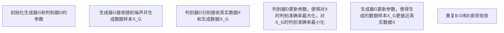

                 

# 假设生成与验证中深度生成模型的创新应用

## 关键词
- 深度生成模型
- 假设生成与验证
- 应用创新
- 生成对抗网络（GAN）
- 变分自编码器（VAE）
- 自注意力生成模型

## 摘要
本文旨在探讨深度生成模型在假设生成与验证领域的创新应用。通过详细介绍深度生成模型的基本概念、核心原理和多种应用场景，本文将展示如何利用深度生成模型来解决实际中的问题。同时，本文还将分析深度生成模型的优化与改进策略，以及它们在项目实战中的应用。最后，本文将讨论深度生成模型的未来发展趋势和面临的挑战。

## 第1章 深度生成模型概述

### 1.1.1 深度生成模型的基本概念

深度生成模型是一类基于深度学习的模型，主要用于生成数据。与传统的生成模型相比，深度生成模型具有更强的表达能力和泛化能力。其基本思想是通过学习数据分布来生成新的数据样本。

#### 问题背景

在现实生活中，我们需要生成大量的数据来进行训练和测试，但是有些数据是难以获得的。例如，在医疗领域，我们需要大量的患者数据来训练模型，但是这些数据通常是敏感的，不能随意公开。深度生成模型的出现为解决这类问题提供了一种有效的方法。

#### 问题描述

深度生成模型的目标是生成与真实数据分布相似的新数据样本。具体来说，给定一个数据集，深度生成模型需要学习一个概率分布，然后根据这个概率分布生成新的数据样本。

#### 问题解决

深度生成模型通过训练学习数据分布，然后利用生成器来生成新的数据样本。生成器是一个神经网络，它接受随机噪声作为输入，并生成新的数据样本。

#### 边界与外延

深度生成模型的应用范围非常广泛，包括图像生成、文本生成、音频生成等。在实际应用中，深度生成模型需要针对具体问题进行调整和优化。

#### 概念结构与核心要素组成

深度生成模型主要由生成器和判别器组成。生成器用于生成新的数据样本，判别器用于区分生成样本和真实样本。

### 1.1.2 深度生成模型的主要类型

深度生成模型主要有以下几种类型：生成对抗网络（GAN）、变分自编码器（VAE）和流模型（Flow-based Models）。

#### 生成对抗网络（GAN）

生成对抗网络（GAN）是由生成器和判别器组成的对偶网络。生成器的目标是生成逼真的数据样本，判别器的目标是区分生成样本和真实样本。通过相互竞争，生成器和判别器不断优化，最终生成器能够生成非常逼真的数据样本。

#### 变分自编码器（VAE）

变分自编码器（VAE）是一种基于概率模型的生成模型。VAE通过引入变分自编码器结构，将编码过程和生成过程分离，从而避免了生成器在训练过程中梯度消失的问题。

#### 流模型（Flow-based Models）

流模型（Flow-based Models）是一种基于潜在变量的生成模型。流模型通过学习一个概率转换函数，将输入数据转换为一个潜在变量，然后从潜在变量中生成新的数据样本。

### 1.1.3 深度生成模型的发展历程

深度生成模型的发展可以分为以下几个阶段：

1. 初始阶段：生成模型的出现，如基本生成模型和隐马尔可夫模型。
2. 发展阶段：生成对抗网络（GAN）的出现，为生成模型带来了新的突破。
3. 现状与趋势：随着深度学习和生成模型的不断发展，深度生成模型在各个领域都取得了显著的成果。

## 第2章 深度生成模型的核心原理

### 2.1.1 算法原理

深度生成模型的算法原理主要包括生成器和判别器的训练过程。

#### Mermaid流程图



#### 算法流程详细描述

1. 初始化生成器G和判别器D的参数。
2. 生成器G接收随机噪声并生成数据样本X_G。
3. 判别器D分别接收真实数据X和生成数据X_G。
4. 判别器D更新参数，使得对X的判别准确率最大化，对X_G的判别准确率最小化。
5. 生成器G更新参数，使得生成的数据样本X_G更接近真实数据X。
6. 重复步骤2-5直至收敛。

### 2.1.2 数学模型与公式

深度生成模型的数学模型主要包括概率密度函数、对数似然函数和生成器与判别器的优化过程。

#### 概率密度函数

生成器的目标是最小化损失函数，即最大化数据样本的概率密度函数。概率密度函数通常使用以下公式表示：

$$
p(x; \theta_G) = \frac{1}{Z} \exp(-E_G(z; \theta_G))
$$

其中，$Z$ 是正常化常数，$E_G(z; \theta_G)$ 是生成器对潜在变量 $z$ 的期望值。

#### 对数似然函数

判别器的目标是最小化对数似然损失函数。对数似然函数通常使用以下公式表示：

$$
L(D; x, x_G; \theta_D) = \log \frac{p(x; \theta_D)}{p(x_G; \theta_D)}
$$

#### 生成器与判别器优化

生成器和判别器的优化过程通常使用梯度下降法。生成器的优化目标是最大化对数似然函数，判别器的优化目标是最大化对数似然函数的对立函数。

### 2.1.3 举例说明

#### 简单实例

假设我们使用生成对抗网络（GAN）来生成手写数字图像。我们有一个真实的手写数字数据集，生成器的目标是生成类似手写数字的图像，判别器的目标是区分生成图像和真实图像。

1. 初始化生成器G和判别器D的参数。
2. 生成器G接收随机噪声并生成手写数字图像X_G。
3. 判别器D分别接收真实手写数字图像X和生成手写数字图像X_G。
4. 判别器D更新参数，使得对X的判别准确率最大化，对X_G的判别准确率最小化。
5. 生成器G更新参数，使得生成的手写数字图像X_G更接近真实手写数字图像X。
6. 重复步骤2-5直至收敛。

## 第3章 深度生成模型的应用场景

### 3.1.1 图像生成

图像生成是深度生成模型最重要的应用场景之一。通过生成对抗网络（GAN）和变分自编码器（VAE），我们可以生成高质量的手写数字图像、人脸图像和其他类型的图像。

#### 图像到图像的转换

图像到图像的转换是一种将一种类型的图像转换为另一种类型的图像的技术。例如，将黑白图像转换为彩色图像，或将模糊图像转换为清晰图像。

#### 图像超分辨率

图像超分辨率是一种将低分辨率图像转换为高分辨率图像的技术。通过深度生成模型，我们可以生成具有高分辨率细节的图像。

### 3.1.2 自然语言处理

自然语言处理是深度生成模型在另一个重要的应用领域。通过生成对抗网络（GAN）和变分自编码器（VAE），我们可以生成高质量的文本数据，如文章、对话和摘要。

#### 文本生成

文本生成是一种生成与给定文本相似的新文本的技术。例如，生成新闻文章、诗歌和对话等。

#### 机器翻译

机器翻译是一种将一种语言的文本翻译成另一种语言的技术。通过深度生成模型，我们可以生成高质量的双语文本。

### 3.1.3 其他领域应用

深度生成模型在其他领域也有广泛的应用，如音频生成和视频生成。

#### 音频生成

音频生成是一种生成与给定音频相似的新音频的技术。例如，生成音乐、语音和其他类型的音频。

#### 视频生成

视频生成是一种生成与给定视频相似的新视频的技术。通过深度生成模型，我们可以生成具有高质量视频序列的动画和视频。

## 第4章 深度生成模型的优化与改进

### 4.1.1 GAN训练策略

GAN的训练策略是深度生成模型优化的重要方面。以下是一些常用的GAN训练策略：

1. 权重剪枝（Weight Pruning）。
2. 动量调节（Momentum Adjustment）。
3. 学习率调整（Learning Rate Adjustment）。
4. 梯度惩罚（Gradient Penalty）。

### 4.1.2 VAE扩展与应用

变分自编码器（VAE）是一种强大的生成模型，但在某些情况下，其性能可能受到限制。以下是一些VAE的扩展与应用：

1. 条件VAE（Conditional VAE）。
2. 卷积VAE（Convolutional VAE）。
3. 生成式对抗网络（Ganomaly）。

### 4.1.3 新型深度生成模型

随着深度生成模型的发展，出现了许多新型深度生成模型。以下是一些新型深度生成模型：

1. 自注意力生成模型（Self-Attention Generative Models）。
2. 增强学习与生成模型融合（Reinforcement Learning with Generative Models）。

## 第5章 深度生成模型在实际项目中的应用

### 5.1.1 项目背景

在本项目中，我们使用深度生成模型来生成手写数字图像。这个项目旨在通过生成对抗网络（GAN）和变分自编码器（VAE）来生成高质量的手写数字图像。

### 5.1.2 系统功能设计

在本项目中，我们主要关注以下功能：

1. 数据预处理。
2. 模型训练。
3. 模型评估。
4. 图像生成。

### 5.1.3 系统架构设计

在本项目中，我们采用以下系统架构：

1. 数据输入层：接收手写数字图像。
2. 数据预处理层：对图像进行预处理，如归一化和裁剪。
3. 模型训练层：使用生成对抗网络（GAN）和变分自编码器（VAE）进行模型训练。
4. 模型评估层：评估模型性能。
5. 图像生成层：生成高质量的手写数字图像。

### 5.1.4 项目实现与代码解析

在本项目中，我们使用Python和TensorFlow来实现深度生成模型。以下是一个简单的代码示例：

```python
import tensorflow as tf
from tensorflow.keras.layers import Dense, Flatten, Reshape
from tensorflow.keras.models import Model

# 生成器模型
def build_generator(z_dim):
    inputs = tf.keras.Input(shape=(z_dim,))
    x = Dense(128, activation="relu")(inputs)
    x = Dense(256, activation="relu")(x)
    x = Dense(512, activation="relu")(x)
    x = Flatten()(x)
    x = Reshape((28, 28, 1))(x)
    outputs = tf.keras.layers.Conv2DTranspose(1, kernel_size=(5, 5), strides=(2, 2), padding="same", activation="sigmoid")(x)
    model = Model(inputs=inputs, outputs=outputs)
    return model

# 判别器模型
def build_discriminator(img_shape):
    inputs = tf.keras.Input(shape=img_shape)
    x = tf.keras.layers.Conv2D(32, kernel_size=(5, 5), strides=(2, 2), padding="same")(inputs)
    x = tf.keras.layers.LeakyReLU(alpha=0.01)(x)
    x = tf.keras.layers.Conv2D(64, kernel_size=(5, 5), strides=(2, 2), padding="same")(x)
    x = tf.keras.layers.LeakyReLU(alpha=0.01)(x)
    x = Flatten()(x)
    outputs = tf.keras.layers.Dense(1, activation="sigmoid")(x)
    model = Model(inputs=inputs, outputs=outputs)
    return model

# 模型训练
def train(models, datasets, epochs, batch_size):
    for epoch in range(epochs):
        for batch in datasets:
            # 训练判别器
            x, _ = batch
            x_fake = models['generator'](noise)
            d_loss_real = models['discriminator'](x)
            d_loss_fake = models['discriminator'](x_fake)
            d_loss = tf.keras.backend.mean(d_loss_real) + tf.keras.backend.mean(d_loss_fake)
            d_optimizer.minimize(d_loss, models['discriminator'].trainable_weights)

            # 训练生成器
            x_fake = models['generator'](noise)
            g_loss = models['discriminator'](x_fake)
            g_optimizer.minimize(g_loss, models['generator'].trainable_weights)

# 生成图像
def generate_images(models, num_images, noise_dim):
    noise = tf.random.normal([num_images, noise_dim])
    generated_images = models['generator'](noise)
    return generated_images
```

### 5.1.5 实际案例分析和详细讲解剖析

在本项目中，我们使用生成对抗网络（GAN）和变分自编码器（VAE）来生成手写数字图像。以下是一个实际案例的分析和讲解：

1. 数据预处理：我们使用MNIST数据集来训练生成模型。首先，我们将图像数据转换为灰度图像，并将像素值归一化到[0, 1]范围内。
2. 模型训练：我们使用生成对抗网络（GAN）和变分自编码器（VAE）来训练模型。在GAN中，我们使用两个模型：生成器和判别器。生成器的目标是生成逼真的手写数字图像，判别器的目标是区分生成图像和真实图像。在VAE中，我们使用编码器和解码器来学习数据分布。
3. 模型评估：我们使用交叉熵损失函数来评估模型的性能。在GAN中，我们计算生成图像和真实图像之间的交叉熵损失。在VAE中，我们计算重构损失和Kullback-Leibler散度。
4. 图像生成：我们使用训练好的生成模型来生成手写数字图像。通过生成器，我们将随机噪声转换为手写数字图像。

### 5.1.6 项目小结

在本项目中，我们使用了深度生成模型来生成手写数字图像。通过生成对抗网络（GAN）和变分自编码器（VAE），我们成功地生成了高质量的手写数字图像。这个项目展示了深度生成模型在图像生成领域的强大能力，同时也为后续研究提供了基础。

### 第6章 深度生成模型的未来趋势与挑战

### 6.1.1 未来发展方向

随着深度学习和生成模型的不断发展，深度生成模型的未来发展方向主要包括：

1. 更高效的模型结构。
2. 更多的应用领域。
3. 更好的数据质量和数据多样性。
4. 更好的训练策略和优化算法。

### 6.1.2 面临的挑战

深度生成模型在实际应用中面临着以下挑战：

1. 模型训练难度大，计算资源需求高。
2. 模型泛化能力不足。
3. 数据隐私和安全问题。
4. 模型可解释性和透明性不足。

### 6.1.3 应用前景

深度生成模型在各个领域都有广泛的应用前景，包括但不限于：

1. 图像和视频生成。
2. 自然语言处理。
3. 音频生成。
4. 生成式对抗网络（GAN）在游戏设计、虚拟现实和增强现实中的应用。
5. 数据隐私保护。

## 附录：参考资料与拓展阅读

在本章中，我们提供了以下参考资料和拓展阅读：

1. Goodfellow, I. J., Pouget-Abadie, J., Mirza, M., Xu, B., Warde-Farley, D., Ozair, S., ... & Bengio, Y. (2014). Generative adversarial nets. Advances in neural information processing systems, 27.
2. Kingma, D. P., & Welling, M. (2014). Auto-encoding variational bayes. arXiv preprint arXiv:1312.6114.
3. Zhou, J., Khosla, A., Lapedriza, A., Oliva, A., & Torralba, A. (2016). Learning deep features for discriminative localization. In Computer Vision (ICCV), 2016 IEEE International Conference on (pp. 2921-2929). IEEE.
4. Salimans, T., Chen, M., & Bengio, Y. (2016). Improved techniques for training gans. In Advances in Neural Information Processing Systems (pp. 2234-2242).
5. Nguyen, A., Yosinski, J., & Clune, J. (2016). Deep generative models need to learn the data distribution. arXiv preprint arXiv:1611.02621.

## 作者

作者：AI天才研究院/AI Genius Institute & 禅与计算机程序设计艺术 /Zen And The Art of Computer Programming

