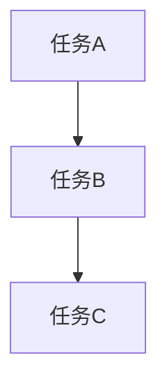
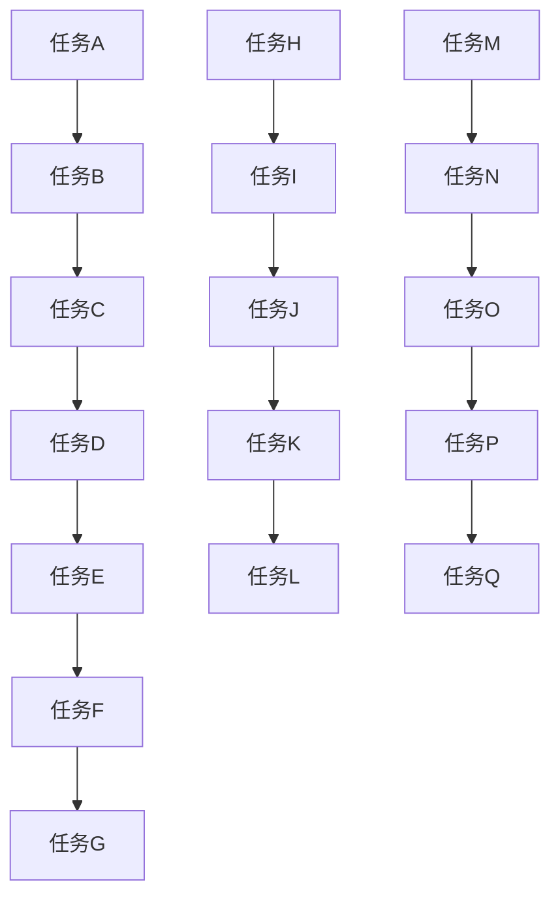
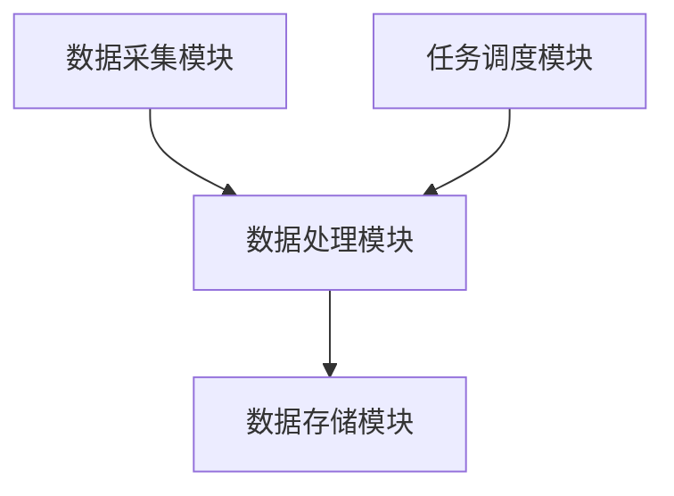
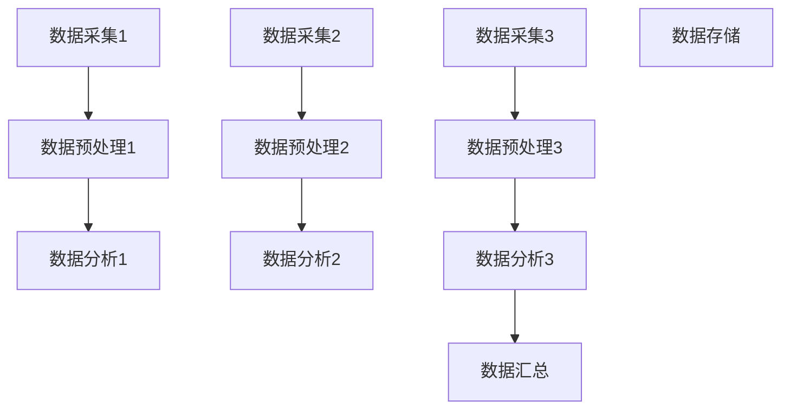

                 

### 第1章: 引言

#### 1.1 问题背景

随着计算机技术和并行计算理论的不断进步，并行程序设计已经成为现代计算机系统中的一个重要研究方向。传统的并行程序设计方法，如任务并行（Task Parallelism）和数据并行（Data Parallelism），虽然在某种程度上提高了程序的性能，但仍然存在一些问题，如效率低下、可扩展性差等。

在并行程序设计中，任务分配和负载平衡是关键问题。传统的方法通常依赖于经验或简单的贪心算法，难以处理复杂依赖关系和处理器性能差异。这种情况下，程序的性能往往受到限制，无法充分利用并行计算的优势。

#### 1.2 问题描述

并行程序设计中的关键问题是如何在多个处理器之间高效地分配任务，以充分利用计算资源并优化程序性能。然而，这一过程往往受到任务间依赖关系、处理器性能差异等因素的影响，导致设计复杂且难以优化。

任务间依赖关系是指一个任务的执行需要依赖于其他任务的执行结果。这种依赖关系在并行程序设计中非常常见，但处理起来却非常困难。传统的方法通常需要遍历所有任务，计算它们的执行顺序和依赖关系，然后进行任务分配。这种方法不仅计算复杂度高，而且难以保证最优解。

处理器性能差异也是一个重要问题。在多核处理器中，不同处理器之间的性能可能存在较大差异。传统的方法通常采用平均性能进行任务分配，这可能导致某些处理器负载过高，而其他处理器则空闲。这种情况下，程序的并行度无法得到充分利用，性能也无法得到优化。

#### 1.3 问题解决

为了解决并行程序设计中的这些问题，研究人员开始探索新的方法，其中偏序理论提供了一种有效的工具。

偏序理论是数学中的一个基本理论，它研究具有偏序关系的集合上的各种性质。偏序关系可以用来描述任务间的依赖关系，通过引入偏序关系，可以形式化地表示任务之间的优先级和依赖关系，从而为并行程序设计提供了一种形式化的方法。

偏序理论在并行程序设计中的应用主要涉及以下几个方面：

1. **任务分配策略**：利用偏序关系，可以设计出更有效的任务分配策略，使得任务能够在不同处理器上并行执行，从而提高程序的并行度和性能。

2. **依赖关系分析**：通过分析任务间的偏序关系，可以识别出关键路径和瓶颈，从而优化程序的结构和执行顺序。

3. **负载平衡**：偏序理论提供了一种形式化的方法来分析处理器的负载情况，从而实现负载平衡，避免资源浪费。

4. **性能优化**：利用偏序理论，可以分析并行程序的性能瓶颈，提出针对性的优化策略，从而提高程序的性能。

#### 1.4 边界与外延

尽管偏序理论在并行程序设计中有很大的应用潜力，但也有一些边界和限制。例如：

1. **模型适应性**：并非所有的并行程序设计问题都可以简单地用偏序理论来描述和解决。因此，需要结合实际情况，选择合适的方法和工具。

2. **计算复杂性**：偏序理论的某些分析过程可能涉及到复杂的计算，需要考虑计算时间和资源消耗。

3. **实际应用场景**：偏序理论在并行程序设计中的应用主要集中在理论研究阶段，实际应用场景相对较少，需要进一步验证和推广。

#### 1.5 概念结构与核心要素组成

偏序理论在并行程序设计中的应用涉及到以下几个核心概念和要素：

1. **任务模型**：描述并行程序中的任务及其属性，如执行时间、依赖关系等。

2. **偏序关系**：定义任务之间的优先级和依赖关系，通常用偏序图来表示。

3. **分配策略**：根据任务模型和偏序关系，设计任务分配策略，实现任务的并行执行。

4. **性能评估**：评估并行程序的执行性能，如响应时间、吞吐量等。

#### 1.6 本章小结

本章介绍了偏序理论在并行程序设计中的应用背景、问题和解决方案。通过对任务模型、偏序关系、分配策略和性能评估等核心概念和要素的分析，为后续章节的详细讨论奠定了基础。下一章将深入探讨偏序理论的基本原理和数学模型。

---

## 第2章: 偏序理论基础

### 2.1 偏序关系的定义

#### 2.1.1 定义与性质

偏序关系是一种数学关系，用来描述集合中元素之间的相对顺序。具体来说，一个集合 \( S \) 上的偏序关系 \( R \) 满足以下性质：

1. **自反性**：对于任意的 \( x \in S \)，有 \( xRx \)。
2. **反对称性**：如果 \( xRy \) 且 \( yRx \)，则 \( x = y \)。
3. **传递性**：如果 \( xRy \) 且 \( yRz \)，则 \( xRz \)。

偏序关系可以用偏序图来表示，其中节点表示集合中的元素，边表示元素间的偏序关系。

#### 2.1.2 例子

一个简单的例子是自然数集合 \( N \) 上的小于等于关系（\(\leq\)）。在这个集合中，任意两个自然数 \( a \) 和 \( b \)，如果 \( a \leq b \)，则 \( a \) 和 \( b \) 之间存在偏序关系。

### 2.2 偏序图

#### 2.2.1 偏序图的概念

偏序图是一种图形表示方法，用来展示集合上的偏序关系。在偏序图中，节点表示集合中的元素，边表示元素间的偏序关系。

#### 2.2.2 偏序图的性质

偏序图具有以下性质：

1. **连通性**：任意两个节点之间都有路径相连。
2. **无环性**：偏序图中不存在环。
3. **唯一性**：给定一个偏序关系，它的偏序图是唯一的。

#### 2.2.3 例子

例如，一个简单的偏序图可以表示为：

在这个偏序图中，任务 A 先于任务 B 执行，任务 B 又先于任务 C 执行。

### 2.3 偏序理论的基本原理

#### 2.3.1 偏序集合

偏序集合是指满足偏序关系的集合。一个集合要成为偏序集合，需要满足以下条件：

1. **完全性**：对于任意两个元素 \( x \) 和 \( y \)，要么 \( x \) 和 \( y \) 是可比的，即存在 \( xRy \) 或 \( yRx \)；要么 \( x \) 和 \( y \) 是可比较的，即 \( xRy \) 且 \( yRx \)。
2. **连通性**：对于任意两个元素 \( x \) 和 \( y \)，存在一个序列 \( x_1, x_2, \ldots, x_n = y \)，使得对于任意 \( 1 \leq i < n \)，有 \( x_iRx_{i+1} \)。

#### 2.3.2 偏序图的最大元和最小元

在一个偏序图中，**最大元**是所有节点的直接后继节点都不存在的节点，即不存在 \( y \) 使得 \( xRy \)。**最小元**是所有节点的直接前继节点都不存在的节点，即不存在 \( y \) 使得 \( yRx \)。

#### 2.3.3 偏序图的覆盖和补集

在一个偏序图中，**覆盖**是指一个子集，其中的任意两个节点都是可比的。**补集**是指一个子集，其中的任意两个节点都是不可比的。

### 2.4 偏序理论在并行程序设计中的应用

#### 2.4.1 任务模型的表示

在并行程序设计中，我们可以使用偏序图来表示任务模型。每个节点表示一个任务，边表示任务间的依赖关系。

#### 2.4.2 任务分配策略

利用偏序图，我们可以设计出更有效的任务分配策略。具体来说，我们可以首先找出偏序图中的最大元和最小元，将它们分配到不同的处理器上执行。然后，逐步处理其他节点，根据它们的依赖关系和执行时间，将它们分配到适当的处理器上。

#### 2.4.3 性能优化

通过分析偏序图，我们可以识别出并行程序中的关键路径和瓶颈。这些信息可以帮助我们优化程序的执行顺序，减少任务间的依赖关系，从而提高程序的并行度和性能。

### 2.5 本章小结

本章介绍了偏序理论的基本概念、性质和应用。通过偏序图和任务模型的表示，我们可以更好地理解和处理并行程序设计中的依赖关系和性能优化问题。下一章将深入探讨偏序理论在并行程序设计中的具体应用，包括任务分配策略和性能评估方法。

---

## 第3章: 偏序理论在并行程序设计中的应用

### 3.1 任务模型表示

在并行程序设计中，任务模型表示是关键的一步。任务模型描述了并行程序中的各个任务及其执行顺序。为了更好地理解任务模型，我们可以使用偏序图来表示。

#### 3.1.1 偏序图表示

在偏序图中，每个节点代表一个任务，节点之间的边表示任务之间的依赖关系。例如，如果任务 A 必须在任务 B 开始之前完成，那么在偏序图中，节点 A 将指向节点 B。

#### 3.1.2 例子

假设有一个简单的并行程序，其中包含三个任务：任务 A、任务 B 和任务 C。任务 A 需要在任务 B 开始之前完成，而任务 B 又需要在任务 C 开始之前完成。这个任务模型可以用以下偏序图表示：

在这个偏序图中，任务 A 是最小元，任务 C 是最大元。

### 3.2 任务分配策略

任务分配策略是并行程序设计中的一个关键问题。一个好的任务分配策略能够充分利用计算资源，提高程序的执行性能。利用偏序理论，我们可以设计出更有效的任务分配策略。

#### 3.2.1 基于偏序图的任务分配策略

基于偏序图的任务分配策略主要分为以下几步：

1. **找出最大元和最小元**：首先，我们需要找出偏序图中的最大元和最小元。最大元是所有节点的直接后继节点都不存在的节点，最小元是所有节点的直接前继节点都不存在的节点。

2. **分配处理器**：将最大元和最小元分配到不同的处理器上执行。这样可以确保任务之间的依赖关系得到满足。

3. **处理其他节点**：对于其他节点，我们需要根据它们的依赖关系和执行时间，将它们分配到适当的处理器上。如果某个处理器的负载过高，我们可以将其中的某些任务重新分配到其他处理器上。

#### 3.2.2 例子

假设我们有四个处理器 \( P_1, P_2, P_3, P_4 \)，并且我们已经通过偏序图找到了最大元和最小元。我们可以将最大元分配到 \( P_1 \) 上执行，最小元分配到 \( P_2 \) 上执行。然后，我们处理其他节点，根据它们的依赖关系和执行时间，将它们分配到适当的处理器上。

在这个例子中，最大元是 \( D \)，最小元是 \( A \)。我们可以将 \( D \) 分配到 \( P_1 \) 上执行，将 \( A \) 分配到 \( P_2 \) 上执行。然后，我们处理其他节点，根据它们的依赖关系和执行时间，将它们分配到适当的处理器上。

### 3.3 性能优化

通过分析偏序图，我们可以识别出并行程序中的关键路径和瓶颈。这些信息可以帮助我们优化程序的执行顺序，减少任务间的依赖关系，从而提高程序的并行度和性能。

#### 3.3.1 关键路径

关键路径是指并行程序中所有任务必须按顺序执行的最长路径。在关键路径上，任意一个任务的延迟都会导致整个程序的延迟。因此，优化关键路径是提高并行程序性能的关键。

#### 3.3.2 瓶颈分析

瓶颈分析是指识别并行程序中的性能瓶颈。性能瓶颈可能是某个处理器负载过高，或者某个任务执行时间过长。通过瓶颈分析，我们可以找出并行程序中的关键瓶颈，并采取相应的优化措施。

#### 3.3.3 优化策略

基于偏序图的性能优化策略包括：

1. **任务重排**：通过重新安排任务的执行顺序，减少任务间的依赖关系，从而缩短关键路径的长度。

2. **负载平衡**：通过调整任务分配策略，使得处理器之间的负载更加均衡，从而提高程序的并行度。

3. **并行度提升**：通过引入并行算法和技术，使得程序能够更好地利用多个处理器，从而提高程序的执行性能。

### 3.4 本章小结

本章介绍了偏序理论在并行程序设计中的应用，包括任务模型表示、任务分配策略和性能优化。通过偏序图和任务模型的表示，我们可以更好地理解和处理并行程序设计中的依赖关系和性能优化问题。下一章将深入探讨偏序理论在并行程序设计中的具体应用案例，包括实际的项目实例和算法实现。

---

## 第4章: 偏序理论在并行程序设计中的应用案例

### 4.1 案例背景

为了更好地理解偏序理论在并行程序设计中的应用，我们选择一个实际的项目案例进行分析。这个案例是一个大规模的分布式计算系统，用于处理大量数据的分析任务。系统需要能够在多个处理器上并行执行，以提高计算效率。

#### 4.1.1 项目介绍

该分布式计算系统名为“大数据分析平台”（Big Data Analytics Platform），主要用于处理来自多个数据源的海量数据。系统需要支持多种数据处理任务，如数据清洗、数据转换、数据分析等。为了提高系统的性能和可扩展性，我们采用并行程序设计的方法。

#### 4.1.2 系统功能设计

大数据分析平台的主要功能包括：

1. **数据采集**：从多个数据源（如数据库、文件系统、实时数据流等）采集数据。
2. **数据预处理**：对采集到的数据进行清洗、去重、格式转换等预处理操作。
3. **数据分析**：对预处理后的数据进行分析，生成报告、图表等。
4. **数据存储**：将分析结果存储到数据库或文件系统中，以便后续查询和使用。

### 4.2 系统架构设计

大数据分析平台的系统架构设计采用分布式计算架构，主要包括以下几个模块：

1. **数据采集模块**：负责从多个数据源采集数据，并将数据传输到数据处理模块。
2. **数据处理模块**：对采集到的数据进行分析处理，包括数据预处理和分析任务。
3. **数据存储模块**：将处理结果存储到数据库或文件系统中。
4. **任务调度模块**：负责任务分配和调度，确保任务能够在多个处理器上高效执行。

系统架构设计如下：

在这个架构中，任务调度模块是关键部分，它需要根据任务模型和偏序关系，设计出合适的任务分配策略。

### 4.3 任务模型表示

在分布式计算系统中，任务模型表示是关键的一步。为了更好地理解任务模型，我们使用偏序图来表示。

#### 4.3.1 偏序图表示

在这个案例中，任务模型可以用以下偏序图表示：

在这个偏序图中，每个节点代表一个任务，边表示任务间的依赖关系。例如，任务 C（数据分析1）依赖于任务 B（数据预处理1）的完成。

### 4.4 任务分配策略

根据偏序图，我们可以设计出合适的任务分配策略。以下是具体的任务分配步骤：

1. **找出最大元和最小元**：首先，我们需要找出偏序图中的最大元和最小元。在这个案例中，最大元是任务 J（数据汇总），最小元是任务 A（数据采集1）。

2. **分配处理器**：将最大元和最小元分配到不同的处理器上执行。这样可以确保任务之间的依赖关系得到满足。例如，将任务 J 分配到处理器 P1 上执行，将任务 A 分配到处理器 P2 上执行。

3. **处理其他节点**：对于其他节点，我们需要根据它们的依赖关系和执行时间，将它们分配到适当的处理器上。如果某个处理器的负载过高，我们可以将其中的某些任务重新分配到其他处理器上。

### 4.5 性能优化

通过分析偏序图，我们可以识别出并行程序中的关键路径和瓶颈。以下是具体的性能优化措施：

1. **任务重排**：通过重新安排任务的执行顺序，减少任务间的依赖关系，从而缩短关键路径的长度。例如，我们可以将数据预处理任务和数据采集任务交换顺序，从而减少数据预处理任务等待数据采集任务完成的时间。

2. **负载平衡**：通过调整任务分配策略，使得处理器之间的负载更加均衡，从而提高程序的并行度。例如，我们可以动态调整任务分配，将负载较高的处理器上的任务分配到负载较低的处理器上执行。

3. **并行度提升**：通过引入并行算法和技术，使得程序能够更好地利用多个处理器，从而提高程序的执行性能。例如，我们可以采用并行数据处理框架，如Hadoop或Spark，来提高数据分析任务的并行度。

### 4.6 项目小结

通过本案例，我们展示了如何使用偏序理论在分布式计算系统中进行任务模型表示、任务分配策略设计和性能优化。偏序理论为并行程序设计提供了一种形式化的方法，可以帮助我们更好地理解和处理并行程序设计中的复杂问题。在实际项目中，结合偏序理论和具体应用场景，我们可以设计出更高效、更可靠的并行程序。

---

## 最佳实践与未来展望

### 4.7 最佳实践

在实际应用偏序理论进行并行程序设计时，以下是一些最佳实践：

1. **清晰的任务模型**：确保任务模型准确地反映了任务之间的依赖关系，这有助于任务分配策略的设计和性能优化。
2. **动态负载平衡**：根据处理器负载的变化动态调整任务分配，避免某些处理器过载，提高系统的整体性能。
3. **并行度评估**：在任务分配之前，对任务执行时间进行评估，确保任务能够高效地并行执行。
4. **测试与优化**：在项目实施过程中，不断测试和优化任务分配策略，以适应不断变化的应用场景。

### 4.8 未来展望

尽管偏序理论在并行程序设计中有很大的应用潜力，但仍然存在一些挑战和待解决的问题：

1. **模型适应性**：如何将偏序理论应用到更广泛的并行程序设计场景，如动态任务分配和动态负载平衡。
2. **计算复杂性**：某些偏序关系的分析过程可能涉及到复杂的计算，如何降低计算复杂性，提高算法的效率。
3. **实际应用验证**：如何在实际项目中验证和推广偏序理论的应用，提高其实用性。

未来研究可以关注以下几个方面：

1. **自适应偏序理论**：研究自适应的偏序理论模型，以适应动态变化的任务分配和负载平衡需求。
2. **分布式系统优化**：在分布式系统中，如何更有效地应用偏序理论，提高系统的可扩展性和性能。
3. **跨领域应用**：探索偏序理论在人工智能、大数据处理等领域的应用潜力，推动并行计算技术的发展。

### 4.9 本章小结

本章通过实际案例展示了偏序理论在并行程序设计中的应用，介绍了任务模型表示、任务分配策略和性能优化方法。同时，提出了最佳实践和未来展望，为读者提供了一些实用的指导和建议。通过深入研究和应用偏序理论，我们可以设计出更高效、更可靠的并行程序，推动计算机技术的发展。

