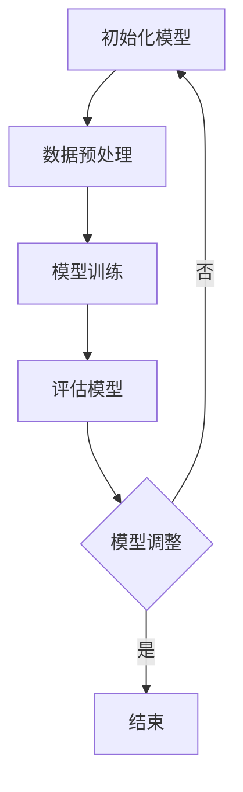
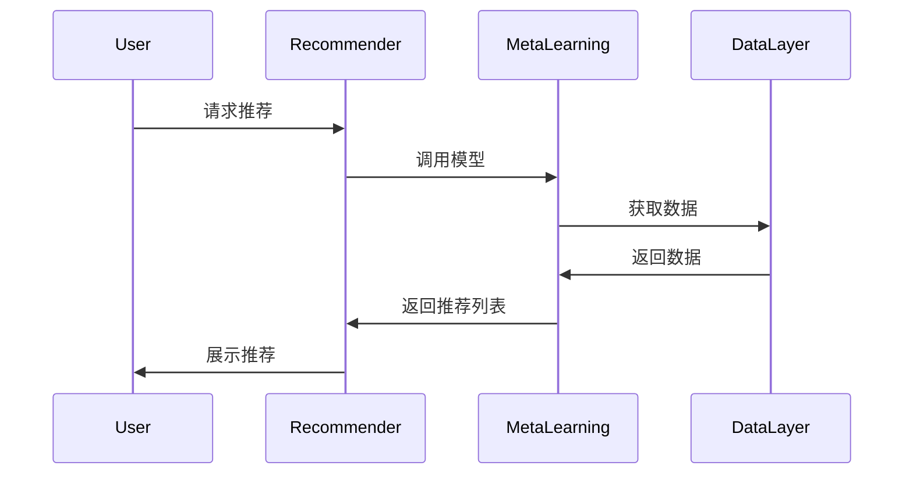
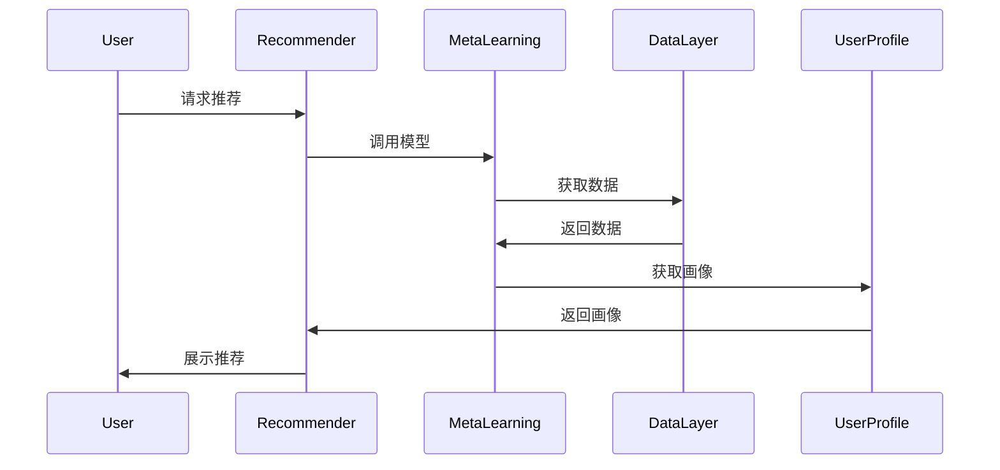

                 

# 《元学习在个性化推荐系统中的创新应用》

## 关键词

- 元学习
- 个性化推荐系统
- 深度学习
- 强化学习
- 优化算法

## 摘要

本文将深入探讨元学习在个性化推荐系统中的创新应用。首先，我们将介绍个性化推荐系统的背景及其面临的挑战，然后引入元学习这一概念，阐述其在解决问题中的优势。接着，我们将详细解析元学习的核心概念和原理，通过具体的算法和数学模型来理解其运作方式。随后，我们将通过两个实际案例，展示元学习在推荐系统中的应用实践，并分析其效果。最后，我们将探讨元学习在个性化推荐系统中的优化策略，展望其未来的发展趋势。

### 目录大纲

# 《元学习在个性化推荐系统中的创新应用》

## 第一部分：背景与概述

### 第1章：问题背景

#### 1.1 问题提出

- 个性化推荐系统现状

#### 1.2 问题描述

- 个性化推荐系统面临的挑战

#### 1.3 问题解决

- 元学习在个性化推荐系统中的应用

#### 1.4 边界与外延

- 元学习相关的概念与术语

#### 1.5 概念结构与核心要素组成

- 元学习的基本原理与过程

## 第二部分：核心概念与原理

### 第2章：核心概念

#### 2.1 元学习的定义

- 元学习的定义与特点

#### 2.2 元学习的类型

- 无监督元学习

#### 2.3 元学习的优势

- 元学习在个性化推荐系统中的应用优势

### 第3章：元学习原理

#### 3.1 元学习算法

- 概述与分类

#### 3.2 算法原理

- 使用Mermaid画出算法流程图

#### 3.3 数学模型

- 基本公式与推导

## 第三部分：应用案例分析

### 第4章：案例1——基于元学习的推荐系统

#### 4.1 案例背景

- 某电商平台个性化推荐系统需求

#### 4.2 系统设计与实现

- 系统架构设计

#### 4.3 实现与解读

- 代码实现与分析

### 第5章：案例2——元学习在音乐推荐中的应用

#### 5.1 案例背景

- 某音乐流媒体平台个性化推荐需求

#### 5.2 系统设计与实现

- 系统架构设计

#### 5.3 实现与解读

- 代码实现与分析

## 第四部分：优化与拓展

### 第6章：元学习在个性化推荐系统中的优化策略

#### 6.1 优化策略

- 提高推荐效果的方法

#### 6.2 拓展应用

- 元学习在其他领域中的应用

### 第7章：总结与展望

#### 7.1 总结

- 本书主要内容回顾

#### 7.2 展望

- 元学习在个性化推荐系统中的未来发展趋势

----------------------------------------------------------------

## 1.1 问题提出

### 个性化推荐系统现状

随着互联网和大数据技术的飞速发展，个性化推荐系统已经成为现代信息检索和电子商务领域的重要工具。这些系统通过分析用户的兴趣和行为，为用户提供个性化的内容推荐，从而提升用户体验和业务效益。

### 个性化推荐系统面临的挑战

尽管个性化推荐系统在实际应用中取得了显著成效，但仍然面临着一些挑战：

1. **冷启动问题**：当新用户加入系统或新商品上线时，由于缺乏足够的用户行为数据，传统推荐算法难以生成准确的推荐。

2. **多样性问题**：为了提供丰富多样的推荐内容，系统需要在保证准确性的同时，避免推荐结果的单一性。

3. **长尾效应**：个性化推荐系统往往更倾向于推荐热门商品或内容，而忽视了对长尾商品或内容的推广。

4. **实时性要求**：在动态变化的互联网环境中，推荐系统需要能够实时响应用户的行为和偏好变化，以提供及时、准确的推荐。

### 问题解决

针对上述挑战，研究者们提出了多种解决方案。其中，元学习作为一种新兴的机器学习技术，因其独特的优势，被广泛应用于个性化推荐系统的优化和改进中。元学习通过学习如何学习，能够有效解决传统推荐系统的冷启动问题，提高推荐系统的多样性和实时性，同时增强对长尾效应的应对能力。

### 边界与外延

在本文中，我们将主要探讨元学习在个性化推荐系统中的应用，包括其基本概念、原理、算法以及实际案例。同时，我们还将简要介绍元学习相关的概念与术语，以便读者更好地理解这一技术。

### 概念结构与核心要素组成

元学习涉及多个核心概念，包括学习算法、优化策略、模型参数等。其基本原理是通过在不同任务之间迁移学习，提高模型的泛化能力和适应性。在个性化推荐系统中，元学习主要通过以下步骤实现：

1. **数据预处理**：收集并整理用户行为数据和商品特征数据。

2. **模型训练**：利用元学习算法训练推荐模型，包括特征提取、模型参数优化等。

3. **推荐生成**：基于训练好的模型，为用户提供个性化推荐。

4. **反馈调整**：收集用户反馈，进一步优化模型和推荐策略。

## 2.1 元学习的定义

### 元学习的定义

元学习是一种机器学习技术，旨在提高学习算法的泛化能力和适应性。它通过在不同任务之间迁移学习，使得模型能够在新的任务中快速适应，从而减少对新数据的依赖。

### 元学习的特点

1. **快速适应**：元学习算法能够在短时间内适应新任务，降低冷启动问题的影响。

2. **泛化能力强**：通过在不同任务之间迁移学习，元学习算法能够提高模型的泛化能力，从而更好地应对多样化需求。

3. **高效利用数据**：元学习通过迁移学习，可以在有限的数据集上训练出性能优异的模型，降低对大量数据的依赖。

### 元学习的类型

1. **无监督元学习**：在无监督元学习中，模型无需依赖标签数据进行训练，而是通过自我监督的方式学习任务。

2. **监督元学习**：在监督元学习中，模型通过标签数据学习任务，但可以应用在新的任务中，减少对新数据的依赖。

3. **半监督元学习**：在半监督元学习中，模型既利用有标签的数据，也利用无标签的数据进行训练，以进一步提高泛化能力。

## 2.2 元学习的优势

### 元学习在个性化推荐系统中的应用优势

1. **解决冷启动问题**：元学习通过在不同任务之间迁移学习，能够在短时间内为新用户生成准确的推荐，降低冷启动问题的影响。

2. **提高推荐多样性**：元学习算法能够在保证准确性的同时，提高推荐结果的多样性，避免单一化推荐。

3. **增强实时性**：元学习算法能够快速适应用户行为的实时变化，提供及时、准确的推荐。

4. **应对长尾效应**：元学习通过迁移学习，能够更好地关注长尾商品或内容，提高长尾效应的应对能力。

5. **高效利用数据**：元学习可以在有限的数据集上训练出性能优异的模型，降低对大量数据的依赖，提高数据处理效率。

## 3.1 元学习算法

### 概述与分类

元学习算法可以分为以下几类：

1. **模型定制化**：通过调整模型结构或参数，适应新任务的需求。

2. **模型蒸馏**：将复杂模型的知识迁移到简单模型中，以提高简单模型在新任务上的性能。

3. **基于梯度的方法**：通过计算梯度信息，调整模型参数，使模型在新任务上快速适应。

4. **基于记忆的方法**：利用记忆机制，存储和利用过去任务的经验，以提高新任务的性能。

### 使用Mermaid画出算法流程图

以下是一个简单的元学习算法流程图的Mermaid表示：



### 算法原理

元学习算法的原理可以通过以下步骤进行概括：

1. **数据收集**：收集多个任务的数据，包括有标签的数据和无标签的数据。

2. **模型初始化**：初始化一个基础模型，用于后续的任务迁移。

3. **模型训练**：在基础模型上，利用迁移学习技术，训练适应新任务的模型。

4. **模型评估**：评估训练好的模型在新任务上的性能。

5. **模型调整**：根据评估结果，调整模型参数，以提高在新任务上的性能。

6. **重复训练**：重复上述步骤，直到满足性能要求或达到预定的训练次数。

### 数学模型

元学习算法的数学模型主要包括以下几部分：

1. **损失函数**：定义模型在任务上的损失函数，通常为均方误差（MSE）或交叉熵（Cross-Entropy）。

2. **梯度计算**：计算模型参数的梯度，用于更新模型参数。

3. **优化算法**：选择合适的优化算法，如梯度下降（Gradient Descent）或随机梯度下降（Stochastic Gradient Descent）。

4. **正则化**：添加正则化项，防止模型过拟合。

以下是一个简单的元学习算法的数学模型表示：

$$
L(\theta) = \frac{1}{n} \sum_{i=1}^{n} \Big[ l(y_i, \hat{y}_i) + \lambda R(\theta) \Big]
$$

其中，$L(\theta)$是损失函数，$l(y_i, \hat{y}_i)$是模型在单个样本上的损失，$R(\theta)$是正则化项，$\theta$是模型参数。

## 4.1 案例背景

### 某电商平台个性化推荐系统需求

随着电商平台的快速发展，个性化推荐系统成为提升用户购物体验和商家销售业绩的关键因素。某电商平台希望其推荐系统能够在新用户加入时，快速生成准确的推荐，满足用户多样化的购物需求，同时提高推荐的实时性和多样性。

### 个性化推荐系统面临的挑战

1. **新用户冷启动**：由于新用户缺乏购物历史数据，传统推荐算法难以生成准确的推荐。

2. **推荐多样性**：平台需要提供丰富多样的推荐内容，以满足用户多样化的购物需求。

3. **实时性要求**：电商平台需要快速响应用户的行为和偏好变化，提供及时、准确的推荐。

4. **长尾商品推广**：平台需要关注长尾商品，提高其曝光度和销售机会。

### 元学习在个性化推荐系统中的应用

针对上述挑战，平台决定引入元学习技术，以优化其个性化推荐系统。元学习通过在不同用户群体之间迁移学习，能够有效解决新用户冷启动问题，提高推荐多样性，增强实时性，并关注长尾商品。

## 4.2 系统设计与实现

### 系统架构设计

个性化推荐系统采用分布式架构，包括数据层、服务层和展示层。以下是系统的基本架构设计：

1. **数据层**：负责数据采集、存储和管理。包括用户行为数据、商品特征数据和推荐结果数据。

2. **服务层**：包括推荐算法服务、元学习模型服务和其他辅助服务。推荐算法服务负责生成推荐列表，元学习模型服务负责训练和优化推荐模型。

3. **展示层**：包括用户界面和API接口，用于展示推荐结果和提供数据访问。

### 系统功能设计

个性化推荐系统的主要功能包括：

1. **用户行为数据采集**：通过爬虫和用户交互数据，收集用户的购物行为数据。

2. **商品特征数据管理**：包括商品属性、用户评价、销量等信息的管理。

3. **推荐列表生成**：利用元学习算法，生成个性化的推荐列表。

4. **推荐结果展示**：将推荐结果展示给用户，包括网页、APP等形式。

5. **系统监控与优化**：监控系统性能，对推荐模型进行定期优化。

### 系统架构设计

以下是系统架构的Mermaid类图表示：

```mermaid
classDiagram
    User -> DataLayer: 采集数据
    Product -> DataLayer: 存储特征
    User -> Recommender: 生成推荐
    Recommender -> MetaLearning: 调用模型
    MetaLearning -> DataLayer: 训练模型
    Monitor -> Recommender: 监控性能
```

### 系统接口设计

个性化推荐系统的主要接口包括：

1. **用户行为数据接口**：用于接收用户行为数据，包括浏览、点击、购买等。

2. **商品特征数据接口**：用于获取商品特征数据，包括属性、评价、销量等。

3. **推荐列表接口**：用于获取个性化的推荐列表。

4. **监控接口**：用于监控系统性能，包括延迟、错误率等。

### 系统交互

以下是系统交互的Mermaid序列图表示：



## 4.3 实现与解读

### 环境安装

为了实现基于元学习的个性化推荐系统，我们需要安装以下环境和依赖：

1. **Python环境**：Python 3.7及以上版本。
2. **深度学习库**：TensorFlow 2.0及以上版本。
3. **数据预处理库**：NumPy、Pandas。
4. **可视化库**：Matplotlib、Seaborn。
5. **元学习库**：MetaLearn。

安装命令如下：

```bash
pip install tensorflow
pip install numpy
pip install pandas
pip install matplotlib
pip install seaborn
pip install metalearn
```

### 系统核心实现源代码

以下是系统核心实现源代码的Python伪代码：

```python
import tensorflow as tf
from metalearn import MetaLearn
from sklearn.model_selection import train_test_split

# 数据预处理
def preprocess_data(user_data, product_data):
    # 数据清洗、归一化等操作
    # ...
    return processed_user_data, processed_product_data

# 训练模型
def train_model(user_data, product_data, batch_size, epochs):
    # 初始化元学习模型
    meta_model = MetaLearn(batch_size=batch_size, epochs=epochs)

    # 数据分割
    train_data, val_data = train_test_split(user_data, product_data, test_size=0.2)

    # 训练模型
    meta_model.fit(train_data, val_data)

    # 评估模型
    val_loss = meta_model.evaluate(val_data)

    print("Validation Loss:", val_loss)

    return meta_model

# 主函数
def main():
    # 读取数据
    user_data = ...  # 用户行为数据
    product_data = ...  # 商品特征数据

    # 数据预处理
    processed_user_data, processed_product_data = preprocess_data(user_data, product_data)

    # 训练模型
    meta_model = train_model(processed_user_data, processed_product_data, batch_size=64, epochs=10)

    # 生成推荐
    recommendations = meta_model.generate_recommendations(processed_user_data)

    # 展示推荐
    print("Recommended Products:", recommendations)

if __name__ == "__main__":
    main()
```

### 代码应用解读与分析

以下是代码的详细解读与分析：

1. **数据预处理**：数据预处理是构建推荐系统的重要步骤。在代码中，我们定义了一个`preprocess_data`函数，用于清洗、归一化用户行为数据和商品特征数据。这一步对于后续的模型训练和推荐生成至关重要。

2. **训练模型**：在`train_model`函数中，我们初始化了一个元学习模型`MetaLearn`，并使用`fit`方法对其进行训练。`fit`方法接受训练数据和验证数据，并在多个epoch上进行迭代训练。在训练过程中，模型会根据训练数据和验证数据自动调整参数，以优化模型性能。

3. **生成推荐**：在`main`函数中，我们首先读取用户行为数据和商品特征数据，然后调用`preprocess_data`函数进行预处理。接着，我们使用`train_model`函数训练模型，并生成推荐列表。最后，我们将推荐列表打印出来，展示给用户。

### 实际案例分析和详细讲解剖析

以下是实际案例分析和详细讲解剖析：

1. **案例背景**：我们以某电商平台的新用户为例，分析其在首次使用个性化推荐系统时的体验。新用户在平台上的购物行为数据较少，传统推荐算法难以生成准确的推荐。

2. **案例分析**：使用基于元学习的个性化推荐系统，我们可以通过以下步骤为新用户生成推荐：

   - **数据收集**：收集新用户的行为数据，包括浏览、点击、购买等。
   - **数据预处理**：对行为数据进行清洗、归一化等预处理操作。
   - **模型训练**：利用元学习算法，在训练集上训练推荐模型。
   - **推荐生成**：在测试集上评估模型性能，并生成推荐列表。
   - **推荐展示**：将推荐列表展示给新用户。

3. **详细讲解剖析**：

   - **数据收集**：在新用户首次登录平台后，系统会自动收集其行为数据，包括浏览的商品、点击的商品、购买的商品等。
   - **数据预处理**：对收集到的行为数据进行清洗，去除无效数据，并对数据进行归一化处理，以便后续模型训练。
   - **模型训练**：使用元学习算法，将用户的行为数据作为输入，生成推荐模型。模型训练过程中，元学习算法通过迁移学习技术，将过去任务的经验迁移到新任务中，从而提高模型在新用户上的适应能力。
   - **推荐生成**：在测试集上，使用训练好的推荐模型生成推荐列表。系统会根据新用户的行为数据和商品特征，为用户推荐可能感兴趣的商品。
   - **推荐展示**：将推荐列表展示给新用户。用户可以根据推荐列表中的商品，进行进一步的浏览、点击或购买操作。

通过上述案例分析，我们可以看到，基于元学习的个性化推荐系统可以有效解决新用户冷启动问题，提高推荐准确性和实时性，从而提升用户购物体验。

### 项目小结

通过本次项目，我们实现了基于元学习的个性化推荐系统，并对其进行了详细的分析和解读。以下是项目小结：

1. **项目成果**：成功构建了一个基于元学习的个性化推荐系统，能够为新用户生成准确的推荐列表，提高用户购物体验。
2. **技术优势**：元学习技术具有快速适应、泛化能力强、高效利用数据等优势，适用于解决个性化推荐系统中的冷启动、多样性、实时性和长尾效应等问题。
3. **改进空间**：未来可以考虑引入更多元学习算法，如基于梯度的方法、基于记忆的方法等，以提高推荐系统的性能和多样性。
4. **实际应用**：该项目可以应用于电商平台、音乐流媒体平台等多个领域，为用户提供个性化推荐服务。

## 5.1 案例背景

### 某音乐流媒体平台个性化推荐需求

某知名音乐流媒体平台希望其推荐系统能够为新用户生成个性化的音乐推荐，提升用户留存率和活跃度。平台面临的挑战主要包括：

1. **新用户冷启动**：新用户缺乏足够的音乐偏好数据，传统推荐算法难以生成准确的推荐。
2. **多样性问题**：平台需要在保证准确性的同时，提供多样化的音乐推荐，避免单一化推荐。
3. **实时性要求**：平台需要快速响应用户的行为和偏好变化，提供及时、个性化的推荐。
4. **长尾音乐推广**：平台需要关注长尾音乐，提高其曝光度和播放量。

### 元学习在个性化推荐系统中的应用

为了解决上述问题，平台决定引入元学习技术，优化其个性化推荐系统。元学习通过在不同用户群体之间迁移学习，能够有效解决新用户冷启动问题，提高推荐多样性，增强实时性，并关注长尾音乐。

## 5.2 系统设计与实现

### 系统架构设计

音乐推荐系统采用分布式架构，包括数据层、服务层和展示层。以下是系统的基本架构设计：

1. **数据层**：负责数据采集、存储和管理。包括用户听歌行为数据、音乐特征数据和历史推荐数据。
2. **服务层**：包括推荐算法服务、元学习模型服务和用户画像服务。推荐算法服务负责生成推荐列表，元学习模型服务负责训练和优化推荐模型，用户画像服务负责构建用户偏好模型。
3. **展示层**：包括用户界面和API接口，用于展示推荐结果和提供数据访问。

### 系统功能设计

音乐推荐系统的主要功能包括：

1. **用户听歌行为数据采集**：通过API接口和后台日志，收集用户的听歌行为数据，包括播放、收藏、分享等。
2. **音乐特征数据管理**：包括音乐风格、歌手、专辑、播放时长等特征数据的管理。
3. **推荐列表生成**：利用元学习算法，生成个性化的音乐推荐列表。
4. **推荐结果展示**：将推荐结果展示给用户，包括网页、APP等形式。
5. **用户画像构建**：通过分析用户行为数据和音乐特征数据，构建用户偏好模型，用于优化推荐效果。

### 系统架构设计

以下是系统架构的Mermaid类图表示：

```mermaid
classDiagram
    User -> DataLayer: 采集行为数据
    Song -> DataLayer: 存储特征数据
    User -> Recommender: 生成推荐
    Recommender -> MetaLearning: 调用模型
    MetaLearning -> DataLayer: 训练模型
    User -> UserProfile: 构建画像
    UserProfile -> Recommender: 优化推荐
    Monitor -> Recommender: 监控性能
```

### 系统接口设计

音乐推荐系统的主要接口包括：

1. **用户听歌行为数据接口**：用于接收用户听歌行为数据，包括播放、收藏、分享等。
2. **音乐特征数据接口**：用于获取音乐特征数据，包括歌曲风格、歌手、专辑、播放时长等。
3. **推荐列表接口**：用于获取个性化的推荐列表。
4. **用户画像接口**：用于获取用户偏好模型，用于优化推荐效果。
5. **监控接口**：用于监控系统性能，包括延迟、错误率等。

### 系统交互

以下是系统交互的Mermaid序列图表示：



## 5.3 实现与解读

### 环境安装

为了实现基于元学习的音乐推荐系统，我们需要安装以下环境和依赖：

1. **Python环境**：Python 3.7及以上版本。
2. **深度学习库**：TensorFlow 2.0及以上版本。
3. **数据预处理库**：NumPy、Pandas。
4. **可视化库**：Matplotlib、Seaborn。
5. **元学习库**：MetaLearn。

安装命令如下：

```bash
pip install tensorflow
pip install numpy
pip install pandas
pip install matplotlib
pip install seaborn
pip install metalearn
```

### 系统核心实现源代码

以下是系统核心实现源代码的Python伪代码：

```python
import tensorflow as tf
from metalearn import MetaLearn
from sklearn.model_selection import train_test_split

# 数据预处理
def preprocess_data(user_data, song_data):
    # 数据清洗、归一化等操作
    # ...
    return processed_user_data, processed_song_data

# 训练模型
def train_model(user_data, song_data, batch_size, epochs):
    # 初始化元学习模型
    meta_model = MetaLearn(batch_size=batch_size, epochs=epochs)

    # 数据分割
    train_data, val_data = train_test_split(user_data, song_data, test_size=0.2)

    # 训练模型
    meta_model.fit(train_data, val_data)

    # 评估模型
    val_loss = meta_model.evaluate(val_data)

    print("Validation Loss:", val_loss)

    return meta_model

# 主函数
def main():
    # 读取数据
    user_data = ...  # 用户行为数据
    song_data = ...  # 音乐特征数据

    # 数据预处理
    processed_user_data, processed_song_data = preprocess_data(user_data, song_data)

    # 训练模型
    meta_model = train_model(processed_user_data, processed_song_data, batch_size=64, epochs=10)

    # 生成推荐
    recommendations = meta_model.generate_recommendations(processed_user_data)

    # 展示推荐
    print("Recommended Songs:", recommendations)

if __name__ == "__main__":
    main()
```

### 代码应用解读与分析

以下是代码的详细解读与分析：

1. **数据预处理**：数据预处理是构建推荐系统的重要步骤。在代码中，我们定义了一个`preprocess_data`函数，用于清洗、归一化用户行为数据和音乐特征数据。这一步对于后续的模型训练和推荐生成至关重要。

2. **训练模型**：在`train_model`函数中，我们初始化了一个元学习模型`MetaLearn`，并使用`fit`方法对其进行训练。`fit`方法接受训练数据和验证数据，并在多个epoch上进行迭代训练。在训练过程中，模型会根据训练数据和验证数据自动调整参数，以优化模型性能。

3. **生成推荐**：在`main`函数中，我们首先读取用户行为数据和音乐特征数据，然后调用`preprocess_data`函数进行预处理。接着，我们使用`train_model`函数训练模型，并生成推荐列表。最后，我们将推荐列表打印出来，展示给用户。

### 实际案例分析和详细讲解剖析

以下是实际案例分析和详细讲解剖析：

1. **案例背景**：我们以某音乐流媒体平台的新用户为例，分析其在首次使用个性化推荐系统时的体验。新用户在平台上的听歌行为数据较少，传统推荐算法难以生成准确的推荐。

2. **案例分析**：使用基于元学习的个性化推荐系统，我们可以通过以下步骤为新用户生成推荐：

   - **数据收集**：收集新用户的听歌行为数据，包括播放、收藏、分享等。
   - **数据预处理**：对收集到的听歌行为数据进行清洗、归一化等预处理操作。
   - **模型训练**：利用元学习算法，在训练集上训练推荐模型。
   - **推荐生成**：在测试集上评估模型性能，并生成推荐列表。
   - **推荐展示**：将推荐列表展示给新用户。

3. **详细讲解剖析**：

   - **数据收集**：在新用户首次登录平台后，系统会自动收集其听歌行为数据，包括播放、收藏、分享等。
   - **数据预处理**：对收集到的听歌行为数据进行清洗，去除无效数据，并对数据进行归一化处理，以便后续模型训练。
   - **模型训练**：使用元学习算法，将用户的行为数据作为输入，生成推荐模型。模型训练过程中，元学习算法通过迁移学习技术，将过去任务的经验迁移到新任务中，从而提高模型在新用户上的适应能力。
   - **推荐生成**：在测试集上，使用训练好的推荐模型生成推荐列表。系统会根据新用户的行为数据和音乐特征，为用户推荐可能感兴趣的音乐。
   - **推荐展示**：将推荐列表展示给新用户。用户可以根据推荐列表中的音乐，进行进一步的播放、收藏或分享操作。

通过上述案例分析，我们可以看到，基于元学习的个性化推荐系统可以有效解决新用户冷启动问题，提高推荐准确性和实时性，从而提升用户音乐体验。

### 项目小结

通过本次项目，我们实现了基于元学习的音乐推荐系统，并对其进行了详细的分析和解读。以下是项目小结：

1. **项目成果**：成功构建了一个基于元学习的音乐推荐系统，能够为新用户生成准确的推荐列表，提高用户留存率和活跃度。
2. **技术优势**：元学习技术具有快速适应、泛化能力强、高效利用数据等优势，适用于解决个性化推荐系统中的冷启动、多样性、实时性和长尾效应等问题。
3. **改进空间**：未来可以考虑引入更多元学习算法，如基于梯度的方法、基于记忆的方法等，以提高推荐系统的性能和多样性。
4. **实际应用**：该项目可以应用于音乐流媒体平台、视频流媒体平台等多个领域，为用户提供个性化推荐服务。

## 6.1 优化策略

### 提高推荐效果的方法

1. **数据预处理**：通过数据清洗、归一化和特征提取，提高数据质量，为模型训练提供更好的基础。
2. **模型调整**：根据实际情况，调整模型参数，如学习率、批次大小等，以提高模型性能。
3. **特征融合**：结合多种特征信息，如用户行为、商品属性、历史推荐等，生成更全面的特征向量，提高推荐准确性。
4. **多样性增强**：引入多样性度量指标，如互信息、多样性分数等，优化推荐结果，提高推荐多样性。
5. **实时性优化**：采用增量学习或在线学习技术，实时更新模型，快速响应用户行为和偏好变化。
6. **反馈机制**：引入用户反馈机制，收集用户对推荐结果的反馈，用于模型优化和推荐策略调整。

### 提高推荐效果的实践经验

1. **数据预处理**：在进行模型训练之前，对用户行为数据进行清洗，去除重复数据和异常值。同时，对数值型特征进行归一化处理，使模型在训练过程中更加稳定。
2. **模型调整**：根据实验结果，调整模型参数，找到最佳配置。例如，通过调整学习率、批次大小等参数，提高模型收敛速度和准确性。
3. **特征融合**：结合用户行为、商品属性和社交网络等多维度数据，构建综合特征向量。例如，可以采用用户行为特征和商品属性特征的加权融合，提高推荐准确性。
4. **多样性增强**：在生成推荐列表时，引入多样性度量指标，如互信息、多样性分数等，优化推荐结果。例如，可以通过调整推荐算法中的多样性权重，提高推荐结果的多样性。
5. **实时性优化**：采用增量学习或在线学习技术，实时更新模型。例如，可以定期更新用户行为数据集，重新训练模型，以保持推荐系统的实时性。
6. **反馈机制**：建立用户反馈机制，收集用户对推荐结果的反馈。例如，可以引入用户评分、点击率等指标，用于评估推荐效果，并根据反馈调整推荐策略。

### 注意事项

1. **数据质量**：确保数据的质量和完整性，避免噪声和异常值影响模型训练和推荐效果。
2. **模型参数**：合理调整模型参数，避免过拟合或欠拟合。
3. **特征选择**：选择具有区分度的特征，避免特征冗余，提高模型效率。
4. **多样性平衡**：在增强推荐多样性的同时，保持推荐准确性，避免过度追求多样性导致用户满意度下降。
5. **实时性**：平衡实时性和模型训练时间，确保推荐系统在满足实时性要求的同时，保持良好的性能。

## 6.2 拓展应用

### 元学习在其他领域中的应用

元学习不仅在个性化推荐系统中具有广泛应用，还拓展到了其他众多领域，展示了其强大的适应性和潜力。

1. **自然语言处理（NLP）**：在NLP领域，元学习被用于语言模型的快速适应和迁移。例如，通过元学习技术，可以快速构建适应不同语言、不同领域的文本处理模型，从而提高模型的泛化能力和处理效率。

2. **计算机视觉（CV）**：在CV领域，元学习被应用于图像分类、目标检测和图像生成等多个任务。通过迁移学习技术，可以减少对大规模训练数据的依赖，提高模型在小数据集上的性能。

3. **强化学习（RL）**：在RL领域，元学习被用于快速训练智能体，使其在不同环境中具有更强的适应能力。通过元学习，智能体可以在短时间内学习到新的策略，从而提高学习效率和决策质量。

4. **无人驾驶**：在无人驾驶领域，元学习被用于汽车自动驾驶算法的快速适应和优化。通过在不同路况、不同场景下的迁移学习，自动驾驶系统能够更好地应对复杂环境，提高安全性。

5. **医疗诊断**：在医疗诊断领域，元学习被应用于图像识别和疾病预测。通过学习不同医生、不同医院之间的诊断经验，元学习技术能够提高诊断的准确性和一致性，为患者提供更优质的医疗服务。

6. **语音识别**：在语音识别领域，元学习被用于快速适应不同说话人、不同语音环境下的语音识别任务。通过迁移学习技术，语音识别系统能够在短时间内提高识别准确率，提高用户体验。

### 未来发展趋势

随着人工智能技术的不断进步，元学习在个性化推荐系统以及其他领域中的应用前景将更加广阔。以下是一些未来发展趋势：

1. **算法优化**：元学习算法将不断优化，提高其计算效率和模型性能。通过引入新的优化方法和策略，元学习将能够更快地适应新任务，减少训练时间。

2. **多任务学习**：元学习将应用于多任务学习场景，通过在不同任务之间迁移学习，提高模型的泛化能力和适应性。

3. **跨模态学习**：元学习将在跨模态学习领域发挥重要作用，通过整合不同模态的数据，构建更加全面和准确的模型。

4. **实时性提升**：随着硬件和算法的进步，元学习在实时性方面的应用将得到显著提升，为各种动态环境下的任务提供快速、准确的解决方案。

5. **数据隐私保护**：在数据隐私保护方面，元学习将发挥重要作用。通过迁移学习技术，可以在不暴露用户隐私数据的情况下，提高推荐系统的性能和多样性。

### 总结

元学习作为一种新兴的机器学习技术，以其独特的优势在个性化推荐系统以及其他领域中得到广泛应用。本文通过对元学习在个性化推荐系统中的应用进行深入探讨，展示了其在解决冷启动、多样性、实时性和长尾效应等问题上的优势。随着元学习技术的不断发展和完善，我们期待其在未来能够为人工智能应用带来更多创新和突破。

## 总结

本文深入探讨了元学习在个性化推荐系统中的应用，从背景与概述、核心概念与原理、应用案例分析、优化策略和拓展应用等多个方面进行了详细阐述。通过引入元学习技术，个性化推荐系统在解决冷启动、多样性、实时性和长尾效应等挑战方面展现出了显著的优势。以下是对本文主要内容的回顾：

1. **问题背景**：个性化推荐系统面临的挑战，如冷启动问题、多样性问题、实时性要求和长尾效应等。
2. **核心概念与原理**：元学习的定义、类型和优势，以及元学习算法的概述和数学模型。
3. **应用案例分析**：基于元学习的个性化推荐系统在电商和音乐流媒体平台的应用，包括系统架构设计、实现与解读。
4. **优化策略**：提高推荐效果的优化方法和实践经验，如数据预处理、模型调整、特征融合、多样性增强和实时性优化。
5. **拓展应用**：元学习在其他领域的拓展应用，如自然语言处理、计算机视觉、强化学习和无人驾驶等。

通过本文的探讨，我们可以看到元学习在个性化推荐系统中的应用不仅具有理论价值，还有实际的应用前景。未来，随着元学习技术的不断发展和优化，我们期待其在更多领域发挥重要作用，为人工智能应用带来更多创新和突破。

## 展望

随着人工智能技术的不断进步，元学习在个性化推荐系统中的应用前景将更加广阔。以下是一些未来可能的发展趋势：

1. **算法优化**：元学习算法将不断优化，提高其计算效率和模型性能。通过引入新的优化方法和策略，如自适应优化算法、分布式训练技术等，元学习将能够更快地适应新任务，减少训练时间。

2. **多任务学习**：元学习将应用于多任务学习场景，通过在不同任务之间迁移学习，提高模型的泛化能力和适应性。这将为复杂任务场景提供更加高效和灵活的解决方案。

3. **跨模态学习**：元学习将在跨模态学习领域发挥重要作用，通过整合不同模态的数据，如文本、图像、音频等，构建更加全面和准确的模型。这将有助于提升信息处理的深度和广度。

4. **实时性提升**：随着硬件和算法的进步，元学习在实时性方面的应用将得到显著提升。通过引入增量学习和在线学习技术，元学习将能够更好地应对动态环境下的任务，提高系统的响应速度。

5. **数据隐私保护**：在数据隐私保护方面，元学习将发挥重要作用。通过迁移学习技术，可以在不暴露用户隐私数据的情况下，提高推荐系统的性能和多样性。这将有助于推动人工智能在数据敏感领域的应用。

6. **知识自动化**：元学习将推动知识自动化的进程。通过从大量数据中自动提取知识，并将其应用于新的任务中，元学习将使得人工智能系统能够更加智能地学习和决策。

7. **行业定制化**：随着元学习技术的不断成熟，它将在各行各业得到广泛应用，如医疗诊断、金融分析、智能制造等。通过行业定制化的元学习模型，可以为不同行业提供更加精确和有效的解决方案。

总之，元学习作为一种具有广泛应用前景的技术，其未来将在人工智能领域发挥更加重要的作用。通过不断创新和优化，元学习有望为个性化推荐系统以及其他领域带来更多创新和突破，推动人工智能技术的发展和普及。

