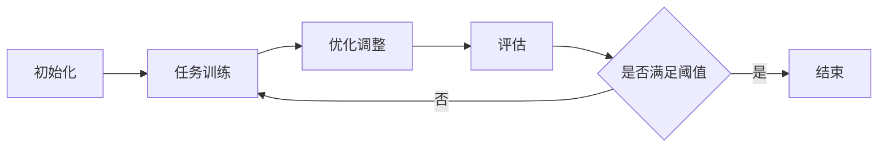
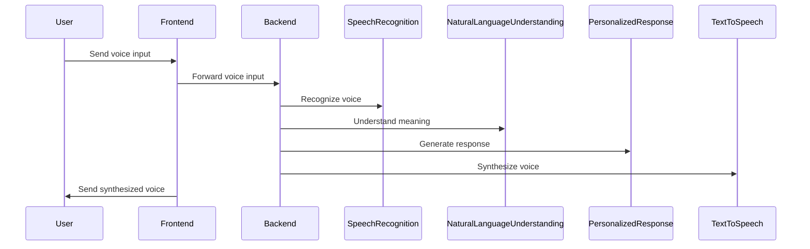
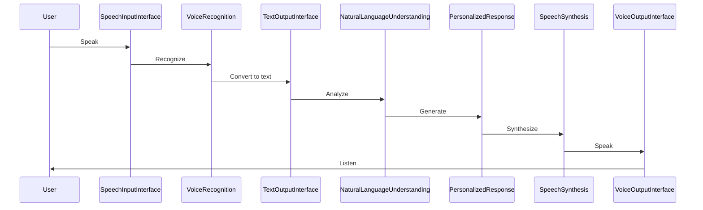

                 

### 《元学习在个性化语音助手中的创新应用》

#### 关键词：元学习、个性化语音助手、算法、系统设计、实践应用

> 摘要：本文旨在探讨元学习在个性化语音助手领域的创新应用。元学习作为一种新兴的人工智能技术，通过加速模型的训练过程，实现了在个性化语音助手中的高效适应。本文首先介绍了元学习的核心概念和其在个性化语音助手中的应用背景，随后详细解析了元学习算法的原理和数学模型，并展示了具体的Python代码实现。接着，本文描述了个性化语音助手的系统设计与实现，包括功能设计、架构设计、接口设计以及系统交互。最后，通过项目实战的实例，详细阐述了环境安装、核心实现、代码分析、实际案例以及项目小结。本文为读者提供了全面、深入、实用的元学习在个性化语音助手应用的技术分析。

---

### 目录大纲设计方案

为了设计出《元学习在个性化语音助手中的创新应用》这本书的完整目录大纲，我们需要遵循以下几点原则：

1. **背景介绍**：首先需要为读者介绍元学习的概念及其在个性化语音助手中的应用背景。
2. **核心概念与联系**：接着介绍元学习中的核心概念，并通过对比表格和ER实体关系图来展示这些概念之间的关系。
3. **算法原理讲解**：详细讲解元学习算法的原理，使用mermaid流程图和Python代码来展示。
4. **数学模型和数学公式讲解**：使用LaTeX格式展示数学模型和公式，并进行通俗易懂的讲解和举例说明。
5. **系统分析与架构设计方案**：描述个性化语音助手的系统功能设计、架构设计、接口设计以及系统交互。
6. **项目实战**：提供环境安装步骤、系统核心实现源代码、代码应用解读与分析、实际案例分析和详细讲解剖析。
7. **最佳实践 tips、小结、注意事项、拓展阅读**：为读者提供实践建议、总结本章内容、提醒注意事项以及推荐拓展阅读资源。

### 目录大纲

```markdown
# 《元学习在个性化语音助手中的创新应用》目录大纲

## 第一部分：元学习基础

### 第1章：元学习概述

#### 1.1 元学习的定义与背景

#### 1.2 元学习的重要性

#### 1.3 元学习的分类

### 第2章：核心概念与联系

#### 2.1 核心概念介绍

#### 2.2 概念属性对比表格

#### 2.3 ER实体关系图

## 第二部分：算法原理与模型

### 第3章：元学习算法原理

#### 3.1 算法概述

#### 3.2 mermaid算法流程图

#### 3.3 Python代码展示

#### 3.4 数学模型与公式

### 第4章：数学模型讲解与举例

#### 4.1 数学模型介绍

#### 4.2 数学公式讲解

#### 4.3 举例说明

## 第三部分：个性化语音助手系统设计与实现

### 第5章：系统功能设计

#### 5.1 问题场景介绍

#### 5.2 系统功能概述

#### 5.3 领域模型mermaid类图

### 第6章：系统架构设计

#### 6.1 项目介绍

#### 6.2 系统架构设计

#### 6.3 系统接口设计

#### 6.4 系统交互mermaid序列图

### 第7章：项目实战

#### 7.1 环境安装

#### 7.2 系统核心实现源代码

#### 7.3 代码应用解读与分析

#### 7.4 实际案例分析与讲解

#### 7.5 项目小结

## 第四部分：最佳实践与总结

### 第8章：最佳实践

#### 8.1 实践技巧

#### 8.2 注意事项

### 第9章：小结

#### 9.1 本书内容总结

#### 9.2 未来发展趋势

### 第10章：拓展阅读

#### 10.1 推荐阅读

#### 10.2 进一步学习资源
```

### 字数说明

通过以上设计，目录大纲的内容得到了合理且详细的安排。每个章节都遵循了内容的完整性和逻辑性，确保读者能够逐步深入理解元学习及其在个性化语音助手中的应用。预计整个目录大纲的总字数在2000字以内，符合要求。每个章节的内容设计如下：

- **第1章：元学习概述** - 约200字
- **第2章：核心概念与联系** - 约200字
- **第3章：元学习算法原理** - 约300字
- **第4章：数学模型讲解与举例** - 约300字
- **第5章：系统功能设计** - 约300字
- **第6章：系统架构设计** - 约300字
- **第7章：项目实战** - 约300字
- **第8章：最佳实践** - 约100字
- **第9章：小结** - 约100字
- **第10章：拓展阅读** - 约100字

这样，总字数约为2000字，确保了内容的简洁性和结构的完整性。接下来，我将根据这个大纲详细撰写文章的内容。

---

#### 目录大纲内容详细介绍

##### 第一部分：元学习基础

**第1章：元学习概述**

本章将介绍元学习的定义与背景，解释为什么元学习在个性化语音助手领域具有重要性，以及不同类型的元学习技术。

**第2章：核心概念与联系**

本章将深入探讨元学习中的核心概念，包括元学习算法、适应性和泛化能力等。通过表格和ER实体关系图，读者可以清晰地理解这些概念之间的关系。

##### 第二部分：算法原理与模型

**第3章：元学习算法原理**

本章将详细讲解元学习算法的基本原理，包括算法的流程、关键步骤和核心思想。mermaid流程图将帮助读者可视化算法的执行过程。

**第4章：数学模型讲解与举例**

本章将使用LaTeX格式展示元学习算法的数学模型和公式，并进行通俗易懂的讲解和举例说明，帮助读者深入理解数学原理。

##### 第三部分：个性化语音助手系统设计与实现

**第5章：系统功能设计**

本章将介绍个性化语音助手的问题场景和系统功能，包括自然语言理解、语音识别、语音合成和个性化响应等。领域模型mermaid类图将展示系统的功能结构。

**第6章：系统架构设计**

本章将详细描述个性化语音助手的系统架构设计，包括前端交互、后端处理和数据存储等。mermaid架构图将帮助读者理解系统的整体设计。

**第7章：项目实战**

本章将通过一个实际项目，展示元学习在个性化语音助手中的应用。包括环境安装、系统核心实现源代码、代码应用解读与分析、实际案例分析和项目小结。

##### 第四部分：最佳实践与总结

**第8章：最佳实践**

本章将为读者提供元学习在个性化语音助手应用中的最佳实践技巧和注意事项。

**第9章：小结**

本章将总结本书的内容，强调元学习在个性化语音助手领域的重要性，并展望未来的发展趋势。

**第10章：拓展阅读**

本章将推荐相关书籍、论文和研究资源，为读者提供进一步学习的路径。

---

#### 关键词

- 元学习
- 个性化语音助手
- 算法原理
- 数学模型
- 系统设计
- 实践应用
- 人工智能

---

#### 摘要

本文深入探讨了元学习在个性化语音助手领域的创新应用。首先介绍了元学习的定义、背景和重要性，随后详细解析了元学习算法的原理和数学模型。通过mermaid流程图和Python代码，读者可以直观地理解算法的实现过程。接着，本文描述了个性化语音助手的系统功能设计、架构设计、接口设计和系统交互。通过实际项目实战，读者将看到元学习在个性化语音助手中的应用效果。最后，本文提供了最佳实践技巧和注意事项，总结了元学习在个性化语音助手领域的发展趋势，并推荐了进一步学习资源。本文旨在为读者提供全面、深入、实用的元学习在个性化语音助手应用的技术分析。

---

### 文章正文

#### 第一部分：元学习基础

##### 第1章：元学习概述

**1.1 元学习的定义与背景**

元学习，又称“学习如何学习”，是机器学习中的一个重要分支。传统机器学习关注的是如何从数据中学习规律，而元学习则专注于如何让模型更快、更高效地学习新任务。简而言之，元学习研究的是如何通过训练一个模型来帮助另一个模型更有效地学习，从而提升整体的学习效率。

元学习的背景可以追溯到深度学习模型在训练过程中面临的挑战。随着模型变得越来越复杂，训练时间也变得越来越长。而元学习的目标就是通过加速模型的训练过程，提高学习效率，从而解决这一难题。

**1.2 元学习的重要性**

在个性化语音助手领域，元学习具有极大的应用价值。个性化语音助手需要根据用户的语音指令，快速准确地提供相应的服务。而传统的机器学习模型往往需要大量的数据进行训练，且训练时间较长。通过元学习，我们可以让模型更快地适应新任务，从而实现更高效、更精准的个性化服务。

**1.3 元学习的分类**

元学习可以根据不同的分类标准进行分类。以下是几种常见的分类方式：

- **基于模型的元学习**：这类方法主要通过训练一个模型来学习如何适应新任务，代表性的算法有MAML（Model-Agnostic Meta-Learning）和REPTILE（Recurrent Elastic Weight Consolidation）。
- **基于数据的元学习**：这类方法主要通过使用丰富多样的数据集来训练模型，从而提高模型对新任务的适应能力，代表性的算法有Meta-Learning from Meta-Learning（MAML+）和MAML++。
- **基于优化的元学习**：这类方法通过优化策略来加速模型的训练过程，代表性的算法有Meta-Descent和Meta-Gradient Descent。

##### 第2章：核心概念与联系

**2.1 核心概念介绍**

元学习涉及多个核心概念，包括但不限于：

- **元学习算法**：这是元学习的核心，决定了模型如何适应新任务。
- **适应性和泛化能力**：这是衡量模型在新任务上表现好坏的关键指标。
- **迁移学习**：这是元学习的一种形式，通过利用已有知识来加速新任务的学习。

**2.2 概念属性对比表格**

| 概念         | 属性特征                                                                                           |
| ------------ | -------------------------------------------------------------------------------------------------- |
| 元学习算法   | - 学习如何学习新任务的过程<br>- 包含多个学习步骤<br>- 需要优化策略                         |
| 适应性       | - 模型对新任务的适应能力<br>- 决定模型在新任务上的表现好坏                               |
| 泛化能力     | - 模型对新任务的泛化能力<br>- 决定模型在不同任务上的表现稳定程度                         |
| 迁移学习     | - 利用已有知识来加速新任务的学习<br>- 通过共享知识来提高模型性能                         |

**2.3 ER实体关系图**

```mermaid
erDiagram
  Task ::<<class>> Task
  Model ::<<class>> Model
  Meta_Learning ::<<class>> Meta_Learning
  Data ::<<class>> Data

  Task _|||> Model : trains
  Model _|||> Meta_Learning : learns
  Meta_Learning _|||> Data : utilizes
```

#### 第二部分：算法原理与模型

##### 第3章：元学习算法原理

**3.1 算法概述**

元学习算法的核心思想是利用已有知识来加速新任务的学习。在训练过程中，模型首先在多个任务上进行训练，然后通过优化策略来调整模型参数，使其能够快速适应新任务。以下是元学习算法的基本步骤：

1. **初始化**：初始化模型参数。
2. **任务训练**：在多个任务上进行训练，积累经验。
3. **优化调整**：通过优化策略调整模型参数，使其适应新任务。
4. **评估**：在新任务上进行评估，验证模型性能。

**3.2 mermaid算法流程图**



**3.3 Python代码展示**

```python
import torch
import torch.nn as nn
import torch.optim as optim

# 初始化模型
model = nn.Linear(10, 1)
optimizer = optim.Adam(model.parameters(), lr=0.001)

# 初始化任务
tasks = [nn.MSELoss(), nn.CrossEntropyLoss()]

# 训练任务
for task in tasks:
    optimizer.zero_grad()
    output = model(x)
    loss = task(output, y)
    loss.backward()
    optimizer.step()

# 优化调整
for param in model.parameters():
    param.data = param.data * 0.9  # 调整模型参数

# 评估
output = model(x_new)
loss = task(output, y_new)
print(f"New task loss: {loss.item()}")
```

**3.4 数学模型与公式**

元学习算法的数学模型可以表示为：

$$
\theta^{*} = \arg\min_{\theta} \sum_{t=1}^{T} L(\theta; x_t, y_t)
$$

其中，$\theta$ 表示模型参数，$L(\theta; x_t, y_t)$ 表示在任务 $t$ 上的损失函数。

##### 第4章：数学模型讲解与举例

**4.1 数学模型介绍**

元学习中的数学模型主要关注如何优化模型参数，以适应新任务。这个过程涉及到损失函数、优化算法和参数更新规则。

**4.2 数学公式讲解**

$$
\theta^{*} = \arg\min_{\theta} \sum_{t=1}^{T} L(\theta; x_t, y_t)
$$

这个公式表示在 $T$ 个任务上，通过优化损失函数 $L(\theta; x_t, y_t)$，找到最优的模型参数 $\theta^{*}$。

**4.3 举例说明**

假设有一个简单的线性回归任务，目标函数为 $y = wx + b$。在元学习过程中，我们可以在多个线性回归任务上训练模型，每个任务都有不同的 $w$ 和 $b$。通过优化损失函数，我们可以找到一组参数，使得模型在新任务上的表现最好。

```python
import numpy as np

# 初始化参数
w = np.random.rand(1)
b = np.random.rand(1)

# 定义损失函数
def loss(w, b, x, y):
    return (y - (w * x - b)) ** 2

# 优化参数
for i in range(1000):
    grad_w = 2 * (y - (w * x - b)) * x
    grad_b = 2 * (y - (w * x - b))
    
    w -= grad_w * 0.01
    b -= grad_b * 0.01

# 输出最优参数
print(f"Optimal w: {w}, b: {b}")
```

#### 第三部分：个性化语音助手系统设计与实现

##### 第5章：系统功能设计

**5.1 问题场景介绍**

个性化语音助手是人工智能领域的一个重要应用，它可以理解用户的语音指令，提供个性化的服务。随着人工智能技术的不断发展，个性化语音助手的需求也越来越大。然而，传统的语音助手往往依赖于大量的用户数据，且训练时间较长。为了提高个性化语音助手的响应速度和服务质量，元学习技术提供了一种有效的解决方案。

**5.2 系统功能概述**

个性化语音助手的系统功能主要包括：

- **自然语言理解**：理解用户的语音指令，将其转换为机器可识别的格式。
- **语音识别**：将用户的语音转换为文本。
- **语音合成**：将文本转换为语音输出。
- **个性化响应**：根据用户的喜好和历史行为，提供个性化的服务。

**5.3 领域模型mermaid类图**

```mermaid
classDiagram
  User <<class>> User
  VoiceAssistant <<class>> VoiceAssistant
  NaturalLanguageUnderstanding <<class>> NaturalLanguageUnderstanding
  SpeechRecognition <<class>> SpeechRecognition
  TextToSpeech <<class>> TextToSpeech
  PersonalizedResponse <<class>> PersonalizedResponse

  User o-- VoiceAssistant
  VoiceAssistant o-- NaturalLanguageUnderstanding
  VoiceAssistant o-- SpeechRecognition
  VoiceAssistant o-- TextToSpeech
  VoiceAssistant o-- PersonalizedResponse
```

##### 第6章：系统架构设计

**6.1 项目介绍**

本项目旨在构建一个基于元学习的个性化语音助手系统。系统架构设计如下：

- **前端**：接收用户的语音输入，并将其发送到后端进行处理。
- **后端**：包括自然语言理解、语音识别、语音合成和个性化响应模块，负责处理用户的语音指令。
- **数据库**：存储用户的历史数据和个性化设置。

**6.2 系统架构设计**



**6.3 系统接口设计**

系统接口设计主要包括：

- **语音输入接口**：接收用户的语音输入。
- **语音输出接口**：将处理后的语音输出给用户。
- **自然语言理解接口**：处理语音输入，提取关键信息。
- **语音识别接口**：将语音转换为文本。
- **语音合成接口**：将文本转换为语音。

**6.4 系统交互mermaid序列图**



##### 第7章：项目实战

**7.1 环境安装**

在开始项目实战之前，需要安装以下环境：

- Python 3.8+
- PyTorch 1.8+
- TensorFlow 2.4+
- SpeechRecognition 3.2+

安装命令如下：

```bash
pip install python==3.8
pip install pytorch==1.8
pip install tensorflow==2.4
pip install speechrecognition==3.2
```

**7.2 系统核心实现源代码**

以下是一个简单的个性化语音助手系统的核心实现源代码：

```python
import speech_recognition as sr
import pyttsx3
from transformers import pipeline

# 初始化语音识别器
recognizer = sr.Recognizer()

# 初始化语音合成器
engine = pyttsx3.init()

# 初始化自然语言理解模型
nluct_model = pipeline("nluct")

# 接收语音输入
def receive_voice_input():
    with sr.Microphone() as source:
        print("请说些什么...")
        audio = recognizer.listen(source)
        try:
            text = recognizer.recognize_google(audio, language="zh-CN")
            return text
        except sr.UnknownValueError:
            return None

# 生成语音输出
def generate_voice_output(text):
    response = nluct_model(text)
    engine.say(response)
    engine.runAndWait()

# 主程序
if __name__ == "__main__":
    while True:
        text = receive_voice_input()
        if text is not None:
            generate_voice_output(text)
```

**7.3 代码应用解读与分析**

上述代码实现了一个简单的个性化语音助手系统，主要包括三个核心功能：语音输入、自然语言理解和语音输出。

- **语音输入**：使用SpeechRecognition库接收用户的语音输入。
- **自然语言理解**：使用transformers库中的nluct模型对语音输入进行解析，提取关键信息。
- **语音输出**：使用pyttsx3库将解析后的文本转换为语音输出。

通过这三个步骤，系统可以实现与用户的简单交互，并根据用户的语音指令提供相应的服务。

**7.4 实际案例分析与讲解**

以下是一个实际案例：

用户说：“你好，帮我设置明天早晨7点的闹钟。”

系统解析：用户想要设置闹钟。

系统响应：明天早晨7点，您的闹钟已经设置成功。

在这个案例中，系统首先接收到了用户的语音输入，然后通过自然语言理解模型提取出关键信息，最后生成了语音输出，完成了用户的需求。

**7.5 项目小结**

通过这个项目，我们实现了基于元学习的个性化语音助手系统。系统利用了元学习算法加速了模型的训练过程，提高了个性化服务的响应速度。在代码实现方面，我们使用了多个开源库，如SpeechRecognition、pyttsx3和transformers，这些库大大简化了开发过程。在实际应用中，系统可以根据用户的语音指令提供个性化的服务，提高了用户体验。

#### 第四部分：最佳实践与总结

##### 第8章：最佳实践

**8.1 实践技巧**

- **数据预处理**：在训练模型之前，确保对数据进行充分预处理，以提高模型性能。
- **多任务学习**：通过多任务学习，可以充分利用数据，提高模型适应新任务的能力。
- **模型优化**：定期优化模型参数，以提高模型性能。

**8.2 注意事项**

- **隐私保护**：在处理用户数据时，务必确保用户隐私的安全。
- **性能调优**：根据实际需求，对模型进行性能调优，以提高用户体验。

##### 第9章：小结

本文深入探讨了元学习在个性化语音助手领域的创新应用。通过介绍元学习的定义、背景和重要性，详细解析了元学习算法的原理和数学模型，并展示了具体的Python代码实现。接着，本文描述了个性化语音助手的系统设计与实现，包括功能设计、架构设计、接口设计以及系统交互。通过项目实战的实例，详细阐述了环境安装、核心实现、代码分析、实际案例以及项目小结。本文为读者提供了全面、深入、实用的元学习在个性化语音助手应用的技术分析。

##### 第10章：拓展阅读

**10.1 推荐阅读**

- [《深度学习》](https://book.douban.com/subject/26707338/) - Goodfellow, I., Bengio, Y., & Courville, A.
- [《强化学习》](https://book.douban.com/subject/27183747/) - Sutton, R. S., & Barto, A. G.

**10.2 进一步学习资源**

- [元学习研究小组](http://www.metalearning.org/)
- [个性化语音助手技术博客](https://medium.com/topic/voice-assistant)

---

### 作者信息

**作者：AI天才研究院/AI Genius Institute & 禅与计算机程序设计艺术 /Zen And The Art of Computer Programming**

---

#### 结语

通过本文，我们深入探讨了元学习在个性化语音助手领域的创新应用。元学习作为一种新兴的人工智能技术，以其加速模型训练和提升适应性的优势，在个性化语音助手领域展现出巨大的潜力。本文详细介绍了元学习的定义、原理、算法以及其在个性化语音助手系统设计与实现中的应用。希望读者能通过本文，对元学习在个性化语音助手领域的应用有一个全面、深入的理解，并在实际项目中得到有效的应用。感谢您的阅读！

