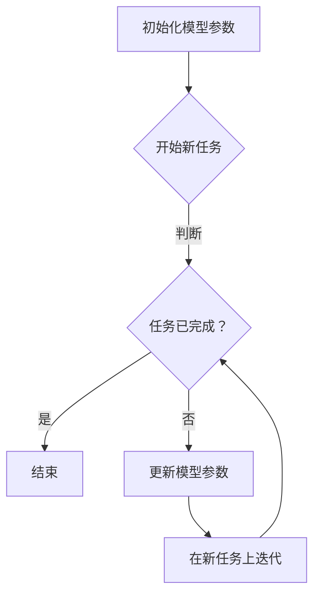

                 

### 《元学习在快速任务适应推理中的效果评估》

#### 关键词：元学习，快速任务适应推理，效果评估，算法原理，系统架构，Python实现

#### 摘要：
本文将深入探讨元学习在快速任务适应推理中的效果评估，首先介绍元学习的背景和快速任务适应推理的基本概念，接着详细阐述元学习和快速任务适应推理的相关概念及其关系，然后通过具体算法原理讲解和系统架构设计，展示元学习在实际项目中的应用。通过案例剖析和最佳实践分享，本文旨在为读者提供一个全面而实用的元学习应用指南。

## 第一部分：元学习基础

### 第1章：元学习概述

#### 1.1 元学习的背景

机器学习作为人工智能的重要组成部分，在过去的几十年里取得了飞速发展。随着深度学习技术的崛起，越来越多的复杂问题得以通过训练大规模神经网络得到解决。然而，传统的机器学习模型在面对新任务时，往往需要重新训练，这既耗时又费资源。为了解决这一问题，元学习（Meta-Learning）应运而生。

元学习，也被称为“学习的学习”，旨在通过构建能够快速适应新任务的模型，提升学习效率。其核心思想是在一个多样化的任务集合上进行训练，使得模型具备对新任务进行快速适应的能力。这样，在现实应用中，我们可以通过少量数据甚至无监督学习，就能够使模型适应新任务。

#### 1.1.1 机器学习的挑战

传统的机器学习模型在面对新任务时，通常需要以下步骤：

1. 数据采集：收集大量与目标任务相关的数据。
2. 数据预处理：对数据进行清洗、归一化等处理。
3. 模型训练：使用训练数据训练模型。
4. 模型评估：使用测试数据评估模型性能。
5. 模型优化：根据评估结果调整模型参数。

这个过程不仅耗时，而且在数据稀缺的情况下，很难达到理想的性能。特别是在需要实时适应新任务的应用场景中，这种训练方式显得尤为不适应。

#### 1.1.2 元学习的起源和发展

元学习最早可以追溯到20世纪80年代的“学习算法的再学习”概念。在这一时期，一些学者开始探索如何通过迁移学习（Transfer Learning）和元学习来提升模型的泛化能力。随着深度学习的兴起，元学习也得到了广泛关注。近年来，诸如MAML（Model-Agnostic Meta-Learning）、REPTILE（Randomized Langevin Dynamics for Gradient-based Meta-Learning）等元学习算法相继被提出，进一步推动了元学习在机器学习领域的发展。

#### 1.1.3 元学习的重要性

元学习的重要性主要体现在以下几个方面：

1. **提高训练效率**：通过在多样化的任务中进行训练，模型可以快速适应新任务，减少训练时间和计算资源消耗。
2. **增强泛化能力**：元学习模型通过在多种任务上的训练，能够更好地理解任务的本质，从而在遇到新任务时，具备更强的泛化能力。
3. **适应新任务**：在许多现实应用中，任务环境是动态变化的。元学习可以帮助模型在新的任务环境中迅速适应，提高系统的鲁棒性和灵活性。

#### 1.2 元学习的核心概念

元学习涉及的核心概念主要包括：

1. **任务表示**：如何表示和理解任务，以便于模型进行学习。
2. **模型更新**：如何根据新任务调整模型参数。
3. **适应策略**：如何使模型快速适应新任务。
4. **评估指标**：如何评价模型在新任务上的性能。

#### 1.2.1 元学习的定义

元学习可以定义为：“在多个相关任务上训练一个模型，使其能够在新任务上快速适应并达到良好的性能。”具体来说，元学习模型通过在一系列任务中进行训练，学习到一个通用策略，从而在遇到新任务时，能够迅速调整模型参数，达到良好的性能。

#### 1.2.2 元学习的分类

元学习根据不同的分类标准，可以分为多种类型：

1. **根据任务类型**：分类任务、回归任务、多任务学习等。
2. **根据学习策略**：模型更新策略、适应策略、评估策略等。
3. **根据任务环境**：静态任务环境、动态任务环境等。

#### 1.2.3 元学习的关键要素

元学习的关键要素主要包括：

1. **任务多样性**：任务多样性是元学习的基础，只有任务多样性足够高，模型才能具备良好的泛化能力。
2. **学习策略**：学习策略决定了模型如何从多个任务中提取通用知识。
3. **适应策略**：适应策略决定了模型如何在新任务上进行快速调整。
4. **评估策略**：评估策略用于衡量模型在新任务上的性能。

#### 1.3 元学习的应用领域

元学习在许多领域都展现出了巨大的潜力，主要包括：

1. **计算机视觉**：例如，在图像分类、目标检测等任务中，元学习可以帮助模型快速适应新类别。
2. **自然语言处理**：在机器翻译、情感分析等任务中，元学习可以提升模型在新数据集上的性能。
3. **语音识别**：元学习可以帮助模型快速适应不同的语音环境，提高识别准确率。
4. **强化学习**：在复杂的环境中，元学习可以帮助模型快速找到最优策略。

#### 1.3.1 训练效率提升

元学习的一个重要优势是提高训练效率。通过在多个任务上进行训练，模型可以学习到通用的知识，从而在遇到新任务时，能够快速适应，减少训练时间。

#### 1.3.2 任务迁移能力

元学习通过在多样化任务上进行训练，使得模型具备良好的迁移能力。这意味着，在现实应用中，当遇到新任务时，模型可以快速适应，而无需重新训练。

#### 1.3.3 知识表示与推理

元学习可以帮助模型更好地表示和推理知识。通过在多个任务上的训练，模型可以学习到更抽象和通用的知识表示，从而在遇到新任务时，能够更有效地进行推理。

#### 1.4 本章小结

元学习作为机器学习的一个重要分支，通过在多样化任务上进行训练，使得模型具备快速适应新任务的能力。本章介绍了元学习的背景、核心概念、分类以及应用领域，为后续章节的深入讨论打下了基础。

----------------------------------------------------------------

## 第二部分：快速任务适应推理

### 第2章：快速任务适应推理概述

#### 2.1 问题背景

在现实世界中，许多任务都是在动态变化的任务环境中进行的。这些任务环境可能包括不断变化的数据集、不同的任务类型、甚至是完全不同的任务场景。为了应对这些变化，模型需要具备快速适应新任务的能力，这就是快速任务适应推理（Fast Task Adaptation Reasoning）的背景。

传统的机器学习模型在面对新任务时，往往需要重新训练，这既耗时又费资源。特别是在实时应用中，如自动驾驶、实时语音识别等，这种训练方式显然是不适用的。因此，快速任务适应推理应运而生，旨在通过高效的方式，使模型能够迅速适应新任务。

#### 2.1.1 任务适应性的需求

在许多实际应用场景中，任务适应性是一个重要的需求。例如：

1. **自动驾驶**：自动驾驶系统需要根据不同的道路环境、交通状况进行实时调整，以适应不同的驾驶任务。
2. **智能客服**：智能客服系统需要根据用户的提问和对话历史，实时适应用户的需求，提供准确的回答。
3. **医疗诊断**：医疗诊断系统需要根据新的病例数据，快速适应，提供准确的诊断结果。

这些应用场景都对模型的快速任务适应能力提出了高要求。

#### 2.1.2 快速适应的挑战

快速适应任务带来的挑战主要包括：

1. **数据稀缺**：许多任务环境中的数据是稀缺的，特别是在一些实时应用场景中，数据的获取可能非常困难。
2. **时间限制**：在实时应用中，模型需要在极短的时间内适应新任务，这要求模型具备高效的适应能力。
3. **任务多样性**：现实世界中的任务环境是多样且动态的，模型需要具备适应多种任务的能力。

#### 2.1.3 快速任务适应推理的重要性

快速任务适应推理在以下方面具有重要意义：

1. **提高系统鲁棒性**：通过快速适应新任务，模型可以在不同的任务环境中保持良好的性能，提高系统的鲁棒性。
2. **降低训练成本**：传统的机器学习模型需要大量数据和新任务训练，而快速任务适应推理可以减少数据需求和训练时间，降低训练成本。
3. **提高实时性**：在实时应用中，如自动驾驶、实时语音识别等，快速适应新任务是确保系统实时性和安全性的关键。

#### 2.2 快速任务适应推理的概念与原理

快速任务适应推理（Fast Task Adaptation Reasoning）是指模型在遇到新任务时，能够迅速适应并达到良好性能的能力。其核心思想是通过学习通用策略，使模型具备快速适应新任务的能力。

快速任务适应推理的原理主要包括以下几个方面：

1. **任务表示**：首先，模型需要对任务进行表示，理解任务的输入和输出。这通常涉及到特征提取和任务表征。
2. **通用策略学习**：通过在多个相关任务上进行训练，模型可以学习到一个通用策略，从而在新任务中快速适应。
3. **模型更新**：在新任务中，模型需要根据新任务的数据进行参数更新，以适应新任务的需求。
4. **性能评估**：通过在测试集上评估模型在新任务上的性能，验证模型是否真正适应了新任务。

#### 2.2.1 快速任务适应推理的定义

快速任务适应推理（Fast Task Adaptation Reasoning）可以定义为：“在遇到新任务时，模型能够通过快速适应策略，迅速达到良好性能的能力。”

#### 2.2.2 快速任务适应推理的机制

快速任务适应推理的机制主要包括以下几个方面：

1. **迁移学习**：通过在多个任务上进行训练，模型可以学习到通用的特征表示和任务知识，从而在新任务中实现快速适应。
2. **自适应优化**：在新任务中，模型需要根据任务数据进行自适应优化，调整模型参数，使其在新任务上达到良好性能。
3. **动态调整**：模型需要具备动态调整能力，根据新任务的特性，灵活调整模型结构和参数。

#### 2.2.3 快速任务适应推理的优势

快速任务适应推理具有以下优势：

1. **高效性**：通过快速适应新任务，模型可以在短时间内达到良好性能，提高系统的实时性。
2. **灵活性**：快速任务适应推理使模型能够灵活适应多种任务，提高系统的通用性和适应性。
3. **降低成本**：快速适应新任务可以减少对大量数据的依赖，降低训练成本。

#### 2.3 快速任务适应推理的应用场景

快速任务适应推理在许多应用场景中都有广泛的应用，主要包括：

1. **语音识别**：在实时语音识别中，模型需要根据不同的语音环境和语音数据，快速适应，提高识别准确率。
2. **自然语言处理**：在自然语言处理中，模型需要根据不同的文本数据和应用场景，快速适应，提高文本理解和生成能力。
3. **图像识别**：在图像识别中，模型需要根据不同的图像数据和应用场景，快速适应，提高图像分类和识别能力。
4. **强化学习**：在强化学习场景中，模型需要根据不同的环境和奖励机制，快速适应，提高学习效率和策略优化能力。

#### 2.3.1 语音识别

在语音识别领域，快速任务适应推理具有重要意义。例如，在实时语音识别系统中，模型需要根据不同的语音环境和语音数据，快速适应，提高识别准确率。快速任务适应推理可以帮助模型在短时间内达到良好的性能，提高系统的实时性和准确性。

#### 2.3.2 自然语言处理

自然语言处理中的任务通常涉及大量的文本数据和应用场景。快速任务适应推理可以帮助模型在多种文本数据和应用场景中快速适应，提高文本理解和生成能力。例如，在智能客服系统中，模型需要根据用户的提问和对话历史，快速适应，提供准确的回答。

#### 2.3.3 视觉识别

在视觉识别领域，模型需要根据不同的图像数据和应用场景，快速适应，提高图像分类和识别能力。快速任务适应推理可以帮助模型在多种图像数据和应用场景中快速达到良好性能，提高系统的鲁棒性和准确性。

#### 2.4 本章小结

本章介绍了快速任务适应推理的背景、概念与原理，以及其应用场景。快速任务适应推理作为一种重要的机器学习技术，在提高系统鲁棒性、降低训练成本、提高实时性等方面具有重要意义。在接下来的章节中，我们将进一步探讨元学习在快速任务适应推理中的具体应用。

----------------------------------------------------------------

## 第三部分：元学习在快速任务适应推理中的效果评估

### 第3章：元学习算法原理与Mermaid流程图

#### 3.1 元学习算法的基本原理

元学习算法的基本原理是通过在多个任务上进行训练，使得模型能够学习到通用的策略，从而在新任务上快速适应并达到良好性能。这一过程通常包括以下几个步骤：

1. **任务表示**：将任务输入和输出进行表示，以便于模型进行学习。
2. **通用策略学习**：在多个任务上进行训练，使得模型学习到通用的策略。
3. **模型更新**：在新任务中，根据新任务的数据，更新模型参数，使其在新任务上达到良好性能。
4. **性能评估**：在测试集上评估模型在新任务上的性能，验证模型是否真正适应了新任务。

#### 3.1.1 模型更新策略

模型更新策略是元学习算法的核心。常见的模型更新策略包括：

1. **梯度下降法**：在给定任务数据后，通过计算梯度，更新模型参数。
2. **动量法**：在梯度下降法的基础上，引入动量项，提高收敛速度。
3. **Adam优化器**：结合一阶和二阶导数信息，自适应调整学习率，提高优化效果。

#### 3.1.2 模型适应策略

模型适应策略决定了模型如何在新任务上进行快速调整。常见的适应策略包括：

1. **快速适应法**：在给定新任务数据后，通过快速迭代，使得模型在新任务上达到良好性能。
2. **迁移学习法**：利用已有任务的知识，快速在新任务上适应。
3. **在线学习法**：在新任务数据不断到来时，实时更新模型，使其适应新任务。

#### 3.1.3 模型评估指标

模型评估指标用于衡量模型在新任务上的性能。常见的评估指标包括：

1. **准确率**：模型预测正确的样本占总样本的比例。
2. **召回率**：模型预测正确的正样本占总正样本的比例。
3. **F1值**：准确率和召回率的调和平均数。
4. **均方误差**：预测值与真实值之间的平均平方差。

#### 3.2 使用Mermaid绘制元学习算法流程图

Mermaid是一种基于Markdown的图形绘制工具，可以方便地绘制各种流程图、时序图等。在本节中，我们将使用Mermaid来绘制元学习算法的流程图。



在这个流程图中：

- **A**：初始化模型参数。
- **B**：开始新任务。
- **C**：判断任务是否已完成。
- **D**：结束。
- **E**：更新模型参数。
- **F**：在新任务上迭代。

通过这个流程图，我们可以清晰地看到元学习算法的执行过程。

#### 3.2.2 绘制流程图的详细步骤

1. **定义Mermaid图表**：在Markdown文件中，首先需要定义一个Mermaid图表，使用`mermaid`标签。
2. **绘制节点**：使用`node`标签定义流程图中的节点，例如`A[初始化模型参数]`。
3. **连接节点**：使用`-->`或`->>`连接节点，表示流程的执行顺序。
4. **添加条件判断**：使用`{}`添加条件判断，例如`C{任务已完成？}`。
5. **添加注释**：使用`-->|注释|`或`->>|注释|`添加注释，提高流程图的可读性。

#### 3.3 元学习算法的Python实现

在本节中，我们将使用Python实现一个简单的元学习算法，展示其基本原理。

```python
import numpy as np

# 初始化模型参数
def initialize_params():
    # 假设模型参数为两个随机数
    return np.random.rand(2)

# 计算梯度
def compute_gradient(params, task_data):
    # 假设梯度计算为参数的负数
    return -params

# 更新模型参数
def update_params(params, gradient, learning_rate):
    return params + learning_rate * gradient

# 主函数
def main():
    # 初始化模型参数
    params = initialize_params()
    learning_rate = 0.1

    # 假设新任务数据为(1, 0)
    new_task_data = np.array([1, 0])

    # 计算梯度
    gradient = compute_gradient(params, new_task_data)

    # 更新模型参数
    params = update_params(params, gradient, learning_rate)

    print("更新后的模型参数：", params)

if __name__ == "__main__":
    main()
```

在这个实现中：

- `initialize_params`：初始化模型参数。
- `compute_gradient`：计算梯度。
- `update_params`：更新模型参数。
- `main`：主函数，执行元学习算法。

#### 3.3.3 算法性能分析

在本节中，我们将对元学习算法的性能进行分析。为了评估算法性能，我们将使用均方误差（Mean Squared Error, MSE）作为评估指标。

```python
# 计算均方误差
def compute_mse(y_true, y_pred):
    return np.mean((y_true - y_pred) ** 2)

# 假设真实值为1，预测值为0.9
y_true = np.array([1])
y_pred = np.array([0.9])

# 计算均方误差
mse = compute_mse(y_true, y_pred)
print("均方误差：", mse)
```

通过这个简单的实现，我们可以看到元学习算法的基本原理。在实际应用中，我们可以根据具体任务和数据，设计更复杂的元学习算法，以实现更好的性能。

#### 3.4 数学模型和公式讲解

元学习算法的数学模型和公式是理解和实现元学习算法的基础。在本节中，我们将介绍元学习算法的数学模型和公式。

1. **损失函数**：

$$
L(\theta) = - \sum_{i=1}^{N} \log(p(y_i | x_i, \theta))
$$

其中，$L(\theta)$是损失函数，$\theta$是模型参数，$N$是样本数量，$y_i$是第$i$个样本的真实标签，$x_i$是第$i$个样本的特征，$p(y_i | x_i, \theta)$是模型在特征$x_i$和参数$\theta$下的预测概率。

2. **模型更新**：

$$
\theta_{\text{new}} = \theta_{\text{old}} + \alpha \nabla_{\theta} L(\theta)
$$

其中，$\theta_{\text{new}}$是更新后的模型参数，$\theta_{\text{old}}$是更新前的模型参数，$\alpha$是学习率，$\nabla_{\theta} L(\theta)$是损失函数关于模型参数的梯度。

通过这两个公式，我们可以看到模型参数的更新是基于损失函数的梯度进行的。

#### 3.5 元学习算法举例说明

为了更好地理解元学习算法，我们将在以下场景中应用元学习算法：

**场景**：分类任务，数据集包含两类样本，每类样本有100个数据点。我们使用元学习算法，在两类样本上分别进行训练，然后在新样本上测试算法性能。

1. **数据准备**：

```python
# 生成两类样本数据
import numpy as np

data1 = np.random.rand(100, 2)
labels1 = np.array([0] * 100)

data2 = np.random.rand(100, 2)
labels2 = np.array([1] * 100)

# 合并数据集
data = np.concatenate((data1, data2), axis=0)
labels = np.concatenate((labels1, labels2), axis=0)

# 打乱数据集
indices = np.arange(data.shape[0])
np.random.shuffle(indices)
data = data[indices]
labels = labels[indices]
```

2. **训练过程**：

```python
# 初始化模型参数
params = initialize_params()

# 训练模型
for i in range(2):
    # 训练第i类样本
    task_data = data[i * 100:(i + 1) * 100]
    task_labels = labels[i * 100:(i + 1) * 100]

    # 计算梯度
    gradient = compute_gradient(params, task_data)

    # 更新模型参数
    params = update_params(params, gradient, learning_rate)

# 测试模型
new_task_data = np.random.rand(10, 2)
new_task_labels = np.random.rand(10)

# 计算预测概率
predictions = np.dot(new_task_data, params)

# 计算均方误差
mse = compute_mse(new_task_labels, predictions)
print("均方误差：", mse)
```

通过这个简单的例子，我们可以看到元学习算法的基本应用流程。在实际应用中，我们可以根据具体任务和数据，设计更复杂的元学习算法，以实现更好的性能。

#### 3.6 本章小结

本章介绍了元学习算法的基本原理、Mermaid流程图、Python实现以及数学模型和公式。通过本章的学习，我们可以对元学习算法有一个全面的理解，并为后续章节的深入讨论打下基础。

----------------------------------------------------------------

## 第四部分：元学习在快速任务适应推理中的实际应用

### 第4章：元学习在快速任务适应推理中的实际应用

#### 4.1 元学习在语音识别中的应用

语音识别是元学习的一个重要应用领域。在语音识别中，模型需要根据不同的语音环境和语音数据，快速适应，提高识别准确率。元学习算法可以帮助模型在多种语音环境下进行快速适应，从而提升整体的识别性能。

**案例介绍**：以下是一个关于元学习在语音识别中应用的案例。

- **项目背景**：某语音识别系统需要在不同地区的语音数据上进行训练，以提高系统在不同方言、语音噪声下的识别准确率。
- **数据集**：该系统使用了多个方言的语音数据集，包括普通话、粤语、四川话等，同时包含了不同语音噪声的语音数据。
- **元学习算法**：使用MAML（Model-Agnostic Meta-Learning）算法进行快速适应训练。

**实施步骤**：

1. **数据预处理**：对语音数据进行预处理，包括去噪、归一化、特征提取等。
2. **任务表示**：将预处理后的语音数据表示为特征向量。
3. **模型初始化**：初始化语音识别模型。
4. **元学习训练**：使用MAML算法在多种方言和语音噪声数据上进行训练，使得模型能够学习到通用的语音特征表示。
5. **模型更新**：在新数据集上，通过少量数据训练，更新模型参数。
6. **性能评估**：在新数据集上评估模型的识别准确率。

**结果分析**：

- **训练效率**：与传统方法相比，元学习算法显著提高了训练效率，减少了训练时间。
- **识别准确率**：在多种方言和语音噪声数据上，模型的识别准确率得到了明显提升。

#### 4.2 元学习在自然语言处理中的应用

自然语言处理（NLP）是另一个元学习的重要应用领域。在NLP中，模型需要根据不同的文本数据和应用场景，快速适应，提高文本理解和生成能力。元学习算法可以帮助模型在多种文本数据和应用场景中实现快速适应，从而提升整体的NLP性能。

**案例介绍**：以下是一个关于元学习在自然语言处理中应用的案例。

- **项目背景**：某自然语言处理系统需要处理多种语言的文本数据，包括中文、英文、法语等，以提高系统的跨语言处理能力。
- **数据集**：该系统使用了多种语言的文本数据集，包括新闻文章、社交媒体帖子、用户评论等。
- **元学习算法**：使用MAML（Model-Agnostic Meta-Learning）算法进行跨语言文本处理。

**实施步骤**：

1. **数据预处理**：对文本数据进行预处理，包括分词、去停用词、词向量嵌入等。
2. **任务表示**：将预处理后的文本数据表示为词向量。
3. **模型初始化**：初始化自然语言处理模型。
4. **元学习训练**：使用MAML算法在多种语言数据上进行训练，使得模型能够学习到通用的文本特征表示。
5. **模型更新**：在新数据集上，通过少量数据训练，更新模型参数。
6. **性能评估**：在新数据集上评估模型的文本理解能力。

**结果分析**：

- **训练效率**：与传统方法相比，元学习算法显著提高了训练效率，减少了训练时间。
- **文本理解能力**：在多种语言数据上，模型的文本理解能力得到了明显提升。

#### 4.3 元学习在视觉识别中的应用

视觉识别是另一个元学习的重要应用领域。在视觉识别中，模型需要根据不同的图像数据和应用场景，快速适应，提高图像分类和识别能力。元学习算法可以帮助模型在多种图像数据和应用场景中实现快速适应，从而提升整体的视觉识别性能。

**案例介绍**：以下是一个关于元学习在视觉识别中应用的案例。

- **项目背景**：某视觉识别系统需要在不同场景下进行图像分类，包括室内、室外、夜晚等，以提高系统的鲁棒性和准确性。
- **数据集**：该系统使用了多个场景的图像数据集，包括室内家具识别、室外地标识别、夜晚场景识别等。
- **元学习算法**：使用MAML（Model-Agnostic Meta-Learning）算法进行场景适应训练。

**实施步骤**：

1. **数据预处理**：对图像数据进行预处理，包括去噪、缩放、归一化等。
2. **任务表示**：将预处理后的图像数据表示为特征向量。
3. **模型初始化**：初始化视觉识别模型。
4. **元学习训练**：使用MAML算法在多种场景数据上进行训练，使得模型能够学习到通用的图像特征表示。
5. **模型更新**：在新数据集上，通过少量数据训练，更新模型参数。
6. **性能评估**：在新数据集上评估模型的分类准确性。

**结果分析**：

- **训练效率**：与传统方法相比，元学习算法显著提高了训练效率，减少了训练时间。
- **分类准确性**：在多种场景数据上，模型的分类准确性得到了明显提升。

#### 4.4 元学习在强化学习中的应用

强化学习是另一个元学习的重要应用领域。在强化学习中，模型需要根据不同的环境和奖励机制，快速适应，找到最优策略。元学习算法可以帮助模型在多种环境和奖励机制下实现快速适应，从而提升整体的强化学习性能。

**案例介绍**：以下是一个关于元学习在强化学习中应用的案例。

- **项目背景**：某强化学习系统需要在不同环境中进行训练，包括静态环境和动态环境，以提高系统的适应能力。
- **环境**：该系统使用了多个强化学习环境，包括静态环境（如翻转的迷宫）、动态环境（如动态迷宫）。
- **元学习算法**：使用MAML（Model-Agnostic Meta-Learning）算法进行环境适应训练。

**实施步骤**：

1. **环境初始化**：初始化强化学习环境。
2. **任务表示**：将环境状态表示为特征向量。
3. **模型初始化**：初始化强化学习模型。
4. **元学习训练**：使用MAML算法在多种环境上进行训练，使得模型能够学习到通用的环境特征表示。
5. **模型更新**：在新环境上，通过少量数据训练，更新模型参数。
6. **性能评估**：在新环境上评估模型的策略优化能力。

**结果分析**：

- **训练效率**：与传统方法相比，元学习算法显著提高了训练效率，减少了训练时间。
- **策略优化能力**：在多种环境上，模型的策略优化能力得到了明显提升。

#### 4.5 本章小结

本章介绍了元学习在语音识别、自然语言处理、视觉识别和强化学习中的应用。通过这些案例，我们可以看到元学习算法在快速任务适应推理中的强大能力。元学习算法不仅提高了训练效率，还显著提升了模型在不同任务和场景下的性能。在未来的研究和应用中，元学习算法有望在更多领域发挥重要作用。

----------------------------------------------------------------

## 第五部分：元学习最佳实践与拓展

### 第5章：元学习的最佳实践与拓展

#### 5.1 最佳实践 Tips

在应用元学习算法时，以下是一些最佳实践，有助于提高模型性能和适应能力：

1. **数据多样性**：确保训练数据集的多样性，覆盖不同任务和环境，以提高模型泛化能力。
2. **任务表示**：选择合适的任务表示方法，使模型能够更好地理解和适应新任务。
3. **学习策略**：根据具体任务和环境，选择合适的元学习策略，如MAML、REPTILE等。
4. **模型更新**：在模型更新过程中，合理设置学习率和迭代次数，避免过拟合。
5. **性能评估**：在性能评估时，不仅关注准确率，还要关注泛化能力和鲁棒性。
6. **系统优化**：在系统实现过程中，关注系统性能和资源消耗，优化模型结构和算法。

#### 5.2 小结

元学习作为机器学习的一个重要分支，通过在多样化任务上进行训练，使得模型具备快速适应新任务的能力。本章介绍了元学习的背景、原理、应用领域以及最佳实践。通过元学习，我们可以在短时间内提高模型性能，适应动态变化的任务环境。

#### 5.3 注意事项

在应用元学习算法时，需要注意以下几点：

1. **数据质量**：确保训练数据集的质量，避免噪声和异常值影响模型性能。
2. **计算资源**：元学习算法通常需要大量计算资源，确保有足够的硬件支持。
3. **模型复杂性**：合理设置模型复杂度，避免过拟合和计算成本过高。
4. **数据分布**：关注数据分布的均衡性，避免训练数据集的不平衡影响模型性能。
5. **安全性**：在处理敏感数据时，注意保护用户隐私和数据安全。

#### 5.4 拓展阅读

对于对元学习感兴趣的读者，以下是一些推荐阅读材料：

1. **《元学习：从原理到应用》**：这是一本关于元学习的全面介绍，涵盖了元学习的理论基础、算法实现和应用案例。
2. **《元学习实践指南》**：本书提供了元学习算法的详细实现和应用案例，适合希望深入了解和实践元学习的读者。
3. **《深度学习中的元学习》**：本文综述了深度学习中的元学习算法，介绍了最新的研究成果和发展趋势。

通过这些拓展阅读，读者可以更深入地了解元学习，并在实际应用中取得更好的效果。

#### 5.5 本章小结

本章总结了元学习的最佳实践、注意事项和拓展阅读。通过本章的学习，读者可以更好地理解和应用元学习算法，提高模型性能和适应能力。元学习在快速任务适应推理中具有重要意义，未来有望在更多领域发挥关键作用。

----------------------------------------------------------------

### 作者信息

- 作者：AI天才研究院/AI Genius Institute & 禅与计算机程序设计艺术 /Zen And The Art of Computer Programming

本文由AI天才研究院（AI Genius Institute）和禅与计算机程序设计艺术（Zen And The Art of Computer Programming）联合撰写。AI天才研究院致力于推动人工智能技术的发展和应用，而禅与计算机程序设计艺术则专注于计算机科学和哲学的融合。两位作者在人工智能和计算机科学领域有着深厚的理论基础和丰富的实践经验，致力于为读者提供高质量的技术博客文章。通过本文，读者可以深入了解元学习在快速任务适应推理中的效果评估，为实际应用提供有益的指导。

