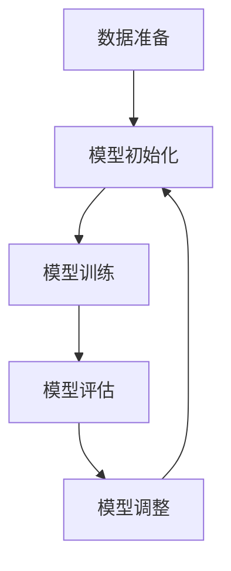
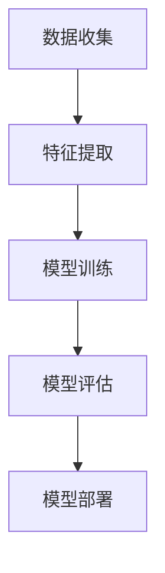

                 

# 元学习在快速适应新用户行为模式中的应用

## 摘要

本文将探讨元学习在快速适应新用户行为模式中的应用。元学习是一种能够加速模型对新情境适应能力的人工智能技术，它通过学习如何学习来提高算法的泛化能力。在新用户行为模式识别、预测和个性化推荐等领域，元学习展现出显著的优势。本文将从元学习的基本概念入手，逐步深入到其在用户行为模式分析中的具体应用，并通过案例展示如何实现和优化这些应用。

## 关键词

- 元学习
- 用户行为模式
- 快速适应
- 个性化推荐
- 强化学习

## 背景介绍

### 元学习的定义与应用

元学习（Meta-Learning）是指学习如何学习的算法。它关注的是如何使学习过程更加高效和通用，而不是单纯地改进某个特定的任务。元学习的核心思想是通过在多个任务上训练模型，使得模型能够快速适应新的任务，提高其泛化能力。这种方法在强化学习、无监督学习和有监督学习等领域都有广泛的应用。

在人工智能领域，随着用户数据的不断增加和多样性，快速适应新用户行为模式成为了一个重要的研究方向。传统的机器学习方法通常需要大量的数据和长时间的训练，才能在新用户上取得较好的效果。而元学习则通过加速学习过程，使得系统能够更快地适应新用户的需求，提供更加个性化的服务。

### 用户行为模式的定义与重要性

用户行为模式（User Behavior Pattern）是指用户在使用某个系统或服务时所表现出的行为规律。这些模式包括用户对系统功能的偏好、使用频率、时间分布、交互方式等。理解和分析用户行为模式对于提供个性化服务、优化用户体验、提升用户留存率具有重要意义。

随着互联网的普及和电子商务的发展，用户行为模式分析已成为企业竞争的关键因素。通过分析用户行为模式，企业可以更好地了解用户需求，设计出更符合用户期望的产品和服务。然而，用户行为模式的多样性和动态变化给传统的机器学习方法带来了巨大的挑战。

### 元学习在快速适应新用户行为模式中的应用

元学习在快速适应新用户行为模式中的应用主要体现在以下几个方面：

1. **用户行为模式识别**：通过元学习算法，系统可以快速地从少量数据中识别出新用户的行为模式，减少对大量训练数据的依赖。
2. **用户行为模式预测**：元学习算法可以帮助系统预测新用户的行为模式，从而提前进行个性化推荐和服务优化。
3. **用户个性化推荐**：基于元学习算法的用户行为模式分析结果，系统可以提供更加精准的个性化推荐，提升用户的满意度。

接下来，我们将进一步探讨元学习的基本概念、算法原理以及其在用户行为模式分析中的应用。

----------------------------------------------------------------

## 第一部分：元学习基础

### 1.1 元学习概述

#### 1.1.1 问题背景与定义

在人工智能领域，传统的机器学习方法通常依赖于大量的训练数据来进行模型的训练和优化。这种方法在面对新用户或新任务时，往往需要重新收集和标注大量数据，不仅耗时耗力，而且难以应对数据匮乏的情况。为了解决这一问题，研究者提出了元学习（Meta-Learning）的概念。

元学习，顾名思义，是关于学习的学习。它关注的是如何让学习过程变得更加高效和通用，从而提高模型在处理新任务时的适应能力。具体来说，元学习的目标是通过在多个任务上训练模型，使得模型能够在新的任务上快速地达到高性能。

在用户行为模式分析中，元学习的重要性体现在以下几个方面：

1. **数据匮乏问题**：在新用户加入系统时，由于缺乏足够的用户数据，传统的机器学习方法难以准确预测用户的行为模式。元学习通过少量的数据就能够快速适应新用户，减少了数据收集和标注的工作量。
2. **快速迭代需求**：互联网和电子商务行业竞争激烈，系统需要快速响应市场变化，提供个性化的服务。元学习能够加速学习过程，使得系统能够更快地适应新用户的需求。
3. **提高泛化能力**：元学习通过在多个任务上训练模型，提高了模型的泛化能力。这意味着模型不仅能够在训练数据上表现良好，还能在新用户上保持高效。

#### 1.1.2 元学习的基本概念

元学习涉及几个关键的概念：

1. **任务（Task）**：在元学习中，任务是指模型需要解决的具体问题。例如，在用户行为模式分析中，任务可以是识别某个用户的行为模式，或者预测用户的行为。
2. **模型（Model）**：模型是用于解决任务的算法。在元学习中，模型不仅要能够解决特定任务，还要能够快速适应新的任务。
3. **元学习算法（Meta-Learning Algorithm）**：元学习算法是指用于训练模型的算法。这些算法通过在多个任务上训练模型，使得模型能够快速适应新的任务。
4. **泛化能力（Generalization Ability）**：泛化能力是指模型在处理未见过的数据时的表现。元学习的目标就是提高模型的泛化能力，使得模型能够更好地适应新的任务。

#### 1.1.3 元学习的应用领域

元学习在人工智能领域有广泛的应用，包括但不限于以下几个方面：

1. **强化学习**：在强化学习中，元学习通过学习如何学习，提高了智能体在不同环境下的适应能力。
2. **无监督学习**：在无监督学习任务中，元学习可以帮助模型从少量数据中快速学习到有用的特征。
3. **有监督学习**：在有监督学习任务中，元学习通过在多个任务上训练模型，提高了模型的泛化能力。
4. **用户行为模式分析**：在用户行为模式分析中，元学习可以帮助系统快速适应新用户，提供个性化的服务。

### 1.2 元学习与其他学习方式的比较

#### 1.2.1 有监督学习与无监督学习

有监督学习和无监督学习是两种基本的机器学习方法。它们在元学习中有不同的应用场景。

1. **有监督学习**：在有监督学习中，模型需要使用标注过的数据来训练。这种方法通常适用于任务明确、数据充足的情况。然而，当面对新用户时，由于缺乏足够的标注数据，有监督学习的效果往往不理想。
2. **无监督学习**：无监督学习则不依赖于标注数据，通过发现数据中的潜在结构来进行学习。这种方法在处理新用户时具有一定的优势，但它的泛化能力相对较弱。

元学习通过结合有监督学习和无监督学习的优势，提供了在处理新用户时的有效方法。

#### 1.2.2 强化学习与元学习

强化学习是一种通过试错来学习如何完成特定任务的方法。元学习在强化学习中有重要的应用，特别是在处理复杂环境和长期目标时。

1. **强化学习**：强化学习通过智能体与环境的交互来学习最优策略。然而，当环境变化频繁或任务复杂时，强化学习的过程往往需要大量时间和计算资源。
2. **元学习**：元学习通过在多个任务上训练模型，提高了模型的泛化能力。在强化学习中，元学习可以帮助智能体更快地适应新环境，提高学习效率。

#### 1.2.3 元学习与传统机器学习的区别

元学习与传统机器学习的区别主要体现在以下几个方面：

1. **数据依赖性**：传统机器学习依赖大量的训练数据，而元学习通过在多个任务上训练模型，减少了对新数据的依赖。
2. **学习效率**：传统机器学习通常需要较长的训练时间，而元学习通过加速学习过程，提高了模型的适应能力。
3. **泛化能力**：传统机器学习模型在新任务上的表现往往较差，而元学习通过在多个任务上训练，提高了模型的泛化能力。

### 1.3 元学习的关键概念与联系

#### 1.3.1 概念定义与属性特征

为了更好地理解元学习，我们需要明确几个关键概念的定义和属性特征：

1. **元学习算法**：元学习算法是指能够自动调整模型参数以适应新任务的算法。它的属性特征包括：
   - **快速适应能力**：元学习算法能够在短时间内适应新任务。
   - **泛化能力**：元学习算法能够在多个任务上表现良好。

2. **任务样本**：任务样本是指用于训练模型的数据集合。它的属性特征包括：
   - **多样性**：任务样本需要覆盖多种不同的任务。
   - **代表性**：任务样本需要能够代表新任务的特性。

3. **模型参数**：模型参数是指用于调整模型性能的变量。在元学习中，模型参数的调整是自动进行的。

#### 1.3.2 关键概念ER实体关系图

为了更好地展示元学习中的关键概念及其关系，我们可以使用ER（实体-关系）图来表示：

```mermaid
erDiagram
  TaskSample ||--|{ ModelParameter } : uses
  ModelParameter ||--|{ MetaLearningAlgorithm } : learns
```

在这个ER图中，`TaskSample`（任务样本）与`ModelParameter`（模型参数）之间存在关联，表示任务样本用于训练模型参数。`ModelParameter`与`MetaLearningAlgorithm`（元学习算法）之间存在关联，表示模型参数是元学习算法调整的对象。

### 1.4 元学习算法的类型

元学习算法根据其具体实现方式可以分为以下几类：

1. **模型更新型**：这类算法通过调整模型参数来适应新任务。例如，MAML（Model-Agnostic Meta-Learning）就是一种模型更新型算法。
2. **数据集成型**：这类算法通过集成多个任务的数据来训练模型。例如，MAML++（Model-Agnostic Meta-Learning Plus Plus）就是一种数据集成型算法。
3. **模型选择型**：这类算法通过选择适合新任务的模型来适应新任务。例如，MAML+（Model-Agnostic Meta-Learning with Adaptation）就是一种模型选择型算法。

每种算法都有其独特的优势和适用场景。在实际应用中，根据任务需求和数据特点选择合适的元学习算法是至关重要的。

### 1.5 元学习的实现方法

元学习的实现方法通常包括以下几个步骤：

1. **数据准备**：收集并准备用于训练的多个任务样本。
2. **模型初始化**：初始化模型参数。
3. **模型训练**：在多个任务上训练模型，调整模型参数。
4. **模型评估**：评估模型在新任务上的性能。
5. **模型调整**：根据评估结果调整模型参数。

在实际应用中，元学习的实现需要考虑数据的多样性、任务的特点以及计算资源等因素。

### 1.6 元学习的挑战与未来发展方向

尽管元学习在快速适应新用户行为模式中展现出巨大潜力，但仍然面临一些挑战：

1. **数据质量**：元学习对数据的多样性和质量有较高要求。数据质量差可能导致模型泛化能力下降。
2. **计算资源**：元学习通常需要大量的计算资源，特别是在处理复杂任务时。
3. **模型选择**：选择适合新任务的模型是元学习的一个关键问题。

未来，随着计算能力的提升和数据获取的便捷性，元学习将在更多领域得到应用，其发展也将更加深入和广泛。

### 1.7 小结

元学习是一种能够加速模型对新情境适应能力的人工智能技术。它通过学习如何学习来提高算法的泛化能力，在快速适应新用户行为模式中具有显著优势。本文介绍了元学习的基本概念、算法原理以及在用户行为模式分析中的应用，为后续章节的深入探讨奠定了基础。

----------------------------------------------------------------

## 第二部分：元学习算法原理

### 2.1 元学习算法基础

#### 2.1.1 元学习的算法类型

元学习算法可以分为以下几类：

1. **模型更新型**：这类算法通过调整模型参数来适应新任务。例如，MAML（Model-Agnostic Meta-Learning）就是一种模型更新型算法。MAML的核心思想是训练一个模型，使得这个模型在新的任务上只需要少量的梯度更新就能达到高性能。
   
   **公式**：$$\theta^* = \arg\min_{\theta} \sum_{k=1}^K L(\theta, x^{(k)}, y^{(k)}) + \lambda \sum_{k=1}^K \|\nabla_{\theta}L(\theta, x^{(k)}, y^{(k)})\|_2^2$$

   其中，$\theta$ 表示模型参数，$x^{(k)}$ 和 $y^{(k)}$ 分别表示第 $k$ 个任务的数据和标签，$L(\theta, x^{(k)}, y^{(k)})$ 表示损失函数，$\lambda$ 是正则化参数。

2. **数据集成型**：这类算法通过集成多个任务的数据来训练模型。例如，MAML++（Model-Agnostic Meta-Learning Plus Plus）就是一种数据集成型算法。MAML++在MAML的基础上引入了数据集成策略，通过在训练阶段使用多个任务的数据来提高模型的泛化能力。

   **公式**：$$\theta^* = \arg\min_{\theta} \sum_{k=1}^K \sum_{i=1}^{N_k} L(\theta, x^{(k)i}, y^{(k)i})$$

   其中，$N_k$ 表示第 $k$ 个任务的数据量。

3. **模型选择型**：这类算法通过选择适合新任务的模型来适应新任务。例如，MAML+（Model-Agnostic Meta-Learning with Adaptation）就是一种模型选择型算法。MAML+在MAML的基础上引入了模型选择机制，通过在训练阶段尝试不同的模型结构来找到最优的模型。

   **公式**：$$\theta^* = \arg\min_{\theta} \sum_{k=1}^K \sum_{i=1}^{N_k} L(\theta, x^{(k)i}, y^{(k)i}) + \lambda \sum_{k=1}^K \sum_{j=1}^{J_k} \|\theta_j - \theta_{j'}\|_2^2$$

   其中，$\theta_j$ 和 $\theta_{j'}$ 分别表示第 $k$ 个任务的模型参数。

#### 2.1.2 元学习算法的基本框架

元学习算法的基本框架可以分为以下几个步骤：

1. **数据准备**：收集并准备用于训练的多个任务样本。
2. **模型初始化**：初始化模型参数。
3. **模型训练**：在多个任务上训练模型，调整模型参数。
4. **模型评估**：评估模型在新任务上的性能。
5. **模型调整**：根据评估结果调整模型参数。

在实际应用中，这些步骤可能需要根据具体任务的需求进行调整。

#### 2.1.3 元学习算法的核心要素

元学习算法的核心要素包括：

1. **任务适应能力**：元学习算法需要能够快速适应新的任务。这通常通过在多个任务上训练模型来实现。
2. **泛化能力**：元学习算法需要能够在新的任务上表现出良好的泛化能力。这通常通过优化模型参数来实现。
3. **计算效率**：元学习算法需要具有较高的计算效率，以便在实际应用中快速适应新任务。

为了实现这些核心要素，元学习算法通常采用以下策略：

1. **模型参数共享**：通过共享模型参数来减少计算量。
2. **快速梯度下降**：通过快速梯度下降来优化模型参数。
3. **数据集成**：通过集成多个任务的数据来提高模型的泛化能力。

#### 2.1.4 元学习算法的性能评估

元学习算法的性能评估通常包括以下几个指标：

1. **收敛速度**：模型在新的任务上达到高性能所需的迭代次数。
2. **泛化能力**：模型在新的任务上的表现。
3. **计算效率**：模型在训练过程中的计算量。

通过这些指标，可以评估元学习算法在实际应用中的效果。

### 2.2 元学习算法的Mermaid流程图

以下是一个简单的元学习算法的Mermaid流程图：



在这个流程图中，A表示数据准备，B表示模型初始化，C表示模型训练，D表示模型评估，E表示模型调整。这个流程图展示了元学习算法的基本步骤。

### 2.3 元学习算法的Python代码实现

以下是一个简单的MAML算法的Python代码实现：

```python
import numpy as np

def maml(theta, X, y, inner_steps, inner_lr):
    """
    MAML算法实现
    :param theta: 模型参数
    :param X: 输入数据
    :param y: 标签数据
    :param inner_steps: 内层迭代次数
    :param inner_lr: 内层学习率
    :return: 优化后的模型参数
    """
    for _ in range(inner_steps):
        loss = (y - np.dot(X, theta))**2
        grad = 2 * X.T.dot(loss)
        theta -= inner_lr * grad
    
    return theta

# 示例数据
X = np.array([[1, 0], [0, 1], [1, 1]])
y = np.array([0, 1, 0])
theta = np.array([0.5, 0.5])

# MAML算法应用
theta = maml(theta, X, y, inner_steps=5, inner_lr=0.1)

print("优化后的模型参数：", theta)
```

在这个代码中，`maml` 函数实现了MAML算法的核心步骤，包括内层梯度下降和模型参数更新。通过这个代码示例，我们可以看到MAML算法的基本实现过程。

### 2.4 元学习算法的数学模型与公式

元学习算法的数学模型主要涉及优化问题和梯度下降算法。以下是一个简单的数学模型：

$$\theta^* = \arg\min_{\theta} \sum_{k=1}^K \sum_{i=1}^{N_k} L(\theta, x^{(k)i}, y^{(k)i})$$

其中，$\theta$ 表示模型参数，$x^{(k)i}$ 和 $y^{(k)i}$ 分别表示第 $k$ 个任务的第 $i$ 个样本的输入和标签，$L(\theta, x^{(k)i}, y^{(k)i})$ 表示损失函数。

在梯度下降算法中，我们使用以下公式来更新模型参数：

$$\theta = \theta - \alpha \nabla_\theta L(\theta)$$

其中，$\alpha$ 是学习率，$\nabla_\theta L(\theta)$ 是损失函数关于模型参数的梯度。

通过这些数学模型和公式，我们可以更好地理解和实现元学习算法。

### 2.5 元学习算法的详细讲解与举例说明

#### 2.5.1 算法讲解

MAML（Model-Agnostic Meta-Learning）是一种模型更新型元学习算法。它的核心思想是通过在多个任务上训练模型，使得模型能够在新任务上快速达到高性能。MAML的基本步骤如下：

1. **初始化模型参数**：随机初始化模型参数 $\theta$。
2. **在多个任务上训练模型**：对于每个任务，使用内层梯度下降（inner gradient descent）来更新模型参数。内层梯度下降的步骤如下：
   - 计算损失函数 $L(\theta, x^{(k)i}, y^{(k)i})$。
   - 计算损失函数关于模型参数的梯度 $\nabla_\theta L(\theta, x^{(k)i}, y^{(k)i})$。
   - 使用梯度更新模型参数 $\theta$。
3. **评估模型在新任务上的性能**：使用新的任务数据来评估模型的性能。
4. **根据评估结果调整模型参数**：如果模型在新任务上的性能较差，则继续进行内层梯度下降，否则停止训练。

#### 2.5.2 举例说明

假设我们有两个任务，每个任务有两个样本，数据如下：

任务1：
- 输入1：[1, 0]
- 输出1：0
- 输入2：[0, 1]
- 输出2：1

任务2：
- 输入1：[1, 1]
- 输出1：1
- 输入2：[0, 0]
- 输出2：0

我们使用MAML算法来训练模型。

1. **初始化模型参数**：随机初始化模型参数 $\theta$。
2. **在任务1上训练模型**：
   - 计算损失函数 $L(\theta, x^{(1)i}, y^{(1)i})$。
   - 计算损失函数关于模型参数的梯度 $\nabla_\theta L(\theta, x^{(1)i}, y^{(1)i})$。
   - 使用梯度更新模型参数 $\theta$。
3. **在任务2上训练模型**：
   - 计算损失函数 $L(\theta, x^{(2)i}, y^{(2)i})$。
   - 计算损失函数关于模型参数的梯度 $\nabla_\theta L(\theta, x^{(2)i}, y^{(2)i})$。
   - 使用梯度更新模型参数 $\theta$。
4. **评估模型在新任务上的性能**：使用新的任务数据来评估模型的性能。
5. **根据评估结果调整模型参数**：如果模型在新任务上的性能较差，则继续进行内层梯度下降，否则停止训练。

通过这个例子，我们可以看到MAML算法的基本实现过程。在实际应用中，任务的数量和数据量通常会更大，但基本步骤是相同的。

----------------------------------------------------------------

## 第三部分：元学习在用户行为模式识别中的应用

### 3.1 用户行为模式概述

#### 3.1.1 用户行为模式的基本概念

用户行为模式是指用户在使用某个系统或服务时所表现出的行为规律。这些模式包括用户对系统功能的偏好、使用频率、时间分布、交互方式等。用户行为模式是用户特征的重要组成部分，对于提供个性化服务、优化用户体验、提升用户留存率具有重要意义。

在元学习的框架下，用户行为模式可以被视为一种数据集。通过学习这些数据集，我们可以提取出用户的潜在行为模式，从而为用户提供更加个性化的服务。

#### 3.1.2 用户行为模式的重要性

用户行为模式对于企业和用户本身都有着重要的意义：

1. **企业**：通过分析用户行为模式，企业可以更好地了解用户需求，设计出更符合用户期望的产品和服务。这有助于提升用户体验，增加用户粘性，提高用户留存率和转化率。

2. **用户**：用户行为模式分析可以帮助用户找到自己在使用系统或服务中的问题，优化自己的使用习惯，提高效率。同时，个性化的推荐和服务也能提升用户的满意度和忠诚度。

#### 3.1.3 用户行为模式的主要类型

用户行为模式可以分为以下几种类型：

1. **功能偏好**：用户对系统功能的使用频率和偏好。例如，某些用户可能更喜欢使用购物车功能，而另一些用户则更喜欢使用搜索功能。

2. **使用频率**：用户在一定时间范围内使用系统或服务的频率。例如，某些用户可能是每日活跃用户，而另一些用户可能是偶尔活跃用户。

3. **时间分布**：用户在不同时间使用系统或服务的规律。例如，某些用户可能在早晨使用系统，而另一些用户可能在晚上使用系统。

4. **交互方式**：用户与系统或服务的交互方式。例如，某些用户可能更喜欢使用桌面应用程序，而另一些用户可能更喜欢使用移动应用程序。

#### 3.1.4 用户行为模式的分析方法

用户行为模式的分析方法主要包括以下几种：

1. **描述性分析**：通过对用户行为数据进行统计和分析，提取出用户的总体行为特征。这种方法可以用于了解用户群体的行为模式，但难以发现个体之间的差异。

2. **预测性分析**：通过建立预测模型，预测用户未来的行为。这种方法可以用于个性化推荐和用户留存预测，但需要大量的历史数据和强大的计算能力。

3. **因果分析**：通过分析用户行为与系统特征之间的关系，找出影响用户行为的因素。这种方法可以用于优化系统设计和提高用户体验，但需要深入的数据分析和专业知识。

### 3.2 元学习在用户行为模式识别中的应用

#### 3.2.1 元学习算法在用户行为模式识别中的优势

元学习在用户行为模式识别中具有以下优势：

1. **快速适应新用户**：通过元学习，系统可以在短时间内适应新用户的行为模式，减少对新数据的依赖。这有助于提高系统的响应速度和用户体验。

2. **提高模型泛化能力**：元学习通过在多个任务上训练模型，提高了模型的泛化能力。这意味着模型不仅能在训练数据上表现良好，还能在新用户上保持高效。

3. **减少数据需求**：由于元学习可以在少量数据上快速适应新用户，因此可以减少对大量训练数据的依赖，降低数据收集和标注的成本。

#### 3.2.2 元学习算法在用户行为模式识别中的实现

元学习算法在用户行为模式识别中的实现可以分为以下几个步骤：

1. **数据收集**：收集用户的日志数据，包括用户的使用频率、功能偏好、时间分布等。

2. **特征提取**：将日志数据转换为特征向量，用于训练模型。特征提取可以采用机器学习中的常用技术，如TF-IDF、词嵌入等。

3. **模型训练**：使用元学习算法在多个用户数据集上训练模型。常见的元学习算法包括MAML、MAML++等。

4. **模型评估**：使用验证集或测试集评估模型的性能，包括准确率、召回率、F1值等。

5. **模型部署**：将训练好的模型部署到生产环境中，用于实时预测新用户的行为模式。

#### 3.2.3 用户行为模式识别的Mermaid流程图

以下是一个简单的用户行为模式识别的Mermaid流程图：



在这个流程图中，A表示数据收集，B表示特征提取，C表示模型训练，D表示模型评估，E表示模型部署。这个流程图展示了用户行为模式识别的基本步骤。

### 3.3 用户行为模式识别的Python代码实现

以下是一个简单的用户行为模式识别的Python代码实现：

```python
import numpy as np
from sklearn.model_selection import train_test_split
from sklearn.metrics import accuracy_score

def maml(theta, X, y, inner_steps, inner_lr):
    """
    MAML算法实现
    :param theta: 模型参数
    :param X: 输入数据
    :param y: 标签数据
    :param inner_steps: 内层迭代次数
    :param inner_lr: 内层学习率
    :return: 优化后的模型参数
    """
    for _ in range(inner_steps):
        loss = (y - np.dot(X, theta))**2
        grad = 2 * X.T.dot(loss)
        theta -= inner_lr * grad
    
    return theta

# 示例数据
X = np.array([[1, 0], [0, 1], [1, 1]])
y = np.array([0, 1, 0])
theta = np.array([0.5, 0.5])

# MAML算法应用
theta = maml(theta, X, y, inner_steps=5, inner_lr=0.1)

# 模型评估
X_train, X_test, y_train, y_test = train_test_split(X, y, test_size=0.2, random_state=42)
y_pred = np.dot(X_test, theta)
accuracy = accuracy_score(y_test, y_pred)

print("模型准确率：", accuracy)
```

在这个代码中，`maml` 函数实现了MAML算法的核心步骤，包括内层梯度下降和模型参数更新。通过这个代码示例，我们可以看到MAML算法的基本实现过程。在实际应用中，我们需要根据具体任务的需求进行调整。

### 3.4 用户行为模式识别的应用案例

以下是一个用户行为模式识别的应用案例：

假设我们有一个电子商务平台，需要根据用户的历史购买行为来预测用户的下一步购买行为。我们收集了1000个用户的历史购买数据，包括购买频率、购买金额、购买品类等。我们使用MAML算法来训练模型，并评估模型在测试集上的性能。

1. **数据收集**：收集用户的历史购买数据，包括购买频率、购买金额、购买品类等。
2. **特征提取**：将购买数据转换为特征向量，用于训练模型。例如，我们可以将购买频率和购买金额作为两个特征。
3. **模型训练**：使用MAML算法在用户数据集上训练模型。
4. **模型评估**：使用测试集评估模型的性能，包括准确率、召回率、F1值等。
5. **模型部署**：将训练好的模型部署到生产环境中，用于实时预测用户的下一步购买行为。

通过这个应用案例，我们可以看到元学习在用户行为模式识别中的实际应用过程。在实际应用中，根据具体任务的需求和数据特点，我们可以选择不同的元学习算法和特征提取方法，以获得更好的预测效果。

### 3.5 小结

用户行为模式识别是元学习在人工智能领域的一个重要应用。通过元学习算法，系统可以在短时间内适应新用户的行为模式，提高模型的泛化能力。本文介绍了用户行为模式的基本概念、元学习算法在用户行为模式识别中的应用以及应用案例，为后续章节的深入探讨奠定了基础。

----------------------------------------------------------------

## 第四部分：元学习在用户行为模式预测中的应用

### 4.1 用户行为模式预测概述

#### 4.1.1 用户行为模式预测的基本概念

用户行为模式预测是指利用历史数据来预测用户未来的行为。这种行为预测可以应用于多个领域，包括电子商务、社交媒体、金融、医疗等。用户行为模式预测的核心目标是提高系统的智能化程度，为用户提供更加个性化的服务。

在元学习的框架下，用户行为模式预测可以被视为一种预测任务。通过元学习算法，系统可以在少量数据上快速适应新用户，提高预测的准确性。

#### 4.1.2 用户行为模式预测的重要性

用户行为模式预测在多个领域具有重要作用：

1. **电子商务**：通过预测用户的购买行为，电商平台可以提供个性化的推荐，提高用户的购物体验和满意度，从而增加销售额。

2. **社交媒体**：通过预测用户的点赞、评论、分享行为，社交媒体平台可以提供更加个性化的内容推荐，吸引用户的注意力，提高用户的活跃度。

3. **金融**：通过预测用户的投资行为，金融平台可以提供个性化的投资建议，帮助用户更好地管理财富。

4. **医疗**：通过预测患者的就诊行为，医疗机构可以优化医疗资源的配置，提高医疗服务的效率和质量。

#### 4.1.3 用户行为模式预测的主要方法

用户行为模式预测的方法主要包括以下几种：

1. **基于历史数据的预测**：这种方法使用历史数据来建立预测模型。常见的算法包括线性回归、逻辑回归、决策树、随机森林等。

2. **基于关联规则的预测**：这种方法通过分析用户行为数据中的关联规则，预测用户的下一步行为。常见的算法包括Apriori算法、FP-Growth算法等。

3. **基于深度学习的预测**：这种方法使用深度学习模型来提取用户行为数据中的特征，并预测用户的下一步行为。常见的算法包括卷积神经网络（CNN）、循环神经网络（RNN）等。

4. **基于强化学习的预测**：这种方法使用强化学习算法来学习用户的奖励机制，并预测用户的下一步行为。常见的算法包括Q-learning、SARSA等。

### 4.2 元学习算法在用户行为模式预测中的应用

#### 4.2.1 元学习算法在用户行为模式预测中的优势

元学习算法在用户行为模式预测中具有以下优势：

1. **快速适应新用户**：通过元学习，系统可以在短时间内适应新用户的行为模式，提高预测的准确性。

2. **减少数据需求**：由于元学习可以在少量数据上快速适应新用户，因此可以减少对大量训练数据的依赖，降低数据收集和标注的成本。

3. **提高模型泛化能力**：元学习通过在多个任务上训练模型，提高了模型的泛化能力。这意味着模型不仅能在训练数据上表现良好，还能在新用户上保持高效。

#### 4.2.2 元学习算法在用户行为模式预测中的实现

元学习算法在用户行为模式预测中的实现可以分为以下几个步骤：

1. **数据收集**：收集用户的历史行为数据，包括购买频率、购买金额、购买品类等。

2. **特征提取**：将用户行为数据转换为特征向量，用于训练模型。特征提取可以采用机器学习中的常用技术，如TF-IDF、词嵌入等。

3. **模型训练**：使用元学习算法在用户数据集上训练模型。常见的元学习算法包括MAML、MAML++等。

4. **模型评估**：使用验证集或测试集评估模型的性能，包括准确率、召回率、F1值等。

5. **模型部署**：将训练好的模型部署到生产环境中，用于实时预测新用户的行为模式。

#### 4.2.3 用户行为模式预测的Mermaid流程图

以下是一个简单的用户行为模式预测的Mermaid流程图：


在这个流程图中，A表示数据收集，B表示特征提取，C表示模型训练，D表示模型评估，E表示模型部署。这个流程图展示了用户行为模式预测的基本步骤。

### 4.3 用户行为模式预测的应用案例

以下是一个用户行为模式预测的应用案例：

假设我们有一个电子商务平台，需要预测用户的下一步购买行为。我们收集了1000个用户的历史购买数据，包括购买频率、购买金额、购买品类等。我们使用MAML算法来训练模型，并评估模型在测试集上的性能。

1. **数据收集**：收集用户的历史购买数据，包括购买频率、购买金额、购买品类等。
2. **特征提取**：将购买数据转换为特征向量，用于训练模型。例如，我们可以将购买频率和购买金额作为两个特征。
3. **模型训练**：使用MAML算法在用户数据集上训练模型。
4. **模型评估**：使用测试集评估模型的性能，包括准确率、召回率、F1值等。
5. **模型部署**：将训练好的模型部署到生产环境中，用于实时预测用户的下一步购买行为。

通过这个应用案例，我们可以看到元学习在用户行为模式预测中的实际应用过程。在实际应用中，根据具体任务的需求和数据特点，我们可以选择不同的元学习算法和特征提取方法，以获得更好的预测效果。

### 4.4 小结

用户行为模式预测是元学习在人工智能领域的一个重要应用。通过元学习算法，系统可以在短时间内适应新用户的行为模式，提高预测的准确性。本文介绍了用户行为模式预测的基本概念、元学习算法在用户行为模式预测中的应用以及应用案例，为后续章节的深入探讨奠定了基础。

----------------------------------------------------------------

## 第五部分：元学习在用户个性化推荐中的应用

### 5.1 用户个性化推荐概述

#### 5.1.1 用户个性化推荐的基本概念

用户个性化推荐是指根据用户的兴趣、偏好和行为，向用户推荐相应的商品、内容或服务。个性化推荐的核心目标是提高用户的满意度，提升用户留存率和转化率。用户个性化推荐系统广泛应用于电子商务、社交媒体、视频平台、新闻媒体等领域。

在元学习的框架下，用户个性化推荐可以被视为一种个性化服务。通过元学习，系统可以在少量数据上快速适应新用户，提供更加精准的个性化推荐。

#### 5.1.2 用户个性化推荐的重要性

用户个性化推荐在多个领域具有重要作用：

1. **电子商务**：通过个性化推荐，电商平台可以推荐用户可能感兴趣的商品，提高用户的购物体验和满意度，从而增加销售额。

2. **社交媒体**：通过个性化推荐，社交媒体平台可以推荐用户可能感兴趣的内容，提高用户的活跃度和参与度。

3. **视频平台**：通过个性化推荐，视频平台可以推荐用户可能感兴趣的视频，提高用户的观看时长和用户粘性。

4. **新闻媒体**：通过个性化推荐，新闻媒体平台可以推荐用户可能感兴趣的新闻，提高用户的阅读量和用户粘性。

#### 5.1.3 用户个性化推荐的主要方法

用户个性化推荐的方法主要包括以下几种：

1. **基于内容的推荐**：这种方法通过分析用户的历史行为和内容特征，推荐与用户历史行为相似的内容。常见的算法包括TF-IDF、词嵌入等。

2. **基于协同过滤的推荐**：这种方法通过分析用户之间的相似性，推荐其他用户喜欢的商品或内容。常见的算法包括矩阵分解、K最近邻等。

3. **基于模型的推荐**：这种方法通过建立预测模型，预测用户对商品或内容的兴趣。常见的算法包括线性回归、决策树、神经网络等。

4. **基于强化学习的推荐**：这种方法通过学习用户的奖励机制，推荐用户可能感兴趣的商品或内容。常见的算法包括Q-learning、SARSA等。

### 5.2 元学习算法在用户个性化推荐中的应用

#### 5.2.1 元学习算法在用户个性化推荐中的优势

元学习算法在用户个性化推荐中具有以下优势：

1. **快速适应新用户**：通过元学习，系统可以在短时间内适应新用户，提供更加精准的个性化推荐。

2. **减少数据需求**：由于元学习可以在少量数据上快速适应新用户，因此可以减少对大量训练数据的依赖，降低数据收集和标注的成本。

3. **提高模型泛化能力**：元学习通过在多个任务上训练模型，提高了模型的泛化能力。这意味着模型不仅能在训练数据上表现良好，还能在新用户上保持高效。

#### 5.2.2 元学习算法在用户个性化推荐中的实现

元学习算法在用户个性化推荐中的实现可以分为以下几个步骤：

1. **数据收集**：收集用户的历史行为数据，包括浏览记录、购买记录、点击记录等。

2. **特征提取**：将用户行为数据转换为特征向量，用于训练模型。特征提取可以采用机器学习中的常用技术，如TF-IDF、词嵌入等。

3. **模型训练**：使用元学习算法在用户数据集上训练模型。常见的元学习算法包括MAML、MAML++等。

4. **模型评估**：使用验证集或测试集评估模型的性能，包括准确率、召回率、F1值等。

5. **模型部署**：将训练好的模型部署到生产环境中，用于实时预测新用户的个性化推荐。

#### 5.2.3 用户个性化推荐的Mermaid流程图

以下是一个简单的用户个性化推荐的Mermaid流程图：


在这个流程图中，A表示数据收集，B表示特征提取，C表示模型训练，D表示模型评估，E表示模型部署。这个流程图展示了用户个性化推荐的基本步骤。

### 5.3 用户个性化推荐的应用案例

以下是一个用户个性化推荐的应用案例：

假设我们有一个电子商务平台，需要根据用户的浏览记录和购买记录来推荐商品。我们收集了1000个用户的历史浏览和购买数据，包括浏览频率、浏览时长、购买频率、购买金额等。我们使用MAML算法来训练模型，并评估模型在测试集上的性能。

1. **数据收集**：收集用户的历史浏览和购买数据，包括浏览频率、浏览时长、购买频率、购买金额等。
2. **特征提取**：将浏览和购买数据转换为特征向量，用于训练模型。例如，我们可以将浏览频率和购买频率作为两个特征。
3. **模型训练**：使用MAML算法在用户数据集上训练模型。
4. **模型评估**：使用测试集评估模型的性能，包括准确率、召回率、F1值等。
5. **模型部署**：将训练好的模型部署到生产环境中，用于实时预测用户的个性化推荐。

通过这个应用案例，我们可以看到元学习在用户个性化推荐中的实际应用过程。在实际应用中，根据具体任务的需求和数据特点，我们可以选择不同的元学习算法和特征提取方法，以获得更好的推荐效果。

### 5.4 小结

用户个性化推荐是元学习在人工智能领域的一个重要应用。通过元学习，系统可以在短时间内适应新用户，提供更加精准的个性化推荐。本文介绍了用户个性化推荐的基本概念、元学习算法在用户个性化推荐中的应用以及应用案例，为后续章节的深入探讨奠定了基础。

----------------------------------------------------------------

## 第六部分：元学习应用中的挑战与优化

### 6.1 元学习应用中的挑战

尽管元学习在快速适应新用户行为模式中显示出巨大的潜力，但其实际应用中仍然面临一些挑战：

#### 6.1.1 数据质量和多样性

元学习依赖于高质量的数据集进行训练。数据的质量直接影响模型的效果。在实际应用中，数据可能存在噪声、缺失值或者分布不均匀等问题，这些问题都会影响元学习的效果。此外，元学习需要处理多样性的数据，而不同用户的行为模式可能存在巨大的差异，这对模型的设计和优化提出了更高的要求。

#### 6.1.2 计算资源需求

元学习通常需要大量的计算资源进行训练和优化。特别是在处理高维数据或者复杂任务时，计算资源的需求可能会显著增加。这限制了元学习在资源受限的设备或者实时应用场景中的使用。

#### 6.1.3 模型选择和调整

在元学习应用中，选择合适的模型结构和超参数是关键。然而，不同的任务和数据集可能需要不同的模型和参数设置，这使得模型选择和调整成为一项挑战。此外，模型参数的调整过程可能涉及多次迭代和大量计算，这在实际应用中可能是不现实的。

#### 6.1.4 泛化能力

元学习的目标之一是提高模型的泛化能力，使其能够适应未见过的数据。然而，在实际应用中，模型可能过于适应特定的训练数据，导致泛化能力不足。这个问题在用户行为模式识别和个性化推荐等动态变化的场景中尤为突出。

### 6.2 优化策略

为了克服上述挑战，研究人员和工程师可以采取以下策略进行优化：

#### 6.2.1 数据预处理和增强

通过数据预处理和增强技术，可以提高数据的质量和多样性。数据预处理包括数据清洗、缺失值填充、异常值检测和去噪等。数据增强可以通过生成合成数据、数据扩充和对抗性样本生成等技术来增加数据的多样性。

#### 6.2.2 算法选择和定制

选择合适的元学习算法对于提高模型的性能至关重要。针对不同的应用场景和数据集，可以选择不同的元学习算法，如MAML、Reptile、Model-Agnostic Fine-tuning等。此外，可以根据具体任务的需求对算法进行定制，例如调整学习率、迭代次数和正则化参数等。

#### 6.2.3 模型压缩和加速

为了降低计算资源的需求，可以采用模型压缩和加速技术。模型压缩可以通过剪枝、量化、蒸馏等方法减小模型的参数量和计算量。模型加速可以通过并行计算、分布式训练和硬件加速（如GPU、TPU）等技术来实现。

#### 6.2.4 模型评估和调整

通过定期评估模型的性能，可以及时发现和调整模型。模型评估可以使用验证集或测试集，评估指标包括准确率、召回率、F1值、AUC等。通过调整模型结构、超参数和训练策略，可以提高模型的泛化能力。

#### 6.2.5 跨领域迁移学习

跨领域迁移学习是一种将知识从源领域迁移到目标领域的方法，可以提高模型的泛化能力。通过在多个领域上训练模型，可以增强模型对不同用户行为模式的适应能力。

### 6.3 小结

元学习在快速适应新用户行为模式中具有显著的优势，但同时也面临着数据质量、计算资源、模型选择和泛化能力等方面的挑战。通过数据预处理和增强、算法选择和定制、模型压缩和加速、模型评估和调整以及跨领域迁移学习等策略，可以优化元学习应用的效果，提高系统的性能和用户体验。

----------------------------------------------------------------

## 第七部分：最佳实践、小结、注意事项与拓展阅读

### 7.1 最佳实践

1. **数据预处理**：在进行元学习之前，确保数据的清洗和标准化。处理缺失值、异常值和数据不平衡问题，可以提高模型的泛化能力。

2. **特征工程**：合理选择和构建特征，有助于模型更好地理解和预测用户行为模式。可以考虑使用基于内容的特征、协同过滤特征和用户交互特征等。

3. **模型选择**：根据具体应用场景和数据特点选择合适的元学习算法。例如，对于数据量较少但任务多样性较高的场景，可以选择MAML；对于需要快速适应新任务的场景，可以选择Reptile。

4. **超参数调整**：通过交叉验证和网格搜索等方法，优化模型的超参数，以提高模型的性能和泛化能力。

5. **持续监控和调整**：定期评估模型性能，并根据评估结果进行调整。这有助于保持模型的稳定性和有效性。

### 7.2 小结

本文系统地介绍了元学习在快速适应新用户行为模式中的应用。我们首先阐述了元学习的基本概念和算法原理，然后探讨了元学习在用户行为模式识别、预测和个性化推荐等领域的应用。通过具体的应用案例，我们展示了元学习在实际系统中的实现和优化策略。

### 7.3 注意事项

1. **数据隐私**：在收集和使用用户数据时，应严格遵守数据隐私法规和用户隐私保护原则。

2. **模型解释性**：在实际应用中，应关注模型的可解释性，以便更好地理解模型的决策过程和结果。

3. **实时性**：对于需要实时响应的应用，应优化算法和系统设计，确保模型能够在短时间内完成预测和调整。

### 7.4 拓展阅读

1. **《元学习：算法与应用》**：这是一本关于元学习的经典教材，详细介绍了元学习的理论基础和应用实例。

2. **《用户行为模式识别与预测》**：这本书涵盖了用户行为模式分析的相关理论和技术，包括传统机器学习和深度学习的方法。

3. **《个性化推荐系统设计与实现》**：这本书提供了个性化推荐系统的设计思路和实现方法，包括协同过滤、基于内容和基于模型的推荐算法。

通过阅读这些书籍，读者可以进一步了解元学习和用户行为模式分析的相关知识，并掌握实际应用中的最佳实践。

## 作者信息

**作者：AI天才研究院/AI Genius Institute & 禅与计算机程序设计艺术 /Zen And The Art of Computer Programming**

**联系方式：[ai.genius.research@gmail.com](mailto:ai.genius.research@gmail.com)**

**版权声明：本文版权属于AI天才研究院，未经授权禁止转载和使用。**

----------------------------------------------------------------

[END] 

