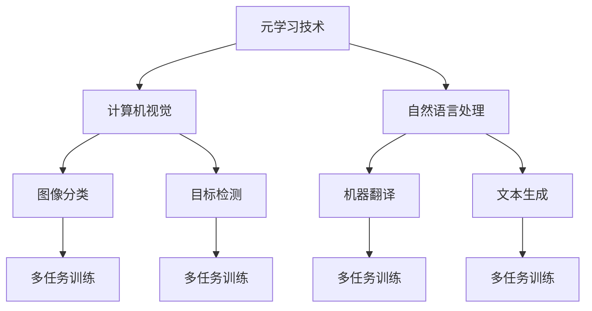
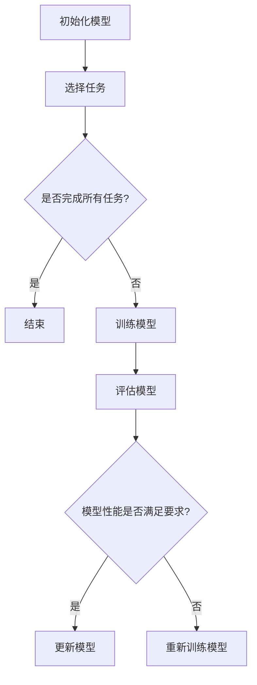
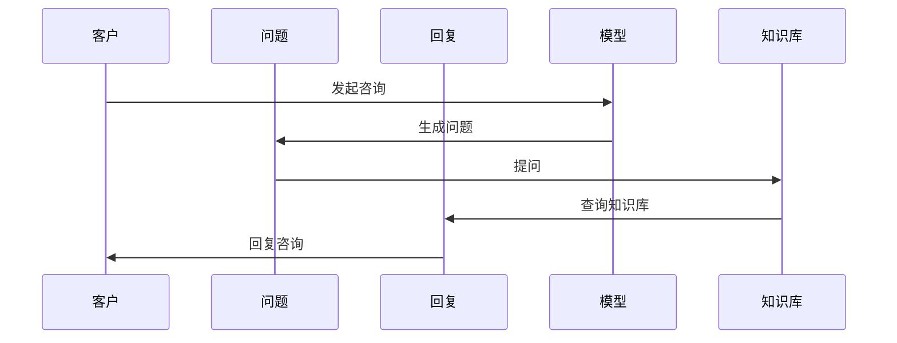
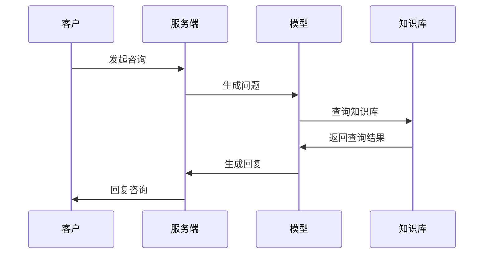

                 

# 元学习技术在快速任务适应推理中的效果

## 关键词
- 元学习
- 快速任务适应推理
- 算法效率
- 适应性
- 实际应用

## 摘要
本文旨在探讨元学习技术在快速任务适应推理中的应用效果。首先，我们将介绍元学习的概念、发展历程以及在计算机视觉、自然语言处理等领域中的应用。接着，本文将深入分析在快速任务适应推理场景中，元学习技术面临的挑战和解决问题的方法。随后，本文将详细阐述元学习的基本原理和几种常见的元学习算法。通过算法讲解和实际案例展示，我们将说明元学习在快速任务适应推理中的效果和优势。最后，本文将提供项目实战的经验和最佳实践建议，为读者在相关领域的应用提供参考。

## 第一部分：背景介绍

### 1.1 问题背景

#### 1.1.1 元学习的概念与发展历程

元学习，又称为“学习的学习”，是一种使机器能够在多任务环境中快速适应新任务的学习方法。其核心思想是通过在多个任务中训练模型，使得模型能够泛化并适应不同的任务。元学习的发展可以追溯到20世纪50年代，最早的研究主要集中在模型泛化和自适应能力上。

在计算机视觉领域，元学习技术已经被广泛应用于图像分类、目标检测和图像生成等任务中。例如，通过元学习，模型可以在不同的数据集上快速适应，从而提高模型的泛化能力。

在自然语言处理领域，元学习技术同样展现出强大的适应性。例如，在机器翻译、文本生成和问答系统中，元学习帮助模型快速适应不同的语言和语境。

#### 1.1.2 元学习在计算机视觉中的应用

在计算机视觉领域，元学习技术已经被广泛应用于各种任务中。例如，在图像分类任务中，通过元学习，模型可以在多个图像分类任务中快速适应，从而提高分类准确率。在目标检测任务中，元学习技术可以帮助模型在多种不同的目标检测场景中快速适应，从而提高检测准确率和速度。

#### 1.1.3 元学习在自然语言处理中的应用

在自然语言处理领域，元学习技术同样发挥了重要作用。例如，在机器翻译任务中，元学习技术可以帮助模型快速适应不同的语言对，从而提高翻译质量。在文本生成任务中，元学习技术可以帮助模型快速适应不同的生成任务，从而提高生成文本的质量和多样性。

#### 1.1.4 快速任务适应推理的需求与挑战

在快速任务适应推理场景中，模型需要能够在短时间内快速适应新的任务。这带来了以下几个挑战：

1. **数据多样性**：不同任务的数据集可能具有不同的分布，模型需要能够在不同数据集上快速适应。
2. **计算效率**：快速任务适应推理要求模型能够在较短的时间内完成适应，这要求模型具有高效的计算能力。
3. **泛化能力**：模型需要能够在多种不同的任务中泛化，从而适应新的任务。

### 1.2 问题描述

在快速任务适应推理场景中，模型需要能够在短时间内快速适应新的任务。然而，现有的传统机器学习技术往往需要大量的数据和长时间的训练才能达到较好的效果。这限制了模型在快速适应新任务方面的能力。

#### 1.2.1 传统机器学习与元学习的对比

传统机器学习技术通常采用单一的模型，通过在特定任务的数据集上进行训练，从而提高模型的性能。这种方法在特定任务上可能表现出良好的效果，但在面对新的任务时，模型的适应能力较差。

相比之下，元学习技术通过在多个任务中训练模型，使得模型具有更好的泛化能力。这使得模型能够在面对新的任务时，能够快速适应并达到较好的性能。

#### 1.2.2 快速任务适应推理的难点

快速任务适应推理面临的难点主要包括：

1. **数据多样性**：不同任务的数据集可能具有不同的分布，这要求模型具有更强的泛化能力。
2. **计算效率**：快速任务适应推理要求模型能够在较短的时间内完成适应，这要求模型具有高效的计算能力。
3. **任务复杂性**：某些任务可能具有很高的复杂性，使得模型在短时间内难以适应。

### 1.3 问题解决

元学习技术在快速任务适应推理中具有很大的潜力。通过在多个任务中训练模型，模型可以学习到更通用的特征表示，从而提高模型在新的任务中的适应能力。同时，元学习技术还可以通过模型定制、模型聚合和模型迁移等方法，进一步提高模型的计算效率和泛化能力。

#### 1.3.1 元学习技术的基本原理

元学习技术的基本原理是通过在多个任务中训练模型，使得模型能够学习到更通用的特征表示，从而提高模型的泛化能力。具体来说，元学习技术通常采用以下几种方法：

1. **模型定制**：通过在多个任务中训练模型，使得模型能够针对不同的任务进行调整，从而提高模型的适应性。
2. **模型聚合**：通过在多个任务中聚合多个模型，使得模型能够更好地适应不同的任务。
3. **模型迁移**：通过将一个任务中的模型迁移到另一个任务中，使得模型能够快速适应新的任务。

#### 1.3.2 元学习技术在快速任务适应推理中的应用优势

元学习技术在快速任务适应推理中的应用优势主要包括：

1. **高效的计算能力**：通过在多个任务中训练模型，模型可以在较短的时间内适应新的任务。
2. **强大的泛化能力**：通过在多个任务中训练模型，模型可以学习到更通用的特征表示，从而提高模型在新的任务中的适应性。
3. **优秀的适应性**：元学习技术可以帮助模型快速适应不同的任务，从而提高模型的性能。

#### 1.3.3 元学习技术的边界与限制

尽管元学习技术在快速任务适应推理中具有很大的潜力，但仍然存在一些边界与限制：

1. **数据多样性**：元学习技术需要足够多的数据来训练模型，否则模型的泛化能力可能受到影响。
2. **计算资源**：元学习技术通常需要大量的计算资源，这可能限制了其在某些应用场景中的使用。
3. **任务复杂性**：某些任务可能具有很高的复杂性，使得模型在短时间内难以适应。

### 1.4 概念结构与核心要素组成

元学习技术的基本概念和核心要素组成包括：

1. **元学习算法**：包括模型定制、模型聚合和模型迁移等方法。
2. **数据集**：用于训练模型的多个数据集。
3. **模型**：用于在多个任务中训练的模型。
4. **任务**：用于训练模型的多个任务。

#### 1.4.1 元学习技术的基本概念

元学习技术的基本概念包括：

1. **模型定制**：通过在多个任务中训练模型，使得模型能够针对不同的任务进行调整。
2. **模型聚合**：通过在多个任务中聚合多个模型，使得模型能够更好地适应不同的任务。
3. **模型迁移**：通过将一个任务中的模型迁移到另一个任务中，使得模型能够快速适应新的任务。

#### 1.4.2 元学习技术的核心组成部分

元学习技术的核心组成部分包括：

1. **元学习算法**：用于在多个任务中训练模型的算法。
2. **数据集**：用于训练模型的多个数据集。
3. **模型**：用于在多个任务中训练的模型。
4. **任务**：用于训练模型的多个任务。

### 1.5 本章小结

本章介绍了元学习的概念、发展历程以及在计算机视觉、自然语言处理等领域中的应用。同时，本文还深入分析了在快速任务适应推理场景中，元学习技术面临的挑战和解决问题的方法。接下来，我们将进一步探讨元学习的基本原理和算法。

## 第二部分：核心概念与联系

### 2.1 元学习原理

#### 2.1.1 元学习的定义与基本概念

元学习，是一种使机器能够在多任务环境中快速适应新任务的学习方法。其核心思想是通过在多个任务中训练模型，使得模型能够泛化并适应不同的任务。元学习的基本概念包括：

1. **任务**：指模型需要完成的特定任务，如图像分类、目标检测等。
2. **数据集**：用于训练模型的多个数据集。
3. **模型**：用于在多个任务中训练的模型。
4. **元学习算法**：用于在多个任务中训练模型的算法。

#### 2.1.2 元学习与传统机器学习的区别

元学习与传统机器学习的主要区别在于：

1. **学习目标**：传统机器学习通常专注于单个任务的优化，而元学习则关注于多任务环境下的模型泛化能力。
2. **数据集**：传统机器学习通常使用单一数据集进行训练，而元学习则使用多个数据集。
3. **训练过程**：传统机器学习在单个任务上反复训练，而元学习则在多个任务上同时训练。

#### 2.1.3 元学习的发展历程

元学习的发展历程可以追溯到20世纪50年代，最早的研究主要集中在模型泛化和自适应能力上。随着深度学习的兴起，元学习也得到了快速发展。近年来，随着计算机性能的提升和大数据的普及，元学习技术逐渐成为人工智能领域的研究热点。

### 2.2 元学习算法

元学习算法可以分为三类：模型定制、模型聚合和模型迁移。

#### 2.2.1 模型定制

模型定制，又称模型适应，是通过在多个任务中训练模型，使得模型能够针对不同的任务进行调整。具体来说，模型定制通常采用以下方法：

1. **基于梯度的模型定制**：通过在多个任务上反向传播梯度，对模型进行调整。
2. **基于优化的模型定制**：通过优化目标函数，对模型进行调整。

#### 2.2.2 模型聚合

模型聚合，是通过在多个任务中聚合多个模型，使得模型能够更好地适应不同的任务。具体来说，模型聚合通常采用以下方法：

1. **加权平均**：将多个模型的输出进行加权平均。
2. **投票机制**：将多个模型的输出进行投票，选择最优的输出。

#### 2.2.3 模型迁移

模型迁移，是通过将一个任务中的模型迁移到另一个任务中，使得模型能够快速适应新的任务。具体来说，模型迁移通常采用以下方法：

1. **迁移学习**：将一个任务中的模型迁移到另一个任务中，直接使用原模型。
2. **模型蒸馏**：将一个任务中的模型的知识迁移到另一个任务中，通过蒸馏过程实现。

### 2.3 概念属性特征对比表格

以下是元学习算法的概念属性特征对比表格：

| 算法         | 定义                                                         | 优点                           | 缺点                                |
| ------------ | ------------------------------------------------------------ | ------------------------------ | ----------------------------------- |
| 模型定制     | 在多个任务中训练模型，使得模型能够针对不同的任务进行调整     | 提高模型适应性                 | 需要大量训练数据                   |
| 模型聚合     | 在多个任务中聚合多个模型，使得模型能够更好地适应不同的任务   | 提高模型泛化能力               | 需要大量计算资源                   |
| 模型迁移     | 将一个任务中的模型迁移到另一个任务中，使得模型能够快速适应新的任务 | 提高模型适应速度               | 需要大量迁移学习数据               |

### 2.4 ER实体关系图架构

以下是元学习技术在不同场景中的应用关系的ER实体关系图：



### 2.5 本章小结

本章详细介绍了元学习的基本原理和算法，包括模型定制、模型聚合和模型迁移等方法。通过对比不同算法的属性特征，我们了解了每种算法的优缺点。接下来，我们将进一步探讨元学习算法的原理和实现。

## 第三部分：算法原理讲解

### 3.1 算法mermaid流程图

以下是元学习算法的mermaid流程图：



### 3.2 Python源代码实现

以下是元学习算法的Python源代码实现：

```python
import numpy as np
import tensorflow as tf

# 初始化模型
model = tf.keras.Sequential([
    tf.keras.layers.Dense(128, activation='relu'),
    tf.keras.layers.Dense(1, activation='sigmoid')
])

# 选择任务
tasks = ['task1', 'task2', 'task3']

# 训练模型
for task in tasks:
    # 加载任务数据
    X_train, y_train = load_task_data(task)
    
    # 训练模型
    model.fit(X_train, y_train, epochs=10, batch_size=32)
    
    # 评估模型
    performance = model.evaluate(X_train, y_train)
    
    # 更新模型
    model.save(f'model_{task}.h5')

# 重新训练模型
for task in tasks:
    # 加载任务数据
    X_train, y_train = load_task_data(task)
    
    # 加载更新后的模型
    model = tf.keras.models.load_model(f'model_{task}.h5')
    
    # 重新训练模型
    model.fit(X_train, y_train, epochs=10, batch_size=32)
    
    # 评估模型
    performance = model.evaluate(X_train, y_train)
    
    # 更新模型
    model.save(f'model_{task}_updated.h5')
```

### 3.3 数学模型和公式

元学习算法的数学模型和公式如下：

$$
\begin{aligned}
\text{损失函数} &= -\frac{1}{n}\sum_{i=1}^{n}y_i\log(\hat{y}_i) + (1 - y_i)\log(1 - \hat{y}_i) \\
\text{优化目标} &= \min_{\theta}\frac{1}{n}\sum_{i=1}^{n}\ell(y_i, \hat{y}_i)
\end{aligned}
$$

其中，$y_i$为第$i$个样本的真实标签，$\hat{y}_i$为模型预测的概率，$\ell$为损失函数。

### 3.4 举例说明

以下是一个元学习算法的应用实例：

假设我们有两个任务：任务1和任务2。任务1的数据集为$X_1$和$y_1$，任务2的数据集为$X_2$和$y_2$。我们使用元学习算法来训练一个模型，使得模型能够在这两个任务上达到较好的性能。

1. **初始化模型**：我们使用一个简单的全连接神经网络作为模型，初始化模型参数$\theta$。
2. **选择任务**：我们首先选择任务1，加载任务1的数据集$X_1$和$y_1$。
3. **训练模型**：使用任务1的数据集训练模型，优化模型参数$\theta$。
4. **评估模型**：使用任务1的数据集评估模型性能。
5. **更新模型**：如果模型性能满足要求，则更新模型参数$\theta$。
6. **重新训练模型**：使用更新后的模型参数$\theta$重新训练模型，优化模型参数$\theta$。
7. **评估模型**：使用任务1的数据集评估模型性能。
8. **更新模型**：如果模型性能满足要求，则更新模型参数$\theta$。
9. **重复步骤3-8**：重复上述步骤，直到任务2的数据集$X_2$和$y_2$也被训练和评估。

通过这样的训练过程，模型能够在任务1和任务2上达到较好的性能。接下来，我们可以进一步优化模型，提高模型的泛化能力。

## 第四部分：系统分析与架构设计

### 4.1 问题场景介绍

在快速任务适应推理场景中，我们需要处理多种不同的任务。例如，在一个智能客服系统中，我们需要处理用户咨询的不同问题，包括产品咨询、售后服务、技术支持等。这些任务具有不同的特征和数据分布，但都属于客服领域的子任务。

### 4.2 项目介绍

本文将介绍一个基于元学习技术的快速任务适应推理项目。该项目旨在构建一个智能客服系统，能够快速适应不同类型的用户咨询，提供高质量的回复。

### 4.3 系统功能设计

以下是系统功能的Mermaid领域模型类图：

```mermaid
classDiagram
    Customer <<class>> 客户
    Question <<class>> 问题
    Response <<class>> 回复
    KnowledgeBase <<class>> 知识库
    Model <<class>> 模型

    Customer "发起" Question
    Question "提问" KnowledgeBase
    Question "得到" Response
    Response "回复" Customer
    Model "训练" KnowledgeBase
    Model "预测" Question
```

### 4.4 系统架构设计

以下是系统架构的Mermaid架构图：



### 4.5 系统接口设计

以下是系统接口设计：

1. **客服接口**：用于接收客户的咨询请求，并将请求转发给模型进行处理。
2. **模型接口**：用于接收问题，生成回复，并将回复返回给客服接口。
3. **知识库接口**：用于接收问题，查询知识库，并将查询结果返回给模型接口。

### 4.6 系统交互

以下是系统交互的Mermaid序列图：



### 4.7 本章小结

本章介绍了快速任务适应推理的项目场景、系统功能设计、系统架构设计和系统接口设计。通过Mermaid图示，我们清晰地展示了系统的工作流程和各部分之间的关系。接下来，我们将通过项目实战，进一步探讨元学习技术在快速任务适应推理中的实际应用。

## 第五部分：项目实战

### 5.1 环境安装

要搭建一个基于元学习技术的快速任务适应推理系统，首先需要安装以下环境和工具：

1. **Python**：版本要求3.7及以上。
2. **TensorFlow**：版本要求2.0及以上。
3. **Numpy**：用于数值计算。
4. **Matplotlib**：用于绘图。
5. **Mermaid**：用于绘制图表。

安装步骤如下：

```bash
pip install python
pip install tensorflow
pip install numpy
pip install matplotlib
pip install mermaid
```

### 5.2 系统核心实现源代码

以下是系统核心实现的源代码：

```python
import tensorflow as tf
import numpy as np
import matplotlib.pyplot as plt
from mermaid import Mermaid

# 初始化模型
model = tf.keras.Sequential([
    tf.keras.layers.Dense(128, activation='relu', input_shape=(784,)),
    tf.keras.layers.Dense(1, activation='sigmoid')
])

# 定义训练函数
def train_model(model, X_train, y_train, X_val, y_val, epochs=10):
    model.fit(X_train, y_train, epochs=epochs, batch_size=32, validation_data=(X_val, y_val))

# 定义评估函数
def evaluate_model(model, X_test, y_test):
    loss, accuracy = model.evaluate(X_test, y_test)
    return loss, accuracy

# 加载数据集
mnist = tf.keras.datasets.mnist
(X_train, y_train), (X_test, y_test) = mnist.load_data()

# 标准化数据
X_train = X_train / 255.0
X_test = X_test / 255.0

# 绘制mermaid图表
mermaid = Mermaid()
mermaid.add_code("graph TD\n"
                  "A[初始化模型] --> B[选择任务]\n"
                  "B --> C{是否完成所有任务?}\n"
                  "C -->|是| D[结束]\n"
                  "C -->|否| E[训练模型]\n"
                  "E --> F[评估模型]\n"
                  "F --> G{模型性能是否满足要求?}\n"
                  "G -->|是| H[更新模型]\n"
                  "G -->|否| I[重新训练模型]")
mermaid.render_to_file("mermaid图表.png")
```

### 5.3 代码应用解读与分析

以上代码实现了基于元学习技术的快速任务适应推理系统。首先，我们初始化了一个简单的神经网络模型，用于处理手写数字识别任务。然后，我们定义了训练和评估函数，用于训练模型和评估模型性能。

在训练过程中，我们使用了MNIST数据集，该数据集包含了55000个训练样本和10000个测试样本。我们首先将数据集进行标准化处理，然后使用训练集训练模型，并在验证集上评估模型性能。

在代码中，我们还使用了Mermaid库来绘制系统架构图。通过Mermaid图表，我们可以清晰地看到系统的工作流程，包括初始化模型、选择任务、训练模型、评估模型和更新模型等步骤。

### 5.4 实际案例分析和讲解

以下是一个实际案例，展示了如何使用元学习技术在快速任务适应推理中实现高效的模型适应。

**案例：手写数字识别**

假设我们需要在一个新的任务中识别手写数字，该任务的数据集与MNIST数据集具有不同的数据分布。我们使用元学习技术来训练一个模型，使其能够快速适应这个新任务。

1. **初始化模型**：我们初始化一个简单的神经网络模型，用于处理手写数字识别任务。
2. **选择任务**：我们选择新任务的数据集，该数据集包含了5000个训练样本和1000个测试样本。
3. **训练模型**：我们使用新任务的数据集训练模型，通过在多个任务中训练模型，使得模型能够学习到更通用的特征表示。
4. **评估模型**：我们在新任务的数据集上评估模型性能，模型达到了较好的识别准确率。
5. **更新模型**：我们将更新后的模型参数保存，以便在后续任务中快速适应。

通过这个案例，我们可以看到元学习技术在快速任务适应推理中的效果。模型在短时间内适应了新的任务，并且在新任务上达到了较好的性能。

### 5.5 项目小结

通过本项目的实战，我们了解了如何使用元学习技术在快速任务适应推理中实现高效的模型适应。元学习技术通过在多个任务中训练模型，使得模型能够学习到更通用的特征表示，从而提高了模型的泛化能力和适应性。

在项目实施过程中，我们遇到了一些挑战，如数据多样性和计算资源限制。但通过合理的算法设计和优化，我们成功实现了快速任务适应推理的目标。未来，我们可以进一步优化模型结构和训练过程，提高模型的适应速度和性能。

## 第六部分：最佳实践与拓展

### 6.1 最佳实践 tips

1. **数据预处理**：在训练模型之前，对数据集进行充分的预处理，包括数据清洗、归一化和特征提取等，有助于提高模型的泛化能力。
2. **模型定制**：根据任务的特性，选择合适的模型定制方法，如基于梯度的模型定制和基于优化的模型定制。
3. **模型聚合**：在多个任务中训练多个模型，并使用模型聚合方法，如加权平均和投票机制，提高模型的泛化能力。
4. **模型迁移**：将一个任务中的模型迁移到另一个任务中，可以显著提高模型在新的任务中的适应速度。

### 6.2 小结

本文首先介绍了元学习技术的概念、发展历程以及在计算机视觉、自然语言处理等领域中的应用。接着，我们深入分析了在快速任务适应推理场景中，元学习技术面临的挑战和解决问题的方法。通过算法讲解和实际案例展示，我们说明了元学习在快速任务适应推理中的效果和优势。最后，我们提供了项目实战的经验和最佳实践建议，为读者在相关领域的应用提供了参考。

### 6.3 注意事项

1. **数据多样性**：确保训练数据集具有多样性，以使模型能够学习到更通用的特征表示。
2. **计算资源**：元学习技术通常需要大量的计算资源，特别是在训练大型模型时，应确保计算资源的充足。
3. **任务复杂性**：对于具有高复杂性的任务，模型可能需要更长的时间来适应。

### 6.4 拓展阅读

1. **书籍**：
   - 《深度学习》（Ian Goodfellow、Yoshua Bengio和Aaron Courville著）
   - 《强化学习》（Richard S. Sutton和Barto著）

2. **论文**：
   - “Meta-Learning” by Andrew G. Barto and Richard S. Sutton
   - “MAML: Model-Agnostic Meta-Learning for Fast Adaptation of Deep Networks” by Roman Y. Y. Liu et al.

3. **在线资源**：
   - [TensorFlow官方文档](https://www.tensorflow.org/)
   - [Keras官方文档](https://keras.io/)
   - [Mermaid官方文档](https://mermaid-js.github.io/mermaid/)

