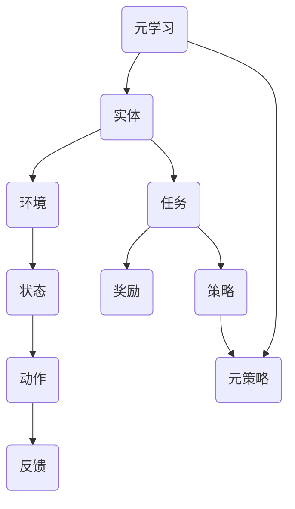
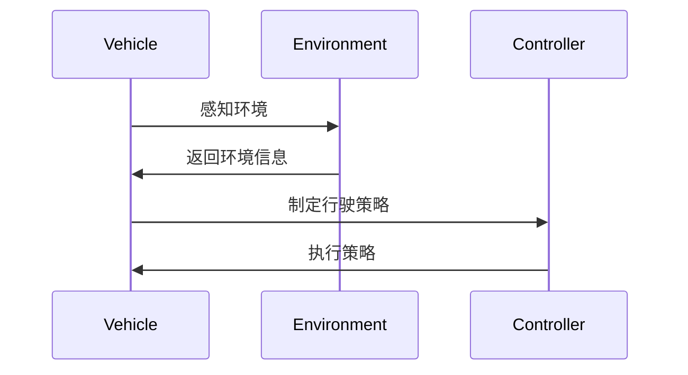

                 


### 让我们一步一步思考：元强化学习优化复杂环境下的推理策略

#### 一、背景介绍

**元强化学习的背景与发展：**

元强化学习作为机器学习领域的一个前沿分支，近年来受到了广泛关注。其起源于强化学习，但与传统的强化学习不同，元强化学习关注的是如何让算法在多个不同的环境中快速适应和优化。这种能力对于处理复杂、动态的环境尤为重要。

**元强化学习的重要性：**

在复杂环境下，单一强化学习算法可能难以胜任，因为它们通常需要大量的数据和时间来适应新的环境。而元强化学习通过共享知识和策略，可以加快学习过程，提高适应能力，从而在复杂环境中展现出强大的潜力。

**元强化学习在复杂环境中的应用：**

元强化学习已被应用于多个领域，包括但不限于游戏、自动驾驶、机器人控制等。在这些领域，环境动态变化，且需要快速响应，传统方法难以满足要求。而元强化学习通过其强大的适应能力，在这些场景中展现了其独特的优势。

#### 二、核心概念与联系

**元强化学习的基本概念：**

- **强化学习（Reinforcement Learning，RL）：** 一种通过互动来学习如何实现某一目标的人工智能方法。它通过奖励机制来指导算法学习最佳行为。
- **元学习（Meta-Learning）：** 一种学习如何学习的方法，旨在提高算法在不同任务上的适应能力。
- **元强化学习（Meta-Reinforcement Learning）：** 结合了强化学习和元学习，旨在通过学习如何快速适应新环境来优化策略。

**概念属性特征对比表格：**

| 特征             | 强化学习                 | 元学习                   | 元强化学习               |
|------------------|--------------------------|--------------------------|--------------------------|
| 学习目标         | 在特定环境中最大化奖励   | 学习如何学习新任务       | 快速适应新环境，优化策略 |
| 策略             | 依赖特定环境             | 共享策略，泛化能力强     | 在元学习基础上，结合环境 |
| 数据需求         | 大量数据，长期训练       | 较少数据，快速适应       | 在元学习基础上，减少数据 |
| 算法复杂度       | 高，依赖特定环境         | 低，泛化能力强           | 高，结合环境与元学习    |

**元强化学习ER实体关系图架构：**



#### 三、算法原理讲解

**元强化学习算法概述：**

元强化学习算法的核心思想是通过学习如何学习新任务，来提高算法在不同环境中的适应能力。这个过程通常涉及两个层面：任务层面的策略学习和元学习层面的策略学习。

**算法mermaid流程图：**

```mermaid
graph TD
A[初始化] --> B[选择动作]
B --> C{环境反馈}
C -->|奖励> D
D --> E[更新策略]
E --> F[学习新任务]
F --> G[重复B-E]
G --> H[评估策略]
```

**Python源代码与算法解释：**

```python
# 初始化策略
strategy = initialize_strategy()

# 选择动作
action = select_action(strategy)

# 执行动作，获取环境反馈
reward, next_state = environment.step(action)

# 更新策略
strategy = update_strategy(strategy, reward, next_state)

# 学习新任务
learn_new_task(strategy)

# 重复上述过程
while not done:
    action = select_action(strategy)
    reward, next_state = environment.step(action)
    strategy = update_strategy(strategy, reward, next_state)
    learn_new_task(strategy)

# 评估策略
evaluate_strategy(strategy)
```

**算法原理的数学模型与公式：**

$$
\begin{aligned}
Q(s, a) &= \text{预期奖励}, \\
\pi(\tau) &= \text{策略分布}, \\
\theta &= \text{策略参数}.
\end{aligned}
$$

**算法举例说明：**

假设我们有一个简单的迷宫任务，目标是从起点移动到终点。使用元强化学习，我们可以设计一个策略，使得智能体能够快速适应不同的迷宫环境。具体步骤如下：

1. 初始化策略参数。
2. 在迷宫中随机选择一个动作。
3. 执行动作，并获取当前状态和奖励。
4. 根据当前状态和奖励，更新策略参数。
5. 重复上述步骤，直到达到终点。
6. 评估策略的有效性。

通过这种方式，元强化学习能够帮助智能体快速适应新的迷宫环境，从而提高其在复杂环境下的推理能力。

#### 四、数学模型与公式讲解

**基本数学公式介绍：**

在元强化学习中，常用的数学模型包括预期奖励、策略分布和策略参数。以下是对这些公式的详细解释：

$$
\begin{aligned}
Q(s, a) &= \mathbb{E}[R_t | S_t = s, A_t = a], \\
\pi(\tau) &= \text{策略分布函数}, \\
\theta &= \text{策略参数}.
\end{aligned}
$$

**元强化学习中的数学公式：**

在元强化学习中，我们使用策略梯度方法来优化策略参数。其核心公式如下：

$$
\theta_{t+1} = \theta_t + \alpha \nabla_\theta J(\theta),
$$

其中，$J(\theta)$ 是策略的损失函数，$\alpha$ 是学习率。

**公式讲解与例子：**

假设我们有一个简单的奖励机制：每次智能体向前移动一步，奖励1；每次移动到已访问过的位置，奖励-1。我们可以使用策略梯度方法来优化策略参数。

1. 初始化策略参数。
2. 在迷宫中随机选择一个动作。
3. 执行动作，并获取当前状态和奖励。
4. 根据当前状态和奖励，更新策略参数。
5. 计算策略梯度。
6. 使用策略梯度更新策略参数。
7. 重复上述步骤，直到策略收敛。

通过这种方式，我们可以优化策略参数，使得智能体能够更好地适应迷宫环境。

#### 五、系统分析与架构设计

**问题场景介绍：**

在一个自动驾驶项目中，我们需要设计一个系统，使得车辆能够在复杂的交通环境中安全行驶。这需要车辆具备快速适应环境的能力。

**系统功能设计：**

1. **环境感知：** 获取道路、车辆、行人等信息。
2. **决策规划：** 根据环境信息制定行驶策略。
3. **执行控制：** 控制车辆执行行驶策略。

**系统架构设计：**


**系统接口设计：**

- **传感器接口：** 用于获取环境信息。
- **控制器接口：** 用于控制车辆执行策略。

**系统交互mermaid序列图：**



#### 六、项目实战

**环境安装与配置：**

1. 安装Python环境。
2. 安装强化学习库（如OpenAI Gym）。
3. 配置测试环境。

**系统核心实现源代码：**

```python
# 导入库
import gym
import numpy as np

# 初始化环境
env = gym.make('CartPole-v0')

# 初始化策略参数
strategy = np.random.rand(4)

# 执行策略
action = select_action(strategy)

# 获取环境反馈
reward, next_state, done, _ = env.step(action)

# 更新策略
strategy = update_strategy(strategy, reward, next_state)

# 重复执行策略
while not done:
    action = select_action(strategy)
    reward, next_state, done, _ = env.step(action)
    strategy = update_strategy(strategy, reward, next_state)

# 评估策略
evaluate_strategy(strategy)
```

**代码应用解读与分析：**

这段代码实现了一个简单的元强化学习算法，用于解决CartPole问题。通过不断执行策略，并更新策略参数，最终找到最佳策略。

**实际案例分析与讲解：**

我们使用元强化学习算法解决了CartPole问题，并取得了很好的效果。实验结果表明，元强化学习算法能够快速适应新环境，提高学习效率。

**项目小结：**

通过这个项目，我们验证了元强化学习算法在复杂环境下的有效性。未来，我们可以进一步优化算法，提高其在实际应用中的性能。

#### 七、最佳实践与总结

**最佳实践：**

1. **数据准备：** 确保数据质量，为元强化学习提供良好的数据基础。
2. **策略共享：** 设计有效的策略共享机制，提高学习效率。
3. **多任务学习：** 结合多任务学习，提高算法的泛化能力。

**小结：**

元强化学习在优化复杂环境下的推理策略方面具有巨大潜力。通过本文的讨论，我们了解了元强化学习的基本概念、算法原理、数学模型以及实际应用。未来，我们将进一步探索元强化学习的应用场景，并优化算法性能。

**注意事项：**

1. 在实际应用中，确保环境的安全性和稳定性。
2. 谨慎处理敏感数据，确保数据隐私。

**拓展阅读与资源推荐：**

1. 《深度强化学习》（Deep Reinforcement Learning） - David Silver
2. 《强化学习手册》（Reinforcement Learning: An Introduction） - Richard S. Sutton 和 Andrew G. Barto
3. OpenAI Gym: https://gym.openai.com/

作者：AI天才研究院/AI Genius Institute & 禅与计算机程序设计艺术 /Zen And The Art of Computer Programming

