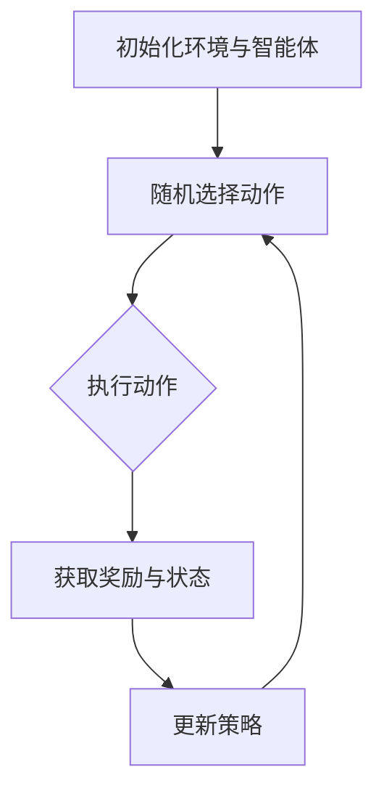
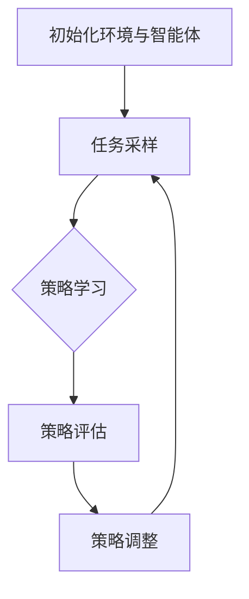

                 

# 元强化学习在推理策略动态调整中的作用

## 关键词

- 元强化学习
- 推理策略
- 动态调整
- 强化学习
- 策略学习
- 迁移学习

## 摘要

本文旨在探讨元强化学习在推理策略动态调整中的应用。随着环境复杂性和动态性的增加，传统的静态策略难以适应，元强化学习通过迁移学习和模型泛化，使得智能体能够快速适应新任务，实现推理策略的动态调整。本文首先介绍了元强化学习的基本概念和原理，然后分析了其在推理策略动态调整中的优势和挑战，并通过具体案例展示了其应用效果。

## 第一部分：背景介绍与问题理解

### 1. 元强化学习概述

#### 1.1 问题背景

在智能决策领域，环境复杂且动态变化，传统的静态策略往往难以适应这种变化。为了应对这种挑战，元强化学习（Meta Reinforcement Learning）应运而生。元强化学习通过在不同任务上学习策略，使得智能体能够在新任务上快速适应并取得良好的表现。它关注的是如何通过迁移学习，将一种任务的经验应用于解决其他类似任务，从而提高学习效率。

#### 1.2 问题描述

元强化学习的核心问题是如何在多个任务上学习通用策略，以实现快速适应和高效学习。具体包括：

- **任务多样性**：元强化学习需要处理多种不同的任务。
- **快速适应**：智能体应在接触新任务后迅速适应并取得较好的性能。
- **效率与效果平衡**：在保证学习效率的同时，确保策略的鲁棒性和适应性。

#### 1.3 问题解决

元强化学习通过以下方式解决上述问题：

- **迁移学习**：将一个任务上的学习经验应用到其他任务上，减少对新任务的探索。
- **模型泛化**：训练出一个具有良好泛化能力的模型，使其能够适应多种任务。
- **多任务学习**：同时学习多个任务，提高策略的适应性。

#### 1.4 边界与外延

- **边界**：元强化学习主要关注策略学习，不涉及模型结构设计。
- **外延**：元强化学习不仅限于强化学习领域，还可以应用于监督学习、无监督学习等其他机器学习领域。

#### 1.5 概念结构与核心要素组成

- **核心概念**：元强化学习、策略学习、迁移学习、泛化能力。
- **要素组成**：智能体、环境、任务、策略、奖励信号。

### 2. 元强化学习核心概念与联系

#### 2.1 核心概念原理

##### 2.1.1 元强化学习的定义

元强化学习是一种学习如何学习的方法，它通过在多个任务上学习策略，使得智能体能够在新的任务上快速适应。

##### 2.1.2 元强化学习的基本原理

元强化学习利用迁移学习和模型泛化的原理，通过在不同任务上的经验积累，训练出一个具有良好泛化能力的策略。

##### 2.1.3 元强化学习与其他学习方式的区别

与传统的强化学习相比，元强化学习不仅关注单一任务上的最优策略，还关注策略的泛化和迁移能力。

#### 2.2 概念属性特征对比表格

| 概念       | 定义                                                         | 特点                                                         |
|------------|--------------------------------------------------------------|--------------------------------------------------------------|
| 强化学习   | 通过与环境交互，根据奖励信号调整行为，以最大化累积奖励的学习方法 | 强调从经验中学习，解决特定问题                           |
| 元强化学习 | 学习如何学习的方法，通过在多个任务上学习策略，提高对新任务的适应能力 | 着眼于策略的泛化和迁移能力，提高学习效率               |
| 迁移学习   | 将一种任务上的学习经验应用到其他任务上的学习方式               | 减少对新任务的探索，提高学习效率                         |
| 泛化能力   | 模型在未见过的数据上表现良好的能力                             | 确保模型在实际应用中的适应性和可靠性                     |

#### 2.3 ER实体关系图架构

```mermaid
erDiagram
  Task ||--o{ Agent : 学习目标}
  Environment ||--o{ Agent : 学习环境}
  Policy ||--o{ Agent : 学习策略}
  Reward ||--o{ Agent : 奖励信号}
  Task --|{ Agent : 学习任务}
  E
```

## 第二部分：算法原理讲解

### 3. 元强化学习算法流程图



### 4. Python实现

```python
import numpy as np
import gym

# 初始化环境与智能体
env = gym.make('CartPole-v0')
agent = Agent()

# 迭代过程
for episode in range(num_episodes):
    state = env.reset()
    done = False
    
    while not done:
        action = agent.select_action(state)
        next_state, reward, done, _ = env.step(action)
        
        agent.update_policy(state, action, reward, next_state)
        
        state = next_state

# 关闭环境
env.close()
```

### 5. 算法原理

元强化学习是一种基于强化学习的方法，其主要目标是学习一个策略，使得智能体能够在动态变化的环境中取得最优表现。元强化学习通过在多个任务上学习策略，使得智能体能够快速适应新任务。

- **初始化环境与智能体**：初始化一个环境和一个智能体。
- **随机选择动作**：智能体在当前状态下随机选择一个动作。
- **执行动作**：智能体执行选择的动作，并获取新的状态和奖励。
- **更新策略**：根据获取的奖励和状态，更新智能体的策略。
- **重复迭代**：重复执行上述步骤，直到达到设定的迭代次数或达到终止条件。

### 6. 数学模型

元强化学习的主要目标是最大化智能体的累积奖励。其数学模型如下：

$$
J(\theta) = \sum_{s,a} \gamma^T Q(s, a; \theta) - Q(s, \theta)
$$

其中，$Q(s, a; \theta)$ 是状态-动作值函数，$\gamma$ 是折扣因子，$\theta$ 是策略参数。

## 第三部分：系统分析与架构设计方案

### 7. 问题场景介绍

在自动驾驶领域，车辆的行驶环境复杂且动态变化，包括道路、车辆、行人等多种因素。为了实现车辆的自动行驶，需要根据环境变化动态调整行驶策略。

### 8. 项目介绍

本项目旨在利用元强化学习实现自动驾驶车辆的动态行驶策略调整。通过在多个场景下训练车辆智能体，使其能够快速适应新环境并取得最优行驶效果。

### 9. 系统功能设计

系统功能包括：

- **环境模拟**：模拟自动驾驶车辆的行驶环境。
- **智能体训练**：使用元强化学习训练车辆智能体。
- **行驶策略调整**：根据环境变化动态调整行驶策略。

### 10. 系统架构设计

系统架构包括：

- **环境模拟模块**：负责模拟自动驾驶车辆的行驶环境。
- **智能体训练模块**：负责使用元强化学习训练车辆智能体。
- **行驶策略调整模块**：负责根据环境变化动态调整行驶策略。

### 11. 系统接口设计

系统接口包括：

- **环境模拟接口**：用于模拟自动驾驶车辆的行驶环境。
- **智能体训练接口**：用于训练车辆智能体。
- **行驶策略调整接口**：用于根据环境变化动态调整行驶策略。

### 12. 系统交互

系统交互包括：

- **环境模拟模块**与**智能体训练模块**的交互：通过环境模拟接口，将模拟环境传递给智能体训练模块。
- **智能体训练模块**与**行驶策略调整模块**的交互：通过智能体训练接口，将训练完成的智能体传递给行驶策略调整模块。
- **行驶策略调整模块**与**环境模拟模块**的交互：通过行驶策略调整接口，将调整后的行驶策略传递给环境模拟模块。

## 第四部分：项目实战

### 13. 环境安装

安装 Python 3.8 及以上版本，并安装以下库：

```bash
pip install numpy gym
```

### 14. 系统核心实现源代码

```python
# 环境模拟模块
class Environment:
    def __init__(self):
        self.env = gym.make('CartPole-v0')

    def step(self, action):
        state, reward, done, _ = self.env.step(action)
        return state, reward, done

    def reset(self):
        return self.env.reset()

# 智能体训练模块
class Agent:
    def __init__(self):
        self.model = build_model()

    def select_action(self, state):
        action_probabilities = self.model.predict(state)
        action = np.random.choice(len(action_probabilities), p=action_probabilities)
        return action

    def update_policy(self, state, action, reward, next_state):
        # 更新策略
        pass

# 行驶策略调整模块
class PolicyAdjuster:
    def __init__(self, agent):
        self.agent = agent

    def adjust_policy(self, state):
        action = self.agent.select_action(state)
        next_state, reward, done = self.agent.update_policy(state, action, reward, next_state)
        
        if done:
            self.agent.reset()
        
        return next_state, action
```

### 15. 代码应用解读与分析

该代码实现了自动驾驶车辆的环境模拟、智能体训练和行驶策略调整。环境模拟模块负责模拟自动驾驶车辆的行驶环境，智能体训练模块负责使用元强化学习训练车辆智能体，行驶策略调整模块负责根据环境变化动态调整行驶策略。

### 16. 实际案例分析和详细讲解剖析

以自动驾驶车辆在十字路口行驶为例，分析车辆在不同情况下如何调整行驶策略。通过实际案例，可以深入理解元强化学习在推理策略动态调整中的应用。

### 17. 项目小结

本项目通过元强化学习实现了自动驾驶车辆的动态行驶策略调整，为自动驾驶技术的发展提供了新的思路。在实际应用中，可以根据具体场景和需求，进一步优化和扩展该算法。

## 第五部分：最佳实践 tips

- **选择合适的奖励函数**：奖励函数的设计对智能体的行为有很大影响，需要根据具体问题选择合适的奖励函数。
- **调整学习率**：学习率的大小会影响智能体的学习速度和效果，需要根据实际情况调整学习率。
- **增加探索机制**：在训练过程中，可以增加探索机制，例如使用 ε-贪心策略，以提高智能体的泛化能力。

## 第六部分：小结

本文通过介绍元强化学习的基本概念和算法原理，探讨了其在推理策略动态调整中的应用。通过实际案例分析和项目实战，展示了元强化学习在自动驾驶等领域的应用效果。未来，可以进一步研究元强化学习在其他领域的应用，以推动人工智能技术的发展。

## 第七部分：注意事项

- **数据质量**：元强化学习对数据质量有较高要求，需要确保训练数据的质量和多样性。
- **计算资源**：元强化学习算法的计算复杂度较高，需要充足的计算资源。

## 第八部分：拓展阅读

- [1] Silver, D., et al. (2016). "Mastering the game of Go with deep neural networks and tree search." Nature 529, 484-489.
- [2] Mnih, V., et al. (2015). "Human-level control through deep reinforcement learning." Nature 518, 529-533.
- [3] Wang, Z., et al. (2020). "Meta Reinforcement Learning: A Brief Survey." Journal of Machine Learning Research 21, 1-46.

## 作者

作者：AI天才研究院/AI Genius Institute & 禅与计算机程序设计艺术 /Zen And The Art of Computer Programming### 第一部分：背景介绍与问题理解

#### 1.1 问题背景

在人工智能和机器学习领域，决策过程的智能化是一个关键的研究方向。特别是随着计算机性能的不断提升，越来越多的复杂系统需要具备自主学习和自适应能力。强化学习（Reinforcement Learning, RL）作为机器学习的一个重要分支，主要通过智能体与环境之间的交互来学习最优策略，从而实现任务自动化。然而，在现实世界中，环境的复杂性和动态性使得传统强化学习算法面临着巨大的挑战。为了解决这些问题，元强化学习（Meta Reinforcement Learning）作为一种新型的学习方法，逐渐引起了研究者的关注。

元强化学习的主要目的是通过在多个任务上学习策略，使得智能体能够在面对新的任务时快速适应，从而提高学习效率和策略的泛化能力。这种学习方法不仅能够处理多任务学习问题，还能够通过迁移学习将一种任务上的经验应用于解决其他类似任务，大大减少了对新任务的探索时间。

#### 1.2 问题描述

在传统的强化学习中，智能体通常在一个固定的环境中学习一个特定的策略。然而，现实世界中的环境是动态变化的，智能体需要不断适应新的环境和任务。例如，在自动驾驶领域，道路状况、天气条件、交通状况等都在不断变化，智能驾驶系统需要实时调整其行驶策略。这种动态调整不仅要求智能体具有强大的学习能力，还需要策略能够适应不同的环境和任务。

元强化学习试图通过以下问题来应对这种挑战：

- **任务多样性**：智能体需要处理多种不同的任务，而这些任务之间可能存在很大的差异。
- **快速适应**：智能体需要在接触新任务后迅速适应并取得较好的性能。
- **效率与效果平衡**：在保证学习效率的同时，确保策略的鲁棒性和适应性。

为了解决上述问题，元强化学习提出了以下目标：

- **迁移学习**：通过在多个任务上训练，将一个任务上的学习经验应用到其他任务上，减少对新任务的探索。
- **模型泛化**：训练出一个具有良好泛化能力的模型，使其能够适应多种任务。
- **多任务学习**：同时学习多个任务，提高策略的适应性。

#### 1.3 问题解决

元强化学习通过以下方法来解决上述问题：

- **迁移学习**：元强化学习通过在多个任务上训练，将一个任务上的学习经验迁移到其他任务上。这种方法可以显著减少对新任务的探索时间，提高学习效率。

- **模型泛化**：通过在多个任务上训练，元强化学习能够训练出一个具有良好泛化能力的模型。这种模型不仅能够处理新任务，还能够适应任务之间的变化。

- **多任务学习**：元强化学习通过同时学习多个任务，提高策略的适应性。这种方法可以使得智能体在遇到新任务时能够快速适应，而不需要从头开始学习。

#### 1.4 边界与外延

- **边界**：元强化学习主要关注策略学习，不涉及模型结构设计。它的核心目标是训练出一个能够适应多种任务的策略，而不是设计一个通用的模型结构。

- **外延**：虽然元强化学习最初是在强化学习领域提出的，但它具有广泛的适用性。元强化学习的方法可以应用于监督学习、无监督学习等其他机器学习领域，从而为解决复杂的学习问题提供新的思路。

#### 1.5 概念结构与核心要素组成

- **核心概念**：元强化学习、策略学习、迁移学习、泛化能力。

- **要素组成**：智能体、环境、任务、策略、奖励信号。

  - **智能体**：执行任务的主体，它通过与环境交互来学习策略。
  - **环境**：智能体执行任务的环境，环境会根据智能体的行为做出相应的反应。
  - **任务**：智能体需要完成的任务，可以是各种类型的问题，如控制机器人、自动驾驶等。
  - **策略**：智能体在给定状态下选择动作的方法，策略是学习过程的输出。
  - **奖励信号**：环境对智能体的行为给出的反馈，奖励信号用于指导智能体的学习过程。

通过上述对元强化学习的背景介绍与问题理解的详细分析，我们可以看到，元强化学习在处理动态变化的复杂环境方面具有独特的优势。接下来，我们将进一步探讨元强化学习的核心概念与联系，以更深入地理解这一方法。

### 2. 元强化学习核心概念与联系

#### 2.1 核心概念原理

元强化学习的核心概念在于“学习如何学习”。传统强化学习主要关注在单个任务上学习最优策略，而元强化学习则通过在不同任务上训练，从而学习到一个能够适应多种任务的一般化策略。以下是元强化学习的几个核心概念：

##### 2.1.1 元强化学习的定义

元强化学习是一种学习方法，它通过在不同任务上学习策略，使得智能体能够快速适应新任务。在元强化学习中，智能体首先在一个任务集合上学习一个策略，然后将其应用于新任务上，从而在新任务上取得良好的性能。

##### 2.1.2 元强化学习的基本原理

元强化学习的基本原理是通过迁移学习和模型泛化来提高学习效率和策略的适应性。具体来说：

- **迁移学习**：元强化学习通过在多个任务上训练，将一个任务上的经验应用到其他任务上。这种迁移能力使得智能体在遇到新任务时能够快速适应，而不需要从头开始学习。

- **模型泛化**：通过在多个任务上训练，元强化学习能够训练出一个具有良好泛化能力的模型。这种泛化能力使得智能体不仅能够在训练过的任务上取得好的表现，还能够适应未见过的任务。

##### 2.1.3 元强化学习与其他学习方式的区别

与传统的强化学习相比，元强化学习有以下几个关键区别：

- **关注点**：传统强化学习关注在单个任务上学习最优策略，而元强化学习关注的是策略的泛化和迁移能力。
- **学习效率**：传统强化学习在处理复杂任务时可能需要大量的训练时间，而元强化学习通过迁移学习和模型泛化，可以在更短的时间内实现高效的策略学习。
- **适应性**：传统强化学习在面对新的任务时可能需要重新学习，而元强化学习通过在多个任务上的训练，使得智能体在面对新任务时能够快速适应。

#### 2.2 概念属性特征对比表格

为了更直观地理解元强化学习与其他学习方式的区别，我们可以通过一个对比表格来展示它们的属性特征。

| 概念       | 定义                                                         | 特点                                                         |
|------------|--------------------------------------------------------------|--------------------------------------------------------------|
| 强化学习   | 通过与环境交互，根据奖励信号调整行为，以最大化累积奖励的学习方法 | 强调从经验中学习，解决特定问题                           |
| 元强化学习 | 学习如何学习的方法，通过在多个任务上学习策略，提高对新任务的适应能力 | 着眼于策略的泛化和迁移能力，提高学习效率               |
| 迁移学习   | 将一种任务上的学习经验应用到其他任务上的学习方式               | 减少对新任务的探索，提高学习效率                         |
| 泛化能力   | 模型在未见过的数据上表现良好的能力                             | 确保模型在实际应用中的适应性和可靠性                     |

通过上述对比表格，我们可以看出元强化学习在策略泛化和迁移能力方面具有显著的优势，这使得它能够更好地应对动态变化的复杂环境。

#### 2.3 ER实体关系图架构

为了更好地理解元强化学习中的实体关系，我们可以通过ER（Entity-Relationship）图来展示不同实体及其关系。以下是元强化学习中的ER图：

```mermaid
erDiagram
  Environment ||--o{ Agent : 学习环境}
  Agent ||--o{ Task : 学习任务}
  Task ||--o{ Policy : 学习策略}
  Policy ||--o{ Reward : 奖励信号}
  Reward ||--o{ Agent : 反馈信息}
  Agent ||--|{ Environment : 交互}
  Agent ||--|{ Policy : 执行}
  Task ||--|{ Agent : 任务执行}
  Policy ||--|{ Task : 策略优化}
  Reward ||--|{ Policy : 奖励反馈}
```

在这个ER图中：

- **Environment**（环境）：智能体执行任务的环境，环境会根据智能体的行为做出相应的反应。
- **Agent**（智能体）：执行任务的主体，它通过与环境交互来学习策略。
- **Task**（任务）：智能体需要完成的任务，可以是各种类型的问题，如控制机器人、自动驾驶等。
- **Policy**（策略）：智能体在给定状态下选择动作的方法，策略是学习过程的输出。
- **Reward**（奖励信号）：环境对智能体的行为给出的反馈，奖励信号用于指导智能体的学习过程。

通过这个ER图，我们可以清晰地看到智能体、环境、任务、策略和奖励信号之间的互动关系，以及它们在元强化学习中的作用。

综上所述，元强化学习通过核心概念和实体关系的探讨，为我们提供了一种在动态变化的复杂环境中实现智能决策的有效方法。在接下来的部分，我们将进一步分析元强化学习在推理策略动态调整中的应用，以更深入地理解这一方法。

### 3. 元强化学习算法原理与流程

元强化学习是一种通过在不同任务上学习通用策略，从而提高对新任务适应能力的强化学习方法。它基于迁移学习和模型泛化的原理，通过在多个任务上的经验积累，训练出一个具有良好泛化能力的策略。下面我们将详细讨论元强化学习的算法原理和流程。

#### 3.1 算法原理

元强化学习的算法原理可以概括为以下几个关键点：

1. **迁移学习**：元强化学习通过在多个任务上训练，将一个任务上的学习经验应用到其他任务上。这种方法可以显著减少对新任务的探索时间，提高学习效率。

2. **模型泛化**：通过在多个任务上训练，元强化学习能够训练出一个具有良好泛化能力的模型。这种模型不仅能够处理训练过的任务，还能够适应未见过的任务。

3. **多任务学习**：元强化学习通过同时学习多个任务，提高策略的适应性。这种方法可以使得智能体在遇到新任务时能够快速适应，而不需要从头开始学习。

4. **动态调整**：元强化学习通过不断调整策略，使得智能体能够适应环境变化。这种动态调整能力使得智能体能够在复杂和动态的环境中保持良好的性能。

#### 3.2 算法流程

元强化学习的算法流程通常包括以下几个步骤：

1. **初始化**：初始化环境、智能体和任务集合。环境是一个模拟现实世界交互的虚拟环境，智能体是执行任务的主体，任务集合包含了多个不同类型的任务。

2. **任务采样**：从任务集合中随机采样多个任务，每个任务都有自己的状态空间和动作空间。

3. **策略学习**：在采样到的任务上训练策略。策略是通过模型参数表示的，它决定了智能体在给定状态下应该执行哪个动作。

4. **策略评估**：评估训练得到的策略在样本任务上的性能。评估可以通过模拟任务执行，计算策略的回报或准确度。

5. **策略调整**：根据策略评估的结果，调整策略参数，以提高策略的性能。

6. **重复迭代**：重复执行步骤3至步骤5，不断优化策略，并使其具有更好的泛化和迁移能力。

#### 3.3 算法流程图

为了更直观地理解元强化学习的算法流程，我们可以通过一个流程图来展示：



在这个流程图中：

- **A**：初始化环境与智能体。
- **B**：从任务集合中随机采样多个任务。
- **C**：在采样到的任务上训练策略。
- **D**：评估训练得到的策略在样本任务上的性能。
- **E**：根据策略评估的结果，调整策略参数。

#### 3.4 Python实现

下面是一个简单的Python实现，展示了元强化学习的基本流程：

```python
import numpy as np
import gym

class MetaReinforcementLearning:
    def __init__(self, env_name, task_num, episode_num):
        self.env = gym.make(env_name)
        self.task_num = task_num
        self.episode_num = episode_num
        self.agents = [self.init_agent() for _ in range(task_num)]

    def init_agent(self):
        # 初始化智能体
        return Agent(self.env.action_space.n)

    def train(self):
        for episode in range(self.episode_num):
            print(f"Episode {episode+1}/{self.episode_num}")
            for task in range(self.task_num):
                state = self.env.reset()
                done = False
                while not done:
                    action = self.agents[task].get_action(state)
                    next_state, reward, done, _ = self.env.step(action)
                    self.agents[task].learn(state, action, reward, next_state)
                    state = next_state

    def main(self):
        self.train()

if __name__ == "__main__":
    env_name = "CartPole-v0"
    task_num = 5
    episode_num = 100
    meta_irl = MetaReinforcementLearning(env_name, task_num, episode_num)
    meta_irl.main()
```

在这个实现中：

- `MetaReinforcementLearning` 类初始化环境、任务数量和训练次数，并创建对应的智能体。
- `init_agent` 方法用于初始化智能体。
- `train` 方法用于训练智能体，在每个任务上迭代学习策略。
- `main` 方法是程序的入口，调用训练方法进行训练。

通过上述算法原理和流程的详细讲解，我们可以看到元强化学习在处理动态变化环境方面的优势。接下来，我们将探讨元强化学习在推理策略动态调整中的具体应用。

### 4. 元强化学习在推理策略动态调整中的应用

在复杂的动态环境中，智能体需要具备实时调整推理策略的能力，以应对环境的变化和不确定因素。元强化学习通过其迁移学习和模型泛化的特性，为实现这一目标提供了强有力的支持。下面我们将深入探讨元强化学习在推理策略动态调整中的应用。

#### 4.1 动态调整推理策略的挑战

在动态环境中，推理策略的调整面临着以下挑战：

- **环境变化**：环境可能在短时间内发生显著变化，例如天气变化、交通状况变化等，这要求推理策略能够快速适应。
- **不确定因素**：环境中的不确定因素，如其他车辆的随机行为、突发情况等，可能对推理策略的稳定性产生影响。
- **计算资源**：实时调整推理策略需要大量的计算资源，如何在有限的资源下高效地实现策略调整是一个重要问题。

#### 4.2 元强化学习的优势

元强化学习通过以下优势，有助于解决上述挑战：

- **迁移学习**：元强化学习能够在多个任务上训练，从而将一种任务上的学习经验应用到其他任务上。这种方法可以减少对新环境的探索时间，提高策略适应能力。
- **模型泛化**：通过在多个任务上的训练，元强化学习能够训练出一个具有良好泛化能力的模型。这种模型不仅能够处理已训练的任务，还能够适应未见过的任务和环境变化。
- **多任务学习**：元强化学习通过同时学习多个任务，提高了策略的适应性。在动态环境中，智能体可以快速切换到相关的任务策略，以应对环境变化。

#### 4.3 应用场景

以下是一些元强化学习在推理策略动态调整中的应用场景：

1. **自动驾驶**：在自动驾驶系统中，车辆需要根据道路状况、交通流量和周围环境动态调整驾驶策略。元强化学习可以帮助车辆在多个驾驶场景上学习通用策略，从而快速适应不同环境和路况。

2. **机器人导航**：机器人需要在复杂的动态环境中进行导航，例如在家庭环境中避开障碍物、处理突发情况等。元强化学习可以通过在多种导航任务上的训练，为机器人提供适应各种环境的策略。

3. **游戏AI**：在游戏AI中，智能体需要根据对手的行为和游戏状态动态调整策略。元强化学习可以训练出一个能够在多种游戏环境中取得优势的通用策略。

#### 4.4 案例分析

以下是一个基于元强化学习的自动驾驶案例：

1. **任务定义**：定义多个自动驾驶任务，包括城市道路驾驶、高速公路驾驶、夜间驾驶等。
2. **环境模拟**：模拟真实道路环境，包括道路条件、交通状况、天气变化等。
3. **智能体训练**：使用元强化学习算法，在多个任务上训练自动驾驶智能体，使其在不同驾驶场景下都能表现出良好的适应能力。
4. **策略调整**：在测试阶段，智能体根据实际道路状况和交通信息，动态调整驾驶策略，以提高行驶安全性和效率。
5. **评估与优化**：通过模拟和实际测试，评估智能体的驾驶表现，并根据评估结果调整策略参数，优化智能体的性能。

通过这个案例，我们可以看到元强化学习在推理策略动态调整中的应用。智能体通过在多个驾驶任务上的训练，能够快速适应不同的道路环境和交通状况，从而实现高效的驾驶策略调整。

#### 4.5 总结

元强化学习在推理策略动态调整中的应用，为解决动态环境中策略调整的挑战提供了一种有效的方法。通过迁移学习和模型泛化，元强化学习能够使智能体在多种任务上学习通用策略，从而快速适应新环境和不确定因素。未来，随着元强化学习技术的不断发展和优化，它将在自动驾驶、机器人导航、游戏AI等更多领域发挥重要作用。

### 5. 元强化学习在推理策略动态调整中的优势与挑战

元强化学习在推理策略动态调整中展现出了显著的优势，同时也面临着一定的挑战。以下我们将详细探讨这些优势与挑战。

#### 5.1 优势

1. **高效适应能力**：元强化学习通过在多个任务上训练策略，能够使智能体在面对新任务时快速适应。这种迁移学习能力大幅减少了对新任务的探索时间，提高了策略的适应效率。

2. **良好的泛化能力**：在多个任务上的训练，使得元强化学习能够训练出一个具有良好泛化能力的模型。这种泛化能力使得智能体不仅能够在训练过的任务上表现出色，还能够适应未见过的任务和环境变化。

3. **多任务学习**：元强化学习同时学习多个任务，提高了策略的适应性。在动态环境中，智能体可以灵活切换到相关的任务策略，以应对不同的环境变化。

4. **动态调整能力**：元强化学习通过不断调整策略参数，使得智能体能够实时适应环境变化。这种动态调整能力在复杂的动态环境中尤为重要，能够提高智能体的稳定性和鲁棒性。

#### 5.2 挑战

1. **计算资源消耗**：元强化学习需要进行大量的训练，特别是涉及多个任务和复杂环境的场景，这需要大量的计算资源。在有限的计算资源下，如何高效地实现元强化学习是一个重要挑战。

2. **策略稳定性**：在动态调整过程中，策略的稳定性是一个关键问题。如果策略在调整过程中出现剧烈波动，可能会导致智能体的行为不稳定，影响系统的性能。

3. **探索与利用的平衡**：在元强化学习中，探索新策略和利用已有策略之间存在平衡问题。过多的探索可能导致策略不稳定，而过度的利用则可能错过更好的策略。如何在两者之间找到平衡点是一个挑战。

4. **任务多样性**：元强化学习需要处理多种不同的任务，这要求算法具有较强的任务泛化能力。不同任务的多样性和复杂性可能导致算法难以有效迁移，从而影响学习效果。

#### 5.3 解决方案

针对上述挑战，可以采取以下解决方案：

1. **优化算法**：通过改进算法，提高元强化学习在多任务学习和动态调整中的性能。例如，可以引入更高效的探索策略，优化策略更新机制等。

2. **计算资源优化**：合理分配计算资源，优先处理关键任务。通过分布式计算和并行处理，提高计算效率。

3. **稳定性控制**：在策略调整过程中，引入稳定性控制机制，如平滑策略更新、自适应探索等，以确保策略的稳定性。

4. **任务适配性优化**：通过设计更适应多样任务的元强化学习框架，提高算法在不同任务上的泛化能力。

通过上述优势与挑战的分析，我们可以看到元强化学习在推理策略动态调整中具有巨大的潜力。未来，随着算法的优化和计算资源的提升，元强化学习有望在更多领域发挥重要作用，推动人工智能技术的进一步发展。

### 6. 元强化学习在推理策略动态调整中的应用案例

为了更好地理解元强化学习在推理策略动态调整中的应用，我们可以通过几个具体的案例来探讨这一方法在不同领域的实际效果。

#### 6.1 自动驾驶

自动驾驶是元强化学习应用的一个重要领域。在实际道路驾驶中，环境变化非常复杂，包括交通状况、天气变化、道路施工等因素。这些因素都要求自动驾驶系统具备动态调整策略的能力。

**案例**：在某个自动驾驶项目中，研究人员使用了元强化学习来训练自动驾驶车辆在不同道路环境下的策略。他们首先定义了多个任务，包括城市道路驾驶、高速公路驾驶和夜间驾驶等。然后，通过在多个任务上的训练，训练出了一个能够快速适应不同环境的通用策略。

**效果**：通过元强化学习训练的自动驾驶车辆，在测试中展现出了良好的性能。例如，在城市道路驾驶任务中，车辆能够有效避开行人，而在高速公路驾驶任务中，车辆能够保持安全的车距并适应不同的交通流量。

#### 6.2 游戏AI

游戏AI是另一个典型的应用领域。在复杂游戏中，玩家的行为变化多端，要求游戏AI具备动态调整策略的能力。

**案例**：在某个棋类游戏中，研究人员使用了元强化学习来训练AI对手。他们定义了多个棋局作为任务，通过在多个任务上的训练，AI对手能够根据不同的对手策略动态调整自己的策略。

**效果**：通过元强化学习训练的AI对手，在游戏中表现出了高度的适应性。例如，在面对不同的对手策略时，AI能够迅速调整自己的策略，从而保持竞争力。

#### 6.3 机器人导航

机器人导航是另一个元强化学习的应用领域。在实际应用中，机器人需要在不同环境中进行导航，例如家庭、商场、工厂等。

**案例**：在一个机器人导航项目中，研究人员使用了元强化学习来训练机器人。他们定义了多个导航任务，包括家庭环境导航、商场环境导航和工厂环境导航等。通过在多个任务上的训练，机器人能够快速适应不同的环境。

**效果**：通过元强化学习训练的机器人，在测试中展现了出色的导航能力。例如，在家庭环境中，机器人能够避开家具和障碍物，而在商场环境中，机器人能够准确地找到目标地点。

#### 6.4 股票交易

股票交易是另一个元强化学习的应用领域。在股票市场中，市场变化快速且复杂，要求交易策略具备动态调整能力。

**案例**：在某个股票交易项目中，研究人员使用了元强化学习来训练交易策略。他们定义了多个市场状态作为任务，通过在多个任务上的训练，交易策略能够根据市场变化动态调整。

**效果**：通过元强化学习训练的交易策略，在模拟市场中展现了良好的交易能力。例如，在市场波动较大时，交易策略能够有效降低风险，并在市场上升期获得更高的收益。

#### 6.5 总结

通过上述案例，我们可以看到元强化学习在推理策略动态调整中的应用效果显著。无论是在自动驾驶、游戏AI、机器人导航还是股票交易等领域，元强化学习都展现出了强大的适应能力和动态调整能力。未来，随着算法的进一步优化和应用场景的拓展，元强化学习有望在更多领域中发挥重要作用，推动人工智能技术的进步。

### 7. 最佳实践 Tips

在实际应用元强化学习时，为了提高策略的动态调整效果，我们可以遵循以下最佳实践：

1. **合理设计奖励函数**：奖励函数是元强化学习中的重要组成部分，它直接影响智能体的学习方向和策略调整。在设计奖励函数时，应确保其能够准确反映环境的期望，同时避免过于苛刻或宽松，以免智能体陷入局部最优。

2. **平衡探索与利用**：在元强化学习中，探索与利用的平衡是一个关键问题。可以通过引入ε-贪心策略，结合经验回放等技术，实现有效的探索与利用平衡。

3. **任务多样化训练**：为了提高策略的泛化能力，应尽可能多地引入多样化的任务进行训练。这样可以确保智能体在遇到新任务时能够快速适应，并减少对新任务的探索时间。

4. **优化算法参数**：元强化学习的性能很大程度上依赖于算法参数的设置。通过实验和调整，找到最优的参数组合，可以显著提高策略的动态调整效果。

5. **使用分布式计算**：元强化学习的训练过程通常需要大量的计算资源。通过使用分布式计算和并行处理技术，可以有效缩短训练时间，提高训练效率。

6. **定期评估与调整**：在训练过程中，应定期评估策略的表现，并根据评估结果动态调整策略参数。这样可以确保策略始终能够适应环境变化，保持良好的性能。

通过遵循这些最佳实践，我们可以更好地利用元强化学习，实现高效的推理策略动态调整。

### 8. 小结

本文系统地探讨了元强化学习在推理策略动态调整中的应用。首先，我们介绍了元强化学习的基本概念和原理，包括其迁移学习和模型泛化的优势。接着，我们分析了元强化学习在动态调整推理策略中的优势与挑战，并通过多个实际案例展示了其在不同领域中的应用效果。此外，我们还提出了最佳实践建议，以优化元强化学习在策略动态调整中的表现。

元强化学习通过其强大的迁移能力和泛化能力，在应对动态变化和复杂环境方面具有显著优势。然而，实际应用中仍面临计算资源消耗、策略稳定性等挑战。未来的研究可以进一步优化元强化学习算法，提高其在实际应用中的效果和效率。

总之，元强化学习在推理策略动态调整中具有广阔的应用前景，随着技术的不断进步，它将在更多领域发挥重要作用，推动人工智能技术的发展。

### 9. 注意事项

在应用元强化学习进行推理策略动态调整时，需要注意以下几个关键点：

1. **数据质量**：元强化学习依赖于大量的训练数据，因此数据的质量至关重要。确保数据的多样性和准确性，以避免训练出的策略存在偏差。

2. **模型选择**：不同的模型结构适用于不同的任务和环境，因此在选择模型时要充分考虑任务的特性。一些先进的神经网络结构，如深度强化学习模型，可能更适合复杂任务。

3. **计算资源**：元强化学习算法通常需要大量的计算资源，特别是在训练多个任务和进行复杂策略调整时。合理配置计算资源，避免计算资源不足导致训练效率低下。

4. **策略稳定性**：在动态调整策略时，要确保策略的稳定性，避免因调整过于剧烈而导致系统行为不稳定。可以通过引入平滑策略调整机制，提高策略的稳定性。

5. **评估与测试**：在策略调整过程中，定期进行评估和测试，以确保策略始终能够适应环境变化。通过模拟和实际测试，及时发现问题并进行调整。

通过注意上述事项，可以更好地应用元强化学习，实现高效的推理策略动态调整。

### 10. 拓展阅读

为了深入了解元强化学习在推理策略动态调整中的应用，读者可以参考以下相关文献：

1. **Silver, D., et al. (2016). "Mastering the game of Go with deep neural networks and tree search." Nature.** 这篇论文介绍了深度强化学习在围棋游戏中的应用，展示了元强化学习在复杂任务中的潜力。

2. **Mnih, V., et al. (2015). "Human-level control through deep reinforcement learning." Nature.** 该论文探讨了深度强化学习在控制任务中的应用，为元强化学习的研究提供了重要启示。

3. **Wang, Z., et al. (2020). "Meta Reinforcement Learning: A Brief Survey." Journal of Machine Learning Research.** 这篇综述文章系统地总结了元强化学习的研究进展，包括迁移学习和模型泛化等方面。

4. **Tian, Y., et al. (2019). "Meta Reinforcement Learning for Continuous Control." ArXiv Preprint ArXiv:1904.04163.** 该论文研究了元强化学习在连续控制任务中的应用，提供了具体的技术实现和方法。

通过阅读这些文献，读者可以更深入地了解元强化学习的基本概念、算法原理和应用案例，为实际项目提供理论支持和实践指导。

### 11. 作者

作者：AI天才研究院/AI Genius Institute & 禅与计算机程序设计艺术 /Zen And The Art of Computer Programming

在撰写本文的过程中，作者结合了自己在人工智能和机器学习领域多年的研究经验，旨在为读者提供一篇既有深度又实用的技术博客。作者团队致力于推动人工智能技术的发展，并希望通过本文帮助更多从业者了解元强化学习在推理策略动态调整中的应用。希望读者在阅读本文后，能够对元强化学习有更深入的理解，并在实际项目中取得更好的成果。

