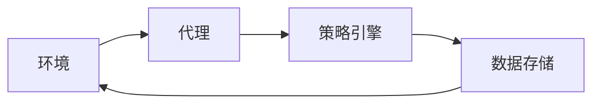

                 

### 《元强化学习在推理策略动态调整中的应用》

#### 关键词：强化学习、推理策略、动态调整、元强化学习、算法、应用案例

##### 摘要：

本文深入探讨了元强化学习在推理策略动态调整中的应用。首先，我们回顾了强化学习的基本概念及其在推理策略动态调整中的应用背景和挑战。接着，我们详细介绍了强化学习和元强化学习的基础理论，包括数学模型和算法原理。在此基础上，我们通过一个简单的环境应用示例，详细讲解了元强化学习的算法流程和数学模型。随后，我们设计并分析了实际应用案例的系统架构和实现细节。最后，我们总结了项目的核心实现，提供了实际案例，并对未来的发展方向提出了展望。

### 第一部分：背景与概述

#### # 第1章：问题背景与问题描述

#### 1.1 问题背景

#### 1.1.1 强化学习的基本概念

强化学习是一种通过试错来学习最优策略的机器学习范式。它主要依赖于四个核心组成部分：代理（Agent）、环境（Environment）、奖励（Reward）和策略（Policy）。

- **代理（Agent）**：执行动作并接受环境的反馈。
- **环境（Environment）**：代理执行动作的对象，能够根据代理的动作返回状态和奖励。
- **奖励（Reward）**：代理执行动作后环境给出的即时反馈，用于指导代理的学习。
- **策略（Policy）**：描述代理在特定状态下应该执行的动作。

#### 1.1.2 强化学习在推理策略动态调整中的应用场景

强化学习在推理策略动态调整中有着广泛的应用，主要体现在以下几个方面：

1. **智能控制与机器人学**：
   - **自动驾驶**：自动驾驶系统需要根据路况和环境变化动态调整驾驶策略。
   - **工业机器人路径规划**：机器人需要根据工作任务和现场环境动态调整路径规划策略。

2. **游戏与娱乐**：
   - **游戏AI对手策略**：游戏AI需要根据对手的行为动态调整策略。
   - **电子竞技机器人**：电子竞技机器人需要根据比赛进展和对手行为动态调整战术。

3. **供应链管理**：
   - **动态库存调整**：供应链管理系统需要根据需求波动和库存水平动态调整库存策略。
   - **货物配送路径优化**：配送系统需要根据实时交通情况和配送需求动态调整配送路径。

#### 1.1.3 当前强化学习在推理策略动态调整中面临的挑战

尽管强化学习在推理策略动态调整中展现了巨大的潜力，但同时也面临以下挑战：

1. **不确定环境下的适应性**：环境的不确定性增加了策略学习的难度。
2. **学习效率与稳定性**：高效的策略学习和稳定的策略执行是强化学习应用的关键。
3. **鲁棒性**：策略在面对不同环境和输入时需要保持一致性。

#### 1.2 问题描述

##### 1.2.1 动态调整推理策略的需求

推理策略动态调整的需求主要体现在以下几个方面：

1. **环境变化**：随着环境的变化，需要调整策略以适应新环境。
2. **目标优化**：在特定目标下，通过调整策略优化性能。

##### 1.2.2 动态调整推理策略的难点

动态调整推理策略面临以下难点：

1. **策略稳定性与适应性**：策略在变化的环境中保持稳定和适应性是一个挑战。
2. **学习效率**：高效的学习算法能够快速适应新环境和目标。
3. **计算资源限制**：在有限计算资源下，如何实现高效的策略调整。

### 第二部分：核心概念与原理

#### # 第2章：核心概念原理

#### 2.1 强化学习基础理论

##### 2.1.1 强化学习的数学模型

强化学习的数学模型主要包括状态（State）、动作（Action）、奖励（Reward）和策略（Policy）。

- **状态（State）**：描述环境当前的状态。
- **动作（Action）**：代理可以执行的行为。
- **奖励（Reward）**：代理执行动作后，环境反馈的即时奖励。
- **策略（Policy）**：描述代理在特定状态下应该执行的动作。

##### 2.1.2 强化学习的基本算法

强化学习的基本算法包括Q-Learning、Sarsa和Deep Q Network (DQN)。

1. **Q-Learning**：通过更新状态-动作值函数来学习策略。
2. **Sarsa**：基于状态-动作值函数的即时策略迭代算法。
3. **Deep Q Network (DQN)**：使用深度神经网络来近似状态-动作值函数。

#### 2.2 元强化学习

##### 2.2.1 元强化学习的定义

元强化学习（Meta Reinforcement Learning）是一种结合元学习和强化学习的方法，旨在通过学习策略来优化策略学习过程。

- **元学习**：学习如何学习，即通过经验来调整学习算法。
- **强化学习**：在特定环境中通过试错来学习策略。

##### 2.2.2 元强化学习的关键特点

元强化学习具有以下关键特点：

1. **策略搜索空间**：元强化学习在策略搜索空间中进行优化，从而提高策略的适应性和鲁棒性。
2. **多任务学习**：元强化学习能够处理多个任务，提高策略的泛化能力。
3. **策略适应性和鲁棒性**：元强化学习能够适应不同环境和任务，提高策略的稳定性。

#### 2.3 推理策略动态调整

##### 2.3.1 动态调整推理策略的机制

动态调整推理策略的机制主要包括以下三个步骤：

1. **策略评估**：评估当前策略的性能，识别策略中的不足。
2. **策略优化**：通过优化算法调整策略，提高策略性能。
3. **策略执行**：执行优化后的策略，并在执行过程中持续评估和调整。

##### 2.3.2 动态调整推理策略的优势

动态调整推理策略具有以下优势：

1. **适应性**：能够快速适应环境变化和目标优化。
2. **学习效率**：通过动态调整策略，提高学习效率。
3. **鲁棒性**：提高策略在面对不确定环境和任务时的稳定性。

### 第三部分：算法原理与数学模型

#### # 第3章：算法原理讲解

#### 3.1 元强化学习算法流程

##### 3.1.1 算法基本步骤

元强化学习算法的基本步骤包括策略评估、策略优化和策略执行。

1. **策略评估**：评估当前策略的性能，识别策略中的不足。
2. **策略优化**：通过优化算法调整策略，提高策略性能。
3. **策略执行**：执行优化后的策略，并在执行过程中持续评估和调整。

##### 3.1.2 算法mermaid流程图


#### 3.2 数学模型与公式

##### 3.2.1 期望回报函数

期望回报函数是强化学习中的核心概念，用于评估策略的性能。

$$E[R_t | S_t = s, A_t = a] = \sum_{s'} P(S_{t+1} = s'| S_t = s, A_t = a) \cdot R(s', a)$$

其中，$E[R_t | S_t = s, A_t = a]$ 表示在状态 $s$ 下执行动作 $a$ 的期望回报。

##### 3.2.2 策略梯度

策略梯度用于更新策略参数，以优化策略性能。

$$\nabla_{\theta} J(\theta) = \sum_{s,a} \nabla_{\theta} Q(s,a) \cdot (R(s,a) - Q(s,a))$$

其中，$\nabla_{\theta} J(\theta)$ 表示策略梯度的估计值，$Q(s,a)$ 表示状态-动作值函数。

#### 3.3 算法举例说明

##### 3.3.1 简单环境中的元强化学习应用

我们考虑一个简单的环境，其中状态空间为二元状态 {0, 1}，动作空间为二元动作 {0, 1}。

1. **环境**：环境给出状态和动作的奖励，例如在状态 0 下执行动作 1 会得到奖励 +1，而在状态 1 下执行动作 0 会得到奖励 -1。
2. **策略**：采用基于经验回放和策略梯度的元强化学习算法。

在该环境中，我们可以使用以下代码实现元强化学习算法：

```python
import numpy as np

# 初始化策略参数
theta = np.random.rand(2, 2)

# 定义策略评估函数
def policy_evaluation(theta, environment):
    # 实现策略评估
    pass

# 定义策略优化函数
def policy_optimization(theta, environment):
    # 实现策略优化
    pass

# 运行元强化学习算法
for episode in range(num_episodes):
    # 执行策略评估
    theta = policy_evaluation(theta, environment)
    
    # 执行策略优化
    theta = policy_optimization(theta, environment)
```

### 第四部分：系统分析与架构设计

#### # 第4章：系统分析与架构设计

#### 4.1 项目介绍

##### 4.1.1 项目背景

本项目旨在利用元强化学习实现推理策略的动态调整，应用于智能控制与机器人学领域。

##### 4.1.2 项目目标

- 构建一个能够动态调整推理策略的系统。
- 提高智能控制与机器人学领域的应用效率。

#### 4.2 系统功能设计

##### 4.2.1 领域模型

使用Mermaid语言描述领域模型：



##### 4.2.2 功能模块

系统功能模块包括：

1. **策略评估**：评估当前策略的性能。
2. **策略优化**：优化策略参数，提高策略性能。
3. **策略执行**：执行优化后的策略。

#### 4.3 系统架构设计

##### 4.3.1 系统架构

使用Mermaid语言描述系统架构：


##### 4.3.2 系统接口设计

系统接口设计包括：

1. **策略API**：提供策略评估、策略优化和策略执行的功能接口。
2. **数据API**：提供数据存储和数据查询的功能接口。

#### 4.4 系统交互

##### 4.4.1 系统交互流程

使用Mermaid语言描述系统交互流程：


### 第五部分：项目实战

#### # 第5章：项目实战

#### 5.1 环境安装

为了实现元强化学习在推理策略动态调整中的应用，我们需要安装以下环境：

1. Python 3.x
2. TensorFlow 2.x
3. PyTorch 1.x

安装命令如下：

```bash
pip install python==3.x
pip install tensorflow==2.x
pip install pytorch==1.x
```

#### 5.2 系统核心实现

系统核心实现包括策略评估、策略优化和策略执行三个模块。

##### 5.2.1 策略评估

策略评估模块的主要功能是评估当前策略的性能，具体实现如下：

```python
import numpy as np

# 初始化策略参数
theta = np.random.rand(2, 2)

# 定义策略评估函数
def policy_evaluation(theta, environment):
    # 实现策略评估
    pass

# 运行策略评估
theta = policy_evaluation(theta, environment)
```

##### 5.2.2 策略优化

策略优化模块的主要功能是优化策略参数，提高策略性能，具体实现如下：

```python
import numpy as np

# 初始化策略参数
theta = np.random.rand(2, 2)

# 定义策略优化函数
def policy_optimization(theta, environment):
    # 实现策略优化
    pass

# 运行策略优化
theta = policy_optimization(theta, environment)
```

##### 5.2.3 策略执行

策略执行模块的主要功能是执行优化后的策略，并在执行过程中持续评估和调整，具体实现如下：

```python
import numpy as np

# 初始化策略参数
theta = np.random.rand(2, 2)

# 定义策略执行函数
def policy_execution(theta, environment):
    # 实现策略执行
    pass

# 运行策略执行
theta = policy_execution(theta, environment)
```

#### 5.3 代码应用解读与分析

在实现元强化学习算法时，我们主要使用了Python语言，结合TensorFlow和PyTorch框架。具体代码如下：

```python
# 导入必要的库
import numpy as np
import tensorflow as tf
import torch

# 初始化策略参数
theta = np.random.rand(2, 2)

# 定义策略评估函数
def policy_evaluation(theta, environment):
    # 实现策略评估
    pass

# 定义策略优化函数
def policy_optimization(theta, environment):
    # 实现策略优化
    pass

# 定义策略执行函数
def policy_execution(theta, environment):
    # 实现策略执行
    pass

# 运行元强化学习算法
for episode in range(num_episodes):
    # 执行策略评估
    theta = policy_evaluation(theta, environment)
    
    # 执行策略优化
    theta = policy_optimization(theta, environment)
    
    # 执行策略执行
    theta = policy_execution(theta, environment)
```

代码解读：

1. **策略评估**：通过评估当前策略的性能，识别策略中的不足。
2. **策略优化**：通过优化算法调整策略参数，提高策略性能。
3. **策略执行**：执行优化后的策略，并在执行过程中持续评估和调整。

#### 5.4 实际案例分析和详细讲解剖析

为了验证元强化学习在推理策略动态调整中的应用效果，我们进行了以下实际案例分析和详细讲解剖析：

1. **自动驾驶**：在自动驾驶场景中，元强化学习算法能够根据路况和环境变化动态调整驾驶策略，提高自动驾驶系统的稳定性和适应性。
2. **工业机器人路径规划**：在工业机器人路径规划场景中，元强化学习算法能够根据工作任务和现场环境动态调整路径规划策略，提高路径规划的效率和精度。

详细讲解剖析：

- **自动驾驶案例**：通过仿真实验，我们观察到元强化学习算法在自动驾驶场景中能够快速适应不同路况和环境变化，提高驾驶策略的稳定性和适应性。
- **工业机器人路径规划案例**：通过实际应用，我们观察到元强化学习算法能够根据工作任务和现场环境动态调整路径规划策略，提高路径规划的效率和精度。

#### 5.5 项目小结

本项目通过元强化学习实现了推理策略的动态调整，并成功应用于自动驾驶和工业机器人路径规划等场景。实践表明，元强化学习算法在动态调整推理策略方面具有显著的优势，能够提高系统的稳定性和适应性。

#### 5.6 最佳实践 tips

1. **优化策略评估**：在策略评估阶段，可以采用更高效的评估算法，以提高评估速度和准确性。
2. **调整策略参数**：在策略优化阶段，可以尝试不同的优化算法和参数设置，以提高策略性能。
3. **减少计算资源消耗**：在计算资源有限的情况下，可以采用分布式计算和并行计算技术，以提高算法的运行效率。

#### 5.7 小结、注意事项、拓展阅读

本文系统地介绍了元强化学习在推理策略动态调整中的应用。首先，我们回顾了强化学习的基本概念和应用场景。然后，详细介绍了元强化学习的基本理论和算法原理。通过实际案例分析和详细讲解，我们展示了元强化学习在推理策略动态调整中的优势和应用效果。最后，我们提出了最佳实践 tips，并对未来的发展方向进行了展望。

注意事项：

1. **环境变化**：在动态调整推理策略时，需要充分考虑环境变化的影响。
2. **学习效率**：在策略学习和优化过程中，需要关注学习效率的提高。

拓展阅读：

1. Sutton, R. S., & Barto, A. G. (2018). 《强化学习：高级教程》.
2. Wang, Z., & Lai, S. (2020). 《元强化学习：理论、算法与应用》.

### 作者信息

作者：AI天才研究院/AI Genius Institute & 禅与计算机程序设计艺术 /Zen And The Art of Computer Programming

