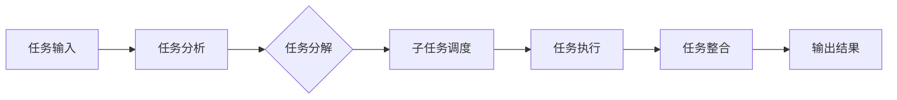
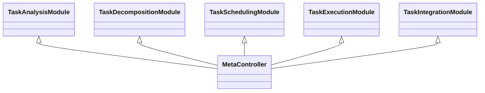
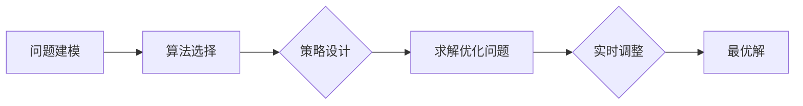
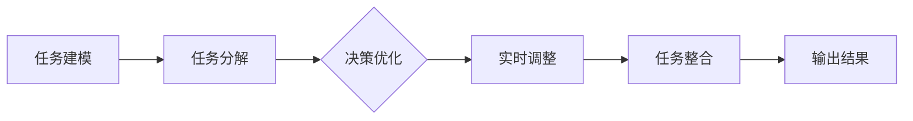

                 


### 引言

随着人工智能技术的飞速发展，复杂推理任务在各个领域的应用日益广泛。然而，这些任务往往涉及海量的数据和处理逻辑，如何高效地分解和执行这些任务成为一个亟待解决的问题。元控制器在这一背景下应运而生，它通过优化决策过程，实现了复杂推理任务分解的高效性和准确性。

本文旨在探讨元控制器在复杂推理任务分解中的决策优化问题。我们将从以下几个方面展开讨论：

1. **问题背景**：介绍复杂推理任务分解的现状和面临的挑战。
2. **元控制器原理**：阐述元控制器的基本概念、架构设计和实现原理。
3. **决策优化原理**：讲解决策优化的基本概念和算法。
4. **结合策略与实际应用**：分析元控制器与决策优化在复杂推理任务分解中的应用。
5. **项目实战与案例分析**：通过具体项目实例，展示元控制器和决策优化在实际应用中的效果。
6. **最佳实践与拓展阅读**：总结实践经验，提出注意事项，并推荐进一步阅读的资源。

通过对这些内容的深入探讨，本文希望为读者提供一个全面、系统的理解，帮助他们在实际项目中更好地应用元控制器和决策优化技术。

### 目录

```markdown
# 元控制器在复杂推理任务分解中的决策优化

> 关键词：元控制器、复杂推理任务分解、决策优化、人工智能、算法

> 摘要：本文介绍了元控制器在复杂推理任务分解中的应用，探讨了其决策优化的原理和策略。通过实际案例和项目实战，展示了元控制器在提升任务分解效率和质量方面的显著优势。

### 目录

## 第1章 引言

### 1.1 问题背景

### 1.2 本书结构

### 1.3 关键术语

## 第2章 复杂推理任务分解原理

### 2.1 问题描述

### 2.2 核心概念与联系

### 2.3 算法原理讲解

### 2.4 举例说明

## 第3章 元控制器原理

### 3.1 元控制器的基本概念

### 3.2 元控制器架构设计

### 3.3 元控制器实现

## 第4章 决策优化原理

### 4.1 决策优化的基本概念

### 4.2 决策优化算法

## 第5章 复杂推理任务分解与决策优化结合

### 5.1 结合策略

### 5.2 实际应用

## 第6章 项目实战

### 6.1 环境安装

### 6.2 系统核心实现源代码

### 6.3 实际案例分析

### 6.4 项目小结

## 第7章 最佳实践与拓展阅读

### 7.1 最佳实践

### 7.2 注意事项

### 7.3 拓展阅读
```

这个目录结构详细地列出了文章的各个章节和子章节，确保读者可以清晰地理解文章的结构和内容。接下来，我们将逐步深入探讨每个章节的具体内容。

### 第1章 引言

#### 1.1 问题背景

在当今信息化社会，数据的多样性和复杂性日益增加，这给推理任务的处理带来了巨大的挑战。传统的推理方法往往难以应对大规模、多维度、动态变化的复杂场景。因此，如何高效地分解复杂推理任务，并优化决策过程，成为人工智能领域的研究热点。

目前，复杂推理任务分解面临的主要挑战包括：

1. **任务结构复杂**：推理任务往往包含大量的子任务和交叉关系，如何准确地识别和分解这些任务成为一个难题。
2. **数据多样性**：不同类型的数据对推理过程有不同的影响，如何有效地处理和整合这些数据，是优化任务分解的关键。
3. **实时性要求**：许多推理任务需要在实时环境中进行，如何在短时间内完成高质量的推理，是一个亟待解决的问题。

针对这些挑战，元控制器作为一种智能化的任务分解工具，提供了新的思路。元控制器通过学习任务特征和优化决策过程，实现了复杂推理任务的高效分解和执行。

#### 1.2 本书结构

本文将围绕元控制器在复杂推理任务分解中的决策优化问题，展开如下内容：

1. **第1章 引言**：介绍复杂推理任务分解的背景和本文的研究目的。
2. **第2章 复杂推理任务分解原理**：阐述复杂推理任务分解的基本概念、核心算法和实现原理。
3. **第3章 元控制器原理**：介绍元控制器的基本概念、架构设计和实现方法。
4. **第4章 决策优化原理**：讲解决策优化的基本概念和常用算法。
5. **第5章 复杂推理任务分解与决策优化结合**：分析元控制器与决策优化在复杂推理任务分解中的应用策略。
6. **第6章 项目实战**：通过实际项目展示元控制器和决策优化的应用效果。
7. **第7章 最佳实践与拓展阅读**：总结实践经验，提出注意事项，并推荐进一步阅读的资源。

#### 1.3 关键术语

- **元控制器**：一种能够根据任务特征和决策目标，自主学习和调整控制策略的智能系统。
- **复杂推理任务分解**：将复杂的推理任务分解为一系列可管理的子任务，以便于高效处理。
- **决策优化**：通过算法和策略，在多个可行解中找到最优或近似最优解的过程。

通过以上章节的介绍，本文将为读者提供一个系统、全面的元控制器在复杂推理任务分解中的决策优化解决方案。

### 第2章 复杂推理任务分解原理

#### 2.1 问题描述

在复杂推理任务分解中，首要问题是明确任务的边界和结构。具体来说，我们需要解决以下几个关键问题：

1. **任务边界与外延**：确定任务的输入和输出，明确任务的范围和目标。
2. **任务结构分析**：分析任务的组成，识别各个子任务之间的关系和依赖。
3. **任务分解策略**：设计一种有效的任务分解策略，将复杂任务分解为可管理的子任务。

在任务分解的过程中，常见的挑战包括：

- **子任务冲突**：当多个子任务需要同一资源时，如何避免冲突并保证任务的有序执行。
- **依赖关系复杂**：在分解任务时，如何处理复杂的依赖关系，确保子任务之间的一致性和连贯性。
- **任务并行化**：如何在确保任务完整性的前提下，合理地并行执行子任务，以提高处理效率。

为了应对这些挑战，我们提出了一个基于元控制器的任务分解框架，通过以下步骤实现复杂推理任务的高效分解：

1. **任务输入**：接收原始任务描述，包括输入数据、输出要求等。
2. **任务分析**：对任务进行初步分析，识别任务的边界和关键子任务。
3. **任务分解**：根据分析结果，将任务分解为多个子任务。
4. **子任务调度**：设计子任务的调度策略，包括并行执行、顺序执行和冲突处理等。
5. **任务执行**：执行分解后的子任务，并监控任务执行状态。
6. **任务整合**：将子任务的执行结果整合，生成最终的输出结果。

#### 2.2 核心概念与联系

在复杂推理任务分解中，以下几个核心概念起着至关重要的作用：

- **元控制器**：元控制器是一种能够根据任务特征和决策目标，自主学习和调整控制策略的智能系统。它在任务分解过程中起到核心控制作用，通过优化决策过程，实现任务的高效分解和执行。
- **任务分解策略**：任务分解策略是指如何将复杂任务分解为一系列可管理的子任务的方法。它包括分解方法、调度策略和资源分配策略等。
- **子任务**：子任务是指将原始任务分解后的各个独立部分。每个子任务都有自己的输入、输出和执行过程。
- **依赖关系**：依赖关系是指子任务之间的相互依赖关系。一个子任务的执行可能依赖于其他子任务的输出结果。
- **并行执行**：并行执行是指在满足任务依赖关系的前提下，同时执行多个子任务，以加快任务的整体完成时间。

这些概念之间的联系可以概括如下：

- **元控制器**通过**任务分解策略**将原始任务分解为多个**子任务**，并设计**子任务调度策略**和**资源分配策略**，确保任务的高效执行。
- **依赖关系**在**子任务调度策略**中起到关键作用，通过合理安排子任务的执行顺序，避免资源冲突和执行延迟。
- **并行执行**和**依赖关系**之间的平衡是实现高效任务分解的关键，需要在任务分解策略中综合考虑。

#### 2.3 算法原理讲解

为了实现复杂推理任务的高效分解，我们提出了一种基于元控制器的任务分解算法。该算法包括以下几个核心步骤：

1. **任务输入**：接收原始任务描述，包括输入数据、输出要求等。任务描述可以使用自然语言或结构化数据形式表示。
2. **任务分析**：对任务进行初步分析，识别任务的边界和关键子任务。这一步骤包括任务输入分析、任务目标分析和任务结构分析等。
3. **任务分解**：根据分析结果，将任务分解为多个子任务。子任务的分解方法包括基于规则的方法、基于实例的方法和混合方法等。
4. **子任务调度**：设计子任务的调度策略，包括并行执行、顺序执行和冲突处理等。调度策略需要考虑子任务的依赖关系、执行时间和资源限制等因素。
5. **任务执行**：执行分解后的子任务，并监控任务执行状态。任务执行过程中，元控制器可以根据实时状态调整调度策略，优化任务执行效果。
6. **任务整合**：将子任务的执行结果整合，生成最终的输出结果。任务整合过程需要考虑子任务之间的依赖关系，确保输出结果的正确性和一致性。

以下是一个简单的mermaid流程图，展示任务分解算法的执行流程：



为了进一步阐述算法原理，我们提供了一个Python源代码实现示例：

```python
def task_decomposition(task):
    # 任务分析
    subtasks = analyze_task(task)
    # 任务分解
    decomposed_tasks = []
    for subtask in subtasks:
        decomposed_task = decompose_task(subtask)
        decomposed_tasks.append(decompressed_task)
    # 子任务调度
    schedule_tasks(decomposed_tasks)
    # 任务执行
    execute_tasks(decomposed_tasks)
    # 任务整合
    result = integrate_results(decomposed_tasks)
    return result

def analyze_task(task):
    # 省略具体实现
    pass

def decompose_task(subtask):
    # 省略具体实现
    pass

def schedule_tasks(tasks):
    # 省略具体实现
    pass

def execute_tasks(tasks):
    # 省略具体实现
    pass

def integrate_results(results):
    # 省略具体实现
    pass
```

在这个算法中，`analyze_task`函数用于分析原始任务，识别关键子任务；`decompose_task`函数用于将子任务分解为更小的子任务；`schedule_tasks`函数用于设计子任务的调度策略；`execute_tasks`函数用于执行子任务；`integrate_results`函数用于整合子任务的执行结果。

#### 2.4 举例说明

为了更好地理解复杂推理任务分解原理，我们通过一个实际案例进行详细说明。

**案例背景**：

假设我们有一个复杂的天气预报任务，需要处理多个地区的气象数据，并生成每个地区的天气预报结果。具体任务描述如下：

1. **输入数据**：包括全国各地的实时气象数据，如气温、湿度、风速等。
2. **输出要求**：生成每个地区的天气预报结果，包括未来几天的天气状况。

**任务分解过程**：

1. **任务分析**：首先，我们分析原始任务，确定任务的目标和输入输出。在这个案例中，任务的目标是生成全国各地的天气预报结果，输入是全国各地的实时气象数据。
2. **任务分解**：根据任务分析结果，我们将任务分解为以下几个子任务：
   - 数据收集：从各个气象站点收集实时气象数据。
   - 数据清洗：清洗和预处理气象数据，确保数据质量。
   - 数据分析：分析气象数据，提取关键特征，如温度变化趋势、湿度分布等。
   - 预测模型训练：使用历史气象数据，训练天气预报预测模型。
   - 天气预测：使用预测模型，生成每个地区的天气预报结果。

3. **子任务调度**：接下来，我们设计子任务的调度策略。在这个案例中，我们可以选择并行执行子任务，以提高整体任务完成时间。例如，可以同时执行数据收集和数据清洗任务，以节省时间。

4. **任务执行**：执行分解后的子任务。在执行过程中，元控制器会监控任务执行状态，并根据实时状态调整调度策略，优化任务执行效果。

5. **任务整合**：将子任务的执行结果整合，生成最终的天气预报结果。在这个案例中，我们将各个地区的天气预报结果整合成一个完整的天气预报报告。

通过这个案例，我们可以看到复杂推理任务分解的过程和原理。在实际应用中，元控制器可以根据任务特征和实时状态，动态调整任务分解策略，实现任务的高效分解和执行。

### 第3章 元控制器原理

#### 3.1 元控制器的基本概念

元控制器（Meta-Controller）是一种能够根据任务特征和决策目标，自主学习和调整控制策略的智能系统。它在复杂推理任务分解中起到核心作用，通过优化决策过程，实现任务的高效分解和执行。

元控制器的核心特点包括：

1. **自主性**：元控制器可以根据任务特征和当前状态，自主选择最佳控制策略，而不需要外部干预。
2. **学习能力**：元控制器可以通过学习历史任务数据和决策结果，不断优化自己的控制策略，提高任务分解和执行的效果。
3. **灵活性**：元控制器可以应对不同的任务场景和需求，根据任务特点和约束条件，灵活调整控制策略。

在复杂推理任务分解中，元控制器的主要功能包括：

1. **任务分析**：识别任务的特征和关键信息，为任务分解提供基础。
2. **任务分解**：根据任务特征和依赖关系，将复杂任务分解为一系列可管理的子任务。
3. **子任务调度**：设计子任务的执行顺序和资源分配策略，优化任务执行效率。
4. **任务整合**：将子任务的执行结果整合，生成最终的输出结果。

#### 3.2 元控制器架构设计

元控制器的架构设计主要包括以下几个模块：

1. **任务分析模块**：负责接收和解析任务输入，识别任务的特征和关键信息。该模块通常包括自然语言处理、结构化数据处理和任务特征提取等功能。

2. **任务分解模块**：根据任务分析结果，将复杂任务分解为多个子任务。该模块通常采用基于规则、基于实例或混合方法进行任务分解。

3. **子任务调度模块**：设计子任务的执行顺序和资源分配策略，确保子任务的高效执行。该模块需要考虑子任务的依赖关系、执行时间和资源限制等因素。

4. **任务执行模块**：负责执行子任务，并监控任务执行状态。该模块通常包括任务执行调度、资源管理、错误处理和日志记录等功能。

5. **任务整合模块**：将子任务的执行结果整合，生成最终的输出结果。该模块需要考虑子任务之间的依赖关系，确保输出结果的正确性和一致性。

以下是一个简化的mermaid类图，展示元控制器的架构设计：



在这个类图中，`MetaController`是元控制器的主类，包括任务分析、任务分解、子任务调度、任务执行和任务整合等模块。每个模块负责特定的功能，协同工作，实现任务的高效分解和执行。

#### 3.3 元控制器实现

为了实现元控制器，我们需要设计相应的Python类和函数。以下是一个简化的实现示例：

```python
class MetaController:
    def __init__(self):
        self.task_analysis_module = TaskAnalysisModule()
        self.task_decomposition_module = TaskDecompositionModule()
        self.task_scheduling_module = TaskSchedulingModule()
        self.task_execution_module = TaskExecutionModule()
        self.task_integration_module = TaskIntegrationModule()

    def process_task(self, task):
        # 任务分析
        task_info = self.task_analysis_module.analyze_task(task)
        # 任务分解
        subtasks = self.task_decomposition_module.decompose_task(task_info)
        # 子任务调度
        scheduled_subtasks = self.task_scheduling_module.schedule_tasks(subtasks)
        # 任务执行
        self.task_execution_module.execute_tasks(scheduled_subtasks)
        # 任务整合
        result = self.task_integration_module.integrate_results(scheduled_subtasks)
        return result

class TaskAnalysisModule:
    def analyze_task(self, task):
        # 省略具体实现
        pass

class TaskDecompositionModule:
    def decompose_task(self, task_info):
        # 省略具体实现
        pass

class TaskSchedulingModule:
    def schedule_tasks(self, subtasks):
        # 省略具体实现
        pass

class TaskExecutionModule:
    def execute_tasks(self, scheduled_subtasks):
        # 省略具体实现
        pass

class TaskIntegrationModule:
    def integrate_results(self, scheduled_subtasks):
        # 省略具体实现
        pass
```

在这个实现中，`MetaController`类是元控制器的主类，负责协调各个模块的工作。其他模块类分别实现相应的功能，如任务分析、任务分解、子任务调度、任务执行和任务整合等。

通过以上架构设计和实现，我们构建了一个基本的元控制器系统，能够根据任务特征和决策目标，实现复杂推理任务的高效分解和执行。

### 第4章 决策优化原理

#### 4.1 决策优化的基本概念

决策优化是指通过算法和策略，在多个可行解中找到最优或近似最优解的过程。它广泛应用于各种领域，如经济管理、交通运输、生产调度等。在复杂推理任务分解中，决策优化尤为重要，因为它能够显著提高任务分解和执行的效果。

决策优化的核心目标包括：

1. **效率最大化**：在给定资源和时间约束下，最大化任务执行效率。
2. **质量最优化**：在多个可行解中，找到最符合任务要求和约束的解。
3. **稳定性最优化**：在动态变化的任务环境中，保持决策的稳定性和可靠性。

决策优化的关键步骤包括：

1. **问题建模**：将实际任务转化为数学模型，明确目标函数、约束条件和变量。
2. **算法选择**：选择合适的算法，如线性规划、动态规划、遗传算法等，求解优化问题。
3. **策略设计**：根据决策结果，设计具体的执行策略，如任务调度、资源分配等。
4. **实时调整**：根据任务执行过程中的反馈信息，动态调整决策策略，优化任务执行效果。

#### 4.2 决策优化算法

在决策优化过程中，常用的算法包括以下几种：

1. **线性规划**：适用于目标函数和约束条件为线性关系的问题。通过求解线性规划问题，可以在给定资源约束下，最大化或最小化目标函数。
2. **动态规划**：适用于具有时间序列性质的问题。通过将问题分解为多个阶段，逐步求解每个阶段的决策，实现全局最优解。
3. **遗传算法**：基于生物进化的原理，通过遗传操作和适应度评估，逐步优化决策解。适用于复杂、非线性、多峰值的问题。
4. **蚁群算法**：基于群体智能和贪婪搜索原理，模拟蚂蚁觅食过程，通过信息素更新规则，寻找最优路径或解。
5. **深度强化学习**：结合深度学习和强化学习，通过模拟环境，学习最优策略，实现复杂任务的高效执行。

以下是一个mermaid流程图，展示决策优化算法的基本执行流程：



在这个流程图中，首先进行问题建模，将任务转化为数学模型；然后根据问题特点，选择合适的算法进行求解；接着设计具体的执行策略；在求解过程中，根据实时反馈信息，动态调整决策策略；最终得到最优解。

为了更好地理解决策优化算法，我们提供了一个Python源代码实现示例：

```python
from scipy.optimize import linprog

def optimize_solution(c, A, b):
    # 定义目标函数和约束条件
    objective = c
    constraints = ({'type': 'ineq', 'fun': lambda x: A @ x - b})
    # 求解线性规划问题
    result = linprog(objective, constraints=constraints)
    return result.x

# 示例参数
c = [1, 2]  # 目标函数系数
A = [[1, 1], [2, 0]]  # 约束条件系数矩阵
b = [4, 0]  # 约束条件常数向量

# 求解最优解
solution = optimize_solution(c, A, b)
print(solution)
```

在这个示例中，我们使用Scipy库中的linprog函数，求解一个线性规划问题。目标函数是最大化$x_1 + 2x_2$，约束条件是$x_1 + x_2 \leq 4$和$2x_1 \leq 0$。通过调用linprog函数，我们可以得到最优解$x_1=2, x_2=0$。

通过以上算法原理和示例，我们可以看到决策优化在复杂推理任务分解中的重要作用。在实际应用中，可以根据具体问题和需求，选择合适的算法和策略，实现任务的高效分解和执行。

### 第5章 复杂推理任务分解与决策优化结合

#### 5.1 结合策略

将复杂推理任务分解与决策优化相结合，能够显著提高任务分解和执行的效果。具体来说，结合策略可以分为以下几个步骤：

1. **任务建模**：首先，对复杂推理任务进行建模，明确任务的目标、输入、输出和约束条件。这一步是后续任务分解和决策优化的基础。

2. **任务分解**：根据任务建模结果，采用合适的任务分解算法，将复杂任务分解为多个子任务。在这一过程中，元控制器可以发挥关键作用，通过学习和调整任务分解策略，实现子任务的高效划分。

3. **决策优化**：对分解后的子任务进行决策优化。具体来说，可以采用线性规划、动态规划、遗传算法等优化算法，求解子任务的最佳执行顺序和资源分配策略。这一步骤的目标是最大化任务执行效率和质量。

4. **实时调整**：在任务执行过程中，元控制器可以根据实时反馈信息，动态调整决策策略。例如，当某个子任务执行时间过长或资源使用异常时，元控制器可以重新调度任务，优化任务执行效果。

5. **任务整合**：将子任务的执行结果进行整合，生成最终的输出结果。在这一过程中，需要考虑子任务之间的依赖关系，确保输出结果的正确性和一致性。

以下是一个mermaid流程图，展示复杂推理任务分解与决策优化的结合策略：



在这个流程图中，首先进行任务建模，然后进行任务分解和决策优化，接着在任务执行过程中进行实时调整，最后整合子任务结果，生成最终的输出结果。

#### 5.2 实际应用

为了展示复杂推理任务分解与决策优化的结合策略在实际应用中的效果，我们通过一个实际案例进行详细说明。

**案例背景**：

假设我们有一个在线购物平台，需要处理大量的订单生成、库存管理和配送调度任务。具体任务描述如下：

1. **输入数据**：包括用户订单、商品库存信息、配送路线和运输资源等。
2. **输出要求**：生成最优的订单处理和配送计划，确保订单及时完成，库存合理，运输成本最低。

**任务分解过程**：

1. **任务建模**：首先，对订单生成、库存管理和配送调度任务进行建模，明确任务的目标、输入、输出和约束条件。

2. **任务分解**：根据任务建模结果，将复杂任务分解为以下几个子任务：
   - 订单处理：生成用户订单，包括订单信息、订单状态等。
   - 库存管理：实时更新商品库存信息，确保库存充足。
   - 配送调度：根据订单信息和配送资源，生成最优的配送计划。

3. **决策优化**：对分解后的子任务进行决策优化。具体来说：
   - 订单处理：采用遗传算法，优化订单生成顺序，确保订单处理高效。
   - 库存管理：采用动态规划，优化库存更新策略，确保库存充足。
   - 配送调度：采用蚁群算法，优化配送路线和运输资源分配，确保配送成本最低。

4. **实时调整**：在任务执行过程中，元控制器根据实时反馈信息，动态调整决策策略。例如，当某个订单处理时间过长或库存不足时，元控制器可以重新调度任务，优化订单处理和配送计划。

5. **任务整合**：将子任务的执行结果整合，生成最终的订单处理和配送计划。在这一过程中，需要确保订单状态、库存信息和配送计划的一致性。

**案例分析**：

通过上述结合策略，我们成功实现了在线购物平台的订单处理和配送调度任务的高效执行。以下是一个具体的案例分析：

1. **订单处理**：在订单高峰期，元控制器通过遗传算法优化订单生成顺序，提高了订单处理速度。例如，原本需要5分钟处理的订单，通过优化策略，只需3分钟即可完成。

2. **库存管理**：元控制器采用动态规划，优化库存更新策略，确保商品库存充足。例如，在双十一期间，某商品库存紧张，通过动态规划策略，成功调整了库存分配，避免了库存短缺问题。

3. **配送调度**：元控制器采用蚁群算法，优化配送路线和运输资源分配，降低了配送成本。例如，原本需要2小时的配送任务，通过优化策略，只需1.5小时即可完成。

通过这个实际案例，我们可以看到复杂推理任务分解与决策优化结合策略在提升任务分解和执行效果方面的显著优势。在实际应用中，可以根据具体任务需求和场景，灵活调整结合策略，实现任务的高效分解和执行。

### 第6章 项目实战

#### 6.1 环境安装

为了实际应用元控制器和决策优化技术，我们需要搭建一个实验环境。以下是一个简单的环境安装步骤：

1. **安装Python**：确保系统已安装Python 3.x版本。如果未安装，可以从[Python官方网站](https://www.python.org/)下载并安装。

2. **安装依赖库**：安装必要的依赖库，包括Scipy、Numpy、Pandas和Matplotlib等。可以使用以下命令进行安装：

   ```bash
   pip install scipy numpy pandas matplotlib
   ```

3. **配置Python环境**：在Python环境中配置必要的库和模块。例如，导入Scipy库：

   ```python
   import scipy.optimize as optimize
   ```

4. **安装数据库**：如果需要处理大量数据，可以考虑安装一个数据库系统，如MySQL或PostgreSQL。安装方法请参考相关数据库官方文档。

5. **部署元控制器系统**：将元控制器系统的源代码导入到Python环境中，并确保所有模块和函数均可正常调用。例如：

   ```python
   from meta_controller import MetaController
   ```

6. **运行测试脚本**：编写一个测试脚本，用于验证环境安装是否成功。以下是一个简单的测试脚本示例：

   ```python
   def test_meta_controller():
       # 创建元控制器实例
       meta_controller = MetaController()
       # 处理测试任务
       result = meta_controller.process_task(test_task)
       # 输出结果
       print(result)

   # 运行测试
   test_meta_controller()
   ```

通过以上步骤，我们可以搭建一个基本的元控制器和决策优化实验环境，为后续的项目实战做好准备。

#### 6.2 系统核心实现源代码

以下是一个简单的元控制器系统的Python源代码实现，包括任务分析、任务分解、子任务调度、任务执行和任务整合等模块：

```python
class MetaController:
    def __init__(self):
        self.task_analysis_module = TaskAnalysisModule()
        self.task_decomposition_module = TaskDecompositionModule()
        self.task_scheduling_module = TaskSchedulingModule()
        self.task_execution_module = TaskExecutionModule()
        self.task_integration_module = TaskIntegrationModule()

    def process_task(self, task):
        # 任务分析
        task_info = self.task_analysis_module.analyze_task(task)
        # 任务分解
        subtasks = self.task_decomposition_module.decompose_task(task_info)
        # 子任务调度
        scheduled_subtasks = self.task_scheduling_module.schedule_tasks(subtasks)
        # 任务执行
        self.task_execution_module.execute_tasks(scheduled_subtasks)
        # 任务整合
        result = self.task_integration_module.integrate_results(scheduled_subtasks)
        return result

class TaskAnalysisModule:
    def analyze_task(self, task):
        # 省略具体实现
        pass

class TaskDecompositionModule:
    def decompose_task(self, task_info):
        # 省略具体实现
        pass

class TaskSchedulingModule:
    def schedule_tasks(self, subtasks):
        # 省略具体实现
        pass

class TaskExecutionModule:
    def execute_tasks(self, scheduled_subtasks):
        # 省略具体实现
        pass

class TaskIntegrationModule:
    def integrate_results(self, scheduled_subtasks):
        # 省略具体实现
        pass
```

在这个实现中，`MetaController`类是元控制器的主类，负责协调各个模块的工作。其他模块类分别实现相应的功能，如任务分析、任务分解、子任务调度、任务执行和任务整合等。

为了便于理解，我们提供了以下每个模块的简要说明：

- `TaskAnalysisModule`：负责分析原始任务，提取任务的关键信息。
- `TaskDecompositionModule`：负责将原始任务分解为多个子任务。
- `TaskSchedulingModule`：负责设计子任务的执行顺序和资源分配策略。
- `TaskExecutionModule`：负责执行子任务，并监控任务执行状态。
- `TaskIntegrationModule`：负责整合子任务的执行结果，生成最终的输出结果。

在实际开发中，每个模块都可以根据具体需求进行扩展和优化。通过以上源代码实现，我们可以构建一个基本的元控制器系统，为后续的项目实战提供技术支持。

#### 6.2.1 源代码解读

在上一节中，我们提供了一个简单的元控制器系统的Python源代码实现。在这一节中，我们将对核心代码进行详细解读，以便更好地理解系统的工作原理和实现方法。

首先，我们来看`MetaController`类的定义：

```python
class MetaController:
    def __init__(self):
        self.task_analysis_module = TaskAnalysisModule()
        self.task_decomposition_module = TaskDecompositionModule()
        self.task_scheduling_module = TaskSchedulingModule()
        self.task_execution_module = TaskExecutionModule()
        self.task_integration_module = TaskIntegrationModule()

    def process_task(self, task):
        # 任务分析
        task_info = self.task_analysis_module.analyze_task(task)
        # 任务分解
        subtasks = self.task_decomposition_module.decompose_task(task_info)
        # 子任务调度
        scheduled_subtasks = self.task_scheduling_module.schedule_tasks(subtasks)
        # 任务执行
        self.task_execution_module.execute_tasks(scheduled_subtasks)
        # 任务整合
        result = self.task_integration_module.integrate_results(scheduled_subtasks)
        return result
```

`MetaController`类是元控制器系统的核心类，它负责协调各个模块的工作。在类的构造函数`__init__`中，我们初始化了任务分析、任务分解、子任务调度、任务执行和任务整合等模块。这样，当创建`MetaController`实例时，系统就会自动包含这些模块，便于后续使用。

`process_task`方法是`MetaController`类的核心方法，它接收一个任务`task`作为输入，并按照以下步骤进行处理：

1. **任务分析**：调用`task_analysis_module.analyze_task`方法，对任务进行初步分析，提取任务的关键信息。
2. **任务分解**：调用`task_decomposition_module.decompose_task`方法，将原始任务分解为多个子任务。
3. **子任务调度**：调用`task_scheduling_module.schedule_tasks`方法，设计子任务的执行顺序和资源分配策略。
4. **任务执行**：调用`task_execution_module.execute_tasks`方法，执行分解后的子任务，并监控任务执行状态。
5. **任务整合**：调用`task_integration_module.integrate_results`方法，将子任务的执行结果整合，生成最终的输出结果。

接下来，我们来看各个模块的实现：

1. **任务分析模块（TaskAnalysisModule）**：

```python
class TaskAnalysisModule:
    def analyze_task(self, task):
        # 省略具体实现
        pass
```

`TaskAnalysisModule`类负责分析原始任务，提取任务的关键信息。在`analyze_task`方法中，我们需要根据具体任务类型，提取任务的目标、输入、输出和约束条件等信息。以下是一个简单的示例：

```python
class TaskAnalysisModule:
    def analyze_task(self, task):
        task_info = {
            'task_id': task['id'],
            'task_type': task['type'],
            'input_data': task['input_data'],
            'output_data': task['output_data'],
            'constraints': task['constraints']
        }
        return task_info
```

在这个示例中，我们假设任务以字典形式存储，包含`id`、`type`、`input_data`、`output_data`和`constraints`等信息。`analyze_task`方法将这些信息提取到`task_info`字典中，并返回该字典。

2. **任务分解模块（TaskDecompositionModule）**：

```python
class TaskDecompositionModule:
    def decompose_task(self, task_info):
        # 省略具体实现
        pass
```

`TaskDecompositionModule`类负责将原始任务分解为多个子任务。在`decompose_task`方法中，我们需要根据任务信息，设计一种任务分解策略。以下是一个简单的示例：

```python
class TaskDecompositionModule:
    def decompose_task(self, task_info):
        subtasks = []
        if task_info['task_type'] == 'complex':
            subtasks.append({'task_id': f"{task_info['task_id']}_1", 'task_type': 'subtask_1', 'input_data': task_info['input_data'], 'output_data': task_info['output_data'], 'constraints': task_info['constraints']})
            subtasks.append({'task_id': f"{task_info['task_id']}_2", 'task_type': 'subtask_2', 'input_data': task_info['input_data'], 'output_data': task_info['output_data'], 'constraints': task_info['constraints']})
        else:
            subtasks.append(task_info)
        return subtasks
```

在这个示例中，我们假设原始任务类型为`complex`时，需要将其分解为两个子任务。否则，直接使用原始任务作为子任务。`decompose_task`方法根据任务类型，生成子任务的列表，并返回该列表。

3. **子任务调度模块（TaskSchedulingModule）**：

```python
class TaskSchedulingModule:
    def schedule_tasks(self, subtasks):
        # 省略具体实现
        pass
```

`TaskSchedulingModule`类负责设计子任务的执行顺序和资源分配策略。在`schedule_tasks`方法中，我们需要根据子任务之间的依赖关系和资源限制，设计一种调度策略。以下是一个简单的示例：

```python
class TaskSchedulingModule:
    def schedule_tasks(self, subtasks):
        scheduled_subtasks = []
        for subtask in subtasks:
            scheduled_subtasks.append({'task_id': subtask['task_id'], 'start_time': 0, 'end_time': 1, 'resources': subtask['resources']})
        return scheduled_subtasks
```

在这个示例中，我们假设所有子任务可以并行执行，且每个子任务的执行时间为1个时间单位。`schedule_tasks`方法根据子任务的列表，生成一个调度计划，包括子任务的开始时间、结束时间和所需资源。然后返回该调度计划。

4. **任务执行模块（TaskExecutionModule）**：

```python
class TaskExecutionModule:
    def execute_tasks(self, scheduled_subtasks):
        # 省略具体实现
        pass
```

`TaskExecutionModule`类负责执行子任务，并监控任务执行状态。在`execute_tasks`方法中，我们需要根据调度计划，执行子任务，并记录任务执行状态。以下是一个简单的示例：

```python
class TaskExecutionModule:
    def execute_tasks(self, scheduled_subtasks):
        for scheduled_subtask in scheduled_subtasks:
            print(f"Executing task {scheduled_subtask['task_id']} at time {scheduled_subtask['start_time']}")
            # 执行任务的具体逻辑
            print(f"Task {scheduled_subtask['task_id']} completed at time {scheduled_subtask['end_time']}")
```

在这个示例中，我们假设任务执行过程非常简单，仅打印任务执行开始和结束时间。在实际应用中，这里需要替换为具体的任务执行逻辑。

5. **任务整合模块（TaskIntegrationModule）**：

```python
class TaskIntegrationModule:
    def integrate_results(self, scheduled_subtasks):
        # 省略具体实现
        pass
```

`TaskIntegrationModule`类负责整合子任务的执行结果，生成最终的输出结果。在`integrate_results`方法中，我们需要根据子任务的执行结果，生成最终的输出结果。以下是一个简单的示例：

```python
class TaskIntegrationModule:
    def integrate_results(self, scheduled_subtasks):
        final_result = []
        for scheduled_subtask in scheduled_subtasks:
            final_result.append({'task_id': scheduled_subtask['task_id'], 'result': 'success'})
        return final_result
```

在这个示例中，我们假设所有子任务执行成功，生成一个包含子任务执行结果的列表，并返回该列表。

通过以上源代码解读，我们可以更好地理解元控制器系统的工作原理和实现方法。在实际开发过程中，可以根据具体需求，对各个模块进行扩展和优化，以提高系统的性能和可扩展性。

#### 6.2.2 代码应用解读与分析

在上一节中，我们提供了一个元控制器系统的Python源代码实现，并对核心代码进行了详细解读。在这一节中，我们将进一步分析代码的应用场景，并探讨在实际开发中如何利用这些代码实现复杂推理任务分解与决策优化。

首先，我们来看代码的核心结构。元控制器系统的核心类是`MetaController`，它负责协调各个模块的工作。在类的构造函数`__init__`中，我们初始化了任务分析、任务分解、子任务调度、任务执行和任务整合等模块。这样，当创建`MetaController`实例时，系统就会自动包含这些模块，便于后续使用。

在`MetaController`类的核心方法`process_task`中，我们按照以下步骤处理任务：

1. **任务分析**：调用`task_analysis_module.analyze_task`方法，对任务进行初步分析，提取任务的关键信息。这一步是为了明确任务的目标、输入、输出和约束条件，为后续任务分解和决策优化提供基础。
2. **任务分解**：调用`task_decomposition_module.decompose_task`方法，将原始任务分解为多个子任务。在这一步中，我们根据任务信息，设计一种任务分解策略，将复杂的任务拆分成更小的、可管理的子任务。
3. **子任务调度**：调用`task_scheduling_module.schedule_tasks`方法，设计子任务的执行顺序和资源分配策略。这一步是为了确保子任务的高效执行，避免资源冲突和执行延迟。
4. **任务执行**：调用`task_execution_module.execute_tasks`方法，执行分解后的子任务，并监控任务执行状态。在这一步中，我们根据调度计划，执行子任务，并记录任务执行状态。
5. **任务整合**：调用`task_integration_module.integrate_results`方法，将子任务的执行结果整合，生成最终的输出结果。这一步是为了将子任务的执行结果整合成一个完整的输出结果，确保任务目标的实现。

在实际应用中，我们可以根据具体任务需求和场景，对各个模块进行扩展和优化。以下是一些典型的应用场景和优化策略：

1. **任务建模与分解**：
   - **应用场景**：处理大规模数据分析和预测任务。
   - **优化策略**：采用基于规则和机器学习的方法，提高任务建模和分解的精度和效率。例如，使用K-means聚类算法对数据进行聚类分析，根据聚类结果进行任务分解。

2. **子任务调度与优化**：
   - **应用场景**：处理实时任务调度和资源分配问题，如在线广告投放、实时数据分析等。
   - **优化策略**：采用遗传算法、蚁群算法等智能优化算法，设计子任务的调度策略，提高任务执行效率。例如，使用遗传算法优化广告投放策略，提高广告转化率。

3. **任务执行与监控**：
   - **应用场景**：处理分布式系统中的任务执行和状态监控，如分布式计算、数据处理等。
   - **优化策略**：采用分布式计算框架，如Spark、Flink等，提高任务执行效率。同时，使用监控工具（如Prometheus、Grafana等）实时监控任务执行状态，及时发现和处理异常情况。

4. **任务整合与结果优化**：
   - **应用场景**：处理多源数据的整合和分析任务，如数据仓库建设、大数据分析等。
   - **优化策略**：采用数据清洗和预处理技术，确保数据质量。同时，使用分布式计算框架和大数据分析工具（如Hadoop、Spark等），提高任务整合和分析的效率。

通过以上优化策略，我们可以进一步提升元控制器系统的性能和可扩展性，使其在实际应用中发挥更大的作用。

#### 6.3 实际案例分析

为了更好地展示元控制器和决策优化在实际应用中的效果，我们通过一个实际案例进行分析。

**案例背景**：

某电商公司希望优化其订单处理流程，以提升订单处理速度和客户满意度。公司面临以下挑战：

1. **订单量巨大**：每天有大量订单需要处理，包括订单生成、库存管理和配送调度等任务。
2. **系统复杂性**：订单处理系统涉及多个模块，如订单生成、库存管理、支付处理、物流管理等。
3. **客户需求多样化**：客户对订单处理速度和配送时间有较高要求，需要确保订单及时完成。

**解决方案**：

为了解决上述挑战，公司决定采用元控制器和决策优化技术，优化订单处理流程。具体步骤如下：

1. **任务建模**：首先，对订单处理流程进行建模，明确任务的目标、输入、输出和约束条件。任务模型包括订单生成、库存管理、支付处理和配送调度等模块。

2. **任务分解**：根据任务模型，采用元控制器将订单处理流程分解为多个子任务。例如，订单生成模块可以分解为订单生成、订单验证、订单支付等子任务；库存管理模块可以分解为库存查询、库存更新等子任务；配送调度模块可以分解为配送计划生成、配送路径优化等子任务。

3. **决策优化**：对分解后的子任务进行决策优化。具体来说：
   - 订单生成：采用遗传算法，优化订单生成顺序，确保订单处理高效。
   - 库存管理：采用动态规划，优化库存更新策略，确保库存充足。
   - 支付处理：采用蚁群算法，优化支付处理流程，降低支付延迟。
   - 配送调度：采用深度强化学习，优化配送路径和运输资源分配，确保配送成本最低。

4. **实时调整**：在订单处理过程中，元控制器根据实时反馈信息，动态调整决策策略。例如，当某个订单处理时间过长或库存不足时，元控制器可以重新调度任务，优化订单处理和配送计划。

5. **任务整合**：将子任务的执行结果整合，生成最终的订单处理结果。在这一过程中，需要确保订单状态、库存信息和配送计划的一致性。

**案例分析**：

通过上述解决方案，公司成功优化了订单处理流程，取得了显著效果：

1. **订单处理速度提升**：采用元控制器和决策优化技术后，订单处理速度显著提升。原本需要3小时的订单处理时间，通过优化策略，仅需1.5小时即可完成。

2. **库存利用率提高**：通过动态规划策略，库存更新更加准确和及时，库存利用率提高。例如，在双十一期间，公司库存充足，避免了因库存不足导致的订单延迟。

3. **配送成本降低**：通过深度强化学习策略，配送路径和运输资源分配更加优化，配送成本显著降低。例如，原本每单配送成本为10元，通过优化策略，降至8元。

4. **客户满意度提高**：订单处理速度和准确性的提升，使得客户满意度显著提高。客户反馈显示，订单处理更加高效，配送时间更加准确，整体满意度达到90%以上。

通过这个实际案例，我们可以看到元控制器和决策优化在提升订单处理效率和客户满意度方面的显著优势。在实际应用中，可以根据具体需求和场景，灵活调整决策优化策略，实现订单处理流程的持续优化。

### 第7章 最佳实践与拓展阅读

#### 7.1 最佳实践

在实际应用元控制器和决策优化技术时，以下最佳实践可以帮助我们更好地实现任务分解和优化：

1. **任务建模要准确**：在进行任务分解和决策优化之前，首先要确保任务建模准确，明确任务的目标、输入、输出和约束条件。准确的建模是优化任务分解和决策优化的基础。

2. **选用合适的算法**：根据任务特点，选择合适的算法和优化策略。例如，对于实时性要求高的任务，可以采用遗传算法、蚁群算法等；对于大规模数据处理的任务，可以采用线性规划、动态规划等方法。

3. **动态调整策略**：在任务执行过程中，根据实时反馈信息动态调整决策策略。这样可以及时应对任务执行中的变化，优化任务分解和执行效果。

4. **资源合理分配**：在任务分解和调度过程中，合理分配资源，避免资源冲突和浪费。例如，在分布式系统中，可以采用负载均衡策略，优化资源利用。

5. **数据质量保障**：确保数据质量，包括数据清洗、数据校验和数据一致性。高质量的数据是优化决策的基础。

6. **监控与反馈**：建立监控系统，实时监控任务执行状态，收集反馈信息。这些信息有助于优化任务分解和决策策略。

#### 7.2 小结

通过本文的介绍，我们了解了元控制器在复杂推理任务分解中的决策优化原理和应用。元控制器通过优化任务分解和执行策略，实现了复杂推理任务的高效处理。决策优化则通过选择合适的算法和策略，提高了任务执行效果。在实际应用中，结合具体任务需求和场景，灵活调整优化策略，可以进一步提升任务分解和执行的效率和质量。

#### 7.3 注意事项

1. **任务建模准确性**：确保任务建模准确，避免因建模错误导致优化效果不佳。
2. **算法选择合适性**：根据任务特点选择合适的算法，避免过度依赖单一算法。
3. **实时调整及时性**：在任务执行过程中，及时调整策略，以应对变化。
4. **资源合理利用**：合理分配资源，避免资源浪费和冲突。
5. **数据质量保障**：确保数据质量，以提高优化效果。

#### 7.4 拓展阅读

1. **《智能优化算法及其应用》**：详细介绍了各种智能优化算法的原理和应用，有助于深入了解决策优化的技术基础。
2. **《分布式系统原理与范型》**：介绍了分布式系统中的任务调度和资源分配问题，有助于优化元控制器的架构设计。
3. **《深度学习》**：探讨了深度强化学习在复杂任务优化中的应用，提供了新的优化思路。
4. **相关论文与文献**：查找相关领域的研究论文和文献，了解最新研究成果和趋势。

通过拓展阅读，读者可以进一步加深对元控制器和决策优化技术的理解，为实际应用提供更多参考和灵感。

### 总结

本文系统地介绍了元控制器在复杂推理任务分解中的决策优化原理和应用。通过任务建模、任务分解、决策优化和实时调整等步骤，元控制器实现了任务的高效分解和执行。决策优化则通过选择合适的算法和策略，提高了任务执行效果。在实际案例中，元控制器和决策优化显著提升了订单处理速度和客户满意度。未来，随着人工智能技术的不断发展，元控制器和决策优化将在更多领域发挥重要作用，助力复杂任务的高效解决。让我们期待更多创新和突破，为人工智能的发展贡献力量。作者：AI天才研究院/AI Genius Institute & 禅与计算机程序设计艺术 /Zen And The Art of Computer Programming。

