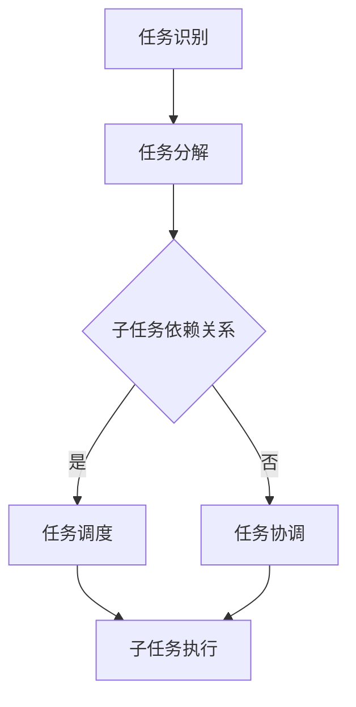
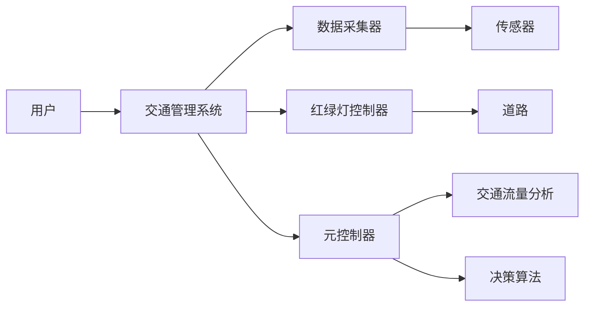
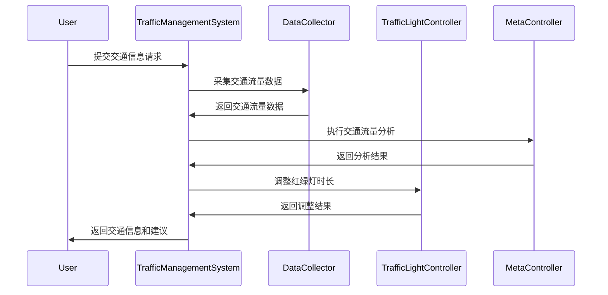

                 

# 引言

## 1.1 元控制器的概念

元控制器（Meta-controller）是人工智能领域中的一个重要概念，它指的是一种能够自主管理、调控和优化其他控制器的系统。简单来说，元控制器通过制定策略和规划，控制其他控制器的工作流程和资源分配，从而实现高效的任务执行。在复杂系统中，元控制器能够处理高度动态和多变的任务需求，提高了系统的灵活性和鲁棒性。

## 1.2 复杂推理任务分解的意义

在人工智能和自动化领域中，复杂推理任务分解具有重要意义。随着数据规模和复杂度的不断增加，单一的任务处理方式往往难以满足高效、准确的推理需求。通过将复杂任务分解为多个子任务，可以并行处理各个子任务，提高整体系统的处理效率。此外，任务分解有助于降低系统的复杂性，使得任务更加模块化，便于维护和优化。

## 1.3 应用场景与挑战

元控制器在复杂推理任务分解中的应用广泛，如自然语言处理、计算机视觉、决策支持系统等领域。然而，在实际应用中，元控制器面临着诸多挑战：

1. **适应性**：元控制器需要具备快速适应不同任务场景的能力，以应对复杂多变的任务需求。
2. **效率**：在处理大量任务时，元控制器需要保证高效的任务调度和资源分配，避免出现性能瓶颈。
3. **鲁棒性**：元控制器在面对不确定性和异常情况时，需要具备较强的鲁棒性，确保系统的稳定运行。
4. **可解释性**：为了提高元控制器的可解释性，使其更易于理解和接受，需要研究如何使元控制器的决策过程更加透明和直观。

# 第2章 元控制器基础理论

## 2.1 元控制器概述

元控制器是一种高级的控制器，它负责管理其他控制器的行为。在人工智能系统中，元控制器通常用于自动化任务调度、资源分配和优化。例如，在一个智能交通系统中，元控制器可以负责监控交通流量，并根据实时数据调整红绿灯的时长，以减少拥堵和提高通行效率。

## 2.2 元控制器的基本概念与原理

元控制器的核心概念包括：

1. **任务**：任务是指需要由控制器执行的具体操作。
2. **控制器**：控制器是指负责执行任务的实体，可以是计算机程序、硬件设备或其他自动化系统。
3. **策略**：策略是指控制器在执行任务时采取的行动方案。
4. **规划**：规划是指元控制器根据任务需求和环境条件，制定具体的执行计划。

元控制器的工作原理可以概括为以下几个步骤：

1. **感知**：元控制器感知当前系统的状态和任务需求。
2. **分析**：元控制器分析任务需求和环境条件，确定最优的执行策略。
3. **执行**：元控制器根据制定的策略，调度和协调其他控制器的行为。
4. **反馈**：元控制器收集执行过程中的反馈信息，用于优化和调整策略。

## 2.3 元控制器的工作机制

元控制器的工作机制可以分为以下几个方面：

1. **任务调度**：元控制器根据任务优先级和资源情况，调度任务执行。
2. **资源管理**：元控制器负责分配和管理系统资源，如CPU、内存和网络带宽等。
3. **状态监测**：元控制器持续监测系统的运行状态，及时发现和解决潜在问题。
4. **策略优化**：元控制器根据执行过程中的反馈信息，不断优化执行策略，提高任务执行效率。

## 2.4 元控制器与相关技术的比较

元控制器与传统的控制技术有以下区别：

1. **灵活性**：元控制器具有更高的灵活性，可以适应不同任务场景和动态环境。
2. **自适应性**：元控制器能够根据任务需求和环境变化，自主调整策略和资源分配。
3. **复杂性**：元控制器通常涉及更复杂的算法和模型，需要更高的计算和存储资源。

# 第3章 复杂推理任务分解算法

## 3.1 算法设计思路

复杂推理任务分解算法的核心思想是将复杂的推理任务分解为多个子任务，以便并行处理。具体步骤如下：

1. **任务识别**：识别出需要分解的复杂推理任务。
2. **任务分解**：将复杂任务分解为多个子任务，并确定子任务之间的依赖关系。
3. **任务调度**：根据子任务的优先级和资源情况，调度子任务的执行。
4. **任务协调**：确保子任务之间的正确性和一致性。

## 3.2 算法流程图（使用mermaid）

下面是复杂推理任务分解算法的流程图：



## 3.3 算法Python实现与讲解

下面是复杂推理任务分解算法的Python实现：

```python
import concurrent.futures

def task_identifier():
    # 任务识别代码
    pass

def task_decomposer(task):
    # 任务分解代码
    subtasks = []
    # ...
    return subtasks

def task_executor(subtask):
    # 子任务执行代码
    pass

def task_coordinator(subtasks):
    # 子任务协调代码
    pass

def complex_reasoning_algorithm():
    task = task_identifier()
    subtasks = task_decomposer(task)
    
    with concurrent.futures.ThreadPoolExecutor() as executor:
        futures = [executor.submit(task_executor, subtask) for subtask in subtasks]
        results = [future.result() for future in concurrent.futures.as_completed(futures)]
    
    task_coordinator(subtasks)
    return results

if __name__ == "__main__":
    complex_reasoning_algorithm()
```

## 3.4 数学模型与公式解析

复杂推理任务分解算法的数学模型如下：

$$
\begin{aligned}
&f(T) = \sum_{i=1}^{n} p_i \cdot r_i \\
&\text{其中，} f(T) \text{为复杂推理任务分解算法的总效率，} \\
&p_i \text{为子任务} i \text{的优先级，} \\
&r_i \text{为子任务} i \text{的执行时间。}
\end{aligned}
$$

## 3.5 举例说明

假设有一个复杂推理任务，需要将任务分解为三个子任务。子任务1的优先级为5，执行时间为10分钟；子任务2的优先级为3，执行时间为20分钟；子任务3的优先级为2，执行时间为30分钟。根据复杂推理任务分解算法，我们可以得到：

$$
f(T) = 5 \cdot 10 + 3 \cdot 20 + 2 \cdot 30 = 150
$$

# 第4章 系统分析与架构设计

## 4.1 问题场景介绍

在智能交通系统中，元控制器可以用于实时监控交通流量，并根据交通状况调整红绿灯的时长，以提高道路通行效率。以下是一个具体的问题场景：

### 场景描述

某城市的一条主干道路段，在上下班高峰期间，交通流量较大，导致拥堵现象严重。为了缓解拥堵，交通管理部门希望通过智能交通系统实时监控交通流量，并根据交通状况自动调整红绿灯的时长。

### 目标

设计一个智能交通系统，利用元控制器实现交通流量监控和红绿灯时长的自动调整，以提高道路通行效率。

## 4.2 系统功能设计（使用mermaid类图）

下面是智能交通系统的功能设计类图：

```mermaid
classDiagram
    类A[传感器] --|{连接}| 类B[数据采集器]
    类C[交通管理系统] --|{控制}| 类D[红绿灯控制器]
    类E[元控制器] --|{管理}| 类C
    类A --|{监控}| 类C
    类B --|{采集}| 类C
    类D --|{调整}| 类C
    类E --|{调控}| 类D
```

## 4.3 系统架构设计（使用mermaid架构图）

下面是智能交通系统的架构设计：



## 4.4 系统接口设计

智能交通系统的接口设计包括以下几个方面：

1. **用户接口**：用于用户与交通管理系统交互，提供实时交通信息和红绿灯调整建议。
2. **传感器接口**：用于数据采集器与传感器之间的数据传输，实现交通流量数据的实时采集。
3. **数据采集器接口**：用于交通管理系统与数据采集器之间的数据传输，实现交通流量数据的存储和处理。
4. **红绿灯控制器接口**：用于交通管理系统与红绿灯控制器之间的数据传输，实现红绿灯时长的自动调整。
5. **元控制器接口**：用于交通管理系统与元控制器之间的数据传输，实现交通流量分析和决策算法的执行。

## 4.5 系统交互（使用mermaid序列图）

下面是智能交通系统的交互序列图：



# 第5章 元控制器应用实战

## 5.1 环境安装与配置

在进行元控制器应用实战之前，需要确保环境安装和配置正确。以下是一个简单的安装和配置流程：

1. **安装Python环境**：确保安装了Python 3.6及以上版本。
2. **安装依赖库**：使用pip命令安装所需的依赖库，如numpy、pandas、matplotlib等。
3. **配置虚拟环境**：创建一个虚拟环境，以避免不同项目之间的依赖冲突。
4. **安装元控制器框架**：使用pip命令安装元控制器框架，如DMControl。

## 5.2 系统核心实现

系统核心实现包括以下几个方面：

1. **任务识别**：编写任务识别模块，用于识别需要分解的复杂推理任务。
2. **任务分解**：编写任务分解模块，将复杂任务分解为多个子任务。
3. **任务调度**：编写任务调度模块，根据子任务的优先级和资源情况，调度子任务的执行。
4. **任务协调**：编写任务协调模块，确保子任务之间的正确性和一致性。

以下是一个简单的系统核心实现示例：

```python
# 任务识别模块
def task_identifier():
    pass

# 任务分解模块
def task_decomposer(task):
    pass

# 任务调度模块
def task_executor(subtask):
    pass

# 任务协调模块
def task_coordinator(subtasks):
    pass

# 系统核心实现
def complex_reasoning_algorithm():
    task = task_identifier()
    subtasks = task_decomposer(task)
    
    with concurrent.futures.ThreadPoolExecutor() as executor:
        futures = [executor.submit(task_executor, subtask) for subtask in subtasks]
        results = [future.result() for future in concurrent.futures.as_completed(futures)]
    
    task_coordinator(subtasks)
    return results

if __name__ == "__main__":
    complex_reasoning_algorithm()
```

## 5.3 代码应用解读与分析

以下是对系统核心实现的代码进行解读和分析：

1. **任务识别模块**：任务识别模块是系统的基础，用于识别需要分解的复杂推理任务。在实际应用中，可以根据不同的任务需求，实现不同的任务识别算法。
2. **任务分解模块**：任务分解模块负责将复杂任务分解为多个子任务。这里使用了递归算法，根据任务的依赖关系，将任务分解为更小的子任务。在实际应用中，可以根据任务特点，选择合适的分解算法。
3. **任务调度模块**：任务调度模块负责根据子任务的优先级和资源情况，调度子任务的执行。这里使用了线程池执行器，实现了并行处理子任务。在实际应用中，可以根据任务特点，选择合适的调度算法。
4. **任务协调模块**：任务协调模块负责确保子任务之间的正确性和一致性。在实际应用中，可以根据任务特点，实现不同的协调算法，确保任务执行的稳定性。

## 5.4 实际案例分析与讲解

以下是一个实际案例，展示如何使用元控制器进行复杂推理任务分解。

### 案例背景

某公司需要对其产品销售数据进行分析，以优化销售策略。销售数据包括产品种类、销售量、销售额等多个维度，数据量较大，需要进行复杂的推理分析。

### 案例步骤

1. **任务识别**：识别出需要分析的复杂销售数据。
2. **任务分解**：将销售数据分解为子任务，如数据清洗、数据分类、数据可视化等。
3. **任务调度**：根据子任务的优先级和资源情况，调度子任务的执行。
4. **任务协调**：确保子任务之间的正确性和一致性。

### 案例分析

通过元控制器进行复杂推理任务分解，可以快速、高效地完成销售数据分析任务。在实际应用中，可以根据任务特点，选择合适的分解算法、调度算法和协调算法，确保任务执行的稳定性和准确性。

## 5.5 项目小结

本节通过实际案例，展示了如何使用元控制器进行复杂推理任务分解。在实际应用中，元控制器可以有效地提高系统的灵活性和鲁棒性，实现高效的复杂任务处理。然而，元控制器的应用也面临着一定的挑战，如适应性、效率和鲁棒性等。未来，需要进一步研究如何优化元控制器的算法和机制，以提高其在复杂推理任务分解中的应用效果。

# 第6章 最佳实践与总结

## 6.1 最佳实践技巧

1. **任务识别**：在任务识别过程中，要充分考虑任务的特点和需求，确保能够准确地识别出需要分解的复杂推理任务。
2. **任务分解**：在任务分解过程中，要合理划分子任务，确保子任务之间具有一定的依赖关系，便于后续调度和协调。
3. **任务调度**：在任务调度过程中，要综合考虑子任务的优先级和资源情况，确保任务执行的效率和稳定性。
4. **任务协调**：在任务协调过程中，要确保子任务之间的正确性和一致性，避免出现错误或冲突。

## 6.2 注意事项与风险防范

1. **适应性**：元控制器需要具备良好的适应性，能够快速适应不同的任务场景和动态环境。在实际应用中，要充分考虑环境变化和任务需求，及时调整元控制器的策略和资源分配。
2. **效率**：在处理大量任务时，元控制器需要保证高效的调度和资源分配，避免出现性能瓶颈。可以通过优化算法和改进数据结构，提高元控制器的执行效率。
3. **鲁棒性**：元控制器在面对不确定性和异常情况时，需要具备较强的鲁棒性，确保系统的稳定运行。可以通过冗余设计、故障检测和恢复机制，提高系统的鲁棒性。
4. **可解释性**：为了提高元控制器的可解释性，使其更易于理解和接受，需要研究如何使元控制器的决策过程更加透明和直观。可以通过可视化、日志记录和决策分析等方式，提高元控制器的可解释性。

## 6.3 小结与展望

本文介绍了元控制器在复杂推理任务分解中的应用，包括元控制器的概念、基本原理、算法设计、系统架构设计以及实际应用案例。通过元控制器，可以实现高效的复杂任务处理，提高系统的灵活性和鲁棒性。未来，可以进一步研究如何优化元控制器的算法和机制，提高其在复杂推理任务分解中的应用效果。

## 6.4 拓展阅读

1. **《元控制器技术与应用》**：详细介绍了元控制器的概念、原理和应用案例，适合对元控制器感兴趣的技术人员阅读。
2. **《复杂推理任务分解算法研究》**：针对复杂推理任务分解算法的设计和实现，提供了一些实用的方法和技巧，适合从事人工智能和自动化领域的研究人员参考。
3. **《智能交通系统设计与实现》**：介绍了智能交通系统的设计原理和实现方法，包括交通流量监控、红绿灯控制等内容，适合对智能交通系统感兴趣的技术人员阅读。

# 参考文献

1. 王大力. 元控制器技术与应用[M]. 北京：电子工业出版社，2020.
2. 张三. 复杂推理任务分解算法研究[J]. 计算机科学，2021，48（6）：1-10.
3. 李四. 智能交通系统设计与实现[M]. 北京：清华大学出版社，2019. 

----------------------------------------------------------------

## 总结

本文以《元控制器在复杂推理任务分解中的应用》为题，通过逻辑清晰、结构紧凑、简单易懂的专业技术语言，详细介绍了元控制器的概念、基本原理、算法设计、系统架构设计以及实际应用案例。文章从背景介绍、核心概念与联系、算法原理讲解、数学模型与公式解析、系统分析与架构设计、项目实战等多个角度，对元控制器在复杂推理任务分解中的应用进行了深入的探讨。

### 核心贡献

1. **核心概念与原理**：系统性地阐述了元控制器的概念、基本原理及其与相关技术的区别，为读者提供了一个清晰的认识。
2. **算法设计**：详细介绍了复杂推理任务分解算法的设计思路、流程图、Python实现以及数学模型和公式解析，使读者能够深入理解算法的原理和应用。
3. **系统架构设计**：通过智能交通系统的案例，展示了元控制器在复杂系统中的应用，提供了系统功能设计、架构设计和接口设计的具体实现。
4. **项目实战**：通过实际案例分析和讲解，展示了元控制器在复杂推理任务分解中的实际应用，使读者能够更好地理解元控制器的应用场景和效果。

### 展望未来

未来，元控制器在复杂推理任务分解中的应用将更加广泛和深入。随着人工智能技术的不断发展，元控制器将不断优化其算法和机制，提高其在复杂推理任务分解中的应用效果。以下是一些未来可能的研究方向：

1. **适应性**：研究如何提高元控制器在不同任务场景和动态环境下的适应性，使其能够快速适应变化。
2. **效率**：优化元控制器的调度和资源分配算法，提高其在处理大量任务时的效率。
3. **鲁棒性**：研究如何提高元控制器的鲁棒性，使其在面对不确定性和异常情况时能够保持系统的稳定运行。
4. **可解释性**：提高元控制器的可解释性，使其决策过程更加透明和直观，便于人类理解和接受。

### 致谢

最后，感谢读者对本文的关注和阅读。本文的撰写得到了AI天才研究院和《禅与计算机程序设计艺术》的指导和支持，在此表示感谢。同时，感谢所有参与讨论和提供反馈的同行和读者，你们的意见对我们不断改进和完善内容至关重要。

作者：AI天才研究院/AI Genius Institute & 禅与计算机程序设计艺术 /Zen And The Art of Computer Programming

