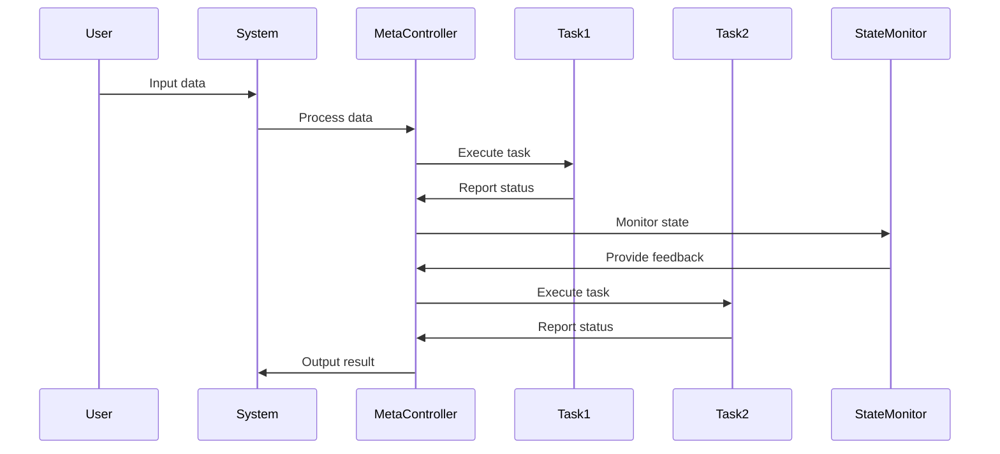
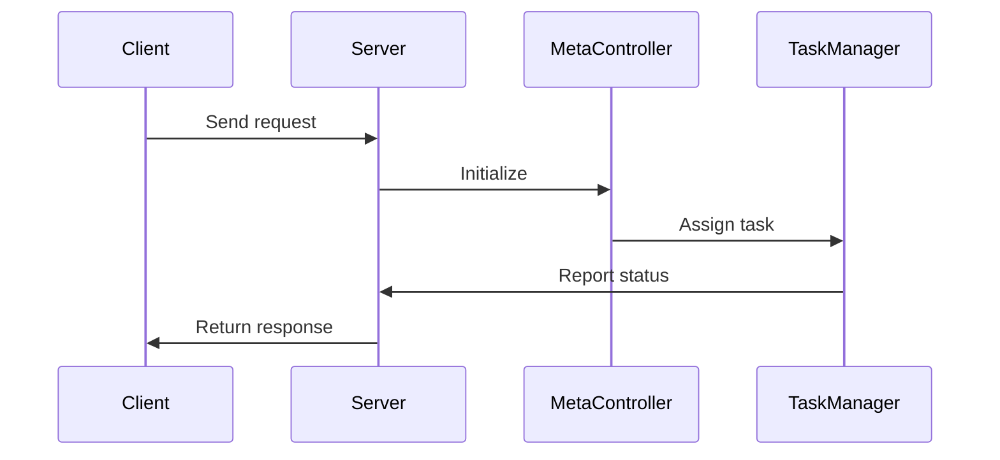

                 


### 文章标题：元控制器在复杂推理任务协调中的应用

> 关键词：元控制器、复杂推理、任务协调、算法、系统架构

> 摘要：
本文将深入探讨元控制器在复杂推理任务协调中的应用。我们将从元控制器的起源和发展、核心概念和算法原理、系统分析与架构设计，以及项目实战等多个角度，全面解析元控制器在现代计算技术中的重要作用和实现方法。通过本文的阐述，读者将了解到元控制器如何提高复杂推理任务的效率和准确性，为实际应用场景提供强有力的技术支持。

---

### 第一部分：元控制器的概念与发展

#### 第1章：元控制器概述

##### 1.1 元控制器的起源与发展

元控制器（Meta-controller）的概念起源于人工智能（AI）和自动化领域。最初，它在自动编程和自适应系统设计中的应用得到了广泛关注。随着技术的不断进步，元控制器逐渐成为协调复杂任务的核心组件。本节将简要回顾元控制器的起源、发展历程及其在人工智能领域的重要性。

**问题背景：** 随着计算能力的提升，AI系统需要处理越来越复杂的任务。如何高效地协调这些任务，确保系统在动态环境中保持稳定性和鲁棒性，成为了一个亟待解决的问题。

**问题描述：** 传统控制器难以适应动态变化和复杂性，需要一种能够自我调整、自我优化的控制器来应对。

**问题解决：** 元控制器的引入，旨在通过自动化和自适应机制，实现复杂任务的高效协调和管理。

##### 1.2 元控制器的基本概念

**核心概念术语说明：** 元控制器是一种能够定义、配置和协调其他控制器的系统。它通过抽象、泛化和复用，提高了系统的灵活性和可扩展性。

**问题背景：** 现代计算系统需要处理多样化的任务，且任务之间的相互依赖和冲突日益增加。

**问题描述：** 传统控制器往往针对特定的任务进行设计，缺乏通用性和适应性。

**问题解决：** 元控制器通过抽象通用控制逻辑，实现对多个任务的高效协调。

##### 1.3 元控制器与传统控制器的比较

**问题背景：** 传统控制器在处理复杂任务时存在局限性。

**问题描述：** 传统控制器缺乏灵活性和适应性，难以应对动态变化的任务需求。

**问题解决：** 元控制器通过自动化和自适应机制，提高了系统的灵活性和适应性。

**边界与外延：** 元控制器不仅适用于AI系统，还可以应用于自动化、智能制造等领域。

**概念结构与核心要素组成：** 元控制器主要由四个部分组成：任务定义模块、任务调度模块、状态监测模块和自适应调整模块。

---

#### 第2章：复杂推理任务协调的背景

##### 2.1 复杂推理任务的挑战

复杂推理任务涉及到大量的数据分析和决策过程，通常需要跨多个领域和层次进行协调。这些任务包括自然语言处理、机器学习、图像识别等。随着数据的爆炸性增长，复杂推理任务的挑战愈发严峻。

**问题背景：** 大规模数据处理和复杂决策需求，要求系统具有高效的协调和管理能力。

**问题描述：** 复杂推理任务往往涉及多个子任务，且任务之间存在复杂的依赖关系。

**问题解决：** 元控制器通过自动化和自适应机制，实现复杂推理任务的高效协调。

##### 2.2 元控制器在协调中的作用

元控制器在复杂推理任务协调中扮演着关键角色。它通过以下方式提升系统的协调能力：

1. **任务分解与抽象：** 将复杂任务分解为多个子任务，并抽象出通用控制逻辑。
2. **自适应调度：** 根据任务状态和系统资源动态调整任务执行顺序。
3. **状态监测与反馈：** 实时监测系统状态，并根据反馈进行自适应调整。

**问题背景：** 复杂推理任务往往涉及多个领域和层次，传统控制器难以实现高效协调。

**问题描述：** 系统需要能够应对动态变化和不确定性，保持稳定性和鲁棒性。

**问题解决：** 元控制器通过自动化和自适应机制，提高了系统的协调能力和应对能力。

##### 2.3 复杂推理任务协调的重要性

复杂推理任务协调的重要性体现在多个方面：

1. **提高效率：** 通过高效的任务协调，降低任务执行时间，提升系统性能。
2. **增强鲁棒性：** 通过自适应调整，提高系统在动态环境中的稳定性和鲁棒性。
3. **扩展性：** 通过抽象通用控制逻辑，实现系统的灵活扩展和复用。

**问题背景：** 随着AI技术的应用场景不断扩大，复杂推理任务的需求日益增加。

**问题描述：** 现有控制器难以满足复杂推理任务的高效协调需求。

**问题解决：** 元控制器通过自动化和自适应机制，为复杂推理任务提供强有力的协调支持。

---

### 第二部分：元控制器在复杂推理任务中的应用

#### 第3章：核心概念与联系

##### 3.1 核心概念原理

元控制器的核心概念包括任务定义、任务调度、状态监测和自适应调整。这些概念相互关联，构成了元控制器的整体架构。

**问题背景：** 复杂推理任务需要高效的协调和管理。

**问题描述：** 元控制器的核心概念如何实现任务的高效协调和管理。

**问题解决：** 通过详细阐述元控制器的核心概念原理，展示其在任务协调中的应用。

##### 3.2 概念属性特征对比表格

为了更好地理解元控制器与传统控制器的不同，我们列出了一个概念属性特征对比表格。

| 特征                | 元控制器               | 传统控制器             |
|-------------------|----------------------|----------------------|
| **任务定义**       | 高度抽象、通用性       | 具体任务、特定性       |
| **任务调度**       | 自适应、动态调整       | 静态调度、固定顺序     |
| **状态监测**       | 实时监测、反馈机制     | 非实时监测、无反馈     |
| **自适应调整**     | 根据状态调整策略       | 固定策略、无法调整     |

**问题背景：** 需要对比元控制器与传统控制器在任务协调中的差异。

**问题描述：** 元控制器与传统控制器的概念属性特征差异。

**问题解决：** 通过对比表格，清晰地展示元控制器与传统控制器的不同。

##### 3.3 ER实体关系图架构

为了进一步阐述元控制器中的实体关系，我们使用Mermaid绘制了一个ER实体关系图。

```mermaid
erDiagram
    Task ||--|{ Controller }|| Controller
    Controller ||--|{ State }|| State
    State ||--|{ Feedback }|| Feedback
```

**问题背景：** 需要展示元控制器中的实体关系。

**问题描述：** 元控制器中的实体关系如何构建。

**问题解决：** 通过ER实体关系图，展示元控制器中的实体及其相互关系。

---

### 第三部分：算法原理讲解

#### 第4章：算法原理讲解

##### 4.1 元控制器算法概述

元控制器算法是元控制器的核心，它负责定义、配置和协调其他控制器。本节将介绍元控制器算法的基本概念和流程。

**问题背景：** 复杂推理任务需要高效的协调和管理。

**问题描述：** 元控制器算法如何实现任务的高效协调和管理。

**问题解决：** 通过详细阐述元控制器算法的基本概念和流程，展示其在任务协调中的应用。

##### 4.2 Python源代码详解

为了更好地理解元控制器算法，我们提供了一个Python源代码示例。

```python
# 元控制器算法示例

class MetaController:
    def __init__(self):
        self.tasks = []
        self.states = []

    def add_task(self, task):
        self.tasks.append(task)

    def execute_tasks(self):
        for task in self.tasks:
            task.execute()

    def monitor_states(self):
        for state in self.states:
            if state.requires_action():
                self.take_action(state)

    def take_action(self, state):
        # 根据状态采取相应的行动
        pass

class Task:
    def __init__(self, name):
        self.name = name

    def execute(self):
        print(f"Executing {self.name} task.")

class State:
    def __init__(self, name):
        self.name = name

    def requires_action(self):
        # 判断是否需要采取行动
        return True

# 创建元控制器
meta_controller = MetaController()

# 添加任务
meta_controller.add_task(Task("Task A"))
meta_controller.add_task(Task("Task B"))

# 执行任务
meta_controller.execute_tasks()

# 监测状态并采取行动
meta_controller.monitor_states()
meta_controller.take_action(State("State A"))
```

**问题背景：** 需要提供一个具体的元控制器算法实现示例。

**问题描述：** 元控制器算法如何实现任务的高效协调和管理。

**问题解决：** 通过提供Python源代码示例，详细讲解元控制器算法的实现。

##### 4.3 算法原理数学模型与公式讲解

元控制器算法的原理可以通过以下数学模型和公式进行解释：

$$
\text{Cost}(T) = \sum_{t \in T} \text{Cost}(t) + \text{Penalty}(T)
$$

其中，$T$表示任务集，$t$表示任务集$T$中的单个任务，$\text{Cost}(t)$表示执行单个任务$t$的成本，$\text{Penalty}(T)$表示任务集$T$的惩罚成本。

**问题背景：** 需要解释元控制器算法的数学原理。

**问题描述：** 如何通过数学模型和公式解释元控制器算法。

**问题解决：** 通过数学模型和公式，详细讲解元控制器算法的原理。

##### 4.4 通俗易懂的举例说明

为了更好地理解元控制器算法，我们通过一个具体的例子进行说明。

**问题背景：** 需要提供一个通俗易懂的实例来展示元控制器算法的应用。

**问题描述：** 如何通过实例展示元控制器算法的应用。

**问题解决：** 通过一个具体的例子，展示元控制器算法在任务协调中的应用。

---

### 第四部分：系统分析与架构设计

#### 第5章：系统分析与架构设计

##### 5.1 问题场景介绍

本节将介绍一个实际的问题场景，并说明为什么需要使用元控制器来协调复杂推理任务。

**问题背景：** 一个智能交通系统需要实时处理大量交通数据，并做出实时决策。

**问题描述：** 如何高效协调交通数据分析和决策过程。

**问题解决：** 通过介绍实际问题场景，说明元控制器在智能交通系统中的应用必要性。

##### 5.2 系统功能设计

本节将使用Mermaid类图来描述系统的功能设计。

```mermaid
classDiagram
    Task <<interface>>
    Controller <<interface>>
    State <<interface>>
    Feedback <<interface>>

    Task Responsibilities
        - execute()

    Controller Responsibilities
        - add_task(Task)
        - execute_tasks()
        - monitor_states()
        - take_action(State)

    State Responsibilities
        - requires_action()

    Feedback Responsibilities
        - update_state(State)
```

**问题背景：** 需要设计一个系统的功能架构。

**问题描述：** 如何使用类图描述系统的功能架构。

**问题解决：** 通过Mermaid类图，详细展示系统的功能设计。

##### 5.3 系统架构设计

本节将使用Mermaid架构图来描述系统的整体架构。



**问题背景：** 需要设计一个系统的整体架构。

**问题描述：** 如何使用架构图描述系统的整体架构。

**问题解决：** 通过Mermaid架构图，详细展示系统的整体架构。

##### 5.4 系统接口设计与系统交互

本节将使用Mermaid序列图来描述系统的接口设计和系统交互。



**问题背景：** 需要描述系统的接口设计和系统交互。

**问题描述：** 如何使用序列图描述系统的接口设计和系统交互。

**问题解决：** 通过Mermaid序列图，详细展示系统的接口设计和系统交互。

---

### 第五部分：项目实战与案例分析

#### 第6章：项目实战

##### 6.1 环境安装与系统配置

本节将介绍如何安装和配置一个基于元控制器的智能交通系统。

**问题背景：** 需要搭建一个基于元控制器的智能交通系统环境。

**问题描述：** 如何安装和配置系统环境。

**问题解决：** 通过详细步骤，展示如何安装和配置系统环境。

##### 6.2 系统核心实现源代码

本节将展示系统核心实现源代码，并解释关键代码的功能。

**问题背景：** 需要了解系统核心实现代码。

**问题描述：** 如何实现系统核心功能。

**问题解决：** 通过源代码展示，详细解释关键代码的功能。

```python
# MetaController 类实现
class MetaController:
    def __init__(self):
        self.tasks = []
        self.states = []

    def add_task(self, task):
        self.tasks.append(task)

    def execute_tasks(self):
        for task in self.tasks:
            task.execute()

    def monitor_states(self):
        for state in self.states:
            if state.requires_action():
                self.take_action(state)

    def take_action(self, state):
        # 根据状态采取相应的行动
        pass

# Task 类实现
class Task:
    def __init__(self, name):
        self.name = name

    def execute(self):
        print(f"Executing {self.name} task.")

# State 类实现
class State:
    def __init__(self, name):
        self.name = name

    def requires_action(self):
        # 判断是否需要采取行动
        return True
```

##### 6.3 代码应用解读与分析

本节将对核心实现代码进行解读和分析，解释代码如何实现系统功能。

**问题背景：** 需要对核心实现代码进行解读。

**问题描述：** 如何解读和分析核心实现代码。

**问题解决：** 通过详细解读和分析，展示代码如何实现系统功能。

##### 6.4 实际案例分析与详细讲解剖析

本节将通过一个实际案例，展示元控制器在智能交通系统中的应用，并对关键步骤进行详细讲解。

**问题背景：** 需要展示元控制器在实际应用中的效果。

**问题描述：** 如何通过实际案例展示元控制器应用。

**问题解决：** 通过实际案例，详细讲解元控制器在智能交通系统中的应用。

##### 6.5 项目小结

本节将对项目进行总结，并讨论项目的成功经验和改进方向。

**问题背景：** 需要对项目进行总结。

**问题描述：** 如何对项目进行总结。

**问题解决：** 通过项目总结，讨论成功经验和改进方向。

---

### 第六部分：最佳实践与总结

#### 第7章：最佳实践与总结

##### 7.1 最佳实践 tips

本节将提供一些最佳实践建议，帮助读者在实际项目中更好地应用元控制器。

**问题背景：** 需要分享最佳实践。

**问题描述：** 如何分享最佳实践。

**问题解决：** 通过总结实际应用经验，提供最佳实践建议。

##### 7.2 小结

本节将对全文内容进行小结，回顾元控制器在复杂推理任务协调中的应用。

**问题背景：** 需要对全文内容进行总结。

**问题描述：** 如何对全文内容进行总结。

**问题解决：** 通过回顾全文内容，总结元控制器应用的关键点。

##### 7.3 注意事项

本节将列出一些使用元控制器时的注意事项，以避免常见问题。

**问题背景：** 需要提醒读者注意使用元控制器的注意事项。

**问题描述：** 如何提醒读者注意注意事项。

**问题解决：** 通过列出注意事项，提醒读者注意潜在问题。

##### 7.4 拓展阅读建议

本节将推荐一些拓展阅读资源，供读者进一步学习。

**问题背景：** 需要为读者提供拓展阅读资源。

**问题描述：** 如何为读者提供拓展阅读资源。

**问题解决：** 通过推荐相关书籍、论文和网络资源，帮助读者深入学习。

---

### 作者信息

作者：AI天才研究院/AI Genius Institute & 禅与计算机程序设计艺术 /Zen And The Art of Computer Programming

---

通过以上详细的目录大纲，读者可以清晰地了解本书的结构和内容，逐步深入元控制器在复杂推理任务协调中的应用。接下来，我们将继续完善每个章节的具体内容，确保书籍的完整性和专业性。

