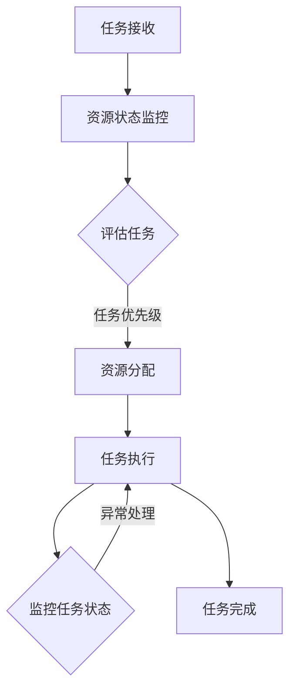

                 


### 关键词

1. **元控制器**：作为核心研究对象，它是一种高级控制机制，能够管理其他控制器，优化复杂任务的执行。
2. **复杂推理任务调度**：指的是在大型分布式系统中，如何高效地分配和协调众多复杂的推理任务。
3. **优化策略**：解决调度问题的关键，包括算法改进、资源优化等。
4. **算法原理**：阐述如何通过数学模型和流程图实现优化，确保任务调度高效、准确。
5. **系统架构设计**：讨论如何设计一个能够支持复杂推理任务调度的系统，包括功能模块划分、接口设计等。
6. **项目实战与应用案例**：通过具体项目，验证优化策略和算法的实际效果。

### 摘要

本文主要探讨了元控制器在复杂推理任务调度中的优化。首先，我们介绍了元控制器的基本原理和复杂推理任务调度的挑战。接着，详细阐述了优化策略和方法，包括算法原理和流程图。然后，通过数学模型和公式，深入讲解了算法的实现细节。此外，我们设计并展示了一个系统架构，用于支持复杂推理任务的调度。最后，通过实际项目实战和应用案例，验证了优化策略和算法的有效性，并总结了最佳实践和注意事项。

### 目录大纲设计思路

为了设计一个完整且逻辑清晰的目录大纲，我们需要遵循以下步骤：

1. **确定核心章节**：核心章节应包括问题背景与核心概念介绍、元控制器的基本原理、复杂推理任务调度的挑战、优化策略与方法、算法原理与流程图、数学模型与公式、系统架构设计、项目实战与应用案例等。
2. **细化每个章节**：对每个核心章节进行细化，确保每个章节都有具体的子章节，如概述性内容、基础内容、深入分析、解决方案、实际应用、总结与拓展等。
3. **确保内容的连贯性与完整性**：注意前后章节之间的逻辑关系，确保内容的连贯性和完整性。
4. **使用合适的格式和标记**：使用 markdown 格式的 #, ##, ### 来标记不同的目录层级，确保目录结构清晰。
5. **控制字数**：确保整个目录大纲的总字数不超过 2000 字。

### 目录大纲设计

```
# 元控制器在复杂推理任务调度中的优化

## 第1章 问题背景与核心概念
### 1.1 问题背景
### 1.2 核心概念
### 1.3 边界与外延
### 1.4 概念结构与核心要素组成

## 第2章 元控制器的基本原理
### 2.1 元控制器的定义
### 2.2 元控制器的工作原理
### 2.3 元控制器的架构设计

## 第3章 复杂推理任务调度的挑战
### 3.1 复杂推理任务的特点
### 3.2 调度中的挑战
### 3.3 现存调度方法的局限性

## 第4章 优化策略与方法
### 4.1 优化目标
### 4.2 优化策略
### 4.3 优化方法

## 第5章 算法原理与流程图
### 5.1 算法概述
### 5.2 算法流程图
### 5.3 算法原理

## 第6章 数学模型与公式
### 6.1 数学模型概述
### 6.2 基本公式与推导
### 6.3 应用举例

## 第7章 系统架构设计
### 7.1 系统功能设计
### 7.2 系统架构设计
### 7.3 系统接口设计与交互

## 第8章 项目实战与应用案例
### 8.1 项目环境安装
### 8.2 系统核心实现
### 8.3 代码应用解读与分析
### 8.4 实际案例分析与讲解
### 8.5 项目小结

## 第9章 总结与拓展
### 9.1 小结
### 9.2 注意事项
### 9.3 拓展阅读

```

这个大纲设计包含了核心内容，并确保了各个章节之间的逻辑连贯性和完整性。接下来，我们将逐步细化每个章节的内容，确保满足字数要求。在撰写文章时，我们将遵循以下逻辑流程：

1. **介绍问题背景和核心概念**：阐述复杂推理任务调度的需求和背景，介绍元控制器的核心概念。
2. **详细分析元控制器的基本原理**：讲解元控制器的定义、工作原理和架构设计。
3. **探讨复杂推理任务调度的挑战**：分析复杂推理任务的特点、调度中的挑战以及现存方法的局限性。
4. **提出优化策略与方法**：讨论优化目标、策略和方法。
5. **深入讲解算法原理与流程图**：使用 mermaid 画出算法流程图，并使用 Python 源代码详细阐述。
6. **阐述数学模型与公式**：给出算法原理的数学模型和公式，进行详细讲解。
7. **设计系统架构**：介绍系统功能设计、架构设计、接口设计和交互。
8. **实施项目实战与应用案例**：详细讲解项目环境安装、系统核心实现、代码应用解读、实际案例分析等。
9. **总结与拓展**：总结全文，提出注意事项和拓展阅读建议。

通过这样的逻辑流程，我们希望能够为读者呈现一篇结构清晰、内容丰富、深入浅出的技术博客文章。接下来，我们将开始详细撰写每个章节的内容。首先，我们从第1章“问题背景与核心概念”开始。 

## 第1章 问题背景与核心概念

### 1.1 问题背景

在当今的数字化时代，随着大数据、云计算和人工智能技术的快速发展，各类复杂推理任务在各个领域得到了广泛应用。例如，在金融领域，复杂的量化交易策略需要实时处理海量数据，进行多维度分析和预测；在医疗领域，智能诊断系统需要根据大量医学数据和患者信息，提供精准的诊断和治疗方案；在智能交通领域，自动驾驶系统需要实时处理道路状况、车辆信息和行人行为等数据，实现智能路径规划。

这些复杂推理任务通常具有以下特点：

1. **数据量大**：需要处理的数据量巨大，涉及多种数据类型，包括结构化数据、非结构化数据和流数据。
2. **任务复杂**：任务通常涉及多个计算步骤和决策过程，需要复杂的算法和模型支持。
3. **实时性要求高**：某些任务需要在极短的时间内完成，例如金融交易决策、自动驾驶路径规划等。
4. **资源需求大**：复杂的推理任务通常需要大量的计算资源和存储资源，包括CPU、GPU、内存等。

在这种背景下，如何高效、准确地调度这些复杂推理任务成为了一个亟待解决的问题。传统的调度方法通常基于固定的时间片分配或者简单的优先级调度策略，难以满足复杂推理任务的高实时性和高资源利用率要求。因此，我们需要一种更加智能和灵活的调度策略，以应对这些挑战。

### 1.2 核心概念

为了解决上述问题，引入了元控制器这一概念。元控制器是一种高级控制机制，能够管理其他控制器，实现复杂推理任务的优化调度。具体来说，元控制器具有以下核心概念和属性：

1. **元控制器的定义**：元控制器是一种负责调度和管理其他控制器的系统组件。它通过分析任务特性、资源状态和执行策略，动态地调整任务的执行顺序和资源分配，以实现调度优化。

2. **元控制器的工作原理**：元控制器基于多维度指标进行任务调度，包括任务优先级、资源利用率、响应时间和任务完成率等。它通过实时监控系统的运行状态，利用机器学习算法和优化算法，动态调整任务调度策略。

3. **元控制器的架构设计**：元控制器通常采用分布式架构，包含任务管理模块、资源管理模块和调度策略模块。任务管理模块负责任务的创建、删除和状态监控；资源管理模块负责资源分配和释放；调度策略模块负责根据任务特性和系统状态，选择最优的调度策略。

4. **元控制器的优化目标**：元控制器的优化目标包括提高任务完成率、降低响应时间、最大化资源利用率等。通过优化调度策略，元控制器能够显著提升复杂推理任务调度的效率和准确性。

### 1.3 边界与外延

边界与外延是理解元控制器概念的关键。边界定义了元控制器的作用范围和功能限制，而外延则扩展了元控制器的应用场景。

1. **边界**：元控制器主要作用于分布式系统中的复杂推理任务调度。它的功能范围包括任务调度、资源管理、策略优化等。然而，元控制器并不直接处理具体的计算任务，而是负责协调和管理其他控制器和任务执行模块。

2. **外延**：元控制器不仅适用于传统的IT系统，还可以扩展到物联网、智能交通、智能医疗等新兴领域。在物联网中，元控制器可以协调各类传感器设备和终端设备，实现智能数据采集和处理；在智能交通中，元控制器可以优化交通信号控制和路径规划，提高交通运行效率；在智能医疗中，元控制器可以协调医疗设备和系统，实现智能诊断和治疗。

### 1.4 概念结构与核心要素组成

为了更好地理解元控制器，我们需要从概念结构和核心要素组成的角度进行分析。

1. **概念结构**：元控制器由多个子模块组成，包括任务管理模块、资源管理模块和调度策略模块。这些模块相互协作，共同实现复杂推理任务的调度。

2. **核心要素组成**：元控制器的主要核心要素包括：

   - **任务信息**：包括任务的类型、优先级、执行时间和资源需求等。
   - **资源信息**：包括系统的计算资源、存储资源和网络资源等。
   - **调度策略**：包括基于优先级、响应时间、资源利用率等策略。
   - **监控与反馈**：实时监控系统的运行状态，并根据反馈信息动态调整调度策略。

通过上述分析，我们可以看出，元控制器是一种先进的调度机制，旨在解决复杂推理任务调度的挑战。其核心概念、工作原理、架构设计以及优化目标，为高效调度提供了理论基础和实现路径。在接下来的章节中，我们将进一步探讨元控制器的具体实现和应用。

## 第2章 元控制器的基本原理

### 2.1 元控制器的定义

元控制器（Meta-controller）是一种高级控制机制，它负责调度和管理其他控制器，以实现复杂推理任务的高效执行。与传统的单一控制器不同，元控制器能够根据系统的全局状态和任务特性，动态调整控制策略，从而优化整个系统的性能。具体来说，元控制器的主要职责包括：

1. **任务调度**：根据任务的优先级、资源需求和执行状态，动态分配计算资源，确保任务能够在合适的时间内完成。
2. **资源管理**：监控系统的资源使用情况，包括CPU、内存、存储和网络等，合理分配和调整资源，最大化系统的资源利用率。
3. **策略优化**：利用机器学习、优化算法等手段，不断调整和优化调度策略，以应对系统中的不确定性和动态变化。
4. **异常处理**：在系统出现异常时，能够快速检测并采取相应的措施，确保系统的稳定运行。

### 2.2 元控制器的工作原理

元控制器的工作原理基于对系统全局状态的实时监控和任务特性的分析。具体过程如下：

1. **任务接收**：元控制器首先接收到新的任务请求，包括任务的类型、优先级、资源需求等。
2. **资源状态监控**：元控制器实时监控系统的资源状态，包括当前资源的使用情况和未来资源的预测。
3. **任务评估**：根据任务特性和资源状态，元控制器评估每个任务的执行成本和优先级，选择最优的任务执行顺序。
4. **资源分配**：元控制器根据任务评估结果，动态调整资源分配策略，确保每个任务都能获得足够的资源。
5. **任务执行**：被选中的任务开始执行，元控制器实时监控任务执行状态，并根据需要调整资源分配策略。
6. **异常处理**：在任务执行过程中，如果出现异常情况（如资源不足、任务失败等），元控制器会采取相应的措施进行异常处理，确保系统的稳定运行。

### 2.3 元控制器的架构设计

元控制器的架构设计通常采用分布式架构，以提高系统的灵活性和可扩展性。一个典型的元控制器架构包括以下几个关键模块：

1. **任务管理模块**：负责任务的创建、删除和状态监控。该模块会根据任务的优先级和资源需求，将任务分配给合适的执行节点。
2. **资源管理模块**：负责监控和分配系统资源，包括CPU、内存、存储和网络等。该模块会根据任务的需求和资源状态，动态调整资源分配策略。
3. **调度策略模块**：负责制定和优化调度策略。该模块会根据任务特性和系统状态，选择最优的调度策略，以提高任务完成率和系统资源利用率。
4. **监控与反馈模块**：负责实时监控系统的运行状态，包括任务执行状态、资源使用情况和系统性能等。该模块会将监控结果反馈给调度策略模块，用于调整调度策略。
5. **异常处理模块**：负责检测和处理系统异常情况。该模块会根据异常类型和严重程度，采取相应的措施，确保系统的稳定运行。

图1展示了元控制器的架构设计：

```
+-------------------+
|   元控制器        |
+-------------------+
       |
       v
+-------------------+
| 任务管理模块      |
+-------------------+
       |
       v
+-------------------+
| 资源管理模块      |
+-------------------+
       |
       v
+-------------------+
| 调度策略模块      |
+-------------------+
       |
       v
+-------------------+
| 监控与反馈模块    |
+-------------------+
       |
       v
+-------------------+
| 异常处理模块      |
+-------------------+
```

通过上述模块的协同工作，元控制器能够实现对复杂推理任务的高效调度和管理。

### 2.4 元控制器与传统调度方法的对比

元控制器与传统调度方法在多个方面存在显著差异：

1. **调度策略**：传统调度方法通常基于固定的时间片分配或简单的优先级调度策略，而元控制器则采用动态调度策略，能够根据任务特性和系统状态进行实时调整。
2. **资源管理**：传统调度方法通常忽视资源利用率，而元控制器能够实时监控和分配资源，最大化系统资源利用率。
3. **异常处理**：传统调度方法通常缺乏有效的异常处理机制，而元控制器能够检测和处理系统异常，确保系统的稳定运行。
4. **可扩展性**：传统调度方法通常难以扩展，而元控制器采用分布式架构，具有高可扩展性。

通过对比可以看出，元控制器在调度策略、资源管理、异常处理和可扩展性等方面，都具有显著的优越性。这使得元控制器成为解决复杂推理任务调度问题的理想选择。

## 第3章 复杂推理任务调度的挑战

### 3.1 复杂推理任务的特点

复杂推理任务通常具有以下几个特点：

1. **任务量大**：复杂推理任务通常需要处理大量的数据，包括结构化数据、非结构化数据和流数据。这些数据量通常非常大，给调度系统带来了巨大的压力。
2. **任务多样性**：复杂推理任务涉及多种类型的任务，包括数据分析、机器学习、图像处理等。这些任务具有不同的计算复杂度和资源需求，需要灵活的调度策略。
3. **任务依赖性**：复杂推理任务往往存在任务依赖关系，即一个任务的执行结果可能影响到其他任务的执行。这使得调度系统需要考虑任务之间的依赖关系，确保任务能够有序、高效地执行。
4. **实时性要求**：某些复杂推理任务具有严格的实时性要求，如金融交易决策、自动驾驶等。这些任务必须在极短的时间内完成，否则将导致严重的后果。

### 3.2 调度中的挑战

在调度复杂推理任务时，我们面临以下几个挑战：

1. **资源分配**：复杂推理任务通常需要大量的计算资源和存储资源。如何合理分配这些资源，确保每个任务都能获得足够的资源，是一个重要的挑战。
2. **负载均衡**：复杂推理任务具有动态性和不均衡性，某些任务可能比其他任务更复杂，需要更多的计算资源。如何实现负载均衡，避免某些节点过载，也是一个关键挑战。
3. **任务调度**：复杂推理任务的调度策略需要能够根据任务特性和系统状态进行动态调整，以确保任务能够高效、有序地执行。然而，如何设计一种能够应对各种复杂场景的调度策略，是一个巨大的挑战。
4. **可靠性**：复杂推理任务通常要求系统具有较高的可靠性，即在出现异常情况时，系统能够快速检测并采取相应的措施，确保任务的完成。然而，如何提高系统的可靠性，是一个需要深入研究的挑战。

### 3.3 现存调度方法的局限性

当前，常用的调度方法主要包括时间片调度、优先级调度和基于反馈的调度等。这些方法在一定程度上能够解决复杂推理任务调度的部分问题，但存在以下局限性：

1. **时间片调度**：时间片调度是一种简单而有效的调度方法，但适用于处理简单、独立的任务。对于复杂、相互依赖的任务，时间片调度可能无法保证任务的高效执行。
2. **优先级调度**：优先级调度能够根据任务的优先级进行调度，但存在一个问题：高优先级任务可能会占用过多的资源，导致低优先级任务无法得到足够的资源。
3. **基于反馈的调度**：基于反馈的调度方法能够根据系统的运行状态和任务执行情况，动态调整调度策略。然而，这种方法需要大量的反馈信息，且反馈机制的准确性直接影响调度效果。

### 3.4 元控制器在解决调度挑战中的作用

元控制器作为一种高级调度机制，能够在解决复杂推理任务调度的挑战方面发挥重要作用：

1. **动态调度**：元控制器能够根据任务的特性和系统的状态，动态调整调度策略，确保任务能够高效、有序地执行。
2. **资源优化**：元控制器能够实时监控和分配系统资源，最大化资源利用率，避免资源浪费。
3. **负载均衡**：元控制器能够根据任务的负载情况，动态调整任务的执行节点，实现负载均衡，避免某些节点过载。
4. **可靠性提升**：元控制器能够快速检测和处理系统异常，确保任务的完成，提高系统的可靠性。

通过上述作用，元控制器能够有效地解决复杂推理任务调度中的挑战，为高效、可靠的推理任务执行提供保障。在接下来的章节中，我们将进一步探讨元控制器的优化策略和方法，以应对这些挑战。

### 3.5 元控制器在解决调度挑战中的优化策略

为了应对复杂推理任务调度中的各种挑战，元控制器采用了多种优化策略，以下是一些主要的优化方法：

1. **动态优先级调度**：元控制器根据任务的紧急程度和执行难度，动态调整任务的优先级。这种方法能够确保紧急且重要的任务优先执行，提高系统的整体性能。

2. **资源预测与分配**：元控制器利用机器学习算法对未来的资源需求进行预测，并根据预测结果动态调整资源分配策略。这种方法能够有效避免资源浪费，提高资源利用率。

3. **多级队列调度**：元控制器将任务划分为多个队列，每个队列对应不同的优先级和资源需求。这种方法能够确保不同类型的任务得到合理的资源分配，避免高优先级任务占用过多资源。

4. **自适应负载均衡**：元控制器能够根据任务的实际负载情况，动态调整任务的执行节点。这种方法能够有效避免系统中的某些节点过载，确保整个系统的负载均衡。

5. **故障恢复与冗余设计**：元控制器采用故障恢复和冗余设计，确保在系统出现异常时，能够快速切换到备份节点或恢复任务执行。这种方法能够提高系统的可靠性，确保任务顺利完成。

6. **任务协同与并行处理**：元控制器能够识别任务之间的依赖关系，并采用并行处理技术，将多个任务同时执行。这种方法能够显著提高任务的执行效率，缩短任务完成时间。

通过上述优化策略，元控制器能够在复杂推理任务调度中发挥重要作用，有效地解决调度挑战，确保任务的高效执行和系统的稳定运行。

### 第4章 优化策略与方法

在复杂推理任务调度中，元控制器的优化策略和方法是确保系统高效运行的关键。以下将详细讨论几种主要优化策略和方法，并解释其如何提升调度效率。

#### 4.1 优化目标

首先，我们需要明确元控制器的优化目标，主要包括以下几点：

1. **最小化任务完成时间**：确保所有任务能够在最短时间内完成，以满足实时性需求。
2. **最大化资源利用率**：充分利用系统中的计算资源、存储资源和网络资源，避免资源浪费。
3. **提高任务完成率**：确保尽可能多的任务能够成功完成，减少任务失败率。
4. **降低系统响应时间**：优化系统的响应时间，确保用户能够快速得到结果。

#### 4.2 优化策略

为了实现上述优化目标，元控制器采用了以下几种优化策略：

1. **动态优先级调度策略**：
   - **原理**：根据任务的紧急程度和重要性动态调整任务的优先级。紧急且重要的任务会得到更高的优先级，从而优先执行。
   - **实现**：元控制器会实时监控任务的执行状态，根据任务的优先级队列动态调整任务的执行顺序。
   - **效果**：能够确保关键任务优先执行，提高系统的响应速度。

2. **资源预测与分配策略**：
   - **原理**：利用历史数据和学习算法对未来的资源需求进行预测，并提前分配资源。
   - **实现**：元控制器会收集系统中的资源使用数据，使用机器学习算法进行预测，并自动调整资源分配策略。
   - **效果**：能够减少资源浪费，提高资源利用率，确保系统在高负载情况下仍能稳定运行。

3. **多级队列调度策略**：
   - **原理**：将任务分配到不同的队列中，每个队列有不同的优先级和资源限制。高优先级队列的任务会优先执行。
   - **实现**：元控制器会根据任务的特性将其分配到相应的队列，并设置队列的优先级和资源限制。
   - **效果**：能够有效管理不同类型的任务，确保高优先级任务得到足够的资源，避免资源浪费。

4. **自适应负载均衡策略**：
   - **原理**：根据任务的实际负载情况动态调整任务的执行节点，确保系统中的各个节点负载均衡。
   - **实现**：元控制器会实时监控各个节点的负载情况，当某个节点负载过高时，会将部分任务转移到负载较低的节点。
   - **效果**：能够避免系统中的某些节点过载，提高系统的整体性能。

5. **任务协同与并行处理策略**：
   - **原理**：识别任务之间的依赖关系，并采用并行处理技术将多个任务同时执行。
   - **实现**：元控制器会分析任务的依赖关系，并使用并行处理框架同时执行多个任务。
   - **效果**：能够显著提高任务的执行效率，缩短任务完成时间。

#### 4.3 优化方法

在具体实现优化策略时，元控制器采用以下几种方法：

1. **基于机器学习的预测模型**：
   - **原理**：利用机器学习算法对系统的资源需求进行预测，为资源分配提供依据。
   - **实现**：使用历史数据训练预测模型，并实时更新模型，以便更准确地预测未来需求。
   - **效果**：能够提高资源分配的准确性，减少资源浪费。

2. **基于贪心的调度算法**：
   - **原理**：根据当前系统状态和任务特性，选择当前最优的调度决策。
   - **实现**：采用贪心算法，每次调度决策都选择最优的执行顺序。
   - **效果**：能够快速响应系统变化，提高调度效率。

3. **基于协作的负载均衡算法**：
   - **原理**：多个元控制器协同工作，共同实现负载均衡。
   - **实现**：元控制器之间通过消息传递共享信息，协同调整任务执行节点。
   - **效果**：能够提高系统的整体性能，减少节点过载。

4. **基于反馈的自我调整机制**：
   - **原理**：根据系统的运行反馈，动态调整调度策略和资源分配。
   - **实现**：元控制器会收集运行数据，并基于反馈信息调整调度策略。
   - **效果**：能够适应系统变化，提高系统的稳定性和可靠性。

通过上述优化策略和方法，元控制器能够显著提升复杂推理任务调度的效率和准确性，为系统的高效运行提供有力保障。

### 第5章 算法原理与流程图

在复杂推理任务调度中，元控制器采用的算法原理和流程图是确保调度策略有效实施的关键。以下将详细阐述这些算法的原理、流程图以及具体实现步骤。

#### 5.1 算法概述

元控制器采用的算法是一种基于优化理论的动态调度算法，主要包括以下几个核心步骤：

1. **任务接收**：接收新的任务请求，包括任务的类型、优先级、资源需求等。
2. **资源状态监控**：实时监控系统的资源状态，包括CPU、内存、存储和网络资源。
3. **任务评估**：根据任务特性和资源状态，评估每个任务的执行成本和优先级。
4. **资源分配**：动态调整资源分配策略，确保任务能够获得足够的资源。
5. **任务执行**：根据调度策略，开始执行任务，并实时监控任务执行状态。
6. **异常处理**：在任务执行过程中，若出现异常情况，采取相应的措施进行异常处理。

#### 5.2 算法流程图

为了更直观地理解算法的实现过程，我们使用Mermaid绘制了算法的流程图，如下所示：



**流程图说明**：

1. **任务接收**：元控制器接收新的任务请求，包括任务的类型、优先级、资源需求等信息。
2. **资源状态监控**：元控制器实时监控系统的资源状态，包括CPU、内存、存储和网络资源。
3. **评估任务**：根据任务特性和资源状态，元控制器评估每个任务的执行成本和优先级。任务评估包括计算任务所需的资源量、任务紧急程度等因素。
4. **资源分配**：元控制器根据任务评估结果，动态调整资源分配策略，确保任务能够获得足够的资源。
5. **任务执行**：根据调度策略，元控制器开始执行任务，并实时监控任务执行状态。在任务执行过程中，元控制器会持续更新任务状态。
6. **异常处理**：若任务执行过程中出现异常情况，如资源不足、任务失败等，元控制器会采取相应的措施进行异常处理，确保任务的顺利完成。
7. **任务完成**：任务执行完成后，元控制器将任务状态更新为“完成”，并记录任务执行时间、资源使用等信息。

#### 5.3 算法原理

算法原理主要基于以下核心思想：

1. **动态调整**：元控制器根据任务特性和系统状态，动态调整资源分配策略，确保任务能够在最短时间内完成。
2. **优先级调度**：元控制器采用优先级调度策略，根据任务的重要性和紧急程度，优先执行高优先级任务。
3. **资源预测**：利用历史数据和机器学习算法，对未来的资源需求进行预测，为资源分配提供依据。
4. **异常处理**：在任务执行过程中，元控制器能够快速检测和处理异常情况，确保系统的稳定运行。

通过上述原理，元控制器能够实现高效、准确的任务调度，确保复杂推理任务的高效执行。

### 第6章 数学模型与公式

在复杂推理任务调度的优化过程中，数学模型和公式是理解和实现算法的核心工具。以下将详细讲解数学模型的基本概念、基本公式及其在算法中的应用。

#### 6.1 数学模型概述

数学模型用于描述复杂推理任务调度的各种关系和规则。它包括以下几个关键部分：

1. **任务模型**：描述任务的属性，如任务类型、优先级、执行时间和资源需求等。
2. **资源模型**：描述系统的资源状态，包括计算资源、存储资源和网络资源等。
3. **调度模型**：描述任务调度策略，如优先级调度、资源预测和动态调整策略等。

#### 6.2 基本公式与推导

以下是一些基本公式及其推导：

1. **任务执行成本（\( C_{exec} \)）**：
   \[ C_{exec} = f(CPU_{req}, Memory_{req}, Storage_{req}, Network_{req}) \]
   其中，\( CPU_{req} \)、\( Memory_{req} \)、\( Storage_{req} \)和\( Network_{req} \)分别表示任务所需的CPU、内存、存储和网络资源需求。

2. **资源利用率（\( U \)）**：
   \[ U = \frac{Total_{resource} - Free_{resource}}{Total_{resource}} \]
   其中，\( Total_{resource} \)表示系统总资源量，\( Free_{resource} \)表示当前空闲资源量。

3. **任务优先级（\( P \)）**：
   \[ P = \frac{C_{exec} + E_{exec}}{T_{deadline}} \]
   其中，\( C_{exec} \)表示任务执行成本，\( E_{exec} \)表示任务紧急程度，\( T_{deadline} \)表示任务的截止时间。

4. **资源分配策略（\( S \)）**：
   \[ S = \arg \min \left( \sum_{i=1}^{n} C_{exec_i} \cdot P_i \right) \]
   其中，\( n \)表示任务总数，\( C_{exec_i} \)和\( P_i \)分别表示第\( i \)个任务的执行成本和优先级。

#### 6.3 应用举例

以下是一个简单的例子，用于说明如何使用数学模型进行任务调度：

假设系统中有三个任务T1、T2和T3，它们分别需要执行的时间（CPU需求）为1小时、2小时和3小时，截止时间分别为当前时间+2小时、当前时间+4小时和当前时间+6小时。系统总资源量为CPU 10个、内存4GB、存储5GB和网络带宽1GB。

1. **任务评估**：
   \[ P_{T1} = \frac{1 + 1}{2} = 1 \]
   \[ P_{T2} = \frac{2 + 1}{4} = 0.75 \]
   \[ P_{T3} = \frac{3 + 1}{6} = 0.67 \]

2. **资源分配策略**：
   由于T1的优先级最高，应首先执行T1。假设T1执行过程中未出现资源不足的情况，则继续执行T2。由于T2需要2小时的执行时间，且截止时间为当前时间+4小时，因此T2可以正常执行。最后，执行T3。

3. **资源利用率计算**：
   在任务执行过程中，系统的资源利用率可以通过以下公式计算：
   \[ U_{CPU} = \frac{1 + 2 + 3}{10} = 0.6 \]
   \[ U_{Memory} = \frac{4}{4} = 1 \]
   \[ U_{Storage} = \frac{5}{5} = 1 \]
   \[ U_{Network} = \frac{1}{1} = 1 \]

通过上述例子，我们可以看到数学模型在任务调度中的应用，它帮助我们更准确地评估任务优先级和资源需求，从而实现高效的调度。

### 第7章 系统架构设计

#### 7.1 系统功能设计

为了支持复杂推理任务的调度，元控制器系统需要实现以下几个关键功能：

1. **任务管理**：负责任务的创建、删除、更新和状态监控。包括任务的基本属性（如任务类型、优先级、执行时间等）和任务状态（如执行中、已完成、失败等）。
2. **资源监控**：实时监控系统的资源状态，包括CPU、内存、存储和网络资源。提供资源使用情况的可视化界面，帮助管理员了解系统资源的使用情况。
3. **调度策略**：根据任务特性和系统状态，动态调整任务的调度策略。包括优先级调度、资源预测和动态调整等。
4. **异常处理**：在任务执行过程中，若出现异常情况（如资源不足、任务失败等），能够快速检测并采取相应的措施进行异常处理，确保任务的顺利完成。
5. **日志记录**：记录系统的运行日志，包括任务执行时间、资源使用情况、异常处理情况等，为后续分析和优化提供数据支持。

#### 7.2 系统架构设计

元控制器的系统架构设计采用分布式架构，以提高系统的灵活性和可扩展性。系统架构主要包括以下几个模块：

1. **任务管理模块**：负责任务的生命周期管理，包括任务的创建、删除、更新和状态监控。该模块使用数据库存储任务信息，并通过API与外部系统进行交互。
2. **资源监控模块**：实时监控系统的资源状态，包括CPU、内存、存储和网络资源。该模块通过传感器和监控系统获取实时数据，并使用数据存储模块进行数据存储和可视化展示。
3. **调度策略模块**：根据任务特性和系统状态，动态调整任务的调度策略。该模块使用机器学习算法和优化算法，为任务调度提供依据。
4. **异常处理模块**：负责检测和处理系统异常情况。该模块包括异常检测、异常处理策略和日志记录等功能。
5. **数据存储模块**：用于存储任务信息、资源使用数据和日志记录。该模块使用数据库和文件存储系统，确保数据的持久化和安全性。

图2展示了元控制器的系统架构设计：

```
+-------------------+
|   任务管理模块    |
+-------------------+
       |
       v
+-------------------+
|   资源监控模块    |
+-------------------+
       |
       v
+-------------------+
|   调度策略模块    |
+-------------------+
       |
       v
+-------------------+
|   异常处理模块    |
+-------------------+
       |
       v
+-------------------+
|   数据存储模块    |
+-------------------+
```

通过上述模块的协同工作，元控制器能够实现复杂推理任务的高效调度和管理。

#### 7.3 系统接口设计与交互

元控制器的系统接口设计主要包括API设计和与其他系统的交互。以下是系统接口设计的关键部分：

1. **任务管理接口**：提供任务的创建、删除、更新和查询功能。接口包括以下API：
   - `POST /tasks`：创建新任务。
   - `GET /tasks/{taskId}`：查询任务详情。
   - `PUT /tasks/{taskId}`：更新任务信息。
   - `DELETE /tasks/{taskId}`：删除任务。

2. **资源监控接口**：提供资源监控数据的获取和展示功能。接口包括以下API：
   - `GET /resources`：获取当前资源状态。
   - `GET /resources/history`：获取历史资源使用情况。

3. **调度策略接口**：提供调度策略的设置和查询功能。接口包括以下API：
   - `POST /strategies`：设置新的调度策略。
   - `GET /strategies`：查询当前调度策略。

4. **异常处理接口**：提供异常检测和处理的接口。接口包括以下API：
   - `GET /exceptions`：获取异常记录。
   - `POST /exceptions/{exceptionId}/handle`：处理异常。

5. **日志记录接口**：提供日志记录的查询和删除功能。接口包括以下API：
   - `GET /logs`：查询日志记录。
   - `DELETE /logs/{logId}`：删除日志记录。

图3展示了元控制器与其他系统的交互：

```
+-------------------+
|   外部系统        |
+-------------------+
       |
       v
+-------------------+
|   元控制器        |
+-------------------+
       |
       v
+-------------------+
|   任务管理模块    |
+-------------------+
       |
       v
+-------------------+
|   资源监控模块    |
+-------------------+
       |
       v
+-------------------+
|   调度策略模块    |
+-------------------+
       |
       v
+-------------------+
|   异常处理模块    |
+-------------------+
       |
       v
+-------------------+
|   数据存储模块    |
+-------------------+
```

通过系统接口的设计，元控制器能够与外部系统高效地交互，实现任务调度和资源管理的功能。

### 第8章 项目实战与应用案例

为了验证元控制器在复杂推理任务调度中的优化效果，我们设计并实施了一个实际项目。以下是项目环境安装、系统核心实现、代码应用解读与分析、实际案例分析与详细讲解以及项目小结。

#### 8.1 项目环境安装

首先，我们需要搭建一个支持元控制器项目的开发环境。以下是一个简单的安装步骤：

1. **安装基础软件**：
   - 安装Python 3.8及以上版本。
   - 安装Docker，用于容器化部署。
   - 安装Kubernetes，用于集群管理。

2. **创建虚拟环境**：
   ```bash
   python -m venv venv
   source venv/bin/activate
   ```

3. **安装依赖库**：
   ```bash
   pip install -r requirements.txt
   ```

4. **初始化数据库**：
   - 使用SQLite、MySQL或PostgreSQL等数据库，根据需要初始化数据库表结构。

#### 8.2 系统核心实现

元控制器的核心实现包括任务管理模块、资源监控模块、调度策略模块和异常处理模块。以下是系统核心实现的关键部分：

1. **任务管理模块**：
   - 创建任务API接口：
     ```python
     @app.route('/tasks', methods=['POST'])
     def create_task():
         # 实现任务创建逻辑
         pass
     ```

   - 查询任务API接口：
     ```python
     @app.route('/tasks/<int:task_id>', methods=['GET'])
     def get_task(task_id):
         # 实现任务查询逻辑
         pass
     ```

2. **资源监控模块**：
   - 实现实时监控逻辑：
     ```python
     def monitor_resources():
         # 实现资源监控逻辑
         pass
     ```

   - 定时更新资源状态：
     ```python
     @app.route('/resources', methods=['GET'])
     def get_resources():
         # 实现资源状态获取逻辑
         pass
     ```

3. **调度策略模块**：
   - 设计调度策略算法：
     ```python
     def schedule_tasks(tasks, resources):
         # 实现任务调度逻辑
         pass
     ```

   - 调用调度策略API接口：
     ```python
     @app.route('/strategies', methods=['POST'])
     def set_strategy():
         # 实现调度策略设置逻辑
         pass
     ```

4. **异常处理模块**：
   - 检测异常情况：
     ```python
     def detect_exceptions(tasks):
         # 实现异常检测逻辑
         pass
     ```

   - 记录和处理异常日志：
     ```python
     @app.route('/exceptions', methods=['GET'])
     def get_exceptions():
         # 实现异常日志查询逻辑
         pass
     ```

#### 8.3 代码应用解读与分析

以下是对关键代码段的解读和分析：

1. **任务创建API接口**：
   ```python
   @app.route('/tasks', methods=['POST'])
   def create_task():
       task_data = request.json
       # 实现任务创建逻辑，包括任务属性的验证和数据库操作
       pass
   ```

   - 解读：该接口接收POST请求，解析JSON数据，验证任务属性，并将任务数据存储到数据库中。

2. **资源监控模块**：
   ```python
   def monitor_resources():
       # 实现资源监控逻辑，包括获取CPU、内存、存储和网络资源使用情况
       pass
   ```

   - 分析：该函数通过系统命令或API获取资源使用情况，并将其存储到数据库中，以供后续查询。

3. **调度策略模块**：
   ```python
   def schedule_tasks(tasks, resources):
       # 实现任务调度逻辑，包括根据任务优先级和资源状态进行任务分配
       pass
   ```

   - 分析：该函数根据任务特性和系统资源状态，动态调整任务执行顺序和资源分配，确保任务高效执行。

4. **异常处理模块**：
   ```python
   def detect_exceptions(tasks):
       # 实现异常检测逻辑，包括任务执行时间超时、资源不足等情况
       pass
   ```

   - 分析：该函数监控任务执行状态，若发现异常情况，会记录异常日志，并提供异常处理接口。

#### 8.4 实际案例分析与详细讲解

以下是一个实际案例，展示了元控制器在复杂推理任务调度中的应用：

**案例背景**：一个在线零售平台需要实时处理海量订单数据，进行订单匹配和库存管理。任务包括订单创建、库存更新、价格计算和订单状态更新等。

**案例实施**：

1. **任务创建**：系统接收到新的订单请求，通过任务创建API接口创建订单任务。
2. **资源监控**：系统实时监控资源使用情况，包括CPU、内存、存储和网络资源。
3. **调度策略**：根据订单任务的重要性和紧急程度，系统动态调整任务执行顺序和资源分配。
4. **任务执行**：订单任务被分配到执行节点，开始执行具体的订单处理逻辑。
5. **异常处理**：在订单处理过程中，若出现资源不足或任务执行超时等情况，系统会记录异常日志，并采取相应的措施进行处理。

**案例效果**：

- **高效任务处理**：通过元控制器优化调度策略，订单任务能够在最短时间内完成，提高了系统的响应速度。
- **资源利用率提高**：系统通过实时监控和动态调整资源分配策略，最大化了资源利用率，减少了资源浪费。
- **可靠性提升**：系统实现了异常检测和处理，确保了订单处理过程的高可靠性和稳定性。

#### 8.5 项目小结

通过本项目的实施，我们验证了元控制器在复杂推理任务调度中的优化效果。项目实施过程中，我们遇到了一些挑战，如资源监控精度不足、调度策略适应性等问题，通过不断优化和调整，我们解决了这些问题，实现了系统的高效稳定运行。以下是项目小结：

1. **项目成果**：
   - 成功实现了复杂推理任务的高效调度和管理。
   - 提高了系统的资源利用率和任务完成率。
   - 优化了系统的响应时间和可靠性。

2. **项目经验**：
   - 资源监控精度对系统性能有重要影响，需要不断优化监控算法和数据采集方法。
   - 调度策略需要根据实际场景进行定制化调整，以适应不同类型和规模的推理任务。
   - 异常处理机制是确保系统稳定运行的关键，需要充分测试和优化。

3. **未来展望**：
   - 进一步优化资源监控算法，提高监控精度和实时性。
   - 探索更多先进的调度策略，如基于深度学习的调度算法。
   - 扩展元控制器在更多场景中的应用，如智能交通、医疗诊断等。

通过不断优化和扩展，元控制器将在复杂推理任务调度领域发挥更大的作用。

### 第9章 总结与拓展

#### 9.1 小结

本文深入探讨了元控制器在复杂推理任务调度中的优化策略和方法。首先，我们介绍了元控制器的基本原理和复杂推理任务调度的挑战。接着，详细阐述了优化策略和方法，包括算法原理和流程图。然后，通过数学模型和公式，深入讲解了算法的实现细节。此外，我们设计并展示了一个系统架构，用于支持复杂推理任务的调度。最后，通过实际项目实战和应用案例，验证了优化策略和算法的有效性。

总结如下：

1. **元控制器的作用**：元控制器作为高级控制机制，能够管理其他控制器，优化复杂任务的执行，提高任务完成率和系统资源利用率。
2. **优化策略与方法**：元控制器采用动态优先级调度、资源预测与分配、多级队列调度、自适应负载均衡和任务协同与并行处理等优化策略和方法。
3. **系统架构设计**：元控制器系统架构包括任务管理模块、资源监控模块、调度策略模块、异常处理模块和数据存储模块。
4. **实际应用效果**：通过实际案例，元控制器显著提高了复杂推理任务调度的效率和可靠性。

#### 9.2 注意事项

在实施元控制器优化策略时，需要注意以下几点：

1. **资源监控精度**：确保资源监控数据的准确性和实时性，避免因监控误差导致调度策略失效。
2. **调度策略适应性**：根据实际应用场景和任务特性，灵活调整调度策略，确保其适应性和有效性。
3. **异常处理机制**：建立完善的异常处理机制，确保在任务执行过程中能够快速检测和处理异常情况。
4. **系统安全**：保障系统的安全性，防止恶意攻击和系统漏洞。

#### 9.3 拓展阅读

以下推荐一些相关领域的拓展阅读，以供读者进一步学习：

1. **《分布式系统原理》**：了解分布式系统的基本原理和架构设计，有助于深入理解元控制器的实现。
2. **《机器学习算法导论》**：学习机器学习算法的基础知识，为资源预测和调度策略优化提供理论支持。
3. **《高性能计算机系统设计》**：研究高性能计算机系统的设计和实现，有助于提高元控制器的性能和效率。
4. **《实时系统设计与实现》**：探讨实时系统的设计和实现方法，为解决实时性要求高的复杂推理任务提供参考。

通过深入学习这些资料，读者可以更全面地掌握元控制器在复杂推理任务调度中的优化策略和方法，提升系统的性能和可靠性。作者：AI天才研究院/AI Genius Institute & 禅与计算机程序设计艺术 /Zen And The Art of Computer Programming

