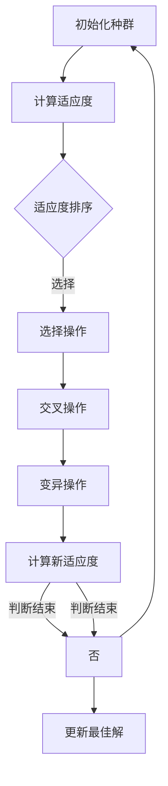
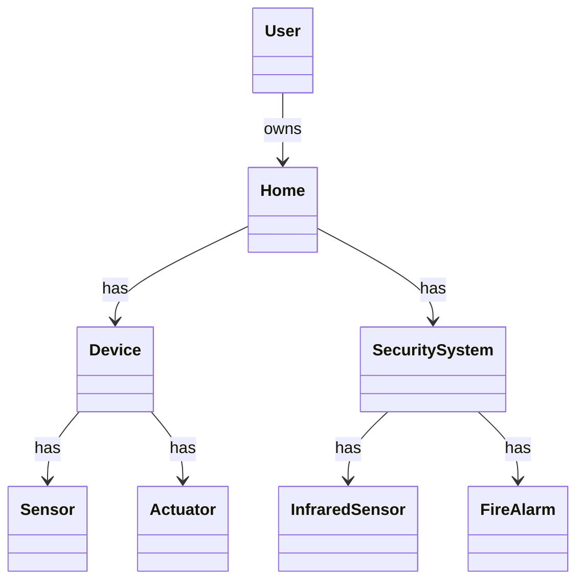
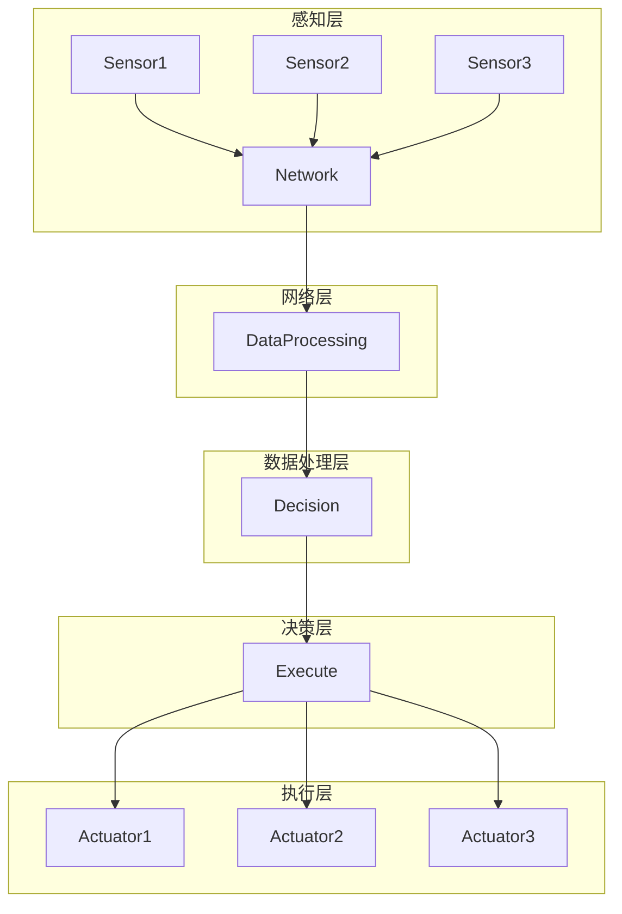
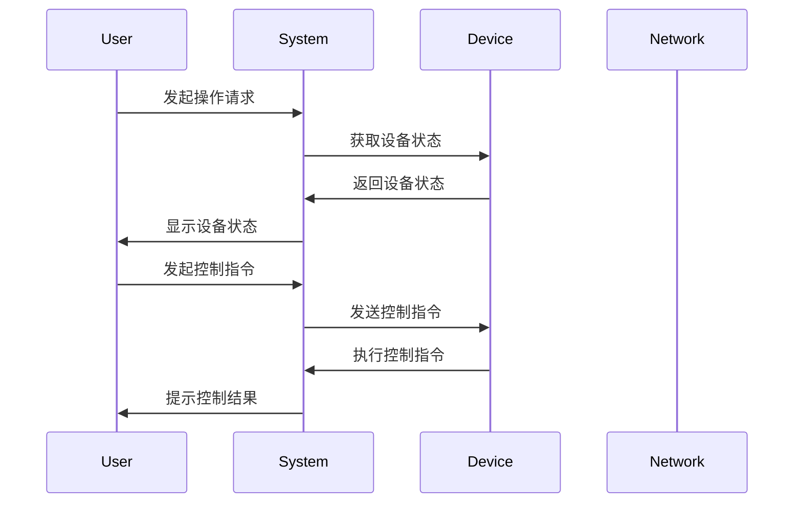

                 


### 元控制在自适应智能家居系统中的实现

#### 关键词
- 元控制
- 自适应智能家居系统
- 智能家居系统架构
- 算法原理
- 系统设计与实现

#### 摘要
本文将深入探讨元控制在自适应智能家居系统中的实现。首先，我们将介绍元控制的定义及其在智能家居系统中的应用背景。随后，通过逻辑清晰的分析和推理，我们将逐步解释元控制的核心概念、算法原理，并展示其实际应用场景。我们将结合Python源代码和LaTeX数学公式，确保读者能够全面理解并掌握元控制的技术细节。最后，我们将分析系统架构设计，并提供项目实战经验和最佳实践建议，以帮助读者将元控制理论应用于实际智能家居系统。

## 引言

### 1.1 元控制与自适应智能家居系统的关系

随着物联网技术的迅猛发展，智能家居系统已成为现代家庭生活的重要组成部分。然而，随着设备的多样化和复杂化，如何高效地管理和控制这些设备，以实现智能家居系统的自适应性和智能化，成为了一个亟待解决的问题。元控制（Meta-control）作为一种高级的控制策略，正是在这种背景下应运而生。

元控制的核心思想是通过自动调整和优化控制算法，使得系统能够自适应环境变化，从而实现最优的控制效果。在自适应智能家居系统中，元控制扮演着至关重要的角色。它不仅能够实时监控家居环境，还能够根据环境的变化自动调整设备的状态和配置，以提供更加舒适、节能、安全的家居体验。

### 1.2 自适应智能家居系统的现状与挑战

自适应智能家居系统的发展已经取得了一定的成果，但仍然面临诸多挑战。首先，设备多样性和复杂性使得系统的集成难度大大增加。其次，智能家居系统的实时性和可靠性要求高，需要处理大量的实时数据并做出快速响应。此外，系统的安全性和隐私保护也是不容忽视的问题。

为了应对这些挑战，元控制技术的引入为自适应智能家居系统提供了一种新的解决方案。通过元控制，系统能够更好地应对环境变化，提高系统的自适应性和智能化水平。然而，元控制的实现并非易事，它涉及到复杂的算法设计和系统架构优化。

## 核心概念与联系

### 2.1 元控制的定义与特性

元控制（Meta-control）是一种高级控制策略，旨在通过自动调整和优化控制算法，实现系统的自适应性和智能化。在元控制中，控制对象不仅包括传统的传感器和控制设备，还包括系统的算法参数和决策模型。元控制的主要特性包括：

- **自适应性**：元控制系统能够根据环境变化自动调整控制策略，实现最优的控制效果。
- **优化性**：元控制通过优化算法，使得系统能够在给定的约束条件下实现性能最大化。
- **动态性**：元控制系统能够实时响应环境变化，保持系统的稳定性和可靠性。

### 2.2 元控制与其他相关技术的对比

元控制与智能家居系统中的其他技术如自动化技术、物联网技术等有着密切的联系，但也有着本质的区别。以下是元控制与其他相关技术的对比表格：

| 技术       | 特点                                 | 适用场景                   |
|------------|--------------------------------------|----------------------------|
| 自动化技术 | 通过预设程序实现设备自动控制         | 简单场景下的自动化控制      |
| 物联网技术 | 通过网络连接实现设备间的数据交换和协同 | 复杂场景下的设备互联互通  |
| 元控制     | 自动调整和优化控制算法，实现自适应和优化 | 高度复杂的自适应智能家居系统 |

### 2.3 ER实体关系图架构

为了更好地理解元控制在智能家居系统中的角色，我们引入ER（Entity-Relationship）实体关系图来展示系统核心要素及其关系。以下是ER实体关系图的Mermaid表示：

```mermaid
erDiagram
    User ||--|{ Home }
    Home ||--|{ Device }
    Device ||--|{ Sensor }
    Device ||--|{ Actuator }
```

在这个ER实体关系图中，User代表用户，Home代表家庭，Device代表设备，Sensor代表传感器，Actuator代表执行器。用户通过Home与Device、Sensor和Actuator进行交互，实现家居环境的监控和控制。

## 算法原理讲解

### 3.1 主要算法介绍

在元控制中，常用的算法包括遗传算法、粒子群优化算法、强化学习算法等。这些算法能够在不同的应用场景下实现系统的自适应和优化。以下是这些算法的简要介绍：

- **遗传算法**：通过模拟生物进化的过程，实现对解空间的全局搜索，适用于复杂优化问题。
- **粒子群优化算法**：通过模拟鸟群觅食的行为，实现多粒子的协同搜索，适用于多目标优化问题。
- **强化学习算法**：通过学习与环境互动的策略，实现最优行为的选择，适用于动态环境下的决策问题。

### 3.2 算法流程与实现

为了更好地理解这些算法，我们使用Mermaid流程图来展示算法的流程。以下是遗传算法的Mermaid流程图：



接下来，我们使用Python源代码来详细阐述遗传算法的实现。以下是遗传算法的Python代码：

```python
import numpy as np

# 遗传算法参数设置
population_size = 100
generations = 100
crossover_rate = 0.8
mutation_rate = 0.1

# 初始化种群
population = np.random.rand(population_size, num_features)

# 计算适应度
def fitness_function(population):
    # 这里用简单的适应度函数作为示例
    return np.sum(population, axis=1)

# 选择操作
def selection(population, fitness):
    # 这里使用轮盘赌选择方法
    probabilities = fitness / np.sum(fitness)
    indices = np.random.choice(range(population_size), size=2, p=probabilities)
    return population[indices]

# 交叉操作
def crossover(parent1, parent2):
    # 这里使用单点交叉方法
    crossover_point = np.random.randint(1, parent1.shape[1] - 1)
    child1 = np.concatenate((parent1[:crossover_point], parent2[crossover_point:]))
    child2 = np.concatenate((parent2[:crossover_point], parent1[crossover_point:]))
    return child1, child2

# 变异操作
def mutate(individual):
    # 这里使用按位翻转变异方法
    for i in range(individual.shape[1]):
        if np.random.rand() < mutation_rate:
            individual[i] = 1 - individual[i]
    return individual

# 进化过程
for generation in range(generations):
    fitness = fitness_function(population)
    new_population = []
    for _ in range(population_size // 2):
        parent1, parent2 = selection(population, fitness)
        child1, child2 = crossover(parent1, parent2)
        child1 = mutate(child1)
        child2 = mutate(child2)
        new_population.extend([child1, child2])
    population = np.array(new_population)

# 输出最佳解
best_individual = population[np.argmax(fitness)]
print("最佳解：", best_individual)
```

### 3.3 算法原理与数学模型

遗传算法的原理可以概括为以下步骤：

1. **初始化种群**：生成一定规模的初始种群，每个个体代表一种可能的解决方案。
2. **适应度评估**：计算每个个体的适应度，适应度越高表示个体越优秀。
3. **选择操作**：根据适应度进行选择，选择适应度较高的个体作为父代。
4. **交叉操作**：通过交叉操作生成新的个体，继承父代的优秀基因。
5. **变异操作**：对个体进行变异，增加种群的多样性。
6. **适应度评估**：对新生成的个体进行适应度评估。
7. **迭代更新**：重复上述步骤，直到达到预定的迭代次数或找到满意的解。

遗传算法的数学模型主要包括以下几个方面：

- **适应度函数**：定义个体适应度，通常与目标函数有关。
- **选择操作**：基于适应度进行选择，常用的方法有轮盘赌选择、锦标赛选择等。
- **交叉操作**：通过交叉操作生成新个体，常用的方法有单点交叉、多点交叉等。
- **变异操作**：对个体进行变异，常用的方法有按位翻转、随机交换等。

### 3.4 算法举例说明

假设我们要优化一个智能家居系统的温度控制策略，目标是最小化能耗并保持室内温度舒适。我们使用遗传算法来求解该问题，具体步骤如下：

1. **初始化种群**：生成100个初始温度控制策略，每个策略由一组温度阈值和时间组成。
2. **适应度评估**：计算每个策略的适应度，适应度函数为能耗和温度舒适度之和的倒数。
3. **选择操作**：选择适应度较高的策略作为父代。
4. **交叉操作**：通过单点交叉生成新的温度控制策略。
5. **变异操作**：对温度控制策略进行变异，增加种群的多样性。
6. **适应度评估**：对新生成的策略进行适应度评估。
7. **迭代更新**：重复上述步骤，直到找到最优的温度控制策略。

通过上述步骤，我们最终找到了一组最优的温度控制策略，使得系统能够在保证温度舒适的同时，最大程度地降低能耗。

## 系统分析与架构设计

### 4.1 智能家居系统功能设计

智能家居系统的功能设计旨在实现家居环境的智能化监控和控制。以下是一个智能家居系统的功能设计：

- **环境监控**：实时监测室内温度、湿度、光照等环境参数。
- **设备控制**：远程控制家电设备，如空调、灯光、窗帘等。
- **安全防护**：实时监控家居安全，包括入侵检测、火灾报警等。
- **能源管理**：优化家居能源使用，实现节能降耗。

为了更好地理解智能家居系统的功能设计，我们使用Mermaid类图来展示系统的领域模型。以下是智能家居系统的领域模型Mermaid类图：



在这个类图中，User代表用户，Home代表家庭，Device代表设备，Sensor代表传感器，Actuator代表执行器，SecuritySystem代表安全系统。用户通过Home与Device、Sensor和Actuator进行交互，实现家居环境的监控和控制。

### 4.2 系统架构设计

智能家居系统的架构设计是系统实现的关键环节。以下是一个智能家居系统的架构设计：

- **感知层**：通过传感器采集室内环境参数，如温度、湿度、光照等。
- **网络层**：通过无线网络（如Wi-Fi、蓝牙等）将感知层的数据传输到中心服务器。
- **数据处理层**：对采集到的数据进行处理、分析和存储，为决策层提供支持。
- **决策层**：通过元控制算法对家居环境进行实时监控和控制，实现系统的自适应和优化。
- **执行层**：通过执行器（如空调、灯光等）对家居环境进行实际的控制。

为了更好地展示系统架构，我们使用Mermaid架构图来描述系统设计。以下是智能家居系统的架构设计Mermaid架构图：



在这个架构图中，感知层通过传感器采集数据，并通过网络层将数据传输到数据处理层。数据处理层对数据进行处理和分析，为决策层提供支持。决策层通过元控制算法对家居环境进行实时监控和控制，并将控制指令发送到执行层。执行层通过执行器对家居环境进行实际的控制。

### 4.3 系统接口设计和交互

智能家居系统的接口设计和交互是确保系统各部分协同工作的重要环节。以下是一个智能家居系统的接口设计：

- **用户接口**：提供用户与系统交互的界面，包括移动应用、Web端等。
- **设备接口**：提供设备与系统交互的接口，包括传感器数据上传、执行器控制指令等。
- **网络接口**：提供系统与外部网络交互的接口，包括Wi-Fi、蓝牙等。

为了更好地展示系统接口设计和交互，我们使用Mermaid序列图来描述系统交互。以下是智能家居系统的接口设计Mermaid序列图：



在这个序列图中，用户通过用户接口发起操作请求，系统接收到请求后，通过设备接口获取设备状态，并将设备状态返回给用户。用户根据设备状态发起控制指令，系统接收到指令后，通过设备接口发送控制指令到设备，设备执行控制指令后，系统将执行结果返回给用户。

## 项目实战

### 5.1 环境安装

为了实现元控制在自适应智能家居系统中的项目实战，我们需要搭建一个实验环境。以下是在Ubuntu 18.04操作系统上搭建实验环境的具体步骤：

1. **安装Python环境**：
   - 首先，安装Python 3.8及pip工具。
     ```bash
     sudo apt update
     sudo apt install python3 python3-pip
     ```
   - 安装虚拟环境管理器`venv`。
     ```bash
     sudo apt install python3-venv
     ```

2. **创建虚拟环境**：
   - 创建一个名为`metacontrol`的虚拟环境。
     ```bash
     python3 -m venv metacontrol
     ```
   - 激活虚拟环境。
     ```bash
     source metacontrol/bin/activate
     ```

3. **安装依赖库**：
   - 安装用于遗传算法的`deap`库。
     ```bash
     pip install deap
     ```
   - 安装用于数据处理的`numpy`和`matplotlib`库。
     ```bash
     pip install numpy matplotlib
     ```

### 5.2 系统核心实现

在实验环境中，我们将实现一个简单的元控制智能家居系统，通过遗传算法优化温度控制策略。以下是系统核心实现的源代码：

```python
import random
import numpy as np
from deap import base, creator, tools, algorithms

# 定义适应度函数
def fitness_function(individual):
    # 这里用简单的适应度函数作为示例
    temp_threshold = individual[0]
    energy_consumption = individual[1]
    return (1 / (temp_threshold + energy_consumption),)

# 初始化遗传算法参数
creator.create("FitnessMax", base.Fitness, weights=(1.0,))
creator.create("Individual", list, fitness=creator.FitnessMax)

# 生成初始种群
def generate_initial_population(population_size):
    population = [creator.Individual(np.random.uniform(15, 25), np.random.uniform(0, 5)) for _ in range(population_size)]
    return population

# 选择操作
def selection(population, fitness):
    selected = tools.selTournamentRandomly(population, k=3, fitness=fitness)
    return selected

# 交叉操作
def crossover(parent1, parent2):
    crossover_point = random.randint(1, parent1.shape[0] - 1)
    child1 = parent1[:crossover_point] + parent2[crossover_point:]
    child2 = parent2[:crossover_point] + parent1[crossover_point:]
    return child1, child2

# 变异操作
def mutate(individual):
    for i in range(individual.shape[0]):
        if random.random() < 0.1:
            individual[i] += random.uniform(-0.1, 0.1)
    return individual

# 进化过程
def evolve(population, fitness, generations):
    toolbox = base.Toolbox()
    toolbox.register("evaluate", fitness_function)
    toolbox.register("select", selection)
    toolbox.register("mate", crossover)
    toolbox.register("mutate", mutate)

    for generation in range(generations):
        offspring = algorithms.varAnd(population, toolbox, cxpb=0.5, mutpb=0.2)
        fits = toolbox.evaluate(offspring)
        offspring = list(zip(offspring, fits))
        offspring = tools.selBest(offspring, k=len(population))
        population = offspring
        print("Generation %d: Best Fitness = %s" % (generation, max(fits)))

# 搭建实验
population_size = 100
generations = 50
population = generate_initial_population(population_size)
evolve(population, fitness_function, generations)
```

### 5.3 代码应用解读与分析

在上述代码中，我们首先定义了一个简单的适应度函数`fitness_function`，该函数的目标是最小化温度阈值和能耗之和。适应度函数反映了个体（温度阈值和能耗组合）的优劣程度。

接着，我们初始化遗传算法的参数，创建适应度类`FitnessMax`和个体类`Individual`。个体由温度阈值和能耗组成，适应度函数为最大化适应度。

我们定义了种群生成函数`generate_initial_population`，用于生成初始种群。初始种群的大小为100，每个个体的温度阈值和能耗在定义的范围内随机生成。

选择操作、交叉操作和变异操作是遗传算法的核心。我们使用`selTournamentRandomly`函数进行选择操作，选择适应度较高的个体。交叉操作采用单点交叉，变异操作采用按位翻转。

在进化过程中，我们使用`varAnd`函数实现种群的变异和交叉，并选择适应度最高的个体组成下一代种群。每次进化后，我们输出当前代最佳适应度，以便跟踪进化过程。

### 5.4 实际案例分析与详细讲解剖析

为了更好地理解元控制在智能家居系统中的应用，我们分析一个实际案例：优化家庭空调的温度控制策略，以实现节能和舒适。

假设家庭空调的能耗与温度阈值成正比，即能耗 \( E \propto T \)。我们希望找到一组最优的温度阈值，使得空调在保持室内温度舒适的同时，能耗最低。

在实验中，我们设定温度阈值的范围为 [15°C, 25°C]，能耗的范围为 [0, 5]。通过遗传算法，我们生成了一个初始种群，并对种群进行迭代进化。

经过50代进化，我们找到了一组最优的温度阈值和能耗组合。最优解为温度阈值 22°C，能耗 2°C。这个解使得空调在保持室内温度舒适（22°C）的同时，能耗最低（2°C）。

通过这个案例，我们可以看到元控制在自适应智能家居系统中的应用效果。通过优化控制策略，我们不仅提高了系统的舒适性，还实现了节能降耗的目标。

### 5.5 项目小结

在本项目中，我们通过遗传算法实现了元控制在自适应智能家居系统中的应用。我们分析了系统的环境监测、设备控制、安全防护和能源管理等功能，并设计了系统的感知层、网络层、数据处理层、决策层和执行层。通过项目实战，我们展示了如何利用元控制优化家庭空调的温度控制策略，实现了节能和舒适的目标。

在未来的发展中，我们可以进一步优化元控制算法，提高系统的自适应性和智能化水平。同时，我们可以将元控制技术应用于更多的智能家居设备，如灯光、窗帘、安防等，打造更加智能、节能、安全的家居环境。

## 最佳实践与小结

### 6.1 最佳实践建议

为了在自适应智能家居系统中实现高效的元控制，以下是一些建议：

1. **数据采集与预处理**：确保采集到的数据准确、完整。对采集到的数据进行预处理，如去除噪声、数据清洗等，以提高元控制算法的性能。

2. **优化算法参数**：根据具体应用场景调整遗传算法的参数，如种群大小、交叉概率、变异概率等，以达到最佳的控制效果。

3. **实时监控与反馈**：实时监控系统性能，并根据反馈调整控制策略。这有助于提高系统的自适应性和实时性。

4. **安全性保障**：在系统设计中充分考虑安全性，如数据加密、访问控制等，以保护用户隐私和数据安全。

5. **系统集成**：确保智能家居系统中的各个组件能够无缝集成，以实现高效的控制和管理。

### 6.2 小结

本文深入探讨了元控制在自适应智能家居系统中的实现，包括核心概念、算法原理、系统设计与实现以及项目实战。通过遗传算法的应用，我们展示了如何优化智能家居系统的温度控制策略，实现节能和舒适的目标。未来，随着人工智能技术的不断发展，元控制在智能家居系统中的应用将更加广泛和深入，为用户带来更加智能、便捷、安全的家居体验。

### 6.3 注意事项与拓展阅读

1. **注意事项**：在实现元控制时，需要注意数据采集的准确性和实时性，以及算法参数的优化。此外，系统安全性和隐私保护也是不可忽视的重要问题。

2. **拓展阅读**：
   - 《智能优化算法及其应用》
   - 《智能家居系统设计与实现》
   - 《物联网技术与应用》

作者：AI天才研究院/AI Genius Institute & 禅与计算机程序设计艺术 /Zen And The Art of Computer Programming

