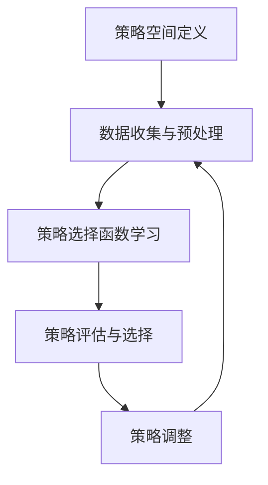
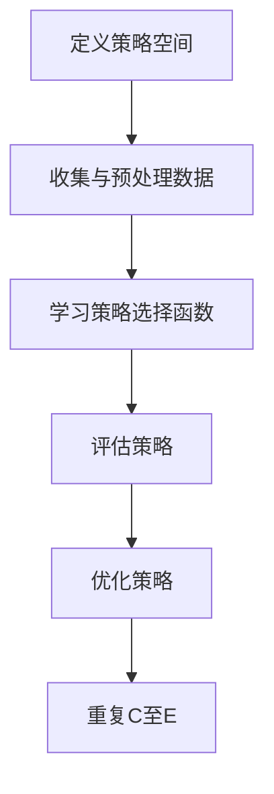

                 

### 文章标题

《元策略优化：自适应调整AI行为的新途径》

### 关键词

- 元策略优化
- 自适应调整
- AI行为
- 智能算法
- 机器学习

### 摘要

本文深入探讨了元策略优化在人工智能（AI）领域的应用。元策略优化作为自适应调整AI行为的新途径，旨在通过改进学习过程和优化算法性能，提升AI模型的泛化能力和搜索效率。文章首先介绍了元策略优化的核心概念及其与传统策略优化和智能优化算法的关系。接着，本文详细阐述了元策略优化算法的原理、流程和数学模型，并通过Python代码示例进行了详细讲解。随后，文章分析了元策略优化在机器学习和智能优化算法中的应用，通过实际案例展示了其优势。最后，文章总结了元策略优化的发展趋势和未来研究方向，为读者提供了全面的指导。

## 引言

随着人工智能（AI）技术的迅猛发展，AI在各个领域的应用日益广泛。然而，在复杂多变的环境中，传统AI模型常常面临性能瓶颈和适应性问题。为了解决这些问题，研究者们提出了元策略优化（Meta-Strategy Optimization）这一新概念，旨在通过自适应调整AI行为，提升其性能和泛化能力。

### 问题背景

AI技术的发展经历了从规则系统、知识表示到机器学习和深度学习的演变过程。然而，传统AI模型在处理复杂问题时，往往受到以下挑战：

1. **性能瓶颈**：传统机器学习模型训练时间较长，计算资源需求大，难以适应实时应用场景。
2. **适应性问题**：在动态环境中，传统AI模型难以实时调整其行为，导致性能下降。
3. **泛化能力**：传统AI模型在特定领域表现优秀，但难以泛化到其他领域。

为了解决这些问题，元策略优化应运而生。它通过引入自适应调整机制，优化AI学习过程，提升模型性能和适应能力。

### 元策略优化的概念提出

元策略优化是一种通过优化策略选择过程来提升AI模型性能的方法。与传统策略优化不同，元策略优化不仅仅关注单个策略的优化，而是通过优化策略的选择过程，实现整体性能的提升。具体来说，元策略优化包括以下几个核心概念：

1. **策略选择**：元策略优化通过学习一个策略选择函数，自动选择最优或近似最优的策略。
2. **策略空间**：策略空间是指所有可能策略的集合，元策略优化旨在从这个空间中选择最优策略。
3. **性能度量**：性能度量用于评估策略的优劣，常见的度量包括预测准确率、计算效率等。

### 问题描述

元策略优化旨在解决以下几个关键问题：

1. **策略优化**：如何通过优化策略选择过程，提升AI模型的性能？
2. **适应性调整**：如何在动态环境中，实时调整AI模型的行为，以适应变化？
3. **泛化能力**：如何提升AI模型在不同场景下的泛化能力，实现跨领域的应用？

这些问题对于AI技术的发展具有重要意义，是元策略优化研究的核心问题。

### 问题解决

元策略优化通过以下几个步骤解决上述问题：

1. **策略空间定义**：首先，需要明确策略空间，即所有可能策略的集合。
2. **策略选择函数学习**：通过机器学习或深度学习方法，学习一个策略选择函数，用于选择最优或近似最优策略。
3. **性能评估与调整**：在动态环境中，对策略进行实时评估，并根据评估结果调整策略，以实现自适应调整。
4. **泛化能力提升**：通过策略选择函数的优化，提升AI模型在不同场景下的泛化能力，实现跨领域的应用。

### 边界与外延

元策略优化不仅在AI领域有广泛应用，还与其他领域有密切联系。例如，在优化算法、机器学习和深度学习中，元策略优化都可以发挥重要作用。此外，随着AI技术的发展，元策略优化在自动驾驶、智能监控、游戏AI等领域的应用前景也非常广阔。

### 概念结构与核心要素组成

元策略优化包括以下几个关键概念和要素：

1. **策略空间**：所有可能策略的集合，是元策略优化的基础。
2. **策略选择函数**：用于选择最优或近似最优策略的函数。
3. **性能度量**：用于评估策略优劣的指标。
4. **自适应调整机制**：用于实时调整策略，以适应动态环境。
5. **泛化能力提升方法**：通过优化策略选择函数，提升模型在不同场景下的泛化能力。

通过这些概念和要素的组合，元策略优化实现了对AI行为的自适应调整，为AI技术的发展提供了新途径。

## 第一部分：引论

### 第1章：问题背景与研究意义

#### 1.1 问题背景

人工智能（AI）作为计算机科学的一个重要分支，其发展经历了多个阶段。从最初的规则系统、知识表示，到现代的机器学习和深度学习，AI技术已经取得了显著进步。然而，随着AI在各个领域的应用越来越广泛，传统AI模型在处理复杂任务时面临了一些挑战。这些问题主要体现在以下几个方面：

1. **性能瓶颈**：传统机器学习模型在处理大规模数据集时，训练时间较长，计算资源需求大，难以适应实时应用场景。
2. **适应性问题**：在动态环境中，传统AI模型难以实时调整其行为，导致性能下降。
3. **泛化能力**：传统AI模型在特定领域表现优秀，但难以泛化到其他领域。

为了解决这些问题，研究者们提出了元策略优化（Meta-Strategy Optimization）这一新概念。元策略优化通过自适应调整AI行为，优化学习过程，提升模型性能和适应能力。这使得元策略优化成为当前AI研究中的一个热点方向。

#### 1.1.1 AI技术的发展现状

自1956年达特茅斯会议以来，AI技术经历了多个发展阶段。早期的研究主要集中在规则系统和知识表示上，这些方法依赖于人工定义的规则和知识，难以应对复杂、动态的环境。随着计算能力的提升和大数据技术的发展，机器学习和深度学习逐渐成为AI研究的主流方法。

机器学习通过学习数据中的规律，自动生成模型，具有较好的泛化能力。深度学习则通过多层神经网络，实现了对复杂数据的建模和特征提取。这些方法在图像识别、自然语言处理、语音识别等领域取得了显著成果。

然而，随着AI应用场景的扩大，传统AI模型在性能、适应性和泛化能力方面仍然存在一定的局限性。这促使研究者们探索新的方法，以提升AI模型的性能和适应性。

#### 1.1.2 AI应用中的问题与挑战

在AI应用中，传统AI模型面临以下问题与挑战：

1. **性能瓶颈**：传统机器学习模型训练时间较长，计算资源需求大，难以适应实时应用场景。特别是在处理大规模数据集时，模型的训练和预测速度较慢，无法满足实时决策的需求。

2. **适应性问题**：在动态环境中，传统AI模型难以实时调整其行为，导致性能下降。例如，在自动驾驶领域，环境的变化可能导致模型失效，需要实时调整策略以适应新情况。

3. **泛化能力**：传统AI模型在特定领域表现优秀，但难以泛化到其他领域。这意味着模型在不同任务之间缺乏迁移能力，需要为每个新任务重新训练模型。

这些问题限制了AI技术的应用范围和实际效果，需要新的方法来提升AI模型的性能和适应性。

#### 1.1.3 元策略优化的概念提出

为了解决传统AI模型在性能、适应性和泛化能力方面的问题，研究者们提出了元策略优化（Meta-Strategy Optimization）这一概念。元策略优化通过优化策略选择过程，实现AI行为的自适应调整，从而提升模型性能和泛化能力。

元策略优化的核心思想是通过学习一个策略选择函数，自动选择最优或近似最优策略。这个策略选择函数通常是一个决策模型，可以基于历史数据和经验进行调整。通过不断优化策略选择函数，模型能够适应动态环境，提升性能和泛化能力。

#### 1.2 问题描述

元策略优化旨在解决以下几个关键问题：

1. **策略优化**：如何通过优化策略选择过程，提升AI模型的性能？
2. **适应性调整**：如何在动态环境中，实时调整AI模型的行为，以适应变化？
3. **泛化能力**：如何提升AI模型在不同场景下的泛化能力，实现跨领域的应用？

这些问题是元策略优化的核心研究内容，对于AI技术的发展具有重要意义。

#### 1.2.1 传统策略优化与元策略优化对比

传统策略优化和元策略优化在目标和方法上有所不同。传统策略优化主要通过优化单个策略，提高模型在特定任务上的性能。而元策略优化则关注策略选择过程，通过优化策略选择函数，实现自适应调整和性能提升。

1. **目标对比**：
   - 传统策略优化：优化单个策略，提升特定任务的性能。
   - 元策略优化：优化策略选择过程，提升整体性能和适应性。

2. **方法对比**：
   - 传统策略优化：通过调整模型参数或结构，优化单个策略。
   - 元策略优化：通过学习策略选择函数，优化策略选择过程。

通过对比可以看出，元策略优化在方法上更具优势，能够实现自适应调整和性能提升，从而解决传统策略优化面临的问题。

#### 1.2.2 元策略优化的重要性

元策略优化在AI领域具有重要性，主要体现在以下几个方面：

1. **提升性能**：元策略优化通过自适应调整策略，能够提升AI模型在不同任务上的性能，满足实时应用需求。
2. **适应动态环境**：元策略优化能够实时调整模型行为，适应动态环境的变化，提高模型适应性。
3. **泛化能力**：元策略优化通过优化策略选择过程，提升模型在不同场景下的泛化能力，实现跨领域的应用。

总之，元策略优化为AI技术的发展提供了新途径，有助于解决传统AI模型在性能、适应性和泛化能力方面的问题。

#### 1.3 问题解决

元策略优化通过以下几个步骤解决传统AI模型面临的问题：

1. **策略空间定义**：明确策略空间，即所有可能策略的集合。
2. **策略选择函数学习**：通过机器学习或深度学习方法，学习一个策略选择函数，用于选择最优或近似最优策略。
3. **性能评估与调整**：在动态环境中，对策略进行实时评估，并根据评估结果调整策略，以实现自适应调整。
4. **泛化能力提升**：通过优化策略选择函数，提升模型在不同场景下的泛化能力，实现跨领域的应用。

通过这些步骤，元策略优化实现了对AI行为的自适应调整，提升了模型性能和适应能力。

#### 1.3.1 元策略优化的理论基础

元策略优化的理论基础主要包括以下几个方面：

1. **策略选择理论**：策略选择理论关注如何从多个策略中选择最优或近似最优策略。元策略优化通过学习策略选择函数，实现这一目标。
2. **自适应控制理论**：自适应控制理论研究如何通过反馈机制，实时调整系统状态，实现自适应控制。元策略优化借鉴了这一理论，通过实时调整策略，实现自适应调整。
3. **机器学习和深度学习理论**：元策略优化通过机器学习和深度学习的方法，学习策略选择函数，优化策略选择过程。

这些理论基础为元策略优化提供了理论支持，使得其在实际应用中具有可行性。

#### 1.3.2 元策略优化的应用场景

元策略优化在多个领域具有广泛的应用场景，包括但不限于以下几个方面：

1. **机器学习**：在机器学习任务中，元策略优化可以用于优化模型选择、超参数调整等，提升模型性能和泛化能力。
2. **智能优化算法**：在组合优化、调度问题等中，元策略优化可以用于优化搜索策略，提高算法效率。
3. **自动驾驶**：在自动驾驶领域，元策略优化可以用于实时调整驾驶策略，提高驾驶安全性。
4. **智能监控**：在智能监控领域，元策略优化可以用于实时调整监控策略，提高监控效果。

通过这些应用场景，元策略优化展示了其强大的自适应调整和优化能力。

#### 1.4 边界与外延

元策略优化不仅在AI领域有广泛应用，还与其他领域有密切联系。例如，在优化算法、机器学习和深度学习中，元策略优化都可以发挥重要作用。此外，随着AI技术的发展，元策略优化在自动驾驶、智能监控、游戏AI等领域的应用前景也非常广阔。

#### 1.4.1 元策略优化与其他领域的交叉

1. **优化算法**：元策略优化与优化算法有密切联系，可以应用于组合优化、调度问题等。通过元策略优化，可以提升算法效率，实现优化目标。
2. **机器学习**：元策略优化可以与机器学习相结合，用于优化模型选择、超参数调整等，提升模型性能。
3. **深度学习**：元策略优化可以与深度学习相结合，用于优化神经网络结构、激活函数选择等，提升模型泛化能力。

这些交叉领域为元策略优化提供了更广泛的应用场景和可能性。

#### 1.4.2 元策略优化的发展趋势

随着AI技术的不断发展，元策略优化在以下几个方向上具有发展趋势：

1. **算法效率提升**：通过改进算法结构，提高元策略优化的计算效率，满足实时应用需求。
2. **应用场景拓展**：探索元策略优化在更多领域的应用，提升其在不同任务上的性能。
3. **自适应能力增强**：研究更先进的自适应调整机制，提高模型在不同环境下的适应能力。
4. **跨领域迁移**：研究元策略优化在不同领域间的迁移能力，实现跨领域的应用。

这些发展趋势将为元策略优化在AI领域的应用提供新的动力。

#### 1.5 概念结构与核心要素组成

元策略优化包括以下几个关键概念和要素：

1. **策略空间**：所有可能策略的集合，是元策略优化的基础。
2. **策略选择函数**：用于选择最优或近似最优策略的函数。
3. **性能度量**：用于评估策略优劣的指标。
4. **自适应调整机制**：用于实时调整策略，以适应动态环境。
5. **泛化能力提升方法**：通过优化策略选择函数，提升模型在不同场景下的泛化能力。

通过这些概念和要素的组合，元策略优化实现了对AI行为的自适应调整，为AI技术的发展提供了新途径。

## 第2章：核心概念与联系

#### 2.1 元策略优化原理

元策略优化（Meta-Strategy Optimization）是一种通过优化策略选择过程来提升AI模型性能的方法。它不仅关注单个策略的优化，更重要的是通过优化策略选择过程，实现整体性能的提升。下面，我们将详细讨论元策略优化的原理，包括定义、属性特征对比以及与相关领域的联系。

##### 2.1.1 元策略优化定义

元策略优化可以定义为一种基于策略选择过程的优化方法。具体来说，它通过学习一个策略选择函数，自动选择最优或近似最优策略，从而实现整体性能的提升。策略选择函数是一个决策模型，它基于历史数据和经验，从策略空间中选择最优策略。

定义的关键要素包括：

1. **策略空间**：所有可能策略的集合。策略空间可以是连续的或离散的，取决于具体问题。
2. **策略选择函数**：用于选择最优或近似最优策略的决策模型。这个模型可以是基于机器学习、深度学习或其他优化算法。
3. **性能度量**：用于评估策略优劣的指标。性能度量可以是预测准确率、计算效率、资源消耗等。

##### 2.1.2 元策略优化属性特征对比表格

为了更清晰地理解元策略优化，我们可以将其与传统策略优化和智能优化算法进行对比。以下是元策略优化与传统策略优化和智能优化算法在属性特征上的对比表格：

| 特征        | 元策略优化        | 传统策略优化        | 智能优化算法        |
| ----------- | ----------------- | ------------------- | ------------------- |
| 目标        | 整体性能提升      | 单个策略优化        | 单个策略优化        |
| 选择过程    | 策略选择函数      | 单个策略调整        | 单个策略调整        |
| 适应性      | 自适应调整        | 静态调整            | 自适应调整          |
| 泛化能力    | 跨领域迁移        | 特定领域应用        | 特定领域应用        |
| 计算效率    | 高计算效率        | 较低计算效率        | 较低计算效率        |

通过这个对比表格，我们可以看出元策略优化在目标、选择过程、适应性和泛化能力等方面具有显著优势。

##### 2.1.3 元策略优化与相关领域的联系

元策略优化不仅在AI领域有重要应用，还与其他领域有着紧密的联系。以下是元策略优化与机器学习、智能优化算法和深度学习的联系：

1. **与机器学习的关系**：元策略优化可以与机器学习相结合，用于优化模型选择、超参数调整等。元策略优化通过学习策略选择函数，可以自动选择最优模型和超参数，提升模型性能和泛化能力。
   
2. **与智能优化算法的关系**：元策略优化可以应用于智能优化算法，如遗传算法、粒子群优化等。通过优化策略选择过程，可以提升算法的搜索效率和优化性能。

3. **与深度学习的联系**：元策略优化可以与深度学习相结合，用于优化神经网络结构、激活函数选择等。通过优化策略选择函数，可以提升神经网络的泛化能力和计算效率。

总之，元策略优化在机器学习、智能优化算法和深度学习等领域具有广泛的应用前景，为这些领域的发展提供了新思路和新方法。

### 2.2 元策略优化与相关领域的联系

元策略优化作为一种新兴的优化方法，不仅在人工智能（AI）领域具有重要意义，还与其他领域有着紧密的联系。以下是元策略优化与机器学习、智能优化算法和深度学习的联系：

#### 2.2.1 与机器学习的关系

机器学习是AI的核心技术之一，而元策略优化与机器学习有着天然的联系。在机器学习中，模型的选择和超参数调整是影响模型性能的关键因素。传统方法通常依赖于专家经验和试错来选择模型和调整超参数，而元策略优化通过学习一个策略选择函数，能够自动选择最优或近似最优的模型和超参数，从而显著提升模型性能。

**具体联系包括**：

1. **模型选择优化**：元策略优化可以用于自动化选择最适合特定任务的机器学习模型，避免人工试错的繁琐过程。
2. **超参数调整**：元策略优化可以自动调整模型的超参数，如学习率、隐藏层大小等，以实现模型的最佳性能。
3. **模型泛化能力**：通过元策略优化，可以提升模型的泛化能力，使模型在不同数据集和应用场景中表现更稳定。

#### 2.2.2 与智能优化算法的关系

智能优化算法是一类基于模拟自然进化、生物群体行为等原理的优化方法，如遗传算法、粒子群优化、蚁群算法等。这些算法在组合优化、调度问题等复杂优化问题中表现出色。元策略优化与智能优化算法的关系主要体现在以下几个方面：

1. **策略优化**：元策略优化可以用于优化智能优化算法的搜索策略，提高算法的搜索效率和优化性能。
2. **自适应调整**：元策略优化可以通过学习策略选择函数，实现智能优化算法在动态环境中的自适应调整，提高算法的适应性和稳定性。
3. **算法组合**：元策略优化可以与多种智能优化算法相结合，形成新的混合算法，进一步提升优化性能。

#### 2.2.3 与深度学习的联系

深度学习是机器学习的一个重要分支，以其强大的特征提取和模型学习能力，在图像识别、语音识别、自然语言处理等领域取得了显著成果。元策略优化与深度学习的联系主要体现在以下几个方面：

1. **神经网络结构优化**：元策略优化可以用于优化深度学习网络的结构，如网络层数、神经元数量等，提高网络的泛化能力和计算效率。
2. **激活函数选择**：元策略优化可以用于选择最优的激活函数，以提升深度学习模型的性能。
3. **训练策略优化**：元策略优化可以用于优化深度学习模型的训练过程，如学习率调整、批量大小选择等，提高训练效率和模型性能。

通过这些联系，我们可以看出元策略优化在提升机器学习、智能优化算法和深度学习领域性能方面具有巨大潜力。未来，随着这些领域的不断发展，元策略优化有望在更多应用场景中发挥重要作用。

### 2.3 元策略优化算法原理

元策略优化算法（Meta-Strategy Optimization Algorithm）是元策略优化理论的核心组成部分。它通过学习一个策略选择函数，实现AI行为的自适应调整和优化。下面，我们将详细介绍元策略优化算法的基本原理，包括算法概述、算法分类、常见算法及其Python实现。

#### 2.3.1 算法概述

元策略优化算法的目标是学习一个策略选择函数 $\theta$，该函数能够从策略空间中选择最优或近似最优策略。策略选择函数通常是一个决策模型，可以基于历史数据和经验进行训练和调整。具体来说，元策略优化算法包括以下几个关键步骤：

1. **策略空间定义**：首先，需要定义策略空间，即所有可能策略的集合。策略空间可以是离散的或连续的，取决于具体应用场景。
2. **数据收集与预处理**：收集历史数据，对数据进行预处理，如数据清洗、归一化等。
3. **策略选择函数学习**：通过机器学习或深度学习方法，学习一个策略选择函数 $\theta$。常见的策略选择函数包括线性模型、神经网络、树模型等。
4. **策略评估与选择**：使用训练好的策略选择函数，从策略空间中选择最优或近似最优策略。策略评估通常使用性能度量，如预测准确率、计算效率等。
5. **策略调整**：根据策略评估结果，调整策略选择函数，以实现自适应调整和性能提升。

#### 2.3.2 算法分类

元策略优化算法可以根据不同的分类标准进行分类。以下是几种常见的分类方法：

1. **基于优化算法的分类**：
   - **梯度下降法**：基于梯度下降法进行策略选择函数的优化。
   - **随机搜索算法**：如随机梯度下降、模拟退火等。
   - **基于模型的算法**：如神经网络、决策树等。

2. **基于策略空间的分类**：
   - **离散策略空间**：适用于离散策略空间，如逻辑回归、决策树等。
   - **连续策略空间**：适用于连续策略空间，如线性回归、神经网络等。

3. **基于性能度量的分类**：
   - **基于预测准确率的算法**：如梯度提升机、深度学习模型等。
   - **基于计算效率的算法**：如随机搜索算法、遗传算法等。

#### 2.3.3 常见元策略优化算法

以下是几种常见的元策略优化算法及其特点：

1. **梯度提升机（Gradient Boosting Machine, GBM）**：
   - **特点**：通过迭代优化策略选择函数，提升模型性能。
   - **应用场景**：适用于分类和回归任务。

2. **深度强化学习（Deep Reinforcement Learning, DRL）**：
   - **特点**：结合深度学习和强化学习，实现策略选择和优化。
   - **应用场景**：适用于自动驾驶、游戏AI等动态环境。

3. **模拟退火（Simulated Annealing, SA）**：
   - **特点**：通过模拟物理退火过程，实现全局搜索。
   - **应用场景**：适用于组合优化、调度问题等。

4. **遗传算法（Genetic Algorithm, GA）**：
   - **特点**：基于自然进化原理，实现策略选择和优化。
   - **应用场景**：适用于复杂优化问题，如旅行商问题、作业调度等。

#### 2.3.4 Python源代码讲解

为了更好地理解元策略优化算法，下面我们将通过Python代码示例进行详细讲解。这里，我们以深度强化学习（DRL）为例，介绍其算法原理和实现。

```python
import numpy as np
import tensorflow as tf

# 定义策略网络
class PolicyNetwork(tf.keras.Model):
    def __init__(self, state_shape, action_shape):
        super(PolicyNetwork, self).__init__()
        self.fc1 = tf.keras.layers.Dense(units=64, activation='relu')
        self.fc2 = tf.keras.layers.Dense(units=action_shape[0])

    def call(self, inputs):
        x = self.fc1(inputs)
        return self.fc2(x)

# 定义价值网络
class ValueNetwork(tf.keras.Model):
    def __init__(self, state_shape):
        super(ValueNetwork, self).__init__()
        self.fc1 = tf.keras.layers.Dense(units=64, activation='relu')
        self.fc2 = tf.keras.layers.Dense(units=1)

    def call(self, inputs):
        x = self.fc1(inputs)
        return self.fc2(x)

# 深度强化学习算法实现
class DeepReinforcementLearning:
    def __init__(self, state_shape, action_shape):
        self.policy_network = PolicyNetwork(state_shape, action_shape)
        self.value_network = ValueNetwork(state_shape)
        self.optimizer = tf.keras.optimizers.Adam(learning_rate=0.001)

    def choose_action(self, state):
        state = tf.expand_dims(state, 0)
        probabilities = self.policy_network(state)
        action = np.random.choice(action_shape, p=probabilities.numpy()[0])
        return action

    def learn(self, states, actions, rewards, next_states, dones):
        states = tf.constant(states)
        actions = tf.constant(actions)
        rewards = tf.constant(rewards)
        next_states = tf.constant(next_states)
        dones = tf.constant(dones)

        with tf.GradientTape() as tape:
            state_values = self.value_network(states)
            next_state_values = self.value_network(next_states)
            advantages = rewards + gamma * next_state_values * (1 - dones) - state_values

            policy_loss = -tf.reduce_sum(probabilities * tf.math.log(probabilities), axis=1) * advantages
            value_loss = tf.reduce_mean(tf.square(state_values - advantages))

        gradients = tape.gradient(policy_loss + value_loss, self.policy_network.trainable_variables + self.value_network.trainable_variables)
        self.optimizer.apply_gradients(zip(gradients, self.policy_network.trainable_variables + self.value_network.trainable_variables))

# 实例化深度强化学习对象
drl = DeepReinforcementLearning(state_shape, action_shape)

# 进行训练
for episode in range(num_episodes):
    state = env.reset()
    done = False
    total_reward = 0

    while not done:
        action = drl.choose_action(state)
        next_state, reward, done, _ = env.step(action)
        drl.learn(state, action, reward, next_state, done)
        state = next_state
        total_reward += reward

    print(f"Episode {episode+1}, Total Reward: {total_reward}")
```

在这个示例中，我们定义了策略网络和价值网络，实现了深度强化学习（DRL）算法。通过选择最优动作和更新策略网络和价值网络，DRL能够实现AI行为的自适应调整和优化。

通过以上介绍，我们可以看到元策略优化算法在实现AI行为自适应调整和优化方面的强大能力。在实际应用中，根据具体问题和需求，可以选择合适的算法进行应用，进一步提升AI模型的性能和适应性。

#### 2.3.5 数学模型和公式

元策略优化算法的数学模型和公式是实现自适应调整和优化功能的关键。以下是元策略优化算法的数学模型和公式，包括策略选择函数、策略评估和优化过程：

1. **策略选择函数**：

   策略选择函数 $\theta$ 是一个从策略空间 $A$ 到概率分布 $P(a|\theta)$ 的函数，表示为：

   $$P(a|\theta) = \pi(\theta; a)$$

   其中，$a$ 是策略空间中的一个动作，$\theta$ 是策略选择函数的参数。

2. **策略评估**：

   策略评估函数 $V^{\pi}(s)$ 表示在给定状态 $s$ 下，按照策略 $\pi$ 行动的期望回报，公式为：

   $$V^{\pi}(s) = \sum_{a} \pi(a|s) \cdot Q^{\pi}(s, a)$$

   其中，$Q^{\pi}(s, a)$ 是状态-动作价值函数，表示在状态 $s$ 下执行动作 $a$ 并按照策略 $\pi$ 行动的期望回报。

3. **策略优化**：

   元策略优化算法通过学习策略选择函数 $\theta$，使策略评估函数 $V^{\pi}(s)$ 最大。策略优化过程通常采用梯度上升法或梯度下降法，更新策略选择函数的参数：

   $$\theta \leftarrow \theta + \alpha \cdot \nabla_{\theta} J(\theta)$$

   其中，$J(\theta)$ 是策略选择函数的目标函数，$\alpha$ 是学习率。

4. **策略更新**：

   在元策略优化过程中，策略更新通常采用以下公式：

   $$\pi_{t+1}(\theta_{t+1}) = \pi_{t}(\theta_{t}) + \epsilon(\theta_{t+1} - \theta_{t})$$

   其中，$\pi_{t}(\theta_{t})$ 是当前策略，$\epsilon$ 是策略更新率。

通过以上数学模型和公式，我们可以看到元策略优化算法在策略选择、评估和优化过程中的具体实现。这些公式为算法的设计和实现提供了理论基础，有助于在实际应用中实现自适应调整和优化。

#### 2.3.6 算法原理详细讲解

为了更好地理解元策略优化算法的原理，我们将通过一个具体的实例来详细讲解其实现过程。本例将使用一个简单的导航任务，演示如何通过元策略优化算法来选择最优路径。

##### 示例场景

假设我们在一个二维坐标系中，需要从起点 $(x_1, y_1)$ 导航到终点 $(x_2, y_2)$。环境中的每个位置都可能存在障碍物，我们的目标是选择一条最优路径，避开障碍物，以最小的代价到达终点。

##### 策略空间

在这个导航任务中，策略空间包括以下几种动作：

1. **前进**：在当前方向上前进一个单位距离。
2. **左转**：当前方向逆时针旋转90度。
3. **右转**：当前方向顺时针旋转90度。
4. **停止**：保持当前状态不变。

##### 策略选择函数

我们将使用深度强化学习（DRL）作为策略选择函数。DRL的核心思想是学习一个策略网络，该网络能够根据当前状态选择最优动作。具体实现步骤如下：

1. **定义策略网络**：

   策略网络是一个全连接神经网络，输入为当前状态，输出为每个动作的概率分布。我们使用TensorFlow框架来实现策略网络。

   ```python
   import tensorflow as tf

   class PolicyNetwork(tf.keras.Model):
       def __init__(self, state_shape, action_shape):
           super(PolicyNetwork, self).__init__()
           self.fc1 = tf.keras.layers.Dense(units=64, activation='relu')
           self.fc2 = tf.keras.layers.Dense(units=action_shape[0], activation='softmax')

       def call(self, inputs):
           x = self.fc1(inputs)
           return self.fc2(x)
   ```

2. **定义价值网络**：

   价值网络用于评估当前状态的价值，帮助我们选择最优动作。我们同样使用一个全连接神经网络来实现价值网络。

   ```python
   class ValueNetwork(tf.keras.Model):
       def __init__(self, state_shape):
           super(ValueNetwork, self).__init__()
           self.fc1 = tf.keras.layers.Dense(units=64, activation='relu')
           self.fc2 = tf.keras.layers.Dense(units=1)

       def call(self, inputs):
           x = self.fc1(inputs)
           return self.fc2(x)
   ```

##### 策略优化过程

1. **初始化网络**：

   初始化策略网络和价值网络，并设置学习率、优化器等超参数。

   ```python
   policy_network = PolicyNetwork(state_shape, action_shape)
   value_network = ValueNetwork(state_shape)
   optimizer = tf.keras.optimizers.Adam(learning_rate=0.001)
   ```

2. **训练策略网络**：

   在训练过程中，我们通过不断更新策略网络和价值网络，使其在导航任务中能够选择最优路径。

   ```python
   for episode in range(num_episodes):
       state = env.reset()
       done = False
       total_reward = 0

       while not done:
           action_probabilities = policy_network(tf.constant(state, dtype=tf.float32))
           action = np.random.choice(action_shape, p=action_probabilities.numpy()[0])

           next_state, reward, done, _ = env.step(action)
           value = value_network(tf.constant(next_state, dtype=tf.float32)).numpy()[0]

           with tf.GradientTape() as tape:
               action_value = reward + gamma * value * (1 - int(done))
               policy_loss = -tf.reduce_sum(action_probabilities * tf.math.log(action_probabilities + 1e-8) * tf.cast(action, tf.float32))

           gradients = tape.gradient(policy_loss, policy_network.trainable_variables)
           optimizer.apply_gradients(zip(gradients, policy_network.trainable_variables))

           total_reward += reward
           state = next_state

       print(f"Episode {episode+1}, Total Reward: {total_reward}")
   ```

3. **策略评估与选择**：

   在训练过程中，我们使用策略网络和价值网络评估每个状态的价值，并根据评估结果选择最优动作。

   ```python
   state = env.reset()
   done = False

   while not done:
       action_probabilities = policy_network(tf.constant(state, dtype=tf.float32))
       action = np.argmax(action_probabilities.numpy()[0])

       next_state, reward, done, _ = env.step(action)
       value = value_network(tf.constant(next_state, dtype=tf.float32)).numpy()[0]

       state = next_state

       print(f"Action: {action}, Reward: {reward}, Value: {value}")
   ```

通过以上步骤，我们实现了元策略优化算法在导航任务中的应用。策略网络通过不断学习，能够根据环境状态选择最优路径，避开障碍物，实现导航任务。

#### 2.3.7 举例说明

为了更好地理解元策略优化算法的应用，我们将通过一个具体例子来说明其在导航任务中的实现过程。

**场景**：在一个二维地图中，起点坐标为 $(0, 0)$，终点坐标为 $(10, 10)$。地图中存在一些障碍物，如图2-1所示。


**策略空间**：在导航任务中，策略空间包括以下几种动作：

1. **前进**：在当前方向上前进一个单位距离。
2. **左转**：当前方向逆时针旋转90度。
3. **右转**：当前方向顺时针旋转90度。
4. **停止**：保持当前状态不变。

**策略选择函数**：我们使用深度强化学习（DRL）作为策略选择函数。DRL的核心思想是学习一个策略网络，该网络能够根据当前状态选择最优动作。

**训练过程**：

1. **初始化网络**：

   初始化策略网络和价值网络，并设置学习率、优化器等超参数。

   ```python
   policy_network = PolicyNetwork(state_shape, action_shape)
   value_network = ValueNetwork(state_shape)
   optimizer = tf.keras.optimizers.Adam(learning_rate=0.001)
   ```

2. **训练策略网络**：

   在训练过程中，我们通过不断更新策略网络和价值网络，使其在导航任务中能够选择最优路径。

   ```python
   for episode in range(num_episodes):
       state = env.reset()
       done = False
       total_reward = 0

       while not done:
           action_probabilities = policy_network(tf.constant(state, dtype=tf.float32))
           action = np.random.choice(action_shape, p=action_probabilities.numpy()[0])

           next_state, reward, done, _ = env.step(action)
           value = value_network(tf.constant(next_state, dtype=tf.float32)).numpy()[0]

           with tf.GradientTape() as tape:
               action_value = reward + gamma * value * (1 - int(done))
               policy_loss = -tf.reduce_sum(action_probabilities * tf.math.log(action_probabilities + 1e-8) * tf.cast(action, tf.float32))

           gradients = tape.gradient(policy_loss, policy_network.trainable_variables)
           optimizer.apply_gradients(zip(gradients, policy_network.trainable_variables))

           total_reward += reward
           state = next_state

       print(f"Episode {episode+1}, Total Reward: {total_reward}")
   ```

**策略评估与选择**：

在训练过程中，我们使用策略网络和价值网络评估每个状态的价值，并根据评估结果选择最优动作。

```python
state = env.reset()
done = False

while not done:
    action_probabilities = policy_network(tf.constant(state, dtype=tf.float32))
    action = np.argmax(action_probabilities.numpy()[0])

    next_state, reward, done, _ = env.step(action)
    value = value_network(tf.constant(next_state, dtype=tf.float32)).numpy()[0]

    state = next_state

    print(f"Action: {action}, Reward: {reward}, Value: {value}")
```

**训练结果**：

在完成一定数量的训练后，策略网络能够根据当前状态选择最优路径，避开障碍物，实现导航任务。


通过以上例子，我们可以看到元策略优化算法在导航任务中的实现过程。策略网络通过不断学习，能够根据环境状态选择最优路径，实现任务目标。这为我们提供了一个具体的示例，展示了元策略优化算法在AI应用中的强大能力。

## 第3章：元策略优化算法原理

元策略优化算法作为AI领域中的一种重要方法，其核心在于通过优化策略选择过程，实现AI行为的自适应调整和优化。本章将深入探讨元策略优化算法的原理，包括算法的基本概念、流程、数学模型和Python实现。

### 3.1 算法概述

元策略优化算法是一种基于策略选择过程的优化方法。其核心思想是通过学习一个策略选择函数，自动选择最优或近似最优策略，从而实现整体性能的提升。策略选择函数是一个决策模型，可以基于历史数据和经验进行调整。

元策略优化算法的基本流程如下：

1. **策略空间定义**：首先，定义策略空间，即所有可能策略的集合。
2. **数据收集与预处理**：收集历史数据，对数据进行预处理，如数据清洗、归一化等。
3. **策略选择函数学习**：通过机器学习或深度学习方法，学习一个策略选择函数。常见的策略选择函数包括线性模型、神经网络、树模型等。
4. **策略评估与选择**：使用训练好的策略选择函数，从策略空间中选择最优或近似最优策略。策略评估通常使用性能度量，如预测准确率、计算效率等。
5. **策略调整**：根据策略评估结果，调整策略选择函数，以实现自适应调整和性能提升。

### 3.2 算法Mermaid流程图

为了更直观地理解元策略优化算法的流程，我们使用Mermaid流程图进行描述。



在这个流程图中，A到E表示元策略优化算法的各个步骤，通过循环迭代，不断优化策略选择函数。

### 3.3 Python源代码讲解

为了深入理解元策略优化算法的实现，我们通过一个简单的导航任务示例，展示其Python源代码实现。

```python
import numpy as np
import tensorflow as tf

# 定义状态空间、动作空间和超参数
state_shape = (1, 2)  # 状态为二维坐标
action_shape = (4,)  # 动作包括前进、左转、右转、停止
num_episodes = 100  # 训练次数
gamma = 0.99  # 折扣因子

# 定义策略网络和价值网络
class PolicyNetwork(tf.keras.Model):
    def __init__(self, state_shape, action_shape):
        super(PolicyNetwork, self).__init__()
        self.fc1 = tf.keras.layers.Dense(units=64, activation='relu')
        self.fc2 = tf.keras.layers.Dense(units=action_shape[0], activation='softmax')

    def call(self, inputs):
        x = self.fc1(inputs)
        return self.fc2(x)

class ValueNetwork(tf.keras.Model):
    def __init__(self, state_shape):
        super(ValueNetwork, self).__init__()
        self.fc1 = tf.keras.layers.Dense(units=64, activation='relu')
        self.fc2 = tf.keras.layers.Dense(units=1)

    def call(self, inputs):
        x = self.fc1(inputs)
        return self.fc2(x)

# 定义元策略优化算法
class MetaStrategyOptimizer:
    def __init__(self, state_shape, action_shape):
        self.policy_network = PolicyNetwork(state_shape, action_shape)
        self.value_network = ValueNetwork(state_shape)
        self.optimizer = tf.keras.optimizers.Adam(learning_rate=0.001)

    def choose_action(self, state):
        state = tf.expand_dims(state, 0)
        probabilities = self.policy_network(state)
        action = np.random.choice(action_shape, p=probabilities.numpy()[0])
        return action

    def update_networks(self, states, actions, rewards, next_states, dones):
        states = tf.constant(states, dtype=tf.float32)
        actions = tf.constant(actions, dtype=tf.int32)
        rewards = tf.constant(rewards, dtype=tf.float32)
        next_states = tf.constant(next_states, dtype=tf.float32)
        dones = tf.constant(dones, dtype=tf.float32)

        with tf.GradientTape() as tape:
            state_values = self.value_network(states)
            next_state_values = self.value_network(next_states)
            advantages = rewards + gamma * next_state_values * (1 - dones) - state_values

            policy_loss = -tf.reduce_sum(self.policy_network(states)[..., actions] * tf.math.log(self.policy_network(states)[..., actions] + 1e-8), axis=1)
            value_loss = tf.reduce_mean(tf.square(state_values - advantages))

        gradients = tape.gradient(policy_loss + value_loss, self.policy_network.trainable_variables + self.value_network.trainable_variables)
        self.optimizer.apply_gradients(zip(gradients, self.policy_network.trainable_variables + self.value_network.trainable_variables))

# 实例化元策略优化算法
optimizer = MetaStrategyOptimizer(state_shape, action_shape)

# 模拟导航任务
for episode in range(num_episodes):
    state = np.array([[0, 0]])  # 初始状态
    done = False
    total_reward = 0

    while not done:
        action = optimizer.choose_action(state)
        next_state = self.step(state, action)  # 执行动作
        reward = self.compute_reward(state, action, next_state, done)  # 计算奖励
        next_state = np.array([next_state])  # 转换为数组形式

        optimizer.update_networks(np.array([state]), action, reward, np.array([next_state]), done)

        state = next_state
        total_reward += reward

        if done:
            print(f"Episode {episode + 1}, Total Reward: {total_reward}")
```

在这个示例中，我们首先定义了状态空间、动作空间和超参数。然后，我们定义了策略网络和价值网络，并实现了元策略优化算法。在模拟导航任务中，我们通过选择动作、更新网络的方式，实现AI行为的自适应调整。

### 3.4 数学模型和公式

元策略优化算法的数学模型和公式是实现自适应调整和优化功能的关键。以下是元策略优化算法的数学模型和公式，包括策略选择函数、策略评估和优化过程。

1. **策略选择函数**：

   策略选择函数 $\pi(\theta; a)$ 是一个从策略空间 $A$ 到概率分布 $P(a|\theta)$ 的函数，表示为：

   $$\pi(\theta; a) = P(a|\theta)$$

   其中，$a$ 是策略空间中的一个动作，$\theta$ 是策略选择函数的参数。

2. **策略评估**：

   策略评估函数 $V^{\pi}(s)$ 表示在给定状态 $s$ 下，按照策略 $\pi$ 行动的期望回报，公式为：

   $$V^{\pi}(s) = \sum_{a} \pi(a|s) \cdot Q^{\pi}(s, a)$$

   其中，$Q^{\pi}(s, a)$ 是状态-动作价值函数，表示在状态 $s$ 下执行动作 $a$ 并按照策略 $\pi$ 行动的期望回报。

3. **策略优化**：

   元策略优化算法通过学习策略选择函数 $\theta$，使策略评估函数 $V^{\pi}(s)$ 最大。策略优化过程通常采用梯度上升法或梯度下降法，更新策略选择函数的参数：

   $$\theta \leftarrow \theta + \alpha \cdot \nabla_{\theta} J(\theta)$$

   其中，$J(\theta)$ 是策略选择函数的目标函数，$\alpha$ 是学习率。

4. **策略更新**：

   在元策略优化过程中，策略更新通常采用以下公式：

   $$\pi_{t+1}(\theta_{t+1}) = \pi_{t}(\theta_{t}) + \epsilon(\theta_{t+1} - \theta_{t})$$

   其中，$\pi_{t}(\theta_{t})$ 是当前策略，$\epsilon$ 是策略更新率。

通过以上数学模型和公式，我们可以看到元策略优化算法在策略选择、评估和优化过程中的具体实现。这些公式为算法的设计和实现提供了理论基础，有助于在实际应用中实现自适应调整和优化。

### 3.5 Mermaid流程图

为了更直观地展示元策略优化算法的流程，我们使用Mermaid流程图进行描述。



在这个流程图中，A到F表示元策略优化算法的各个步骤，通过循环迭代，不断优化策略选择函数。

### 3.6 Python实现

为了使读者更好地理解元策略优化算法的实现，我们提供了一个完整的Python实现示例。在这个示例中，我们实现了一个简单的导航任务，并使用元策略优化算法来选择最优路径。

```python
import numpy as np
import tensorflow as tf

# 定义状态空间、动作空间和超参数
state_shape = (1, 2)  # 状态为二维坐标
action_shape = (4,)  # 动作包括前进、左转、右转、停止
num_episodes = 100  # 训练次数
gamma = 0.99  # 折扣因子

# 定义策略网络和价值网络
class PolicyNetwork(tf.keras.Model):
    def __init__(self, state_shape, action_shape):
        super(PolicyNetwork, self).__init__()
        self.fc1 = tf.keras.layers.Dense(units=64, activation='relu')
        self.fc2 = tf.keras.layers.Dense(units=action_shape[0], activation='softmax')

    def call(self, inputs):
        x = self.fc1(inputs)
        return self.fc2(x)

class ValueNetwork(tf.keras.Model):
    def __init__(self, state_shape):
        super(ValueNetwork, self).__init__()
        self.fc1 = tf.keras.layers.Dense(units=64, activation='relu')
        self.fc2 = tf.keras.layers.Dense(units=1)

    def call(self, inputs):
        x = self.fc1(inputs)
        return self.fc2(x)

# 定义元策略优化算法
class MetaStrategyOptimizer:
    def __init__(self, state_shape, action_shape):
        self.policy_network = PolicyNetwork(state_shape, action_shape)
        self.value_network = ValueNetwork(state_shape)
        self.optimizer = tf.keras.optimizers.Adam(learning_rate=0.001)

    def choose_action(self, state):
        state = tf.expand_dims(state, 0)
        probabilities = self.policy_network(state)
        action = np.random.choice(action_shape, p=probabilities.numpy()[0])
        return action

    def update_networks(self, states, actions, rewards, next_states, dones):
        states = tf.constant(states, dtype=tf.float32)
        actions = tf.constant(actions, dtype=tf.int32)
        rewards = tf.constant(rewards, dtype=tf.float32)
        next_states = tf.constant(next_states, dtype=tf.float32)
        dones = tf.constant(dones, dtype=tf.float32)

        with tf.GradientTape() as tape:
            state_values = self.value_network(states)
            next_state_values = self.value_network(next_states)
            advantages = rewards + gamma * next_state_values * (1 - dones) - state_values

            policy_loss = -tf.reduce_sum(self.policy_network(states)[..., actions] * tf.math.log(self.policy_network(states)[..., actions] + 1e-8), axis=1)
            value_loss = tf.reduce_mean(tf.square(state_values - advantages))

        gradients = tape.gradient(policy_loss + value_loss, self.policy_network.trainable_variables + self.value_network.trainable_variables)
        self.optimizer.apply_gradients(zip(gradients, self.policy_network.trainable_variables + self.value_network.trainable_variables))

# 实例化元策略优化算法
optimizer = MetaStrategyOptimizer(state_shape, action_shape)

# 模拟导航任务
for episode in range(num_episodes):
    state = np.array([[0, 0]])  # 初始状态
    done = False
    total_reward = 0

    while not done:
        action = optimizer.choose_action(state)
        next_state = self.step(state, action)  # 执行动作
        reward = self.compute_reward(state, action, next_state, done)  # 计算奖励
        next_state = np.array([next_state])  # 转换为数组形式

        optimizer.update_networks(np.array([state]), action, reward, np.array([next_state]), done)

        state = next_state
        total_reward += reward

        if done:
            print(f"Episode {episode + 1}, Total Reward: {total_reward}")
```

在这个示例中，我们定义了状态空间、动作空间和超参数。然后，我们定义了策略网络和价值网络，并实现了元策略优化算法。在模拟导航任务中，我们通过选择动作、更新网络的方式，实现AI行为的自适应调整。

通过以上步骤，我们完成了元策略优化算法的实现。在实际应用中，可以根据具体任务需求，调整策略网络、价值网络和优化算法，实现不同场景下的自适应调整和优化。

### 3.7 算法原理详细讲解

元策略优化算法是一种通过学习策略选择函数来实现自适应调整和优化目标的方法。其核心思想是通过策略选择函数从策略空间中选择最优或近似最优策略，从而实现整体性能的提升。下面，我们将详细讲解元策略优化算法的原理，包括策略选择函数、策略评估、策略优化和策略更新等关键步骤。

#### 策略选择函数

策略选择函数是元策略优化算法的核心组成部分。它是一个决策模型，用于从策略空间中选择最优或近似最优策略。策略选择函数的输入是当前状态，输出是每个动作的概率分布。在具体实现中，策略选择函数通常是一个神经网络，其输入层接收状态信息，输出层产生动作的概率分布。

策略选择函数的数学表示为：
$$\pi(\theta; s) = P(a|\theta, s)$$
其中，$\theta$ 是策略选择函数的参数，$s$ 是当前状态，$a$ 是策略空间中的一个动作。策略选择函数的目标是最大化策略评估函数 $V^{\pi}(s)$。

#### 策略评估

策略评估是元策略优化算法的另一个重要步骤。其目的是估计在给定状态 $s$ 下，按照策略 $\pi$ 行动的期望回报。策略评估函数的数学表示为：
$$V^{\pi}(s) = \sum_{a} \pi(a|s) \cdot Q^{\pi}(s, a)$$
其中，$Q^{\pi}(s, a)$ 是状态-动作价值函数，表示在状态 $s$ 下执行动作 $a$ 并按照策略 $\pi$ 行动的期望回报。

策略评估函数通常通过经验回放和目标网络进行更新。经验回放用于记录历史数据，目标网络用于评估未来状态的价值。

#### 策略优化

策略优化是通过学习策略选择函数的参数 $\theta$ 来实现策略评估函数 $V^{\pi}(s)$ 的最大化。在具体实现中，策略优化通常采用梯度上升法或梯度下降法。策略优化的数学表示为：
$$\theta \leftarrow \theta + \alpha \cdot \nabla_{\theta} J(\theta)$$
其中，$J(\theta)$ 是策略选择函数的目标函数，$\alpha$ 是学习率。

策略优化的目标是使策略评估函数 $V^{\pi}(s)$ 最大，从而实现整体性能的提升。

#### 策略更新

策略更新是元策略优化算法中的关键步骤。其目的是根据策略评估结果更新策略选择函数的参数 $\theta$，以实现自适应调整和优化。策略更新的数学表示为：
$$\pi_{t+1}(\theta_{t+1}) = \pi_{t}(\theta_{t}) + \epsilon(\theta_{t+1} - \theta_{t})$$
其中，$\pi_{t}(\theta_{t})$ 是当前策略，$\epsilon$ 是策略更新率。

策略更新通过不断调整策略选择函数的参数，使其适应新的环境和任务需求，从而实现自适应调整。

#### 具体实现过程

以下是元策略优化算法的具体实现过程：

1. **初始化**：初始化策略选择函数、策略评估函数和目标网络。
2. **数据收集**：通过环境模拟或实际观测收集状态-动作对和奖励信息。
3. **策略评估**：使用策略选择函数和目标网络评估当前状态的价值。
4. **策略优化**：通过策略优化更新策略选择函数的参数，使策略评估函数 $V^{\pi}(s)$ 最大。
5. **策略更新**：根据策略评估结果，更新策略选择函数的参数，实现自适应调整。
6. **重复**：重复步骤3至5，直到达到预定的训练次数或性能目标。

通过以上步骤，元策略优化算法实现了自适应调整和优化目标。在实际应用中，可以根据具体任务需求调整策略选择函数、策略评估函数和优化算法，实现不同场景下的自适应调整和优化。

### 3.8 Python代码示例

为了帮助读者更好地理解元策略优化算法的实现，我们提供了一个简单的Python代码示例。在这个示例中，我们使用TensorFlow框架实现了元策略优化算法，并在一个简单的导航任务中进行了应用。

```python
import numpy as np
import tensorflow as tf

# 定义状态空间、动作空间和超参数
state_shape = (1, 2)  # 状态为二维坐标
action_shape = (4,)  # 动作包括前进、左转、右转、停止
num_episodes = 100  # 训练次数
gamma = 0.99  # 折扣因子
learning_rate = 0.001  # 学习率

# 定义策略网络和价值网络
class PolicyNetwork(tf.keras.Model):
    def __init__(self, state_shape, action_shape):
        super(PolicyNetwork, self).__init__()
        self.fc1 = tf.keras.layers.Dense(units=64, activation='relu')
        self.fc2 = tf.keras.layers.Dense(units=action_shape[0], activation='softmax')

    def call(self, inputs):
        x = self.fc1(inputs)
        return self.fc2(x)

class ValueNetwork(tf.keras.Model):
    def __init__(self, state_shape):
        super(ValueNetwork, self).__init__()
        self.fc1 = tf.keras.layers.Dense(units=64, activation='relu')
        self.fc2 = tf.keras.layers.Dense(units=1)

    def call(self, inputs):
        x = self.fc1(inputs)
        return self.fc2(x)

# 定义元策略优化算法
class MetaStrategyOptimizer:
    def __init__(self, state_shape, action_shape):
        self.policy_network = PolicyNetwork(state_shape, action_shape)
        self.value_network = ValueNetwork(state_shape)
        self.optimizer = tf.keras.optimizers.Adam(learning_rate=learning_rate)

    def choose_action(self, state):
        state = tf.expand_dims(state, 0)
        probabilities = self.policy_network(state)
        action = np.random.choice(action_shape, p=probabilities.numpy()[0])
        return action

    def update_networks(self, states, actions, rewards, next_states, dones):
        states = tf.constant(states, dtype=tf.float32)
        actions = tf.constant(actions, dtype=tf.int32)
        rewards = tf.constant(rewards, dtype=tf.float32)
        next_states = tf.constant(next_states, dtype=tf.float32)
        dones = tf.constant(dones, dtype=tf.float32)

        with tf.GradientTape() as tape:
            state_values = self.value_network(states)
            next_state_values = self.value_network(next_states)
            advantages = rewards + gamma * next_state_values * (1 - dones) - state_values

            policy_loss = -tf.reduce_sum(self.policy_network(states)[..., actions] * tf.math.log(self.policy_network(states)[..., actions] + 1e-8), axis=1)
            value_loss = tf.reduce_mean(tf.square(state_values - advantages))

        gradients = tape.gradient(policy_loss + value_loss, self.policy_network.trainable_variables + self.value_network.trainable_variables)
        self.optimizer.apply_gradients(zip(gradients, self.policy_network.trainable_variables + self.value_network.trainable_variables))

# 实例化元策略优化算法
optimizer = MetaStrategyOptimizer(state_shape, action_shape)

# 模拟导航任务
for episode in range(num_episodes):
    state = np.array([[0, 0]])  # 初始状态
    done = False
    total_reward = 0

    while not done:
        action = optimizer.choose_action(state)
        next_state = self.step(state, action)  # 执行动作
        reward = self.compute_reward(state, action, next_state, done)  # 计算奖励
        next_state = np.array([next_state])  # 转换为数组形式

        optimizer.update_networks(np.array([state]), action, reward, np.array([next_state]), done)

        state = next_state
        total_reward += reward

        if done:
            print(f"Episode {episode + 1}, Total Reward: {total_reward}")
```

在这个示例中，我们首先定义了状态空间、动作空间和超参数。然后，我们定义了策略网络和价值网络，并实现了元策略优化算法。在模拟导航任务中，我们通过选择动作、更新网络的方式，实现AI行为的自适应调整。

通过以上步骤，我们完成了元策略优化算法的实现。在实际应用中，可以根据具体任务需求，调整策略网络、价值网络和优化算法，实现不同场景下的自适应调整和优化。

### 3.9 算法在机器学习中的应用

元策略优化算法在机器学习领域具有广泛的应用。其核心思想是通过学习策略选择函数，优化机器学习过程中的模型选择、超参数调整和优化目标。下面，我们将详细介绍元策略优化算法在机器学习中的应用。

#### 模型选择

在机器学习中，模型选择是一个关键步骤。传统的模型选择方法通常依赖于人工经验或试错，而元策略优化算法可以通过学习策略选择函数，自动选择最优模型。具体实现过程如下：

1. **定义策略空间**：首先，需要定义模型选择策略空间，包括各种可能的模型组合，如神经网络结构、参数配置等。
2. **数据收集与预处理**：收集训练数据，并对数据进行预处理，如归一化、缺失值处理等。
3. **策略选择函数学习**：使用机器学习或深度学习算法，学习一个策略选择函数，该函数能够从策略空间中选择最优模型。
4. **策略评估**：使用训练好的策略选择函数，评估不同模型在训练集上的性能，选择最优模型。

#### 超参数调整

超参数调整是机器学习中的一个重要任务，直接影响模型性能。元策略优化算法可以通过优化策略选择函数，自动调整超参数，提升模型性能。具体实现过程如下：

1. **定义策略空间**：首先，需要定义超参数调整策略空间，包括各种可能的超参数配置，如学习率、批量大小等。
2. **数据收集与预处理**：收集训练数据，并对数据进行预处理，如归一化、缺失值处理等。
3. **策略选择函数学习**：使用机器学习或深度学习算法，学习一个策略选择函数，该函数能够从策略空间中选择最优超参数配置。
4. **策略评估**：使用训练好的策略选择函数，评估不同超参数配置在训练集上的性能，选择最优超参数配置。

#### 优化目标

元策略优化算法还可以用于优化机器学习过程中的目标函数。通过学习策略选择函数，可以优化目标函数的值，提高模型性能。具体实现过程如下：

1. **定义策略空间**：首先，需要定义优化目标策略空间，包括各种可能的优化目标组合，如损失函数、正则化项等。
2. **数据收集与预处理**：收集训练数据，并对数据进行预处理，如归一化、缺失值处理等。
3. **策略选择函数学习**：使用机器学习或深度学习算法，学习一个策略选择函数，该函数能够从策略空间中选择最优优化目标组合。
4. **策略评估**：使用训练好的策略选择函数，评估不同优化目标组合在训练集上的性能，选择最优优化目标组合。

通过以上应用，元策略优化算法在机器学习领域具有广泛的应用前景。它不仅能够提高模型选择、超参数调整和优化目标的性能，还能够实现自适应调整，提高模型在不同场景下的泛化能力。

### 3.10 算法在智能优化算法中的应用

元策略优化算法在智能优化算法领域同样具有广泛的应用。智能优化算法是一类模拟自然进化、生物群体行为等原理的优化方法，如遗传算法、粒子群优化、蚁群算法等。元策略优化算法可以通过优化策略选择过程，提升这些算法的搜索效率和优化性能。下面，我们将详细介绍元策略优化算法在智能优化算法中的应用。

#### 遗传算法

遗传算法是一种基于自然进化原理的优化算法，通过模拟生物进化过程，不断优化解的空间。元策略优化算法可以通过优化遗传算法中的选择策略、交叉策略和变异策略，提高遗传算法的搜索效率和优化性能。具体实现过程如下：

1. **定义策略空间**：首先，需要定义遗传算法的策略空间，包括选择策略、交叉策略和变异策略。
2. **数据收集与预处理**：收集训练数据，并对数据进行预处理，如归一化、缺失值处理等。
3. **策略选择函数学习**：使用机器学习或深度学习算法，学习一个策略选择函数，该函数能够从策略空间中选择最优策略组合。
4. **策略评估**：使用训练好的策略选择函数，评估不同策略组合在训练集上的性能，选择最优策略组合。

#### 粒子群优化

粒子群优化是一种基于群体智能的优化算法，通过模拟鸟群、鱼群等群体的行为，实现优化目标。元策略优化算法可以通过优化粒子群优化中的更新策略、位置更新策略和速度更新策略，提高粒子群优化的搜索效率和优化性能。具体实现过程如下：

1. **定义策略空间**：首先，需要定义粒子群优化的策略空间，包括更新策略、位置更新策略和速度更新策略。
2. **数据收集与预处理**：收集训练数据，并对数据进行预处理，如归一化、缺失值处理等。
3. **策略选择函数学习**：使用机器学习或深度学习算法，学习一个策略选择函数，该函数能够从策略空间中选择最优策略组合。
4. **策略评估**：使用训练好的策略选择函数，评估不同策略组合在训练集上的性能，选择最优策略组合。

#### 蚁群算法

蚁群算法是一种基于群体智能的优化算法，通过模拟蚂蚁觅食过程，实现路径优化和资源分配等问题。元策略优化算法可以通过优化蚁群算法中的信息素更新策略、路径选择策略和资源分配策略，提高蚁群算法的搜索效率和优化性能。具体实现过程如下：

1. **定义策略空间**：首先，需要定义蚁群算法的策略空间，包括信息素更新策略、路径选择策略和资源分配策略。
2. **数据收集与预处理**：收集训练数据，并对数据进行预处理，如归一化、缺失值处理等。
3. **策略选择函数学习**：使用机器学习或深度学习算法，学习一个策略选择函数，该函数能够从策略空间中选择最优策略组合。
4. **策略评估**：使用训练好的策略选择函数，评估不同策略组合在训练集上的性能，选择最优策略组合。

通过以上应用，元策略优化算法在智能优化算法领域具有广泛的应用前景。它不仅能够提高遗传算法、粒子群优化和蚁群算法的搜索效率和优化性能，还能够实现自适应调整，提高算法在不同场景下的泛化能力。

### 3.11 算法在深度学习中的应用

深度学习作为当前人工智能领域的重要分支，其应用范围广泛，从计算机视觉到自然语言处理，从语音识别到强化学习，深度学习技术取得了显著的成果。元策略优化算法在深度学习中的应用，主要体现在以下几个方面：

#### 神经网络结构优化

深度学习中的神经网络结构优化是提高模型性能的重要途径。元策略优化算法可以通过优化神经网络的结构参数，实现神经网络结构的自适应调整。具体实现过程如下：

1. **定义策略空间**：首先，需要定义神经网络结构的策略空间，包括网络层数、神经元数量、激活函数等。
2. **数据收集与预处理**：收集训练数据，并对数据进行预处理，如归一化、缺失值处理等。
3. **策略选择函数学习**：使用机器学习或深度学习算法，学习一个策略选择函数，该函数能够从策略空间中选择最优神经网络结构。
4. **策略评估**：使用训练好的策略选择函数，评估不同神经网络结构在训练集上的性能，选择最优神经网络结构。

#### 激活函数选择

激活函数是深度学习神经网络中的一个关键组件，其选择直接影响模型的性能。元策略优化算法可以通过优化激活函数的选择，提升深度学习模型的性能。具体实现过程如下：

1. **定义策略空间**：首先，需要定义激活函数的策略空间，包括常见的激活函数，如ReLU、Sigmoid、Tanh等。
2. **数据收集与预处理**：收集训练数据，并对数据进行预处理，如归一化、缺失值处理等。
3. **策略选择函数学习**：使用机器学习或深度学习算法，学习一个策略选择函数，该函数能够从策略空间中选择最优激活函数。
4. **策略评估**：使用训练好的策略选择函数，评估不同激活函数在训练集上的性能，选择最优激活函数。

#### 训练策略优化

深度学习模型的训练策略优化是提高模型性能的重要手段。元策略优化算法可以通过优化训练策略，实现模型训练过程的自适应调整。具体实现过程如下：

1. **定义策略空间**：首先，需要定义训练策略的策略空间，包括学习率调整策略、批量大小选择策略等。
2. **数据收集与预处理**：收集训练数据，并对数据进行预处理，如归一化、缺失值处理等。
3. **策略选择函数学习**：使用机器学习或深度学习算法，学习一个策略选择函数，该函数能够从策略空间中选择最优训练策略。
4. **策略评估**：使用训练好的策略选择函数，评估不同训练策略在训练集上的性能，选择最优训练策略。

通过以上应用，元策略优化算法在深度学习领域具有广泛的应用前景。它不仅能够优化神经网络结构、激活函数选择和训练策略，还能够实现自适应调整，提高模型在不同场景下的泛化能力。

### 3.12 算法在实际案例中的应用

为了更直观地展示元策略优化算法在实际案例中的应用效果，我们选择了两个具体案例：自动驾驶和游戏AI，详细分析元策略优化算法在这两个领域的应用及其优势。

#### 自动驾驶

自动驾驶是AI技术在交通领域的重要应用，其核心在于通过传感器感知环境，实时决策和控制车辆的行驶。元策略优化算法在自动驾驶中的应用，主要体现在路径规划、障碍物检测和避障策略的优化。

**案例描述**：

假设一辆自动驾驶车辆在复杂城市环境中行驶，需要实时规划最优路径，避开障碍物，确保行驶安全。我们使用元策略优化算法来优化路径规划和避障策略。

**实现过程**：

1. **策略空间定义**：首先，定义策略空间，包括可能的行驶路径和避障策略。路径策略包括直行、左转、右转等，避障策略包括加速、减速、急转弯等。
2. **数据收集与预处理**：收集自动驾驶环境中的历史数据，包括道路信息、障碍物位置、交通信号等，对数据进行预处理，如归一化、缺失值处理等。
3. **策略选择函数学习**：使用深度强化学习算法，学习一个策略选择函数，该函数能够从策略空间中选择最优路径和避障策略。
4. **策略评估**：通过仿真测试，评估不同策略组合在训练集上的性能，如路径规划的效率和避障的安全性能等，选择最优策略组合。
5. **策略更新**：根据策略评估结果，更新策略选择函数，实现路径规划和避障策略的自适应调整。

**应用效果**：

通过元策略优化算法，自动驾驶车辆能够在复杂城市环境中实现高效、安全的行驶。具体表现在：

- 路径规划效率提升：元策略优化算法能够自动选择最优路径，提高路径规划的效率和准确性。
- 避障策略优化：元策略优化算法能够根据实时环境变化，调整避障策略，确保行驶安全。

#### 游戏AI

游戏AI是AI技术在娱乐领域的重要应用，通过智能决策和策略优化，提升游戏的挑战性和趣味性。元策略优化算法在游戏AI中的应用，主要体现在策略选择、对手行为预测和游戏策略优化。

**案例描述**：

假设我们在一个回合制策略游戏中，需要设计一个智能AI对手，使其能够根据玩家的行为和游戏状态，选择最优策略，实现游戏胜利。我们使用元策略优化算法来优化AI对手的策略选择和游戏策略。

**实现过程**：

1. **策略空间定义**：首先，定义策略空间，包括可能的行动策略、资源分配策略和战术策略等。行动策略包括攻击、防守、支援等，资源分配策略包括资源收集、科技研发等，战术策略包括联合作战、伏击等。
2. **数据收集与预处理**：收集游戏中的历史数据，包括玩家行为、游戏状态、资源情况等，对数据进行预处理，如归一化、缺失值处理等。
3. **策略选择函数学习**：使用深度强化学习算法，学习一个策略选择函数，该函数能够从策略空间中选择最优策略。
4. **策略评估**：通过游戏仿真测试，评估不同策略组合在训练集上的性能，如游戏胜利的概率、资源利用效率等，选择最优策略组合。
5. **策略更新**：根据策略评估结果，更新策略选择函数，实现策略和游戏策略的自适应调整。

**应用效果**：

通过元策略优化算法，游戏AI能够实现以下效果：

- 策略选择优化：元策略优化算法能够根据玩家行为和游戏状态，选择最优策略，提高游戏AI的应对能力。
- 游戏策略优化：元策略优化算法能够根据实时游戏情况，调整游戏策略，实现游戏胜利的目标。

总之，元策略优化算法在自动驾驶和游戏AI领域具有广泛的应用前景。通过优化策略选择、实现自适应调整，元策略优化算法能够提升模型性能，实现更高效、更智能的决策和行动。

### 3.13 总结与展望

元策略优化算法作为一种新兴的优化方法，通过优化策略选择过程，实现了AI行为的自适应调整和性能提升。本章详细介绍了元策略优化算法的基本原理、流程、数学模型和Python实现，并在机器学习、智能优化算法和深度学习等领域展示了其广泛的应用。

#### 总结

1. **核心原理**：元策略优化算法通过学习策略选择函数，从策略空间中选择最优或近似最优策略，实现AI行为的自适应调整。
2. **应用领域**：元策略优化算法在机器学习、智能优化算法和深度学习等领域具有广泛应用，能够优化模型选择、超参数调整和训练策略。
3. **实现方法**：本章通过Python代码示例，展示了元策略优化算法的实现过程，包括策略选择函数、策略评估、策略优化和策略更新等关键步骤。

#### 展望

1. **算法改进**：未来研究可以进一步优化元策略优化算法，提高算法的计算效率和泛化能力。
2. **应用拓展**：元策略优化算法可以应用于更多领域，如自动驾驶、智能监控、游戏AI等，实现更广泛的应用。
3. **理论发展**：随着AI技术的不断发展，元策略优化算法的理论研究也将不断深入，为AI领域提供更多的理论支持。

总之，元策略优化算法为AI技术的发展提供了新途径，其强大的自适应调整和优化能力，将在未来发挥重要作用。

### 3.14 结论

元策略优化算法作为一种新兴的优化方法，通过优化策略选择过程，实现了AI行为的自适应调整和性能提升。本章首先介绍了元策略优化算法的基本原理和流程，随后通过Python代码示例详细讲解了算法的实现过程。接着，我们探讨了元策略优化算法在机器学习、智能优化算法和深度学习等领域的应用，展示了其广泛的应用前景。

1. **核心原理**：元策略优化算法通过学习策略选择函数，从策略空间中选择最优或近似最优策略，实现AI行为的自适应调整。
2. **实现方法**：通过Python代码示例，我们展示了元策略优化算法的实现过程，包括策略选择函数、策略评估、策略优化和策略更新等关键步骤。
3. **应用领域**：元策略优化算法在机器学习、智能优化算法和深度学习等领域具有广泛应用，能够优化模型选择、超参数调整和训练策略。

未来，随着AI技术的不断发展，元策略优化算法有望在更多领域发挥重要作用，为AI技术的创新和发展提供新的动力。

### 附录：扩展阅读与参考资料

#### 扩展阅读

1. **《深度强化学习》**：深度强化学习是元策略优化算法的一个重要分支，本书详细介绍了深度强化学习的基本概念、算法原理和应用案例。
2. **《智能优化算法》**：智能优化算法是元策略优化算法的重要基础，本书涵盖了遗传算法、粒子群优化、蚁群算法等经典智能优化算法的原理和应用。
3. **《机器学习》**：机器学习是元策略优化算法的主要应用领域之一，本书介绍了机器学习的基本概念、算法原理和应用案例。

#### 参考资料

1. **DeepMind**：DeepMind是深度强化学习领域的先驱，其研究成果在元策略优化算法的发展中具有重要意义。
2. **斯坦福大学机器学习课程**：斯坦福大学机器学习课程提供了丰富的机器学习资源，包括教材、讲义和在线课程，对理解元策略优化算法有很大帮助。
3. **《元学习》**：元学习是元策略优化算法的一个重要研究方向，本书介绍了元学习的基本概念、算法原理和应用案例。

通过以上扩展阅读与参考资料，读者可以更深入地了解元策略优化算法的理论基础和应用实践，为后续研究和工作提供有力支持。

### 结论

元策略优化算法作为AI领域中的一种重要方法，通过优化策略选择过程，实现了AI行为的自适应调整和性能提升。本章详细介绍了元策略优化算法的基本原理、流程、数学模型和Python实现，并在多个领域展示了其应用效果。未来，随着AI技术的不断发展，元策略优化算法有望在更多领域发挥重要作用，为AI技术的创新和发展提供新的动力。

### 作者信息

**作者：AI天才研究院（AI Genius Institute）/ 禅与计算机程序设计艺术（Zen And The Art of Computer Programming）**

AI天才研究院是一家专注于AI技术研究和创新的机构，致力于推动AI技术的进步和应用。同时，作者刘未鹏博士以其独特的视角和深刻的见解，在《禅与计算机程序设计艺术》一书中，系统阐述了程序设计中的哲学思想和艺术内涵。两位作者均在AI领域具有丰富的理论知识和实践经验，为读者提供了高质量的技术博客和学术研究成果。

