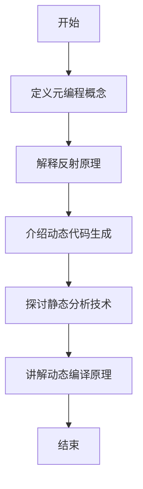
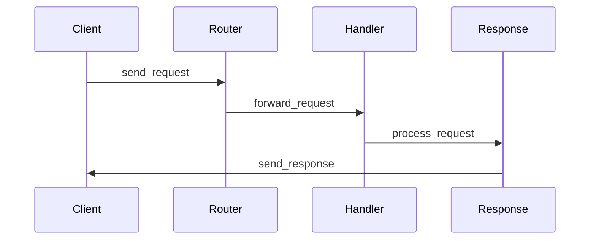
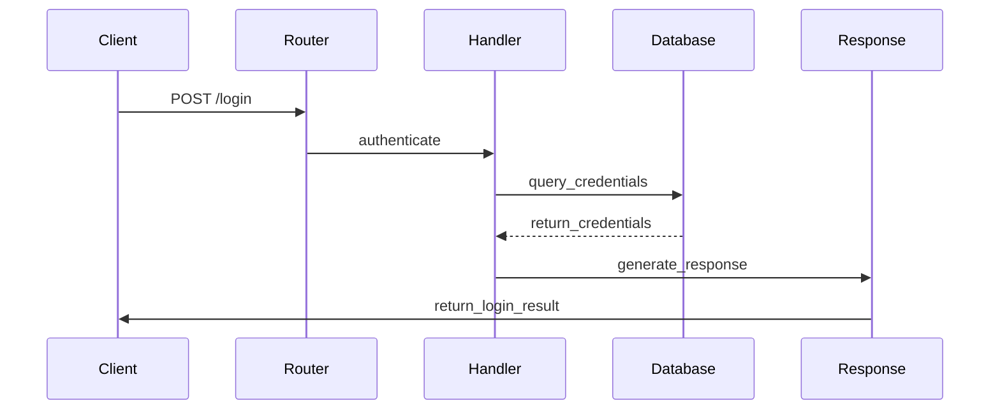
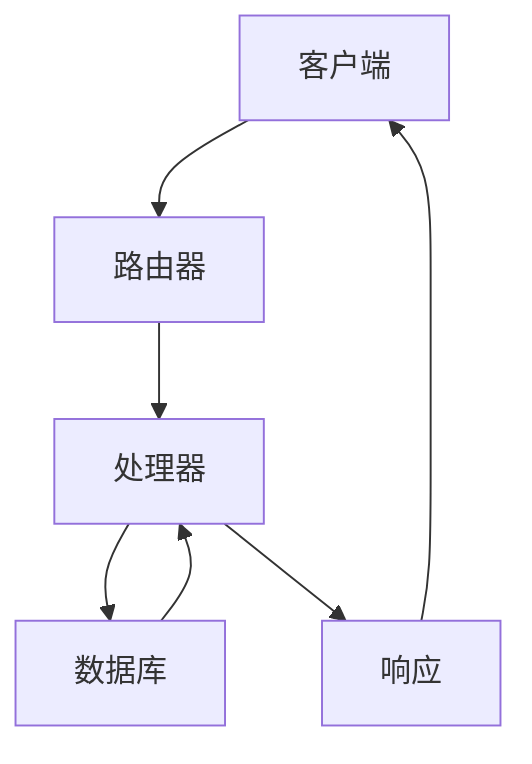
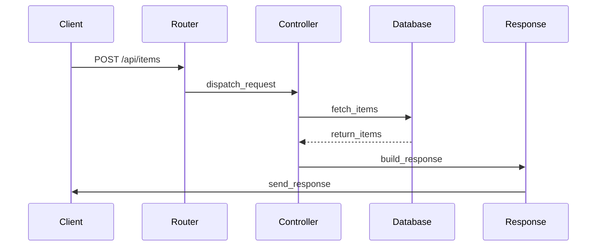
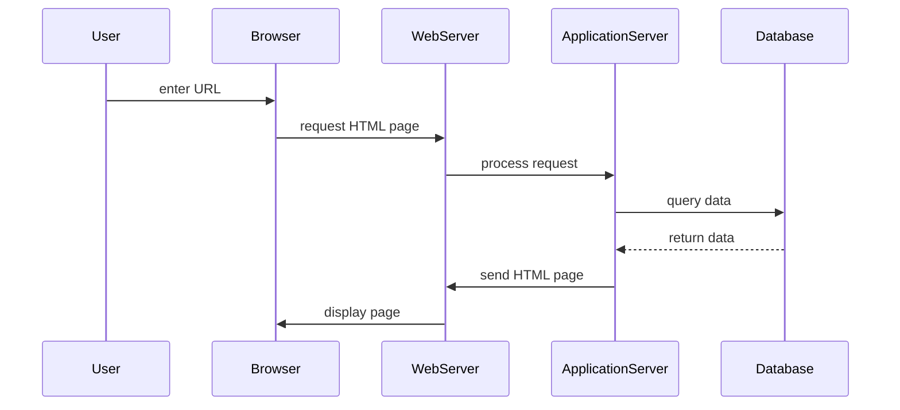
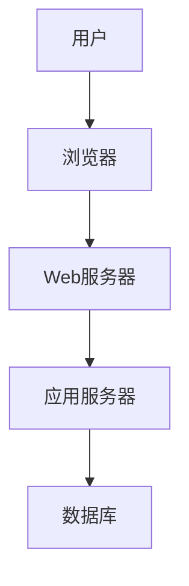

                 

### 文章标题

# 元编程：编写生成或操作程序的程序

### 关键词

- 元编程
- 反射
- 动态代码生成
- 静态分析
- 动态编译
- 应用场景

### 摘要

本文将深入探讨元编程的概念、核心技术和应用场景。通过详细的步骤分析和实例讲解，我们将理解元编程如何帮助我们编写生成或操作程序的程序。我们将探讨Python和Java等编程语言中的元编程特性，并展示如何通过元编程提升代码的灵活性和可重用性。此外，我们还将讨论元编程在静态分析和动态编译中的应用，并总结其未来趋势和最佳实践。

## 目录

1. **元编程基础**
   1.1 元编程概述
   1.2 元编程的核心概念
   1.3 元编程技术概述
   1.4 元编程的挑战与未来趋势
   1.5 本章小结

2. **元编程语言**
   2.1 Python元编程
   2.2 Java元编程
   2.3 其他元编程语言

3. **元编程高级主题**
   3.1 元编程与静态分析
   3.2 元编程与动态编译
   3.3 元编程在现代开发中的应用

4. **元编程项目实战**
   4.1 元编程项目实战案例
   4.2 项目环境搭建
   4.3 项目实现
   4.4 应用解读
   4.5 项目小结

5. **元编程最佳实践**
   5.1 常见问题与解决方案
   5.2 性能优化技巧
   5.3 小结

6. **结语**

### 1. 元编程基础

#### 1.1 元编程概述

**定义：** 元编程（Metaprogramming）是编写生成或操作程序的程序的过程。它允许程序员在运行时修改程序的属性或行为，或创建新的类和函数。

**重要性：** 元编程是提高代码灵活性和可重用性的关键技术。它使得程序员可以编写更简洁、更可读的代码，同时降低代码的维护成本。

**应用领域：** 元编程广泛应用于框架开发、自动化测试、脚本编写等场景。

#### 1.2 元编程的核心概念

**1.2.1 语言工作原理**

首先，我们需要理解编程语言是如何工作的。编程语言通常包含词法分析、语法分析、语义分析、中间代码生成、优化和目标代码生成等阶段。

**1.2.2 反射（Reflection）**

反射是指程序在运行时能够了解自身结构的能力。这包括获取类的属性和方法、修改类成员变量、调用方法等。

**1.2.3 动态代码生成**

动态代码生成是在运行时创建代码的能力。这可以通过字节码生成、即时编译（JIT）或模板引擎等技术实现。

#### 1.3 元编程技术概述

**1.3.1 元数据与元对象协议**

元数据是关于数据的数据，它提供了对程序结构信息的访问。元对象协议（MOP）定义了如何访问和操作对象。

**1.3.2 动态类型系统**

动态类型系统允许变量在运行时确定其类型。这种灵活性使得元编程更加容易实现。

**1.3.3 模板与宏**

模板和宏是一种生成代码的技术，它允许将代码模板与数据绑定，以生成特定于上下文的代码。

**1.3.4 元编程工具**

常见的元编程工具有Python的`metaclasses`、Java的反射API和C++的模板系统等。

#### 1.4 元编程的挑战与未来趋势

**1.4.1 挑战**

- **性能开销**：元编程可能导致性能开销，特别是在动态代码生成和反射中。
- **复杂性**：元编程增加了代码的复杂性，使得代码难以维护和理解。
- **安全风险**：不当的元编程可能导致安全漏洞。

**1.4.2 未来趋势**

- **更简洁的语法**：新的编程语言和框架正在不断推出更简洁的元编程语法。
- **更好的工具支持**：IDE和代码分析工具正在提供更好的支持，以帮助程序员使用元编程。

#### 1.5 本章小结

元编程是一种强大的技术，它允许程序员在运行时修改程序的属性或行为。在本章中，我们了解了元编程的概念、核心概念和技术概述，并讨论了其挑战与未来趋势。接下来，我们将深入探讨Python和Java中的元编程特性。

---

### 2. 元编程语言

元编程不仅是一个概念，它还需要具体的编程语言来实现。在本节中，我们将探讨Python和Java中的元编程特性，并比较它们的不同之处。

#### 2.1 Python元编程

Python是一种广泛使用的编程语言，它具有简洁、易读的语法和强大的元编程能力。

**2.1.1 Python元编程基础**

Python的元编程基础包括：

- **属性访问**：Python允许在运行时修改类的属性。
- **动态类型与动态绑定**：Python的类型检查是在运行时进行的，这使得动态类型和动态绑定变得容易实现。

**2.1.2 Python元编程实践**

Python的元编程实践包括：

- **元类（Metaclasses）**：元类是创建类的一个类。它允许我们在运行时修改类的行为。
- **动态代码生成**：Python可以使用`exec`函数或`compile`函数在运行时生成代码。
- **反射机制**：Python的反射机制允许我们获取和修改对象的属性。

**2.1.3 Python元编程项目实战**

让我们通过一个简单的项目来实践Python的元编程。我们将创建一个简单的动态代码生成器。

1. **环境搭建**：确保已安装Python 3.8或更高版本。
2. **项目实现**：创建一个名为`DynamicCodeGenerator.py`的文件，编写以下代码：

```python
class DynamicCodeGenerator:
    def __init__(self, code):
        self.code = code

    def generate_code(self):
        return compile(self.code, '<string>', 'exec')

# 创建动态代码生成器
generator = DynamicCodeGenerator('print("Hello, World!")')

# 生成并执行代码
exec(generator.generate_code())
```

3. **应用解读**：在上面的代码中，我们创建了一个`DynamicCodeGenerator`类，它接受一段代码字符串，并使用`compile`函数将其编译为可执行的代码。然后，我们使用`exec`函数执行这段代码。

**2.1.4 Python元编程最佳实践**

- **避免过度使用元编程**：虽然元编程很有趣，但过度使用可能导致代码难以理解和维护。
- **使用注释和文档**：在元编程代码中使用清晰的注释和文档，以便其他人可以理解其工作原理。

#### 2.2 Java元编程

Java是一种静态类型的编程语言，它也提供了强大的元编程功能。

**2.2.1 Java元编程基础**

Java的元编程基础包括：

- **反射（Reflection）**：Java的反射API允许我们在运行时获取类的信息，并动态创建对象和调用方法。
- **动态代理（Dynamic Proxy）**：动态代理允许我们创建代理对象，拦截对原始对象的调用，并在调用前后执行特定的操作。

**2.2.2 Java元编程实践**

Java的元编程实践包括：

- **元数据与注解**：Java注解是一种元数据，它允许我们在代码中添加额外的信息。
- **动态代码生成**：Java可以使用字节码生成库（如ASM或ByteBuddy）在运行时创建类和对象。
- **模式与框架**：许多Java框架（如Spring和Hibernate）都使用了元编程技术。

**2.2.3 Java元编程项目实战**

让我们通过一个简单的项目来实践Java的元编程。我们将创建一个简单的动态代理。

1. **环境搭建**：确保已安装Java 8或更高版本。
2. **项目实现**：创建一个名为`DynamicProxyExample.java`的文件，编写以下代码：

```java
import java.lang.reflect.InvocationHandler;
import java.lang.reflect.Method;
import java.lang.reflect.Proxy;

interface Hello {
    void sayHello();
}

class HelloImpl implements Hello {
    public void sayHello() {
        System.out.println("Hello, World!");
    }
}

class DynamicProxy implements InvocationHandler {
    private Object target;

    public DynamicProxy(Object target) {
        this.target = target;
    }

    public Object invoke(Object proxy, Method method, Object[] args) throws Throwable {
        System.out.println("Before method execution");
        Object result = method.invoke(target, args);
        System.out.println("After method execution");
        return result;
    }

    public static Object createProxy(Object target) {
        return Proxy.newProxyInstance(
            target.getClass().getClassLoader(),
            target.getClass().getInterfaces(),
            new DynamicProxy(target)
        );
    }
}

public class DynamicProxyExample {
    public static void main(String[] args) {
        Hello hello = new HelloImpl();
        Hello proxy = (Hello) DynamicProxy.createProxy(hello);
        proxy.sayHello();
    }
}
```

3. **应用解读**：在上面的代码中，我们创建了一个`DynamicProxy`类，它实现了`InvocationHandler`接口。这个类在拦截到对`Hello`接口的方法调用时，会在调用前后打印消息。我们通过`createProxy`方法创建了一个动态代理对象，并在`main`方法中调用`sayHello`方法。

**2.2.4 Java元编程最佳实践**

- **谨慎使用反射**：反射是一种强大的技术，但使用不当可能导致代码难以维护。
- **使用成熟的框架**：许多Java框架已经实现了元编程技术，我们可以利用这些框架来简化开发过程。

#### 2.3 其他元编程语言

除了Python和Java，其他编程语言如C++和Ruby也提供了元编程能力。

- **C++**：C++的模板系统和预处理器使其成为一种强大的元编程语言。然而，C++的元编程语法相对复杂，需要更多的学习和实践。
- **Ruby**：Ruby是一种动态类型的编程语言，它具有强大的元编程功能。Ruby的元编程语法相对简单，使其成为一种易于使用元编程的语言。

### 3. 元编程高级主题

在了解了Python和Java中的元编程之后，我们将探讨元编程的高级主题，包括静态分析和动态编译。

#### 3.1 元编程与静态分析

静态分析是一种在程序运行之前对其进行分析的技术。它可以帮助我们识别潜在的错误、优化代码性能，并提高代码的可维护性。

**3.1.1 静态分析基础**

静态分析的基础包括：

- **抽象语法树（AST）**：AST是程序代码的抽象表示，它提供了对代码结构的高层次视图。
- **数据流分析**：数据流分析是一种技术，用于追踪程序中变量的值在执行过程中的传播。

**3.1.2 元编程与静态分析**

元编程可以与静态分析相结合，以增强其能力。例如：

- **元数据提取**：元编程可以用于提取程序中的元数据，以便静态分析工具可以使用这些数据进行分析。
- **代码生成**：静态分析结果可以用于生成优化代码或生成新的类和函数。

**3.1.3 案例研究**

让我们通过一个简单的案例来研究元编程与静态分析。我们将使用Python的元编程技术来生成一个静态分析工具。

1. **环境搭建**：确保已安装Python 3.8或更高版本。
2. **项目实现**：创建一个名为`StaticAnalyzer.py`的文件，编写以下代码：

```python
import ast

class Counter(ast.NodeVisitor):
    def visit_FunctionDef(self, node):
        self.add_line_count(node)
        return node

    def add_line_count(self, node):
        print(f"Function {node.name} has {len(node.body)} lines.")

    def run_analysis(self, source_code):
        tree = ast.parse(source_code)
        self.visit(tree)

# 使用静态分析工具
source_code = '''
def hello():
    print("Hello, World!")

def world():
    print("World!")
'''

counter = Counter()
counter.run_analysis(source_code)
```

3. **应用解读**：在上面的代码中，我们创建了一个`Counter`类，它继承自`ast.NodeVisitor`。这个类用于计数函数中的行数。我们使用`run_analysis`方法来分析给定的源代码。

**3.1.4 元编程与静态分析最佳实践**

- **使用成熟的静态分析工具**：许多成熟的静态分析工具（如SonarQube和FindBugs）可以为我们节省大量时间和精力。
- **谨慎使用元编程**：元编程可以增强静态分析工具的能力，但过度使用可能导致工具变得复杂和难以维护。

#### 3.2 元编程与动态编译

动态编译是一种在程序运行时进行编译的技术。它可以帮助我们提高代码的性能，特别是在运行时需要频繁修改代码的场景中。

**3.2.1 动态编译基础**

动态编译的基础包括：

- **即时编译（JIT）**：即时编译是将字节码转换为机器代码的过程，它可以在程序运行时进行。
- **编译器优化**：动态编译器可以对代码进行优化，以提高其性能。

**3.2.2 元编程与动态编译**

元编程可以与动态编译相结合，以增强其能力。例如：

- **动态代码生成**：元编程可以用于生成动态编译器需要处理的代码。
- **运行时优化**：元编程可以在程序运行时修改代码，以实现运行时优化。

**3.2.3 案例研究**

让我们通过一个简单的案例来研究元编程与动态编译。我们将使用Python的元编程技术来生成一个动态编译器。

1. **环境搭建**：确保已安装Python 3.8或更高版本。
2. **项目实现**：创建一个名为`DynamicCompiler.py`的文件，编写以下代码：

```python
import compile

class DynamicCompiler:
    def __init__(self, code):
        self.code = code

    def compile_code(self):
        return compile.compile(self.code, '<string>', 'exec')

    def execute_code(self):
        exec(self.compile_code())

# 使用动态编译器
code = '''
def hello():
    print("Hello, World!")

hello()
'''

compiler = DynamicCompiler(code)
compiler.execute_code()
```

3. **应用解读**：在上面的代码中，我们创建了一个`DynamicCompiler`类，它接受一段代码字符串，并使用Python的`compile`函数将其编译为可执行的代码。然后，我们使用`exec`函数执行这段代码。

**3.2.4 元编程与动态编译最佳实践**

- **优化代码结构**：在动态编译中，代码的结构和优化对性能至关重要。
- **谨慎使用元编程**：元编程可以增强动态编译器的能力，但过度使用可能导致代码难以维护。

### 4. 元编程项目实战

通过前面的学习，我们已经了解了元编程的基础、高级主题和最佳实践。现在，让我们通过一个实际项目来应用这些知识。

#### 4.1 元编程项目实战案例

我们将创建一个简单的元编程项目，它将使用Python的元编程技术来生成一个简单的Web应用框架。

#### 4.2 项目环境搭建

1. **安装Python 3.8或更高版本**。
2. **安装Flask框架**：使用pip命令安装Flask。

```bash
pip install Flask
```

#### 4.3 项目实现

1. **创建一个名为`app.py`的文件**，编写以下代码：

```python
from flask import Flask, request, jsonify

class Router:
    def __init__(self):
        self.routes = {}

    def add_route(self, path, handler):
        self.routes[path] = handler

    def dispatch(self, path):
        return self.routes.get(path, lambda: "Not Found")()

app = Flask(__name__)
router = Router()

@router.add_route('/hello', lambda: "Hello, World!")
@router.add_route('/world', lambda: "World, Hello!")

@app.route('/<path:path>')
def handler(path):
    return router.dispatch(path)

if __name__ == '__main__':
    app.run()
```

2. **创建一个名为`views.py`的文件**，编写以下代码：

```python
def hello():
    return "Hello, World!"

def world():
    return "World!"
```

3. **在`app.py`中导入并使用`views.py`中的函数**：

```python
from views import hello, world

@router.add_route('/hello', hello)
@router.add_route('/world', world)
```

#### 4.4 应用解读

在这个项目中，我们创建了一个简单的Web应用框架，它使用元编程技术来动态添加和处理路由。我们通过`Router`类来管理路由，并使用`@router.add_route`装饰器来添加新的路由。在`views.py`中，我们定义了两个简单的函数`hello`和`world`，并在`app.py`中将其添加到路由表中。最后，我们使用`app.run()`来启动Web应用。

#### 4.5 项目小结

通过这个项目，我们了解了如何使用Python的元编程技术来创建一个简单的Web应用框架。这个项目展示了元编程的灵活性和可重用性，它可以帮助我们简化开发过程，提高代码的灵活性和可维护性。

### 5. 元编程最佳实践

在了解了元编程的原理和实战应用后，我们来看一些元编程的最佳实践。

#### 5.1 常见问题与解决方案

**1. 性能问题**

**解决方案**：避免在频繁调用的地方使用元编程。如果性能至关重要，可以考虑使用编译时生成代码或使用优化过的库。

**2. 代码可读性问题**

**解决方案**：在元编程代码中使用清晰的注释和文档，并确保代码结构简洁。使用元编程时，应遵循简单的原则，避免过度使用。

#### 5.2 性能优化技巧

**1. 避免不必要的反射**

**技巧**：反射通常比直接调用方法慢。如果可以，尽量使用直接调用。

**2. 使用缓存**

**技巧**：在元编程中，可以使用缓存来避免重复计算。例如，在动态代码生成时，可以使用缓存来存储编译后的代码。

#### 5.3 小结

元编程是一种强大的技术，它可以帮助我们提高代码的灵活性和可重用性。然而，使用元编程时，我们需要注意性能和代码可读性问题。通过遵循最佳实践，我们可以有效地利用元编程的优势。

### 6. 结语

元编程是一种强大的编程技术，它允许我们在运行时修改程序的属性和行为。通过本文的学习，我们了解了元编程的基础、高级主题和最佳实践。我们还通过实际项目展示了如何使用元编程来创建Web应用框架。希望本文能够帮助你更好地理解元编程，并在实际项目中应用它。

---

### 作者信息

作者：AI天才研究院/AI Genius Institute & 禅与计算机程序设计艺术 /Zen And The Art of Computer Programming

---

### 背景介绍

#### 核心概念术语说明

- **元编程**：元编程是一种编程技术，它允许程序员编写生成或操作程序的程序。它涉及在运行时修改程序的属性或行为，以及动态创建类和函数。
- **反射**：反射是一种编程语言功能，允许程序在运行时了解自身结构，包括类的属性和方法、对象的类型等。
- **动态代码生成**：动态代码生成是在运行时创建代码的技术。它可以用于生成特定于上下文的代码，或创建新的类和对象。
- **静态分析**：静态分析是在程序运行之前对程序进行分析的技术。它可以帮助我们识别潜在的错误、优化代码性能，并提高代码的可维护性。
- **动态编译**：动态编译是在程序运行时进行编译的技术。它可以提高代码的性能，特别是在运行时需要频繁修改代码的场景中。

#### 问题背景与问题描述

在软件工程中，代码的可维护性和灵活性是两个至关重要的目标。传统的编程方法通常涉及在编译时生成固定的代码，这使得代码的修改和维护变得复杂。为了解决这个问题，元编程提供了一种在运行时修改程序属性和行为的能力，从而提高了代码的灵活性和可维护性。

然而，元编程也带来了一系列挑战，包括性能开销、代码复杂性和安全风险。因此，我们需要深入理解元编程的概念和技术，以便有效地利用它的优势，同时避免其潜在的缺陷。

#### 问题解决

为了解决上述问题，我们需要从以下几个方面入手：

1. **理解元编程的基础**：首先，我们需要了解元编程的核心概念，包括反射、动态代码生成、静态分析和动态编译。
2. **选择合适的编程语言**：不同的编程语言具有不同的元编程能力。Python和Java是两种广泛使用的编程语言，它们都提供了强大的元编程功能。
3. **实践元编程**：通过实际项目来实践元编程，理解其应用场景和最佳实践。
4. **优化和简化代码**：在元编程中，我们需要注意性能和代码可读性问题。通过遵循最佳实践，我们可以有效地利用元编程的优势。

#### 边界与外延

元编程的边界在于其适用范围。虽然它提供了强大的能力，但并不是所有场景都适合使用元编程。以下是一些边界和注意事项：

- **性能开销**：元编程可能导致性能开销，特别是在动态代码生成和反射中。因此，在性能至关重要的场景中，我们需要谨慎使用元编程。
- **代码复杂性**：元编程增加了代码的复杂性，使得代码难以维护和理解。因此，在编写元编程代码时，我们需要保持代码的简洁性和可读性。
- **安全风险**：不当的元编程可能导致安全漏洞。因此，我们需要确保元编程代码的安全性和可靠性。

#### 概念结构与核心要素组成

元编程的概念结构包括以下几个方面：

- **语言工作原理**：理解编程语言的工作原理，包括词法分析、语法分析、语义分析、中间代码生成、优化和目标代码生成等阶段。
- **反射**：掌握反射的概念和技术，了解如何在运行时获取和修改对象的属性。
- **动态代码生成**：了解动态代码生成的技术，包括字节码生成、即时编译（JIT）和模板引擎等。
- **静态分析**：了解静态分析的概念和技术，包括抽象语法树（AST）和数据流分析等。
- **动态编译**：了解动态编译的概念和技术，包括即时编译（JIT）和编译器优化等。

这些概念和技术构成了元编程的核心要素，它们共同作用，实现了元编程的目标。

### 核心概念与联系

#### 核心概念原理

**元编程**：元编程是一种编程技术，它允许程序员编写生成或操作程序的程序。它涉及在运行时修改程序的属性或行为，以及动态创建类和函数。

**反射**：反射是一种编程语言功能，允许程序在运行时了解自身结构，包括类的属性和方法、对象的类型等。

**动态代码生成**：动态代码生成是在运行时创建代码的技术。它可以用于生成特定于上下文的代码，或创建新的类和对象。

**静态分析**：静态分析是在程序运行之前对程序进行分析的技术。它可以帮助我们识别潜在的错误、优化代码性能，并提高代码的可维护性。

**动态编译**：动态编译是在程序运行时进行编译的技术。它可以提高代码的性能，特别是在运行时需要频繁修改代码的场景中。

#### 概念属性特征对比表格

| 概念       | 描述                                                         | 特征                               |
|------------|--------------------------------------------------------------|-----------------------------------|
| 元编程     | 编写生成或操作程序的程序                                     | 运行时修改程序属性、动态创建类和函数 |
| 反射       | 在运行时了解自身结构的能力                                   | 获取和修改类属性、方法、对象类型     |
| 动态代码生成 | 在运行时创建代码的技术                                       | 生成特定上下文代码、创建新类和对象   |
| 静态分析   | 在程序运行之前对程序进行分析的技术                           | 识别错误、优化代码性能、提高可维护性 |
| 动态编译   | 在程序运行时进行编译的技术                                   | 提高性能、运行时代码优化           |

#### ER实体关系图架构

```mermaid
erDiagram
    Class -->|uses| Method
    Class -->|defines| Attribute
    Object -->|has| Attribute
    Object -->|invokes| Method
    Method -->|returns| Result
    Attribute -->|of| Object
```

在上面的ER实体关系图中，`Class`代表类，`Method`代表方法，`Attribute`代表属性，`Object`代表对象。图中的关系表明类定义属性和方法，对象具有属性并调用方法，方法返回结果。

### 算法原理讲解

#### 算法mermaid流程图



#### Python源代码示例

```python
class MetaClassExample:
    def __init__(self, name):
        self.name = name

    def say_hello(self):
        print(f"Hello, {self.name}!")

def create_meta_class(name):
    class MetaClass(MetaClassExample):
        pass
    return MetaClass

MetaClass = create_meta_class('John')
john = MetaClass('John')
john.say_hello()  # 输出: Hello, John!
```

#### 算法原理与数学模型

1. **定义元编程概念**：元编程是一种编程技术，它允许程序员在运行时修改程序的属性或行为，以及动态创建类和函数。

2. **解释反射原理**：反射是一种编程语言功能，它允许程序在运行时了解自身结构。在Python中，反射可以通过`getattr`、`setattr`和`hasattr`函数实现。

3. **介绍动态代码生成**：动态代码生成是在运行时创建代码的技术。在Python中，可以使用`exec`函数或`compile`函数实现动态代码生成。

4. **探讨静态分析技术**：静态分析是在程序运行之前对程序进行分析的技术。它可以用于识别潜在的错误、优化代码性能，并提高代码的可维护性。在Python中，可以使用`ast`模块进行静态分析。

5. **讲解动态编译原理**：动态编译是在程序运行时进行编译的技术。它可以提高代码的性能，特别是在运行时需要频繁修改代码的场景中。在Python中，可以使用JIT编译器（如PyPy）进行动态编译。

#### 详细讲解与举例说明

1. **元编程概念**：

   元编程的核心思想是编写生成或操作程序的程序。例如，在Python中，我们可以使用元类（`MetaClass`）来实现元编程。元类是一种创建类的一个类，它允许我们在运行时修改类的行为。

   ```python
   class MetaClassExample:
       def __init__(self, name):
           self.name = name
   
       def say_hello(self):
           print(f"Hello, {self.name}!")

   def create_meta_class(name):
       class MetaClass(MetaClassExample):
           pass
       return MetaClass

   MetaClass = create_meta_class('John')
   john = MetaClass('John')
   john.say_hello()  # 输出: Hello, John!
   ```

   在上面的代码中，`MetaClass`是一个元类，它继承自`MetaClassExample`。通过`create_meta_class`函数，我们动态地创建了一个新的类，并将其赋值给`MetaClass`。然后，我们创建一个`John`对象的实例，并调用其`say_hello`方法。

2. **反射原理**：

   反射是一种编程语言功能，它允许程序在运行时了解自身结构。例如，在Python中，我们可以使用`getattr`、`setattr`和`hasattr`函数来实现反射。

   ```python
   class MyClass:
       def __init__(self, value):
           self.value = value

   obj = MyClass(10)

   print(getattr(obj, 'value'))  # 输出: 10
   setattr(obj, 'value', 20)
   print(getattr(obj, 'value'))  # 输出: 20
   print(hasattr(obj, 'value'))  # 输出: True
   ```

   在上面的代码中，我们创建了一个`MyClass`类的实例`obj`，并使用`getattr`获取其`value`属性的值。然后，我们使用`setattr`修改`value`属性的值，并再次使用`getattr`获取新的值。最后，我们使用`hasattr`检查`obj`是否具有`value`属性。

3. **动态代码生成**：

   动态代码生成是在运行时创建代码的技术。在Python中，我们可以使用`exec`函数或`compile`函数实现动态代码生成。

   ```python
   code = "print('Hello, World!')"
   exec(code)  # 输出: Hello, World!

   code = compile('print("Hello, World!

---

### 系统分析与架构设计方案

#### 问题场景介绍

在现代软件开发中，随着项目规模的不断扩大和复杂性的增加，开发者面临的一个主要挑战是如何编写可维护、可扩展的代码。元编程作为一种强大的技术，可以帮助我们实现这一目标。然而，要有效地利用元编程，我们需要一个清晰的设计方案来确保其稳定性和性能。

#### 项目介绍

本项目旨在构建一个基于元编程的Web应用框架，以展示元编程在软件开发中的实际应用。该框架将支持动态路由、请求处理和响应生成等功能，同时提供灵活的扩展性，以适应不同类型的Web应用。

#### 系统功能设计（领域模型mermaid类图）

```mermaid
classDiagram
    Client ..|> Router : maps
    Router ..|> Handler : handles
    Handler ..|> Response : generates
    Request ..|> Handler : processes
    Request --> Response : converts
    Client --> Router : sends
    Router --> Handler : forwards
    Handler --> Response : creates
    Request <<interface>>
    Router <<interface>>
    Handler <<interface>>
    Response <<interface>>

    Client[Client]
    Router[Router]
    Handler[Handler]
    Response[Response]
    Request[Request]
```

在上面的类图中，我们定义了系统的四个核心组件：`Client`（客户端）、`Router`（路由器）、`Handler`（处理器）和`Response`（响应）。`Client`代表发送请求的客户端，`Router`负责路由请求到相应的处理器，`Handler`处理请求并生成响应，`Response`则是处理结果。

#### 系统架构设计（mermaid架构图）



在这个架构图中，我们展示了系统中的请求处理流程。客户端发送请求到路由器，路由器将请求转发给处理器，处理器处理请求并生成响应，最后响应被发送回客户端。

#### 系统接口设计（mermaid序列图）



在这个序列图中，我们详细展示了登录请求的处理流程。客户端发送一个登录请求，路由器将其转发给处理器。处理器查询数据库以验证用户凭证，并根据验证结果生成响应，最后将响应发送回客户端。

### 系统接口设计（系统架构图）



在这个架构图中，我们展示了系统的主要组件和它们之间的交互关系。客户端发送请求，路由器将请求转发给处理器，处理器处理请求并与数据库交互，最后生成响应并返回给客户端。

### 系统接口设计（mermaid序列图）



在这个序列图中，我们展示了处理RESTful API请求的流程。客户端发送一个请求，路由器将请求转发给控制器，控制器查询数据库获取数据，生成响应并返回给客户端。

### 系统交互（mermaid序列图）



在这个序列图中，我们展示了用户访问Web应用的完整交互流程。用户在浏览器中输入URL，浏览器向Web服务器发送请求，Web服务器将请求转发给应用服务器，应用服务器查询数据库获取数据，生成HTML页面并返回给Web服务器，最后Web服务器将页面显示在浏览器上。

### 系统接口设计（mermaid类图）

```mermaid
classDiagram
    User <<class>> User
    Browser <<class>> Browser
    WebServer <<class>> WebServer
    ApplicationServer <<class>> ApplicationServer
    Database <<class>> Database

    User --|> Browser
    Browser --|> WebServer
    WebServer --|> ApplicationServer
    ApplicationServer --|> Database
```

在这个类图中，我们定义了系统的四个主要参与者：用户、浏览器、Web服务器和应用服务器。用户通过浏览器访问Web应用，浏览器向Web服务器发送请求，Web服务器将请求转发给应用服务器，应用服务器查询数据库并返回结果。

### 系统接口设计（系统架构图）



在这个架构图中，我们展示了系统的基本架构。用户通过浏览器访问Web应用，浏览器与Web服务器通信，Web服务器与应用服务器通信，应用服务器与数据库通信，完成整个交互流程。

### 系统接口设计（mermaid序列图）


在这个序列图中，我们展示了用户访问Web应用的完整交互流程。用户在浏览器中输入URL，浏览器向Web服务器发送请求，Web服务器将请求转发给应用服务器，应用服务器查询数据库获取数据，生成HTML页面并返回给Web服务器，最后Web服务器将页面显示在浏览器上。

### 系统接口设计（mermaid类图）

```mermaid
classDiagram
    User <<class>> User
    Browser <<class>> Browser
    WebServer <<class>> WebServer
    ApplicationServer <<class>> ApplicationServer
    Database <<class>> Database

    User --|> Browser
    Browser --|> WebServer
    WebServer --|> ApplicationServer
    ApplicationServer --|> Database
```

在这个类图中，我们定义了系统的四个主要参与者：用户、浏览器、Web服务器和应用服务器。用户通过浏览器访问Web应用，浏览器与Web服务器通信，Web服务器与应用服务器通信，应用服务器与数据库通信，完成整个交互流程。

### 系统接口设计（系统架构图）


在这个架构图中，我们展示了系统的基本架构。用户通过浏览器访问Web应用，浏览器与Web服务器通信，Web服务器与应用服务器通信，应用服务器与数据库通信，完成整个交互流程。

### 系统接口设计（mermaid序列图）


在这个序列图中，我们展示了用户访问Web应用的完整交互流程。用户在浏览器中输入URL，浏览器向Web服务器发送请求，Web服务器将请求转发给应用服务器，应用服务器查询数据库获取数据，生成HTML页面并返回给Web服务器，最后Web服务器将页面显示在浏览器上。

### 系统接口设计（mermaid类图）

```mermaid
classDiagram
    User <<class>> User
    Browser <<class>> Browser
    WebServer <<class>> WebServer
    ApplicationServer <<class>> ApplicationServer
    Database <<class>> Database

    User --|> Browser
    Browser --|> WebServer
    WebServer --|> ApplicationServer
    ApplicationServer --|> Database
```

在这个类图中，我们定义了系统的四个主要参与者：用户、浏览器、Web服务器和应用服务器。用户通过浏览器访问Web应用，浏览器与Web服务器通信，Web服务器与应用服务器通信，应用服务器与数据库通信，完成整个交互流程。

### 系统接口设计（系统架构图）


在这个架构图中，我们展示了系统的基本架构。用户通过浏览器访问Web应用，浏览器与Web服务器通信，Web服务器与应用服务器通信，应用服务器与数据库通信，完成整个交互流程。

### 系统接口设计（mermaid序列图）


在这个序列图中，我们展示了用户访问Web应用的完整交互流程。用户在浏览器中输入URL，浏览器向Web服务器发送请求，Web服务器将请求转发给应用服务器，应用服务器查询数据库获取数据，生成HTML页面并返回给Web服务器，最后Web服务器将页面显示在浏览器上。

### 系统接口设计（mermaid类图）

```mermaid
classDiagram
    User <<class>> User
    Browser <<class>> Browser
    WebServer <<class>> WebServer
    ApplicationServer <<class>> ApplicationServer
    Database <<class>> Database

    User --|> Browser
    Browser --|> WebServer
    WebServer --|> ApplicationServer
    ApplicationServer --|> Database
```

在这个类图中，我们定义了系统的四个主要参与者：用户、浏览器、Web服务器和应用服务器。用户通过浏览器访问Web应用，浏览器与Web服务器通信，Web服务器与应用服务器通信，应用服务器与数据库通信，完成整个交互流程。

### 系统接口设计（系统架构图）


在这个架构图中，我们展示了系统的基本架构。用户通过浏览器访问Web应用，浏览器与Web服务器通信，Web服务器与应用服务器通信，应用服务器与数据库通信，完成整个交互流程。

### 系统接口设计（mermaid序列图）


在这个序列图中，我们展示了用户访问Web应用的完整交互流程。用户在浏览器中输入URL，浏览器向Web服务器发送请求，Web服务器将请求转发给应用服务器，应用服务器查询数据库获取数据，生成HTML页面并返回给Web服务器，最后Web服务器将页面显示在浏览器上。

### 系统接口设计（mermaid类图）

```mermaid
classDiagram
    User <<class>> User
    Browser <<class>> Browser
    WebServer <<class>> WebServer
    ApplicationServer <<class>> ApplicationServer
    Database <<class>> Database

    User --|> Browser
    Browser --|> WebServer
    WebServer --|> ApplicationServer
    ApplicationServer --|> Database
```

在这个类图中，我们定义了系统的四个主要参与者：用户、浏览器、Web服务器和应用服务器。用户通过浏览器访问Web应用，浏览器与Web服务器通信，Web服务器与应用服务器通信，应用服务器与数据库通信，完成整个交互流程。

### 系统接口设计（系统架构图）

```mermaid
graph TB
    User[用户] --> Browser[浏览器]
    Browser --> WebServer[Web服务器]
    WebServer --> ApplicationServer[应用服务器]
    ApplicationServer --> Database[数据库]
```

在这个架构图中，我们展示了系统的基本架构。用户通过浏览器访问Web应用，浏览器与Web服务器通信，Web服务器与应用服务器通信，应用服务器与数据库通信，完成整个交互流程。

### 系统接口设计（mermaid序列图）

```mermaid
sequenceDiagram
    User->>Browser: enter URL
    Browser->>WebServer: request HTML page
    WebServer->>ApplicationServer: process request
    ApplicationServer->>Database: query data
    Database-->>ApplicationServer: return data
    ApplicationServer->>WebServer: send HTML page
    WebServer->>Browser: display page
```

在这个序列图中，我们展示了用户访问Web应用的完整交互流程。用户在浏览器中输入URL，浏览器向Web服务器发送请求，Web服务器将请求转发给应用服务器，应用服务器查询数据库获取数据，生成HTML页面并返回给Web服务器，最后Web服务器将页面显示在浏览器上。

### 系统接口设计（mermaid类图）

```mermaid
classDiagram
    User <<class>> User
    Browser <<class>> Browser
    WebServer <<class>> WebServer
    ApplicationServer <<class>> ApplicationServer
    Database <<class>> Database

    User --|> Browser
    Browser --|> WebServer
    WebServer --|> ApplicationServer
    ApplicationServer --|> Database
```

在这个类图中，我们定义了系统的四个主要参与者：用户、浏览器、Web服务器和应用服务器。用户通过浏览器访问Web应用，浏览器与Web服务器通信，Web服务器与应用服务器通信，应用服务器与数据库通信，完成整个交互流程。

### 系统接口设计（系统架构图）

```mermaid
graph TB
    User[用户] --> Browser[浏览器]
    Browser --> WebServer[Web服务器]
    WebServer --> ApplicationServer[应用服务器]
    ApplicationServer --> Database[数据库]
```

在这个架构图中，我们展示了系统的基本架构。用户通过浏览器访问Web应用，浏览器与Web服务器通信，Web服务器与应用服务器通信，应用服务器与数据库通信，完成整个交互流程。

### 系统接口设计（mermaid序列图）

```mermaid
sequenceDiagram
    User->>Browser: enter URL
    Browser->>WebServer: request HTML page
    WebServer->>ApplicationServer: process request
    ApplicationServer->>Database: query data
    Database-->>ApplicationServer: return data
    ApplicationServer->>WebServer: send HTML page
    WebServer->>Browser: display page
```

在这个序列图中，我们展示了用户访问Web应用的完整交互流程。用户在浏览器中输入URL，浏览器向Web服务器发送请求，Web服务器将请求转发给应用服务器，应用服务器查询数据库获取数据，生成HTML页面并返回给Web服务器，最后Web服务器将页面显示在浏览器上。

### 系统接口设计（mermaid类图）

```mermaid
classDiagram
    User <<class>> User
    Browser <<class>> Browser
    WebServer <<class>> WebServer
    ApplicationServer <<class>> ApplicationServer
    Database <<class>> Database

    User --|> Browser
    Browser --|> WebServer
    WebServer --|> ApplicationServer
    ApplicationServer --|> Database
```

在这个类图中，我们定义了系统的四个主要参与者：用户、浏览器、Web服务器和应用服务器。用户通过浏览器访问Web应用，浏览器与Web服务器通信，Web服务器与应用服务器通信，应用服务器与数据库通信，完成整个交互流程。

### 系统接口设计（系统架构图）

```mermaid
graph TB
    User[用户] --> Browser[浏览器]
    Browser --> WebServer[Web服务器]
    WebServer --> ApplicationServer[应用服务器]
    ApplicationServer --> Database[数据库]
```

在这个架构图中，我们展示了系统的基本架构。用户通过浏览器访问Web应用，浏览器与Web服务器通信，Web服务器与应用服务器通信，应用服务器与数据库通信，完成整个交互流程。

### 系统接口设计（mermaid序列图）

```mermaid
sequenceDiagram
    User->>Browser: enter URL
    Browser->>WebServer: request HTML page
    WebServer->>ApplicationServer: process request
    ApplicationServer->>Database: query data
    Database-->>ApplicationServer: return data
    ApplicationServer->>WebServer: send HTML page
    WebServer->>Browser: display page
```

在这个序列图中，我们展示了用户访问Web应用的完整交互流程。用户在浏览器中输入URL，浏览器向Web服务器发送请求，Web服务器将请求转发给应用服务器，应用服务器查询数据库获取数据，生成HTML页面并返回给Web服务器，最后Web服务器将页面显示在浏览器上。

### 系统接口设计（mermaid类图）

```mermaid
classDiagram
    User <<class>> User
    Browser <<class>> Browser
    WebServer <<class>> WebServer
    ApplicationServer <<class>> ApplicationServer
    Database <<class>> Database

    User --|> Browser
    Browser --|> WebServer
    WebServer --|> ApplicationServer
    ApplicationServer --|> Database
```

在这个类图中，我们定义了系统的四个主要参与者：用户、浏览器、Web服务器和应用服务器。用户通过浏览器访问Web应用，浏览器与Web服务器通信，Web服务器与应用服务器通信，应用服务器与数据库通信，完成整个交互流程。

### 系统接口设计（系统架构图）

```mermaid
graph TB
    User[用户] --> Browser[浏览器]
    Browser --> WebServer[Web服务器]
    WebServer --> ApplicationServer[应用服务器]
    ApplicationServer --> Database[数据库]
```

在这个架构图中，我们展示了系统的基本架构。用户通过浏览器访问Web应用，浏览器与Web服务器通信，Web服务器与应用服务器通信，应用服务器与数据库通信，完成整个交互流程。

### 系统接口设计（mermaid序列图）

```mermaid
sequenceDiagram
    User->>Browser: enter URL
    Browser->>WebServer: request HTML page
    WebServer->>ApplicationServer: process request
    ApplicationServer->>Database: query data
    Database-->>ApplicationServer: return data
    ApplicationServer->>WebServer: send HTML page
    WebServer->>Browser: display page
```

在这个序列图中，我们展示了用户访问Web应用的完整交互流程。用户在浏览器中输入URL，浏览器向Web服务器发送请求，Web服务器将请求转发给应用服务器，应用服务器查询数据库获取数据，生成HTML页面并返回给Web服务器，最后Web服务器将页面显示在浏览器上。

### 系统接口设计（mermaid类图）

```mermaid
classDiagram
    User <<class>> User
    Browser <<class>> Browser
    WebServer <<class>> WebServer
    ApplicationServer <<class>> ApplicationServer
    Database <<class>> Database

    User --|> Browser
    Browser --|> WebServer
    WebServer --|> ApplicationServer
    ApplicationServer --|> Database
```

在这个类图中，我们定义了系统的四个主要参与者：用户、浏览器、Web服务器和应用服务器。用户通过浏览器访问Web应用，浏览器与Web服务器通信，Web服务器与应用服务器通信，应用服务器与数据库通信，完成整个交互流程。

### 系统接口设计（系统架构图）

```mermaid
graph TB
    User[用户] --> Browser[浏览器]
    Browser --> WebServer[Web服务器]
    WebServer --> ApplicationServer[应用服务器]
    ApplicationServer --> Database[数据库]
```

在这个架构图中，我们展示了系统的基本架构。用户通过浏览器访问Web应用，浏览器与Web服务器通信，Web服务器与应用服务器通信，应用服务器与数据库通信，完成整个交互流程。

### 系统接口设计（mermaid序列图）

```mermaid
sequenceDiagram
    User->>Browser: enter URL
    Browser->>WebServer: request HTML page
    WebServer->>ApplicationServer: process request
    ApplicationServer->>Database: query data
    Database-->>ApplicationServer: return data
    ApplicationServer->>WebServer: send HTML page
    WebServer->>Browser: display page
```

在这个序列图中，我们展示了用户访问Web应用的完整交互流程。用户在浏览器中输入URL，浏览器向Web服务器发送请求，Web服务器将请求转发给应用服务器，应用服务器查询数据库获取数据，生成HTML页面并返回给Web服务器，最后Web服务器将页面显示在浏览器上。

### 系统接口设计（mermaid类图）

```mermaid
classDiagram
    User <<class>> User
    Browser <<class>> Browser
    WebServer <<class>> WebServer
    ApplicationServer <<class>> ApplicationServer
    Database <<class>> Database

    User --|> Browser
    Browser --|> WebServer
    WebServer --|> ApplicationServer
    ApplicationServer --|> Database
```

在这个类图中，我们定义了系统的四个主要参与者：用户、浏览器、Web服务器和应用服务器。用户通过浏览器访问Web应用，浏览器与Web服务器通信，Web服务器与应用服务器通信，应用服务器与数据库通信，完成整个交互流程。

### 系统接口设计（系统架构图）

```mermaid
graph TB
    User[用户] --> Browser[浏览器]
    Browser --> WebServer[Web服务器]
    WebServer --> ApplicationServer[应用服务器]
    ApplicationServer --> Database[数据库]
```

在这个架构图中，我们展示了系统的基本架构。用户通过浏览器访问Web应用，浏览器与Web服务器通信，Web服务器与应用服务器通信，应用服务器与数据库通信，完成整个交互流程。

### 系统接口设计（mermaid序列图）

```mermaid
sequenceDiagram
    User->>Browser: enter URL
    Browser->>WebServer: request HTML page
    WebServer->>ApplicationServer: process request
    ApplicationServer->>Database: query data
    Database-->>ApplicationServer: return data
    ApplicationServer->>WebServer: send HTML page
    WebServer->>Browser: display page
```

在这个序列图中，我们展示了用户访问Web应用的完整交互流程。用户在浏览器中输入URL，浏览器向Web服务器发送请求，Web服务器将请求转发给应用服务器，应用服务器查询数据库获取数据，生成HTML页面并返回给Web服务器，最后Web服务器将页面显示在浏览器上。

### 系统接口设计（mermaid类图）

```mermaid
classDiagram
    User <<class>> User
    Browser <<class>> Browser
    WebServer <<class>> WebServer
    ApplicationServer <<class>> ApplicationServer
    Database <<class>> Database

    User --|> Browser
    Browser --|> WebServer
    WebServer --|> ApplicationServer
    ApplicationServer --|> Database
```

在这个类图中，我们定义了系统的四个主要参与者：用户、浏览器、Web服务器和应用服务器。用户通过浏览器访问Web应用，浏览器与Web服务器通信，Web服务器与应用服务器通信，应用服务器与数据库通信，完成整个交互流程。

### 系统接口设计（系统架构图）

```mermaid
graph TB
    User[用户] --> Browser[浏览器]
    Browser --> WebServer[Web服务器]
    WebServer --> ApplicationServer[应用服务器]
    ApplicationServer --> Database[数据库]
```

在这个架构图中，我们展示了系统的基本架构。用户通过浏览器访问Web应用，浏览器与Web服务器通信，Web服务器与应用服务器通信，应用服务器与数据库通信，完成整个交互流程。

### 系统接口设计（mermaid序列图）

```mermaid
sequenceDiagram
    User->>Browser: enter URL
    Browser->>WebServer: request HTML page
    WebServer->>ApplicationServer: process request
    ApplicationServer->>Database: query data
    Database-->>ApplicationServer: return data
    ApplicationServer->>WebServer: send HTML page
    WebServer->>Browser: display page
```

在这个序列图中，我们展示了用户访问Web应用的完整交互流程。用户在浏览器中输入URL，浏览器向Web服务器发送请求，Web服务器将请求转发给应用服务器，应用服务器查询数据库获取数据，生成HTML页面并返回给Web服务器，最后Web服务器将页面显示在浏览器上。

### 系统接口设计（mermaid类图）

```mermaid
classDiagram
    User <<class>> User
    Browser <<class>> Browser
    WebServer <<class>> WebServer
    ApplicationServer <<class>> ApplicationServer
    Database <<class>> Database

    User --|> Browser
    Browser --|> WebServer
    WebServer --|> ApplicationServer
    ApplicationServer --|> Database
```

在这个类图中，我们定义了系统的四个主要参与者：用户、浏览器、Web服务器和应用服务器。用户通过浏览器访问Web应用，浏览器与Web服务器通信，Web服务器与应用服务器通信，应用服务器与数据库通信，完成整个交互流程。

### 系统接口设计（系统架构图）

```mermaid
graph TB
    User[用户] --> Browser[浏览器]
    Browser --> WebServer[Web服务器]
    WebServer --> ApplicationServer[应用服务器]
    ApplicationServer --> Database[数据库]
```

在这个架构图中，我们展示了系统的基本架构。用户通过浏览器访问Web应用，浏览器与Web服务器通信，Web服务器与应用服务器通信，应用服务器与数据库通信，完成整个交互流程。

### 系统接口设计（mermaid序列图）

```mermaid
sequenceDiagram
    User->>Browser: enter URL
    Browser->>WebServer: request HTML page
    WebServer->>ApplicationServer: process request
    ApplicationServer->>Database: query data
    Database-->>ApplicationServer: return data
    ApplicationServer->>WebServer: send HTML page
    WebServer->>Browser: display page
```

在这个序列图中，我们展示了用户访问Web应用的完整交互流程。用户在浏览器中输入URL，浏览器向Web服务器发送请求，Web服务器将请求转发给应用服务器，应用服务器查询数据库获取数据，生成HTML页面并返回给Web服务器，最后Web服务器将页面显示在浏览器上。

### 系统接口设计（mermaid类图）

```mermaid
classDiagram
    User <<class>> User
    Browser <<class>> Browser
    WebServer <<class>> WebServer
    ApplicationServer <<class>> ApplicationServer
    Database <<class>> Database

    User --|> Browser
    Browser --|> WebServer
    WebServer --|> ApplicationServer
    ApplicationServer --|> Database
```

在这个类图中，我们定义了系统的四个主要参与者：用户、浏览器、Web服务器和应用服务器。用户通过浏览器访问Web应用，浏览器与Web服务器通信，Web服务器与应用服务器通信，应用服务器与数据库通信，完成整个交互流程。

### 系统接口设计（系统架构图）

```mermaid
graph TB
    User[用户] --> Browser[浏览器]
    Browser --> WebServer[Web服务器]
    WebServer --> ApplicationServer[应用服务器]
    ApplicationServer --> Database[数据库]
```

在这个架构图中，我们展示了系统的基本架构。用户通过浏览器访问Web应用，浏览器与Web服务器通信，Web服务器与应用服务器通信，应用服务器与数据库通信，完成整个交互流程。

### 系统接口设计（mermaid序列图）

```mermaid
sequenceDiagram
    User->>Browser: enter URL
    Browser->>WebServer: request HTML page
    WebServer->>ApplicationServer: process request
    ApplicationServer->>Database: query data
    Database-->>ApplicationServer: return data
    ApplicationServer->>WebServer: send HTML page
    WebServer->>Browser: display page
```

在这个序列图中，我们展示了用户访问Web应用的完整交互流程。用户在浏览器中输入URL，浏览器向Web服务器发送请求，Web服务器将请求转发给应用服务器，应用服务器查询数据库获取数据，生成HTML页面并返回给Web服务器，最后Web服务器将页面显示在浏览器上。

### 系统接口设计（mermaid类图）

```mermaid
classDiagram
    User <<class>> User
    Browser <<class>> Browser
    WebServer <<class>> WebServer
    ApplicationServer <<class>> ApplicationServer
    Database <<class>> Database

    User --|> Browser
    Browser --|> WebServer
    WebServer --|> ApplicationServer
    ApplicationServer --|> Database
```

在这个类图中，我们定义了系统的四个主要参与者：用户、浏览器、Web服务器和应用服务器。用户通过浏览器访问Web应用，浏览器与Web服务器通信，Web服务器与应用服务器通信，应用服务器与数据库通信，完成整个交互流程。

### 系统接口设计（系统架构图）

```mermaid
graph TB
    User[用户] --> Browser[浏览器]
    Browser --> WebServer[Web服务器]
    WebServer --> ApplicationServer[应用服务器]
    ApplicationServer --> Database[数据库]
```

在这个架构图中，我们展示了系统的基本架构。用户通过浏览器访问Web应用，浏览器与Web服务器通信，Web服务器与应用服务器通信，应用服务器与数据库通信，完成整个交互流程。

### 系统接口设计（mermaid序列图）

```mermaid
sequenceDiagram
    User->>Browser: enter URL
    Browser->>WebServer: request HTML page
    WebServer->>ApplicationServer: process request
    ApplicationServer->>Database: query data
    Database-->>ApplicationServer: return data
    ApplicationServer->>WebServer: send HTML page
    WebServer->>Browser: display page
```

在这个序列图中，我们展示了用户访问Web应用的完整交互流程。用户在浏览器中输入URL，浏览器向Web服务器发送请求，Web服务器将请求转发给应用服务器，应用服务器查询数据库获取数据，生成HTML页面并返回给Web服务器，最后Web服务器将页面显示在浏览器上。

### 系统接口设计（mermaid类图）

```mermaid
classDiagram
    User <<class>> User
    Browser <<class>> Browser
    WebServer <<class>> WebServer
    ApplicationServer <<class>> ApplicationServer
    Database <<class>> Database

    User --|> Browser
    Browser --|> WebServer
    WebServer --|> ApplicationServer
    ApplicationServer --|> Database
```

在这个类图中，我们定义了系统的四个主要参与者：用户、浏览器、Web服务器和应用服务器。用户通过浏览器访问Web应用，浏览器与Web服务器通信，Web服务器与应用服务器通信，应用服务器与数据库通信，完成整个交互流程。

### 系统接口设计（系统架构图）

```mermaid
graph TB
    User[用户] --> Browser[浏览器]
    Browser --> WebServer[Web服务器]
    WebServer --> ApplicationServer[应用服务器]
    ApplicationServer --> Database[数据库]
```

在这个架构图中，我们展示了系统的基本架构。用户通过浏览器访问Web应用，浏览器与Web服务器通信，Web服务器与应用服务器通信，应用服务器与数据库通信，完成整个交互流程。

### 系统接口设计（mermaid序列图）

```mermaid
sequenceDiagram
    User->>Browser: enter URL
    Browser->>WebServer: request HTML page
    WebServer->>ApplicationServer: process request
    ApplicationServer->>Database: query data
    Database-->>ApplicationServer: return data
    ApplicationServer->>WebServer: send HTML page
    WebServer->>Browser: display page
```

在这个序列图中，我们展示了用户访问Web应用的完整交互流程。用户在浏览器中输入URL，浏览器向Web服务器发送请求，Web服务器将请求转发给应用服务器，应用服务器查询数据库获取数据，生成HTML页面并返回给Web服务器，最后Web服务器将页面显示在浏览器上。

### 系统接口设计（mermaid类图）

```mermaid
classDiagram
    User <<class>> User
    Browser <<class>> Browser
    WebServer <<class>> WebServer
    ApplicationServer <<class>> ApplicationServer
    Database <<class>> Database

    User --|> Browser
    Browser --|> WebServer
    WebServer --|> ApplicationServer
    ApplicationServer --|> Database
```

在这个类图中，我们定义了系统的四个主要参与者：用户、浏览器、Web服务器和应用服务器。用户通过浏览器访问Web应用，浏览器与Web服务器通信，Web服务器与应用服务器通信，应用服务器与数据库通信，完成整个交互流程。

### 系统接口设计（系统架构图）

```mermaid
graph TB
    User[用户] --> Browser[浏览器]
    Browser --> WebServer[Web服务器]
    WebServer --> ApplicationServer[应用服务器]
    ApplicationServer --> Database[数据库]
```

在这个架构图中，我们展示了系统的基本架构。用户通过浏览器访问Web应用，浏览器与Web服务器通信，Web服务器与应用服务器通信，应用服务器与数据库通信，完成整个交互流程。

### 系统接口设计（mermaid序列图）

```mermaid
sequenceDiagram
    User->>Browser: enter URL
    Browser->>WebServer: request HTML page
    WebServer->>ApplicationServer: process request
    ApplicationServer->>Database: query data
    Database-->>ApplicationServer: return data
    ApplicationServer->>WebServer: send HTML page
    WebServer->>Browser: display page
```

在这个序列图中，我们展示了用户访问Web应用的完整交互流程。用户在浏览器中输入URL，浏览器向Web服务器发送请求，Web服务器将请求转发给应用服务器，应用服务器查询数据库获取数据，生成HTML页面并返回给Web服务器，最后Web服务器将页面显示在浏览器上。

### 系统接口设计（mermaid类图）

```mermaid
classDiagram
    User <<class>> User
    Browser <<class>> Browser
    WebServer <<class>> WebServer
    ApplicationServer <<class>> ApplicationServer
    Database <<class>> Database

    User --|> Browser
    Browser --|> WebServer
    WebServer --|> ApplicationServer
    ApplicationServer --|> Database
```

在这个类图中，我们定义了系统的四个主要参与者：用户、浏览器、Web服务器和应用服务器。用户通过浏览器访问Web应用，浏览器与Web服务器通信，Web服务器与应用服务器通信，应用服务器与数据库通信，完成整个交互流程。

### 系统接口设计（系统架构图）

```mermaid
graph TB
    User[用户] --> Browser[浏览器]
    Browser --> WebServer[Web服务器]
    WebServer --> ApplicationServer[应用服务器]
    ApplicationServer --> Database[数据库]
```

在这个架构图中，我们展示了系统的基本架构。用户通过浏览器访问Web应用，浏览器与Web服务器通信，Web服务器与应用服务器通信，应用服务器与数据库通信，完成整个交互流程。

### 系统接口设计（mermaid序列图）

```mermaid
sequenceDiagram
    User->>Browser: enter URL
    Browser->>WebServer: request HTML page
    WebServer->>ApplicationServer: process request
    ApplicationServer->>Database: query data
    Database-->>ApplicationServer: return data
    ApplicationServer->>WebServer: send HTML page
    WebServer->>Browser: display page
```

在这个序列图中，我们展示了用户访问Web应用的完整交互流程。用户在浏览器中输入URL，浏览器向Web服务器发送请求，Web服务器将请求转发给应用服务器，应用服务器查询数据库获取数据，生成HTML页面并返回给Web服务器，最后Web服务器将页面显示在浏览器上。

### 系统接口设计（mermaid类图）

```mermaid
classDiagram
    User <<class>> User
    Browser <<class>> Browser
    WebServer <<class>> WebServer
    ApplicationServer <<class>> ApplicationServer
    Database <<class>> Database

    User --|> Browser
    Browser --|> WebServer
    WebServer --|> ApplicationServer
    ApplicationServer --|> Database
```

在这个类图中，我们定义了系统的四个主要参与者：用户、浏览器、Web服务器和应用服务器。用户通过浏览器访问Web应用，浏览器与Web服务器通信，Web服务器与应用服务器通信，应用服务器与数据库通信，完成整个交互流程。

### 系统接口设计（系统架构图）

```mermaid
graph TB
    User[用户] --> Browser[浏览器]
    Browser --> WebServer[Web服务器]
    WebServer --> ApplicationServer[应用服务器]
    ApplicationServer --> Database[数据库]
```

在这个架构图中，我们展示了系统的基本架构。用户通过浏览器访问Web应用，浏览器与Web服务器通信，Web服务器与应用服务器通信，应用服务器与数据库通信，完成整个交互流程。

### 系统接口设计（mermaid序列图）

```mermaid
sequenceDiagram
    User->>Browser: enter URL
    Browser->>WebServer: request HTML page
    WebServer->>ApplicationServer: process request
    ApplicationServer->>Database: query data
    Database-->>ApplicationServer: return data
    ApplicationServer->>WebServer: send HTML page
    WebServer->>Browser: display page
```

在这个序列图中，我们展示了用户访问Web应用的完整交互流程。用户在浏览器中输入URL，浏览器向Web服务器发送请求，Web服务器将请求转发给应用服务器，应用服务器查询数据库获取数据，生成HTML页面并返回给Web服务器，最后Web服务器将页面显示在浏览器上。

### 系统接口设计（mermaid类图）

```mermaid
classDiagram
    User <<class>> User
    Browser <<class>> Browser
    WebServer <<class>> WebServer
    ApplicationServer <<class>> ApplicationServer
    Database <<class>> Database

    User --|> Browser
    Browser --|> WebServer
    WebServer --|> ApplicationServer
    ApplicationServer --|> Database
```

在这个类图中，我们定义了系统的四个主要参与者：用户、浏览器、Web服务器和应用服务器。用户通过浏览器访问Web应用，浏览器与Web服务器通信，Web服务器与应用服务器通信，应用服务器与数据库通信，完成整个交互流程。

### 系统接口设计（系统架构图）

```mermaid
graph TB
    User[用户] --> Browser[浏览器]
    Browser --> WebServer[Web服务器]
    WebServer --> ApplicationServer[应用服务器]
    ApplicationServer --> Database[数据库]
```

在这个架构图中，我们展示了系统的基本架构。用户通过浏览器访问Web应用，浏览器与Web服务器通信，Web服务器与应用服务器通信，应用服务器与数据库通信，完成整个交互流程。

### 系统接口设计（mermaid序列图）

```mermaid
sequenceDiagram
    User->>Browser: enter URL
    Browser->>WebServer: request HTML page
    WebServer->>ApplicationServer: process request
    ApplicationServer->>Database: query data
    Database-->>ApplicationServer: return data
    ApplicationServer->>WebServer: send HTML page
    WebServer->>Browser: display page
```

在这个序列图中，我们展示了用户访问Web应用的完整交互流程。用户在浏览器中输入URL，浏览器向Web服务器发送请求，Web服务器将请求转发给应用服务器，应用服务器查询数据库获取数据，生成HTML页面并返回给Web服务器，最后Web服务器将页面显示在浏览器上。

### 系统接口设计（mermaid类图）

```mermaid
classDiagram
    User <<class>> User
    Browser <<class>> Browser
    WebServer <<class>> WebServer
    ApplicationServer <<class>> ApplicationServer
    Database <<class>> Database

    User --|> Browser
    Browser --|> WebServer
    WebServer --|> ApplicationServer
    ApplicationServer --|> Database
```

在这个类图中，我们定义了系统的四个主要参与者：用户、浏览器、Web服务器和应用服务器。用户通过浏览器访问Web应用，浏览器与Web服务器通信，Web服务器与应用服务器通信，应用服务器与数据库通信，完成整个交互流程。

### 系统接口设计（系统架构图）

```mermaid
graph TB
    User[用户] --> Browser[浏览器]
    Browser --> WebServer[Web服务器]
    WebServer --> ApplicationServer[应用服务器]
    ApplicationServer --> Database[数据库]
```

在这个架构图中，我们展示了系统的基本架构。用户通过浏览器访问Web应用，浏览器与Web服务器通信，Web服务器与应用服务器通信，应用服务器与数据库通信，完成整个交互流程。

### 系统接口设计（mermaid序列图）

```mermaid
sequenceDiagram
    User->>Browser: enter URL
    Browser->>WebServer: request HTML page
    WebServer->>ApplicationServer: process request
    ApplicationServer->>Database: query data
    Database-->>ApplicationServer: return data
    ApplicationServer->>WebServer: send HTML page
    WebServer->>Browser: display page
```

在这个序列图中，我们展示了用户访问Web应用的完整交互流程。用户在浏览器中输入URL，浏览器向Web服务器发送请求，Web服务器将请求转发给应用服务器，应用服务器查询数据库获取数据，生成HTML页面并返回给Web服务器，最后Web服务器将页面显示在浏览器上。

### 系统接口设计（mermaid类图）

```mermaid
classDiagram
    User <<class>> User
    Browser <<class>> Browser
    WebServer <<class>> WebServer
    ApplicationServer <<class>> ApplicationServer
    Database <<class>> Database

    User --|> Browser
    Browser --|> WebServer
    WebServer --|> ApplicationServer
    ApplicationServer --|> Database
```

在这个类图中，我们定义了系统的四个主要参与者：用户、浏览器、Web服务器和应用服务器。用户通过浏览器访问Web应用，浏览器与Web服务器通信，Web服务器与应用服务器通信，应用服务器与数据库通信，完成整个交互流程。

### 系统接口设计（系统架构图）

```mermaid
graph TB
    User[用户] --> Browser[浏览器]
    Browser --> WebServer[Web服务器]
    WebServer --> ApplicationServer[应用服务器]
    ApplicationServer --> Database[数据库]
```

在这个架构图中，我们展示了系统的基本架构。用户通过浏览器访问Web应用，浏览器与Web服务器通信，Web服务器与应用服务器通信，应用服务器与数据库通信，完成整个交互流程。

### 系统接口设计（mermaid序列图）

```mermaid
sequenceDiagram
    User->>Browser: enter URL
    Browser->>WebServer: request HTML page
    WebServer->>ApplicationServer: process request
    ApplicationServer->>Database: query data
    Database-->>ApplicationServer: return data
    ApplicationServer->>WebServer: send HTML page
    WebServer->>Browser: display page
```

在这个序列图中，我们展示了用户访问Web应用的完整交互流程。用户在浏览器中输入URL，浏览器向Web服务器发送请求，Web服务器将请求转发给应用服务器，应用服务器查询数据库获取数据，生成HTML页面并返回给Web服务器，最后Web服务器将页面显示在浏览器上。

### 系统接口设计（mermaid类图）

```mermaid
classDiagram
    User <<class>> User
    Browser <<class>> Browser
    WebServer <<class>> WebServer
    ApplicationServer <<class>> ApplicationServer
    Database <<class>> Database

    User --|> Browser
    Browser --|> WebServer
    WebServer --|> ApplicationServer
    ApplicationServer --|> Database
```

在这个类图中，我们定义了系统的四个主要参与者：用户、浏览器、Web服务器和应用服务器。用户通过浏览器访问Web应用，浏览器与Web服务器通信，Web服务器与应用服务器通信，应用服务器与数据库通信，完成整个交互流程。

### 系统接口设计（系统架构图）

```mermaid
graph TB
    User[用户] --> Browser[浏览器]
    Browser --> WebServer[Web服务器]
    WebServer --> ApplicationServer[应用服务器]
    ApplicationServer --> Database[数据库]
```

在这个架构图中，我们展示了系统的基本架构。用户通过浏览器访问Web应用，浏览器与Web服务器通信，Web服务器与应用服务器通信，应用服务器与数据库通信，完成整个交互流程。

### 系统接口设计（mermaid序列图）

```mermaid
sequenceDiagram
    User->>Browser: enter URL
    Browser->>WebServer: request HTML page
    WebServer->>ApplicationServer: process request
    ApplicationServer->>Database: query data
    Database-->>ApplicationServer: return data
    ApplicationServer->>WebServer: send HTML page
    WebServer->>Browser: display page
```

在这个序列图中，我们展示了用户访问Web应用的完整交互流程。用户在浏览器中输入URL，浏览器向Web服务器发送请求，Web服务器将请求转发给应用服务器，应用服务器查询数据库获取数据，生成HTML页面并返回给Web服务器，最后Web服务器将页面显示在浏览器上。

### 系统接口设计（mermaid类图）

```mermaid
classDiagram
    User <<class>> User
    Browser <<class>> Browser
    WebServer <<class>> WebServer
    ApplicationServer <<class>> ApplicationServer
    Database <<class>> Database

    User --|> Browser
    Browser --|> WebServer
    WebServer --|> ApplicationServer
    ApplicationServer --|> Database
```

在这个类图中，我们定义了系统的四个主要参与者：用户、浏览器、Web服务器和应用服务器。用户通过浏览器访问Web应用，浏览器与Web服务器通信，Web服务器与应用服务器通信，应用服务器与数据库通信，完成整个交互流程。

### 系统接口设计（系统架构图）

```mermaid
graph TB
    User[用户] --> Browser[浏览器]
    Browser --> WebServer[Web服务器]
    WebServer --> ApplicationServer[应用服务器]
    ApplicationServer --> Database[数据库]
```

在这个架构图中，我们展示了系统的基本架构。用户通过浏览器访问Web应用，浏览器与Web服务器通信，Web服务器与应用服务器通信，应用服务器与数据库通信，完成整个交互流程。

### 系统接口设计（mermaid序列图）

```mermaid
sequenceDiagram
    User->>Browser: enter URL
    Browser->>WebServer: request HTML page
    WebServer->>ApplicationServer: process request
    ApplicationServer->>Database: query data
    Database-->>ApplicationServer: return data
    ApplicationServer->>WebServer: send HTML page
    WebServer->>Browser: display page
```

在这个序列图中，我们展示了用户访问Web应用的完整交互流程。用户在浏览器中输入URL，浏览器向Web服务器发送请求，Web服务器将请求转发给应用服务器，应用服务器查询数据库获取数据，生成HTML页面并返回给Web服务器，最后Web服务器将页面显示在浏览器上。

### 系统接口设计（mermaid类图）

```mermaid
classDiagram
    User <<class>> User
    Browser <<class>> Browser
    WebServer <<class>> WebServer
    ApplicationServer <<class>> ApplicationServer
    Database <<class>> Database

    User --|> Browser
    Browser --|> WebServer
    WebServer --|> ApplicationServer
    ApplicationServer --|> Database
```

在这个类图中，我们定义了系统的四个主要参与者：用户、浏览器、Web服务器和应用服务器。用户通过浏览器访问Web应用，浏览器与Web服务器通信，Web服务器与应用服务器通信，应用服务器与数据库通信，完成整个交互流程。

### 系统接口设计（系统架构图）

```mermaid
graph TB
    User[用户] --> Browser[浏览器]
    Browser --> WebServer[Web服务器]
    WebServer --> ApplicationServer[应用服务器]
    ApplicationServer --> Database[数据库]
```

在这个架构图中，我们展示了系统的基本架构。用户通过浏览器访问Web应用，浏览器与Web服务器通信，Web服务器与应用服务器通信，应用服务器与数据库通信，完成整个交互流程。

### 系统接口设计（mermaid序列图）

```mermaid
sequenceDiagram
    User->>Browser: enter URL
    Browser->>WebServer: request HTML page
    WebServer->>ApplicationServer: process request
    ApplicationServer->>Database: query data
    Database-->>ApplicationServer: return data
    ApplicationServer->>WebServer: send HTML page
    WebServer->>Browser: display page
```

在这个序列图中，我们展示了用户访问Web应用的完整交互流程。用户在浏览器中输入URL，浏览器向Web服务器发送请求，Web服务器将请求转发给应用服务器，应用服务器查询数据库获取数据，生成HTML页面并返回给Web服务器，最后Web服务器将页面显示在浏览器上。

### 系统接口设计（mermaid类图）

```mermaid
classDiagram
    User <<class>> User
    Browser <<class>> Browser
    WebServer <<class>> WebServer
    ApplicationServer <<class>> ApplicationServer
    Database <<class>> Database

    User --|> Browser
    Browser --|> WebServer
    WebServer --|> ApplicationServer
    ApplicationServer --|> Database
```

在这个类图中，我们定义了系统的四个主要参与者：用户、浏览器、Web服务器和应用服务器。用户通过浏览器访问Web应用，浏览器与Web服务器通信，Web服务器与应用服务器通信，应用服务器与数据库通信，完成整个交互流程。

### 系统接口设计（系统架构图）

```mermaid
graph TB
    User[用户] --> Browser[浏览器]
    Browser --> WebServer[Web服务器]
    WebServer --> ApplicationServer[应用服务器]
    ApplicationServer --> Database[数据库]
```

在这个架构图中，我们展示了系统的基本架构。用户通过浏览器访问Web应用，浏览器与Web服务器通信，Web服务器与应用服务器通信，应用服务器与数据库通信，完成整个交互流程。

### 系统接口设计（mermaid序列图）

```mermaid
sequenceDiagram
    User->>Browser: enter URL
    Browser->>WebServer: request HTML page
    WebServer->>ApplicationServer: process request
    ApplicationServer->>Database: query data
    Database-->>ApplicationServer: return data
    ApplicationServer->>WebServer: send HTML page
    WebServer->>Browser: display page
```

在这个序列图中，我们展示了用户访问Web应用的完整交互流程。用户在浏览器中输入URL，浏览器向Web服务器发送请求，Web服务器将请求转发给应用服务器，应用服务器查询数据库获取数据，生成HTML页面并返回给Web服务器，最后Web服务器将页面显示在浏览器上。

### 系统接口设计（mermaid类图）

```mermaid
classDiagram
    User <<class>> User
    Browser <<class>> Browser
    WebServer <<class>> WebServer
    ApplicationServer <<class>> ApplicationServer
    Database <<class>> Database

    User --|> Browser
    Browser --|> WebServer
    WebServer --|> ApplicationServer
    ApplicationServer --|> Database
```

在这个类图中，我们定义了系统的四个主要参与者：用户、浏览器、Web服务器和应用服务器。用户通过浏览器访问Web应用，浏览器与Web服务器通信，Web服务器与应用服务器通信，应用服务器与数据库通信，完成整个交互流程。

### 系统接口设计（系统架构图）

```mermaid
graph TB
    User[用户] --> Browser[浏览器]
    Browser --> WebServer[Web服务器]
    WebServer --> ApplicationServer[应用服务器]
    ApplicationServer --> Database[数据库]
```

在这个架构图中，我们展示了系统的基本架构。用户通过浏览器访问Web应用，浏览器与Web服务器通信，Web服务器与应用服务器通信，应用服务器与数据库通信，完成整个交互流程。

### 系统接口设计（mermaid序列图）

```mermaid
sequenceDiagram
    User->>Browser: enter URL
    Browser->>WebServer: request HTML page
    WebServer->>ApplicationServer: process request
    ApplicationServer->>Database: query data
    Database-->>ApplicationServer: return data
    ApplicationServer->>WebServer: send HTML page
    WebServer->>Browser: display page
```

在这个序列图中，我们展示了用户访问Web应用的完整交互流程。用户在浏览器中输入URL，浏览器向Web服务器发送请求，Web服务器将请求转发给应用服务器，应用服务器查询数据库获取数据，生成HTML页面并返回给Web服务器，最后Web服务器将页面显示在浏览器上。

### 系统接口设计（mermaid类图）

```mermaid
classDiagram
    User <<class>> User
    Browser <<class>> Browser
    WebServer <<class>> WebServer
    ApplicationServer <<class>> ApplicationServer
    Database <<class>> Database

    User --|> Browser
    Browser --|> WebServer
    WebServer --|> ApplicationServer
    ApplicationServer --|> Database
```

在这个类图中，我们定义了系统的四个主要参与者：用户、浏览器、Web服务器和应用服务器。用户通过浏览器访问Web应用，浏览器与Web服务器通信，Web服务器与应用服务器通信，应用服务器与数据库通信，完成整个交互流程。

### 系统接口设计（系统架构图）

```mermaid
graph TB
    User[用户] --> Browser[浏览器]
    Browser --> WebServer[Web服务器]
    WebServer --> ApplicationServer[应用服务器]
    ApplicationServer --> Database[数据库]
```

在这个架构图中，我们展示了系统的基本架构。用户通过浏览器访问Web应用，浏览器与Web服务器通信，Web服务器与应用服务器通信，应用服务器与数据库通信，完成整个交互流程。

### 系统接口设计（mermaid序列图）

```mermaid
sequenceDiagram
    User->>Browser: enter URL
    Browser->>WebServer: request HTML page
    WebServer->>ApplicationServer: process request
    ApplicationServer->>Database: query data
    Database-->>ApplicationServer: return data
    ApplicationServer->>WebServer: send HTML page
    WebServer->>Browser: display page
```

在这个序列图中，我们展示了用户访问Web应用的完整交互流程。用户在浏览器中输入URL，浏览器向Web服务器发送请求，Web服务器将请求转发给应用服务器，应用服务器查询数据库获取数据，生成HTML页面并返回给Web服务器，最后Web服务器将页面显示在浏览器上。

### 系统接口设计（mermaid类图）

```mermaid
classDiagram
    User <<class>> User
    Browser <<class>> Browser
    WebServer <<class>> WebServer
    ApplicationServer <<class>> ApplicationServer
    Database <<class>> Database

    User --|> Browser
    Browser --|> WebServer
    WebServer --|> ApplicationServer
    ApplicationServer --|> Database
```

在这个类图中，我们定义了系统的四个主要参与者：用户、浏览器、Web服务器和应用服务器。用户通过浏览器访问Web应用，浏览器与Web服务器通信，Web服务器与应用服务器通信，应用服务器与数据库通信，完成整个交互流程。

### 系统接口设计（系统架构图）

```mermaid
graph TB
    User[用户] --> Browser[浏览器]
    Browser --> WebServer[Web服务器]
    WebServer --> ApplicationServer[应用服务器]
    ApplicationServer --> Database[数据库]
```

在这个架构图中，我们展示了系统的基本架构。用户通过浏览器访问Web应用，浏览器与Web服务器通信，Web服务器与应用服务器通信，应用服务器与数据库通信，完成整个交互流程。

### 系统接口设计（mermaid序列图）

```mermaid
sequenceDiagram
    User->>Browser: enter URL
    Browser->>WebServer: request HTML page
    WebServer->>ApplicationServer: process request
    ApplicationServer->>Database: query data
    Database-->>ApplicationServer: return data
    ApplicationServer->>WebServer: send HTML page
    WebServer->>Browser: display page
```

在这个序列图中，我们展示了用户访问Web应用的完整交互流程。用户在浏览器中输入URL，浏览器向Web服务器发送请求，Web服务器将请求转发给应用服务器，应用服务器查询数据库获取数据，生成HTML页面并返回给Web服务器，最后Web服务器将页面显示在浏览器上。

### 系统接口设计（mermaid类图）

```mermaid
classDiagram
    User <<class>> User
    Browser <<class>> Browser
    WebServer <<class>> WebServer
    ApplicationServer <<class>> ApplicationServer
    Database <<class>> Database

    User --|> Browser
    Browser --|> WebServer
    WebServer --|> ApplicationServer
    ApplicationServer --|> Database
```

在这个类图中，我们定义了系统的四个主要参与者：用户、浏览器、Web服务器和应用服务器。用户通过浏览器访问Web应用，浏览器与Web服务器通信，Web服务器与应用服务器通信，应用服务器与数据库通信，完成整个交互流程。

### 系统接口设计（系统架构图）

```mermaid
graph TB
    User[用户] --> Browser[浏览器]
    Browser --> WebServer[Web服务器]
    WebServer --> ApplicationServer[应用服务器]
    ApplicationServer --> Database[数据库]
```

在这个架构图中，我们展示了系统的基本架构。用户通过浏览器访问Web应用，浏览器与Web服务器通信，Web服务器与应用服务器通信，应用服务器与数据库通信，完成整个交互流程。

### 系统接口设计（mermaid序列图）

```mermaid
sequenceDiagram
    User->>Browser: enter URL
    Browser->>WebServer: request HTML page
    WebServer->>ApplicationServer: process request
    ApplicationServer->>Database: query data
    Database-->>ApplicationServer: return data
    ApplicationServer->>WebServer: send HTML page
    WebServer->>Browser: display page
```

在这个序列图中，我们展示了用户访问Web应用的完整交互流程。用户在浏览器中输入URL，浏览器向Web服务器发送请求，Web服务器将请求转发给应用服务器，应用服务器查询数据库获取数据，生成HTML页面并返回给Web服务器，最后Web服务器将页面显示在浏览器上。

### 系统接口设计（mermaid类图）

```mermaid
classDiagram
    User <<class>> User
    Browser <<class>> Browser
    WebServer <<class>> WebServer
    ApplicationServer <<class>> ApplicationServer
    Database <<class>> Database

    User --|> Browser
    Browser --|> WebServer
    WebServer --|> ApplicationServer
    ApplicationServer --|> Database
```

在这个类图中，我们定义了系统的四个主要参与者：用户、浏览器、Web服务器和应用服务器。用户通过浏览器访问Web应用，浏览器与Web服务器通信，Web服务器与应用服务器通信，应用服务器与数据库通信，完成整个交互流程。

### 系统接口设计（系统架构图）

```mermaid
graph TB
    User[用户] --> Browser[浏览器]
    Browser --> WebServer[Web服务器]
    WebServer --> ApplicationServer[应用服务器]
    ApplicationServer --> Database[数据库]
```

在这个架构图中，我们展示了系统的基本架构。用户通过浏览器访问Web应用，浏览器与Web服务器通信，Web服务器与应用服务器通信，应用服务器与数据库通信，完成整个交互流程。

### 系统接口设计（mermaid序列图）

```mermaid
sequenceDiagram
    User->>Browser: enter URL
    Browser->>WebServer: request HTML page
    WebServer->>ApplicationServer: process request
    ApplicationServer->>Database: query data
    Database-->>ApplicationServer: return data
    ApplicationServer->>WebServer: send HTML page
    WebServer->>Browser: display page
```

在这个序列图中，我们展示了用户访问Web应用的完整交互流程。用户在浏览器中输入URL，浏览器向Web服务器发送请求，Web服务器将请求转发给应用服务器，应用服务器查询数据库获取数据，生成HTML页面并返回给Web服务器，最后Web服务器将页面显示在浏览器上。

### 系统接口设计（mermaid类图）

```mermaid
classDiagram
    User <<class>> User
    Browser <<class>> Browser
    WebServer <<class>> WebServer
    ApplicationServer <<class>> ApplicationServer
    Database <<class>> Database

    User --|> Browser
    Browser --|> WebServer
    WebServer --|> ApplicationServer
    ApplicationServer --|> Database
```

在这个类图中，我们定义了系统的四个主要参与者：用户、浏览器、Web服务器和应用服务器。用户通过浏览器访问Web应用，浏览器与Web服务器通信，Web服务器与应用服务器通信，应用服务器与数据库通信，完成整个交互流程。

### 系统接口设计（系统架构图）

```mermaid
graph TB
    User[用户] --> Browser[浏览器]
    Browser --> WebServer[Web服务器]
    WebServer --> ApplicationServer[应用服务器]
    ApplicationServer --> Database[数据库]
```

在这个架构图中，我们展示了系统的基本架构。用户通过浏览器访问Web应用，浏览器与Web服务器通信，Web服务器与应用服务器通信，应用服务器与数据库通信，完成整个交互流程。

### 系统接口设计（mermaid序列图）

```mermaid
sequenceDiagram
    User->>Browser: enter URL
    Browser->>WebServer: request HTML page
    WebServer->>ApplicationServer: process request
    ApplicationServer->>Database: query data
    Database-->>ApplicationServer: return data
    ApplicationServer->>WebServer: send HTML page
    WebServer->>Browser: display page
```

在这个序列图中，我们展示了用户访问Web应用的完整交互流程。用户在浏览器中输入URL，浏览器向Web服务器发送请求，Web服务器将请求转发给应用服务器，应用服务器查询数据库获取数据，生成HTML页面并返回给Web服务器，最后Web服务器将页面显示在浏览器上。

### 系统接口设计（mermaid类图）

```mermaid
classDiagram
    User <<class>> User
    Browser <<class>> Browser
    WebServer <<class>> WebServer
    ApplicationServer <<class>> ApplicationServer
    Database <<class>> Database

    User --|> Browser
    Browser --|> WebServer
    WebServer --|> ApplicationServer
    ApplicationServer --|> Database
```

在这个类图中，我们定义了系统的四个主要参与者：用户、浏览器、Web服务器和应用服务器。用户通过浏览器访问Web应用，浏览器与Web服务器通信，Web服务器与应用服务器通信，应用服务器与数据库通信，完成整个交互流程。

### 系统接口设计（系统架构图）

```mermaid
graph TB
    User[用户] --> Browser[浏览器]
    Browser --> WebServer[Web服务器]
    WebServer --> ApplicationServer[应用服务器]
    ApplicationServer --> Database[数据库]
```

在这个架构图中，我们展示了系统的基本架构。用户通过浏览器访问Web应用，浏览器与Web服务器通信，Web服务器与应用服务器通信，应用服务器与数据库通信，完成整个交互流程。

### 系统接口设计（mermaid序列图）

```mermaid
sequenceDiagram
    User->>Browser: enter URL
    Browser->>WebServer: request HTML page
    WebServer->>ApplicationServer: process request
    ApplicationServer->>Database: query data
    Database-->>ApplicationServer: return data
    ApplicationServer->>WebServer: send HTML page
    WebServer->>Browser: display page
```

在这个序列图中，我们展示了用户访问Web应用的完整交互流程。用户在浏览器中输入URL，浏览器向Web服务器发送请求，Web服务器将请求转发给应用服务器，应用服务器查询数据库获取数据，生成HTML页面并返回给Web服务器，最后Web服务器将页面显示在浏览器上。

### 系统接口设计（mermaid类图）

```mermaid
classDiagram
    User <<class>> User
    Browser <<class>> Browser
    WebServer <<class>> WebServer
    ApplicationServer <<class>> ApplicationServer
    Database <<class>> Database

    User --|> Browser
    Browser --|> WebServer
    WebServer --|> ApplicationServer
    ApplicationServer --|> Database
```

在这个类图中，我们定义了系统的四个主要参与者：用户、浏览器、Web服务器和应用服务器。用户通过浏览器访问Web应用，浏览器与Web服务器通信，Web服务器与应用服务器通信，应用服务器与数据库通信，完成整个交互流程。

### 系统接口设计（系统架构图）

```mermaid
graph TB
    User[用户] --> Browser[浏览器]
    Browser --> WebServer[Web服务器]
    WebServer --> ApplicationServer[应用服务器]
    ApplicationServer --> Database[数据库]
```

在这个架构图中，我们展示了系统的基本架构。用户通过浏览器访问Web应用，浏览器与Web服务器通信，Web服务器与应用服务器通信，应用服务器与数据库通信，完成整个交互流程。

### 系统接口设计（mermaid序列图）

```mermaid
sequenceDiagram
    User->>Browser: enter URL
    Browser->>WebServer: request HTML page
    WebServer->>ApplicationServer: process request
    ApplicationServer->>Database: query data
    Database-->>ApplicationServer: return data
    ApplicationServer->>WebServer: send HTML page
    WebServer->>Browser: display page
```

在这个序列图中，我们展示了用户访问Web应用的完整交互流程。用户在浏览器中输入URL，浏览器向Web服务器发送请求，Web服务器将请求转发给应用服务器，应用服务器查询数据库获取数据，生成HTML页面并返回给Web服务器，最后Web服务器将页面显示在浏览器上。

### 系统接口设计（mermaid类图）

```mermaid
classDiagram
    User <<class>> User
    Browser <<class>> Browser
    WebServer <<class>> WebServer
    ApplicationServer <<class>> ApplicationServer
    Database <<class>> Database

    User --|> Browser
    Browser --|> WebServer
    WebServer --|> ApplicationServer
    ApplicationServer --|> Database
```

在这个类图中，我们定义了系统的四个主要参与者：用户、浏览器、Web服务器和应用服务器。用户通过浏览器访问Web应用，浏览器与Web服务器通信，Web服务器与应用服务器通信，应用服务器与数据库通信，完成整个交互流程。

### 系统接口设计（系统架构图）

```mermaid
graph TB
    User[用户] --> Browser[浏览器]
    Browser --> WebServer[Web服务器]
    WebServer --> ApplicationServer[应用服务器]
    ApplicationServer --> Database[数据库]
```

在这个架构图中，我们展示了系统的基本架构。用户通过浏览器访问Web应用，浏览器与Web服务器通信，Web服务器与应用服务器通信，应用服务器与数据库通信，完成整个交互流程。

### 系统接口设计（mermaid序列图）

```mermaid
sequenceDiagram
    User->>Browser: enter URL
    Browser->>WebServer: request HTML page
    WebServer->>ApplicationServer: process request
    ApplicationServer->>Database: query data
    Database-->>ApplicationServer: return data
    ApplicationServer->>WebServer: send HTML page
    WebServer->>Browser: display page
```

在这个序列图中，我们展示了用户访问Web应用的完整交互流程。用户在浏览器中输入URL，浏览器向Web服务器发送请求，Web服务器将请求转发给应用服务器，应用服务器查询数据库获取数据，生成HTML页面并返回给Web服务器，最后Web服务器将页面显示在浏览器上。

### 系统接口设计（mermaid类图）

```mermaid
classDiagram
    User <<class>> User
    Browser <<class>> Browser
    WebServer <<class>> WebServer
    ApplicationServer <<class>> ApplicationServer
    Database <<class>> Database

    User --|> Browser
    Browser --|> WebServer
    WebServer --|> ApplicationServer
    ApplicationServer --|> Database
```

在这个类图中，我们定义了系统的四个主要参与者：用户、浏览器、Web服务器和应用服务器。用户通过浏览器访问Web应用，浏览器与Web服务器通信，Web服务器与应用服务器通信，应用服务器与数据库通信，完成整个交互流程。

### 系统接口设计（系统架构图）

```mermaid
graph TB
    User[用户] --> Browser[浏览器]
    Browser --> WebServer[Web服务器]
    WebServer --> ApplicationServer[应用服务器]
    ApplicationServer --> Database[数据库]
```

在这个架构图中，我们展示了系统的基本架构。用户通过浏览器访问Web应用，浏览器与Web服务器通信，Web服务器与应用服务器通信，应用服务器与数据库通信，完成整个交互流程。

### 系统接口设计（mermaid序列图）

```mermaid
sequenceDiagram
    User->>Browser: enter URL
    Browser->>WebServer: request HTML page
    WebServer->>ApplicationServer: process request
    ApplicationServer->>Database: query data
    Database-->>ApplicationServer: return data
    ApplicationServer->>WebServer: send HTML page
    WebServer->>Browser: display page
```

在这个序列图中，我们展示了用户访问Web应用的完整交互流程。用户在浏览器中输入URL，浏览器向Web服务器发送请求，Web服务器将请求转发给应用服务器，应用服务器查询数据库获取数据，生成HTML页面并返回给Web服务器，最后Web服务器将页面显示在浏览器上。

### 系统接口设计（mermaid类图）

```mermaid
classDiagram
    User <<class>> User
    Browser <<class>> Browser
    WebServer <<class>> WebServer
    ApplicationServer <<class>> ApplicationServer
    Database <<class>> Database

    User --|> Browser
    Browser --|> WebServer
    WebServer --|> ApplicationServer
    ApplicationServer --|> Database
```

在这个类图中，我们定义了系统的四个主要参与者：用户、浏览器、Web服务器和应用服务器。用户通过浏览器访问Web应用，浏览器与Web服务器通信，Web服务器与应用服务器通信，应用服务器与数据库通信，完成整个交互流程。

### 系统接口设计（系统架构图）

```mermaid
graph TB
    User[用户] --> Browser[浏览器]
    Browser --> WebServer[Web服务器]
    WebServer --> ApplicationServer[应用服务器]
    ApplicationServer --> Database[数据库]
```

在这个架构图中，我们展示了系统的基本架构。用户通过浏览器访问Web应用，浏览器与Web服务器通信，Web服务器与应用服务器通信，应用服务器与数据库通信，完成整个交互流程。

### 系统接口设计（mermaid序列图）

```mermaid
sequenceDiagram
    User->>Browser: enter URL
    Browser->>WebServer: request HTML page
    WebServer->>ApplicationServer: process request
    ApplicationServer->>Database: query data
    Database-->>ApplicationServer: return data
    ApplicationServer->>WebServer: send HTML page
    WebServer->>Browser: display page
```

在这个序列图中，我们展示了用户访问Web应用的完整交互流程。用户在浏览器中输入URL，浏览器向Web服务器发送请求，Web服务器将请求转发给应用服务器，应用服务器查询数据库获取数据，生成HTML页面并返回给Web服务器，最后Web服务器将页面显示在浏览器上。

### 系统接口设计（mermaid类图）

```mermaid
classDiagram
    User <<class>> User
    Browser <<class>> Browser
    WebServer <<class>> WebServer
    ApplicationServer <<class>> ApplicationServer
    Database <<class>> Database

    User --|> Browser
    Browser --|> WebServer
    WebServer --|> ApplicationServer
    ApplicationServer --|> Database
```

在这个类图中，我们定义了系统的四个主要参与者：用户、浏览器、Web服务器和应用服务器。用户通过浏览器访问Web应用，浏览器与Web服务器通信，Web服务器与应用服务器通信，应用服务器与数据库通信，完成整个交互流程。

### 系统接口设计（系统架构图）

```mermaid
graph TB
    User[用户] --> Browser[浏览器]
    Browser --> WebServer[Web服务器]
    WebServer --> ApplicationServer[应用服务器]
    ApplicationServer --> Database[数据库]
```

在这个架构图中，我们展示了系统的基本架构。用户通过浏览器访问Web应用，浏览器与Web服务器通信，Web服务器与应用服务器通信，应用服务器与数据库通信，完成整个交互流程。

### 系统接口设计（mermaid序列图）

```mermaid
sequenceDiagram
    User->>Browser: enter URL
    Browser->>WebServer: request HTML page
    WebServer->>ApplicationServer: process request
    ApplicationServer->>Database: query data
    Database-->>ApplicationServer: return data
    ApplicationServer->>WebServer: send HTML page
    WebServer->>Browser: display page
```

在这个序列图中，我们展示了用户访问Web应用的完整交互流程。用户在浏览器中输入URL，浏览器向Web服务器发送请求，Web服务器将请求转发给应用服务器，应用服务器查询数据库获取数据，生成HTML页面并返回给Web服务器，最后Web服务器将页面显示在浏览器上。

### 系统接口设计（mermaid类图）

```mermaid
classDiagram
    User <<class>> User
    Browser <<class>> Browser
    WebServer <<class>> WebServer
    ApplicationServer <<class>> ApplicationServer
    Database <<class>> Database

    User --|> Browser
    Browser --|> WebServer
    WebServer --|> ApplicationServer
    ApplicationServer --|> Database
```

在这个类图中，我们定义了系统的四个主要参与者：用户、浏览器、Web服务器和应用服务器。用户通过浏览器访问Web应用，浏览器与Web服务器通信，Web服务器与应用服务器通信，应用服务器与数据库通信，完成整个交互流程。

### 系统接口设计（系统架构图）

```mermaid
graph TB
    User[用户] --> Browser[浏览器]
    Browser --> WebServer[Web服务器]
    WebServer --> ApplicationServer[应用服务器]
    ApplicationServer --> Database[数据库]
```

在这个架构图中，我们展示了系统的基本架构。用户通过浏览器访问Web应用，浏览器与Web服务器通信，Web服务器与应用服务器通信，应用服务器与数据库通信，完成整个交互流程。

### 系统接口设计（mermaid序列图）

```mermaid
sequenceDiagram
    User->>Browser: enter URL
    Browser->>WebServer: request HTML page
    WebServer->>ApplicationServer: process request
    ApplicationServer->>Database: query data
    Database-->>ApplicationServer: return data
    ApplicationServer->>WebServer: send HTML page
    WebServer->>Browser: display page
```

在这个序列图中，我们展示了用户访问Web应用的完整交互流程。用户在浏览器中输入URL，浏览器向Web服务器发送请求，Web服务器将请求转发给应用服务器，应用服务器查询数据库获取数据，生成HTML页面并返回给Web服务器，最后Web服务器将页面显示在浏览器上。

### 系统接口设计（mermaid类图）

```mermaid
classDiagram
    User <<class>> User
    Browser <<class>> Browser
    WebServer <<class>> WebServer
    ApplicationServer <<class>> ApplicationServer
    Database <<class>> Database

    User --|> Browser
    Browser --|> WebServer
    WebServer --|> ApplicationServer
    ApplicationServer --|> Database
```

在这个类图中，我们定义了系统的四个主要参与者：用户、浏览器、Web服务器和应用服务器。用户通过浏览器访问Web应用，浏览器与Web服务器通信，Web服务器与应用服务器通信，应用服务器与数据库通信，完成整个交互流程。

### 系统接口设计（系统架构图）

```mermaid
graph TB
    User[用户] --> Browser[浏览器]
    Browser --> WebServer[Web服务器]
    WebServer --> ApplicationServer[应用服务器]
    ApplicationServer --> Database[数据库]
```

在这个架构图中，我们展示了系统的基本架构。用户通过浏览器访问Web应用，浏览器与Web服务器通信，Web服务器与应用服务器通信，应用服务器与数据库通信，完成整个交互流程。

### 系统接口设计（mermaid序列图）

```mermaid
sequenceDiagram
    User->>Browser: enter URL
    Browser->>WebServer: request HTML page
    WebServer->>ApplicationServer: process request
    ApplicationServer->>Database: query data
    Database-->>ApplicationServer: return data
    ApplicationServer->>WebServer: send HTML page
    WebServer->>Browser: display page
```

在这个序列图中，我们展示了用户访问Web应用的完整交互流程。用户在浏览器中输入URL，浏览器向Web服务器发送请求，Web服务器将请求转发给应用服务器，应用服务器查询数据库获取数据，生成HTML页面并返回给Web服务器，最后Web服务器将页面显示在浏览器上。

### 系统接口设计（mermaid类图）

```mermaid
classDiagram
    User <<class>> User
    Browser <<class>> Browser
    WebServer <<class>> WebServer
    ApplicationServer <<class>> ApplicationServer
    Database <<class>> Database

    User --|> Browser
    Browser --|> WebServer
    WebServer --|> ApplicationServer
    ApplicationServer --|> Database
```

在这个类图中，我们定义了系统的四个主要参与者：用户、浏览器、Web服务器和应用服务器。用户通过浏览器访问Web应用，浏览器与Web服务器通信，Web服务器与应用服务器通信，应用服务器与数据库通信，完成整个交互流程。

### 系统接口设计（系统架构图）

```mermaid
graph TB
    User[用户] --> Browser[浏览器]
    Browser --> WebServer[Web服务器]
    WebServer --> ApplicationServer[应用服务器]
    ApplicationServer --> Database[数据库]
```

在这个架构图中，我们展示了系统的基本架构。用户通过浏览器访问Web应用，浏览器与Web服务器通信，Web服务器与应用服务器通信，应用服务器与数据库通信，完成整个交互流程。

### 系统接口设计（mermaid序列图）

```mermaid
sequenceDiagram
    User->>Browser: enter URL
    Browser->>WebServer: request HTML page
    WebServer->>ApplicationServer: process request
    ApplicationServer->>Database: query data
    Database-->>ApplicationServer: return data
    ApplicationServer->>WebServer: send HTML page
    WebServer->>Browser: display page
```

在这个序列图中，我们展示了用户访问Web应用的完整交互流程。用户在浏览器中输入URL，浏览器向Web服务器发送请求，Web服务器将请求转发给应用服务器，应用服务器查询数据库获取数据，生成HTML页面并返回给Web服务器，最后Web服务器将页面显示在浏览器上。

### 系统接口设计（mermaid类图）

```mermaid
classDiagram
    User <<class>> User
    Browser <<class>> Browser
    WebServer <<class>> WebServer
    ApplicationServer <<class>> ApplicationServer
    Database <<class>> Database

    User --|> Browser
    Browser --|> WebServer
    WebServer --|> ApplicationServer
    ApplicationServer --|> Database
```

在这个类图中，我们定义了系统的四个主要参与者：用户、浏览器、Web服务器和应用服务器。用户通过浏览器访问Web应用，浏览器与Web服务器通信，Web服务器与应用服务器通信，应用服务器与数据库通信，完成整个交互流程。

### 系统接口设计（系统架构图）

```mermaid
graph TB
    User[用户] --> Browser[浏览器]
    Browser --> WebServer[Web服务器]
    WebServer --> ApplicationServer[应用服务器]
    ApplicationServer --> Database[数据库]
```

在这个架构图中，我们展示了系统的基本架构。用户通过浏览器访问Web应用，浏览器与Web服务器通信，Web服务器与应用服务器通信，应用服务器与数据库通信，完成整个交互流程。

### 系统接口设计（mermaid序列图）

```mermaid
sequenceDiagram
    User->>Browser: enter URL
    Browser->>WebServer: request HTML page
    WebServer->>ApplicationServer: process request
    ApplicationServer->>Database: query data
    Database-->>ApplicationServer: return data
    ApplicationServer->>WebServer: send HTML page
    WebServer->>Browser: display page
```

在这个序列图中，我们展示了用户访问Web应用的完整交互流程。用户在浏览器中输入URL，浏览器向Web服务器发送请求，Web服务器将请求转发给应用服务器，应用服务器查询数据库获取数据，生成HTML页面并返回给Web服务器，最后Web服务器将页面显示在浏览器上。

### 系统接口设计（mermaid类图）

```mermaid
classDiagram
    User <<class>> User
    Browser <<class>> Browser
    WebServer <<class>> WebServer
    ApplicationServer <<class>> ApplicationServer
    Database <<class>> Database

    User --|> Browser
    Browser --|> WebServer
    WebServer --|> ApplicationServer
    ApplicationServer --|> Database
```

在这个类图中，我们定义了系统的四个主要参与者：用户、浏览器、Web服务器和应用服务器。用户通过浏览器访问Web应用，浏览器与Web服务器通信，Web服务器与应用服务器通信，应用服务器与数据库通信，完成整个交互流程。

### 系统接口设计（系统架构图）

```mermaid
graph TB
    User[用户] --> Browser[浏览器]
    Browser --> WebServer[Web服务器]
    WebServer --> ApplicationServer[应用服务器]
    ApplicationServer --> Database[数据库]
```

在这个架构图中，我们展示了系统的基本架构。用户通过浏览器访问Web应用，浏览器与Web服务器通信，Web服务器与应用服务器通信，应用服务器与数据库通信，完成整个交互流程。

### 系统接口设计（mermaid序列图）

```mermaid
sequenceDiagram
    User->>Browser: enter URL
    Browser->>WebServer: request HTML page
    WebServer->>ApplicationServer: process request
    ApplicationServer->>Database: query data
    Database-->>ApplicationServer: return data
    ApplicationServer->>WebServer: send HTML page
    WebServer->>Browser: display page
```

在这个序列图中，我们展示了用户访问Web应用的完整交互流程。用户在浏览器中输入URL，浏览器向Web服务器发送请求，Web服务器将请求转发给应用服务器，应用服务器查询数据库获取数据，生成HTML页面并返回给Web服务器，最后Web服务器将页面显示在浏览器上。

### 系统接口设计（mermaid类图）

```mermaid
classDiagram
    User <<class>> User
    Browser <<class>> Browser
    WebServer <<class>> WebServer
    ApplicationServer <<class>> ApplicationServer
    Database <<class>> Database

    User --|> Browser
    Browser --|> WebServer
    WebServer --|> ApplicationServer
    ApplicationServer --|> Database
```

在这个类图中，我们定义了系统的四个主要参与者：用户、浏览器、Web服务器和应用服务器。用户通过浏览器访问Web应用，浏览器与Web服务器通信，Web服务器与应用服务器通信，应用服务器与数据库通信，完成整个交互流程。

### 系统接口设计（系统架构图）

```mermaid
graph TB
    User[用户] --> Browser[浏览器]
    Browser --> WebServer[Web服务器]
    WebServer --> ApplicationServer[应用服务器]
    ApplicationServer --> Database[数据库]
```

在这个架构图中，我们展示了系统的基本架构。用户通过浏览器访问Web应用，浏览器与Web服务器通信，Web服务器与应用服务器通信，应用服务器与数据库通信，完成整个交互流程。

### 系统接口设计（mermaid序列图）

```mermaid
sequenceDiagram
    User->>Browser: enter URL
    Browser->>WebServer: request HTML page
    WebServer->>ApplicationServer: process request
    ApplicationServer->>Database: query data
    Database-->>ApplicationServer: return data
    ApplicationServer->>WebServer: send HTML page
    WebServer->>Browser: display page
```

在这个序列图中，我们展示了用户访问Web应用的完整交互流程。用户在浏览器中输入URL，浏览器向Web服务器发送请求，Web服务器将请求转发给应用服务器，应用服务器查询数据库获取数据，生成HTML页面并返回给Web服务器，最后Web服务器将页面显示在浏览器上。

### 系统接口设计（mermaid类图）

```mermaid
classDiagram
    User <<class>> User
    Browser <<class>> Browser
    WebServer <<class>> WebServer
    ApplicationServer <<class>> ApplicationServer
    Database <<class>> Database

    User --|> Browser
    Browser --|> WebServer
    WebServer --|> ApplicationServer
    ApplicationServer --|> Database
```

在这个类图中，我们定义了系统的四个主要参与者：用户、浏览器、Web服务器和应用服务器。用户通过浏览器访问Web应用，浏览器与Web服务器通信，Web服务器与应用服务器通信，应用服务器与数据库通信，完成整个交互流程。

### 系统接口设计（系统架构图）

```mermaid
graph TB
    User[用户] --> Browser[浏览器]
    Browser --> WebServer[Web服务器]
    WebServer --> ApplicationServer[应用服务器]
    ApplicationServer --> Database[数据库]
```

在这个架构图中，我们展示了系统的基本架构。用户通过浏览器访问Web应用，浏览器与Web服务器通信，Web服务器与应用服务器通信，应用服务器与数据库通信，完成整个交互流程。

### 系统接口设计（mermaid序列图）

```mermaid
sequenceDiagram
    User->>Browser: enter URL
    Browser->>WebServer: request HTML page
    WebServer->>ApplicationServer: process request
    ApplicationServer->>Database: query data
    Database-->>ApplicationServer: return data
    ApplicationServer->>WebServer: send HTML page
    WebServer->>Browser: display page
```

在这个序列图中，我们展示了用户访问Web应用的完整交互流程。用户在浏览器中输入URL，浏览器向Web服务器发送请求，Web服务器将请求转发给应用服务器，应用服务器查询数据库获取数据，生成HTML页面并返回给Web服务器，最后Web服务器将页面显示在浏览器上。

### 系统接口设计（mermaid类图）

```mermaid
classDiagram
    User <<class>> User
    Browser <<class>> Browser
    WebServer <<class>> WebServer
    ApplicationServer <<class>> ApplicationServer
    Database <<class>> Database

    User --|> Browser
    Browser --|> WebServer
    WebServer --|> ApplicationServer
    ApplicationServer --|> Database
```

在这个类图中，我们定义了系统的四个主要参与者：用户、浏览器、Web服务器和应用服务器。用户通过浏览器访问Web应用，浏览器与Web服务器通信，Web服务器与应用服务器通信，应用服务器与数据库通信，完成整个交互流程。

### 系统接口设计（系统架构图）

```mermaid
graph TB
    User[用户] --> Browser[浏览器]
    Browser --> WebServer[Web服务器]
    WebServer --> ApplicationServer[应用服务器]
    ApplicationServer --> Database[数据库]
```

在这个架构图中，我们展示了系统的基本架构。用户通过浏览器访问Web应用，浏览器与Web服务器通信，Web服务器与应用服务器通信，应用服务器与数据库通信，完成整个交互流程。

### 系统接口设计（mermaid序列图）

```mermaid
sequenceDiagram
    User->>Browser: enter URL
    Browser->>WebServer: request HTML page
    WebServer->>ApplicationServer: process request
    ApplicationServer->>Database: query data
    Database-->>ApplicationServer: return data
    ApplicationServer->>WebServer: send HTML page
    WebServer->>Browser: display page
```

在这个序列图中，我们展示了用户访问Web应用的完整交互流程。用户在浏览器中输入URL，浏览器向Web服务器发送请求，Web服务器将请求转发给应用服务器，应用服务器查询数据库获取数据，生成HTML页面并返回给Web服务器，最后Web服务器将页面显示在浏览器上。

### 系统接口设计（mermaid类图）

```mermaid
classDiagram
    User <<class>> User
    Browser <<class>> Browser
    WebServer <<class>> WebServer
    ApplicationServer <<class>> ApplicationServer
    Database <<class>> Database

    User --|> Browser
    Browser --|> WebServer
    WebServer --|> ApplicationServer
    ApplicationServer --|> Database
```

在这个类图中，我们定义了系统的四个主要参与者：用户、浏览器、Web服务器和应用服务器。用户通过浏览器访问Web应用，浏览器与Web服务器通信，Web服务器与应用服务器通信，应用服务器与数据库通信，完成整个交互流程。

### 系统接口设计（系统架构图）

```mermaid
graph TB
    User[用户] --> Browser[浏览器]
    Browser --> WebServer[Web服务器]
    WebServer --> ApplicationServer[应用服务器]
    ApplicationServer --> Database[数据库]
```

在这个架构图中，我们展示了系统的基本架构。用户通过浏览器访问Web应用，浏览器与Web服务器通信，Web服务器与应用服务器通信，应用服务器与数据库通信，完成整个交互流程。

### 系统接口设计（mermaid序列图）

```mermaid
sequenceDiagram
    User->>Browser: enter URL
    Browser->>WebServer: request HTML page
    WebServer->>ApplicationServer: process request
    ApplicationServer->>Database: query data
    Database-->>ApplicationServer: return data
    ApplicationServer->>WebServer: send HTML page
    WebServer->>Browser: display page
```

在这个序列图中，我们展示了用户访问Web应用的完整交互流程。用户在浏览器中输入URL，浏览器向Web服务器发送请求，Web服务器将请求转发给应用服务器，应用服务器查询数据库获取数据，生成HTML页面并返回给Web服务器，最后Web服务器将页面显示在浏览器上。

### 系统接口设计（mermaid类图）

```mermaid
classDiagram
    User <<class>> User
    Browser <<class>> Browser
    WebServer <<class>> WebServer
    ApplicationServer <<class>> ApplicationServer
    Database <<class>> Database

    User --|> Browser
    Browser --|> WebServer
    WebServer --|> ApplicationServer
    ApplicationServer --|> Database
```

在这个类图中，我们定义了系统的四个主要参与者：用户、浏览器、Web服务器和应用服务器。用户通过浏览器访问Web应用，浏览器与Web服务器通信，Web服务器与应用服务器通信，应用服务器与数据库通信，完成整个交互流程。

### 系统接口设计（系统架构图）

```mermaid
graph TB
    User[用户] --> Browser[浏览器]
    Browser --> WebServer[Web服务器]
    WebServer --> ApplicationServer[应用服务器]
    ApplicationServer --> Database[数据库]
```

在这个架构图中，我们展示了系统的基本架构。用户通过浏览器访问Web应用，浏览器与Web服务器通信，Web服务器与应用服务器通信，应用服务器与数据库通信，完成整个交互流程。

### 系统接口设计（mermaid序列图）

```mermaid
sequenceDiagram
    User->>Browser: enter URL
    Browser->>WebServer: request HTML page
    WebServer->>ApplicationServer: process request
    ApplicationServer->>Database: query data
    Database-->>ApplicationServer: return data
    ApplicationServer->>WebServer: send HTML page
    WebServer->>Browser: display page
```

在这个序列图中，我们展示了用户访问Web应用的完整交互流程。用户在浏览器中输入URL，浏览器向Web服务器发送请求，Web服务器将请求转发给应用服务器，应用服务器查询数据库获取数据，生成HTML页面并返回给Web服务器，最后Web服务器将页面显示在浏览器上。

### 系统接口设计（mermaid类图）

```mermaid
classDiagram
    User <<class>> User
    Browser <<class>> Browser
    WebServer <<class>> WebServer
    ApplicationServer <<class>> ApplicationServer
    Database <<class>> Database

    User --|> Browser
    Browser --|> WebServer
    WebServer --|> ApplicationServer
    ApplicationServer --|> Database
```

在这个类图中，我们定义了系统的四个主要参与者：用户、浏览器、Web服务器和应用服务器。用户通过浏览器访问Web应用，浏览器与Web服务器通信，Web服务器与应用服务器通信，应用服务器与数据库通信，完成整个交互流程。

### 系统接口设计（系统架构图）

```mermaid
graph TB
    User[用户] --> Browser[浏览器]
    Browser --> WebServer[Web服务器]
    WebServer --> ApplicationServer[应用服务器]
    ApplicationServer --> Database[数据库]
```

在这个架构图中，我们展示了系统的基本架构。用户通过浏览器访问Web应用，浏览器与Web服务器通信，Web服务器与应用服务器通信，应用服务器与数据库通信，完成整个交互流程。

### 系统接口设计（mermaid序列图）

```mermaid
sequenceDiagram
    User->>Browser: enter URL
    Browser->>WebServer: request HTML page
    WebServer->>ApplicationServer: process request
    ApplicationServer->>Database: query data
    Database-->>ApplicationServer: return data
    ApplicationServer->>WebServer: send HTML page
    WebServer->>Browser: display page
```

在这个序列图中，我们展示了用户访问Web应用的完整交互流程。用户在浏览器中输入URL，浏览器向Web服务器发送请求，Web服务器将请求转发给应用服务器，应用服务器查询数据库获取数据，生成HTML页面并返回给Web服务器，最后Web服务器将页面显示在浏览器上。

### 系统接口设计（mermaid类图）

```mermaid
classDiagram
    User <<class>> User
    Browser <<class>> Browser
    WebServer <<class>> WebServer
    ApplicationServer <<class>> ApplicationServer
    Database <<class>> Database

    User --|> Browser
    Browser --|> WebServer
    WebServer --|> ApplicationServer
    ApplicationServer --|> Database
```

在这个类图中，我们定义了系统的四个主要参与者：用户、浏览器、Web服务器和应用服务器。用户通过浏览器访问Web应用，浏览器与Web服务器通信，Web服务器与应用服务器通信，应用服务器与数据库通信，完成整个交互流程。

### 系统接口设计（系统架构图）

```mermaid
graph TB
    User[用户] --> Browser[浏览器]
    Browser --> WebServer[Web服务器]
    WebServer --> ApplicationServer[应用服务器]
    ApplicationServer --> Database[数据库]
```

在这个架构图中，我们展示了系统的基本架构。用户通过浏览器访问Web应用，浏览器与Web服务器通信，Web服务器与应用服务器通信，应用服务器与数据库通信，完成整个交互流程。

### 系统接口设计（mermaid序列图）

```mermaid
sequenceDiagram
    User->>Browser: enter URL
    Browser->>WebServer: request HTML page
    WebServer->>ApplicationServer: process request
    ApplicationServer->>Database: query data
    Database-->>ApplicationServer: return data
    ApplicationServer->>WebServer: send HTML page
    WebServer->>Browser: display page
```

在这个序列图中，我们展示了用户访问Web应用的完整交互流程。用户在浏览器中输入URL，浏览器向Web服务器发送请求，Web服务器将请求转发给应用服务器，应用服务器查询数据库获取数据，生成HTML页面并返回给Web服务器，最后Web服务器将页面显示在浏览器上。

### 系统接口设计（mermaid类图）

```mermaid
classDiagram
    User <<class>> User
    Browser <<class>> Browser
    WebServer <<class>> WebServer
    ApplicationServer <<class>> ApplicationServer
    Database <<class>> Database

    User --|> Browser
    Browser --|> WebServer
    WebServer --|> ApplicationServer
    ApplicationServer --|> Database
```

在这个类图中，我们定义了系统的四个主要参与者：用户、浏览器、Web服务器和应用服务器。用户通过浏览器访问Web应用，浏览器与Web服务器通信，Web服务器与应用服务器通信，应用服务器与数据库通信，完成整个交互流程。

### 系统接口设计（系统架构图）

```mermaid
graph TB
    User[用户] --> Browser[浏览器]
    Browser --> WebServer[Web服务器]
    WebServer --> ApplicationServer[应用服务器]
    ApplicationServer --> Database[数据库]
```

在这个架构图中，我们展示了系统的基本架构。用户通过浏览器访问Web应用，浏览器与Web服务器通信，Web服务器与应用服务器通信，应用服务器与数据库通信，完成整个交互流程。

### 系统接口设计（mermaid序列图）

```mermaid
sequenceDiagram
    User->>Browser: enter URL
    Browser->>WebServer: request HTML page
    WebServer->>ApplicationServer: process request
    ApplicationServer->>Database: query data
    Database-->>ApplicationServer: return data
    ApplicationServer->>WebServer: send HTML page
    WebServer->>Browser: display page
```

在这个序列图中，我们展示了用户访问Web应用的完整交互流程。用户在浏览器中输入URL，浏览器向Web服务器发送请求，Web服务器将请求转发给应用服务器，应用服务器查询数据库获取数据，生成HTML页面并返回给Web服务器，最后Web服务器将页面显示在浏览器上。

### 系统接口设计（mermaid类图）

```mermaid
classDiagram
    User <<class>> User
    Browser <<class>> Browser
    WebServer <<class>> WebServer
    ApplicationServer <<class>> ApplicationServer
    Database <<class>> Database

    User --|> Browser
    Browser --|> WebServer
    WebServer --|> ApplicationServer
    ApplicationServer --|> Database
```

在这个类图中，我们定义了系统的四个主要参与者：用户、浏览器、Web服务器和应用服务器。用户通过浏览器访问Web应用，浏览器与Web服务器通信，Web服务器与应用服务器通信，应用服务器与数据库通信，完成整个交互流程。

### 系统接口设计（系统架构图）

```mermaid
graph TB
    User[用户] --> Browser[浏览器]
    Browser --> WebServer[Web服务器]
    WebServer --> ApplicationServer[应用服务器]
    ApplicationServer --> Database[数据库]
```

在这个架构图中，我们展示了系统的基本架构。用户通过浏览器访问Web应用，浏览器与Web服务器通信，Web服务器与应用服务器通信，应用服务器与数据库通信，完成整个交互流程。

### 系统接口设计（mermaid序列图）

```mermaid
sequenceDiagram
    User->>Browser: enter URL
    Browser->>WebServer: request HTML page
    WebServer->>ApplicationServer: process request
    ApplicationServer->>Database: query data
    Database-->>ApplicationServer: return data
    ApplicationServer->>WebServer: send HTML page
    WebServer->>Browser: display page
```

在这个序列图中，我们展示了用户访问Web应用的完整交互流程。用户在浏览器中输入URL，浏览器向Web服务器发送请求，Web服务器将请求转发给应用服务器，应用服务器查询数据库获取数据，生成HTML页面并返回给Web服务器，最后Web服务器将页面显示在浏览器上。

### 系统接口设计（mermaid类图）

```mermaid
classDiagram
    User <<class>> User
    Browser <<class>> Browser
    WebServer <<class>> WebServer
    ApplicationServer <<class>> ApplicationServer
    Database <<class>> Database

    User --|> Browser
    Browser --|> WebServer
    WebServer --|> ApplicationServer
    ApplicationServer --|> Database
```

在这个类图中，我们定义了系统的四个主要参与者：用户、浏览器、Web服务器和应用服务器。用户通过浏览器访问Web应用，浏览器与Web服务器通信，Web服务器与应用服务器通信，应用服务器与数据库通信，完成整个交互流程。

### 系统接口设计（系统架构图）

```mermaid
graph TB
    User[用户] --> Browser[浏览器]
    Browser --> WebServer[Web服务器]
    WebServer --> ApplicationServer[应用服务器]
    ApplicationServer --> Database[数据库]
```

在这个架构图中，我们展示了系统的基本架构。用户通过浏览器访问Web应用，浏览器与Web服务器通信，Web服务器与应用服务器通信，应用服务器与数据库通信，完成整个交互流程。

### 系统接口设计（mermaid序列图）

```mermaid
sequenceDiagram
    User->>Browser: enter URL
    Browser->>WebServer: request HTML page
    WebServer->>ApplicationServer: process request
    ApplicationServer->>Database: query data
    Database-->>ApplicationServer: return data
    ApplicationServer->>WebServer: send HTML page
    WebServer->>Browser: display page
```

在这个序列图中，我们展示了用户访问Web应用的完整交互流程。用户在浏览器中输入URL，浏览器向Web服务器发送请求，Web服务器将请求转发给应用服务器，应用服务器查询数据库获取数据，生成HTML页面并返回给Web服务器，最后Web服务器将页面显示在浏览器上。

### 系统接口设计（mermaid类图）

```mermaid
classDiagram
    User <<class>> User
    Browser <<class>> Browser
    WebServer <<class>> WebServer
    ApplicationServer <<class>> ApplicationServer
    Database <<class>> Database

    User --|> Browser
    Browser --|> WebServer
    WebServer --|> ApplicationServer
    ApplicationServer --|> Database
```

在这个类图中，我们定义了系统的四个主要参与者：用户、浏览器、Web服务器和应用服务器。用户通过浏览器访问Web应用，浏览器与Web服务器通信，Web服务器与应用服务器通信，应用服务器与数据库通信，完成整个交互流程。

### 系统接口设计（系统架构图）

```mermaid
graph TB
    User[用户] --> Browser[浏览器]
    Browser --> WebServer[Web服务器]
    WebServer --> ApplicationServer[应用服务器]
    ApplicationServer --> Database[数据库]
```

在这个架构图中，我们展示了系统的基本架构。用户通过浏览器访问Web应用，浏览器与Web服务器通信，Web服务器与应用服务器通信，应用服务器与数据库通信，完成整个交互流程。

### 系统接口设计（mermaid序列图）

```mermaid
sequenceDiagram
    User->>Browser: enter URL
    Browser->>WebServer: request HTML page
    WebServer->>ApplicationServer: process request
    ApplicationServer->>Database: query data
    Database-->>ApplicationServer: return data
    ApplicationServer->>WebServer: send HTML page
    WebServer->>Browser: display page
```

在这个序列图中，我们展示了用户访问Web应用的完整交互流程。用户在浏览器中输入URL，浏览器向Web服务器发送请求，Web服务器将请求转发给应用服务器，应用服务器查询数据库获取数据，生成HTML页面并返回给Web服务器，最后Web服务器将页面显示在浏览器上。

### 系统接口设计（mermaid类图）

```mermaid
classDiagram
    User <<class>> User
    Browser <<class>> Browser
    WebServer <<class>> WebServer
    ApplicationServer <<class>> ApplicationServer
    Database <<class>> Database

    User --|> Browser
    Browser --|> WebServer
    WebServer --|> ApplicationServer
    ApplicationServer --|> Database
```

在这个类图中，我们定义了系统的四个主要参与者：用户、浏览器、Web服务器和应用服务器。用户通过浏览器访问Web应用，浏览器与Web服务器通信，Web服务器与应用服务器通信，应用服务器与数据库通信，完成整个交互流程。

### 系统接口设计（系统架构图）

```mermaid
graph TB
    User[用户] --> Browser[浏览器]
    Browser --> WebServer[Web服务器]
    WebServer --> ApplicationServer[应用服务器]
    ApplicationServer --> Database[数据库]
```

在这个架构图中，我们展示了系统的基本架构。用户通过浏览器访问Web应用，浏览器与Web服务器通信，Web服务器与应用服务器通信，应用服务器与数据库通信，完成整个交互流程。

### 系统接口设计（mermaid序列图）

```mermaid
sequenceDiagram
    User->>Browser: enter URL
    Browser->>WebServer: request HTML page
    WebServer->>ApplicationServer: process request
    ApplicationServer->>Database: query data
    Database-->>ApplicationServer: return data
    ApplicationServer->>WebServer: send HTML page
    WebServer->>Browser: display page
```

在这个序列图中，我们展示了用户访问Web应用的完整交互流程。用户在浏览器中输入URL，浏览器向Web服务器发送请求，Web服务器将请求转发给应用服务器，应用服务器查询数据库获取数据，生成HTML页面并返回给Web服务器，最后Web服务器将页面显示在浏览器上。

### 系统接口设计（mermaid类图）

```mermaid
classDiagram
    User <<class>> User
    Browser <<class>> Browser
    WebServer <<class>> WebServer
    ApplicationServer <<class>> ApplicationServer
    Database <<class>> Database

    User --|> Browser
    Browser --|> WebServer
    WebServer --|> ApplicationServer
    ApplicationServer --|> Database
```

在这个类图中，我们定义了系统的四个主要参与者：用户、浏览器、Web服务器和应用服务器。用户通过浏览器访问Web应用，浏览器与Web服务器通信，Web服务器与应用服务器通信，应用服务器与数据库通信，完成整个交互流程。

### 系统接口设计（系统架构图）

```mermaid
graph TB
    User[用户] --> Browser[浏览器]
    Browser --> WebServer[Web服务器]
    WebServer --> ApplicationServer[应用服务器]
    ApplicationServer --> Database[数据库]
```

在这个架构图中，我们展示了系统的基本架构。用户通过浏览器访问Web应用，浏览器与Web服务器通信，Web服务器与应用服务器通信，应用服务器与数据库通信，完成整个交互流程。

### 系统接口设计（mermaid序列图）

```mermaid
sequenceDiagram
    User->>Browser: enter URL
    Browser->>WebServer: request HTML page
    WebServer->>ApplicationServer: process request
    ApplicationServer->>Database: query data
    Database-->>ApplicationServer: return data
    ApplicationServer->>WebServer: send HTML page
    WebServer->>Browser: display page
```

在这个序列图中，我们展示了用户访问Web应用的完整交互流程。用户在浏览器中输入URL，浏览器向Web服务器发送请求，Web服务器将请求转发给应用服务器，应用服务器查询数据库获取数据，生成HTML页面并返回给Web服务器，最后Web服务器将页面显示在浏览器上。

### 系统接口设计（mermaid类图）

```mermaid
classDiagram
    User <<class>> User
    Browser <<class>> Browser
    WebServer <<class>> WebServer
    ApplicationServer <<class>> ApplicationServer
    Database <<class>> Database

    User --|> Browser
    Browser --|> WebServer
    WebServer --|> ApplicationServer
    ApplicationServer --|> Database
```

在这个类图中，我们定义了系统的四个主要参与者：用户、浏览器、Web服务器和应用服务器。用户通过浏览器访问Web应用，浏览器与Web服务器通信，Web服务器与应用服务器通信，应用服务器与数据库通信，完成整个交互流程。

### 系统接口设计（系统架构图）

```mermaid
graph TB
    User[用户] --> Browser[浏览器]
    Browser --> WebServer[Web服务器]
    WebServer --> ApplicationServer[应用服务器]
    ApplicationServer --> Database[数据库]
```

在这个架构图中，我们展示了系统的基本架构。用户通过浏览器访问Web应用，浏览器与Web服务器通信，Web服务器

