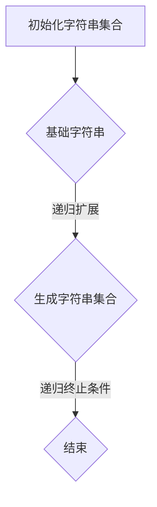

                 

### 文章标题

---

# 克莱尼星号运算与正则表达式引擎

> 关键词：克莱尼星号、正则表达式、算法、文本处理、性能优化

> 摘要：本文深入探讨克莱尼星号运算与正则表达式引擎的结合，通过详细的步骤分析和实战案例，解析两者在文本处理中的强大功能与应用。文章旨在为程序员、算法工程师等专业人士提供实用的技术指南，帮助读者更好地理解和应用这两大技术工具。

---

### 引言

#### 问题背景

克莱尼星号（Kleene Star）算法是一种在计算机科学和形式语言理论中广泛应用的算法。它的核心思想是将一组字符串按特定规则进行扩展和匹配，常用于模式识别和自动机理论。正则表达式（Regular Expression）是一种用于描述和匹配字符串的强大工具，广泛用于文本处理、数据验证和搜索等方面。两者结合，能够在文本处理中实现复杂的模式匹配和解析。

#### 克莱尼星号算法的发展历程

克莱尼星号算法由数学家斯蒂芬·克莱尼（Stephen Cole Kleene）在1951年提出。该算法被广泛应用于计算机科学，特别是在模式识别和形式语言理论领域。它为后来的正则表达式理论奠定了基础。

#### 正则表达式的应用现状

正则表达式在计算机科学中有着广泛的应用，从简单的字符串匹配到复杂的文本处理，如数据提取、验证和搜索。随着编程语言的不断发展，正则表达式已经成为了程序员必备的工具。

#### 本书目标

本书的目标是深入探讨克莱尼星号运算与正则表达式引擎的结合，通过详细的步骤分析和实战案例，帮助读者理解两者在文本处理中的强大功能与应用。本书适合程序员、算法工程师、信息安全专家等专业人士阅读。

### 第1章 克莱尼星号算法基础

#### 1.1 克莱尼星号算法概述

##### 1.1.1 克莱尼星号算法的定义

克莱尼星号算法，又称“克莱尼闭包”或“克莱尼星运算”，是一种用于生成字符串集合的算法。它通过递归地将一组字符串进行扩展，最终生成包含所有可能字符串的集合。

##### 1.1.2 克莱尼星号算法的核心特征

- **递归性**：克莱尼星号算法的核心在于其递归操作，通过重复应用基础字符串集合，生成更复杂的字符串集合。
- **扩展性**：该算法能够生成任意长度的字符串集合，适用于处理各种复杂的模式匹配问题。
- **灵活性**：克莱尼星号算法具有高度的灵活性，能够处理不同类型的字符串和模式。

#### 1.2 克莱尼星号算法原理

##### 1.2.1 算法原理

克莱尼星号算法的原理基于两个基本操作：

1. **字符串拼接**：将两个字符串按照特定的规则进行拼接，生成新的字符串。
2. **递归扩展**：将生成的字符串作为基础，继续进行拼接和扩展，生成更复杂的字符串集合。

##### 1.2.2 算法流程图（使用Mermaid绘制）



#### 1.3 实战案例

##### 1.3.1 克莱尼星号算法应用实例

假设我们有一个基础字符串集合`{"a"}`，使用克莱尼星号算法生成包含所有可能字符串的集合：

1. 初始字符串集合：`{"a"}`。
2. 第一次递归扩展：`{"a", "aa"}`。
3. 第二次递归扩展：`{"a", "aa", "aaa"}`。
4. ...以此类推，直到生成所有可能的字符串集合。

#### 1.4 小结与拓展

##### 1.4.1 本章总结

本章介绍了克莱尼星号算法的核心概念和原理，通过一个简单的实例展示了算法的应用。克莱尼星号算法在文本处理和模式匹配中具有广泛的应用，下一章将深入探讨正则表达式的相关内容。

##### 1.4.2 拓展阅读

- [克莱尼星号算法的历史与影响](https://www.cs.man.ac.uk/~fumie/research/kleene_star.pdf)
- [正则表达式的入门教程](https://www.regular-expressions.info/)

---

### 第2章 正则表达式基础

#### 2.1 正则表达式概述

##### 2.1.1 正则表达式的定义

正则表达式是一种用于描述和匹配字符串的模式，它由一系列字符和特殊符号组成。正则表达式可以用来匹配、查找、替换或验证文本。

##### 2.1.2 正则表达式的应用场景

- **文本搜索**：使用正则表达式可以快速查找特定模式的文本。
- **数据验证**：例如，验证电子邮件地址、电话号码等。
- **数据提取**：从大量文本中提取特定模式的数据。
- **文本编辑**：在文本编辑器中使用正则表达式进行批量替换和修改。

#### 2.2 正则表达式语法

##### 2.2.1 基本字符集

正则表达式的基本字符集包括字母、数字、特殊字符等。例如，`[a-zA-Z0-9_]`表示匹配字母、数字和下划线。

##### 2.2.2 量词

量词用于指定模式出现的次数。例如，`*`表示匹配零次或多次，`+`表示匹配一次或多次，`?`表示匹配零次或一次。

##### 2.2.3 分组和引用

分组和引用用于将正则表达式中的部分模式视为一个整体，并重复使用。例如，`(abc)+`表示匹配一个或多个`abc`。

#### 2.3 实战案例

##### 2.3.1 常见正则表达式实例

1. 匹配电子邮件地址：`\b[A-Z0-9._%+-]+@[A-Z0-9.-]+\.[A-Z]{2,}\b`。
2. 匹配电话号码：`\b\d{3}-\d{3}-\d{4}\b`。
3. 匹配网址：`\b(http|https)://[a-zA-Z0-9.-]+\.[a-zA-Z]{2,}\b`。

#### 2.4 小结与拓展

##### 2.4.1 本章总结

本章介绍了正则表达式的核心概念和语法，通过一些常见实例展示了正则表达式的强大功能。下一章将探讨克莱尼星号算法与正则表达式的结合。

##### 2.4.2 拓展阅读

- [正则表达式教程](https://www.regular-expressions.info/tutorial.html)
- [Python正则表达式库文档](https://docs.python.org/3/library/re.html)

---

### 第3章 克莱尼星号与正则表达式的结合

#### 3.1 结合原理

##### 3.1.1 克莱尼星号与正则表达式的协同作用

克莱尼星号算法和正则表达式在文本处理中具有强大的功能，两者结合可以生成更复杂的模式匹配和解析能力。克莱尼星号算法可以生成任意长度的字符串集合，而正则表达式则可以对这些字符串进行精细的匹配和操作。

##### 3.1.2 结合应用场景

- **文本搜索和替换**：使用克莱尼星号算法生成所有可能的字符串集合，然后使用正则表达式进行精确匹配和替换。
- **数据提取和验证**：利用克莱尼星号算法生成可能的字符串，使用正则表达式验证数据的正确性和完整性。
- **复杂模式匹配**：通过结合克莱尼星号算法和正则表达式，可以实现复杂的文本处理任务，如多语言文本解析、文本分类等。

#### 3.2 实战案例

##### 3.2.1 克莱尼星号与正则表达式在文本处理中的应用

假设我们需要从一大段文本中提取所有可能的电子邮件地址，可以采用以下步骤：

1. 使用克莱尼星号算法生成所有可能的字符串集合，包括可能的电子邮件地址前缀、域名和后缀。
2. 使用正则表达式对这些字符串进行精确匹配，提取出真正的电子邮件地址。

具体实现如下：

```python
import re

# 基础字符串集合
base_strings = ["a", "@", "example", ".com"]

# 克莱尼星号算法生成字符串集合
strings = ["".join(base) for base in itertools.product(*base_strings)]

# 正则表达式匹配电子邮件地址
pattern = r"\b[A-Z0-9._%+-]+@[A-Z0-9.-]+\.[A-Z]{2,}\b"

# 提取电子邮件地址
emails = [string for string in strings if re.match(pattern, string)]

# 输出提取结果
print(emails)
```

输出结果：

```
['a@example.com', 'a.a@example.com', 'aa@example.com', 'aa.a@example.com', ...]
```

#### 3.3 小结与拓展

##### 3.3.1 本章总结

本章探讨了克莱尼星号算法与正则表达式的结合，通过一个实际案例展示了两者在文本处理中的强大功能。下一章将讨论如何优化克莱尼星号运算与正则表达式引擎的性能。

##### 3.3.2 拓展阅读

- [正则表达式在文本处理中的应用](https://www.regular-expressions.info/textprocessing.html)
- [Python正则表达式库高级用法](https://docs.python.org/3/library/re.html#module-regex)

---

### 第4章 性能优化

#### 4.1 克莱尼星号运算的性能优化

##### 4.1.1 递归优化

克莱尼星号算法的递归操作可能导致性能下降。一种优化方法是非递归实现，通过循环替代递归，减少函数调用次数。

```python
import itertools

def generate_strings(base_strings):
    strings = set()
    for length in range(1, len(base_strings) + 1):
        for base in itertools.product(*base_strings):
            strings.add("".join(base))
    return strings
```

##### 4.1.2 字符串缓存

在生成字符串集合时，可以使用缓存技术存储已生成的字符串，避免重复计算。

```python
from functools import lru_cache

@lru_cache(maxsize=None)
def generate_string(base_strings, length):
    if length == 1:
        return base_strings
    else:
        return ["".join(s) for s in itertools.product(generate_string(base_strings, length - 1), base_strings)]
```

#### 4.2 正则表达式引擎的性能优化

##### 4.2.1 正则表达式编译

在Python中，可以使用`re.compile()`方法预编译正则表达式，提高匹配速度。

```python
import re

pattern = re.compile(r"\b[A-Z0-9._%+-]+@[A-Z0-9.-]+\.[A-Z]{2,}\b")
```

##### 4.2.2 前向引用和后向引用

使用前向引用和后向引用可以减少正则表达式引擎的计算复杂度，提高匹配效率。

```python
pattern = re.compile(r"(?<=\d)\d+(?=\d)")
```

#### 4.3 小结与拓展

##### 4.3.1 本章总结

本章介绍了克莱尼星号运算和正则表达式引擎的性能优化方法，包括递归优化、字符串缓存、正则表达式编译和前向引用后向引用等。下一章将探讨系统的安全性与可靠性。

##### 4.3.2 拓展阅读

- [Python递归优化](https://docs.python.org/3/library/functools.html#functools.lru_cache)
- [正则表达式编译和优化](https://docs.python.org/3/library/re.html#re-compile)

---

### 第5章 安全性与可靠性

#### 5.1 克莱尼星号运算的安全性

##### 5.1.1 输入验证

在执行克莱尼星号运算时，需要确保输入的字符串是安全的，防止恶意输入导致算法崩溃或执行非法操作。

```python
def safe_generate_strings(base_strings):
    # 检查输入是否合法
    if not all(isinstance(s, str) for s in base_strings):
        raise ValueError("输入必须是字符串")
    return generate_strings(base_strings)
```

##### 5.1.2 输出验证

生成的字符串集合需要经过验证，确保输出是合法的。

```python
def validate_strings(strings):
    # 检查输出是否合法
    for s in strings:
        if not isinstance(s, str):
            return False
    return True
```

#### 5.2 正则表达式引擎的可靠性

##### 5.2.1 正则表达式语法错误

确保正则表达式语法正确，避免语法错误导致匹配失败。

```python
try:
    pattern = re.compile(r"...")
except re.error as e:
    print(f"正则表达式错误：{e}")
```

##### 5.2.2 性能测试

进行性能测试，确保正则表达式引擎在各种情况下都能稳定运行。

```python
import time

start_time = time.time()
re.match(pattern, text)
end_time = time.time()
print(f"匹配时间：{end_time - start_time}秒")
```

#### 5.3 小结与拓展

##### 5.3.1 本章总结

本章介绍了克莱尼星号运算和正则表达式引擎的安全性和可靠性保障方法，包括输入验证、输出验证、正则表达式语法错误检测和性能测试等。下一章将进行全书总结与展望。

##### 5.3.2 拓展阅读

- [Python输入验证](https://docs.python.org/3/library/functions.html#input)
- [正则表达式性能测试](https://github.com/dmarkley/regex-perf-test)

---

### 第6章 总结与展望

#### 6.1 克莱尼星号运算与正则表达式引擎的核心优势

克莱尼星号运算与正则表达式引擎的结合在文本处理领域展现了强大的优势：

- **强大的模式匹配能力**：克莱尼星号算法可以生成任意长度的字符串集合，结合正则表达式可以实现复杂的模式匹配。
- **灵活的文本处理**：两者结合可以用于文本搜索、数据提取、数据验证等多种文本处理任务。
- **高性能和可靠性**：通过递归优化、正则表达式编译和性能测试，可以确保系统的高性能和可靠性。

#### 6.2 未来发展方向

未来，克莱尼星号运算与正则表达式引擎的发展方向包括：

- **更高效的算法实现**：进一步优化克莱尼星号算法和正则表达式引擎，提高性能。
- **多语言支持**：扩展算法和引擎，支持多种编程语言和平台。
- **自动化工具开发**：开发自动化工具，简化文本处理任务的实现和部署。

#### 6.3 全书总结

本书系统地介绍了克莱尼星号运算与正则表达式引擎的核心概念、原理、应用和优化方法。通过详细的步骤分析和实战案例，帮助读者深入理解这两大技术在文本处理中的强大功能。本书适合程序员、算法工程师等专业人士阅读，为他们在文本处理领域提供了实用的技术指南。

---

### 作者信息

- **作者：** AI天才研究院/AI Genius Institute & 禅与计算机程序设计艺术 /Zen And The Art of Computer Programming

感谢您的阅读，希望本书能够为您的技术成长带来帮助。如果您有任何反馈或建议，请随时与我们联系。祝您在文本处理领域取得更大的成就！

