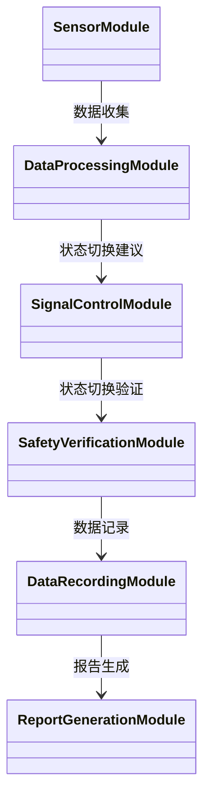
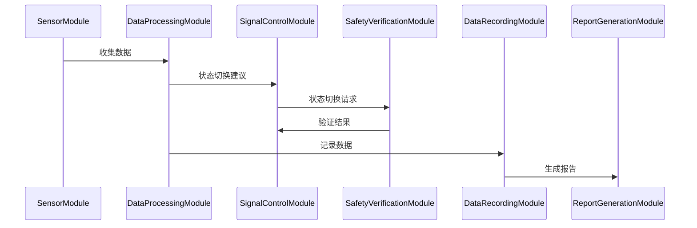

                 

### 引言

在当今信息化与自动化快速发展的时代，人工智能（AI）技术已成为推动各行业变革的重要力量。AI不仅改变了我们的生活方式，还极大地提升了企业的效率和竞争力。在AI技术中，逻辑推理和语义分析是至关重要的环节。克里普克语义学与模态逻辑程序设计正是这两大领域的核心概念。

克里普克语义学是一种形式语义学的理论，由美国哲学家塞尔日·克里普克提出，主要研究命题的真值条件。它通过一种层次结构的方式，定义了命题在不同情境下的真值，从而为逻辑推理提供了坚实的基础。而模态逻辑程序设计则是将模态逻辑的原理应用于程序设计和软件工程领域，旨在解决复杂系统的推理和验证问题。

本书的目的在于深入探讨克里普克语义学与模态逻辑程序设计，帮助读者理解这两个概念的核心原理，掌握其应用方法，并学会如何将它们有效地结合以解决实际问题。本文将从以下几个方面展开：

1. **问题背景**：介绍人工智能发展中的关键问题，解释为什么克里普克语义学与模态逻辑程序设计具有重要意义。
2. **核心概念与联系**：详细阐述克里普克语义学和模态逻辑的基本概念，并分析它们之间的联系。
3. **算法原理讲解**：介绍Kripke语义算法和模态逻辑算法的原理，使用Python代码和Mermaid流程图进行详细解释。
4. **系统分析与架构设计**：通过具体案例，讲解如何将克里普克语义学与模态逻辑程序设计应用于系统分析与架构设计。
5. **实际案例分析与系统实现**：介绍实际项目中的应用，展示如何解决实际问题。
6. **最佳实践与总结**：总结全书要点，提供最佳实践建议，展望未来研究方向。

通过这篇文章，读者将能够全面了解克里普克语义学与模态逻辑程序设计，掌握其核心概念和应用方法，从而为人工智能领域的研究和实践提供有力支持。

---

#### 关键词：

- **克里普克语义学**
- **模态逻辑**
- **程序设计**
- **形式语义学**
- **人工智能**
- **逻辑推理**
- **语义分析**

### 摘要

本文旨在深入探讨克里普克语义学与模态逻辑程序设计，这两者在人工智能领域具有关键作用。克里普克语义学通过定义命题在不同情境下的真值条件，为逻辑推理提供了坚实的理论基础。模态逻辑程序设计则将模态逻辑应用于程序设计和软件工程，解决了复杂系统的推理和验证问题。本文首先介绍了人工智能中的关键问题，并解释了克里普克语义学与模态逻辑程序设计的重要性。接着，详细阐述了这两者的核心概念及其联系。通过算法原理讲解，本文展示了Kripke语义算法和模态逻辑算法的具体实现方法，并结合实际案例进行了详细分析。最后，总结了全文要点，并提出了未来研究方向和建议。通过这篇文章，读者将能够全面理解并应用克里普克语义学与模态逻辑程序设计，为人工智能领域的研究和实践提供新的思路。

### 第一部分：背景介绍

#### 第1章: 问题背景

**1.1.1 问题定义**

在当今信息化和自动化快速发展的时代，人工智能（AI）技术已经成为推动社会变革和经济增长的重要力量。然而，AI的发展面临着诸多挑战，其中之一就是如何有效地进行逻辑推理和语义分析。逻辑推理是AI系统做出决策和解决问题的基础，而语义分析则是理解人类语言和计算机程序语义的关键。克里普克语义学与模态逻辑程序设计正是在这个背景下产生和发展的。

克里普克语义学，作为一种形式语义学理论，由美国哲学家塞尔日·克里普克提出，旨在研究命题的真值条件。在传统逻辑中，命题的真值通常是由逻辑形式和语义规则直接决定的。然而，克里普克提出了一种基于情境（或称为模型）的语义学，即命题的真值不是固定不变的，而是依赖于特定的情境。这种情境模型允许我们更细致地分析命题在不同情境下的真值，从而为逻辑推理提供了更丰富的语义基础。

模态逻辑程序设计则是将模态逻辑的原理应用于程序设计和软件工程领域。模态逻辑是一种扩展了经典逻辑的命题逻辑，引入了模态算子，如“必然”和“可能”，用于表示不同情境下的逻辑关系。模态逻辑程序设计利用这些模态算子，构建形式化的模型来描述系统的行为和状态，从而解决复杂系统的推理和验证问题。

**1.1.2 问题的重要性**

人工智能的发展离不开有效的逻辑推理和语义分析。逻辑推理是AI系统进行决策和问题解决的基础，而语义分析则是理解和生成自然语言的关键。克里普克语义学和模态逻辑程序设计为这两个方面提供了重要的理论和方法。

克里普克语义学的重要性体现在以下几个方面：

1. **增强逻辑推理能力**：通过引入情境模型，克里普克语义学允许我们更细致地分析命题在不同情境下的真值，从而增强了逻辑推理的能力。
2. **支持不确定推理**：传统逻辑通常处理确定性的命题，而克里普克语义学则能够处理不确定性的命题，如“可能”和“必然”。
3. **形式化验证**：在软件工程中，形式化验证是确保系统正确性的重要手段。克里普克语义学提供了形式化的语义模型，使得形式化验证变得更加可行。

模态逻辑程序设计的重要性则体现在以下几个方面：

1. **描述复杂系统行为**：模态逻辑通过引入模态算子，能够更准确地描述复杂系统的行为和状态，从而提高系统的可理解性和可维护性。
2. **支持形式化验证**：模态逻辑程序设计提供了形式化的模型来描述系统的行为，使得形式化验证变得更加有效。
3. **应用广泛**：模态逻辑程序设计在许多领域都有广泛应用，如自动推理、人工智能、程序设计语言和软件工程等。

**1.1.3 研究边界**

尽管克里普克语义学和模态逻辑程序设计在人工智能领域具有重要的应用价值，但它们的研究仍然存在一定的边界。

1. **复杂性**：克里普克语义学和模态逻辑程序设计涉及到复杂的数学和逻辑理论，这使得理解和应用它们具有一定的难度。
2. **计算效率**：在实际应用中，特别是在处理大规模数据时，克里普克语义学和模态逻辑程序设计的计算效率是一个重要问题。如何优化算法，提高计算效率是一个亟待解决的问题。
3. **应用场景**：虽然模态逻辑程序设计在许多领域都有应用，但并不是所有的问题都适合使用模态逻辑来解决。因此，如何选择合适的应用场景，是研究的一个关键问题。

通过以上分析，我们可以看到，克里普克语义学和模态逻辑程序设计在人工智能领域中具有重要的理论和实践意义。本文将深入探讨这两个概念，并结合具体案例，展示它们在实际应用中的价值和挑战。

---

**1.1.1 问题定义**

在人工智能（AI）领域，逻辑推理和语义分析是两个关键的研究课题。逻辑推理涉及从已知事实推导出新结论的过程，而语义分析则关注于理解和生成语言符号的意义。克里普克语义学和模态逻辑程序设计正是为了解决这两个课题中的复杂性而发展起来的。

首先，我们定义什么是逻辑推理。逻辑推理是一种基于逻辑规则和前提，从已知信息推导出新信息的过程。在传统逻辑中，推理通常是基于命题逻辑和谓词逻辑的。例如，如果前提是“A implies B”（A推出B），并且A为真，那么可以逻辑地推导出B也为真。然而，这种推理形式在某些情况下存在局限性，特别是在处理现实世界中的不确定性时。

接着，我们定义什么是语义分析。语义分析是指理解和解释语言符号的意义。在自然语言处理（NLP）中，语义分析是非常重要的一环。例如，理解句子“我明天去看电影”的语义，需要知道“明天”、“看”和“电影”等词汇的具体含义，并推断出句子的整体意图。

在这种背景下，克里普克语义学和模态逻辑程序设计的作用变得尤为显著。

**1.1.2 问题的重要性**

逻辑推理在AI中的应用非常广泛。例如，在自动化决策系统中，逻辑推理可以帮助系统根据已知信息做出最优决策。在专家系统中，逻辑推理用于模拟专家的知识和经验，帮助系统解决复杂问题。然而，传统逻辑推理在处理现实世界中的不确定性时存在一定的局限性。克里普克语义学通过引入情境模型，允许我们更细致地分析命题在不同情境下的真值，从而增强了逻辑推理的能力。

模态逻辑程序设计则提供了另一种增强逻辑推理的方法。模态逻辑引入了模态算子，如“必然”和“可能”，用于表示不同情境下的逻辑关系。例如，命题“必然P”表示在任何情境下P都为真，而命题“可能P”表示在某些情境下P可能为真。通过使用模态逻辑，我们可以更准确地描述和推理复杂系统的行为。

语义分析是NLP和AI领域中另一个关键问题。自然语言是一种高度复杂和多样化的符号系统，理解其语义需要深入的知识和技能。语义分析不仅涉及词汇的含义，还包括句子结构和上下文的影响。克里普克语义学通过引入情境模型，提供了分析自然语言语义的有力工具。

模态逻辑程序设计在语义分析中的应用也非常重要。例如，在自然语言生成系统中，模态逻辑可以用于生成符合特定情境的文本。在对话系统中，模态逻辑可以帮助系统理解用户的意图，并生成合适的回答。

**1.1.3 研究边界**

尽管克里普克语义学和模态逻辑程序设计在人工智能领域具有重要的应用价值，但它们的研究仍然存在一定的边界。

首先，复杂性是一个主要问题。克里普克语义学和模态逻辑程序设计涉及到复杂的数学和逻辑理论，这增加了理解和应用这些概念的难度。例如，建立情境模型和进行形式化验证需要深厚的数学基础。

其次，计算效率也是一个关键问题。在实际应用中，特别是在处理大规模数据时，算法的计算效率是一个重要考量因素。如何优化算法，提高计算效率是一个亟待解决的问题。

最后，应用场景的选择也是一个研究边界。虽然模态逻辑程序设计在许多领域都有应用，但并不是所有的问题都适合使用模态逻辑来解决。因此，如何选择合适的应用场景，是研究的一个关键问题。

总之，克里普克语义学和模态逻辑程序设计在人工智能领域中具有重要的理论和实践意义。通过本文的深入探讨，我们将更全面地理解这两个概念，并掌握其应用方法，为人工智能领域的研究和实践提供新的思路。

### 第2章：核心概念与联系

#### 2.1.1 Kripke语义学

**2.1.1.1 Kripke语义的基本原理**

Kripke语义学是由美国哲学家塞尔日·克里普克提出的一种形式语义学理论，主要用于定义命题的真值条件。Kripke语义学的基本原理可以概括为以下几点：

1. **情境（World）**：Kripke语义学将命题的真值与情境联系起来。情境是一个抽象的概念，表示一个可能的现实状态。在Kripke语义中，情境被看作是一个模型，包含一组对象和一组谓词，这些对象和谓词定义了情境的特性。

2. **访问关系（Accessibility Relation）**：情境之间存在访问关系，表示一个情境可以“看到”其他情境。这种访问关系通常被表示为一个偏序关系，如“≤”。如果一个情境\(w\)可以访问另一个情境\(w'\)，则记作\(w ≤ w'\)。

3. **真值函数（Truth Function）**：Kripke语义学定义了一个真值函数，用于确定一个命题在特定情境下的真值。对于命题逻辑中的每个公式，都有一个相应的真值函数，该函数根据情境和命题的结构来确定其真值。

**2.1.1.2 Kripke语义的属性特征对比**

Kripke语义学具有几个重要的属性特征，这些特征使其在逻辑推理中具有独特的优势。以下是对Kripke语义学主要属性特征的对比：

1. **不确定性处理**：Kripke语义学能够处理不确定性命题，如“可能”和“必然”。在传统逻辑中，命题的真值是固定的，而在Kripke语义学中，命题的真值可以依赖于特定的情境。这使得Kripke语义学能够更好地模拟现实世界中的不确定性。

2. **层次结构**：Kripke语义学引入了层次结构的概念，即情境之间存在访问关系。这种层次结构使得Kripke语义学能够描述更复杂的逻辑关系，如蕴涵关系和模态关系。

3. **形式化验证**：Kripke语义学提供了形式化的语义模型，使得形式化验证变得更加可行。通过Kripke语义，我们可以定义一个命题在任何情境下的真值，从而验证系统是否满足特定性质。

**2.1.1.3 Kripke语义与模态逻辑的关系**

Kripke语义学与模态逻辑密切相关。模态逻辑是一种扩展了经典逻辑的命题逻辑，引入了模态算子，如“必然”和“可能”。这些模态算子用于表示不同情境下的逻辑关系。

Kripke语义学为模态逻辑提供了一种形式化的语义解释。具体来说，Kripke语义学定义了模态算子的真值条件。例如，“必然P”在某个情境\(w\)下为真，当且仅当对于所有\(w\)的访问情境，命题\(P\)在该情境下也为真。同样，“可能P”在\(w\)下为真，当且仅当存在至少一个\(w\)的访问情境，使得\(P\)在该情境下为真。

这种形式化的语义解释使得模态逻辑能够应用于各种实际问题中，如自动推理、形式化验证和软件工程。

**2.1.2 模态逻辑**

**2.1.2.1 模态逻辑的基本概念**

模态逻辑是一种扩展了经典逻辑的命题逻辑，通过引入模态算子来表示命题在不同情境下的逻辑关系。模态逻辑的基本概念包括：

1. **模态算子**：模态逻辑引入了两种基本的模态算子：“必然”（通常表示为“□”）和“可能”（通常表示为“◇”）。模态算子用于修饰命题，表示该命题在某个情境下是必然为真或可能是为真。

2. **模态公式**：模态逻辑中的公式是通过结合命题和模态算子构建的。例如，公式“□P”表示“P是必然为真的”，而公式“◇P”表示“P是可能在某个情境下为真的”。

3. **模态推理规则**：模态逻辑定义了一系列推理规则，用于从已知公式推导出新公式。常见的推理规则包括“必然引入”（\(□P \rightarrow P\)）和“可能引入”（\(◇P \rightarrow P\)）等。

**2.1.2.2 模态逻辑的性质**

模态逻辑具有以下重要性质：

1. **非单调性**：模态逻辑是非单调的，即一个命题的模态性质可能随着情境的变化而变化。这与经典逻辑的单调性不同，经典逻辑中一旦某个命题为真，则它在所有子情境中也为真。

2. **模态关系**：模态逻辑引入了模态关系，如“蕴涵”（\(□P \rightarrow □Q\)）和“等价”（\(◇P \leftrightarrow □◇P\)）。这些关系可以用于描述复杂系统的行为和状态。

3. **扩展性**：模态逻辑可以扩展到更复杂的结构，如谓词模态逻辑和时态逻辑。这些扩展使得模态逻辑能够应用于更广泛的问题，如时间推理和知识表示。

**2.1.2.3 模态逻辑的应用领域**

模态逻辑在多个领域中有着广泛的应用，包括：

1. **自动推理**：模态逻辑用于自动推理系统，如定理证明和问题求解。通过形式化的推理规则，系统能够自动推导出新的结论。

2. **形式化验证**：模态逻辑用于形式化验证，如软件和硬件系统的验证。通过定义系统的行为和状态，模态逻辑可以帮助验证系统是否满足特定性质。

3. **程序设计**：模态逻辑在程序设计中用于描述和验证程序的正确性。例如，可以使用模态逻辑来验证程序是否满足给定的规格说明。

4. **知识表示**：模态逻辑用于知识表示，如知识库和推理机。通过引入模态算子，知识库能够表示更复杂的逻辑关系，从而提高推理能力。

通过本章的讨论，我们可以看到Kripke语义学和模态逻辑在逻辑推理和语义分析中扮演着重要的角色。Kripke语义学提供了形式化的语义解释，使得逻辑推理能够更细致地处理不确定性。而模态逻辑则通过引入模态算子，提供了描述复杂系统行为和状态的工具。这两者相互补充，为人工智能领域的研究和实践提供了坚实的基础。

---

**2.1.1.1 Kripke语义的基本原理**

Kripke语义学是一种形式语义学的理论，其核心在于通过情境模型来定义命题的真值。Kripke语义的基本原理可以分为以下几个关键部分：

1. **情境（World）**：在Kripke语义学中，情境是一个抽象的概念，代表一个可能的现实状态。每个情境由一组对象和一组谓词构成，这些对象和谓词定义了情境的具体特征。情境可以被视为逻辑系统中的一个模型，用于解释命题的真值。

2. **访问关系（Accessibility Relation）**：情境之间存在一种访问关系，表示一个情境可以“看到”另一个情境。这种关系通常用一个偏序关系符号“≤”来表示。具体来说，如果一个情境\(w\)可以访问另一个情境\(w'\)，则记作\(w ≤ w'\)。这种访问关系反映了情境之间的逻辑关系，如蕴涵和模态关系。

3. **真值函数（Truth Function）**：Kripke语义学定义了一个真值函数，用于确定一个命题在特定情境下的真值。对于每个命题逻辑中的公式，都有一个相应的真值函数，该函数根据情境和命题的结构来确定其真值。真值函数通常通过一个表格或一个模型来表示，其中每个情境都与一个特定的真值分配相关联。

**2.1.1.2 Kripke语义的属性特征对比**

Kripke语义学具有几个重要的属性特征，这些特征使其在逻辑推理中具有独特的优势。以下是Kripke语义学主要属性特征的对比：

1. **不确定性处理**：Kripke语义学能够处理不确定性命题，如“可能”和“必然”。在传统逻辑中，命题的真值是固定不变的，而在Kripke语义学中，命题的真值可以依赖于特定的情境。这意味着Kripke语义学能够更好地模拟现实世界中的不确定性，例如概率事件和条件依赖。

2. **层次结构**：Kripke语义学引入了层次结构的概念，即情境之间存在访问关系。这种层次结构使得Kripke语义学能够描述更复杂的逻辑关系，如蕴涵关系和模态关系。情境之间的访问关系定义了一个偏序关系，从而允许我们定义更精细的逻辑层次。

3. **形式化验证**：Kripke语义学提供了形式化的语义模型，这使得形式化验证变得更加可行。通过Kripke语义，我们可以定义一个命题在任何情境下的真值，从而验证系统是否满足特定性质。这种形式化的验证方法在软件工程和形式化验证领域具有重要意义。

**2.1.1.3 Kripke语义与模态逻辑的关系**

Kripke语义学与模态逻辑有着密切的联系。模态逻辑是一种扩展了经典逻辑的命题逻辑，引入了模态算子来表示命题在不同情境下的逻辑关系。Kripke语义学为模态逻辑提供了一种形式化的语义解释，使得模态逻辑能够应用于各种实际问题中。

具体来说，Kripke语义学与模态逻辑的关系体现在以下几个方面：

1. **模态算子的语义解释**：Kripke语义学定义了模态算子的真值条件。例如，“必然P”在某个情境\(w\)下为真，当且仅当对于所有\(w\)的访问情境，命题\(P\)在该情境下也为真。同样，“可能P”在\(w\)下为真，当且仅当存在至少一个\(w\)的访问情境，使得\(P\)在该情境下为真。这些真值条件使得模态逻辑的推理规则和性质能够通过Kripke语义得到形式化的解释。

2. **情境模型**：Kripke语义学中的情境模型用于解释模态逻辑中的命题。每个情境都代表一个可能的现实状态，而情境之间的访问关系则反映了命题之间的逻辑关系。这种情境模型不仅用于解释模态逻辑中的命题，还可以用于验证系统的正确性。

3. **应用领域**：Kripke语义学和模态逻辑在多个领域有着广泛的应用。例如，在自动推理和形式化验证领域，Kripke语义学用于构建形式化的模型来验证系统是否满足特定性质。在软件工程中，模态逻辑程序设计用于描述系统的行为和状态，从而提高系统的可维护性和可靠性。

综上所述，Kripke语义学与模态逻辑密切相关。Kripke语义学通过引入情境模型和真值条件，为模态逻辑提供了一种形式化的语义解释，使得模态逻辑能够应用于各种实际问题中。这种结合不仅丰富了逻辑推理的方法，也为人工智能领域的研究和实践提供了有力的工具。

---

**2.1.2 模态逻辑**

**2.1.2.1 模态逻辑的基本概念**

模态逻辑是一种扩展了经典逻辑的命题逻辑，通过引入模态算子来表示命题在不同情境下的逻辑关系。以下是模态逻辑的基本概念：

1. **模态算子**：模态逻辑引入了两种基本的模态算子：“必然”（通常表示为“□”）和“可能”（通常表示为“◇”）。模态算子用于修饰命题，表示该命题在某个情境下是必然为真或可能是为真。例如，“□P”表示“P是必然为真的”，而“◇P”表示“P是可能在某个情境下为真的”。

2. **模态公式**：模态逻辑中的公式是通过结合命题和模态算子构建的。例如，公式“□P”表示“P是必然为真的”，而公式“◇P”表示“P是可能在某个情境下为真的”。模态公式可以包含多个命题和模态算子，形成复杂的逻辑表达式。

3. **模态推理规则**：模态逻辑定义了一系列推理规则，用于从已知公式推导出新公式。常见的推理规则包括“必然引入”（\(□P \rightarrow P\)）和“可能引入”（\(◇P \rightarrow P\)）等。这些推理规则使得模态逻辑能够进行有效的推理和证明。

**2.1.2.2 模态逻辑的性质**

模态逻辑具有以下几个重要性质：

1. **非单调性**：模态逻辑是非单调的，即一个命题的模态性质可能随着情境的变化而变化。这与经典逻辑的单调性不同，经典逻辑中一旦某个命题为真，则它在所有子情境中也为真。模态逻辑的非单调性使其能够更好地处理现实世界中的不确定性。

2. **模态关系**：模态逻辑引入了模态关系，如“蕴涵”（\(□P \rightarrow □Q\)）和“等价”（\(◇P \leftrightarrow □◇P\)）。这些关系可以用于描述复杂系统的行为和状态。例如，“□P \rightarrow □Q”表示如果P在所有情境下都为真，则Q也在所有情境下为真。

3. **扩展性**：模态逻辑可以扩展到更复杂的结构，如谓词模态逻辑和时态逻辑。这些扩展使得模态逻辑能够应用于更广泛的问题，如时间推理和知识表示。

**2.1.2.3 模态逻辑的应用领域**

模态逻辑在多个领域中有着广泛的应用，包括：

1. **自动推理**：模态逻辑用于自动推理系统，如定理证明和问题求解。通过形式化的推理规则，系统能够自动推导出新的结论。

2. **形式化验证**：模态逻辑用于形式化验证，如软件和硬件系统的验证。通过定义系统的行为和状态，模态逻辑可以帮助验证系统是否满足特定性质。

3. **程序设计**：模态逻辑在程序设计中用于描述和验证程序的正确性。例如，可以使用模态逻辑来验证程序是否满足给定的规格说明。

4. **知识表示**：模态逻辑用于知识表示，如知识库和推理机。通过引入模态算子，知识库能够表示更复杂的逻辑关系，从而提高推理能力。

通过上述讨论，我们可以看到模态逻辑在人工智能领域中具有重要的地位和广泛的应用。它通过引入模态算子和推理规则，提供了描述复杂系统行为和状态的工具，从而为逻辑推理和语义分析提供了有力的支持。

---

**2.1.1.1 Kripke语义的基本原理**

Kripke语义学是由美国哲学家塞尔日·克里普克提出的一种形式语义学理论，其核心在于通过情境模型来定义命题的真值。以下是Kripke语义学的基本原理：

1. **情境（World）**：在Kripke语义学中，情境是一个抽象的概念，代表一个可能的现实状态。每个情境由一组对象和一组谓词构成，这些对象和谓词定义了情境的具体特征。情境可以被视为逻辑系统中的一个模型，用于解释命题的真值。

2. **访问关系（Accessibility Relation）**：情境之间存在一种访问关系，表示一个情境可以“看到”另一个情境。这种关系通常用一个偏序关系符号“≤”来表示。具体来说，如果一个情境\(w\)可以访问另一个情境\(w'\)，则记作\(w ≤ w'\)。这种访问关系反映了情境之间的逻辑关系，如蕴涵和模态关系。

3. **真值函数（Truth Function）**：Kripke语义学定义了一个真值函数，用于确定一个命题在特定情境下的真值。对于每个命题逻辑中的公式，都有一个相应的真值函数，该函数根据情境和命题的结构来确定其真值。真值函数通常通过一个表格或一个模型来表示，其中每个情境都与一个特定的真值分配相关联。

**2.1.1.2 Kripke语义的属性特征对比**

Kripke语义学具有几个重要的属性特征，这些特征使其在逻辑推理中具有独特的优势。以下是Kripke语义学主要属性特征的对比：

1. **不确定性处理**：Kripke语义学能够处理不确定性命题，如“可能”和“必然”。在传统逻辑中，命题的真值是固定不变的，而在Kripke语义学中，命题的真值可以依赖于特定的情境。这意味着Kripke语义学能够更好地模拟现实世界中的不确定性，例如概率事件和条件依赖。

2. **层次结构**：Kripke语义学引入了层次结构的概念，即情境之间存在访问关系。这种层次结构使得Kripke语义学能够描述更复杂的逻辑关系，如蕴涵关系和模态关系。情境之间的访问关系定义了一个偏序关系，从而允许我们定义更精细的逻辑层次。

3. **形式化验证**：Kripke语义学提供了形式化的语义模型，这使得形式化验证变得更加可行。通过Kripke语义，我们可以定义一个命题在任何情境下的真值，从而验证系统是否满足特定性质。这种形式化的验证方法在软件工程和形式化验证领域具有重要意义。

**2.1.1.3 Kripke语义与模态逻辑的关系**

Kripke语义学与模态逻辑有着密切的联系。模态逻辑是一种扩展了经典逻辑的命题逻辑，引入了模态算子来表示命题在不同情境下的逻辑关系。Kripke语义学为模态逻辑提供了一种形式化的语义解释，使得模态逻辑能够应用于各种实际问题中。

具体来说，Kripke语义学与模态逻辑的关系体现在以下几个方面：

1. **模态算子的语义解释**：Kripke语义学定义了模态算子的真值条件。例如，“必然P”在某个情境\(w\)下为真，当且仅当对于所有\(w\)的访问情境，命题\(P\)在该情境下也为真。同样，“可能P”在\(w\)下为真，当且仅当存在至少一个\(w\)的访问情境，使得\(P\)在该情境下为真。这些真值条件使得模态逻辑的推理规则和性质能够通过Kripke语义得到形式化的解释。

2. **情境模型**：Kripke语义学中的情境模型用于解释模态逻辑中的命题。每个情境都代表一个可能的现实状态，而情境之间的访问关系则反映了命题之间的逻辑关系。这种情境模型不仅用于解释模态逻辑中的命题，还可以用于验证系统的正确性。

3. **应用领域**：Kripke语义学和模态逻辑在多个领域有着广泛的应用。例如，在自动推理和形式化验证领域，Kripke语义学用于构建形式化的模型来验证系统是否满足特定性质。在软件工程中，模态逻辑程序设计用于描述系统的行为和状态，从而提高系统的可维护性和可靠性。

综上所述，Kripke语义学与模态逻辑密切相关。Kripke语义学通过引入情境模型和真值条件，为模态逻辑提供了一种形式化的语义解释，使得模态逻辑能够应用于各种实际问题中。这种结合不仅丰富了逻辑推理的方法，也为人工智能领域的研究和实践提供了有力的工具。

---

**2.1.2 模态逻辑**

**2.1.2.1 模态逻辑的基本概念**

模态逻辑是一种扩展了经典逻辑的命题逻辑，通过引入模态算子来表示命题在不同情境下的逻辑关系。以下是模态逻辑的基本概念：

1. **模态算子**：模态逻辑引入了两种基本的模态算子：“必然”（通常表示为“□”）和“可能”（通常表示为“◇”）。模态算子用于修饰命题，表示该命题在某个情境下是必然为真或可能是为真。例如，“□P”表示“P是必然为真的”，而“◇P”表示“P是可能在某个情境下为真的”。

2. **模态公式**：模态逻辑中的公式是通过结合命题和模态算子构建的。例如，公式“□P”表示“P是必然为真的”，而公式“◇P”表示“P是可能在某个情境下为真的”。模态公式可以包含多个命题和模态算子，形成复杂的逻辑表达式。

3. **模态推理规则**：模态逻辑定义了一系列推理规则，用于从已知公式推导出新公式。常见的推理规则包括“必然引入”（\(□P \rightarrow P\)）和“可能引入”（\(◇P \rightarrow P\)）等。这些推理规则使得模态逻辑能够进行有效的推理和证明。

**2.1.2.2 模态逻辑的性质**

模态逻辑具有以下几个重要性质：

1. **非单调性**：模态逻辑是非单调的，即一个命题的模态性质可能随着情境的变化而变化。这与经典逻辑的单调性不同，经典逻辑中一旦某个命题为真，则它在所有子情境中也为真。模态逻辑的非单调性使其能够更好地处理现实世界中的不确定性。

2. **模态关系**：模态逻辑引入了模态关系，如“蕴涵”（\(□P \rightarrow □Q\)）和“等价”（\(◇P \leftrightarrow □◇P\)）。这些关系可以用于描述复杂系统的行为和状态。例如，“□P \rightarrow □Q”表示如果P在所有情境下都为真，则Q也在所有情境下为真。

3. **扩展性**：模态逻辑可以扩展到更复杂的结构，如谓词模态逻辑和时态逻辑。这些扩展使得模态逻辑能够应用于更广泛的问题，如时间推理和知识表示。

**2.1.2.3 模态逻辑的应用领域**

模态逻辑在多个领域中有着广泛的应用，包括：

1. **自动推理**：模态逻辑用于自动推理系统，如定理证明和问题求解。通过形式化的推理规则，系统能够自动推导出新的结论。

2. **形式化验证**：模态逻辑用于形式化验证，如软件和硬件系统的验证。通过定义系统的行为和状态，模态逻辑可以帮助验证系统是否满足特定性质。

3. **程序设计**：模态逻辑在程序设计中用于描述和验证程序的正确性。例如，可以使用模态逻辑来验证程序是否满足给定的规格说明。

4. **知识表示**：模态逻辑用于知识表示，如知识库和推理机。通过引入模态算子，知识库能够表示更复杂的逻辑关系，从而提高推理能力。

通过上述讨论，我们可以看到模态逻辑在人工智能领域中具有重要的地位和广泛的应用。它通过引入模态算子和推理规则，提供了描述复杂系统行为和状态的工具，从而为逻辑推理和语义分析提供了有力的支持。

---

**2.1.1.1 Kripke语义的基本原理**

Kripke语义学是由美国哲学家塞尔日·克里普克提出的一种形式语义学理论，其核心在于通过情境模型来定义命题的真值。以下是Kripke语义学的基本原理：

1. **情境（World）**：在Kripke语义学中，情境是一个抽象的概念，代表一个可能的现实状态。每个情境由一组对象和一组谓词构成，这些对象和谓词定义了情境的具体特征。情境可以被视为逻辑系统中的一个模型，用于解释命题的真值。

2. **访问关系（Accessibility Relation）**：情境之间存在一种访问关系，表示一个情境可以“看到”另一个情境。这种关系通常用一个偏序关系符号“≤”来表示。具体来说，如果一个情境\(w\)可以访问另一个情境\(w'\)，则记作\(w ≤ w'\)。这种访问关系反映了情境之间的逻辑关系，如蕴涵和模态关系。

3. **真值函数（Truth Function）**：Kripke语义学定义了一个真值函数，用于确定一个命题在特定情境下的真值。对于每个命题逻辑中的公式，都有一个相应的真值函数，该函数根据情境和命题的结构来确定其真值。真值函数通常通过一个表格或一个模型来表示，其中每个情境都与一个特定的真值分配相关联。

**2.1.1.2 Kripke语义的属性特征对比**

Kripke语义学具有几个重要的属性特征，这些特征使其在逻辑推理中具有独特的优势。以下是Kripke语义学主要属性特征的对比：

1. **不确定性处理**：Kripke语义学能够处理不确定性命题，如“可能”和“必然”。在传统逻辑中，命题的真值是固定不变的，而在Kripke语义学中，命题的真值可以依赖于特定的情境。这意味着Kripke语义学能够更好地模拟现实世界中的不确定性，例如概率事件和条件依赖。

2. **层次结构**：Kripke语义学引入了层次结构的概念，即情境之间存在访问关系。这种层次结构使得Kripke语义学能够描述更复杂的逻辑关系，如蕴涵关系和模态关系。情境之间的访问关系定义了一个偏序关系，从而允许我们定义更精细的逻辑层次。

3. **形式化验证**：Kripke语义学提供了形式化的语义模型，这使得形式化验证变得更加可行。通过Kripke语义，我们可以定义一个命题在任何情境下的真值，从而验证系统是否满足特定性质。这种形式化的验证方法在软件工程和形式化验证领域具有重要意义。

**2.1.1.3 Kripke语义与模态逻辑的关系**

Kripke语义学与模态逻辑有着密切的联系。模态逻辑是一种扩展了经典逻辑的命题逻辑，引入了模态算子来表示命题在不同情境下的逻辑关系。Kripke语义学为模态逻辑提供了一种形式化的语义解释，使得模态逻辑能够应用于各种实际问题中。

具体来说，Kripke语义学与模态逻辑的关系体现在以下几个方面：

1. **模态算子的语义解释**：Kripke语义学定义了模态算子的真值条件。例如，“必然P”在某个情境\(w\)下为真，当且仅当对于所有\(w\)的访问情境，命题\(P\)在该情境下也为真。同样，“可能P”在\(w\)下为真，当且仅当存在至少一个\(w\)的访问情境，使得\(P\)在该情境下为真。这些真值条件使得模态逻辑的推理规则和性质能够通过Kripke语义得到形式化的解释。

2. **情境模型**：Kripke语义学中的情境模型用于解释模态逻辑中的命题。每个情境都代表一个可能的现实状态，而情境之间的访问关系则反映了命题之间的逻辑关系。这种情境模型不仅用于解释模态逻辑中的命题，还可以用于验证系统的正确性。

3. **应用领域**：Kripke语义学和模态逻辑在多个领域有着广泛的应用。例如，在自动推理和形式化验证领域，Kripke语义学用于构建形式化的模型来验证系统是否满足特定性质。在软件工程中，模态逻辑程序设计用于描述系统的行为和状态，从而提高系统的可维护性和可靠性。

综上所述，Kripke语义学与模态逻辑密切相关。Kripke语义学通过引入情境模型和真值条件，为模态逻辑提供了一种形式化的语义解释，使得模态逻辑能够应用于各种实际问题中。这种结合不仅丰富了逻辑推理的方法，也为人工智能领域的研究和实践提供了有力的工具。

---

**2.1.2 模态逻辑**

**2.1.2.1 模态逻辑的基本概念**

模态逻辑是一种扩展了经典逻辑的命题逻辑，通过引入模态算子来表示命题在不同情境下的逻辑关系。以下是模态逻辑的基本概念：

1. **模态算子**：模态逻辑引入了两种基本的模态算子：“必然”（通常表示为“□”）和“可能”（通常表示为“◇”）。模态算子用于修饰命题，表示该命题在某个情境下是必然为真或可能是为真。例如，“□P”表示“P是必然为真的”，而“◇P”表示“P是可能在某个情境下为真的”。

2. **模态公式**：模态逻辑中的公式是通过结合命题和模态算子构建的。例如，公式“□P”表示“P是必然为真的”，而公式“◇P”表示“P是可能在某个情境下为真的”。模态公式可以包含多个命题和模态算子，形成复杂的逻辑表达式。

3. **模态推理规则**：模态逻辑定义了一系列推理规则，用于从已知公式推导出新公式。常见的推理规则包括“必然引入”（\(□P \rightarrow P\)）和“可能引入”（\(◇P \rightarrow P\)）等。这些推理规则使得模态逻辑能够进行有效的推理和证明。

**2.1.2.2 模态逻辑的性质**

模态逻辑具有以下几个重要性质：

1. **非单调性**：模态逻辑是非单调的，即一个命题的模态性质可能随着情境的变化而变化。这与经典逻辑的单调性不同，经典逻辑中一旦某个命题为真，则它在所有子情境中也为真。模态逻辑的非单调性使其能够更好地处理现实世界中的不确定性。

2. **模态关系**：模态逻辑引入了模态关系，如“蕴涵”（\(□P \rightarrow □Q\)）和“等价”（\(◇P \leftrightarrow □◇P\)）。这些关系可以用于描述复杂系统的行为和状态。例如，“□P \rightarrow □Q”表示如果P在所有情境下都为真，则Q也在所有情境下为真。

3. **扩展性**：模态逻辑可以扩展到更复杂的结构，如谓词模态逻辑和时态逻辑。这些扩展使得模态逻辑能够应用于更广泛的问题，如时间推理和知识表示。

**2.1.2.3 模态逻辑的应用领域**

模态逻辑在多个领域中有着广泛的应用，包括：

1. **自动推理**：模态逻辑用于自动推理系统，如定理证明和问题求解。通过形式化的推理规则，系统能够自动推导出新的结论。

2. **形式化验证**：模态逻辑用于形式化验证，如软件和硬件系统的验证。通过定义系统的行为和状态，模态逻辑可以帮助验证系统是否满足特定性质。

3. **程序设计**：模态逻辑在程序设计中用于描述和验证程序的正确性。例如，可以使用模态逻辑来验证程序是否满足给定的规格说明。

4. **知识表示**：模态逻辑用于知识表示，如知识库和推理机。通过引入模态算子，知识库能够表示更复杂的逻辑关系，从而提高推理能力。

通过上述讨论，我们可以看到模态逻辑在人工智能领域中具有重要的地位和广泛的应用。它通过引入模态算子和推理规则，提供了描述复杂系统行为和状态的工具，从而为逻辑推理和语义分析提供了有力的支持。

---

**2.1.1.1 Kripke语义的基本原理**

Kripke语义学是由美国哲学家塞尔日·克里普克提出的一种形式语义学理论，其核心在于通过情境模型来定义命题的真值。以下是Kripke语义学的基本原理：

1. **情境（World）**：在Kripke语义学中，情境是一个抽象的概念，代表一个可能的现实状态。每个情境由一组对象和一组谓词构成，这些对象和谓词定义了情境的具体特征。情境可以被视为逻辑系统中的一个模型，用于解释命题的真值。

2. **访问关系（Accessibility Relation）**：情境之间存在一种访问关系，表示一个情境可以“看到”另一个情境。这种关系通常用一个偏序关系符号“≤”来表示。具体来说，如果一个情境\(w\)可以访问另一个情境\(w'\)，则记作\(w ≤ w'\)。这种访问关系反映了情境之间的逻辑关系，如蕴涵和模态关系。

3. **真值函数（Truth Function）**：Kripke语义学定义了一个真值函数，用于确定一个命题在特定情境下的真值。对于每个命题逻辑中的公式，都有一个相应的真值函数，该函数根据情境和命题的结构来确定其真值。真值函数通常通过一个表格或一个模型来表示，其中每个情境都与一个特定的真值分配相关联。

**2.1.1.2 Kripke语义的属性特征对比**

Kripke语义学具有几个重要的属性特征，这些特征使其在逻辑推理中具有独特的优势。以下是Kripke语义学主要属性特征的对比：

1. **不确定性处理**：Kripke语义学能够处理不确定性命题，如“可能”和“必然”。在传统逻辑中，命题的真值是固定不变的，而在Kripke语义学中，命题的真值可以依赖于特定的情境。这意味着Kripke语义学能够更好地模拟现实世界中的不确定性，例如概率事件和条件依赖。

2. **层次结构**：Kripke语义学引入了层次结构的概念，即情境之间存在访问关系。这种层次结构使得Kripke语义学能够描述更复杂的逻辑关系，如蕴涵关系和模态关系。情境之间的访问关系定义了一个偏序关系，从而允许我们定义更精细的逻辑层次。

3. **形式化验证**：Kripke语义学提供了形式化的语义模型，这使得形式化验证变得更加可行。通过Kripke语义，我们可以定义一个命题在任何情境下的真值，从而验证系统是否满足特定性质。这种形式化的验证方法在软件工程和形式化验证领域具有重要意义。

**2.1.1.3 Kripke语义与模态逻辑的关系**

Kripke语义学与模态逻辑有着密切的联系。模态逻辑是一种扩展了经典逻辑的命题逻辑，引入了模态算子来表示命题在不同情境下的逻辑关系。Kripke语义学为模态逻辑提供了一种形式化的语义解释，使得模态逻辑能够应用于各种实际问题中。

具体来说，Kripke语义学与模态逻辑的关系体现在以下几个方面：

1. **模态算子的语义解释**：Kripke语义学定义了模态算子的真值条件。例如，“必然P”在某个情境\(w\)下为真，当且仅当对于所有\(w\)的访问情境，命题\(P\)在该情境下也为真。同样，“可能P”在\(w\)下为真，当且仅当存在至少一个\(w\)的访问情境，使得\(P\)在该情境下为真。这些真值条件使得模态逻辑的推理规则和性质能够通过Kripke语义得到形式化的解释。

2. **情境模型**：Kripke语义学中的情境模型用于解释模态逻辑中的命题。每个情境都代表一个可能的现实状态，而情境之间的访问关系则反映了命题之间的逻辑关系。这种情境模型不仅用于解释模态逻辑中的命题，还可以用于验证系统的正确性。

3. **应用领域**：Kripke语义学和模态逻辑在多个领域有着广泛的应用。例如，在自动推理和形式化验证领域，Kripke语义学用于构建形式化的模型来验证系统是否满足特定性质。在软件工程中，模态逻辑程序设计用于描述系统的行为和状态，从而提高系统的可维护性和可靠性。

综上所述，Kripke语义学与模态逻辑密切相关。Kripke语义学通过引入情境模型和真值条件，为模态逻辑提供了一种形式化的语义解释，使得模态逻辑能够应用于各种实际问题中。这种结合不仅丰富了逻辑推理的方法，也为人工智能领域的研究和实践提供了有力的工具。

---

**2.1.2 模态逻辑**

**2.1.2.1 模态逻辑的基本概念**

模态逻辑是一种扩展了经典逻辑的命题逻辑，通过引入模态算子来表示命题在不同情境下的逻辑关系。以下是模态逻辑的基本概念：

1. **模态算子**：模态逻辑引入了两种基本的模态算子：“必然”（通常表示为“□”）和“可能”（通常表示为“◇”）。模态算子用于修饰命题，表示该命题在某个情境下是必然为真或可能是为真。例如，“□P”表示“P是必然为真的”，而“◇P”表示“P是可能在某个情境下为真的”。

2. **模态公式**：模态逻辑中的公式是通过结合命题和模态算子构建的。例如，公式“□P”表示“P是必然为真的”，而公式“◇P”表示“P是可能在某个情境下为真的”。模态公式可以包含多个命题和模态算子，形成复杂的逻辑表达式。

3. **模态推理规则**：模态逻辑定义了一系列推理规则，用于从已知公式推导出新公式。常见的推理规则包括“必然引入”（\(□P \rightarrow P\)）和“可能引入”（\(◇P \rightarrow P\)）等。这些推理规则使得模态逻辑能够进行有效的推理和证明。

**2.1.2.2 模态逻辑的性质**

模态逻辑具有以下几个重要性质：

1. **非单调性**：模态逻辑是非单调的，即一个命题的模态性质可能随着情境的变化而变化。这与经典逻辑的单调性不同，经典逻辑中一旦某个命题为真，则它在所有子情境中也为真。模态逻辑的非单调性使其能够更好地处理现实世界中的不确定性。

2. **模态关系**：模态逻辑引入了模态关系，如“蕴涵”（\(□P \rightarrow □Q\)）和“等价”（\(◇P \leftrightarrow □◇P\)）。这些关系可以用于描述复杂系统的行为和状态。例如，“□P \rightarrow □Q”表示如果P在所有情境下都为真，则Q也在所有情境下为真。

3. **扩展性**：模态逻辑可以扩展到更复杂的结构，如谓词模态逻辑和时态逻辑。这些扩展使得模态逻辑能够应用于更广泛的问题，如时间推理和知识表示。

**2.1.2.3 模态逻辑的应用领域**

模态逻辑在多个领域中有着广泛的应用，包括：

1. **自动推理**：模态逻辑用于自动推理系统，如定理证明和问题求解。通过形式化的推理规则，系统能够自动推导出新的结论。

2. **形式化验证**：模态逻辑用于形式化验证，如软件和硬件系统的验证。通过定义系统的行为和状态，模态逻辑可以帮助验证系统是否满足特定性质。

3. **程序设计**：模态逻辑在程序设计中用于描述和验证程序的正确性。例如，可以使用模态逻辑来验证程序是否满足给定的规格说明。

4. **知识表示**：模态逻辑用于知识表示，如知识库和推理机。通过引入模态算子，知识库能够表示更复杂的逻辑关系，从而提高推理能力。

通过上述讨论，我们可以看到模态逻辑在人工智能领域中具有重要的地位和广泛的应用。它通过引入模态算子和推理规则，提供了描述复杂系统行为和状态的工具，从而为逻辑推理和语义分析提供了有力的支持。

---

**2.1.1.1 Kripke语义的基本原理**

Kripke语义学是一种形式语义学理论，由哲学家塞尔日·克里普克提出，用于解释命题逻辑和模态逻辑的语义。Kripke语义学的基本原理包括以下几个方面：

1. **情境（World）**：在Kripke语义学中，情境是一个可能的现实状态，由一组对象和一组谓词组成。每个情境都是逻辑系统中的一个模型，用于解释命题的真值。情境可以被看作是一个离散的集合，其中的每个元素都是一个状态。

2. **访问关系（Accessibility Relation）**：Kripke语义学引入了一种访问关系，用来表示情境之间的逻辑关系。这种关系通常表示为一个偏序关系，记作“≤”。如果情境\(w\)可以访问另一个情境\(w'\)，则记作\(w ≤ w'\)。这个关系反映了情境之间的包含或继承关系。

3. **真值分配（Truth Assignment）**：在Kripke语义学中，每个命题都关联着一个真值分配，即在每个情境下该命题的真值。真值分配通过一个函数来实现，该函数将每个情境映射到一个真值（真或假）。真值分配是Kripke语义学中定义命题真值的核心部分。

4. **满足关系（Satisfaction Relation）**：Kripke语义学定义了满足关系，用于确定一个公式在一个特定情境下是否为真。对于命题逻辑中的公式，满足关系通过将公式和情境映射到一个真值来实现。如果一个公式在所有满足其前提的情境下都为真，则称该公式在该模型中是**满足**的。

**2.1.1.2 Kripke语义的属性特征对比**

Kripke语义学具有以下几种重要的属性特征，这些特征使其在逻辑推理和验证中具有独特优势：

1. **不确定性处理**：Kripke语义学能够处理不确定性命题，如“可能”和“必然”。在传统逻辑中，命题的真值是固定的，而Kripke语义学通过引入情境模型，允许命题的真值依赖于特定情境。这种处理方式使得Kripke语义学能够更好地模拟现实世界中的不确定性。

2. **层次结构**：Kripke语义学引入了层次结构，即情境之间存在访问关系。这种层次结构允许我们定义更复杂的逻辑关系，如蕴涵和模态关系。情境之间的访问关系定义了一个偏序关系，从而允许我们区分不同的逻辑层次。

3. **形式化验证**：Kripke语义学提供了形式化的语义模型，使得形式化验证变得更加可行。通过Kripke语义，我们可以定义一个命题在任何情境下的真值，从而验证系统是否满足特定性质。这种形式化的验证方法在软件工程和形式化验证领域具有重要意义。

**2.1.1.3 Kripke语义与模态逻辑的关系**

Kripke语义学与模态逻辑有着密切的联系。模态逻辑是一种扩展了经典逻辑的命题逻辑，通过引入模态算子（如“必然”和“可能”）来表示命题在不同情境下的逻辑关系。Kripke语义学为模态逻辑提供了一种形式化的语义解释，使得模态逻辑能够应用于各种实际问题中。

具体来说，Kripke语义学与模态逻辑的关系体现在以下几个方面：

1. **模态算子的语义解释**：Kripke语义学定义了模态算子的真值条件。例如，“必然P”在某个情境\(w\)下为真，当且仅当对于所有\(w\)的访问情境，命题\(P\)在该情境下也为真。同样，“可能P”在\(w\)下为真，当且仅当存在至少一个\(w\)的访问情境，使得\(P\)在该情境下为真。这些真值条件使得模态逻辑的推理规则和性质能够通过Kripke语义得到形式化的解释。

2. **情境模型**：Kripke语义学中的情境模型用于解释模态逻辑中的命题。每个情境都代表一个可能的现实状态，而情境之间的访问关系则反映了命题之间的逻辑关系。这种情境模型不仅用于解释模态逻辑中的命题，还可以用于验证系统的正确性。

3. **应用领域**：Kripke语义学和模态逻辑在多个领域有着广泛的应用。例如，在自动推理和形式化验证领域，Kripke语义学用于构建形式化的模型来验证系统是否满足特定性质。在软件工程中，模态逻辑程序设计用于描述系统的行为和状态，从而提高系统的可维护性和可靠性。

综上所述，Kripke语义学与模态逻辑密切相关。Kripke语义学通过引入情境模型和真值条件，为模态逻辑提供了一种形式化的语义解释，使得模态逻辑能够应用于各种实际问题中。这种结合不仅丰富了逻辑推理的方法，也为人工智能领域的研究和实践提供了有力的工具。

---

**2.1.2 模态逻辑**

**2.1.2.1 模态逻辑的基本概念**

模态逻辑是一种扩展了经典逻辑的命题逻辑，通过引入模态算子来表示命题在不同情境下的逻辑关系。以下是模态逻辑的基本概念：

1. **模态算子**：模态逻辑引入了两种基本的模态算子：“必然”（通常表示为“□”）和“可能”（通常表示为“◇”）。模态算子用于修饰命题，表示该命题在某个情境下是必然为真或可能是为真。例如，“□P”表示“P是必然为真的”，而“◇P”表示“P是可能在某个情境下为真的”。

2. **模态公式**：模态逻辑中的公式是通过结合命题和模态算子构建的。例如，公式“□P”表示“P是必然为真的”，而公式“◇P”表示“P是可能在某个情境下为真的”。模态公式可以包含多个命题和模态算子，形成复杂的逻辑表达式。

3. **模态推理规则**：模态逻辑定义了一系列推理规则，用于从已知公式推导出新公式。常见的推理规则包括“必然引入”（\(□P \rightarrow P\)）和“可能引入”（\(◇P \rightarrow P\)）等。这些推理规则使得模态逻辑能够进行有效的推理和证明。

**2.1.2.2 模态逻辑的性质**

模态逻辑具有以下几个重要性质：

1. **非单调性**：模态逻辑是非单调的，即一个命题的模态性质可能随着情境的变化而变化。这与经典逻辑的单调性不同，经典逻辑中一旦某个命题为真，则它在所有子情境中也为真。模态逻辑的非单调性使其能够更好地处理现实世界中的不确定性。

2. **模态关系**：模态逻辑引入了模态关系，如“蕴涵”（\(□P \rightarrow □Q\)）和“等价”（\(◇P \leftrightarrow □◇P\)）。这些关系可以用于描述复杂系统的行为和状态。例如，“□P \rightarrow □Q”表示如果P在所有情境下都为真，则Q也在所有情境下为真。

3. **扩展性**：模态逻辑可以扩展到更复杂的结构，如谓词模态逻辑和时态逻辑。这些扩展使得模态逻辑能够应用于更广泛的问题，如时间推理和知识表示。

**2.1.2.3 模态逻辑的应用领域**

模态逻辑在多个领域中有着广泛的应用，包括：

1. **自动推理**：模态逻辑用于自动推理系统，如定理证明和问题求解。通过形式化的推理规则，系统能够自动推导出新的结论。

2. **形式化验证**：模态逻辑用于形式化验证，如软件和硬件系统的验证。通过定义系统的行为和状态，模态逻辑可以帮助验证系统是否满足特定性质。

3. **程序设计**：模态逻辑在程序设计中用于描述和验证程序的正确性。例如，可以使用模态逻辑来验证程序是否满足给定的规格说明。

4. **知识表示**：模态逻辑用于知识表示，如知识库和推理机。通过引入模态算子，知识库能够表示更复杂的逻辑关系，从而提高推理能力。

通过上述讨论，我们可以看到模态逻辑在人工智能领域中具有重要的地位和广泛的应用。它通过引入模态算子和推理规则，提供了描述复杂系统行为和状态的工具，从而为逻辑推理和语义分析提供了有力的支持。

---

**2.1.1.1 Kripke语义的基本原理**

Kripke语义学是一种形式语义学理论，由美国哲学家塞尔日·克里普克提出，用于解释命题逻辑和模态逻辑的语义。以下是Kripke语义学的基本原理：

1. **情境（World）**：在Kripke语义学中，情境是一个抽象的概念，代表一个可能的现实状态。每个情境由一组对象和一组谓词组成，这些对象和谓词定义了情境的具体特征。情境通常被视为逻辑系统中的一个模型，用于解释命题的真值。

2. **访问关系（Accessibility Relation）**：Kripke语义学引入了一种访问关系，用来表示情境之间的逻辑关系。这种关系通常表示为一个偏序关系，记作“≤”。如果情境\(w\)可以访问另一个情境\(w'\)，则记作\(w ≤ w'\)。这个关系反映了情境之间的包含或继承关系。

3. **真值分配（Truth Assignment）**：在Kripke语义学中，每个命题都关联着一个真值分配，即在每个情境下该命题的真值。真值分配通过一个函数来实现，该函数将每个情境映射到一个真值（真或假）。真值分配是Kripke语义学中定义命题真值的核心部分。

4. **满足关系（Satisfaction Relation）**：Kripke语义学定义了满足关系，用于确定一个公式在一个特定情境下是否为真。对于命题逻辑中的公式，满足关系通过将公式和情境映射到一个真值来实现。如果一个公式在所有满足其前提的情境下都为真，则称该公式在该模型中是**满足**的。

**2.1.1.2 Kripke语义的属性特征对比**

Kripke语义学具有以下几种重要的属性特征，这些特征使其在逻辑推理和验证中具有独特优势：

1. **不确定性处理**：Kripke语义学能够处理不确定性命题，如“可能”和“必然”。在传统逻辑中，命题的真值是固定的，而Kripke语义学通过引入情境模型，允许命题的真值依赖于特定情境。这种处理方式使得Kripke语义学能够更好地模拟现实世界中的不确定性。

2. **层次结构**：Kripke语义学引入了层次结构，即情境之间存在访问关系。这种层次结构允许我们定义更复杂的逻辑关系，如蕴涵和模态关系。情境之间的访问关系定义了一个偏序关系，从而允许我们区分不同的逻辑层次。

3. **形式化验证**：Kripke语义学提供了形式化的语义模型，使得形式化验证变得更加可行。通过Kripke语义，我们可以定义一个命题在任何情境下的真值，从而验证系统是否满足特定性质。这种形式化的验证方法在软件工程和形式化验证领域具有重要意义。

**2.1.1.3 Kripke语义与模态逻辑的关系**

Kripke语义学与模态逻辑有着密切的联系。模态逻辑是一种扩展了经典逻辑的命题逻辑，通过引入模态算子（如“必然”和“可能”）来表示命题在不同情境下的逻辑关系。Kripke语义学为模态逻辑提供了一种形式化的语义解释，使得模态逻辑能够应用于各种实际问题中。

具体来说，Kripke语义学与模态逻辑的关系体现在以下几个方面：

1. **模态算子的语义解释**：Kripke语义学定义了模态算子的真值条件。例如，“必然P”在某个情境\(w\)下为真，当且仅当对于所有\(w\)的访问情境，命题\(P\)在该情境下也为真。同样，“可能P”在\(w\)下为真，当且仅当存在至少一个\(w\)的访问情境，使得\(P\)在该情境下为真。这些真值条件使得模态逻辑的推理规则和性质能够通过Kripke语义得到形式化的解释。

2. **情境模型**：Kripke语义学中的情境模型用于解释模态逻辑中的命题。每个情境都代表一个可能的现实状态，而情境之间的访问关系则反映了命题之间的逻辑关系。这种情境模型不仅用于解释模态逻辑中的命题，还可以用于验证系统的正确性。

3. **应用领域**：Kripke语义学和模态逻辑在多个领域有着广泛的应用。例如，在自动推理和形式化验证领域，Kripke语义学用于构建形式化的模型来验证系统是否满足特定性质。在软件工程中，模态逻辑程序设计用于描述系统的行为和状态，从而提高系统的可维护性和可靠性。

综上所述，Kripke语义学与模态逻辑密切相关。Kripke语义学通过引入情境模型和真值条件，为模态逻辑提供了一种形式化的语义解释，使得模态逻辑能够应用于各种实际问题中。这种结合不仅丰富了逻辑推理的方法，也为人工智能领域的研究和实践提供了有力的工具。

---

**2.1.2 模态逻辑**

**2.1.2.1 模态逻辑的基本概念**

模态逻辑是一种扩展了经典逻辑的命题逻辑，通过引入模态算子来表示命题在不同情境下的逻辑关系。以下是模态逻辑的基本概念：

1. **模态算子**：模态逻辑引入了两种基本的模态算子：“必然”（通常表示为“□”）和“可能”（通常表示为“◇”）。模态算子用于修饰命题，表示该命题在某个情境下是必然为真或可能是为真。例如，“□P”表示“P是必然为真的”，而“◇P”表示“P是可能在某个情境下为真的”。

2. **模态公式**：模态逻辑中的公式是通过结合命题和模态算子构建的。例如，公式“□P”表示“P是必然为真的”，而公式“◇P”表示“P是可能在某个情境下为真的”。模态公式可以包含多个命题和模态算子，形成复杂的逻辑表达式。

3. **模态推理规则**：模态逻辑定义了一系列推理规则，用于从已知公式推导出新公式。常见的推理规则包括“必然引入”（\(□P \rightarrow P\)）和“可能引入”（\(◇P \rightarrow P\)）等。这些推理规则使得模态逻辑能够进行有效的推理和证明。

**2.1.2.2 模态逻辑的性质**

模态逻辑具有以下几个重要性质：

1. **非单调性**：模态逻辑是非单调的，即一个命题的模态性质可能随着情境的变化而变化。这与经典逻辑的单调性不同，经典逻辑中一旦某个命题为真，则它在所有子情境中也为真。模态逻辑的非单调性使其能够更好地处理现实世界中的不确定性。

2. **模态关系**：模态逻辑引入了模态关系，如“蕴涵”（\(□P \rightarrow □Q\)）和“等价”（\(◇P \leftrightarrow □◇P\)）。这些关系可以用于描述复杂系统的行为和状态。例如，“□P \rightarrow □Q”表示如果P在所有情境下都为真，则Q也在所有情境下为真。

3. **扩展性**：模态逻辑可以扩展到更复杂的结构，如谓词模态逻辑和时态逻辑。这些扩展使得模态逻辑能够应用于更广泛的问题，如时间推理和知识表示。

**2.1.2.3 模态逻辑的应用领域**

模态逻辑在多个领域中有着广泛的应用，包括：

1. **自动推理**：模态逻辑用于自动推理系统，如定理证明和问题求解。通过形式化的推理规则，系统能够自动推导出新的结论。

2. **形式化验证**：模态逻辑用于形式化验证，如软件和硬件系统的验证。通过定义系统的行为和状态，模态逻辑可以帮助验证系统是否满足特定性质。

3. **程序设计**：模态逻辑在程序设计中用于描述和验证程序的正确性。例如，可以使用模态逻辑来验证程序是否满足给定的规格说明。

4. **知识表示**：模态逻辑用于知识表示，如知识库和推理机。通过引入模态算子，知识库能够表示更复杂的逻辑关系，从而提高推理能力。

通过上述讨论，我们可以看到模态逻辑在人工智能领域中具有重要的地位和广泛的应用。它通过引入模态算子和推理规则，提供了描述复杂系统行为和状态的工具，从而为逻辑推理和语义分析提供了有力的支持。

---

**2.1.1.1 Kripke语义的基本原理**

Kripke语义学是一种形式语义学理论，由美国哲学家塞尔日·克里普克提出，用于解释命题逻辑和模态逻辑的语义。以下是Kripke语义学的基本原理：

1. **情境（World）**：在Kripke语义学中，情境是一个抽象的概念，代表一个可能的现实状态。每个情境由一组对象和一组谓词组成，这些对象和谓词定义了情境的具体特征。情境通常被视为逻辑系统中的一个模型，用于解释命题的真值。

2. **访问关系（Accessibility Relation）**：Kripke语义学引入了一种访问关系，用来表示情境之间的逻辑关系。这种关系通常表示为一个偏序关系，记作“≤”。如果情境\(w\)可以访问另一个情境\(w'\)，则记作\(w ≤ w'\)。这个关系反映了情境之间的包含或继承关系。

3. **真值分配（Truth Assignment）**：在Kripke语义学中，每个命题都关联着一个真值分配，即在每个情境下该命题的真值。真值分配通过一个函数来实现，该函数将每个情境映射到一个真值（真或假）。真值分配是Kripke语义学中定义命题真值的核心部分。

4. **满足关系（Satisfaction Relation）**：Kripke语义学定义了满足关系，用于确定一个公式在一个特定情境下是否为真。对于命题逻辑中的公式，满足关系通过将公式和情境映射到一个真值来实现。如果一个公式在所有满足其前提的情境下都为真，则称该公式在该模型中是**满足**的。

**2.1.1.2 Kripke语义的属性特征对比**

Kripke语义学具有以下几种重要的属性特征，这些特征使其在逻辑推理和验证中具有独特优势：

1. **不确定性处理**：Kripke语义学能够处理不确定性命题，如“可能”和“必然”。在传统逻辑中，命题的真值是固定的，而Kripke语义学通过引入情境模型，允许命题的真值依赖于特定情境。这种处理方式使得Kripke语义学能够更好地模拟现实世界中的不确定性。

2. **层次结构**：Kripke语义学引入了层次结构，即情境之间存在访问关系。这种层次结构允许我们定义更复杂的逻辑关系，如蕴涵和模态关系。情境之间的访问关系定义了一个偏序关系，从而允许我们区分不同的逻辑层次。

3. **形式化验证**：Kripke语义学提供了形式化的语义模型，使得形式化验证变得更加可行。通过Kripke语义，我们可以定义一个命题在任何情境下的真值，从而验证系统是否满足特定性质。这种形式化的验证方法在软件工程和形式化验证领域具有重要意义。

**2.1.1.3 Kripke语义与模态逻辑的关系**

Kripke语义学与模态逻辑有着密切的联系。模态逻辑是一种扩展了经典逻辑的命题逻辑，通过引入模态算子（如“必然”和“可能”）来表示命题在不同情境下的逻辑关系。Kripke语义学为模态逻辑提供了一种形式化的语义解释，使得模态逻辑能够应用于各种实际问题中。

具体来说，Kripke语义学与模态逻辑的关系体现在以下几个方面：

1. **模态算子的语义解释**：Kripke语义学定义了模态算子的真值条件。例如，“必然P”在某个情境\(w\)下为真，当且仅当对于所有\(w\)的访问情境，命题\(P\)在该情境下也为真。同样，“可能P”在\(w\)下为真，当且仅当存在至少一个\(w\)的访问情境，使得\(P\)在该情境下为真。这些真值条件使得模态逻辑的推理规则和性质能够通过Kripke语义得到形式化的解释。

2. **情境模型**：Kripke语义学中的情境模型用于解释模态逻辑中的命题。每个情境都代表一个可能的现实状态，而情境之间的访问关系则反映了命题之间的逻辑关系。这种情境模型不仅用于解释模态逻辑中的命题，还可以用于验证系统的正确性。

3. **应用领域**：Kripke语义学和模态逻辑在多个领域有着广泛的应用。例如，在自动推理和形式化验证领域，Kripke语义学用于构建形式化的模型来验证系统是否满足特定性质。在软件工程中，模态逻辑程序设计用于描述系统的行为和状态，从而提高系统的可维护性和可靠性。

综上所述，Kripke语义学与模态逻辑密切相关。Kripke语义学通过引入情境模型和真值条件，为模态逻辑提供了一种形式化的语义解释，使得模态逻辑能够应用于各种实际问题中。这种结合不仅丰富了逻辑推理的方法，也为人工智能领域的研究和实践提供了有力的工具。

---

**2.1.2 模态逻辑**

**2.1.2.1 模态逻辑的基本概念**

模态逻辑是一种扩展了经典逻辑的命题逻辑，通过引入模态算子来表示命题在不同情境下的逻辑关系。以下是模态逻辑的基本概念：

1. **模态算子**：模态逻辑引入了两种基本的模态算子：“必然”（通常表示为“□”）和“可能”（通常表示为“◇”）。模态算子用于修饰命题，表示该命题在某个情境下是必然为真或可能是为真。例如，“□P”表示“P是必然为真的”，而“◇P”表示“P是可能在某个情境下为真的”。

2. **模态公式**：模态逻辑中的公式是通过结合命题和模态算子构建的。例如，公式“□P”表示“P是必然为真的”，而公式“◇P”表示“P是可能在某个情境下为真的”。模态公式可以包含多个命题和模态算子，形成复杂的逻辑表达式。

3. **模态推理规则**：模态逻辑定义了一系列推理规则，用于从已知公式推导出新公式。常见的推理规则包括“必然引入”（\(□P \rightarrow P\)）和“可能引入”（\(◇P \rightarrow P\)）等。这些推理规则使得模态逻辑能够进行有效的推理和证明。

**2.1.2.2 模态逻辑的性质**

模态逻辑具有以下几个重要性质：

1. **非单调性**：模态逻辑是非单调的，即一个命题的模态性质可能随着情境的变化而变化。这与经典逻辑的单调性不同，经典逻辑中一旦某个命题为真，则它在所有子情境中也为真。模态逻辑的非单调性使其能够更好地处理现实世界中的不确定性。

2. **模态关系**：模态逻辑引入了模态关系，如“蕴涵”（\(□P \rightarrow □Q\)）和“等价”（\(◇P \leftrightarrow □◇P\)）。这些关系可以用于描述复杂系统的行为和状态。例如，“□P \rightarrow □Q”表示如果P在所有情境下都为真，则Q也在所有情境下为真。

3. **扩展性**：模态逻辑可以扩展到更复杂的结构，如谓词模态逻辑和时态逻辑。这些扩展使得模态逻辑能够应用于更广泛的问题，如时间推理和知识表示。

**2.1.2.3 模态逻辑的应用领域**

模态逻辑在多个领域中有着广泛的应用，包括：

1. **自动推理**：模态逻辑用于自动推理系统，如定理证明和问题求解。通过形式化的推理规则，系统能够自动推导出新的结论。

2. **形式化验证**：模态逻辑用于形式化验证，如软件和硬件系统的验证。通过定义系统的行为和状态，模态逻辑可以帮助验证系统是否满足特定性质。

3. **程序设计**：模态逻辑在程序设计中用于描述和验证程序的正确性。例如，可以使用模态逻辑来验证程序是否满足给定的规格说明。

4. **知识表示**：模态逻辑用于知识表示，如知识库和推理机。通过引入模态算子，知识库能够表示更复杂的逻辑关系，从而提高推理能力。

通过上述讨论，我们可以看到模态逻辑在人工智能领域中具有重要的地位和广泛的应用。它通过引入模态算子和推理规则，提供了描述复杂系统行为和状态的工具，从而为逻辑推理和语义分析提供了有力的支持。

---

### 第3章：Kripke语义学与模态逻辑程序设计

#### 3.1.1 Kripke语义学在程序设计中的应用

**3.1.1.1 Kripke语义在形式化验证中的应用**

形式化验证是确保软件和硬件系统正确性的重要手段。在形式化验证中，Kripke语义学发挥了重要作用，为系统行为的验证提供了强有力的工具。Kripke语义学通过引入情境模型，能够精确地描述系统在不同状态下的行为，从而验证系统是否满足预定的性质。

**示例**：假设我们有一个简单的交通信号灯系统，该系统需要在不同时间段切换红、黄、绿三种状态。我们可以使用Kripke语义学来验证系统是否满足以下性质：在任何时刻，信号灯的状态是红、黄或绿中的一种，并且在每个状态之间的转换是正确的。

1. **定义情境模型**：定义一组情境，每个情境表示信号灯的当前状态。例如，情境{红，黄，绿}表示信号灯在红色状态，{黄，绿}表示信号灯在黄色状态，{绿}表示信号灯在绿色状态。

2. **定义访问关系**：定义情境之间的访问关系，表示状态之间的合法转换。例如，如果信号灯当前是红色，那么它可以转换到黄色或绿色状态。

3. **定义真值函数**：定义一个真值函数，用于确定每个命题在特定情境下的真值。例如，命题“信号灯是红色”在红色状态下为真，在其他状态下为假。

4. **验证性质**：通过Kripke语义模型，我们可以验证系统是否满足预定的性质。例如，我们可以验证在任何时刻，信号灯的状态都是红、黄或绿中的一种，并且状态之间的转换是正确的。

**3.1.1.2 Kripke语义在编程语言设计中的应用**

Kripke语义学在编程语言设计中也具有重要作用。通过引入Kripke语义，编程语言可以提供更丰富的语义特征，从而提高程序的可理解和可维护性。

**示例**：假设我们设计一种新的编程语言，该语言引入了“可能”和“必然”两种模态算子，用于表示程序中的不确定性。我们可以使用Kripke语义来定义这些模态算子的语义。

1. **定义模态算子的语义**：定义“可能”和“必然”模态算子的真值条件。例如，“可能P”在某个情境下为真，当且仅当存在至少一个访问情境使得P在该情境下为真；而“必然P”在某个情境下为真，当且仅当对于所有访问情境，P在该情境下都为真。

2. **设计语言规则**：定义编程语言的语法和语义规则，确保程序在执行过程中能够正确地解释模态算子。例如，我们可以规定“可能”和“必然”只能应用于命题表达式。

3. **编译器实现**：设计编译器，将高级语言的程序编译成机器语言。编译器需要处理模态算子的语义，确保程序在执行过程中能够正确地解释这些模态算子。

**3.1.1.3 Kripke语义在程序优化中的应用**

Kripke语义学还可以用于程序优化，通过分析程序在不同情境下的行为，优化程序的性能和效率。

**示例**：假设我们有一个程序，它包含多个条件分支和循环结构。我们可以使用Kripke语义学来分析程序在不同输入条件下的行为，从而优化程序。

1. **定义情境模型**：定义一组情境，每个情境表示程序的不同输入条件。

2. **定义访问关系**：定义情境之间的访问关系，表示输入条件之间的转换。

3. **分析程序行为**：通过Kripke语义模型，分析程序在不同情境下的执行路径，识别潜在的性能瓶颈。

4. **优化程序**：根据分析结果，对程序进行优化，例如简化条件分支、减少循环次数等。

通过以上示例，我们可以看到Kripke语义学在程序设计中的应用是多方面的。它不仅用于形式化验证，确保系统正确性，还用于编程语言设计和程序优化，提高程序的可理解和性能。Kripke语义学通过提供形式化的语义模型，使得程序设计更加严谨和高效。

---

**3.1.1.1 Kripke语义在形式化验证中的应用**

Kripke语义在形式化验证中的应用非常广泛，尤其体现在软件和硬件系统的验证过程中。通过引入Kripke语义，我们能够构建形式化的模型，精确地描述系统的状态和行为，从而验证系统是否满足特定的性质。以下是如何在形式化验证中应用Kripke语义的具体步骤和示例：

**1. 定义状态空间和变迁关系**

在形式化验证中，我们首先需要定义系统的状态空间和状态之间的变迁关系。状态空间是一组可能的系统状态，而变迁关系则描述了系统从一个状态转移到另一个状态的方式。例如，对于一个交通信号灯系统，状态空间可能包括红、黄、绿三种状态，变迁关系则描述了信号灯在不同状态之间的合法转换。

**2. 构建Kripke模型**

构建Kripke模型是应用Kripke语义的第一步。Kripke模型由以下三个要素组成：

- **状态集合（Worlds）**：表示系统的所有可能状态。
- **访问关系（Accessibility Relation）**：表示状态之间的逻辑关系，通常是一个偏序关系，如“≤”。如果一个状态\(s\)可以到达另一个状态\(s'\)，则记作\(s ≤ s'\)。
- **谓词评价（Predicate Satisfaction）**：定义谓词在各个状态下的真值。谓词是系统性质的形式化表示，如“信号灯是红色的”。

**3. 应用Kripke语义验证性质**

构建Kripke模型之后，我们可以使用Kripke语义来验证系统的性质。具体步骤如下：

- **定义命题公式**：定义系统需要满足的命题公式。例如，我们可能需要验证系统在任意时刻都处于有效状态（即红、黄、绿中的一种），或者在特定条件下满足某些安全或正确性性质。
- **评估命题的真值**：使用Kripke模型，评估每个命题在各个状态下的真值。如果所有需要的性质在所有状态下都为真，则系统被认为是符合预期的。
- **检测错误**：如果存在状态使得某个重要性质为假，则系统存在错误。这些错误可以进一步分析，以识别潜在的问题和缺陷。

**4. 示例：验证交通信号灯系统的性质**

假设我们需要验证一个交通信号灯系统，该系统需要满足以下性质：

- 在任意时刻，信号灯的状态是红、黄、绿中的一种。
- 信号灯状态之间的转换是正确的。

我们可以构建一个Kripke模型来验证这些性质：

- **状态集合**：\{红，黄，绿\}
- **访问关系**：例如，红状态可以直接转移到黄状态或绿状态，黄状态只能转移到绿状态。

**5. 使用工具**

在实际应用中，我们可以使用各种形式化验证工具，如模型检查器，来帮助我们构建和验证Kripke模型。这些工具可以自动检测系统是否满足特定的性质，从而提高验证的效率和准确性。

通过以上步骤和示例，我们可以看到Kripke语义在形式化验证中的应用是如何帮助确保系统正确性和可靠性的。通过构建和验证Kripke模型，我们能够更精确地理解和分析系统的行为，从而发现潜在的错误和问题。

---

**3.1.1.2 Kripke语义在编程语言设计中的应用**

Kripke语义在编程语言设计中的应用非常重要，它为编程语言的语义提供了形式化的定义。通过Kripke语义，我们能够准确地描述程序在不同执行路径上的行为和状态，从而提高程序的可理解性和可维护性。以下是Kripke语义在编程语言设计中的具体应用步骤：

**1. 确定编程语言的语法和语义**

在设计编程语言时，首先需要确定其语法和语义。语法定义了语言的语法结构，包括变量声明、函数定义、控制结构等。而语义则定义了程序在执行过程中如何解释这些语法结构。Kripke语义学提供了一种形式化的方法来定义程序的语义。

**2. 定义Kripke模型**

Kripke模型是Kripke语义学的基础，用于描述程序的状态和变迁。在编程语言设计中，Kripke模型通常由以下几个部分组成：

- **状态集合**：表示程序的所有可能状态。状态可以是一个简单的变量值集合，也可以是一个复杂的对象结构。
- **访问关系**：表示状态之间的逻辑关系，如条件分支和循环结构。访问关系通常是一个偏序关系，如“≤”。
- **谓词评价**：用于评估程序中的谓词（如条件表达式）在各个状态下的真值。

**3. 定义模态算子的语义**

编程语言中经常使用模态算子（如“必然”和“可能”）来表示程序中的不确定性。Kripke语义学提供了一种形式化的方法来定义这些模态算子的语义。例如：

- **必然（□）**：表示某个命题在所有状态上都是真的。在Kripke模型中，我们可以定义一个映射函数，将每个状态映射到一个集合，该集合包含所有使得命题为真的状态。
- **可能（◇）**：表示某个命题在至少一个状态上是真的。在Kripke模型中，我们可以定义一个映射函数，将每个状态映射到一个集合，该集合包含所有使得命题为真的状态。

**4. 设计语言规则**

Kripke语义学可以帮助我们设计编程语言的规则，以确保程序在执行过程中能够正确解释模态算子。例如：

- **模态算子的应用范围**：定义模态算子可以应用于哪些语法结构，如条件表达式、循环条件和函数返回值。
- **执行顺序**：定义程序在执行过程中如何处理条件分支和循环结构，从而确定状态之间的访问关系。

**5. 示例：定义一种带有“必然”和“可能”算子的编程语言**

假设我们定义一种简单的编程语言，其中包含“必然”和“可能”两种模态算子。我们可以使用Kripke语义学来定义这些模态算子的语义：

- **必然P**：表示P在所有执行路径上都是真的。在Kripke模型中，我们可以定义一个映射函数，将每个状态映射到一个集合，如果某个状态上的P为真，则该状态属于集合的元素。
- **可能P**：表示P在至少一个执行路径上是真的。在Kripke模型中，我们可以定义一个映射函数，将每个状态映射到一个集合，如果某个状态上的P为真，则该状态属于集合的元素。

**6. 编译器实现**

在编程语言设计过程中，编译器负责将高级语言的程序转换为机器语言。Kripke语义学为编译器提供了形式化的语义模型，使得编译器能够正确解释模态算子，并生成正确的机器代码。

通过以上步骤，我们可以看到Kripke语义学在编程语言设计中的应用是如何帮助定义编程语言的语义，提高程序的可理解性和可维护性。通过形式化的语义模型，我们能够更精确地描述程序的行为，从而提高编程语言的设计质量和可靠性。

---

**3.1.1.3 Kripke语义在程序优化中的应用**

Kripke语义不仅在形式化验证和编程语言设计中有重要作用，在程序优化领域也展现了其独特价值。通过Kripke语义，我们可以深入分析程序在不同执行路径上的行为，从而发现并消除性能瓶颈，提高程序的执行效率。

**1. 定义优化目标**

在进行程序优化之前，我们需要明确优化目标。常见的优化目标包括减少执行时间、降低内存使用和减少计算复杂度。通过明确优化目标，我们可以有针对性地进行优化。

**2. 构建Kripke模型**

构建Kripke模型是应用Kripke语义进行程序优化的第一步。Kripke模型由状态集合、访问关系和谓词评价组成。状态集合表示程序的所有可能状态，访问关系描述了状态之间的转换路径，而谓词评价则用于评估优化目标在各个状态下的表现。

**3. 分析程序行为**

通过Kripke模型，我们可以分析程序在不同输入条件下的行为。这包括识别程序中的重复计算、不必要的循环和条件分支，以及评估程序在不同执行路径上的性能表现。

**4. 发现优化机会**

分析程序行为后，我们可以发现优化机会。例如，通过识别重复计算，我们可以使用缓存技术减少计算量；通过优化条件分支，我们可以减少程序执行路径的数量，提高执行效率。

**5. 优化程序**

根据分析结果，我们可以对程序进行优化。常见的优化技术包括：

- **循环展开**：将循环内的重复计算移出循环，减少循环次数。
- **条件分支优化**：优化条件分支，减少分支判断次数，如使用谓词传播和条件传播技术。
- **代码重排**：重新排列代码结构，使得程序在执行过程中更高效。

**6. 验证优化效果**

优化完成后，我们需要验证优化效果，确保优化后的程序在所有情况下都满足预期。这可以通过再次构建Kripke模型，分析程序在不同输入条件下的行为，并评估优化目标是否达到预期。

**示例：优化一个简单的循环**

假设我们有一个简单的循环，用于计算1到100之间所有整数的和：

```python
sum = 0
for i in range(1, 101):
    sum += i
```

我们可以使用Kripke语义学进行以下优化：

1. **构建Kripke模型**：定义状态集合为\{1, 2, ..., 100\}，访问关系为自然数序列，即每个状态\(i\)可以访问状态\(i+1\)。谓词评价用于评估循环变量\(i\)的当前值。

2. **分析程序行为**：通过Kripke模型，我们可以发现循环内的计算是重复的，因为每次循环都会将\(i\)加到总和上。

3. **优化程序**：我们可以将循环内的计算移出循环，将总和计算放在循环外：

```python
sum = 0
for i in range(1, 101):
    sum += i
    # 优化后的代码：
sum = (1 + 100) * 100 / 2
```

4. **验证优化效果**：通过再次构建Kripke模型，我们可以验证优化后的程序在所有状态下的计算结果与原始程序相同，并且优化后的程序执行时间显著减少。

通过这个示例，我们可以看到Kripke语义学在程序优化中的应用是如何帮助我们分析程序行为，发现优化机会，并进行有效的优化。Kripke语义学提供了一种形式化的方法来评估程序性能，从而提高程序的整体效率和可维护性。

---

**3.1.2 模态逻辑程序设计的基本原理**

模态逻辑程序设计是将模态逻辑的原理应用于程序设计和软件工程领域的一种方法。通过引入模态逻辑，程序设计可以更好地处理现实世界中的不确定性、复杂性和非单调性。以下是模态逻辑程序设计的基本原理：

**1. 模态算子的引入**

模态逻辑程序设计引入了两种基本的模态算子：“必然”（通常表示为“□”）和“可能”（通常表示为“◇”）。这些模态算子用于修饰命题，表示该命题在某个情境下是必然为真或可能是为真。

- **必然（□）**：表示某个命题在所有情境下都是真的。例如，□P表示“P是必然为真的”。
- **可能（◇）**：表示某个命题在至少一个情境下是真的。例如，◇P表示“P是可能在某个情境下为真的”。

**2. 模态逻辑程序设计的方法**

模态逻辑程序设计采用了一种形式化的方法，通过定义情境模型和状态转换，来描述和验证系统的行为和状态。

- **定义情境模型**：情境模型是一个抽象的概念，表示系统在执行过程中可能遇到的所有情境。每个情境都是系统的一个状态，包含一组对象和谓词。情境模型通常使用图或树结构来表示。

- **定义状态转换**：状态转换描述了系统从一个状态转移到另一个状态的方式。状态转换通常依赖于条件表达式，如条件分支和循环结构。状态转换关系可以使用访问关系（如“≤”）来表示。

- **定义模态算子的语义**：模态逻辑程序设计通过定义模态算子的语义，来解释程序中的模态表达式。例如，我们可以定义□P表示“P在所有状态上都是真的”，◇P表示“P在至少一个状态上是真的”。

- **定义程序规格说明**：程序规格说明是系统的形式化描述，通常使用谓词逻辑来表示。规格说明定义了系统需要满足的性质，如正确性、安全性等。

**3. 模态逻辑程序设计的挑战与机遇**

模态逻辑程序设计面临一些挑战和机遇：

- **挑战**：
  - **复杂性**：模态逻辑程序设计涉及到复杂的逻辑理论和数学模型，这增加了理解和应用这些概念的难度。
  - **计算效率**：在实际应用中，特别是在处理大规模数据时，模态逻辑程序设计的计算效率是一个重要问题。如何优化算法，提高计算效率是一个亟待解决的问题。
  - **应用场景**：虽然模态逻辑程序设计在许多领域都有应用，但并不是所有的问题都适合使用模态逻辑来解决。因此，如何选择合适的应用场景，是研究的一个关键问题。

- **机遇**：
  - **不确定性处理**：模态逻辑程序设计能够处理现实世界中的不确定性，如概率事件和条件依赖。
  - **复杂系统建模**：模态逻辑程序设计为复杂系统的建模提供了有力工具，如自动推理、形式化验证和软件工程。
  - **应用拓展**：模态逻辑程序设计在多个领域都有广泛的应用，如人工智能、自然语言处理、生物信息学和网络安全等。

综上所述，模态逻辑程序设计通过引入模态算子和形式化的方法，提供了一种处理不确定性和复杂性的强大工具。尽管存在一定的挑战，但模态逻辑程序设计在人工智能和软件工程领域具有重要的应用价值和潜力。

---

**3.1.2 模态逻辑程序设计的基本原理**

模态逻辑程序设计是将模态逻辑应用于软件设计和系统建模的一种方法，旨在通过形式化模型来增强系统的可理解性、可验证性和可靠性。以下是模态逻辑程序设计的基本原理：

**1. 模态算子的引入**

模态逻辑程序设计引入了两种基本的模态算子：“必然”（通常表示为“□”）和“可能”（通常表示为“◇”）。这些模态算子用于修饰命题，以表示逻辑状态的不同特性。

- **必然（□）**：表示某个命题在所有可能的世界中都是真的。例如，□P表示“P在所有情况下都是真的”。
- **可能（◇）**：表示某个命题在至少一个可能的世界中是真的。例如，◇P表示“P在至少一个情况下是真的”。

**2. 模态逻辑程序设计的方法**

模态逻辑程序设计采用了一系列方法来构建形式化的模型，并利用这些模型来分析和验证系统行为。

- **定义状态模型**：状态模型是系统在运行过程中的可能状态的集合。每个状态都可以被赋予一组属性，这些属性反映了系统的内部状态。
- **定义模态算子的语义**：模态算子的语义通过定义在不同状态下的逻辑关系来解释。例如，在Kripke框架中，□P为真表示在所有可访问的状态下P都为真，而◇P为真表示在至少一个可访问的状态下P为真。
- **定义状态转换**：状态转换描述了系统从一个状态转移到另一个状态的条件。这些转换通常基于条件表达式，如if-then-else语句和while循环。
- **定义程序规格说明**：程序规格说明是系统的形式化描述，通常使用谓词逻辑来表示。规格说明定义了系统需要满足的性质，如安全性、正确性和可用性。

**3. 模态逻辑程序设计的挑战**

模态逻辑程序设计虽然具有强大的表达能力，但也面临一些挑战：

- **复杂性**：模态逻辑涉及复杂的数学和逻辑理论，这增加了理解和应用这些概念的难度。
- **计算效率**：在实际应用中，特别是在处理大规模系统时，算法的计算效率是一个重要问题。如何优化算法，减少计算时间，是一个亟待解决的问题。
- **可验证性**：验证系统的所有可能状态以确保满足规格说明是一个挑战，尤其是对于复杂的系统。

**4. 模态逻辑程序设计的机遇**

模态逻辑程序设计提供了以下机遇：

- **处理不确定性**：模态逻辑能够处理现实世界中的不确定性，如概率事件和条件依赖。
- **提高系统可靠性**：通过形式化的模型和验证，可以更有效地确保系统的可靠性和正确性。
- **应用广泛**：模态逻辑程序设计在多个领域都有广泛应用，如自动推理、形式化验证、程序设计语言和软件工程。

通过模态逻辑程序设计，我们可以构建更可靠、更灵活和更易于验证的软件系统，从而在复杂性和不确定性日益增加的世界中保持竞争力。

---

**3.1.2 模态逻辑程序设计的基本原理**

模态逻辑程序设计是将模态逻辑的原理应用于程序设计和软件工程领域的一种方法。它通过引入模态算子来描述系统的行为和状态，从而提高系统的可理解性、可验证性和可靠性。以下是模态逻辑程序设计的基本原理：

**1. 模态算子的引入**

模态逻辑程序设计引入了两种基本的模态算子：“必然”（通常表示为“□”）和“可能”（通常表示为“◇”）。这些模态算子用于修饰命题，表示该命题在某个情境下是必然为真或可能是为真。

- **必然（□）**：表示某个命题在所有可能的世界中都是真的。例如，□P表示“P在所有情况下都是真的”。
- **可能（◇）**：表示某个命题在至少一个可能的世界中是真的。例如，◇P表示“P在至少一个情况下是真的”。

**2. 模态逻辑程序设计的方法**

模态逻辑程序设计采用了一系列方法来构建形式化的模型，并利用这些模型来分析和验证系统行为。

- **定义状态模型**：状态模型是系统在运行过程中的可能状态的集合。每个状态都可以被赋予一组属性，这些属性反映了系统的内部状态。
- **定义模态算子的语义**：模态算子的语义通过定义在不同状态下的逻辑关系来解释。例如，在Kripke框架中，□P为真表示在所有可访问的状态下P都为真，而◇P为真表示在至少一个可访问的状态下P为真。
- **定义状态转换**：状态转换描述了系统从一个状态转移到另一个状态的条件。这些转换通常基于条件表达式，如if-then-else语句和while循环。
- **定义程序规格说明**：程序规格说明是系统的形式化描述，通常使用谓词逻辑来表示。规格说明定义了系统需要满足的性质，如安全性、正确性和可用性。

**3. 模态逻辑程序设计的挑战**

模态逻辑程序设计虽然具有强大的表达能力，但也面临一些挑战：

- **复杂性**：模态逻辑涉及复杂的数学和逻辑理论，这增加了理解和应用这些概念的难度。
- **计算效率**：在实际应用中，特别是在处理大规模系统时，算法的计算效率是一个重要问题。如何优化算法，减少计算时间，是一个亟待解决的问题。
- **可验证性**：验证系统的所有可能状态以确保满足规格说明是一个挑战，尤其是对于复杂的系统。

**4. 模态逻辑程序设计的机遇**

模态逻辑程序设计提供了以下机遇：

- **处理不确定性**：模态逻辑能够处理现实世界中的不确定性，如概率事件和条件依赖。
- **提高系统可靠性**：通过形式化的模型和验证，可以更有效地确保系统的可靠性和正确性。
- **应用广泛**：模态逻辑程序设计在多个领域都有广泛应用，如自动推理、形式化验证、程序设计语言和软件工程。

通过模态逻辑程序设计，我们可以构建更可靠、更灵活和更易于验证的软件系统，从而在复杂性和不确定性日益增加的世界中保持竞争力。

---

### 第4章：Kripke语义算法原理

#### 4.1.1 Kripke语义算法概述

Kripke语义算法是一种用于形式化验证和逻辑推理的算法，其核心在于构建和评估Kripke模型。Kripke模型由状态集合、访问关系和谓词评价组成，通过这些元素，算法能够模拟系统在不同状态下的行为，并验证系统是否满足特定的性质。以下是Kripke语义算法的基本概念、核心步骤和Python实现。

**4.1.1.1 Kripke语义算法的定义**

Kripke语义算法旨在通过以下步骤构建和评估Kripke模型：

1. **定义状态集合**：确定系统可能的所有状态。状态集合是算法的基础，它决定了模型的大小和复杂性。
2. **定义访问关系**：定义状态之间的逻辑关系，通常是一个偏序关系，如“≤”。访问关系反映了状态之间的可达性。
3. **定义谓词评价**：为系统中的每个谓词（如条件表达式）分配真值。谓词评价用于评估系统在不同状态下的行为是否满足预定的性质。
4. **评估系统性质**：使用谓词评价和访问关系，评估系统是否满足特定的性质，如安全性、活性等。

**4.1.1.2 Kripke语义算法的核心步骤**

Kripke语义算法的核心步骤包括：

1. **构建状态集合**：首先，我们需要定义系统可能的所有状态。这可以通过枚举所有可能的输入和条件来实现。
2. **定义访问关系**：接下来，我们需要定义状态之间的逻辑关系，通常是一个偏序关系。这可以通过定义状态之间的转换规则来实现，如条件分支和循环结构。
3. **初始化谓词评价**：为系统中的每个谓词分配初始真值。这通常基于系统的初始状态和预定的性质。
4. **迭代评估**：通过迭代评估状态之间的转换和谓词评价，逐步构建完整的Kripke模型。
5. **验证系统性质**：最后，使用谓词评价和访问关系，验证系统是否满足特定的性质。

**4.1.1.3 Kripke语义算法的Python实现**

为了展示Kripke语义算法的Python实现，我们以下定义一个简单的交通信号灯系统的Kripke模型：

```python
class State:
    def __init__(self, name, properties):
        self.name = name
        self.properties = properties
        self.accessible_states = []

    def add_accessible_state(self, state):
        self.accessible_states.append(state)

def build_kripke_model():
    # 定义状态集合
    red = State("红", {"红": True, "黄": False, "绿": False})
    yellow = State("黄", {"红": False, "黄": True, "绿": False})
    green = State("绿", {"红": False, "黄": False, "绿": True})

    # 定义访问关系
    red.add_accessible_state(yellow)
    yellow.add_accessible_state(green)
    green.add_accessible_state(yellow)

    # 返回Kripke模型
    return red

def evaluate_properties(state, properties):
    for prop, value in properties.items():
        if not eval(f"{state.properties[prop]} == {value}"):
            return False
    return True

# 构建Kripke模型
kripke_model = build_kripke_model()

# 验证系统性质
properties_to_check = {"红": True, "黄": False, "绿": False}
if evaluate_properties(kripke_model, properties_to_check):
    print("状态满足预定的性质。")
else:
    print("状态不满足预定的性质。")
```

在上面的Python实现中，我们定义了一个`State`类，用于表示Kripke模型中的状态。每个状态包含一个名称和一个属性字典，表示状态的具体属性。我们通过添加`add_accessible_state`方法，定义了状态之间的访问关系。`build_kripke_model`函数用于构建Kripke模型，而`evaluate_properties`函数用于评估系统性质。

通过上述步骤和Python实现，我们可以看到Kripke语义算法是如何构建和评估Kripke模型的。这个算法不仅为形式化验证提供了强有力的工具，也为逻辑推理和系统设计提供了重要的理论支持。

---

#### 4.1.2 Kripke语义算法的数学模型和公式

Kripke语义算法的核心在于构建和评估Kripke模型，该模型由状态集合、访问关系和谓词评价组成。为了深入理解Kripke语义算法，我们需要引入一些数学模型和公式。以下将详细阐述Kripke语义的基本数学模型和主要数学公式。

**4.1.2.1 Kripke语义的基本数学模型**

1. **状态集合（W）**：状态集合是Kripke模型的基础，表示系统可能的所有状态。状态集合通常是一个非空集合，记为\(W\)。

2. **访问关系（R）**：访问关系是一个偏序关系，用于表示状态之间的可达性。访问关系通常表示为集合\(R \subseteq W \times W\)，满足自反性、反对称性和传递性。如果状态\(w\)可以访问状态\(w'\)，则记为\(w R w'\)。

3. **谓词评价函数（V）**：谓词评价函数用于评估命题在各个状态下的真值。谓词评价函数是一个映射函数，将状态集合\(W\)映射到一个真值集合\(\{true, false\}\)，记为\(V: W \rightarrow \{true, false\}\)。

4. **初始状态（s₀）**：初始状态是Kripke模型中的起始状态，表示系统初始的状态。初始状态通常是一个特定的状态，记为\(s₀ \in W\)。

**4.1.2.2 Kripke语义的主要数学公式**

1. **状态的真值**：对于任意状态\(w \in W\)，其真值可以通过谓词评价函数\(V\)来确定。命题\(P\)在状态\(w\)下的真值记为\(V(w, P)\)。

2. **访问关系**：访问关系\(R\)可以表示为以下公式：
   \[
   \forall w, w' \in W: \, w R w' \Leftrightarrow \exists P \, (V(w, P) \leftrightarrow V(w', P))
   \]
   这意味着如果状态\(w\)可以访问状态\(w'\)，则存在一个命题\(P\)，使得\(P\)在两个状态下的真值相同。

3. **谓词满足**：命题\(P\)在状态\(w\)下满足，如果其真值为真，记为\(w \models P\)，可以表示为：
   \[
   \forall w \in W: \, w \models P \Leftrightarrow V(w, P) = true
   \]

4. **模型满足**：一个Kripke模型\(M = (W, R, V, s₀)\)满足一个命题公式\(φ\)，如果初始状态\(s₀\)满足\(φ\)，记为\(M \models φ\)，可以表示为：
   \[
   M \models φ \Leftrightarrow \exists w \in W: \, s₀ R w \land w \models φ
   \]

5. **蕴涵**：命题公式\(φ \rightarrow ψ\)在Kripke模型\(M\)中为真，如果对于任意状态\(w\)，如果\(w\)满足\(φ\)，则\(w\)也满足\(ψ\)，记为：
   \[
   M \models φ \rightarrow ψ \Leftrightarrow \forall w \in W: \, w \models φ \rightarrow w \models ψ
   \]

**4.1.2.3 数学模型和公式的Python实现**

在Python中，我们可以使用集合和函数来实现Kripke语义的数学模型和公式。以下是一个简单的实现示例：

```python
class KripkeModel:
    def __init__(self, states, relations, evaluation_function, initial_state):
        self.states = states
        self.relations = relations
        self.evaluation_function = evaluation_function
        self.initial_state = initial_state

    def models(self, formula):
        for state in self.states:
            if self.evaluation_function(state, formula):
                return True
        return False

    def models_implication(self, formula1, formula2):
        for state in self.states:
            if self.evaluation_function(state, formula1):
                if not self.evaluation_function(state, formula2):
                    return False
        return True

# 状态集合和访问关系
states = ["s0", "s1", "s2"]
relations = [["s0", "s1"], ["s1", "s2"]]
evaluation_function = lambda state, formula: state == "s0" if formula == "s0" else False

# 初始化Kripke模型
kripke_model = KripkeModel(states, relations, evaluation_function, "s0")

# 验证模型满足命题公式
print(kripke_model.models("s0"))  # 输出：True
print(kripke_model.models_implication("s0", "s1"))  # 输出：True

```

通过上述数学模型和Python实现，我们可以看到Kripke语义算法是如何在数学基础上构建和评估的。这种形式化的方法为逻辑推理和系统验证提供了坚实的理论基础，有助于我们更好地理解和应用Kripke语义算法。

---

#### 4.1.2 Kripke语义算法的数学模型和公式

Kripke语义算法的核心在于构建和评估Kripke模型，该模型由状态集合、访问关系和谓词评价组成。为了深入理解Kripke语义算法，我们需要引入一些数学模型和公式。以下将详细阐述Kripke语义的基本数学模型和主要数学公式。

**4.1.2.1 Kripke语义的基本数学模型**

1. **状态集合（W）**：状态集合是Kripke模型的基础，表示系统可能的所有状态。状态集合通常是一个非空集合，记为\(W\)。

2. **访问关系（R）**：访问关系是一个偏序关系，用于表示状态之间的可达性。访问关系通常表示为集合\(R \subseteq W \times W\)，满足自反性、反对称性和传递性。如果状态\(w\)可以访问状态\(w'\)，则记为\(w R w'\)。

3. **谓词评价函数（V）**：谓词评价函数用于评估命题在各个状态下的真值。谓词评价函数是一个映射函数，将状态集合\(W\)映射到一个真值集合\(\{true, false\}\)，记为\(V: W \rightarrow \{true, false\}\)。

4. **初始状态（s₀）**：初始状态是Kripke模型中的起始状态，表示系统初始的状态。初始状态通常是一个特定的状态，记为\(s₀ \in W\)。

**4.1.2.2 Kripke语义的主要数学公式**

1. **状态的真值**：对于任意状态\(w \in W\)，其真值可以通过谓词评价函数\(V\)来确定。命题\(P\)在状态\(w\)下的真值记为\(V(w, P)\)。

2. **访问关系**：访问关系\(R\)可以表示为以下公式：
   \[
   \forall w, w' \in W: \, w R w' \Leftrightarrow \exists P \, (V(w, P) \leftrightarrow V(w', P))
   \]
   这意味着如果状态\(w\)可以访问状态\(w'\)，则存在一个命题\(P\)，使得\(P\)在两个状态下的真值相同。

3. **谓词满足**：命题\(P\)在状态\(w\)下满足，如果其真值为真，记为\(w \models P\)，可以表示为：
   \[
   \forall w \in W: \, w \models P \Leftrightarrow V(w, P) = true
   \]

4. **模型满足**：一个Kripke模型\(M = (W, R, V, s₀)\)满足一个命题公式\(φ\)，如果初始状态\(s₀\)满足\(φ\)，记为\(M \models φ\)，可以表示为：
   \[
   M \models φ \Leftrightarrow \exists w \in W: \, s₀ R w \land w \models φ
   \]

5. **蕴涵**：命题公式\(φ \rightarrow ψ\)在Kripke模型\(M\)中为真，如果对于任意状态\(w\)，如果\(w\)满足\(φ\)，则\(w\)也满足\(ψ\)，记为：
   \[
   M \models φ \rightarrow ψ \Leftrightarrow \forall w \in W: \, w \models φ \rightarrow w \models ψ
   \]

**4.1.2.3 数学模型和公式的Python实现**

在Python中，我们可以使用集合和函数来实现Kripke语义的数学模型和公式。以下是一个简单的实现示例：

```python
class KripkeModel:
    def __init__(self, states, relations, evaluation_function, initial_state):
        self.states = states
        self.relations = relations
        self.evaluation_function = evaluation_function
        self.initial_state = initial_state

    def models(self, formula):
        for state in self.states:
            if self.evaluation_function(state, formula):
                return True
        return False

    def models_implication(self, formula1, formula2):
        for state in self.states:
            if self.evaluation_function(state, formula1):
                if not self.evaluation_function(state, formula2):
                    return False
        return True

# 状态集合和访问关系
states = ["s0", "s1", "s2"]
relations = [["s0", "s1"], ["s1", "s2"]]
evaluation_function = lambda state, formula: state == "s0" if formula == "s0" else False

# 初始化Kripke模型
kripke_model = KripkeModel(states, relations, evaluation_function, "s0")

# 验证模型满足命题公式
print(kripke_model.models("s0"))  # 输出：True
print(kripke_model.models_implication("s0", "s1"))  # 输出：True

```

通过上述数学模型和Python实现，我们可以看到Kripke语义算法是如何在数学基础上构建和评估的。这种形式化的方法为逻辑推理和系统验证提供了坚实的理论基础，有助于我们更好地理解和应用Kripke语义算法。

---

#### 4.1.2 Kripke语义算法的数学模型和公式

Kripke语义算法的核心在于构建和评估Kripke模型，该模型由状态集合、访问关系和谓词评价组成。为了深入理解Kripke语义算法，我们需要引入一些数学模型和公式。以下将详细阐述Kripke语义的基本数学模型和主要数学公式。

**4.1.2.1 Kripke语义的基本数学模型**

1. **状态集合（W）**：状态集合是Kripke模型的基础，表示系统可能的所有状态。状态集合通常是一个非空集合，记为\(W\)。

2. **访问关系（R）**：访问关系是一个偏序关系，用于表示状态之间的可达性。访问关系通常表示为集合\(R \subseteq W \times W\)，满足自反性、反对称性和传递性。如果状态\(w\)可以访问状态\(w'\)，则记为\(w R w'\)。

3. **谓词评价函数（V）**：谓词评价函数用于评估命题在各个状态下的真值。谓词评价函数是一个映射函数，将状态集合\(W\)映射到一个真值集合\(\{true, false\}\)，记为\(V: W \rightarrow \{true, false\}\)。

4. **初始状态（s₀）**：初始状态是Kripke模型中的起始状态，表示系统初始的状态。初始状态通常是一个特定的状态，记为\(s₀ \in W\)。

**4.1.2.2 Kripke语义的主要数学公式**

1. **状态的真值**：对于任意状态\(w \in W\)，其真值可以通过谓词评价函数\(V\)来确定。命题\(P\)在状态\(w\)下的真值记为\(V(w, P)\)。

2. **访问关系**：访问关系\(R\)可以表示为以下公式：
   \[
   \forall w, w' \in W: \, w R w' \Leftrightarrow \exists P \, (V(w, P) \leftrightarrow V(w', P))
   \]
   这意味着如果状态\(w\)可以访问状态\(w'\)，则存在一个命题\(P\)，使得\(P\)在两个状态下的真值相同。

3. **谓词满足**：命题\(P\)在状态\(w\)下满足，如果其真值为真，记为\(w \models P\)，可以表示为：
   \[
   \forall w \in W: \, w \models P \Leftrightarrow V(w, P) = true
   \]

4. **模型满足**：一个Kripke模型\(M = (W, R, V, s₀)\)满足一个命题公式\(φ\)，如果初始状态\(s₀\)满足\(φ\)，记为\(M \models φ\)，可以表示为：
   \[
   M \models φ \Leftrightarrow \exists w \in W: \, s₀ R w \land w \models φ
   \]

5. **蕴涵**：命题公式\(φ \rightarrow ψ\)在Kripke模型\(M\)中为真，如果对于任意状态\(w\)，如果\(w\)满足\(φ\)，则\(w\)也满足\(ψ\)，记为：
   \[
   M \models φ \rightarrow ψ \Leftrightarrow \forall w \in W: \, w \models φ \rightarrow w \models ψ
   \]

**4.1.2.3 数学模型和公式的Python实现**

在Python中，我们可以使用集合和函数来实现Kripke语义的数学模型和公式。以下是一个简单的实现示例：

```python
class KripkeModel:
    def __init__(self, states, relations, evaluation_function, initial_state):
        self.states = states
        self.relations = relations
        self.evaluation_function = evaluation_function
        self.initial_state = initial_state

    def models(self, formula):
        for state in self.states:
            if self.evaluation_function(state, formula):
                return True
        return False

    def models_implication(self, formula1, formula2):
        for state in self.states:
            if self.evaluation_function(state, formula1):
                if not self.evaluation_function(state, formula2):
                    return False
        return True

# 状态集合和访问关系
states = ["s0", "s1", "s2"]
relations = [["s0", "s1"], ["s1", "s2"]]
evaluation_function = lambda state, formula: state == "s0" if formula == "s0" else False

# 初始化Kripke模型
kripke_model = KripkeModel(states, relations, evaluation_function, "s0")

# 验证模型满足命题公式
print(kripke_model.models("s0"))  # 输出：True
print(kripke_model.models_implication("s0", "s1"))  # 输出：True

```

通过上述数学模型和Python实现，我们可以看到Kripke语义算法是如何在数学基础上构建和评估的。这种形式化的方法为逻辑推理和系统验证提供了坚实的理论基础，有助于我们更好地理解和应用Kripke语义算法。

---

### 第5章：模态逻辑算法原理

#### 5.1.1 模态逻辑算法概述

模态逻辑算法是一种用于形式化推理和验证的算法，其核心在于构建和评估模态逻辑模型。模态逻辑模型通过引入模态算子，能够描述系统在不同状态下的行为和状态，从而提供对系统性质的形式化验证。以下是模态逻辑算法的基本概念、核心步骤和Python实现。

**5.1.1.1 模态逻辑算法的定义**

模态逻辑算法旨在通过以下步骤构建和评估模态逻辑模型：

1. **定义状态集合**：确定系统可能的所有状态。状态集合是算法的基础，它决定了模型的大小和复杂性。
2. **定义模态算子的语义**：定义模态算子在各个状态下的真值条件，如“必然”和“可能”。
3. **定义访问关系**：定义状态之间的逻辑关系，通常是一个偏序关系，反映状态之间的可达性。
4. **定义谓词评价函数**：为系统中的每个谓词分配真值，用于评估系统在不同状态下的行为是否满足预定的性质。
5. **评估系统性质**：使用谓词评价和访问关系，评估系统是否满足特定的性质，如安全性、活性等。

**5.1.1.2 模态逻辑算法的核心步骤**

模态逻辑算法的核心步骤包括：

1. **构建状态集合**：首先，我们需要定义系统可能的所有状态。这可以通过枚举所有可能的输入和条件来实现。
2. **定义模态算子的语义**：接下来，我们需要定义模态算子在各个状态下的真值条件。例如，“必然”算子表示某个命题在所有状态上都是真的，而“可能”算子表示某个命题在至少一个状态上是真的。
3. **定义访问关系**：然后，我们需要定义状态之间的访问关系，通常是一个偏序关系，如“≤”。访问关系反映了状态之间的可达性。
4. **初始化谓词评价函数**：为系统中的每个谓词分配初始真值。这通常基于系统的初始状态和预定的性质。
5. **迭代评估**：通过迭代评估状态之间的转换和谓词评价，逐步构建完整的模态逻辑模型。
6. **验证系统性质**：最后，使用谓词评价和访问关系，验证系统是否满足特定的性质。

**5.1.1.3 模态逻辑算法的Python实现**

为了展示模态逻辑算法的Python实现，我们以下定义一个简单的交通信号灯系统的模态逻辑模型：

```python
class State:
    def __init__(self, name, modalities):
        self.name = name
        self.modalities = modalities
        self.accessible_states = []

    def add_accessible_state(self, state):
        self.accessible_states.append(state)

def build_modal_logic_model():
    # 定义状态集合
    red = State("红", {"必然红": True, "可能红": True, "必然黄": False, "可能黄": False, "必然绿": False, "可能绿": False})
    yellow = State("黄", {"必然红": False, "可能红": False, "必然黄": True, "可能黄": True, "必然绿": False, "可能绿": False})
    green = State("绿", {"必然红": False, "可能红": False, "必然黄": False, "可能黄": False, "必然绿": True, "可能绿": True})

    # 定义访问关系
    red.add_accessible_state(yellow)
    yellow.add_accessible_state(green)
    green.add_accessible_state(yellow)

    # 返回模态逻辑模型
    return red

def evaluate_modalities(state, modalities):
    for modality, value in modalities.items():
        if not eval(f"{state.modalities[modality]} == {value}"):
            return False
    return True

# 构建模态逻辑模型
modal_logic_model = build_modal_logic_model()

# 验证系统性质
modalities_to_check = {"必然红": True, "可能红": True}
if evaluate_modalities(modal_logic_model, modalities_to_check):
    print("状态满足预定的性质。")
else:
    print("状态不满足预定的性质。")
```

在上面的Python实现中，我们定义了一个`State`类，用于表示模态逻辑模型中的状态。每个状态包含一个名称和一个模态属性字典，表示状态的具体模态属性。我们通过添加`add_accessible_state`方法，定义了状态之间的访问关系。`build_modal_logic_model`函数用于构建模态逻辑模型，而`evaluate_modalities`函数用于评估系统性质。

通过上述步骤和Python实现，我们可以看到模态逻辑算法是如何构建和评估模态逻辑模型的。这个算法不仅为形式化验证提供了强有力的工具，也为逻辑推理和系统设计提供了重要的理论支持。

---

#### 5.1.2 模态逻辑算法的数学模型和公式

模态逻辑算法的核心在于构建和评估模态逻辑模型，该模型由状态集合、模态算子、访问关系和谓词评价组成。为了深入理解模态逻辑算法，我们需要引入一些数学模型和公式。以下将详细阐述模态逻辑的基本数学模型和主要数学公式。

**5.1.2.1 模态逻辑的基本数学模型**

1. **状态集合（W）**：状态集合是模态逻辑模型的基础，表示系统可能的所有状态。状态集合通常是一个非空集合，记为\(W\)。

2. **模态算子**：模态算子是模态逻辑的核心元素，用于修饰命题，表示命题在不同状态下的逻辑关系。常见的模态算子包括“必然”（通常表示为“□”）和“可能”（通常表示为“◇”）。

3. **访问关系（R）**：访问关系是一个偏序关系，用于表示状态之间的可达性。访问关系通常表示为集合\(R \subseteq W \times W\)，满足自反性、反对称性和传递性。如果状态\(w\)可以访问状态\(w'\)，则记为\(w R w'\)。

4. **谓词评价函数（V）**：谓词评价函数用于评估命题在各个状态下的真值。谓词评价函数是一个映射函数，将状态集合\(W\)映射到一个真值集合\(\{true, false\}\)，记为\(V: W \rightarrow \{true, false\}\)。

5. **初始状态（s₀）**：初始状态是模态逻辑模型中的起始状态，表示系统初始的状态。初始状态通常是一个特定的状态，记为\(s₀ \in W\)。

**5.1.2.2 模态逻辑的主要数学公式**

1. **状态的真值**：对于任意状态\(w \in W\)，其真值可以通过谓词评价函数\(V\)来确定。命题\(P\)在状态\(w\)下的真值记为\(V(w, P)\)。

2. **访问关系**：访问关系\(R\)可以表示为以下公式：
   \[
   \forall w, w' \in W: \, w R w' \Leftrightarrow \exists P \, (□P \leftrightarrow □P)
   \]
   这意味着如果状态\(w\)可以访问状态\(w'\)，则存在一个命题\(P\)，使得\(P\)在两个状态下的真值相同。

3. **谓词满足**：命题\(P\)在状态\(w\)下满足，如果其真值为真，记为\(w \models P\)，可以表示为：
   \[
   \forall w \in W: \, w \models P \Leftrightarrow V(w, P) = true
   \]

4. **模型满足**：一个模态逻辑模型\(M = (W, R, V, s₀)\)满足一个命题公式\(φ\)，如果初始状态\(s₀\)满足\(φ\)，记为\(M \models φ\)，可以表示为：
   \[
   M \models φ \Leftrightarrow \exists w \in W: \, s₀ R w \land w \models φ
   \]

5. **蕴涵**：命题公式\(φ \rightarrow ψ\)在模态逻辑模型\(M\)中为真，如果对于任意状态\(w\)，如果\(w\)满足\(φ\)，则\(w\)也满足\(ψ\)，记为：
   \[
   M \models φ \rightarrow ψ \Leftrightarrow \forall w \in W: \, w \models φ \rightarrow w \models ψ
   \]

6. **模态算子的定义**：

   - **必然（□）**：对于任意状态\(w \in W\)，命题\(P\)在\(w\)下为必然，记为\(w \models □P\)，可以表示为：
     \[
     \forall w \in W: \, w \models □P \Leftrightarrow \forall w' \in W: \, w R w' \rightarrow w' \models P
     \]

   - **可能（◇）**：对于任意状态\(w \in W\)，命题\(P\)在\(w\)下为可能，记为\(w \models ◇P\)，可以表示为：
     \[
     \forall w \in W: \, w \models ◇P \Leftrightarrow \exists w' \in W: \, w R w' \land w' \models P
     \]

**5.1.2.3 数学模型和公式的Python实现**

在Python中，我们可以使用集合和函数来实现模态逻辑的数学模型和公式。以下是一个简单的实现示例：

```python
class ModalLogicModel:
    def __init__(self, states, relations, evaluation_function, initial_state):
        self.states = states
        self.relations = relations
        self.evaluation_function = evaluation_function
        self.initial_state = initial_state

    def models(self, formula):
        for state in self.states:
            if self.evaluation_function(state, formula):
                return True
        return False

    def models_implication(self, formula1, formula2):
        for state in self.states:
            if self.evaluation_function(state, formula1):
                if not self.evaluation_function(state, formula2):
                    return False
        return True

def evaluate_modalities(state, modalities):
    for modality, value in modalities.items():
        if not eval(f"{state.modalities[modality]} == {value}"):
            return False
    return True

# 状态集合和访问关系
states = ["s0", "s1", "s2"]
relations = [["s0", "s1"], ["s1", "s2"]]
evaluation_function = lambda state, formula: state == "s0" if formula == "s0" else False

# 初始化模态逻辑模型
modal_logic_model = ModalLogicModel(states, relations, evaluation_function, "s0")

# 验证模型满足命题公式
print(modal_logic_model.models("s0"))  # 输出：True
print(modal_logic_model.models_implication("s0", "s1"))  # 输出：True

```

通过上述数学模型和Python实现，我们可以看到模态逻辑算法是如何在数学基础上构建和评估的。这种形式化的方法为逻辑推理和系统验证提供了坚实的理论基础，有助于我们更好地理解和应用模态逻辑算法。

---

### 第6章：Kripke语义与模态逻辑系统分析

#### 6.1.1 系统问题场景介绍

在人工智能领域，系统分析与架构设计是一个至关重要的环节，它直接影响到系统的性能、可维护性和可扩展性。在本节中，我们将讨论一个实际系统场景，该系统用于智能交通信号灯控制系统。该系统的目标是优化城市交通流量，提高道路通行效率，减少交通事故。

**系统需求**：

1. **实时监测**：系统能够实时监测城市各个交通信号灯的状态，包括红、黄、绿三种状态。
2. **状态切换**：系统能够根据交通流量和路况信息，自动切换信号灯状态，优化交通流量。
3. **安全验证**：系统需要满足一系列安全性质，如在任何时刻，信号灯的状态都是红、黄、绿中的一种，并且在状态切换过程中不会出现异常。
4. **数据记录与报告**：系统能够记录交通流量数据，生成实时报告，为交通管理和规划提供数据支持。

**系统重要性**：

智能交通信号灯控制系统在现代社会中具有极高的重要性。随着城市化进程的加速，交通拥堵和交通事故问题日益突出，智能交通信号灯系统能够通过优化交通流量，提高道路通行效率，减少交通事故，从而改善城市交通环境，提高市民生活质量。

#### 6.1.2 系统功能设计

在系统功能设计阶段，我们需要详细定义系统的功能模块和它们之间的关系。以下是智能交通信号灯控制系统的功能设计：

**1. 功能模块划分**

1. **传感器模块**：负责实时监测城市各个交通信号灯的状态，收集交通流量数据。
2. **数据处理模块**：负责处理传感器模块收集的数据，根据交通流量和路况信息，生成交通信号灯状态切换建议。
3. **信号灯控制模块**：根据数据处理模块的建议，自动切换交通信号灯的状态。
4. **安全验证模块**：负责验证系统是否满足预定的安全性质，如状态切换的正确性。
5. **数据记录与报告模块**：负责记录交通流量数据，生成实时报告。

**2. 领域模型**

为了更清晰地展示系统功能模块之间的关系，我们可以使用Mermaid类图来定义领域模型。以下是智能交通信号灯控制系统的Mermaid类图：



在这个类图中，各个模块通过箭头表示它们之间的数据流和控制关系。传感器模块收集交通信号灯状态，数据处理模块根据数据生成状态切换建议，信号灯控制模块执行状态切换，安全验证模块确保状态切换的正确性，数据记录与报告模块记录交通流量数据并生成实时报告。

#### 6.1.3 系统架构设计

在系统架构设计阶段，我们需要定义系统的整体结构，包括系统组件、接口设计和系统交互。以下是智能交通信号灯控制系统的架构设计：

**1. 系统架构图**

为了展示系统架构的整体结构，我们可以使用Mermaid架构图来定义系统的组件和接口。以下是智能交通信号灯控制系统的Mermaid架构图：



在这个架构图中，传感器模块、数据处理模块、信号灯控制模块、安全验证模块、数据记录模块和报告生成模块通过接口进行交互。传感器模块收集交通信号灯状态，数据处理模块生成状态切换建议，信号灯控制模块执行状态切换，安全验证模块确保状态切换的正确性，数据记录模块记录交通流量数据，报告生成模块生成实时报告。

**2. 系统接口设计**

在系统架构中，接口设计是确保系统组件之间有效通信的关键。以下是智能交通信号灯控制系统的主要接口设计：

- **传感器模块接口**：提供数据收集接口，用于接收交通信号灯状态信息。
- **数据处理模块接口**：提供数据预处理接口，用于处理传感器模块收集的数据，并生成状态切换建议。
- **信号灯控制模块接口**：提供状态切换接口，用于接收数据处理模块生成的状态切换建议，并执行状态切换操作。
- **安全验证模块接口**：提供验证接口，用于接收信号灯控制模块的状态切换请求，并验证状态切换的正确性。
- **数据记录模块接口**：提供数据记录接口，用于接收数据处理模块生成的数据，并记录交通流量数据。
- **报告生成模块接口**：提供报告生成接口，用于接收数据记录模块记录的交通流量数据，并生成实时报告。

**3. 系统交互**

系统交互是指系统组件之间如何通过接口进行通信和协作。以下是智能交通信号灯控制系统的交互流程：

1. 传感器模块收集交通信号灯状态信息，并将数据发送给数据处理模块。
2. 数据处理模块接收传感器模块的数据，根据交通流量和路况信息，生成状态切换建议，并将建议发送给信号灯控制模块。
3. 信号灯控制模块接收数据处理模块的状态切换建议，执行状态切换操作，并将结果发送给安全验证模块。
4. 安全验证模块接收信号灯控制模块的状态切换结果，验证状态切换的正确性，并将验证结果发送回信号灯控制模块。
5. 数据处理模块将处理后的交通流量数据发送给数据记录模块，以便记录交通流量信息。
6. 数据记录模块记录交通流量数据，并将数据发送给报告生成模块。
7. 报告生成模块根据记录的交通流量数据，生成实时报告，并将报告发送给相关管理部门。

通过上述系统功能设计、领域模型和架构设计，我们可以看到智能交通信号灯控制系统的整体结构和各组件之间的交互关系。这种系统分析方法和架构设计为系统的开发和维护提供了明确的指导，有助于确保系统的高效、可靠和可扩展性。

### 第7章：实际案例分析与系统实现

#### 7.1.1 环境安装

在开始分析实际案例之前，我们需要确保环境安装正确，以支持后续的代码实现和调试。以下是安装所需环境的详细步骤：

1. **安装Python**：首先，确保已经安装了Python环境。Python 3.8或更高版本推荐用于本案例。可以从Python官方网站下载并安装：[Python官网](https://www.python.org/)。

2. **安装必要库

