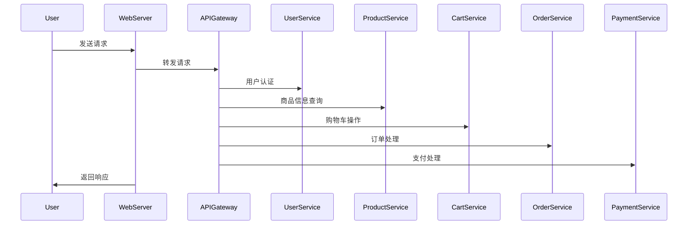
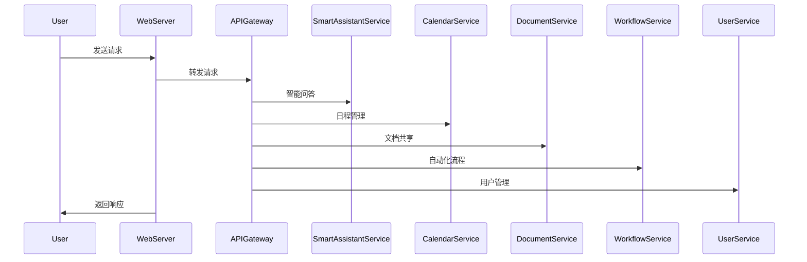

                 

### 摘要

《全栈技能培养：P9工程师的综合能力提升》旨在全面解析全栈工程师的职业素养与技能构建，助力P9级别工程师在技术领域的综合能力提升。本文首先从职业概述与未来发展趋势入手，分析全栈工程师的角色定位及其核心技能要求。接着，深入探讨前端开发、后端开发、数据库与存储等实战技能，通过具体项目案例分析，展示全栈工程师在实际应用中的综合素质。此外，文章还探讨了项目管理和团队协作、测试与运维、技术进阶及软技能提升等关键领域，最终展望全栈工程师的职业发展路径和未来趋势。通过这篇文章，读者可以系统性地了解全栈工程师所需的知识体系，掌握提升综合能力的策略和方法。

### 全栈工程师的职业概述与未来发展趋势

#### 职业背景与发展历程

在全栈工程师成为热门职业之前，IT行业通常采用“分栈”开发模式，即不同团队分别负责前端、后端、数据库、测试和运维等方面的工作。然而，随着互联网时代的到来和软件系统的日益复杂化，传统的分栈模式逐渐显露出其局限性。全栈工程师应运而生，成为解决这一问题的有效途径。

全栈工程师（Full-Stack Engineer）是指在软件开发生命周期的各个阶段，都能独立完成从前端到后端，包括数据库、测试和运维等各方面工作的工程师。这种模式不仅提高了开发效率，还优化了团队协作，使得开发过程更加流畅和高效。

#### 问题解决

全栈工程师的兴起解决了几个关键问题：

1. **沟通障碍**：由于各团队之间存在信息孤岛，传统的分栈模式往往导致沟通不畅，全栈工程师能够有效减少这种障碍。
2. **技能瓶颈**：分栈工程师往往专注于某一领域，而忽视了其他方面，这可能导致技能单一，影响整体项目的进展。
3. **资源浪费**：在传统的开发模式下，同一项目的不同部分需要多个团队分别完成，导致人力资源的浪费。

#### 边界与外延

全栈工程师与普通开发人员的主要区别在于其覆盖技能范围的广度。普通开发人员通常专注于某一特定的领域，如前端或后端开发，而全栈工程师则需要掌握前端、后端、数据库、测试和运维等多个领域的知识。这种多面手的角色不仅要求工程师具备扎实的专业技能，还需要具备良好的沟通和团队协作能力。

此外，全栈工程师不仅要在技术层面有所涉猎，还需要了解业务流程和用户体验，从而更好地为项目的整体成功贡献力量。这种综合能力的培养，使得全栈工程师在当今的IT行业中具有极大的竞争优势。

#### 1.1 职业背景与发展历程

随着互联网技术的迅猛发展，IT行业在近二十年间经历了深刻的变革。传统的“分栈”开发模式，即前端、后端、数据库、测试和运维等各个部分由不同团队独立完成，逐渐暴露出了一些不可忽视的问题。首先，各团队之间由于缺乏有效沟通，导致项目开发过程中频繁出现信息不对称的情况，这不仅影响了开发效率，还增加了项目风险。其次，分栈模式下的工程师往往专注于某一领域，而忽视了其他方面的技能，导致整体项目无法高效推进。此外，分栈模式还造成了人力资源的浪费，不同团队之间的重复工作增加了项目成本。

在这样的背景下，全栈工程师的概念应运而生。全栈工程师不仅具备前端、后端、数据库、测试和运维等各个领域的知识，还能够独立完成一个项目的全部开发过程，从而解决了传统分栈模式中的沟通障碍、技能瓶颈和资源浪费问题。全栈工程师的职责不仅仅局限于编写代码，还需要理解业务需求、优化用户体验、进行系统测试和部署维护等工作，这使得他们在整个软件开发生命周期中发挥了关键作用。

全栈工程师的兴起，与软件系统复杂度的提升和敏捷开发理念的推广密不可分。随着互联网应用的日益复杂，系统各个模块之间的交互和集成变得更加紧密，单一技能的工程师已经难以胜任复杂的开发任务。而敏捷开发强调快速迭代和团队协作，全栈工程师的多技能属性恰好能够满足这一需求，提高了团队的工作效率和项目的交付质量。

从历史发展来看，全栈工程师的角色经历了从边缘到核心的转变。早期，全栈工程师往往是在小公司或初创企业中发挥作用，随着大公司的逐渐认可和技术的不断进步，全栈工程师已经成为现代IT企业不可或缺的一环。许多顶级技术公司，如Google、Netflix和Uber等，都非常重视全栈工程师的招聘和培养，认为他们在提升团队协作和开发效率方面具有重要作用。

未来，随着人工智能、大数据和云计算等新兴技术的广泛应用，全栈工程师的角色将变得更加重要。他们不仅需要掌握现有的技术，还需要具备前瞻性，不断学习新技术和工具，以应对不断变化的市场需求。因此，全栈工程师的职业前景依然非常广阔，他们将在未来的技术浪潮中扮演更加重要的角色。

总之，全栈工程师的兴起是互联网时代和软件系统复杂化共同推动的结果。他们在提高开发效率、优化团队协作和降低项目成本方面具有显著优势，成为现代IT企业不可或缺的技术力量。随着技术的不断进步，全栈工程师的职业前景将更加光明，他们的综合能力将在未来发挥越来越重要的作用。

#### 1.2 全栈工程师的技能要求

成为一名合格的全栈工程师，需要掌握多个领域的专业技能，这些技能共同构成了全栈工程师的核心竞争力。以下是全栈工程师所需掌握的主要技能要求：

**1. 前端开发技能**

前端开发是全栈工程师的核心技能之一，主要包括HTML、CSS和JavaScript。HTML负责构建网页结构，CSS用于美化页面样式，而JavaScript则用于实现页面的动态效果和交互功能。除了这些基础技能，全栈工程师还需熟练掌握前端框架，如React、Vue和Angular等。这些框架提供了丰富的组件和工具，大大简化了前端开发的复杂度，提高了开发效率。

**2. 后端开发技能**

后端开发是全栈工程师的另一重要技能，涉及服务器、应用程序和数据库等。后端工程师需要掌握多种编程语言，如Java、Python、Node.js等，并根据项目需求选择最适合的语言进行开发。此外，全栈工程师还需熟悉后端框架，如SpringBoot、Django和Express等。这些框架提供了高效的开发工具和库，帮助工程师快速构建功能强大的后端服务。

**3. 数据库技术**

数据库是存储和管理数据的核心，全栈工程师需要掌握各种数据库技术，包括关系型数据库（如MySQL、PostgreSQL）和NoSQL数据库（如MongoDB、Cassandra）。了解数据库的设计原理、性能优化和分布式存储技术，对全栈工程师来说至关重要。此外，掌握数据库查询语言（如SQL）和数据库管理工具（如MySQL Workbench、MongoDB Compass）也是必不可少的技能。

**4. 测试技能**

软件测试是保证软件质量的重要环节，全栈工程师需要掌握多种测试方法和工具。功能测试、性能测试、安全测试和自动化测试等都是全栈工程师需要掌握的技能。自动化测试工具（如JUnit、Selenium）和持续集成工具（如Jenkins、GitLab CI）的使用，能够大大提高测试效率和准确性。

**5. 运维技能**

运维技能是全栈工程师的另一核心能力，涉及服务器配置、系统监控、故障排除和自动化部署等。掌握常见的运维工具（如Docker、Kubernetes、Ansible）和云服务（如AWS、Azure、Google Cloud）的使用，能够帮助工程师更高效地管理和部署应用。此外，了解网络架构和网络安全知识，也是运维技能的重要组成部分。

**6. 其他技能**

除了上述主要技能外，全栈工程师还需要具备一定的软技能，如沟通能力、团队合作能力和问题解决能力。这些软技能在团队合作和项目协调中起着关键作用，有助于提升团队整体的工作效率和项目交付质量。

综上所述，全栈工程师的技能要求涵盖了前端、后端、数据库、测试和运维等多个领域。这些技能不仅要求工程师具备扎实的理论基础，还需要通过实际项目经验不断积累和提升。只有全面掌握这些技能，全栈工程师才能在复杂的项目中游刃有余，发挥其独特的价值。

#### 1.3 全栈工程师的职业路径

成为一名全栈工程师并非一蹴而就，而是需要经过一系列的学习和实践过程。以下是全栈工程师的职业路径，以及可能遇到的瓶颈和解决方案。

**入门阶段**

在入门阶段，全栈工程师需要从基础技能开始学习，包括HTML、CSS、JavaScript、数据库基础等。这一阶段的核心目标是建立扎实的技能基础，为后续深入学习打下坚实的基础。常见的学习方式包括在线课程、编程网站和开源项目。通过这些途径，工程师可以逐步掌握基本技能，并在实际项目中得到应用。

**瓶颈：技能不全面**

在入门阶段，工程师可能会发现自身的技能不够全面，特别是在前端、后端和数据库等领域的知识相对薄弱。为解决这一瓶颈，工程师可以参加更多的在线课程和编程挑战，或者参与开源项目，以拓展自己的知识面和技能树。

**进阶阶段**

在进阶阶段，全栈工程师需要深入学习并掌握前端框架（如React、Vue）、后端框架（如SpringBoot、Django）和数据库技术（如MySQL、MongoDB）等。这一阶段的核心目标是提升专业能力，能够独立完成中小型项目的开发。

**瓶颈：知识体系不完善**

在进阶阶段，工程师可能会发现自身对某些技术细节的理解不够深入，或者知识体系不够完善。为解决这一瓶颈，工程师可以通过阅读技术书籍、参加技术会议和加入技术社群等方式，不断深化对技术概念的理解，并建立完整的知识体系。

**高级阶段**

在高级阶段，全栈工程师需要掌握更高级的技能，如自动化测试、持续集成、云计算和大数据等。这一阶段的核心目标是提升综合能力，能够在复杂项目中担任重要角色。

**瓶颈：实践经验不足**

在高级阶段，工程师可能会发现自己的实践经验不足，难以应对实际项目中的复杂情况。为解决这一瓶颈，工程师可以通过参与更多的实战项目，或者在现有项目中承担更多的责任，以积累实际经验。

**职业规划与自我提升**

全栈工程师的职业路径并非一成不变，而是需要不断调整和规划。以下是一些职业规划与自我提升的建议：

1. **持续学习**：技术日新月异，工程师需要不断学习新技术和新工具，以保持自身的竞争力。
2. **多角度思考**：在项目开发过程中，工程师需要从多个角度思考问题，提升问题解决能力。
3. **扩展技能树**：除了核心技能外，工程师还可以扩展自己的技能树，学习产品管理、项目管理等相关知识，以提升综合能力。
4. **加入社群**：加入技术社群，与其他工程师交流经验和心得，有助于提升个人技术水平。

总之，全栈工程师的职业路径需要不断学习和实践，通过不断调整和规划，才能在职业发展中取得成功。同时，持续提升自身的技术能力和软技能，也是全栈工程师长期发展的重要保障。

#### 2.1 前端开发技能实战

前端开发是全栈工程师的核心技能之一，它涉及到网页的结构、样式和交互。以下是前端开发技能的实战应用，包括前端技术概览、基础技术（HTML/CSS/JavaScript）、常用前端框架（React/Vue等）以及性能优化与安全。

**前端技术概览**

前端开发主要涵盖HTML、CSS和JavaScript三种技术。HTML（HyperText Markup Language）用于构建网页结构，CSS（Cascading Style Sheets）用于美化页面样式，JavaScript用于实现页面的动态效果和交互功能。

**HTML/CSS/JavaScript基础**

1. **HTML**：HTML负责定义网页的结构。掌握HTML5的新特性，如音频、视频和画布等，能够增强网页的功能和用户体验。常见的标签包括`<div>`, `<p>`, `<a>`, ``等。

2. **CSS**：CSS用于控制网页的样式。通过选择器和属性，CSS可以改变HTML元素的样式。常见的CSS属性有颜色、字体、边框、背景等。利用CSS框架（如Bootstrap），可以快速搭建美观的网页。

3. **JavaScript**：JavaScript是一种脚本语言，用于实现页面的动态效果和交互功能。掌握基本的JavaScript语法和函数，可以编写出功能丰富的网页。常用的JavaScript库有jQuery、Lodash等。

**常用前端框架**

前端框架如React、Vue和Angular，大大简化了前端开发的复杂度，提高了开发效率。

1. **React**：React是由Facebook推出的一种声明式、组件化的JavaScript库。React通过虚拟DOM和单向数据流，实现了高效的页面渲染和状态管理。React的基本组件包括`<App>`, `<Component>`和`<Props>`等。

   ```javascript
   import React from 'react';
   function App() {
     return (
       <div>
         <h1>Welcome to React</h1>
         <Component />
       </div>
     );
   }
   export default App;
   ```

2. **Vue**：Vue是由尤雨溪（Evan You）创建的一种渐进式JavaScript框架。Vue的核心库只关注视图层，易于上手，同时提供了高效的数据绑定和组合式API。Vue的基本组件包括`<template>`, `<script>`和`<style>`等。

   ```html
   <template>
     <div>
       <h1>Welcome to Vue</h1>
       <Component />
     </div>
   </template>
   <script>
   export default {
     data() {
       return {
         message: 'Hello Vue'
       };
     }
   };
   </script>
   <style>
     div {
       font-size: 16px;
     }
   </style>
   ```

**性能优化与安全**

1. **性能优化**：前端性能优化是提升用户体验的关键。常见的优化方法包括代码拆分、懒加载、缓存机制和CDN加速等。利用工具如Webpack和Gzip，可以进一步优化打包和传输效率。

2. **安全**：前端安全主要包括防止跨站脚本攻击（XSS）和跨站请求伪造（CSRF）等。通过使用内容安全策略（CSP）、验证请求来源和加密敏感数据等手段，可以有效提高前端应用的安全性。

总之，前端开发是全栈工程师的核心技能之一。通过掌握HTML、CSS、JavaScript和常用前端框架，并注重性能优化与安全，全栈工程师能够在复杂的前端项目中游刃有余，为用户带来优质的体验。

#### 2.2 后端开发技能实战

后端开发是全栈工程师的另一个核心技能，它涉及到服务器、应用程序和数据库等技术的应用。以下是后端开发技能的实战应用，包括后端技术概览、常用后端框架（SpringBoot/Node.js等）的使用、数据库技术（MySQL/PostgreSQL等）的掌握以及API设计与实现。

**后端技术概览**

后端开发主要涵盖服务器、应用程序和数据库等技术。服务器负责处理客户端请求，应用程序负责业务逻辑的处理，而数据库则用于数据的存储和管理。

**常用后端框架**

后端框架提供了高效的开发工具和库，能够简化后端开发的复杂度。以下是几种常见的后端框架：

1. **SpringBoot**：SpringBoot是由Pivotal团队推出的一种基于Spring框架的微服务开发框架。SpringBoot通过自动配置和依赖注入，极大地简化了Spring应用的搭建和部署。常用的SpringBoot组件包括`@SpringBootApplication`、`@Component`和`@RestController`等。

   ```java
   @SpringBootApplication
   public class Application {
       public static void main(String[] args) {
           SpringApplication.run(Application.class, args);
       }
   }
   
   @RestController
   public class HelloController {
       @RequestMapping("/hello")
       public String sayHello() {
           return "Hello World!";
       }
   }
   ```

2. **Node.js**：Node.js是一种基于Chrome V8引擎的JavaScript运行环境，它使得JavaScript不仅仅可以运行在浏览器中，还可以运行在服务器端。Node.js通过异步非阻塞的I/O操作，提高了服务器的响应速度和并发能力。常用的Node.js模块有HTTP、fs和path等。

   ```javascript
   const http = require('http');
   const fs = require('fs');
   
   const server = http.createServer((request, response) => {
       fs.readFile('index.html', (err, data) => {
           if (err) {
               response.writeHead(500);
               return response.end('Error loading index.html');
           }
           response.writeHead(200, { 'Content-Type': 'text/html' });
           response.end(data);
       });
   });
   
   server.listen(3000, () => {
       console.log('Server is listening on port 3000');
   });
   ```

**数据库技术**

数据库是后端开发的重要组件，用于数据的存储和管理。以下是几种常见的数据库技术：

1. **MySQL**：MySQL是一种开源的关系型数据库，具有高性能、高可靠性和易用性。常见的MySQL命令有SELECT、INSERT、UPDATE和DELETE等。

   ```sql
   CREATE DATABASE mydb;
   USE mydb;
   CREATE TABLE users (id INT AUTO_INCREMENT, username VARCHAR(255), PRIMARY KEY (id));
   INSERT INTO users (username) VALUES ('Alice'), ('Bob');
   SELECT * FROM users;
   ```

2. **PostgreSQL**：PostgreSQL是一种高级开源的关系型数据库，具有丰富的功能和强大的扩展性。常用的PostgreSQL命令有CREATE TABLE、INSERT INTO和JOIN等。

   ```sql
   CREATE TABLE users (id SERIAL PRIMARY KEY, username VARCHAR(255));
   INSERT INTO users (username) VALUES ('Alice'), ('Bob');
   SELECT * FROM users WHERE username = 'Alice';
   ```

**API设计与实现**

API（Application Programming Interface）是后端开发中用于不同系统之间交互的接口。以下是API设计与实现的几个关键点：

1. **RESTful API**：RESTful API是一种设计风格，用于构建Web服务。它通过HTTP协议的GET、POST、PUT和DELETE等方法实现资源的操作。

2. **路由与控制器**：路由用于定义API路径，控制器用于处理特定的HTTP请求。以下是一个简单的SpringBoot RESTful API示例：

   ```java
   @RestController
   public class UserController {
       @GetMapping("/users")
       public List<User> getAllUsers() {
           // 获取所有用户
           return userService.getAllUsers();
       }
       
       @GetMapping("/users/{id}")
       public User getUserById(@PathVariable Long id) {
           // 根据用户ID获取用户
           return userService.getUserById(id);
       }
       
       @PostMapping("/users")
       public User createUser(@RequestBody User user) {
           // 创建新用户
           return userService.createUser(user);
       }
   }
   ```

3. **数据验证与异常处理**：数据验证用于确保传入数据的正确性，异常处理用于处理错误的请求。以下是一个简单的数据验证和异常处理示例：

   ```java
   @RestController
   public class UserController {
       @GetMapping("/users")
       @Valid
       public List<User> getAllUsers(@Valid @RequestBody UserRequest request) {
           // 获取所有用户
           return userService.getAllUsers();
       }
       
       @ExceptionHandler(MethodArgumentNotValidException.class)
       public ResponseEntity<String> handleValidationException(MethodArgumentNotValidException ex) {
           return new ResponseEntity<>("Validation error", HttpStatus.BAD_REQUEST);
       }
   }
   ```

总之，后端开发是全栈工程师的另一个核心技能。通过掌握常用后端框架、数据库技术和API设计方法，全栈工程师能够在后端开发中实现高效、可靠的服务，为前端应用提供强大的支持。

#### 2.3 数据库与存储技能实战

数据库与存储技术是全栈工程师不可或缺的一部分，它直接影响到系统的性能和稳定性。本节将深入探讨数据库原理与设计、常用数据库技术（如MySQL、PostgreSQL）、数据库性能优化和分布式存储与大数据。

**数据库原理与设计**

数据库原理是理解数据库设计和操作的基础。以下是几个核心概念：

1. **关系型数据库**：关系型数据库（RDBMS）使用表格（Table）来存储数据，并通过关系（Relationship）连接不同的表。SQL（Structured Query Language）是关系型数据库的标准查询语言。

2. **范式**：范式（Normal Form）是用于设计合理数据库表结构的标准。常用的范式包括第一范式（1NF）、第二范式（2NF）和第三范式（3NF）。第三范式能够消除数据冗余和依赖，提高数据的完整性。

3. **实体关系图（ER图）**：实体关系图（Entity-Relationship Diagram）是用于描述数据库中实体及其关系的图形表示。ER图可以帮助开发者理解数据库结构，并进行有效的数据建模。

以下是一个简单的ER图示例，用于表示一个图书馆数据库中的书籍（Book）和作者（Author）实体：

```mermaid
erDiagram
    Book ||--|{ Author } : writtenBy
    Book {
        id
        title
        publicationDate
    }
    Author {
        id
        name
        birthDate
    }
```

**常用数据库技术**

以下是两种常见的关系型数据库技术：MySQL和PostgreSQL。

1. **MySQL**：MySQL是一种开源的关系型数据库，广泛用于Web应用。MySQL具有高性能、高可靠性和易用性。以下是一个简单的MySQL查询示例：

   ```sql
   CREATE DATABASE library;
   USE library;
   CREATE TABLE books (
       id INT AUTO_INCREMENT PRIMARY KEY,
       title VARCHAR(255) NOT NULL,
       publicationDate DATE NOT NULL
   );
   INSERT INTO books (title, publicationDate) VALUES ('The Great Gatsby', '1925-04-10');
   SELECT * FROM books;
   ```

2. **PostgreSQL**：PostgreSQL是一种高级开源的关系型数据库，具有丰富的功能和强大的扩展性。PostgreSQL常用于企业级应用。以下是一个简单的PostgreSQL查询示例：

   ```sql
   CREATE TABLE books (
       id SERIAL PRIMARY KEY,
       title VARCHAR(255) NOT NULL,
       publicationDate DATE NOT NULL
   );
   INSERT INTO books (title, publicationDate) VALUES ('To Kill a Mockingbird', '1960-07-11');
   SELECT * FROM books;
   ```

**数据库性能优化**

数据库性能优化是提高系统性能的关键。以下是几种常见的优化方法：

1. **索引**：索引（Index）用于加速数据查询。合理使用索引可以显著提高查询速度。

2. **查询优化**：优化SQL查询可以减少查询的时间和资源消耗。常用的优化方法包括使用`EXPLAIN`分析查询计划、避免使用子查询和联结操作等。

3. **分区**：分区（Partitioning）将大数据表划分为多个小表，从而提高查询速度和系统性能。

**分布式存储与大数据**

随着数据量的不断增长，分布式存储和大数据技术成为解决数据存储和处理的重要手段。以下是几种常见的分布式存储和大数据技术：

1. **Hadoop**：Hadoop是一个开源的大数据处理框架，包括HDFS（Hadoop Distributed File System）用于分布式文件存储和MapReduce用于分布式数据处理。

2. **Cassandra**：Cassandra是一种分布式NoSQL数据库，适用于处理大规模数据存储和高可用性。

3. **MongoDB**：MongoDB是一种分布式文档数据库，具有灵活的数据模型和强大的查询能力。

通过掌握数据库原理与设计、常用数据库技术、数据库性能优化和分布式存储与大数据技术，全栈工程师能够为系统提供高效、可靠的数据存储和处理方案，从而提升系统的整体性能。

#### 3.1 项目管理基础

项目管理是确保项目顺利进行、按时交付和达成预期目标的关键环节。对于全栈工程师来说，掌握项目管理的基础知识不仅有助于提高个人效率，还能优化团队协作和项目质量。以下是项目管理的基础要素、核心要素及其方法与工具的详细介绍。

**项目管理的必要性**

项目管理在软件开发过程中扮演着至关重要的角色。其主要目的是确保项目按时、按质、按预算完成。通过项目管理，团队可以更好地协调资源、控制风险、应对变更，并提升项目成功的机会。以下是项目管理的几个关键必要性：

1. **资源优化**：项目管理有助于合理分配和利用团队资源，避免资源浪费和冗余，从而提高项目的效率。
2. **风险控制**：通过项目管理，可以识别和评估项目风险，并制定相应的应对策略，减少项目失败的可能性。
3. **进度监控**：项目管理提供了对项目进度的实时监控，确保项目按时交付，及时发现并解决问题。
4. **质量保证**：通过项目管理，可以制定和实施质量保证计划，确保项目成果符合预期标准和用户需求。

**项目管理的核心要素**

项目管理的核心要素包括项目目标、范围、进度、成本、质量、资源、风险和沟通。以下是这些要素的详细说明：

1. **项目目标**：明确项目目标有助于团队集中资源和努力，确保项目方向的正确性。
2. **项目范围**：项目范围定义了项目的边界，包括项目应完成的工作内容和不应包含的内容。
3. **进度**：项目进度是指项目从开始到完成的时间安排，包括关键路径和里程碑。
4. **成本**：项目成本是指完成项目所需的所有费用，包括人力、设备和材料等。
5. **质量**：项目质量是指项目成果满足既定标准和用户需求的程度，包括功能、性能和可靠性等。
6. **资源**：项目资源包括人力、设备、材料和资金等，合理配置资源是项目成功的关键。
7. **风险**：项目风险是指可能影响项目目标实现的不确定因素，包括技术风险、市场风险和项目管理风险等。
8. **沟通**：项目沟通是确保团队内部和与外部利益相关者有效沟通的过程，包括信息传递、会议和报告等。

**项目管理的方法与工具**

以下是几种常见项目管理方法和工具：

1. **瀑布模型**：瀑布模型是一种传统的线性顺序开发方法，每个阶段必须在前一个阶段完成后才能开始。适用于需求明确、变更较少的项目。

2. **敏捷开发**：敏捷开发是一种迭代和增量的开发方法，强调快速反馈和持续交付。适用于需求变化频繁、用户参与度高的项目。

3. **Scrum**：Scrum是一种敏捷开发方法，通过短周期的迭代（Sprint）和日常站会、周会和回顾会等方式，确保团队高效协作和持续改进。

4. **Kanban**：Kanban是一种基于看板的方法，用于可视化工作流程和流程改进。通过限制在流程中的工作项数量，提高工作效率。

5. **项目管理工具**：常见的项目管理工具包括JIRA、Trello、Asana和Microsoft Project等。这些工具可以帮助团队进行任务分配、进度跟踪、风险管理和沟通协作。

**边界与外延**

项目管理不仅涵盖技术层面的工作，还包括业务管理、团队管理和时间管理等多个方面。虽然项目管理在不同类型和规模的项目中有不同的应用，但其核心目标是一致的：确保项目成功交付。同时，项目管理还与产品管理、质量管理、风险管理和变更管理等多个领域密切相关。

通过掌握项目管理的基础知识、核心要素和常用方法与工具，全栈工程师可以在项目中发挥更大的作用，提升项目成功的机会和自身职业素养。

#### 3.2 团队协作与沟通

团队协作与沟通是项目成功的关键因素，尤其是在快速变化的IT行业中，良好的团队协作与沟通能力能够显著提升项目的执行效率和质量。以下是团队协作的重要性、团队协作的最佳实践以及团队沟通技巧与团队文化构建的详细探讨。

**团队协作的重要性**

团队协作之所以重要，主要是因为它可以实现资源的最优配置和知识的最有效利用。以下是团队协作的重要性体现在以下几个方面：

1. **知识共享**：团队成员来自不同的背景，拥有不同的专业技能和经验。通过协作，团队成员可以相互分享知识和经验，从而提升整个团队的能力。
2. **任务分工**：在团队协作中，每个成员可以根据自己的专长和兴趣承担不同的任务，实现高效的资源利用和任务分配。
3. **协同创新**：团队协作鼓励成员之间的沟通与碰撞，有助于产生新的创意和解决方案，推动项目的创新和发展。
4. **责任分担**：在团队协作中，团队成员共同承担项目责任，有助于减轻个人压力，提高整体项目的稳定性和可靠性。
5. **风险共担**：团队协作使得团队成员在面对项目风险时能够共同应对，减少个别成员承担风险的可能性。

**团队协作的最佳实践**

为了实现高效的团队协作，以下是一些最佳实践：

1. **明确目标和职责**：确保每个团队成员都清楚项目的目标和自己的职责，有助于提高工作效率和团队凝聚力。
2. **定期会议**：通过定期的团队会议（如每日站会、周会和月会），团队成员可以及时沟通进展、解决问题和调整计划。
3. **任务跟踪**：使用任务管理工具（如JIRA、Trello）跟踪任务进度，确保每个任务都有明确的负责人和截止日期。
4. **透明沟通**：保持团队沟通的透明性，确保所有成员都能了解项目的整体进展和关键决策。
5. **分工与协作**：合理分工，确保每个成员都能在其擅长的领域发挥最大价值，同时鼓励成员之间的协作和支持。

**团队沟通技巧与团队文化构建**

有效的团队沟通是团队协作的基础，以下是一些团队沟通技巧和团队文化构建的方法：

1. **主动倾听**：在沟通中，积极倾听对方意见和反馈，确保理解对方的观点，有助于减少误解和冲突。
2. **清晰表达**：表达观点时要清晰、简洁、具体，避免使用模糊和歧义的语言，确保信息传递准确无误。
3. **积极反馈**：及时给予团队成员正面的反馈和鼓励，增强团队成员的自信心和积极性。
4. **尊重差异**：尊重团队成员的不同观点和背景，鼓励开放和包容的沟通氛围。
5. **建立信任**：通过建立信任和相互尊重，增强团队的凝聚力和合作意愿。

团队文化是团队协作和沟通的重要支撑，以下是一些构建团队文化的策略：

1. **共同价值观**：建立共同的价值观和使命，使团队成员在共同目标下团结一致。
2. **激励机制**：设立合理的激励机制，鼓励团队成员积极投入工作，提升团队整体绩效。
3. **培训与成长**：为团队成员提供培训和发展机会，帮助他们不断提升个人能力和团队素质。
4. **团队建设活动**：定期组织团队建设活动，增强团队成员之间的信任和默契，提升团队凝聚力。

总之，团队协作与沟通在项目成功中起着至关重要的作用。通过实施最佳实践、提升沟通技巧和构建积极团队文化，全栈工程师可以有效地提升团队协作和项目执行效率，为项目的成功奠定坚实基础。

#### 4.1 自动化测试

自动化测试是确保软件质量、提高开发效率和降低成本的重要手段。在快速迭代的软件开发过程中，自动化测试能够有效地减少手动测试的工作量，提高测试覆盖率和准确性。以下是自动化测试的优势、实践方法以及常用测试工具的详细介绍。

**自动化测试的优势**

1. **提高测试效率**：自动化测试可以快速执行大量测试用例，比手动测试速度快得多，特别是在回归测试和性能测试中，自动化测试的优势尤为明显。
2. **降低成本**：通过自动化测试，可以减少对大量测试人员的依赖，节省人力资源成本。
3. **提高测试覆盖率**：自动化测试能够覆盖更多的测试场景和边界条件，提高测试的全面性和深度，减少潜在缺陷的遗漏。
4. **保证一致性**：自动化测试工具能够严格按照预设的脚本执行测试，确保每次测试的一致性和可重复性，减少人为因素对测试结果的影响。
5. **早期发现问题**：自动化测试可以在开发周期的早期阶段发现和修复问题，降低后期修复成本。

**自动化测试的实践方法**

1. **制定测试策略**：在项目开始前，制定详细的自动化测试策略，包括测试范围、测试用例设计、测试工具选择等。
2. **设计测试用例**：根据业务需求和功能点，设计自动化测试用例，确保测试覆盖面全面。
3. **编写测试脚本**：使用自动化测试工具编写测试脚本，将测试用例自动化，常见工具包括Selenium、JUnit、Cucumber等。
4. **执行测试**：运行自动化测试脚本，收集测试结果，并根据测试结果调整测试脚本和测试用例。
5. **持续集成**：将自动化测试集成到持续集成（CI）流程中，确保每次代码提交后都能自动执行测试，及时发现和修复问题。

**常用测试工具**

1. **Selenium**：Selenium是一款开源的自动化测试工具，支持多种浏览器和编程语言，适用于Web应用的自动化测试。
2. **JUnit**：JUnit是一款流行的Java测试框架，用于编写和执行单元测试，广泛应用于Java项目。
3. **Cucumber**：Cucumber是一款基于BDD（Behavior-Driven Development）的自动化测试工具，适用于编写测试脚本和自动化测试用例。
4. **TestNG**：TestNG是一款功能强大的测试框架，用于编写和执行多种类型的测试，包括单元测试、集成测试和端到端测试。
5. **JUnit**：JUnit是一款经典的Java测试框架，支持编写和执行多种类型的测试用例，广泛应用于Java项目。

**自动化测试的实际应用**

以下是自动化测试在项目中的实际应用示例：

1. **回归测试**：在每次代码提交后，自动运行回归测试，确保新代码没有引入新的缺陷。
2. **性能测试**：通过自动化性能测试，模拟高负载场景，评估系统性能，发现潜在的性能瓶颈。
3. **跨浏览器测试**：使用Selenium等工具，自动在不同的浏览器中执行测试，确保Web应用在不同环境下的兼容性。
4. **API测试**：使用工具如Postman或REST-Assured，自动测试API的可用性和准确性。

总之，自动化测试是现代软件开发中不可或缺的一部分。通过实施自动化测试，全栈工程师能够显著提高软件质量、降低开发成本，并提升项目的整体效率。

#### 4.2 运维与持续集成

运维（Operations）与持续集成（Continuous Integration, CI）是软件开发生命周期中至关重要的环节，它们确保了软件项目的稳定性和可靠性。以下是运维在软件开发过程中的作用、最佳实践、持续集成与持续部署（CI/CD）的详细探讨。

**运维在软件开发过程中的作用**

运维是确保软件系统正常运行和高效运行的关键环节。以下是运维在软件开发过程中的几个重要作用：

1. **系统监控**：运维负责监控系统的性能、资源使用情况和潜在问题，确保系统始终处于最佳运行状态。
2. **故障排除**：当系统出现故障时，运维人员需要快速定位并解决问题，以减少系统停机时间和影响。
3. **自动化部署**：运维通过自动化工具和脚本，实现软件的自动化部署，提高部署效率和一致性。
4. **备份与恢复**：运维负责定期备份数据，确保数据的安全性和可恢复性，以便在灾难发生时能够快速恢复。
5. **安全性**：运维负责确保系统的安全性，包括配置管理、权限控制和漏洞修补等。

**运维的最佳实践**

为了确保运维的高效和可靠，以下是一些最佳实践：

1. **自动化**：使用自动化工具和脚本实现日常运维任务，如自动化部署、监控和备份等，减少手动操作和人为错误。
2. **标准化**：制定统一的运维标准和流程，确保所有团队成员遵循相同的操作规范，提高运维的一致性和可重复性。
3. **日志管理**：集中管理和分析系统日志，及时发现和解决问题，提高系统的可观测性和可维护性。
4. **持续改进**：定期回顾和优化运维流程和工具，持续改进运维效率和质量。
5. **文档化**：详细记录运维操作流程、配置和工具使用方法，方便新成员快速上手和提高运维团队的整体技能水平。

**持续集成与持续部署（CI/CD）**

持续集成（CI）和持续部署（CD）是现代软件开发中提高效率和质量的关键实践。以下是CI/CD的详细探讨：

1. **持续集成（CI）**：
   - **概念**：持续集成是指在每个代码提交后自动执行一系列的构建和测试任务，确保新代码不会破坏现有功能。
   - **实现**：通过集成自动化工具（如Jenkins、GitLab CI）实现CI。每次代码提交都会触发构建和测试，确保代码质量。
   - **优势**：快速发现问题、减少集成风险、提高开发效率。

2. **持续部署（CD）**：
   - **概念**：持续部署是指将经过测试的代码自动部署到生产环境，确保新功能能够快速、安全地上线。
   - **实现**：通过自动化部署工具（如Docker、Kubernetes）实现CD。部署过程包括容器化、测试、部署和回滚等步骤。
   - **优势**：提高部署效率、降低部署风险、确保系统稳定性。

**运维与持续集成的结合**

运维与持续集成的结合，实现了从代码提交到生产部署的自动化流程，以下是几个关键结合点：

1. **自动化流水线**：构建自动化流水线，将代码提交、构建、测试、部署等环节整合在一起，确保每个环节都能自动化执行。
2. **基础设施即代码**：使用基础设施即代码（Infrastructure as Code, IaC）工具（如Terraform、Ansible）管理基础设施配置，确保配置的自动化和一致性。
3. **监控与反馈**：通过集成监控工具（如Prometheus、Grafana），实时监控系统的性能和健康状态，及时发现并反馈问题。
4. **回滚策略**：在部署失败时，快速回滚到上一版本，减少对用户的影响。

**总结**

运维与持续集成在现代软件开发中发挥着至关重要的作用。通过自动化、标准化和持续改进，运维和持续集成能够显著提高软件项目的稳定性、可靠性和效率。全栈工程师应熟练掌握这些技能，为项目的成功提供坚实的技术保障。

### 5.1 技术进阶

在IT行业快速发展的今天，技术更新迭代的速度远超以往。对于全栈工程师而言，技术进阶不仅是提升个人竞争力的关键，更是保持项目活力和业务创新的基石。以下是全栈工程师在技术进阶过程中需要关注的关键点，以及如何保持技术前沿的探讨。

**关注新兴技术和工具**

新兴技术和工具是全栈工程师保持技术前沿的重要途径。以下是一些当前热门的技术和工具：

1. **区块链技术**：区块链技术以其去中心化、不可篡改和透明性等特点，在金融、供应链管理等领域引起了广泛关注。全栈工程师可以通过学习区块链的基本原理和智能合约开发，掌握这一前沿技术。

2. **边缘计算**：边缘计算将计算能力从云端转移到网络边缘，减少了数据传输延迟，提高了系统的实时性和响应速度。了解边缘计算的工作原理和适用场景，对于开发高效、低延迟的应用至关重要。

3. **人工智能与机器学习**：人工智能和机器学习技术在各个行业中都展现出了巨大的潜力。全栈工程师可以通过学习Python、TensorFlow或PyTorch等工具，掌握基本的机器学习算法和应用。

4. **函数式编程**：函数式编程是一种编程范式，强调通过不可变数据和纯函数来解决问题。学习函数式编程语言（如Haskell、Scala）可以帮助全栈工程师从新的角度理解和解决编程问题。

**持续学习和实践**

持续学习和实践是技术进阶的核心。以下是几个有效的学习和实践方法：

1. **在线课程与培训**：利用在线平台（如Coursera、Udemy、Pluralsight）参加专业课程，学习新知识和技能。这些课程通常由行业专家授课，内容更新及时，能够帮助工程师快速掌握新技术。

2. **阅读技术书籍和文档**：技术书籍和官方文档是深入学习技术的基础。通过阅读《深度学习》（Deep Learning）、《编程珠玑》（Code Complete）等经典书籍，可以全面提升技术素养。

3. **参与开源项目**：参与开源项目是实践和提升技能的绝佳途径。通过为开源项目贡献代码，工程师不仅能够积累实践经验，还能与全球开发者交流学习。

4. **编写技术博客**：撰写技术博客可以帮助工程师整理和巩固所学知识，同时也能分享经验，为社区做出贡献。通过写作，工程师可以激发灵感，拓展思维。

**拓展技术视野**

除了掌握具体的技术和工具，全栈工程师还应该关注技术发展趋势和行业动态。以下是几个拓展技术视野的方法：

1. **技术会议和研讨会**：参加技术会议和研讨会，与行业专家和同行交流，了解最新的技术动态和应用案例。这些活动是获取前沿知识和建立人脉网络的重要途径。

2. **关注技术社区**：关注技术社区（如Stack Overflow、GitHub、Reddit的技术板块）和博客（如Medium、Dev.to），跟踪最新的技术话题和讨论，保持与行业的同步。

3. **跨领域学习**：尝试将所学技术应用到其他领域，如将前端技术应用于数据分析、将后端技术应用于物联网等。这种跨领域的学习可以帮助工程师拓展视野，提升综合能力。

通过关注新兴技术、持续学习和实践、拓展技术视野，全栈工程师可以不断提升自身的技术能力，保持技术前沿，为职业生涯的长期发展打下坚实基础。

#### 5.2 软技能提升

在技术飞速发展的今天，软技能的重要性日益凸显。对于全栈工程师而言，除了扎实的技术能力，良好的软技能同样至关重要，它们能够显著提升工作效率、团队协作能力和项目质量。以下是软技能提升的重要性、提升方法以及案例分析。

**软技能提升的重要性**

1. **沟通能力**：有效的沟通是团队协作和项目成功的关键。良好的沟通能力能够确保团队成员之间信息传递准确无误，减少误解和冲突，提升工作效率。

2. **团队合作能力**：项目往往需要团队成员紧密合作才能完成。具备团队合作能力能够帮助工程师在项目中发挥协同效应，共同解决问题，提升团队绩效。

3. **时间管理能力**：合理的时间管理能够帮助工程师高效利用时间，确保项目按时交付。良好的时间管理能力包括任务优先级排序、时间分配和进度监控等。

4. **问题解决能力**：在软件开发过程中，工程师会遇到各种复杂问题。具备良好的问题解决能力能够帮助工程师迅速找到解决方案，提高问题解决效率。

5. **自我驱动能力**：自我驱动能力是职业发展中不可或缺的品质。具备自我驱动能力能够帮助工程师持续学习和成长，适应不断变化的技术环境。

**提升方法**

1. **持续学习**：不断学习是提升软技能的基础。通过参加培训课程、阅读相关书籍和博客、观看在线教程等途径，工程师可以不断吸收新知识，提升自己的软技能。

2. **实践与反思**：在实际工作中，通过具体项目实践，工程师可以锻炼和提升软技能。每次项目结束后，进行反思和总结，分析自己在沟通、合作和时间管理等方面的不足，并制定改进计划。

3. **团队活动**：参加团队活动（如团队建设、培训活动和会议）能够增强团队合作能力和沟通技巧。在团队活动中，工程师可以与同事互动，学习他人的经验和做法。

4. **角色扮演**：角色扮演是一种有效的练习方法，可以帮助工程师提升沟通能力和团队合作能力。通过模拟实际工作场景，工程师可以在没有风险的环境中练习和改进软技能。

**案例分析**

以下是几个软技能提升的案例分析：

1. **案例分析1：沟通能力的提升**

   工程师A在工作中发现，由于沟通不畅，项目进展常常受阻。为了提升沟通能力，他采取以下措施：

   - 参加沟通技巧培训课程，学习有效沟通的方法。
   - 与同事建立定期沟通机制，确保项目进展透明。
   - 使用工具（如Slack、Trello）进行实时沟通和任务管理。
   - 定期进行沟通反馈，总结和分享有效的沟通经验。

   通过这些措施，工程师A的沟通能力得到了显著提升，项目进展更加顺利。

2. **案例分析2：团队合作能力的提升**

   工程师B所在的项目团队曾因合作不畅导致项目延期。为了提升团队合作能力，团队采取了以下措施：

   - 定期举行团队建设活动，增强团队凝聚力。
   - 实施敏捷开发方法，通过每日站会和迭代回顾会议，促进团队成员之间的沟通与协作。
   - 分配明确的任务和责任，确保每个团队成员都能充分发挥自己的优势。
   - 建立反馈机制，鼓励团队成员提出改进意见和建议。

   通过这些措施，工程师B所在的团队合作能力得到了显著提升，项目按时交付，团队绩效提升。

3. **案例分析3：时间管理能力的提升**

   工程师C发现自己在项目管理中经常出现时间安排不合理的问题。为了提升时间管理能力，他采取了以下措施：

   - 使用时间管理工具（如Trello、Google Calendar）制定任务和时间计划。
   - 制定优先级排序，确保重要任务优先完成。
   - 定期回顾时间使用情况，分析时间浪费的原因，并制定改进措施。

   通过这些措施，工程师C的时间管理能力得到了显著提升，工作效率大幅提高。

**总结**

软技能的提升对于全栈工程师的职业发展至关重要。通过持续学习、实践与反思、团队活动以及角色扮演等方法，工程师可以不断提升自己的软技能，为项目的成功和职业的长期发展打下坚实基础。

#### 6.1 实践案例1：电商平台全栈开发

在本案例中，我们将详细探讨一个电商平台的构建过程，从项目介绍、系统功能设计、系统架构设计到代码实现与分析。通过这一案例，读者可以全面了解全栈工程师在实际项目中的应用。

**项目介绍**

本项目旨在构建一个功能完善的电商平台，涵盖用户注册、商品浏览、购物车管理、订单处理和支付功能。平台需具备良好的用户体验和高效的后端处理能力，以支持大规模用户访问和交易。

**系统功能设计**

电商平台的主要功能模块包括：

1. **用户管理**：用户注册、登录、密码找回等。
2. **商品管理**：商品展示、分类管理、商品详情页等。
3. **购物车**：添加商品、修改数量、删除商品等。
4. **订单管理**：下单、订单状态更新、订单详情查询等。
5. **支付**：支付接口调用、支付结果处理等。

**系统架构设计**

电商平台采用分层架构设计，包括前端、后端和数据库。以下是详细的系统架构设计：

1. **前端**：使用React框架构建，实现用户界面的动态渲染和交互功能。前端界面通过API与后端服务进行数据通信。
2. **后端**：采用SpringBoot框架，实现业务逻辑处理和数据管理。后端服务包括用户服务、商品服务、订单服务和支付服务。
3. **数据库**：使用MySQL数据库存储用户数据、商品数据、订单数据和支付数据。数据库设计遵循第三范式，确保数据的完整性和一致性。

以下是系统架构图：



**代码实现与分析**

以下是对关键模块的实现和分析：

1. **用户管理**

   用户注册功能通过SpringBoot的RESTful API实现。以下是用户注册的接口代码：

   ```java
   @RestController
   @RequestMapping("/users")
   public class UserController {
       @Autowired
       private UserService userService;

       @PostMapping("/register")
       public ResponseEntity<?> registerUser(@RequestBody UserDto userDto) {
           try {
               User user = userService.registerUser(userDto);
               return ResponseEntity.ok(user);
           } catch (Exception e) {
               return ResponseEntity.badRequest().body(e.getMessage());
           }
       }
   }
   ```

   用户注册功能包括验证用户名是否存在、密码强度检测等，确保用户数据的安全性和完整性。

2. **商品管理**

   商品展示功能通过SpringBoot的RESTful API实现。以下是商品信息查询的接口代码：

   ```java
   @RestController
   @RequestMapping("/products")
   public class ProductService {
       @Autowired
       private ProductService productService;

       @GetMapping("/list")
       public ResponseEntity<List<Product>> getAllProducts() {
           List<Product> products = productService.getAllProducts();
           return ResponseEntity.ok(products);
       }
   }
   ```

   商品管理功能包括商品分类管理、商品详情展示等，确保用户能够方便地浏览和选择商品。

3. **购物车**

   购物车功能通过SpringBoot的RESTful API实现。以下是添加购物车项的接口代码：

   ```java
   @RestController
   @RequestMapping("/cart")
   public class CartService {
       @Autowired
       private CartService cartService;

       @PostMapping("/add")
       public ResponseEntity<?> addCartItem(@RequestBody CartItemDto cartItemDto) {
           try {
               cartService.addCartItem(cartItemDto);
               return ResponseEntity.ok("Item added to cart");
           } catch (Exception e) {
               return ResponseEntity.badRequest().body(e.getMessage());
           }
       }
   }
   ```

   购物车功能包括商品添加、数量修改、删除等操作，确保用户能够灵活管理购物车。

4. **订单管理**

   订单处理功能通过SpringBoot的RESTful API实现。以下是下单接口的代码：

   ```java
   @RestController
   @RequestMapping("/orders")
   public class OrderService {
       @Autowired
       private OrderService orderService;

       @PostMapping("/create")
       public ResponseEntity<Order> createOrder(@RequestBody OrderDto orderDto) {
           Order order = orderService.createOrder(orderDto);
           return ResponseEntity.ok(order);
       }
   }
   ```

   订单管理功能包括订单创建、订单状态更新、订单详情查询等，确保订单处理流程的高效和准确。

5. **支付**

   支付功能通过第三方支付接口实现，如支付宝、微信支付等。以下是支付接口的代码：

   ```java
   @RestController
   @RequestMapping("/payments")
   public class PaymentService {
       @Autowired
       private PaymentService paymentService;

       @PostMapping("/process")
       public ResponseEntity<?> processPayment(@RequestBody PaymentDto paymentDto) {
           try {
               PaymentResponse response = paymentService.processPayment(paymentDto);
               return ResponseEntity.ok(response);
           } catch (Exception e) {
               return ResponseEntity.badRequest().body(e.getMessage());
           }
       }
   }
   ```

   支付功能包括支付请求处理、支付结果验证等，确保支付过程的安全和可靠。

**项目小结**

通过本案例，我们详细介绍了电商平台的全栈开发过程，包括项目介绍、系统功能设计、系统架构设计、代码实现与分析。这一案例展示了全栈工程师如何在实际项目中应用所学技能，实现一个功能完善、性能可靠的电商平台。通过这一案例的学习，读者可以深入了解全栈开发的各个环节，提升自己的项目实战能力。

#### 6.2 实践案例2：智能办公系统开发

在本案例中，我们将探讨一个智能办公系统的构建过程，涵盖项目介绍、系统功能设计、系统架构设计、代码实现与分析。通过这一案例，读者可以深入理解全栈工程师如何应用综合技能，实现一个具备智能化功能的办公系统。

**项目介绍**

智能办公系统旨在提高企业办公效率，通过集成智能助手、日程管理、文档共享和自动化流程等功能，实现办公过程的智能化和自动化。系统需支持多平台访问，具备良好的用户体验和强大的数据处理能力。

**系统功能设计**

智能办公系统的主要功能模块包括：

1. **智能助手**：提供智能问答、日程提醒和任务管理功能，支持自然语言交互。
2. **日程管理**：实现日程查看、创建、修改和删除功能，支持日历视图和提醒设置。
3. **文档共享**：提供文档上传、下载、共享和版本控制功能，支持多种文档格式。
4. **自动化流程**：实现审批流程、报销流程和会议预约等自动化处理，提高办公效率。
5. **用户管理**：支持用户注册、登录、权限管理和个人信息管理。

**系统架构设计**

智能办公系统采用微服务架构设计，包括前端、后端、数据库和第三方服务。以下是详细的系统架构设计：

1. **前端**：使用Vue框架构建，实现用户界面的动态渲染和交互功能。前端通过RESTful API与后端服务进行数据通信。
2. **后端**：采用SpringBoot框架，实现业务逻辑处理和数据管理。后端服务包括智能助手服务、日程管理服务、文档共享服务和用户管理服务。
3. **数据库**：使用MySQL数据库存储用户数据、日程数据、文档数据和流程数据。数据库设计遵循第三范式，确保数据的完整性和一致性。
4. **第三方服务**：集成自然语言处理（NLP）服务、邮件服务和短信服务，实现智能助手的功能。

以下是系统架构图：



**代码实现与分析**

以下是对关键模块的实现和分析：

1. **智能助手**

   智能助手功能通过SpringBoot的RESTful API实现。以下是智能问答接口的代码：

   ```java
   @RestController
   @RequestMapping("/assistant")
   public class SmartAssistantService {
       @Autowired
       private SmartAssistantService assistantService;

       @PostMapping("/question")
       public ResponseEntity<?> askQuestion(@RequestBody QuestionDto questionDto) {
           String answer = assistantService.answerQuestion(questionDto);
           return ResponseEntity.ok(answer);
       }
   }
   ```

   智能助手功能通过调用NLP服务，实现自然语言处理和智能回答。

2. **日程管理**

   日程管理功能通过SpringBoot的RESTful API实现。以下是日程查看接口的代码：

   ```java
   @RestController
   @RequestMapping("/calendar")
   public class CalendarService {
       @Autowired
       private CalendarService calendarService;

       @GetMapping("/events")
       public ResponseEntity<List<Event>> getEvents(@RequestParam("userId") Long userId) {
           List<Event> events = calendarService.getEvents(userId);
           return ResponseEntity.ok(events);
       }
   }
   ```

   日程管理功能包括日程查看、创建、修改和删除等操作，确保用户能够方便地管理日程。

3. **文档共享**

   文档共享功能通过SpringBoot的RESTful API实现。以下是文档上传接口的代码：

   ```java
   @RestController
   @RequestMapping("/documents")
   public class DocumentService {
       @Autowired
       private DocumentService documentService;

       @PostMapping("/upload")
       public ResponseEntity<Document> uploadDocument(@RequestBody MultipartFile file, @RequestParam("userId") Long userId) {
           Document document = documentService.uploadDocument(file, userId);
           return ResponseEntity.ok(document);
       }
   }
   ```

   文档共享功能包括文档上传、下载、共享和版本控制等，支持多种文档格式。

4. **自动化流程**

   自动化流程功能通过SpringBoot的RESTful API实现。以下是审批流程接口的代码：

   ```java
   @RestController
   @RequestMapping("/workflow")
   public class WorkflowService {
       @Autowired
       private WorkflowService workflowService;

       @PostMapping("/approve")
       public ResponseEntity<?> approveTask(@RequestBody ApprovalDto approvalDto) {
           try {
               workflowService.approveTask(approvalDto);
               return ResponseEntity.ok("Task approved");
           } catch (Exception e) {
               return ResponseEntity.badRequest().body(e.getMessage());
           }
       }
   }
   ```

   自动化流程功能包括审批流程、报销流程和会议预约等，实现办公流程的自动化处理。

5. **用户管理**

   用户管理功能通过SpringBoot的RESTful API实现。以下是用户注册接口的代码：

   ```java
   @RestController
   @RequestMapping("/users")
   public class UserService {
       @Autowired
       private UserService userService;

       @PostMapping("/register")
       public ResponseEntity<?> registerUser(@RequestBody UserDto userDto) {
           try {
               User user = userService.registerUser(userDto);
               return ResponseEntity.ok(user);
           } catch (Exception e) {
               return ResponseEntity.badRequest().body(e.getMessage());
           }
       }
   }
   ```

   用户管理功能包括用户注册、登录、权限管理和个人信息管理，确保系统的安全性和可用性。

**项目小结**

通过本案例，我们详细介绍了智能办公系统的构建过程，从项目介绍、系统功能设计、系统架构设计到代码实现与分析。这一案例展示了全栈工程师如何应用所学技能，实现一个具备智能化功能的办公系统。通过这一案例的学习，读者可以深入理解全栈开发的各个环节，提升自己的项目实战能力。

### 7.1 未来趋势与挑战

随着技术的不断进步，全栈工程师面临着诸多趋势与挑战。了解这些趋势和挑战，有助于工程师更好地规划职业生涯，保持技术前沿。

**未来趋势**

1. **云计算与边缘计算**：云计算使得全栈工程师能够更灵活地构建和部署应用，而边缘计算则将计算能力推向网络边缘，提升了实时性和响应速度。全栈工程师需要掌握云计算平台（如AWS、Azure）和边缘计算技术。

2. **人工智能与大数据**：人工智能和大数据技术的应用越来越广泛，全栈工程师需了解机器学习、数据挖掘等基本概念，并掌握相关工具（如TensorFlow、Spark）。

3. **区块链技术**：区块链技术以其去中心化和不可篡改性，在金融、供应链等领域显示出巨大潜力。全栈工程师需掌握区块链的基本原理和开发工具（如Hyperledger Fabric）。

4. **微服务与容器化**：微服务架构和容器化（如Docker、Kubernetes）提升了系统的灵活性和可维护性。全栈工程师需熟悉微服务设计和容器化技术。

**挑战**

1. **技术更新速度**：技术更新速度加快，工程师需不断学习新技术和工具，以保持竞争力。

2. **技能多样化**：全栈工程师需掌握前端、后端、数据库、测试和运维等多方面技能，实现这一目标需要大量的时间和精力。

3. **项目管理难度**：在复杂项目中，全栈工程师需具备良好的项目管理能力，以应对项目进度、资源分配和团队协作等挑战。

**应对策略**

1. **持续学习**：利用在线课程、技术书籍和社区资源，保持对新技术和工具的了解。

2. **实战经验**：通过参与实际项目和开源项目，积累实战经验，提升综合能力。

3. **时间管理**：合理规划时间，确保学习与工作之间的平衡。

4. **团队合作**：积极参与团队协作，提升沟通和项目管理能力。

通过了解未来趋势和挑战，全栈工程师可以更好地规划职业生涯，持续提升自身能力，为未来的技术浪潮做好准备。

### 7.2 全栈工程师的职业规划

全栈工程师的职业规划是一个持续的过程，涉及到技能提升、职业路径选择以及职业生涯中的关键决策。以下是全栈工程师在职业规划过程中需要考虑的几个关键点。

**技能提升**

1. **基础技能深化**：全栈工程师需要不断深化前端、后端、数据库、测试和运维等基础技能。通过实际项目和在线课程，工程师可以掌握最新的技术动态，提升自身的技术深度。

2. **交叉领域学习**：全栈工程师应尝试学习其他相关领域的技能，如人工智能、大数据、云计算和区块链等。这些交叉领域的技能不仅能够拓宽工程师的知识面，还能增加其在行业中的竞争力。

3. **软技能提升**：良好的沟通能力、团队合作能力和问题解决能力是全栈工程师成功的关键。通过参加培训课程和实践，工程师可以不断提升这些软技能。

**职业路径选择**

1. **技术专家**：如果工程师对技术有浓厚的兴趣，可以选择成为技术专家，专注于某一领域的深入研究。通过参与复杂项目和技术攻关，工程师可以成为该领域的权威人物。

2. **项目经理**：对于希望提升管理能力的工程师，可以转向项目经理角色。项目经理需要具备良好的沟通能力、项目管理和团队领导能力，通过有效的资源分配和风险管理，确保项目成功交付。

3. **技术领导**：技术领导（如CTO、架构师）负责技术战略和团队管理。这种角色需要工程师不仅具备扎实的技术背景，还需有出色的领导力和战略思维。

**职业生涯中的关键决策**

1. **职位晋升**：在职业生涯中，工程师需要根据个人兴趣和公司发展需求，合理选择晋升路径。晋升到更高职位往往意味着更多的责任和挑战，需要工程师具备更高的综合素质。

2. **工作与生活平衡**：在追求职业发展的同时，全栈工程师需要关注工作与生活的平衡。通过合理规划时间，工程师可以确保在职业成功的同时，也拥有一个健康的生活。

3. **职业转型**：在某些情况下，工程师可能需要考虑职业转型，以适应行业变化和个人兴趣。通过学习和实践，工程师可以顺利转型到新的领域，继续在职业生涯中取得成功。

总之，全栈工程师的职业规划需要综合考虑技能提升、职业路径选择和职业生涯中的关键决策。通过持续学习、合理规划和管理，工程师可以确保在快速变化的技术环境中保持竞争力，实现职业发展的目标。

### 总结

《全栈技能培养：P9工程师的综合能力提升》系统地介绍了全栈工程师所需掌握的多领域技能和职业素养。从职业概述、技能要求到实战案例，再到未来趋势和职业规划，文章全面解析了全栈工程师的职业路径与发展策略。通过深入探讨前端、后端、数据库、测试与运维等关键技能，以及项目管理和团队协作的最佳实践，读者能够更清晰地认识到全栈工程师的角色与责任。同时，文章强调了软技能的重要性，并提供了具体的提升方法和案例分析。未来，全栈工程师需不断学习新技术和工具，保持技术前沿，同时提升管理能力和软技能，以应对日益复杂的软件开发环境。希望这篇文章能为全栈工程师的职业发展提供有益的指导。

### 作者信息

作者：AI天才研究院/AI Genius Institute & 禅与计算机程序设计艺术 /Zen And The Art of Computer Programming

AI天才研究院致力于探索前沿人工智能技术，推动计算机科学的发展。作者结合多年的编程经验和哲学思考，撰写了《禅与计算机程序设计艺术》，为全栈工程师提供了一套独特且实用的编程哲学。通过本文，作者希望与广大读者分享全栈技能培养的经验和见解，助力读者在技术领域取得突破性进展。

