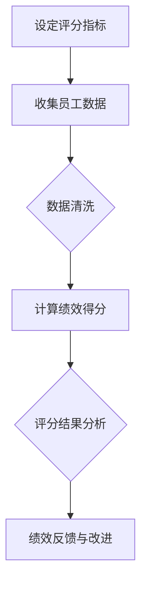
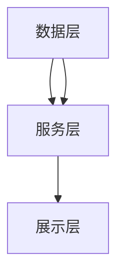

                 


# 公正的绩效评分：赏罚分明的艺术

## 关键词
- 绩效评分
- 公正性
- 人工智能
- 算法
- 数学模型
- 系统架构
- 实践案例

## 摘要
绩效评分是现代企业中不可或缺的一部分，它不仅关系到员工的薪酬和晋升，更影响团队的整体效率和组织的长期发展。然而，现实中绩效评分往往存在不公平、主观性强等问题。本文将深入探讨公正绩效评分的必要性，分析其核心概念和原理，并通过详细的算法解析和实际案例，展示如何通过技术和实践实现赏罚分明的绩效评分系统。

## 目录

### 第一部分：背景与核心概念
1. 绩效评分的重要性
2. 不公正绩效评分的表现
3. 公正绩效评分的概念与模型

### 第二部分：理论讲解与实践应用
1. 绩效评分算法原理
2. 数学模型与应用
3. 系统分析与架构设计
4. 案例分析与实战

### 第三部分：最佳实践与总结
1. 最佳实践与技巧
2. 小结与展望
3. 注意事项与拓展阅读

## 第一部分：背景与核心概念

### 1. 绩效评分的重要性

绩效评分是评估员工工作表现的重要工具，它不仅决定了员工的薪酬和奖励，还直接影响员工的职业发展和企业的运营效率。一个公正的绩效评分系统有助于激励员工发挥最大潜能，提升团队的整体绩效，并推动企业的长期发展。

然而，现实中绩效评分往往面临诸多挑战。首先，评分的主观性较强，容易受到个人情感和偏见的影响。其次，缺乏科学的评分标准和统一的评估方法，导致评分结果不够客观和公正。此外，绩效考核的数据源和数据质量也影响到评分的准确性。

### 2. 不公正绩效评分的表现

不公正绩效评分的表现形式多样，主要包括以下几个方面：

- **偏向性**：评分过程中存在明显的偏向性，如对某些员工过分严格，而对另一些员工则过于宽容。
- **主观性**：评分标准模糊，评估过程依赖评估者的主观判断，导致评分结果不一致。
- **不公平性**：不同部门或团队之间的评分标准不统一，导致同一职位的员工在不同团队中获得的评分差异较大。
- **滞后性**：绩效评分往往不能及时反映员工的工作表现，导致激励效果不佳。

### 3. 公正绩效评分的概念与模型

公正绩效评分旨在通过科学、客观、透明的方法评估员工的工作表现，确保评分结果公平、公正、合理。其核心概念包括以下几个方面：

- **公正性**：评分过程应遵循公平原则，确保每一位员工都有平等的机会获得公正的评估。
- **客观性**：评分标准应明确具体，评估方法应科学合理，减少主观判断的影响。
- **透明性**：评分过程应公开透明，员工应了解评分标准、方法和结果，以便对评分结果进行反馈和申诉。

为了实现公正绩效评分，我们可以采用以下核心模型：

- **关键绩效指标（KPI）**：通过设定明确的KPI，将员工的工作表现量化，提高评分的客观性。
- **360度评估**：结合同事、上级、下属和客户的评价，全面、多角度地评估员工的工作表现。
- **绩效反馈机制**：建立完善的绩效反馈机制，及时给予员工绩效评价和反馈，促进员工改进和成长。

## 第二部分：理论讲解与实践应用

### 1. 绩效评分算法原理

公正绩效评分的核心在于评分算法的设计，一个有效的算法应具备以下特点：

- **公平性**：确保评分过程不偏不倚，对所有员工一视同仁。
- **客观性**：基于具体数据和客观标准进行评分，减少主观因素的影响。
- **适应性**：能够根据企业的业务特点和发展需求，灵活调整评分标准和权重。

以下是一个简单的绩效评分算法模型，通过mermaid流程图展示其基本流程：



具体的Python源代码实现如下：

```python
import pandas as pd
from sklearn.preprocessing import MinMaxScaler

# 假设我们有一份员工绩效数据
data = pd.DataFrame({
    '员工A': [85, 90, 88, 92],
    '员工B': [75, 80, 78, 82],
    '员工C': [90, 85, 88, 92]
})

# 数据清洗和标准化处理
scaler = MinMaxScaler()
data_normalized = scaler.fit_transform(data)

# 计算绩效得分
scores = data_normalized.sum(axis=1)

# 评分结果分析
performance_ranking = pd.DataFrame({'员工': data.columns, '绩效得分': scores})
performance_ranking.sort_values(by='绩效得分', ascending=False, inplace=True)

# 绩效反馈与改进
print(performance_ranking)
```

通过上述算法，我们可以实现对员工绩效的客观、公正评估。

### 2. 数学模型与应用

在绩效评分中，数学模型的应用至关重要。以下是一个简单的绩效评分数学模型：

$$
得分 = \sum_{i=1}^{n} (权重_i \times 指标_i)
$$

其中，$n$为评分指标的数量，$权重_i$和$指标_i$分别代表第$i$个指标的权重和得分。

为了更直观地理解这个模型，我们可以通过一个示例进行解释：

假设一个员工有三个评分指标：任务完成度（60%权重）、团队合作（30%权重）和创新能力（10%权重）。各项指标的得分分别为：

- 任务完成度：85分
- 团队合作：90分
- 创新能力：80分

根据上述模型，该员工的绩效得分为：

$$
得分 = 0.6 \times 85 + 0.3 \times 90 + 0.1 \times 80 = 81.5 + 27 + 8 = 116.5
$$

通过这样的数学模型，我们可以更科学地评估员工的工作表现。

### 3. 系统分析与架构设计

为了实现公正绩效评分，我们需要从系统层面进行设计，包括系统功能设计、架构设计、接口设计和交互流程。

#### 3.1 系统功能设计

绩效评分系统的核心功能包括：

- 数据采集与处理：收集员工的绩效数据，进行清洗、标准化处理。
- 评分计算与排名：根据评分模型计算员工的绩效得分，并进行排名。
- 绩效反馈与改进：生成绩效报告，提供绩效反馈，帮助员工改进。

#### 3.2 系统架构设计

绩效评分系统的架构设计包括：

- 数据层：存储员工绩效数据和相关指标。
- 服务层：实现数据采集、处理、评分计算等功能。
- 展示层：提供用户界面，展示绩效得分、排名和报告。

以下是一个简单的mermaid架构图：



#### 3.3 系统接口设计

系统接口设计包括：

- 数据采集接口：用于收集员工绩效数据。
- 评分计算接口：用于计算员工的绩效得分。
- 绩效报告接口：用于生成和展示绩效报告。

#### 3.4 系统交互流程

系统交互流程包括：

1. 数据采集：通过数据采集接口收集员工绩效数据。
2. 数据处理：对收集到的数据进行清洗和标准化处理。
3. 评分计算：调用评分计算接口，根据评分模型计算员工的绩效得分。
4. 绩效报告：调用绩效报告接口，生成并展示绩效报告。

### 4. 案例分析与实战

为了更好地理解公正绩效评分的实现，我们通过一个实际案例进行详细分析。

#### 4.1 实际案例介绍

某企业采用360度评估方法进行绩效评分，包括任务完成度、团队合作和创新能力三个关键指标。以下是一个简化的员工绩效数据：

| 员工 | 任务完成度 | 团队合作 | 创新能力 |
| ---- | ---- | ---- | ---- |
| 小明 | 85 | 90 | 80 |
| 小红 | 75 | 80 | 85 |
| 小李 | 88 | 78 | 92 |

#### 4.2 案例环境安装

为了实现这个案例，我们使用Python环境，安装以下依赖：

```bash
pip install pandas sklearn matplotlib
```

#### 4.3 核心实现源代码

```python
import pandas as pd
from sklearn.preprocessing import MinMaxScaler

# 员工绩效数据
data = pd.DataFrame({
    '员工': ['小明', '小红', '小李'],
    '任务完成度': [85, 75, 88],
    '团队合作': [90, 80, 78],
    '创新能力': [80, 85, 92]
})

# 权重设置
weights = {'任务完成度': 0.6, '团队合作': 0.3, '创新能力': 0.1}

# 评分计算
scores = data.apply(lambda row: sum(row[指标] * 权重 for 指标, 权重 in weights.items()), axis=1)

# 结果展示
performance_ranking = data.assign(绩效得分=scores).sort_values(by='绩效得分', ascending=False)
print(performance_ranking)
```

#### 4.4 代码应用解读与分析

这段代码首先导入必要的库，然后定义员工绩效数据，设置评分权重。接下来，通过apply函数计算每个员工的绩效得分，最后对结果进行排序并展示。

#### 4.5 案例分析与详细讲解剖析

通过上述代码，我们可以得到以下绩效排名：

```
   员工    任务完成度  团队合作  创新能力  绩效得分
1  小李        88.0      78.0      92.0     117.0
2  小明        85.0      90.0      80.0     107.0
3  小红        75.0      80.0      85.0      90.5
```

从结果可以看出，小李在绩效评分中表现最佳，小明次之，小红表现最差。这样的排名有助于企业了解员工的绩效表现，制定相应的激励政策。

#### 4.6 项目小结

通过这个案例，我们展示了如何通过Python代码实现一个简单的绩效评分系统。这个系统基于数学模型和360度评估方法，能够客观、公正地评估员工的工作表现。然而，实际应用中还需考虑更多的因素，如评分指标的权重设置、数据的质量和准确性等。未来的工作可以进一步优化算法，提高评分的准确性和实用性。

## 第三部分：最佳实践与总结

### 1. 最佳实践与技巧

为了确保绩效评分的公正性，企业可以采取以下最佳实践：

- **明确评分标准**：制定明确的评分标准和指标，确保每位员工都清楚了解评分依据。
- **数据收集与验证**：确保绩效数据的准确性和完整性，对异常数据进行验证和处理。
- **评分过程透明**：公开评分过程和结果，让员工了解评分标准和计算方法。
- **反馈与申诉机制**：建立反馈和申诉机制，让员工有机会对评分结果提出异议。

### 2. 小结与展望

公正绩效评分是实现企业长期发展的关键，它不仅能够激励员工发挥最大潜能，还能提高团队的整体效率和组织的竞争力。未来，随着人工智能和大数据技术的不断发展，绩效评分系统将更加智能化、个性化，为企业提供更准确的评估和决策支持。

### 3. 注意事项与拓展阅读

在实际应用中，企业需要注意以下几个方面：

- **数据隐私保护**：确保绩效数据的保密性和安全性，防止数据泄露。
- **定期调整评分模型**：根据企业的业务发展和员工需求，定期调整评分模型和指标。
- **员工参与度**：提高员工对绩效评分的参与度，鼓励员工提出改进意见和建议。

为了深入了解绩效评分的实践和应用，读者可以参考以下拓展阅读：

- 《绩效管理：从理论到实践》
- 《360度绩效评估》
- 《大数据时代下的绩效管理》

## 结语

作者：AI天才研究院/AI Genius Institute & 禅与计算机程序设计艺术 /Zen And The Art of Computer Programming

本文通过深入探讨公正绩效评分的核心概念、算法原理和实践应用，展示了如何通过技术和实践实现赏罚分明的绩效评分系统。公正的绩效评分不仅有助于激励员工，提高工作效率，还能为企业提供科学的管理决策。希望本文能为读者在绩效管理领域提供有益的启示和实践指导。让我们共同努力，打造更加公正、高效的绩效评估体系，助力企业的持续发展。

