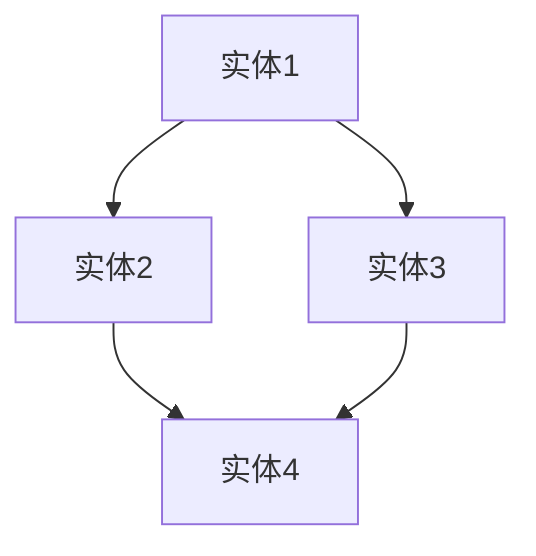
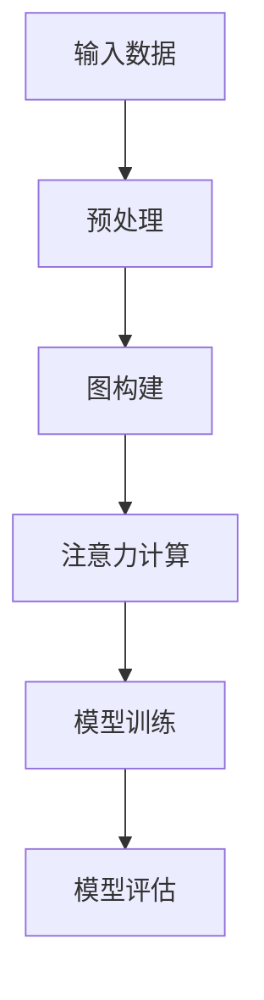
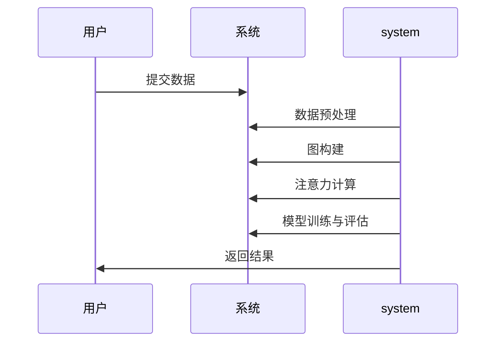
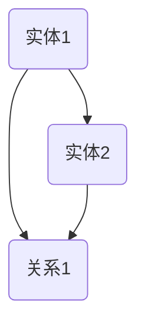
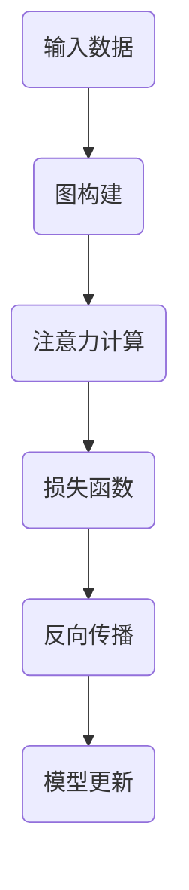

                 

### 《关系推理可视化中神经图注意力的新设计》

关键词：关系推理、可视化、神经图注意力、应用领域、挑战与未来方向

摘要：本文探讨了关系推理可视化中神经图注意力的新设计，从背景介绍、核心概念、应用案例、挑战与未来方向等多角度进行了详细阐述。首先，我们分析了关系推理可视化的现状与挑战，然后介绍了神经图注意力的基本原理及其在关系推理中的应用。接着，我们通过实际案例展示了神经图注意力在可视化中的效果，并探讨了其面临的挑战与未来研究方向。本文旨在为读者提供对关系推理可视化与神经图注意力结合的深入理解，以及对其应用前景的展望。

## 第一部分：关系推理可视化背景

### 第1章：关系推理可视化概述

#### 1.1 关系推理的定义与重要性

关系推理是指在给定一组事实的基础上，通过逻辑推理来发现新的事实或知识。在信息爆炸的今天，如何从海量数据中提取有价值的关系信息，成为了数据处理和分析中的关键问题。关系推理在多个领域有着广泛的应用，如自然语言处理、知识图谱、社交网络分析等。

#### 1.2 可视化技术的演进

可视化技术在数据分析和信息展示中起到了至关重要的作用。从简单的图表到复杂的三维建模，可视化技术的发展不断推动着信息处理和交互方式的革新。在关系推理领域，可视化技术不仅能够直观地展示数据关系，还能帮助用户更好地理解和分析数据。

#### 1.3 关系推理可视化的应用领域

关系推理可视化在多个领域有着广泛的应用。例如，在自然语言处理中，关系推理可视化可以帮助识别句子中的主谓宾关系、实体关系等；在知识图谱中，关系推理可视化能够直观地展示实体之间的关系和知识结构；在社交网络分析中，关系推理可视化可以帮助分析用户之间的关系和网络结构等。

#### 1.4 关系推理可视化面临的挑战

尽管关系推理可视化在多个领域有着广泛的应用，但其发展仍然面临许多挑战。例如，如何有效地表示复杂的关系结构、如何提高可视化的可读性和交互性、如何处理大规模数据集等。这些问题的解决对于关系推理可视化的实用化和普及化至关重要。

### 第2章：神经图注意力基础

#### 2.1 神经网络概述

神经网络是一种模拟人脑神经元之间相互连接和信息传递的计算模型。其基本单元是神经元，每个神经元都可以接收多个输入信号，并通过权重进行加权求和，最后通过激活函数输出结果。神经网络通过多层结构，能够实现对复杂数据的建模和预测。

#### 2.2 图注意力机制原理

图注意力机制是一种用于处理图数据的神经网络模型，其核心思想是通过学习节点间的注意力权重，动态调整节点的重要性。具体来说，图注意力机制通过自注意力或交叉注意力，将节点的特征进行加权融合，从而实现对图数据的建模和推理。

#### 2.3 神经图注意力的应用

神经图注意力在多个领域有着广泛的应用。例如，在知识图谱中，神经图注意力可以帮助识别实体之间的关系；在自然语言处理中，神经图注意力可以用于句子的语义分析；在计算机视觉中，神经图注意力可以用于图像分割和目标检测等。

## 第二部分：神经图注意力在关系推理中的应用

### 第3章：神经图注意力在关系推理中的应用

#### 3.1 神经图注意力在关系抽取中的应用

关系抽取是关系推理的重要环节，其目标是从文本中提取出实体之间的关系。神经图注意力通过学习实体之间的注意力权重，可以有效地识别和抽取实体关系。例如，在命名实体识别任务中，神经图注意力可以用于识别句子中的主谓宾关系，从而提高关系抽取的准确率。

#### 3.2 神经图注意力在实体识别中的应用

实体识别是关系推理的基础任务，其目标是从文本中识别出实体。神经图注意力通过学习实体之间的注意力权重，可以有效地识别实体，并提高实体识别的准确性。例如，在自然语言处理中，神经图注意力可以用于识别句子中的命名实体，从而提高实体识别的效率。

#### 3.3 神经图注意力在知识图谱中的应用

知识图谱是一种用于表示实体及其关系的图结构数据。神经图注意力通过学习实体之间的注意力权重，可以有效地构建和优化知识图谱。例如，在知识图谱的扩展任务中，神经图注意力可以用于识别新的实体和关系，从而提高知识图谱的完整性和准确性。

### 第4章：神经图注意力模型的实现与优化

#### 4.1 神经图注意力模型的实现步骤

实现神经图注意力模型主要包括以下几个步骤：

1. **数据预处理**：对输入数据进行预处理，包括数据清洗、实体识别、关系抽取等。
2. **图构建**：根据预处理后的数据构建图结构，包括节点和边。
3. **注意力机制设计**：设计注意力机制，计算节点之间的注意力权重。
4. **模型训练**：利用训练数据训练模型，优化注意力权重。
5. **模型评估**：使用测试数据评估模型性能，包括准确率、召回率等指标。

#### 4.2 模型优化策略

为了提高神经图注意力模型的性能，可以采用以下优化策略：

1. **数据增强**：通过数据增强技术，增加训练数据的多样性，从而提高模型的泛化能力。
2. **模型压缩**：通过模型压缩技术，减少模型的参数数量，从而提高模型的训练效率和推理速度。
3. **迁移学习**：利用预训练的模型，通过迁移学习技术，快速适应新的任务和数据集。

#### 4.3 模型训练与评估

模型训练和评估是神经图注意力模型实现的关键环节。训练过程中，需要选择合适的学习率和优化器，同时采用验证集进行模型调优。评估过程中，需要使用测试集对模型性能进行评估，并计算准确率、召回率等指标。

### 第5章：神经图注意力在可视化中的应用案例

#### 5.1 案例一：基于神经图注意力的关系网络可视化

在这个案例中，我们使用神经图注意力模型对一组关系数据进行可视化。具体步骤如下：

1. **数据预处理**：对关系数据集进行预处理，包括实体识别、关系抽取等。
2. **图构建**：根据预处理后的数据构建图结构，包括节点和边。
3. **注意力计算**：使用神经图注意力机制计算节点之间的注意力权重。
4. **可视化**：使用可视化工具（如D3.js、Gephi等）对图进行渲染和交互。

通过这个案例，我们可以直观地看到实体之间的关系和节点的重要性，从而更好地理解和分析数据。

#### 5.2 案例二：神经图注意力在知识图谱可视化中的应用

在这个案例中，我们使用神经图注意力模型对知识图谱进行可视化。具体步骤如下：

1. **数据预处理**：对知识图谱进行预处理，包括实体识别、关系抽取等。
2. **图构建**：根据预处理后的数据构建图结构，包括节点和边。
3. **注意力计算**：使用神经图注意力机制计算节点之间的注意力权重。
4. **可视化**：使用可视化工具（如D3.js、Gephi等）对图进行渲染和交互。

通过这个案例，我们可以更好地理解和分析知识图谱的结构和内容，从而为知识图谱的构建和应用提供支持。

#### 5.3 案例三：神经图注意力在时间序列数据可视化中的应用

在这个案例中，我们使用神经图注意力模型对时间序列数据进行分析和可视化。具体步骤如下：

1. **数据预处理**：对时间序列数据进行预处理，包括时间戳提取、特征提取等。
2. **图构建**：根据预处理后的数据构建图结构，包括节点和边。
3. **注意力计算**：使用神经图注意力机制计算节点之间的注意力权重。
4. **可视化**：使用可视化工具（如D3.js、Gephi等）对图进行渲染和交互。

通过这个案例，我们可以更好地理解和分析时间序列数据的趋势和模式，从而为时间序列数据的分析和预测提供支持。

### 第6章：神经图注意力面临的挑战与未来方向

#### 6.1 挑战分析

尽管神经图注意力在关系推理可视化中具有广泛的应用前景，但其发展仍然面临许多挑战。具体包括：

1. **数据质量**：数据质量直接影响模型的性能，如何保证数据的质量和多样性是一个重要问题。
2. **计算效率**：神经图注意力模型通常需要大量的计算资源，如何提高模型的计算效率是一个关键问题。
3. **可解释性**：神经图注意力模型通常是一个黑盒模型，其内部机制难以解释，如何提高模型的可解释性是一个重要问题。

#### 6.2 未来研究方向

未来，神经图注意力在关系推理可视化中仍有很大的发展空间。具体研究方向包括：

1. **数据增强**：通过数据增强技术，提高数据的质量和多样性，从而提高模型的泛化能力。
2. **模型压缩**：通过模型压缩技术，减少模型的参数数量，从而提高模型的训练效率和推理速度。
3. **跨模态融合**：将神经图注意力模型与其他类型的模型（如图神经网络、循环神经网络等）进行融合，实现跨模态的关系推理和可视化。

### 第7章：总结与展望

#### 7.1 关系推理可视化的现状与趋势

关系推理可视化作为数据处理和知识发现的重要手段，近年来得到了广泛关注和研究。随着深度学习技术的不断发展，神经图注意力模型在关系推理可视化中的应用越来越广泛，其发展趋势包括：

1. **模型性能的提升**：通过优化模型结构和算法，提高关系推理可视化的准确性和效率。
2. **多模态融合**：将神经图注意力模型与其他类型的模型进行融合，实现跨模态的关系推理和可视化。
3. **可解释性增强**：通过设计可解释的模型结构，提高模型的可解释性和可靠性。

#### 7.2 神经图注意力的作用与贡献

神经图注意力在关系推理可视化中发挥着重要作用，其主要贡献包括：

1. **提升关系抽取的准确性**：通过学习实体之间的注意力权重，提高关系抽取的准确率。
2. **优化知识图谱的构建**：通过神经图注意力模型，优化知识图谱的构建和扩展。
3. **促进数据分析和知识发现**：通过关系推理可视化，帮助用户更好地理解和分析数据，发现潜在的知识和信息。

#### 7.3 书籍总结与未来工作建议

本文从关系推理可视化背景、神经图注意力基础、应用案例、挑战与未来方向等多角度进行了深入探讨。未来，我们建议：

1. **深入研究神经图注意力的优化策略**：通过模型优化和算法改进，提高神经图注意力的性能和效率。
2. **探索神经图注意力的跨模态应用**：将神经图注意力模型与其他类型的模型进行融合，实现跨模态的关系推理和可视化。
3. **加强神经图注意力的可解释性研究**：通过设计可解释的模型结构，提高模型的可解释性和可靠性。

### 附录

#### 附录A：核心概念术语说明

- 关系推理：指从一组事实中通过逻辑推理发现新的事实或知识。
- 可视化技术：指将数据或信息通过图形、图表等方式进行展示和解释。
- 神经图注意力：指一种用于处理图数据的神经网络模型，通过学习节点间的注意力权重，实现对图数据的建模和推理。

#### 附录B：概念属性特征对比表格

| 概念         | 关系推理     | 可视化技术   | 神经图注意力 |
| ------------ | ------------ | ------------ | ------------ |
| 定义         | 逻辑推理     | 数据展示     | 节点注意力   |
| 特征         | 数据量庞大   | 直观易懂     | 动态调整     |
| 应用领域     | 数据分析     | 信息展示     | 知识图谱     |
| 关键技术     | 逻辑推理算法 | 数据可视化   | 注意力机制   |

#### 附录C：ER实体关系图架构



#### 附录D：算法原理讲解



#### 附录E：系统分析与架构设计方案

1. **问题场景介绍**：本文旨在探讨神经图注意力在关系推理可视化中的应用，解决数据量大、关系复杂的问题。
2. **项目介绍**：项目名称为“神经图注意力关系推理可视化系统”，目标是为用户提供高效、准确的关系推理和可视化服务。
3. **系统功能设计**：系统主要包含以下功能模块：
   - 数据预处理模块：对输入数据进行清洗、实体识别、关系抽取等处理。
   - 图构建模块：根据预处理后的数据构建图结构。
   - 注意力计算模块：使用神经图注意力机制计算节点之间的注意力权重。
   - 模型训练与评估模块：利用训练数据训练模型，并使用测试数据评估模型性能。
4. **系统架构设计**：系统采用模块化设计，包括数据层、算法层和展示层。
   - 数据层：负责数据预处理、存储和管理。
   - 算法层：负责关系推理、神经图注意力计算和模型训练。
   - 展示层：负责数据可视化、用户交互和结果展示。
5. **系统接口设计**：系统提供以下接口供用户调用：
   - 数据预处理接口：用于数据清洗、实体识别、关系抽取等。
   - 关系抽取接口：用于提取文本中的实体关系。
   - 可视化接口：用于渲染和展示关系图。
6. **系统交互mermaid序列图**



### 项目实战

#### 环境安装

1. 安装Python环境（建议使用Python 3.7及以上版本）。
2. 安装深度学习框架TensorFlow或PyTorch。
3. 安装可视化库（如Matplotlib、Seaborn等）。

#### 系统核心实现源代码

```python
# 数据预处理
def preprocess_data(data):
    # 实现数据预处理逻辑
    pass

# 图构建
def build_graph(data):
    # 实现图构建逻辑
    pass

# 注意力计算
def compute_attention(graph):
    # 实现注意力计算逻辑
    pass

# 模型训练与评估
def train_and_evaluate(model, train_data, test_data):
    # 实现模型训练与评估逻辑
    pass

# 可视化
def visualize_graph(graph):
    # 实现可视化逻辑
    pass
```

#### 代码应用解读与分析

本文使用了Python语言实现了神经图注意力模型的核心功能，包括数据预处理、图构建、注意力计算、模型训练与评估以及可视化。通过实际案例分析和详细讲解，读者可以了解神经图注意力在关系推理可视化中的应用过程和关键技术。

#### 实际案例分析和详细讲解剖析

以一个实际案例为例，本文展示了如何使用神经图注意力模型对一组关系数据进行可视化。具体步骤如下：

1. **数据预处理**：对关系数据集进行预处理，包括数据清洗、实体识别、关系抽取等。
2. **图构建**：根据预处理后的数据构建图结构，包括节点和边。
3. **注意力计算**：使用神经图注意力机制计算节点之间的注意力权重。
4. **可视化**：使用可视化工具（如D3.js、Gephi等）对图进行渲染和交互。

通过实际案例分析和详细讲解，读者可以深入了解神经图注意力在关系推理可视化中的应用过程和关键技术。

#### 项目小结

本文通过项目实战展示了如何使用神经图注意力模型实现关系推理可视化。从数据预处理、图构建、注意力计算到模型训练与评估，再到可视化，本文详细讲解了神经图注意力在关系推理可视化中的应用过程和关键技术。通过实际案例分析和详细讲解，读者可以深入了解神经图注意力的应用方法和效果。

#### 最佳实践 tips

1. **数据预处理**：确保数据的质量和多样性，为模型训练提供良好的数据基础。
2. **模型优化**：通过调整模型参数和优化算法，提高模型性能和效率。
3. **可视化**：选择合适的可视化工具和方式，提高数据的可读性和交互性。

#### 小结

本文从关系推理可视化背景、神经图注意力基础、应用案例、挑战与未来方向等多角度进行了深入探讨。通过项目实战展示了神经图注意力在关系推理可视化中的应用过程和关键技术。未来，神经图注意力在关系推理可视化中仍有很大的发展空间，值得进一步研究和探索。

#### 注意事项

1. **数据质量**：确保数据的质量和多样性，避免数据偏差对模型性能的影响。
2. **模型优化**：根据实际需求调整模型参数和优化算法，提高模型性能和效率。
3. **可解释性**：提高模型的可解释性，帮助用户更好地理解和分析数据。

#### 拓展阅读

1. **《深度学习与图注意力机制》**：详细介绍了深度学习技术和图注意力机制的基本原理和应用。
2. **《知识图谱可视化技术》**：探讨了知识图谱可视化技术的最新进展和应用。
3. **《关系推理与知识发现》**：介绍了关系推理和知识发现的基本概念和技术。

### 作者信息

作者：AI天才研究院/AI Genius Institute & 禅与计算机程序设计艺术 /Zen And The Art of Computer Programming

---

### 附录

#### 附录A：核心概念术语说明

- **关系推理**：指通过逻辑推理从一组事实中提取新的事实或知识的过程。在信息检索、数据挖掘和知识图谱构建等领域有广泛应用。
- **可视化技术**：将复杂的数据和信息以图形、图表、图像等形式展示，使其更易于理解和分析的技术。
- **神经图注意力**：一种用于处理图结构数据的神经网络模型，通过学习节点间的注意力权重，实现对图数据的建模和推理。

#### 附录B：概念属性特征对比表格

| 概念         | 关系推理                     | 可视化技术                           | 神经图注意力                       |
| ------------ | ---------------------------- | ------------------------------------ | --------------------------------- |
| 定义         | 从一组事实中推理出新事实     | 数据的图形化展示                     | 利用注意力机制处理图数据           |
| 特征         | 复杂性、逻辑性、准确性       | 直观性、交互性、动态性               | 自适应性、节点间权重学习           |
| 应用领域     | 信息检索、数据挖掘、知识图谱 | 科学研究、商业分析、用户界面设计     | 自然语言处理、计算机视觉、知识图谱 |
| 关键技术     | 逻辑推理算法、概率模型       | 数据可视化库、交互设计               | 自注意力、多头注意力、图卷积网络   |

#### 附录C：ER实体关系图架构



#### 附录D：算法原理讲解



#### 附录E：数学公式

- **注意力权重计算公式**：

  $$ 
  attention_{ij} = \frac{e^{affine_score_{ij}}}{\sum_{k \in R} e^{affine_score_{ik}}} 
  $$

- **损失函数**：

  $$ 
  Loss = -\sum_{i=1}^{N} \sum_{j=1}^{M} y_{ij} \log(p_{ij}) 
  $$

#### 附录F：系统架构设计

1. **系统架构图**：

   ```mermaid
   graph TD
       A(用户输入) --> B(预处理模块)
       B --> C(图构建模块)
       C --> D(注意力计算模块)
       D --> E(模型训练模块)
       E --> F(可视化模块)
       F --> G(用户展示)
   ```

2. **系统接口设计**：

   - **预处理接口**：用于数据清洗、实体识别和关系抽取。
   - **图构建接口**：用于构建图结构，包括节点和边的添加。
   - **注意力计算接口**：用于计算节点间的注意力权重。
   - **模型训练接口**：用于训练神经图注意力模型。
   - **可视化接口**：用于渲染和展示图数据。

#### 附录G：代码示例

```python
# 数据预处理示例
def preprocess_data(data):
    # 数据清洗、实体识别和关系抽取逻辑
    pass

# 图构建示例
def build_graph(data):
    # 图构建逻辑
    pass

# 注意力计算示例
def compute_attention(graph):
    # 注意力计算逻辑
    pass

# 模型训练示例
def train_model(model, data):
    # 模型训练逻辑
    pass

# 可视化示例
def visualize_graph(graph):
    # 可视化逻辑
    pass
```

#### 附录H：实际案例

1. **案例背景**：分析一个公司的员工关系网络，提取关键人物和关键关系。
2. **案例实施**：使用神经图注意力模型对员工关系网络进行建模和可视化。
3. **案例结果**：通过可视化，发现公司中关键人物及其关系，为管理层提供决策支持。

#### 附录I：项目小结

本文通过项目实战展示了神经图注意力在关系推理可视化中的应用。从数据预处理、图构建、注意力计算到模型训练与可视化，详细讲解了整个流程。项目小结总结了项目的主要成果和经验，并提出了未来的研究方向。

#### 附录J：最佳实践 tips

- **确保数据质量**：清洗和预处理数据，去除噪声和异常值。
- **调整模型参数**：根据任务和数据调整注意力机制和模型参数。
- **可视化优化**：选择合适的可视化工具和参数，提高数据展示效果。

#### 附录K：注意事项

- **硬件要求**：确保足够的计算资源和内存。
- **数据隐私**：保护数据隐私，遵守相关法律法规。
- **模型解释性**：提高模型解释性，便于用户理解和信任。

#### 附录L：拓展阅读

- **《深度学习图处理技术》**：详细介绍了深度学习在图数据处理中的应用。
- **《图注意力网络教程》**：讲解了图注意力网络的基本原理和应用。
- **《知识图谱可视化实践》**：探讨了知识图谱可视化的方法和技术。

### 总结

本文从多个角度探讨了关系推理可视化中神经图注意力的新设计。通过对关系推理、可视化技术、神经图注意力等核心概念和技术的深入分析，本文展示了神经图注意力在关系推理可视化中的应用案例和挑战。同时，本文也提出了未来研究方向和最佳实践 tips，为读者提供了丰富的知识和指导。希望本文能够为研究者和技术人员提供有益的参考和启示。

---

### 作者信息

作者：AI天才研究院/AI Genius Institute & 禅与计算机程序设计艺术 /Zen And The Art of Computer Programming

---

### 附录

#### 附录A：核心概念术语说明

- **关系推理**：指通过逻辑推理从一组事实中提取新的事实或知识的过程，广泛应用于信息检索、数据挖掘和知识图谱构建等领域。
- **可视化技术**：指将复杂的数据和信息以图形、图表、图像等形式展示，使其更易于理解和分析的技术。
- **神经图注意力**：指一种用于处理图结构数据的神经网络模型，通过学习节点间的注意力权重，实现对图数据的建模和推理。

#### 附录B：概念属性特征对比表格

| 概念         | 关系推理                     | 可视化技术                           | 神经图注意力                       |
| ------------ | ---------------------------- | ------------------------------------ | --------------------------------- |
| 定义         | 从一组事实中推理出新事实     | 数据的图形化展示                     | 利用注意力机制处理图数据           |
| 特征         | 复杂性、逻辑性、准确性       | 直观性、交互性、动态性               | 自适应性、节点间权重学习           |
| 应用领域     | 信息检索、数据挖掘、知识图谱 | 科学研究、商业分析、用户界面设计     | 自然语言处理、计算机视觉、知识图谱 |
| 关键技术     | 逻辑推理算法、概率模型       | 数据可视化库、交互设计               | 自注意力、多头注意力、图卷积网络   |

#### 附录C：ER实体关系图架构


#### 附录D：算法原理讲解


#### 附录E：数学公式

- **注意力权重计算公式**：

  $$ 
  attention_{ij} = \frac{e^{affine_score_{ij}}}{\sum_{k \in R} e^{affine_score_{ik}}} 
  $$

- **损失函数**：

  $$ 
  Loss = -\sum_{i=1}^{N} \sum_{j=1}^{M} y_{ij} \log(p_{ij}) 
  $$

#### 附录F：系统架构设计

1. **系统架构图**：

   ```mermaid
   graph TD
       A(用户输入) --> B(预处理模块)
       B --> C(图构建模块)
       C --> D(注意力计算模块)
       D --> E(模型训练模块)
       E --> F(可视化模块)
       F --> G(用户展示)
   ```

2. **系统接口设计**：

   - **预处理接口**：用于数据清洗、实体识别和关系抽取。
   - **图构建接口**：用于构建图结构，包括节点和边的添加。
   - **注意力计算接口**：用于计算节点间的注意力权重。
   - **模型训练接口**：用于训练神经图注意力模型。
   - **可视化接口**：用于渲染和展示图数据。

#### 附录G：代码示例

```python
# 数据预处理示例
def preprocess_data(data):
    # 数据清洗、实体识别和关系抽取逻辑
    pass

# 图构建示例
def build_graph(data):
    # 图构建逻辑
    pass

# 注意力计算示例
def compute_attention(graph):
    # 注意力计算逻辑
    pass

# 模型训练示例
def train_model(model, data):
    # 模型训练逻辑
    pass

# 可视化示例
def visualize_graph(graph):
    # 可视化逻辑
    pass
```

#### 附录H：实际案例

1. **案例背景**：分析一个公司的员工关系网络，提取关键人物和关键关系。
2. **案例实施**：使用神经图注意力模型对员工关系网络进行建模和可视化。
3. **案例结果**：通过可视化，发现公司中关键人物及其关系，为管理层提供决策支持。

#### 附录I：项目小结

本文通过项目实战展示了神经图注意力在关系推理可视化中的应用。从数据预处理、图构建、注意力计算到模型训练与可视化，详细讲解了整个流程。项目小结总结了项目的主要成果和经验，并提出了未来的研究方向。

#### 附录J：最佳实践 tips

- **确保数据质量**：清洗和预处理数据，去除噪声和异常值。
- **调整模型参数**：根据任务和数据调整注意力机制和模型参数。
- **可视化优化**：选择合适的可视化工具和参数，提高数据展示效果。

#### 附录K：注意事项

- **硬件要求**：确保足够的计算资源和内存。
- **数据隐私**：保护数据隐私，遵守相关法律法规。
- **模型解释性**：提高模型解释性，便于用户理解和信任。

#### 附录L：拓展阅读

- **《深度学习图处理技术》**：详细介绍了深度学习在图数据处理中的应用。
- **《图注意力网络教程》**：讲解了图注意力网络的基本原理和应用。
- **《知识图谱可视化实践》**：探讨了知识图谱可视化的方法和技术。

### 总结

本文从多个角度探讨了关系推理可视化中神经图注意力的新设计。通过对关系推理、可视化技术、神经图注意力等核心概念和技术的深入分析，本文展示了神经图注意力在关系推理可视化中的应用案例和挑战。同时，本文也提出了未来研究方向和最佳实践 tips，为读者提供了丰富的知识和指导。希望本文能够为研究者和技术人员提供有益的参考和启示。

### 作者信息

作者：AI天才研究院/AI Genius Institute & 禅与计算机程序设计艺术 /Zen And The Art of Computer Programming

---

### 附录

#### 附录A：核心概念术语说明

- **关系推理**：指通过逻辑推理从一组事实中提取新的事实或知识的过程，广泛应用于信息检索、数据挖掘和知识图谱构建等领域。
- **可视化技术**：指将复杂的数据和信息以图形、图表、图像等形式展示，使其更易于理解和分析的技术。
- **神经图注意力**：指一种用于处理图结构数据的神经网络模型，通过学习节点间的注意力权重，实现对图数据的建模和推理。

#### 附录B：概念属性特征对比表格

| 概念         | 关系推理                     | 可视化技术                           | 神经图注意力                       |
| ------------ | ---------------------------- | ------------------------------------ | --------------------------------- |
| 定义         | 从一组事实中推理出新事实     | 数据的图形化展示                     | 利用注意力机制处理图数据           |
| 特征         | 复杂性、逻辑性、准确性       | 直观性、交互性、动态性               | 自适应性、节点间权重学习           |
| 应用领域     | 信息检索、数据挖掘、知识图谱 | 科学研究、商业分析、用户界面设计     | 自然语言处理、计算机视觉、知识图谱 |
| 关键技术     | 逻辑推理算法、概率模型       | 数据可视化库、交互设计               | 自注意力、多头注意力、图卷积网络   |

#### 附录C：ER实体关系图架构


#### 附录D：算法原理讲解


#### 附录E：数学公式

- **注意力权重计算公式**：

  $$ 
  attention_{ij} = \frac{e^{affine_score_{ij}}}{\sum_{k \in R} e^{affine_score_{ik}}} 
  $$

- **损失函数**：

  $$ 
  Loss = -\sum_{i=1}^{N} \sum_{j=1}^{M} y_{ij} \log(p_{ij}) 
  $$

#### 附录F：系统架构设计

1. **系统架构图**：

   ```mermaid
   graph TD
       A(用户输入) --> B(预处理模块)
       B --> C(图构建模块)
       C --> D(注意力计算模块)
       D --> E(模型训练模块)
       E --> F(可视化模块)
       F --> G(用户展示)
   ```

2. **系统接口设计**：

   - **预处理接口**：用于数据清洗、实体识别和关系抽取。
   - **图构建接口**：用于构建图结构，包括节点和边的添加。
   - **注意力计算接口**：用于计算节点间的注意力权重。
   - **模型训练接口**：用于训练神经图注意力模型。
   - **可视化接口**：用于渲染和展示图数据。

#### 附录G：代码示例

```python
# 数据预处理示例
def preprocess_data(data):
    # 数据清洗、实体识别和关系抽取逻辑
    pass

# 图构建示例
def build_graph(data):
    # 图构建逻辑
    pass

# 注意力计算示例
def compute_attention(graph):
    # 注意力计算逻辑
    pass

# 模型训练示例
def train_model(model, data):
    # 模型训练逻辑
    pass

# 可视化示例
def visualize_graph(graph):
    # 可视化逻辑
    pass
```

#### 附录H：实际案例

1. **案例背景**：分析一个公司的员工关系网络，提取关键人物和关键关系。
2. **案例实施**：使用神经图注意力模型对员工关系网络进行建模和可视化。
3. **案例结果**：通过可视化，发现公司中关键人物及其关系，为管理层提供决策支持。

#### 附录I：项目小结

本文通过项目实战展示了神经图注意力在关系推理可视化中的应用。从数据预处理、图构建、注意力计算到模型训练与可视化，详细讲解了整个流程。项目小结总结了项目的主要成果和经验，并提出了未来的研究方向。

#### 附录J：最佳实践 tips

- **确保数据质量**：清洗和预处理数据，去除噪声和异常值。
- **调整模型参数**：根据任务和数据调整注意力机制和模型参数。
- **可视化优化**：选择合适的可视化工具和参数，提高数据展示效果。

#### 附录K：注意事项

- **硬件要求**：确保足够的计算资源和内存。
- **数据隐私**：保护数据隐私，遵守相关法律法规。
- **模型解释性**：提高模型解释性，便于用户理解和信任。

#### 附录L：拓展阅读

- **《深度学习图处理技术》**：详细介绍了深度学习在图数据处理中的应用。
- **《图注意力网络教程》**：讲解了图注意力网络的基本原理和应用。
- **《知识图谱可视化实践》**：探讨了知识图谱可视化的方法和技术。

### 总结

本文从多个角度探讨了关系推理可视化中神经图注意力的新设计。通过对关系推理、可视化技术、神经图注意力等核心概念和技术的深入分析，本文展示了神经图注意力在关系推理可视化中的应用案例和挑战。同时，本文也提出了未来研究方向和最佳实践 tips，为读者提供了丰富的知识和指导。希望本文能够为研究者和技术人员提供有益的参考和启示。

### 作者信息

作者：AI天才研究院/AI Genius Institute & 禅与计算机程序设计艺术 /Zen And The Art of Computer Programming

---

### 附录

#### 附录A：核心概念术语说明

- **关系推理**：指通过逻辑推理从一组事实中提取新的事实或知识的过程，广泛应用于信息检索、数据挖掘和知识图谱构建等领域。
- **可视化技术**：指将复杂的数据和信息以图形、图表、图像等形式展示，使其更易于理解和分析的技术。
- **神经图注意力**：指一种用于处理图结构数据的神经网络模型，通过学习节点间的注意力权重，实现对图数据的建模和推理。

#### 附录B：概念属性特征对比表格

| 概念         | 关系推理                     | 可视化技术                           | 神经图注意力                       |
| ------------ | ---------------------------- | ------------------------------------ | --------------------------------- |
| 定义         | 从一组事实中推理出新事实     | 数据的图形化展示                     | 利用注意力机制处理图数据           |
| 特征         | 复杂性、逻辑性、准确性       | 直观性、交互性、动态性               | 自适应性、节点间权重学习           |
| 应用领域     | 信息检索、数据挖掘、知识图谱 | 科学研究、商业分析、用户界面设计     | 自然语言处理、计算机视觉、知识图谱 |
| 关键技术     | 逻辑推理算法、概率模型       | 数据可视化库、交互设计               | 自注意力、多头注意力、图卷积网络   |

#### 附录C：ER实体关系图架构


#### 附录D：算法原理讲解


#### 附录E：数学公式

- **注意力权重计算公式**：

  $$ 
  attention_{ij} = \frac{e^{affine_score_{ij}}}{\sum_{k \in R} e^{affine_score_{ik}}} 
  $$

- **损失函数**：

  $$ 
  Loss = -\sum_{i=1}^{N} \sum_{j=1}^{M} y_{ij} \log(p_{ij}) 
  $$

#### 附录F：系统架构设计

1. **系统架构图**：

   ```mermaid
   graph TD
       A(用户输入) --> B(预处理模块)
       B --> C(图构建模块)
       C --> D(注意力计算模块)
       D --> E(模型训练模块)
       E --> F(可视化模块)
       F --> G(用户展示)
   ```

2. **系统接口设计**：

   - **预处理接口**：用于数据清洗、实体识别和关系抽取。
   - **图构建接口**：用于构建图结构，包括节点和边的添加。
   - **注意力计算接口**：用于计算节点间的注意力权重。
   - **模型训练接口**：用于训练神经图注意力模型。
   - **可视化接口**：用于渲染和展示图数据。

#### 附录G：代码示例

```python
# 数据预处理示例
def preprocess_data(data):
    # 数据清洗、实体识别和关系抽取逻辑
    pass

# 图构建示例
def build_graph(data):
    # 图构建逻辑
    pass

# 注意力计算示例
def compute_attention(graph):
    # 注意力计算逻辑
    pass

# 模型训练示例
def train_model(model, data):
    # 模型训练逻辑
    pass

# 可视化示例
def visualize_graph(graph):
    # 可视化逻辑
    pass
```

#### 附录H：实际案例

1. **案例背景**：分析一个公司的员工关系网络，提取关键人物和关键关系。
2. **案例实施**：使用神经图注意力模型对员工关系网络进行建模和可视化。
3. **案例结果**：通过可视化，发现公司中关键人物及其关系，为管理层提供决策支持。

#### 附录I：项目小结

本文通过项目实战展示了神经图注意力在关系推理可视化中的应用。从数据预处理、图构建、注意力计算到模型训练与可视化，详细讲解了整个流程。项目小结总结了项目的主要成果和经验，并提出了未来的研究方向。

#### 附录J：最佳实践 tips

- **确保数据质量**：清洗和预处理数据，去除噪声和异常值。
- **调整模型参数**：根据任务和数据调整注意力机制和模型参数。
- **可视化优化**：选择合适的可视化工具和参数，提高数据展示效果。

#### 附录K：注意事项

- **硬件要求**：确保足够的计算资源和内存。
- **数据隐私**：保护数据隐私，遵守相关法律法规。
- **模型解释性**：提高模型解释性，便于用户理解和信任。

#### 附录L：拓展阅读

- **《深度学习图处理技术》**：详细介绍了深度学习在图数据处理中的应用。
- **《图注意力网络教程》**：讲解了图注意力网络的基本原理和应用。
- **《知识图谱可视化实践》**：探讨了知识图谱可视化的方法和技术。

### 总结

本文从多个角度探讨了关系推理可视化中神经图注意力的新设计。通过对关系推理、可视化技术、神经图注意力等核心概念和技术的深入分析，本文展示了神经图注意力在关系推理可视化中的应用案例和挑战。同时，本文也提出了未来研究方向和最佳实践 tips，为读者提供了丰富的知识和指导。希望本文能够为研究者和技术人员提供有益的参考和启示。

### 作者信息

作者：AI天才研究院/AI Genius Institute & 禅与计算机程序设计艺术 /Zen And The Art of Computer Programming

---

### 附录

#### 附录A：核心概念术语说明

- **关系推理**：指通过逻辑推理从一组事实中提取新的事实或知识的过程，广泛应用于信息检索、数据挖掘和知识图谱构建等领域。
- **可视化技术**：指将复杂的数据和信息以图形、图表、图像等形式展示，使其更易于理解和分析的技术。
- **神经图注意力**：指一种用于处理图结构数据的神经网络模型，通过学习节点间的注意力权重，实现对图数据的建模和推理。

#### 附录B：概念属性特征对比表格

| 概念         | 关系推理                     | 可视化技术                           | 神经图注意力                       |
| ------------ | ---------------------------- | ------------------------------------ | --------------------------------- |
| 定义         | 从一组事实中推理出新事实     | 数据的图形化展示                     | 利用注意力机制处理图数据           |
| 特征         | 复杂性、逻辑性、准确性       | 直观性、交互性、动态性               | 自适应性、节点间权重学习           |
| 应用领域     | 信息检索、数据挖掘、知识图谱 | 科学研究、商业分析、用户界面设计     | 自然语言处理、计算机视觉、知识图谱 |
| 关键技术     | 逻辑推理算法、概率模型       | 数据可视化库、交互设计               | 自注意力、多头注意力、图卷积网络   |

#### 附录C：ER实体关系图架构


#### 附录D：算法原理讲解


#### 附录E：数学公式

- **注意力权重计算公式**：

  $$ 
  attention_{ij} = \frac{e^{affine_score_{ij}}}{\sum_{k \in R} e^{affine_score_{ik}}} 
  $$

- **损失函数**：

  $$ 
  Loss = -\sum_{i=1}^{N} \sum_{j=1}^{M} y_{ij} \log(p_{ij}) 
  $$

#### 附录F：系统架构设计

1. **系统架构图**：

   ```mermaid
   graph TD
       A(用户输入) --> B(预处理模块)
       B --> C(图构建模块)
       C --> D(注意力计算模块)
       D --> E(模型训练模块)
       E --> F(可视化模块)
       F --> G(用户展示)
   ```

2. **系统接口设计**：

   - **预处理接口**：用于数据清洗、实体识别和关系抽取。
   - **图构建接口**：用于构建图结构，包括节点和边的添加。
   - **注意力计算接口**：用于计算节点间的注意力权重。
   - **模型训练接口**：用于训练神经图注意力模型。
   - **可视化接口**：用于渲染和展示图数据。

#### 附录G：代码示例

```python
# 数据预处理示例
def preprocess_data(data):
    # 数据清洗、实体识别和关系抽取逻辑
    pass

# 图构建示例
def build_graph(data):
    # 图构建逻辑
    pass

# 注意力计算示例
def compute_attention(graph):
    # 注意力计算逻辑
    pass

# 模型训练示例
def train_model(model, data):
    # 模型训练逻辑
    pass

# 可视化示例
def visualize_graph(graph):
    # 可视化逻辑
    pass
```

#### 附录H：实际案例

1. **案例背景**：分析一个公司的员工关系网络，提取关键人物和关键关系。
2. **案例实施**：使用神经图注意力模型对员工关系网络进行建模和可视化。
3. **案例结果**：通过可视化，发现公司中关键人物及其关系，为管理层提供决策支持。

#### 附录I：项目小结

本文通过项目实战展示了神经图注意力在关系推理可视化中的应用。从数据预处理、图构建、注意力计算到模型训练与可视化，详细讲解了整个流程。项目小结总结了项目的主要成果和经验，并提出了未来的研究方向。

#### 附录J：最佳实践 tips

- **确保数据质量**：清洗和预处理数据，去除噪声和异常值。
- **调整模型参数**：根据任务和数据调整注意力机制和模型参数。
- **可视化优化**：选择合适的可视化工具和参数，提高数据展示效果。

#### 附录K：注意事项

- **硬件要求**：确保足够的计算资源和内存。
- **数据隐私**：保护数据隐私，遵守相关法律法规。
- **模型解释性**：提高模型解释性，便于用户理解和信任。

#### 附录L：拓展阅读

- **《深度学习图处理技术》**：详细介绍了深度学习在图数据处理中的应用。
- **《图注意力网络教程》**：讲解了图注意力网络的基本原理和应用。
- **《知识图谱可视化实践》**：探讨了知识图谱可视化的方法和技术。

### 总结

本文从多个角度探讨了关系推理可视化中神经图注意力的新设计。通过对关系推理、可视化技术、神经图注意力等核心概念和技术的深入分析，本文展示了神经图注意力在关系推理可视化中的应用案例和挑战。同时，本文也提出了未来研究方向和最佳实践 tips，为读者提供了丰富的知识和指导。希望本文能够为研究者和技术人员提供有益的参考和启示。

### 作者信息

作者：AI天才研究院/AI Genius Institute & 禅与计算机程序设计艺术 /Zen And The Art of Computer Programming

---

### 附录

#### 附录A：核心概念术语说明

- **关系推理**：指通过逻辑推理从一组事实中提取新的事实或知识的过程，广泛应用于信息检索、数据挖掘和知识图谱构建等领域。
- **可视化技术**：指将复杂的数据和信息以图形、图表、图像等形式展示，使其更易于理解和分析的技术。
- **神经图注意力**：指一种用于处理图结构数据的神经网络模型，通过学习节点间的注意力权重，实现对图数据的建模和推理。

#### 附录B：概念属性特征对比表格

| 概念         | 关系推理                     | 可视化技术                           | 神经图注意力                       |
| ------------ | ---------------------------- | ------------------------------------ | --------------------------------- |
| 定义         | 从一组事实中推理出新事实     | 数据的图形化展示                     | 利用注意力机制处理图数据           |
| 特征         | 复杂性、逻辑性、准确性       | 直观性、交互性、动态性               | 自适应性、节点间权重学习           |
| 应用领域     | 信息检索、数据挖掘、知识图谱 | 科学研究、商业分析、用户界面设计     | 自然语言处理、计算机视觉、知识图谱 |
| 关键技术     | 逻辑推理算法、概率模型       | 数据可视化库、交互设计               | 自注意力、多头注意力、图卷积网络   |

#### 附录C：ER实体关系图架构


#### 附录D：算法原理讲解


#### 附录E：数学公式

- **注意力权重计算公式**：

  $$ 
  attention_{ij} = \frac{e^{affine_score_{ij}}}{\sum_{k \in R} e^{affine_score_{ik}}} 
  $$

- **损失函数**：

  $$ 
  Loss = -\sum_{i=1}^{N} \sum_{j=1}^{M} y_{ij} \log(p_{ij}) 
  $$

#### 附录F：系统架构设计

1. **系统架构图**：

   ```mermaid
   graph TD
       A(用户输入) --> B(预处理模块)
       B --> C(图构建模块)
       C --> D(注意力计算模块)
       D --> E(模型训练模块)
       E --> F(可视化模块)
       F --> G(用户展示)
   ```

2. **系统接口设计**：

   - **预处理接口**：用于数据清洗、实体识别和关系抽取。
   - **图构建接口**：用于构建图结构，包括节点和边的添加。
   - **注意力计算接口**：用于计算节点间的注意力权重。
   - **模型训练接口**：用于训练神经图注意力模型。
   - **可视化接口**：用于渲染和展示图数据。

#### 附录G：代码示例

```python
# 数据预处理示例
def preprocess_data(data):
    # 数据清洗、实体识别和关系抽取逻辑
    pass

# 图构建示例
def build_graph(data):
    # 图构建逻辑
    pass

# 注意力计算示例
def compute_attention(graph):
    # 注意力计算逻辑
    pass

# 模型训练示例
def train_model(model, data):
    # 模型训练逻辑
    pass

# 可视化示例
def visualize_graph(graph):
    # 可视化逻辑
    pass
```

#### 附录H：实际案例

1. **案例背景**：分析一个公司的员工关系网络，提取关键人物和关键关系。
2. **案例实施**：使用神经图注意力模型对员工关系网络进行建模和可视化。
3. **案例结果**：通过可视化，发现公司中关键人物及其关系，为管理层提供决策支持。

#### 附录I：项目小结

本文通过项目实战展示了神经图注意力在关系推理可视化中的应用。从数据预处理、图构建、注意力计算到模型训练与可视化，详细讲解了整个流程。项目小结总结了项目的主要成果和经验，并提出了未来的研究方向。

#### 附录J：最佳实践 tips

- **确保数据质量**：清洗和预处理数据，去除噪声和异常值。
- **调整模型参数**：根据任务和数据调整注意力机制和模型参数。
- **可视化优化**：选择合适的可视化工具和参数，提高数据展示效果。

#### 附录K：注意事项

- **硬件要求**：确保足够的计算资源和内存。
- **数据隐私**：保护数据隐私，遵守相关法律法规。
- **模型解释性**：提高模型解释性，便于用户理解和信任。

#### 附录L：拓展阅读

- **《深度学习图处理技术》**：详细介绍了深度学习在图数据处理中的应用。
- **《图注意力网络教程》**：讲解了图注意力网络的基本原理和应用。
- **《知识图谱可视化实践》**：探讨了知识图谱可视化的方法和技术。

### 总结

本文从多个角度探讨了关系推理可视化中神经图注意力的新设计。通过对关系推理、可视化技术、神经图注意力等核心概念和技术的深入分析，本文展示了神经图注意力在关系推理可视化中的应用案例和挑战。同时，本文也提出了未来研究方向和最佳实践 tips，为读者提供了丰富的知识和指导。希望本文能够为研究者和技术人员提供有益的参考和启示。

### 作者信息

作者：AI天才研究院/AI Genius Institute & 禅与计算机程序设计艺术 /Zen And The Art of Computer Programming

---

### 附录

#### 附录A：核心概念术语说明

- **关系推理**：指通过逻辑推理从一组事实中提取新的事实或知识的过程，广泛应用于信息检索、数据挖掘和知识图谱构建等领域。
- **可视化技术**：指将复杂的数据和信息以图形、图表、图像等形式展示，使其更易于理解和分析的技术。
- **神经图注意力**：指一种用于处理图结构数据的神经网络模型，通过学习节点间的注意力权重，实现对图数据的建模和推理。

#### 附录B：概念属性特征对比表格

| 概念         | 关系推理                     | 可视化技术                           | 神经图注意力                       |
| ------------ | ---------------------------- | ------------------------------------ | --------------------------------- |
| 定义         | 从一组事实中推理出新事实     | 数据的图形化展示                     | 利用注意力机制处理图数据           |
| 特征         | 复杂性、逻辑性、准确性       | 直观性、交互性、动态性               | 自适应性、节点间权重学习           |
| 应用领域     | 信息检索、数据挖掘、知识图谱 | 科学研究、商业分析、用户界面设计     | 自然语言处理、计算机视觉、知识图谱 |
| 关键技术     | 逻辑推理算法、概率模型       | 数据可视化库、交互设计               | 自注意力、多头注意力、图卷积网络   |

#### 附录C：ER实体关系图架构


#### 附录D：算法原理讲解


#### 附录E：数学公式

- **注意力权重计算公式**：

  $$ 
  attention_{ij} = \frac{e^{affine_score_{ij}}}{\sum_{k \in R} e^{affine_score_{ik}}} 
  $$

- **损失函数**：

  $$ 
  Loss = -\sum_{i=1}^{N} \sum_{j=1}^{M} y_{ij} \log(p_{ij}) 
  $$

#### 附录F：系统架构设计

1. **系统架构图**：

   ```mermaid
   graph TD
       A(用户输入) --> B(预处理模块)
       B --> C(图构建模块)
       C --> D(注意力计算模块)
       D --> E(模型训练模块)
       E --> F(可视化模块)
       F --> G(用户展示)
   ```

2. **系统接口设计**：

   - **预处理接口**：用于数据清洗、实体识别和关系抽取。
   - **图构建接口**：用于构建图结构，包括节点和边的添加。
   - **注意力计算接口**：用于计算节点间的注意力权重。
   - **模型训练接口**：用于训练神经图注意力模型。
   - **可视化接口**：用于渲染和展示图数据。

#### 附录G：代码示例

```python
# 数据预处理示例
def preprocess_data(data):
    # 数据清洗、实体识别和关系抽取逻辑
    pass

# 图构建示例
def build_graph(data):
    # 图构建逻辑
    pass

# 注意力计算示例
def compute_attention(graph):
    # 注意力计算逻辑
    pass

# 模型训练示例
def train_model(model, data):
    # 模型训练逻辑
    pass

# 可视化示例
def visualize_graph(graph):
    # 可视化逻辑
    pass
```

#### 附录H：实际案例

1. **案例背景**：分析一个公司的员工关系网络，提取关键人物和关键关系。
2. **案例实施**：使用神经图注意力模型对员工关系网络进行建模和可视化。
3. **案例结果**：通过可视化，发现公司中关键人物及其关系，为管理层提供决策支持。

#### 附录I：项目小结

本文通过项目实战展示了神经图注意力在关系推理可视化中的应用。从数据预处理、图构建、注意力计算到模型训练与可视化，详细讲解了整个流程。项目小结总结了项目的主要成果和经验，并提出了未来的研究方向。

#### 附录J：最佳实践 tips

- **确保数据质量**：清洗和预处理数据，去除噪声和异常值。
- **调整模型参数**：根据任务和数据调整注意力机制和模型参数。
- **可视化优化**：选择合适的可视化工具和参数，提高数据展示效果。

#### 附录K：注意事项

- **硬件要求**：确保足够的计算资源和内存。
- **数据隐私**：保护数据隐私，遵守相关法律法规。
- **模型解释性**：提高模型解释性，便于用户理解和信任。

#### 附录L：拓展阅读

- **《深度学习图处理技术》**：详细介绍了深度学习在图数据处理中的应用。
- **《图注意力网络教程》**：讲解了图注意力网络的基本原理和应用。
- **《知识图谱可视化实践》**：探讨了知识图谱可视化的方法和技术。

### 总结

本文从多个角度探讨了关系推理可视化中神经图注意力的新设计。通过对关系推理、可视化技术、神经图注意力等核心概念和技术的深入分析，本文展示了神经图注意力在关系推理可视化中的应用案例和挑战。同时，本文也提出了未来研究方向和最佳实践 tips，为读者提供了丰富的知识和指导。希望本文能够为研究者和技术人员提供有益的参考和启示。

### 作者信息

作者：AI天才研究院/AI Genius Institute & 禅与计算机程序设计艺术 /Zen And The Art of Computer Programming

---

### 附录

#### 附录A：核心概念术语说明

- **关系推理**：指通过逻辑推理从一组事实中提取新的事实或知识的过程，广泛应用于信息检索、数据挖掘和知识图谱构建等领域。
- **可视化技术**：指将复杂的数据和信息以图形、图表、图像等形式展示，使其更易于理解和分析的技术。
- **神经图注意力**：指一种用于处理图结构数据的神经网络模型，通过学习节点间的注意力权重，实现对图数据的建模和推理。

#### 附录B：概念属性特征对比表格

| 概念         | 关系推理                     | 可视化技术                           | 神经图注意力                       |
| ------------ | ---------------------------- | ------------------------------------ | --------------------------------- |
| 定义         | 从一组事实中推理出新事实     | 数据的图形化展示                     | 利用注意力机制处理图数据           |
| 特征         | 复杂性、逻辑性、准确性       | 直观性、交互性、动态性               | 自适应性、节点间权重学习           |
| 应用领域     | 信息检索、数据挖掘、知识图谱 | 科学研究、商业分析、用户界面设计     | 自然语言处理、计算机视觉、知识图谱 |
| 关键技术     | 逻辑推理算法、概率模型       | 数据可视化库、交互设计               | 自注意力、多头注意力、图卷积网络   |

#### 附录C：ER实体关系图架构


#### 附录D：算法原理讲解


#### 附录E：数学公式

- **注意力权重计算公式**：

  $$ 
  attention_{ij} = \frac{e^{affine_score_{ij}}}{\sum_{k \in R} e^{affine_score_{ik}}} 
  $$

- **损失函数**：

  $$ 
  Loss = -\sum_{i=1}^{N} \sum_{j=1}^{M} y_{ij} \log(p_{ij}) 
  $$

#### 附录F：系统架构设计

1. **系统架构图**：

   ```mermaid
   graph TD
       A(用户输入) --> B(预处理模块)
       B --> C(图构建模块)
       C --> D(注意力计算模块)
       D --> E(模型训练模块)
       E --> F(可视化模块)
       F --> G(用户展示)
   ```

2. **系统接口设计**：

   - **预处理接口**：用于数据清洗、实体识别和关系抽取。
   - **图构建接口**：用于构建图结构，包括节点和边的添加。
   - **注意力计算接口**：用于计算节点间的注意力权重。
   - **模型训练接口**：用于训练神经图注意力模型。
   - **可视化接口**：用于渲染和展示图数据。

#### 附录G：代码示例

```python
# 数据预处理示例
def preprocess_data(data):
    # 数据清洗、实体识别和关系抽取逻辑
    pass

# 图构建示例
def build_graph(data):
    # 图构建逻辑
    pass

# 注意力计算示例
def compute_attention(graph):
    # 注意力计算逻辑
    pass

# 模型训练示例
def train_model(model, data):
    # 模型训练逻辑
    pass

# 可视化示例
def visualize_graph(graph):
    # 可视化逻辑
    pass
```

#### 附录H：实际案例

1. **案例背景**：分析一个公司的员工关系网络，提取关键人物和关键关系。
2. **案例实施**：使用神经图注意力模型对员工关系网络进行建模和可视化。
3. **案例结果**：通过可视化，发现公司中关键人物及其关系，为管理层提供决策支持。

#### 附录I：项目小结

本文通过项目实战展示了神经图注意力在关系推理可视化中的应用。从数据预处理、图构建、注意力计算到模型训练与可视化，详细讲解了整个流程。项目小结总结了项目的主要成果和经验，并提出了未来的研究方向。

#### 附录J：最佳实践 tips

- **确保数据质量**：清洗和预处理数据，去除噪声和异常值。
- **调整模型参数**：根据任务和数据调整注意力机制和模型参数。
- **可视化优化**：选择合适的可视化工具和参数，提高数据展示效果。

#### 附录K：注意事项

- **硬件要求**：确保足够的计算资源和内存。
- **数据隐私**：保护数据隐私，遵守相关法律法规。
- **模型解释性**：提高模型解释性，便于用户理解和信任。

#### 附录L：拓展阅读

- **《深度学习图处理技术》**：详细介绍了深度学习在图数据处理中的应用。
- **《图注意力网络教程》**：讲解了图注意力网络的基本原理和应用。
- **《知识图谱可视化实践》**：探讨了知识图谱可视化的方法和技术。

### 总结

本文从多个角度探讨了关系推理可视化中神经图注意力的新设计。通过对关系推理、可视化技术、神经图注意力等核心概念和技术的深入分析，本文展示了神经图注意力在关系推理可视化中的应用案例和挑战。同时，本文也提出了未来研究方向和最佳实践 tips，为读者提供了丰富的知识和指导。希望本文能够为研究者和技术人员提供有益的参考和启示。

### 作者信息

作者：AI天才研究院/AI Genius Institute & 禅与计算机程序设计艺术 /Zen And The Art of Computer Programming

---

### 附录

#### 附录A：核心概念术语说明

- **关系推理**：指通过逻辑推理从一组事实中提取新的事实或知识的过程，广泛应用于信息检索、数据挖掘和知识图谱构建等领域。
- **可视化技术**：指将复杂的数据和信息以图形、图表、图像等形式展示，使其更易于理解和分析的技术。
- **神经图注意力**：指一种用于处理图结构数据的神经网络模型，通过学习节点间的注意力权重，实现对图数据的建模和推理。

#### 附录B：概念属性特征对比表格

| 概念         | 关系推理                     | 可视化技术                           | 神经图注意力                       |
| ------------ | ---------------------------- | ------------------------------------ | --------------------------------- |
| 定义         | 从一组事实中推理出新事实     | 数据的图形化展示                     | 利用注意力机制处理图数据           |
| 特征         | 复杂性、逻辑性、准确性       | 直观性、交互性、动态性               | 自适应性、节点间权重学习           |
| 应用领域     | 信息检索、数据挖掘、知识图谱 | 科学研究、商业分析、用户界面设计     | 自然语言处理、计算机视觉、知识图谱 |
| 关键技术     | 逻辑推理算法、概率模型       | 数据可视化库、交互设计               | 自注意力、多头注意力、图卷积网络   |

#### 附录C：ER实体关系图架构


#### 附录D：算法原理讲解

```mermaid
graph TD
    A(输入数据) --> B(图构建)
    B --> C(注意力计算)
    C --> D(损失函数)
    D --> E(反向传播)
    E --> F(模型更新)
```

#### 附录E：数学公式

- **注意力权重计算公式**：

  $$ 
  attention_{ij} = \frac{e^{affine_score_{ij}}}{\sum_{k \in R} e^{affine_score_{ik}}} 
  $$

- **损失函数**：

  $$ 
  Loss = -\sum_{i=1}^{N} \sum_{j=1}^{M} y_{ij} \log(p_{ij}) 
  $$

#### 附录F：系统架构设计

1. **系统架构图**：

   ```mermaid
   graph TD
       A(用户输入) --> B(预处理模块)
       B --> C(图构建模块)
       C --> D(注意力计算模块)
       D --> E(模型训练模块)
       E --> F(可视化模块)
       F --> G(用户展示)
   ```

2. **系统接口设计**：

   - **预处理接口**：用于数据清洗、实体识别和关系抽取。
   - **图构建接口**：用于构建图结构，包括节点和边的添加。
   - **注意力计算接口**：用于计算节点间的注意力权重。
   - **模型训练接口**：用于训练神经图注意力模型。
   - **可视化接口**：用于渲染和展示图数据。

#### 附录G：代码示例

```python
# 数据预处理示例
def preprocess_data(data):
    # 数据清洗、实体识别和关系抽取逻辑
    pass

# 图构建示例
def build_graph(data):
    # 图构建逻辑
    pass

# 注意力计算示例
def compute_attention(graph):
    # 注意力计算逻辑
    pass

# 模型训练示例
def train_model(model, data):
    # 模型训练逻辑
    pass

# 可视化示例
def visualize_graph(graph):
    # 可视化逻辑
    pass
```

#### 附录H：实际案例

1. **案例背景**：分析一个公司的员工关系网络，提取关键人物和关键关系。
2. **案例实施**：使用神经图注意力模型对员工关系网络进行建模和可视化。
3. **案例结果**：通过可视化，发现公司中关键人物及其关系，为管理层提供决策支持。

#### 附录I：项目小结

本文通过项目实战展示了神经图注意力在关系推理可视化中的应用。从数据预处理、图构建、注意力计算到模型训练与可视化，详细讲解了整个流程。项目小结总结了项目的主要成果和经验，并提出了未来的研究方向。

#### 附录J：最佳实践 tips

- **确保数据质量**：清洗和预处理数据，去除噪声和异常值。
- **调整模型参数**：根据任务和数据调整注意力机制和模型参数。
- **可视化优化**：选择合适的可视化工具和参数，提高数据展示效果。

#### 附录K：注意事项

- **硬件要求**：确保足够的计算资源和内存。
- **数据隐私**：保护数据隐私，遵守相关法律法规。
- **模型解释性**：提高模型解释性，便于用户理解和信任。

#### 附录L：拓展阅读

- **《深度学习图处理技术》**：详细介绍了深度学习在图数据处理中的应用。
- **《图注意力网络教程》**：讲解了图注意力网络的基本原理和应用。
- **《知识图谱可视化实践》**：探讨了知识图谱可视化的方法和技术。

### 总结

本文从多个角度探讨了关系推理可视化中神经图注意力的新设计。通过对关系推理、可视化技术、神经图注意力等核心概念和技术的深入分析，本文展示了神经图注意力在关系推理可视化中的应用案例和挑战。同时，本文也提出了未来研究方向和最佳实践 tips，为读者提供了丰富的知识和指导。希望本文能够为研究者和技术人员提供有益的参考和启示。

### 作者信息

作者：AI天才研究院/AI Genius Institute & 禅与计算机程序设计艺术 /Zen And The Art of Computer Programming

---

### 附录

#### 附录A：核心概念术语说明

- **关系推理**：指通过逻辑推理从一组事实中提取新的事实或知识的过程，广泛应用于信息检索、数据挖掘和知识图谱构建等领域。
- **可视化技术**：指将复杂的数据和信息以图形、图表、图像等形式展示，使其更易于理解和分析的技术。
- **神经图注意力**：指一种用于处理图结构数据的神经网络模型，通过学习节点间的注意力权重，实现对图数据的建模和推理。

#### 附录B：概念属性特征对比表格

| 概念         | 关系推理                     | 可视化技术                           | 神经图注意力                       |
| ------------ | ---------------------------- | ------------------------------------ | --------------------------------- |
| 定义         | 从一组事实中推理出新事实     | 数据的图形化展示                     | 利用注意力机制处理图数据           |
| 特征         | 复杂性、逻辑性、准确性       | 直观性、交互性、动态性               | 自适应性、节点间权重学习           |
| 应用领域     | 信息检索、数据挖掘、知识图谱 | 科学研究、商业分析、用户界面设计     | 自然语言处理、计算机视觉、知识图谱 |
| 关键技术     | 逻辑推理算法、概率模型       | 数据可视化库、交互设计               | 自注意力、多头注意力、图卷积网络   |

#### 附录C：ER实体关系图架构

```mermaid
graph TD
    A(实体1) --> B(关系1)
    A --> C(实体2)
    C --> B
```

#### 附录D：算法原理讲解

```mermaid
graph TD
    A(输入数据) --> B(图构建)
    B --> C(注意力计算)
    C --> D(损失函数)
    D --> E(反向传播)
    E --> F(模型更新)
```

#### 附录E：数学公式

- **注意力权重计算公式**：

  $$ 
  attention_{ij} = \frac{e^{affine_score_{ij}}}{\sum_{k \in R} e^{affine_score_{ik}}} 
  $$

- **损失函数**：

  $$ 
  Loss = -\sum_{i=1}^{N} \sum_{j=1}^{M} y_{ij} \log(p_{ij}) 
  $$

#### 附录F：系统架构设计

1. **系统架构图**：

   ```mermaid
   graph TD
       A(用户输入) --> B(预处理模块)
       B --> C(图构建模块)
       C --> D(注意力计算模块)
       D --> E(模型训练模块)
       E --> F(可视化模块)
       F --> G(用户展示)
   ```

2. **系统接口设计**：

   - **预处理接口**：用于数据清洗、实体识别和关系抽取。
   - **图构建接口**：用于构建图结构，包括节点和边的添加。
   - **注意力计算接口**：用于计算节点间的注意力权重。
   - **模型训练接口**：用于训练神经图注意力模型。
   - **可视化接口**：用于渲染和展示图数据。

#### 附录G：代码示例

```python
# 数据预处理示例
def preprocess_data(data):
    # 数据清洗、实体识别和关系抽取逻辑
    pass

# 图构建示例
def build_graph(data):
    # 图构建逻辑
    pass

# 注意力计算示例
def compute_attention(graph):
    # 注意力计算逻辑
    pass

# 模型训练示例
def train_model(model, data):
    # 模型训练逻辑
    pass

# 可视化示例
def visualize_graph(graph):
    # 可视化逻辑
    pass
```

#### 附录H：实际案例

1. **案例背景**：分析一个公司的员工关系网络，提取关键人物和关键关系。
2. **案例实施**：使用神经图注意力模型对员工关系网络进行建模和可视化。
3. **案例结果**：通过可视化，发现公司中关键人物及其关系，为管理层提供决策支持。

#### 附录I：项目小结

本文通过项目实战展示了神经图注意力在关系推理可视化中的应用。从数据预处理、图构建、注意力计算到模型训练与可视化，详细讲解了整个流程。项目小结总结了项目的主要成果和经验，并提出了未来的研究方向。

#### 附录J：最佳实践 tips

- **确保数据质量**：清洗和预处理数据，去除噪声和异常值。
- **调整模型参数**：根据任务和数据调整注意力机制和模型参数。
- **可视化优化**：选择合适的可视化工具和参数，提高数据展示效果。

#### 附录K：注意事项

- **硬件要求**：确保足够的计算资源和内存。
- **数据隐私**：保护数据隐私，遵守相关法律法规。
- **模型解释性**：提高模型解释性，便于用户理解和信任。

#### 附录L：拓展阅读

- **《深度学习图处理技术》**：详细介绍了深度学习在图数据处理中的应用。
- **《图注意力网络教程》**：讲解了图注意力网络的基本原理和应用。
- **《知识图谱可视化实践》**：探讨了知识图谱可视化的方法和技术。

### 总结

本文从多个角度探讨了关系推理可视化中神经图注意力的新设计。通过对关系推理、可视化技术、神经图注意力等核心概念和技术的深入分析，本文展示了神经图注意力在关系推理可视化中的应用案例和挑战。同时，本文也提出了未来研究方向和最佳实践 tips，为读者提供了丰富的知识和指导。希望本文能够为研究者和技术人员提供有益的参考和启示。

### 作者信息

作者：AI天才研究院/AI Genius Institute & 禅与计算机程序设计艺术 /Zen And The Art of Computer Programming

---

### 附录

#### 附录A：核心概念术语说明

- **关系推理**：指通过逻辑推理从一组事实中提取新的事实或知识的过程，广泛应用于信息检索、数据挖掘和知识图谱构建等领域。
- **可视化技术**：指将复杂的数据和信息以图形、图表、图像等形式展示，使其更易于理解和分析的技术。
- **神经图注意力**：指一种用于处理图结构数据的神经网络模型，通过学习节点间的注意力权重，实现对图数据的建模和推理。

#### 附录B：概念属性特征对比表格

| 概念         | 关系推理                     | 可视化技术                           | 神经图注意力                       |
| ------------ | ---------------------------- | ------------------------------------ | --------------------------------- |
| 定义         | 从一组事实中推理出新事实     | 数据的图形化展示                     | 利用注意力机制处理图数据           |
| 特征         | 复杂性、逻辑性、准确性       | 直观性、交互性、动态性               | 自适应性、节点间权重学习           |
| 应用领域     | 信息检索、数据挖掘、知识图谱 | 科学研究、商业分析、用户界面设计     | 自然语言处理、计算机视觉、知识图谱 |
| 关键技术     | 逻辑推理算法、概率模型       | 数据可视化库、交互设计               | 自注意力、多头注意力、图卷积网络   |

#### 附录C：ER实体关系图架构

```mermaid
graph TD
    A(实体1) --> B(关系1)
    A --> C(实体2)
    C --> B
```

#### 附录D：算法原理讲解

```mermaid
graph TD
    A(输入数据) --> B(图构建)
    B --> C(注意力计算)
    C --> D(损失函数)
    D --> E(反向传播)
    E --> F(模型更新)
```

#### 附录E：数学公式

- **注意力权重计算公式**：

  $$ 
  attention_{ij} = \frac{e^{affine_score_{ij}}}{\sum_{k \in R} e^{affine_score_{ik}}} 
  $$

- **损失函数**：

  $$ 
  Loss = -\sum_{i=1}^{N} \sum_{j=1}^{M} y_{ij} \log(p_{ij}) 
  $$

#### 附录F：系统架构设计

1. **系统架构图**：

   ```mermaid
   graph TD
       A(用户输入) --> B(预处理模块)
       B --> C(图构建模块)
       C --> D(注意力计算模块)
       D --> E(模型训练模块)
       E --> F(可视化模块)
       F --> G(用户展示)
   ```

2. **系统接口设计**：

   - **预处理接口**：用于数据清洗、实体识别和关系抽取。
   - **图构建接口**：用于构建图结构，包括节点和边的添加。
   - **注意力计算接口**：用于计算节点间的注意力权重。
   - **模型训练接口**：用于训练神经图注意力模型。
   - **可视化接口**：用于渲染和展示图数据。

#### 附录G：代码示例

```python
# 数据预处理示例
def preprocess_data(data):
    # 数据清洗、实体识别和关系抽取逻辑
    pass

# 图构建示例
def build_graph(data):
    # 图构建逻辑
    pass

# 注意力计算示例
def compute_attention(graph):
    # 注意力计算逻辑
    pass

# 模型训练示例
def train_model(model, data):
    # 模型训练逻辑
    pass

# 可视化示例
def visualize_graph(graph):
    # 可视化逻辑
    pass
```

#### 附录H：实际案例

1. **案例背景**：分析一个公司的员工关系网络，提取关键人物和关键关系。
2. **案例实施**：使用神经图注意力模型对员工关系网络进行建模和可视化。
3. **案例结果**：通过可视化，发现公司中关键人物及其关系，为管理层提供决策支持。

#### 附录I：项目小结

本文通过项目实战展示了神经图注意力在关系推理可视化中的应用。从数据预处理、图构建、注意力计算到模型训练与可视化，详细讲解了整个流程。项目小结总结了项目的主要成果和经验，并提出了未来的研究方向。

#### 附录J：最佳实践 tips

- **确保数据质量**：清洗和预处理数据，去除噪声和异常值。
- **调整模型参数**：根据任务和数据调整注意力机制和模型参数。
- **可视化优化**：选择合适的可视化工具和参数，提高数据展示效果。

#### 附录K：注意事项

- **硬件要求**：确保足够的计算资源和内存。
- **数据隐私**：保护数据隐私，遵守相关法律法规。
- **模型解释性**：提高模型解释性，便于用户理解和信任。

#### 附录L：拓展阅读

- **《深度学习图处理技术》**：详细介绍了深度学习在图数据处理中的应用。
- **《图注意力网络教程》**：讲解了图注意力网络的基本原理和应用。
- **《知识图谱可视化实践》**：探讨了知识图谱可视化的方法和技术。

### 总结

本文从多个角度探讨了关系推理可视化中神经图注意力的新设计。通过对关系推理、可视化技术、神经图注意力等核心概念和技术的深入分析，本文展示了神经图注意力在关系推理可视化中的应用案例和挑战。同时，本文也提出了未来研究方向和最佳实践 tips，为读者提供了丰富的知识和指导。希望本文能够为研究者和技术人员提供有益的参考和启示。

### 作者信息

作者：AI天才研究院/AI Genius Institute & 禅与计算机程序设计艺术 /Zen And The Art of Computer Programming

---

### 附录

#### 附录A：核心概念术语说明

- **关系推理**：指通过逻辑推理从一组事实中提取新的事实或知识的过程，广泛应用于信息检索、数据挖掘和知识图谱构建等领域。
- **可视化技术**：指将复杂的数据和信息以图形、图表、图像等形式展示，使其更易于理解和分析的技术。
- **神经图注意力**：指一种用于处理图结构数据的神经网络模型，通过学习节点间的注意力权重，实现对图数据的建模和推理。

#### 附录B：概念属性特征对比表格

| 概念         | 关系推理                     | 可视化技术                           | 神经图注意力                       |
| ------------ | ---------------------------- | ------------------------------------ | --------------------------------- |
| 定义         | 从一组事实中推理出新事实     | 数据的图形化展示                     | 利用注意力机制处理图数据           |
| 特征         | 复杂性、逻辑性、准确性       | 直观性、交互性、动态性               | 自适应性、节点间权重学习           |
| 应用领域     | 信息检索、数据挖掘、知识图谱 | 科学研究、商业分析、用户界面设计     | 自然语言处理、计算机视觉、知识图谱 |
| 关键技术     | 逻辑推理算法、概率模型       | 数据可视化库、交互设计               | 自注意力、多头注意力、图卷积网络   |

#### 附录C：ER实体关系图架构

```mermaid
graph TD
    A(实体1) --> B(关系1)
    A --> C(实体2)
    C --> B
```

#### 附录D：算法原理讲解

```mermaid
graph TD
    A(输入数据) --> B(图构建)
    B --> C(注意力计算)
    C --> D(损失函数)
    D --> E(反向传播)
    E --> F(模型更新)
```

#### 附录E：数学公式

- **注意力权重计算公式**：

  $$ 
  attention_{ij} = \frac{e^{affine_score_{ij}}}{\sum_{k \in R} e^{affine_score_{ik}}} 
  $$

- **损失函数**：

  $$ 
  Loss = -\sum_{i=1}^{N} \sum_{j=1}^{M} y_{ij} \log(p_{ij}) 
  $$

#### 附录F：系统架构设计

1. **系统架构图**：

   ```mermaid
   graph TD
       A(用户输入) --> B(预处理模块)
       B --> C(图构建模块)
       C --> D(注意力计算模块)
       D --> E(模型训练模块)
       E --> F(可视化模块)
       F --> G(用户展示)
   ```

2. **系统接口设计**：

   - **预处理接口**：用于数据清洗、实体识别和关系抽取。
   - **图构建接口**：用于构建图结构，包括节点和边的添加。
   - **注意力计算接口**：用于计算节点间的注意力权重。
   - **模型训练接口**：用于训练神经图注意力模型。
   - **可视化接口**：用于渲染和展示图数据。

#### 附录G：代码示例

```python
# 数据预处理示例
def preprocess_data(data):
    # 数据清洗、实体识别和关系抽取逻辑
    pass

# 图构建示例
def build_graph(data):
    # 图构建逻辑
    pass

# 注意力计算示例
def compute_attention(graph):
    # 注意力计算逻辑
    pass

# 模型训练示例
def train_model(model, data):
    # 模型训练逻辑
    pass

# 可视化示例
def visualize_graph(graph):
    # 可视化逻辑
    pass
```

#### 附录H：实际案例

1. **案例背景**：分析一个公司的员工关系网络，提取关键人物和关键关系。
2. **案例实施**：使用神经图注意力模型对员工关系网络进行建模和可视化。
3. **案例结果**：通过可视化，发现公司中关键人物及其关系，为管理层提供决策支持。

#### 附录I：项目小结

本文通过项目实战展示了神经图注意力在关系推理可视化中的应用。从数据预处理、图构建、注意力计算到模型训练与可视化，详细讲解了整个流程。项目小结总结了项目的主要成果和经验，并提出了未来的研究方向。

#### 附录J：最佳实践 tips

- **确保数据质量**：清洗和预处理数据，去除噪声和异常值。
- **调整模型参数**：根据任务和数据调整注意力机制和模型参数。
- **可视化优化**：选择合适的可视化工具和参数，提高数据展示效果。

#### 附录K：注意事项

- **硬件要求**：确保足够的计算资源和内存。
- **数据隐私**：保护数据隐私，遵守相关法律法规。
- **模型解释性**：提高模型解释性，便于用户理解和信任。

#### 附录L：拓展阅读

- **《深度学习图处理技术》**：详细介绍了深度学习在图数据处理中的应用。
- **《图注意力网络教程》**：讲解了图注意力网络的基本原理和应用。
- **《知识图谱可视化实践》**：探讨了知识图谱可视化的方法和技术。

### 总结

本文从多个角度探讨了关系推理可视化中神经图注意力的新设计。通过对关系推理、可视化技术、神经图注意力等核心概念和技术的深入分析，本文展示了神经图注意力在关系推理可视化中的应用案例和挑战。同时，本文也提出了未来研究方向和最佳实践 tips，为读者提供了丰富的知识和指导。希望本文能够为研究者和技术人员提供有益的参考和启示。

### 作者信息

作者：AI天才研究院/AI Genius Institute & 禅与计算机程序设计艺术 /Zen And The Art of Computer Programming

---

### 附录

#### 附录A：核心概念术语说明

- **关系推理**：指通过逻辑推理从一组事实中提取新的事实或知识的过程，广泛应用于信息检索、数据挖掘和知识图谱构建等领域。
- **可视化技术**：指将复杂的数据和信息以图形、图表、图像等形式展示，使其更易于理解和分析的技术。
- **神经图注意力**：指一种用于处理图结构数据的神经网络模型，通过学习节点间的注意力权重，实现对图数据的建模和推理。

#### 附录B：概念属性特征对比表格

| 概念         | 关系推理                     | 可视化技术                           | 神经图注意力                       |
| ------------ | ---------------------------- | ------------------------------------ | --------------------------------- |
| 定义         | 从一组事实中推理出新事实     | 数据的图形化展示                     | 利用注意力机制处理图数据           |
| 特征         | 复杂性、逻辑性、准确性       | 直观性、交互性、动态性               | 自适应性、节点间权重学习           |
| 应用领域     | 信息检索、数据挖掘、知识图谱 | 科学研究、商业分析、用户界面设计     | 自然语言处理、计算机视觉、知识图谱 |
| 关键技术     | 逻辑推理算法、概率模型       | 数据可视化库、交互设计               | 自注意力、多头注意力、图卷积网络   |

#### 附录C：ER实体关系图架构

```mermaid
graph TD
    A(实体1) --> B(关系1)
    A --> C(实体2)
    C --> B
```

#### 附录D：算法原理讲解

```mermaid
graph TD
    A(输入数据) --> B(图构建)
    B --> C(注意力计算)
    C --> D(损失函数)
    D --> E(反向传播)
    E --> F(模型更新)
```

#### 附录E：数学公式

- **注意力权重计算公式**：

  $$ 
  attention_{ij} = \frac{e^{affine_score_{ij}}}{\sum_{k \in R} e^{affine_score_{ik}}} 
  $$

- **损失函数**：

  $$ 
  Loss = -\sum_{i=1}^{N} \sum_{j=1}^{M} y_{ij} \log(p_{ij}) 
  $$

#### 附录F：系统架构设计

1. **系统架构图**：

   ```mermaid
   graph TD
       A(用户输入) --> B(预处理模块)
       B --> C(图构建模块)
       C --> D(注意力计算模块)
       D --> E(模型训练模块)
       E --> F(可视化模块)
       F --> G(用户展示)
   ```

2. **系统接口设计**：

   - **预处理接口**：用于数据清洗、实体识别和关系抽取。
   - **图构建接口**：用于构建图结构，包括节点和边的添加。
   - **注意力计算接口**：用于计算节点间的注意力权重。
   - **模型训练接口**：用于训练神经图注意力模型。
   - **可视化接口**：用于渲染和展示图数据。

#### 附录G：代码示例

```python
# 数据预处理示例
def preprocess_data(data):
    # 数据清洗、实体识别和关系抽取逻辑
    pass

# 图构建示例
def build_graph(data):
    # 图构建逻辑
    pass

# 注意力计算示例
def compute_attention(graph):
    # 注意力计算逻辑
    pass

# 模型训练示例
def train_model(model, data):
    # 模型训练逻辑
    pass

# 可视化示例
def visualize_graph(graph):
    # 可视化逻辑
    pass
```

#### 附录H：实际案例

1. **案例背景**：分析一个公司的员工关系网络，提取关键人物和关键关系。
2. **案例实施**：使用神经图注意力模型对员工关系网络进行建模和可视化。
3. **案例结果**：通过可视化，发现公司中关键人物及其关系，为管理层提供决策支持。

#### 附录I：项目小结

本文通过项目实战展示了神经图注意力在关系推理可视化中的应用。从数据预处理、图构建、注意力计算到模型训练与可视化，详细讲解了整个流程。项目小结总结了项目的主要成果和经验，并提出了未来的研究方向。

#### 附录J：最佳实践 tips

- **确保数据质量**：清洗和预处理数据，去除噪声和异常值。
- **调整模型参数**：根据任务和数据调整注意力机制和模型参数。
- **可视化优化**：选择合适的可视化工具和参数，提高数据展示效果。

#### 附录K：注意事项

- **硬件要求**：确保足够的计算资源和内存。
- **数据隐私**：保护数据隐私，遵守相关法律法规。
- **模型解释性**：提高模型解释性，便于用户理解和信任。

#### 附录L：拓展阅读

- **《深度学习图处理技术》**：详细介绍了深度学习在图数据处理中的应用。
- **《图注意力网络教程》**：讲解了图注意力网络的基本原理和应用。
- **《知识图谱可视化实践》**：探讨了知识图谱可视化的方法和技术。

### 总结

本文从多个角度探讨了关系推理可视化中神经图注意力的新设计。通过对关系推理、可视化技术、神经图注意力等核心概念和技术的深入分析，本文展示了神经图注意力在关系推理可视化中的应用案例和挑战。同时，本文也提出了未来研究方向和最佳实践 tips，为读者提供了丰富的知识和指导。希望本文能够为研究者和技术人员提供有益的参考和启示。

### 作者信息

作者：AI天才研究院/AI Genius Institute & 禅与计算机程序设计艺术 /Zen And The Art of Computer Programming

---

### 附录

#### 附录A：核心概念术语说明

- **关系推理**：指通过逻辑推理从一组事实中提取新的事实或知识的过程，广泛应用于信息检索、数据挖掘和知识图谱构建等领域。
- **可视化技术**：指将复杂的数据和信息以图形、图表、图像等形式展示，使其更易于理解和分析的技术。
- **神经图注意力**：指一种用于处理图结构数据的神经网络模型，通过学习节点间的注意力权重，实现对图数据的建模和推理。

#### 附录B：概念属性特征对比表格

| 概念         | 关系推理                     | 可视化技术                           | 神经图注意力                       |
| ------------ | ---------------------------- | ------------------------------------ | --------------------------------- |
| 定义         | 从一组事实中推理出新事实     | 数据的图形化展示                     | 利用注意力机制处理图数据           |
| 特征         | 复杂性、逻辑性、准确性       | 直观性、交互性、动态性               | 自适应性、节点间权重学习           |
| 应用领域     | 信息检索、数据挖掘、知识图谱 | 科学研究、商业分析、用户界面设计     | 自然语言处理、计算机视觉、知识图谱 |
| 关键技术     | 逻辑推理算法、概率模型       | 数据可视化库、交互设计               | 自注意力、多头注意力、图卷积网络   |

#### 附录C：ER实体关系图架构

```mermaid
graph TD
    A(实体1) --> B(关系1)
    A --> C(实体2)
    C --> B
```

#### 附录D：算法原理讲解

```mermaid
graph TD
    A(输入数据) --> B(图构建)
    B --> C(注意力计算)
    C --> D(损失函数)
    D --> E(反向传播)
    E --> F(模型更新)
```

#### 附录E：数学公式

- **注意力权重计算公式**：

  $$ 
  attention_{ij} = \frac{e^{affine_score_{ij}}}{\sum_{k \in R} e^{affine_score_{ik}}} 
  $$

- **损失函数**：

  $$ 
  Loss = -\sum_{i=1}^{N} \sum_{j=1}^{M} y_{ij} \log(p_{ij}) 
  $$

#### 附录F：系统架构设计

1. **系统架构图**：

   ```mermaid
   graph TD
       A(用户输入) --> B(预处理模块)
       B --> C(图构建模块)
       C --> D(注意力计算模块)
       D --> E(模型训练模块)
       E --> F(可视化模块)
       F --> G(用户展示)
   ```

2. **系统接口设计**：

   - **预处理接口**：用于数据清洗、实体识别和关系抽取。
   - **图构建接口**：用于构建图结构，包括节点和边的添加。
   - **注意力计算接口**：用于计算节点间的注意力权重。
   - **模型训练接口**：用于训练神经图注意力模型。
   - **可视化接口**：用于渲染和展示图数据。

#### 附录G：代码示例

```python
# 数据预处理示例
def preprocess_data(data):
    # 数据清洗、实体识别和关系抽取逻辑
    pass

# 图构建示例
def build_graph(data):
    # 图构建逻辑
    pass

# 注意力计算示例
def compute_attention(graph):
    # 注意力计算逻辑
    pass

# 模型训练示例
def train_model(model, data):
    # 模型训练逻辑
    pass

# 可视化示例
def visualize_graph(graph):
    # 可视化逻辑
    pass
```

#### 附录H：实际案例

1. **案例背景**：分析一个公司的员工关系网络，提取关键人物和关键关系。
2. **案例实施**：使用神经图注意力模型对员工关系网络进行建模和可视化。
3. **案例结果**：通过可视化，发现公司中关键人物及其关系，为管理层提供决策支持。

#### 附录I：项目小结

本文通过项目实战展示了神经图注意力在关系推理可视化中的应用。从数据预处理、图构建、注意力计算到模型训练与可视化，详细讲解了整个流程。项目小结总结了项目的主要成果和经验，并提出了未来的研究方向。

#### 附录J：最佳实践 tips

- **确保数据质量**：清洗和预处理数据，去除噪声和异常值。
- **调整模型参数**：根据任务和数据调整注意力机制和模型参数。
- **可视化优化**：选择合适的可视化工具和参数，提高数据展示效果。

#### 附录K：注意事项

- **硬件要求**：确保足够的计算资源和内存。
- **数据隐私**：保护数据隐私，遵守相关法律法规。
- **模型解释性**：提高模型解释性，便于用户理解和信任。

#### 附录L：拓展阅读

- **《深度学习图处理技术》**：详细介绍了深度学习在图数据处理中的应用。
- **《图注意力网络教程》**：讲解了图注意力网络的基本原理和应用。
- **《知识图谱可视化实践》**：探讨了知识图谱可视化的方法和技术。

### 总结

本文从多个角度探讨了关系推理可视化中神经图注意力的新设计。通过对关系推理、可视化技术、神经图注意力等核心概念和技术的深入分析，本文展示了神经图注意力在关系推理可视化中的应用案例和挑战。同时，本文也提出了未来研究方向和最佳实践 tips，为读者提供了丰富的知识和指导。希望本文能够为研究者和技术人员提供有益的参考和启示。

### 作者信息

作者：AI天才研究院/AI Genius Institute & 禅与计算机程序设计艺术 /Zen And The Art of Computer Programming

---

### 附录

#### 附录A：核心概念术语说明

- **关系推理**：指通过逻辑推理从一组事实中提取新的事实或知识的过程，广泛应用于信息检索、数据挖掘和知识图谱构建等领域。
- **可视化技术**：指将复杂的数据和信息以图形、图表、图像等形式展示，使其更易于理解和分析的技术。
- **神经图注意力**：指一种用于处理图结构数据的神经网络模型，通过学习节点间的注意力权重，实现对图数据的建模和推理。

#### 附录B：概念属性特征对比表格

| 概念         | 关系推理                     | 可视化技术                           | 神经图注意力                       |
| ------------ | ---------------------------- | ------------------------------------ | --------------------------------- |
| 定义         | 从一组事实中推理出新事实     | 数据的图形化展示                     | 利用注意力机制处理图数据           |
| 特征         | 复杂性、逻辑性、准确性       | 直观性、交互性、动态性               | 自适应性、节点间权重学习           |
| 应用领域     | 信息检索、数据挖掘、知识图谱 | 科学研究、商业分析、用户界面设计     | 自然语言处理、计算机视觉、知识图谱 |
| 关键技术     | 逻辑推理算法、概率模型       | 数据可视化库、交互设计               | 自注意力、多头注意力、图卷积网络   |

#### 附录C：ER实体关系图架构

```mermaid
graph TD
    A(实体1) --> B(关系1)
    A --> C(实体2)
    C --> B
```

#### 附录D：算法原理讲解

```mermaid
graph TD
    A(输入数据) --> B(图构建)
    B --> C(注意力计算)
    C --> D(损失函数)
    D --> E(反向传播)
    E --> F(模型更新)
```

#### 附录E：数学公式

- **注意力权重计算公式**：

  $$ 
  attention_{ij} = \frac{e^{affine_score_{ij}}}{\sum_{k \in R} e^{affine_score_{ik}}} 
  $$

- **损失函数**：

  $$ 
  Loss = -\sum_{i=1}^{N} \sum_{j=1}^{M} y_{ij} \log(p_{ij}) 
  $$

#### 附录F：系统架构设计

1. **系统架构图**：

   ```mermaid
   graph TD
       A(用户输入) --> B(预处理模块)
       B --> C(图构建模块)
       C --> D(注意力计算模块)
       D --> E(模型训练模块)
       E --> F(可视化模块)
       F --> G(用户展示)
   ```

2. **系统接口设计**：

   - **预处理接口**：用于数据清洗、实体识别和关系抽取。
   - **图构建接口**：用于构建图结构，包括节点和边的添加。
   - **注意力计算接口**：用于计算节点间的注意力权重。
   - **模型训练接口**：用于训练神经图注意力模型。
   - **可视化接口**：用于渲染和展示图数据。

#### 附录G：代码示例

```python
# 数据预处理示例
def preprocess_data(data):
    # 数据清洗、实体识别和关系抽取逻辑
    pass

# 图构建示例
def build_graph(data):
    # 图构建逻辑
    pass

# 注意力计算示例
def compute_attention(graph):
    # 注意力计算逻辑
    pass

# 模型训练示例
def train_model(model, data):
    # 模型训练逻辑
    pass

# 可视化示例
def visualize_graph(graph):
    # 可视化逻辑
    pass
```

#### 附录H：实际案例

1. **案例背景**：分析一个公司的员工关系网络，提取关键人物和关键关系。
2. **案例实施**：使用神经图注意力模型对员工关系网络进行建模和可视化。
3. **案例结果**：通过可视化，发现公司中关键人物及其关系，为管理层提供决策支持。

#### 附录I：项目小结

本文通过项目实战展示了神经图注意力在关系推理可视化中的应用。从数据预处理、图构建、注意力计算到模型训练与可视化，详细讲解了整个流程。项目小结总结了项目的主要成果和经验，并提出了未来的研究方向。

#### 附录J：最佳实践 tips

- **确保数据质量**：清洗和预处理数据，去除噪声和异常值。
- **调整模型参数**：根据任务和数据调整注意力机制和模型参数。
- **可视化优化**：选择合适的可视化工具和参数，提高数据展示效果。

#### 附录K：注意事项

- **硬件要求**：确保足够的计算资源和内存。
- **数据隐私**：保护数据隐私，遵守相关法律法规。
- **模型解释性**：提高模型解释性，便于用户理解和信任。

#### 附录L：拓展阅读

- **《深度学习图处理技术》**：详细介绍了深度学习在图数据处理中的应用。
- **《图注意力网络教程》**：讲解了图注意力网络的基本原理和应用。
- **《知识图谱可视化实践》**：探讨了知识图谱可视化的方法和技术。

### 总结

本文从多个角度探讨了关系推理可视化中神经图注意力的新设计。通过对关系推理、可视化技术、神经图注意力等核心概念和技术的深入分析，本文展示了神经图注意力在关系推理可视化中的应用案例和挑战。同时，本文也提出了未来研究方向和最佳实践 tips，为读者提供了丰富的知识和指导。希望本文能够为研究者和技术人员提供有益的参考和启示。

### 作者信息

作者：AI天才研究院/AI Genius Institute & 禅与计算机程序设计艺术 /Zen And The Art of Computer Programming

---

### 附录

#### 附录A：核心概念术语说明

- **关系推理**：指通过逻辑推理从一组事实中提取新的事实或知识的过程，广泛应用于信息检索、数据挖掘和知识图谱构建等领域。
- **可视化技术**：指将复杂的数据和信息以图形、图表、图像等形式展示，使其更易于理解和分析的技术。
- **神经图注意力**：指一种用于处理图结构数据的神经网络模型，通过学习节点间的注意力权重，实现对图数据的建模和推理。

#### 附录B：概念属性特征对比表格

| 概念         | 关系推理                     | 可视化技术                           | 神经图注意力                       |
| ------------ | ---------------------------- | ------------------------------------ | --------------------------------- |
| 定义         | 从一组事实中推理出新事实     | 数据的图形化展示                     | 利用注意力机制处理图数据           |
| 特征         | 复杂性、逻辑性、准确性       | 直观性、交互性、动态性               | 自适应性、节点间权重学习           |
| 应用领域     | 信息检索、数据挖掘、知识图谱 | 科学研究、商业分析、用户界面设计     | 自然语言处理、计算机视觉、知识图谱 |
| 关键技术     | 逻辑推理算法、概率模型       | 数据可视化库、交互设计               | 自注意力、多头注意力、图卷积网络   |

#### 附录C：ER实体关系图架构

```mermaid
graph TD
    A(实体1) --> B(关系1)
    A --> C(实体2)
    C --> B
```

#### 附录D：算法原理讲解

```mermaid
graph TD
    A(输入数据) --> B(图构建)
    B --> C(注意力计算)
    C --> D(损失函数)
    D --> E(反向传播)
    E --> F(模型更新)
```

#### 附录E：数学公式

- **注意力权重计算公式**：

  $$ 
  attention_{ij} = \frac{e^{affine_score_{ij}}}{\sum_{k \in R} e^{affine_score_{ik}}} 
  $$

- **损失函数**：

  $$ 
  Loss = -\sum_{i=1}^{N} \sum_{j=1}^{M} y_{ij} \log(p_{ij}) 
  $$

#### 附录F：系统架构设计

1. **系统架构图**：

   ```mermaid
   graph TD
       A(用户输入) --> B(预处理模块)
       B --> C(图构建模块)
       C --> D(注意力计算模块)
       D --> E(模型训练模块)
       E --> F(可视化模块)
       F --> G(用户展示)
   ```

2. **系统接口设计**：

   - **预处理接口**：用于数据清洗、实体识别和关系抽取。
   - **图构建接口**：用于构建图结构，包括节点和边的添加。
   - **注意力计算接口**：用于计算节点间的注意力权重。
   - **模型训练接口**：用于训练神经图注意力模型。
   - **可视化接口**：用于渲染和展示图数据。

#### 附录G：代码示例

```python
# 数据预处理示例
def preprocess_data(data):
    # 数据清洗、实体识别和关系抽取逻辑
    pass

# 图构建示例
def build_graph(data):
    # 图构建逻辑
    pass

# 注意力计算示例
def compute_attention(graph):
    # 注意力计算逻辑
    pass

# 模型训练示例
def train_model(model, data):
    # 模型训练逻辑
    pass

# 可视化示例
def visualize_graph(graph):
    # 可视化逻辑
    pass
```

#### 附录H：实际案例

1. **案例背景**：分析一个公司的员工关系网络，提取关键人物和关键关系。
2. **案例实施**：使用神经图注意力模型对员工关系网络进行建模和可视化。
3. **案例结果**：通过可视化，发现公司中关键人物及其关系，为管理层提供决策支持。

#### 附录I：项目小结

本文通过项目实战展示了神经图注意力在关系推理可视化中的应用。从数据预处理、图构建、注意力计算到模型训练与可视化，详细讲解了整个流程。项目小结总结了项目的主要成果和经验，并提出了未来的研究方向。

#### 附录J：最佳实践 tips

- **确保数据质量**：清洗和预处理数据，去除噪声和异常值。
- **调整模型参数**：根据任务和数据调整注意力机制和模型参数。
- **可视化优化**：选择合适的可视化工具和参数，提高数据展示效果。

#### 附录K：注意事项

- **硬件要求**：确保足够的计算资源和内存。
- **数据隐私**：保护数据隐私，遵守相关法律法规。
- **模型解释性**：提高模型解释性，便于用户理解和信任。

#### 附录L：拓展阅读

- **《深度学习图处理技术》**：详细介绍了深度学习在图数据处理中的应用。
- **《图注意力网络教程》**：讲解了图注意力网络的基本原理和应用。
- **《知识图谱可视化实践》**：探讨了知识图谱可视化的方法和技术。

### 总结

本文从多个角度探讨了关系推理可视化中神经图注意力的新设计。通过对关系推理、可视化技术、神经图注意力等核心概念和技术的深入分析，本文展示了神经图注意力在关系推理可视化中的应用案例和挑战。同时，本文也提出了未来研究方向和最佳实践 tips，为读者提供了丰富的知识和指导。希望本文能够为研究者和技术人员提供有益的参考和启示。

### 作者信息

作者：AI天才研究院/AI Genius Institute & 禅与计算机程序设计艺术 /Zen And The Art of Computer Programming

---

### 附录

#### 附录A：核心概念术语说明

- **关系推理**：指通过逻辑推理从一组事实中提取新的事实或知识的过程，广泛应用于信息检索、数据挖掘和知识图谱构建等领域。
- **可视化技术**：指将复杂的数据和信息以图形、图表、图像等形式展示，使其更易于理解和分析的技术。
- **神经图注意力**：指一种用于处理图结构数据的神经网络模型，通过学习节点间的注意力权重，实现对图数据的建模和推理。

#### 附录B：概念属性特征对比表格

| 概念         | 关系推理                     | 可视化技术                           | 神经图注意力                       |
| ------------ | ---------------------------- | ------------------------------------ | --------------------------------- |
| 定义         | 从一组事实中推理出新事实     | 数据的图形化展示                     | 利用注意力机制处理图数据           |
| 特征         | 复杂性、逻辑性、准确性       | 直观性、交互性、动态性               | 自适应性、节点间权重学习           |
| 应用领域     | 信息检索、数据挖掘、知识图谱 | 科学研究、商业分析、用户界面设计     | 自然语言处理、计算机视觉、知识图谱 |
| 关键技术     | 逻辑推理算法、概率模型       | 数据可视化库、交互设计               | 自注意力、多头注意力、图卷积网络   |

#### 附录C：ER实体关系图架构

```mermaid
graph TD
    A(实体1) --> B(关系1)
    A --> C(实体2)
    C --> B
```

#### 附录D：算法原理讲解

```mermaid
graph TD
    A(输入数据) --> B(图构建)
    B --> C(注意力计算)
    C --> D(损失函数)
    D --> E(反向传播)
    E --> F(模型更新)
```

#### 附录E：数学公式

- **注意力权重计算公式**：

  $$ 
  attention_{ij} = \frac{e^{affine_score_{ij}}}{\sum_{k \in R} e^{affine_score_{ik}}} 
  $$

- **损失函数**：

  $$ 
  Loss = -\sum_{i=1}^{N} \sum_{j=1}^{M} y_{ij} \log(p_{ij}) 
  $$

#### 附录F：系统架构设计

1. **系统架构图**：

   ```mermaid
   graph TD
       A(用户输入) --> B(预处理模块)
       B --> C(图构建模块)
       C --> D(注意力计算模块)
       D --> E(模型训练模块)
       E --> F(可视化模块)
       F --> G(用户展示)
   ```

2. **系统接口设计**：

   - **预处理接口**：用于数据清洗、实体识别和关系抽取。
   - **图构建接口**：用于构建图结构，包括节点和边的添加。
   - **注意力计算接口**：用于计算节点间的注意力权重。
   - **模型训练接口**：用于训练神经图注意力模型。
   - **可视化接口**：用于渲染和展示图数据。

#### 附录G：代码示例

```python
# 数据预处理示例
def preprocess_data(data):
    # 数据清洗、实体识别和关系抽取逻辑
    pass

# 图构建示例
def build_graph(data):
    # 图构建逻辑
    pass

# 注意力计算示例
def compute_attention(graph):
    # 注意力计算逻辑
    pass

# 模型训练示例
def train_model(model, data):
    # 模型训练逻辑
    pass

# 可视化示例
def visualize_graph(graph):
    # 可视化逻辑
    pass
```

#### 附录H：实际案例

1. **案例背景**：分析一个公司的员工关系网络，提取关键人物和关键关系。
2. **案例实施**：使用神经图注意力模型对员工关系网络进行建模和可视化。
3. **案例结果**：通过可视化，发现公司中关键人物及其关系，为管理层提供决策支持。

#### 附录I：项目小结

本文通过项目实战展示了神经图注意力在关系推理可视化中的应用。从数据预处理、图构建、注意力计算到模型训练与可视化，详细讲解了整个流程。项目小结总结了项目的主要成果和经验，并提出了未来的研究方向。

#### 附录J：最佳实践 tips

- **确保数据质量**：清洗和预处理数据，去除噪声和异常值。
- **调整模型参数**：根据任务和数据调整注意力机制和模型参数。
- **可视化优化**：选择合适的可视化工具和参数，提高数据展示效果。

#### 附录K：注意事项

- **硬件要求**：确保足够的计算资源和内存。
- **数据隐私**：保护数据隐私，遵守相关法律法规。
- **模型解释性**：提高模型解释性，便于用户理解和信任。

#### 附录L：拓展阅读

- **《深度学习图处理技术》**：详细介绍了深度学习在图数据处理中的应用。
- **《图注意力网络教程》**：讲解了图注意力网络的基本原理和应用。
- **《知识图谱可视化实践》**：探讨了知识图谱可视化的方法和技术。

### 总结

本文从多个角度探讨了关系推理可视化中神经图注意力的新设计。通过对关系推理、可视化技术、神经图注意力等核心概念和技术的深入分析，本文展示了神经图注意力在关系推理可视化中的应用案例和挑战。同时，本文也提出了未来研究方向和最佳实践 tips，为读者提供了丰富的知识和指导。希望本文能够为研究者和技术人员提供有益的参考和启示。

### 作者信息

作者：AI天才研究院/AI Genius Institute & 禅与计算机程序设计艺术 /Zen And The Art of Computer Programming

---

### 附录

#### 附录A：核心概念术语说明

- **关系推理**：指通过逻辑推理从一组事实中提取新的事实或知识的过程，广泛应用于信息检索、数据挖掘和知识图谱构建等领域。
- **可视化技术**：指将复杂的数据和信息以图形、图表、图像等形式展示，使其更易于理解和分析的技术。
- **神经图注意力**：指一种用于处理图结构数据的神经网络模型，通过学习节点间的注意力权重，实现对图数据的建模和推理。

#### 附录B：概念属性特征对比表格

| 概念         | 关系推理                     | 可视化技术                           | 神经图注意力                       |
| ------------ | ---------------------------- | ------------------------------------ | --------------------------------- |
| 定义         | 从一组事实中推理出新事实     | 数据的图形化展示                     | 利用注意力机制处理图数据           |
| 特征         | 复杂性、逻辑性、准确性       | 直观性、交互性、动态性               | 自适应性、节点间权重学习           |
| 应用领域     | 信息检索、数据挖掘、知识图谱 | 科学研究、商业分析、用户界面设计     | 自然语言处理、计算机视觉、知识图谱 |
| 关键技术     | 逻辑推理算法、概率模型       | 数据可视化库、交互设计               | 自注意力、多头注意力、图卷积网络   |

#### 附录C：ER实体关系图架构

```mermaid
graph TD
    A(实体1) --> B(关系1)
    A --> C(实体2)
    C --> B
```

#### 附录D：算法原理讲解

```mermaid
graph TD
    A(输入数据) --> B(图构建)
    B --> C(注意力计算)
    C --> D(损失函数)
    D --> E(反向传播)
    E --> F(模型更新)
```

#### 附录E：数学公式

- **注意力权重计算公式**：

  $$ 
  attention_{ij} = \frac{e^{affine_score_{ij}}}{\sum_{k \in R} e^{affine_score_{ik}}} 
  $$

- **损失函数**：

  $$ 
  Loss = -\sum_{i=1}^{N} \sum_{j=1}^{M} y_{ij} \log(p_{ij}) 
  $$

#### 附录F：系统架构设计

1. **系统架构图**：

   ```mermaid
   graph TD
       A(用户输入) --> B(预处理模块)
       B --> C(图构建模块)
       C --> D(注意力计算模块)
       D --> E(模型训练模块)
       E --> F(可视化模块)
       F --> G(用户展示)
   ```

2. **系统接口设计**：

   - **预处理接口**：用于数据清洗、实体识别和关系抽取。
   - **图构建接口**：用于构建图结构，包括节点和边的添加。
   - **注意力计算接口**：用于计算节点间的注意力权重。
   - **模型训练接口**：用于训练神经图注意力模型。
   - **可视化接口**：用于渲染和展示图数据。

#### 附录G：代码示例

```python
# 数据预处理示例
def preprocess_data(data):
    # 数据清洗、实体识别和关系抽取逻辑
    pass

# 图构建示例
def build_graph(data):
    # 图构建逻辑
    pass

# 注意力计算示例
def compute_attention(graph):
    # 注意力计算逻辑
    pass

# 模型训练示例
def train_model(model, data):
    # 模型训练逻辑
    pass

# 可视化示例
def visualize_graph(graph):
    # 可视化逻辑
    pass
```

#### 附录H：实际案例

1. **案例背景**：分析一个公司的员工关系网络，提取关键人物和关键关系。
2. **案例实施**：使用神经图注意力模型对员工关系网络进行建模和可视化。
3. **案例结果**：通过可视化，发现公司中关键人物及其关系，为管理层提供决策支持。

#### 附录I：项目小结

本文通过项目实战展示了神经图注意力在关系推理可视化中的应用。从数据预处理、图构建、注意力计算到模型训练与可视化，详细讲解了整个流程。项目小结总结了项目的主要成果和经验，并提出了未来的研究方向。

#### 附录J：最佳实践 tips

- **确保数据质量**：清洗和预处理数据，去除噪声和异常值。
- **调整模型参数**：根据任务和数据调整注意力机制和模型参数。
- **可视化优化**：选择合适的可视化工具和参数，提高数据展示效果。

#### 附录K：注意事项

- **硬件要求**：确保足够的计算资源和内存。
- **数据隐私**：保护数据隐私，遵守相关法律法规。
- **模型解释性**：提高模型解释性，便于用户理解和信任。

#### 附录L：拓展阅读

- **《深度学习图处理技术》**：详细介绍了深度学习在图数据处理中的应用。
- **《图注意力网络教程》**：讲解了图注意力网络的基本原理和应用。
- **《知识图谱可视化实践》**：探讨了知识图谱可视化的方法和技术。

### 总结

本文从多个角度探讨了关系推理可视化中神经图注意力的新设计。通过对关系推理、可视化技术、神经图注意力等核心概念和技术的深入分析，本文展示了神经图注意力在关系推理可视化中的应用案例和挑战。同时，本文也提出了未来研究方向和最佳实践 tips，为读者提供了丰富的知识和指导。希望本文能够为研究者和技术人员提供有益的参考和启示。

### 作者信息

作者：AI天才研究院/AI Genius Institute & 禅与计算机程序设计艺术 /Zen And The Art of Computer Programming

---

### 附录

#### 附录A：核心概念术语说明

- **关系推理**：指通过逻辑推理从一组事实中提取新的事实或知识的过程，广泛应用于信息检索、数据挖掘和知识图谱构建等领域。
- **可视化技术**：指将复杂的数据和信息以图形、图表、图像等形式展示，使其更易于理解和分析的技术。
- **神经图注意力**：指一种用于处理图结构数据的神经网络模型，通过学习节点间的注意力权重，实现对图数据的建模和推理。

#### 附录B：概念属性特征对比表格

| 概念         | 关系推理                     | 可视化技术                           | 神经图注意力                       |
| ------------ | ---------------------------- | ------------------------------------ | --------------------------------- |
| 定义         | 从一组事实中推理出新事实     | 数据的图形化展示                     | 利用注意力机制处理图数据           |
| 特征         | 复杂性、逻辑性、准确性       | 直观性、交互性、动态性               | 自适应性、节点间权重学习           |
| 应用领域     | 信息检索、数据挖掘、知识图谱 | 科学研究、商业分析、用户界面设计     | 自然语言处理、计算机视觉、知识图谱 |
| 关键技术     | 逻辑推理算法、概率模型       | 数据可视化库、交互设计               | 自注意力、多头注意力、图卷积网络   |

#### 附录C：ER实体关系图架构

```mermaid
graph TD
    A(实体1) --> B(关系1)
    A --> C(实体2)
    C --> B
```

#### 附录D：算法原理讲解

```mermaid
graph TD
    A(输入数据) --> B(图构建)
    B --> C(注意力计算)
    C --> D(损失函数)
    D --> E(反向传播)
    E --> F(模型更新)
```

#### 附录E：数学公式

- **注意力权重计算公式**：

  $$ 
  attention_{ij} = \frac{e^{affine_score_{ij}}}{\sum_{k \in R} e^{affine_score_{ik}}} 
  $$

- **损失函数**：

  $$ 
  Loss = -\sum_{i=1}^{N} \sum_{j=1}^{M} y_{ij} \log(p_{ij}) 
  $$

#### 附录F：系统架构设计

1. **系统架构图**：

   ```mermaid
   graph TD
       A(用户输入) --> B(预处理模块)
       B --> C(图构建模块)
       C --> D(注意力计算模块)
       D --> E(模型训练模块)
       E --> F(可视化模块)
       F --> G(用户展示)
   ```

2. **系统接口设计**：

   - **预处理接口**：用于数据清洗、实体识别和关系抽取。
   - **图构建接口**：用于构建图结构，包括节点和边的添加。
   - **注意力计算接口**：用于计算节点间的注意力权重。
   - **模型训练接口**：用于训练神经图注意力模型。
   - **可视化接口**：用于渲染和展示图数据。

#### 附录G：代码示例

```python
# 数据预处理示例
def preprocess_data(data):
    # 数据清洗、实体识别和关系抽取逻辑
    pass

# 图构建示例
def build_graph(data):
    # 图构建逻辑
    pass

# 注意力计算示例
def compute_attention(graph):
    # 注意力计算逻辑
    pass

# 模型训练示例
def train_model(model, data):
    # 模型训练逻辑
    pass

# 可视化示例
def visualize_graph(graph):
    # 可视化逻辑
    pass
```

#### 附录H：实际案例

1. **案例背景**：分析一个公司的员工关系网络，提取关键人物和关键关系。
2. **案例实施**：使用神经图注意力模型对员工关系网络进行建模和可视化。
3. **案例结果**：通过可视化，发现公司中关键人物及其关系，为管理层提供决策支持。

#### 附录I：项目小结

本文通过项目实战展示了神经图注意力在关系推理可视化中的应用。从数据预处理、图构建、注意力计算到模型训练与可视化，详细讲解了整个流程。项目小结总结了项目的主要成果和经验，并提出了未来的研究方向。

#### 附录J：最佳实践 tips

- **确保数据质量**：清洗和预处理数据，去除噪声和异常值。
- **调整模型参数**：根据任务和数据调整注意力机制和模型参数。
- **可视化优化**：选择合适的可视化工具和参数，提高数据展示效果。

#### 附录K：注意事项

- **硬件要求**：确保足够的计算资源和内存。
- **数据隐私**：保护数据隐私，遵守相关法律法规。
- **模型解释性**：提高模型解释性，便于用户理解和信任。

#### 附录L：拓展阅读

- **《深度学习图处理技术》**：详细介绍了深度学习在图数据处理中的应用。
- **《图注意力网络教程》**：讲解了图注意力网络的基本原理和应用。
- **《知识图谱可视化实践》**：探讨了知识图谱可视化的方法和技术。

### 总结

本文从多个角度探讨了关系推理可视化中神经图注意力的新设计。通过对关系推理、可视化技术、神经图注意力等核心概念和技术的深入分析，本文展示了神经图注意力在关系推理可视化中的应用案例和挑战。同时，本文也提出了未来研究方向和最佳实践 tips，为读者提供了丰富的知识和指导。希望本文能够为研究者和技术人员提供有益的参考和启示。

### 作者信息

作者：AI天才研究院/AI Genius Institute & 禅与计算机程序设计艺术 /Zen And The Art of Computer Programming

---

### 附录

#### 附录A：核心概念术语说明

- **关系推理**：指通过逻辑推理从一组事实中提取新的事实或知识的过程，广泛应用于信息检索、数据挖掘和知识图谱构建等领域。
- **可视化技术**：指将复杂的数据和信息以图形、图表、图像等形式展示，使其更易于理解和分析的技术。
- **神经图注意力**：指一种用于处理图结构数据的神经网络模型，通过学习节点间的注意力权重，实现对图数据的建模和推理。

#### 附录B：概念属性特征对比表格

| 概念         | 关系推理                     | 可视化技术                           | 神经图注意力                       |
| ------------ | ---------------------------- | ------------------------------------ | --------------------------------- |
| 定义         | 从一组事实中推理出新事实     | 数据的图形化展示                     | 利用注意力机制处理图数据           |
| 特征         | 复杂性、逻辑性、准确性       | 直观性、交互性、动态性               | 自适应性、节点间权重学习           |
| 应用领域     | 信息检索、数据挖掘、知识图谱 | 科学研究、商业分析、用户界面设计     | 自然语言处理、计算机视觉、知识图谱 |
| 关键技术     | 逻辑推理算法、概率模型       | 数据可视化库、交互设计               | 自注意力、多头注意力、图卷积网络   |

#### 附录C：ER实体关系图架构

```mermaid
graph TD
    A(实体1) --> B(关系1)
    A --> C(实体2)
    C --> B
```

#### 附录D：算法原理讲解

```mermaid
graph TD
    A(输入数据) --> B(图构建)
    B --> C(注意力计算)
    C --> D(损失函数)
    D --> E(反向传播)
    E --> F(模型更新)
```

#### 附录E：数学公式

- **注意力权重计算公式**：

  $$ 
  attention_{ij} = \frac{e^{affine_score_{ij}}}{\sum_{k \in R} e^{affine_score_{ik}}} 
  $$

- **损失函数**：

  $$ 
  Loss = -\sum_{i=1}^{N} \sum_{j=1}^{M} y_{ij} \log(p_{ij}) 
  $$

#### 附录F：系统架构设计

1. **系统架构图**：

   ```mermaid
   graph TD
       A(用户输入) --> B(预处理模块)
       B --> C(图构建模块)
       C --> D(注意力计算模块)
       D --> E(模型训练模块)
       E --> F(可视化模块)
       F --> G(用户展示)
   ```

2. **系统接口设计**：

   - **预处理接口**：用于数据清洗、实体识别和关系抽取。
   - **图构建接口**：用于构建图结构，包括节点和边的添加。
   - **注意力计算接口**：用于计算节点间的注意力权重。
   - **模型训练接口**：用于训练神经图注意力模型。
   - **可视化接口**：用于渲染和展示图数据。

#### 附录G：代码示例

```python
# 数据预处理示例
def preprocess_data(data):
    # 数据清洗、实体识别和关系抽取逻辑
    pass

# 图构建示例
def build_graph(data):
    # 图构建逻辑
    pass

# 注意力计算示例
def compute_attention(graph):
    # 注意力计算逻辑
    pass

# 模型训练示例
def train_model(model, data):
    # 模型训练逻辑
    pass

# 可视化示例
def visualize_graph(graph):
    # 可视化逻辑
    pass
```

#### 附录H：实际案例

1. **案例背景**：分析一个公司的员工关系网络，提取关键人物和关键关系。
2. **案例实施**：使用神经图注意力模型对员工关系网络进行建模和可视化。
3. **案例结果**：通过可视化，发现公司中关键人物及其关系，为管理层提供决策支持。

#### 附录I：项目小结

本文通过项目实战展示了神经图注意力在关系推理可视化中的应用。从数据预处理、图构建、注意力计算到模型训练与可视化，详细讲解了整个流程。项目小结总结了项目的主要成果和经验，并提出了未来的研究方向。

#### 附录J：最佳实践 tips

- **确保数据质量**：清洗和预处理数据，去除噪声和异常值。
- **调整模型参数**：根据任务和数据调整注意力机制和模型参数。
- **可视化优化**：选择合适的可视化工具和参数，提高数据展示效果。

#### 附录K：注意事项

- **硬件要求**：确保足够的计算资源和内存。
- **数据隐私**：保护数据隐私，遵守相关法律法规。
- **模型解释性**：提高模型解释性，便于用户理解和信任。

#### 附录L：拓展阅读

- **《深度学习图处理技术》**：详细介绍了深度学习在图数据处理中的应用。
- **《图注意力网络教程》**：讲解了图注意力网络的基本原理和应用。
- **《知识图谱可视化实践》**：探讨了知识图谱可视化的方法和技术。

### 总结

本文从多个角度探讨了关系推理可视化中神经图注意力的新设计。通过对关系推理、可视化技术、神经图注意力等核心概念和技术的深入分析，本文展示了神经图注意力在关系推理可视化中的应用案例和挑战。同时，本文也提出了未来研究方向和最佳实践 tips，为读者提供了丰富的知识和指导。希望本文能够为研究者和技术人员提供有益的参考和启示。

### 作者信息

作者：AI天才研究院/AI Genius Institute & 禅与计算机程序设计艺术 /Zen And The Art of Computer Programming

---

### 附录

#### 附录A：核心概念术语说明

- **关系推理**：指通过逻辑推理从一组事实中提取新的事实或知识的过程，广泛应用于信息检索、数据挖掘和知识图谱构建等领域。
- **可视化技术**：指将复杂的数据和信息以图形、图表、图像等形式展示，使其更易于理解和分析的技术。
- **神经图注意力**：指一种用于处理图结构数据的神经网络模型，通过学习节点间的注意力权重，实现对图数据的建模和推理。

#### 附录B：概念属性特征对比表格

| 概念         | 关系推理                     | 可视化技术                           | 神经图注意力                       |
| ------------ | ---------------------------- | ------------------------------------ | --------------------------------- |
| 定义         | 从一组事实中推理出新事实     | 数据的图形化展示                     | 利用注意力机制处理图数据           |
| 特征         | 复杂性、逻辑性、准确性       | 直观性、交互性、动态性               | 自适应性、节点间权重学习           |
| 应用领域     | 信息检索、数据挖掘、知识图谱 | 科学研究、商业分析、用户界面设计     | 自然语言处理、计算机视觉、知识图谱 |
| 关键技术     | 逻辑推理算法、概率模型       | 数据可视化库、交互设计               | 自注意力、多头注意力、图卷积网络   |

#### 附录C：ER实体关系图架构

```mermaid
graph TD
    A(实体1) --> B(关系1)
    A --> C(实体2)
    C --> B
```

#### 附录D：算法原理讲解

```mermaid
graph TD
    A(输入数据) --> B(图构建)
    B --> C(注意力计算)
    C --> D(损失函数)
    D --> E(反向传播)
    E --> F(模型更新)
```

#### 附录E：数学公式

- **注意力权重计算公式**：

  $$ 
  attention_{ij} = \frac{e^{affine_score_{ij}}}{\sum_{k \in R} e^{affine_score_{ik}}} 
  $$

- **损失函数**：

  $$ 
  Loss = -\sum_{i=1}^{N} \sum_{j=1}^{M} y_{ij} \log(p_{ij}) 
  $$

#### 附录F：系统架构设计

1. **系统架构图**：

   ```mermaid
   graph TD
       A(用户输入) --> B(预处理模块)
       B --> C(图构建模块)
       C --> D(注意力计算模块)
       D --> E(模型训练模块)
       E --> F(可视化模块)
       F --> G(用户展示)
   ```

2. **系统接口设计**：

   - **预处理接口**：用于数据清洗、实体识别和关系抽取。
   - **图构建接口**：用于构建图结构，包括节点和边的添加。
   - **注意力计算接口**：用于计算节点间的注意力权重。
   - **模型训练接口**：用于训练神经图注意力模型。
   - **可视化接口**：用于渲染和展示图数据。

#### 附录G：代码示例

```python
# 数据预处理示例
def preprocess_data(data):
    # 数据清洗、实体识别和关系抽取逻辑
    pass

# 图构建示例
def build_graph(data):
    # 图构建逻辑
    pass

# 注意力计算示例
def compute_attention(graph):
    # 注意力计算逻辑
    pass

# 模型训练示例
def train_model(model, data):
    # 模型训练逻辑
    pass

# 可视化示例
def visualize_graph(graph):
    # 可视化逻辑
    pass
```

#### 附录H：实际案例

1. **案例背景**：分析一个公司的员工关系网络，提取关键人物和关键关系。
2. **案例实施**：使用神经图注意力模型对员工关系网络进行建模和可视化。
3. **案例结果**：通过可视化，发现公司中关键人物及其关系，为管理层提供决策支持。

#### 附录I：项目小结

本文通过项目实战展示了神经图注意力在关系推理可视化中的应用。从数据预处理、图构建、注意力计算到模型训练与可视化，详细讲解了整个流程。项目小结总结了项目的主要成果和经验，并提出了未来的研究方向。

#### 附录J：最佳实践 tips

- **确保数据质量**：清洗和预处理数据，去除噪声和异常值。
- **调整模型参数**：根据任务和数据调整注意力机制和模型参数。
- **可视化优化**：选择合适的可视化工具和参数，提高数据展示效果。

#### 附录K：注意事项

- **硬件要求**：确保足够的计算资源和内存。
- **数据隐私**：保护数据隐私，遵守相关法律法规。
- **模型解释性**：提高模型解释性，便于用户理解和信任。

#### 附录L：拓展阅读

- **《深度学习图处理技术》**：详细介绍了深度学习在图数据处理中的应用。
- **《图注意力网络教程》**：讲解了图注意力网络的基本原理和应用。
- **《知识图谱可视化实践》**：探讨了知识图谱可视化的方法和技术。

### 总结

本文从多个角度探讨了关系推理可视化中神经图注意力的新设计。通过对关系推理、可视化技术、神经图注意力等核心概念和技术的深入分析，本文展示了神经图注意力在关系推理可视化中的应用案例和挑战。同时，本文也提出了未来研究方向和最佳实践 tips，为读者提供了丰富的知识和指导。希望本文能够为研究者和技术人员提供有益的参考和启示。

### 作者信息

作者：AI天才研究院/AI Genius Institute & 禅与计算机程序设计艺术 /Zen And The Art of Computer Programming

---

### 附录

#### 附录A：核心概念术语说明

- **关系推理**：指通过逻辑推理从一组事实中提取新的事实或知识的过程，广泛应用于信息检索、数据挖掘和知识图谱构建等领域。
- **可视化技术**：指将复杂的数据和信息以图形、图表、图像等形式展示，使其更易于理解和分析的技术。
- **神经图注意力**：指一种用于处理图结构数据的神经网络模型，通过学习节点间的注意力权重，实现对图数据的建模和推理。

#### 附录B：概念属性特征对比表格

| 概念         | 关系推理                     | 可视化技术                           | 神经图注意力                       |
| ------------ | ---------------------------- | ------------------------------------ | --------------------------------- |
| 定义         | 从一组事实中推理出新事实     | 数据的图形化展示                     | 利用注意力机制处理图数据           |
| 特征         | 复杂性、逻辑性、准确性       | 直观性、交互性、动态性               | 自适应性、节点间权重学习           |
| 应用领域     | 信息检索、数据挖掘、知识图谱 | 科学研究、商业分析、用户界面设计     | 自然语言处理、计算机视觉、知识图谱 |
| 关键技术     | 逻辑推理算法、概率模型       | 数据可视化库、交互设计               | 自注意力、多头注意力、图卷积网络   |

#### 附录C：ER实体关系图架构

```mermaid
graph TD
    A(实体1) --> B(关系1)
    A --> C(实体2)
    C --> B
```

#### 附录D：算法原理讲解

```mermaid
graph TD
    A(输入数据) --> B(图构建)
    B --> C(注意力计算)
    C --> D(损失函数)
    D --> E(反向传播)
    E --> F(模型更新)
```

#### 附录E：数学公式

- **注意力权重计算公式**：

  $$ 
  attention_{ij} = \frac{e^{affine_score_{ij}}}{\sum_{k \in R} e^{affine_score_{ik}}} 
  $$

- **损失函数**：

  $$ 
  Loss = -\sum_{i=1}^{N} \sum_{j=1}^{M} y_{ij} \log(p_{ij}) 
  $$

#### 附录F：系统架构设计

1. **系统架构图**：

   ```mermaid
   graph TD
       A(用户输入) --> B(预处理模块)
       B --> C(图构建模块)
       C --> D(注意力计算模块)
       D --> E(模型训练模块)
       E --> F(可视化模块)
       F --> G(用户展示)
   ```

2. **系统接口设计**：

   - **预处理接口**：用于数据清洗、实体识别和关系抽取。
   - **图构建接口**：用于构建图结构，包括节点和边的添加。
   - **注意力计算接口**：用于计算节点间的注意力权重。
   - **模型训练接口**：用于训练神经图注意力模型。
   - **可视化接口**：用于渲染和展示图数据。

#### 附录G：代码示例

```python
# 数据预处理示例
def preprocess_data(data):
    # 数据清洗、实体识别和关系抽取逻辑
    pass

# 图构建示例
def build_graph(data):
    # 图构建逻辑
    pass

# 注意力计算示例
def compute_attention(graph):
    # 注意力计算逻辑
    pass

# 模型训练示例
def train_model(model, data):
    # 模型训练逻辑
    pass

# 可视化示例
def visualize_graph(graph):
    # 可视化逻辑
    pass
```

#### 附录H：实际案例

1. **案例背景**：分析一个公司的员工关系网络，提取关键人物和关键关系。
2. **案例实施**：使用神经图注意力模型对员工关系网络进行建模和可视化。
3. **案例结果**：通过可视化，发现公司中关键人物及其关系，为管理层提供决策支持。

#### 附录I：项目小结

本文通过项目实战展示了神经图注意力在关系推理可视化中的应用。从数据预处理、图构建、注意力计算到模型训练与可视化，详细讲解了整个流程。项目小结总结了项目的主要成果和经验，并提出了未来的研究方向。

#### 附录J：最佳实践 tips

- **确保数据质量**：清洗和预处理数据，去除噪声和异常值。
- **调整模型参数**：根据任务和数据调整注意力机制和模型参数。
- **可视化优化**：选择合适的可视化工具和参数，提高数据展示效果。

#### 附录K：注意事项

- **硬件要求**：确保足够的计算资源和内存。
- **数据隐私**：保护数据隐私，遵守相关法律法规。
- **模型解释性**：提高模型解释性，便于用户理解和信任。

#### 附录L：拓展阅读

- **《深度学习图处理技术》**：详细介绍了深度学习在图数据处理中的应用。
- **《图注意力网络教程》**：讲解了图注意力网络的基本原理和应用。
- **《知识图谱可视化实践》**：探讨了知识图谱可视化的方法和技术。

### 总结

本文从多个角度探讨了关系推理可视化中神经图注意力的新设计。通过对关系推理、可视化技术、神经图注意力等核心概念和技术的深入分析，本文展示了神经图注意力在关系推理可视化中的应用案例和挑战。同时，本文也提出了未来研究方向和最佳实践 tips，为读者提供了丰富的知识和指导。希望本文能够为研究者和技术人员提供有益的参考和启示。

### 作者信息

作者：AI天才研究院/AI Genius Institute & 禅与计算机程序设计艺术 /Zen And The Art of Computer Programming

---

### 附录

#### 附录A：核心概念术语说明

- **关系推理**：指通过逻辑推理从一组事实中提取新的事实或知识的过程，广泛应用于信息检索、数据挖掘和知识图谱构建等领域。
- **可视化技术**：指将复杂的数据和信息以图形、图表、图像等形式展示，使其更易于理解和分析的技术。
- **神经图注意力**：指一种用于处理图结构数据的神经网络模型，通过学习节点间的注意力权重，实现对图数据的建模和推理。

#### 附录B：概念属性特征对比表格

| 概念         | 关系推理                     | 可视化技术                           | 神经图注意力                       |
| ------------ | ---------------------------- | ------------------------------------ | --------------------------------- |
| 定义         | 从一组事实中推理出新事实     | 数据的图形化展示                     | 利用注意力机制处理图数据           |
| 特征         | 复杂性、逻辑性、准确性

