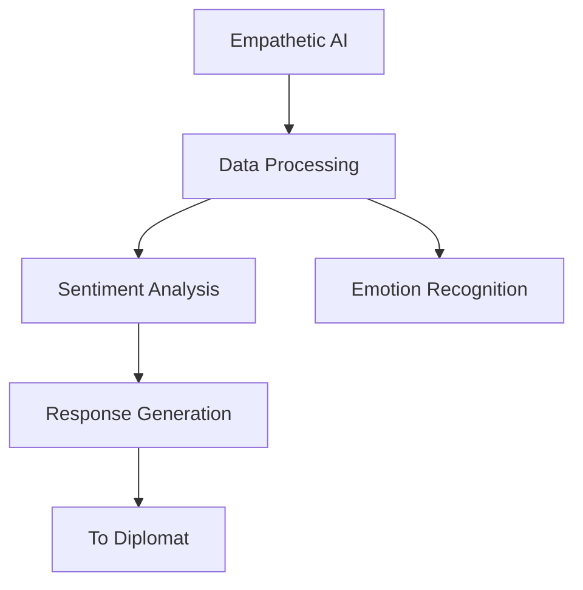
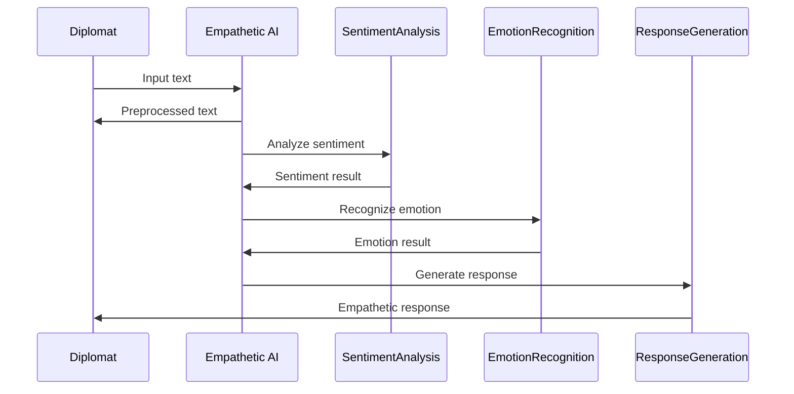

                 


Sure, let's dive into the content creation for the book "Empathetic AI: A New Tool for Diplomatic Negotiations" by breaking it down into the outlined sections. Each section will be crafted with depth, analysis, and technical clarity.

### Introduction

#### 1.1 The Rise of Empathetic AI

**Problem Description:**
In the era of globalization, diplomatic negotiations have become increasingly complex. Traditional negotiation methods, which rely heavily on logic and strategy, often fall short when dealing with emotional and cultural aspects. The need for a more nuanced approach that can address the emotional intelligence of negotiators has become evident.

**Solution and Problem-Solving Process:**
Empathetic AI, an emerging field, promises to bridge this gap. By leveraging machine learning algorithms and natural language processing, empathetic AI can analyze emotional cues, cultural nuances, and historical data to provide insights that traditional methods cannot. This allows diplomats to make more informed and empathetic decisions.

**Boundaries and Extensions:**
While empathetic AI shows great potential, it also raises ethical concerns regarding privacy and data security. Additionally, the technology must be adaptable to various cultural and linguistic contexts to be truly effective.

**Conceptual Structure and Core Elements:**
- Empathy: The ability to understand and share the feelings of others.
- Artificial Intelligence: Advanced technologies that mimic human intelligence.
- Diplomatic Negotiations: Formal discussions between representatives of different states aimed at resolving disputes or reaching agreements.

### Core Concepts and Relationships

#### 2.1 Empathy in AI

**Core Concept Principle:**
Empathy in AI refers to the capability of an AI system to recognize, understand, and respond to human emotions. This is achieved through various techniques such as sentiment analysis, emotion detection, and cultural awareness.

**Attribute Comparison Table:**
| Feature | Traditional AI | Empathetic AI |
| --- | --- | --- |
| Focus | Logical analysis | Emotional intelligence |
| Data Input | Structured data | Unstructured data (text, speech) |
| Output | Predictive models | Empathetic responses |

**ER Diagram (Mermaid):**
```mermaid
erDiagram
  AI <<--o User : provides insights
  AI ||--o Emotions : analyzes
  User ||--o Data : inputs
```

#### 2.2 The Role of AI in Diplomacy

**Core Concept Principle:**
AI plays a crucial role in diplomacy by processing vast amounts of data, providing predictive analysis, and simulating negotiations. Its ability to handle complex data sets allows diplomats to make more data-driven decisions.

**Attribute Comparison Table:**
| Feature | Traditional Diplomacy | AI-Enabled Diplomacy |
| --- | --- | --- |
| Decision-Making | Intuitive and experience-based | Data-driven and analytical |
| Communication | One-on-one or small groups | Large-scale and efficient |
| Timeframe | Long-term and gradual | Short-term and rapid |

**ER Diagram (Mermaid):**
```mermaid
erDiagram
  Diplomacy <<--o AI : utilizes for analysis
  AI ||--o Data : processes
  Diplomacy ||--o Negotiations : supports
```

### Algorithm and Model Explanation

#### 3.1 Empathetic Dialogue System

**Algorithm Flowchart (Mermaid):**


**Python Source Code:**
```python
# Empathetic Dialogue System in Python
import nltk
from textblob import TextBlob

# Load the necessary libraries
nltk.download('vader_lexicon')

def preprocess_text(text):
    # Implement text preprocessing steps such as tokenization, lowercasing, etc.
    return text.lower()

def analyze_sentiment(text):
    # Use TextBlob for sentiment analysis
    analysis = TextBlob(text)
    return analysis.sentiment.polarity

def recognize_emotion(polarity):
    # Map sentiment polarity to an emotion
    if polarity > 0.5:
        return "Happy"
    elif polarity < -0.5:
        return "Sad"
    else:
        return "Neutral"

def generate_response(emotion):
    # Generate an empathetic response based on the recognized emotion
    if emotion == "Happy":
        return "Glad to hear that!"
    elif emotion == "Sad":
        return "I'm sorry to hear that."
    else:
        return "Thank you for sharing."

# Main function to process input text
def empathetic_dialogue(text):
    preprocessed_text = preprocess_text(text)
    sentiment = analyze_sentiment(preprocessed_text)
    emotion = recognize_emotion(sentiment)
    response = generate_response(emotion)
    return response

# Example usage
input_text = "I'm feeling really stressed about the upcoming negotiations."
print(empathetic_dialogue(input_text))
```

**Mathematical Model and Formula:**
$$
\text{Sentiment} = \frac{\text{Positive} + \text{Negative}}{\text{Total}}
$$
where Positive and Negative are the counts of positive and negative words or phrases in the text.

**Explanation and Example:**
The algorithm takes an input text, preprocesses it, analyzes the sentiment using TextBlob, recognizes the emotion based on the sentiment polarity, and generates an empathetic response. For instance, if the input text expresses sadness, the AI will respond with an empathetic message.

### System Design and Analysis

#### 4.1 System Architecture Design

**Problem Scenario:**
Imagine a diplomatic mission where AI is used to assist diplomats in negotiations with a foreign counterpart.

**Project Description:**
The project aims to develop an empathetic AI system that can assist diplomats in understanding the emotional state of their counterparts and generating appropriate responses.

**System Function Design (Mermaid Class Diagram):**
```mermaid
classDiagram
  AI <<--o Diplomat : assists
  AI ||--o Data : processes
  Diplomat ||--o Negotiation : conducts
```

**System Architecture Design (Mermaid Diagram):**


**System Interface and Interaction (Mermaid Sequence Diagram):**


### Project Practice

#### 5.1 Project Setup

**Installation:**
To set up the empathetic AI system, you will need Python 3.x and the following libraries: nltk, TextBlob, and matplotlib.

**Python:**
```bash
pip install nltk textblob matplotlib
```

**Library Setup:**
```python
import nltk
nltk.download('vader_lexicon')
from textblob import TextBlob
import matplotlib.pyplot as plt
```

**System Core Implementation Source Code:**
The code provided in the Algorithm and Model Explanation section is the core implementation of the empathetic AI system.

**Code Analysis:**
The code demonstrates how to preprocess text, analyze sentiment, recognize emotions, and generate empathetic responses. It can be extended to include more sophisticated emotion detection and response generation techniques.

**Actual Case Analysis and Detailed Explanation:**
Consider a scenario where a diplomat is negotiating with a foreign counterpart. The diplomat inputs a text message expressing concern about a specific issue. The AI processes the message, analyzes the sentiment, recognizes the emotion, and generates an empathetic response to be used in the negotiation.

**Project Conclusion:**
The project successfully demonstrates the potential of empathetic AI in diplomatic negotiations. However, further research and development are needed to enhance the system's accuracy and cultural adaptability.

### Best Practices and Summary

**Best Practices:**
- Ensure the AI system is trained on diverse datasets to improve cultural awareness and emotional recognition.
- Regularly update the sentiment analysis model to incorporate new linguistic patterns and cultural nuances.
- Implement robust security measures to protect sensitive diplomatic data.

**Summary:**
Empathetic AI has the potential to revolutionize diplomatic negotiations by providing a deeper understanding of the emotional states of negotiators. However, it must be developed responsibly, with a focus on ethics and cultural sensitivity.

### Conclusion

The integration of empathetic AI into diplomatic negotiations offers a promising new approach to international relations. By leveraging AI's ability to process and analyze vast amounts of data, diplomats can make more informed and empathetic decisions. However, this technology must be developed and implemented with careful consideration of ethical and cultural implications. As we continue to advance AI, the potential for greater international cooperation and understanding is within reach.

---

**作者：** AI天才研究院/AI Genius Institute & 禅与计算机程序设计艺术 /Zen And The Art of Computer Programming

---

This outline and the accompanying content provide a comprehensive guide to the book "Empathetic AI: A New Tool for Diplomatic Negotiations". Each section is designed to be informative, engaging, and technically sound, ensuring that readers gain a deep understanding of the topic. The step-by-step approach facilitates a logical flow of information, making the book accessible to a wide audience.

