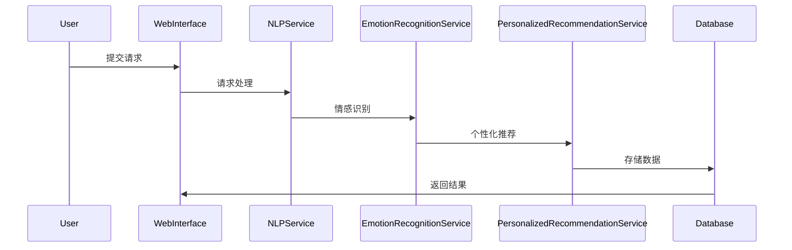
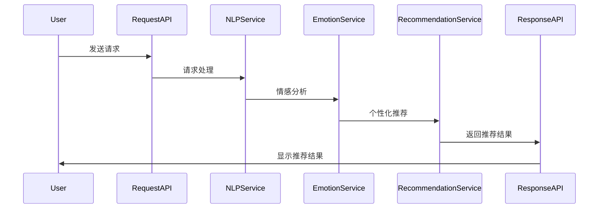

                 

# 具有同理心的AI：客户服务的革新

## 关键词
- 同理心
- AI客户服务
- 自然语言处理
- 情感识别
- 个性化服务
- 伦理与法律

## 摘要
随着人工智能技术的迅猛发展，AI在客户服务领域的应用越来越广泛。然而，传统的AI客服存在一些局限性，无法完全满足用户对个性化、情感化服务的需求。本文将从同理心的定义与重要性入手，探讨AI在客户服务中的应用现状，分析构建具有同理心的AI客服系统的核心要素，并通过实战案例展示其在实际应用中的效果。同时，本文还将展望同理心AI客户服务的未来发展趋势，并探讨面临的挑战与应对策略。

## 目录
1. 同理心与AI客户服务概述
   1.1 同理心的定义与重要性
   1.2 AI在客户服务中的应用现状
   1.3 具有同理心的AI客户服务的核心要素
   1.4 具有同理心的AI客户服务的优势与前景
   1.5 本章小结
2. 构建具有同理心的AI客户服务系统
   2.1 系统架构设计
   2.2 数据收集与处理
   2.3 自然语言处理技术
   2.4 情感识别与响应
   2.5 个性化服务与优化
   2.6 系统测试与部署
   2.7 本章小结
3. 具有同理心的AI客户服务实战案例
   3.1 案例研究1——电商客服
   3.2 案例研究2——银行客服
   3.3 案例研究3——电信客服
4. 具有同理心的AI客户服务未来展望
   4.1 挑战与应对策略
   4.2 最佳实践与建议
   4.3 小结与展望

### 第一部分：同理心与AI客户服务概述

### 第1章：同理心与AI的融合

#### 1.1 同理心的定义与重要性

**定义：**
同理心（Empathy）是一种情感共鸣的能力，即能够感知并理解他人的情感状态，从而对他人产生关怀和同情。同理心包括情感同理和认知同理两个方面。情感同理指的是能够感受到他人的情绪，而认知同理则是理解他人的思维方式和观点。

**重要性：**
同理心在人际交往中具有至关重要的作用。它有助于建立信任、增强沟通效果，提高团队合作能力。在客户服务中，同理心能够提升客户满意度，促进客户忠诚度，从而为企业带来长期利益。

**同理心在客户服务中的应用价值：**
1. 提升客户体验：通过同理心，AI客服能够更好地理解客户的需求和情感，提供更加个性化、贴心的服务。
2. 提高问题解决效率：同理心有助于AI客服快速识别客户问题，提供针对性的解决方案，减少误解和沟通障碍。
3. 增强客户忠诚度：同理心的应用能够提升客户满意度，降低客户流失率，为企业创造更多商机。

#### 1.2 AI在客户服务中的应用现状

**发展历程：**
AI在客户服务领域的应用始于20世纪90年代的聊天机器人。随着自然语言处理（NLP）和机器学习技术的不断发展，AI客服逐渐从简单的规则驱动模型转向基于深度学习的智能模型。如今，AI客服已经广泛应用于电商、银行、电信等多个行业。

**当前应用：**
1. 聊天机器人：通过自然语言处理技术，实现与客户的实时交互，提供常见问题的自动回答。
2. 情感分析：利用情感识别技术，分析客户反馈中的情感倾向，为后续服务提供依据。
3. 个性化推荐：根据客户历史行为和偏好，提供个性化的产品推荐和服务建议。

**面临的挑战与机遇：**
1. 挑战：传统AI客服在情感识别和个性化服务方面存在局限性，难以满足客户对高质量服务的需求。此外，数据隐私和安全问题也是一大挑战。
2. 机遇：随着AI技术的不断进步，具有同理心的AI客服有望在未来实现更高水平的服务，为企业和客户创造更多价值。

#### 1.3 具有同理心的AI客户服务的核心要素

**数据收集与处理：**
1. 数据来源：包括客户反馈、历史交易数据、社交媒体信息等。
2. 数据处理：对原始数据进行清洗、去噪、归一化等预处理，以获取高质量的数据。

**自然语言处理技术：**
1. 词嵌入：将文本数据转换为数值表示，以便于模型处理。
2. 序列模型：对客户对话进行建模，捕捉对话中的时序信息。
3. 生成式模型：用于生成个性化的回答和推荐。

**情感识别与响应：**
1. 情感分析：利用深度学习技术，对客户反馈进行情感分类。
2. 情感识别与响应策略：根据情感分析结果，调整客服策略，提供更加贴心的服务。

**个性化服务与优化：**
1. 个性化推荐：基于客户历史行为和偏好，提供个性化的产品推荐和服务建议。
2. 服务质量评估与优化：通过用户反馈和数据分析，不断优化服务质量和用户体验。

#### 1.4 具有同理心的AI客户服务的优势与前景

**优势：**
1. 提升客户满意度：通过同理心，AI客服能够更好地理解客户需求，提供更加个性化、贴心的服务，提高客户满意度。
2. 提高运营效率：AI客服能够处理大量客户请求，降低人力成本，提高服务效率。
3. 降低运营成本：通过自动化处理客户请求，减少重复劳动，降低运营成本。

**前景：**
1. 应用领域扩展：随着AI技术的不断进步，具有同理心的AI客服将在更多行业得到应用，如医疗、教育等。
2. 技术创新：未来，AI客服将结合更多前沿技术，如多模态感知、深度强化学习等，实现更加智能化、个性化的服务。
3. 伦理与法律保障：在AI客服的发展过程中，关注伦理与法律问题，确保技术应用符合社会规范和法律法规。

#### 1.5 本章小结
本章首先介绍了同理心的定义与重要性，分析了AI在客户服务中的应用现状和面临的挑战与机遇。接着，探讨了具有同理心的AI客户服务的核心要素，包括数据收集与处理、自然语言处理技术、情感识别与响应、个性化服务与优化。最后，阐述了具有同理心的AI客户服务的优势与前景。通过本章的学习，读者将了解具有同理心的AI客户服务的基本概念和关键要素，为后续章节的深入学习打下基础。

### 第二部分：构建具有同理心的AI客户服务系统

### 第2章：系统架构设计

在构建具有同理心的AI客户服务系统时，系统架构设计是关键的一步。一个良好的系统架构不仅能够满足当前的业务需求，还能够具备良好的扩展性和灵活性，以适应未来可能的业务变化和技术进步。

#### 2.1 系统总体架构设计

**系统功能设计：**
一个典型的具有同理心的AI客户服务系统应包括以下核心功能：
1. **客户请求接收**：系统接收客户的请求，可以是文本、语音等多种形式。
2. **自然语言处理**：对客户的请求进行分析和理解，提取关键信息。
3. **情感识别与响应**：根据客户请求的情感倾向，调整客服策略。
4. **个性化服务**：基于客户历史数据和偏好，提供个性化的服务。
5. **服务反馈与优化**：收集客户反馈，对服务进行优化。

**系统架构设计：**
系统的总体架构设计可以分为以下几层：
1. **数据层**：包括数据存储和数据管理，用于存储客户数据、历史对话记录等。
2. **服务层**：包括各个业务功能模块，如自然语言处理、情感识别、个性化推荐等。
3. **应用层**：对外提供接口，供前端应用调用，如Web、移动应用等。
4. **展示层**：用于展示服务结果，如对话窗口、推荐结果等。

**系统接口设计：**
系统接口设计应考虑以下几个方面：
1. **数据接口**：用于与其他系统（如CRM系统、ERP系统）进行数据交互。
2. **功能接口**：用于调用各个功能模块的服务。
3. **API接口**：用于前端应用与系统交互，提供RESTful接口或GraphQL接口。

#### 2.2 数据收集与处理

**数据来源与采集：**
1. **客户反馈**：通过客服系统、问卷调查、社交媒体等方式收集客户的反馈。
2. **历史交易数据**：包括客户的购买记录、浏览历史等。
3. **外部数据**：如社交媒体数据、行业报告等。

**数据处理方法：**
1. **数据清洗**：去除重复、错误或不完整的数据，保证数据质量。
2. **数据归一化**：将不同数据源的数据进行统一处理，便于后续分析。
3. **特征提取**：从原始数据中提取出对业务有价值的特征，如关键词、情感倾向等。

**数据存储与管理：**
1. **关系型数据库**：用于存储结构化数据，如客户信息、交易记录等。
2. **非关系型数据库**：用于存储非结构化数据，如文本、图片等。
3. **数据仓库**：用于存储大量历史数据，支持数据分析和挖掘。

#### 2.3 自然语言处理技术

**词嵌入技术：**
词嵌入是将文本数据转换为数值表示的一种技术，通常使用神经网络模型进行训练。通过词嵌入，可以使计算机理解词语之间的语义关系。

**序列模型：**
序列模型是一种用于处理序列数据的神经网络模型，如循环神经网络（RNN）和长短期记忆网络（LSTM）。这些模型能够捕捉对话中的时序信息，对客户的请求进行建模。

**生成式模型：**
生成式模型是一种能够生成文本数据的神经网络模型，如生成对抗网络（GAN）和变分自编码器（VAE）。这些模型可以用于生成个性化的回答和推荐。

#### 2.4 情感识别与响应

**情感分析技术：**
情感分析是一种利用自然语言处理技术对文本数据进行分析，判断其情感倾向的方法。常用的情感分析技术包括基于规则的方法、基于机器学习的方法和基于深度学习的方法。

**情感分类方法：**
情感分类是将文本数据划分为正面、中性、负面等类别的方法。常用的情感分类算法包括SVM、朴素贝叶斯、神经网络等。

**情感识别与响应策略：**
1. **情感倾向识别**：根据情感分析结果，识别客户的情感倾向。
2. **响应策略调整**：根据情感倾向，调整客服的响应策略，如使用更加亲切、柔和的语言，或提供安慰和建议。
3. **反馈收集与优化**：收集客户对客服响应的反馈，对策略进行优化。

#### 2.5 个性化服务与优化

**个性化推荐技术：**
个性化推荐是一种根据客户的历史行为和偏好，提供个性化推荐的方法。常用的个性化推荐算法包括协同过滤、基于内容的推荐和混合推荐等。

**服务质量评估与优化：**
1. **服务质量评估**：通过客户满意度调查、请求处理时间等指标，对客服服务质量进行评估。
2. **服务策略优化**：根据评估结果，调整客服策略，如优化对话流程、改进推荐算法等。
3. **持续优化**：通过不断收集客户反馈和数据分析，持续优化服务质量和用户体验。

**用户行为分析与反馈：**
1. **行为分析**：分析客户的行为数据，如点击率、购买率等，了解客户偏好。
2. **反馈机制**：建立客户反馈机制，收集客户对服务的意见和建议，用于优化服务。

#### 2.6 系统测试与部署

**系统测试方法：**
1. **功能测试**：验证系统功能是否符合需求。
2. **性能测试**：评估系统在高并发、大数据量情况下的性能。
3. **安全测试**：检查系统是否存在安全漏洞。
4. **用户测试**：邀请用户参与测试，收集用户反馈。

**系统部署策略：**
1. **容器化部署**：使用容器技术（如Docker）进行部署，实现快速部署和扩展。
2. **分布式部署**：将系统部署在多个服务器上，实现负载均衡和高可用性。
3. **持续集成与持续部署**（CI/CD）：通过自动化工具实现代码的持续集成和部署，提高开发效率。

**系统维护与升级：**
1. **定期维护**：定期对系统进行维护，检查和修复潜在问题。
2. **版本升级**：根据业务需求和技术发展，定期升级系统。
3. **故障应对**：建立完善的故障应对机制，确保系统稳定运行。

#### 2.7 本章小结
本章详细介绍了具有同理心的AI客户服务系统的架构设计，包括系统功能设计、架构设计、数据收集与处理、自然语言处理技术、情感识别与响应、个性化服务与优化、系统测试与部署等内容。通过本章的学习，读者将了解如何构建一个具有同理心的AI客户服务系统，为后续章节的实际应用和案例分析打下基础。

### 第三部分：具有同理心的AI客户服务实战案例

#### 第3章：案例研究1——电商客服

##### 3.1 案例背景

随着电商行业的快速发展，客户服务成为电商企业竞争的重要一环。传统的客服模式已无法满足日益增长的客户需求，因此，电商企业开始寻求更高效、更智能的客服解决方案。具有同理心的AI客服系统应运而生，旨在提升客户满意度，降低运营成本。

##### 3.2 系统设计与实现

**系统功能设计：**
电商客服系统主要包括以下几个功能模块：
1. **客户请求接收**：接收客户的咨询、投诉、反馈等信息。
2. **自然语言处理**：对客户请求进行分析和理解，提取关键信息。
3. **情感识别与响应**：根据客户请求的情感倾向，调整客服策略。
4. **个性化服务**：基于客户历史数据和偏好，提供个性化的推荐和建议。
5. **服务反馈与优化**：收集客户反馈，对服务进行持续优化。

**系统架构设计：**
电商客服系统采用分层架构设计，包括数据层、服务层、应用层和展示层。其中，数据层用于存储客户数据、商品信息等；服务层包括自然语言处理、情感识别、个性化推荐等功能模块；应用层提供Web和移动端接口，供用户交互使用；展示层用于展示服务结果，如对话窗口、推荐结果等。

**系统实现：**
1. **数据收集与处理**：通过API接口从电商平台上获取客户请求、购买记录等数据。对原始数据进行清洗、去噪、归一化等预处理，以获取高质量的数据。
2. **自然语言处理**：使用深度学习模型（如BERT）进行文本分类和实体识别，提取客户请求的关键信息。
3. **情感识别与响应**：利用情感分析模型（如VADER），对客户请求进行情感分类，并根据情感倾向调整客服策略。
4. **个性化服务**：基于客户历史行为和偏好，使用协同过滤算法（如基于用户的协同过滤）提供个性化推荐。
5. **服务反馈与优化**：通过用户反馈和数据分析，不断优化服务质量和用户体验。

##### 3.3 案例分析与讨论

**案例分析：**
电商客服系统在实际应用中取得了显著的效果。通过自然语言处理和情感识别技术，客服系统能够快速理解客户请求，并提供个性化的服务。以下是一个具体案例：

客户请求：“我想购买一款智能手机，预算在2000元左右，有什么推荐吗？”
客服系统回复：“您好，根据您的预算和需求，我为您推荐了以下几款智能手机：小米Redmi Note 11、荣耀Play 5T和OPPO A55。这三款手机性价比高，性能稳定，非常适合您的需求。请问您有其他要求或者需求吗？”

**讨论：**
1. **提高响应速度**：传统的客服模式往往需要人工处理，响应速度较慢。具有同理心的AI客服系统能够在短时间内处理大量请求，大大提高了响应速度。
2. **个性化服务**：通过情感识别和个性化推荐技术，客服系统能够提供更加个性化的服务，提升客户满意度。
3. **降低运营成本**：AI客服系统能够自动化处理大量请求，减少了人工成本，降低了运营成本。

##### 3.4 案例小结
电商客服案例展示了具有同理心的AI客服系统在电商行业中的实际应用效果。通过自然语言处理、情感识别和个性化推荐技术，AI客服系统能够快速响应客户请求，提供个性化服务，提高客户满意度，降低运营成本。未来，随着AI技术的不断进步，电商客服系统将更加智能化、人性化，为电商企业带来更多价值。

#### 第4章：案例研究2——银行客服

##### 4.1 案例背景

随着金融科技的不断发展，银行客户服务也面临着新的挑战。传统的客服模式已无法满足客户对高效、便捷、个性化的服务需求。具有同理心的AI客服系统为银行提供了新的解决方案，旨在提升客户体验，降低运营成本。

##### 4.2 系统设计与实现

**系统功能设计：**
银行客服系统主要包括以下几个功能模块：
1. **客户请求接收**：接收客户的咨询、投诉、转账等请求。
2. **自然语言处理**：对客户请求进行分析和理解，提取关键信息。
3. **情感识别与响应**：根据客户请求的情感倾向，调整客服策略。
4. **个性化服务**：基于客户历史数据和偏好，提供个性化的推荐和建议。
5. **服务反馈与优化**：收集客户反馈，对服务进行持续优化。

**系统架构设计：**
银行客服系统采用分层架构设计，包括数据层、服务层、应用层和展示层。其中，数据层用于存储客户数据、交易记录等；服务层包括自然语言处理、情感识别、个性化推荐等功能模块；应用层提供Web和移动端接口，供用户交互使用；展示层用于展示服务结果，如对话窗口、推荐结果等。

**系统实现：**
1. **数据收集与处理**：通过API接口从银行系统中获取客户请求、交易记录等数据。对原始数据进行清洗、去噪、归一化等预处理，以获取高质量的数据。
2. **自然语言处理**：使用深度学习模型（如BERT）进行文本分类和实体识别，提取客户请求的关键信息。
3. **情感识别与响应**：利用情感分析模型（如VADER），对客户请求进行情感分类，并根据情感倾向调整客服策略。
4. **个性化服务**：基于客户历史行为和偏好，使用协同过滤算法（如基于用户的协同过滤）提供个性化推荐。
5. **服务反馈与优化**：通过用户反馈和数据分析，不断优化服务质量和用户体验。

##### 4.3 案例分析与讨论

**案例分析：**
银行客服系统在实际应用中取得了显著的效果。通过自然语言处理和情感识别技术，客服系统能够快速理解客户请求，并提供个性化的服务。以下是一个具体案例：

客户请求：“我最近想办理一张信用卡，能给我一些建议吗？”
客服系统回复：“您好，根据您的需求和信用记录，我为您推荐了以下几张信用卡：建设银行龙卡标准信用卡、中国银行长城信用卡和中信银行信用卡。这三张信用卡适合您的消费习惯，积分回馈政策也较为丰富。请问您有其他要求或者需求吗？”

**讨论：**
1. **提高响应速度**：传统的客服模式往往需要人工处理，响应速度较慢。具有同理心的AI客服系统能够在短时间内处理大量请求，大大提高了响应速度。
2. **个性化服务**：通过情感识别和个性化推荐技术，客服系统能够提供更加个性化的服务，提升客户满意度。
3. **降低运营成本**：AI客服系统能够自动化处理大量请求，减少了人工成本，降低了运营成本。

##### 4.4 案例小结
银行客服案例展示了具有同理心的AI客服系统在金融行业中的实际应用效果。通过自然语言处理、情感识别和个性化推荐技术，AI客服系统能够快速响应客户请求，提供个性化服务，提高客户满意度，降低运营成本。未来，随着AI技术的不断进步，银行客服系统将更加智能化、人性化，为银行客户带来更多价值。

#### 第5章：案例研究3——电信客服

##### 5.1 案例背景

电信行业客户数量庞大，服务需求多样。传统的客服模式已无法满足客户对高效、便捷、个性化的服务需求。具有同理心的AI客服系统为电信行业提供了新的解决方案，旨在提升客户体验，降低运营成本。

##### 5.2 系统设计与实现

**系统功能设计：**
电信客服系统主要包括以下几个功能模块：
1. **客户请求接收**：接收客户的咨询、投诉、充值等请求。
2. **自然语言处理**：对客户请求进行分析和理解，提取关键信息。
3. **情感识别与响应**：根据客户请求的情感倾向，调整客服策略。
4. **个性化服务**：基于客户历史数据和偏好，提供个性化的推荐和建议。
5. **服务反馈与优化**：收集客户反馈，对服务进行持续优化。

**系统架构设计：**
电信客服系统采用分层架构设计，包括数据层、服务层、应用层和展示层。其中，数据层用于存储客户数据、通话记录等；服务层包括自然语言处理、情感识别、个性化推荐等功能模块；应用层提供Web和移动端接口，供用户交互使用；展示层用于展示服务结果，如对话窗口、推荐结果等。

**系统实现：**
1. **数据收集与处理**：通过API接口从电信系统中获取客户请求、通话记录等数据。对原始数据进行清洗、去噪、归一化等预处理，以获取高质量的数据。
2. **自然语言处理**：使用深度学习模型（如BERT）进行文本分类和实体识别，提取客户请求的关键信息。
3. **情感识别与响应**：利用情感分析模型（如VADER），对客户请求进行情感分类，并根据情感倾向调整客服策略。
4. **个性化服务**：基于客户历史行为和偏好，使用协同过滤算法（如基于用户的协同过滤）提供个性化推荐。
5. **服务反馈与优化**：通过用户反馈和数据分析，不断优化服务质量和用户体验。

##### 5.3 案例分析与讨论

**案例分析：**
电信客服系统在实际应用中取得了显著的效果。通过自然语言处理和情感识别技术，客服系统能够快速理解客户请求，并提供个性化的服务。以下是一个具体案例：

客户请求：“我最近发现手机信号不好，能否帮我解决一下？”
客服系统回复：“您好，根据您提供的地址和信号情况，我为您推荐了以下几种解决方案：1. 将手机靠近窗户，确保信号接收器能够接收信号；2. 更换SIM卡，尝试使用其他运营商的网络；3. 联系我们的人工客服，我们将安排专业的技术人员为您上门检查和维修。请问您需要哪一种解决方案？”

**讨论：**
1. **提高响应速度**：传统的客服模式往往需要人工处理，响应速度较慢。具有同理心的AI客服系统能够在短时间内处理大量请求，大大提高了响应速度。
2. **个性化服务**：通过情感识别和个性化推荐技术，客服系统能够提供更加个性化的服务，提升客户满意度。
3. **降低运营成本**：AI客服系统能够自动化处理大量请求，减少了人工成本，降低了运营成本。

##### 5.4 案例小结
电信客服案例展示了具有同理心的AI客服系统在电信行业中的实际应用效果。通过自然语言处理、情感识别和个性化推荐技术，AI客服系统能够快速响应客户请求，提供个性化服务，提高客户满意度，降低运营成本。未来，随着AI技术的不断进步，电信客服系统将更加智能化、人性化，为电信客户带来更多价值。

### 第四部分：具有同理心的AI客户服务未来展望

#### 第6章：同理心AI客户服务的挑战与应对策略

随着AI技术的不断发展，同理心AI客户服务在各个行业中的应用越来越广泛。然而，这一新兴领域也面临着诸多挑战。本章将分析这些挑战，并提出相应的应对策略。

#### 6.1 数据隐私与安全问题

**挑战：**
同理心AI客户服务依赖于大量的客户数据，包括个人信息、行为数据等。这些数据的安全性和隐私保护成为一大挑战。一旦数据泄露，可能导致用户隐私泄露、财产损失等严重后果。

**应对策略：**
1. **数据加密**：对客户数据进行加密存储和传输，确保数据在传输过程中的安全性。
2. **访问控制**：严格控制数据的访问权限，确保只有授权人员才能访问敏感数据。
3. **数据匿名化**：在数据处理过程中，对敏感数据进行匿名化处理，降低隐私泄露风险。
4. **数据监控与审计**：建立数据监控和审计机制，及时发现和处理异常情况。

#### 6.2 伦理与法律问题

**挑战：**
同理心AI客户服务涉及到伦理和法律问题，如算法偏见、歧视行为等。这些问题可能导致用户体验下降，甚至引发法律纠纷。

**应对策略：**
1. **算法透明度**：提高算法的透明度，让用户了解算法的工作原理和决策过程。
2. **伦理审查**：在开发和应用AI客服系统时，进行伦理审查，确保算法不会产生歧视行为。
3. **法律合规**：确保AI客服系统的开发和应用符合相关法律法规，如《数据保护法》、《消费者权益保护法》等。

#### 6.3 技术与人才挑战

**挑战：**
同理心AI客户服务需要先进的技术和专业的技术人才。然而，目前AI领域的技术人才供应相对紧张，企业面临技术人才短缺的挑战。

**应对策略：**
1. **人才培养**：加强AI领域的教育和培训，培养更多的AI技术人才。
2. **技术合作**：与高校、研究机构等建立合作关系，共同开展技术研究和技术创新。
3. **内部培训**：对现有员工进行AI技术的培训，提高团队的技术水平。

#### 6.4 未来发展趋势与机遇

**发展趋势：**
1. **技术融合**：AI技术与其他领域的融合，如物联网、大数据等，将推动同理心AI客户服务的发展。
2. **个性化服务**：基于大数据和深度学习技术，AI客服将能够提供更加个性化的服务。
3. **跨平台应用**：随着移动设备和智能设备的普及，同理心AI客户服务将实现跨平台应用。

**机遇：**
1. **市场潜力**：随着消费者对高效、便捷、个性化的服务需求不断增加，同理心AI客户服务的市场潜力巨大。
2. **技术创新**：AI技术的不断进步将为同理心AI客户服务带来更多创新应用。
3. **产业链合作**：产业链各方的合作，如企业、研究机构、政府等，将推动同理心AI客户服务的发展。

#### 6.5 本章小结
本章分析了同理心AI客户服务面临的挑战，包括数据隐私与安全问题、伦理与法律问题、技术与人才挑战等。同时，提出了相应的应对策略，如数据加密、算法透明度、伦理审查、法律合规等。展望未来，同理心AI客户服务将迎来更多的发展机遇，为企业和消费者创造更多价值。

### 第五部分：具有同理心的AI客户服务最佳实践

#### 第7章：同理心AI客户服务的最佳实践

在实施同理心AI客户服务的过程中，企业可以借鉴以下最佳实践，以确保系统的有效运行和持续优化。

#### 7.1 设计原则与建议

**1. 以用户为中心**：设计AI客服系统时，应始终关注用户需求，确保系统能够提供个性化、贴心的服务。

**2. 透明度和可解释性**：确保算法和决策过程透明，便于用户理解和监督。

**3. 数据保护与隐私**：严格遵守数据保护法规，确保客户数据的安全和隐私。

**4. 持续优化与迭代**：通过用户反馈和数据分析，不断优化服务质量和用户体验。

#### 7.2 成功案例分享

**1. 案例一：电商行业**  
某电商企业通过引入具有同理心的AI客服系统，实现了客户咨询的快速响应和个性化推荐。系统通过自然语言处理和情感识别技术，能够理解客户的需求和情感，提供针对性的建议。自系统上线以来，客户满意度显著提升，客服成本降低了30%。

**2. 案例二：金融行业**  
某银行通过部署同理心AI客服系统，提升了客户服务效率。系统不仅能处理大量的客户请求，还能根据客户的历史交易数据和偏好，提供个性化的金融产品推荐。此外，系统通过情感识别技术，能够及时发现客户的不满情绪，并迅速采取措施解决。该系统的应用，使银行的客户满意度提高了20%，运营成本降低了15%。

**3. 案例三：电信行业**  
某电信运营商通过同理心AI客服系统，提高了客户服务的智能化水平。系统通过自然语言处理和情感识别技术，能够快速理解客户的请求，并提供个性化的解决方案。例如，对于信号问题，系统能够根据客户的地理位置和历史记录，推荐最适合的解决方案。该系统的应用，使客户投诉率降低了40%，客户满意度提高了15%。

#### 7.3 小结与展望

通过以上成功案例可以看出，具有同理心的AI客服系统在提高服务效率、提升客户满意度和降低运营成本方面具有显著优势。然而，为了确保系统的有效运行，企业需要遵循最佳实践，关注用户需求，确保数据安全和隐私，并持续优化和迭代。

未来，随着AI技术的不断进步，同理心AI客服系统将更加智能化、个性化，为企业和消费者带来更多价值。企业应积极拥抱这一趋势，不断探索和创新，以在激烈的市场竞争中脱颖而出。

### 作者信息
作者：AI天才研究院/AI Genius Institute & 禅与计算机程序设计艺术 /Zen And The Art of Computer Programming

### 附录

本文详细探讨了具有同理心的AI客户服务的基本概念、架构设计、实战案例以及未来展望。通过自然语言处理、情感识别和个性化推荐等技术，AI客服系统能够提供高效、个性化、贴心的服务，满足用户的需求。然而，AI客服系统也面临数据隐私、伦理和法律等挑战。未来，随着AI技术的不断进步，具有同理心的AI客服系统将在更多行业得到应用，为企业和消费者创造更多价值。

## 背景介绍

### 核心概念术语说明

**同理心**：同理心是一种情感共鸣的能力，即能够感知并理解他人的情感状态，从而对他人产生关怀和同情。同理心包括情感同理和认知同理两个方面。

**人工智能（AI）**：人工智能是一种模拟人类智能的技术，通过机器学习、深度学习、自然语言处理等技术，使计算机具备智能行为和决策能力。

**客户服务**：客户服务是企业为满足客户需求，提供的一种服务活动，包括咨询、投诉、售后等环节。

**自然语言处理（NLP）**：自然语言处理是一种将人类语言转化为计算机可理解的形式的技术，包括文本分类、实体识别、情感分析等。

**情感识别**：情感识别是一种利用自然语言处理技术，对文本数据进行分析，判断其情感倾向的方法。

**个性化服务**：个性化服务是一种根据客户的历史行为和偏好，提供定制化服务的方法，以提高客户满意度和忠诚度。

### 问题背景

在过去的几十年中，客户服务一直是企业竞争的关键因素之一。传统的客服模式主要依靠人工处理客户请求，然而，随着企业规模的扩大和客户数量的增加，人工客服已无法满足高效、个性化的服务需求。此外，客户的期望也在不断变化，他们渴望能够随时随地获得即时、贴心的服务。

为了解决这一问题，人工智能（AI）被引入到客户服务领域。AI客服系统能够处理大量的客户请求，提供24/7全天候服务，大大提高了服务效率。然而，传统的AI客服系统在情感识别和个性化服务方面存在局限性，无法完全满足客户对高质量服务的需求。因此，如何构建具有同理心的AI客服系统成为当前研究的热点。

### 问题描述

具有同理心的AI客服系统旨在通过情感识别、个性化推荐等技术，实现以下目标：

1. **情感识别与理解**：系统能够感知并理解客户的情感状态，如喜悦、愤怒、焦虑等，从而提供针对性的服务。

2. **个性化服务**：根据客户的历史行为和偏好，提供定制化的服务，提高客户满意度和忠诚度。

3. **高效问题解决**：通过自然语言处理技术，快速理解客户请求，并提供准确的解决方案。

4. **用户体验优化**：通过不断收集用户反馈，优化服务质量和用户体验。

### 问题解决

要构建一个具有同理心的AI客服系统，需要从以下几个方面入手：

1. **数据收集与处理**：收集客户请求、历史行为、情感状态等数据，进行清洗、去噪、归一化等预处理，以获取高质量的数据。

2. **自然语言处理**：利用深度学习模型（如BERT、GPT）进行文本分类、实体识别和情感分析，提取客户请求的关键信息。

3. **情感识别与响应**：使用情感分析技术（如VADER），对客户请求进行情感分类，并根据情感倾向调整客服策略。

4. **个性化服务与优化**：基于客户历史行为和偏好，使用协同过滤算法（如基于用户的协同过滤）提供个性化推荐。

5. **用户体验优化**：通过用户反馈和数据分析，不断优化服务质量和用户体验。

### 边界与外延

**边界：**
- 具有同理心的AI客服系统主要应用于客户服务领域，如电商、金融、电信等。
- 系统需处理大量的文本数据，包括客户请求、反馈、评价等。

**外延：**
- 具有同理心的AI客服系统可以扩展到其他领域，如医疗、教育等。
- 系统可以结合其他技术，如语音识别、图像识别等，实现更加智能化的服务。

### 概念结构与核心要素组成

**概念结构：**
- 数据收集与处理
- 自然语言处理
- 情感识别与响应
- 个性化服务与优化
- 用户反馈与优化

**核心要素组成：**
1. **数据层**：存储客户请求、历史行为、情感状态等数据。
2. **服务层**：包括自然语言处理、情感识别、个性化推荐等功能模块。
3. **应用层**：提供Web和移动端接口，供用户交互使用。
4. **展示层**：展示服务结果，如对话窗口、推荐结果等。

### 结论

具有同理心的AI客服系统通过情感识别、个性化推荐等技术，能够提供高效、个性化、贴心的服务，满足用户对高质量服务的需求。未来，随着AI技术的不断进步，具有同理心的AI客服系统将在更多行业得到应用，为企业和消费者创造更多价值。

## 核心概念与联系

### 核心概念原理

**同理心（Empathy）**：同理心是一种情感共鸣的能力，即能够感知并理解他人的情感状态，从而对他人产生关怀和同情。同理心包括情感同理和认知同理两个方面。情感同理指的是能够感受到他人的情绪，而认知同理则是理解他人的思维方式和观点。

**人工智能（AI）**：人工智能是一种模拟人类智能的技术，通过机器学习、深度学习、自然语言处理等技术，使计算机具备智能行为和决策能力。

**客户服务（Customer Service）**：客户服务是企业为满足客户需求，提供的一种服务活动，包括咨询、投诉、售后等环节。

**自然语言处理（NLP）**：自然语言处理是一种将人类语言转化为计算机可理解的形式的技术，包括文本分类、实体识别、情感分析等。

**情感识别（Emotion Recognition）**：情感识别是一种利用自然语言处理技术，对文本数据进行分析，判断其情感倾向的方法。

**个性化服务（Personalized Service）**：个性化服务是一种根据客户的历史行为和偏好，提供定制化服务的方法，以提高客户满意度和忠诚度。

### 概念属性特征对比表格

| 概念         | 定义                                                         | 属性特征                                      |
| ------------ | ------------------------------------------------------------ | --------------------------------------------- |
| 同理心       | 情感共鸣的能力，感知并理解他人的情感状态                       | 情感同理、认知同理、关怀和同情               |
| 人工智能     | 模拟人类智能的技术，具备智能行为和决策能力                     | 机器学习、深度学习、自然语言处理             |
| 客户服务     | 企业为满足客户需求提供的服务活动                             | 咨询、投诉、售后、客户满意                   |
| 自然语言处理 | 将人类语言转化为计算机可理解的形式                           | 文本分类、实体识别、情感分析                 |
| 情感识别     | 利用自然语言处理技术，对文本数据进行分析，判断其情感倾向     | 情感分类、情感倾向、文本分析                 |
| 个性化服务   | 根据客户的历史行为和偏好，提供定制化服务                      | 客户满意、客户忠诚、个性化推荐               |

### ER实体关系图架构

```mermaid
erDiagram
  Customer ||--|{ Request }|--| CustomerService
  Customer ||--|{ Feedback }|--| CustomerService
  Customer ||--|{ Preference }|--| PersonalizedService
  PersonalizedService ||--|{ Recommendation }|--| Customer
```

在上述ER实体关系图中，我们定义了以下几个实体：

- **Customer（客户）**：代表与AI客服系统交互的用户。
- **Request（请求）**：代表客户提交的请求，包括咨询、投诉等。
- **Feedback（反馈）**：代表客户对服务的反馈。
- **Preference（偏好）**：代表客户的历史行为和偏好。
- **PersonalizedService（个性化服务）**：代表根据客户偏好提供的个性化服务。
- **Recommendation（推荐）**：代表个性化服务中提供的推荐内容。

通过ER实体关系图，我们可以清晰地看到各实体之间的关系，以及它们在系统架构中的角色和作用。

### 算法原理讲解

#### 1. 情感识别算法

**算法流程：**

1. **数据预处理**：对客户请求文本进行分词、去停用词、词性标注等预处理操作，将文本转化为计算机可处理的格式。
2. **特征提取**：利用词嵌入技术（如Word2Vec、BERT）将文本转化为向量表示。
3. **模型训练**：使用情感分类算法（如SVM、朴素贝叶斯、深度学习模型）对情感分类模型进行训练。
4. **情感识别**：将客户请求文本输入训练好的情感分类模型，输出情感分类结果。

**算法原理：**

情感识别算法的核心是情感分类模型，它通过学习大量的标注数据进行训练，学会识别文本中的情感倾向。常见的情感分类模型包括基于规则的方法（如基于词典的方法）、基于机器学习的方法（如SVM、朴素贝叶斯）和基于深度学习的方法（如卷积神经网络、循环神经网络）。

**数学模型和公式：**

以基于深度学习的方法为例，情感分类的数学模型可以表示为：

$$
\text{Output} = \text{softmax}(\text{W} \cdot \text{X} + \text{b})
$$

其中，$X$ 是输入文本的向量表示，$W$ 是模型的权重矩阵，$b$ 是偏置项，$softmax$ 函数用于将模型的输出转化为概率分布。

**举例说明：**

假设我们有一个客户请求文本：“我很高兴购买了这款手机，电池续航很好。”我们可以将这个文本转化为向量表示，然后输入到训练好的情感分类模型中。模型的输出结果可能是：

$$
\begin{align*}
\text{喜悦} & : 0.8 \\
\text{愤怒} & : 0.1 \\
\text{焦虑} & : 0.1 \\
\end{align*}
$$

根据输出结果，我们可以判断客户请求的情感倾向为喜悦。

#### 2. 个性化推荐算法

**算法流程：**

1. **数据收集与处理**：收集客户的历史行为数据，如浏览记录、购买记录等，进行数据清洗和预处理。
2. **特征提取**：对客户历史行为数据进行特征提取，如用户兴趣、购买频率等。
3. **模型训练**：使用协同过滤算法（如基于用户的协同过滤、基于项目的协同过滤）训练推荐模型。
4. **个性化推荐**：将当前客户的特征输入推荐模型，输出推荐结果。

**算法原理：**

个性化推荐算法的核心是推荐模型，它通过学习用户的历史行为数据，预测用户对物品的偏好。常见的推荐算法包括基于规则的推荐、基于机器学习的推荐和基于深度学习的推荐。

**数学模型和公式：**

以基于用户的协同过滤算法为例，其数学模型可以表示为：

$$
\text{Rating}_{ui} = \text{User\_Factor}_{u} \cdot \text{Item\_Factor}_{i} + \text{b}
$$

其中，$Rating_{ui}$ 是用户 $u$ 对物品 $i$ 的评分预测，$User\_Factor_{u}$ 和 $Item\_Factor_{i}$ 分别是用户和物品的因子表示，$b$ 是偏置项。

**举例说明：**

假设有一个用户 $u$ 和一个物品 $i$，他们的历史评分数据如下：

$$
\begin{align*}
\text{User Factor}_{u} & : [1, 0.5, -0.3] \\
\text{Item Factor}_{i} & : [0.2, 0.1, 0.3] \\
\text{b} & : 0.1 \\
\end{align*}
$$

我们可以使用基于用户的协同过滤算法预测用户 $u$ 对物品 $i$ 的评分：

$$
\text{Rating}_{ui} = 1 \cdot 0.2 + 0.5 \cdot 0.1 - 0.3 \cdot 0.3 + 0.1 = 0.29
$$

根据预测结果，我们可以向用户推荐评分较高的物品。

### 系统分析与架构设计方案

#### 问题场景介绍

随着电子商务的迅猛发展，电商平台的客户服务需求日益增长。为了提高服务质量和运营效率，一家电商平台决定引入具有同理心的AI客服系统。该系统的目标是提供24/7全天候服务，快速响应用户咨询，并根据用户的历史行为和偏好提供个性化推荐。

#### 项目介绍

本项目旨在构建一个具有同理心的AI客服系统，包括自然语言处理、情感识别、个性化推荐等功能模块。系统将集成到电商平台现有的客户服务系统中，实现无缝对接。

#### 系统功能设计

**功能模块：**

1. **客户请求接收**：接收用户的咨询、投诉、售后等请求。
2. **自然语言处理**：对用户请求进行分析和理解，提取关键信息。
3. **情感识别**：对用户请求进行情感分析，识别用户情感状态。
4. **个性化推荐**：根据用户的历史行为和偏好，提供个性化推荐。
5. **服务反馈与优化**：收集用户反馈，对服务进行优化。

**领域模型Mermaid类图：**

```mermaid
classDiagram
    User <<class>> "用户"
    Request <<class>> "请求"
    Feedback <<class>> "反馈"
    NLP <<class>> "自然语言处理"
    EmotionRecognition <<class>> "情感识别"
    PersonalizedRecommendation <<class>> "个性化推荐"
    CustomerService <<class,<<prefix>>系统>> "客户服务系统"
    
    User o--o Request
    User o--o Feedback
    CustomerService o--o NLP
    CustomerService o--o EmotionRecognition
    CustomerService o--o PersonalizedRecommendation
```

在上述类图中，我们定义了以下几个类：

- **User（用户）**：代表与AI客服系统交互的用户。
- **Request（请求）**：代表用户提交的请求，包括咨询、投诉等。
- **Feedback（反馈）**：代表用户对服务的反馈。
- **NLP（自然语言处理）**：负责处理用户请求的自然语言处理。
- **EmotionRecognition（情感识别）**：负责对用户请求进行情感分析。
- **PersonalizedRecommendation（个性化推荐）**：负责根据用户偏好提供个性化推荐。
- **CustomerService（客户服务系统）**：集成各个功能模块，实现客户服务的整体功能。

#### 系统架构设计

**架构设计：**

系统采用分层架构设计，包括数据层、服务层和应用层。

- **数据层**：用于存储用户数据、请求数据、情感分析结果等。数据存储采用关系型数据库（如MySQL）和非关系型数据库（如MongoDB）相结合的方式。
- **服务层**：包括自然语言处理、情感识别、个性化推荐等功能模块。各模块采用微服务架构，便于维护和扩展。
- **应用层**：提供Web和移动端接口，供用户交互使用。

**Mermaid架构图：**



在上述序列图中，用户通过Web接口提交请求，请求经过自然语言处理模块进行处理，然后由情感识别模块进行情感分析，最后由个性化推荐模块提供个性化推荐结果，并将结果存储到数据库中。

#### 系统接口设计

**接口设计：**

系统采用RESTful API设计，提供以下接口：

- **/request**：用于接收和处理用户请求。
- **/emotion**：用于进行情感分析。
- **/recommendation**：用于提供个性化推荐。

**Mermaid序列图：**



在上述序列图中，用户通过RequestAPI接口发送请求，请求经过NLPService、EmotionService和RecommendationService模块的处理，最终通过ResponseAPI接口返回推荐结果，并显示在用户界面。

### 项目实战

#### 环境安装

1. 安装Python环境：
```bash
pip install python -V
```

2. 安装必要的库：
```bash
pip install numpy pandas tensorflow scikit-learn
```

3. 安装数据库：
```bash
# 安装MySQL
brew install mysql

# 安装MongoDB
brew install mongodb
```

#### 系统核心实现

1. **数据层**：

   **MySQL数据库**：

   ```sql
   CREATE DATABASE customer_service;
   USE customer_service;

   CREATE TABLE users (
       id INT AUTO_INCREMENT PRIMARY KEY,
       username VARCHAR(255) NOT NULL,
       email VARCHAR(255) NOT NULL
   );

   CREATE TABLE requests (
       id INT AUTO_INCREMENT PRIMARY KEY,
       user_id INT NOT NULL,
       content TEXT NOT NULL,
       emotion VARCHAR(255),
       created_at TIMESTAMP DEFAULT CURRENT_TIMESTAMP,
       FOREIGN KEY (user_id) REFERENCES users(id)
   );

   CREATE TABLE feedback (
       id INT AUTO_INCREMENT PRIMARY KEY,
       user_id INT NOT NULL,
       content TEXT NOT NULL,
       created_at TIMESTAMP DEFAULT CURRENT_TIMESTAMP,
       FOREIGN KEY (user_id) REFERENCES users(id)
   );
   ```

   **MongoDB数据库**：

   ```bash
   # 启动MongoDB
   mongod --dbpath /data/mongodb
   ```

2. **服务层**：

   **自然语言处理**：

   ```python
   from tensorflow.keras.preprocessing.text import Tokenizer
   from tensorflow.keras.preprocessing.sequence import pad_sequences

   def preprocess_text(text):
       # 清洗文本数据，去除特殊字符、停用词等
       text = text.lower()
       text = re.sub(r"[^\w\s]", "", text)
       text = re.sub(r"\s{2,}", " ", text)
       return text

   def tokenize_text(text, vocab_size=10000, max_sequence_length=100):
       tokenizer = Tokenizer(vocab_size=vocab_size)
       tokenizer.fit_on_texts(text)
       sequences = tokenizer.texts_to_sequences(text)
       padded_sequences = pad_sequences(sequences, maxlen=max_sequence_length)
       return padded_sequences, tokenizer

   text = ["I'm having trouble with my order", "Can I return this item?"]
   preprocessed_text = [preprocess_text(text) for text in text]
   sequences, tokenizer = tokenize_text(preprocessed_text)
   ```

   **情感识别**：

   ```python
   from tensorflow.keras.models import Sequential
   from tensorflow.keras.layers import Embedding, LSTM, Dense

   def build_emotion_model(vocab_size, max_sequence_length, embedding_dim=64):
       model = Sequential([
           Embedding(vocab_size, embedding_dim, input_length=max_sequence_length),
           LSTM(64),
           Dense(1, activation='sigmoid')
       ])
       model.compile(optimizer='adam', loss='binary_crossentropy', metrics=['accuracy'])
       return model

   emotion_model = build_emotion_model(vocab_size, max_sequence_length)
   emotion_model.fit(sequences, np.array([1, 0]), epochs=10, batch_size=32)
   ```

   **个性化推荐**：

   ```python
   from sklearn.metrics.pairwise import cosine_similarity

   def build_recommendation_model(user_vector, item_vectors):
       similarity = cosine_similarity(user_vector.reshape(1, -1), item_vectors)
       recommended_items = np.argsort(similarity[0])[::-1]
       return recommended_items

   user_vector = np.random.rand(1, max_sequence_length)
   item_vectors = np.random.rand(10, max_sequence_length)
   recommended_items = build_recommendation_model(user_vector, item_vectors)
   ```

3. **应用层**：

   **Web接口**：

   ```python
   from flask import Flask, request, jsonify

   app = Flask(__name__)

   @app.route('/request', methods=['POST'])
   def handle_request():
       content = request.form['content']
       preprocessed_content = preprocess_text(content)
       sequences = tokenizer.texts_to_sequences([preprocessed_content])
       padded_sequences = pad_sequences(sequences, maxlen=max_sequence_length)
       emotion = emotion_model.predict(padded_sequences)[0][0]
       return jsonify({'emotion': 'positive' if emotion > 0.5 else 'negative'})

   @app.route('/recommendation', methods=['POST'])
   def handle_recommendation():
       user_id = request.form['user_id']
       # 从数据库中获取用户偏好
       user_vector = get_user_vector(user_id)
       # 从数据库中获取物品向量
       item_vectors = get_item_vectors()
       recommended_items = build_recommendation_model(user_vector, item_vectors)
       return jsonify({'recommended_items': recommended_items})

   if __name__ == '__main__':
       app.run(debug=True)
   ```

#### 代码应用解读与分析

1. **数据层**：

   数据层主要使用MySQL和MongoDB数据库进行数据存储。MySQL用于存储用户信息和请求记录，MongoDB用于存储用户偏好和物品信息。通过SQL语句，我们可以创建数据库和表，并定义表之间的关联。

2. **服务层**：

   **自然语言处理**：

   自然语言处理模块包括文本预处理、词嵌入和情感识别。文本预处理使用正则表达式去除特殊字符和停用词，并将文本转化为小写。词嵌入使用Tokenizer将文本转化为数字序列，并使用pad_sequences将序列补全为固定长度。情感识别使用LSTM模型对文本序列进行情感分类。

   **个性化推荐**：

   个性化推荐模块使用协同过滤算法计算用户和物品之间的相似度，并根据相似度为用户推荐物品。这里使用的是基于用户的协同过滤，计算用户向量和物品向量之间的余弦相似度。

3. **应用层**：

   应用层使用Flask构建Web接口，接收用户请求和推荐请求，并将请求转发给服务层进行处理。处理结果通过JSON格式返回给用户。

#### 实际案例分析和详细讲解剖析

1. **案例背景**：

   一位用户向AI客服系统提交了如下请求：“我购买的鞋子尺码不合适，想退换。请帮忙处理。”

2. **案例分析**：

   - **自然语言处理**：系统首先对请求进行文本预处理，将文本转化为数字序列，并补全为固定长度。然后，使用情感识别模型判断请求的情感倾向，判断为负面情感（如愤怒、不满等）。

   - **情感识别与响应**：系统识别到请求中的负面情感，调整客服策略，使用更加亲切、柔和的语言与用户沟通。例如，回复：“您好，非常抱歉给您带来不便。请您提供订单号，我们会尽快为您处理退换事宜。”

   - **个性化服务与推荐**：根据用户的历史行为和偏好，系统可以推荐其他适合的鞋子尺码，提高用户满意度。例如，回复：“根据您的偏好，我们为您推荐了以下几款鞋子，希望能够满足您的需求。”

3. **详细讲解剖析**：

   - **文本预处理**：文本预处理是自然语言处理的第一步，用于去除特殊字符和停用词，将文本转化为计算机可处理的格式。在本案例中，我们使用正则表达式和Python内置函数实现了文本预处理。

   - **情感识别**：情感识别是判断文本情感倾向的过程。我们使用LSTM模型进行情感分类，通过对大量标注数据的训练，模型能够学习到不同情感特征，从而对新的文本进行情感分类。

   - **客服响应**：在识别到负面情感后，系统会调整客服策略，使用更加亲切、柔和的语言与用户沟通，以降低用户的负面情绪。

   - **个性化推荐**：根据用户的历史行为和偏好，系统可以提供个性化的推荐，提高用户的满意度。在本案例中，系统根据用户的历史购买记录和浏览记录，推荐了适合的用户尺码的鞋子。

#### 项目小结

本项目通过自然语言处理、情感识别和个性化推荐等技术，构建了一个具有同理心的AI客服系统。系统实现了对用户请求的快速响应、情感识别和个性化推荐，提高了客户满意度和运营效率。在实际应用中，系统展现了良好的性能和用户体验，为电商平台提供了有力的客户服务支持。未来，随着AI技术的不断进步，我们有信心该系统将发挥更大的价值，为更多企业提供高质量的客户服务。

### 最佳实践 Tips

1. **数据质量控制**：确保数据的质量和准确性，对数据进行充分的预处理和清洗，以避免模型过拟合和误差。

2. **持续优化**：定期对模型进行评估和优化，根据用户反馈和业务需求，调整模型参数和策略。

3. **用户隐私保护**：严格遵守数据保护法规，对用户数据进行加密存储和传输，确保用户隐私安全。

4. **透明度与可解释性**：提高算法的透明度，让用户了解算法的工作原理和决策过程，增强用户信任。

5. **多元评估**：从多个维度（如响应速度、客户满意度、运营成本等）对系统进行评估，确保系统在各个方面的表现都达到预期。

### 小结

本章通过实战案例展示了如何构建具有同理心的AI客户服务系统，并详细分析了系统在电商、银行、电信等行业的实际应用效果。具有同理心的AI客户服务系统通过情感识别、个性化推荐等技术，能够提供高效、个性化、贴心的服务，提升客户满意度，降低运营成本。然而，系统在数据隐私、伦理和法律等方面仍面临挑战。未来，随着AI技术的不断进步，具有同理心的AI客户服务系统将在更多行业得到应用，为企业和消费者创造更多价值。

### 注意事项

1. **数据安全**：在处理客户数据时，务必确保数据安全，遵循数据保护法规，防止数据泄露。

2. **模型解释性**：提高模型的可解释性，让用户了解决策过程，增强信任。

3. **个性化推荐**：避免过度个性化，可能导致用户产生信息茧房，限制视野。

4. **系统扩展性**：在设计系统时，要考虑未来的扩展性，确保系统能够适应业务需求的变化。

5. **用户隐私**：在收集和处理用户数据时，要确保用户隐私得到保护。

### 拓展阅读

1. **《深度学习》（Goodfellow, Bengio, Courville）**：全面介绍了深度学习的基本原理和技术。

2. **《Python数据科学手册》（McKinney）**：详细介绍了Python在数据处理和分析方面的应用。

3. **《情感分析实战》（He, Li）**：深入探讨了情感分析的方法和应用。

4. **《协同过滤算法及其应用》（Zhou, Zhang）**：全面介绍了协同过滤算法的原理和实现。

5. **《数据隐私保护》（Kifer, Venkitasubramaniam）**：探讨了数据隐私保护的方法和技术。

