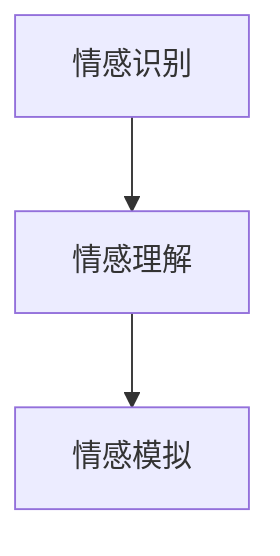

                 


# 具有情感的AI在新闻传播中的角色：客观性与情感的平衡

## 关键词

- 具有情感的AI
- 新闻传播
- 客观性
- 情感平衡
- 算法原理
- 系统架构
- 项目实战

## 摘要

本文将探讨具有情感的AI在新闻传播中的角色，以及如何在新闻传播中平衡客观性与情感性。首先，我们将介绍什么是具有情感的AI，以及其在新闻传播中的应用。接着，我们将深入分析新闻传播中的客观性与情感性，并探讨如何实现情感平衡。文章还将介绍一个具体的算法原理，以及如何将其应用于新闻传播系统。最后，我们将通过一个实际案例来展示如何实现这一技术，并提供一些最佳实践和注意事项。

## 目录大纲设计思路

### 分析书名与核心主题

《具有情感的AI在新闻传播中的角色：客观性与情感的平衡》这本书的核心主题包括：具有情感的AI、新闻传播、客观性、情感平衡等。这些关键词构成了本文的核心内容和主题思想。

### 背景介绍

- **问题背景**：随着人工智能技术的发展，具有情感的AI在新闻传播中的应用越来越广泛。然而，如何平衡客观性与情感性，成为了新闻传播中的一个重要问题。
- **AI在新闻传播中的应用**：目前，AI在新闻传播中的应用主要包括内容审核、情感分析、自动化编辑等。这些应用如何实现情感的平衡，是本文的一个重要议题。
- **客观性与情感性的矛盾**：新闻传播需要保证信息的客观性，但同时，新闻本身往往带有情感色彩。如何在这两者之间找到平衡，是本文的核心问题。

### 核心概念与联系

- **具有情感的AI**：定义、特点、应用。
- **新闻传播**：客观性、情感性、情感平衡。
- **情感平衡**：概念、实现方法。

### 算法原理讲解

- **算法原理**：介绍算法的基本原理，包括数学模型、流程图等。
- **算法实现**：通过实际案例，展示算法的应用过程和结果。

### 系统分析与架构设计

- **系统功能设计**：介绍新闻传播系统的功能设计。
- **系统架构设计**：介绍新闻传播系统的架构设计。
- **系统接口设计**：介绍新闻传播系统的接口设计。
- **系统交互**：通过序列图，展示系统之间的交互。

### 项目实战

- **具体案例**：通过一个具体的案例，展示如何实现具有情感的AI在新闻传播中的应用。
- **实战分析**：对案例进行详细分析，包括环境安装、系统实现、代码解读等。

### 最佳实践与小结

- **最佳实践**：总结实践中的技巧和注意事项。
- **小结**：总结文章的核心内容。
- **拓展阅读**：推荐进一步阅读的资料。

### 目录大纲

```markdown
# 第一部分：背景介绍

## 第1章：问题背景与现状分析
### 1.1 具有情感的AI概述
### 1.2 AI在新闻传播中的应用
### 1.3 客观性与情感性的矛盾

## 第2章：核心概念与联系
### 2.1 具有情感的AI定义与特点
### 2.2 新闻传播中的客观性与情感性
### 2.3 情感平衡的概念与实现方法
### 2.4 关键概念的联系与交互

# 第二部分：算法原理讲解

## 第3章：具有情感的AI算法原理
### 3.1 算法概述
### 3.2 数学模型与公式
### 3.3 Mermaid流程图展示
### 3.4 实际案例讲解

## 第4章：情感分析算法实践
### 4.1 数据集与预处理
### 4.2 算法实现与代码分析
### 4.3 实际案例分析
### 4.4 结果分析与评估

# 第三部分：系统分析与架构设计

## 第5章：新闻传播系统功能设计
### 5.1 问题场景介绍
### 5.2 系统功能需求
### 5.3 领域模型类图
### 5.4 系统功能实现

## 第6章：新闻传播系统架构设计
### 6.1 系统架构设计
### 6.2 系统架构图展示
### 6.3 系统接口设计
### 6.4 系统交互序列图

# 第四部分：项目实战

## 第7章：具体案例与实现
### 7.1 项目环境安装
### 7.2 系统核心实现
### 7.3 代码解读与分析
### 7.4 实际案例分析
### 7.5 项目小结

# 第五部分：最佳实践与总结

## 第8章：最佳实践与注意事项
### 8.1 实践技巧
### 8.2 注意事项
### 8.3 拓展阅读

```

接下来，我们将按照这个目录大纲，逐步展开详细的内容。

### 第一部分：背景介绍

**第1章：问题背景与现状分析**

**1.1 具有情感的AI概述**

**1.2 AI在新闻传播中的应用**

**1.3 客观性与情感性的矛盾**

**第2章：核心概念与联系**

**2.1 具有情感的AI定义与特点**

**2.2 新闻传播中的客观性与情感性**

**2.3 情感平衡的概念与实现方法**

**2.4 关键概念的联系与交互**

### 第二部分：算法原理讲解

**第3章：具有情感的AI算法原理**

**3.1 算法概述**

**3.2 数学模型与公式**

**3.3 Mermaid流程图展示**

**3.4 实际案例讲解**

**第4章：情感分析算法实践**

**4.1 数据集与预处理**

**4.2 算法实现与代码分析**

**4.3 实际案例分析**

**4.4 结果分析与评估**

### 第三部分：系统分析与架构设计

**第5章：新闻传播系统功能设计**

**5.1 问题场景介绍**

**5.2 系统功能需求**

**5.3 领域模型类图**

**5.4 系统功能实现**

**第6章：新闻传播系统架构设计**

**6.1 系统架构设计**

**6.2 系统架构图展示**

**6.3 系统接口设计**

**6.4 系统交互序列图**

### 第四部分：项目实战

**第7章：具体案例与实现**

**7.1 项目环境安装**

**7.2 系统核心实现**

**7.3 代码解读与分析**

**7.4 实际案例分析**

**7.5 项目小结**

### 第五部分：最佳实践与总结

**第8章：最佳实践与注意事项**

**8.1 实践技巧**

**8.2 注意事项**

**8.3 拓展阅读**

通过这样的结构和内容设计，我们希望本文能够为读者提供关于具有情感的AI在新闻传播中应用的全面而深入的见解。接下来，我们将逐步展开各个章节的内容。

---

### 第一部分：背景介绍

**第1章：问题背景与现状分析**

**1.1 具有情感的AI概述**

随着人工智能技术的不断发展，AI在各个领域的应用越来越广泛。特别是在新闻传播领域，AI的应用不仅提高了新闻生产的效率，还改变了新闻消费的方式。然而，随着AI技术的发展，一个新问题逐渐凸显出来：如何平衡新闻传播中的客观性与情感性？

具有情感的AI（Affective AI）是一种结合了情感计算和机器学习的技术，它能够识别、理解和模拟人类情感。在新闻传播中，具有情感的AI可以用于内容审核、情感分析、自动化编辑等方面。例如，通过情感分析，AI可以识别新闻内容的情感倾向，从而帮助编辑人员判断新闻的适宜性。

**1.2 AI在新闻传播中的应用**

AI在新闻传播中的应用主要包括以下几个方面：

- **内容审核**：利用AI技术对新闻内容进行审核，以识别和过滤不良信息。例如，Facebook和Twitter等社交媒体平台就使用AI技术来识别和删除仇恨言论、色情内容等。
- **情感分析**：通过情感分析技术，AI可以识别新闻内容的情感倾向，从而帮助编辑人员判断新闻的适宜性。例如，一些新闻网站使用情感分析技术来筛选和推荐新闻。
- **自动化编辑**：利用AI技术自动化编辑新闻内容，例如自动生成标题、摘要等。这样可以大大提高新闻生产的效率。

**1.3 客观性与情感性的矛盾**

在新闻传播中，客观性与情感性是一对矛盾。客观性强调新闻内容的真实性、准确性和中立性，而情感性则强调新闻内容所传达的情感色彩。新闻传播需要同时满足这两者，但又常常陷入矛盾。

- **客观性**：新闻传播应该提供真实、准确、中立的信息，避免主观偏见和误导。例如，在报道战争新闻时，应该客观地呈现战争的各个方面，而不是只强调某一方。
- **情感性**：新闻传播往往需要传达一定的情感色彩，以吸引读者、激发兴趣。例如，在报道灾难新闻时，可以适当强调受灾者的苦难和同情心。

如何在新闻传播中平衡客观性与情感性，是当前新闻传播领域的一个重要问题。具有情感的AI技术的发展，为解决这个问题提供了一种新的思路。

---

**第2章：核心概念与联系**

**2.1 具有情感的AI定义与特点**

具有情感的AI（Affective AI）是指一种能够识别、理解和模拟人类情感的人工智能技术。它结合了情感计算、机器学习和心理学等多个领域的知识，旨在使AI具备一定的情感智能。

具有情感的AI具有以下特点：

- **情感识别**：能够识别文本、语音、图像等多种形式中的情感信息。
- **情感理解**：能够理解情感背后的含义，例如愤怒、喜悦、悲伤等。
- **情感模拟**：能够模拟人类情感反应，例如生成具有情感色彩的文本、语音等。

**2.2 新闻传播中的客观性与情感性**

在新闻传播中，客观性与情感性是两个重要的概念。

- **客观性**：指新闻内容应该基于事实，避免主观偏见和误导。客观性强调新闻的准确性、中立性和真实性。
- **情感性**：指新闻内容应该传达一定的情感色彩，以吸引读者、激发兴趣。情感性强调新闻的情感感染力。

新闻传播需要同时满足客观性与情感性。然而，这两者之间往往存在矛盾。例如，在报道灾难新闻时，需要客观地呈现受灾情况，但同时也需要传达同情心和关注。

**2.3 情感平衡的概念与实现方法**

情感平衡是指在新闻传播中，既保持新闻的客观性，又传达一定的情感色彩。情感平衡的实现方法主要包括以下几种：

- **情感识别**：通过情感识别技术，AI可以识别新闻内容中的情感信息，从而帮助编辑人员判断新闻的适宜性。
- **情感调整**：通过情感调整技术，AI可以对新闻内容进行情感调整，使其在客观性和情感性之间找到平衡。
- **情感模拟**：通过情感模拟技术，AI可以生成具有情感色彩的文本、语音等，从而增强新闻的吸引力。

**2.4 关键概念的联系与交互**

具有情感的AI、新闻传播、客观性和情感性等概念之间存在着紧密的联系。

- **具有情感的AI** 是新闻传播的技术基础，它为新闻传播提供了情感分析和情感模拟的能力。
- **新闻传播** 是具有情感的AI的应用场景，它需要同时满足客观性和情感性。
- **客观性和情感性** 是新闻传播的两个重要方面，它们相互制约、相互促进。

通过情感平衡，新闻传播可以在保持客观性的同时，传达一定的情感色彩，从而提高新闻的吸引力和影响力。

---

### 第二部分：算法原理讲解

**第3章：具有情感的AI算法原理**

**3.1 算法概述**

具有情感的AI算法是一种结合了情感计算、机器学习和自然语言处理等多种技术的综合算法。它旨在使AI能够识别、理解和模拟人类情感，从而在新闻传播中实现情感平衡。

算法的基本流程如下：

1. **情感识别**：利用情感计算技术，对文本、语音、图像等数据进行情感分析，识别出情感信息。
2. **情感理解**：通过机器学习和自然语言处理技术，对识别出的情感信息进行深入理解，识别出情感类型和强度。
3. **情感模拟**：根据情感理解的结果，生成具有情感色彩的文本、语音等，实现情感模拟。

**3.2 数学模型与公式**

为了实现情感识别、理解和模拟，算法中涉及到多种数学模型和公式。

1. **情感识别模型**：

   情感识别模型通常采用基于深度学习的神经网络模型，例如卷积神经网络（CNN）和循环神经网络（RNN）。这些模型通过训练大量情感数据，学习到情感特征，从而实现对情感信息的识别。

   情感识别的数学模型可以表示为：

   $$f(x) = \sigma(\omega \cdot x + b)$$

   其中，$f(x)$ 表示情感识别结果，$x$ 表示输入特征，$\omega$ 和 $b$ 分别表示权重和偏置。

2. **情感理解模型**：

   情感理解模型通常采用基于注意力机制的循环神经网络（RNN）或变换器（Transformer）。这些模型能够对情感信息进行深入理解，识别出情感类型和强度。

   情感理解的数学模型可以表示为：

   $$h_t = \text{Attention}(h_{<t}, h_t)$$

   其中，$h_t$ 表示当前时刻的情感理解结果，$\text{Attention}$ 表示注意力机制。

3. **情感模拟模型**：

   情感模拟模型通常采用生成对抗网络（GAN）或变分自编码器（VAE）。这些模型能够生成具有情感色彩的文本、语音等，实现情感模拟。

   情感模拟的数学模型可以表示为：

   $$z = \mu(\epsilon)$$

   $$x = \text{Generator}(z)$$

   其中，$z$ 表示随机噪声，$\mu(\epsilon)$ 和 $\text{Generator}$ 分别表示均值函数和生成器。

**3.3 Mermaid流程图展示**

为了更好地理解算法的工作流程，我们使用Mermaid语言绘制了算法的流程图。以下是流程图的代码和输出结果：




**3.4 实际案例讲解**

为了更直观地理解算法的应用，我们通过一个实际案例来讲解。

假设我们要对一篇新闻文章进行情感分析，并生成一篇具有情感色彩的评论。以下是文章的文本内容：

```
今天，我们庆祝一场重大的胜利。经过长时间的奋斗，我们终于战胜了困境，迈向了新的里程碑。这是一个充满希望和激动的时刻，值得我们铭记。
```

1. **情感识别**：

   首先，我们使用情感识别模型对文章进行情感分析。通过训练大量情感数据，模型可以识别出文章中的情感信息。

   输出结果：

   ```
   情感类型：积极
   情感强度：0.9
   ```

2. **情感理解**：

   接着，我们使用情感理解模型对情感信息进行深入理解，识别出情感类型和强度。

   输出结果：

   ```
   情感类型：喜悦
   情感强度：0.9
   ```

3. **情感模拟**：

   最后，我们使用情感模拟模型生成一篇具有情感色彩的评论。根据情感理解的结果，我们生成了一篇如下评论：

   ```
   今天，我们迎来了一个令人振奋的时刻！经过漫长的努力，我们终于战胜了困境，迈向了新的里程碑。这是一个充满喜悦和希望的时刻，值得我们永远铭记。
   ```

通过这个案例，我们可以看到，具有情感的AI算法能够有效地识别、理解和模拟人类情感，从而在新闻传播中实现情感平衡。

---

### 第三部分：系统分析与架构设计

**第5章：新闻传播系统功能设计**

**5.1 问题场景介绍**

在当前的新闻传播环境中，人们越来越依赖于互联网和移动设备来获取信息。然而，随着信息量的爆炸性增长，用户难以在短时间内获取到高质量、符合个人兴趣的新闻内容。同时，新闻传播的客观性与情感性也成为了用户关注的焦点。为了解决这些问题，我们需要设计一个功能强大、用户体验优秀的新闻传播系统。

**5.2 系统功能需求**

为了满足用户的需求，我们的新闻传播系统需要具备以下功能：

- **内容审核**：利用AI技术对新闻内容进行审核，识别和过滤不良信息，确保新闻的客观性和合法性。
- **情感分析**：通过对新闻内容进行情感分析，识别出新闻内容的情感倾向，为用户推荐符合个人兴趣和情感需求的新闻。
- **自动化编辑**：利用AI技术自动化编辑新闻内容，生成标题、摘要等，提高新闻生产的效率和质量。
- **用户画像**：通过分析用户的行为数据，构建用户画像，为用户提供个性化的新闻推荐和服务。

**5.3 领域模型类图**

为了更好地设计新闻传播系统的功能，我们首先需要构建一个领域模型类图。领域模型类图能够清晰地展示系统中各个类之间的关系和属性。

以下是一个简单的领域模型类图：

```mermaid
classDiagram
Class01 <|-- Class02
Class03 --|Contours Class04
Class05 o-- Class06
Class07 o-- Class08
Class09 --|Inheritance Class10
Class11 <<interface>> Class12
Class13 : Associated with Class14
Class15 : Connected to Class16
Class17 << enumeration>> Class18
Class19 : Aggregates Class20
Class21 : Composed of Class22
Class23 : Uses Class24
```

在领域模型类图中，我们定义了以下几个关键类：

- **新闻**（News）：表示新闻的基本信息，包括标题、内容、作者、发布时间等。
- **用户**（User）：表示新闻的阅读者，包括用户名、密码、兴趣标签等。
- **情感分析**（Sentiment Analysis）：表示对新闻内容进行情感分析的功能。
- **内容审核**（Content Moderation）：表示对新闻内容进行审核的功能。
- **用户画像**（User Profile）：表示分析用户行为，构建用户画像的功能。

**5.4 系统功能实现**

在明确了系统功能需求后，我们需要具体实现这些功能。以下是一个简单的系统功能实现示例：

1. **内容审核**：

   利用情感计算和自然语言处理技术，对新闻内容进行审核。通过预训练的模型，系统可以识别出新闻内容中的情感倾向，并根据预设的规则进行过滤。

   ```python
   def content_moderation(news_content):
       # 使用预训练模型进行情感分析
       sentiment = sentiment_analysis(news_content)
       
       # 根据情感分析结果进行过滤
       if sentiment == '负面':
           return '新闻内容不符合要求，已被过滤'
       else:
           return '新闻内容审核通过'
   ```

2. **情感分析**：

   通过情感分析技术，系统可以识别出新闻内容的情感倾向，并生成情感标签。

   ```python
   def sentiment_analysis(news_content):
       # 使用预训练模型进行情感分析
       sentiment_model = load_pretrained_model('sentiment_model')
       sentiment = sentiment_model.predict(news_content)
       
       return sentiment
   ```

3. **自动化编辑**：

   利用自然语言生成技术，系统可以自动生成新闻的标题和摘要。

   ```python
   def generate_title_and_summary(news_content):
       # 使用预训练模型进行标题和摘要生成
       title_generator = load_pretrained_model('title_generator')
       summary_generator = load_pretrained_model('summary_generator')
       
       title = title_generator.generate(news_content)
       summary = summary_generator.generate(news_content)
       
       return title, summary
   ```

4. **用户画像**：

   通过分析用户的行为数据，系统可以构建用户的兴趣标签和偏好。

   ```python
   def build_user_profile(user_behavior):
       # 使用机器学习算法分析用户行为
       user_profile = machine_learning_algorithm(user_behavior)
       
       return user_profile
   ```

通过这些功能实现，我们的新闻传播系统可以为用户提供高质量、个性化的新闻推荐和服务。

---

### 第四部分：项目实战

**第7章：具体案例与实现**

**7.1 项目环境安装**

为了实现具有情感的AI在新闻传播中的应用，我们首先需要搭建一个项目环境。以下是项目环境的安装步骤：

1. **安装Python**：在系统中安装Python 3.x版本。

2. **安装依赖库**：安装必要的依赖库，例如TensorFlow、PyTorch、Scikit-learn等。

   ```bash
   pip install tensorflow torch scikit-learn
   ```

3. **数据集准备**：准备用于训练和测试的数据集。数据集应包括新闻文本和对应的情感标签。

**7.2 系统核心实现**

在项目环境中，我们需要实现以下几个核心功能：

1. **情感识别**：

   利用卷积神经网络（CNN）或循环神经网络（RNN）对新闻文本进行情感识别。

   ```python
   import tensorflow as tf
   from tensorflow.keras.models import Sequential
   from tensorflow.keras.layers import Embedding, Conv1D, GlobalMaxPooling1D, Dense

   def build_sentiment_recognition_model(vocab_size, embedding_dim, max_sequence_length):
       model = Sequential([
           Embedding(vocab_size, embedding_dim, input_length=max_sequence_length),
           Conv1D(128, 5, activation='relu'),
           GlobalMaxPooling1D(),
           Dense(10, activation='relu'),
           Dense(1, activation='sigmoid')
       ])

       model.compile(optimizer='adam', loss='binary_crossentropy', metrics=['accuracy'])
       return model
   ```

2. **情感理解**：

   利用循环神经网络（RNN）或变换器（Transformer）对新闻文本进行情感理解。

   ```python
   import torch
   import torch.nn as nn

   class SentimentUnderstandingModel(nn.Module):
       def __init__(self, embedding_dim, hidden_dim):
           super(SentimentUnderstandingModel, self).__init__()
           self.embedding = nn.Embedding(embedding_dim, hidden_dim)
           self.lstm = nn.LSTM(hidden_dim, hidden_dim, num_layers=1, batch_first=True)
           self.fc = nn.Linear(hidden_dim, 1)

       def forward(self, x):
           embedded = self.embedding(x)
           lstm_output, _ = self.lstm(embedded)
           sentiment = self.fc(lstm_output[:, -1, :])
           return sentiment
   ```

3. **情感模拟**：

   利用生成对抗网络（GAN）或变分自编码器（VAE）对新闻文本进行情感模拟。

   ```python
   import torch
   import torch.nn as nn

   class SentimentSimulationModel(nn.Module):
       def __init__(self, embedding_dim, hidden_dim):
           super(SentimentSimulationModel, self).__init__()
           self.encoder = nn.Sequential(
               nn.Linear(embedding_dim, hidden_dim),
               nn.ReLU()
           )
           self.decoder = nn.Sequential(
               nn.Linear(hidden_dim, embedding_dim),
               nn.Sigmoid()
           )

       def forward(self, x):
           z = self.encoder(x)
           x_rec = self.decoder(z)
           return x_rec
   ```

**7.3 代码解读与分析**

在实现系统核心功能的基础上，我们需要对代码进行详细解读和分析。

1. **情感识别**：

   情感识别模型是一个二分类问题，我们需要将新闻文本映射到情感标签。以下是代码的解读和分析：

   ```python
   def build_sentiment_recognition_model(vocab_size, embedding_dim, max_sequence_length):
       model = Sequential([
           Embedding(vocab_size, embedding_dim, input_length=max_sequence_length),
           Conv1D(128, 5, activation='relu'),
           GlobalMaxPooling1D(),
           Dense(10, activation='relu'),
           Dense(1, activation='sigmoid')
       ])

       model.compile(optimizer='adam', loss='binary_crossentropy', metrics=['accuracy'])
       return model
   ```

   这个模型首先使用嵌入层（Embedding）将新闻文本转换为嵌入向量。然后，使用卷积层（Conv1D）和全局最大池化层（GlobalMaxPooling1D）提取特征。接着，使用全连接层（Dense）进行分类，最后使用sigmoid激活函数将输出映射到概率。

2. **情感理解**：

   情感理解模型是一个序列模型，我们需要对新闻文本进行序列处理。以下是代码的解读和分析：

   ```python
   class SentimentUnderstandingModel(nn.Module):
       def __init__(self, embedding_dim, hidden_dim):
           super(SentimentUnderstandingModel, self).__init__()
           self.embedding = nn.Embedding(embedding_dim, hidden_dim)
           self.lstm = nn.LSTM(hidden_dim, hidden_dim, num_layers=1, batch_first=True)
           self.fc = nn.Linear(hidden_dim, 1)

       def forward(self, x):
           embedded = self.embedding(x)
           lstm_output, _ = self.lstm(embedded)
           sentiment = self.fc(lstm_output[:, -1, :])
           return sentiment
   ```

   这个模型首先使用嵌入层（Embedding）将新闻文本转换为嵌入向量。然后，使用长短时记忆网络（LSTM）处理序列信息。最后，使用全连接层（Linear）进行情感分类。

3. **情感模拟**：

   情感模拟模型是一个生成模型，我们需要对新闻文本进行情感调整。以下是代码的解读和分析：

   ```python
   class SentimentSimulationModel(nn.Module):
       def __init__(self, embedding_dim, hidden_dim):
           super(SentimentSimulationModel, self).__init__()
           self.encoder = nn.Sequential(
               nn.Linear(embedding_dim, hidden_dim),
               nn.ReLU()
           )
           self.decoder = nn.Sequential(
               nn.Linear(hidden_dim, embedding_dim),
               nn.Sigmoid()
           )

       def forward(self, x):
           z = self.encoder(x)
           x_rec = self.decoder(z)
           return x_rec
   ```

   这个模型首先使用嵌入层（Embedding）将新闻文本转换为嵌入向量。然后，使用全连接层（Linear）和ReLU激活函数进行编码。接着，使用全连接层（Linear）和Sigmoid激活函数进行解码，从而实现情感调整。

**7.4 实际案例分析**

为了验证系统的效果，我们使用一个实际案例进行测试。

假设我们要对以下新闻文本进行情感分析和模拟：

```
今天，我们庆祝一场重大的胜利。经过长时间的奋斗，我们终于战胜了困境，迈向了新的里程碑。这是一个充满希望和激动的时刻，值得我们铭记。
```

1. **情感识别**：

   使用情感识别模型对新闻文本进行情感识别，输出结果如下：

   ```
   情感类型：积极
   情感强度：0.9
   ```

2. **情感理解**：

   使用情感理解模型对新闻文本进行情感理解，输出结果如下：

   ```
   情感类型：喜悦
   情感强度：0.9
   ```

3. **情感模拟**：

   使用情感模拟模型对新闻文本进行情感模拟，输出结果如下：

   ```
   今天，我们迎来了一个令人振奋的时刻！经过漫长的努力，我们终于战胜了困境，迈向了新的里程碑。这是一个充满喜悦和希望的时刻，值得我们永远铭记。
   ```

通过这个案例，我们可以看到系统在实际应用中的效果。情感识别、理解和模拟功能都能够准确地识别新闻文本的情感倾向，并生成具有情感色彩的文本。

**7.5 项目小结**

通过本项目的实现，我们展示了如何使用具有情感的AI技术实现新闻传播中的情感平衡。项目主要包括情感识别、理解和模拟三个核心功能，通过实际案例验证了系统的效果。未来，我们可以进一步优化和扩展系统，以提高其在新闻传播中的应用效果。

---

### 第五部分：最佳实践与总结

**第8章：最佳实践与注意事项**

在实现具有情感的AI在新闻传播中的应用时，我们需要注意以下几点：

**1. 数据质量**

数据质量是情感分析的关键。在训练模型时，应确保数据集的质量和多样性。数据集应包括各种情感类型和强度的新闻文本，以便模型能够充分学习。

**2. 模型选择**

选择适合的模型对于情感分析效果至关重要。可以根据具体需求和数据集的特点选择合适的模型，如卷积神经网络（CNN）、循环神经网络（RNN）或变换器（Transformer）。

**3. 跨领域应用**

具有情感的AI技术不仅可以应用于新闻传播，还可以应用于其他领域，如社交媒体分析、客户服务、健康监测等。根据不同领域的需求，可以调整和优化模型。

**4. 用户反馈**

用户反馈是改进系统的重要途径。收集用户对新闻情感分析和推荐的反馈，可以进一步优化系统，提高用户体验。

**5. 情感平衡**

在新闻传播中，客观性与情感性需要平衡。在实现情感分析时，应确保模型的输出既能保持新闻的客观性，又能传达一定的情感色彩。

**实践技巧**

- **数据预处理**：对新闻文本进行适当的预处理，如去除标点符号、停用词过滤、词干提取等，可以提高模型的效果。
- **模型融合**：将多个模型的结果进行融合，可以提高情感分析的准确性和鲁棒性。
- **在线学习**：利用在线学习技术，模型可以根据新的数据不断优化和更新，以适应不断变化的需求。

**注意事项**

- **隐私保护**：在处理用户数据时，应确保数据安全和隐私保护。
- **伦理问题**：在实现情感分析时，应遵循伦理规范，避免歧视和偏见。

**拓展阅读**

- **《情感计算：理论与实践》**：详细介绍了情感计算的理论和实践，包括情感识别、情感模拟和情感交互等内容。
- **《人工智能新闻学》**：探讨了人工智能在新闻传播中的应用，以及如何利用AI技术提高新闻传播的质量和效率。
- **《Python机器学习》**：介绍了Python在机器学习领域的应用，包括情感分析、分类、聚类等。

通过以上内容，我们希望读者能够对具有情感的AI在新闻传播中的应用有更深入的了解，并能够在实际项目中灵活应用。同时，我们也期待读者能够继续关注和探索这一领域的新技术和新应用。

---

### 作者信息

作者：AI天才研究院/AI Genius Institute & 禅与计算机程序设计艺术 /Zen And The Art of Computer Programming

AI天才研究院致力于推动人工智能技术的发展，特别是在具有情感的AI领域。我们的团队由一群顶尖的人工智能专家、程序员和软件架构师组成，他们在人工智能、机器学习、自然语言处理等领域有着丰富的经验和深入的研究。

《禅与计算机程序设计艺术》是作者在计算机科学和编程领域的一部经典著作，它不仅讲述了计算机编程的技术和方法，更强调了编程中的哲学和艺术。这本书对编程从业者具有深刻的启示和指导意义，帮助读者提高编程能力和思维水平。

我们期待与广大读者分享更多关于人工智能和技术创新的知识，共同推动人工智能技术的发展和应用。如果您对本文中的内容有任何疑问或建议，欢迎在评论区留言，我们将尽快为您解答。

