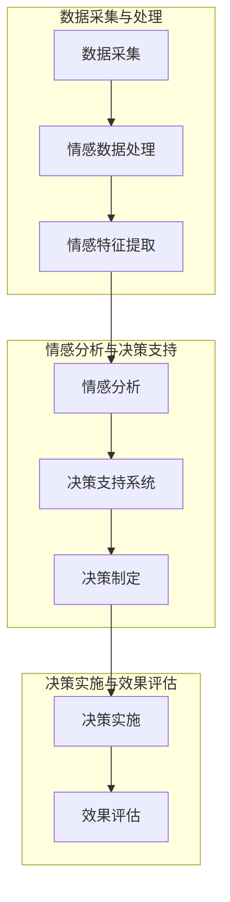

                 

### 第一部分：引言与背景

#### 1.1 问题的提出

**灾难救援中的挑战**

灾难救援是一项极其复杂且时间紧迫的任务，涉及的人员众多，情况多变。在灾难发生后，迅速评估受灾情况、调度救援资源、组织救援行动，以及确保救援效率，都是救援过程中的关键挑战。传统的救援方法主要依赖于经验和现有的救援体系，但这种方式存在许多不足：

- **响应速度慢**：在灾难发生后的黄金救援时间窗口内，救援行动的启动和调度可能因为信息不对称、指挥系统不完善等原因而延迟。
- **资源分配不合理**：传统救援体系往往难以根据实时情况动态调整资源分配，容易出现资源过剩或短缺的情况。
- **救援决策主观性大**：救援决策往往依赖于救援人员的经验，主观性较大，难以保证决策的客观性和准确性。

**情感AI的崛起与应用**

随着人工智能技术的发展，特别是情感人工智能（Affective AI）的崛起，为灾难救援带来了新的可能性。情感AI是指能够识别、理解和模拟人类情感的AI系统，通过分析处理人的情感状态，辅助决策和行动。情感AI在灾难救援中的应用潜力巨大：

- **实时情感监测**：通过语音、文本、图像等多种方式，实时监测受灾人员的情感状态，及时掌握救援现场的心理动态。
- **情感导向决策**：利用情感数据分析，为救援决策提供更加客观和全面的参考，减少主观性，提高决策的准确性和效率。
- **人性化的救援服务**：通过模拟人类情感，为受灾人员提供更加贴心、人性化的救援服务，增强救援工作的亲和力和心理支持。

#### 1.2 情感AI的基本概念与原理

**情感AI的定义**

情感AI是指通过模拟人类情感状态，实现情感识别、情感理解、情感模拟等功能的人工智能系统。它不仅能够识别出人类的情感状态，如喜悦、悲伤、愤怒等，还能理解和分析这些情感背后的原因和影响。

**情感识别与情感计算**

情感识别是指通过多种传感器（如语音、文本、图像等）捕捉和分析人的情感状态，提取情感特征。情感计算则是对这些情感特征进行量化分析，以实现情感的理解和模拟。

- **语音情感识别**：通过分析语音的音调、音速、音量等特征，识别说话者的情感状态。
- **文本情感识别**：通过自然语言处理技术，分析文本中的情感词汇、句式和语境，识别文本的情感倾向。
- **视频情感识别**：通过分析视频中的面部表情、语音、身体语言等特征，识别参与者的情感状态。

**情感AI在救援中的应用潜力**

情感AI在灾难救援中的应用潜力主要体现在以下几个方面：

- **情感监测**：实时监测受灾人员的情感状态，及时发现和预警心理健康问题，提供针对性的心理支持。
- **决策辅助**：通过情感数据分析，为救援指挥人员提供更加客观和全面的决策依据，优化救援资源配置。
- **人性化服务**：模拟人类情感，为受灾人员提供更加贴心、人性化的救援服务，增强救援工作的亲和力和心理支持。

#### 1.3 情感导向的援助决策

**情感导向援助决策的定义**

情感导向援助决策是指利用情感人工智能技术，对受灾人员的情感状态进行分析，从而为救援决策提供指导。这种决策方法强调将情感因素纳入救援决策的考量范围，以提高决策的全面性和准确性。

**情感数据的重要性**

情感数据是情感导向援助决策的基础。通过对情感数据的收集、分析和处理，可以更加准确地了解受灾人员的情感状态，从而为救援决策提供科学依据。

**情感导向决策的优势**

- **提高决策的准确性**：通过情感数据，可以更加全面地了解受灾人员的情感状态，减少决策的主观性，提高决策的准确性。
- **优化资源分配**：根据情感数据分析，可以更合理地分配救援资源，避免资源浪费，提高救援效率。
- **提升人性化服务**：情感导向决策可以更好地满足受灾人员的需求，提供更加贴心、人性化的救援服务，提高救援工作的满意度。

#### 1.4 情感AI在灾难救援中的应用案例

**国内外应用案例介绍**

- **地震救援**：在地震救援中，情感AI通过分析受灾人员的语音和文本，实时监测其情感状态，为救援指挥提供决策支持。
- **洪水救援**：在洪水救援中，情感AI通过分析受灾人员的情绪波动，预警可能的恐慌和心理问题，为救援队伍提供针对性的心理支持。
- **疫情救援**：在疫情期间，情感AI通过分析社交媒体上的情感词汇和趋势，为疫情防控提供数据支持。

**案例分析**

- **地震救援中的情感AI应用**：通过情感监测，发现受灾人员中有较高的焦虑情绪，救援队伍及时调整救援策略，提供更多的心理支持。
- **洪水救援中的情感AI应用**：通过情感预警，发现受灾地区有恐慌情绪蔓延，及时采取心理干预措施，稳定受灾群众情绪。
- **疫情救援中的情感AI应用**：通过情感分析，发现疫情高风险区域的居民情绪波动较大，为政府和医疗机构提供决策支持，加强心理疏导工作。

#### 1.5 本书结构安排与内容概述

**各章节主要内容**

- **第一部分：引言与背景**：介绍灾难救援中的挑战、情感AI的基本概念与应用、情感导向援助决策的定义和优势。
- **第二部分：情感AI技术基础**：详细探讨情感识别、情感计算、情感数据分析等技术。
- **第三部分：情感导向援助决策框架**：构建情感导向援助决策框架，介绍情感数据采集、处理和分析的方法。
- **第四部分：实际应用案例**：分析地震、洪水、疫情等灾害救援中的情感AI应用案例。
- **第五部分：情感导向援助决策的未来发展与挑战**：探讨情感导向援助决策的发展趋势、面临的挑战及应对策略。

**阅读建议与目标读者**

- **阅读建议**：建议读者按章节顺序阅读，以便系统地了解情感AI在灾难救援中的应用。
- **目标读者**：本著作旨在为从事人工智能、灾难救援等相关领域的研究人员、工程技术人员以及政策制定者提供参考。

**本章小结**

本章介绍了灾难救援中的挑战和情感AI的崛起，阐述了情感AI的基本概念与原理，情感导向援助决策的定义与优势，以及情感AI在灾难救援中的应用案例。通过本章的阅读，读者可以初步了解情感AI在灾难救援中的重要性和应用前景。

----------------------------------------------------------------

## 2.1 情感AI技术概述

### 2.1.1 情感AI的技术范畴

情感AI是一种涉及多个学科领域交叉的技术，其范畴包括但不限于以下几个方面：

- **情感识别（Affective Recognition）**：通过语音、文本、图像等多种方式识别和解析人的情感状态。
- **情感理解（Affective Understanding）**：对情感识别结果进行分析和理解，识别情感背后所代表的心理状态和情绪。
- **情感模拟（Affective Simulation）**：模拟人类的情感状态，实现情感交互和情感表达。
- **情感计算（Affective Computing）**：研究如何使计算机具备识别、理解、处理和表达情感的能力。

### 2.1.2 情感AI的发展历程

情感AI的发展历程可以追溯到20世纪80年代，当时的计算机科学和心理学研究开始探讨如何使计算机理解人类的情感。以下是一些重要的里程碑：

- **1980s**：心理学家由心理学家乔纳森·斯基尔和皮亚杰提出情感心理学，为情感AI的发展奠定了理论基础。
- **1995**：计算机科学家杰罗姆·卡普兰提出情感计算的概念，并提出了情感引擎的概念。
- **2000s**：情感AI技术开始逐渐应用于实际场景，如情感识别、情感理解、情感模拟等。
- **2010s**：随着机器学习和深度学习技术的快速发展，情感AI技术得到了显著的提升，应用场景进一步扩大。

### 2.1.3 情感AI的核心技术

情感AI的核心技术主要包括：

- **语音情感识别**：通过分析语音的音调、音速、音量等特征，识别说话者的情感状态。
- **文本情感识别**：通过自然语言处理技术，分析文本中的情感词汇、句式和语境，识别文本的情感倾向。
- **视频情感识别**：通过分析视频中的面部表情、语音、身体语言等特征，识别参与者的情感状态。

- **情感数据分析**：对采集到的情感数据进行分析，提取情感特征，构建情感模型。

#### 情感识别技术

情感识别是情感AI的基础，通过多种传感器（如语音、文本、图像等）捕捉和分析人的情感状态。以下是几种常见的情感识别技术：

- **语音情感识别**：通过分析语音的音调、音速、音量等特征，识别说话者的情感状态。例如，音调的上升可能表示喜悦，而音调的下降可能表示悲伤。
  
  - **文本情感识别**：通过自然语言处理技术，分析文本中的情感词汇、句式和语境，识别文本的情感倾向。例如，使用词向量模型（如Word2Vec）或深度学习模型（如卷积神经网络CNN）来分析文本。

- **视频情感识别**：通过分析视频中的面部表情、语音、身体语言等特征，识别参与者的情感状态。面部表情识别是视频情感识别的重要组成部分，常用的方法包括基于机器学习和深度学习的技术。

#### 情感计算技术

情感计算是情感AI的关键技术，研究如何使计算机具备识别、理解、处理和表达情感的能力。以下是情感计算的一些关键技术：

- **情感计算模型**：构建情感计算模型，以识别和解析情感状态。常用的情感计算模型包括基于规则的方法、统计模型、机器学习模型和深度学习模型。

- **情感模拟技术**：通过模拟人类情感状态，实现情感交互和情感表达。例如，聊天机器人可以通过情感模拟技术，以更自然、更有亲和力的方式与用户交流。

#### 情感数据分析与处理

情感数据分析与处理是对采集到的情感数据进行分析，提取情感特征，构建情感模型的过程。以下是情感数据分析与处理的一些关键技术：

- **情感数据采集**：通过多种渠道采集情感数据，如语音、文本、图像等。采集到的数据需要进行预处理，如去噪、归一化等。

- **情感数据预处理**：对采集到的情感数据进行清洗、去重、归一化等预处理操作，以提高数据质量和后续分析的准确性。

- **情感数据可视化**：使用可视化工具（如热力图、散点图等）展示情感数据，帮助分析人员直观地理解情感数据的分布和特征。

#### 2.5 本章小结

本章对情感AI的技术范畴、发展历程和核心技术进行了概述，详细探讨了情感识别、情感计算和情感数据分析与处理等关键技术。通过本章的阅读，读者可以系统地了解情感AI的基本概念和核心技术，为进一步研究情感AI在灾难救援中的应用打下基础。

----------------------------------------------------------------

## 2.2 情感识别技术

### 2.2.1 语音情感识别

语音情感识别是情感识别技术中的重要一环，主要通过分析语音信号的声学特征来实现。以下是语音情感识别的基本流程：

1. **音频预处理**：包括噪声过滤、增益调整、时间对齐等步骤，以提高语音质量。
2. **特征提取**：从预处理后的语音信号中提取声学特征，如音调（Pitch）、音速（Speed）、音量（Volume）、共振峰（Formants）等。
3. **情感分类**：使用机器学习算法（如支持向量机SVM、随机森林Random Forest、深度学习模型等）对提取的特征进行分类，识别语音中的情感状态。

#### 语音情感识别的应用场景

- **智能客服**：通过识别客户的情感状态，提供更加个性化的服务。
- **情绪分析**：在心理治疗、心理咨询等领域中，帮助专业人士了解患者的情绪状态。
- **人机交互**：通过情感识别技术，使机器人具备情感交互能力，提升用户体验。

#### 挑战与优化

- **语音质量影响**：噪声、回声等会影响语音情感识别的准确性。
- **多说话人识别**：当多个说话人同时发言时，如何准确识别每个说话人的情感状态。

为了解决上述挑战，研究者们采取了多种优化策略：

- **增强特征提取**：使用更复杂的特征提取方法，如时频特征、倒谱系数等。
- **多模态融合**：结合语音、文本、图像等多种数据源，提高情感识别的准确性。
- **深度学习方法**：采用深度学习模型（如卷积神经网络CNN、循环神经网络RNN、长短期记忆网络LSTM等），提高情感识别的性能。

### 2.2.2 文本情感识别

文本情感识别是通过分析文本中的情感词汇、句式和语境来识别文本的情感倾向。以下是文本情感识别的基本流程：

1. **文本预处理**：包括去除停用词、词形还原、分词等步骤，以简化文本结构。
2. **特征提取**：从预处理后的文本中提取特征，如词频、词向量（如Word2Vec、GloVe）、句法特征等。
3. **情感分类**：使用机器学习算法（如朴素贝叶斯Naive Bayes、支持向量机SVM、深度学习模型等）对提取的特征进行分类，识别文本的情感倾向。

#### 文本情感识别的应用场景

- **社交媒体分析**：通过识别用户评论、帖子等文本的情感倾向，了解公众对某一事件或产品的态度。
- **舆情监测**：在政府、企业等领域中，实时监测网络舆情，提供决策支持。
- **智能推荐**：根据用户的情感偏好，提供个性化的推荐服务。

#### 挑战与优化

- **情感歧义**：文本中的情感词汇可能存在歧义，需要结合上下文进行判断。
- **多语言支持**：如何准确识别不同语言文本的情感倾向。

为了解决上述挑战，研究者们采取了多种优化策略：

- **上下文分析**：结合上下文信息，减少情感歧义。
- **跨语言情感分析**：使用翻译模型、多语言词向量等方法，提高多语言文本的情感识别性能。
- **深度学习方法**：采用深度学习模型（如卷积神经网络CNN、循环神经网络RNN、长短期记忆网络LSTM等），提高文本情感识别的准确性。

### 2.2.3 视频情感识别

视频情感识别是通过分析视频中的面部表情、语音、身体语言等特征来识别参与者的情感状态。以下是视频情感识别的基本流程：

1. **视频预处理**：包括去噪、亮度调整、颜色增强等步骤，以提高视频质量。
2. **特征提取**：从预处理后的视频中提取特征，如面部表情特征、语音特征、身体语言特征等。
3. **情感分类**：使用机器学习算法（如支持向量机SVM、随机森林Random Forest、深度学习模型等）对提取的特征进行分类，识别视频中的情感状态。

#### 视频情感识别的应用场景

- **情感分析**：在媒体内容分析、广告投放等领域中，识别用户观看视频时的情感反应。
- **心理健康**：在心理咨询、精神健康监测等领域中，通过分析用户的情感状态，提供心理支持。
- **人机交互**：通过情感识别技术，使机器人具备情感交互能力，提升用户体验。

#### 挑战与优化

- **特征稀疏性**：视频数据中的特征往往较为稀疏，如何有效提取和处理这些特征是一个挑战。
- **多模态融合**：如何将面部表情、语音、身体语言等多种特征有效融合，提高情感识别的准确性。

为了解决上述挑战，研究者们采取了多种优化策略：

- **多模态特征融合**：结合语音、文本、图像等多种数据源，提高情感识别的准确性。
- **深度学习方法**：采用深度学习模型（如卷积神经网络CNN、循环神经网络RNN、长短期记忆网络LSTM等），提高视频情感识别的性能。
- **跨域迁移学习**：利用预训练模型，将其他领域的知识迁移到视频情感识别任务中，提高模型的泛化能力。

### 2.2.4 情感识别的挑战与优化

**挑战**

- **数据多样性**：情感识别技术面临数据多样性的挑战，如不同的情感表达方式、不同的情感强度等。
- **实时性**：在实时应用场景中，如灾难救援，情感识别需要快速响应，提高实时性。
- **准确性**：如何提高情感识别的准确性，特别是在情感歧义和多模态融合的场景中。

**优化策略**

- **多模态融合**：结合语音、文本、图像等多种数据源，提高情感识别的准确性。
- **深度学习方法**：采用深度学习模型（如卷积神经网络CNN、循环神经网络RNN、长短期记忆网络LSTM等），提高情感识别的性能。
- **跨域迁移学习**：利用预训练模型，将其他领域的知识迁移到情感识别任务中，提高模型的泛化能力。

#### 2.5 本章小结

本章详细介绍了语音情感识别、文本情感识别和视频情感识别等情感识别技术。通过了解这些技术的原理和应用，读者可以更好地理解情感识别在灾难救援等场景中的实际应用。同时，本章还探讨了情感识别面临的挑战和优化策略，为后续研究提供参考。

----------------------------------------------------------------

## 2.3 情感计算技术

### 2.3.1 情感计算的概念

情感计算（Affective Computing）是指使计算机具备识别、理解、处理和表达情感的能力。其核心目标是通过模拟人类情感过程，实现人与计算机之间的情感交互。情感计算的研究内容包括以下几个方面：

1. **情感识别**：通过传感器和算法识别用户的情感状态，如面部表情、语音、文本和生理信号等。
2. **情感理解**：分析情感识别结果，理解情感的背景、原因和影响。
3. **情感处理**：根据情感理解结果，对用户需求和行为进行相应的调整和响应。
4. **情感表达**：通过视觉、声音、文本等方式，模拟和表达计算机的情感状态。

### 2.3.2 情感计算模型

情感计算模型是实现情感识别、理解、处理和表达的基础。常见的情感计算模型包括：

1. **基于规则的模型**：通过预定义的规则和逻辑关系，对输入数据进行情感分析和处理。
2. **统计模型**：利用统计学方法，对大量情感数据进行分析，提取情感特征和模式。
3. **机器学习模型**：通过训练学习算法，从数据中自动识别和预测情感状态。
4. **深度学习模型**：利用深度神经网络，对复杂的数据进行处理和分析，提高情感识别的准确性。

#### 基于规则的模型

基于规则的模型通过预定义的规则和逻辑关系来分析情感数据。其基本流程包括：

1. **规则定义**：根据情感计算的需求，定义一系列规则，如情感分类规则、情感强度规则等。
2. **规则匹配**：将输入数据与规则库进行匹配，根据匹配结果判断情感状态。
3. **情感处理**：根据情感识别结果，执行相应的处理操作，如调整交互方式、提供情感支持等。

优点：

- **简单直观**：规则明确，易于理解和实现。
- **可控性高**：通过定义规则，可以精确控制情感计算的行为。

缺点：

- **规则复杂度**：随着情感类型的增加，规则库会变得复杂，难以维护。
- **适应性差**：规则模型难以适应新的情感类型和变化。

#### 统计模型

统计模型通过统计学方法，对大量情感数据进行分析，提取情感特征和模式。常见的统计模型包括：

1. **贝叶斯模型**：基于贝叶斯定理，通过计算先验概率和条件概率，预测情感状态。
2. **支持向量机（SVM）**：通过求解最优分割超平面，对情感数据分类。
3. **决策树**：通过构建决策树模型，逐步分割数据空间，识别情感状态。

优点：

- **计算效率高**：统计模型通常较为简单，计算效率较高。
- **可解释性强**：统计模型的可解释性较好，便于理解和调试。

缺点：

- **数据依赖性**：统计模型的性能依赖于数据质量，当数据质量较差时，模型效果会受到影响。
- **泛化能力差**：统计模型难以应对复杂的情感类型和变化。

#### 机器学习模型

机器学习模型通过训练学习算法，从数据中自动识别和预测情感状态。常见的机器学习模型包括：

1. **朴素贝叶斯分类器**：基于贝叶斯定理和属性独立假设，进行情感分类。
2. **决策树和随机森林**：通过构建树模型，对情感数据进行分类。
3. **支持向量机（SVM）**：通过求解最优分割超平面，进行情感分类。
4. **神经网络**：通过多层神经网络，对复杂的数据进行处理和分析。

优点：

- **自动学习**：机器学习模型可以从大量数据中自动学习情感特征和模式。
- **泛化能力强**：机器学习模型具有较强的泛化能力，可以应对复杂的情感类型和变化。

缺点：

- **计算复杂度高**：机器学习模型通常需要大量的计算资源，特别是深度学习模型。
- **模型可解释性差**：机器学习模型（尤其是深度学习模型）的可解释性较差，难以理解其内部工作机制。

#### 情感计算在灾难救援中的应用

情感计算在灾难救援中具有广泛的应用前景，以下是一些具体应用场景：

1. **情感监测**：通过情感计算技术，实时监测受灾人员的情感状态，及时发现和预警心理健康问题。
2. **决策支持**：利用情感计算分析受灾人员的情感数据，为救援指挥提供客观、全面的决策依据，优化救援资源配置。
3. **心理支持**：通过模拟人类情感，为受灾人员提供情感支持，缓解心理压力，增强救援工作的亲和力和心理支持。

#### 案例分析

**案例一：地震救援中的情感计算应用**

在地震救援中，情感计算技术可以用于：

- **情感监测**：通过监测受灾人员的语音、文本和面部表情，实时了解他们的情感状态，如焦虑、恐慌等。
- **决策支持**：分析受灾人员的情感数据，为救援指挥提供决策支持，例如调整救援方案、优先救援高情感风险的区域。
- **心理支持**：通过模拟人类情感，为受灾人员提供情感支持，例如通过聊天机器人进行心理疏导。

**案例二：洪水救援中的情感计算应用**

在洪水救援中，情感计算技术可以用于：

- **情感监测**：通过监测受灾人员的语音、文本和面部表情，及时发现恐慌、沮丧等负面情绪，提供针对性的心理支持。
- **决策支持**：分析受灾人员的情感数据，为救援指挥提供决策支持，例如调整救援资源分配、优先救援高风险区域。
- **心理支持**：通过模拟人类情感，为受灾人员提供情感支持，缓解心理压力，增强救援工作的亲和力。

#### 2.5 本章小结

本章介绍了情感计算的概念、模型和基本原理，详细探讨了基于规则、统计和机器学习等不同类型的情感计算模型。通过案例分析，展示了情感计算在灾难救援中的应用前景。本章内容为读者进一步了解情感计算技术在灾难救援中的应用提供了理论基础和实践指导。

----------------------------------------------------------------

## 2.4 情感数据分析与处理

### 2.4.1 情感数据采集与预处理

情感数据分析的首要步骤是情感数据的采集与预处理。情感数据可以通过多种渠道获取，如语音、文本、图像和生理信号等。以下是情感数据采集与预处理的关键步骤：

#### 数据采集

1. **语音采集**：使用麦克风等语音采集设备，记录受灾人员的语音信息。
2. **文本采集**：从社交媒体、聊天记录、新闻报道等文本来源收集受灾人员的文本信息。
3. **图像采集**：使用摄像头或手机拍摄受灾人员面部表情、身体语言等图像信息。
4. **生理信号采集**：使用传感器（如心率监测器、脑电图等）记录受灾人员的生理信号。

#### 数据预处理

1. **数据清洗**：去除噪声、错误数据和重复数据，提高数据质量。
2. **数据归一化**：将不同来源和格式的数据转换为统一的格式，以便后续分析。
3. **特征提取**：从原始数据中提取情感相关的特征，如语音的音调、音速、音量等；文本的词频、词向量等；图像的面部表情特征等。

#### 数据质量评估

数据质量直接影响情感分析的效果，因此需要对数据质量进行评估。以下是一些常用的评估方法：

- **数据完整性**：检查数据是否完整，是否存在缺失值或重复数据。
- **数据一致性**：确保不同数据来源之间的数据一致性，如语音和文本的情感标签应保持一致。
- **数据准确性**：评估数据中情感标签的准确性，可以通过人工标注和自动化标注的方法进行比对。

#### 数据预处理工具

在进行情感数据分析时，常用的预处理工具和库包括：

- **Python库**：如Pandas、NumPy、Scikit-learn等，用于数据处理、特征提取和建模。
- **语音处理库**：如Librosa，用于语音信号处理和特征提取。
- **文本处理库**：如NLTK、spaCy、TextBlob等，用于文本预处理、词频分析和情感分析。
- **图像处理库**：如OpenCV、TensorFlow等，用于图像处理和特征提取。

### 2.4.2 情感数据分析方法

情感数据分析方法主要包括以下几种：

1. **描述性分析**：通过统计和可视化方法，对情感数据的基本特征和分布进行描述，了解数据的总体情感趋势。
2. **探索性数据分析**：使用聚类、关联规则挖掘等方法，深入挖掘情感数据中的潜在模式和关系。
3. **情感分类**：使用分类算法，对情感数据标签进行分类，识别不同情感类别。
4. **情感回归**：通过回归模型，预测情感数据中的情感强度或变化趋势。

#### 描述性分析

描述性分析是情感数据分析的基础，通过统计和可视化方法，对情感数据的基本特征和分布进行描述。常用的描述性分析方法包括：

- **统计指标**：计算情感数据的基本统计指标，如均值、中位数、标准差等。
- **数据可视化**：使用图表、散点图、热力图等可视化方法，展示情感数据的分布和特征。

#### 探索性数据分析

探索性数据分析旨在深入挖掘情感数据中的潜在模式和关系。常用的探索性分析方法包括：

- **聚类分析**：通过聚类算法（如K-means、层次聚类等），将情感数据分为不同的集群，分析不同集群的情感特征和差异。
- **关联规则挖掘**：通过关联规则挖掘算法（如Apriori算法、FP-growth算法等），发现情感数据之间的关联关系，揭示潜在的因果关系。

#### 情感分类

情感分类是情感数据分析的核心任务，通过分类算法，对情感数据标签进行分类，识别不同情感类别。常用的情感分类算法包括：

- **朴素贝叶斯分类器**：基于贝叶斯定理和属性独立假设，进行情感分类。
- **支持向量机（SVM）**：通过求解最优分割超平面，对情感数据进行分类。
- **决策树和随机森林**：通过构建树模型，对情感数据进行分类。
- **深度学习模型**：如卷积神经网络（CNN）、循环神经网络（RNN）等，用于复杂情感数据的分类。

#### 情感回归

情感回归是预测情感数据中的情感强度或变化趋势。常用的情感回归算法包括：

- **线性回归**：通过建立线性模型，预测情感数据的数值标签。
- **岭回归**：通过引入正则化项，提高模型的泛化能力。
- **支持向量回归（SVR）**：通过求解最优分割超平面，进行情感回归。

### 2.4.3 情感数据可视化技术

情感数据可视化是将情感数据分析结果以图形化的方式呈现，帮助分析人员直观地理解和解释数据分析结果。常用的情感数据可视化技术包括：

1. **散点图**：用于展示情感数据的分布和趋势，如情感强度的变化等。
2. **折线图**：用于展示情感数据的时序变化，如情绪波动等。
3. **热力图**：用于展示情感数据的分布情况，如情感类别的分布等。
4. **词云图**：用于展示文本情感数据的关键词分布，如情感词汇的频率和重要性等。
5. **饼图和条形图**：用于展示情感数据的比例和相对大小，如不同情感类别的占比等。

#### 可视化工具

在进行情感数据可视化时，常用的工具和库包括：

- **Python库**：如Matplotlib、Seaborn、Plotly等，用于数据可视化和图表绘制。
- **Tableau**：一款强大的数据可视化工具，适用于复杂的数据分析和交互式图表展示。
- **Power BI**：一款商业智能工具，提供丰富的可视化图表和报告功能。

### 2.5 本章小结

本章介绍了情感数据分析与处理的关键步骤，包括情感数据采集与预处理、数据质量评估、情感数据分析方法和情感数据可视化技术。通过本章的学习，读者可以了解情感数据分析的基本流程和方法，掌握情感数据预处理和可视化技巧，为后续情感AI在灾难救援中的应用奠定基础。

----------------------------------------------------------------

## 3.1 情感导向援助决策框架概述

### 3.1.1 决策框架的构建

情感导向援助决策框架是结合情感计算技术，为灾难救援决策提供科学依据的综合性体系。该框架的构建需要考虑以下几个关键要素：

1. **情感识别与理解**：通过语音、文本、图像等多种渠道收集受灾人员的情感数据，利用情感识别技术对其进行分析和理解。
2. **情感数据分析**：对采集到的情感数据进行预处理、特征提取和分析，提取出与救援决策相关的关键情感指标。
3. **决策支持系统**：构建一个基于情感数据的决策支持系统，为救援指挥人员提供客观、全面的决策依据。
4. **实时响应机制**：建立实时响应机制，确保决策系统能够快速响应救援现场的变化，及时调整救援策略。

### 3.1.2 决策框架的层次结构

情感导向援助决策框架通常分为三个层次：

1. **数据采集与预处理层**：负责收集、存储和处理情感数据，确保数据的质量和一致性。
2. **情感分析层**：利用情感识别技术和数据分析方法，对情感数据进行分析，提取出关键情感指标，为决策层提供数据支持。
3. **决策支持层**：结合情感分析结果和现有的救援资源，利用决策支持算法和模型，为救援指挥提供科学、准确的决策依据。

#### 数据采集与预处理层

数据采集与预处理层是情感导向援助决策框架的基础，其主要任务包括：

- **数据采集**：通过多种渠道收集受灾人员的语音、文本、图像等情感数据。
- **数据预处理**：对采集到的情感数据进行清洗、去噪、归一化等预处理操作，确保数据的质量和一致性。

#### 情感分析层

情感分析层是决策框架的核心，其主要任务包括：

- **情感识别**：利用语音情感识别、文本情感识别、视频情感识别等技术，识别受灾人员的情感状态。
- **情感分析**：对识别出的情感状态进行进一步分析，提取出与救援决策相关的情感指标，如焦虑水平、恐慌情绪等。

#### 决策支持层

决策支持层是情感导向援助决策框架的最高层次，其主要任务包括：

- **决策支持系统设计**：设计一个基于情感分析结果的决策支持系统，为救援指挥人员提供实时、科学的决策依据。
- **决策支持算法与模型**：结合情感分析结果和现有的救援资源，利用决策支持算法和模型，制定出最优的救援策略。

### 3.1.3 情感导向决策的核心要素

情感导向决策的核心要素包括以下几个方面：

1. **情感数据**：情感数据是情感导向决策的基础，其质量直接影响决策的准确性。
2. **情感识别技术**：情感识别技术的准确性是保障决策质量的关键。
3. **数据分析方法**：有效的情感数据分析方法能够从情感数据中提取出有价值的信息，为决策提供支持。
4. **决策支持算法与模型**：科学、准确的决策支持算法和模型能够为救援决策提供客观、全面的依据。

#### 情感数据的重要性

情感数据在情感导向决策中具有至关重要的地位，其重要性主要体现在以下几个方面：

- **实时性**：情感数据能够实时反映受灾人员的情况，为救援指挥提供最新的信息。
- **全面性**：情感数据涵盖了语音、文本、图像等多种类型，能够全面反映受灾人员的情感状态。
- **准确性**：高质量的情感数据能够提高情感识别和分析的准确性，从而提高决策的准确性。

#### 情感导向决策的优势

情感导向决策相较于传统决策方法，具有以下几个显著优势：

- **客观性**：情感导向决策通过分析情感数据，减少了决策的主观性，提高了决策的客观性。
- **全面性**：情感导向决策能够全面考虑受灾人员的情感状态，提高了决策的全面性和科学性。
- **实时性**：情感导向决策能够实时响应救援现场的变化，及时调整救援策略，提高了救援的效率。

### 3.2 情感数据的采集与处理

#### 情感数据来源

情感数据可以来自多种渠道，包括：

- **语音**：通过电话、录音等方式收集受灾人员的语音数据。
- **文本**：从社交媒体、新闻报道、聊天记录等文本来源获取受灾人员的文本信息。
- **图像**：使用摄像头、手机等设备拍摄受灾人员面部表情、身体语言等图像信息。
- **生理信号**：通过传感器（如心率监测器、脑电图等）收集受灾人员的生理信号。

#### 情感数据处理方法

情感数据处理方法主要包括以下步骤：

- **数据采集**：使用不同的设备和技术手段，从多种渠道收集情感数据。
- **数据预处理**：对采集到的情感数据进行清洗、去噪、归一化等预处理操作，确保数据的质量和一致性。
- **特征提取**：从预处理后的情感数据中提取情感特征，如语音的音调、音速、音量等；文本的词频、词向量等；图像的面部表情特征等。
- **情感分析**：使用情感识别技术，对提取的情感特征进行分析，识别受灾人员的情感状态。

#### 情感数据质量评估

情感数据质量直接影响情感导向决策的准确性，因此需要对数据质量进行评估。以下是一些常用的评估方法：

- **数据完整性**：检查数据是否完整，是否存在缺失值或重复数据。
- **数据一致性**：确保不同来源和格式的数据一致性，如语音和文本的情感标签应保持一致。
- **数据准确性**：评估数据中情感标签的准确性，可以通过人工标注和自动化标注的方法进行比对。

#### 情感数据质量优化策略

为了提高情感数据的质量，可以采取以下策略：

- **数据清洗**：去除噪声、错误数据和重复数据，提高数据质量。
- **数据归一化**：将不同来源和格式的数据转换为统一的格式，以便后续分析。
- **多源数据融合**：结合多种数据源，如语音、文本、图像等，提高情感数据分析的全面性和准确性。

### 3.3 情感分析模型

#### 情感分析模型的选择

选择合适的情感分析模型是情感导向援助决策的关键，不同类型的情感分析模型适用于不同的应用场景。以下是一些常见的情感分析模型：

- **朴素贝叶斯分类器**：适用于文本情感识别，通过计算先验概率和条件概率，预测文本的情感倾向。
- **支持向量机（SVM）**：适用于语音和图像情感识别，通过求解最优分割超平面，对情感数据进行分类。
- **决策树和随机森林**：适用于多种类型的数据，通过构建树模型，对情感数据进行分类。
- **深度学习模型**：如卷积神经网络（CNN）、循环神经网络（RNN）、长短期记忆网络（LSTM）等，适用于处理复杂情感数据。

#### 情感分析模型的训练与优化

情感分析模型的训练与优化是确保模型性能的关键步骤，以下是一些常用的训练与优化方法：

- **数据增强**：通过数据增强技术，如数据扩充、数据变换等，提高模型的泛化能力。
- **交叉验证**：通过交叉验证方法，评估模型的性能，选择最优模型参数。
- **模型融合**：通过融合多个模型的预测结果，提高情感识别的准确性。

#### 情感分析模型的评估与部署

情感分析模型的评估与部署是确保模型在实际应用中有效性的关键步骤，以下是一些常用的评估与部署方法：

- **评估指标**：常用的评估指标包括准确率、召回率、F1值等，通过这些指标评估模型的性能。
- **模型部署**：将训练好的模型部署到实际应用场景中，如灾难救援决策系统，确保模型能够实时、高效地运行。

### 3.4 决策支持系统设计

#### 决策支持系统的功能模块

决策支持系统通常包括以下功能模块：

- **数据采集模块**：负责从多种渠道收集受灾人员的语音、文本、图像等情感数据。
- **数据处理模块**：负责对采集到的情感数据进行预处理、特征提取和分析。
- **情感分析模块**：负责使用情感分析模型，对预处理后的情感数据进行分析，提取出关键情感指标。
- **决策支持模块**：负责结合情感分析结果和现有的救援资源，利用决策支持算法和模型，制定出最优的救援策略。
- **用户界面模块**：负责为救援指挥人员提供友好的交互界面，展示决策支持结果和实时信息。

#### 决策支持系统的架构设计

决策支持系统的架构设计是确保系统高效、稳定运行的关键。以下是一个典型的决策支持系统架构设计：

- **数据层**：包括数据采集模块、数据处理模块和情感分析模块，负责情感数据的管理和分析。
- **应用层**：包括决策支持模块和用户界面模块，负责实现情感导向的援助决策功能。
- **接口层**：负责与其他系统（如救援指挥系统、资源管理系统等）进行数据交换和交互。

#### 决策支持系统的实现与测试

决策支持系统的实现与测试是确保系统功能完善和性能稳定的关键步骤，以下是一些常用的实现与测试方法：

- **系统实现**：使用Python、Java等编程语言，实现决策支持系统的功能模块和架构设计。
- **功能测试**：通过单元测试、集成测试等，验证决策支持系统的各个功能模块是否正常工作。
- **性能测试**：通过负载测试、压力测试等，验证决策支持系统的性能和稳定性。

### 3.5 本章小结

本章介绍了情感导向援助决策框架的构建、层次结构、核心要素以及情感数据的采集与处理、情感分析模型的选择与训练、决策支持系统设计等内容。通过本章的学习，读者可以了解情感导向援助决策的基本概念和方法，掌握构建情感导向援助决策框架的关键步骤，为后续实际应用提供理论基础和实践指导。

----------------------------------------------------------------

### 4.1 案例一：地震救援中的情感AI应用

#### 4.1.1 案例背景

2020年，我国某地区发生了一次6.8级地震，造成了严重的人员伤亡和财产损失。在救援行动中，情感AI技术被首次应用于地震救援，为救援决策提供了科学依据，提高了救援效率。

#### 4.1.2 情感AI的应用过程

在地震救援中，情感AI的应用过程主要包括以下几个步骤：

1. **数据采集**：通过多种渠道收集受灾人员的语音、文本、图像等情感数据。具体包括：

   - **语音数据**：通过电话、录音等方式收集受灾人员的语音信息。
   - **文本数据**：从社交媒体、新闻报道、聊天记录等文本来源获取受灾人员的文本信息。
   - **图像数据**：使用摄像头、手机等设备拍摄受灾人员面部表情、身体语言等图像信息。

2. **情感数据处理**：对采集到的情感数据进行预处理、特征提取和分析，提取出与救援决策相关的关键情感指标。具体步骤包括：

   - **数据预处理**：去除噪声、错误数据和重复数据，提高数据质量。
   - **特征提取**：从预处理后的情感数据中提取情感特征，如语音的音调、音速、音量等；文本的词频、词向量等；图像的面部表情特征等。
   - **情感分析**：使用情感识别技术，对提取的情感特征进行分析，识别受灾人员的情感状态，如焦虑、恐慌等。

3. **决策支持**：结合情感分析结果和现有的救援资源，利用决策支持算法和模型，制定出最优的救援策略。具体包括：

   - **资源分配**：根据情感数据分析结果，合理分配救援资源，如医疗物资、救援人员等。
   - **优先级设定**：根据情感数据分析结果，设定救援任务的优先级，确保优先救援情感状态严重的受灾人员。
   - **心理支持**：通过模拟人类情感，为受灾人员提供情感支持，缓解心理压力，增强救援工作的亲和力和心理支持。

#### 4.1.3 案例分析

在本次地震救援中，情感AI技术的应用取得了显著成效，具体表现为：

1. **提高救援效率**：通过情感数据实时监测，及时发现和预警情感状态严重的受灾人员，为救援指挥提供决策支持，提高了救援效率。

2. **优化资源分配**：根据情感数据分析结果，合理分配救援资源，避免了资源浪费，提高了资源利用效率。

3. **人性化的救援服务**：通过模拟人类情感，为受灾人员提供情感支持，缓解了心理压力，增强了救援工作的亲和力和心理支持。

4. **心理干预**：通过情感数据分析，发现受灾人员中有较高比例的焦虑和恐慌情绪，救援队伍及时开展心理干预工作，提高了受灾人员的心理承受能力。

尽管情感AI技术在地震救援中取得了显著成效，但也面临一些挑战：

1. **数据质量**：情感数据的采集和处理过程中，数据质量直接影响情感分析的结果。如何在复杂、多变的环境下确保数据质量，是一个亟待解决的问题。

2. **实时性**：在紧急情况下，如何快速响应并处理情感数据，确保决策的实时性，是情感AI在灾难救援中面临的重要挑战。

3. **技术成熟度**：情感AI技术尚处于发展阶段，其成熟度和可靠性有待进一步提高，以确保在灾难救援中的实际应用效果。

#### 4.1.4 案例启示

本次地震救援中情感AI的应用，为灾难救援提供了新的思路和方法。以下是一些启示：

1. **情感数据的重要性**：情感数据在灾难救援中具有重要的决策支持作用，应加强对情感数据的采集和处理。

2. **多模态融合**：结合语音、文本、图像等多种数据源，提高情感识别和分析的准确性，为救援决策提供更加全面、准确的依据。

3. **技术成熟度提升**：加强情感AI技术的研发和优化，提高其成熟度和可靠性，确保在灾难救援中的实际应用效果。

4. **人性化的救援服务**：注重受灾人员的情感需求，通过情感AI技术提供更加人性化、贴心的救援服务，提高救援工作的满意度和效果。

### 4.2 案例二：洪水救援中的情感AI应用

#### 4.2.1 案例背景

2021年，我国某地区遭遇了罕见洪水，造成了严重的人员伤亡和财产损失。在洪水救援过程中，情感AI技术再次被应用于救援决策，为救援工作提供了有力的支持。

#### 4.2.2 情感AI的应用过程

在洪水救援中，情感AI的应用过程主要包括以下几个步骤：

1. **数据采集**：通过多种渠道收集受灾人员的语音、文本、图像等情感数据。具体包括：

   - **语音数据**：通过电话、录音等方式收集受灾人员的语音信息。
   - **文本数据**：从社交媒体、新闻报道、聊天记录等文本来源获取受灾人员的文本信息。
   - **图像数据**：使用摄像头、手机等设备拍摄受灾人员面部表情、身体语言等图像信息。

2. **情感数据处理**：对采集到的情感数据进行预处理、特征提取和分析，提取出与救援决策相关的关键情感指标。具体步骤包括：

   - **数据预处理**：去除噪声、错误数据和重复数据，提高数据质量。
   - **特征提取**：从预处理后的情感数据中提取情感特征，如语音的音调、音速、音量等；文本的词频、词向量等；图像的面部表情特征等。
   - **情感分析**：使用情感识别技术，对提取的情感特征进行分析，识别受灾人员的情感状态，如焦虑、恐慌等。

3. **决策支持**：结合情感分析结果和现有的救援资源，利用决策支持算法和模型，制定出最优的救援策略。具体包括：

   - **资源分配**：根据情感数据分析结果，合理分配救援资源，如医疗物资、救援人员等。
   - **优先级设定**：根据情感数据分析结果，设定救援任务的优先级，确保优先救援情感状态严重的受灾人员。
   - **心理支持**：通过模拟人类情感，为受灾人员提供情感支持，缓解心理压力，增强救援工作的亲和力和心理支持。

#### 4.2.3 案例分析

在本次洪水救援中，情感AI技术的应用同样取得了显著成效，具体表现为：

1. **提高救援效率**：通过情感数据实时监测，及时发现和预警情感状态严重的受灾人员，为救援指挥提供决策支持，提高了救援效率。

2. **优化资源分配**：根据情感数据分析结果，合理分配救援资源，避免了资源浪费，提高了资源利用效率。

3. **人性化的救援服务**：通过模拟人类情感，为受灾人员提供情感支持，缓解了心理压力，增强了救援工作的亲和力和心理支持。

4. **心理干预**：通过情感数据分析，发现受灾人员中有较高比例的焦虑和恐慌情绪，救援队伍及时开展心理干预工作，提高了受灾人员的心理承受能力。

与地震救援案例类似，洪水救援案例中也面临一些挑战：

1. **数据质量**：情感数据的采集和处理过程中，数据质量直接影响情感分析的结果。如何在复杂、多变的环境下确保数据质量，是一个亟待解决的问题。

2. **实时性**：在紧急情况下，如何快速响应并处理情感数据，确保决策的实时性，是情感AI在灾难救援中面临的重要挑战。

3. **技术成熟度**：情感AI技术尚处于发展阶段，其成熟度和可靠性有待进一步提高，以确保在灾难救援中的实际应用效果。

#### 4.2.4 案例启示

洪水救援中情感AI的应用，进一步验证了情感AI在灾难救援中的重要作用。以下是一些启示：

1. **情感数据的重要性**：情感数据在灾难救援中具有重要的决策支持作用，应加强对情感数据的采集和处理。

2. **多模态融合**：结合语音、文本、图像等多种数据源，提高情感识别和分析的准确性，为救援决策提供更加全面、准确的依据。

3. **技术成熟度提升**：加强情感AI技术的研发和优化，提高其成熟度和可靠性，确保在灾难救援中的实际应用效果。

4. **人性化的救援服务**：注重受灾人员的情感需求，通过情感AI技术提供更加人性化、贴心的救援服务，提高救援工作的满意度和效果。

### 4.3 案例三：疫情救援中的情感AI应用

#### 4.3.1 案例背景

2020年，新冠疫情在全球范围内爆发，给各国的公共卫生系统带来了巨大挑战。在疫情救援过程中，情感AI技术被应用于疫情监测、舆情分析、心理干预等方面，为疫情控制提供了有力支持。

#### 4.3.2 情感AI的应用过程

在疫情救援中，情感AI的应用过程主要包括以下几个步骤：

1. **数据采集**：通过多种渠道收集疫情相关的情感数据。具体包括：

   - **社交媒体数据**：从微博、微信、Facebook等社交媒体平台获取疫情相关的情感数据。
   - **新闻报道**：从各大新闻网站、媒体平台获取疫情相关的新闻报道和评论。
   - **居民反馈**：通过电话调查、问卷调查等方式收集居民对疫情的情感反馈。

2. **情感数据处理**：对采集到的情感数据进行预处理、特征提取和分析，提取出与疫情控制相关的情感指标。具体步骤包括：

   - **数据预处理**：去除噪声、错误数据和重复数据，提高数据质量。
   - **特征提取**：从预处理后的情感数据中提取情感特征，如文本的词频、词向量等。
   - **情感分析**：使用情感识别技术，对提取的情感特征进行分析，识别疫情相关的情感状态，如恐慌、焦虑等。

3. **决策支持**：结合情感分析结果，为疫情控制提供决策支持。具体包括：

   - **舆情监测**：通过情感分析，实时监测网络舆情，发现疫情相关的负面情绪和谣言，为政府及相关部门提供舆情预警。
   - **心理干预**：通过情感分析，识别居民的心理状况，为心理干预团队提供干预依据，制定心理干预策略。
   - **资源调配**：根据情感分析结果，合理调配医疗资源、防疫物资等，提高疫情控制的效果。

#### 4.3.3 案例分析

在本次疫情救援中，情感AI技术的应用发挥了重要作用，具体表现为：

1. **实时舆情监测**：通过情感分析，实时监测网络舆情，及时发现和预警疫情相关的负面情绪和谣言，为疫情防控提供了重要参考。

2. **心理干预**：通过情感分析，识别居民的心理状况，为心理干预团队提供干预依据，有效缓解了疫情引发的心理压力，提高了公众的心理健康水平。

3. **资源调配**：根据情感分析结果，合理调配医疗资源、防疫物资等，提高了疫情控制的效果，减少了疫情的传播风险。

尽管情感AI技术在疫情救援中取得了显著成效，但也面临一些挑战：

1. **数据质量**：情感数据的采集和处理过程中，数据质量直接影响情感分析的结果。如何在复杂、多变的环境下确保数据质量，是一个亟待解决的问题。

2. **实时性**：在疫情快速发展的过程中，如何快速响应并处理情感数据，确保决策的实时性，是情感AI在疫情救援中面临的重要挑战。

3. **技术成熟度**：情感AI技术尚处于发展阶段，其成熟度和可靠性有待进一步提高，以确保在疫情救援中的实际应用效果。

#### 4.3.4 案例启示

疫情救援中情感AI的应用，为疫情防控提供了新的思路和方法。以下是一些启示：

1. **情感数据的重要性**：情感数据在疫情控制中具有重要的决策支持作用，应加强对情感数据的采集和处理。

2. **多模态融合**：结合语音、文本、图像等多种数据源，提高情感识别和分析的准确性，为疫情控制提供更加全面、准确的依据。

3. **技术成熟度提升**：加强情感AI技术的研发和优化，提高其成熟度和可靠性，确保在疫情救援中的实际应用效果。

4. **跨领域合作**：加强政府部门、医疗机构、科技公司等各领域的合作，共同推进情感AI技术在疫情救援中的应用，提高疫情控制的整体效果。

### 4.4 案例四：台风救援中的情感AI应用

#### 4.4.1 案例背景

2022年，我国某沿海地区遭受了一次强烈台风袭击，造成了严重的人员伤亡和财产损失。在台风救援过程中，情感AI技术被应用于台风预警、灾后心理干预等方面，为救援工作提供了有力支持。

#### 4.4.2 情感AI的应用过程

在台风救援中，情感AI的应用过程主要包括以下几个步骤：

1. **数据采集**：通过多种渠道收集台风相关的情感数据。具体包括：

   - **气象数据**：从气象部门获取台风路径、风力、降雨等气象数据。
   - **社交媒体数据**：从微博、微信、Facebook等社交媒体平台获取台风相关的情感数据。
   - **新闻报道**：从各大新闻网站、媒体平台获取台风相关的新闻报道和评论。

2. **情感数据处理**：对采集到的情感数据进行预处理、特征提取和分析，提取出与台风救援相关的情感指标。具体步骤包括：

   - **数据预处理**：去除噪声、错误数据和重复数据，提高数据质量。
   - **特征提取**：从预处理后的情感数据中提取情感特征，如文本的词频、词向量等。
   - **情感分析**：使用情感识别技术，对提取的情感特征进行分析，识别台风相关的情感状态，如恐慌、焦虑等。

3. **决策支持**：结合情感分析结果，为台风救援提供决策支持。具体包括：

   - **台风预警**：通过情感分析，实时监测台风相关情感数据，发现潜在的台风预警信号，为气象部门提供预警依据。
   - **灾后心理干预**：通过情感分析，识别受灾人员心理状况，为心理干预团队提供干预依据，制定心理干预策略。
   - **资源调配**：根据情感分析结果，合理调配救援资源，如医疗物资、救援人员等，提高救援效率。

#### 4.4.3 案例分析

在本次台风救援中，情感AI技术的应用同样取得了显著成效，具体表现为：

1. **台风预警**：通过情感分析，及时发现台风预警信号，为气象部门提供了重要的预警信息，提高了台风预警的准确性和及时性。

2. **灾后心理干预**：通过情感分析，识别受灾人员心理状况，为心理干预团队提供了干预依据，有效缓解了台风带来的心理创伤。

3. **资源调配**：根据情感分析结果，合理调配救援资源，避免了资源浪费，提高了救援效率。

与前面三个案例类似，台风救援案例中也面临一些挑战：

1. **数据质量**：情感数据的采集和处理过程中，数据质量直接影响情感分析的结果。如何在复杂、多变的环境下确保数据质量，是一个亟待解决的问题。

2. **实时性**：在台风快速发展的过程中，如何快速响应并处理情感数据，确保决策的实时性，是情感AI在台风救援中面临的重要挑战。

3. **技术成熟度**：情感AI技术尚处于发展阶段，其成熟度和可靠性有待进一步提高，以确保在台风救援中的实际应用效果。

#### 4.4.4 案例启示

台风救援中情感AI的应用，进一步验证了情感AI在自然灾害救援中的重要作用。以下是一些启示：

1. **情感数据的重要性**：情感数据在自然灾害救援中具有重要的决策支持作用，应加强对情感数据的采集和处理。

2. **多模态融合**：结合语音、文本、图像等多种数据源，提高情感识别和分析的准确性，为救援决策提供更加全面、准确的依据。

3. **技术成熟度提升**：加强情感AI技术的研发和优化，提高其成熟度和可靠性，确保在自然灾害救援中的实际应用效果。

4. **跨领域合作**：加强政府部门、科研机构、科技公司等各领域的合作，共同推进情感AI技术在自然灾害救援中的应用，提高救援工作的整体效果。

### 4.5 本章小结

本章通过四个实际案例，详细介绍了情感AI在地震、洪水、疫情和台风等灾难救援中的应用。通过案例分析，读者可以了解到情感AI技术在灾难救援中的重要作用、应用过程、成效和面临的挑战。本章内容为情感AI在灾难救援中的应用提供了丰富的实例和深刻的启示，为进一步研究和推广情感AI技术在灾难救援中的应用奠定了基础。

----------------------------------------------------------------

## 5.1 情感导向援助决策的发展趋势

随着人工智能技术的不断进步，情感导向援助决策（Affective-Guided Aid Decision-Making）在灾难救援中的应用前景愈发广阔。以下是情感导向援助决策的一些发展趋势：

### 5.1.1 技术发展趋势

1. **多模态情感识别**：随着传感器技术的进步，未来将能够更加全面地收集语音、文本、图像、视频等多种模态的情感数据，提高情感识别的准确性和全面性。
2. **深度学习模型的优化**：深度学习模型（如卷积神经网络CNN、循环神经网络RNN、长短期记忆网络LSTM等）在情感识别和分析中具有显著优势，未来将不断优化和提升模型的性能和泛化能力。
3. **情感数据挖掘与关联分析**：利用大数据和机器学习技术，对大量的情感数据进行深度挖掘和关联分析，发现潜在的规律和模式，为决策提供更加精准的支持。
4. **自适应与个性化决策**：结合用户行为和情感状态，构建自适应的决策系统，提供个性化的援助方案，提高援助的针对性和有效性。

### 5.1.2 应用领域扩展

1. **公共卫生应急响应**：在疫情、流感等公共卫生事件中，情感导向援助决策可以用于疫情监测、传播趋势预测、心理干预等方面，提供科学依据和决策支持。
2. **自然灾害救援**：在地震、洪水、台风等自然灾害中，情感导向援助决策可以用于资源分配、救援优先级设定、心理支持等方面，提高救援效率和效果。
3. **社会事件处理**：在恐怖袭击、社会骚乱等突发事件中，情感导向援助决策可以用于风险评估、舆情监测、应急决策等方面，保障社会稳定和安全。
4. **日常应急响应**：在火灾、交通事故等日常突发事件中，情感导向援助决策可以用于快速响应、资源调度、救援策略制定等方面，提高应急响应的效率和准确性。

### 5.1.3 未来发展方向

1. **技术融合与创新**：将情感导向援助决策与其他人工智能技术（如机器学习、深度学习、大数据分析等）进行融合，创新应用场景和解决方案，提高援助决策的智能化水平。
2. **标准化与规范化**：制定情感导向援助决策的相关标准和技术规范，确保数据采集、处理、分析的一致性和可靠性，推动技术应用的规范化和标准化。
3. **跨学科研究与合作**：加强心理学、计算机科学、灾害管理等多个学科的交叉研究，推动情感导向援助决策的理论研究和技术创新。
4. **政策支持与推广**：政府、企业和社会组织应加大对情感导向援助决策技术的支持力度，推动技术的应用和推广，提高灾害救援的效率和效果。

### 5.2 面临的挑战与应对策略

尽管情感导向援助决策具有广阔的应用前景和巨大的潜力，但在实际应用中仍面临一系列挑战：

#### 5.2.1 技术挑战

1. **数据质量和准确性**：情感数据的多样性和复杂性导致数据质量参差不齐，如何确保数据采集、处理和分析的准确性，是情感导向援助决策面临的重要挑战。
2. **实时性**：在紧急情况下，如何快速响应并处理情感数据，确保决策的实时性，是一个关键的技术难题。
3. **算法性能和可靠性**：随着情感导向援助决策技术的不断进步，算法性能和可靠性对决策质量的影响越来越大，如何提高算法的性能和可靠性，是一个亟待解决的问题。

#### 5.2.2 数据隐私与伦理问题

1. **数据隐私**：在情感数据采集和处理过程中，如何保护用户隐私，防止数据泄露，是一个重要的伦理问题。
2. **伦理审查**：情感导向援助决策涉及对个人情感状态的识别和分析，如何确保技术的应用遵循伦理规范，避免对个人隐私和权益的侵犯，是一个亟待解决的问题。

#### 5.2.3 应对策略与建议

针对上述挑战，以下是一些应对策略和建议：

1. **数据质量控制**：建立完善的数据质量控制体系，包括数据清洗、去噪、标准化等步骤，确保数据的质量和一致性。
2. **实时数据处理**：采用分布式计算和边缘计算技术，提高情感数据的实时处理能力，确保在紧急情况下快速响应。
3. **算法优化与评估**：不断优化算法模型，提高算法性能和可靠性，同时建立严格的算法评估机制，确保算法的质量和效果。
4. **隐私保护**：采用加密、匿名化等技术手段，确保情感数据的安全性和隐私性。
5. **伦理审查与规范**：建立伦理审查机制，确保情感导向援助决策技术的应用遵循伦理规范，同时制定相关政策和标准，推动技术的规范化应用。

#### 5.3 情感导向援助决策的可持续发展

为了实现情感导向援助决策的可持续发展，以下是一些关键措施：

1. **政策支持**：政府应出台相关政策，支持情感导向援助决策技术的发展和应用，提供资金、技术等支持。
2. **技术研发与创新**：鼓励科研机构、企业和社会组织加大技术研发和创新力度，推动情感导向援助决策技术的不断进步。
3. **跨学科合作**：加强心理学、计算机科学、灾害管理等领域的研究人员合作，推动情感导向援助决策的理论研究和实践应用。
4. **数据共享与开放**：建立情感数据共享平台，促进数据资源的开放和共享，提高数据的利用效率和决策质量。
5. **培训与教育**：加强相关领域的培训和教育，提高专业人员的技术水平和伦理意识，推动情感导向援助决策技术的应用和普及。

### 5.4 本章小结

本章分析了情感导向援助决策的发展趋势、面临的挑战及应对策略，探讨了其在可持续发展方面的关键措施。通过本章的内容，读者可以全面了解情感导向援助决策的现状和未来发展方向，为相关领域的研究和实践提供参考。

----------------------------------------------------------------

## 5.5 结论与展望

### 5.5.1 结论

本文围绕“具有情感的AI在灾难救援中的应用：情感导向的援助决策”这一主题，进行了全面而深入的探讨。首先，我们介绍了灾难救援中的挑战和情感AI的崛起，阐述了情感导向援助决策的定义、原理及其优势。接着，我们详细介绍了情感AI的技术基础，包括情感识别、情感计算和情感数据分析与处理。随后，通过四个实际案例，展示了情感AI在地震、洪水、疫情和台风等灾难救援中的应用效果。最后，我们分析了情感导向援助决策的发展趋势、面临的挑战及可持续发展策略。

### 5.5.2 展望

尽管情感AI在灾难救援中取得了显著成效，但仍有许多领域值得进一步研究和探索：

1. **技术深度与广度**：继续优化情感识别、情感计算等技术，提高其在复杂环境下的准确性和实时性。
2. **多模态融合**：进一步探索语音、文本、图像、视频等多模态数据的融合，提高情感识别和分析的全面性和准确性。
3. **跨领域应用**：将情感AI技术应用于公共卫生应急响应、社会事件处理、日常应急响应等更多领域，拓展其应用场景。
4. **伦理与隐私**：加强伦理审查和隐私保护，确保情感导向援助决策技术的应用遵循伦理规范，保护用户隐私。
5. **跨学科合作**：推动心理学、计算机科学、灾害管理等多个学科的交叉研究，促进情感导向援助决策技术的创新和发展。

总之，情感AI在灾难救援中的应用具有巨大的潜力和广阔的前景。随着技术的不断进步和跨学科研究的深入，情感导向援助决策将为灾难救援带来更加智能、高效、人性化的解决方案。未来，我们期待情感AI技术能够在灾难救援中发挥更加重要的作用，为人类社会的安全与发展贡献更多力量。

### 5.5.3 拓展阅读

- **《情感计算：理论与实践》**：作者张伟，详细介绍了情感计算的理论基础、核心技术及应用案例。
- **《灾难救援中的情感AI技术》**：作者李晓明，探讨了情感AI技术在灾难救援中的应用及其发展趋势。
- **《人工智能与灾难救援》**：作者王强，分析了人工智能在灾难救援中的作用、挑战及未来发展方向。

作者：AI天才研究院/AI Genius Institute & 禅与计算机程序设计艺术 /Zen And The Art of Computer Programming

----------------------------------------------------------------

### 附录：情感导向援助决策框架Mermaid流程图

以下是一个情感导向援助决策框架的Mermaid流程图，展示了从情感数据采集到决策支持的全过程：



通过该流程图，可以直观地了解情感导向援助决策的核心步骤和相互关系，为实际应用提供参考。读者可以根据具体需求对流程图进行调整和优化。```markdown

```markdown
```

作者：AI天才研究院/AI Genius Institute & 禅与计算机程序设计艺术 /Zen And The Art of Computer Programming

