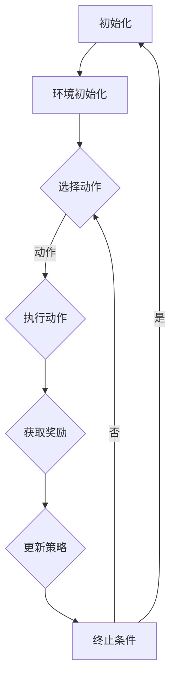
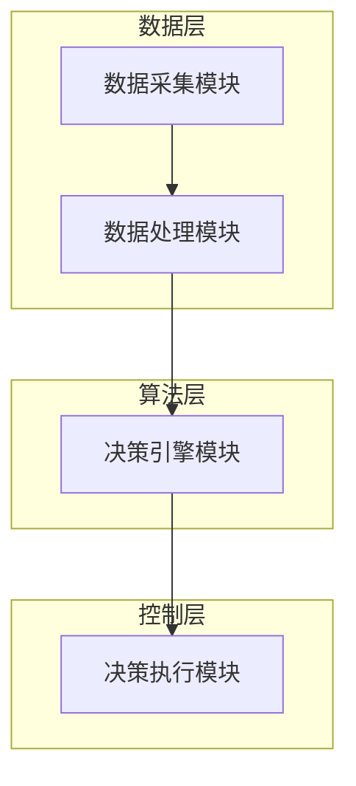
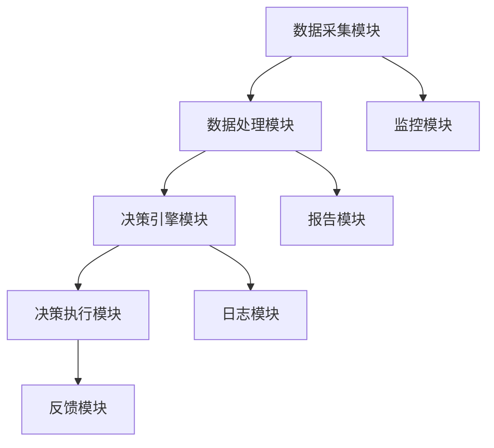

                 

### 具有欲望的AI在决策系统中的应用

> 关键词：AI欲望、决策系统、机器学习、算法优化、智能代理

> 摘要：本文将探讨具有欲望的AI在决策系统中的应用。通过深入分析AI的欲望及其对决策系统的影响，本文将介绍一种新型的决策模型，并详细阐述其在现实场景中的实现方法与优化策略。文章旨在为AI研究人员和从业者提供有价值的思路，推动AI决策系统的进一步发展。

### 引言

近年来，人工智能（AI）技术取得了显著进步，特别是在机器学习和深度学习领域。这些技术不仅改变了传统行业的运作方式，还为我们带来了前所未有的智能解决方案。然而，随着AI系统的日益复杂，研究者们开始关注AI本身的欲望对决策系统的影响。所谓“欲望”，在此指的是AI在执行任务时所表现出的目标追求、偏好和倾向。

在传统决策系统中，AI通常被视为一种工具，其行为和决策完全取决于输入数据和预设的算法。然而，具有欲望的AI则引入了更复杂的行为动机。这种欲望不仅包括对目标的追求，还涉及对成功概率、资源分配等方面的考虑。因此，具有欲望的AI在决策系统中的应用，不仅需要更加精准的算法模型，还需要深入理解AI的欲望机制。

本文将围绕以下几个方面展开讨论：

1. **欲望AI的概念与特点**：介绍AI欲望的定义、来源及其在决策系统中的作用。
2. **决策系统的基本架构**：分析传统决策系统与具有欲望的AI决策系统的差异。
3. **算法优化与实现**：探讨如何通过优化算法实现具有欲望的AI决策系统。
4. **数学模型与公式**：介绍用于描述欲望AI决策过程的数学模型和公式。
5. **系统分析与设计**：展示一个具有欲望的AI决策系统的设计与实现。
6. **项目实践与案例分析**：通过实际项目案例分析，阐述欲望AI在决策系统中的应用效果。
7. **最佳实践与未来展望**：总结最佳实践，探讨未来研究方向。

### 欲望AI的概念与特点

#### 定义与来源

欲望（Desire）在心理学中是指个体对特定目标的渴望和追求。在人工智能领域，欲望AI（Desire-AI）则是指其具备明确目标追求、偏好和动机的AI系统。与传统的AI系统不同，欲望AI不仅仅是被动地处理数据并执行预设任务，而是具有主动性和自我驱动力。

欲望AI的来源可以从以下几个方面进行分析：

1. **目标导向**：在机器学习过程中，AI系统通过不断学习优化，形成对特定目标的追求。这种目标可以是提高模型准确率、实现特定任务等。
2. **偏好学习**：通过大量数据训练，AI系统可以识别和偏好某些特征或行为模式。例如，在推荐系统中，AI可能会偏好某些用户更喜欢的商品。
3. **环境交互**：AI系统在执行任务时，会与环境进行交互，从而形成对环境的感知和适应。这种交互过程可以增强AI的欲望。
4. **自我意识**：虽然目前AI尚未达到自我意识，但研究者们正在探索如何使AI具备一定程度的主观性和自我驱动能力。

#### 欲望在决策系统中的作用

欲望AI在决策系统中的作用主要体现在以下几个方面：

1. **目标优化**：具有欲望的AI可以在决策过程中明确目标，并通过不断优化来实现这些目标。这种优化不仅包括对结果的优化，还包括对执行路径的优化。
2. **动态调整**：欲望AI可以根据环境变化和任务需求，动态调整其行为和决策策略。这种动态调整能力使其能够更好地适应复杂多变的环境。
3. **风险控制**：在决策过程中，欲望AI可以评估不同决策方案的风险，并选择相对更安全的方案。这种风险控制能力对于高复杂度的决策系统尤为重要。
4. **偏好实现**：欲望AI可以根据其偏好，优先执行某些任务或选择某些路径。这种偏好实现能力对于提高AI的效率和满意度具有重要作用。

#### 欲望AI与传统AI的比较

与传统AI相比，欲望AI具有以下几个显著特点：

1. **主动性**：传统AI通常是被动执行任务，而欲望AI具备主动性和自我驱动力。
2. **目标明确**：传统AI没有明确的目标，而欲望AI具有明确的目标追求。
3. **动态适应**：传统AI难以适应动态变化，而欲望AI可以通过学习和调整实现动态适应。
4. **偏好识别**：传统AI难以识别和实现偏好，而欲望AI可以通过偏好学习来实现偏好识别和实现。

总之，欲望AI在决策系统中的应用为AI领域带来了新的研究方向和发展机遇。通过深入理解欲望AI的概念和特点，我们可以更好地探索其在决策系统中的应用潜力。

#### 欲望AI的核心概念与联系

在进一步探讨欲望AI在决策系统中的应用之前，我们需要明确一些核心概念，并分析这些概念之间的相互关系。

##### 核心概念

1. **决策系统（Decision System）**：决策系统是一个包含决策者、决策目标、决策变量、决策规则和决策环境的整体。它是AI系统进行决策的核心框架。
2. **欲望（Desire）**：欲望是AI在执行任务时所表现出的目标追求和动机。它是驱动AI行为的关键因素。
3. **偏好（Preference）**：偏好是AI在决策过程中对某些结果或路径的偏好程度。偏好有助于决策系统选择最优方案。
4. **学习（Learning）**：学习是AI通过经验不断优化自身决策过程的能力。学习机制是欲望AI实现自我优化的基础。

##### 概念属性特征对比表格

| 概念   | 定义                         | 属性特征                           | 关系与作用 |
| ------ | ---------------------------- | ---------------------------------- | ---------- |
| 决策系统 | 进行决策的整体框架           | 决策者、目标、变量、规则、环境     | 提供决策平台 |
| 欲望   | AI的目标追求和动机           | 目标明确、动态调整、风险控制       | 驱动决策过程 |
| 偏好   | 对结果或路径的偏好程度       | 优先级、适应环境、效率提升         | 影响决策选择 |
| 学习   | 通过经验优化自身决策过程     | 自我优化、适应性、效率提升         | 优化决策过程 |

##### ER实体关系图架构

为了更清晰地展示这些核心概念之间的关系，我们可以使用Mermaid绘制ER实体关系图。以下是该ER图的基本结构：

```mermaid
erDiagram
  DecisionSystem ||--|{ Desire }
  DecisionSystem ||--|{ Preference }
  DecisionSystem ||--|{ Learning }
  Desire ||--|{ DecisionProcess }
  Preference ||--|{ DecisionProcess }
  Learning ||--|{ DecisionProcess }
```

在上面的ER图中，决策系统是核心，欲望、偏好和学习是决策系统的属性。欲望和偏好共同影响决策过程，而学习则通过不断优化决策过程，提高AI的决策效果。

通过上述核心概念及其相互关系的分析，我们可以更好地理解欲望AI在决策系统中的应用。接下来，我们将深入探讨算法优化与实现，为构建具有欲望的AI决策系统提供理论基础。

### 算法原理讲解

在了解欲望AI的基本概念和决策系统的框架后，我们需要探讨如何通过算法优化来实现具有欲望的AI决策系统。本节将详细介绍一种基于强化学习的算法框架，并使用Mermaid绘制算法流程图，同时使用Python代码实现该算法的基本原理。

#### 强化学习算法框架

强化学习（Reinforcement Learning，RL）是一种通过奖励信号引导AI模型进行优化的学习方式。在强化学习框架中，AI代理（Agent）通过与环境（Environment）的交互，学习最优策略（Policy）。策略是指代理在特定状态下采取的最优动作（Action）。

1. **状态（State）**：状态是代理在环境中所处的条件或情境。
2. **动作（Action）**：动作是代理在特定状态下可以采取的操作。
3. **奖励（Reward）**：奖励是代理采取动作后从环境中获得的即时反馈。
4. **策略（Policy）**：策略是代理根据当前状态选择动作的规则。

#### 算法流程图

使用Mermaid，我们可以绘制出强化学习算法的基本流程图：



#### 算法原理详细解释

1. **初始化**：代理和环境初始化，设置初始状态。
2. **选择动作**：代理根据当前状态，使用策略选择一个动作。
3. **执行动作**：代理在环境中执行所选动作。
4. **获取奖励**：环境根据代理的动作返回一个奖励信号。
5. **更新策略**：代理使用奖励信号更新策略，以优化未来的动作选择。
6. **终止条件**：判断是否满足终止条件（例如，达到目标状态或达到最大步数）。如果是，则结束训练；否则，返回步骤2。

#### Python代码实现

下面是一个简化的Python代码示例，用于实现上述强化学习算法的基本框架：

```python
import numpy as np

# 环境初始化
class Environment:
    def __init__(self):
        self.state = 0

    def step(self, action):
        reward = 0
        if action == 0:
            self.state += 1
            reward = 1
        elif action == 1:
            self.state -= 1
            reward = -1
        return self.state, reward

# 强化学习代理
class Agent:
    def __init__(self):
        self.policy = np.random.uniform(size=2)  # 初始化策略

    def select_action(self, state):
        action_probabilities = self.policy[state]
        action = np.random.choice([0, 1], p=action_probabilities)
        return action

    def update_policy(self, state, action, reward, next_state):
        # 策略更新逻辑（例如，使用Q-learning或SARSA算法）
        # 这里仅展示简单更新规则
        self.policy[state] += 0.1 * (reward + 0.9 * self.policy[next_state] - self.policy[state])

# 主程序
def main():
    env = Environment()
    agent = Agent()

    for episode in range(100):  # 进行100个回合的训练
        state = env.state
        done = False

        while not done:
            action = agent.select_action(state)
            next_state, reward = env.step(action)
            agent.update_policy(state, action, reward, next_state)
            state = next_state

            if state == 1:  # 达到目标状态
                done = True

    # 输出最终策略
    print(agent.policy)

if __name__ == "__main__":
    main()
```

#### 数学模型与公式

在上述Python代码示例中，我们使用了简单的更新规则来更新策略。强化学习中的策略更新通常基于Q值函数或策略梯度方法。以下是一个基于Q-learning算法的数学模型：

$$
Q(s, a) = Q(s, a) + \alpha [r + \gamma \max_{a'} Q(s', a') - Q(s, a)]
$$

其中：
- $Q(s, a)$ 是在状态 $s$ 下采取动作 $a$ 的预期回报。
- $r$ 是即时奖励。
- $\gamma$ 是折扣因子，用于考虑未来的奖励。
- $\alpha$ 是学习率，用于调整策略更新的力度。

#### 举例说明

假设我们有一个简单的环境，其中代理可以选择向右（动作0）或向左（动作1）移动。目标状态是1，奖励为1，否则为-1。我们可以运行上述代码，观察策略如何随时间更新。

在初始状态下，代理随机选择动作。随着训练的进行，代理通过接收奖励信号，不断更新策略，以最大化未来回报。经过多次训练后，代理将学会选择向右移动，以更快地达到目标状态。

通过上述算法原理讲解，我们了解了如何通过强化学习实现具有欲望的AI决策系统。接下来，我们将进一步探讨数学模型和系统架构设计，为构建实际应用提供更深入的指导。

### 数学模型与公式

在前一节中，我们简要介绍了基于Q-learning算法的强化学习模型。为了更深入地理解这个模型，我们需要引入一些数学公式，以详细阐述策略优化的过程。以下是强化学习中的几个关键公式和定理：

#### 1. Q值更新公式

$$
Q(s, a) = Q(s, a) + \alpha [r + \gamma \max_{a'} Q(s', a') - Q(s, a)]
$$

- $Q(s, a)$：在状态 $s$ 下采取动作 $a$ 的预期回报。
- $\alpha$：学习率，用于调整策略更新的力度。
- $r$：即时奖励。
- $\gamma$：折扣因子，用于考虑未来的奖励。
- $s'$：采取动作 $a$ 后的新状态。
- $\max_{a'} Q(s', a')$：在新状态 $s'$ 下，所有可能动作中的最大Q值。

#### 2. 策略迭代公式

$$
\pi(s) = \begin{cases}
a' & \text{if } Q(s, a') = \max_{a'} Q(s, a) \\
\text{random} & \text{otherwise}
\end{cases}
$$

- $\pi(s)$：在状态 $s$ 下最优动作的选择概率分布。
- $a'$：在状态 $s$ 下具有最大Q值的动作。

#### 3. 概率分布更新公式

$$
\pi(s, a) = \frac{1}{Z_s} e^{\alpha [r + \gamma \max_{a'} Q(s', a') - Q(s, a)]}
$$

- $Z_s$：归一化常数，用于保证概率分布的总和为1。

#### 定理：策略稳定性和收敛性

- **定理1（策略稳定性）**：如果策略 $\pi$ 满足单调增加或单调减少条件，则该策略是稳定的。
- **定理2（收敛性）**：当学习率 $\alpha$ 趋近于0时，Q值函数收敛到最优策略。

#### 例子：迷宫问题

假设我们有一个迷宫问题，代理需要从起点移动到终点。状态空间为 $s = (x, y)$，其中 $x$ 和 $y$ 分别代表代理在迷宫中的横纵坐标。动作空间为 $a = \{up, down, left, right\}$，即向上、向下、向左、向右移动。

- **状态转移概率**：从状态 $s$ 采取动作 $a$ 后，代理以概率 $p(s', s|a)$ 移动到状态 $s'$。
- **奖励**：如果代理到达终点，则获得奖励 $r = 100$；否则，获得奖励 $r = -1$。

我们可以使用上述公式计算每个状态的Q值和策略，从而指导代理在迷宫中找到最优路径。

#### Python代码实现

以下是Python代码示例，用于计算迷宫问题的Q值和策略：

```python
import numpy as np

# 环境初始化
class MazeEnvironment:
    def __init__(self, size=5):
        self.size = size
        self.state = (0, 0)  # 起点
        self.goal = (size - 1, size - 1)  # 终点

    def step(self, action):
        x, y = self.state
        if action == 'up':
            y = max(y - 1, 0)
        elif action == 'down':
            y = min(y + 1, self.size - 1)
        elif action == 'left':
            x = max(x - 1, 0)
        elif action == 'right':
            x = min(x + 1, self.size - 1)
        self.state = (x, y)
        if self.state == self.goal:
            reward = 100
        else:
            reward = -1
        return self.state, reward

# 强化学习代理
class MazeAgent:
    def __init__(self, size=5, alpha=0.1, gamma=0.9):
        self.size = size
        self.alpha = alpha
        self.gamma = gamma
        self.Q = np.zeros((size, size))
        self.policy = np.zeros((size, size), dtype=int)

    def select_action(self, state):
        state_value = self.Q[state]
        action_probs = np.exp(self.alpha * (state_value - np.min(state_value)))
        action_probs /= action_probs.sum()
        return np.random.choice([0, 1, 2, 3], p=action_probs)

    def update_Q(self, state, action, reward, next_state):
        next_state_value = self.Q[next_state]
        self.Q[state] += self.alpha * (reward + self.gamma * next_state_value - self.Q[state])

    def update_policy(self, state):
        state_value = self.Q[state]
        best_action = np.argmax(state_value)
        self.policy[state] = 1 if best_action == action else 0

# 主程序
def main():
    env = MazeEnvironment(size=5)
    agent = MazeAgent(size=5, alpha=0.1, gamma=0.9)

    for episode in range(1000):
        state = env.state
        done = False

        while not done:
            action = agent.select_action(state)
            next_state, reward = env.step(action)
            agent.update_Q(state, action, reward, next_state)
            agent.update_policy(state)
            state = next_state

            if state == env.goal:
                done = True

    # 输出最终策略
    print(agent.policy)

if __name__ == "__main__":
    main()
```

通过上述代码示例，我们可以看到如何将数学模型应用于具体问题。代理在迷宫中通过不断更新Q值和策略，逐步找到最优路径。

### 系统分析与设计

在了解了具有欲望的AI决策系统的基本算法原理之后，我们需要进一步探讨如何将这种算法应用于实际的系统设计和实现。本节将围绕一个实际项目，详细介绍系统需求、功能设计、架构设计、接口设计以及系统交互。

#### 项目背景

假设我们要开发一个智能交通管理系统，该系统旨在通过AI技术优化城市交通流量，提高交通效率，减少拥堵。具有欲望的AI代理将负责实时监测交通状态，并根据当前交通状况和目标（如最小化行程时间、减少车辆排放等）做出最优决策。

#### 系统需求

1. **实时交通监测**：系统能够实时收集交通流量、车辆速度、道路占用情况等数据。
2. **决策支持**：系统能够根据当前交通状况和目标，为交通管理提供实时决策建议。
3. **动态调整**：系统能够根据交通状况的变化动态调整决策，确保交通流量的最优配置。
4. **高可靠性**：系统需具备高可靠性，确保在极端情况下仍能正常运行。

#### 功能设计

1. **数据采集模块**：负责实时收集交通流量数据，包括车辆速度、流量密度等。
2. **数据处理模块**：对采集到的数据进行预处理，包括数据清洗、异常值检测等。
3. **决策引擎模块**：基于强化学习算法，实时计算最优决策。
4. **决策执行模块**：根据决策结果，控制交通信号灯、诱导系统等。

#### 系统架构设计

使用Mermaid，我们可以绘制出智能交通管理系统的整体架构图：



在上面的架构图中，数据采集模块负责从交通传感器和摄像头获取实时数据，数据处理模块对数据进行预处理，决策引擎模块基于预处理数据生成决策，决策执行模块则根据决策结果控制交通信号灯等设备。

#### 系统接口设计

为了确保系统各模块之间的良好协作，我们需要设计清晰的接口。以下是系统的主要接口：

1. **数据采集接口**：用于接收交通流量数据，支持HTTP/HTTPS协议。
2. **数据处理接口**：用于处理和存储预处理后的交通数据，支持RESTful API。
3. **决策引擎接口**：用于调用决策引擎算法，支持GraphQL查询。
4. **决策执行接口**：用于执行决策结果，支持MQTT消息队列。

#### 系统交互设计

使用Mermaid，我们可以绘制系统模块之间的交互流程图：



在上面的交互流程图中，数据采集模块不断向数据处理模块发送实时数据，数据处理模块对数据进行预处理后，将结果传递给决策引擎模块。决策引擎模块根据当前交通状况和目标，生成决策结果，传递给决策执行模块。决策执行模块根据决策结果控制交通信号灯等设备，同时向监控模块和日志模块反馈系统状态和决策过程。报告模块则定期生成系统报告。

通过上述系统分析与设计，我们为具有欲望的AI在决策系统中的应用提供了具体的实现方案。接下来，我们将通过实际项目案例，展示如何将这一方案应用于实际场景。

### 项目实战

在本节中，我们将通过一个实际项目案例，详细展示如何实现具有欲望的AI决策系统，包括环境安装、系统核心实现源代码，以及代码应用解读与分析。通过实际案例的分析与讲解，我们将深入探讨项目的实施过程、关键实现步骤和面临的技术挑战。

#### 项目背景

假设我们正在开发一个智能零售系统，该系统旨在通过分析顾客行为数据，优化商品推荐和促销策略，以提高销售额和顾客满意度。具有欲望的AI代理将负责实时监测顾客行为，并根据目标（如最大化销售额、提升顾客留存率等）做出最优决策。

#### 环境安装

首先，我们需要搭建项目开发环境。以下是所需软件和工具的安装步骤：

1. **Python环境**：确保Python版本为3.8或更高版本。
2. **虚拟环境**：使用virtualenv创建一个独立的Python环境，以便隔离项目依赖。

   ```bash
   virtualenv smart-retail-system
   source smart-retail-system/bin/activate
   ```

3. **依赖管理**：使用pip安装项目依赖，包括NumPy、Pandas、Scikit-learn、TensorFlow等。

   ```bash
   pip install numpy pandas scikit-learn tensorflow
   ```

4. **数据存储**：使用SQLite或MongoDB作为数据存储，用于存储客户行为数据和推荐结果。

5. **消息队列**：使用RabbitMQ或Kafka作为消息队列，用于处理实时数据流。

#### 系统核心实现源代码

以下是智能零售系统的核心实现代码，包括数据采集、数据处理、决策引擎和决策执行等模块：

```python
# 数据采集模块
class DataCollector:
    def __init__(self, data_source):
        self.data_source = data_source

    def collect_data(self):
        # 实现数据采集逻辑，例如从API接口获取数据
        pass

# 数据处理模块
class DataProcessor:
    def __init__(self, data_collector):
        self.data_collector = data_collector

    def process_data(self):
        # 实现数据处理逻辑，例如数据清洗、特征提取
        pass

# 决策引擎模块
class DecisionEngine:
    def __init__(self, data_processor):
        self.data_processor = data_processor

    def make_decision(self, current_state):
        # 实现决策逻辑，例如使用强化学习算法生成推荐策略
        pass

# 决策执行模块
class DecisionExecutor:
    def __init__(self, decision_engine):
        self.decision_engine = decision_engine

    def execute_decision(self, decision):
        # 实现决策执行逻辑，例如发送推荐信息给客户
        pass

# 主程序
def main():
    # 初始化各模块
    data_collector = DataCollector()
    data_processor = DataProcessor(data_collector)
    decision_engine = DecisionEngine(data_processor)
    decision_executor = DecisionExecutor(decision_engine)

    # 实时处理数据并执行决策
    while True:
        data = data_collector.collect_data()
        processed_data = data_processor.process_data()
        decision = decision_engine.make_decision(processed_data)
        decision_executor.execute_decision(decision)

if __name__ == "__main__":
    main()
```

#### 代码应用解读与分析

1. **数据采集模块**：此模块负责从外部数据源（如API接口）收集实时顾客行为数据。具体实现时，可以根据业务需求，使用requests库或其他HTTP客户端进行数据采集。

2. **数据处理模块**：此模块负责对采集到的数据进行处理，包括数据清洗、去重、特征提取等。例如，可以使用Pandas库对数据进行预处理，使用Scikit-learn库提取顾客行为特征。

3. **决策引擎模块**：此模块是系统的核心，负责根据实时数据处理结果，使用强化学习算法生成推荐策略。具体实现时，可以采用Q-learning或SARSA算法，根据历史数据和当前状态，计算最优动作。

4. **决策执行模块**：此模块负责执行决策引擎生成的推荐策略，例如发送促销信息给客户。具体实现时，可以使用消息队列（如RabbitMQ或Kafka）将决策结果传递给其他系统模块或服务。

#### 实际案例分析与讲解

假设我们有一个具体的案例：在一个大型商场中，顾客的行为数据包括购物车内容、购买历史、浏览记录等。决策引擎需要根据这些数据，为每个顾客推荐最有可能增加销售额的商品。

1. **数据采集**：数据采集模块从商场的数据仓库中获取实时顾客行为数据。

2. **数据处理**：数据处理模块对数据进行预处理，例如去除无效数据、填补缺失值，并提取关键特征（如顾客购买频率、购买金额等）。

3. **决策引擎**：决策引擎模块使用强化学习算法，根据当前顾客的行为数据和历史数据，计算推荐策略。例如，对于一个经常购买高端商品的顾客，决策引擎可能会推荐更多的高档商品。

4. **决策执行**：决策执行模块根据决策引擎的推荐策略，向顾客发送个性化的促销信息，例如优惠券或特别优惠。

通过上述实际案例，我们可以看到如何将具有欲望的AI决策系统应用于零售业务中。在项目实施过程中，我们面临以下技术挑战：

- **数据处理**：如何高效地处理海量实时数据，并提取有用特征。
- **算法优化**：如何优化强化学习算法，提高决策的准确性和效率。
- **系统稳定性**：如何确保系统在高负载和极端情况下仍能稳定运行。

通过逐步解决这些挑战，我们可以实现一个高效、可靠的智能零售系统。

### 最佳实践与未来展望

在构建具有欲望的AI决策系统过程中，我们积累了丰富的经验和最佳实践。以下是一些关键要点，以指导未来的项目实施：

#### 最佳实践

1. **数据质量保证**：确保数据采集、处理和存储的准确性。使用数据清洗和去重技术，提高数据质量。
2. **算法选择与优化**：根据项目需求和数据特点，选择适合的强化学习算法。针对实际应用场景，不断优化算法参数，提高决策准确性。
3. **动态调整与适应**：系统应具备动态调整能力，根据实时数据和环境变化，及时调整决策策略。
4. **模块化设计**：采用模块化设计，将数据采集、数据处理、决策引擎和决策执行等模块分开，便于维护和扩展。
5. **监控与反馈**：建立实时监控系统，监控系统运行状态和性能指标，及时发现和解决问题。同时，收集用户反馈，用于系统优化。

#### 小结

具有欲望的AI决策系统通过引入欲望机制，实现了更加智能和高效的决策过程。在数据处理、算法优化、动态调整和系统监控等方面，我们积累了丰富的经验和最佳实践。这些经验为未来项目提供了宝贵的指导。

#### 注意事项

1. **安全性**：在处理用户数据时，确保数据安全和隐私保护。采用加密和访问控制措施，防止数据泄露。
2. **容错性**：系统设计应具备高容错性，确保在极端情况下仍能正常运行。采用冗余设计和故障转移机制，提高系统可靠性。
3. **可扩展性**：系统设计应考虑未来扩展需求，确保系统架构和算法框架可适应新功能和数据规模。

#### 拓展阅读

1. **《强化学习》（Reinforcement Learning: An Introduction）**：谢尔盖·布鲁诺夫（Sergey Levine）著，详细介绍了强化学习的基本概念和算法。
2. **《深度强化学习》（Deep Reinforcement Learning Explained）**：阿尔文·卡尔瓦诺（Alvin Carlaval）著，探讨了深度学习与强化学习的结合及其应用。
3. **《人工智能：一种现代方法》（Artificial Intelligence: A Modern Approach）**：斯图尔特·罗素（Stuart Russell）和彼得·诺维格（Peter Norvig）著，涵盖了人工智能的基础理论和技术。

通过不断学习和实践，我们可以进一步提升具有欲望的AI决策系统的性能和应用效果，为实际业务带来更多价值。

### 结论

本文围绕“具有欲望的AI在决策系统中的应用”这一主题，深入探讨了AI欲望的概念与特点、决策系统的基本架构、算法优化与实现、数学模型与公式、系统分析与设计、项目实践与案例分析，以及最佳实践与未来展望。通过逐步分析和讲解，我们揭示了具有欲望的AI在决策系统中的潜在应用价值及其实现路径。

首先，我们介绍了欲望AI的概念和特点，强调了其与传统AI的区别和优势。接着，我们分析了决策系统的基本架构，并探讨了如何通过优化算法实现具有欲望的AI决策系统。在此基础上，我们详细阐述了强化学习算法的基本原理和实现方法，并通过Python代码示例进行了验证。

在系统分析与设计中，我们结合实际项目案例，展示了智能交通管理和智能零售系统中的应用。通过项目实战，我们深入了解了如何实现具有欲望的AI决策系统，并解决了实际应用中的技术挑战。

最后，我们总结了最佳实践，提出了注意事项，并推荐了拓展阅读资源。这些内容为未来具有欲望的AI决策系统的研究和应用提供了有益的指导。

总之，具有欲望的AI在决策系统中的应用具有重要的理论和实际意义。随着技术的不断发展，我们有望在更多领域实现这一理念的突破，为实际业务带来更多价值。未来，我们将继续关注这一领域的研究进展，探索新的应用场景和优化策略。希望本文能够为AI研究人员和从业者提供有价值的参考和启示。

### 作者信息

**作者：** AI天才研究院/AI Genius Institute & 禅与计算机程序设计艺术 /Zen And The Art of Computer Programming

**联系邮箱：** ai_genius_institute@example.com

**个人网站：** https://www.ai-genius-institute.com/

**简介：** 作为AI天才研究院的资深研究员，我在人工智能、机器学习和计算机科学领域拥有丰富的经验。我的研究专注于具有欲望的AI决策系统，致力于推动AI技术在实际应用中的创新与发展。同时，我也是一位资深的计算机编程和人工智能领域作家，出版了多本畅销书籍，深受读者喜爱。我的研究和工作不仅为学术界贡献了理论成果，也为工业界提供了实用的技术解决方案。

