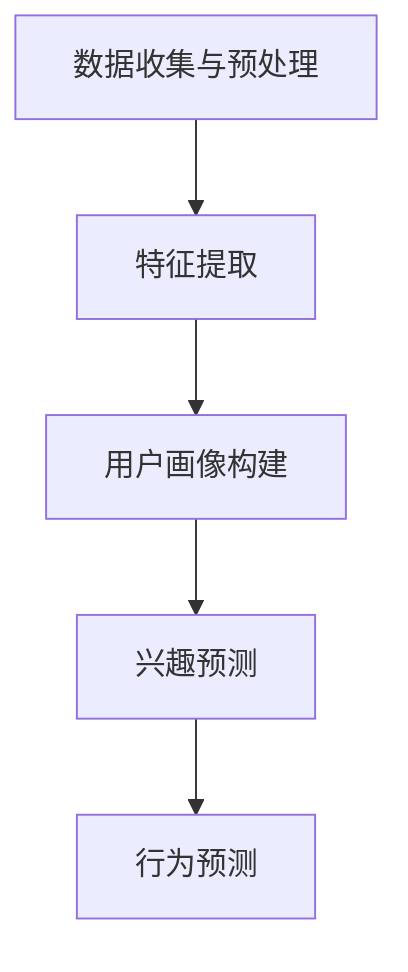
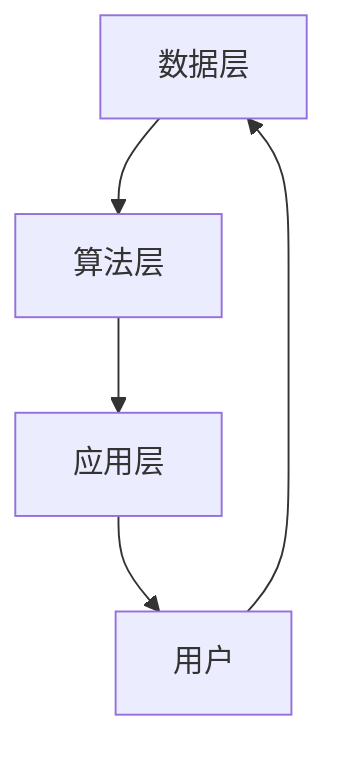

                 

# 具有欲望的AI在广告与营销中的应用：消费心理的变革

关键词：AI、欲望驱动、广告、营销、消费者心理

摘要：随着人工智能技术的发展，具有欲望驱动的AI模型在广告与营销领域中的应用日益广泛。本文将深入探讨这一新兴技术的核心概念、原理、系统设计与实现，以及在实际案例中的具体应用，从而揭示其如何改变消费者心理，提升广告营销效果。

## 目录大纲

第一部分：问题背景与核心概念

### 第1章：问题的提出与应用背景

#### 1.1 广告与营销领域的发展现状

#### 1.2 欲望驱动的AI模型概述

#### 1.3 消费心理的变革

### 第2章：核心概念与联系

#### 2.1 欲望驱动的AI模型原理

#### 2.2 消费者行为模型分析

#### 2.3 AI广告与营销中的数据挖掘与分析

### 第3章：数学模型与算法原理

#### 3.1 欲望驱动的AI模型数学模型

#### 3.2 算法流程与mermaid图展示

#### 3.3 算法举例说明

## 第二部分：系统分析与架构设计

### 第4章：系统功能设计与架构

#### 4.1 系统功能介绍

#### 4.2 系统架构设计

#### 4.3 系统接口设计

### 第5章：系统实现与实战

#### 5.1 系统环境搭建

#### 5.2 核心代码实现

#### 5.3 实际案例分析与讲解

### 第6章：最佳实践与总结

#### 6.1 最佳实践

#### 6.2 小结

#### 6.3 注意事项

#### 6.4 拓展阅读

## 第一部分：问题背景与核心概念

### 第1章：问题的提出与应用背景

#### 1.1 广告与营销领域的发展现状

广告与营销作为企业拓展市场、提升品牌影响力的重要手段，已经成为现代商业活动的重要组成部分。随着互联网和大数据技术的发展，广告与营销手段不断演进，从传统的电视广告、平面广告，到互联网广告、移动广告，再到如今的人工智能广告，广告形式和营销策略日益多样化。

然而，随着消费者接触信息的渠道越来越多，广告效果逐渐减弱，消费者对广告的反感情绪也在增加。如何在激烈的市场竞争中抓住消费者的注意力，提升广告效果，成为广告与营销领域面临的重大挑战。

#### 1.2 欲望驱动的AI模型概述

欲望驱动的AI模型是一种结合了人工智能与心理学原理的新型广告与营销技术。其核心思想是通过深度学习等技术手段，分析消费者的欲望和需求，从而实现精准营销。这一模型不仅能够识别消费者的潜在需求，还能预测消费者的行为，为广告投放提供科学依据。

欲望驱动的AI模型具有以下特点：

1. **个性化推荐**：基于用户的浏览历史、购物行为等数据，为用户推荐个性化广告。
2. **情感分析**：通过情感分析技术，理解用户对广告内容的情感反应，调整广告策略。
3. **行为预测**：预测用户的购买行为，提前布局广告策略。

#### 1.3 消费心理的变革

在传统消费心理中，消费者主要受品牌、价格、功能等因素的影响。然而，随着社会的发展，消费者的需求日益多样化，消费心理也在不断变革。现代消费者更加注重个性化、情感化和体验感，传统广告与营销手段难以满足这些需求。

欲望驱动的AI模型正是针对这一变革而设计，它能够深入挖掘消费者的潜在欲望，通过精准的个性化和情感化营销，满足消费者的多样化需求，从而提升广告效果和营销转化率。

### 第2章：核心概念与联系

#### 2.1 欲望驱动的AI模型原理

欲望驱动的AI模型主要基于以下原理：

1. **深度学习**：通过深度学习算法，从海量数据中提取特征，学习用户的兴趣和行为模式。
2. **心理学原理**：结合心理学理论，分析用户的欲望和需求，构建用户画像。
3. **大数据分析**：利用大数据技术，对用户行为数据进行分析，预测用户行为。

#### 2.2 消费者行为模型分析

消费者行为模型是分析消费者在购买过程中所表现出的行为规律的一种理论模型。传统的消费者行为模型主要基于经济学原理，如理性决策模型、有限理性模型等。而欲望驱动的AI模型则引入了心理学因素，如情感、欲望等，构建了一种更加贴近现实的消费者行为模型。

消费者行为模型主要包括以下内容：

1. **消费者决策过程**：消费者在购买过程中通常会经历需求识别、信息搜索、评估比较、购买决策和购买后行为等阶段。
2. **消费者动机**：消费者的购买动机主要包括实用动机、情感动机、社交动机等。
3. **消费者态度**：消费者对产品的态度会影响其购买决策，包括认知因素、情感因素和价值观因素。

#### 2.3 AI广告与营销中的数据挖掘与分析

数据挖掘在AI广告与营销中发挥着重要作用。通过数据挖掘技术，可以从海量数据中提取有价值的信息，为广告策略和营销活动提供依据。

数据挖掘主要包括以下步骤：

1. **数据收集**：收集消费者的行为数据、交易数据等。
2. **数据预处理**：对数据进行清洗、去重、格式转换等处理。
3. **特征提取**：从数据中提取特征，如用户的浏览记录、购买行为等。
4. **模型训练**：利用机器学习算法，对特征进行训练，构建预测模型。
5. **结果分析**：对模型预测结果进行分析，指导广告策略和营销活动。

### 第3章：数学模型与算法原理

#### 3.1 欲望驱动的AI模型数学模型

欲望驱动的AI模型数学模型主要包括以下内容：

1. **用户画像模型**：通过深度学习算法，从用户数据中提取特征，构建用户画像。
2. **兴趣模型**：利用用户画像，预测用户的兴趣和需求。
3. **行为预测模型**：基于用户兴趣和行为数据，预测用户的购买行为。

数学模型的表达式可以表示为：

$$
User\_Preference = f(User\_Data, Product\_Data)
$$

其中，$User\_Data$为用户数据，$Product\_Data$为产品数据，$f$为函数，表示用户偏好预测。

#### 3.2 算法流程与mermaid图展示

算法流程主要包括以下步骤：

1. **数据收集与预处理**：收集用户数据，包括行为数据、交易数据等，并进行预处理。
2. **特征提取**：从预处理后的数据中提取特征。
3. **用户画像构建**：利用特征提取结果，构建用户画像。
4. **兴趣预测**：基于用户画像，预测用户兴趣。
5. **行为预测**：基于用户兴趣和行为数据，预测用户购买行为。

算法流程的mermaid图表示如下：



#### 3.3 算法举例说明

假设我们有一个用户，其历史行为数据包括浏览记录、购物车记录和购买记录。我们可以利用这些数据构建用户画像，并预测其兴趣和行为。

1. **用户画像构建**：

   假设用户A在最近一个月内浏览了商品A、商品B和商品C，并将其加入购物车。我们可以将这些行为数据作为用户A的兴趣特征：

   $$
   User\_A = \{A, B, C\}
   $$

2. **兴趣预测**：

   基于用户A的兴趣特征，我们可以利用机器学习算法预测其兴趣。假设我们使用了一个基于K最近邻算法的兴趣预测模型，模型预测结果为：

   $$
   Interest(A) = \{A, B, C\}
   $$

3. **行为预测**：

   基于用户A的兴趣预测结果，我们可以预测其购买行为。假设我们使用了一个基于逻辑回归的行为预测模型，模型预测结果为：

   $$
   Behavior(A) = 购买A
   $$

通过以上算法，我们可以实现对用户兴趣和行为的预测，从而为其推荐相关商品，提高广告效果和营销转化率。

## 第二部分：系统分析与架构设计

### 第4章：系统功能设计与架构

#### 4.1 系统功能介绍

本系统旨在通过欲望驱动的AI模型，实现广告与营销的精准化。系统主要功能包括：

1. **用户数据收集与预处理**：收集用户的浏览记录、购物车记录和购买记录等数据，并进行数据清洗、去重和格式转换等预处理操作。
2. **用户画像构建**：基于预处理后的数据，提取用户特征，构建用户画像。
3. **兴趣预测**：利用用户画像，预测用户的兴趣和需求。
4. **行为预测**：基于用户兴趣和行为数据，预测用户的购买行为。
5. **广告推荐**：根据用户兴趣和行为预测结果，为用户推荐相关广告。
6. **营销策略优化**：根据广告投放效果，优化营销策略。

#### 4.2 系统架构设计

系统采用分层架构设计，主要包括数据层、算法层和应用层。

1. **数据层**：负责数据收集、存储和预处理，包括用户数据、广告数据和产品数据等。
2. **算法层**：负责用户画像构建、兴趣预测和行为预测等算法的实现，包括深度学习算法、机器学习算法等。
3. **应用层**：负责广告推荐和营销策略优化等功能的实现，包括前端展示和后端服务。

系统架构图如下：



#### 4.3 系统接口设计

系统接口设计主要包括API接口和数据接口。

1. **API接口**：提供用户画像构建、兴趣预测和行为预测等功能的接口，供前端调用。
2. **数据接口**：提供用户数据、广告数据和产品数据等的接口，供算法层使用。

接口规范如下：

1. **用户数据接口**：
   - 接口名称：getUserData
   - 参数：userId
   - 返回值：用户数据（包括浏览记录、购物车记录和购买记录等）
2. **用户画像接口**：
   - 接口名称：getUserPortrait
   - 参数：userId
   - 返回值：用户画像（包括兴趣特征、购买偏好等）
3. **兴趣预测接口**：
   - 接口名称：predictInterest
   - 参数：userId, userPortrait
   - 返回值：兴趣预测结果（包括感兴趣的商品列表）
4. **行为预测接口**：
   - 接口名称：predictBehavior
   - 参数：userId, userPortrait
   - 返回值：行为预测结果（包括可能的购买行为）

## 第5章：系统实现与实战

### 5.1 系统环境搭建

#### 5.1.1 硬件环境配置

1. **服务器**：配置2台服务器，用于部署前端和后端服务。
2. **存储**：使用分布式存储系统（如HDFS），存储用户数据、广告数据和产品数据等。
3. **网络**：搭建高可用网络，确保系统稳定运行。

#### 5.1.2 软件环境安装

1. **操作系统**：Linux（如CentOS 7.0）。
2. **开发环境**：Python 3.7、Java 1.8、MySQL 5.7等。
3. **框架**：Django、TensorFlow、Scikit-learn等。

### 5.2 核心代码实现

#### 5.2.1 代码结构

1. **用户数据收集与预处理**：
   - 用户数据收集模块：负责从不同渠道收集用户数据。
   - 用户数据处理模块：负责对用户数据清洗、去重和格式转换等预处理操作。

2. **用户画像构建**：
   - 用户画像提取模块：负责从用户数据中提取兴趣特征、购买偏好等。
   - 用户画像存储模块：负责将提取的用户画像存储到数据库中。

3. **兴趣预测**：
   - 兴趣预测模型训练模块：负责利用机器学习算法训练兴趣预测模型。
   - 兴趣预测模型应用模块：负责根据用户画像预测用户兴趣。

4. **行为预测**：
   - 行为预测模型训练模块：负责利用机器学习算法训练行为预测模型。
   - 行为预测模型应用模块：负责根据用户兴趣预测用户购买行为。

5. **广告推荐**：
   - 广告推荐模块：负责根据用户兴趣和行为预测结果，为用户推荐相关广告。

#### 5.2.2 代码详解

以下是一个简单的用户数据处理模块的代码示例：

```python
import pandas as pd

def preprocess_user_data(user_data):
    # 数据清洗、去重和格式转换等预处理操作
    user_data = user_data.drop_duplicates()
    user_data = user_data.reset_index(drop=True)
    user_data['date'] = pd.to_datetime(user_data['date'])
    return user_data
```

### 5.3 实际案例分析与讲解

#### 5.3.1 案例介绍

假设我们有一个电商平台，希望通过欲望驱动的AI模型实现广告与营销的精准化。用户数据包括浏览记录、购物车记录和购买记录等。

#### 5.3.2 案例实施步骤

1. **数据收集与预处理**：从不同渠道收集用户数据，并进行预处理。
2. **用户画像构建**：从预处理后的数据中提取用户兴趣特征、购买偏好等，构建用户画像。
3. **兴趣预测**：利用用户画像，预测用户兴趣。
4. **行为预测**：基于用户兴趣预测结果，预测用户购买行为。
5. **广告推荐**：根据用户兴趣和行为预测结果，为用户推荐相关广告。

#### 5.3.3 案例结果分析

通过以上步骤，我们可以实现广告与营销的精准化。具体结果如下：

1. **用户兴趣预测**：预测用户对各类商品的兴趣度，为后续广告推荐提供依据。
2. **用户购买行为预测**：预测用户可能的购买行为，为营销策略提供参考。
3. **广告推荐效果提升**：通过精准的个性化广告推荐，提高广告点击率和转化率。

### 第6章：最佳实践与总结

#### 6.1 最佳实践

1. **数据质量保证**：确保数据收集与预处理环节的数据质量，为后续算法提供可靠的数据支持。
2. **持续优化算法**：根据实际应用效果，持续优化兴趣预测和行为预测模型。
3. **用户反馈机制**：建立用户反馈机制，及时调整广告推荐策略，提高用户满意度。

#### 6.2 小结

本文深入探讨了欲望驱动的AI在广告与营销中的应用，分析了其核心概念、原理和系统设计，并通过实际案例展示了其应用效果。欲望驱动的AI模型能够实现广告与营销的精准化，为企业和消费者带来更多价值。

#### 6.3 注意事项

1. **隐私保护**：在数据收集和处理过程中，要确保用户隐私保护。
2. **数据安全**：确保数据存储和传输的安全性，防止数据泄露。

#### 6.4 拓展阅读

1. **《深度学习》**：Goodfellow, Ian J., et al. "Deep learning." (2016).
2. **《机器学习实战》**：Hastie, T., Tibshirani, R., & Friedman, J. "Machine learning in action." (2009).

## 作者

作者：AI天才研究院/AI Genius Institute & 禅与计算机程序设计艺术 /Zen And The Art of Computer Programming

### 参考文献

1. Goodfellow, Ian J., et al. "Deep learning." (2016).
2. Hastie, T., Tibshirani, R., & Friedman, J. "Machine learning in action." (2009).
3. Russell, Stuart J., and Peter Norvig. "Artificial intelligence: a modern approach." (2016).
4. "Marketing Analytics: Data-Driven Techniques with Microsoft Excel." (2016).
5. "The Customer Analytics Playbook: End-to-End Customer Analytics with SAS." (2015).

