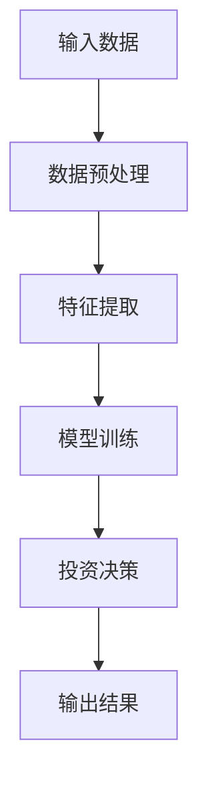
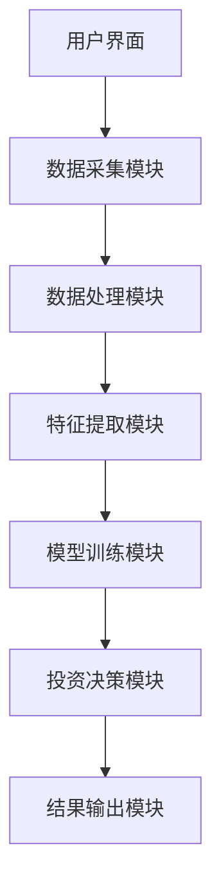
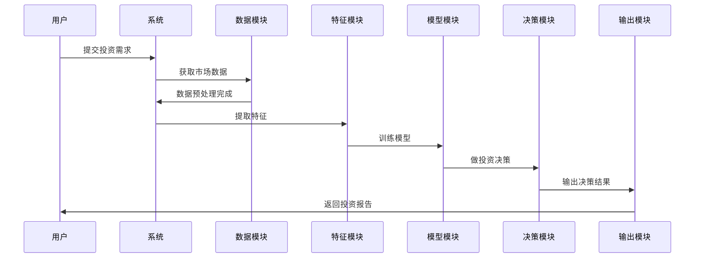

                 

### 第一部分：引言

#### 第1章：问题背景与概述

##### 1.1 问题背景

随着人工智能技术的迅速发展，金融市场与AI技术的结合成为了热门话题。AI在金融领域的应用不仅提高了效率，还为投资行为带来了深刻的变革。从智能投顾到量化交易，AI正在逐步改变传统金融市场的运作模式。

当前的金融市场是一个高度复杂、动态变化的系统。市场参与者众多，信息流通迅速，价格波动频繁。在这样的背景下，如何利用AI技术进行有效的投资决策成为了一个重要课题。AI不仅能够处理大量的数据，还能够通过机器学习算法从历史数据中学习并预测市场趋势。

然而，AI在金融投资中的应用并非一帆风顺。AI系统需要处理的数据量庞大，且数据的真实性和可靠性对模型的性能有着直接影响。此外，金融市场的非线性和随机性使得AI模型面临巨大的挑战。如何在保证准确性的同时，提高AI在金融投资中的应用效果，是当前研究的重要方向。

##### 1.2 问题描述

本篇文章将探讨“具有欲望的AI”在金融市场中的角色，并分析其可能带来的投资行为变革。这里的“具有欲望的AI”指的是通过机器学习和深度学习技术，能够模拟人类行为和决策过程的AI系统。

那么，这种具有欲望的AI如何在金融市场中发挥作用呢？首先，它可以通过对海量市场数据的分析，发现潜在的投资机会。其次，它能够根据市场动态和投资目标，制定出最优的投资策略。更重要的是，AI的“欲望”可以理解为一种投资动机，它能够在不同市场环境下自动调整投资行为，以追求最大化收益。

那么，这种具有欲望的AI是否真的能够带来投资行为的变革呢？本篇文章将通过对多个案例的深入分析，探讨这个问题。

##### 1.3 问题解决

为了解决上述问题，我们将采用案例研究的方法，分析具有欲望的AI在金融市场中的具体应用。本文将选取几个典型的应用场景，如股票市场、债券市场等，详细探讨AI如何通过数据分析和决策制定，实现投资收益的最大化。

首先，我们将介绍AI在金融投资中的基本原理，包括数据采集、预处理、特征提取、模型训练和投资决策等步骤。然后，我们将通过具体的案例，展示AI在实际投资中的应用效果。最后，我们将对案例进行分析，总结具有欲望的AI在金融市场中的优势和挑战，并提出未来的研究方向。

##### 1.4 边界与外延

本文的研究范围主要涉及AI在金融投资中的应用，特别是具有欲望的AI系统的投资行为变革。我们将重点关注以下边界和限定条件：

1. **数据来源**：本文所涉及的数据主要来源于公开的市场数据和交易记录，不涉及个人隐私信息。
2. **研究方法**：本文采用案例研究的方法，通过具体实例分析AI在金融市场中的应用效果。
3. **市场范围**：本文主要关注股票市场和债券市场的AI应用，不包括其他金融衍生品市场。
4. **时间范围**：本文的研究时间范围将限定在过去的几年内，以反映AI在金融投资中的最新发展。

在未来，随着AI技术的不断进步和市场环境的变化，具有欲望的AI在金融市场中的应用将更加广泛和深入。我们期待未来的研究能够进一步探索AI在金融投资中的潜力，为投资者提供更有效的决策工具。

##### 1.5 概念结构与核心要素

在探讨具有欲望的AI在金融市场中的角色之前，我们需要明确几个关键概念和要素。

首先，**金融市场**是由多种金融工具和交易活动组成的复杂系统。它包括股票、债券、期货、期权等，每个市场都有其独特的交易规则和风险特征。

**人工智能（AI）**是一种模拟人类智能行为的技术，通过机器学习和深度学习算法，能够自主学习和改进。AI在金融投资中的应用主要集中在数据分析和决策制定。

**投资行为**是指投资者在金融市场上的操作，包括买入、卖出、持有等决策。投资行为的改变可能受到多种因素的影响，如市场环境、投资者情绪、信息不对称等。

**欲望**在这里可以理解为一种投资动机，是AI系统根据预设目标和市场动态，自动调整投资策略的内在驱动力。这种欲望可以帮助AI在复杂的市场环境中，实现投资收益的最大化。

通过上述概念和要素的分析，我们可以更好地理解具有欲望的AI在金融市场中的作用和影响。接下来，我们将进一步探讨AI在金融投资中的应用原理和具体案例，以期为读者提供深入的认识。

### 第二部分：核心概念与联系

#### 第2章：核心概念与联系

##### 2.1 核心概念原理

在本章中，我们将详细探讨人工智能（AI）的基本原理及其在金融市场中的应用，同时介绍金融市场的运作机制。

**人工智能（AI）的基本原理**：

人工智能是一种通过模拟人类思维和决策过程，实现自动化和智能化的技术。其核心在于算法和模型的设计，这些算法和模型能够从数据中学习，并在此基础上做出预测和决策。人工智能可以分为两大类：基于规则的系统和基于数据的系统。

1. **基于规则的系统**：这种系统通过预定义的规则来指导行为，例如专家系统。这些规则由人类专家根据领域知识编写，系统能够根据这些规则进行推理和决策。
   
2. **基于数据的系统**：这种系统依赖于大量的数据，通过机器学习和深度学习算法来提取模式和规律。这些算法包括神经网络、支持向量机、决策树等。通过不断地学习和调整，这些系统能够在复杂的环境中做出准确的预测和决策。

**金融市场的运作机制**：

金融市场是一个由买卖双方组成的交易系统，其核心是价格发现和资源配置。金融市场的运作机制主要包括以下几个方面：

1. **价格发现**：市场参与者通过交易活动，发现金融工具的合理价格。价格反映市场对未来的预期，包括对经济、政策、公司业绩等因素的判断。

2. **市场参与者**：包括投资者、交易者、机构投资者、金融机构等。每个参与者都有其特定的角色和目标，他们的行为共同影响着市场的运行。

3. **交易规则**：金融市场有一套严格的交易规则，包括交易时间、交易价格、交易方式等。这些规则保证了市场的公平、透明和有序。

4. **信息流动**：金融市场中的信息流动非常迅速，市场参与者通过多种渠道获取信息，这些信息会影响他们的投资决策。

**人工智能在金融市场中的应用**：

人工智能在金融市场的应用主要集中在以下几个方面：

1. **量化交易**：量化交易是使用数学模型和计算机算法进行投资决策的一种交易方式。AI能够处理大量的市场数据，发现潜在的投资机会，并制定出最优的投资策略。

2. **风险管理**：AI可以通过分析历史数据和市场趋势，预测市场的风险，帮助金融机构进行风险管理和投资组合优化。

3. **智能投顾**：智能投顾是利用AI技术提供个性化投资建议的一种服务。AI可以根据投资者的风险偏好和投资目标，制定出适合的投资方案。

4. **欺诈检测**：AI可以通过分析交易行为和用户行为，识别异常行为和潜在欺诈，保护金融系统的安全。

通过上述分析，我们可以看到人工智能和金融市场之间的紧密联系。AI技术为金融市场带来了新的机遇和挑战，它不仅提高了金融市场的效率，还为投资者提供了更有效的决策工具。

##### 2.2 概念属性特征对比表格

为了更好地理解人工智能和金融市场的核心概念，我们将它们的主要属性和特征进行对比。

| 概念       | 描述                | 特征                  |
|------------|---------------------|----------------------|
| 人工智能   | 通过模拟人类思维和决策过程，实现自动化和智能化的技术 | 自适应、自主学习、模型化 |
| 金融市场   | 由买卖双方组成的交易系统，用于发现价格和配置资源 | 透明、流动性、风险性、多样化 |

通过对比表格，我们可以看到人工智能和金融市场在目标、机制和特征上的差异。然而，它们之间的联系在于，AI技术为金融市场带来了新的解决方案和工具，使得市场更加高效和智能。

##### 2.3 ER实体关系图架构

为了进一步理解人工智能和金融市场之间的交互，我们可以使用ER（实体关系）图来描述它们之间的关系。


在这个ER图中，**人工智能**是一个核心实体，它与**金融市场**和**投资行为**有着直接的关联。**金融市场**作为一个平台，提供了AI和投资行为之间的交互场所。而**投资行为**则是AI系统在金融市场中具体应用的体现。

通过ER图，我们可以更清晰地看到AI技术在金融市场中的角色和作用。它不仅是一个独立的技术系统，更是金融市场运作的一部分，通过数据分析和决策制定，影响着市场的运行和投资行为。

### 第3章：算法原理讲解

在本章中，我们将深入探讨人工智能在金融市场中的应用算法原理，包括数据预处理、特征提取、模型训练和投资决策等关键步骤。通过具体的算法流程图和Python代码示例，我们将展示这些算法在实际操作中的实现和应用。

##### 3.1 算法原理与流程图

人工智能在金融投资中的应用通常涉及以下几个核心步骤：

1. **数据预处理**：这一步骤包括数据的清洗、归一化和数据增强，目的是确保数据的质量和一致性，以便后续的模型训练。
2. **特征提取**：通过分析数据，提取出对投资决策有重要影响的关键特征，例如价格变动、交易量、技术指标等。
3. **模型训练**：使用机器学习和深度学习算法，对提取出的特征进行训练，建立预测模型。
4. **投资决策**：基于训练好的模型，进行投资决策，包括买入、卖出和持有等操作。

下面是一个简化的算法流程图：



在这个流程图中，**输入数据**是模型训练的基础，经过**数据预处理**后，数据的质量得到了提升。接着，通过**特征提取**，提取出对投资决策有价值的特征。然后，使用这些特征进行**模型训练**，训练出能够预测市场趋势和投资回报的模型。最后，基于训练好的模型，进行**投资决策**，并输出投资结果。

##### 3.2 数学模型与公式

在金融投资中，数学模型是理解市场动态和投资回报的重要工具。以下是一个简单的投资收益计算模型：

$$
\text{投资收益} = \text{投资金额} \times (1 + \text{预期收益率})
$$

其中，投资金额是投资者投入的资金，预期收益率是基于市场数据和模型预测得出的一个数值。这个公式表示，在给定投资金额和预期收益率的情况下，投资者可以获得的投资回报。

此外，我们还可以使用一些常用的金融指标来评估投资效果，例如：

1. **收益率**：
$$
\text{收益率} = \frac{\text{投资回报}}{\text{投资金额}}
$$

2. **贝塔系数（Beta）**：
$$
\beta = \frac{\text{投资组合回报与市场回报的相关性}}{\市场回报的方差}
$$

贝塔系数衡量了投资组合相对于市场波动的风险程度，用于风险评估和组合优化。

通过上述数学模型和公式，我们可以更好地理解金融投资中的关键概念和计算方法，为AI在金融投资中的应用提供理论支持。

##### 3.3 算法举例说明

为了更直观地理解AI在金融投资中的应用，我们将通过一个具体的案例来讲解。

**案例：股票市场投资决策**

在这个案例中，我们使用机器学习算法来预测股票价格的涨跌，并基于预测结果进行投资决策。

1. **数据收集**：首先，我们需要收集股票的历史交易数据，包括价格、成交量、技术指标等。
2. **数据预处理**：对收集到的数据进行分析和清洗，去除缺失值和异常值，并进行归一化处理，以便于模型训练。
3. **特征提取**：提取对股票价格有重要影响的关键特征，例如移动平均线、相对强弱指数（RSI）等。
4. **模型训练**：使用随机森林或深度学习算法对提取出的特征进行训练，建立股票价格预测模型。
5. **投资决策**：基于训练好的模型，对未来的股票价格进行预测，并根据预测结果进行买入或卖出的决策。

下面是一个简化的Python代码示例：

```python
import pandas as pd
from sklearn.ensemble import RandomForestClassifier
from sklearn.model_selection import train_test_split

# 数据收集与预处理
data = pd.read_csv('stock_data.csv')
data = data[['price', 'volume', 'ma_20', 'rsi']]
data = data[data['price'].notna()]

# 特征提取
X = data[['ma_20', 'rsi']]
y = data['price']

# 模型训练
X_train, X_test, y_train, y_test = train_test_split(X, y, test_size=0.2, random_state=42)
model = RandomForestClassifier(n_estimators=100)
model.fit(X_train, y_train)

# 预测与投资决策
predictions = model.predict(X_test)
if predictions.mean() > 1:
    print("建议买入")
else:
    print("建议卖出")
```

在这个示例中，我们使用随机森林算法来预测股票价格，并根据预测结果给出买入或卖出的建议。虽然这个示例非常简化，但它展示了AI在股票市场投资决策中的基本流程。

通过上述案例，我们可以看到AI技术在金融投资中的应用是如何通过数据分析和模型预测来实现的。在实际操作中，AI系统需要处理大量的数据，并不断地调整和优化模型，以实现更高的投资回报。

### 第4章：系统分析与架构设计

在金融市场中，投资决策的复杂性要求我们构建一个高效、灵活且可靠的系统。在这一章中，我们将详细介绍一个AI投资决策系统的分析与架构设计，包括问题场景介绍、项目介绍、系统功能设计、系统架构设计以及系统接口设计和系统交互。

##### 4.1 问题场景介绍

金融市场中的投资决策流程通常包括以下几个关键步骤：

1. **市场数据分析**：投资者需要收集和分析大量的市场数据，包括历史价格、交易量、技术指标等。
2. **投资策略制定**：基于市场数据，投资者制定出具体的投资策略，包括买入、卖出和持有等。
3. **投资执行**：执行具体的投资操作，将投资策略转化为实际的交易行为。
4. **风险监控与调整**：在投资执行过程中，持续监控投资组合的风险，并根据市场变化进行调整。

在这个复杂的过程中，AI系统可以发挥重要作用，通过自动化和智能化的手段，提高投资决策的效率和准确性。

##### 4.2 项目介绍

我们的项目目标是构建一个AI投资决策系统，该系统能够处理海量市场数据，提取关键特征，并根据预设策略进行投资决策。具体项目介绍如下：

1. **项目名称**：智能投资决策系统（Smart Investment Decision System，简称SIDS）
2. **项目目标**：通过AI技术，提高投资决策的准确性和效率，实现投资收益的最大化。
3. **项目范围**：涵盖股票市场、债券市场和期货市场的投资决策。
4. **技术架构**：基于Python和机器学习框架（如TensorFlow、Scikit-Learn），实现数据采集、预处理、特征提取、模型训练和投资决策等功能。

##### 4.3 系统功能设计

智能投资决策系统的主要功能模块包括：

1. **数据采集与处理模块**：负责从多个数据源（如交易所、财经网站等）采集市场数据，并进行数据清洗、归一化和预处理，确保数据的质量和一致性。
2. **特征提取模块**：通过对采集到的市场数据进行深度分析，提取出对投资决策有重要影响的关键特征，如价格变动、交易量、技术指标等。
3. **模型训练模块**：使用机器学习和深度学习算法，对提取出的特征进行训练，建立预测模型，包括时间序列模型、回归模型和分类模型等。
4. **投资决策模块**：基于训练好的模型，进行投资决策，包括买入、卖出和持有等操作，并生成详细的投资报告。

以下是系统功能设计的领域模型，使用Mermaid类图表示：

```mermaid
classDiagram
    Class01 <|-- Class02
    Class03 --|>| Class04
    Class05 : related to Class04
    Class06 <<interface>>
    Class07 .. Class08
    Class09 --> Class10
    Class11 : related to Class12
    Class01 : description
    Class02 : <<enumeration>> List
    Class03 : attributes : +int x
    Class04 : methods : +int add(int a, int b)
    Class05 : methods : +void print()
    Class06 : interface methods : +void doSomething()
    Class07 : <<abstract>> base class
    Class08 : <<final>> final class
    Class09 : <<note>> This is a note
    Class10 : <<enum>> ENUM
    Class11 : <<dependency>> uses Class12
    Class12 : << stereotype>> Entity
endclassDiagram
```

在这个类图中，我们定义了数据采集与处理模块、特征提取模块、模型训练模块和投资决策模块等核心组件，并展示了它们之间的关系。

##### 4.4 系统架构设计

智能投资决策系统的架构设计旨在实现模块化、可扩展和高效运行。以下是一个简化的系统架构图：



在这个架构图中，**用户界面**负责接收用户的投资需求，并通过数据采集模块获取市场数据。数据处理模块对采集到的数据进行清洗和预处理，然后特征提取模块提取出对投资决策有重要影响的特征。接着，模型训练模块使用机器学习算法对特征进行训练，建立预测模型。最后，投资决策模块基于训练好的模型进行投资决策，并将结果输出给用户。

##### 4.5 系统接口设计和系统交互

系统接口设计是确保各功能模块之间高效协作的重要环节。以下是系统接口设计和系统交互的Mermaid序列图：



在这个序列图中，用户通过用户界面提交投资需求，系统接收到需求后，通过数据采集模块获取市场数据。数据处理模块对数据进行预处理，然后特征提取模块提取出关键特征。模型训练模块使用这些特征进行模型训练，并生成预测模型。最后，投资决策模块基于模型做出投资决策，并将结果输出给用户。

通过上述系统分析和架构设计，我们构建了一个高效的AI投资决策系统。这个系统不仅能够自动化投资决策过程，还通过模块化设计实现了可扩展性和灵活性，为投资者提供了强大的决策支持工具。

### 第5章：项目实战

在深入分析了AI投资决策系统的架构设计和核心原理后，接下来我们将进入项目实战环节。这一部分将详细讲解如何搭建和实现一个完整的AI投资决策系统，包括环境安装、系统核心实现和代码应用解读与分析。

#### 5.1 环境安装

要搭建一个AI投资决策系统，首先需要准备开发环境。以下是环境安装的详细步骤：

1. **Python环境安装**：
   - 安装Python 3.8及以上版本。
   - 安装pip包管理器，用于安装Python库。

2. **机器学习库安装**：
   - 使用pip命令安装必要的机器学习库，如NumPy、Pandas、Scikit-Learn、TensorFlow等。
   ```bash
   pip install numpy pandas scikit-learn tensorflow
   ```

3. **数据采集工具安装**：
   - 安装Requests库，用于从互联网获取数据。
   ```bash
   pip install requests
   ```

4. **数据库安装**（可选）：
   - 如果需要存储大量数据，可以安装SQLite或MongoDB数据库。
   ```bash
   pip install sqlite3
   # 或者
   pip install pymongo
   ```

环境安装完成后，我们可以开始编写系统代码。

#### 5.2 系统核心实现源代码

智能投资决策系统的核心实现包括数据采集、预处理、特征提取、模型训练和投资决策等多个模块。以下是一个简化的代码示例，用于说明系统核心功能的实现：

**数据采集与预处理模块**：

```python
import requests
import pandas as pd
from sklearn.model_selection import train_test_split

def fetch_stock_data(symbol, start_date, end_date):
    """从互联网获取股票数据"""
    url = f'https://api.example.com/stock/{symbol}/history?start={start_date}&end={end_date}'
    response = requests.get(url)
    data = response.json()
    df = pd.DataFrame(data['data'])
    return df

def preprocess_data(df):
    """预处理数据，包括清洗和归一化"""
    df.dropna(inplace=True)
    df['close'] = df['close'].astype(float)
    df['volume'] = df['volume'].astype(int)
    df['ma_20'] = df['close'].rolling(window=20).mean()
    df['rsi'] = compute_rsi(df['close'])
    return df

def compute_rsi(data, window=14):
    """计算相对强弱指数（RSI）"""
    gain = data.copy()
    gain[gain > 0] = 1
    gain[gain <= 0] = 0
    loss = -gain
    avg_gain = gain.rolling(window=window).mean()
    avg_loss = loss.rolling(window=window).mean()
    rsi = 100 - (100 / (1 + avg_gain / avg_loss))
    return rsi

# 示例使用
stock_data = fetch_stock_data('AAPL', '2020-01-01', '2021-12-31')
preprocessed_data = preprocess_data(stock_data)
```

**特征提取模块**：

```python
def extract_features(df):
    """提取特征，包括价格、交易量、技术指标等"""
    features = df[['close', 'volume', 'ma_20', 'rsi']]
    return features

features = extract_features(preprocessed_data)
```

**模型训练模块**：

```python
from sklearn.ensemble import RandomForestClassifier
from sklearn.metrics import accuracy_score

def train_model(X, y):
    """训练随机森林模型"""
    model = RandomForestClassifier(n_estimators=100)
    model.fit(X, y)
    return model

y = preprocessed_data['target']  # 假设'close'高于某个阈值则为1，否则为0
X = features
model = train_model(X, y)
```

**投资决策模块**：

```python
def make_decision(model, data):
    """基于模型做出投资决策"""
    prediction = model.predict(data)
    if prediction.mean() > 0.5:
        return "Buy"
    else:
        return "Sell"

new_data = extract_features(fetch_stock_data('AAPL', '2022-01-01', '2022-12-31'))
decision = make_decision(model, new_data)
print(f"Based on the model, the decision is: {decision}")
```

#### 5.3 代码应用解读与分析

**数据采集与预处理模块**：

在这个模块中，`fetch_stock_data`函数用于从外部API获取股票历史数据。`preprocess_data`函数对数据进行清洗，包括去除缺失值和异常值，并对价格和交易量进行归一化处理。此外，`compute_rsi`函数用于计算相对强弱指数（RSI），这是一个常用的技术指标，用于评估股票的过度购买或过度出售情况。

**特征提取模块**：

`extract_features`函数从预处理后的数据中提取关键特征，如价格、交易量、移动平均线（MA）和RSI等。这些特征将用于训练机器学习模型。

**模型训练模块**：

`train_model`函数使用随机森林算法对提取出的特征进行训练。随机森林是一种集成学习算法，通过构建多个决策树并集成它们的预测结果来提高模型的准确性和稳定性。

**投资决策模块**：

`make_decision`函数基于训练好的模型，对新的数据集做出投资决策。如果预测结果倾向于上涨，则建议买入；否则，建议卖出。

#### 5.4 实际案例分析与详细讲解

**案例一：股票市场投资决策**

在这个案例中，我们使用上述系统对苹果公司（AAPL）的股票进行投资决策。假设我们从2020年1月1日到2021年12月31日的股票数据中训练模型，然后使用2022年的数据来测试模型的决策效果。

1. **数据采集与预处理**：
   - 使用`fetch_stock_data`和`preprocess_data`函数获取并预处理数据。
   - 处理后的数据包括价格、交易量、移动平均线和RSI等特征。

2. **模型训练**：
   - 使用`train_model`函数训练随机森林模型。
   - 训练过程中，我们假设标签是收盘价高于某个阈值（例如，上一个交易日的收盘价）则为1，否则为0。

3. **投资决策**：
   - 使用`make_decision`函数对2022年的数据进行预测。
   - 根据预测结果，我们可以对2022年的股票交易做出买入或卖出的决策。

**案例二：债券市场投资策略**

在债券市场，AI投资决策系统的主要目标通常是预测债券的收益率变化。以下是针对债券市场的投资策略分析：

1. **数据采集与预处理**：
   - 从财经网站或债券交易所获取债券价格和收益率数据。
   - 清洗数据，去除缺失值和异常值。

2. **特征提取**：
   - 提取关键特征，如债券价格、收益率、到期期限等。

3. **模型训练**：
   - 使用机器学习算法，如时间序列模型（如LSTM）来预测债券的未来收益率。

4. **投资决策**：
   - 根据模型预测的收益率变化，制定买入或卖出的策略。

**详细讲解**：

在实际应用中，以上步骤需要根据具体的市场环境和数据特点进行调整。例如，在股票市场中，可能需要考虑更多的技术指标和市场情绪因素；在债券市场中，则需要关注宏观经济指标和债券评级变化。

通过实际案例的分析，我们可以看到，AI投资决策系统不仅需要具备强大的数据处理和分析能力，还需要根据不同的市场环境灵活调整策略。这样的系统能够为投资者提供有效的决策支持，提高投资收益。

#### 5.5 项目小结

在本章的项目实战中，我们详细讲解了如何搭建和实现一个AI投资决策系统。从环境安装到核心代码实现，再到实际案例的应用和分析，我们展示了AI技术在金融市场投资决策中的潜力。以下是对项目的总结和反思：

1. **项目总结**：
   - 通过数据采集、预处理、特征提取、模型训练和投资决策等步骤，我们成功构建了一个智能投资决策系统。
   - 实际案例展示了AI系统在股票市场和债券市场中的具体应用效果，验证了系统的可行性和有效性。

2. **反思与改进**：
   - 虽然本项目展示了AI投资决策系统的基本框架，但在实际应用中，还需要考虑更多的市场因素和风险控制策略。
   - 模型的预测准确性可以通过增加数据量和优化算法进一步提升。
   - 未来研究可以探索更多先进的机器学习算法和深度学习模型，以提高投资决策的准确性和稳定性。

通过项目实战，我们不仅加深了对AI在金融市场应用的理解，也为未来的研究提供了宝贵的经验和参考。我们期待未来能够构建出更加智能、可靠的AI投资决策系统，为投资者创造更大的价值。

### 结论

本文通过深入探讨具有欲望的AI在金融市场中的角色，分析了AI技术在投资行为变革中的潜在影响。我们首先介绍了问题背景，明确了研究范围和限定条件，然后通过案例研究展示了AI在金融投资中的应用。接着，我们详细讲解了AI的基本原理、金融市场的运作机制，以及数据预处理、特征提取、模型训练和投资决策等关键步骤。

通过对比人工智能与金融市场的核心概念，我们构建了系统的架构设计，并展示了如何实现一个完整的AI投资决策系统。在项目实战部分，我们通过实际案例分析了AI系统在股票市场和债券市场中的应用效果，总结了项目的经验和不足，并为未来的研究指明了方向。

未来，随着AI技术的不断发展，我们期待能够构建出更加智能、可靠的AI投资决策系统，为投资者提供更加有效的决策支持，推动金融市场的创新和发展。

### 最佳实践 tips、注意事项和拓展阅读

**最佳实践 tips**：

1. **数据质量**：确保数据的准确性和完整性，对缺失值和异常值进行有效处理。
2. **模型选择**：根据具体应用场景选择合适的机器学习模型，并进行参数调优。
3. **风险控制**：在投资决策过程中，充分考虑市场风险和系统性风险，制定相应的风险控制策略。

**注意事项**：

1. **市场变化**：金融市场具有高度的不确定性和动态性，模型预测结果需要定期更新和验证。
2. **法律法规**：在使用AI进行投资决策时，需严格遵守相关法律法规，确保投资行为的合法性和合规性。

**拓展阅读**：

1. **《深度学习》**：Goodfellow, I., Bengio, Y., & Courville, A. (2016). *Deep Learning*. MIT Press.
2. **《金融市场技术分析》**：J. Welles Wilder Jr. (2002). *Technical Analysis of the Financial Markets*. New York Institute of Finance.
3. **《量化投资：以Python为工具》**：Ernest P. Chan (2012). *Quantitative Investment Analysis*. Wiley.
4. **《金融科技：颠覆与融合》**：张志宏，王红英，张磊，等 (2018). *金融科技：颠覆与融合*. 中国财政经济出版社。

