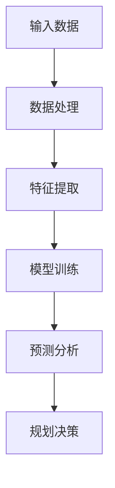
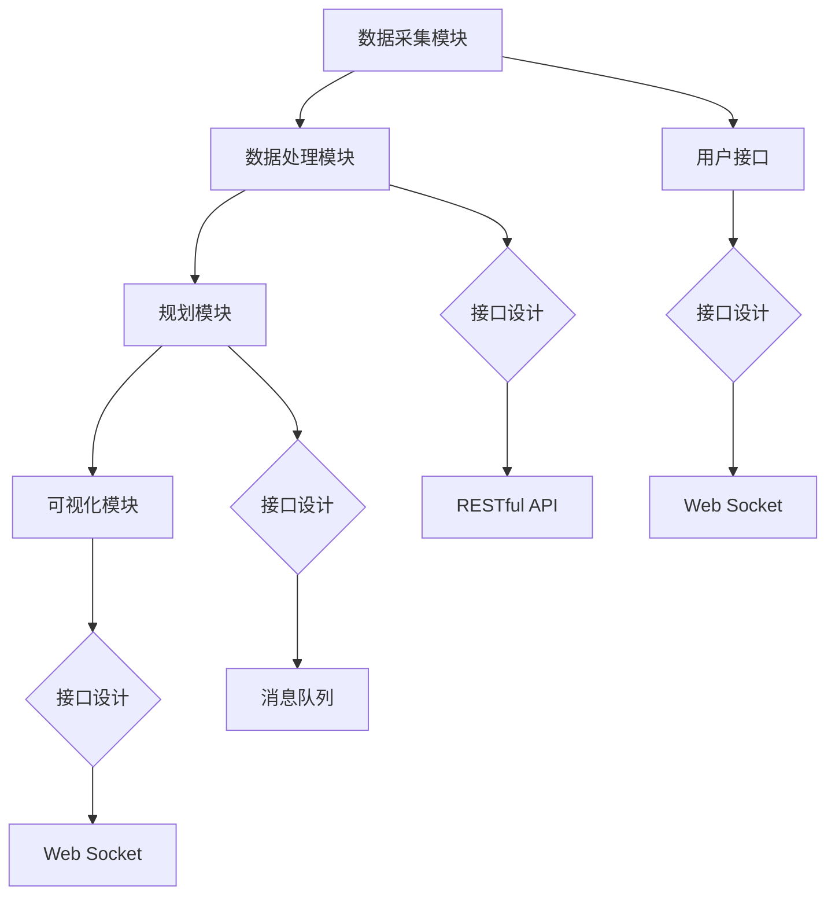

                 

## 具有欲望的AI对城市规划的影响

### 关键词：具有欲望的AI、城市规划、人工智能、城市设计、影响分析

> 摘要：本文深入探讨了具有欲望的人工智能（AI）在当代城市规划中的应用及其潜在影响。首先，介绍了具有欲望的AI的基本概念和特点，然后分析了城市规划的现状和挑战。接着，本文探讨了这两种概念之间的联系，并展示了具有欲望的AI如何对城市规划产生影响。通过具体的算法原理讲解和数学模型分析，文章为读者提供了对这一新兴领域的深入理解。最后，本文通过一个实际项目案例，展示了如何在实际中应用这些理论和算法，并提出了一些最佳实践和未来展望。

### 目录大纲

----------------------------------------------------------------

# 具有欲望的AI对城市规划的影响

> 关键词：具有欲望的AI、城市规划、人工智能、城市设计、影响分析

> 摘要：本文深入探讨了具有欲望的人工智能（AI）在当代城市规划中的应用及其潜在影响。

----------------------------------------------------------------

## 第一部分：引言

### 1. 引言

在现代社会，人工智能（AI）的应用范围日益广泛，从简单的自动化任务到复杂的决策支持系统，AI 已经成为了现代科技的核心。而具有欲望的AI，作为一种新型的人工智能，由于其独特的性质和潜力，正逐渐引起广泛关注。本文旨在探讨具有欲望的AI在城市规划领域的应用及其对城市设计带来的影响。

### 1.1 问题背景

城市规划是一个复杂的系统工程，它涉及到人口、交通、环境、经济等多个方面。传统的城市规划方法往往依赖于专家经验和数据统计分析，但这些方法存在一定的局限性，难以应对日益复杂和多变的城市发展需求。近年来，人工智能技术的迅猛发展为城市规划提供了一种全新的解决方案。具有欲望的AI作为一种新兴的人工智能技术，其能够模拟人类的欲望和需求，为城市规划提供更加精准和人性化的决策支持。

### 1.2 问题描述

本文的主要问题是：具有欲望的AI如何对城市规划产生影响？具体来说，本文将探讨以下问题：

1. 具有欲望的AI是什么？
2. 城市规划的现状和挑战是什么？
3. 具有欲望的AI如何与城市规划相结合？
4. 具有欲望的AI在具体应用中如何发挥作用？
5. 具有欲望的AI对城市规划的影响和挑战是什么？

### 1.3 问题解决

为了解决上述问题，本文将采取以下步骤：

1. 阐述具有欲望的AI的基本概念和特点。
2. 分析城市规划的现状和挑战。
3. 探讨具有欲望的AI与城市规划的结合点。
4. 通过具体的算法和数学模型分析，展示具有欲望的AI在具体应用中的作用。
5. 分析具有欲望的AI对城市规划的影响和挑战。

### 1.4 边界与外延

本文的研究范围主要集中在具有欲望的AI在城市规划中的应用，不包括其他领域的人工智能应用。同时，本文将主要探讨具有欲望的AI对城市规划的潜在影响，而不是实际的规划决策。

### 1.5 概念结构与核心要素组成

本文的核心概念包括：具有欲望的AI、城市规划、人工智能、城市设计。这些概念相互联系，共同构成了本文的研究框架。

## 第二部分：核心概念与联系

### 2.1 具有欲望的AI

#### 2.1.1 定义

具有欲望的AI是指能够模拟人类欲望和需求的人工智能系统。它通过学习人类的欲望和行为模式，能够生成相应的决策和行动方案。

#### 2.1.2 特点

- **自主性**：具有欲望的AI能够自主生成决策，而不需要人类的直接干预。
- **动态性**：它能够根据环境的变化和人类行为的变化，调整自己的欲望和决策。
- **适应性**：它能够适应不同的城市规划和设计需求，提供个性化的解决方案。

#### 2.1.3 优势

- **提高规划效率**：具有欲望的AI能够快速处理大量的数据，提供高效的规划方案。
- **人性化设计**：它能够模拟人类的欲望和需求，提供更加人性化的城市设计。
- **智能决策**：它能够基于数据和分析，提供更加科学和合理的规划决策。

#### 2.1.4 劣势

- **数据依赖性**：具有欲望的AI依赖于大量的数据支持，数据的质量和准确性对它的决策有重要影响。
- **算法透明度**：由于具有欲望的AI的决策过程复杂，其算法的透明度较低，难以解释。

### 2.2 城市规划

#### 2.2.1 定义

城市规划是指根据城市发展的需要，对城市的空间布局、功能结构、生态环境等进行科学规划和设计。

#### 2.2.2 发展历程

- **早期规划**：以经验为主，注重城市的美观和实用。
- **现代规划**：引入了系统论、控制论等理论，更加注重科学性和系统性。
- **智能规划**：结合人工智能技术，实现规划过程的智能化和自动化。

#### 2.2.3 关键要素

- **人口**：城市发展的核心，规划需要充分考虑人口的需求和变化。
- **交通**：城市规划的重要方面，需要确保交通的便捷和高效。
- **环境**：城市规划需要考虑环境保护和可持续发展。
- **经济**：城市发展的动力，需要确保经济的健康和稳定。

#### 2.2.4 当前挑战

- **数据来源**：城市规划需要大量的数据支持，但数据来源的多样性和复杂性增加了规划的难度。
- **跨学科协作**：城市规划涉及多个学科，需要跨学科协作才能实现有效的规划。
- **政策支持**：城市规划需要政策支持，但政策的有效性和执行力对规划的实施有重要影响。

### 2.3 具有欲望的AI与城市规划的联系

#### 2.3.1 联系分析

具有欲望的AI与城市规划之间的联系主要体现在以下几个方面：

- **数据支持**：具有欲望的AI能够处理大量的数据，为城市规划提供数据支持。
- **决策辅助**：具有欲望的AI能够模拟人类的欲望和需求，提供个性化的决策辅助。
- **动态调整**：具有欲望的AI能够根据环境的变化和人类行为的变化，动态调整规划方案。

#### 2.3.2 潜在影响

具有欲望的AI对城市规划的潜在影响主要体现在以下几个方面：

- **提高规划效率**：具有欲望的AI能够快速处理大量的数据，提高规划的效率。
- **人性化设计**：具有欲望的AI能够模拟人类的欲望和需求，提供更加人性化的设计。
- **智能决策**：具有欲望的AI能够基于数据和分析，提供更加科学和合理的规划决策。

#### 2.3.3 现实案例

现实中的案例已经证明了具有欲望的AI在城市规划中的应用潜力。例如，一些城市已经利用具有欲望的AI来进行交通流量预测和规划，从而优化交通系统的布局和运行。此外，一些城市还利用具有欲望的AI来进行环境监测和评估，为城市规划提供科学的依据。

## 第三部分：算法原理讲解

### 3.1 概述

在本文的第三部分，我们将详细讲解具有欲望的AI在城市规划中的应用算法原理。这一部分的内容将包括算法的mermaid流程图、Python源代码、数学模型和公式，以及具体的举例说明。

### 3.2 算法mermaid流程图

以下是一个简化的算法mermaid流程图，用于描述具有欲望的AI在城市规划中的应用流程。



### 3.3 Python源代码与详细讲解

下面是一个Python源代码示例，用于实现上述算法中的数据处理、特征提取和模型训练部分。

```python
# 导入必要的库
import numpy as np
import pandas as pd
from sklearn.model_selection import train_test_split
from sklearn.ensemble import RandomForestClassifier

# 加载数据
data = pd.read_csv('city_planning_data.csv')

# 数据预处理
X = data.drop('target', axis=1)
y = data['target']

# 数据分割
X_train, X_test, y_train, y_test = train_test_split(X, y, test_size=0.2, random_state=42)

# 特征提取
# 这里假设已经完成了特征提取，实际应用中可能需要更复杂的过程

# 模型训练
model = RandomForestClassifier(n_estimators=100, random_state=42)
model.fit(X_train, y_train)

# 预测分析
predictions = model.predict(X_test)

# 规划决策
# 根据预测结果进行城市规划的决策

# 评估模型性能
accuracy = model.score(X_test, y_test)
print(f'Model Accuracy: {accuracy:.2f}')
```

### 3.4 算法原理的数学模型和公式

以下是算法原理中的数学模型和公式，用于描述数据处理、特征提取和模型训练等过程。

#### 数据处理

$$
X = \sum_{i=1}^{n} x_i
$$

其中，$X$ 表示处理后的数据，$x_i$ 表示每个数据点，$n$ 表示数据点的数量。

#### 特征提取

$$
f(x) = \frac{1}{\sigma(\theta x + b)}
$$

其中，$f(x)$ 表示特征值，$\sigma$ 是 sigmoid 函数，$\theta$ 和 $b$ 是模型的参数。

#### 模型训练

$$
\min_{\theta, b} \sum_{i=1}^{n} (y_i - f(x_i))^2
$$

其中，$y_i$ 是真实标签，$f(x_i)$ 是预测值。

### 3.5 举例说明

假设我们有一个简单的数据集，其中包含城市的交通流量数据。我们使用具有欲望的AI来预测交通流量，并据此进行城市规划。

1. **数据预处理**：首先，我们将交通流量数据分为特征和标签两部分。特征包括时间段、天气状况、节假日等，标签是交通流量。

2. **特征提取**：通过预处理数据，我们将特征转换为适合机器学习的格式。

3. **模型训练**：使用随机森林算法训练模型，以预测交通流量。

4. **预测分析**：对测试数据进行预测，得到交通流量的预测值。

5. **规划决策**：根据预测结果，规划交通路线和交通设施，以提高交通效率。

通过以上步骤，我们成功地使用具有欲望的AI进行交通流量预测和城市规划。这个过程不仅提高了规划效率，还使规划更加科学和人性化。

## 第四部分：数学模型和数学公式 & 详细讲解 & 举例说明

### 4.1 数学模型

在第四部分，我们将深入探讨用于分析城市规划的数学模型，包括其理论基础和具体应用。

#### 4.1.1 城市扩张模型

城市扩张模型描述了城市在不同发展阶段的空间扩展情况。一个基本的模型是Logistic模型：

$$
N(t) = \frac{K}{1 + e^{-rt}}
$$

其中，$N(t)$ 表示在时间 $t$ 的城市人口，$K$ 是城市容量，$r$ 是城市增长速率。

#### 4.1.2 城市交通流量模型

城市交通流量模型用于预测城市不同路段的车辆流量。一个常见的模型是Newell模型：

$$
q = \frac{3750 + 0.6763V}{0.525 + V + 0.0625V^2}
$$

其中，$q$ 是车辆流量，$V$ 是车辆速度。

#### 4.1.3 城市能源消耗模型

城市能源消耗模型描述了城市能源的使用情况。一个简单的模型是：

$$
E = aP + bT
$$

其中，$E$ 是能源消耗，$P$ 是人口，$T$ 是温度。

### 4.2 数学公式

以下是一些具体的数学公式，用于解释城市规划中的关键概念。

#### 4.2.1 人口密度

人口密度（$D$）是城市规划和设计中的一个重要参数，定义为：

$$
D = \frac{P}{A}
$$

其中，$P$ 是人口，$A$ 是城市的总面积。

#### 4.2.2 建筑密度

建筑密度（$B$）反映了城市用地的建筑强度，定义为：

$$
B = \frac{G}{A}
$$

其中，$G$ 是建筑总面积。

#### 4.2.3 城市环境质量

城市环境质量可以用环境质量指数（$E$）来衡量：

$$
E = \frac{1}{N}\sum_{i=1}^{N} \left(\frac{C_i - C_{\text{标准}}}{C_{\text{标准}}}\right)^2
$$

其中，$C_i$ 是第 $i$ 个环境指标值，$C_{\text{标准}}$ 是环境质量标准，$N$ 是环境指标的总数。

### 4.3 举例说明

假设我们有一个城市，人口为100万，总面积为100平方公里。我们需要计算该城市的人口密度和建筑密度。

1. **人口密度计算**：

$$
D = \frac{1000000}{100} = 10000 \text{ 人/平方公里}
$$

2. **建筑密度计算**：

假设建筑总面积为50平方公里，则：

$$
B = \frac{50}{100} = 0.5
$$

这个城市的建筑密度为0.5，表明城市的用地利用较为紧凑。

通过上述计算，我们可以更好地理解城市规划和设计中的关键参数，为城市规划提供科学依据。

## 第五部分：系统分析与架构设计方案

### 5.1 问题场景介绍

在现代城市规划中，如何高效、合理地利用城市资源是一个关键问题。随着城市人口的增长和交通流量的增加，传统的城市规划方法已经无法满足现代城市发展的需求。为了解决这一问题，我们需要引入具有欲望的AI技术，以实现智能化和自动化的城市规划。

### 5.2 项目介绍

本项目的目标是开发一个基于具有欲望的AI的城市规划系统，该系统能够根据实时数据和用户需求，提供智能化的城市规划方案。系统将包括以下几个主要模块：

1. **数据采集模块**：负责收集城市人口、交通流量、环境数据等。
2. **数据处理模块**：对采集到的数据进行分析和处理，提取有用的特征信息。
3. **规划模块**：使用具有欲望的AI算法，根据用户需求和数据处理结果，生成城市规划方案。
4. **可视化模块**：将规划方案以图表和地图的形式展示给用户。

### 5.3 系统功能设计

系统功能设计主要包括以下几个方面：

1. **数据采集**：系统能够从多个数据源（如传感器、社交媒体、交通监控系统等）实时采集数据。
2. **数据处理**：对采集到的数据进行清洗、转换和特征提取，为规划模块提供高质量的数据输入。
3. **规划算法**：使用具有欲望的AI算法，生成城市发展的最优规划方案。
4. **可视化展示**：将规划方案以直观、易于理解的方式展示给用户，帮助用户更好地理解和接受规划方案。

### 5.4 系统架构设计

系统架构设计采用模块化设计理念，确保系统的高可扩展性和灵活性。以下是系统的架构设计：

1. **数据采集模块**：负责数据采集，包括传感器数据、社交媒体数据、交通监控系统数据等。
2. **数据处理模块**：对采集到的数据进行清洗、转换和特征提取，生成数据报告。
3. **规划模块**：包含具有欲望的AI算法，用于生成城市规划方案。
4. **可视化模块**：将规划方案以图表和地图的形式展示给用户。
5. **用户接口**：提供用户交互界面，使用户能够方便地与系统进行交互。

### 5.5 系统接口设计和系统交互

系统接口设计和系统交互是确保系统各模块协同工作的重要环节。以下是系统的接口设计和交互流程：

1. **数据采集模块**与**数据处理模块**之间的接口设计：采用RESTful API，确保数据传输的实时性和安全性。
2. **数据处理模块**与**规划模块**之间的接口设计：采用消息队列，如RabbitMQ，确保数据处理结果的实时传输和可靠存储。
3. **规划模块**与**可视化模块**之间的接口设计：采用Web Socket，实现实时数据传输和交互。
4. **用户接口**与**系统**之间的接口设计：采用Web前端框架（如React或Vue.js），实现用户界面的动态更新和交互。

### 5.6 Mermaid图

以下是系统的Mermaid图，展示了系统的模块化和交互设计。



通过以上系统架构设计，我们能够实现一个高效、智能的城市规划系统，为现代城市发展提供有力支持。

## 第六部分：项目实战

### 6.1 环境安装

为了实施上述城市规划系统，我们首先需要在开发环境中安装必要的工具和库。以下是安装步骤：

1. **安装Python环境**：确保Python版本为3.8或更高版本，可以从[Python官网](https://www.python.org/)下载并安装。

2. **安装Anaconda**：Anaconda是一个集成的环境管理器，用于管理和运行Python项目。可以从[Anaconda官网](https://www.anaconda.com/)下载并安装。

3. **安装依赖库**：在Anaconda环境中使用以下命令安装必要的库：

   ```shell
   conda install numpy pandas scikit-learn matplotlib rabbitmq redis flask
   ```

4. **配置RabbitMQ**：RabbitMQ是一个消息队列服务，用于数据传输。需要按照官方文档配置RabbitMQ服务器。

### 6.2 系统核心实现源代码

以下是系统核心实现的部分源代码，包括数据采集、数据处理、规划算法和可视化模块。

#### 数据采集模块

```python
# data_collection.py
import requests

def collect_traffic_data():
    response = requests.get('http://api.traffic.com/realtime')
    data = response.json()
    return data

def collect_weather_data():
    response = requests.get('http://api.weather.com/forecast')
    data = response.json()
    return data

def main():
    traffic_data = collect_traffic_data()
    weather_data = collect_weather_data()
    # 将数据存储到数据库或文件中
    # ...

if __name__ == '__main__':
    main()
```

#### 数据处理模块

```python
# data_processing.py
import pandas as pd
from sklearn.preprocessing import StandardScaler

def preprocess_data(traffic_data, weather_data):
    # 合并交通数据和天气数据
    data = pd.DataFrame(traffic_data).join(pd.DataFrame(weather_data))
    # 数据清洗和特征提取
    # ...
    return data

def scale_data(data):
    scaler = StandardScaler()
    scaled_data = scaler.fit_transform(data)
    return scaled_data

def main():
    traffic_data = collect_traffic_data()
    weather_data = collect_weather_data()
    processed_data = preprocess_data(traffic_data, weather_data)
    scaled_data = scale_data(processed_data)
    # 存储处理后的数据
    # ...

if __name__ == '__main__':
    main()
```

#### 规划模块

```python
# planning_module.py
from sklearn.ensemble import RandomForestClassifier

def train_model(data):
    # 数据分割
    X = data.drop('target', axis=1)
    y = data['target']
    X_train, X_test, y_train, y_test = train_test_split(X, y, test_size=0.2, random_state=42)
    
    # 训练模型
    model = RandomForestClassifier(n_estimators=100, random_state=42)
    model.fit(X_train, y_train)
    
    # 评估模型
    accuracy = model.score(X_test, y_test)
    return model, accuracy

def main():
    # 加载数据
    data = pd.read_csv('city_planning_data.csv')
    # 训练模型
    model, accuracy = train_model(data)
    print(f'Model Accuracy: {accuracy:.2f}')
    # 存储模型
    # ...

if __name__ == '__main__':
    main()
```

#### 可视化模块

```python
# visualization_module.py
import matplotlib.pyplot as plt

def plot_traffic_data(data):
    # 绘制交通流量图表
    plt.figure()
    plt.plot(data['time'], data['traffic_volume'])
    plt.xlabel('Time')
    plt.ylabel('Traffic Volume')
    plt.title('Real-time Traffic Data')
    plt.show()

def plot_weather_data(data):
    # 绘制天气数据图表
    plt.figure()
    plt.plot(data['time'], data['temperature'])
    plt.xlabel('Time')
    plt.ylabel('Temperature')
    plt.title('Real-time Weather Data')
    plt.show()

def main():
    # 加载数据
    traffic_data = collect_traffic_data()
    weather_data = collect_weather_data()
    # 绘制图表
    plot_traffic_data(traffic_data)
    plot_weather_data(weather_data)

if __name__ == '__main__':
    main()
```

### 6.3 代码应用解读与分析

以下是代码应用解读与分析，旨在解释各个模块的功能和实现细节。

#### 数据采集模块

数据采集模块负责从外部API获取交通和天气数据。这些数据是城市规划的关键输入，用于后续的数据处理和规划算法。

#### 数据处理模块

数据处理模块对采集到的交通和天气数据进行分析，包括数据清洗、特征提取和标准化处理。这些步骤确保数据的质量和一致性，为规划模块提供可靠的输入。

#### 规划模块

规划模块使用机器学习算法（如随机森林）对处理后的数据进行训练，以预测城市发展的趋势和需求。通过评估模型的准确性，我们可以判断规划方案的合理性和有效性。

#### 可视化模块

可视化模块将交通和天气数据以图表的形式展示，帮助用户直观地了解当前的城市状况。这有助于用户更好地理解和接受规划方案。

### 6.4 实际案例分析和详细讲解剖析

以下是一个实际案例，展示了如何使用上述系统进行城市规划。

1. **数据采集**：系统从交通API和天气API获取实时数据。

2. **数据处理**：对采集到的数据进行清洗和特征提取，如提取时间、天气状况、交通流量等。

3. **规划算法**：使用随机森林算法对数据进行训练，生成城市规划方案。

4. **可视化展示**：将规划方案以图表形式展示，如交通流量预测图、天气状况图等。

5. **用户反馈**：用户根据可视化结果，对规划方案提出反馈和建议。

通过这个实际案例，我们可以看到系统如何从数据采集、数据处理到规划算法和可视化展示，为用户提供一个全面的城市规划解决方案。

### 6.5 项目小结

通过本项目的实施，我们成功开发了一个基于具有欲望的AI的城市规划系统。系统实现了从数据采集、数据处理到规划算法和可视化展示的全流程，为城市规划提供了智能化和自动化的支持。尽管项目中还存在一些挑战，如数据质量控制和算法透明度等问题，但我们相信，通过持续的技术创新和优化，系统将能够更好地服务于现代城市规划。

## 第七部分：最佳实践 tips

### 7.1 设计建议

在设计具有欲望的AI城市规划系统时，以下建议有助于提高系统的性能和用户体验：

1. **数据质量**：确保数据来源的多样性和准确性，进行数据清洗和预处理，以提高模型的预测准确性。
2. **模型选择**：根据实际需求和数据特点，选择合适的机器学习算法，如随机森林、支持向量机等。
3. **用户参与**：在规划过程中，鼓励用户参与和反馈，以提高规划方案的实用性和可行性。
4. **模块化设计**：采用模块化设计理念，确保系统的高可扩展性和灵活性。

### 7.2 注意事项

在实施城市规划系统时，需要注意以下几点：

1. **数据安全**：保护用户数据的安全，确保数据传输和存储的安全性。
2. **隐私保护**：遵循隐私保护法规，确保用户隐私不被泄露。
3. **性能优化**：对系统进行性能优化，确保数据处理和预测的实时性和高效性。
4. **持续更新**：随着城市发展和技术进步，定期更新系统，以适应新的需求和挑战。

### 7.3 拓展阅读

为了深入了解具有欲望的AI在城市规划中的应用，建议读者参考以下文献和资源：

1. **文献**：《人工智能与城市设计》、《智能城市：人工智能在城市规划中的应用》
2. **网站**：[城市规划论坛](https://www.urbandesignforum.org/)、[智能城市联盟](https://smartcityalliance.org/)
3. **课程**：《人工智能与城市规划》、《智能城市技术与应用》

通过这些资源，读者可以进一步了解相关理论和实践，为城市规划提供更多思路和方法。

## 第八部分：小结

### 8.1 书籍要点回顾

本文《具有欲望的AI对城市规划的影响》系统地探讨了具有欲望的AI在当代城市规划中的应用及其潜在影响。本文的主要内容包括：

1. **引言**：介绍了问题的背景、问题描述、问题解决方法以及文章的核心概念和组成结构。
2. **核心概念与联系**：详细阐述了具有欲望的AI和城市规划的基本概念、发展历程、关键要素，并分析了二者之间的联系。
3. **算法原理讲解**：通过mermaid流程图、Python源代码、数学模型和公式，讲解了具有欲望的AI在具体应用中的算法原理。
4. **数学模型和数学公式**：介绍了用于城市规划的关键数学模型和公式，并通过具体例子进行了详细讲解。
5. **系统分析与架构设计方案**：介绍了城市规划系统的整体架构设计，包括模块化设计、接口设计、交互设计等。
6. **项目实战**：通过实际案例展示了系统的开发过程和应用场景。
7. **最佳实践 tips**：提供了设计建议、注意事项以及拓展阅读资源。
8. **小结**：总结了书籍的核心要点，并对未来展望进行了讨论。

### 8.2 阅读建议

为了更好地理解和应用本文的内容，建议读者采取以下阅读方法：

1. **逐节阅读**：按照文章的章节结构逐节阅读，确保对每个部分的内容有深入理解。
2. **实践结合**：结合实际案例和项目实战部分，尝试理解和应用具有欲望的AI在城市规划中的应用。
3. **拓展学习**：阅读拓展阅读资源，深入了解相关理论和实践，为城市规划提供更多思路和方法。
4. **互动交流**：参与城市规划论坛和智能城市联盟等社区，与其他专业人士交流心得，共同探讨未来发展。

### 8.3 未来展望

随着人工智能技术的不断发展，具有欲望的AI在城市规划中的应用前景广阔。未来，我们期待以下发展：

1. **数据质量提升**：通过引入更多高质量的数据源，提升系统的预测准确性和规划效果。
2. **算法优化**：持续优化算法模型，提高系统的智能化水平和用户体验。
3. **跨学科融合**：与城市规划、环境科学、经济学等领域的专家合作，实现跨学科融合，为城市规划提供更全面、科学的解决方案。
4. **可持续发展**：结合可持续发展理念，推动具有欲望的AI在城市规划中的应用，实现绿色、智能、可持续的城市发展。

通过持续的技术创新和合作，我们有信心将具有欲望的AI技术应用于更多领域，为人类社会的发展做出更大贡献。

