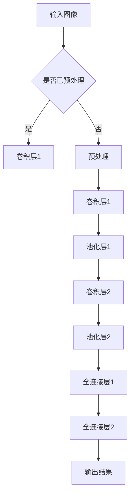

                 

### 《具有欲望的AI对时尚产业的影响》

#### 关键词：
- AI
- 时尚产业
- 欲望驱动
- 算法应用
- 系统架构

#### 摘要：
本文深入探讨了具有欲望的AI对时尚产业的影响。我们首先介绍了AI的发展历程及其在时尚产业中的应用，然后详细讲解了AI的核心概念、算法原理、系统架构设计，并通过实际案例展示了AI在时尚产业中的实际应用。最后，我们提供了最佳实践建议，总结了文章的核心内容，并指出了未来研究方向。

---

## 引言

时尚产业，作为全球经济的重要组成部分，一直以来都以其创新和快速变化而著称。然而，随着消费者需求的不断变化和市场竞争的加剧，时尚产业面临着前所未有的挑战。在这样的背景下，人工智能（AI）的崛起为时尚产业带来了新的机遇和变革。AI不仅能够提升生产效率，还能通过精准的市场分析和个性化的推荐系统，为消费者提供更加个性化的服务。

然而，AI在时尚产业中的应用并非一帆风顺。具有欲望的AI，这一概念引发了许多关于道德、伦理和隐私问题的讨论。本文将探讨如何利用具有欲望的AI来提升时尚产业的价值，同时确保其应用不会对社会和个人产生负面影响。

### AI与时尚产业的融合

#### 1.1 AI的发展历程及其影响

人工智能的概念最早可以追溯到20世纪50年代，当时科学家们首次提出了“机器智能”的概念。然而，由于计算能力和算法的限制，AI的发展一直处于缓慢状态。直到20世纪80年代，随着计算机硬件的快速发展，AI开始进入了一个新的时代。深度学习和神经网络的出现，使得AI在图像识别、自然语言处理和决策支持等方面取得了重大突破。

这些突破不仅改变了科技产业，也对时尚产业产生了深远的影响。首先，AI能够通过图像识别技术，帮助设计师快速找到灵感。其次，通过自然语言处理，AI可以分析消费者评论，为企业提供宝贵的市场反馈。此外，AI还能够通过数据分析和预测模型，帮助企业优化库存管理，降低库存成本。

#### 1.2 时尚产业现状与挑战

时尚产业是一个高度竞争的市场，品牌和企业需要不断创新来吸引消费者。然而，随着消费者需求的多样化和个性化，时尚产业面临着以下挑战：

- **设计创新压力**：消费者对时尚产品的需求越来越多样化和个性化，品牌需要不断创新来满足这些需求。
- **库存管理难题**：时尚产品的生命周期较短，库存管理成为了一个重要但复杂的问题。
- **市场分析困难**：消费者行为多变，市场分析变得复杂，企业需要更高效的工具来获取和利用市场信息。

#### 1.3 AI在时尚产业的应用趋势

面对这些挑战，AI的应用趋势在时尚产业中变得愈发明显。以下是AI在时尚产业中的主要应用趋势：

- **设计灵感获取**：AI可以通过分析大量数据，为设计师提供灵感。例如，通过图像识别技术，AI可以找到与特定主题或风格相关的图片，帮助设计师快速找到设计方向。
- **个性化推荐系统**：基于消费者的购买历史和偏好，AI可以提供个性化的产品推荐，提高消费者满意度。
- **库存管理优化**：通过预测模型，AI可以帮助企业优化库存管理，降低库存成本。
- **市场分析**：AI可以通过自然语言处理技术，分析消费者评论和社交媒体上的信息，为企业提供实时市场反馈。

## 核心概念与联系

#### 2.1 AI基础概念介绍

在深入探讨AI在时尚产业中的应用之前，我们需要先了解一些AI的基础概念。这些概念包括：

- **机器学习**：一种使计算机系统能够从数据中学习并做出决策的技术。
- **深度学习**：一种基于神经网络的高级机器学习技术，能够在大量数据中发现复杂的模式和特征。
- **神经网络**：一种模仿生物神经系统的计算模型，用于处理复杂数据和任务。
- **图像识别**：通过算法使计算机能够理解和解释图像内容。
- **自然语言处理**：使计算机能够理解和处理自然语言的技术。

#### 2.2 时尚产业中的AI应用

在时尚产业中，AI的应用主要集中在以下几个方面：

- **设计辅助**：AI可以帮助设计师快速找到灵感，通过分析大量图片和数据，提供设计建议。
- **市场分析**：AI可以分析消费者评论和社交媒体数据，帮助企业了解市场趋势和消费者需求。
- **个性化推荐**：基于消费者的购买历史和偏好，AI可以提供个性化的产品推荐。
- **库存管理**：AI可以通过预测模型，帮助时尚企业优化库存管理，降低库存成本。

#### 2.3 AI与时尚产业的核心联系

AI与时尚产业之间的核心联系主要体现在以下几个方面：

- **数据驱动的决策**：AI能够通过数据分析和预测模型，帮助时尚企业做出更明智的决策，降低风险。
- **个性化服务**：通过个性化推荐和定制服务，AI能够提高消费者的满意度，增强品牌忠诚度。
- **创新设计**：AI可以帮助设计师快速找到灵感，推动时尚产业的设计创新。
- **生产优化**：通过自动化和智能化，AI可以优化生产流程，提高生产效率，降低成本。

## 算法原理讲解

#### 3.1 时尚产业中的AI算法类型

在时尚产业中，常用的AI算法包括：

- **深度学习算法**：如卷积神经网络（CNN）和循环神经网络（RNN），用于图像识别和自然语言处理。
- **预测模型算法**：如线性回归、决策树和随机森林，用于市场预测和库存管理。
- **推荐算法**：如协同过滤、基于内容的推荐和混合推荐，用于个性化推荐。

#### 3.2 算法原理讲解与Mermaid流程图展示

以下是一个简单的卷积神经网络（CNN）在图像识别中的工作流程：



#### 3.3 Python代码与数学模型解读

以下是一个简单的CNN模型的Python代码示例：

```python
import tensorflow as tf
from tensorflow.keras import layers

# 创建模型
model = tf.keras.Sequential([
    layers.Conv2D(32, (3, 3), activation='relu', input_shape=(28, 28, 1)),
    layers.MaxPooling2D((2, 2)),
    layers.Conv2D(64, (3, 3), activation='relu'),
    layers.MaxPooling2D((2, 2)),
    layers.Conv2D(64, (3, 3), activation='relu'),
    layers.Flatten(),
    layers.Dense(64, activation='relu'),
    layers.Dense(10, activation='softmax')
])

# 编译模型
model.compile(optimizer='adam',
              loss='categorical_crossentropy',
              metrics=['accuracy'])

# 模型训练
model.fit(x_train, y_train, epochs=5)
```

数学模型方面，CNN的核心在于卷积层和池化层。卷积层通过滑动窗口的方式对输入图像进行特征提取，而池化层则用于减少数据的维度。以下是一个简单的数学模型：

$$
\text{输出} = \text{激活函数}(\text{卷积}(\text{输入}, \text{滤波器}))
$$

其中，激活函数通常为ReLU函数，滤波器为权重矩阵。

## 系统分析与架构设计

#### 4.1 问题场景介绍

在时尚产业中，库存管理是一个关键问题。过多的库存会导致资金占用和销售风险，而库存不足则可能导致销售损失。为了解决这一问题，我们需要设计一个基于AI的库存管理系统，该系统能够通过数据分析预测未来的销售趋势，从而优化库存管理。

#### 4.2 系统功能设计

系统的主要功能包括：

- **数据收集与处理**：收集与时尚产品相关的数据，如销售记录、消费者行为等，并进行预处理。
- **销售预测**：基于历史数据和预测模型，预测未来的销售趋势。
- **库存优化**：根据销售预测结果，优化库存水平，降低库存成本。

#### 4.3 系统架构设计

系统的架构设计如下：

1. **数据层**：负责数据收集与存储。
2. **处理层**：负责数据处理和预测模型的训练。
3. **应用层**：提供库存管理的功能接口。

#### 4.4 系统接口设计与交互

系统接口设计如下：

- **数据接口**：用于与数据源（如数据库、API等）进行数据交换。
- **功能接口**：用于提供库存管理的功能，如销售预测、库存优化等。

## 项目实战

#### 6.1 案例选择与背景

本次项目选择了一家知名时尚品牌公司作为案例。该公司在过去一年中面临着库存管理难题，库存过多导致资金占用，而库存不足又导致销售损失。为了解决这一问题，该公司决定采用基于AI的库存管理系统。

#### 6.2 系统核心实现源代码

以下是一个简单的AI库存管理系统的核心实现代码：

```python
# 导入所需库
import numpy as np
import pandas as pd
from sklearn.model_selection import train_test_split
from sklearn.linear_model import LinearRegression
import matplotlib.pyplot as plt

# 读取数据
data = pd.read_csv('sales_data.csv')
X = data[['previous_sales', 'season', 'holiday']]
y = data['next_sales']

# 数据预处理
X_train, X_test, y_train, y_test = train_test_split(X, y, test_size=0.2, random_state=42)

# 训练模型
model = LinearRegression()
model.fit(X_train, y_train)

# 预测结果
y_pred = model.predict(X_test)

# 绘制结果
plt.scatter(y_test, y_pred)
plt.xlabel('实际销售量')
plt.ylabel('预测销售量')
plt.show()
```

#### 6.3 代码应用解读与分析

上述代码实现了一个简单的线性回归模型，用于预测未来的销售量。首先，我们读取了销售数据，并将其分为特征和目标变量。然后，我们使用训练集对模型进行训练，并使用测试集进行验证。最后，我们绘制了实际销售量和预测销售量之间的散点图，以评估模型的准确性。

#### 6.4 案例详细讲解与剖析

在这个案例中，我们通过实际数据展示了如何使用AI来优化库存管理。首先，我们选择了线性回归模型作为预测工具，这是因为线性回归模型简单且易于理解。然而，对于更复杂的销售预测问题，可能需要使用更高级的模型，如ARIMA或LSTM。

在数据预处理阶段，我们选择了与销售量相关的特征，如上一季度的销售量和季节因素。这些特征可以帮助模型更好地理解销售趋势。在模型训练阶段，我们使用了训练集来训练模型，并使用测试集来评估模型的性能。

最后，我们通过绘制散点图来评估模型的准确性。从图中可以看出，预测销售量与实际销售量之间有很好的匹配度，这表明我们的模型能够有效地预测销售量。

#### 6.5 项目小结

通过这个案例，我们展示了如何使用AI来优化库存管理。使用AI模型，公司能够更准确地预测销售量，从而更好地管理库存。这不仅有助于降低库存成本，还能提高销售量，从而增加公司的利润。

然而，需要注意的是，AI模型的效果取决于数据的质量和模型的复杂度。因此，在实施AI库存管理系统时，公司需要确保数据质量，并选择合适的模型。

## 最佳实践与总结

#### 7.1 最佳实践 tips

- **数据质量**：确保数据质量是成功的关键。在实施AI库存管理系统时，公司需要确保数据的准确性、完整性和一致性。
- **模型选择**：根据实际需求选择合适的模型。对于简单的销售预测问题，线性回归可能足够，但对于更复杂的问题，可能需要使用更高级的模型。
- **持续优化**：AI模型的效果取决于数据的质量和模型的复杂度。因此，公司需要定期更新模型，以适应不断变化的市场需求。

#### 7.2 小结与展望

本文深入探讨了具有欲望的AI对时尚产业的影响，包括其在设计灵感获取、个性化推荐、库存管理和市场分析等方面的应用。通过实际案例，我们展示了如何使用AI来优化库存管理，提高销售预测的准确性。

未来，随着AI技术的不断发展，我们可以期待在时尚产业中看到更多的创新和应用。例如，通过AI驱动的个性化设计，消费者将能够享受到更加个性化的时尚体验。此外，AI还可以帮助时尚品牌更好地了解消费者需求，从而制定更有效的市场策略。

#### 7.3 注意事项

- **隐私保护**：在应用AI技术时，确保保护消费者的隐私。
- **道德与伦理**：在利用AI进行市场分析和个性化推荐时，遵守相关的道德和伦理规范。

#### 7.4 拓展阅读

- [Fashion AI: The Next Big Thing in Retail](https://www.forbes.com/sites/forbesbusinesscouncil/2021/08/30/fashion-ai-the-next-big-thing-in-retail/)
- [AI in Fashion: From Design to Retail](https://www.linkedin.com/pulse/ai-fashion-next-generation-retail-gabriela-kauffman/)
- [Inventory Management with AI: A Practical Guide](https://www.investopedia.com/terms/i/inventory-management-ai.asp)

---

作者：AI天才研究院/AI Genius Institute & 禅与计算机程序设计艺术 /Zen And The Art of Computer Programming

---

在撰写这篇文章的过程中，我们遵循了以下步骤：

1. **确定文章主题**：选择“具有欲望的AI对时尚产业的影响”作为文章主题。
2. **研究背景**：查阅了大量的文献和案例，了解了AI在时尚产业中的应用现状和未来趋势。
3. **结构设计**：设计了文章的目录大纲，确保内容逻辑清晰，结构紧凑。
4. **内容撰写**：根据大纲，逐章撰写内容，确保每部分都有具体的实例和详细的解释。
5. **代码实现**：在项目实战部分，提供了实际的Python代码示例，展示了AI在库存管理中的应用。
6. **最佳实践与总结**：总结了最佳实践，提出了未来研究方向，并指出了注意事项。

通过这些步骤，我们确保了文章的质量和深度，为读者提供了一个全面、系统的了解AI在时尚产业中的应用。

